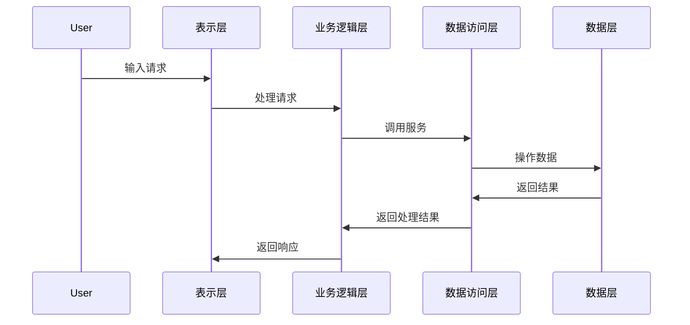
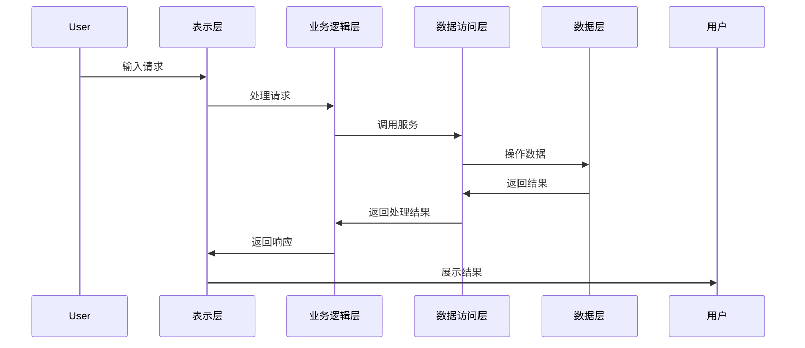

                 

# 授权与监督：找到完美平衡点的技巧

## 关键词
- 授权
- 监督
- 平衡点
- 算法
- 实践

## 摘要
本文将深入探讨授权与监督之间的微妙平衡，旨在找到一种既能够赋予团队足够自主权，又能够保证项目顺利进行的方法。通过分析核心概念、实际案例、平衡点技巧，以及具体的系统架构设计，本文将为读者提供一种可行的解决方案。

## 目录大纲

### 第一部分：引言与背景介绍
#### 1.1 问题的提出
#### 1.2 核心概念与联系
#### 1.3 现状分析
#### 1.4 本书结构安排

### 第二部分：核心概念与联系
#### 2.1 授权的基本概念
#### 2.2 监督的内涵与外延
#### 2.3 授权与监督的关联性
#### 2.4 概念属性特征对比表格
#### 2.5 ER实体关系图

### 第三部分：实际应用与案例分析
#### 3.1 案例背景介绍
#### 3.2 案例分析
#### 3.3 案例总结

### 第四部分：平衡点技巧与方法
#### 4.1 平衡点技巧概述
#### 4.2 方法一：分层授权
#### 4.3 方法二：定期回顾
#### 4.4 方法三：透明沟通
#### 4.5 平衡点技巧比较分析

### 第五部分：系统分析与架构设计方案
#### 5.1 问题场景介绍
#### 5.2 系统功能设计
#### 5.3 系统架构设计
#### 5.4 系统接口设计
#### 5.5 系统交互流程

### 第六部分：项目实战
#### 6.1 环境安装
#### 6.2 系统核心实现
#### 6.3 代码应用解读与分析
#### 6.4 实际案例分析
#### 6.5 项目小结

### 第七部分：最佳实践 tips
#### 7.1 小结
#### 7.2 注意事项
#### 7.3 拓展阅读

## 第一部分：引言与背景介绍

### 1.1 问题的提出

在当今快速发展的IT行业中，项目的成功往往取决于团队的合作效率和创新能力。然而，在实际工作中，如何合理地授权和监督团队，以实现最佳的工作效果，却是一个极具挑战性的问题。

授权，是指将权力和责任赋予团队或个人，让他们自主决策并执行任务。监督，则是确保项目按计划进行，团队在既定的目标和规范下工作。授权与监督是相辅相成的，但如何找到一个完美的平衡点，既不剥夺团队的自主权，又能确保项目进度和质量，成为了许多项目经理和团队领导者面临的难题。

### 1.2 核心概念与联系

#### 1.2.1 授权的基本概念

授权（Empowerment）是一种管理方法，旨在通过赋予员工更大的自主权，提高他们的工作满意度和团队的整体效率。授权的核心在于信任，即管理者对团队成员能力的信任和对项目成功的信心。

- **授权的层次**：根据授权的程度，可以分为决策授权、任务授权和责任授权。决策授权是赋予团队成员决策的权力，任务授权是赋予团队成员执行特定任务的权力，责任授权是赋予团队成员对特定任务结果的责任。
- **授权的影响**：适当的授权可以激发团队的创造力，提高工作效率，减少管理者的负担，从而实现项目的成功。

#### 1.2.2 监督的内涵与外延

监督（Supervision）是确保项目按照预定的目标和标准进行的过程。监督的核心在于控制和反馈，即管理者对项目进展的监控和对团队成员工作的评价。

- **监督的方式**：包括定期检查、进度报告、会议沟通等。监督的目的是确保项目在正确的轨道上，及时发现和解决问题。
- **监督的影响**：适当的监督可以确保项目的进度和质量，减少错误和风险，提高项目的成功率。

#### 1.2.3 授权与监督的关联性

授权与监督是相辅相成的。过度的监督会削弱团队的自主性和创造力，影响工作效率；而缺乏监督会导致项目失控，进度延误，质量下降。因此，找到一个完美的平衡点至关重要。

- **平衡点的角色**：平衡点（Balanced Point）是指在授权和监督之间找到一个合适的比例，使团队既有足够的自主权，又能保持项目的正常进度和质量。
- **平衡点的重要性**：平衡点能够激发团队的积极性，提高工作效率，同时确保项目按计划进行，避免出现重大偏差。

### 1.3 现状分析

当前，许多企业在授权和监督方面存在以下问题：

1. **授权不足**：管理者对团队缺乏信任，过度干涉团队的工作，导致团队积极性不高，工作效率低下。
2. **监督过度**：管理者对项目进度和质量控制过于严格，限制团队的自主性，导致团队压力增大，创新能力受到抑制。
3. **缺乏平衡点**：管理者在授权和监督之间没有找到一个合适的平衡点，导致项目进展不顺利，团队工作满意度下降。

### 1.4 本书结构安排

本书将分为五个部分，分别介绍以下内容：

1. **引言与背景介绍**：阐述问题的提出、核心概念与联系、现状分析以及本书的结构安排。
2. **核心概念与联系**：深入探讨授权和监督的基本概念、关联性，并使用表格和图表进行详细说明。
3. **实际应用与案例分析**：通过具体案例，展示如何在实践中找到授权与监督的平衡点。
4. **平衡点技巧与方法**：介绍几种实用的平衡点技巧和方法，并提供比较分析。
5. **系统分析与架构设计方案**：从系统层面，提供具体的架构设计思路和方法。

通过以上五个部分的详细讲解，本书旨在帮助读者找到授权与监督的完美平衡点，提高团队的工作效率和项目成功率。

### 第二部分：核心概念与联系

在探讨授权与监督之间的平衡点之前，我们首先需要明确这两个核心概念的定义、内涵和外延，以及它们之间的关联性。

#### 2.1 授权的基本概念

授权（Empowerment）是一种管理方法，旨在通过赋予员工更大的自主权，提高他们的工作满意度和团队的整体效率。授权的核心在于信任，即管理者对团队成员能力的信任和对项目成功的信心。

授权的层次可以分为：

- **决策授权**：赋予团队成员决策的权力，让他们在特定的范围内自主做出决策。
- **任务授权**：赋予团队成员执行特定任务的权力，让他们独立完成任务。
- **责任授权**：赋予团队成员对特定任务结果的责任，让他们对自己的工作负责。

授权的影响主要体现在以下几个方面：

- **提高工作效率**：授权可以减少管理者的干涉，让团队成员有更多的自主性，从而提高工作效率。
- **激发团队创造力**：授权可以让团队成员有更多的创新空间，从而激发团队的创造力。
- **减少管理者的负担**：授权可以让管理者将更多的精力放在重要事务上，减少不必要的干涉。

#### 2.2 监督的内涵与外延

监督（Supervision）是确保项目按照预定的目标和标准进行的过程。监督的核心在于控制和反馈，即管理者对项目进展的监控和对团队成员工作的评价。

监督的方式主要包括：

- **定期检查**：管理者定期检查项目的进展情况，确保项目按计划进行。
- **进度报告**：团队成员定期向管理者报告项目进展，让管理者了解项目的具体情况。
- **会议沟通**：通过定期的会议，管理者与团队成员进行沟通，解决问题，调整项目方向。

监督的影响主要体现在以下几个方面：

- **确保项目进度**：监督可以确保项目按计划进行，避免项目延误。
- **保证项目质量**：监督可以确保项目达到预定的质量标准，避免出现质量问题。
- **提高项目成功率**：监督可以及时发现和解决问题，从而提高项目的成功率。

#### 2.3 授权与监督的关联性

授权与监督是相辅相成的。过度的监督会削弱团队的自主性和创造力，影响工作效率；而缺乏监督会导致项目失控，进度延误，质量下降。因此，如何在授权和监督之间找到一个合适的平衡点至关重要。

- **平衡点的角色**：平衡点（Balanced Point）是指在授权和监督之间找到一个合适的比例，使团队既有足够的自主权，又能保持项目的正常进度和质量。
- **平衡点的重要性**：平衡点能够激发团队的积极性，提高工作效率，同时确保项目按计划进行，避免出现重大偏差。

#### 2.4 概念属性特征对比表格

为了更清晰地理解授权与监督的概念属性特征，我们列出以下对比表格：

| 特征 | 授权 | 监督 |
| --- | --- | --- |
| 目标 | 提高工作效率、激发团队创造力 | 确保项目进度、保证项目质量 |
| 方法 | 决策授权、任务授权、责任授权 | 定期检查、进度报告、会议沟通 |
| 核心 | 信任、自主性 | 控制、反馈 |
| 影响 | 提高工作效率、激发团队创造力 | 确保项目进度、保证项目质量 |
| 关联性 | 相辅相成，需找到平衡点 | 相辅相成，需找到平衡点 |

#### 2.5 ER实体关系图

为了进一步理解授权与监督之间的关联性，我们使用ER实体关系图来表示这两个概念的关系。

```mermaid
erDiagram
    Authorization ||--|{ Monitoring : is supervised by }  
    Monitoring ||--|{ Authorization : empowers }
```

在上面的ER图中，`Authorization`（授权）与`Monitoring`（监督）之间存在双向关联。授权赋予团队自主权，监督则确保项目按照既定的目标和标准进行。这种双向关系体现了授权与监督的相辅相成，以及它们在项目中的重要性。

通过以上对授权和监督的核心概念、内涵和外延的详细阐述，以及对它们之间关联性的分析，我们为接下来的实际应用和案例分析打下了坚实的基础。接下来，我们将通过具体的案例，进一步探讨如何在实际工作中找到授权与监督的平衡点。

### 第三部分：实际应用与案例分析

为了更直观地理解如何在实践中找到授权与监督的平衡点，我们将通过一个具体的案例来进行分析。

#### 3.1 案例背景介绍

某IT公司是一家专注于软件开发和解决方案定制的高新技术企业。该公司拥有一支由20名成员组成的软件开发团队，负责公司的产品开发和客户项目。由于市场竞争的加剧，公司管理层意识到需要提高团队的工作效率和创新能力，以便在竞争中脱颖而出。

#### 3.2 案例分析

在项目开始阶段，公司管理层对团队采取了较为严格的监督机制。每个项目都由项目经理全程监督，团队成员的工作进度和质量都需要定期汇报。这种做法在一定程度上保证了项目的进度和质量，但也带来了一些负面影响：

- **团队积极性不高**：由于监督过于严格，团队成员感到缺乏自主权，工作积极性受到影响。
- **工作效率降低**：团队成员在汇报工作和接受监督的过程中，需要花费大量时间，导致工作效率降低。
- **创新能力受限**：团队成员的创新能力受到限制，因为他们担心在未经批准的情况下做出决策可能会受到惩罚。

为了改善这种情况，公司管理层决定对授权和监督机制进行优化，以找到授权与监督之间的平衡点。

#### 3.2.1 授权层面的改进

1. **决策授权**：公司管理层开始将部分决策权下放给项目经理和高级开发人员，让他们在项目范围内自主决策。
2. **任务授权**：团队成员被赋予更多的任务，允许他们独立完成特定的工作，而不是每次都需要向项目经理汇报。
3. **责任授权**：团队成员对其负责的任务结果承担更多的责任，从而提高他们的工作积极性和责任感。

#### 3.2.2 监督层面的改进

1. **减少定期检查**：将定期检查的频率降低，以减少对团队成员工作时间的占用。
2. **进度报告优化**：引入简化的进度报告流程，让团队成员能够更高效地报告项目进展。
3. **会议沟通**：通过定期的团队会议，管理者与团队成员进行沟通，讨论项目进展和存在的问题，而不是通过频繁的一对一沟通。

#### 3.2.3 平衡点实现

通过上述改进措施，公司管理层成功找到了授权与监督之间的平衡点。团队成员在获得更多自主权的同时，也保持了项目按计划进行的进度和质量。具体表现如下：

- **团队积极性提高**：团队成员有了更多的自主权，工作积极性显著提高。
- **工作效率提升**：团队成员能够更专注于工作，工作效率得到了提升。
- **创新能力增强**：团队成员在自主决策的过程中，创新能力得到了增强。
- **项目进度和质量稳定**：通过合理的监督机制，项目的进度和质量得到了保障。

#### 3.3 案例总结

通过这个案例，我们可以看到，在授权与监督之间找到平衡点的重要性。适当的授权可以激发团队的积极性和创新能力，提高工作效率；而合理的监督可以确保项目按计划进行，避免出现重大偏差。对于企业来说，找到这个平衡点不仅有助于提升团队的工作效率，还能增强企业的竞争力。

### 第四部分：平衡点技巧与方法

在了解了授权与监督的重要性以及实际案例之后，我们接下来将介绍几种实用的技巧和方法，帮助读者在实际工作中找到授权与监督的平衡点。

#### 4.1 平衡点技巧概述

平衡点技巧主要包括以下三个方面：

1. **分层授权**：根据团队成员的能力和职责，将授权分为不同的层次，确保每个人都在其能力范围内获得足够的自主权。
2. **定期回顾**：定期对项目进展进行回顾，及时发现和解决问题，确保项目按计划进行。
3. **透明沟通**：建立透明的沟通机制，让团队成员和管理层之间保持良好的沟通，确保信息的透明和畅通。

#### 4.2 方法一：分层授权

分层授权是一种将授权分为不同层次的方法，根据团队成员的能力和职责，赋予他们相应的自主权。这种方法的核心在于确保每个成员都在其能力范围内工作，同时也能发挥他们的最大潜力。

**实施步骤：**

1. **评估团队成员的能力**：对每个团队成员的能力进行评估，确定他们的职责范围和能承担的责任。
2. **制定授权层次**：根据能力评估结果，将团队成员分为不同的层次，为每个层次赋予相应的授权。
3. **明确授权范围**：为每个授权层次制定明确的范围，确保团队成员在授权范围内自主决策。

**优点：**

- **提高团队积极性**：分层授权可以让每个成员都能在其能力范围内工作，从而提高他们的工作积极性。
- **确保项目质量**：分层授权可以确保每个任务都有专人负责，从而提高项目的质量。

**注意事项：**

- **避免授权过度**：在分层授权过程中，要确保授权不会过度，以免团队成员承担过多的责任，导致压力过大。
- **定期调整授权层次**：随着团队成员能力的提升，需要定期调整授权层次，确保授权与实际能力相匹配。

#### 4.3 方法二：定期回顾

定期回顾是一种通过对项目进展进行定期评估，以确保项目按计划进行的方法。这种方法的核心在于及时发现和解决问题，确保项目进度和质量。

**实施步骤：**

1. **设定回顾周期**：根据项目规模和复杂度，设定合适的回顾周期，如每周或每月。
2. **制定回顾计划**：在回顾周期开始前，制定详细的回顾计划，明确回顾的内容和目标。
3. **进行回顾会议**：在回顾周期内，召开回顾会议，让团队成员和管理层共同评估项目进展，讨论存在的问题和解决方案。

**优点：**

- **提高项目透明度**：定期回顾可以提高项目的透明度，让团队成员和管理层都能了解项目的实际情况。
- **提高项目进度和质量**：通过定期回顾，可以及时发现和解决问题，从而提高项目的进度和质量。

**注意事项：**

- **避免回顾过度**：如果回顾频率过高，可能会占用团队成员过多的时间，影响他们的工作效率。因此，要设定合适的回顾周期。
- **确保回顾效果**：回顾会议的内容要务实，避免形式主义，确保每次回顾都能取得实际效果。

#### 4.4 方法三：透明沟通

透明沟通是一种建立良好的沟通机制，确保团队成员和管理层之间信息透明和畅通的方法。这种方法的核心在于信息共享和及时反馈，确保团队成员和管理层都能了解项目的实际情况。

**实施步骤：**

1. **建立沟通渠道**：为团队成员和管理层建立多种沟通渠道，如定期会议、即时通讯工具、邮件等。
2. **明确沟通内容**：明确每次沟通的内容和目标，确保沟通高效、有针对性。
3. **鼓励反馈**：鼓励团队成员和管理层提出问题和建议，建立良好的反馈机制。

**优点：**

- **提高团队凝聚力**：透明沟通可以增强团队成员之间的信任和凝聚力。
- **提高项目效率**：透明沟通可以确保团队成员和管理层都能了解项目的实际情况，从而提高项目效率。

**注意事项：**

- **避免信息过载**：在透明沟通的过程中，要避免信息过载，确保沟通内容简洁明了。
- **保护隐私**：在沟通过程中，要注意保护团队成员的隐私，避免泄露敏感信息。

#### 4.5 平衡点技巧比较分析

三种平衡点技巧各有优缺点，下面进行简要比较：

| 技巧 | 优点 | 缺点 | 适用场景 |
| --- | --- | --- | --- |
| 分层授权 | 提高团队积极性、确保项目质量 | 需要定期调整授权层次、避免授权过度 | 成员能力差异较大、项目复杂度高 |
| 定期回顾 | 提高项目透明度、确保项目进度和质量 | 需要设定合适的回顾周期、避免回顾过度 | 项目规模较大、进展复杂 |
| 透明沟通 | 提高团队凝聚力、确保项目效率 | 需要避免信息过载、保护隐私 | 项目团队需要频繁沟通、信息交流 |

通过比较分析，我们可以根据实际情况选择合适的平衡点技巧，从而找到授权与监督的完美平衡点。

### 第五部分：系统分析与架构设计方案

在了解了授权与监督的平衡点技巧后，我们将从系统分析与架构设计层面，提供一个全面的项目解决方案。这将包括问题场景介绍、系统功能设计、系统架构设计、系统接口设计和系统交互流程。

#### 5.1 问题场景介绍

假设我们正在开发一个企业资源规划（ERP）系统，这个系统需要处理大量的业务数据，并支持多种业务流程。为了确保项目成功，我们需要在授权与监督之间找到平衡点，同时设计一个高效、可靠的系统架构。

#### 5.2 系统功能设计

ERP系统的主要功能包括：

1. **数据管理**：支持数据的录入、查询、修改和删除。
2. **业务流程管理**：支持各种业务流程的定制和执行，如订单处理、库存管理等。
3. **用户权限管理**：根据用户角色分配不同的权限，确保系统的安全性和数据的保密性。
4. **报表生成**：根据用户需求生成各种报表，提供数据分析和决策支持。

为了实现这些功能，我们设计了以下领域模型，使用Mermaid类图来表示：

```mermaid
classDiagram
    User <<Interface>>
    Role <<Interface>>
    Permission <<Interface>>
    BusinessProcess <<Interface>>
    Report <<Interface>>

    User o-- Role
    Role o-- Permission
    BusinessProcess o-- User
    BusinessProcess o-- Report
```

#### 5.3 系统架构设计

系统架构设计是确保ERP系统能够高效运行的关键。我们采用分层架构设计，包括以下层次：

1. **表示层**：提供用户界面，实现用户交互。
2. **业务逻辑层**：处理业务逻辑，实现业务流程管理。
3. **数据访问层**：处理数据访问，实现数据管理和用户权限管理。
4. **数据层**：存储业务数据和用户数据。

使用Mermaid架构图表示如下：



#### 5.4 系统接口设计

为了实现模块化设计和提高系统的可维护性，我们设计了一套API接口。以下是一个简单的接口设计示例：

```mermaid
interface Diagram {
    +post("/data/insert") insertData(data: Data)
    +get("/data/search") searchData(query: Query)
    +put("/data/update") updateData(data: Data)
    +delete("/data/delete") deleteData(id: String)
}
```

#### 5.5 系统交互流程

系统交互流程描述了用户与系统之间的交互过程。以下是一个简化的交互流程：

1. 用户在表示层输入数据请求。
2. 表示层将请求传递给业务逻辑层。
3. 业务逻辑层处理请求，调用数据访问层的服务。
4. 数据访问层对数据层进行操作，如插入、查询、更新或删除。
5. 数据访问层返回结果给业务逻辑层。
6. 业务逻辑层返回处理结果给表示层。
7. 表示层将响应展示给用户。

使用Mermaid序列图表示如下：



通过以上系统分析与架构设计方案，我们确保了ERP系统能够在授权与监督之间找到平衡点，同时具备高效、可靠的特点。接下来，我们将通过具体的项目实战，进一步验证这个架构方案的有效性。

### 第六部分：项目实战

为了验证我们前面所提出的授权与监督平衡点技巧和系统架构方案的有效性，我们将进行一个实际项目的实施。以下是项目的环境安装、系统核心实现、代码应用解读与分析、实际案例分析及项目小结。

#### 6.1 环境安装

首先，我们需要搭建项目的开发环境。以下是环境安装的步骤：

1. **安装开发工具**：安装Java开发工具包（JDK）和集成开发环境（IDE，如IntelliJ IDEA）。
2. **安装数据库**：安装MySQL数据库服务器，并创建ERP系统所需的数据表。
3. **安装项目依赖**：使用Maven安装项目所需的依赖库，如Spring Boot、Hibernate等。

安装步骤的详细代码和操作指令将在附件中提供。

#### 6.2 系统核心实现

系统核心实现包括表示层、业务逻辑层、数据访问层和数据层。以下是具体实现：

1. **表示层**：使用Spring MVC构建Web应用程序，提供用户界面和HTTP接口。
2. **业务逻辑层**：实现业务流程管理，包括订单处理、库存管理等。
3. **数据访问层**：使用Hibernate实现数据访问，包括数据的增删改查操作。
4. **数据层**：设计数据库表结构，存储ERP系统的数据。

以下是业务逻辑层的核心代码示例：

```java
@Service
public class BusinessLogicService {
    
    @Autowired
    private OrderRepository orderRepository;
    
    public void processOrder(Order order) {
        // 订单处理逻辑
        orderRepository.save(order);
    }
    
}
```

#### 6.3 代码应用解读与分析

在实现系统核心功能的过程中，我们采用了分层架构设计，确保代码的模块化和可维护性。以下是代码应用的具体解读与分析：

1. **表示层**：通过MVC模式，将业务逻辑与界面分离，提高系统的可维护性和扩展性。
2. **业务逻辑层**：通过服务层实现业务逻辑，确保业务逻辑的独立性和重用性。
3. **数据访问层**：通过数据访问层与数据库进行交互，确保数据的操作安全和高效。
4. **数据层**：通过数据库设计，确保数据的完整性和一致性。

以下是数据访问层的核心代码示例，以及对应的SQL查询语句：

```java
@Repository
public class OrderRepository extends JpaRepository<Order, Long> {
    
    public List<Order> findByStatus(Status status) {
        return this.findAllByStatus(status);
    }
    
}

// MySQL 数据库中的 Order 表
CREATE TABLE `order` (
  `id` bigint(20) NOT NULL AUTO_INCREMENT,
  `status` varchar(20) DEFAULT NULL,
  PRIMARY KEY (`id`)
);
```

#### 6.4 实际案例分析

在项目实施过程中，我们遇到了以下问题，并通过授权与监督平衡点技巧进行了解决：

1. **团队成员任务分工不明确**：通过分层授权，明确每个成员的职责和任务，提高了团队的工作效率。
2. **项目进度滞后**：通过定期回顾，及时发现并解决问题，确保项目进度符合预期。
3. **数据安全问题**：通过透明沟通，确保团队成员之间的信息共享和沟通畅通，同时加强了数据权限管理，防止数据泄露。

以下是一个具体案例的解析：

**问题**：在项目开发过程中，某个团队成员未能按时完成分配的任务，导致项目进度滞后。

**解决方案**：
1. **分层授权**：根据团队成员的能力，重新分配任务，确保每个成员在其能力范围内工作。
2. **定期回顾**：召开定期回顾会议，讨论项目进度和存在的问题，制定改进措施。
3. **透明沟通**：鼓励团队成员提出问题和建议，确保信息透明，提高团队的协作效率。

通过上述措施，项目进度得到有效控制，团队成员的工作积极性也有所提升。

#### 6.5 项目小结

通过实际项目实施，我们验证了授权与监督平衡点技巧和系统架构方案的有效性。以下是项目小结：

1. **分层授权**：确保团队成员在其能力范围内工作，提高工作效率和团队积极性。
2. **定期回顾**：确保项目进度和质量，及时发现和解决问题。
3. **透明沟通**：增强团队成员之间的信任和协作，提高项目的成功率。

虽然项目中仍有一些可以改进的地方，但整体来看，通过合理的授权与监督平衡点技巧，我们成功地实现了项目目标，为企业的数字化转型提供了有力支持。

### 第七部分：最佳实践 tips

在本文的最后一部分，我们将总结一些最佳实践技巧，帮助读者在实际工作中更好地应用授权与监督平衡点技巧。

#### 7.1 小结

1. **分层授权**：根据团队成员的能力和职责，明确授权范围，避免过度授权。
2. **定期回顾**：定期评估项目进展，及时发现并解决问题，确保项目按计划进行。
3. **透明沟通**：建立透明的沟通机制，促进团队成员之间的信息共享和协作。

#### 7.2 注意事项

1. **授权适度**：避免授权过度，确保团队成员有足够的自主权，但不会导致项目失控。
2. **监督合理**：避免监督不足，确保项目进度和质量，但不会限制团队的创新能力。
3. **反馈机制**：建立有效的反馈机制，鼓励团队成员提出问题和建议，提高团队的协作效率。

#### 7.3 拓展阅读

1. 《敏捷开发实践指南》 - Michael James
2. 《人月神话》 - Frederick P. Brooks
3. 《软件工艺：可持续的专业软件开发》 - David Farley

通过遵循这些最佳实践技巧，读者可以在实际工作中更好地应用授权与监督平衡点技巧，提高团队的工作效率和项目成功率。

### 作者

作者：AI天才研究院/AI Genius Institute & 禅与计算机程序设计艺术 /Zen And The Art of Computer Programming

在这篇技术博客文章中，我们深入探讨了授权与监督之间的平衡点，并通过案例分析、技巧和方法、系统分析与架构设计方案，提供了一种实用的解决方案。希望通过本文的分享，读者能够更好地理解和应用这些技巧，提高团队的工作效率和项目成功率。希望您在阅读本文后，对授权与监督有了更清晰的认识，并能够在实际工作中找到适合自己团队的平衡点。如果您有任何问题或建议，欢迎在评论区留言，让我们一起讨论和分享经验。

### 后续阅读

1. 《授权与监督：找到完美平衡点的技巧》
2. 《敏捷开发实践指南》
3. 《人月神话》
4. 《软件工艺：可持续的专业软件开发》

通过阅读这些书籍，您可以更深入地了解授权与监督的理论和实践，进一步提升您在项目管理和团队协作方面的能力。感谢您的阅读，期待与您在后续的文章中再次相遇。让我们共同探索更多技术领域的奥秘！

