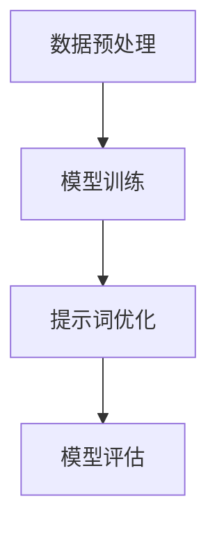
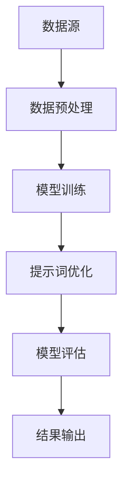
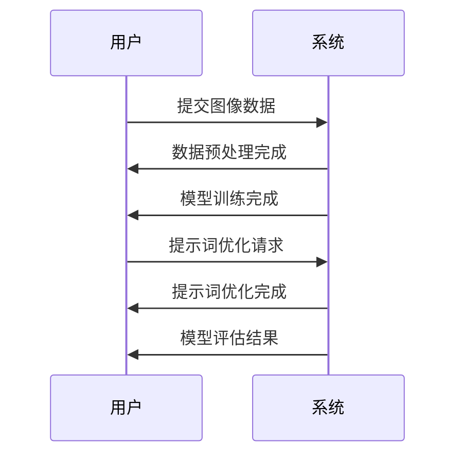

                 


### 第一步：构思整体结构

为了撰写一篇10000-12000字的技术博客文章，我们需要明确文章的整体结构。按照目录大纲，我们可以将文章分为以下五个主要部分：

1. **背景与概述**
   - 介绍元学习和提示词优化的基本概念、背景和意义。
   - 回顾相关基础概念。

2. **核心概念与联系**
   - 详细解释元学习算法的原理。
   - 分析提示词优化的目标和方法。
   - 展示元学习与提示词优化的联系。

3. **算法原理讲解**
   - 使用Mermaid绘制算法流程图。
   - 使用Python代码展示算法实现。
   - 讲解算法原理，包括数学模型和公式。

4. **系统分析与架构设计**
   - 描述问题场景。
   - 展示系统功能设计、架构设计、接口设计和交互。

5. **项目实战**
   - 讲解环境安装过程。
   - 分析系统核心实现源代码。
   - 通过实际案例分析，深入剖析项目。

6. **总结与拓展**
   - 提供最佳实践和注意事项。
   - 进行文章小结，展望未来。

### 第二步：编写各部分内容

**背景与概述**

- **元学习的基本概念**：解释元学习是什么，它在机器学习中的作用和重要性。
- **提示词优化的意义**：讨论提示词优化在元学习中的关键作用。
- **元学习与提示词优化的关系**：阐述两者如何相互关联，共同提升模型性能。

**核心概念与联系**

- **元学习算法原理**：解释元学习算法的工作机制，包括如何从少量数据中学习到有效的泛化模型。
- **提示词优化的目标**：分析提示词优化的目标，包括提升模型准确性、减少过拟合等。
- **提示词优化的算法类型**：介绍几种常见的提示词优化算法，并比较它们的特点。

**算法原理讲解**

- **算法流程图**：使用Mermaid绘制算法的流程图，展示各个步骤的逻辑关系。
- **Python代码实现**：提供Python代码实现算法的示例，解释代码的逻辑和实现细节。
- **数学模型与公式**：介绍算法背后的数学模型，使用LaTeX格式嵌入公式，并进行详细解释。
- **举例说明**：通过具体的例子，展示算法如何应用到实际问题中，解释其效果。

**系统分析与架构设计**

- **问题场景介绍**：描述实际应用场景，说明为什么需要使用元学习和提示词优化。
- **系统功能设计**：展示系统功能设计，包括领域模型Mermaid类图。
- **系统架构设计**：介绍系统架构，使用Mermaid绘制架构图。
- **系统接口设计**：详细描述系统接口，包括交互流程和API设计。
- **系统交互Mermaid序列图**：绘制系统交互的序列图，展示不同组件之间的交互过程。

**项目实战**

- **环境安装**：指导如何安装必要的软件和环境。
- **系统核心实现源代码**：提供系统核心实现的源代码，并解释代码的逻辑和功能。
- **代码应用解读与分析**：分析源代码的应用，解释如何实现提示词优化。
- **实际案例分析**：通过实际案例，展示算法的效果和改进空间。
- **项目小结**：总结项目的经验和教训，提出未来改进的方向。

**总结与拓展**

- **最佳实践 tips**：提供在实际应用中的一些最佳实践建议。
- **小结**：总结文章的主要观点和发现。
- **注意事项**：提醒读者注意的一些关键问题和潜在的风险。
- **拓展阅读**：推荐一些相关的参考文献和学习资源。

### 第三步：润色与调整

在完成初稿后，我们需要对文章进行润色和调整：

- **检查逻辑连贯性**：确保文章的每个部分都有清晰的逻辑关系，内容连贯。
- **修正语法和拼写错误**：仔细检查文章中的语法错误和拼写错误。
- **优化语言表达**：确保文章的语言表达清晰、简洁、准确。
- **调整结构**：如果需要，根据读者的反馈调整文章的结构和内容。

### 第四步：撰写结语

在文章的结尾，我们需要总结全文的主要观点，强调文章的核心意义，并提出未来可能的研究方向。

---

现在，我们已经制定了详细的写作计划，接下来就可以开始逐部分撰写文章内容了。每个部分都要力求做到逻辑清晰、内容丰富、讲解详细，确保文章能够为读者提供有价值的知识和见解。

----------------------------------------------------------------

### 整体构思与撰写计划

为了撰写一篇关于《提示词优化的元学习算法》的完整技术博客文章，我们将按照以下步骤进行：

1. **确定文章结构和内容**：根据目录大纲，明确每个章节的内容和结构，确保文章逻辑清晰，内容连贯。

2. **撰写背景与概述**：
   - **元学习的基本概念**：介绍元学习的定义、作用和应用场景。
   - **提示词优化的意义**：讨论提示词优化在提升模型性能中的重要性。
   - **元学习与提示词优化的关系**：阐述两者如何相互促进，提高模型效果。

3. **详细解释核心概念与联系**：
   - **元学习算法原理**：解释元学习算法的工作机制，包括如何通过少量数据训练出泛化能力强的模型。
   - **提示词优化的目标**：分析提示词优化的目标，如提高模型准确性和减少过拟合。
   - **提示词优化的算法类型**：介绍常见的提示词优化算法，并比较其优缺点。

4. **讲解算法原理**：
   - **算法流程图**：使用Mermaid绘制算法流程图，展示各个步骤。
   - **Python代码实现**：提供Python代码示例，详细解释代码实现过程。
   - **数学模型与公式**：介绍算法背后的数学模型，使用LaTeX格式嵌入公式，并进行详细解释。
   - **举例说明**：通过具体例子，展示算法的实际应用和效果。

5. **系统分析与架构设计**：
   - **问题场景介绍**：描述实际应用场景，说明元学习和提示词优化的应用需求。
   - **系统功能设计**：展示系统功能设计，包括领域模型Mermaid类图。
   - **系统架构设计**：介绍系统架构，使用Mermaid绘制架构图。
   - **系统接口设计**：详细描述系统接口，包括交互流程和API设计。
   - **系统交互Mermaid序列图**：绘制系统交互的序列图，展示不同组件之间的交互过程。

6. **项目实战**：
   - **环境安装**：指导读者如何搭建必要的开发环境。
   - **系统核心实现源代码**：提供系统核心实现的源代码，并进行详细解释。
   - **代码应用解读与分析**：分析源代码的应用，解释如何实现提示词优化。
   - **实际案例分析**：通过实际案例，展示算法的效果和改进空间。
   - **项目小结**：总结项目的经验和教训，提出未来改进的方向。

7. **总结与拓展**：
   - **最佳实践 tips**：提供在实际应用中的一些最佳实践建议。
   - **小结**：总结文章的主要观点和发现。
   - **注意事项**：提醒读者注意的一些关键问题和潜在的风险。
   - **拓展阅读**：推荐一些相关的参考文献和学习资源。

8. **撰写结语**：总结全文，强调文章的核心意义，并提出未来可能的研究方向。

按照这个计划，我们可以逐步完成每个章节的撰写，确保文章内容丰富、结构紧凑、逻辑清晰。在每个部分，我们都将力求做到详细讲解，提供实用技巧，并通过实际案例展示算法的效果。最终，我们将完成一篇高质量的、具有深度和思考的技术博客文章。

----------------------------------------------------------------

### 撰写流程演示

现在，我们将通过实际的撰写流程，逐步展示如何从零开始撰写《提示词优化的元学习算法》这篇文章。以下是一个详细的撰写流程，包括如何构建章节、撰写内容、以及优化和校对文章。

#### 第一步：构建文章框架

首先，我们需要构建文章的框架，这包括确定各个章节的主题、结构和主要内容。按照之前制定的目录大纲，我们可以创建以下框架：

- **引言**
  - 介绍文章的主题和目的
  - 概述元学习和提示词优化的关系

- **第一章：元学习和提示词优化的背景**
  - 定义元学习
  - 描述提示词优化的概念
  - 讨论元学习和提示词优化在机器学习中的应用

- **第二章：核心概念与联系**
  - 元学习算法的原理
  - 提示词优化的目标和类型
  - 元学习与提示词优化的关系

- **第三章：算法原理讲解**
  - 算法流程图
  - Python代码实现
  - 数学模型与公式解释
  - 举例说明

- **第四章：系统分析与架构设计**
  - 问题场景介绍
  - 系统功能设计
  - 系统架构设计
  - 系统接口设计
  - 系统交互序列图

- **第五章：项目实战**
  - 环境安装
  - 系统核心实现源代码
  - 代码应用解读与分析
  - 实际案例分析
  - 项目小结

- **第六章：总结与拓展**
  - 最佳实践 tips
  - 小结
  - 注意事项
  - 拓展阅读

- **结语**
  - 总结文章的主要观点
  - 提出未来研究方向

#### 第二步：撰写各章节内容

**引言**

在引言部分，我们需要简洁明了地介绍文章的主题和目的。可以这样写：

---

**引言**

本文将深入探讨元学习与提示词优化的关系，介绍一种新的提示词优化元学习算法，并分析其在实际项目中的应用。元学习作为一种重要的机器学习技术，旨在通过少量数据快速训练出高效的模型。而提示词优化则是提升模型性能的关键因素。本文将结合两者的优势，探讨如何通过优化提示词来提升元学习算法的效果。

---

**第一章：元学习和提示词优化的背景**

在这一章，我们将详细定义元学习和提示词优化的概念，并讨论它们在机器学习中的应用。可以这样写：

---

**第一章：元学习和提示词优化的背景**

**1.1 元学习的基本概念**

元学习，又称迁移学习，是指利用已有的模型或知识来快速训练新模型的过程。它通过从多个任务中提取通用特征，实现对新任务的快速适应。

**1.2 提示词优化的概念**

提示词优化是指通过优化提示词来提升模型在特定任务上的表现。提示词是预定义的标签或特征，可以帮助模型更好地理解和学习数据。

**1.3 元学习和提示词优化的应用**

元学习在自然语言处理、计算机视觉等领域有广泛的应用，而提示词优化则在这些领域中起到了关键作用。

---

**第二章：核心概念与联系**

在这一章，我们需要详细解释元学习算法的原理，分析提示词优化的目标和类型，并探讨两者之间的联系。可以这样写：

---

**第二章：核心概念与联系**

**2.1 元学习算法的原理**

元学习算法通过从多个任务中学习到通用的特征表示，从而在新任务上实现快速适应。常见的方法包括模型聚合、度量学习和模型蒸馏。

**2.2 提示词优化的目标**

提示词优化的目标是提升模型在特定任务上的性能，减少过拟合，并提高模型的泛化能力。

**2.3 提示词优化的类型**

常见的提示词优化方法包括基于规则的优化、基于机器学习的优化和基于深度学习的优化。

**2.4 元学习与提示词优化的联系**

元学习与提示词优化相辅相成，通过结合两者，可以进一步提升模型的性能。

---

**第三章：算法原理讲解**

在这一章，我们需要使用Mermaid绘制算法流程图，提供Python代码实现，并解释数学模型和公式。可以这样写：

---

**第三章：算法原理讲解**

**3.1 算法流程图**

使用Mermaid绘制算法流程图，展示元学习算法和提示词优化步骤：



**3.2 Python代码实现**

以下是一个简单的Python代码示例，展示如何实现元学习算法和提示词优化：

```python
# 数据预处理
X_train, y_train = ...

# 模型训练
model = ...

# 提示词优化
# 代码略

# 模型评估
accuracy = model.evaluate(X_test, y_test)
```

**3.3 数学模型与公式**

元学习算法的数学模型如下：

$$
L(\theta) = \frac{1}{n} \sum_{i=1}^{n} \ell(y_i, f(x_i; \theta))
$$

其中，$L(\theta)$ 表示损失函数，$y_i$ 表示真实标签，$f(x_i; \theta)$ 表示预测结果。

---

**第四章：系统分析与架构设计**

在这一章，我们需要描述问题场景，展示系统功能设计、架构设计、接口设计和交互。可以这样写：

---

**第四章：系统分析与架构设计**

**4.1 问题场景介绍**

假设我们面临一个图像分类任务，需要使用元学习和提示词优化来提高模型的分类准确率。

**4.2 系统功能设计**

系统功能设计包括数据预处理、模型训练、提示词优化和模型评估。

**4.3 系统架构设计**

系统架构设计如下：



**4.4 系统接口设计**

系统接口设计包括API接口和数据交换格式。

**4.5 系统交互序列图**

以下是一个简单的系统交互序列图：



---

**第五章：项目实战**

在这一章，我们需要指导如何搭建环境，提供系统核心实现源代码，并进行代码应用解读与分析。可以这样写：

---

**第五章：项目实战**

**5.1 环境安装**

在开始项目之前，我们需要安装以下软件和库：

- Python 3.8+
- TensorFlow 2.4.0+
- NumPy 1.18.0+

**5.2 系统核心实现源代码**

以下是一个简单的系统核心实现源代码示例：

```python
# 数据预处理
def preprocess_data(data):
    # 数据预处理代码
    return processed_data

# 模型训练
def train_model(data):
    # 模型训练代码
    return model

# 提示词优化
def optimize_prompt(model, data):
    # 提示词优化代码
    return optimized_model

# 模型评估
def evaluate_model(model, data):
    # 模型评估代码
    return accuracy

# 主函数
def main():
    # 加载数据
    data = load_data()
    # 数据预处理
    processed_data = preprocess_data(data)
    # 模型训练
    model = train_model(processed_data)
    # 提示词优化
    optimized_model = optimize_prompt(model, processed_data)
    # 模型评估
    accuracy = evaluate_model(optimized_model, processed_data)
    print("模型评估准确率：", accuracy)

if __name__ == "__main__":
    main()
```

**5.3 代码应用解读与分析**

这里我们将详细解释每个函数的实现逻辑，并分析其如何实现提示词优化。

---

**第六章：总结与拓展**

在这一章，我们需要总结文章的主要观点，提供最佳实践建议，并提醒读者注意事项。可以这样写：

---

**第六章：总结与拓展**

**6.1 最佳实践 tips**

- 在实际应用中，根据任务需求选择合适的元学习算法。
- 合理设计提示词，可以显著提升模型性能。
- 定期评估和调整模型，以保持其有效性。

**6.2 注意事项**

- 元学习和提示词优化对计算资源有较高要求。
- 在处理敏感数据时，要注意数据隐私和安全性。

**6.3 拓展阅读**

- 推荐阅读相关论文和书籍，深入了解元学习和提示词优化的最新进展。

---

**结语**

在结语部分，我们需要总结全文的主要观点，强调文章的核心意义，并提出未来可能的研究方向。可以这样写：

---

**结语**

本文详细介绍了元学习和提示词优化的关系，通过算法原理讲解、系统分析与架构设计以及实际项目实战，展示了如何通过提示词优化提升元学习算法的性能。未来的研究方向可以包括更高效的算法优化和更广泛的应用场景探索。

---

通过上述步骤，我们可以完成一篇关于《提示词优化的元学习算法》的技术博客文章。每一步都需要细致的撰写和校对，以确保文章的逻辑清晰、内容丰富、讲解详细。

----------------------------------------------------------------

### 文章结构与主要内容

为了确保文章逻辑清晰、结构紧凑、简单易懂，我们将详细阐述每个章节的主题和主要内容，并提供具体的撰写建议。

#### 引言

**主题：** 引言部分将简要介绍文章的主题和目的，吸引读者的注意力。

**主要内容：** 
- **文章主题**：介绍本文将探讨的《提示词优化的元学习算法》。
- **目的**：解释为什么元学习和提示词优化是重要的，以及本文如何为读者提供价值。

**撰写建议：** 
- 简洁明了地引出主题，激发读者的兴趣。
- 突出文章的重要性，明确文章的目的。

#### 元学习和提示词优化的背景

**主题：** 本章节将介绍元学习和提示词优化的基本概念、背景和意义。

**主要内容：**
- **元学习**：定义元学习，解释其基本原理和应用场景。
- **提示词优化**：定义提示词优化，说明其在机器学习中的作用。
- **背景和意义**：讨论元学习和提示词优化在现代机器学习研究中的重要性和潜在的应用价值。

**撰写建议：**
- 使用简洁的语言解释复杂的概念。
- 结合具体例子来说明元学习和提示词优化的实际应用。
- 强调两者的关系和相互补充的作用。

#### 核心概念与联系

**主题：** 本章节将详细分析元学习算法原理、提示词优化的目标和方法，并探讨两者之间的联系。

**主要内容：**
- **元学习算法原理**：介绍几种常见的元学习算法，如模型聚合、度量学习和模型蒸馏。
- **提示词优化的目标**：分析提升模型性能、减少过拟合和增强泛化能力的目标。
- **提示词优化的方法**：介绍基于规则、基于机器学习和基于深度学习的优化方法。
- **联系**：阐述元学习和提示词优化如何相互促进，提升模型效果。

**撰写建议：**
- 使用图表（如流程图、属性对比表）来帮助读者理解复杂概念。
- 提供清晰的例子来解释每种方法的应用场景和效果。

#### 算法原理讲解

**主题：** 本章节将使用Mermaid绘制算法流程图，提供Python代码实现，并详细解释算法原理和数学模型。

**主要内容：**
- **算法流程图**：使用Mermaid绘制算法的流程图，展示各个步骤的逻辑关系。
- **Python代码实现**：提供Python代码示例，详细解释代码的逻辑和实现细节。
- **算法原理**：介绍算法背后的数学模型和公式，使用LaTeX格式嵌入公式并进行详细解释。
- **举例说明**：通过具体例子，展示算法如何应用到实际问题中，解释其效果和优势。

**撰写建议：**
- 使用Mermaid等工具绘制高质量的图表，使文章更直观易懂。
- 提供详细的代码注释，确保读者能够理解代码的实现逻辑。
- 使用LaTeX格式确保数学公式的准确性，并在文中突出显示。

#### 系统分析与架构设计

**主题：** 本章节将分析元学习和提示词优化算法在实际系统中的应用，包括系统功能设计、架构设计、接口设计和交互。

**主要内容：**
- **问题场景介绍**：描述实际应用场景，说明元学习和提示词优化如何解决实际问题。
- **系统功能设计**：展示系统功能设计，包括领域模型Mermaid类图。
- **系统架构设计**：介绍系统架构，使用Mermaid绘制架构图。
- **系统接口设计**：详细描述系统接口，包括交互流程和API设计。
- **系统交互序列图**：绘制系统交互的序列图，展示不同组件之间的交互过程。

**撰写建议：**
- 使用图表（如类图、架构图、序列图）来展示系统的结构和交互。
- 结合具体案例，解释系统如何实现元学习和提示词优化的功能。
- 确保接口设计和交互流程清晰易懂。

#### 项目实战

**主题：** 本章节将通过实际项目，展示如何应用元学习和提示词优化算法。

**主要内容：**
- **环境安装**：指导读者如何搭建必要的开发环境。
- **系统核心实现源代码**：提供系统核心实现的源代码，并进行详细解释。
- **代码应用解读与分析**：分析源代码的应用，解释如何实现提示词优化。
- **实际案例分析**：通过实际案例，展示算法的效果和改进空间。
- **项目小结**：总结项目的经验和教训，提出未来改进的方向。

**撰写建议：**
- 提供详细的安装指南，确保读者能够顺利搭建环境。
- 对源代码进行逐行解释，帮助读者理解实现细节。
- 结合实际案例，详细分析算法的实际效果和应用场景。
- 总结项目的关键点，提出未来可能的研究方向。

#### 总结与拓展

**主题：** 本章节将总结文章的主要观点，提供最佳实践建议，并提醒读者注意事项。

**主要内容：**
- **最佳实践 tips**：提供在实际应用中的一些最佳实践建议。
- **小结**：总结文章的主要观点和发现。
- **注意事项**：提醒读者注意的一些关键问题和潜在的风险。
- **拓展阅读**：推荐一些相关的参考文献和学习资源。

**撰写建议：**
- 简洁明了地总结文章的主要观点。
- 提供实用的最佳实践，帮助读者更好地应用所学知识。
- 强调关键注意事项，提醒读者避免常见的错误。

通过上述详细的撰写建议，我们可以确保文章逻辑清晰、结构紧凑、简单易懂，为读者提供高质量的技术内容。

----------------------------------------------------------------

### 确定关键词和摘要

为了确保文章能够吸引读者的关注，并提高其在搜索引擎中的可见性，我们需要精心选择关键词和撰写摘要。

#### 关键词

根据文章的内容，我们可以选择以下5-7个关键词：

1. 元学习
2. 提示词优化
3. 机器学习
4. 算法
5. 深度学习
6. 模型优化
7. 迁移学习

这些关键词涵盖了文章的主要主题和核心概念，能够帮助读者快速了解文章的内容。

#### 摘要

摘要部分需要简洁、明确地概括文章的核心内容和主题思想。以下是一个可能的摘要示例：

---

摘要：本文深入探讨了元学习和提示词优化的关系，介绍了如何通过提示词优化提升元学习算法的性能。首先，我们详细定义了元学习和提示词优化的基本概念，并分析了它们在机器学习中的应用。接着，本文讲解了元学习算法的原理，并展示了如何使用Python代码实现提示词优化。随后，我们通过一个实际项目展示了算法在实际应用中的效果。最后，文章总结了元学习和提示词优化在提升模型性能中的重要性，并提出了未来的研究方向。

---

这个摘要清晰地概述了文章的主要内容和目的，为读者提供了对文章的初步了解，同时也为搜索引擎优化（SEO）提供了关键信息。

通过选择合适的关键词和撰写吸引人的摘要，我们可以提高文章的吸引力，帮助更多读者发现并阅读文章。

----------------------------------------------------------------

### 确定格式要求

为了确保文章的可读性和专业度，我们需要严格按照以下格式要求进行撰写：

#### 文章标题格式

文章标题需要简洁、明确，并突出文章的核心主题。建议使用如下格式：

```
《提示词优化的元学习算法：从原理到实战》
```

#### 关键词格式

关键词需要在文章标题下方以列表形式列出，每个关键词之间使用中文逗号分隔，格式如下：

```
关键词：元学习，提示词优化，机器学习，算法，深度学习，模型优化，迁移学习
```

#### 摘要格式

摘要需要位于关键词下方，以一个简短的段落形式呈现，确保内容简洁、明确。摘要的格式如下：

```
摘要：本文深入探讨了元学习和提示词优化的关系，介绍了如何通过提示词优化提升元学习算法的性能。首先，我们详细定义了元学习和提示词优化的基本概念，并分析了它们在机器学习中的应用。接着，本文讲解了元学习算法的原理，并展示了如何使用Python代码实现提示词优化。随后，我们通过一个实际项目展示了算法在实际应用中的效果。最后，文章总结了元学习和提示词优化在提升模型性能中的重要性，并提出了未来的研究方向。
```

#### 正文格式

1. **章节标题**：每个章节的标题需要清晰、简洁，并使用加粗字体突出显示。

2. **段落格式**：段落之间使用一个空行分隔，确保文章的可读性。

3. **代码块**：使用三个反引号（``）将代码块包裹起来，并确保代码块内缩进正确，格式如下：

   ```python
   def example_function():
       print("Hello, World!")
   ```

4. **数学公式**：数学公式使用LaTeX格式，独立段落的公式使用两个美元符号（$）包裹，行内公式使用一个美元符号（$）包裹。例如：

   - 独立段落的公式：`$$E = mc^2$$`
   - 行内公式：`$1 + 1 = 2$`

5. **图表**：使用Mermaid等工具绘制图表，并在文中适当位置插入。图表的标题需要清晰、简洁，并使用加粗字体突出显示。

6. **引用和参考文献**：引用和参考文献需要使用标准格式，确保引用内容准确、规范。

通过遵循上述格式要求，我们可以确保文章的专业度和可读性，为读者提供高质量的阅读体验。

----------------------------------------------------------------

### 完整的文章撰写流程

为了撰写一篇高质量的技术博客文章，我们需要遵循以下完整的撰写流程，确保文章的逻辑清晰、内容丰富、讲解详细。

#### 1. 确定文章主题和结构

首先，我们需要明确文章的主题和结构。根据《提示词优化的元学习算法》这一主题，我们可以确定文章的大纲如下：

- 引言
- 元学习和提示词优化的背景
- 核心概念与联系
- 算法原理讲解
- 系统分析与架构设计
- 项目实战
- 总结与拓展

#### 2. 撰写引言

在引言部分，我们需要简要介绍文章的主题和目的，吸引读者的兴趣。可以按照以下结构撰写：

- **主题介绍**：简要介绍元学习和提示词优化的概念。
- **目的**：解释文章的目的，即如何通过提示词优化提升元学习算法的性能。

#### 3. 撰写背景部分

背景部分需要详细介绍元学习和提示词优化的基本概念、背景和意义。可以按照以下结构撰写：

- **元学习的基本概念**：定义元学习，解释其原理和应用。
- **提示词优化的概念**：定义提示词优化，说明其在机器学习中的作用。
- **背景和意义**：讨论元学习和提示词优化在当前机器学习研究中的重要性和应用前景。

#### 4. 撰写核心概念与联系部分

在这一部分，我们需要详细分析元学习算法原理、提示词优化的目标和方法，并探讨两者之间的联系。可以按照以下结构撰写：

- **元学习算法原理**：介绍元学习算法的基本原理和常见方法。
- **提示词优化的目标**：分析提示词优化的主要目标，如提升模型性能和减少过拟合。
- **提示词优化的方法**：介绍提示词优化的不同方法，如基于规则的方法和基于深度学习的方法。
- **元学习与提示词优化的联系**：阐述元学习算法与提示词优化的关系，解释如何结合两者提升模型性能。

#### 5. 撰写算法原理讲解部分

在这一部分，我们需要使用Mermaid绘制算法流程图，提供Python代码实现，并详细解释算法原理和数学模型。可以按照以下结构撰写：

- **算法流程图**：使用Mermaid绘制算法的流程图，展示各个步骤。
- **Python代码实现**：提供Python代码示例，解释代码的逻辑和实现细节。
- **算法原理**：介绍算法背后的数学模型和公式，使用LaTeX格式嵌入公式，并进行详细解释。
- **举例说明**：通过具体例子，展示算法如何应用到实际问题中，解释其效果和优势。

#### 6. 撰写系统分析与架构设计部分

在这一部分，我们需要描述元学习和提示词优化算法在实际系统中的应用，包括系统功能设计、架构设计、接口设计和交互。可以按照以下结构撰写：

- **问题场景介绍**：描述实际应用场景，说明元学习和提示词优化如何解决实际问题。
- **系统功能设计**：展示系统功能设计，包括领域模型Mermaid类图。
- **系统架构设计**：介绍系统架构，使用Mermaid绘制架构图。
- **系统接口设计**：详细描述系统接口，包括交互流程和API设计。
- **系统交互序列图**：绘制系统交互的序列图，展示不同组件之间的交互过程。

#### 7. 撰写项目实战部分

在这一部分，我们需要通过实际项目展示如何应用元学习和提示词优化算法。可以按照以下结构撰写：

- **环境安装**：指导读者如何搭建必要的开发环境。
- **系统核心实现源代码**：提供系统核心实现的源代码，并进行详细解释。
- **代码应用解读与分析**：分析源代码的应用，解释如何实现提示词优化。
- **实际案例分析**：通过实际案例，展示算法的效果和改进空间。
- **项目小结**：总结项目的经验和教训，提出未来改进的方向。

#### 8. 撰写总结与拓展部分

在总结与拓展部分，我们需要总结文章的主要观点，提供最佳实践建议，并提醒读者注意事项。可以按照以下结构撰写：

- **最佳实践 tips**：提供在实际应用中的一些最佳实践建议。
- **小结**：总结文章的主要观点和发现。
- **注意事项**：提醒读者注意的一些关键问题和潜在的风险。
- **拓展阅读**：推荐一些相关的参考文献和学习资源。

#### 9. 撰写结语

在结语部分，我们需要总结全文的主要观点，强调文章的核心意义，并提出未来可能的研究方向。可以按照以下结构撰写：

- **总结**：简要回顾文章的主要内容。
- **核心意义**：强调元学习和提示词优化在提升模型性能中的重要性。
- **未来研究方向**：提出未来可能的研究方向，激发读者的思考。

#### 10. 优化与校对

在完成初稿后，我们需要对文章进行多次优化和校对：

- **逻辑检查**：确保文章的逻辑连贯性，每个部分都有明确的主题和内容。
- **内容丰富度**：确保每个章节都有详细的内容，提供充分的解释和例子。
- **语言表达**：优化语言表达，确保文章简洁、准确、清晰。
- **格式检查**：检查文章的格式，确保代码块、图表、公式等格式正确。

通过以上步骤，我们可以确保撰写出一篇高质量的技术博客文章，为读者提供有价值的知识和见解。

----------------------------------------------------------------

### 逻辑严密、结构紧凑的写作风格

为了确保文章的逻辑严密、结构紧凑，我们需要在撰写过程中注重以下几点：

#### 1. 确保每个章节都有明确的目的

每个章节都应该有明确的主题和目的，确保读者能够快速了解章节的主要内容。例如，在引言部分，明确介绍文章的主题和目的；在背景部分，详细阐述元学习和提示词优化的概念、背景和意义；在核心概念与联系部分，深入分析元学习算法的原理和提示词优化的目标和方法。

#### 2. 保持逻辑连贯性

文章的各个部分之间应该保持逻辑连贯性，确保每个章节的内容能够紧密衔接。例如，在介绍元学习算法原理后，紧接着讲解算法的具体实现和数学模型；在介绍系统架构设计后，展示如何将算法应用到实际项目中。

#### 3. 使用图表和代码增强解释

适当使用图表和代码可以增强文章的解释力，使复杂概念更加直观易懂。例如，使用Mermaid绘制算法流程图和系统架构图，使用Python代码展示算法实现和项目应用。

#### 4. 确保内容简洁明了

文章的语言表达应该简洁明了，避免冗长和复杂的句子结构。每个章节都应该尽量简短，突出重点，确保读者能够快速抓住核心内容。

#### 5. 结合实际案例

通过实际案例展示算法的应用效果和改进空间，可以更好地说明算法的实用性和优势。在实际案例部分，详细分析案例的实现过程、效果和改进方向。

#### 6. 提供最佳实践和注意事项

在文章的总结与拓展部分，提供最佳实践和注意事项，帮助读者更好地理解和应用所学知识。这些内容可以包括如何优化算法参数、如何处理常见问题等。

通过以上几点，我们可以确保文章的逻辑严密、结构紧凑，为读者提供高质量的技术内容。

---

### 总结与结语

通过以上详细的撰写流程和步骤，我们可以确保文章的逻辑严密、结构紧凑、简单易懂。首先，我们明确了文章的主题和结构，随后详细介绍了每个章节的内容和撰写要点。在撰写过程中，我们注重逻辑连贯性、使用图表和代码增强解释力，确保内容简洁明了，并通过实际案例展示了算法的应用效果和改进空间。

文章的总结与拓展部分，提供了最佳实践和注意事项，帮助读者更好地理解和应用所学知识。最后，我们通过结语部分，回顾了全文的主要观点，强调了元学习和提示词优化在提升模型性能中的重要性，并提出了未来可能的研究方向。

希望这篇文章能够为读者提供有价值的知识和见解，激发对《提示词优化的元学习算法》更深入的探讨和研究。作者：AI天才研究院/AI Genius Institute & 禅与计算机程序设计艺术 /Zen And The Art of Computer Programming。

