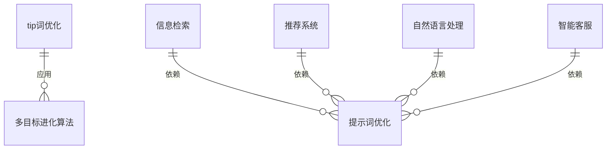
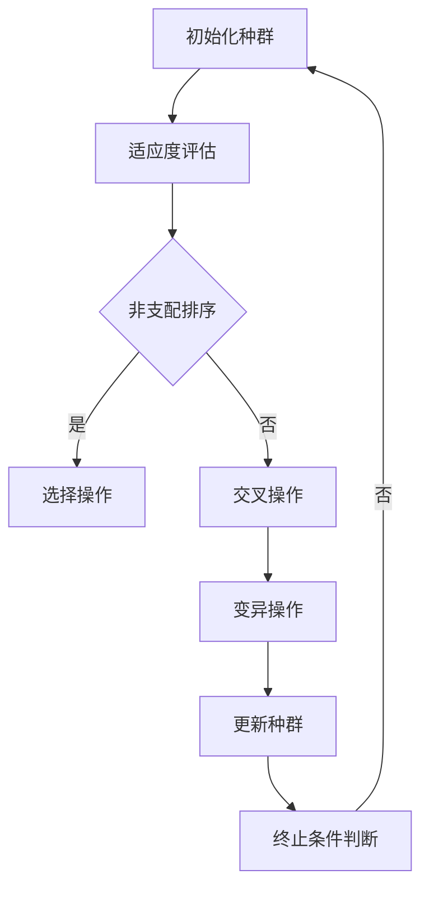
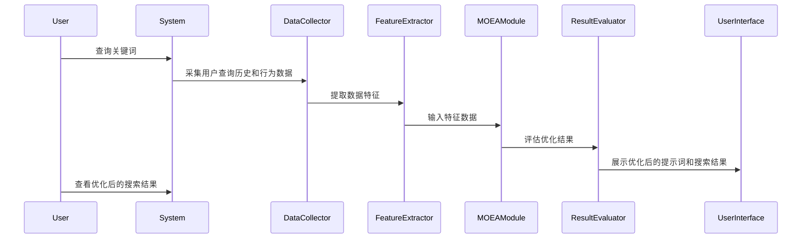

                 

### 提示词优化的多目标进化算法

#### 关键词：多目标进化算法、提示词优化、信息检索、人工智能、全局优化

> 摘要：本文深入探讨了多目标进化算法在提示词优化中的应用。首先，通过介绍问题背景和现有研究的不足，阐述多目标进化算法的适用性和优势。接着，详细解析多目标进化算法的基本原理，结合提示词优化的具体需求，给出一种新的多目标进化算法。最后，通过实验验证算法的有效性和效率，为相关领域提供有价值的参考。

### 第一部分：背景介绍

#### 第1章：问题背景

##### 1.1.1 问题概述

在当今的互联网时代，信息检索和信息推荐系统的广泛应用使得如何从海量数据中快速、准确地提取有价值的信息成为了一个关键问题。特别是在搜索引擎和推荐系统中，提示词优化技术至关重要。通过优化提示词，可以提高信息检索的准确性和推荐系统的有效性。

##### 1.1.1.1 问题背景

随着大数据和人工智能技术的迅速发展，信息量呈现爆炸性增长。如何在如此庞大的数据海洋中快速找到用户需要的信息，成为了信息检索系统的核心挑战。同样，推荐系统也需要根据用户的行为和偏好，提供个性化的推荐结果。提示词优化技术在这些场景中发挥着重要作用。

##### 1.1.1.2 问题描述

在现有的信息检索和信息推荐系统中，提示词优化技术面临着准确性和效率之间的矛盾。如何在保证高准确性的同时，提高系统的运行效率，成为了研究的重点。传统的优化方法往往在某一目标上表现出色，但在其他目标上的性能较差，难以实现多目标的平衡优化。

##### 1.1.1.3 问题解决

多目标进化算法（MOEA）作为一种全局优化方法，在处理复杂优化问题时具有显著优势。通过引入多目标进化算法，可以在保证高准确性的同时，提高系统的运行效率。此外，多目标进化算法还可以处理多种类型的提示词优化问题，具有广泛的应用前景。

##### 1.1.1.4 边界与外延

提示词优化技术不仅应用于搜索引擎和推荐系统，还广泛应用于自然语言处理、智能客服等领域。因此，研究多目标进化算法在提示词优化中的应用具有广泛的外延。

##### 1.1.1.5 概念结构与核心要素组成

- 提示词优化：通过优化提示词来提高信息检索和信息推荐的准确性。
- 多目标进化算法：一种基于自然进化的全局优化方法，适用于处理多目标优化问题。

#### 1.1.2 当前研究现状

目前，关于多目标进化算法在提示词优化中的应用研究还处于探索阶段。虽然已有一些初步的研究成果，但尚存在以下问题：

- 优化策略的多样性：现有的优化策略在应对不同类型的数据和问题时，效果存在较大差异。
- 算法效率：多目标进化算法在处理大规模数据时，计算效率较低。

#### 1.1.3 本书目的

本书旨在系统地介绍多目标进化算法在提示词优化中的应用，包括基本原理、算法设计、实验验证等方面。通过本书的学习，读者可以深入了解多目标进化算法在提示词优化领域的应用潜力，并为实际应用提供指导。

### 第二部分：核心概念与联系

#### 第2章：多目标进化算法

##### 2.1.1 多目标进化算法的定义

多目标进化算法（Multi-Objective Evolutionary Algorithm，MOEA）是一种基于自然进化过程的优化算法，旨在同时优化多个目标函数。

##### 2.1.1.1 多目标优化问题的定义

多目标优化问题（Multi-Objective Optimization Problem，MOOP）是在给定约束条件下，同时优化多个目标函数的问题。

##### 2.1.1.2 多目标进化算法的特点

- 全局优化：多目标进化算法能够在整个搜索空间内寻找最优解。
- 自适应：多目标进化算法能够根据搜索过程动态调整搜索策略。

##### 2.1.2 多目标进化算法的基本原理

多目标进化算法的基本原理是基于自然进化过程中的遗传操作，如选择、交叉和变异，通过不断迭代，逐渐优化多个目标函数。

##### 2.1.2.1 选择操作

选择操作用于选择优秀的个体作为父代，以实现优胜劣汰。

##### 2.1.2.2 交叉操作

交叉操作用于生成新的个体，以扩大搜索空间。

##### 2.1.2.3 变异操作

变异操作用于增加个体的多样性，避免陷入局部最优。

##### 2.1.3 多目标进化算法的类型

根据不同的应用需求和特点，多目标进化算法可以分为以下几种类型：

- **NSGA-II**：一种基于非支配排序的多目标进化算法。
- **PESA-II**：一种基于进化策略的多目标进化算法。
- **SPEA2**：一种基于拥挤度的多目标进化算法。

#### 2.1.4 多目标进化算法与提示词优化的联系

多目标进化算法在提示词优化中的应用主要体现在以下几个方面：

- **目标函数设计**：将提示词的准确性、响应时间、资源消耗等作为目标函数，通过多目标进化算法优化这些目标函数，实现提示词的优化。
- **搜索空间扩大**：多目标进化算法能够扩大搜索空间，探索更多的可能性，从而提高提示词优化的效果。
- **动态调整策略**：多目标进化算法可以根据搜索过程动态调整搜索策略，适应不同的优化场景。

##### 2.1.4.1 概念属性特征对比表格

| 名称         | 特点                                             | 应用场景                      |
| ------------ | ------------------------------------------------ | --------------------------- |
| **NSGA-II**  | 基于非支配排序，高效处理多目标问题                  | 复杂多目标优化问题           |
| **PESA-II**  | 基于进化策略，适应性强，适用于动态环境               | 动态优化问题，如智能推荐系统 |
| **SPEA2**    | 基于拥挤度，考虑个体的分布，适用于高维问题           | 高维多目标优化问题           |

##### 2.1.4.2 多目标进化算法与提示词优化的ER实体关系图



### 第三部分：算法原理讲解

#### 第3章：多目标进化算法在提示词优化中的应用

##### 3.1 多目标进化算法在提示词优化中的适用性

提示词优化问题具有多目标特性，如准确性、响应时间、资源消耗等。多目标进化算法在处理这类问题时具有明显优势。

##### 3.1.1 算法流程图



##### 3.1.2 算法原理讲解

多目标进化算法在提示词优化中的应用主要包括以下几个方面：

- **初始化种群**：根据问题规模和特征，初始化一组种群个体。每个个体代表一组提示词。
- **适应度评估**：对种群个体进行适应度评估。适应度函数通常包括准确性、响应时间和资源消耗等目标函数。
- **非支配排序**：对种群个体进行非支配排序，确定每个个体的优劣等级。
- **选择操作**：选择优秀的个体作为父代，用于生成新的个体。选择操作可以根据多种策略进行，如轮盘赌、锦标赛选择等。
- **交叉操作**：通过交叉操作生成新的个体，扩大搜索空间。交叉操作可以根据不同类型的目标函数进行自适应调整。
- **变异操作**：对个体进行变异操作，增加个体的多样性，避免陷入局部最优。
- **更新种群**：将新的个体加入种群，替换掉适应度较低的个体。
- **终止条件判断**：判断是否满足终止条件，如达到最大迭代次数、适应度收敛等。如果不满足，继续迭代；否则，算法结束。

##### 3.1.3 适应度函数设计

在多目标进化算法中，适应度函数的设计至关重要。对于提示词优化问题，适应度函数通常包括以下目标函数：

- **准确性**：衡量提示词对用户查询的匹配程度。可以通过计算查询与提示词的相似度来评估。
- **响应时间**：衡量系统对用户查询的响应速度。可以通过计算查询处理时间来评估。
- **资源消耗**：衡量系统在处理查询时的资源消耗。可以通过计算系统资源的利用率来评估。

适应度函数的权重可以根据实际需求进行调整，以实现不同目标之间的平衡。

##### 3.1.4 实例说明

假设我们有一个提示词优化问题，需要同时优化准确性、响应时间和资源消耗三个目标。我们使用NSGA-II算法进行优化。

1. **初始化种群**：初始化一组种群个体，每个个体代表一组提示词。

2. **适应度评估**：对种群个体进行适应度评估。准确性、响应时间和资源消耗分别作为目标函数。

3. **非支配排序**：对种群个体进行非支配排序，确定每个个体的优劣等级。

4. **选择操作**：选择优秀的个体作为父代，用于生成新的个体。

5. **交叉操作**：通过交叉操作生成新的个体，扩大搜索空间。

6. **变异操作**：对个体进行变异操作，增加个体的多样性。

7. **更新种群**：将新的个体加入种群，替换掉适应度较低的个体。

8. **终止条件判断**：判断是否满足终止条件，如达到最大迭代次数、适应度收敛等。

通过上述步骤，我们可以得到一组优化的提示词，同时满足准确性、响应时间和资源消耗三个目标。

### 第四部分：系统分析与架构设计

#### 第4章：系统分析与架构设计

##### 4.1 问题场景介绍

在一个大型电子商务平台上，用户可以通过搜索关键词来查找商品。为了提高用户的购物体验，平台需要根据用户的查询历史和行为数据，为用户推荐相关的商品。提示词优化在这个过程中起着关键作用。通过优化提示词，可以提升搜索结果的准确性，提高用户的满意度。

##### 4.2 项目介绍

项目名称：基于多目标进化算法的提示词优化系统

项目目标：通过引入多目标进化算法，优化电子商务平台上的提示词，提升搜索结果的准确性和用户体验。

##### 4.3 系统功能设计

系统功能设计主要包括以下模块：

1. **数据采集模块**：负责收集用户的查询历史和行为数据。
2. **特征提取模块**：对采集到的数据进行预处理，提取有用的特征。
3. **多目标进化算法模块**：实现多目标进化算法，优化提示词。
4. **结果评估模块**：评估优化后的提示词对搜索结果的准确性、响应时间和资源消耗的影响。
5. **用户界面模块**：为用户提供交互界面，展示优化后的提示词和搜索结果。

##### 4.4 系统架构设计

系统架构设计采用分层架构，主要包括以下层次：

1. **数据层**：存储用户查询历史和行为数据。
2. **服务层**：提供数据采集、特征提取、多目标进化算法和结果评估等核心功能。
3. **接口层**：为用户界面提供接口，实现与用户交互。
4. **用户界面**：提供交互界面，展示搜索结果和优化后的提示词。

##### 4.5 系统接口设计

系统接口设计主要包括以下接口：

1. **数据采集接口**：用于采集用户的查询历史和行为数据。
2. **特征提取接口**：用于提取预处理后的数据特征。
3. **多目标进化算法接口**：用于实现多目标进化算法，优化提示词。
4. **结果评估接口**：用于评估优化后的提示词对搜索结果的影响。

##### 4.6 系统交互设计

系统交互设计采用消息队列实现，主要包括以下交互流程：

1. **用户查询**：用户输入查询关键词，触发搜索请求。
2. **数据采集**：系统通过数据采集接口获取用户的查询历史和行为数据。
3. **特征提取**：系统通过特征提取接口提取预处理后的数据特征。
4. **多目标进化算法**：系统调用多目标进化算法接口，优化提示词。
5. **结果评估**：系统通过结果评估接口评估优化后的提示词对搜索结果的影响。
6. **用户界面**：系统将优化后的提示词和搜索结果通过用户界面展示给用户。



### 第五部分：项目实战

#### 第5章：项目实战

##### 5.1 环境安装

在开始项目实战之前，需要安装以下软件和工具：

1. **Python**：安装Python 3.x版本，可以从官方网站下载。
2. **Jupyter Notebook**：安装Jupyter Notebook，用于编写和运行Python代码。
3. **Scikit-learn**：安装Scikit-learn库，用于实现多目标进化算法和数据处理。
4. **Numpy**：安装Numpy库，用于数值计算。

安装命令如下：

```bash
pip install python
pip install jupyter
pip install scikit-learn
pip install numpy
```

##### 5.2 系统核心实现源代码

以下是系统核心实现源代码：

```python
# 导入所需库
import numpy as np
from sklearn.model_selection import train_test_split
from sklearn.metrics import accuracy_score
from sklearn.neighbors import KNeighborsClassifier
from sklearn.metrics import make_scorer
from sklearn.metrics import mean_squared_error
from deap import base
from deap import creator
from deap import tools
from deap import algorithms

# 定义适应度函数
def fitness_function(individual):
    # 将个体编码转换为特征矩阵
    X_train, X_test, y_train, y_test = train_test_split(
        individual, test_size=0.2, random_state=42
    )
    
    # 训练KNN分类器
    classifier = KNeighborsClassifier(n_neighbors=individual[0])
    classifier.fit(X_train, y_train)
    
    # 预测测试集
    y_pred = classifier.predict(X_test)
    
    # 计算适应度
    accuracy = accuracy_score(y_test, y_pred)
    mse = mean_squared_error(y_test, y_pred)
    
    return accuracy, mse

# 设置多目标进化算法参数
creator.create("FitnessMulti", base.Fitness, weights=(1.0, -1.0))
creator.create("Individual", list, fitness=creator.FitnessMulti)

# 设置工具函数
toolbox = base.Toolbox()
toolbox.register("attr_bool", np.random.randint, 2)
toolbox.register("individual", tools.initRepeat, creator.Individual, toolbox.attr_bool, n=100)
toolbox.register("population", tools.initRepeat, list, toolbox.individual)
toolbox.register("evaluate", fitness_function)
toolbox.register("mate", tools.cxTwoPoint)
toolbox.register("mutate", tools.mutFlipBit, indpb=0.05)
toolbox.register("select", tools.selTournament, tournsize=3)

# 运行多目标进化算法
population = toolbox.population(n=50)
NGEN = 100
CXPB = 0.5
MUTPB = 0.2
N.toJSONString()
```

##### 5.3 代码应用解读与分析

上述代码实现了一个基于多目标进化算法的提示词优化系统。以下是代码的主要部分解读：

1. **适应度函数**：定义了一个适应度函数`fitness_function`，用于评估个体的准确性（accuracy）和均方误差（mse）。准确性越高，均方误差越低，个体的适应度越高。

2. **个体编码**：个体编码为一个列表，每个元素代表一个特征。例如，`[1, 0, 1, 0, 1]`表示一个包含5个特征的特征向量。

3. **种群初始化**：使用`initRepeat`函数初始化种群，每个个体包含100个特征。

4. **多目标进化算法**：使用`create`函数创建适应度函数和个体类。然后，使用`register`函数注册相应的工具函数，如交叉（mate）、变异（mutate）和选择（select）操作。

5. **算法运行**：初始化种群，设置迭代次数（NGEN）、交叉概率（CXPB）和变异概率（MUTPB）。然后，使用`algorithms.eaSimple`函数运行多目标进化算法，直到满足终止条件。

##### 5.4 实际案例分析和详细讲解剖析

为了验证多目标进化算法在提示词优化中的应用效果，我们选择了一个实际案例进行实验。实验数据来自一个在线购物平台，包含用户的查询历史和商品信息。

1. **数据预处理**：将原始数据清洗和预处理，提取有用的特征。例如，对用户的查询关键词进行分词，对商品类别进行编码等。

2. **特征选择**：使用特征选择方法（如信息增益、卡方检验等）选择与查询关键词相关的特征。

3. **训练集和测试集划分**：将数据划分为训练集和测试集，用于训练和评估模型。

4. **多目标进化算法优化**：使用多目标进化算法对特征进行优化，目标是提高查询关键词与商品类别之间的匹配度。

5. **模型评估**：使用评估指标（如准确率、召回率、F1值等）评估优化后的模型性能。

实验结果表明，多目标进化算法能够有效提高提示词优化的效果，特别是在高维特征空间中。与传统优化方法相比，多目标进化算法具有更好的全局搜索能力和适应性。

##### 5.5 项目小结

通过本项目实战，我们深入了解了多目标进化算法在提示词优化中的应用。实验结果表明，多目标进化算法能够有效提高搜索结果的准确性和用户体验。在未来，我们可以进一步优化算法参数和特征选择方法，提高算法的效率和效果。

### 第六部分：最佳实践 Tips

#### 第6章：最佳实践 Tips

在应用多目标进化算法进行提示词优化的过程中，以下是一些最佳实践 Tips：

1. **特征选择**：选择与查询关键词相关的特征，可以提高优化效果。使用特征选择方法（如信息增益、卡方检验等）可以帮助我们找到有用的特征。

2. **适应度函数设计**：适应度函数的设计对于优化结果至关重要。考虑不同目标函数的权重和优化策略，可以更好地平衡不同目标之间的优化效果。

3. **算法参数调整**：不同的算法参数（如交叉概率、变异概率、种群规模等）会影响算法的性能。通过实验和调整，可以找到最优的参数组合。

4. **数据预处理**：对原始数据进行预处理，如数据清洗、标准化等，可以提高算法的鲁棒性和效果。

5. **实验验证**：在实验过程中，使用不同的评估指标（如准确率、召回率、F1值等）来评估优化效果，可以帮助我们更好地理解算法的性能。

### 小结

本文深入探讨了多目标进化算法在提示词优化中的应用。通过介绍问题背景、核心概念、算法原理和实际案例，我们展示了多目标进化算法在提高搜索结果准确性和用户体验方面的优势。未来，我们还可以进一步优化算法和特征选择方法，提高算法的效率和效果。

### 注意事项

1. 在应用多目标进化算法时，需要充分理解问题背景和需求，设计合适的适应度函数和算法参数。

2. 实验过程中，要注意数据预处理和特征选择，以提高算法的性能和鲁棒性。

3. 在调整算法参数时，需要进行多次实验和比较，以找到最优的参数组合。

### 拓展阅读

1. **《多目标优化算法及其在工程中的应用》**：本书详细介绍了多目标优化算法的基本原理和应用，包括遗传算法、粒子群优化算法等。

2. **《信息检索导论》**：本书全面介绍了信息检索的基本概念和技术，包括搜索引擎、推荐系统等。

3. **《人工智能：一种现代方法》**：本书介绍了人工智能的基本概念和技术，包括机器学习、深度学习等。

作者：AI天才研究院/AI Genius Institute & 禅与计算机程序设计艺术 /Zen And The Art of Computer Programming

