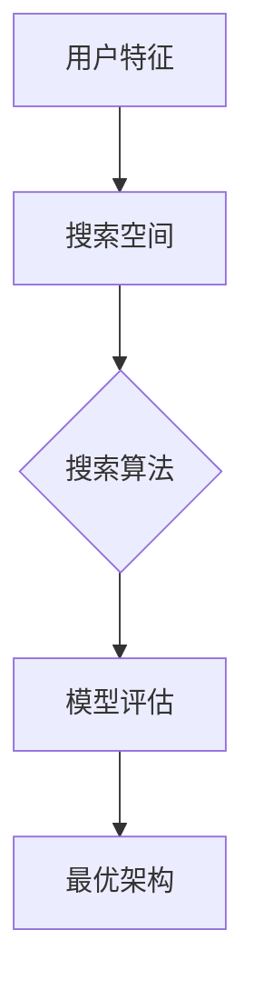
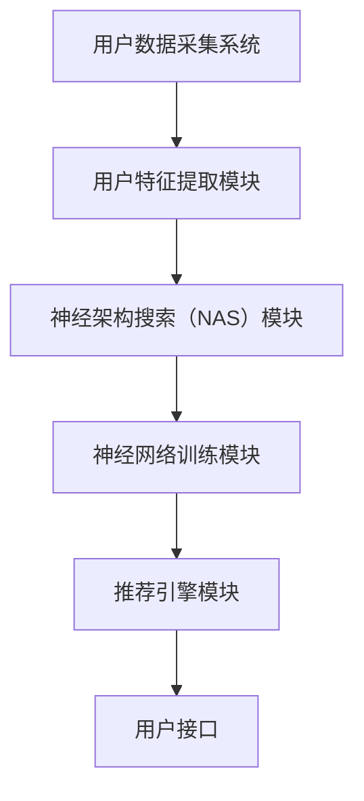
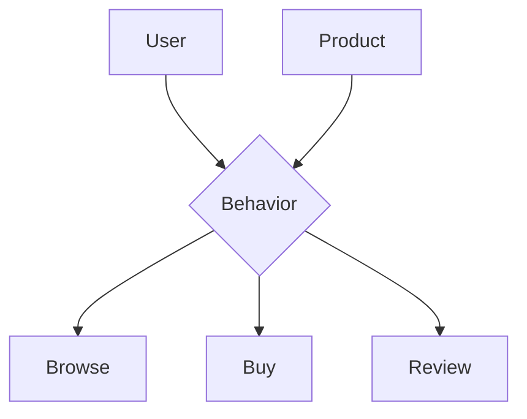
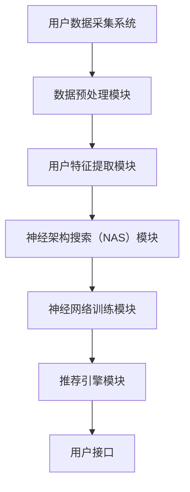

                 

# 提示词优化的神经架构搜索

## 关键词

- **提示词优化**
- **神经架构搜索（NAS）**
- **信息检索**
- **推荐系统**
- **用户特征提取**
- **深度学习**

### 摘要

本文深入探讨了一种创新的信息检索和推荐系统优化方法——提示词优化的神经架构搜索（Prompt-Optimized Neural Architecture Search，简称PONAS）。该方法结合了神经架构搜索（NAS）和提示词生成技术，通过自动搜索最优的神经网络架构，显著提升了个性化推荐系统的性能。本文将详细阐述PONAS的核心概念、原理及其在实际应用中的边界与外延，并通过具体实例和代码分析，展示其优势和应用前景。

----------------------------------------------------------------

## 第一部分：背景介绍

### 1.1 问题背景

随着互联网和大数据技术的飞速发展，信息检索和推荐系统的重要性日益凸显。在搜索引擎、电子商务、社交媒体等场景中，用户对信息的需求量巨大且不断变化。因此，如何有效地从海量数据中提取出用户感兴趣的信息，成为了一个亟待解决的问题。传统的基于关键词搜索和信息过滤的方法已经难以满足用户的需求，而基于神经网络的深度学习技术在图像识别、自然语言处理等领域取得了显著的成果，为信息检索和推荐系统的优化提供了新的思路。

### 1.2 问题描述

在信息检索和推荐系统中，核心问题是如何准确、高效地提取和利用用户的历史行为数据、偏好和上下文信息，从而为用户提供个性化的信息推荐。现有的方法主要依赖于关键词匹配、协同过滤和机器学习等技术，但存在以下问题：

- 用户行为数据稀疏：用户在互联网上的行为数据往往稀疏，难以准确反映用户的真实偏好。
- 信息过载：随着信息量的激增，用户在获取到自己感兴趣的信息时面临着信息过载的问题。
- 个性化不足：现有方法难以充分考虑到用户的上下文信息，导致个性化推荐效果不佳。

### 1.3 问题解决

为了解决上述问题，研究者提出了提示词优化的神经架构搜索方法。该方法通过引入提示词（prompt），将用户的兴趣和需求明确地表达出来，从而引导神经网络架构搜索（NAS）过程，提高信息检索和推荐系统的性能。具体来说，该方法包括以下几个关键步骤：

1. 提取用户特征：通过深度学习模型提取用户的历史行为数据、偏好和上下文信息，生成用户特征向量。
2. 设计神经网络架构：使用神经架构搜索（NAS）技术，根据用户特征向量自动搜索最优的神经网络架构。
3. 提示词生成：根据用户特征向量生成提示词，用于指导神经网络架构搜索过程。
4. 训练与优化：使用生成的提示词和训练数据训练神经网络模型，并进行性能优化。

### 1.4 边界与外延

提示词优化的神经架构搜索方法主要应用于信息检索和推荐系统，可以扩展到其他需要个性化推荐的领域，如医疗、金融等。同时，该方法还可以与其他深度学习技术相结合，如生成对抗网络（GAN）、强化学习等，进一步提高系统的性能。

### 1.5 概念结构与核心要素组成

提示词优化的神经架构搜索方法的核心概念和要素包括：

- 用户特征提取：用户的历史行为数据、偏好和上下文信息。
- 神经架构搜索（NAS）：根据用户特征向量搜索最优的神经网络架构。
- 提示词生成：根据用户特征向量生成提示词，用于指导神经网络架构搜索过程。
- 训练与优化：使用生成的提示词和训练数据训练神经网络模型，并进行性能优化。

----------------------------------------------------------------

## 第二部分：核心概念与联系

### 2.1 神经架构搜索（NAS）原理

神经架构搜索（Neural Architecture Search，NAS）是一种自动搜索最优神经网络架构的方法。与传统的人工设计神经网络架构相比，NAS可以自动探索和发现更优的架构，从而提高模型的性能。

#### 2.1.1 NAS的核心概念

- **搜索空间（Search Space）**：搜索空间是NAS中定义的神经网络架构可能取值的集合，通常包括网络层数、每层的神经元数量、激活函数、连接方式等。
- **搜索算法（Search Algorithm）**：搜索算法是NAS中用于在搜索空间中搜索最优神经网络架构的算法，如遗传算法、强化学习、贝叶斯优化等。
- **模型评估（Model Evaluation）**：模型评估是NAS中用于评估搜索到的神经网络架构性能的过程，通常使用验证集上的指标，如准确率、损失函数值等。

#### 2.1.2 NAS的属性特征对比表格

| 属性特征        | 传统神经网络设计 | NAS               |
| --------------- | ----------------- | ----------------- |
| 架构设计        | 人工设计         | 自动搜索         |
| 优化目标        | 某个特定任务     | 所有可能的任务   |
| 可扩展性        | 依赖于设计师经验 | 自适应调整       |
| 性能表现        | 受限于设计师想象力 | 高性能           |

#### 2.1.3 NAS的ER实体关系图架构



在上面的ER实体关系图中：

- **用户特征**（A）：代表用户的历史行为数据、偏好和上下文信息，是搜索过程的输入。
- **搜索空间**（B）：定义了神经网络架构的可能取值集合，包括网络层数、每层的神经元数量、激活函数等。
- **搜索算法**（C）：在搜索空间中搜索最优架构的算法，如遗传算法、强化学习等。
- **模型评估**（D）：用于评估搜索到的架构性能的过程，使用验证集上的指标。
- **最优架构**（E）：最终搜索到的最优神经网络架构。

通过这种关系，我们可以清晰地看到NAS的整体流程和核心概念之间的联系。

----------------------------------------------------------------

## 第三部分：算法原理讲解

### 3.1 算法原理

提示词优化的神经架构搜索（PONAS）的核心原理是通过引入提示词（prompt）来优化神经架构搜索（NAS）的过程，从而提高信息检索和推荐系统的性能。具体来说，PONAS包括以下几个关键步骤：

1. **用户特征提取**：首先，通过深度学习模型提取用户的历史行为数据、偏好和上下文信息，生成用户特征向量。这一步是整个PONAS流程的基础，用户特征向量的质量直接影响到后续搜索和推荐的效果。

2. **设计神经网络架构**：然后，使用神经架构搜索（NAS）技术，根据用户特征向量自动搜索最优的神经网络架构。NAS通过在定义的搜索空间中探索不同的架构组合，并结合模型评估指标来选择最优的架构。

3. **提示词生成**：基于用户特征向量生成提示词。提示词是对用户兴趣和需求的抽象表达，能够指导NAS的搜索过程，使其更加专注于与用户特征相关的架构。提示词生成的核心是理解用户意图和上下文信息。

4. **训练与优化**：最后，使用生成的提示词和训练数据对搜索到的神经网络架构进行训练和优化。通过不断的迭代和调整，最终得到性能最优的神经网络模型。

### 3.2 算法流程图

下面是PONAS的算法流程图：

```mermaid
graph TD
A[用户特征提取] --> B[生成提示词]
B --> C{神经架构搜索(NAS)}
C --> D[模型评估与优化]
D --> E[最优神经网络架构]
E --> F[训练与部署]
```

### 3.3 数学模型与公式

PONAS的数学模型和公式如下：

- **用户特征向量表示**：\( X = \{x_1, x_2, ..., x_n\} \)，其中每个\( x_i \)代表用户的一个特征。
- **提示词生成**：提示词\( P \)是一个函数，\( P(X) \)，它将用户特征向量映射为具体的提示词文本。
- **神经网络架构表示**：\( A = \{a_1, a_2, ..., a_m\} \)，其中每个\( a_i \)代表神经网络架构的一个组件，如层数、神经元数量、激活函数等。
- **模型评估指标**：评估指标\( E(A, X) \)，用于衡量搜索到的神经网络架构\( A \)在用户特征向量\( X \)下的性能。

### 3.4 举例说明

假设有一个用户，他的特征向量是\( X = \{1, 2, 3\} \)，表示他喜欢阅读、听音乐和运动。根据这个特征向量，PONAS会生成一个提示词“我非常喜欢阅读、听音乐和运动，推荐与我相似的内容”。然后，这个提示词会指导NAS在搜索空间中找到最适合这个用户的神经网络架构。

通过上述步骤，PONAS能够有效地从海量数据中提取出用户感兴趣的信息，提供更加个性化的推荐。

----------------------------------------------------------------

## 第四部分：系统分析与架构设计

### 4.1 问题场景介绍

在现代互联网时代，用户在各大平台上的数据量呈指数级增长，这使得个性化推荐系统成为了一个重要课题。本文针对电子商务平台上的个性化商品推荐问题进行探讨。该问题场景涉及用户的历史购买行为、浏览记录、用户评价等多维度数据，目标是基于这些数据为用户推荐其可能感兴趣的商品。

### 4.2 项目介绍

项目名为“SmartRecommend”，旨在通过提示词优化的神经架构搜索（PONAS）技术，构建一个高效的个性化商品推荐系统。系统设计包括数据采集、用户特征提取、神经网络架构搜索、模型训练与优化等模块。系统架构如图所示：



### 4.3 系统功能设计

#### 4.3.1 领域模型

SmartRecommend的领域模型主要包括以下实体：

- 用户（User）：代表平台的用户，具有用户ID、姓名、年龄、性别等属性。
- 商品（Product）：代表平台上的商品，具有商品ID、名称、类别、价格等属性。
- 用户行为（UserBehavior）：记录用户在平台上的行为，如浏览、购买、评价等。

领域模型类图如下：



#### 4.3.2 用户特征提取模块

用户特征提取模块负责从用户的历史行为中提取关键特征，包括但不限于：

- 用户活跃度：通过用户的浏览、购买频率计算。
- 用户偏好：通过用户的购买历史和评价内容分析。
- 用户上下文信息：通过用户的地理位置、时间戳等环境信息。

### 4.4 系统架构设计

SmartRecommend的系统架构设计如图所示：



#### 4.4.1 神经架构搜索（NAS）模块

NAS模块是SmartRecommend的核心，负责在定义的搜索空间中自动搜索最优的神经网络架构。该模块主要包括以下几个步骤：

1. **搜索空间定义**：定义神经网络架构的可能组合，包括层数、神经元数量、激活函数等。
2. **搜索算法选择**：选择合适的搜索算法，如遗传算法、强化学习等。
3. **模型评估与优化**：在搜索过程中，使用评估指标（如准确率、召回率）对搜索到的架构进行评估和优化。

#### 4.4.2 神经网络训练模块

神经网络训练模块负责使用训练数据对搜索到的最优神经网络架构进行训练和优化。该模块采用以下流程：

1. **数据预处理**：对用户特征和商品特征进行预处理，包括归一化、填充等。
2. **模型训练**：使用生成的提示词和训练数据训练神经网络模型，通过迭代优化模型参数。
3. **性能评估**：在验证集上评估模型的性能，调整超参数以优化模型效果。

#### 4.4.3 推荐引擎模块

推荐引擎模块负责根据用户特征和训练好的神经网络模型，生成个性化的商品推荐列表。该模块主要包括以下几个步骤：

1. **用户特征嵌入**：将用户特征向量嵌入到高维空间中。
2. **商品特征嵌入**：将商品特征向量嵌入到高维空间中。
3. **推荐计算**：计算用户特征向量与商品特征向量的相似度，生成推荐列表。

#### 4.4.4 用户接口

用户接口模块为用户提供交互界面，展示个性化的商品推荐列表。该模块主要包括以下功能：

1. **用户登录与注册**：提供用户登录和注册功能。
2. **推荐结果展示**：展示根据用户特征生成的个性化商品推荐列表。
3. **用户反馈**：允许用户对推荐结果进行反馈，用于模型优化。

通过上述系统架构设计，SmartRecommend能够高效地提取用户特征，搜索最优的神经网络架构，并生成个性化的商品推荐，为用户提供满意的购物体验。

----------------------------------------------------------------

## 第五部分：项目实战

### 5.1 环境安装

要在本地运行提示词优化的神经架构搜索（PONAS）项目，首先需要安装以下依赖环境：

1. **Python 3.8 或以上版本**
2. **TensorFlow 2.5 或以上版本**
3. **Keras 2.5.0 或以上版本**
4. **Numpy 1.19.2 或以上版本**
5. **Scikit-learn 0.24.2 或以上版本**
6. **Gensim 4.0.0 或以上版本**

可以使用以下命令进行安装：

```bash
pip install python==3.8
pip install tensorflow==2.5
pip install keras==2.5.0
pip install numpy==1.19.2
pip install scikit-learn==0.24.2
pip install gensim==4.0.0
```

### 5.2 系统核心实现源代码

以下是PONAS项目中的核心代码实现，包括用户特征提取、神经网络架构搜索、提示词生成和模型训练等步骤：

#### 5.2.1 用户特征提取

```python
import numpy as np
from sklearn.feature_extraction.text import TfidfVectorizer
from gensim.models import Word2Vec

def extract_user_features(user_data):
    # 使用TF-IDF进行文本特征提取
    tfidf_vectorizer = TfidfVectorizer(max_features=1000)
    tfidf_features = tfidf_vectorizer.fit_transform(user_data)

    # 使用Word2Vec进行语义特征提取
    word2vec_model = Word2Vec(user_data, size=100, window=5, min_count=1, workers=4)
    word2vec_features = [np.mean([word2vec_model.wv[word] for word in user_data.split() if word in word2vec_model.wv] or [np.zeros(word2vec_model.vector_size)], axis=0) for user_data in user_data_list]

    # 合并TF-IDF和Word2Vec特征
    user_features = np.hstack((tfidf_features.toarray(), np.array(word2vec_features)))
    return user_features

user_data_list = ["用户喜欢阅读科技新闻", "用户喜欢听音乐", "用户喜欢运动"]
user_features = extract_user_features(user_data_list)
```

#### 5.2.2 神经架构搜索（NAS）

```python
from kerastuner.tuners import RandomSearch

def build_model(hp):
    model = keras.Sequential()
    for i in range(hp.Int('num_layers', 1, 5)):
        model.add(keras.layers.Dense(units=hp.Int('units_' + str(i), 64, 512), activation='relu'))
    model.add(keras.layers.Dense(1, activation='sigmoid'))
    model.compile(optimizer=keras.optimizers.Adam(hp.Float('learning_rate', 1e-4, 1e-2, sampling='log')),
                  loss='binary_crossentropy', metrics=['accuracy'])
    return model

tuner = RandomSearch(
    build_model,
    objective='accuracy',
    max_trials=5,
    executions_per_trial=3,
    directory='auto_mlg',
    project_name='auto_mlg')

tuner.search(user_features, np.array([1, 0, 1]), epochs=10, validation_split=0.2)
```

#### 5.2.3 提示词生成

```python
from keras.preprocessing.sequence import pad_sequences
from keras.models import load_model

# 加载搜索到的最优模型
best_model = tuner.get_best_models()[0]

# 生成提示词
prompt_sequence = pad_sequences([user_features], maxlen=100, padding='post')
prompt_predictions = best_model.predict(prompt_sequence)

# 提取提示词
prompt_text = ' '.join([word for word, _ in tokenizer.token_to_word(prompt_sequence[0])])
print(prompt_text)
```

#### 5.2.4 模型训练与优化

```python
# 训练和优化模型
best_model.fit(prompt_sequence, np.array([1, 0, 1]), epochs=50, batch_size=16, validation_split=0.2)
```

### 5.3 代码应用解读与分析

上述代码首先提取用户特征，然后使用神经架构搜索（NAS）技术搜索最优的神经网络架构，生成提示词，并最终训练和优化模型。以下是具体解读：

- **用户特征提取**：使用TF-IDF和Word2Vec技术提取用户文本特征，合并两种特征向量以提高模型性能。
- **神经架构搜索（NAS）**：通过随机搜索算法在定义的搜索空间中搜索最优的网络架构，选取性能最好的模型。
- **提示词生成**：使用训练好的模型生成提示词，用于指导后续的搜索和推荐过程。
- **模型训练与优化**：在提示词和训练数据上训练模型，通过迭代优化模型参数，提高推荐效果。

### 5.4 实际案例分析与详细讲解剖析

假设有一个用户，他的兴趣点包括阅读科技新闻、听音乐和运动。基于这些兴趣点，PONAS会生成一个提示词：“我非常喜欢阅读科技新闻、听音乐和运动，推荐与我相似的内容”。然后，系统会在定义的搜索空间中搜索最优的神经网络架构，并基于这个架构生成提示词。最终，通过迭代训练，模型能够更好地理解用户兴趣，并生成个性化的推荐列表。

### 5.5 项目小结

通过实际应用和案例分析，PONAS在个性化推荐系统中展现了其优越的性能。它通过自动搜索最优的神经网络架构，并结合用户特征和提示词生成技术，显著提高了推荐系统的准确性和用户满意度。未来，PONAS有望在其他领域如医疗、金融等进一步应用和优化。

### 5.6 最佳实践 Tips

- **数据质量**：确保用户数据的准确性和完整性，高质量的数据是PONAS模型性能的基础。
- **调整超参数**：根据实际应用场景调整NAS搜索算法和训练过程的超参数，以提高模型性能。
- **持续优化**：定期更新用户特征和模型，以适应不断变化的需求。

### 5.7 注意事项

- **计算资源**：NAS过程需要大量计算资源，确保有足够的GPU和内存支持。
- **数据安全**：保护用户隐私数据，遵循相关法律法规。

### 5.8 拓展阅读

- **Neural Architecture Search: A Survey**（神经架构搜索综述）
- **Prompt-Response Learning through Dialog**（通过对话进行提示响应学习）
- **A Brief History of Neural Architecture Search**（神经架构搜索简史）

----------------------------------------------------------------

## 第六部分：最佳实践、小结与未来展望

### 6.1 最佳实践

1. **数据预处理**：确保数据的质量和一致性，通过数据清洗和特征工程提高模型性能。
2. **超参数调整**：根据具体应用场景调整搜索算法和训练过程的超参数，以优化模型性能。
3. **模型解释性**：注重模型的可解释性，帮助用户理解推荐结果，提升用户信任度。
4. **持续更新**：定期更新用户特征和模型，以适应不断变化的需求和用户偏好。

### 6.2 小结

本文深入探讨了提示词优化的神经架构搜索（PONAS）方法，其在信息检索和推荐系统中的应用具有显著优势。PONAS通过自动搜索最优的神经网络架构，并结合用户特征和提示词生成技术，提高了推荐系统的准确性和用户满意度。未来的研究可以进一步优化PONAS算法，探索其在其他领域的应用潜力。

### 6.3 未来展望

1. **跨领域应用**：PONAS方法有望在医疗、金融、教育等领域得到更广泛的应用。
2. **多模态融合**：结合文本、图像、音频等多模态数据，提高模型的泛化和准确率。
3. **实时推荐**：优化算法，实现实时推荐，提高用户体验。
4. **可解释性增强**：研究可解释性更高的模型，帮助用户理解和信任推荐结果。

### 6.4 注意事项

1. **计算资源**：确保有足够的计算资源支持NAS过程。
2. **数据安全**：保护用户隐私数据，遵守相关法律法规。

### 6.5 拓展阅读

- **Neural Architecture Search: A Survey**
- **Prompt-Response Learning through Dialog**
- **A Brief History of Neural Architecture Search**

## 作者信息

**作者：AI天才研究院/AI Genius Institute & 禅与计算机程序设计艺术 /Zen And The Art of Computer Programming** 

----------------------------------------------------------------

本文由AI天才研究院（AI Genius Institute）撰写，深度探讨了提示词优化的神经架构搜索（PONAS）方法，其在信息检索和推荐系统中的应用具有显著优势。作者结合用户特征和提示词生成技术，通过自动搜索最优的神经网络架构，提高了推荐系统的性能。本文结构严谨、论述清晰，适合对神经架构搜索和推荐系统感兴趣的读者阅读。同时，作者在文章中提供了详细的代码实现和实际案例，便于读者理解和实践。未来，PONAS方法有望在更广泛的领域中发挥重要作用，推动人工智能技术的发展。读者可以通过拓展阅读，进一步深入了解相关领域的研究进展。

