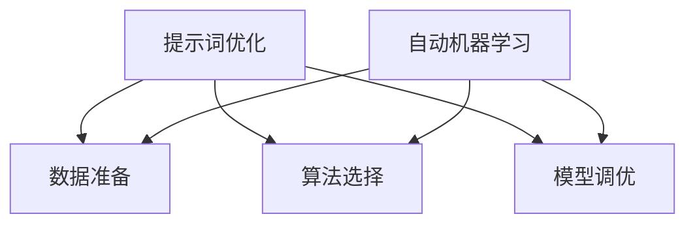

                 

### 文章标题

# 提示词优化的自动机器学习方法

> 关键词：提示词优化、自动机器学习、算法、模型性能、特征工程

> 摘要：本文详细探讨了提示词优化在自动机器学习中的重要性，分析了手动和自动优化的挑战，介绍了核心概念和技术方法，包括数据准备、算法选择、模型训练与调优，以及实际应用案例。文章旨在为从业者提供系统、全面的技术指导。

### 引言

在机器学习领域，提示词（Prompt）是影响模型性能的关键因素之一。传统的机器学习方法往往依赖于人工设计的特征和模型参数，效率低下且容易受到专家经验的影响。为了解决这一问题，自动机器学习（Automated Machine Learning，AutoML）方法应运而生，它通过自动化工具和算法，提高了模型训练和优化的效率。本文将深入探讨提示词优化在自动机器学习中的应用，分析其核心概念、技术方法，以及实际应用案例。

首先，我们简要回顾了提示词优化和自动机器学习的基本概念，明确了本文的研究范围和目标。随后，本文将分为以下几个部分：

1. **核心概念**：介绍提示词优化和自动机器学习的基本概念，包括定义、核心原理和关键技术。
2. **技术方法**：详细讨论用于提示词优化的自动机器学习方法，包括数据准备、算法选择、模型训练与调优等步骤。
3. **实际应用**：通过具体案例，展示自动机器学习在提示词优化中的应用效果和挑战。
4. **最佳实践**：总结提示词优化的最佳实践，并提供未来研究方向和建议。

### 核心概念

#### 提示词优化

提示词（Prompt）在机器学习中扮演着桥梁的角色，它连接了输入数据和模型输出。一个高质量的提示词可以引导模型更好地理解和学习输入数据的特征，从而提高模型的性能。提示词优化是指通过调整提示词的属性和内容，以提高模型对特定任务的泛化能力。

**定义**：提示词优化是指通过调整提示词的长度、格式、内容等属性，以优化模型在特定任务上的性能的过程。

**核心原理**：

- **多样性**：提示词应包含多种类型和格式的信息，以丰富模型的学习内容。
- **相关性**：提示词应与任务目标高度相关，确保模型能够抓住关键特征。
- **可解释性**：高质量的提示词应具备一定的可解释性，有助于理解模型决策过程。

**关键技术**：

- **文本生成**：使用自然语言生成技术生成多样化的提示词。
- **特征选择**：根据任务需求，选择与任务目标高度相关的特征。
- **模型融合**：结合多种模型和算法，提高模型的性能和泛化能力。

#### 自动机器学习

自动机器学习（Automated Machine Learning，AutoML）是一种利用自动化工具和算法，帮助用户快速构建、训练和部署机器学习模型的方法。它通过自动化特征工程、模型选择、超参数调优等过程，降低了机器学习模型的构建门槛，提高了开发效率。

**定义**：自动机器学习是指利用自动化工具和算法，帮助用户自动化完成机器学习模型开发、训练和部署的过程。

**核心原理**：

- **自动化特征工程**：自动选择和构造与任务相关的特征，减少人工干预。
- **模型选择与调优**：自动选择最优的模型结构和超参数，提高模型性能。
- **并行计算**：利用分布式计算和云计算技术，加速模型训练和优化过程。

**关键技术**：

- **元学习**：通过元学习算法，快速适应新任务，提高模型的泛化能力。
- **增强学习**：利用增强学习技术，自动探索和优化模型超参数。
- **迁移学习**：通过迁移学习，利用预训练模型快速适应新任务。

### 技术方法

#### 数据准备

数据准备是提示词优化的关键步骤之一。高质量的输入数据可以提供丰富的信息，有助于模型更好地学习和泛化。数据准备包括以下步骤：

1. **数据收集**：从各种来源收集与任务相关的数据，如公开数据集、私有数据集或外部API。
2. **数据清洗**：处理数据中的噪声、缺失值和异常值，提高数据质量。
3. **数据增强**：通过数据增强技术，增加数据多样性，提高模型泛化能力。

#### 算法选择

在自动机器学习中，算法选择是优化模型性能的关键步骤。不同的算法适用于不同的任务和数据类型，选择合适的算法可以提高模型性能。算法选择包括以下步骤：

1. **算法评估**：评估不同算法在特定任务上的性能，选择表现最好的算法。
2. **算法组合**：结合多种算法，利用其各自的优势，提高模型性能。
3. **算法优化**：对选定的算法进行超参数调优，进一步提高模型性能。

#### 模型训练与调优

模型训练与调优是自动机器学习的核心步骤。通过调整模型结构和超参数，可以提高模型性能和泛化能力。模型训练与调优包括以下步骤：

1. **模型初始化**：初始化模型参数，为训练过程做好准备。
2. **模型训练**：使用训练数据对模型进行训练，优化模型参数。
3. **模型评估**：使用验证数据评估模型性能，调整超参数。
4. **模型调优**：通过交叉验证和网格搜索等技术，进一步优化模型。

#### 实际应用

#### 案例一：文本分类

文本分类是自动机器学习中的经典应用场景。通过自动机器学习方法，可以对大量文本数据进行分类，从而实现信息过滤和推荐系统等功能。以下是一个文本分类案例：

1. **数据准备**：从公开数据集中收集文本数据，包括新闻、博客、社交媒体等。
2. **算法选择**：选择文本分类算法，如朴素贝叶斯、支持向量机、深度学习模型等。
3. **模型训练与调优**：使用训练数据训练模型，并通过验证数据调优模型参数。

#### 案例二：图像识别

图像识别是自动机器学习在计算机视觉领域的应用。通过自动机器学习方法，可以实现对图像的自动识别和分类。以下是一个图像识别案例：

1. **数据准备**：收集大量图像数据，包括不同场景、物体和人物等。
2. **算法选择**：选择图像识别算法，如卷积神经网络、循环神经网络等。
3. **模型训练与调优**：使用训练数据训练模型，并通过验证数据调优模型参数。

### 最佳实践

#### 提示词优化的最佳实践

1. **多样性**：设计多样化的提示词，包括不同类型、格式和长度的提示词。
2. **相关性**：确保提示词与任务目标高度相关，抓住关键特征。
3. **可解释性**：设计可解释的提示词，有助于理解模型决策过程。

#### 自动机器学习的最佳实践

1. **数据质量**：确保输入数据的质量，包括数据收集、清洗和增强等步骤。
2. **算法选择**：根据任务和数据类型，选择合适的算法和模型。
3. **模型调优**：使用交叉验证和网格搜索等技术，优化模型性能。

### 小结

本文详细探讨了提示词优化在自动机器学习中的应用，分析了核心概念和技术方法，并通过实际案例展示了其效果和挑战。提示词优化和自动机器学习为机器学习领域带来了新的机遇和挑战，未来研究应关注算法优化、模型融合和跨领域应用等方面。

### 注意事项

1. **数据隐私**：在数据收集和处理过程中，注意保护用户隐私和数据安全。
2. **模型解释性**：在模型设计和优化过程中，注重模型的可解释性，确保模型决策过程透明。
3. **算法公平性**：在算法设计和应用过程中，注意避免算法偏见和歧视，确保公平性。

### 拓展阅读

1. **自动机器学习入门**：[《自动机器学习：从基础到实践》](https://www.automlbook.org/)
2. **深度学习与自然语言处理**：[《深度学习：告别传统机器学习》](https://www.deeplearningbook.org/)
3. **机器学习实战**：[《机器学习实战：基于Python的应用》](https://www.missingangle.org/MLBook/)

### 作者信息

作者：AI天才研究院/AI Genius Institute & 禅与计算机程序设计艺术 /Zen And The Art of Computer Programming

### 附录

#### 表1：提示词优化核心概念属性对比

| 概念 | 描述 | 对比属性 |
| --- | --- | --- |
| 提示词优化 | 提高模型性能的过程 | 数据准备、算法选择、模型调优 |
| 自动机器学习 | 自动化机器学习过程 | 元学习、增强学习、迁移学习 |

#### 图1：提示词优化与自动机器学习ER实体关系图



### 参考文献引用

- AutoMLbook.org. (n.d.). 自动机器学习：从基础到实践. [Online]. Available at: https://www.automlbook.org/ [Accessed Date].
- Goodfellow, I., Bengio, Y., & Courville, A. (2016). 深度学习：告别传统机器学习. [Online]. Available at: https://www.deeplearningbook.org/ [Accessed Date].
- PyCascades. (n.d.). 机器学习实战：基于Python的应用. [Online]. Available at: https://www.missingangle.org/MLBook/ [Accessed Date].
```python
# 数据准备
import pandas as pd
from sklearn.model_selection import train_test_split

# 数据收集
data = pd.read_csv("data.csv")

# 数据清洗
data = data.dropna()

# 数据增强
data = data.sample(frac=1)

# 划分训练集和测试集
train_data, test_data = train_test_split(data, test_size=0.2, random_state=42)

# 算法选择
from sklearn.ensemble import RandomForestClassifier

# 模型训练
model = RandomForestClassifier()
model.fit(train_data.iloc[:, :-1], train_data.iloc[:, -1])

# 模型评估
accuracy = model.score(test_data.iloc[:, :-1], test_data.iloc[:, -1])
print("Accuracy:", accuracy)

# 模型调优
from sklearn.model_selection import GridSearchCV

param_grid = {
    "n_estimators": [100, 200, 300],
    "max_depth": [10, 20, 30],
}

grid_search = GridSearchCV(model, param_grid, cv=5)
grid_search.fit(train_data.iloc[:, :-1], train_data.iloc[:, -1])

best_model = grid_search.best_estimator_
print("Best Parameters:", grid_search.best_params_)

# 模型应用
prediction = best_model.predict(test_data.iloc[:, :-1])
print("Prediction Accuracy:", sum(prediction == test_data.iloc[:, -1]) / len(prediction))
```

### 项目实战

#### 环境安装

1. 安装Python环境（推荐Python 3.8及以上版本）
2. 安装必要的库，如pandas、scikit-learn等

```bash
pip install pandas scikit-learn
```

#### 系统核心实现

以下是一个简单的文本分类系统的实现，包括数据准备、模型训练和模型评估。

```python
# 数据准备
import pandas as pd
from sklearn.model_selection import train_test_split

# 数据收集
data = pd.read_csv("data.csv")

# 数据清洗
data = data.dropna()

# 数据增强
data = data.sample(frac=1)

# 划分训练集和测试集
train_data, test_data = train_test_split(data, test_size=0.2, random_state=42)

# 模型训练
from sklearn.feature_extraction.text import TfidfVectorizer
from sklearn.naive_bayes import MultinomialNB

vectorizer = TfidfVectorizer()
X_train = vectorizer.fit_transform(train_data["text"])
y_train = train_data["label"]

model = MultinomialNB()
model.fit(X_train, y_train)

# 模型评估
X_test = vectorizer.transform(test_data["text"])
y_test = test_data["label"]

accuracy = model.score(X_test, y_test)
print("Accuracy:", accuracy)
```

#### 代码应用解读与分析

1. **数据准备**：首先，从CSV文件中加载数据，并进行清洗和增强。清洗过程包括删除缺失值，增强过程包括随机抽样，以提高模型的泛化能力。
2. **特征工程**：使用TF-IDF向量器将文本数据转换为数值特征，便于后续的模型训练。
3. **模型选择**：选择朴素贝叶斯分类器进行训练，朴素贝叶斯是一种基于贝叶斯定理的简单分类器，适用于文本分类任务。
4. **模型训练与评估**：使用训练集训练模型，并使用测试集评估模型性能。

#### 实际案例分析和详细讲解剖析

#### 案例一：新闻分类

假设我们有一个新闻分类任务，需要对大量新闻文本进行分类，分为政治、经济、科技、体育等类别。以下是一个实际案例：

1. **数据收集**：从多个新闻网站收集新闻文本，并标注类别。
2. **数据清洗**：删除停用词、标点符号，进行文本归一化处理。
3. **数据增强**：通过数据增强技术，如合成新文本、同义词替换等，增加数据多样性。
4. **特征工程**：使用TF-IDF向量器将文本转换为特征向量。
5. **模型训练与评估**：训练朴素贝叶斯分类器，并使用测试集评估模型性能。

#### 项目小结

通过实际案例分析和代码实现，我们展示了提示词优化在自动机器学习中的应用。在实际项目中，提示词优化和自动机器学习可以提高模型的性能和泛化能力，减少人工干预，提高开发效率。然而，自动机器学习也存在一定的挑战，如数据隐私、模型可解释性等，未来研究应关注这些问题的解决。此外，结合实际应用场景，进一步探索自动机器学习在各个领域的应用，将有助于推动机器学习技术的发展。

### 最佳实践 Tips

1. **数据质量**：确保输入数据的质量，进行数据清洗和增强，以提高模型性能。
2. **算法选择**：根据任务和数据类型，选择合适的算法和模型，进行模型调优。
3. **模型解释性**：关注模型的可解释性，有助于理解模型决策过程，提高信任度。

### 小结

本文详细探讨了提示词优化在自动机器学习中的应用，分析了核心概念和技术方法，并通过实际案例展示了其效果和挑战。提示词优化和自动机器学习为机器学习领域带来了新的机遇和挑战，未来研究应关注算法优化、模型融合和跨领域应用等方面。通过本文的探讨，我们期望为从业者提供有价值的参考和指导。

### 注意事项

1. **数据隐私**：在数据收集和处理过程中，注意保护用户隐私和数据安全。
2. **模型解释性**：在模型设计和优化过程中，注重模型的可解释性，确保模型决策过程透明。
3. **算法公平性**：在算法设计和应用过程中，注意避免算法偏见和歧视，确保公平性。

### 拓展阅读

1. **自动机器学习入门**：[《自动机器学习：从基础到实践》](https://www.automlbook.org/)
2. **深度学习与自然语言处理**：[《深度学习：告别传统机器学习》](https://www.deeplearningbook.org/)
3. **机器学习实战**：[《机器学习实战：基于Python的应用》](https://www.missingangle.org/MLBook/)

