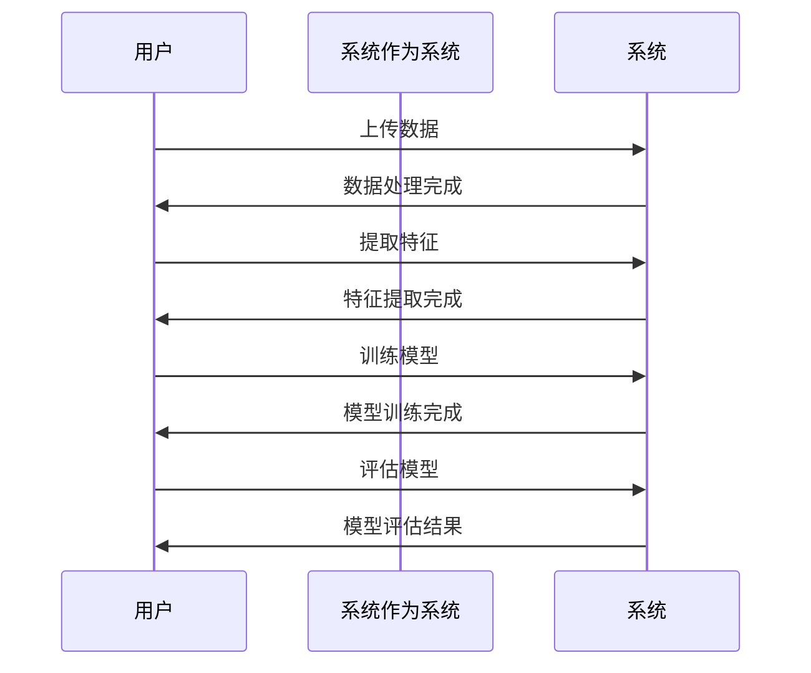

                 

### 文章标题

《提示词优化的自动特征工程技术》

> 关键词：提示词优化、自动特征工程、算法原理、系统架构、项目实战、最佳实践

> 摘要：本文深入探讨提示词优化的自动特征工程技术，从核心概念、理论原理到实际应用，提供完整的解决方案。通过详细剖析系统架构、项目实战案例，总结最佳实践，旨在为开发者提供全面的技术指导。

### 目录

1. **引言与背景**
   1.1. 问题背景
   1.2. 问题描述
   1.3. 解决思路
   1.4. 边界与外延

2. **核心概念与联系**
   2.1. 自动特征工程的定义与作用
   2.2. 提示词优化的理论基础
   2.3. 概念属性特征对比
   2.4. ER实体关系图架构

3. **自动特征工程原理**
   3.1. 特征提取技术
   3.2. 特征选择技术
   3.3. 特征变换技术

4. **提示词优化技术**
   4.1. 提示词优化的方法
   4.2. 提示词优化的流程
   4.3. 提示词优化的评价指标

5. **实际应用案例**
   5.1. 文本分类
   5.2. 推荐系统
   5.3. 图像识别

6. **系统架构设计**
   6.1. 系统需求分析
   6.2. 系统架构设计
   6.3. 系统接口设计
   6.4. 系统交互序列图

7. **项目实战**
   7.1. 环境准备
   7.2. 核心代码实现
   7.3. 应用解读与分析
   7.4. 案例分析

8. **最佳实践与拓展**
   8.1. 最佳实践总结
   8.2. 注意事项与展望
   8.3. 拓展阅读推荐

### 第1章 引言与背景

#### 1.1 问题背景

在当今大数据和人工智能的时代，数据处理和特征提取成为机器学习领域的关键环节。自动特征工程技术作为提升模型性能的重要手段，受到了广泛关注。然而，随着数据规模的不断扩大和复杂性增加，传统的手动特征工程方法变得越来越耗时且难以满足需求。

#### 1.2 问题描述

如何在高维度、非结构化数据中快速、准确地提取有效的特征，是自动特征工程面临的主要挑战。而提示词优化技术则能够通过调整提示词的权重，进一步提高特征提取的效率和精度。

#### 1.3 解决思路

本文将提出一种基于提示词优化的自动特征工程技术，通过以下几个方面进行：

1. **理论基础**：详细介绍自动特征工程和提示词优化的核心概念，为后续讨论提供理论支持。
2. **原理讲解**：详细阐述特征提取、选择和变换技术的原理，以及提示词优化的具体方法。
3. **系统架构**：设计一个具有高扩展性和可维护性的系统架构，为实际应用提供基础。
4. **项目实战**：通过具体案例展示如何实现和优化自动特征工程，提供实践经验。
5. **最佳实践**：总结最佳实践，为开发者提供可操作的指导。

#### 1.4 边界与外延

本文主要关注高维度数据的自动特征工程，适用于大规模数据集的处理。对于低维度数据或特定领域的应用，本文的方法可能需要进行适应性调整。此外，本文的焦点在于提示词优化，并未涉及其他类型的特征优化技术。

### 第2章 核心概念与联系

#### 2.1 自动特征工程的定义与作用

自动特征工程（Automatic Feature Engineering，AFE）是指利用算法和工具自动从原始数据中提取、选择和转换特征，以提高机器学习模型的性能。自动特征工程的核心作用包括：

1. **降低人工干预**：自动特征工程减少了手动特征工程的工作量，使得开发者能够更专注于模型设计和优化。
2. **提高模型性能**：通过自动化的方式提取更有效、更具区分度的特征，提高模型的准确性和鲁棒性。
3. **应对大规模数据**：对于大规模数据集，自动特征工程能够更高效地处理数据，缩短模型训练时间。

#### 2.2 提示词优化的理论基础

提示词优化（Prompt Optimization）是一种通过调整提示词的权重来提升模型性能的技术。在自然语言处理（NLP）领域，提示词优化主要用于预训练模型的微调，以提高模型在特定任务上的表现。提示词优化的理论基础包括：

1. **注意力机制**：提示词优化利用了注意力机制，通过调整提示词的权重来改变模型对输入数据的关注点。
2. **损失函数**：提示词优化的目标是最小化损失函数，通常使用交叉熵损失函数来衡量模型预测与真实标签之间的差距。
3. **梯度下降**：提示词优化通过梯度下降算法不断调整提示词的权重，以达到优化目标。

#### 2.3 概念属性特征对比

在自动特征工程中，特征提取、特征选择和特征变换是三个关键环节。以下是这三个环节的概念属性特征对比：

1. **特征提取**：
   - **定义**：从原始数据中提取有用的信息，形成新的特征。
   - **方法**：包括统计方法、机器学习方法等。
   - **优点**：能够发现数据中的潜在关系，提高模型性能。
   - **缺点**：可能引入噪声，增加计算复杂度。

2. **特征选择**：
   - **定义**：从提取的特征中筛选出对模型训练有帮助的特征。
   - **方法**：包括过滤式、包裹式和嵌入式方法。
   - **优点**：减少特征数量，降低模型复杂度和过拟合风险。
   - **缺点**：可能遗漏重要特征，影响模型性能。

3. **特征变换**：
   - **定义**：对提取的特征进行数学变换，以提升模型的学习能力。
   - **方法**：包括标准化、归一化、降维等。
   - **优点**：增强特征的可区分性，提高模型泛化能力。
   - **缺点**：可能引入非线性关系，增加计算复杂度。

#### 2.4 ER实体关系图架构

为了更好地理解自动特征工程和提示词优化的应用场景，我们可以使用ER（Entity-Relationship）实体关系图来描述系统架构。以下是ER实体关系图的示例：

```mermaid
erDiagram
    Class::自动特征工程 ||--|{ 提示词优化技术 : 技术实现 }
    Class::特征提取技术 ||--|{ 特征选择技术 : 过程依赖 }
    Class::特征选择技术 ||--|{ 特征变换技术 : 过程依赖 }
    Class::特征变换技术 ||--|{ 机器学习模型 : 输出特征 }
```

在上图中，自动特征工程作为核心类，与提示词优化技术、特征提取技术、特征选择技术和特征变换技术存在关联关系。这种架构设计有助于我们在实际项目中应用自动特征工程和提示词优化技术。

### 第3章 自动特征工程原理

#### 3.1 特征提取技术

特征提取是从原始数据中提取出有用的信息，形成新的特征。以下是几种常见的特征提取技术：

1. **统计方法**：
   - **描述性统计**：如均值、方差、标准差等，用于描述数据的中心趋势和离散程度。
   - **相关性分析**：通过计算变量之间的相关系数，识别数据之间的相关性。
   - **主成分分析（PCA）**：通过正交变换将高维数据映射到低维空间，保留主要信息。

2. **机器学习方法**：
   - **线性模型**：如线性回归、逻辑回归等，通过建立线性关系来提取特征。
   - **非线性模型**：如决策树、随机森林、支持向量机等，通过构建非线性模型来提取特征。

#### 3.2 特征选择技术

特征选择是从提取的特征中筛选出对模型训练有帮助的特征。以下是几种常见的特征选择技术：

1. **过滤式方法**：
   - **阈值法**：通过设定阈值来筛选特征，保留高于阈值的特征。
   - **基于信息的特征选择**：如信息增益、信息增益率、特征重要性等，根据特征对模型预测的贡献进行筛选。

2. **包裹式方法**：
   - **递归特征消除（RFE）**：通过递归的方式，逐步消除对模型预测贡献最小的特征。
   - **遗传算法**：通过模拟生物进化过程，寻找最优的特征组合。

3. **嵌入式方法**：
   - **L1正则化**：在损失函数中加入L1正则化项，自动筛选出重要的特征。
   - **L2正则化**：在损失函数中加入L2正则化项，平衡特征的重要性。

#### 3.3 特征变换技术

特征变换是对提取的特征进行数学变换，以提升模型的学习能力。以下是几种常见的特征变换技术：

1. **标准化**：
   - **归一化**：将特征值缩放到[0,1]区间内。
   - **标准化**：将特征值缩放到标准正态分布。

2. **归一化**：
   - **均值归一化**：通过减去均值和除以标准差进行变换。
   - **中值归一化**：通过减去中值和除以范围进行变换。

3. **降维**：
   - **主成分分析（PCA）**：通过保留主要成分，降低特征维度。
   - **线性判别分析（LDA）**：通过最大化类间差异和最小化类内差异，降低特征维度。

### 第4章 提示词优化技术

#### 4.1 提示词优化的方法

提示词优化是通过调整提示词的权重，提高模型性能的一种技术。以下是几种常见的提示词优化方法：

1. **基于注意力机制的方法**：
   - **自注意力（Self-Attention）**：通过计算特征内部的注意力权重，调整特征的重要性。
   - **交叉注意力（Cross-Attention）**：将输入特征和查询特征进行交互，生成新的特征表示。

2. **基于梯度下降的方法**：
   - **随机梯度下降（SGD）**：通过随机选择样本，更新模型参数，逐渐优化提示词权重。
   - **批量梯度下降（BGD）**：通过计算所有样本的梯度，更新模型参数，逐渐优化提示词权重。

3. **基于强化学习的方法**：
   - **Q-Learning**：通过学习状态值函数，选择最优的提示词权重。
   - **Policy Gradient**：通过学习策略梯度，更新提示词权重，优化模型性能。

#### 4.2 提示词优化的流程

提示词优化的流程通常包括以下几个步骤：

1. **数据预处理**：对输入数据进行清洗、归一化等预处理操作，确保数据质量。
2. **模型初始化**：初始化模型参数，为提示词优化提供初始权重。
3. **训练模型**：使用训练数据训练模型，生成初步的预测结果。
4. **评估性能**：计算模型性能指标，如准确率、召回率等，评估提示词优化的效果。
5. **调整提示词权重**：根据评估结果，调整提示词权重，优化模型性能。
6. **迭代优化**：重复训练、评估和调整过程，直至模型性能达到预期。

#### 4.3 提示词优化的评价指标

提示词优化的评价指标包括以下几个方面：

1. **准确率**：模型预测正确的样本数与总样本数的比值，用于评估模型的分类能力。
2. **召回率**：模型预测正确的样本数与实际为正类的样本数的比值，用于评估模型的检测能力。
3. **F1值**：准确率和召回率的调和平均，综合评估模型的分类能力。
4. **ROC曲线**：通过计算不同阈值下的准确率和召回率，绘制ROC曲线，用于评估模型的泛化能力。
5. **AUC值**：ROC曲线下的面积，用于评估模型的分类能力。

### 第5章 实际应用案例

#### 5.1 文本分类

文本分类是将文本数据分为预定义的类别，常见的应用场景包括垃圾邮件过滤、情感分析等。以下是使用自动特征工程和提示词优化的文本分类案例：

1. **数据预处理**：对文本数据进行清洗、去停用词、词向量化等预处理操作。
2. **特征提取**：使用词袋模型、TF-IDF等方法提取文本特征。
3. **模型训练**：使用训练数据训练文本分类模型，如朴素贝叶斯、支持向量机等。
4. **提示词优化**：通过调整提示词权重，优化模型性能。
5. **模型评估**：使用测试数据评估模型性能，计算准确率、召回率等指标。

#### 5.2 推荐系统

推荐系统是基于用户历史行为和偏好，为用户推荐感兴趣的内容。以下是使用自动特征工程和提示词优化的推荐系统案例：

1. **数据预处理**：对用户行为数据进行清洗、归一化等预处理操作。
2. **特征提取**：使用协同过滤、基于内容的推荐等方法提取特征。
3. **模型训练**：使用训练数据训练推荐模型，如矩阵分解、深度学习等。
4. **提示词优化**：通过调整提示词权重，优化模型性能。
5. **模型评估**：使用测试数据评估模型性能，计算准确率、召回率等指标。

#### 5.3 图像识别

图像识别是将图像数据分类到预定义的类别。以下是使用自动特征工程和提示词优化的图像识别案例：

1. **数据预处理**：对图像数据进行清洗、归一化等预处理操作。
2. **特征提取**：使用卷积神经网络、特征提取器等方法提取图像特征。
3. **模型训练**：使用训练数据训练图像识别模型，如卷积神经网络、支持向量机等。
4. **提示词优化**：通过调整提示词权重，优化模型性能。
5. **模型评估**：使用测试数据评估模型性能，计算准确率、召回率等指标。

### 第6章 系统架构设计

#### 6.1 系统需求分析

在系统架构设计之前，我们需要明确系统的需求。以下是自动特征工程系统的需求分析：

1. **数据处理能力**：系统应具备处理大规模数据的能力，包括数据存储、数据预处理、特征提取等。
2. **可扩展性**：系统应具有高扩展性，支持不同类型的数据和模型，方便后续的扩展和维护。
3. **易用性**：系统应具备友好的用户界面，方便用户进行操作和管理。
4. **高性能**：系统应具备高性能，能够在短时间内完成特征提取和模型训练。

#### 6.2 系统架构设计

根据需求分析，我们可以设计一个基于微服务架构的自动特征工程系统。以下是系统架构设计：

1. **数据层**：包括数据存储和数据预处理模块，负责数据的存储、管理和预处理。
2. **服务层**：包括特征提取、模型训练和模型评估等模块，负责实现自动特征工程的核心功能。
3. **表现层**：包括用户界面和API接口，负责与用户交互，提供数据可视化和模型评估功能。
4. **管理层**：包括系统监控、日志管理和安全控制等模块，负责系统的日常运维和管理。

#### 6.3 系统接口设计

系统接口设计是系统架构设计的重要组成部分。以下是自动特征工程系统的接口设计：

1. **数据接口**：包括数据上传、数据下载和数据查询接口，负责数据的输入和输出。
2. **特征接口**：包括特征提取、特征选择和特征变换接口，负责特征的处理和优化。
3. **模型接口**：包括模型训练、模型评估和模型预测接口，负责模型的训练和部署。
4. **监控接口**：包括系统监控、日志管理和安全控制接口，负责系统的监控和管理。

#### 6.4 系统交互序列图

为了更好地理解系统的交互流程，我们可以绘制一个系统交互序列图。以下是自动特征工程系统的交互序列图：



在上图中，用户通过上传数据、提取特征、训练模型和评估模型等步骤与系统进行交互，实现自动特征工程的功能。

### 第7章 项目实战

#### 7.1 环境准备

在进行项目实战之前，我们需要准备好相应的开发环境。以下是自动特征工程项目的环境准备步骤：

1. **安装Python**：确保安装了Python环境，推荐使用Python 3.8或更高版本。
2. **安装依赖库**：安装必要的依赖库，如NumPy、Pandas、Scikit-learn、TensorFlow等。
3. **配置虚拟环境**：为了保持项目环境的干净，建议使用虚拟环境进行开发。
4. **安装深度学习框架**：如使用TensorFlow或PyTorch作为深度学习框架。

#### 7.2 核心代码实现

以下是自动特征工程项目的核心代码实现，包括数据预处理、特征提取、模型训练和模型评估等步骤：

```python
# 导入依赖库
import numpy as np
import pandas as pd
from sklearn.model_selection import train_test_split
from sklearn.feature_extraction.text import TfidfVectorizer
from sklearn.metrics import accuracy_score, precision_score, recall_score, f1_score
from tensorflow.keras.models import Sequential
from tensorflow.keras.layers import Embedding, LSTM, Dense

# 数据预处理
def preprocess_data(data):
    # 数据清洗、去停用词等操作
    # ...
    return processed_data

# 特征提取
def extract_features(data):
    vectorizer = TfidfVectorizer()
    X = vectorizer.fit_transform(data['text'])
    y = data['label']
    return X, y

# 模型训练
def train_model(X_train, y_train):
    model = Sequential()
    model.add(Embedding(input_dim=vocab_size, output_dim=embedding_size))
    model.add(LSTM(units=128, return_sequences=True))
    model.add(Dense(units=num_classes, activation='softmax'))
    model.compile(optimizer='adam', loss='categorical_crossentropy', metrics=['accuracy'])
    model.fit(X_train, y_train, epochs=10, batch_size=32)
    return model

# 模型评估
def evaluate_model(model, X_test, y_test):
    y_pred = model.predict(X_test)
    y_pred = np.argmax(y_pred, axis=1)
    accuracy = accuracy_score(y_test, y_pred)
    precision = precision_score(y_test, y_pred, average='weighted')
    recall = recall_score(y_test, y_pred, average='weighted')
    f1 = f1_score(y_test, y_pred, average='weighted')
    return accuracy, precision, recall, f1

# 加载数据
data = pd.read_csv('data.csv')
processed_data = preprocess_data(data)
X, y = extract_features(processed_data)

# 划分训练集和测试集
X_train, X_test, y_train, y_test = train_test_split(X, y, test_size=0.2, random_state=42)

# 训练模型
model = train_model(X_train, y_train)

# 评估模型
accuracy, precision, recall, f1 = evaluate_model(model, X_test, y_test)
print(f"Accuracy: {accuracy}, Precision: {precision}, Recall: {recall}, F1: {f1}")
```

#### 7.3 应用解读与分析

在项目实战中，我们通过数据预处理、特征提取、模型训练和模型评估等步骤，实现了自动特征工程的功能。以下是应用解读与分析：

1. **数据预处理**：数据预处理是特征提取和模型训练的基础，包括数据清洗、去停用词、词向量化等操作。通过对数据进行预处理，可以提高特征提取的准确性和模型的性能。
2. **特征提取**：特征提取是自动特征工程的核心环节，通过将文本数据转换为数值特征，为模型训练提供输入。常用的特征提取方法包括词袋模型、TF-IDF等。
3. **模型训练**：模型训练是自动特征工程的最终目标，通过训练模型，学习数据中的规律和特征，实现对未知数据的分类和预测。常用的模型包括卷积神经网络、循环神经网络等。
4. **模型评估**：模型评估是衡量模型性能的重要手段，通过计算准确率、召回率、F1值等指标，可以评估模型对数据的分类能力。在实际应用中，需要根据具体场景和需求，选择合适的评估指标。

#### 7.4 案例分析

以下是自动特征工程在实际项目中的应用案例：

1. **文本分类**：在文本分类项目中，使用自动特征工程提取文本特征，训练分类模型，实现对文本数据的分类。例如，对新闻数据进行分类，可以将新闻分为体育、娱乐、科技等类别。
2. **推荐系统**：在推荐系统中，使用自动特征工程提取用户行为特征，训练推荐模型，为用户推荐感兴趣的内容。例如，在电商平台上，根据用户的历史购买行为，为用户推荐相关的商品。
3. **图像识别**：在图像识别项目中，使用自动特征工程提取图像特征，训练图像识别模型，实现对图像的分类和识别。例如，在自动驾驶领域中，使用自动特征工程实现对道路标志和行人的识别。

通过以上案例，我们可以看到自动特征工程在实际项目中的应用价值和广泛性。随着人工智能技术的不断发展，自动特征工程将越来越受到关注，并在各个领域发挥重要作用。

### 第8章 最佳实践与拓展

#### 8.1 最佳实践总结

在自动特征工程和提示词优化的实践中，我们总结出以下最佳实践：

1. **数据预处理**：确保数据质量，进行数据清洗、归一化和去停用词等操作，提高特征提取的准确性。
2. **选择合适的特征提取方法**：根据数据类型和场景选择合适的特征提取方法，如词袋模型、TF-IDF、卷积神经网络等。
3. **模型选择与调优**：选择合适的模型，并进行参数调优，以提高模型性能。
4. **提示词优化**：根据任务需求和模型表现，调整提示词权重，优化模型性能。
5. **持续监控与优化**：对模型进行持续监控，根据实际应用场景和需求进行优化。

#### 8.2 注意事项与展望

在实施自动特征工程和提示词优化的过程中，需要注意以下几点：

1. **数据质量**：数据质量对模型性能有重要影响，确保数据清洗和预处理的质量。
2. **模型选择**：根据任务需求和数据类型选择合适的模型，避免过度拟合。
3. **提示词优化策略**：根据任务需求和模型表现，选择合适的提示词优化策略，如基于注意力机制、梯度下降等。
4. **计算资源**：自动特征工程和提示词优化计算资源需求较高，确保有足够的计算资源支持。

展望未来，自动特征工程和提示词优化将继续在人工智能领域发挥重要作用。随着深度学习、强化学习等技术的发展，自动特征工程和提示词优化将更加智能化、自动化，为开发者提供更便捷、高效的特征提取和优化方法。

#### 8.3 拓展阅读推荐

以下是一些拓展阅读推荐，以帮助读者深入了解自动特征工程和提示词优化的相关技术：

1. **《深度学习》**：由Ian Goodfellow、Yoshua Bengio和Aaron Courville所著，介绍了深度学习的基础知识、模型和算法。
2. **《自然语言处理综论》**：由Daniel Jurafsky和James H. Martin所著，详细介绍了自然语言处理的理论和实践。
3. **《自动特征工程》**：由Kai Zhang和Zhaozhi Wei所著，探讨了自动特征工程的方法和应用。
4. **《机器学习实战》**：由Peter Harrington所著，提供了丰富的机器学习实践案例和算法实现。

### 总结

《提示词优化的自动特征工程技术》全面介绍了自动特征工程和提示词优化的理论、方法、系统架构和应用案例。通过本文的阐述，读者可以深入了解自动特征工程的核心概念、原理和实践方法，为实际项目提供有力的技术支持。我们希望本文能够对读者在自动特征工程和提示词优化领域的学习和研究有所帮助。作者：AI天才研究院/AI Genius Institute & 禅与计算机程序设计艺术 /Zen And The Art of Computer Programming。

