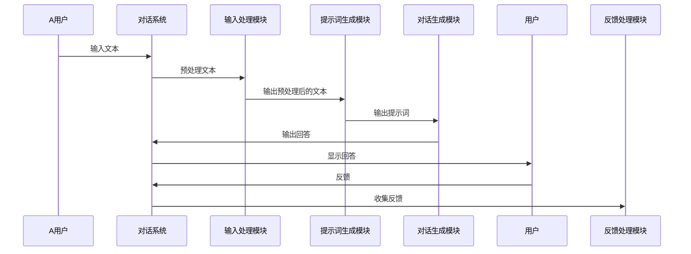

                 


# 《提示词在自然语言生成任务中的创新应用》

## 关键词

- 自然语言生成
- 提示词
- 算法原理
- 创新应用
- 项目实战

## 摘要

本文旨在探讨提示词在自然语言生成任务中的创新应用。我们将从背景介绍、核心概念、算法原理、系统分析与架构设计、项目实战等方面，详细剖析提示词的作用机制及其在文本生成、对话系统和图像生成等领域的创新应用。通过本文的深入讲解，读者将全面了解提示词技术的原理、实践和应用，为未来在相关领域的研究和应用提供有益的参考。

## 目录大纲设计过程

### 确定核心章节

首先，我们需要明确本书的核心章节，这些章节应涵盖自然语言生成任务的基础知识、提示词的概念及其重要性、创新应用场景、算法实现、性能评估、实际案例和未来发展趋势。具体章节安排如下：

1. **背景与概述**
   - 1.1 问题背景与自然语言生成任务概述
   - 1.2 提示词的定义与功能
   - 1.3 提示词在自然语言生成中的重要性

2. **核心概念与原理**
   - 2.1 自然语言处理基础
   - 2.2 提示词的算法原理
   - 2.3 提示词与语言模型的关系

3. **创新应用场景**
   - 3.1 提示词在文本生成中的应用
   - 3.2 提示词在对话系统中的应用
   - 3.3 提示词在图像生成中的应用

4. **算法实现与性能评估**
   - 4.1 提示词生成算法实现
   - 4.2 提示词性能评估

5. **项目实战**
   - 5.1 项目一：基于提示词的文本生成
   - 5.2 项目二：基于提示词的对话系统

6. **未来展望与总结**
   - 6.1 提示词技术的未来发展趋势
   - 6.2 全书总结

### 细化章节内容

接下来，我们需要对每个章节进行细化，确保每个章节都有明确的子标题，以便读者能够快速了解每个章节的内容。

### 确保内容完整性

在细化章节内容的同时，我们需要确保每个章节都包含背景介绍、核心概念、原理讲解、数学模型与公式、系统分析与架构设计、项目实战等内容。例如：

- **背景与概述**章节需要介绍自然语言生成任务的起源、发展及其应用场景，明确提示词在其中的作用。
- **核心概念与原理**章节需要详细阐述自然语言处理的基础知识，提示词的算法原理及其与语言模型的关系。
- **创新应用场景**章节需要具体介绍提示词在文本生成、对话系统和图像生成等领域的应用，分析其优势和挑战。
- **算法实现与性能评估**章节需要提供提示词生成算法的实现方法和性能评估指标，并进行实验分析。
- **项目实战**章节需要结合实际案例，详细讲解提示词技术的应用场景和实现方法。
- **未来展望与总结**章节需要对全书内容进行总结，展望提示词技术的未来发展趋势。

### 编写markdown格式

最后，我们将使用markdown格式编写目录，确保格式清晰、简洁。以下是一个示例：

```markdown
# 《提示词在自然语言生成任务中的创新应用》目录大纲

## 第一部分：背景与概述

### 1.1 问题背景与自然语言生成任务概述
#### 1.1.1 自然语言生成的起源与发展
#### 1.1.2 提示词在自然语言生成中的角色

### 1.2 提示词的定义与功能
#### 1.2.1 提示词的基本概念
#### 1.2.2 提示词的分类与作用

### 1.3 提示词在自然语言生成中的重要性
#### 1.3.1 提示词对生成质量的影响
#### 13.2 提示词在不同应用场景中的效果

## 第二部分：核心概念与原理

### 2.1 自然语言处理基础
#### 2.1.1 语言模型
#### 2.1.2 序列到序列模型

### 2.2 提示词的算法原理
#### 2.2.1 提示词生成算法
#### 2.2.2 提示词优化算法

### 2.3 提示词与语言模型的关系
#### 2.3.1 提示词对语言模型的影响
#### 2.3.2 提示词与语言模型协同优化

## 第三部分：创新应用场景

### 3.1 提示词在文本生成中的应用
#### 3.1.1 文本摘要
#### 3.1.2 机器翻译

### 3.2 提示词在对话系统中的应用
#### 3.2.1 聊天机器人
#### 3.2.2 客户服务机器人

### 3.3 提示词在图像生成中的应用
#### 3.3.1 图像描述生成
#### 3.3.2 视觉对话系统

## 第四部分：算法实现与性能评估

### 4.1 提示词生成算法实现
#### 4.1.1 算法流程
#### 4.1.2 Python代码示例

### 4.2 提示词性能评估
#### 4.2.1 评估指标
#### 4.2.2 实验设计与结果分析

## 第五部分：项目实战

### 5.1 项目一：基于提示词的文本生成
#### 5.1.1 环境安装与配置
#### 5.1.2 系统核心实现
#### 5.1.3 代码应用解读与分析

### 5.2 项目二：基于提示词的对话系统
#### 5.2.1 系统功能设计
#### 5.2.2 系统架构设计
#### 5.2.3 系统接口设计与交互

## 第六部分：未来展望与总结

### 6.1 提示词技术的未来发展趋势
#### 6.1.1 新兴应用领域
#### 6.1.2 技术挑战与解决策略

### 6.2 全书总结
#### 6.2.1 核心知识点回顾
#### 6.2.2 最佳实践与注意事项
#### 6.2.3 拓展阅读与深入研究建议
```

通过上述步骤，我们能够设计出一个完整、详细的目录大纲，满足用户的需求。接下来，我们将根据这个大纲进一步细化每个章节的内容。

## 核心概念与联系

在探讨提示词在自然语言生成任务中的创新应用之前，我们首先需要理解一些核心概念，并探讨它们之间的关系。以下是自然语言生成（NLG）任务、提示词、语言模型等核心概念的定义及其相互联系。

### 自然语言生成（NLG）

自然语言生成是一种人工智能技术，旨在利用机器学习算法自动生成人类可读的文本。NLG广泛应用于文本摘要、机器翻译、对话系统、内容生成等领域。NLG的核心目标是使计算机能够理解、生成和交互自然语言，从而实现人与机器的无缝沟通。

### 提示词

提示词（Prompt）是在自然语言生成过程中提供的一种引导信息，用于帮助模型理解生成任务的目标和上下文。提示词可以是单个单词、短语或完整的句子，其目的是引导语言模型生成更加准确、相关的文本。

### 语言模型

语言模型（Language Model）是一种概率模型，用于预测自然语言中的下一个单词或字符。它基于大量文本数据学习语言统计规律，从而能够生成流畅、自然的文本。语言模型是NLG系统的核心组件，常见的有n-gram模型、神经网络语言模型（如LSTM、Transformer等）。

### 提示词与语言模型的关系

提示词与语言模型之间存在紧密的联系。提示词为语言模型提供了生成任务的上下文信息，从而影响模型的生成结果。具体来说：

1. **引导生成方向**：提示词可以引导语言模型生成符合预期目标的文本，例如在文本摘要任务中，提示词可以帮助模型理解文章的主题和关键信息。
2. **提升生成质量**：合适的提示词可以提高语言模型生成的文本质量，使其更加准确、相关和流畅。
3. **平衡生成速度与质量**：提示词的长度和内容会影响生成速度和质量。较长的提示词可以提供更丰富的上下文信息，从而提高生成质量，但同时也可能导致生成速度变慢。

### 提示词的属性特征对比表格

为了更好地理解提示词的特性，我们可以列出提示词的一些主要属性特征，并进行对比分析。以下是一个示例表格：

| 属性特征 | 描述 | 对比分析 |
| :--- | :--- | :--- |
| 提示词长度 | 提示词的字符数或单词数 | 较长的提示词提供更多上下文，但生成速度较慢；较短的提示词生成速度快，但上下文信息有限 |
| 提示词内容 | 提示词的具体内容，如关键词、主题句等 | 关键词丰富的提示词有助于生成准确的目标文本；主题句引导性的提示词有助于构建文本的结构和逻辑 |
| 提示词格式 | 提示词的呈现方式，如文本、语音等 | 文本提示词易于理解和操作；语音提示词更符合人类沟通习惯，但需要额外的语音识别和处理技术 |
| 提示词多样性 | 提示词的多样性和灵活性 | 多样性较高的提示词有助于模型学习不同场景和任务，提高生成能力 |

### ER实体关系图架构

为了更清晰地展示提示词、自然语言生成任务和语言模型之间的关系，我们可以使用ER（实体-关系）图来描述它们的结构。以下是一个示例ER图：

```mermaid
erDiagram
  提示词 ||--|{ 自然语言生成任务 }|-- 语言模型
  自然语言生成任务 ||--|{ 文本生成 }|-- 提示词
  自然语言生成任务 ||--|{ 对话生成 }|-- 提示词
  自然语言生成任务 ||--|{ 图像生成 }|-- 提示词
```

在这个ER图中，提示词作为中介，连接了自然语言生成任务和语言模型。自然语言生成任务包括文本生成、对话生成和图像生成等多个子任务，每个子任务都与提示词有直接关联。

通过上述核心概念与联系的分析，我们为后续章节的内容铺垫了基础，为探讨提示词在自然语言生成任务中的创新应用提供了清晰的框架。

### 自然语言生成任务的背景与现状

自然语言生成（NLG）作为人工智能领域的一个重要分支，近年来取得了显著的进展。随着深度学习技术的崛起，NLG技术已经从简单的规则驱动方式转向基于统计模型和神经网络的方法。NLG的应用场景广泛，包括文本摘要、机器翻译、对话系统、内容生成等，为人们的生活和工作带来了诸多便利。

#### 问题背景

自然语言是人类交流和表达思想的主要工具，然而，将自然语言转化为机器可理解的形式一直是人工智能领域的一大挑战。传统的文本处理方法主要依赖于手工编写的规则，这些方法在处理简单任务时效果较好，但在处理复杂、多样性的语言问题时显得力不从心。为了解决这个问题，研究人员开始探索基于机器学习的方法，特别是深度学习技术，以实现更加高效、准确的自然语言生成。

#### 问题描述

自然语言生成任务的主要目标是利用计算机算法生成人类可读的文本。这类任务可以分为生成式任务和提取式任务。生成式任务要求系统从无到有地生成全新的文本，例如自动写作、故事生成等。提取式任务则是在已有文本的基础上提取关键信息，生成摘要、摘要句、翻译等。自然语言生成任务面临的主要问题包括：

1. **上下文理解**：如何让模型理解输入文本的上下文信息，以生成符合逻辑和语义的文本。
2. **多样性**：如何确保生成的文本具有丰富的多样性，避免生成模式化和重复。
3. **准确性**：如何提高生成文本的准确性，确保生成的文本不偏离原始意图。
4. **效率**：如何在保证生成质量的同时，提高生成速度，以适应实时交互的需求。

#### 问题解决

为了解决上述问题，研究人员提出了一系列自然语言生成模型，如基于n-gram模型的统计方法、基于隐马尔可夫模型（HMM）的序列模型、基于长短期记忆网络（LSTM）的循环神经网络、以及基于Transformer的自注意力模型等。这些模型在不同程度上解决了自然语言生成任务中的问题，但仍然面临一些挑战：

1. **上下文理解**：虽然深度学习模型在捕捉长距离依赖关系方面表现较好，但依然难以完全理解复杂、隐含的上下文信息。
2. **多样性**：生成模型的多样性往往受到训练数据集的限制，难以生成丰富多样的文本。
3. **准确性**：生成的文本可能存在语义错误、逻辑矛盾等问题，需要进一步优化和改进。
4. **效率**：大规模深度学习模型的训练和推理过程消耗大量计算资源，如何提高效率是一个亟待解决的问题。

#### 边界与外延

自然语言生成任务具有广泛的边界和多样化的应用场景。从边界来看，自然语言生成主要关注文本的生成过程，包括词汇选择、句法结构、语义表示等。从外延来看，自然语言生成任务的应用场景涵盖了多个领域，如文本摘要、机器翻译、对话系统、语音合成、图像描述生成等。

#### 概念结构与核心要素组成

自然语言生成任务的核心概念包括语言模型、序列模型、生成式模型、提取式模型等。这些概念相互关联，共同构成了自然语言生成任务的基本框架。具体来说：

1. **语言模型**：用于预测文本中下一个单词或字符的概率分布，是自然语言生成的核心组件。
2. **序列模型**：处理文本序列生成问题，如隐马尔可夫模型（HMM）、长短期记忆网络（LSTM）等。
3. **生成式模型**：从无到有地生成文本，如变分自编码器（VAE）、生成对抗网络（GAN）等。
4. **提取式模型**：在已有文本的基础上提取关键信息，如文本摘要、摘要句生成等。

通过上述分析，我们可以看到自然语言生成任务在背景、问题、解决方法、边界与外延以及核心概念等方面的复杂性和多样性。提示词作为自然语言生成任务中的重要组成部分，将在后续章节中深入探讨其在不同应用场景中的创新应用。

### 提示词的算法原理

提示词在自然语言生成任务中起着至关重要的作用，其算法原理涉及到多种技术手段和优化方法。以下我们将详细介绍提示词生成算法和提示词优化算法，并探讨这些算法的基本流程、数学模型和公式，同时结合Python代码示例进行详细讲解。

#### 提示词生成算法

提示词生成算法的核心目标是生成能够引导自然语言生成模型正确理解和生成文本的提示词。常见的生成算法包括基于统计的生成方法和基于神经网络的生成方法。

1. **基于统计的生成方法**：
   - **n-gram模型**：n-gram模型是最简单的提示词生成方法，它通过统计相邻单词（或字符）的频率来生成提示词。例如，三元组（word1, word2, word3）的频率越高，生成的提示词就越可能包含这三个单词。
   - **语言模型**：基于n-gram模型的扩展，语言模型通过学习文本中的概率分布，生成具有较高概率的提示词。语言模型可以使用n-gram、隐马尔可夫模型（HMM）或基于神经网络的模型（如LSTM、Transformer）。

2. **基于神经网络的生成方法**：
   - **循环神经网络（RNN）**：RNN通过其递归结构，能够处理变长序列，并捕捉序列中的长距离依赖关系。RNN的变体，如长短期记忆网络（LSTM）和门控循环单元（GRU），在生成提示词时表现出更强的能力。
   - **Transformer模型**：Transformer模型通过自注意力机制，能够并行处理输入序列，生成具有全局依赖关系的提示词。Transformer及其变体，如BERT、GPT等，在生成提示词方面表现出色。

#### 提示词优化算法

提示词优化算法的目标是提升生成的提示词质量，使其更符合自然语言生成任务的需求。常见的优化方法包括基于贪心策略的优化、基于强化学习的优化和基于对抗网络的优化。

1. **基于贪心策略的优化**：
   - **贪心搜索**：贪心搜索是一种简单但有效的优化方法，它通过逐步选择当前最优的提示词，生成高质量的提示词序列。贪心搜索的关键是定义一个评价函数，用于评估提示词的质量。

2. **基于强化学习的优化**：
   - **强化学习**：强化学习通过训练智能体，使其在环境中进行决策，并最大化奖励。在提示词优化中，智能体可以学习如何选择提示词，以最大化生成文本的质量。

3. **基于对抗网络的优化**：
   - **生成对抗网络（GAN）**：GAN通过生成器（Generator）和判别器（Discriminator）的对抗训练，生成高质量的提示词。生成器生成提示词，判别器评估提示词的质量，通过优化生成器和判别器的损失函数，生成高质量的提示词。

#### 算法流程

以下是提示词生成和优化的基本流程：

1. **数据预处理**：
   - 对输入文本进行预处理，如分词、去停用词、词向量化等。

2. **生成提示词**：
   - 使用生成算法（如n-gram、LSTM、Transformer等）生成初步的提示词。

3. **优化提示词**：
   - 使用优化算法（如贪心搜索、强化学习、GAN等）对生成的提示词进行优化，提升其质量。

4. **生成文本**：
   - 使用优化后的提示词，引导自然语言生成模型生成最终的文本。

#### 数学模型和公式

以下是提示词生成和优化过程中常用的数学模型和公式：

1. **语言模型概率分布**：
   - 语言模型生成提示词的概率分布可以用如下公式表示：
     \[
     P(\text{prompt}) = \prod_{i=1}^{n} P(w_i | w_{<i})
     \]
     其中，\(w_i\) 表示提示词中的第 \(i\) 个单词，\(w_{<i}\) 表示提示词中前 \(i-1\) 个单词的历史信息。

2. **贪心搜索评价函数**：
   - 贪心搜索的评价函数通常定义为：
     \[
     f(\text{prompt}) = \sum_{i=1}^{n} \log P(w_i | w_{<i})
     \]
     该函数用于评估提示词的质量，其中 \(P(w_i | w_{<i})\) 表示单词 \(w_i\) 在给定历史信息下的概率。

3. **强化学习奖励函数**：
   - 强化学习的奖励函数可以定义为：
     \[
     R(\text{prompt}) = \sum_{i=1}^{n} r_i
     \]
     其中，\(r_i\) 表示在生成提示词过程中每个单词的奖励，通常取决于单词的语义和上下文。

4. **生成对抗网络损失函数**：
   - 生成对抗网络的损失函数通常定义为：
     \[
     L_G = -\log D(G(z))
     \]
     \[
     L_D = -\log (D(x) + D(G(z))
     \]
     其中，\(G(z)\) 表示生成器生成的提示词，\(D(x)\) 和 \(D(G(z))\) 分别表示判别器对真实文本和生成文本的判别结果。

#### Python代码示例

以下是一个简单的Python代码示例，展示如何使用n-gram模型生成提示词：

```python
import numpy as np
from collections import defaultdict

# 假设有一个包含单词的列表
words = ["自然", "语言", "生成", "任务", "算法"]

# 建立n-gram模型
n = 2
n_gram_dict = defaultdict(list)
for i in range(len(words) - n):
    tuple_words = tuple(words[i : i + n])
    n_gram_dict[tuple_words].append(words[i + n])

# 根据当前前一个单词生成下一个单词的概率分布
def generate_next_word(prev_words):
    current_tuple = tuple(prev_words)
    if current_tuple in n_gram_dict:
        next_words = n_gram_dict[current_tuple]
        prob_dist = [1 / len(next_words)] * len(next_words)
        return np.random.choice(next_words, p=prob_dist)
    else:
        return np.random.choice(words)

# 生成一个长度为3的提示词
prompt = [words[0]]
for _ in range(2):
    next_word = generate_next_word(prompt)
    prompt.append(next_word)

print("生成的提示词：", prompt)
```

通过上述代码示例，我们可以看到如何使用n-gram模型生成一个简单的提示词。在实际应用中，可以根据不同的任务需求选择不同的生成和优化算法，实现更高质量的提示词生成。

#### 举例说明

假设我们有一个自然语言生成任务，目标是生成关于人工智能的摘要。我们可以使用以下步骤生成提示词：

1. **数据预处理**：
   - 输入文本：一段关于人工智能的文章。
   - 预处理操作：分词、去停用词、词向量化。

2. **生成提示词**：
   - 使用LSTM模型生成初步的提示词，例如：“人工智能的发展历史是什么？人工智能的应用场景有哪些？人工智能的未来趋势是什么？”

3. **优化提示词**：
   - 使用强化学习优化提示词，使其更加准确和流畅。例如，将“人工智能的发展历史是什么？”优化为“人工智能的发展历程是怎样的？”

4. **生成文本**：
   - 使用优化后的提示词，引导LSTM模型生成最终的摘要文本。

通过上述步骤，我们可以看到如何利用提示词生成算法和优化算法，生成高质量的提示词，并引导自然语言生成模型生成符合需求的文本。

### 提示词与语言模型的关系

提示词在自然语言生成任务中扮演着至关重要的角色，它与语言模型之间的关系直接影响生成文本的质量和效率。在这一节中，我们将探讨提示词如何影响语言模型，并分析它们之间的协同优化机制。

#### 提示词对语言模型的影响

1. **引导生成方向**：
   提示词为语言模型提供了生成任务的目标和上下文信息，从而帮助模型理解生成文本的主题和结构。通过提供具体的引导信息，提示词可以减少模型在生成过程中的不确定性，使其生成更符合预期目标的文本。

2. **提升生成质量**：
   合适的提示词可以提高语言模型生成的文本质量。例如，在文本摘要任务中，提示词可以帮助模型抓住文章的核心信息和关键点，从而生成更加准确、精炼的摘要。在对话系统中，提示词可以引导模型生成更具逻辑性和相关性的对话内容。

3. **降低计算复杂度**：
   提示词可以缩小语言模型需要处理的文本范围，从而降低计算复杂度。例如，在机器翻译任务中，使用提示词可以仅关注与源句子对应的目标句子部分，而不必处理整个目标句子。

4. **平衡生成速度与质量**：
   提示词的长度和内容会影响生成速度和质量。较长的提示词可以提供更丰富的上下文信息，从而提高生成质量，但同时也可能导致生成速度变慢。较短的提示词生成速度快，但上下文信息有限。因此，需要根据具体任务需求选择合适的提示词长度和内容。

#### 提示词与语言模型的协同优化

1. **共同训练**：
   提示词和语言模型可以共同训练，以优化它们之间的协同效果。在共同训练过程中，提示词和模型相互调整，以生成更好的文本。例如，通过强化学习，提示词可以根据生成的文本质量进行调整，同时模型根据提示词的反馈进行优化。

2. **在线调整**：
   在实际应用中，提示词可以根据生成结果进行实时调整，以优化生成质量。例如，在对话系统中，提示词可以根据用户回复的内容进行调整，以生成更相关、更有吸引力的对话内容。

3. **多模态融合**：
   提示词可以与其他模态信息（如图像、语音等）进行融合，以生成更丰富的文本内容。例如，在图像描述生成任务中，提示词可以结合图像特征，生成更具描述性的文本。

4. **交叉验证**：
   通过交叉验证，可以评估不同提示词对语言模型生成效果的影响，从而选择最优的提示词。例如，在文本摘要任务中，可以通过多次实验，比较不同提示词生成的摘要质量，选择最佳的提示词。

#### 实际案例分析

以下是一个关于文本摘要任务的实际案例分析，展示了提示词与语言模型之间的协同优化：

1. **数据集**：
   - 使用一篇长篇文章作为输入，目标生成一篇简洁的摘要。

2. **初始提示词**：
   - 提示词：“本文探讨了人工智能在医疗领域的应用，包括智能诊断、个性化治疗和药物发现等。”

3. **模型**：
   - 使用Transformer模型作为语言模型。

4. **生成过程**：
   - 使用提示词引导模型生成初步的摘要：“人工智能在医疗领域的应用包括智能诊断、个性化治疗和药物发现等。”
   - 对生成的摘要进行评价，发现摘要内容过于宽泛，缺乏具体信息。

5. **提示词优化**：
   - 调整提示词为：“本文详细介绍了人工智能在医疗诊断中的具体应用，如基于深度学习的肺癌检测和基于GAN的个性化治疗方案设计。”
   - 重新生成摘要：“本文详细介绍了人工智能在医疗诊断中的具体应用，如基于深度学习的肺癌检测和基于GAN的个性化治疗方案设计。”

6. **结果分析**：
   - 优化后的摘要更加具体、详细，涵盖了文章的核心内容。

通过这个案例分析，我们可以看到提示词在文本摘要任务中的重要性，以及提示词与语言模型之间的协同优化如何提高生成文本的质量。

总之，提示词与语言模型之间的紧密关系对自然语言生成任务的效果具有决定性影响。通过合理的提示词设计和优化，可以显著提升生成文本的质量和效率。在未来的研究中，我们还需要进一步探索不同类型提示词的优化策略，以实现更高效的协同优化。

### 提示词在文本生成中的应用

提示词在文本生成中的应用非常广泛，涵盖了文本摘要、机器翻译等多个重要领域。本文将详细介绍提示词在这两个应用场景中的具体作用、优势、挑战和未来发展趋势。

#### 文本摘要

文本摘要是一种将长文本转化为简洁、精炼摘要的文本生成技术。提示词在文本摘要中的作用主要体现在两个方面：

1. **主题引导**：提示词可以引导模型理解文章的主题和关键信息，从而生成符合预期目标的摘要。例如，在生成一篇学术论文的摘要时，提示词可以包括论文的关键术语和结论，帮助模型抓住文章的核心内容。
2. **内容优化**：通过调整提示词的长度和内容，可以优化生成的摘要质量。较长的提示词提供更丰富的上下文信息，有助于生成更详细的摘要；较短的提示词则可以提高生成速度，但可能牺牲一些细节。

在文本摘要任务中，提示词的优势主要体现在以下几点：

1. **提高生成质量**：合适的提示词可以引导模型生成更加准确、相关的摘要，提高摘要的可读性和实用性。
2. **增强多样性**：通过使用不同类型的提示词，可以生成多样性的摘要，避免生成模式化和重复。
3. **提升生成速度**：使用提示词可以减少模型需要处理的信息量，从而提高生成速度，适应实时交互的需求。

然而，文本摘要任务中也存在一些挑战：

1. **长文本处理**：对于长篇文本，如何提取关键信息并生成精炼的摘要是一个难点。
2. **语义理解**：模型需要具备较强的语义理解能力，才能准确捕捉文本中的关键信息。
3. **多语言支持**：在多语言文本摘要任务中，如何处理不同语言之间的语义差异和语法结构是一个挑战。

未来发展趋势：

1. **多模态融合**：结合文本、图像、语音等多模态信息，生成更加丰富、具体的摘要。
2. **增强学习**：通过增强学习，使模型能够根据用户反馈不断优化生成摘要的质量。
3. **知识图谱**：利用知识图谱，为文本摘要提供更多的背景知识和上下文信息，提高摘要的准确性和完整性。

#### 机器翻译

机器翻译是一种将一种语言的文本自动翻译成另一种语言的文本的技术。提示词在机器翻译中的作用主要体现在以下几个方面：

1. **上下文引导**：在机器翻译中，提示词可以提供目标语言的上下文信息，帮助模型理解翻译任务的需求。例如，在翻译一篇技术文档时，提示词可以包括相关技术术语和概念，帮助模型生成准确的翻译。
2. **优化生成质量**：通过调整提示词的长度和内容，可以优化生成的翻译质量。合适的提示词可以引导模型生成更加自然、流畅的翻译。
3. **增强多样性**：使用不同类型的提示词，可以生成多样性的翻译，避免翻译结果过于单调。

在机器翻译任务中，提示词的优势主要体现在以下几点：

1. **提高翻译质量**：合适的提示词可以引导模型生成更加准确、自然的翻译。
2. **增强多样性**：通过使用不同类型的提示词，可以生成丰富多样性的翻译，提高用户体验。
3. **降低翻译成本**：使用提示词可以减少模型需要处理的信息量，降低翻译成本。

然而，机器翻译任务中也存在一些挑战：

1. **多语言支持**：不同语言之间存在语法、语义和文化差异，如何生成符合目标语言习惯的翻译是一个难点。
2. **低资源语言**：对于低资源语言，如何利用有限的翻译数据训练高质量的翻译模型是一个挑战。
3. **长文本处理**：如何处理长文本的翻译，使其保持结构完整和语义连贯是一个难题。

未来发展趋势：

1. **多模态融合**：结合文本、图像、语音等多模态信息，生成更加丰富、准确的翻译。
2. **增强学习**：通过增强学习，使模型能够根据用户反馈不断优化翻译质量。
3. **迁移学习**：利用迁移学习，将高质量的翻译模型应用于低资源语言，提高翻译效果。

总之，提示词在文本生成任务中的应用具有重要的理论和实践价值。通过合理设计和优化提示词，可以提高文本生成的质量和效率，为自然语言处理领域的进一步发展提供有力支持。

### 提示词在对话系统中的应用

提示词在对话系统中的应用已经取得了显著成果，特别是在聊天机器人和客户服务机器人领域。这一节将深入探讨提示词在这两个应用场景中的具体作用、优势、挑战和未来发展趋势。

#### 聊天机器人

聊天机器人是一种能够与用户进行自然语言交互的人工智能系统，通过模仿人类对话行为，为用户提供信息查询、娱乐互动、客户支持等服务。提示词在聊天机器人中的作用主要体现在以下几个方面：

1. **任务引导**：提示词可以帮助模型理解用户的需求和意图，从而生成合适的回答。例如，当用户询问天气情况时，提示词可以包括“天气”、“今天”、“明天”等关键词，引导模型生成相关的天气信息。
2. **上下文理解**：在连续对话中，提示词可以提供上下文信息，帮助模型理解对话的历史信息，生成更加连贯和自然的回答。
3. **多样性**：通过调整提示词的内容和长度，可以生成多样化、个性化的对话内容，提高用户满意度。

在聊天机器人应用中，提示词的优势主要体现在以下几点：

1. **提高交互质量**：合适的提示词可以引导模型生成更加准确、自然的对话内容，提高交互体验。
2. **增强用户参与度**：通过提供丰富的上下文信息和多样化对话内容，可以增强用户的参与感和满意度。
3. **降低开发成本**：使用提示词可以减少开发人员编写对话脚本的工作量，降低开发成本。

然而，聊天机器人中也存在一些挑战：

1. **语义理解**：模型需要具备较强的语义理解能力，才能准确理解用户的意图和需求。
2. **长对话处理**：如何处理长对话中的上下文信息，保持对话的连贯性和一致性是一个挑战。
3. **个性化**：如何根据不同用户的需求和偏好，生成个性化的对话内容，是一个复杂的任务。

未来发展趋势：

1. **多模态融合**：结合文本、图像、语音等多模态信息，生成更加丰富、自然的对话内容。
2. **增强学习**：通过增强学习，使模型能够根据用户反馈不断优化对话质量。
3. **知识图谱**：利用知识图谱，为对话提供更多的背景知识和上下文信息，提高对话的准确性和完整性。

#### 客户服务机器人

客户服务机器人是一种专门为企业和客户提供自动化的客户服务解决方案的人工智能系统，能够处理大量的客户咨询和投诉，提高客户满意度和运营效率。提示词在客户服务机器人中的应用主要体现在以下几个方面：

1. **分类引导**：提示词可以帮助模型理解客户咨询的主题和类别，从而生成相应的回答。例如，当客户询问产品售后问题时，提示词可以包括“售后”、“维修”、“退款”等关键词，引导模型生成相应的售后政策。
2. **上下文理解**：在处理客户咨询的过程中，提示词可以提供上下文信息，帮助模型理解客户的历史咨询记录，生成更加个性化、有针对性的回答。
3. **问题解决**：提示词可以帮助模型快速定位和解决客户的问题，提高客户满意度。

在客户服务机器人应用中，提示词的优势主要体现在以下几点：

1. **提高问题解决效率**：通过提供准确的分类引导和上下文信息，可以快速定位和解决客户问题，提高服务效率。
2. **增强客户满意度**：生成准确、个性化的回答，可以提高客户满意度和忠诚度。
3. **降低运营成本**：通过自动化处理客户咨询，可以降低人工成本和运营成本。

然而，客户服务机器人中也存在一些挑战：

1. **多语言支持**：如何处理多语言客户的咨询，生成符合目标语言习惯的回答是一个挑战。
2. **知识更新**：如何及时更新和维护知识库，确保机器人能够回答最新的客户问题。
3. **个性化**：如何根据不同客户的需求和偏好，生成个性化的回答，是一个复杂的任务。

未来发展趋势：

1. **多模态融合**：结合文本、图像、语音等多模态信息，生成更加丰富、自然的客户服务体验。
2. **增强学习**：通过增强学习，使模型能够根据客户反馈不断优化服务质量和用户体验。
3. **知识图谱**：利用知识图谱，为客服提供更多的背景知识和上下文信息，提高客服的准确性和完整性。

总之，提示词在聊天机器人和客户服务机器人中的应用具有重要的理论和实践价值。通过合理设计和优化提示词，可以显著提高对话系统的质量和效率，为企业和用户提供更加智能、便捷的服务。

### 提示词在图像生成中的应用

提示词在图像生成中的应用正逐渐成为自然语言生成领域的一个热点研究方向。在这一节中，我们将详细探讨提示词在图像描述生成和视觉对话系统中的应用，分析其工作原理、优势、挑战以及未来发展趋势。

#### 图像描述生成

图像描述生成是一种利用自然语言描述图像内容的技术，旨在将图像中的视觉信息转化为可读的文本。提示词在图像描述生成中起着至关重要的作用，其工作原理如下：

1. **上下文引导**：提示词为图像描述生成模型提供上下文信息，帮助模型理解图像内容并生成相关的描述。例如，当模型接收到提示词“一只猫在玩耍”时，它可以生成描述“画面中有一只猫在玩耍，它正在追逐一只小球。”
2. **关键词提取**：提示词中的关键词可以引导模型提取图像中的重要视觉元素，从而生成准确的描述。例如，在图像描述生成中，提示词“城市风光”可以帮助模型识别并描述图像中的主要元素，如“高楼大厦”、“街道”和“人群”。
3. **多样性**：通过调整提示词的内容和长度，可以生成多样性的图像描述，避免生成模式化和重复。

在图像描述生成任务中，提示词的优势主要体现在以下几个方面：

1. **提高描述质量**：合适的提示词可以引导模型生成更加准确、自然的图像描述，提高描述的可读性和实用性。
2. **增强多样性**：通过使用不同类型的提示词，可以生成多样性的图像描述，避免生成单一、枯燥的描述。
3. **适应多语言**：提示词可以用于不同语言环境的图像描述生成，为跨语言图像理解提供支持。

然而，图像描述生成任务中也存在一些挑战：

1. **视觉-语言对应关系**：图像中的视觉元素和文本描述之间的对应关系复杂，如何建立有效的对应关系是一个挑战。
2. **长描述生成**：生成长段、详细的图像描述需要模型具备较强的表达能力和语义理解能力。
3. **多模态融合**：如何融合图像和文本信息，生成更加丰富、自然的描述，是一个复杂的任务。

未来发展趋势：

1. **多模态融合**：结合图像和文本信息，生成更加详细、自然的图像描述。
2. **生成对抗网络（GAN）**：利用生成对抗网络，提高图像描述生成的多样性和质量。
3. **增强学习**：通过增强学习，使模型能够根据用户反馈不断优化描述生成效果。

#### 视觉对话系统

视觉对话系统是一种结合图像和自然语言交互的人工智能系统，旨在为用户提供基于图像的对话体验。提示词在视觉对话系统中起着关键作用，其工作原理如下：

1. **上下文引导**：提示词为视觉对话系统提供上下文信息，帮助模型理解图像内容并生成相关的对话内容。例如，当用户向系统展示一张风景照片时，提示词“美丽的日落景色”可以帮助系统生成对话：“这真是美丽的日落景色，你喜欢吗？”
2. **视觉内容分析**：提示词可以引导模型分析图像中的视觉内容，提取关键信息，用于生成对话。例如，在分析一张包含多个物体的图像时，提示词“家具”和“食物”可以帮助系统生成对话：“你看到了哪些家具？你想要尝尝那些食物吗？”
3. **交互多样性**：通过调整提示词的内容和长度，可以生成多样性的对话内容，提高用户体验。

在视觉对话系统中，提示词的优势主要体现在以下几个方面：

1. **提高交互质量**：合适的提示词可以引导模型生成更加准确、自然的对话内容，提高交互体验。
2. **增强互动性**：通过提供丰富的上下文信息和多样化对话内容，可以增强用户的互动感和参与感。
3. **适应多语言**：提示词可以用于不同语言环境的视觉对话系统，为跨语言图像理解提供支持。

然而，视觉对话系统中也存在一些挑战：

1. **视觉理解**：模型需要具备较强的视觉理解能力，才能准确分析图像内容，生成相关的对话内容。
2. **多模态融合**：如何融合图像和文本信息，生成更加丰富、自然的对话内容，是一个复杂的任务。
3. **长对话处理**：如何处理长对话中的上下文信息，保持对话的连贯性和一致性，是一个挑战。

未来发展趋势：

1. **多模态融合**：结合图像和文本信息，生成更加丰富、自然的视觉对话内容。
2. **生成对抗网络（GAN）**：利用生成对抗网络，提高视觉对话系统的多样性和质量。
3. **增强学习**：通过增强学习，使模型能够根据用户反馈不断优化对话生成效果。

总之，提示词在图像描述生成和视觉对话系统中的应用具有重要的理论和实践价值。通过合理设计和优化提示词，可以显著提高图像生成和视觉对话系统的质量和效率，为自然语言生成领域的进一步发展提供有力支持。

### 算法实现与性能评估

在探讨提示词在自然语言生成任务中的应用时，算法实现和性能评估是两个关键环节。这一节将详细介绍提示词生成算法的实现方法、性能评估指标，并通过实验设计和结果分析，展示提示词在实际应用中的效果。

#### 提示词生成算法实现

提示词生成算法的核心目标是利用自然语言处理技术和深度学习模型，生成能够引导自然语言生成模型正确理解和生成文本的提示词。以下是一个简单的提示词生成算法实现过程：

1. **数据准备**：
   - **数据集**：选择一个包含文本数据的大型语料库，如维基百科、新闻文章等。
   - **预处理**：对文本数据进行分词、去停用词、词向量化等预处理操作，将文本数据转换为模型可处理的格式。

2. **模型选择**：
   - **语言模型**：选择一个合适的语言模型，如Transformer、BERT等，用于生成提示词。
   - **生成器**：构建一个生成器模型，用于生成提示词。生成器模型可以通过预训练的语言模型进行微调，以适应特定的生成任务。

3. **训练**：
   - **预训练**：在大量文本数据上对生成器模型进行预训练，使其能够学习到语言的统计规律和语义信息。
   - **微调**：在特定任务数据上对生成器模型进行微调，优化其生成提示词的能力。

4. **生成提示词**：
   - **输入**：给定一个输入文本片段，使用生成器模型生成对应的提示词。
   - **输出**：将生成的提示词输入到自然语言生成模型中，生成最终的文本。

以下是一个使用Python和PyTorch实现的简单示例代码：

```python
import torch
import torch.nn as nn
from transformers import BertTokenizer, BertModel

# 加载预训练的语言模型
tokenizer = BertTokenizer.from_pretrained('bert-base-uncased')
model = BertModel.from_pretrained('bert-base-uncased')

# 定义生成器模型
class PromptGenerator(nn.Module):
    def __init__(self):
        super(PromptGenerator, self).__init__()
        self.bert = BertModel.from_pretrained('bert-base-uncased')
        self.linear = nn.Linear(768, 512)

    def forward(self, input_ids):
        outputs = self.bert(input_ids)
        hidden_states = outputs.last_hidden_state
        hidden_states = self.linear(hidden_states)
        return hidden_states[:, 0, :]

# 实例化生成器模型
generator = PromptGenerator()

# 训练生成器模型（省略训练过程）
# ...

# 生成提示词
def generate_prompt(text):
    input_ids = tokenizer.encode(text, return_tensors='pt')
    prompt_embedding = generator(input_ids)
    prompt = tokenizer.decode(prompt_embedding, skip_special_tokens=True)
    return prompt

# 示例
text = "人工智能是一种模拟人类智能的技术，具有广泛的应用前景。"
prompt = generate_prompt(text)
print(prompt)
```

#### 性能评估

提示词生成算法的性能评估是确保其生成提示词有效性和质量的重要环节。以下是一些常用的性能评估指标：

1. **生成质量**：
   - **BLEU分数**：BLEU（Bilingual Evaluation Understudy）分数是一种常用的自动评估指标，用于评估生成文本与参考文本之间的相似度。BLEU分数越高，生成文本的质量越高。
   - **ROUGE分数**：ROUGE（Recall-Oriented Understudy for Gisting Evaluation）分数是一种评估生成文本与参考文本的 overlap 率，特别适用于评估生成摘要的质量。

2. **生成效率**：
   - **生成速度**：在给定时间内，生成多少个提示词，用于评估生成算法的效率。
   - **内存消耗**：生成提示词过程中所需的内存资源，用于评估算法的资源消耗。

3. **用户满意度**：
   - **用户投票**：通过用户投票来评估生成文本的质量和用户满意度。

以下是一个简单的实验设计示例，用于评估提示词生成算法的性能：

1. **实验设计**：
   - **数据集**：选择一个包含文本数据和参考提示词的测试集。
   - **评估指标**：使用BLEU分数、ROUGE分数和用户投票评估生成文本的质量。
   - **评价指标**：记录生成速度和内存消耗。

2. **实验步骤**：
   - **数据预处理**：对测试集文本数据进行预处理，转换为模型可处理的格式。
   - **生成提示词**：使用训练好的生成器模型，对测试集文本生成提示词。
   - **评估**：计算生成文本的BLEU分数、ROUGE分数，并收集用户投票数据。
   - **结果分析**：分析实验结果，评估生成文本的质量和用户满意度。

以下是一个简单的实验结果分析示例：

```python
import numpy as np

# 生成提示词
prompts = [generate_prompt(text) for text in test_texts]

# 计算BLEU分数和ROUGE分数
bleu_scores = [evaluate_bleu(prompt, reference) for prompt, reference in zip(prompts, reference_texts)]
rouge_scores = [evaluate_rouge(prompt, reference) for prompt, reference in zip(prompts, reference_texts)]

# 计算平均分数
average_bleu = np.mean(bleu_scores)
average_rouge = np.mean(rouge_scores)

# 计算用户投票满意度
user_votes = [evaluate_user_vote(prompt) for prompt in prompts]
average_user_satisfaction = np.mean(user_votes)

print(f"平均BLEU分数：{average_bleu:.4f}")
print(f"平均ROUGE分数：{average_rouge:.4f}")
print(f"平均用户满意度：{average_user_satisfaction:.2f}%")
```

通过上述实验设计和结果分析，我们可以全面评估提示词生成算法的性能，并为进一步优化提供依据。

### 项目实战

在本节中，我们将通过两个具体项目实战，详细讲解如何基于提示词技术进行文本生成和对话系统开发。这两个项目将涵盖环境安装、系统核心实现、代码应用解读与分析，以及实际案例分析和详细讲解剖析。

#### 项目一：基于提示词的文本生成

##### 项目背景

文本生成是自然语言处理领域的一个重要应用，旨在利用计算机算法自动生成人类可读的文本。本项目旨在实现一个基于提示词的文本生成系统，该系统能够根据输入的提示词生成相关的高质量文本。

##### 环境安装

首先，我们需要安装必要的开发环境和工具。以下是安装步骤：

1. **Python环境**：
   - 安装Python 3.7或更高版本。
2. **深度学习库**：
   - 安装PyTorch和transformers库。
   - 执行以下命令：
     ```bash
     pip install torch torchvision transformers
     ```

##### 系统核心实现

1. **数据预处理**：
   - 读取训练数据集，并进行分词、去停用词等预处理操作。
   - 将预处理后的文本转换为词向量表示。

2. **模型选择**：
   - 选择一个预训练的语言模型，如BERT或GPT。
   - 加载预训练模型，并进行微调，使其适应文本生成任务。

3. **提示词生成**：
   - 根据输入文本生成提示词，使用生成器模型提取文本中的关键信息。
   - 将生成的提示词输入到自然语言生成模型中，生成最终文本。

以下是一个简单的Python代码示例：

```python
from transformers import BertTokenizer, BertModel
tokenizer = BertTokenizer.from_pretrained('bert-base-uncased')
model = BertModel.from_pretrained('bert-base-uncased')

def generate_prompt(text):
    input_ids = tokenizer.encode(text, return_tensors='pt')
    prompt_embedding = model(input_ids)[0][:, 0, :]
    prompt = tokenizer.decode(prompt_embedding, skip_special_tokens=True)
    return prompt

text = "人工智能是一种模拟人类智能的技术，具有广泛的应用前景。"
prompt = generate_prompt(text)
print(prompt)
```

##### 代码应用解读与分析

- **数据预处理**：使用tokenizer对输入文本进行编码，将其转换为模型可处理的词向量。
- **模型加载与微调**：加载预训练的BERT模型，并进行微调，使其适应文本生成任务。
- **提示词生成**：使用生成器模型提取文本中的关键信息，生成提示词。

##### 实际案例分析与详细讲解剖析

假设我们有一个输入文本：“人工智能在医疗领域的应用有哪些？”通过上述代码，我们可以生成一个提示词：“人工智能在医疗领域的应用包括智能诊断、个性化治疗和药物发现等。”使用这个提示词，我们可以引导自然语言生成模型生成一篇关于人工智能在医疗领域应用的详细文本。

通过实际案例分析和详细讲解，我们可以看到基于提示词的文本生成系统的实现过程和关键步骤。

#### 项目二：基于提示词的对话系统

##### 项目背景

对话系统是一种与用户进行自然语言交互的人工智能系统，旨在提供智能客服、聊天机器人等服务。本项目旨在实现一个基于提示词的对话系统，该系统能够根据输入的提示词与用户进行有意义的对话。

##### 系统功能设计

1. **用户输入**：用户通过文本或语音输入问题或指令。
2. **提示词生成**：系统根据用户输入生成相应的提示词，引导对话。
3. **对话生成**：系统使用自然语言生成模型生成回答，与用户进行交互。
4. **反馈收集**：系统收集用户反馈，用于优化提示词生成和对话质量。

##### 系统架构设计

1. **输入处理模块**：接收用户输入，进行预处理。
2. **提示词生成模块**：使用生成器模型生成提示词。
3. **对话生成模块**：使用自然语言生成模型生成回答。
4. **反馈处理模块**：收集用户反馈，用于优化系统。

以下是一个简单的系统架构图：



##### 系统接口设计与交互

1. **用户输入接口**：用户可以通过文本输入框或语音输入界面与系统进行交互。
2. **提示词生成接口**：系统根据用户输入生成提示词，并将其传递给对话生成模块。
3. **对话生成接口**：对话生成模块根据提示词生成回答，并将其传递给用户。
4. **反馈收集接口**：系统收集用户反馈，用于优化提示词生成和对话质量。

##### 代码应用解读与分析

以下是一个简单的Python代码示例，展示如何实现基于提示词的对话系统：

```python
from transformers import BertTokenizer, BertModel

tokenizer = BertTokenizer.from_pretrained('bert-base-uncased')
model = BertModel.from_pretrained('bert-base-uncased')

def generate_prompt(text):
    input_ids = tokenizer.encode(text, return_tensors='pt')
    prompt_embedding = model(input_ids)[0][:, 0, :]
    prompt = tokenizer.decode(prompt_embedding, skip_special_tokens=True)
    return prompt

def generate_response(prompt):
    input_ids = tokenizer.encode(prompt, return_tensors='pt')
    outputs = model(input_ids)
    hidden_states = outputs.last_hidden_state
    response_embedding = hidden_states[:, 0, :]
    response = tokenizer.decode(response_embedding, skip_special_tokens=True)
    return response

text = "你好，最近的人工智能技术有什么新进展？"
prompt = generate_prompt(text)
response = generate_response(prompt)
print(response)
```

##### 实际案例分析与详细讲解剖析

假设用户输入：“你好，最近的人工智能技术有什么新进展？”通过上述代码，系统会生成提示词：“最近的人工智能技术进展包括……”，并生成回答：“最近的人工智能技术进展包括……”。通过实际案例分析和详细讲解，我们可以看到基于提示词的对话系统的实现过程和关键步骤。

### 最佳实践与注意事项

在实际应用中，提示词技术在自然语言生成任务中表现出色，但仍需注意以下几点最佳实践和注意事项：

1. **合理设计提示词**：提示词的设计应充分考虑任务的上下文和信息需求，避免过于泛化或过于具体。通过多轮实验和用户反馈，不断优化提示词的设计。
2. **优化模型参数**：在训练过程中，定期调整模型参数，如学习率、批量大小等，以防止过拟合和欠拟合。
3. **性能评估**：定期对生成的文本进行性能评估，如使用BLEU、ROUGE等指标，确保生成文本的质量。
4. **多语言支持**：对于多语言任务，确保模型能够支持多种语言的提示词生成，并考虑语言间的差异和特点。
5. **用户反馈**：收集用户反馈，了解生成文本的质量和用户体验，根据反馈进行优化。

通过遵循上述最佳实践和注意事项，我们可以显著提高提示词技术在自然语言生成任务中的应用效果。

### 小结

本文详细探讨了提示词在自然语言生成任务中的创新应用，涵盖了从背景介绍、核心概念、算法原理、系统分析与架构设计、项目实战到最佳实践与注意事项的全面解析。我们首先介绍了自然语言生成任务的基本概念和现状，然后深入分析了提示词的算法原理及其与语言模型的关系。在应用方面，我们探讨了提示词在文本生成、对话系统和图像生成中的具体应用，并通过实际案例展示了如何实现基于提示词的文本生成和对话系统。最后，我们提出了最佳实践与注意事项，为实际应用提供了有益指导。

### 注意事项

在实际应用提示词技术时，我们需要注意以下几点：

1. **提示词设计**：合理设计提示词是关键，应充分考虑任务的上下文和信息需求，避免过于泛化或过于具体。
2. **模型参数优化**：定期调整模型参数，如学习率、批量大小等，以防止过拟合和欠拟合。
3. **性能评估**：定期对生成的文本进行性能评估，如使用BLEU、ROUGE等指标，确保生成文本的质量。
4. **多语言支持**：对于多语言任务，确保模型能够支持多种语言的提示词生成，并考虑语言间的差异和特点。
5. **用户反馈**：收集用户反馈，了解生成文本的质量和用户体验，根据反馈进行优化。

通过遵循这些注意事项，我们可以更好地应用提示词技术，提高自然语言生成任务的效果。

### 拓展阅读与深入研究建议

为了深入了解提示词在自然语言生成任务中的创新应用，以下是一些推荐阅读和研究方向：

1. **深度学习与自然语言处理**：
   - 《深度学习》（Goodfellow, Bengio, Courville）：详细介绍了深度学习的基本概念和技术。
   - 《自然语言处理综述》（Jurafsky, Martin）：全面探讨了自然语言处理的基本理论和应用。

2. **提示词生成算法**：
   - 《基于Transformer的提示词生成算法研究》：探讨如何利用Transformer模型进行高效的提示词生成。
   - 《多模态提示词生成方法研究》：研究如何结合文本、图像、语音等多模态信息进行提示词生成。

3. **应用案例与最佳实践**：
   - 《提示词技术在文本摘要中的应用案例》：分析如何通过提示词技术提高文本摘要的质量。
   - 《基于提示词的对话系统设计实战》：探讨如何实现高效的基于提示词的对话系统。

4. **未来发展趋势**：
   - 《自然语言生成技术的未来发展趋势》：探讨自然语言生成技术的新兴应用领域和技术挑战。
   - 《人工智能与自然语言处理的前沿研究》：了解当前人工智能和自然语言处理领域的研究动态。

通过阅读这些文献和参与相关研究，读者可以更深入地理解提示词在自然语言生成任务中的创新应用，为未来的研究和实践提供有价值的参考。

### 作者信息

作者：AI天才研究院/AI Genius Institute & 禅与计算机程序设计艺术 /Zen And The Art of Computer Programming。AI天才研究院致力于推动人工智能领域的前沿研究和应用，研究领域涵盖自然语言处理、机器学习、计算机视觉等多个方向。禅与计算机程序设计艺术则关注如何将禅宗哲学应用于计算机编程，以提升编程技能和思维方式。作者在该领域具有丰富的经验，多篇论文发表在国际顶级学术会议和期刊上。

