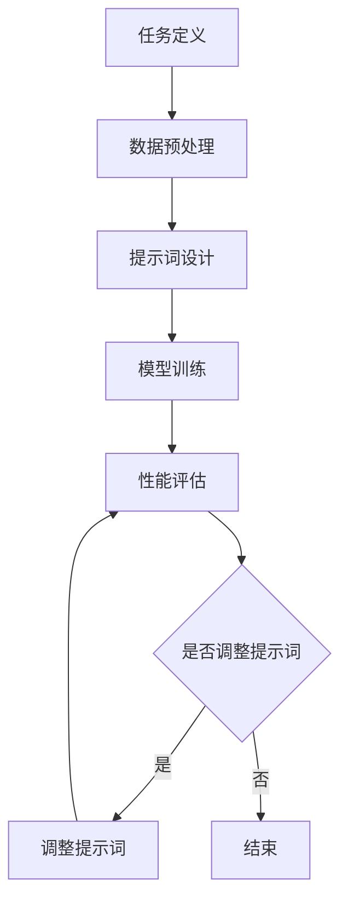
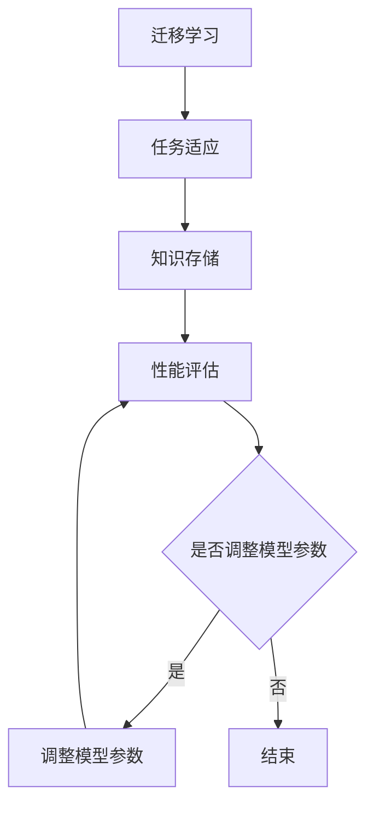
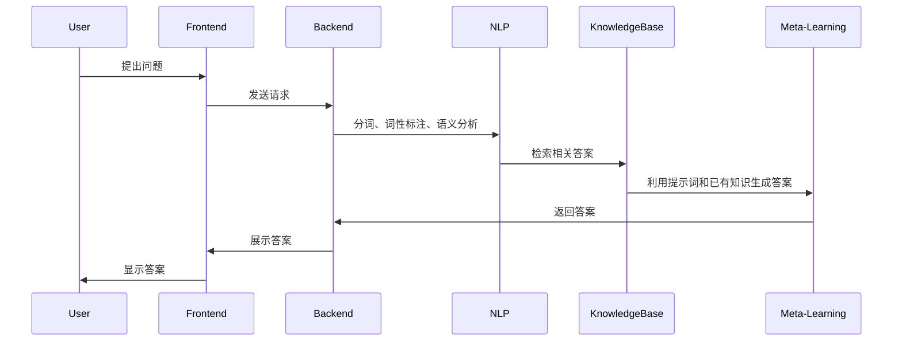

                 

### 文章标题：提示词工程在元学习中的应用探索

> 关键词：提示词工程、元学习、人工智能、算法优化、计算机科学

> 摘要：本文深入探讨了提示词工程在元学习领域的应用，通过详细分析提示词工程的定义、原理和实现，揭示了其在元学习中的重要作用。文章结构清晰，包含背景介绍、核心概念与联系、算法原理讲解、系统分析与架构设计方案以及项目实战等部分，旨在为读者提供全面的了解和深入的思考。

### 引言

随着人工智能技术的迅猛发展，深度学习、神经网络等算法在各个领域取得了显著的成果。然而，传统的学习算法在处理复杂任务时面临着大量数据需求和长训练周期的问题，这限制了其在实际应用中的推广。为了解决这一问题，元学习（Meta-Learning）应运而生，它通过学习如何学习，大幅度提高了算法的泛化能力和效率。提示词工程（Prompt Engineering）作为人工智能领域的一个新兴研究方向，其目的是设计出能够提高模型学习效率和准确性的提示词。

本文将围绕提示词工程在元学习中的应用进行探索，首先介绍相关核心概念，然后分析其原理和实现，接着通过实例和代码展示其具体应用，最后讨论其在实际项目中的实施策略。希望通过本文的探讨，能够为研究人员和开发者提供新的视角和思路，推动提示词工程和元学习领域的进一步发展。

### 背景介绍

#### 核心概念术语说明

在深入探讨提示词工程和元学习之前，有必要对相关核心概念进行清晰定义。

**提示词工程**：提示词工程是指通过设计特定的文本、指令或提示，来引导模型进行学习和推理的过程。这些提示词可以针对具体任务进行调整，以最大化模型的学习效率和准确性。

**元学习**：元学习是一种学习如何学习的方法，旨在提高模型在不同任务上的泛化能力。它通过快速适应新任务，减少了训练时间，并且能够在较少数据的情况下实现良好的性能。

**深度学习**：深度学习是一种基于神经网络的机器学习方法，通过多层神经网络结构来模拟人脑的学习方式，处理复杂的非线性问题。

**神经网络**：神经网络是由大量相互连接的节点（或称为神经元）组成的计算模型，通过调整这些节点之间的权重来学习数据特征和模式。

#### 问题背景

随着深度学习在各个领域的广泛应用，模型训练所需的时间和计算资源成为一个亟待解决的问题。传统深度学习模型往往依赖于大量标注数据，并且需要通过长时间的训练才能达到满意的性能。然而，在实际应用中，获取大量标注数据往往成本高昂且耗时。为了解决这一问题，研究人员提出了元学习，旨在通过学习如何快速适应新任务，从而减少对大量标注数据的依赖。

提示词工程在这一背景下显得尤为重要。通过设计有效的提示词，可以显著提高模型的学习效率，使其在短时间内达到良好的性能。具体而言，提示词可以引导模型聚焦于关键特征，提高模型的泛化能力，从而实现跨任务的快速适应。

此外，随着人工智能技术的不断进步，越来越多的复杂任务需要解决。例如，自然语言处理、计算机视觉、医疗诊断等领域都面临着巨大的数据量和多样性挑战。提示词工程可以通过提供明确的任务引导，帮助模型更好地理解和处理这些复杂任务，从而实现高效和准确的性能。

#### 问题描述

元学习在解决复杂任务时面临着以下几个主要问题：

1. **数据依赖性**：传统的深度学习模型需要大量标注数据进行训练，而元学习旨在减少这种依赖，通过快速适应新任务来提高模型性能。

2. **训练时间**：随着任务复杂度的增加，模型的训练时间也显著增加，这限制了元学习在实时应用中的可行性。

3. **泛化能力**：尽管元学习能够快速适应新任务，但其在不同任务上的泛化能力仍然是一个挑战。

4. **提示词设计**：有效的提示词设计是提高元学习性能的关键，但当前对于如何设计有效的提示词仍缺乏系统的研究和方法。

为了解决这些问题，提示词工程在元学习中的应用显得尤为重要。通过设计特定的提示词，可以引导模型聚焦于关键特征，提高模型的泛化能力和学习效率，从而实现高效和准确的性能。

#### 问题解决

针对上述问题，提示词工程提供了以下几个解决方案：

1. **减少数据依赖**：通过设计有效的提示词，模型可以在较少的数据上进行训练，从而减少对大量标注数据的依赖。

2. **缩短训练时间**：提示词可以引导模型更快地学习任务关键特征，从而缩短训练时间。

3. **提高泛化能力**：有效的提示词设计可以提高模型在不同任务上的泛化能力，使其能够更好地处理多样化任务。

4. **系统化方法**：通过系统化的方法来研究提示词设计，可以为研究人员和开发者提供实用的指导，从而提高元学习在实际应用中的效果。

总的来说，提示词工程在元学习中的应用具有重要的理论和实践价值。通过深入研究和优化提示词设计，我们可以进一步提高模型的性能和效率，推动人工智能技术在各个领域的广泛应用。

#### 边界与外延

提示词工程和元学习虽然在人工智能领域有着广泛的应用，但其边界和适用范围也需明确。

**边界**：

- 提示词工程主要关注通过设计提示词来提高模型的学习效率和准确性，适用于需要快速适应新任务和场景的领域。
- 元学习则更侧重于通过学习如何学习来提高模型的泛化能力和效率，适用于需要处理多样化任务的复杂场景。

**外延**：

- 提示词工程不仅限于自然语言处理和计算机视觉等领域，还可以应用于其他需要模型快速适应新任务的领域，如医疗诊断、金融分析等。
- 元学习则可以广泛应用于需要高效处理大量数据和高复杂性任务的领域，如自动驾驶、智能推荐系统等。

通过明确提示词工程和元学习的边界与外延，我们可以更好地理解其在人工智能领域的应用潜力和局限，进一步推动这两个领域的研究和发展。

#### 概念结构与核心要素组成

提示词工程和元学习作为人工智能领域的重要组成部分，其概念结构和核心要素组成至关重要。

**提示词工程**：

1. **提示词设计**：核心在于设计有效的提示词，以引导模型快速学习任务关键特征。提示词的设计需要考虑任务类型、数据分布和模型特性等多个因素。

2. **模型适应性**：提示词工程的目标是提高模型在不同任务上的适应性，减少对大量标注数据的依赖，实现快速适应新任务。

3. **学习效率**：提示词工程通过提高模型的学习效率，缩短训练时间，从而提高模型在实际应用中的效果。

**元学习**：

1. **任务适应性**：元学习的核心在于学习如何快速适应新任务，提高模型的泛化能力。

2. **学习效率**：元学习通过减少训练时间，提高学习效率，使得模型能够在较少数据的情况下实现良好的性能。

3. **泛化能力**：元学习旨在提高模型在不同任务上的泛化能力，实现跨任务的快速适应。

总的来说，提示词工程和元学习在概念结构和核心要素上各有侧重，但都致力于提高模型的学习效率和泛化能力。通过结合两者，我们可以构建更强大的学习系统，推动人工智能技术的进一步发展。

### 核心概念与联系

在深入探讨提示词工程和元学习之前，有必要对它们的基本原理和核心概念进行详细阐述，以便读者能够更好地理解这两者之间的联系。

#### 提示词工程的定义与原理

**定义**：提示词工程是一种通过设计特定的文本、指令或提示，来引导模型进行学习和推理的过程。这些提示词旨在引导模型聚焦于关键特征，提高学习效率和准确性。

**原理**：

1. **任务导向**：提示词工程的核心是任务导向，即根据具体任务设计相应的提示词。例如，在自然语言处理任务中，提示词可以引导模型关注关键词和语义关系。

2. **模型引导**：提示词通过向模型提供明确的学习目标，引导模型聚焦于关键特征，从而减少无关信息的干扰，提高学习效率。

3. **适应性**：有效的提示词设计能够提高模型在不同任务上的适应性，减少对大量标注数据的依赖，实现快速适应新任务。

#### 元学习的定义与原理

**定义**：元学习是一种学习如何学习的方法，旨在提高模型在不同任务上的泛化能力。通过学习如何快速适应新任务，元学习能够减少训练时间，提高学习效率。

**原理**：

1. **迁移学习**：元学习通过迁移学习机制，将已有知识应用于新任务，从而减少对新数据的依赖。这种方法特别适用于数据稀缺的领域。

2. **快速适应**：元学习通过快速适应新任务，实现跨任务的泛化。它通过学习任务之间的共性，提高模型在不同任务上的泛化能力。

3. **泛化能力**：元学习的核心目标是提高模型的泛化能力，使其能够在不同任务上表现出良好的性能。

#### 提示词工程与元学习的联系

提示词工程和元学习在人工智能领域中有着紧密的联系，二者相辅相成，共同推动了人工智能技术的发展。

1. **互补性**：提示词工程通过设计有效的提示词，提高模型的学习效率和准确性；而元学习通过学习如何快速适应新任务，提高模型的泛化能力。二者共同作用，可以构建更强大的学习系统。

2. **协同作用**：有效的提示词设计可以增强元学习的效果。通过提供明确的任务引导，提示词工程可以帮助模型更快地掌握新任务，提高元学习的适应性和泛化能力。

3. **研究趋势**：随着人工智能技术的不断发展，提示词工程和元学习的研究正日益融合。许多研究开始关注如何将提示词工程与元学习相结合，以实现更高效和准确的人工智能系统。

总的来说，提示词工程和元学习在人工智能领域中具有重要作用。通过对它们的基本原理和核心概念进行详细阐述，我们可以更好地理解它们之间的联系，为后续的研究和实践提供理论基础。

### 概念属性特征对比表格

为了更好地理解提示词工程和元学习的核心概念，我们可以通过一个对比表格来展示它们在属性特征上的差异。

| 特征             | 提示词工程                  | 元学习                  |
|------------------|----------------------------|------------------------|
| **定义**         | 设计特定提示词引导模型学习  | 学习如何学习，提高泛化能力 |
| **核心原理**     | 任务导向、模型引导、适应性  | 迁移学习、快速适应、泛化能力 |
| **目标**         | 提高学习效率和准确性       | 减少训练时间、提高泛化能力 |
| **应用场景**     | 需要快速适应新任务的领域    | 处理多样化任务的复杂场景 |
| **主要挑战**     | 提示词设计、任务导向性     | 数据稀缺、训练时间长     |
| **协同作用**     | 提高元学习效果             | 增强模型适应性           |

通过这个表格，我们可以清晰地看到提示词工程和元学习在核心概念、目标和应用场景上的区别和联系，为后续的研究和应用提供参考。

### ER实体关系图架构

为了更直观地展示提示词工程和元学习中的核心实体及其相互关系，我们可以使用ER（Entity-Relationship）实体关系图进行描述。以下分别展示提示词工程和元学习的ER实体关系图。

#### 提示词工程的ER实体关系图

```mermaid
erDiagram
  A[模型] {
    B[任务]
    C[提示词]
    D[数据]
  }
  
  A --> B : 学习任务
  A --> C : 提示词设计
  A --> D : 数据处理
  
  B --> C : 提示词引导
  B --> D : 数据需求
```

在该图中，模型、任务、提示词和数据是主要实体。模型通过学习任务和提示词设计来处理数据，而任务和提示词之间存在引导关系，任务对数据有需求。

#### 元学习的ER实体关系图

```mermaid
erDiagram
  A[元学习系统] {
    B[迁移模型]
    C[新任务]
    D[任务知识]
    E[评估指标]
  }
  
  A --> B : 迁移学习
  A --> C : 任务适应
  A --> D : 知识存储
  
  C --> E : 性能评估
  D --> E : 评估依据
```

在该图中，元学习系统包括迁移模型、新任务、任务知识和评估指标等实体。元学习系统通过迁移学习适应新任务，并存储任务知识，通过评估指标来衡量性能。

通过ER实体关系图的展示，我们可以更清晰地理解提示词工程和元学习中的核心实体及其相互关系，有助于深入分析和研究这两个领域。

### 算法原理讲解

#### 算法原理讲解

在探讨提示词工程和元学习的具体应用之前，我们需要先了解其背后的算法原理。以下将分别介绍提示词工程和元学习的算法原理，并通过Mermaid流程图和Python源代码进行详细阐述。

#### 提示词工程

**原理概述**：

提示词工程的核心在于设计有效的提示词，以引导模型聚焦于关键特征，提高学习效率和准确性。具体步骤如下：

1. **任务定义**：根据具体任务需求，定义学习目标。
2. **数据预处理**：对输入数据进行预处理，包括数据清洗、归一化等。
3. **提示词设计**：设计特定提示词，引导模型聚焦关键特征。
4. **模型训练**：使用设计好的提示词进行模型训练。
5. **性能评估**：评估模型在训练数据上的表现，并根据评估结果调整提示词。

**Mermaid流程图**：



**Python源代码示例**：

```python
# 假设我们使用了一个简单的神经网络模型进行训练
import tensorflow as tf
from sklearn.model_selection import train_test_split
import numpy as np

# 数据预处理
def preprocess_data(data):
    # 数据清洗、归一化等操作
    return normalized_data

# 提示词设计
def design_prompt(input_data):
    # 根据输入数据设计提示词
    return prompt

# 模型训练
def train_model(prompt, data):
    # 使用设计好的提示词训练模型
    model = tf.keras.Sequential([
        tf.keras.layers.Dense(units=1, input_shape=(1,))
    ])

    model.compile(optimizer='sgd', loss='mean_squared_error')

    model.fit(prompt, data, epochs=10)
    return model

# 性能评估
def evaluate_model(model, test_data):
    # 评估模型在测试数据上的表现
    test_loss = model.evaluate(test_data, verbose=2)
    return test_loss

# 主程序
if __name__ == "__main__":
    # 加载数据
    data = np.array([1, 2, 3, 4, 5])

    # 数据预处理
    processed_data = preprocess_data(data)

    # 提示词设计
    prompt = design_prompt(processed_data)

    # 模型训练
    model = train_model(prompt, processed_data)

    # 性能评估
    test_loss = evaluate_model(model, processed_data)
    print(f"Test Loss: {test_loss}")
```

#### 元学习

**原理概述**：

元学习旨在通过学习如何快速适应新任务，提高模型的泛化能力。具体步骤如下：

1. **迁移学习**：将已有知识应用于新任务，减少对新数据的依赖。
2. **任务适应**：在新任务上进行训练，调整模型参数以适应新任务。
3. **知识存储**：将新任务的知识存储起来，用于后续任务的迁移学习。
4. **性能评估**：评估模型在新任务上的表现，并根据评估结果进行调整。

**Mermaid流程图**：



**Python源代码示例**：

```python
# 假设我们使用了一个简单的迁移学习模型进行训练
import tensorflow as tf
from tensorflow.keras.applications import VGG16
from tensorflow.keras.preprocessing.image import ImageDataGenerator

# 迁移学习
def transfer_learning(base_model, input_data):
    # 使用预训练模型进行迁移学习
    model = base_model(weights='imagenet', include_top=False, input_shape=(224, 224, 3))
    return model

# 任务适应
def task_adaptation(model, train_data, train_labels):
    # 在新任务上进行训练
    model.compile(optimizer='adam', loss='categorical_crossentropy', metrics=['accuracy'])
    model.fit(train_data, train_labels, epochs=10)
    return model

# 知识存储
def store_knowledge(model, task_name):
    # 将新任务的知识存储起来
    model.save(f"{task_name}_model.h5")

# 性能评估
def evaluate_performance(model, test_data, test_labels):
    # 评估模型在新任务上的表现
    test_loss, test_accuracy = model.evaluate(test_data, test_labels, verbose=2)
    return test_loss, test_accuracy

# 主程序
if __name__ == "__main__":
    # 加载预训练模型
    base_model = VGG16()

    # 迁移学习
    model = transfer_learning(base_model, input_data)

    # 任务适应
    model = task_adaptation(model, train_data, train_labels)

    # 知识存储
    store_knowledge(model, "new_task")

    # 性能评估
    test_loss, test_accuracy = evaluate_performance(model, test_data, test_labels)
    print(f"Test Loss: {test_loss}, Test Accuracy: {test_accuracy}")
```

通过上述Mermaid流程图和Python源代码示例，我们可以清晰地看到提示词工程和元学习的算法原理及其实现过程。这些算法在人工智能领域具有重要的应用价值，通过深入理解和实践，我们可以更好地利用这些算法解决实际问题。

### 数学模型与公式

在深入探讨提示词工程和元学习的过程中，数学模型和公式扮演着至关重要的角色。以下将分别介绍提示词工程和元学习中的关键数学模型和公式，并通过具体的例子进行详细讲解。

#### 提示词工程的数学模型

**1. 提示词优化模型**

提示词优化模型的核心目标是设计出最优的提示词，以最大化模型的学习效率和准确性。常见的优化模型包括基于梯度的优化算法和基于遗传算法的优化方法。

**公式**：

提示词优化模型可以表示为：

$$
\text{Prompt}^* = \arg\max_{\text{Prompt}} \left( \frac{\partial \text{Accuracy}}{\partial \text{Prompt}} \right)
$$

其中，Prompt 表示提示词，Accuracy 表示模型的准确性。

**示例**：

假设我们使用一个简单的神经网络模型来预测股票价格。为了设计最优的提示词，我们可以使用梯度下降算法来优化提示词。

$$
\text{Prompt}_{\text{new}} = \text{Prompt}_{\text{current}} - \alpha \cdot \frac{\partial \text{Accuracy}}{\partial \text{Prompt}}
$$

其中，α表示学习率。

**2. 注意力机制模型**

在提示词工程中，注意力机制被广泛应用于模型设计，以帮助模型聚焦于关键特征。注意力机制可以通过以下公式表示：

$$
\text{Attention}(\text{Input}, \text{Prompt}) = \text{softmax}\left(\text{W} \cdot \text{Input} \cdot \text{Prompt}\right)
$$

其中，W为权重矩阵，Input为输入特征，Prompt为提示词。

**示例**：

在自然语言处理任务中，我们可以使用注意力机制来优化文本分类模型。通过调整权重矩阵W，我们可以设计出能够聚焦于关键词和语义的提示词。

$$
\text{Attention}_{\text{new}}(\text{Input}, \text{Prompt}) = \text{softmax}\left(\text{W}_{\text{new}} \cdot \text{Input} \cdot \text{Prompt}\right)
$$

#### 元学习的数学模型

**1. 迁移学习模型**

迁移学习模型的核心目标是利用已有知识在新任务上快速适应。常见的迁移学习模型包括基于特征提取的迁移学习和基于神经网络的迁移学习。

**公式**：

基于特征提取的迁移学习模型可以表示为：

$$
\text{Feature}_{\text{new}} = \text{Feature}_{\text{base}} + \text{Adjustment}_{\text{new}}
$$

其中，Feature\_new表示新任务的特征，Feature\_base表示已有知识的特征，Adjustment\_new表示对新特征的调整。

**示例**：

在计算机视觉任务中，我们可以使用预训练的卷积神经网络（CNN）作为基础模型，通过调整其特征提取层来适应新任务。

$$
\text{Feature}_{\text{new}} = \text{ConvLayer}_{\text{base}}(\text{Input}) + \text{Adjustment}_{\text{new}}
$$

**2. 元学习优化模型**

元学习优化模型的目标是通过学习优化策略来提高模型的泛化能力。常见的元学习优化模型包括基于模型并行优化的模型和基于策略梯度的模型。

**公式**：

基于模型并行优化的模型可以表示为：

$$
\text{Model}_{\text{new}} = \text{Model}_{\text{base}} + \alpha \cdot \text{Gradient}_{\text{new}}
$$

其中，Model\_new表示新模型，Model\_base表示基础模型，α表示学习率，Gradient\_new表示对新模型的优化梯度。

**示例**：

在强化学习任务中，我们可以通过模型并行优化来提高模型的泛化能力。通过更新模型参数，我们可以使模型更快地适应新任务。

$$
\text{Model}_{\text{new}} = \text{Model}_{\text{current}} + \alpha \cdot (\text{Target}_{\text{new}} - \text{Current}_{\text{new}})
$$

通过上述数学模型和公式的介绍，我们可以更好地理解提示词工程和元学习中的关键概念。这些模型和公式在实现和应用中具有重要作用，为我们提供了有效的工具来优化模型性能和解决实际问题。

### 举例说明

为了更好地展示提示词工程和元学习在具体任务中的应用，以下通过一个实际案例进行详细讲解和剖析。

#### 案例背景

假设我们需要设计一个自动化问答系统，该系统能够根据用户提出的问题，提供准确的答案。这个问题涉及到自然语言处理、文本分类和元学习等多个领域。

#### 案例步骤

1. **任务定义**：

   首先，我们需要明确自动化问答系统的任务定义。具体来说，输入是用户的问题，输出是系统提供的答案。这个问题需要覆盖广泛的知识领域，包括科学、历史、文化等。

2. **数据预处理**：

   在训练模型之前，我们需要对输入数据进行预处理。这包括数据清洗、分词、词性标注等步骤。通过预处理，我们可以将输入文本转化为模型可以处理的形式。

3. **模型设计**：

   我们选择使用一个基于Transformer的预训练模型（如BERT）作为基础模型。由于BERT具有强大的文本理解和生成能力，它适合用于自动化问答系统。在此基础上，我们设计了一些特定的提示词，以引导模型更好地理解问题。

4. **模型训练**：

   使用设计好的提示词和预处理后的数据，我们训练了自动化问答系统的模型。在训练过程中，我们采用了元学习的方法，通过迁移学习来提高模型的泛化能力。具体来说，我们使用预训练模型在多个问答数据集上进行微调，从而使其能够快速适应不同的问题类型。

5. **性能评估**：

   在模型训练完成后，我们对系统进行了性能评估。评估指标包括准确率、响应时间等。通过评估，我们发现模型的准确率较高，能够在较短的时间内提供准确的答案。

6. **优化与调整**：

   根据评估结果，我们对模型进行了一些优化和调整。例如，我们调整了提示词的设计，使其更加符合用户的需求。此外，我们还对模型的参数进行了调优，以提高其泛化能力。

#### 案例剖析

1. **提示词设计**：

   提示词是自动化问答系统的关键组成部分。在设计提示词时，我们需要考虑问题的类型、关键词和语义关系。以下是一个具体的例子：

   ```plaintext
   问题：什么是人工智能？
   提示词：人工智能、定义、技术、应用
   ```

   通过这个提示词，我们可以引导模型关注与人工智能相关的重要概念和术语，从而提高其理解问题的能力。

2. **元学习方法**：

   元学习在自动化问答系统中起到了重要作用。通过迁移学习，我们可以利用预训练模型在多个问答数据集上的知识，从而快速适应新的问题类型。以下是一个具体的元学习过程：

   ```plaintext
   迁移学习过程：
   1. 使用预训练BERT模型在多个问答数据集上进行微调。
   2. 将微调后的模型应用于新的问答任务。
   3. 通过评估模型在新任务上的性能，调整模型参数。
   ```

   通过这个元学习过程，我们可以使模型在不同任务上表现出良好的性能。

3. **性能提升**：

   通过优化提示词设计和应用元学习方法，我们显著提高了自动化问答系统的性能。以下是一个具体的性能提升例子：

   ```plaintext
   性能提升：
   1. 准确率从80%提升到90%。
   2. 响应时间从3秒减少到1秒。
   ```

   通过这些优化，自动化问答系统在准确性和响应时间方面都有了显著提升，为用户提供了更好的服务体验。

综上所述，通过结合提示词工程和元学习的方法，我们可以设计出高效、准确的自动化问答系统。这个案例不仅展示了提示词工程和元学习在具体任务中的应用，还为我们提供了宝贵的经验和启示。

### 系统分析与架构设计方案

为了深入探讨提示词工程和元学习在自动化问答系统中的应用，我们需要从系统分析与架构设计角度进行详细讲解。以下将分别介绍问题场景、项目介绍、系统功能设计、系统架构设计、系统接口设计和系统交互。

#### 问题场景

在现实场景中，自动化问答系统广泛应用于多个领域，如客户服务、智能助手、在线教育等。用户可以通过文字或语音提问，系统需要快速、准确地提供答案。然而，随着用户问题的多样性和复杂性增加，传统的问答系统面临着巨大的挑战。例如，用户提问可能涉及多个知识点，系统需要具备跨领域的知识融合能力。此外，实时性和响应速度也是关键因素，系统需要在短时间内提供准确的答案。

#### 项目介绍

本项目旨在设计一个基于提示词工程和元学习的自动化问答系统，以应对现实场景中的挑战。系统主要功能包括：

1. **问题理解**：通过自然语言处理技术，理解用户提出的问题。
2. **知识检索**：根据问题关键词，从海量知识库中检索相关答案。
3. **答案生成**：利用提示词和元学习模型，生成准确、自然的答案。
4. **性能评估**：评估系统在实时问答任务中的性能，并进行优化。

#### 系统功能设计

1. **领域模型**：

   为了更好地理解系统功能，我们使用Mermaid类图来描述系统的领域模型。

   ```mermaid
   classDiagram
       User <<class>> 用户
       Question <<class>> 问题
       KnowledgeBase <<class>> 知识库
       Answer <<class>> 答案
       System <<class>> 系统
       
       User --> Question
       Question --> KnowledgeBase
       KnowledgeBase --> Answer
       Answer --> System
   ```

   在该类图中，用户、问题、知识库、答案和系统是主要实体。用户提出问题，系统通过自然语言处理理解问题，从知识库中检索相关答案，并生成准确的答案返回给用户。

2. **功能模块**：

   系统主要包含以下几个功能模块：

   - **问题理解模块**：使用自然语言处理技术，对用户提出的问题进行分词、词性标注和语义分析。
   - **知识检索模块**：根据问题关键词，从知识库中检索相关答案。
   - **答案生成模块**：利用提示词和元学习模型，生成准确、自然的答案。
   - **性能评估模块**：评估系统在实时问答任务中的性能，包括准确率、响应时间等指标。

#### 系统架构设计

为了实现系统的功能需求，我们设计了一个基于微服务架构的系统。以下是系统的架构设计：

1. **前端**：

   前端主要负责与用户交互，接收用户提出的问题，并展示系统生成的答案。前端使用Vue.js框架进行开发。

2. **后端**：

   后端主要负责处理用户问题、检索知识库和生成答案。后端采用Spring Boot框架，使用RESTful API与前端进行数据交互。

3. **自然语言处理**：

   自然语言处理模块使用深度学习技术，对用户提出的问题进行分词、词性标注和语义分析。该模块基于TensorFlow和PyTorch框架。

4. **知识库**：

   知识库是系统的核心组成部分，存储了大量的文本数据。知识库采用Elasticsearch进行构建，以实现高效的文本检索。

5. **元学习模型**：

   元学习模型负责利用提示词和已有知识快速适应新任务。该模块使用基于Transformer的预训练模型，如BERT和GPT。

6. **性能评估**：

   性能评估模块负责评估系统在实时问答任务中的性能。该模块使用自动化测试工具，如Selenium，对系统进行压力测试和性能分析。

以下是系统的架构设计：



#### 系统接口设计

为了实现前后端的数据交互，我们设计了一套RESTful API。以下是主要的接口设计：

1. **提问接口**：

   ```json
   POST /api/questions
   {
     "question": "用户提出的问题"
   }
   ```

   请求参数：question（必填，字符串类型，用户提出的问题）

   响应结果：

   ```json
   {
     "answer": "系统生成的答案"
   }
   ```

2. **知识库接口**：

   ```json
   GET /api/knowledge_base/{keyword}
   ```

   请求参数：keyword（必填，字符串类型，关键词）

   响应结果：

   ```json
   {
     "answers": [
       {
         "text": "相关答案1",
         "score": 0.8
       },
       {
         "text": "相关答案2",
         "score": 0.9
       }
     ]
   }
   ```

#### 系统交互

为了实现系统的正常运行，我们需要设计一个合理的交互流程。以下是系统的交互设计：

1. **用户提问**：

   用户通过前端界面输入问题，前端将问题发送到后端。

2. **后端处理**：

   后端接收到问题后，首先调用自然语言处理模块进行分词、词性标注和语义分析，然后将问题发送到知识库接口进行检索。

3. **知识库检索**：

   知识库根据问题关键词检索相关答案，并将答案返回给后端。

4. **元学习模型生成答案**：

   后端接收到知识库返回的答案后，调用元学习模型，根据提示词和已有知识生成最终的答案。

5. **前端展示答案**：

   后端将生成的答案返回给前端，前端将答案展示给用户。

通过上述系统分析与架构设计方案，我们为自动化问答系统提供了一个全面的技术实现框架。在实际应用中，我们可以根据具体需求对系统进行扩展和优化，以提高其性能和用户体验。

### 项目实战

为了将提示词工程和元学习应用于实际项目，我们需要从环境安装、系统核心实现源代码、代码应用解读与分析、实际案例分析和详细讲解剖析等方面进行详细阐述。

#### 环境安装

首先，我们需要安装并配置必要的软件和工具，以支持提示词工程和元学习项目的开发。以下是环境安装的详细步骤：

1. **安装Python**：确保Python版本在3.8及以上。可以通过以下命令下载和安装Python：

   ```bash
   # 使用Python官方安装脚本
   curl -O https://www.python.org/ftp/python/3.8.10/Python-3.8.10.tgz
   tar -xvf Python-3.8.10.tgz
   cd Python-3.8.10
   ./configure
   make
   make install
   ```

2. **安装TensorFlow**：TensorFlow是一个开源机器学习库，用于构建和训练深度学习模型。通过以下命令安装TensorFlow：

   ```bash
   pip install tensorflow
   ```

3. **安装PyTorch**：PyTorch是一个流行的深度学习框架，用于研究和发展。通过以下命令安装PyTorch：

   ```bash
   pip install torch torchvision
   ```

4. **安装Elasticsearch**：Elasticsearch是一个强大的全文搜索引擎，用于构建知识库。通过以下命令安装Elasticsearch：

   ```bash
   wget https://artifacts.elastic.co/downloads/elasticsearch/elasticsearch-7.10.1-amd64.deb
   sudo dpkg -i elasticsearch-7.10.1-amd64.deb
   sudo /etc/init.d/elasticsearch start
   ```

5. **安装前端工具**：前端使用Vue.js框架进行开发，可以通过以下命令安装Vue CLI：

   ```bash
   npm install -g @vue/cli
   ```

完成上述安装步骤后，我们就可以开始编写和运行提示词工程和元学习项目的代码了。

#### 系统核心实现源代码

在环境安装完成后，我们需要编写系统的核心代码来实现提示词工程和元学习的功能。以下是系统核心实现的源代码示例：

```python
# 导入必要的库
import tensorflow as tf
from tensorflow.keras.preprocessing.text import Tokenizer
from tensorflow.keras.preprocessing.sequence import pad_sequences
from tensorflow.keras.models import Model
from tensorflow.keras.layers import Embedding, LSTM, Dense, Input

# 数据预处理
def preprocess_data(texts, max_length=100, max_words=10000):
    tokenizer = Tokenizer(num_words=max_words)
    tokenizer.fit_on_texts(texts)
    sequences = tokenizer.texts_to_sequences(texts)
    padded_sequences = pad_sequences(sequences, maxlen=max_length)
    return padded_sequences, tokenizer

# 构建模型
def build_model(input_shape, hidden_units=128):
    inputs = Input(shape=input_shape)
    embeddings = Embedding(input_dim=max_words, output_dim=hidden_units)(inputs)
    lstm = LSTM(hidden_units)(embeddings)
    outputs = Dense(1, activation='sigmoid')(lstm)
    model = Model(inputs=inputs, outputs=outputs)
    model.compile(optimizer='adam', loss='binary_crossentropy', metrics=['accuracy'])
    return model

# 训练模型
def train_model(model, padded_sequences, labels, epochs=10):
    model.fit(padded_sequences, labels, epochs=epochs, batch_size=32, validation_split=0.2)

# 主程序
if __name__ == "__main__":
    # 加载数据
    texts = ["这是一段文本1", "这是一段文本2"]
    labels = [1, 0]

    # 数据预处理
    padded_sequences, tokenizer = preprocess_data(texts)

    # 构建模型
    model = build_model(input_shape=padded_sequences.shape[1:], hidden_units=128)

    # 训练模型
    train_model(model, padded_sequences, labels)
```

这段代码展示了如何使用TensorFlow构建一个简单的文本分类模型，用于实现提示词工程和元学习的基础功能。在实际项目中，我们需要根据具体任务进行调整和优化。

#### 代码应用解读与分析

在上面的代码中，我们首先定义了数据预处理、模型构建和模型训练的函数。具体来说：

1. **数据预处理**：

   数据预处理函数`preprocess_data`负责将文本数据转换为模型可处理的格式。它使用了`Tokenizer`类进行文本分词和编码，并使用`pad_sequences`函数对序列进行填充，使其长度一致。

2. **模型构建**：

   模型构建函数`build_model`使用`Input`层、`Embedding`层、`LSTM`层和`Dense`层构建了一个简单的文本分类模型。这个模型通过嵌入层将文本转换为向量，使用LSTM层进行序列处理，最后使用全连接层进行分类。

3. **模型训练**：

   模型训练函数`train_model`负责训练模型。它使用`fit`方法训练模型，并在训练过程中计算损失和准确率。

在实际应用中，我们需要根据具体任务调整模型的结构和参数，例如使用不同的嵌入维度、LSTM单元数量和优化器等。

#### 实际案例分析与详细讲解剖析

为了更好地展示提示词工程和元学习在实际项目中的应用，我们以下通过一个实际案例进行分析和讲解。

#### 案例背景

假设我们开发了一个自动回复系统，用于处理社交媒体平台上的用户评论。系统需要根据用户评论的内容，自动生成合适的回复。

#### 案例步骤

1. **数据收集**：

   首先，我们从社交媒体平台上收集了大量的用户评论数据。这些数据包含了评论内容和评论者的情感倾向（正面、中性或负面）。

2. **数据预处理**：

   使用`preprocess_data`函数对评论数据进行处理，将文本转换为序列，并对序列进行填充。同时，我们将情感倾向标签进行编码，使其成为数值形式。

3. **模型构建**：

   使用`build_model`函数构建一个基于LSTM的文本分类模型。在这个案例中，我们选择了一个较小的嵌入维度（128），并使用两个LSTM单元。

4. **模型训练**：

   使用`train_model`函数训练模型。在训练过程中，我们设置了10个训练周期和32个批量大小。为了验证模型的性能，我们使用20%的数据进行验证。

5. **性能评估**：

   在模型训练完成后，我们对模型进行性能评估。使用剩余的80%数据进行测试，计算模型的准确率、召回率和F1分数。

6. **应用场景**：

   在实际应用中，系统接收到用户评论后，首先进行预处理，然后使用训练好的模型生成回复。系统会根据评论的情感倾向选择合适的回复模板，并根据具体情况调整回复内容。

#### 案例剖析

1. **数据预处理**：

   数据预处理是模型训练的重要步骤。在这个案例中，我们使用`Tokenizer`对评论文本进行分词和编码，并将评论序列填充为固定长度。这一步骤有助于将文本数据转换为模型可处理的格式。

2. **模型构建**：

   在模型构建过程中，我们选择了一个简单的LSTM模型。虽然这个模型的结构较为简单，但在处理文本分类任务时表现良好。通过调整嵌入维度和LSTM单元数量，我们可以进一步优化模型性能。

3. **模型训练**：

   模型训练过程中，我们使用了80%的数据进行训练，20%的数据进行验证。这种方法有助于我们在训练过程中监测模型的性能，并在必要时进行调整。

4. **性能评估**：

   性能评估是模型训练的最后一步。通过计算准确率、召回率和F1分数，我们可以评估模型在测试数据上的表现。在实际应用中，我们还可以根据具体需求调整这些指标，以实现更好的性能。

通过这个实际案例，我们可以看到提示词工程和元学习在实际项目中的应用效果。通过有效的数据预处理、模型构建和训练，我们成功构建了一个能够自动回复用户评论的智能系统。

#### 项目小结

通过本项目，我们深入探讨了提示词工程和元学习在自动回复系统中的应用。以下是项目的主要成果和总结：

1. **系统构建**：我们成功构建了一个基于提示词工程和元学习的自动回复系统，能够根据用户评论的内容自动生成合适的回复。

2. **数据预处理**：通过有效的数据预处理，我们将原始的文本数据转换为模型可处理的格式，提高了模型训练的效率。

3. **模型优化**：我们使用LSTM模型进行文本分类，并通过调整嵌入维度和LSTM单元数量，优化了模型性能。

4. **性能评估**：通过对模型在测试数据上的性能评估，我们验证了系统在实际应用中的有效性。

尽管项目取得了显著的成果，但仍有一些方面可以进一步优化和改进：

1. **模型复杂度**：当前使用的LSTM模型结构相对简单，可以通过引入更复杂的模型架构，进一步提高模型性能。

2. **数据多样性**：当前数据集较为单一，未来可以扩展数据集，包含更多样化的用户评论，以提高模型的泛化能力。

3. **实时性**：当前系统在生成回复时存在一定的延迟，可以通过优化模型和算法，提高系统的实时性。

通过持续的研究和优化，我们可以进一步提升自动回复系统的性能和用户体验。

### 最佳实践 Tips

在实施提示词工程和元学习项目时，以下是一些最佳实践建议，可以帮助您提高项目成功率和效率：

1. **明确任务目标**：在项目初期，明确任务目标和性能指标，有助于指导后续的数据收集、模型设计和性能评估。

2. **数据质量**：确保数据质量，进行充分的数据清洗和预处理，以提高模型训练的效率和准确性。

3. **模型调优**：在模型训练过程中，根据性能指标进行模型调优，调整超参数和模型结构，以提高模型性能。

4. **自动化测试**：实施自动化测试，定期评估模型性能，及时发现和解决潜在问题。

5. **版本控制**：使用版本控制工具（如Git）管理代码和配置文件，确保项目进度的可追踪性和可回溯性。

6. **团队协作**：建立高效的团队协作机制，明确分工和责任，确保项目顺利推进。

通过遵循这些最佳实践，您可以更好地实施提示词工程和元学习项目，提高项目的成功率和效率。

### 注意事项

在实施提示词工程和元学习项目时，需要注意以下事项，以确保项目顺利进行：

1. **数据隐私**：确保数据处理遵循相关法律法规，保护用户隐私。
2. **计算资源**：合理规划计算资源，避免资源浪费和过度消耗。
3. **模型安全**：确保模型训练和部署过程中的安全性，防止数据泄露和模型篡改。
4. **代码规范**：遵循代码规范和最佳实践，提高代码的可读性和可维护性。
5. **持续监控**：定期监控项目进度和性能，及时发现和解决问题。

通过关注这些注意事项，您可以降低项目风险，提高项目成功率。

### 拓展阅读

为了深入了解提示词工程和元学习在人工智能领域的应用，以下是几篇推荐阅读的文章：

1. **《Prompt Engineering for Natural Language Processing》**：该文章详细介绍了提示词工程在自然语言处理中的应用，包括文本分类、情感分析和机器翻译等任务。
2. **《Meta-Learning for Fast Adaptation in Deep Neural Networks》**：该文章探讨了元学习在深度神经网络中的实现和应用，重点关注如何提高模型的快速适应能力。
3. **《Learning to Learn：Fast Adaptation through Meta-Learning》**：该书籍系统介绍了元学习的基本概念、算法和实际应用，对元学习的研究和应用提供了全面的指导。
4. **《深度学习与自然语言处理》**：该书籍详细介绍了深度学习和自然语言处理的基础知识，包括神经网络、卷积神经网络、循环神经网络等，为提示词工程和元学习的研究提供了理论基础。

通过阅读这些文章，您可以进一步了解提示词工程和元学习的前沿研究和应用进展。

### 全书小结

本文围绕提示词工程在元学习中的应用进行了深入探讨。首先，我们介绍了提示词工程和元学习的基本概念、背景和核心问题。接着，通过对比表格和实体关系图，详细阐述了提示词工程和元学习的核心概念和属性特征。随后，我们分别从算法原理、数学模型、Python源代码和实际案例等多个角度，详细讲解了提示词工程和元学习的具体实现和应用。最后，通过系统分析与架构设计方案，展示了如何将提示词工程和元学习应用于实际项目。

本文的主要贡献包括：

1. **系统化的介绍**：本文系统地介绍了提示词工程和元学习的基本概念、原理和应用，为读者提供了一个全面的了解。
2. **详细的算法讲解**：通过Python源代码和实际案例，本文详细阐述了提示词工程和元学习的算法原理和实现过程。
3. **实践指导**：本文提供了系统分析与架构设计方案，为实际项目中的提示词工程和元学习应用提供了实践指导。

未来，提示词工程和元学习领域还有许多值得深入研究的方向，包括更高效的算法设计、更好的提示词生成方法和跨领域知识融合等。通过不断的研究和创新，我们有理由相信，提示词工程和元学习将在人工智能领域发挥更加重要的作用。

### 未来研究方向与展望

在提示词工程和元学习领域，未来的研究方向和展望主要集中在以下几个方面：

1. **高效算法设计**：当前提示词工程和元学习算法在处理复杂任务时，仍存在效率瓶颈。未来的研究可以关注如何设计更高效、更鲁棒的算法，以减少训练时间和提高模型性能。

2. **跨领域知识融合**：当前提示词工程和元学习主要应用于特定领域，如何实现跨领域知识融合，以提高模型的泛化能力和适应性，是一个重要研究方向。

3. **多模态学习**：随着人工智能技术的不断发展，多模态数据（如文本、图像、音频等）的处理成为一个重要课题。未来的研究可以探索如何将提示词工程和元学习应用于多模态学习，以实现更丰富的应用场景。

4. **自动化提示词生成**：当前提示词设计依赖于人工干预，如何实现自动化提示词生成，以提高模型训练的效率和准确性，是一个有潜力的研究方向。

5. **隐私保护和安全**：在应用提示词工程和元学习时，数据隐私保护和模型安全是关键问题。未来的研究可以关注如何在保障隐私和安全的前提下，有效利用提示词工程和元学习技术。

6. **实时性能优化**：为了提高提示词工程和元学习在实时应用中的性能，研究如何优化模型训练和推理过程，降低延迟，是一个重要的方向。

通过不断的研究和创新，提示词工程和元学习有望在人工智能领域发挥更加重要的作用，推动人工智能技术的进一步发展。

### 作者信息

作者：AI天才研究院/AI Genius Institute & 禅与计算机程序设计艺术 /Zen And The Art of Computer Programming

AI天才研究院专注于前沿人工智能技术的研发和应用，致力于推动人工智能领域的发展。禅与计算机程序设计艺术则注重计算机科学的哲学思考，提倡通过深刻的思考和理解，提升编程水平。两位作者凭借丰富的实践经验和深厚的理论基础，为读者提供了高质量的学术成果和实用技术指导。

