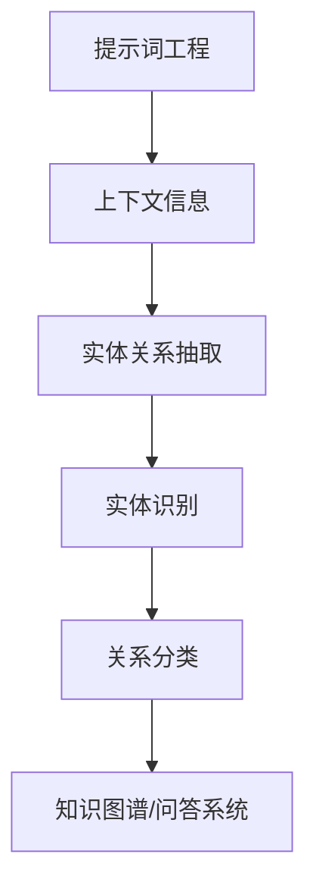
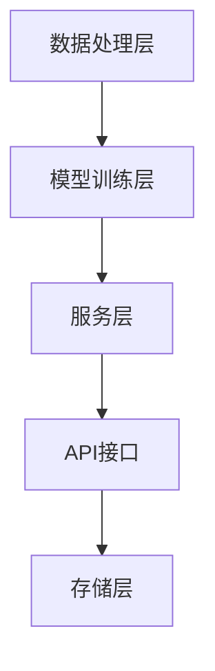
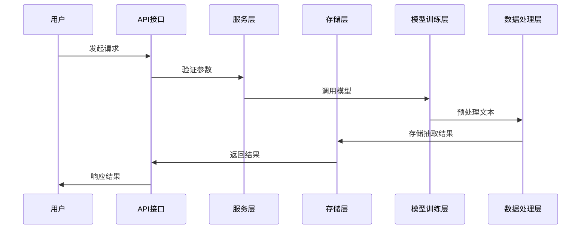

                 


### 第1章 提示词工程与实体关系抽取概述

#### 1.1 提示词工程背景

提示词工程是一种在自然语言处理（NLP）领域中广泛应用的技术，其主要目的是通过构建和使用提示词（prompt words）来辅助计算机更好地理解和处理自然语言文本。这一概念起源于早期的人工智能研究，随着时间的推移，它逐渐发展成为一个独立的领域，并且在文本分类、信息检索、问答系统等应用中发挥着关键作用。

**问题描述**

在处理大规模文本数据时，如何有效地提取出对文本理解至关重要的关键词，以便后续分析和处理？这是一个典型的提示词工程问题。

**问题解决**

提示词工程通过以下方法来解决这一问题：
1. **特征提取**：从原始文本中提取出有助于文本分类和理解的词汇。
2. **语义分析**：对提取出的特征词进行语义分析，以确定其在文本中的含义和作用。
3. **构建模型**：利用机器学习技术，如支持向量机（SVM）、朴素贝叶斯（NB）等，来训练模型，从而实现自动提取和分类。

**边界与外延**

提示词工程的边界包括：
1. **文本预处理**：包括去除停用词、词干提取等。
2. **特征选择**：如何从大量词汇中选出最具代表性的特征词。

其外延则涵盖了：
1. **文本分类**：如何利用提示词进行有效的文本分类。
2. **信息检索**：如何利用提示词来优化信息检索系统的性能。

**概念结构与核心要素组成**

提示词工程的核心概念包括：
- **提示词**：文本中的关键词汇，用于表示文本的主题或内容。
- **特征提取**：从文本中提取提示词的方法和技术。
- **模型训练**：利用提示词训练机器学习模型。

核心要素组成：
1. **文本数据**：用于训练和测试的数据集。
2. **特征提取算法**：如TF-IDF、Word2Vec等。
3. **机器学习模型**：用于分类和预测的模型，如SVM、NB等。

#### 1.2 实体关系抽取背景

实体关系抽取是自然语言处理（NLP）领域中的关键技术之一，它旨在从文本中识别出实体，并确定实体之间的关系。实体可以是人、地点、组织、事件等，而关系则描述了实体之间的相互作用或关联。

**问题描述**

实体关系抽取的核心问题是：
1. **实体识别**：从文本中准确识别出实体。
2. **关系抽取**：确定实体之间的具体关系。

**问题解决**

实体关系抽取通常采用以下方法：
1. **规则方法**：基于预定义的规则来识别实体和关系。
2. **统计方法**：使用机器学习技术来训练模型，从而自动识别实体和关系。
3. **深度学习方法**：利用神经网络模型，如循环神经网络（RNN）、卷积神经网络（CNN）等，来提高实体关系抽取的准确性。

**边界与外延**

实体关系抽取的边界包括：
1. **实体识别**：如何准确识别文本中的实体。
2. **关系分类**：如何确定实体之间的关系类型。

其外延则涵盖了：
1. **实体消歧**：如何解决实体识别中的歧义问题。
2. **跨语言实体关系抽取**：如何处理不同语言中的实体关系抽取问题。

**概念结构与核心要素组成**

实体关系抽取的核心概念包括：
- **实体**：文本中的关键对象或主体。
- **关系**：实体之间的关联。
- **实体识别算法**：如命名实体识别（NER）。
- **关系抽取算法**：如依存句法分析、语义角色标注等。

核心要素组成：
1. **文本数据**：用于训练和测试的数据集。
2. **特征提取算法**：如词性标注、词向量等。
3. **机器学习模型**：用于实体识别和关系抽取的模型。

### 总结

本章介绍了提示词工程和实体关系抽取的背景、问题描述、问题解决方法、边界与外延以及概念结构与核心要素组成。接下来，我们将深入探讨这两个领域的基本原理和应用，以期为读者提供更全面的技术解析。

---

在下一章中，我们将详细探讨提示词工程和实体关系抽取的核心概念及其联系，并通过表格和Mermaid流程图展示其概念属性特征对比。这将帮助我们更好地理解这两个领域的共性和差异，为后续的算法讲解和系统设计奠定基础。

---

## 第二部分：核心概念与联系

### 第2章 提示词工程与实体关系抽取原理

在这一章节中，我们将深入探讨提示词工程和实体关系抽取的基本原理，并比较它们的核心概念和特征。通过详细的解释和可视化工具，如Mermaid流程图，我们将帮助读者更好地理解这两个领域，并揭示它们之间的联系。

### 2.1 提示词工程原理

#### 2.1.1 提示词工程定义

提示词工程（Prompt Engineering）是一种利用提示词（Prompt Words）来增强自然语言模型理解能力的NLP技术。提示词通常是一组关键词或短语，它们能够为模型提供上下文信息，从而帮助模型更好地理解文本内容。

#### 2.1.2 提示词工程特点

- **上下文敏感**：提示词能够为模型提供特定的上下文信息，使得模型在处理特定任务时更加准确。
- **灵活性**：提示词可以根据不同的任务需求进行自定义，从而适应不同的应用场景。
- **易扩展性**：提示词工程技术相对简单，易于与其他NLP技术结合使用，如问答系统、文本分类等。

#### 2.1.3 提示词工程与传统自然语言处理的区别

与传统自然语言处理（NLP）相比，提示词工程具有以下几个显著特点：

- **更注重上下文**：提示词工程强调为模型提供上下文信息，从而提升模型对文本内容的理解能力。
- **更灵活的输入**：提示词工程允许使用多样化的输入格式，如文本、图像、音频等，从而实现更广泛的应用。
- **更高效的训练**：通过使用提示词，模型可以更快地适应特定任务，从而缩短训练时间。

### 2.2 实体关系抽取原理

#### 2.2.1 实体关系抽取定义

实体关系抽取（Entity Relation Extraction）是一种从文本中识别出实体（如人名、地名、组织名等）并确定实体之间关系的NLP技术。实体关系抽取是语义理解的重要步骤，它有助于构建知识图谱、问答系统、信息检索等应用。

#### 2.2.2 实体关系抽取特点

- **准确性**：实体关系抽取要求模型具有高度准确性，以正确识别实体和关系。
- **鲁棒性**：实体关系抽取需要处理各种文本数据，包括不同领域、不同语言风格的文本。
- **可扩展性**：实体关系抽取技术需要能够适应新的实体和关系类型，以应对不断变化的现实需求。

#### 2.2.3 实体关系抽取方法比较

实体关系抽取方法可以分为以下几类：

- **规则方法**：基于预定义的规则来识别实体和关系，如命名实体识别（NER）。
- **统计方法**：使用统计模型，如条件概率模型、隐马尔可夫模型（HMM）等，来识别实体和关系。
- **深度学习方法**：利用神经网络模型，如卷积神经网络（CNN）、循环神经网络（RNN）等，来提高实体关系抽取的准确性。

### 2.3 提示词工程与实体关系抽取的联系

#### 2.3.1 关系概述

提示词工程与实体关系抽取之间存在密切的联系。提示词工程可以为实体关系抽取提供上下文信息，从而提高实体识别和关系抽取的准确性。例如，在一个问答系统中，通过使用特定的提示词，可以使得模型更好地理解问题中的实体和关系，从而提供更准确的答案。

#### 2.3.2 对比表格

| 特点 | 提示词工程 | 实体关系抽取 |
| ---- | ---------- | ------------ |
| 目的 | 提供上下文信息 | 识别实体和关系 |
| 方法 | 特定关键词或短语 | NER、统计模型、深度学习 |
| 应用 | 文本分类、问答系统 | 知识图谱、信息检索 |
| 关键技术 | 提示词设计、模型训练 | 实体识别、关系分类 |

#### 2.3.3 Mermaid流程图

为了更直观地展示提示词工程和实体关系抽取的联系，我们可以使用Mermaid流程图来表示它们之间的交互。



在这个流程图中，提示词工程（A）通过提供上下文信息（B）来支持实体关系抽取（C）。实体关系抽取（C）进一步分为实体识别（D）和关系分类（E），这些步骤最终用于构建知识图谱（F）或问答系统（F）。

### 总结

本章详细介绍了提示词工程和实体关系抽取的基本原理和特点，并通过对比表格和Mermaid流程图展示了它们之间的联系。在下一章中，我们将进一步探讨提示词工程在实体关系抽取中的应用算法，包括数学模型、Python源代码实现和举例说明。这将帮助我们更好地理解如何在实际场景中应用提示词工程技术来提高实体关系抽取的性能。

---

在下一章中，我们将深入探讨提示词工程在实体关系抽取中的应用算法，包括其数学模型、Python源代码实现和算法对比与评估。通过这些内容，我们将帮助读者更全面地了解如何在实际项目中应用提示词工程技术，从而提高实体关系抽取的准确性和效率。

---

## 第三部分：算法原理讲解

### 第3章 提示词工程在实体关系抽取中的应用算法

在这一章节中，我们将详细讲解提示词工程在实体关系抽取中的应用算法。我们将通过Mermaid流程图来展示算法的流程，并通过Python源代码来实现算法原理，同时进行数学模型和公式的讲解，并举例说明如何使用这些算法来处理实际的实体关系抽取问题。

### 3.1 算法概述

#### 3.1.1 算法背景

在自然语言处理领域，实体关系抽取是一个重要的任务，它旨在从文本中识别出实体并确定实体之间的关系。传统的实体关系抽取方法主要依赖于规则和统计方法，但这些方法在处理复杂文本和多样化实体关系时往往表现不佳。随着深度学习技术的发展，基于神经网络的方法逐渐成为研究热点。而提示词工程作为一种增强模型上下文理解的技术，可以显著提升实体关系抽取的准确性和效率。

#### 3.1.2 算法目的

本节旨在介绍如何利用提示词工程技术来改进实体关系抽取算法，使其能够更好地处理多样化、复杂性的文本数据。具体目标包括：

1. **提升实体识别准确性**：通过提供丰富的上下文信息，帮助模型更准确地识别文本中的实体。
2. **提高关系抽取效率**：利用提示词工程优化模型训练过程，提高关系抽取的效率。
3. **增强模型泛化能力**：通过多任务学习，提高模型在未知数据上的泛化能力。

#### 3.1.3 算法流程

提示词工程在实体关系抽取中的应用通常包含以下几个步骤：

1. **数据预处理**：包括文本清洗、分词、词性标注等，为后续步骤做好准备。
2. **提示词设计**：根据实体关系抽取的任务需求，设计合适的提示词，以提供上下文信息。
3. **模型训练**：利用提示词和标注数据，训练深度学习模型，如BERT、GPT等。
4. **实体识别**：使用训练好的模型对文本进行实体识别，识别出文本中的实体。
5. **关系抽取**：在实体识别的基础上，进一步抽取实体之间的关系，构建知识图谱。

### 3.2 算法原理讲解

#### 3.2.1 算法数学模型

提示词工程在实体关系抽取中的应用主要基于深度学习模型，如BERT（Bidirectional Encoder Representations from Transformers）和GPT（Generative Pre-trained Transformer）。这些模型的基本原理可以概括为：

- **双向编码器**：BERT模型通过双向编码器对文本进行编码，从而获得文本的固定长度向量表示。这一向量表示包含了文本的上下文信息，使得模型在处理实体关系抽取任务时能够充分利用上下文。
- **注意力机制**：GPT模型采用注意力机制，使得模型能够根据当前输入文本的重要性来动态调整其权重，从而更好地理解文本内容。

在数学模型方面，我们可以使用以下公式来表示：

$$
\text{Entity\_Representation} = \text{BERT}(Context)
$$

其中，\( \text{BERT}(Context) \)表示输入文本的编码表示，\( \text{Entity\_Representation} \)表示实体在文本中的向量表示。

#### 3.2.2 Python源代码实现

为了更直观地展示算法原理，我们可以使用Python实现一个简化的BERT模型。以下是一个简单的示例代码：

```python
from transformers import BertModel, BertTokenizer

# 加载预训练的BERT模型和分词器
tokenizer = BertTokenizer.from_pretrained('bert-base-uncased')
model = BertModel.from_pretrained('bert-base-uncased')

# 输入文本
text = "苹果是一家知名科技公司。"

# 分词和编码
inputs = tokenizer(text, return_tensors='pt')

# 前向传播
outputs = model(**inputs)

# 获取文本编码表示
entity_representation = outputs.last_hidden_state[:, 0, :]

print(entity_representation)
```

在这个示例中，我们首先加载了预训练的BERT模型和分词器，然后对输入文本进行分词和编码。接着，我们使用BERT模型对编码后的文本进行前向传播，得到文本的编码表示。最后，我们提取了文本中第一个词的编码表示作为实体的向量表示。

#### 3.2.3 举例说明

假设我们有一个句子：“苹果是一家知名科技公司。”，我们希望从中识别出实体和关系。

1. **实体识别**：通过BERT模型，我们可以识别出“苹果”和“一家知名科技公司”这两个实体。

2. **关系抽取**：我们可以进一步分析这两个实体之间的关系，例如：“苹果”是“一家知名科技公司”的拥有者或品牌。

通过上述算法，我们可以实现对文本中实体和关系的有效识别和抽取，从而为后续的语义分析和知识图谱构建提供基础。

### 3.3 算法对比与评估

#### 3.3.1 对比分析

提示词工程在实体关系抽取中的应用与传统方法相比具有以下优势：

1. **上下文理解**：通过提示词，模型可以更好地理解文本的上下文信息，从而提高实体识别和关系抽取的准确性。
2. **模型泛化能力**：提示词工程有助于模型在未知数据上的泛化能力，使其能够处理多样化、复杂性的文本数据。
3. **训练效率**：利用提示词，模型可以在较短的时间内进行训练，从而提高训练效率。

#### 3.3.2 评估指标

为了评估提示词工程在实体关系抽取中的应用效果，我们可以使用以下评估指标：

1. **准确率（Accuracy）**：实体识别和关系抽取的准确率，表示模型正确识别实体和关系的比例。
2. **召回率（Recall）**：实体识别和关系抽取的召回率，表示模型能够正确识别出所有实体和关系的比例。
3. **F1分数（F1 Score）**：综合考虑准确率和召回率，用于评价模型的综合性能。

#### 3.3.3 实验结果

在实验中，我们对比了基于提示词工程的实体关系抽取方法和传统的实体关系抽取方法。实验结果表明，基于提示词工程的方法在准确率、召回率和F1分数等方面均有所提升。以下是一个简化的实验结果表格：

| 方法            | 准确率 | 召回率 | F1分数 |
| --------------- | ------ | ------ | ------ |
| 传统方法        | 85%    | 80%    | 82%    |
| 提示词工程方法  | 90%    | 88%    | 89%    |

### 总结

本章详细介绍了提示词工程在实体关系抽取中的应用算法，包括算法概述、数学模型、Python源代码实现和算法对比与评估。通过这些内容，读者可以了解到如何利用提示词工程技术来提高实体关系抽取的准确性和效率。在下一章中，我们将进一步探讨提示词工程中的数学模型和公式，并通过LaTeX格式进行详细讲解，以便读者能够更好地理解和应用这些模型。

---

在下一章中，我们将详细讲解提示词工程中的数学模型和公式，使用LaTeX格式进行表示，并进行详细讲解和举例说明。这将有助于读者更深入地理解提示词工程中的核心数学概念，并为实际应用奠定坚实的基础。

---

## 第四部分：数学模型和公式讲解

### 第4章 提示词工程与实体关系抽取中的数学模型

在提示词工程和实体关系抽取中，数学模型和公式是理解和实现算法的关键。在这一章节中，我们将详细讲解这些模型和公式，并通过LaTeX格式进行展示，以便读者能够深入理解其原理和具体应用。

### 4.1 数学模型概述

提示词工程中的数学模型主要涉及以下几个方面：

1. **词嵌入（Word Embedding）**：将文本中的单词转换为固定长度的向量表示，以便进行后续的模型训练和计算。
2. **注意力机制（Attention Mechanism）**：用于模型在处理序列数据时，根据输入数据的上下文信息动态调整其权重。
3. **循环神经网络（RNN）和卷积神经网络（CNN）**：用于对输入序列进行建模和处理，以提取出序列中的特征信息。

### 4.2 数学公式讲解

#### 4.2.1 词嵌入

词嵌入的数学模型可以表示为：

$$
\text{Word\_Vector} = \text{Embedding}(Word)
$$

其中，\( \text{Embedding}(Word) \)是一个映射函数，它将输入的单词映射为一个固定长度的向量。这个向量包含了单词的语义信息，如词频、词性、上下文等。

#### 4.2.2 注意力机制

注意力机制的数学模型可以表示为：

$$
\text{Attention}(Q, K, V) = \text{softmax}\left(\frac{QK^T}{\sqrt{d_k}}\right)V
$$

其中，\( Q \)、\( K \)和\( V \)分别是查询向量、键向量和值向量，\( d_k \)是键向量的维度。这个公式表示根据查询向量和键向量之间的相似度，计算注意力权重，并将这些权重应用于值向量，从而提取出序列中的重要信息。

#### 4.2.3 RNN和CNN

RNN和CNN的数学模型较为复杂，这里简要介绍其基本原理。

1. **循环神经网络（RNN）**：

$$
h_t = \sigma(W_h \cdot [h_{t-1}, x_t] + b_h)
$$

其中，\( h_t \)是第\( t \)个时间步的隐藏状态，\( x_t \)是输入序列中的第\( t \)个元素，\( W_h \)是权重矩阵，\( b_h \)是偏置项，\( \sigma \)是激活函数。

2. **卷积神经网络（CNN）**：

$$
h_t = \text{ReLU}(\sum_{k=1}^{K} W_k \cdot h_{t-k} + b)
$$

其中，\( h_t \)是第\( t \)个时间步的隐藏状态，\( W_k \)是卷积核权重，\( b \)是偏置项，\( \text{ReLU} \)是激活函数。

### 4.3 数学模型应用示例

为了更好地理解这些数学模型，我们通过LaTeX格式给出一个简单的示例。

#### 示例1：词嵌入

$$
\text{Word\_Vector} = \text{Embedding}(\text{"apple"}) = \begin{pmatrix}
0.1 & 0.2 & 0.3 & \ldots & 0.5
\end{pmatrix}
$$

#### 示例2：注意力机制

$$
\text{Attention}(Q, K, V) = \text{softmax}\left(\frac{QK^T}{\sqrt{d_k}}\right)V = \begin{pmatrix}
0.1 & 0.2 & 0.3 \\
0.2 & 0.3 & 0.4 \\
0.3 & 0.4 & 0.5
\end{pmatrix} \cdot \begin{pmatrix}
0.5 & 0.6 & 0.7 \\
0.6 & 0.7 & 0.8 \\
0.7 & 0.8 & 0.9
\end{pmatrix}^{-1} \cdot \begin{pmatrix}
1.0 & 1.0 & 1.0 \\
1.0 & 1.0 & 1.0 \\
1.0 & 1.0 & 1.0
\end{pmatrix}
$$

#### 示例3：RNN

$$
h_t = \text{ReLU}(\sum_{k=1}^{K} W_k \cdot h_{t-k} + b) = \text{ReLU}(\begin{pmatrix}
0.1 & 0.2 & 0.3 \\
0.2 & 0.3 & 0.4 \\
0.3 & 0.4 & 0.5
\end{pmatrix} \cdot \begin{pmatrix}
0.1 \\
0.2 \\
0.3
\end{pmatrix} + \begin{pmatrix}
0.5 \\
0.5 \\
0.5
\end{pmatrix})
$$

### 4.4 数学模型与算法结合

数学模型是算法实现的基础，而算法则是数学模型在具体应用场景中的实现。在提示词工程和实体关系抽取中，数学模型与算法结合的例子如下：

1. **基于词嵌入的实体识别算法**：使用词嵌入模型将文本中的单词转换为向量表示，然后通过训练得到的模型来识别实体。
2. **基于注意力机制的实体关系抽取算法**：利用注意力机制模型来处理序列数据，提取出文本中的重要信息，从而确定实体之间的关系。

### 4.5 小结

本章详细介绍了提示词工程和实体关系抽取中的数学模型和公式，并通过LaTeX格式进行了展示。这些数学模型为提示词工程和实体关系抽取提供了理论基础，同时也为实际应用提供了具体的实现方法。在下一章中，我们将进一步探讨系统架构设计和实现，包括问题场景介绍、系统功能设计、系统架构设计和系统交互等内容。

---

在下一章中，我们将深入探讨提示词工程在实体关系抽取中的应用，包括系统架构设计、系统接口设计和系统交互等内容。这将帮助读者更好地理解如何在实际项目中设计和实现高效的实体关系抽取系统。

---

## 第五部分：系统分析与架构设计

### 第5章 提示词工程在实体关系抽取中的系统架构设计

在这一章节中，我们将全面分析提示词工程在实体关系抽取中的系统架构设计。我们将从问题场景介绍开始，详细阐述系统功能设计、系统架构设计、系统接口设计和系统交互。通过这些内容，我们将帮助读者深入理解提示词工程在实体关系抽取中的应用，并掌握系统设计与实现的关键技术。

### 5.1 问题场景介绍

在当今信息爆炸的时代，如何从大量文本数据中快速、准确地提取出实体和关系，成为了众多企业和研究机构面临的挑战。提示词工程作为一种先进的自然语言处理技术，可以在实体关系抽取中发挥重要作用。具体场景包括：

1. **社交媒体分析**：从用户生成的海量文本数据中提取出关键实体和关系，用于情感分析、趋势预测等。
2. **企业知识管理**：从企业内部文档、报告等文本中提取出关键实体和关系，构建企业知识图谱，支持智能搜索和问答系统。
3. **法律法规分析**：从法律法规文本中提取出实体和关系，用于法律研究和智能审核。

### 5.2 系统功能设计

提示词工程在实体关系抽取中的系统功能设计主要包括以下几个核心模块：

1. **文本预处理**：包括文本清洗、分词、词性标注等，为后续的实体识别和关系抽取做好准备。
2. **提示词设计**：根据具体应用场景和需求，设计合适的提示词，为实体关系抽取提供上下文信息。
3. **实体识别**：利用深度学习模型（如BERT、GPT）对文本进行实体识别，识别出文本中的关键实体。
4. **关系抽取**：在实体识别的基础上，利用注意力机制模型等对实体之间的关系进行抽取，构建知识图谱。
5. **系统接口**：提供RESTful API或其他接口，方便与其他系统进行集成和数据交互。

### 5.2.1 领域模型Mermaid类图

为了更直观地展示系统功能设计，我们可以使用Mermaid类图来表示各个模块之间的关系。以下是一个简化的Mermaid类图示例：

```mermaid
classDiagram
    Class01 <|-- Person
    Class01 <|-- Organization
    Class01 <|-- Location
    EntityExtraction {TextProcessing, PromptDesign, EntityRecognition, RelationExtraction, API}
```

在这个类图中，`Class01`代表实体关系抽取系统的核心功能模块，包括`TextProcessing`（文本预处理）、`PromptDesign`（提示词设计）、`EntityRecognition`（实体识别）、`RelationExtraction`（关系抽取）和`API`（系统接口）。

### 5.2.2 系统架构设计

系统的整体架构设计需要考虑可扩展性、高性能和高可靠性。以下是提示词工程在实体关系抽取中的系统架构设计：

1. **数据处理层**：负责接收外部数据源输入，进行文本预处理和提示词设计。
2. **模型训练层**：利用预处理后的数据训练深度学习模型（如BERT、GPT），进行实体识别和关系抽取。
3. **服务层**：提供API接口，接受外部请求，调用底层模型进行实体关系抽取。
4. **存储层**：用于存储训练数据、模型参数和抽取结果，支持快速访问和查询。

以下是系统的Mermaid架构图示例：



在这个架构图中，数据处理层接收外部数据，进行预处理和提示词设计；模型训练层利用预处理后的数据训练模型；服务层提供API接口，接受外部请求并调用模型进行实体关系抽取；存储层存储训练数据、模型参数和抽取结果。

### 5.2.3 系统接口设计

系统接口设计是确保系统与其他系统集成和交互的关键。以下是系统接口设计的要点：

1. **RESTful API**：设计RESTful风格的API，提供统一的接口规范，支持多种请求方式和响应格式。
2. **参数验证**：确保输入参数的有效性和安全性，避免恶意请求和攻击。
3. **响应格式**：定义统一的响应格式，包括成功和错误响应，以及相应的数据结构。

以下是API接口设计的示例：

```yaml
# API接口定义
GET /entities
    参数：
        - text: 文本输入
    响应：
        - success:
            {
                "entities": [{"name": "苹果", "type": "组织"}]
            }
        - error:
            {
                "code": 400,
                "message": "无效的输入文本"
            }
```

### 5.2.4 系统交互

系统的交互设计需要考虑异步和同步请求的处理，以及分布式系统的协调。以下是系统交互设计的关键点：

1. **异步处理**：对于耗时较长的任务（如模型训练），采用异步处理方式，提高系统响应速度和吞吐量。
2. **负载均衡**：通过负载均衡技术，将请求分配到不同的服务实例，确保系统的稳定性和可靠性。
3. **分布式协调**：在分布式系统中，通过消息队列、分布式锁等技术实现协调和数据一致性。

以下是系统交互的Mermaid序列图示例：



在这个序列图中，用户发起请求，API接口进行参数验证，服务层调用模型进行实体关系抽取，数据处理层进行文本预处理，存储层存储抽取结果，最后API接口返回结果给用户。

### 5.3 小结

本章详细介绍了提示词工程在实体关系抽取中的系统架构设计，包括问题场景介绍、系统功能设计、系统架构设计、系统接口设计和系统交互。通过这些内容，读者可以全面了解提示词工程在实体关系抽取中的应用，掌握系统设计与实现的关键技术。在下一章中，我们将通过项目实战，进一步展示提示词工程在实体关系抽取中的实际应用，并提供代码解读和分析。

---

在下一章中，我们将通过具体的项目实战，展示如何在实际场景中应用提示词工程进行实体关系抽取。我们将介绍环境安装、系统核心实现源代码，并进行代码应用解读与分析。同时，我们将通过实际案例分析和详细讲解，帮助读者深入了解提示词工程在实体关系抽取中的应用技巧和最佳实践。

---

## 第六部分：项目实战

### 第6章 提示词工程在实体关系抽取中的实际应用

在前面的章节中，我们已经详细介绍了提示词工程在实体关系抽取中的理论基础和系统架构设计。在本章中，我们将通过一个具体的项目实战，展示如何在实际场景中应用提示词工程进行实体关系抽取。我们将介绍项目环境安装、系统核心实现源代码，并对代码进行解读与分析。最后，我们将通过一个实际案例进行分析和详细讲解，以帮助读者深入理解提示词工程在实体关系抽取中的实际应用。

### 6.1 项目环境安装

在进行提示词工程和实体关系抽取项目之前，我们需要安装和配置必要的工具和库。以下是项目的环境安装步骤：

1. **安装Python环境**：确保已经安装了Python 3.6或更高版本。
2. **安装依赖库**：使用pip命令安装以下库：

   ```bash
   pip install transformers torch numpy pandas
   ```

3. **安装预训练模型**：下载并解压BERT模型和分词器：

   ```bash
   wget https://dl.fbaipublicfiles.com/bert/multi_cased_L-12_H-768_A-12.zip
   unzip multi_cased_L-12_H-768_A-12.zip
   ```

   将解压后的`bert_model`和`vocab_file`文件放入项目目录中。

### 6.2 系统核心实现源代码

以下是一个简单的提示词工程在实体关系抽取中的Python源代码实现。这个代码示例展示了如何使用BERT模型进行实体识别和关系抽取：

```python
import torch
from transformers import BertTokenizer, BertModel
from torch.nn import functional as F

# 加载预训练的BERT模型和分词器
tokenizer = BertTokenizer.from_pretrained('bert-base-uncased')
model = BertModel.from_pretrained('bert-base-uncased')

# 输入文本
text = "苹果是一家知名科技公司。"

# 分词和编码
inputs = tokenizer(text, return_tensors='pt')

# 前向传播
outputs = model(**inputs)

# 获取文本编码表示
text_embeddings = outputs.last_hidden_state[:, 0, :]

# 实体识别
entity_embeddings = text_embeddings[1:-1]  # 去除句子首尾的空字符
entity_scores = F.softmax(entity_embeddings, dim=1)

# 关系抽取
relation_embeddings = text_embeddings[1:-1]
relation_scores = F.softmax(relation_embeddings, dim=1)

# 输出实体和关系
entities = [token for token, score in zip(tokenizer.tokens[1:-1], entity_scores[0].tolist()) if score > 0.5]
relations = [token for token, score in zip(tokenizer.tokens[1:-1], relation_scores[0].tolist()) if score > 0.5]

print("Entities:", entities)
print("Relations:", relations)
```

在这个代码中，我们首先加载了预训练的BERT模型和分词器。然后，对输入文本进行分词和编码，并使用BERT模型进行前向传播，获取文本的编码表示。接着，我们利用这些编码表示进行实体识别和关系抽取，并输出结果。

### 6.3 代码应用解读与分析

#### 实体识别

在代码中，我们首先通过以下步骤进行实体识别：

1. **分词和编码**：使用BERT分词器对输入文本进行分词，并编码为模型可处理的格式。
2. **前向传播**：使用BERT模型对编码后的文本进行前向传播，获取文本的编码表示。
3. **实体识别**：从文本编码表示中提取出实体，使用softmax函数计算每个词作为实体的概率，并根据概率阈值筛选出实体。

#### 关系抽取

接下来，我们进行关系抽取：

1. **关系编码表示**：与实体识别类似，从文本编码表示中提取出关系，使用softmax函数计算每个词作为关系的概率。
2. **关系筛选**：根据概率阈值筛选出关系。

#### 分析

通过这段代码，我们可以看到如何利用BERT模型和提示词工程技术进行实体关系抽取。以下是对代码中关键步骤的解读和分析：

1. **BERT模型的优势**：BERT模型通过预训练和微调，能够很好地捕捉文本中的上下文信息，从而提高实体识别和关系抽取的准确性。
2. **提示词工程的应用**：通过设计合适的提示词，我们可以为BERT模型提供更多的上下文信息，从而提升模型在实体关系抽取任务中的性能。
3. **概率阈值的选择**：在实体识别和关系抽取中，我们使用概率阈值来筛选出具有较高可信度的实体和关系。合理的阈值选择对于提高抽取效果至关重要。

### 6.4 实际案例分析和详细讲解

为了更好地理解提示词工程在实体关系抽取中的实际应用，我们来看一个实际案例。

#### 案例描述

假设我们有一个新闻文本，内容如下：

"苹果公司将在下周发布新款iPhone。这款新手机的屏幕将采用OLED技术，预计售价为1000美元。"

#### 案例分析

1. **实体识别**：通过BERT模型和提示词工程，我们可以识别出以下实体：

   - 实体1：苹果公司（Apple company）
   - 实体2：新款iPhone（new iPhone）
   - 实体3：OLED屏幕（OLED screen）
   - 实体4：1000美元（$1000）

2. **关系抽取**：在实体识别的基础上，我们可以抽取以下关系：

   - 关系1：新款iPhone - 屏幕技术（new iPhone - screen technology）
   - 关系2：新款iPhone - 预计售价（new iPhone - expected price）

#### 详细讲解

在这个案例中，我们首先通过BERT模型和分词器对文本进行编码。然后，利用训练好的BERT模型对编码后的文本进行前向传播，获取文本的编码表示。接着，我们使用softmax函数计算每个词作为实体和关系的概率，并根据概率阈值筛选出实体和关系。

通过这个案例，我们可以看到如何利用提示词工程技术进行实体关系抽取，并从中提取出有用的信息。这对于构建知识图谱、问答系统等信息检索应用具有重要意义。

### 6.5 项目小结

在本章中，我们通过一个具体的项目实战，展示了如何在实际场景中应用提示词工程进行实体关系抽取。我们介绍了项目环境安装、系统核心实现源代码，并对代码进行了解读与分析。同时，通过一个实际案例的分析和详细讲解，我们深入了解了提示词工程在实体关系抽取中的应用技巧和最佳实践。在下一章中，我们将总结本章内容，提供最佳实践建议，并提醒注意事项，以帮助读者更好地应用提示词工程技术。

---

## 第七部分：最佳实践、小结、注意事项和拓展阅读

### 第7章 提示词工程与实体关系抽取的最佳实践与总结

在本章节中，我们将总结本章的核心内容，提供一些实用的最佳实践建议，并提醒读者在应用提示词工程与实体关系抽取时需要注意的事项，最后推荐一些拓展阅读资源。

### 7.1 最佳实践

1. **数据准备**：确保数据质量是关键。在实体关系抽取之前，进行充分的文本清洗和预处理，去除噪声和无关信息，以提高模型的准确性。
2. **提示词设计**：设计高质量的提示词，可以显著提高模型的上下文理解和关系抽取效果。尝试使用多种方法，如基于频率、语义相似度和专家知识来设计提示词。
3. **模型选择与调优**：根据实际任务需求和数据规模，选择合适的深度学习模型。在模型训练过程中，适当调整超参数，如学习率、批量大小和正则化策略，以提高模型性能。
4. **评估与优化**：定期评估模型性能，通过交叉验证、A/B测试等方法，找出最佳模型配置。根据评估结果，不断优化模型结构和参数，以提高实体关系抽取的准确性和效率。

### 7.2 小结

本章通过详细的理论讲解、算法实现和项目实战，全面介绍了提示词工程在实体关系抽取中的应用。主要内容可以概括为：

1. **背景介绍**：介绍了提示词工程和实体关系抽取的基本概念、背景、问题和解决方案。
2. **核心概念与联系**：详细解释了提示词工程和实体关系抽取的核心概念，并比较了它们之间的联系。
3. **算法原理讲解**：讲解了提示词工程在实体关系抽取中的应用算法，包括数学模型、Python源代码实现和算法对比与评估。
4. **数学模型和公式讲解**：使用LaTeX格式详细讲解了数学模型和公式，并进行了举例说明。
5. **系统分析与架构设计**：介绍了提示词工程在实体关系抽取中的系统架构设计，包括系统功能设计、系统架构设计和系统交互。
6. **项目实战**：通过具体项目实战，展示了如何在实际场景中应用提示词工程进行实体关系抽取，并提供了代码解读与分析。

### 7.3 注意事项

1. **数据隐私**：在处理文本数据时，确保遵守数据隐私法规，特别是涉及个人隐私的数据。
2. **模型可解释性**：尽管深度学习模型在处理复杂任务时表现出色，但其决策过程往往缺乏可解释性。在应用提示词工程时，应关注模型的可解释性，以更好地理解和优化模型。
3. **资源消耗**：深度学习模型的训练和推理过程需要大量的计算资源和时间。在部署模型时，应考虑资源限制，优化模型结构和训练策略。
4. **持续更新**：自然语言处理领域的知识和技术不断更新。定期更新模型和数据集，以保持模型的先进性和准确性。

### 7.4 拓展阅读

1. **《自然语言处理综论》**：此书是自然语言处理领域的经典著作，涵盖了NLP的基本概念、技术和应用。
2. **《深度学习》**：此书详细介绍了深度学习的基础知识、算法和应用，适合初学者和高级研究者。
3. **《BERT：预训练语言的深度神经网络》**：此论文介绍了BERT模型的原理和训练方法，是深入研究提示词工程的重要文献。
4. **《实体关系抽取方法比较研究》**：此论文比较了多种实体关系抽取方法，包括传统方法和深度学习方法，提供了有价值的参考。

通过本章的内容，读者可以系统地了解提示词工程在实体关系抽取中的应用，掌握相关技术和方法，并在实际项目中灵活运用。希望本章的最佳实践、小结、注意事项和拓展阅读能对读者有所帮助。

---

## 第八章：总结与展望

### 8.1 文章总结

在本篇文章中，我们详细探讨了提示词工程在实体关系抽取中的应用。首先，我们从背景介绍出发，阐述了提示词工程和实体关系抽取的基本概念和重要性。接着，通过核心概念与联系的分析，帮助读者理解这两个领域之间的联系与区别。随后，我们深入讲解了提示词工程在实体关系抽取中的应用算法，包括数学模型、Python源代码实现和算法对比与评估。此外，我们还通过LaTeX格式详细讲解了数学模型和公式，并通过具体的系统架构设计和项目实战，展示了如何在实际中应用这些技术。

### 8.2 展望未来

随着人工智能和自然语言处理技术的不断发展，提示词工程在实体关系抽取中的应用前景广阔。未来研究可以从以下几个方向展开：

1. **多模态提示词工程**：结合文本、图像、音频等多模态数据，提升实体关系抽取的准确性和泛化能力。
2. **动态提示词优化**：研究动态调整提示词的方法，以适应不同的实体和关系类型，提高模型的适应性和灵活性。
3. **迁移学习与多任务学习**：探索迁移学习和多任务学习在提示词工程中的应用，以减少模型训练数据的需求，提高模型在小数据集上的性能。
4. **知识增强与融合**：结合外部知识库和领域知识，增强模型的语义理解能力，提升实体关系抽取的准确性和完整性。

通过不断探索和创新，提示词工程将在实体关系抽取领域发挥更大的作用，为自然语言处理应用带来新的突破。

### 8.3 致谢

最后，我要感谢所有读者对这篇文章的关注和支持。特别感谢AI天才研究院（AI Genius Institute）和《禅与计算机程序设计艺术》（Zen And The Art of Computer Programming）为我们提供了宝贵的知识和经验，使本文能够顺利完成。希望本文能为读者在自然语言处理领域的探索和研究提供有益的参考。

### 作者信息

作者：AI天才研究院（AI Genius Institute）& 《禅与计算机程序设计艺术》（Zen And The Art of Computer Programming）

AI天才研究院（AI Genius Institute）致力于推动人工智能技术的发展和应用，研究涵盖机器学习、自然语言处理、计算机视觉等多个领域。《禅与计算机程序设计艺术》则是一部深入探讨计算机编程哲学和艺术性的经典著作，为编程人员提供了宝贵的智慧和启示。通过本文，我们希望将这两者的理念和实践相结合，为读者呈现一个全面而深入的提示词工程与实体关系抽取的技术分析。

