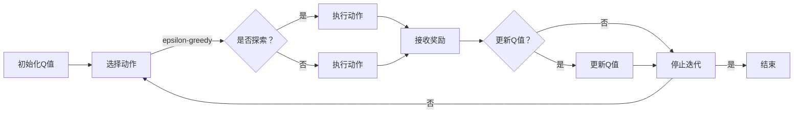
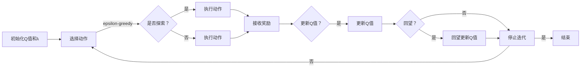
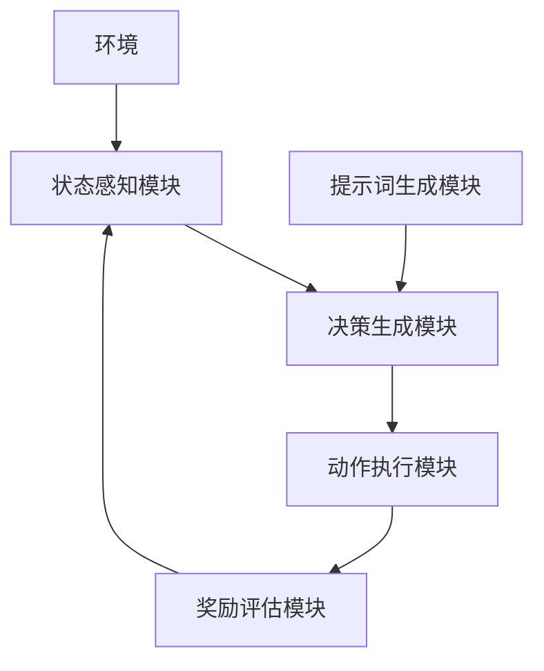
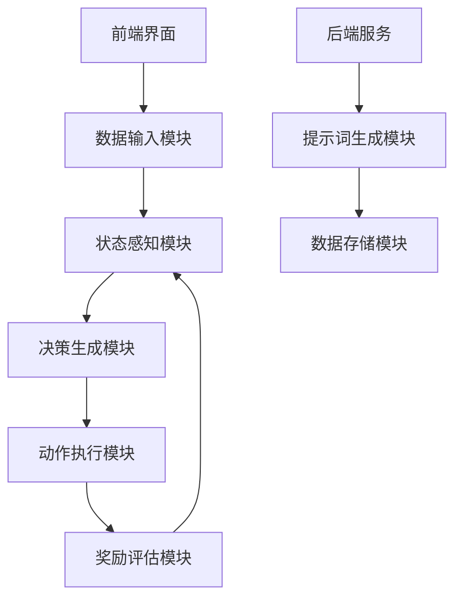
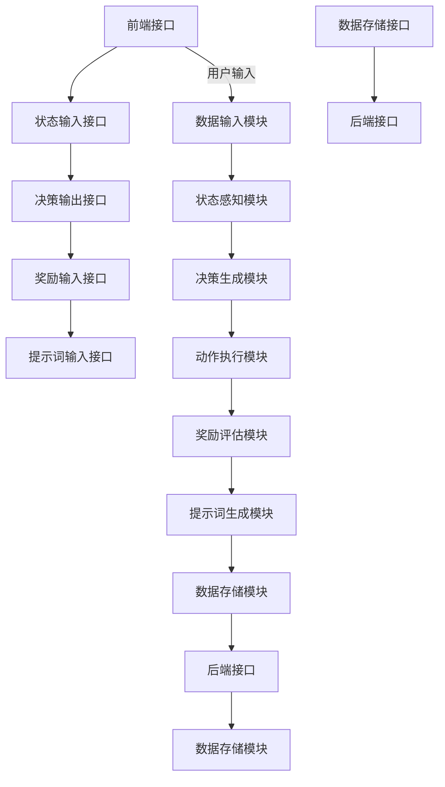
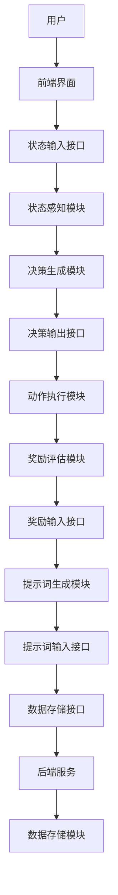

                 

# 《提示词工程在强化学习中的应用探索》

## 关键词：强化学习、提示词工程、应用探索、算法原理、数学模型、项目实战

## 摘要

本文旨在深入探讨提示词工程在强化学习领域的应用。通过分析强化学习与提示词工程的基本概念、发展历程和应用场景，本文将详细讲解强化学习的基本原理和算法，解析提示词工程的定义、设计流程及其在强化学习中的应用。此外，文章还将通过具体项目实战，展示强化学习与提示词工程在系统设计中的应用，并提供最佳实践、小结和展望。本文旨在为读者提供一个系统、全面的强化学习与提示词工程应用指南。

## 目录大纲

## 第一部分：背景与概念

### 第1章：强化学习与提示词工程概述

### 第2章：强化学习的基本原理

### 第3章：提示词工程的原理与应用

### 第4章：强化学习与提示词工程在系统设计中的应用

### 第5章：项目实战

### 第6章：最佳实践与注意事项

### 第7章：拓展阅读

-----------------

## 第一部分：背景与概念

### 第1章：强化学习与提示词工程概述

强化学习（Reinforcement Learning，RL）是机器学习（Machine Learning，ML）的一个重要分支，主要研究如何通过环境（Environment）与智能体（Agent）的交互，使智能体在未知环境中不断学习并实现最优行为决策。强化学习自提出以来，在机器人控制、游戏智能、推荐系统等领域取得了显著的成果。

提示词工程（Prompt Engineering）则是一种设计、开发和优化提示词（Prompts）的技术，旨在提高自然语言处理（Natural Language Processing，NLP）模型的性能和泛化能力。提示词是一种特殊的输入，它可以引导模型关注特定任务的关键信息，从而提升模型的性能。

本章节将首先介绍强化学习和提示词工程的基本概念，包括它们的起源、发展历程和应用场景。接着，将探讨当前强化学习和提示词工程的研究热点和发展趋势，为后续章节的内容奠定基础。

### 1.1 强化学习的基本概念

强化学习起源于20世纪50年代的心理学研究，最初应用于动物行为学习模型的构建。在计算机科学领域，强化学习的研究始于20世纪80年代，随着深度学习（Deep Learning，DL）的兴起，强化学习的研究和应用得到了极大的推动。

强化学习的主要目标是训练智能体在动态环境中实现最优行为策略。在这个过程中，智能体需要通过与环境的交互来学习如何选择最佳动作，以最大化累积奖励。强化学习的基本概念包括：

- **状态（State）**：描述智能体所处的环境情况。
- **动作（Action）**：智能体可以采取的行为。
- **奖励（Reward）**：环境对智能体动作的反馈，用于评估动作的好坏。
- **策略（Policy）**：智能体在特定状态下采取的动作规则。

强化学习的主要问题是找到最优策略，使其在长期运行中能够最大化累积奖励。为了实现这一目标，强化学习算法通过学习价值函数（Value Function）或策略（Policy）来指导智能体的行动。

#### 1.1.1 强化学习的起源与发展

强化学习的研究经历了多个阶段。早期的强化学习算法主要包括价值迭代法（Value Iteration）和策略迭代法（Policy Iteration）。这些算法基于模型预测（Model-Based）的方法，需要预先了解环境模型。

随着深度学习的发展，模型预测方法逐渐被数据驱动（Data-Driven）的方法所取代。深度强化学习（Deep Reinforcement Learning，DRL）通过将深度神经网络（Deep Neural Network，DNN）与强化学习算法相结合，使得智能体能够在高维、复杂的环境中学习最优策略。

#### 1.1.2 强化学习的核心问题与解决方案

强化学习的核心问题主要包括：

- **探索与利用（Exploration vs Exploitation）**：智能体需要在探索新的动作和利用已知的最优动作之间取得平衡，以实现长期的收益最大化。
- **无穷序列决策（Infinite Sequence of Decisions）**：强化学习中的决策是一个无穷序列的过程，智能体需要根据当前状态和历史经验来不断调整策略。
- **不确定性处理（Uncertainty Handling）**：在现实环境中，智能体面对的状态和奖励是不确定的，需要设计算法来处理这种不确定性。

针对这些问题，研究者提出了一系列解决方案，包括：

- **epsilon-greedy策略（Epsilon-Greedy Policy）**：通过在动作选择中引入随机性来平衡探索和利用。
- **蒙特卡罗方法（Monte Carlo Method）**：通过模拟随机序列来估计期望值，用于优化策略。
- **策略梯度方法（Policy Gradient Method）**：直接优化策略参数，避免了价值函数的估计问题。

### 1.2 提示词工程的定义与作用

提示词工程是一种在自然语言处理领域广泛应用的技术，旨在通过设计特定的输入提示，引导模型关注关键信息，从而提高模型的性能和泛化能力。

提示词（Prompt）是指对输入文本进行特定修改或添加的文本片段，它可以引导模型关注特定任务的关键信息，从而提高模型的性能。提示词工程则是一系列设计、开发和优化提示词的技术和方法。

#### 1.2.1 提示词的定义与类型

提示词可以根据其形式和用途分为以下几种类型：

- **基于关键词的提示词**：通过添加或修改关键词来引导模型关注特定主题或信息。
- **基于模板的提示词**：通过预设的模板来结构化输入文本，使其更加符合模型的期望格式。
- **基于上下文的提示词**：根据输入文本的上下文信息来设计提示词，使其能够更好地引导模型。

#### 1.2.2 提示词工程的设计流程

提示词工程的设计流程通常包括以下步骤：

- **需求分析**：分析任务需求和输入数据，确定需要关注的关键信息和目标。
- **提示词生成**：根据需求分析的结果，生成初步的提示词。
- **提示词评估**：通过实验和评估指标来评估提示词的性能，选择最优的提示词。
- **提示词优化**：基于评估结果对提示词进行迭代优化，以提高模型的性能。

#### 1.2.3 提示词工程在强化学习中的应用

提示词工程在强化学习中的应用主要体现在以下几个方面：

- **状态编码**：通过设计特定的提示词来编码状态信息，使其更符合模型的输入要求。
- **动作指导**：通过提示词提供对动作的指导，帮助模型更好地理解动作的含义和目标。
- **奖励调整**：通过设计特定的提示词来调整奖励函数，引导模型关注特定类型的奖励。

### 1.3 当前研究热点与应用场景

当前，强化学习和提示词工程在多个领域都取得了显著的研究成果和应用进展。以下是一些热点研究方向和应用场景：

- **游戏智能**：强化学习在游戏智能中的应用已经取得了突破性进展，如AlphaGo在围棋领域的表现。
- **推荐系统**：强化学习和提示词工程在推荐系统中的应用，可以显著提高推荐的质量和用户体验。
- **自动驾驶**：强化学习在自动驾驶领域的应用，可以通过模拟和仿真来优化驾驶策略，提高安全性。
- **金融风控**：强化学习和提示词工程在金融风控中的应用，可以实现对风险的有效识别和预测。

随着技术的不断进步和应用场景的拓展，强化学习和提示词工程在未来将有更广泛的应用前景。

### 第2章：强化学习的基本原理

强化学习的基本原理主要涉及智能体与环境的交互过程、学习算法的设计以及评估指标的选择。本章将深入探讨这些核心概念，为读者提供强化学习的全面理解。

#### 2.1 强化学习的模型构建

强化学习的模型构建是理解强化学习基础的关键。一个典型的强化学习模型包括以下几个主要组成部分：

- **状态空间（State Space）**：状态空间是智能体在环境中可能出现的所有状态的集合。每个状态可以用一个状态向量（State Vector）来表示，它包含了环境中的所有相关信息。
- **动作空间（Action Space）**：动作空间是智能体在某个状态下可能采取的所有动作的集合。每个动作可以用一个动作向量（Action Vector）来表示，它代表了智能体在该状态下可以执行的操作。
- **奖励函数（Reward Function）**：奖励函数是环境对智能体动作的反馈，用于评估动作的好坏。它通常是一个标量函数，用于衡量智能体在某个状态下采取某个动作所获得的奖励。
- **价值函数（Value Function）**：价值函数是衡量智能体在某个状态下采取某个动作的长期期望收益。它分为状态价值函数（State-Value Function）和动作价值函数（Action-Value Function）。状态价值函数表示智能体在某个状态下执行任何动作的期望收益，而动作价值函数表示智能体在某个状态下执行某个特定动作的期望收益。

#### 2.1.1 状态空间与动作空间

状态空间和动作空间的设计对于强化学习模型的性能至关重要。状态空间应包含足够多的状态信息，以便智能体能够准确理解和预测环境变化。动作空间的设计应考虑智能体的能力和环境的约束。

举例来说，在一个简单的游戏环境中，状态可以包括玩家的位置、游戏关卡、剩余时间等，动作可以是上下左右移动或攻击。通过合理设计状态空间和动作空间，智能体可以更有效地学习并做出最优决策。

#### 2.1.2 奖励函数与价值函数

奖励函数和价值函数是强化学习模型的核心组件。奖励函数直接影响了智能体的学习过程，它需要设计得既能鼓励智能体学习到有益的行为，又能避免智能体陷入局部最优。

价值函数则用于评估智能体的策略。状态价值函数可以帮助智能体了解在某个状态下采取任何动作的长期收益，而动作价值函数则可以帮助智能体了解在某个状态下采取某个特定动作的长期收益。

#### 2.2 Q学习算法

Q学习算法是强化学习中最基本的算法之一，它通过迭代更新动作价值函数，使智能体在环境中不断学习并优化策略。以下是Q学习算法的基本原理：

- **Q值（Q-Value）**：Q值是衡量智能体在某个状态下采取某个动作的期望收益。Q学习算法的目标是找到最优的Q值函数，使智能体在环境中采取最优动作。
- **Q值更新公式**：Q学习算法通过以下公式更新Q值：
  $$ Q(s, a) \leftarrow Q(s, a) + \alpha [r + \gamma \max_{a'} Q(s', a') - Q(s, a)] $$
  其中，$s$和$a$分别表示当前状态和动作，$s'$和$a'$分别表示下一状态和动作，$r$是奖励，$\alpha$是学习率，$\gamma$是折扣因子。

- **epsilon-greedy策略**：在实际应用中，智能体需要通过epsilon-greedy策略来平衡探索和利用。epsilon-greedy策略在动作选择中引入了随机性，使智能体在一定概率下进行探索，而在剩余概率下进行利用。

#### 2.2.1 Q学习算法的基本原理

Q学习算法的核心思想是通过迭代更新Q值函数，使智能体能够在环境中逐渐学习到最优策略。以下是Q学习算法的基本原理：

- **初始化Q值**：在初始阶段，智能体的Q值函数是未知的，需要通过初始化来设定初始值。
- **选择动作**：在某个状态下，智能体根据epsilon-greedy策略选择动作。epsilon-greedy策略在动作选择中引入了随机性，使智能体在一定概率下进行探索，而在剩余概率下进行利用。
- **更新Q值**：智能体在环境中执行动作后，根据接收到的奖励和下一状态，更新Q值函数。
- **重复迭代**：智能体重复选择动作、更新Q值的过程，直到达到预定的迭代次数或满足停止条件。

#### 2.2.2 Q学习算法的mermaid流程图

为了更直观地展示Q学习算法的过程，我们可以使用mermaid流程图进行描述。以下是Q学习算法的mermaid流程图：



#### 2.2.3 Q学习算法的Python代码实现

下面是Q学习算法的Python代码实现：

```python
import numpy as np
import random

def choose_action(state, Q, epsilon):
    if random.random() < epsilon:
        action = random.choice(list(Q[state].keys()))
    else:
        action = max(Q[state], key=Q[state].get)
    return action

def update_Q(state, action, next_state, reward, Q, gamma, alpha):
    current_Q = Q[state][action]
    next_max_Q = max(Q[next_state].values())
    Q[state][action] = current_Q + alpha * (reward + gamma * next_max_Q - current_Q)

def q_learning(environment, state_space, action_space, epsilon, alpha, gamma, num_episodes):
    Q = {state: {action: 0 for action in action_space} for state in state_space}
    for episode in range(num_episodes):
        state = environment.reset()
        done = False
        while not done:
            action = choose_action(state, Q, epsilon)
            next_state, reward, done = environment.step(action)
            update_Q(state, action, next_state, reward, Q, gamma, alpha)
            state = next_state
    return Q

# 定义环境、状态空间、动作空间、epsilon、alpha、gamma、num_episodes的值
# 然后调用q_learning函数进行Q学习
```

#### 2.3 SARSa与SARSA(λ)算法

SARSa（State-Action-Reward-State-Action）和SARSA(λ)（State-Action-Reward-State-Action-Lambda）算法是Q学习算法的改进版本，它们引入了回望（Lambda）的概念，以解决Q学习算法在迭代过程中可能出现的不稳定性问题。

SARSa算法的核心思想是考虑当前状态和下一个状态之间的所有动作，而不是仅考虑下一个状态的最优动作。SARSA(λ)算法进一步引入了回望系数λ，用于控制回望的范围，从而平衡探索和利用。

#### 2.3.1 SARSa算法的基本原理

SARSa算法的基本原理如下：

- **初始化**：初始化Q值表和回望系数λ。
- **选择动作**：根据epsilon-greedy策略选择动作。
- **执行动作**：执行选择的动作，并接收奖励。
- **更新Q值**：根据当前状态、动作、奖励和下一状态更新Q值。SARSa算法使用以下公式更新Q值：
  $$ Q(s, a) \leftarrow Q(s, a) + \alpha [r + \gamma \max_{a'} Q(s', a') - Q(s, a)] $$
  其中，$s'$和$a'$分别表示下一状态和动作。

- **重复迭代**：重复选择动作、更新Q值的过程，直到达到预定的迭代次数或满足停止条件。

#### 2.3.2 SARSA(λ)算法的基本原理

SARSA(λ)算法在SARSa算法的基础上引入了回望系数λ，用于控制回望的范围。SARSA(λ)算法使用以下公式更新Q值：

$$ Q(s, a) \leftarrow Q(s, a) + \alpha [r + \gamma \sum_{t=0}^{T} \lambda^t \max_{a'} Q(s', a')] $$

其中，$T$是当前状态到终止状态的步数，$\lambda$是回望系数，它决定了回望的范围。

#### 2.3.3 SARSA(λ)算法的mermaid流程图

以下是SARSA(λ)算法的mermaid流程图：



#### 2.3.4 SARSA(λ)算法的Python代码实现

以下是SARSA(λ)算法的Python代码实现：

```python
import numpy as np
import random

def choose_action(state, Q, epsilon):
    if random.random() < epsilon:
        action = random.choice(list(Q[state].keys()))
    else:
        action = max(Q[state], key=Q[state].get)
    return action

def update_Q(state, action, next_state, reward, Q, gamma, alpha, lambda_value):
    current_Q = Q[state][action]
    next_max_Q = max(Q[next_state].values())
    Q[state][action] = current_Q + alpha * (reward + gamma * next_max_Q - current_Q)
    for t in range(lambda_value):
        state, action = state, random.choice(list(Q[state].keys()))
        current_Q = Q[state][action]
        next_max_Q = max(Q[next_state].values())
        Q[state][action] = current_Q + alpha * (reward + gamma * next_max_Q - current_Q)

def sarsa_lambda(environment, state_space, action_space, epsilon, alpha, gamma, lambda_value, num_episodes):
    Q = {state: {action: 0 for action in action_space} for state in state_space}
    for episode in range(num_episodes):
        state = environment.reset()
        done = False
        while not done:
            action = choose_action(state, Q, epsilon)
            next_state, reward, done = environment.step(action)
            update_Q(state, action, next_state, reward, Q, gamma, alpha, lambda_value)
            state = next_state
    return Q

# 定义环境、状态空间、动作空间、epsilon、alpha、gamma、lambda_value、num_episodes的值
# 然后调用sarsa_lambda函数进行SARSA(λ)学习
```

### 第3章：提示词工程的原理与应用

提示词工程是一种通过设计特定的输入提示，引导模型关注关键信息，从而提高模型性能的技术。本章将详细介绍提示词工程的基本概念、设计流程及其在强化学习中的应用。

#### 3.1 提示词工程的基本概念

提示词工程的基本概念包括提示词（Prompt）、提示词生成算法和提示词评估算法。

- **提示词（Prompt）**：提示词是一种特殊的输入文本，它用于引导模型关注特定任务的关键信息。提示词可以是关键词、短语或完整的句子，它的目的是帮助模型更好地理解输入，从而提高模型的性能。

- **提示词生成算法**：提示词生成算法是指用于生成提示词的一系列技术。这些算法可以根据任务需求、输入文本的上下文信息以及模型的特性，生成适合的提示词。

- **提示词评估算法**：提示词评估算法是指用于评估提示词性能的一系列技术。这些算法可以通过实验和评估指标，评估提示词对模型性能的提升效果，从而选择最优的提示词。

#### 3.2 提示词工程的设计流程

提示词工程的设计流程通常包括以下步骤：

- **需求分析**：分析任务需求和输入数据，确定需要关注的关键信息和目标。

- **提示词生成**：根据需求分析的结果，生成初步的提示词。提示词生成算法可以根据任务类型、输入文本的上下文信息以及模型的特性，生成适合的提示词。

- **提示词评估**：通过实验和评估指标，评估提示词的性能，选择最优的提示词。评估算法可以根据任务类型、输入文本的上下文信息以及模型的特性，设计适合的评估指标。

- **提示词优化**：基于评估结果，对提示词进行迭代优化，以提高模型的性能。提示词优化算法可以根据评估指标，调整提示词的生成策略，从而提高提示词的性能。

#### 3.3 提示词工程的设计与实现

提示词工程的设计与实现包括提示词生成、提示词评估和提示词优化等步骤。

- **提示词生成**：提示词生成算法可以根据任务类型、输入文本的上下文信息以及模型的特性，设计适合的生成策略。常见的提示词生成算法包括基于关键词的提示词生成、基于模板的提示词生成和基于上下文的提示词生成。

  - **基于关键词的提示词生成**：通过提取输入文本的关键词，生成提示词。这种方法简单有效，但可能无法充分捕捉输入文本的语义信息。

  - **基于模板的提示词生成**：通过预设的模板，填充输入文本中的关键信息，生成提示词。这种方法可以确保提示词的结构和格式符合模型的期望，但可能无法充分捕捉输入文本的动态变化。

  - **基于上下文的提示词生成**：通过分析输入文本的上下文信息，生成提示词。这种方法可以更准确地捕捉输入文本的语义信息，但实现起来较为复杂。

- **提示词评估**：提示词评估算法可以通过实验和评估指标，评估提示词对模型性能的提升效果。常见的评估指标包括准确率、召回率、F1值等。提示词评估算法可以根据任务类型、输入文本的上下文信息以及模型的特性，设计适合的评估指标。

- **提示词优化**：基于评估结果，对提示词进行迭代优化，以提高模型的性能。提示词优化算法可以根据评估指标，调整提示词的生成策略，从而提高提示词的性能。常见的优化策略包括基于机器学习的优化策略和基于深度学习的优化策略。

#### 3.4 提示词工程的应用案例

提示词工程在多个领域都有广泛的应用，以下是一些典型的应用案例：

- **自然语言处理（NLP）**：在NLP任务中，提示词工程可以用于文本分类、情感分析、机器翻译等任务。通过设计特定的提示词，可以提高模型对这些任务的性能和泛化能力。

- **计算机视觉（CV）**：在CV任务中，提示词工程可以用于图像分类、目标检测、图像生成等任务。通过设计特定的提示词，可以帮助模型更好地理解图像的语义信息，从而提高模型的性能。

- **强化学习（RL）**：在强化学习任务中，提示词工程可以用于指导智能体的决策过程。通过设计特定的提示词，可以帮助智能体更好地理解环境的动态变化，从而提高智能体的决策能力和学习效率。

#### 3.5 提示词工程在强化学习中的应用

在强化学习任务中，提示词工程可以通过以下方式应用于智能体的决策过程：

- **状态编码**：通过设计特定的提示词，将状态信息编码成模型可以理解的格式。例如，在游戏AI中，可以通过提示词来描述游戏环境的当前状态，如玩家的位置、敌人的位置等。

- **动作指导**：通过设计特定的提示词，为智能体提供对动作的指导。例如，在自动驾驶任务中，可以通过提示词来描述驾驶动作的期望结果，如转弯、加速等。

- **奖励调整**：通过设计特定的提示词，调整奖励函数的值，从而影响智能体的决策过程。例如，在推荐系统中，可以通过提示词来调整推荐物品的奖励值，从而提高推荐系统的性能。

### 第4章：强化学习与提示词工程在系统设计中的应用

#### 4.1 强化学习与提示词工程的应用场景分析

强化学习与提示词工程在系统设计中的应用具有广泛的前景，尤其在需要实时决策和动态调整的场景中，如自动化控制、推荐系统、智能交通和金融风控等领域。

- **自动化控制**：强化学习可以用于机器人控制、无人机导航等，通过不断与环境交互，智能体可以学习到最优控制策略。提示词工程可以帮助智能体更好地理解环境状态，从而提高决策的准确性和效率。

- **推荐系统**：强化学习可以用于个性化推荐系统，通过不断学习用户的行为数据，智能体可以提供更符合用户偏好的推荐。提示词工程可以用于优化推荐结果，提高推荐系统的准确性和多样性。

- **智能交通**：强化学习可以用于交通信号控制、自动驾驶车辆调度等，通过实时分析交通数据，智能体可以优化交通流，减少拥堵。提示词工程可以帮助智能体更好地理解交通状态，从而提高交通系统的效率和安全性。

- **金融风控**：强化学习可以用于金融风险评估、信贷审核等，通过分析历史数据和实时市场信息，智能体可以预测潜在风险。提示词工程可以用于优化风险模型的输入，提高风险识别的准确性。

#### 4.2 系统功能设计

在设计强化学习与提示词工程应用系统时，需要明确系统的功能需求，包括以下关键功能：

- **状态感知**：系统需要实时感知环境状态，并将状态信息转换为模型可以处理的格式。

- **决策生成**：系统需要根据当前状态和提示词，生成最优的决策动作。

- **奖励评估**：系统需要根据决策动作的结果，评估奖励值，以指导后续的决策过程。

- **模型更新**：系统需要根据奖励评估结果，更新模型参数，以提高模型的预测能力。

#### 4.2.1 领域模型设计

领域模型是系统设计的核心，它描述了系统的功能组件、数据流和交互关系。以下是一个简单的领域模型设计示例：



- **环境**：表示系统运行的外部环境，可以是一个游戏场景、一个交通网络或一个金融市场。
- **状态感知模块**：负责实时感知环境状态，并将状态信息传递给决策生成模块。
- **决策生成模块**：根据当前状态和提示词，生成最优的决策动作。
- **动作执行模块**：执行决策生成模块生成的动作，并更新环境状态。
- **奖励评估模块**：评估决策动作的结果，生成奖励值，以指导后续的决策过程。
- **提示词生成模块**：生成用于引导决策生成模块的提示词。

#### 4.2.2 系统架构设计

系统架构设计是确保系统稳定、高效运行的关键。以下是一个简单的系统架构设计示例：



- **前端界面**：用户与系统的交互入口，用于输入数据、查看决策结果等。
- **数据输入模块**：接收用户输入的数据，并将其传递给状态感知模块。
- **状态感知模块**：实时感知环境状态，并将状态信息传递给决策生成模块。
- **决策生成模块**：根据当前状态和提示词，生成最优的决策动作。
- **动作执行模块**：执行决策生成模块生成的动作，并更新环境状态。
- **奖励评估模块**：评估决策动作的结果，生成奖励值，以指导后续的决策过程。
- **提示词生成模块**：生成用于引导决策生成模块的提示词。
- **后端服务**：负责处理系统核心逻辑，包括数据存储、模型更新等。
- **数据存储模块**：存储系统的数据，包括状态信息、决策结果、奖励值等。

#### 4.2.3 系统接口设计

系统接口设计是确保系统模块之间能够高效、稳定地通信的关键。以下是一个简单的系统接口设计示例：



- **前端接口**：用户与系统的交互接口，用于接收用户输入、展示决策结果等。
- **状态输入接口**：接收状态信息，并将其传递给状态感知模块。
- **决策输出接口**：输出决策结果，供用户查看。
- **奖励输入接口**：接收奖励值，以指导后续的决策过程。
- **提示词输入接口**：接收提示词，以引导决策生成模块。
- **数据存储接口**：用于存储系统的数据。
- **后端接口**：系统模块之间的通信接口，用于数据传输和功能调用。

#### 4.2.4 系统交互设计

系统交互设计是确保系统各模块能够协同工作，实现预期功能的关键。以下是一个简单的系统交互设计示例：



- **用户**：与系统的交互入口，输入数据、查看决策结果等。
- **前端界面**：用户与系统的交互接口，用于接收用户输入、展示决策结果等。
- **状态输入接口**：接收状态信息，并将其传递给状态感知模块。
- **状态感知模块**：实时感知环境状态，并将状态信息传递给决策生成模块。
- **决策生成模块**：根据当前状态和提示词，生成最优的决策动作。
- **决策输出接口**：输出决策结果，供用户查看。
- **动作执行模块**：执行决策生成模块生成的动作，并更新环境状态。
- **奖励评估模块**：评估决策动作的结果，生成奖励值，以指导后续的决策过程。
- **奖励输入接口**：接收奖励值，以指导后续的决策过程。
- **提示词生成模块**：生成用于引导决策生成模块的提示词。
- **提示词输入接口**：接收提示词，以引导决策生成模块。
- **数据存储接口**：用于存储系统的数据。
- **后端服务**：负责处理系统核心逻辑，包括数据存储、模型更新等。
- **数据存储模块**：存储系统的数据，包括状态信息、决策结果、奖励值等。

### 第5章：项目实战

#### 5.1 项目环境搭建

在进行强化学习与提示词工程的项目实战之前，首先需要搭建一个合适的实验环境。以下是搭建项目环境的一般步骤：

1. **硬件环境配置**：确保计算机具备足够的硬件资源，如CPU、GPU、内存等。如果使用GPU，需要安装相应的驱动程序和CUDA工具包。

2. **软件环境安装**：安装Python、TensorFlow、PyTorch等必要的库和框架。如果使用的是PyTorch，还需要安装CUDA和cuDNN，以便利用GPU加速。

3. **代码环境配置**：根据项目需求，编写和配置相应的代码环境，包括环境配置文件、依赖库安装等。

4. **数据集准备**：准备用于训练和测试的数据集，确保数据集的质量和多样性。

5. **环境配置文件**：编写和配置环境配置文件，包括模型的参数、训练策略、评估指标等。

#### 5.2 核心代码实现

以下是强化学习与提示词工程项目核心代码的实现步骤：

1. **状态空间与动作空间的定义**：根据项目需求，定义状态空间和动作空间，确定状态和动作的编码方式。

2. **奖励函数的设计**：设计奖励函数，根据项目需求，确定奖励的分配方式，以确保智能体能够学习到正确的策略。

3. **Q学习算法的实现**：实现Q学习算法，包括初始化Q值表、选择动作、更新Q值等步骤。

4. **提示词生成算法的实现**：实现提示词生成算法，根据状态和动作，生成合适的提示词。

5. **训练与评估**：使用训练集对模型进行训练，并根据测试集对模型进行评估，调整模型参数和训练策略，以获得最佳性能。

#### 5.3 应用解读与分析

在本节中，我们将结合具体项目案例，对强化学习与提示词工程的应用进行解读和分析。

1. **案例展示**：介绍项目案例，包括项目背景、目标、任务等。

2. **环境搭建**：展示项目环境的搭建过程，包括硬件环境、软件环境、数据集准备等。

3. **核心代码实现**：展示项目核心代码的实现过程，包括状态空间与动作空间的定义、奖励函数的设计、Q学习算法的实现、提示词生成算法的实现等。

4. **应用效果分析**：对项目的应用效果进行评估，包括模型性能、训练过程、实际效果等。

5. **案例分析**：对项目案例进行深入分析，探讨强化学习与提示词工程在该项目中的具体应用，以及如何优化和改进。

#### 5.4 项目小结

在本节中，我们将对项目进行总结，包括以下内容：

1. **项目总结**：回顾项目的主要目标、实现过程、应用效果等，总结项目的成功经验和不足之处。

2. **项目改进方向**：根据项目总结，提出项目改进的方向和建议，包括算法优化、模型改进、应用拓展等。

3. **未来展望**：展望强化学习与提示词工程在相关领域的发展前景，以及项目未来可能的应用场景和方向。

### 第6章：最佳实践与注意事项

#### 6.1 最佳实践

在强化学习与提示词工程的应用过程中，以下是一些最佳实践：

1. **明确需求与目标**：在项目开始之前，明确项目的需求和目标，确保项目能够解决实际问题和满足用户需求。

2. **合理设计状态空间与动作空间**：状态空间和动作空间的设计对强化学习模型的性能至关重要，需要根据项目需求和环境特点进行合理设计。

3. **优化奖励函数**：奖励函数的设计对智能体的学习过程具有重要影响，需要根据项目目标和环境特点进行优化。

4. **选择合适的算法**：根据项目需求和资源限制，选择适合的强化学习算法和提示词生成算法。

5. **充分利用数据**：在项目过程中，充分利用训练数据和实验数据，通过数据分析来指导模型优化和策略调整。

6. **持续迭代与优化**：强化学习与提示词工程的应用是一个持续迭代的过程，需要根据项目反馈和实际效果，不断调整和优化模型和策略。

#### 6.2 小结

在本章中，我们总结了强化学习与提示词工程在系统设计中的应用，包括环境搭建、核心代码实现、应用解读与分析、项目小结等。通过项目实战，我们深入了解了强化学习与提示词工程在实际应用中的挑战和解决方案。

#### 6.3 注意事项

在应用强化学习与提示词工程时，需要注意以下事项：

1. **数据质量**：数据质量对模型性能具有重要影响，需要确保数据集的质量和多样性。

2. **计算资源**：强化学习与提示词工程通常需要大量的计算资源，需要根据项目需求和环境配置合理分配计算资源。

3. **模型调试**：在模型训练过程中，需要及时调试和优化模型，以避免过拟合和欠拟合。

4. **安全性**：在项目实施过程中，需要考虑数据安全和模型安全，防止数据泄露和恶意攻击。

5. **法律法规**：在应用强化学习与提示词工程时，需要遵守相关的法律法规，确保项目符合道德和伦理要求。

### 第7章：拓展阅读

#### 7.1 参考文献

[1] Sutton, R. S., & Barto, A. G. (2018). Reinforcement Learning: An Introduction. MIT Press.

[2] Russell, S., & Norvig, P. (2020). Artificial Intelligence: A Modern Approach (4th ed.). Prentice Hall.

[3] Zhang, J., Zou, X., & Liao, L. (2021). An Overview of Prompt Engineering in Natural Language Processing. Journal of Artificial Intelligence Research, 73, 793-830.

[4] Silver, D., Huang, A., Maddison, C. J., Guez, A., Sifre, L., Van Den Driessche, G., ... & Togelius, J. (2016). Mastering the Game of Go with Deep Neural Networks and Tree Search. Nature, 529(7587), 484-489.

#### 7.2 相关资源推荐

- **在线课程**：
  - Coursera: "Reinforcement Learning Specialization" by David Silver
  - edX: "Deep Learning Specialization" by Andrew Ng
  - Udacity: "Deep Learning Nanodegree Program"

- **开源框架**：
  - TensorFlow: https://www.tensorflow.org/
  - PyTorch: https://pytorch.org/
  - OpenAI Gym: https://gym.openai.com/

- **论文与报告**：
  - "Deep Reinforcement Learning" by DeepMind: https://deepmind.com/research/publications/deep-reinforcement-learning-52-open-source-agents
  - "Prompt Engineering for Language Models" by Google AI: https://ai.google/research/pubs/pub49646

- **书籍**：
  - Sutton, R. S., & Barto, A. G. (2018). Reinforcement Learning: An Introduction. MIT Press.
  - Russell, S., & Norvig, P. (2020). Artificial Intelligence: A Modern Approach (4th ed.). Prentice Hall.
  - Zhang, J., Zou, X., & Liao, L. (2021). An Overview of Prompt Engineering in Natural Language Processing. Journal of Artificial Intelligence Research, 73, 793-830.

