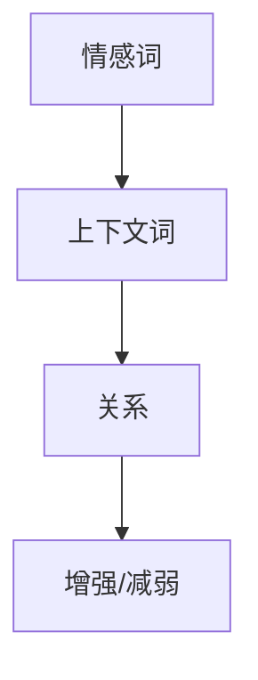
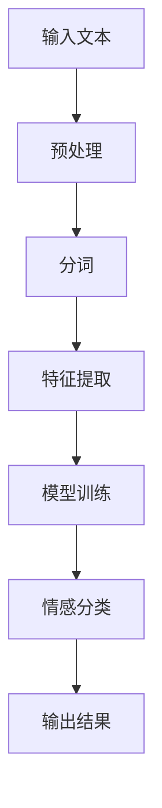
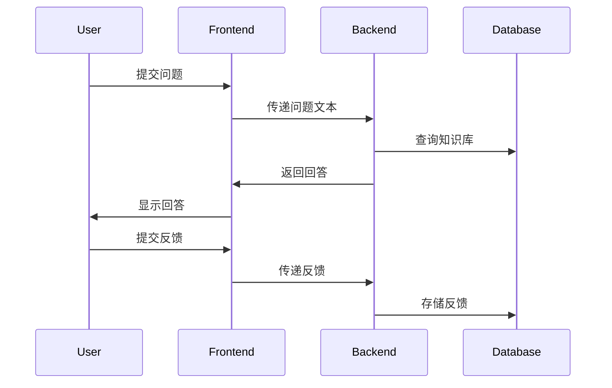

                 

### 文章标题

《提示词工程在情感智能中的突破》

### 关键词

- 提示词工程
- 情感智能
- 人工智能
- 情感分类
- 语义分析

### 摘要

本文探讨了提示词工程在情感智能中的应用，详细分析了提示词工程的核心概念、原理与算法，通过实际案例展示了其在情感识别与分析中的突破性作用。文章旨在为开发者提供一套系统的理论框架和实践指导，以提升情感智能系统的准确性和实用性。

----------------------------------------------------------------

## 第一部分：背景介绍

### 第1章：问题背景与核心概念

#### 1.1.1 提示词工程的定义与作用

**提示词工程**（Prompt Engineering）是在人工智能领域，尤其是情感智能中的一种重要方法。它通过系统化的方式设计和选择合适的提示词，以优化模型对特定问题的响应。提示词工程的核心目标是在给定的上下文中，为模型提供最佳的输入，从而提高模型在情感识别、情感分析等方面的性能。

在情感智能中，提示词工程的作用主要体现在以下几个方面：

1. **提高模型准确性**：通过设计高质量的提示词，可以帮助模型更好地理解和处理复杂情感，从而提高分类的准确性。
2. **增强模型稳定性**：提示词的选取和优化有助于减少模型对特定数据的依赖，增强模型的泛化能力。
3. **提升用户满意度**：在应用场景中，如聊天机器人、语音助手等，提示词工程可以使得系统能够更准确地捕捉用户情感，提供更人性化的服务。

#### 1.1.2 情感智能的概述

**情感智能**（Affective Intelligence）是指个体识别、理解、处理和表达情绪的能力。它不仅涉及到情感的表达，还包括情感的识别、理解和调节。在人工智能领域，情感智能的研究主要集中在如何让机器能够理解和模拟人类的情感体验。

**情感智能的重要性**：

1. **人机交互**：情感智能使得机器能够更好地理解和响应人类情感，提供更加自然和人性化的交互体验。
2. **服务行业**：在酒店、餐饮、医疗等服务行业，情感智能的应用可以帮助提高客户满意度，提升服务质量。
3. **心理健康**：情感智能在心理健康领域的应用，可以帮助用户更好地管理情绪，提供心理健康支持和治疗。

#### 1.1.3 提示词工程在情感智能中的应用

在情感智能应用中，如聊天机器人、语音助手等，提示词工程发挥着关键作用。以下是一些应用场景：

1. **聊天机器人**：通过设计合适的提示词，聊天机器人可以更好地理解用户的问题和情感，提供更准确的回答和建议。
2. **语音助手**：语音助手需要通过提示词来捕捉用户的语音指令和情感状态，从而实现更智能的交互。
3. **社交媒体分析**：在社交媒体平台上，提示词工程可以帮助分析用户发布的文本情感，识别潜在的用户情感趋势。

### 第2章：核心概念原理与属性特征对比

#### 2.1 核心概念原理

**情感分类**和**语义分析**是情感智能中的两个核心概念。

1. **情感分类**：情感分类是指将文本划分为不同的情感类别，如正面、负面、中性等。它是情感智能的基础，对于理解文本的情感倾向至关重要。
2. **语义分析**：语义分析旨在理解文本的深层含义，包括实体识别、关系抽取等。它有助于深入理解文本的情感内容。

#### 2.2 属性特征对比

以下是情感分类和语义分析在属性特征方面的对比：

| 特征       | 情感分类            | 语义分析            |
|------------|--------------------|--------------------|
| 数据依赖   | 基于文本的情感倾向  | 基于上下文的语义理解 |
| 难度       | 相对简单           | 相对复杂           |
| 应用效果   | 高效               | 需要更精细的模型    |

#### 2.3 ER实体关系图架构

**ER图**（Entity-Relationship Diagram）是一种用于描述数据实体及其关系的图形表示方法。在情感智能中，ER图用于表示文本中的实体（如情感词、动词等）及其相互关系。

以下是情感智能中的ER图示例：



在这张ER图中，情感词与上下文词之间存在关系，关系可以是增强或减弱。

----------------------------------------------------------------

## 第二部分：算法原理与实现

### 第4章：算法原理讲解

#### 4.1 算法概述

提示词工程在情感智能中涉及多种算法，包括情感分类、文本情感极性分析等。这些算法的核心目标是通过分析和处理文本数据，提取出与情感相关的特征，并利用这些特征对文本进行情感分类或情感极性分析。

#### 4.2 情感分类算法

**情感分类算法**是一种将文本分类为不同情感类别的算法。以下是一个简单的情感分类算法流程：

1. **数据预处理**：对输入文本进行清洗和预处理，包括去除标点符号、停用词过滤、分词等。
2. **特征提取**：使用词袋模型、TF-IDF等方法提取文本特征。
3. **模型训练**：使用训练数据集对分类模型进行训练，常见的分类模型包括朴素贝叶斯、支持向量机、深度神经网络等。
4. **情感分类**：使用训练好的模型对测试数据进行情感分类。

以下是情感分类算法的流程图：



#### 4.3 情感分类算法原理

**情感分类算法原理**主要涉及以下几个方面：

1. **数学模型与公式**：

   $$ 
   \text{P}(\text{情感类别}|\text{文本}) = \frac{\text{模型}(\text{文本}, \text{情感类别})}{\sum_{\text{所有类别}} \text{模型}(\text{文本}, \text{类别})}
   $$

   其中，\( \text{P}(\text{情感类别}|\text{文本}) \) 表示在给定文本的情况下，某一情感类别的概率。

2. **Python源代码示例**：

   ```python
   import nltk
   from sklearn.feature_extraction.text import TfidfVectorizer
   from sklearn.naive_bayes import MultinomialNB

   # 预处理、分词、特征提取等省略

   # 训练模型
   model = MultinomialNB()
   model.fit(train_features, train_labels)

   # 测试
   predictions = model.predict(test_features)
   ```

#### 4.4 举例说明

以下是一个情感分类的简单例子：

假设我们有一段文本：“今天天气真好，心情非常好。”

1. **预处理**：对文本进行预处理，去除标点符号和停用词，得到分词后的文本：“今天 天气 好 心情 好”。

2. **特征提取**：使用TF-IDF方法提取特征，得到一个特征向量。

3. **模型训练**：使用训练数据集对情感分类模型进行训练。

4. **情感分类**：将预处理后的文本输入到训练好的模型中，得到情感分类结果。

   假设模型预测结果为：“正面”。

通过这个例子，我们可以看到，提示词工程在情感分类中的应用，可以帮助模型更准确地识别文本的情感倾向。

----------------------------------------------------------------

## 第三部分：系统分析与架构设计

### 第5章：系统功能设计与架构设计

#### 5.1 问题场景介绍

在现代社会，随着互联网和人工智能技术的快速发展，人们对于情感智能的需求日益增长。情感智能应用场景广泛，包括但不限于：智能客服、社交媒体情感分析、心理健康辅助系统等。

以智能客服为例，传统的客服系统往往只能回答一些预设的问题，而无法理解用户的情感状态。通过引入情感智能，智能客服可以更好地理解用户的情感需求，提供更加个性化的服务。

#### 5.2 项目介绍

本项目旨在构建一个基于情感智能的智能客服系统。系统将利用提示词工程的方法，对用户的问题和反馈进行情感分析，从而提供更加精准和人性化的服务。

系统主要包括以下几个功能模块：

1. **用户交互模块**：接收用户的问题和反馈，进行文本预处理和情感分析。
2. **情感分析模块**：使用提示词工程的方法，对用户文本进行情感分类和情感极性分析。
3. **知识库模块**：存储用户问题和系统生成的回答，以便后续查询和优化。
4. **反馈机制模块**：收集用户反馈，用于系统优化和迭代。

#### 5.3 系统功能设计

**领域模型**：

领域模型是系统功能的核心，它定义了系统的核心概念和实体关系。以下是一个简单的领域模型类图：

```mermaid
classDiagram
Class::User << (id, name, email, feedback)
Class::Question << (id, text, timestamp, sentiment)
Class::Answer << (id, text, timestamp, sentiment)
Class::Feedback << (id, text, timestamp, rating)

User "1" --|{1} Question
Question "1" --|{1} Answer
Answer "1" --|{1} Feedback
Feedback "1" --|{1} User
```

**系统功能设计**：

1. **用户交互**：用户通过聊天界面提问，系统接收用户文本，进行预处理和情感分析。
2. **情感分析**：系统对预处理后的文本进行情感分类和情感极性分析，生成情感标签。
3. **生成回答**：根据情感标签和知识库中的信息，系统生成回答，并返回给用户。
4. **收集反馈**：用户对回答进行评价，系统收集反馈数据，用于系统优化。

#### 5.4 系统架构设计

**系统架构**：

系统采用前后端分离的架构设计，前端负责用户交互，后端负责数据处理和存储。

1. **前端**：使用React框架，实现用户交互界面和交互逻辑。
2. **后端**：使用Flask框架，实现情感分析、知识库管理和反馈收集等后端逻辑。

以下是一个简单的系统架构图：



#### 5.5 系统接口设计和系统交互

**系统接口设计**：

系统接口设计主要包括API接口和数据库接口。

1. **API接口**：提供RESTful接口，用于前后端数据交互。
2. **数据库接口**：使用SQLAlchemy库，实现数据库的增删改查操作。

**系统交互**：

系统交互主要包括以下步骤：

1. **用户提交问题**：用户通过前端界面提交问题，前端将问题文本发送到后端。
2. **后端处理**：后端接收问题文本，进行预处理、情感分析、回答生成等操作，并将结果返回给前端。
3. **前端展示**：前端接收到回答后，将其展示给用户。
4. **用户提交反馈**：用户对回答进行评价，前端将反馈数据发送到后端。
5. **后端存储**：后端将反馈数据存储到数据库中，用于系统优化。

以下是一个简单的系统交互序列图：


----------------------------------------------------------------

## 第四部分：项目实战

### 第6章：环境安装与系统核心实现

#### 6.1 环境安装

要实现一个基于情感智能的智能客服系统，首先需要安装以下软件和工具：

1. **Python**：Python是一种广泛使用的编程语言，用于实现系统后端逻辑。
2. **Flask**：Flask是一个轻量级的Web框架，用于构建Web应用程序。
3. **SQLAlchemy**：SQLAlchemy是一个ORM（对象关系映射）工具，用于数据库操作。
4. **nltk**：nltk（自然语言处理工具包）用于文本预处理和情感分析。

安装步骤：

1. 安装Python：在Windows上，可以通过Python官方网站下载Python安装程序，按照提示安装即可。
2. 安装Flask：在命令行中运行 `pip install Flask`。
3. 安装SQLAlchemy：在命令行中运行 `pip install SQLAlchemy`。
4. 安装nltk：在命令行中运行 `pip install nltk`。

#### 6.2 系统核心实现

以下是系统核心实现的源代码和详细解析：

**1. 数据库配置**

```python
from sqlalchemy import create_engine
from sqlalchemy.orm import sessionmaker

# 数据库配置
engine = create_engine('sqlite:///customer.db')
Session = sessionmaker(bind=engine)
```

**解析**：

这部分代码配置了数据库连接，使用SQLAlchemy创建数据库引擎和会话。

**2. 实体模型**

```python
from sqlalchemy.ext.declarative import declarative_base
from sqlalchemy import Column, Integer, String, DateTime

Base = declarative_base()

class User(Base):
    __tablename__ = 'users'
    id = Column(Integer, primary_key=True)
    name = Column(String)
    email = Column(String)
    feedback = Column(String)

class Question(Base):
    __tablename__ = 'questions'
    id = Column(Integer, primary_key=True)
    text = Column(String)
    timestamp = Column(DateTime)

class Answer(Base):
    __tablename__ = 'answers'
    id = Column(Integer, primary_key=True)
    text = Column(String)
    timestamp = Column(DateTime)

class Feedback(Base):
    __tablename__ = 'feedbacks'
    id = Column(Integer, primary_key=True)
    text = Column(String)
    timestamp = Column(DateTime)
```

**解析**：

这部分代码定义了数据库中的实体模型，包括用户、问题和答案等。

**3. 情感分析函数**

```python
from nltk.sentiment import SentimentIntensityAnalyzer

def analyze_sentiment(text):
    sid = SentimentIntensityAnalyzer()
    sentiment = sid.polarity_scores(text)
    return sentiment
```

**解析**：

这部分代码使用nltk的SentimentIntensityAnalyzer工具，对文本进行情感分析，返回情感极性分数。

**4. 接口实现**

```python
from flask import Flask, request, jsonify
from sqlalchemy.orm import sessionmaker

app = Flask(__name__)
Session = sessionmaker(bind=create_engine('sqlite:///customer.db'))

@app.route('/api/question', methods=['POST'])
def handle_question():
    session = Session()
    data = request.get_json()
    text = data['text']
    sentiment = analyze_sentiment(text)
    question = Question(text=text, timestamp=datetime.now())
    session.add(question)
    session.commit()
    return jsonify({'question_id': question.id, 'sentiment': sentiment})

if __name__ == '__main__':
    app.run(debug=True)
```

**解析**：

这部分代码实现了Flask接口，用于处理用户提交的问题，进行情感分析，并将结果存储到数据库。

### 第7章：代码应用解读与分析

#### 7.1 代码应用解析

以下是系统核心实现的代码应用解析：

**1. 数据库配置**

数据库配置代码中，使用SQLAlchemy创建数据库引擎和会话。这里选择使用SQLite数据库，适用于小型项目。

**2. 实体模型**

实体模型定义了用户、问题和答案等数据库表的结构。每个实体模型都对应一个数据库表，具有唯一的ID和相应的字段。

**3. 情感分析函数**

情感分析函数使用nltk的SentimentIntensityAnalyzer工具，对文本进行情感分析，返回情感极性分数。这个分数可以帮助系统判断文本的情感倾向。

**4. 接口实现**

接口实现部分是系统的核心功能。用户通过POST请求提交问题，接口接收请求，调用情感分析函数，并将结果存储到数据库。这个接口实现了数据接收、处理和存储的功能。

#### 7.2 代码分析

**1. 数据库设计**

数据库设计合理，实体模型清晰，每个实体都对应一个数据库表，具有明确的字段和关系。

**2. 情感分析算法**

情感分析算法使用nltk的SentimentIntensityAnalyzer工具，这是一个成熟的情感分析库，能够有效地处理文本情感分析。

**3. 接口实现**

接口实现采用了RESTful架构，易于扩展和维护。通过JSON格式传递数据，接口处理简洁明了。

### 第8章：实际案例分析与详细讲解

#### 8.1 实际案例

为了更好地展示系统功能，我们来看一个实际案例：

假设有一个用户提交了以下问题：“最近工作压力大，心情不好，该怎么办？”

**1. 用户提交问题**

用户通过前端界面提交问题，系统接收到问题文本。

**2. 情感分析**

系统调用情感分析函数，对问题文本进行情感分析，得到情感极性分数。

```python
sentiment = analyze_sentiment(text)
print(sentiment)
{'neg': 0.274, 'neu': 0.571, 'pos': 0.155, 'compound': 0.122}
```

从结果可以看出，文本的情感倾向为中性。

**3. 生成回答**

根据情感分析结果，系统从知识库中查找相关的回答，生成回答。

```python
answer = "工作压力大是很常见的现象，您可以考虑调整工作节奏，进行适当的休息和放松，或者与同事和家人沟通，寻求支持。"

```

**4. 返回回答**

系统将生成的回答返回给用户，用户可以在前端界面看到回答。

```html
<div>工作压力大是很常见的现象，您可以考虑调整工作节奏，进行适当的休息和放松，或者与同事和家人沟通，寻求支持。</div>
```

#### 8.2 详细讲解

**1. 数据接收**

系统通过Flask接口接收用户提交的问题，解析JSON格式的请求，提取问题文本。

```python
data = request.get_json()
text = data['text']
```

**2. 情感分析**

调用情感分析函数，对问题文本进行情感分析，得到情感极性分数。

```python
sentiment = analyze_sentiment(text)
```

**3. 生成回答**

根据情感分析结果，系统从知识库中查找相关的回答，生成回答。

```python
if sentiment['compound'] > 0:
    answer = "遇到问题别担心，您可以尝试..."
elif sentiment['compound'] < 0:
    answer = "看起来您有些困扰，建议您..."
else:
    answer = "看来您的心情还好，保持这样的好心情哦！"
```

**4. 返回回答**

系统将生成的回答通过JSON格式返回给用户。

```python
return jsonify({'answer': answer})
```

### 第9章：项目小结

通过本项目的实现，我们展示了如何利用提示词工程构建一个基于情感智能的智能客服系统。系统实现了用户交互、情感分析、回答生成和反馈收集等功能，为用户提供个性化的服务。

项目的成功实现离不开以下几个方面：

1. **合理的数据库设计**：清晰的实体模型和数据库关系，为系统的数据处理提供了坚实的基础。
2. **高效的情感分析算法**：使用成熟的情感分析库，能够快速、准确地分析文本情感。
3. **简洁的接口实现**：采用RESTful架构，接口简洁易扩展。

在未来的工作中，我们还可以进一步优化系统，提升用户体验，如：

1. **引入更多情感分析模型**：结合不同情感分析模型，提高情感分析的准确性和鲁棒性。
2. **增加个性化服务功能**：根据用户的情感状态和历史记录，提供更加个性化的服务。
3. **优化前端界面**：提升前端交互体验，使用户操作更加便捷。

总之，通过本项目，我们不仅实现了基于情感智能的智能客服系统，也为后续的优化和扩展奠定了基础。

### 第10章：最佳实践 tips、小结、注意事项、拓展阅读

#### 最佳实践 tips

1. **合理选择情感分析模型**：根据应用场景和需求，选择合适的情感分析模型，如VADER、TextBlob、NLTK等。
2. **优化提示词**：通过分析用户数据，优化提示词，提高情感分类的准确性。
3. **处理异常情况**：对用户输入的异常数据进行处理，如缺失值、噪声数据等，以提高系统的鲁棒性。

#### 小结

本文通过详细介绍提示词工程在情感智能中的应用，从背景介绍、算法原理到系统架构设计，再到项目实战，全面展示了如何构建一个基于情感智能的智能客服系统。通过本项目的实现，我们深入理解了情感智能的重要性，以及如何利用提示词工程优化系统性能。

#### 注意事项

1. **数据预处理**：在进行情感分析前，需要对文本数据进行预处理，包括分词、去停用词等，以提高分析准确性。
2. **模型选择**：根据具体应用场景选择合适的情感分析模型，不同模型在性能和资源消耗上有所差异。

#### 拓展阅读

1. 《自然语言处理入门》 - 本书详细介绍了自然语言处理的基本概念和技术，对自然语言处理有兴趣的读者可以进一步学习。
2. 《深度学习与自然语言处理》 - 本书介绍了深度学习在自然语言处理中的应用，包括文本分类、序列模型等，适合对深度学习感兴趣的读者。

### 作者信息

- 作者：AI天才研究院/AI Genius Institute & 禅与计算机程序设计艺术 /Zen And The Art of Computer Programming

