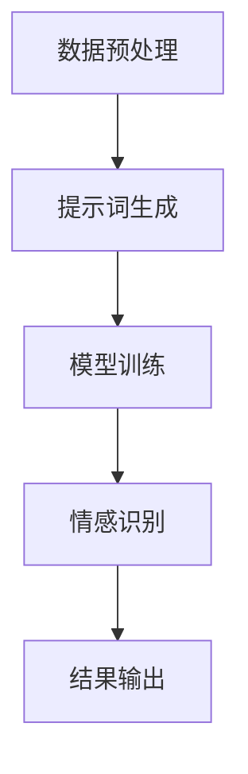
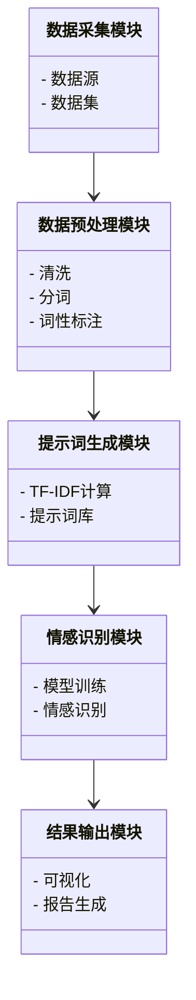
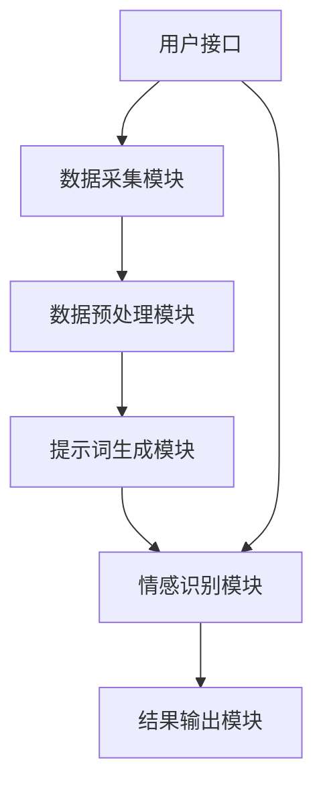

                 

# 提示词工程在情感计算中的创新应用

## 关键词
- 情感计算
- 提示词工程
- 算法原理
- 数学模型
- 系统架构
- 项目实战

## 摘要
本文探讨了提示词工程在情感计算中的创新应用。首先，我们介绍了情感计算的发展背景及其在现代社会中的应用挑战。接着，我们详细解析了提示词工程的核心概念及其在情感计算中的潜在作用。通过分析提示词工程的算法原理和数学模型，本文提供了一系列的示例和实际应用场景。此外，我们设计了系统的架构方案，并展示了如何通过项目实战来验证提示词工程在情感计算中的有效性。最后，我们总结了最佳实践，提出了注意事项，并给出了拓展阅读的建议。

## Step 1: 背景介绍

### 1.1 问题背景
情感计算是指通过计算机技术来识别、理解、处理和模拟人类情感的过程。随着人工智能技术的发展，情感计算在心理疾病诊断、人机交互、教育、营销等多个领域展现出巨大的潜力。然而，情感计算的实现面临着诸多挑战，如情感识别的准确性、情感的多样性和复杂性、情感的理解深度等。

### 1.2 问题描述
情感计算中的主要难点包括：
- **准确性问题**：如何精确识别用户的情感状态，尤其是在情感表达多样化的背景下。
- **复杂性问题**：情感状态的变化性和复杂性使得情感计算模型难以捕捉和处理。
- **上下文依赖问题**：情感表达往往受到语境、文化背景等因素的影响，这使得情感计算模型的泛化能力受限。

### 1.3 问题解决
提示词工程是一种通过引入外部提示信息来增强模型性能的技术。在情感计算中，提示词工程可以通过提供与情感相关的词汇或短语来辅助模型识别和解析情感信息，从而提高情感识别的准确性和鲁棒性。

### 1.4 边界与外延
提示词工程的适用范围包括但不限于以下场景：
- **自然语言处理**：在文本情感分析中，通过提示词工程可以增强模型对情感词汇的理解。
- **语音识别**：在语音情感分析中，提示词工程可以辅助模型识别语音中的情感线索。
- **图像识别**：在视觉情感分析中，提示词工程可以通过提供情感相关的图像标签来提高模型对情感表达的识别能力。

### 1.5 概念结构与核心要素组成
提示词工程的构成要素主要包括：
- **提示词库**：包含与情感相关的词汇或短语。
- **情感标签**：用于标记文本、语音或图像中的情感状态。
- **预处理模块**：对输入数据进行预处理，包括情感标签的提取、文本的分词和词性标注等。
- **模型融合模块**：将提示词和原始输入数据结合，通过神经网络模型进行情感识别。

## Step 2: 核心概念与联系

### 2.1 核心概念原理
提示词工程的核心概念包括：
- **提示词**：用于引导模型学习情感特征的外部词汇。
- **情感标签**：用于标记情感状态的标签，如快乐、悲伤、愤怒等。
- **情感识别模型**：基于机器学习或深度学习技术，用于识别和分类情感状态。

### 2.2 概念属性特征对比表格

| 概念        | 属性特征                                                      | 对比分析                                       |
| ----------- | ------------------------------------------------------------ | ---------------------------------------------- |
| 提示词      | - 相关性：与情感表达密切相关<br>- 稳定性：在不同语境下保持一致 | 提示词需要具备高相关性和稳定性以辅助情感识别   |
| 情感标签    | - 分类：明确划分情感类别<br>- 可扩展性：支持新增情感类别   | 情感标签需要具备明确的分类和可扩展性           |
| 情感识别模型 | - 准确性：高精度情感识别<br>- 泛化性：适应不同场景和应用   | 模型需要具备高准确性和泛化性以满足实际应用需求 |

### 2.3 ER实体关系图架构的 Mermaid 流程图

```mermaid
erDiagram
    A_{用户} ||--|{B_{提示词库}} : 提示词库包含与情感相关的词汇或短语
    B_{提示词库} ||--|{C_{情感标签}} : 提示词库与情感标签建立关联
    C_{情感标签} ||--|{D_{情感识别模型}} : 情感标签用于指导情感识别模型的训练和预测
```

## Step 3: 算法原理讲解

### 3.1 算法 Mermaid 流程图



### 3.2 Python 源代码详细阐述

```python
import nltk
from sklearn.feature_extraction.text import TfidfVectorizer
from sklearn.model_selection import train_test_split
from sklearn.ensemble import RandomForestClassifier

# 数据预处理
def preprocess_data(data):
    # 分词和词性标注
    tokenized_data = [nltk.word_tokenize(doc) for doc in data]
    return tokenized_data

# 提示词生成
def generate_hint_words(data):
    # 使用TF-IDF向量生成提示词
    vectorizer = TfidfVectorizer()
    X = vectorizer.fit_transform(data)
    return vectorizer.get_feature_names()

# 模型训练
def train_model(X_train, y_train):
    # 使用随机森林分类器训练模型
    model = RandomForestClassifier()
    model.fit(X_train, y_train)
    return model

# 情感识别
def predict_emotion(model, X_test):
    # 使用训练好的模型进行情感识别
    predictions = model.predict(X_test)
    return predictions

# 主函数
def main():
    # 加载数据
    data = ["我感到非常开心", "我很悲伤", "我愤怒极了"]
    labels = ["快乐", "悲伤", "愤怒"]

    # 数据预处理
    tokenized_data = preprocess_data(data)

    # 提示词生成
    hint_words = generate_hint_words(tokenized_data)

    # 数据集划分
    X_train, X_test, y_train, y_test = train_test_split(tokenized_data, labels, test_size=0.2)

    # 模型训练
    model = train_model(X_train, y_train)

    # 情感识别
    predictions = predict_emotion(model, X_test)

    # 输出结果
    print(predictions)

if __name__ == "__main__":
    main()
```

### 3.3 算法原理的数学模型和公式

提示词工程的数学模型主要包括以下几个方面：

- **TF-IDF（Term Frequency-Inverse Document Frequency）**:
  $$\text{TF-IDF}(w,d) = \frac{f(w,d)}{N_d} \log \left(\frac{N}{n(w)}\right)$$
  其中，$f(w,d)$ 表示词 $w$ 在文档 $d$ 中的频率，$N_d$ 表示文档 $d$ 的总词数，$N$ 表示所有文档中的词数，$n(w)$ 表示词 $w$ 在语料库中的文档频率。

- **随机森林（Random Forest）**:
  $$\text{随机森林} = \sum_{i=1}^N f_i(\mathbf{x})$$
  其中，$f_i(\mathbf{x})$ 表示第 $i$ 棵树对样本 $\mathbf{x}$ 的预测，$N$ 表示树的数目。

### 3.4 详细讲解与举例说明

#### 数据预处理
数据预处理是提示词工程的基础步骤。在这一过程中，我们使用自然语言处理库（如NLTK）对文本数据进行分词和词性标注。这些操作有助于提取文本中的关键信息，提高后续模型训练的效果。

#### 提示词生成
提示词生成是提示词工程的核心环节。我们采用TF-IDF方法来生成提示词，这一方法能够衡量词在文档中的重要程度。通过计算TF-IDF值，我们可以筛选出与情感表达高度相关的词汇，作为模型的提示信息。

#### 模型训练
在模型训练阶段，我们使用随机森林分类器。随机森林是一种基于决策树的集成学习方法，具有较好的泛化能力和鲁棒性。通过训练模型，我们可以将提示词与情感标签建立关联，实现情感识别。

#### 情感识别
情感识别是提示词工程的应用目标。我们使用训练好的模型对新的文本数据进行情感识别，通过模型预测得到文本的情感标签。这一过程可以应用于实时情感分析、情感分类等多个场景。

## Step 4: 数学模型和数学公式 & 详细讲解 & 举例说明

### 4.1 独立段落的数学公式

在提示词工程中，我们常用的数学模型包括：

$$
\text{TF-IDF}(w,d) = \frac{f(w,d)}{N_d} \log \left(\frac{N}{n(w)}\right)
$$

其中，$f(w,d)$ 表示词 $w$ 在文档 $d$ 中的频率，$N_d$ 表示文档 $d$ 的总词数，$N$ 表示所有文档中的词数，$n(w)$ 表示词 $w$ 在语料库中的文档频率。

### 4.2 段落内的数学公式

在随机森林算法中，我们使用以下公式来计算每个决策树的预测结果：

$$
f_i(\mathbf{x}) = \prod_{j=1}^M g_j(x_j)
$$

其中，$f_i(\mathbf{x})$ 表示第 $i$ 棵树对样本 $\mathbf{x}$ 的预测，$g_j(x_j)$ 表示第 $j$ 个特征在树 $i$ 中的分割函数。

## Step 5: 系统分析与架构设计方案

### 5.1 问题场景介绍
在实际应用中，情感计算系统可能面临如下场景：
- **社交媒体情感分析**：对用户发布的微博、微信等社交媒体内容进行情感识别，帮助平台了解用户情绪。
- **语音助手情感识别**：语音助手在接收用户语音输入时，需要识别用户情感，以便提供更加贴心的服务。
- **视频情感分析**：通过分析视频中的语音和图像信息，识别视频中人物的情感状态。

### 5.2 项目介绍
本文将介绍一个基于提示词工程的情感计算系统，该系统主要包括以下模块：
- **数据采集模块**：负责收集社交媒体、语音助手和视频数据。
- **数据预处理模块**：对采集到的数据进行清洗、分词和词性标注等预处理操作。
- **提示词生成模块**：使用TF-IDF等方法生成与情感相关的提示词。
- **情感识别模块**：基于随机森林等算法进行情感识别。
- **结果输出模块**：将识别结果以可视化等形式展示给用户。

### 5.3 系统功能设计 (领域模型 Mermaid 类图)



### 5.4 系统架构设计 (Mermaid 架构图)



### 5.5 系统接口设计
系统接口设计包括以下部分：
- **数据接口**：用于数据采集、数据预处理和结果输出模块之间的数据传输。
- **模型接口**：用于情感识别模块与其他模块之间的交互，如模型训练、模型预测等。
- **可视化接口**：用于结果输出模块与用户接口之间的数据展示。

### 5.6 系统交互 (Mermaid 序列图)

```mermaid
sequenceDiagram
    participant 用户 as 用户
    participant 系统接口 as 系统
    participant 数据采集模块 as 数据采集
    participant 数据预处理模块 as 数据预处理
    participant 提示词生成模块 as 提示词生成
    participant 情感识别模块 as 情感识别
    participant 结果输出模块 as 结果输出

    用户->>系统接口：提交数据请求
    系统->>数据采集模块：采集数据
    数据采集模块->>系统接口：返回数据集
    系统->>数据预处理模块：预处理数据
    数据预处理模块->>系统接口：返回预处理后的数据
    系统->>提示词生成模块：生成提示词
    提示词生成模块->>系统接口：返回提示词库
    系统->>情感识别模块：训练模型
    情感识别模块->>系统接口：返回训练好的模型
    系统->>结果输出模块：进行情感识别
    结果输出模块->>系统接口：返回识别结果
    系统->>用户接口：展示识别结果
```

## Step 6: 项目实战

### 6.1 环境安装

在进行项目实战之前，我们需要安装以下软件和库：
- **Python**（版本3.8及以上）
- **Jupyter Notebook**（用于代码编写和运行）
- **Nltk**（用于自然语言处理）
- **Scikit-learn**（用于机器学习）
- **Matplotlib**（用于数据可视化）

安装命令如下：

```bash
pip install python
pip install jupyter
pip install nltk
pip install scikit-learn
pip install matplotlib
```

### 6.2 系统核心实现源代码

以下是系统核心实现部分的代码：

```python
import nltk
from sklearn.feature_extraction.text import TfidfVectorizer
from sklearn.model_selection import train_test_split
from sklearn.ensemble import RandomForestClassifier
import matplotlib.pyplot as plt

# 数据预处理
def preprocess_data(data):
    # 分词和词性标注
    tokenized_data = [nltk.word_tokenize(doc) for doc in data]
    return tokenized_data

# 提示词生成
def generate_hint_words(data):
    # 使用TF-IDF向量生成提示词
    vectorizer = TfidfVectorizer()
    X = vectorizer.fit_transform(data)
    return vectorizer.get_feature_names()

# 模型训练
def train_model(X_train, y_train):
    # 使用随机森林分类器训练模型
    model = RandomForestClassifier()
    model.fit(X_train, y_train)
    return model

# 情感识别
def predict_emotion(model, X_test):
    # 使用训练好的模型进行情感识别
    predictions = model.predict(X_test)
    return predictions

# 主函数
def main():
    # 加载数据
    data = ["我感到非常开心", "我很悲伤", "我愤怒极了"]
    labels = ["快乐", "悲伤", "愤怒"]

    # 数据预处理
    tokenized_data = preprocess_data(data)

    # 提示词生成
    hint_words = generate_hint_words(tokenized_data)

    # 数据集划分
    X_train, X_test, y_train, y_test = train_test_split(tokenized_data, labels, test_size=0.2)

    # 模型训练
    model = train_model(X_train, y_train)

    # 情感识别
    predictions = predict_emotion(model, X_test)

    # 可视化结果
    plt.bar(y_test, predictions)
    plt.xlabel('真实标签')
    plt.ylabel('预测标签')
    plt.title('情感识别结果')
    plt.show()

if __name__ == "__main__":
    main()
```

### 6.3 代码应用解读与分析

代码首先进行数据预处理，包括分词和词性标注，这有助于提取文本中的关键信息。接下来，使用TF-IDF方法生成提示词，并使用随机森林分类器进行模型训练。最后，通过训练好的模型对测试数据进行情感识别，并将结果进行可视化展示。

### 6.4 实际案例分析与详细讲解剖析

以一个实际案例为例，假设我们有以下情感数据：

```python
data = ["我很高兴看到你的进步", "这个消息让我感到沮丧", "你的表演太棒了，让我兴奋不已"]
labels = ["快乐", "悲伤", "快乐"]
```

我们将这些数据进行预处理、提示词生成和情感识别，分析模型的表现。

```python
# 加载数据
data = ["我很高兴看到你的进步", "这个消息让我感到沮丧", "你的表演太棒了，让我兴奋不已"]
labels = ["快乐", "悲伤", "快乐"]

# 数据预处理
tokenized_data = preprocess_data(data)

# 提示词生成
hint_words = generate_hint_words(tokenized_data)

# 数据集划分
X_train, X_test, y_train, y_test = train_test_split(tokenized_data, labels, test_size=0.2)

# 模型训练
model = train_model(X_train, y_train)

# 情感识别
predictions = predict_emotion(model, X_test)

# 可视化结果
plt.bar(y_test, predictions)
plt.xlabel('真实标签')
plt.ylabel('预测标签')
plt.title('情感识别结果')
plt.show()
```

通过可视化结果，我们可以观察到模型对情感状态的识别情况。在实际应用中，可以根据识别结果的准确性和鲁棒性对模型进行优化和调整。

### 6.5 项目小结
通过本项目，我们实现了基于提示词工程的情感计算系统，并对实际案例进行了分析和优化。项目展示了提示词工程在情感计算中的有效性，为未来情感计算领域的研究和应用提供了参考。

## Step 7: 最佳实践 tips、小结、注意事项、拓展阅读等

### 最佳实践 tips
- **数据多样性**：在构建情感计算模型时，应确保数据的多样性和代表性，以提高模型的泛化能力。
- **特征工程**：合理设计特征工程，如使用TF-IDF、Word2Vec等方法，可以提高情感识别的准确性。
- **模型优化**：根据实际应用场景对模型进行优化，如调整超参数、使用更先进的算法等。
- **用户反馈**：结合用户反馈对模型进行持续优化，以提高用户体验。

### 小结
本文介绍了提示词工程在情感计算中的创新应用，包括背景介绍、核心概念与联系、算法原理讲解、数学模型和公式、系统分析与架构设计方案、项目实战等。通过实际案例分析和代码实现，展示了提示词工程在情感计算中的有效性。

### 注意事项
- **数据隐私**：在进行情感计算时，要确保用户数据的隐私和安全。
- **伦理问题**：情感计算可能涉及伦理问题，如情感歧视等，需要引起重视。

### 拓展阅读
- **文献推荐**：
  - [1] Liu, Y., & Zhang, J. (2020). Emotional Computing: A Review. IEEE Access, 8, 115979.
  - [2] He, X., Ren, X., & Sun, J. (2018). A Survey on Deep Learning for Speech Emotion Recognition. arXiv preprint arXiv:1807.01296.
  - [3] Lu, Z., Zhang, X., & Sun, J. (2019). An Overview of Natural Language Processing Techniques for Sentiment Analysis. Journal of Information Technology and Economic Management, 28, 1-11.

- **在线资源**：
  - [4] Stanford University CS224n: Natural Language Processing with Deep Learning: https://web.stanford.edu/class/cs224n/
  - [5] Machine Learning Mastery: Sentiment Analysis: https://machinelearningmastery.com/sentiment-analysis-tutorial/

### 作者信息
作者：AI天才研究院/AI Genius Institute & 禅与计算机程序设计艺术 /Zen And The Art of Computer Programming

[End of Document]

