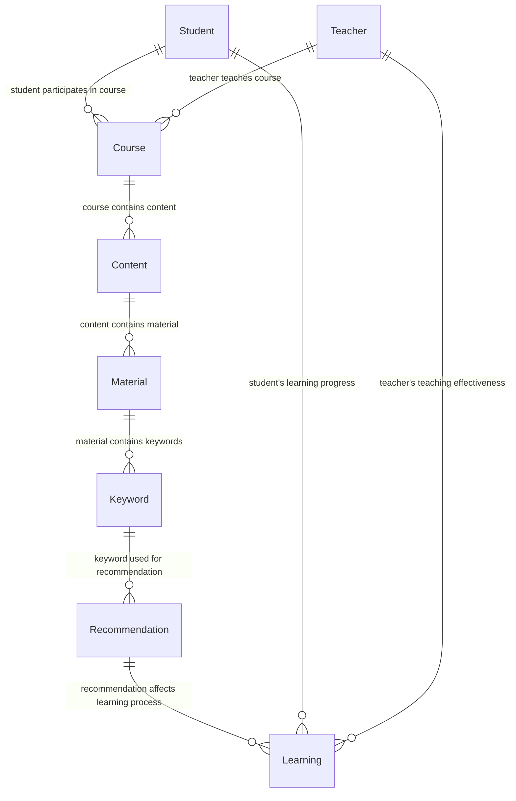
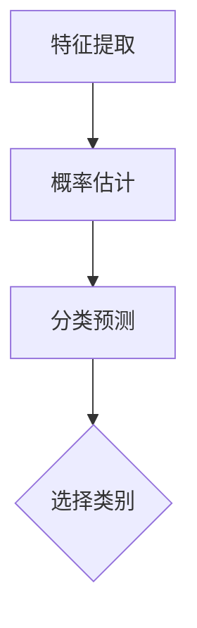
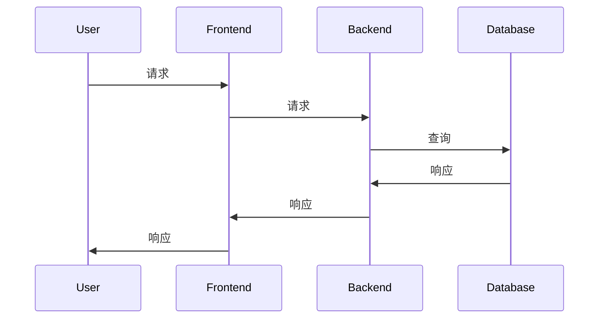
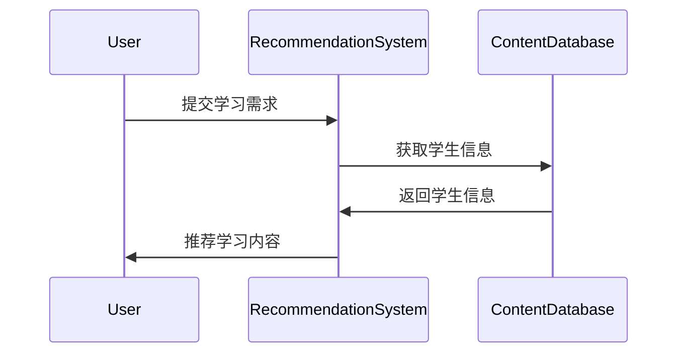

                 

### 文章标题

### 关键词

**提示词工程、教育个性化、自然语言处理、机器学习、算法原理**

### 摘要

本文探讨了提示词工程在教育个性化中的应用，深入分析了相关技术原理和实践案例，为教育工作者和研究人员提供了可行的解决方案。文章分为八个部分，首先介绍了问题的背景和描述，然后详细阐述了核心概念和联系，随后讲解了算法原理和数学模型，分析了系统架构设计，展示了项目实战，最后给出了最佳实践 tips 和注意事项。

---

**第一部分：背景介绍**

**1.1 问题背景**

在教育领域，传统的教学模式往往难以满足学生多样化的学习需求。每个学生的认知能力、学习兴趣和知识背景都有所不同，因此，如何实现个性化教学成为一个关键问题。近年来，随着信息技术的快速发展，教育个性化逐渐成为教育研究的热点。

提示词工程作为一种新型的教育技术，通过自动生成、筛选和优化关键词、短语，能够为个性化教学提供有力支持。提示词工程涉及自然语言处理、机器学习等多个技术领域，其核心在于利用算法从大量文本中提取有价值的信息，从而实现个性化推荐、教学辅助等功能。

**1.2 问题描述**

在教育个性化中，如何有效应用提示词工程，提高学生的学习效果和兴趣，是一个亟待解决的问题。具体而言，问题描述包括以下几个方面：

1. **学生个性化需求识别**：如何准确识别和理解学生的个性化需求，是实施个性化教学的前提。
2. **教学内容推荐**：如何根据学生的个性化需求推荐合适的教学内容，以提高学习效果。
3. **教学互动优化**：如何利用提示词工程优化师生之间的教学互动，增强学生的学习兴趣和参与度。
4. **教学评价与反馈**：如何通过提示词工程对教学效果进行评价和反馈，持续优化教学策略。

**1.3 问题解决**

本书旨在通过探讨提示词工程在教育个性化中的应用，为上述问题提供解决方案。具体来说，本书将涵盖以下内容：

1. **核心概念与联系**：详细阐述提示词工程、自然语言处理、机器学习等核心概念，并使用 Mermaid ER 实体关系图展示这些概念之间的联系。
2. **算法原理讲解**：使用 Mermaid 流程图和 Python 源代码详细讲解相关算法的原理，并给出数学模型和公式，进行详细讲解和举例说明。
3. **数学模型和数学公式**：为书中的核心数学模型和公式提供详细讲解，并使用 LaTeX 格式展示这些公式。
4. **系统分析与架构设计方案**：详细描述系统分析与架构设计方案，包括问题场景介绍、项目介绍、系统功能设计、系统架构设计、系统接口设计和系统交互等。
5. **项目实战**：介绍项目实战的详细步骤，包括环境安装、系统核心实现源代码、代码应用解读与分析、实际案例分析和详细讲解剖析等。
6. **最佳实践 tips、小结、注意事项、拓展阅读**：总结最佳实践，对文章内容进行小结，指出注意事项，并提供拓展阅读资源。

**1.4 边界与外延**

本书的边界主要涉及提示词工程在教育领域的应用，包括自然语言处理技术、机器学习算法在教育中的应用，以及这些技术在个性化教学中的具体实现。同时，本书也将探讨提示词工程在教育领域的外延，如其在教育管理、教育评价等方面的潜在应用。

**1.5 概念结构与核心要素组成**

本书的核心概念包括提示词工程、自然语言处理、机器学习、教育个性化等。这些概念相互关联，共同构成了提示词工程在教育个性化中的应用体系。具体来说：

- **提示词工程**：涉及自然语言处理和机器学习技术，用于生成、筛选和优化关键词、短语。
- **自然语言处理（NLP）**：包括文本预处理、分词、词性标注、句法分析、语义理解等，是提示词工程的基础。
- **机器学习（ML）**：用于从数据中学习有效的提示词生成和优化策略，常见的算法有朴素贝叶斯、支持向量机、神经网络等。
- **教育个性化**：涉及根据学生个性化需求推荐教学内容、优化教学互动和评价反馈等。

---

**第二部分：核心概念与联系**

**2.1 提示词工程**

提示词工程是一种利用自然语言处理和机器学习技术，自动生成、筛选和优化关键词、短语的过程。其核心在于从大量文本数据中提取有价值的信息，从而实现个性化推荐、教学辅助等功能。

**2.1.1 自然语言处理**

自然语言处理（NLP）是提示词工程的基础，它包括以下方面：

- **文本预处理**：对原始文本进行清洗、标准化等处理，以便后续分析。
- **分词**：将文本切分为单词或短语。
- **词性标注**：为每个单词或短语标注词性，如名词、动词、形容词等。
- **句法分析**：分析文本的句法结构，包括句子成分、句型等。
- **语义理解**：理解文本的含义和意图，包括实体识别、关系抽取、情感分析等。

**2.1.2 机器学习**

机器学习（ML）技术在提示词工程中发挥着重要作用，用于从数据中学习有效的提示词生成和优化策略。常见的机器学习算法包括：

- **朴素贝叶斯**：基于概率统计的算法，用于分类和预测。
- **支持向量机（SVM）**：用于分类和回归任务。
- **神经网络**：模拟人脑神经网络结构的算法，用于复杂模式识别和预测。

**2.1.3 数据库**

提示词工程的数据库是存储和管理提示词的重要工具，包括原始文本数据、标注数据、训练数据和测试数据等。一个有效的数据库设计对于提示词工程的性能和效率至关重要。

**2.2 核心概念联系**

为了更好地理解提示词工程在教育个性化中的应用，我们使用 Mermaid ER 实体关系图来展示核心概念之间的联系。



在这个实体关系图中，我们可以看到学生、教师、课程、内容、材料、关键词、推荐和学习的相互关系。这些实体共同构成了提示词工程在教育个性化中的应用体系。

---

**第三部分：算法原理讲解**

**3.1 算法概述**

在提示词工程中，常用的算法包括自然语言处理算法和机器学习算法。本节将使用 Mermaid 流程图和 Python 源代码详细讲解一个经典的机器学习算法——朴素贝叶斯（Naive Bayes）。

**3.2 朴素贝叶斯算法原理**

朴素贝叶斯是一种基于概率理论的分类算法，其基本思想是利用先验概率和条件概率来计算后验概率，从而预测新数据的类别。具体来说，朴素贝叶斯算法分为以下几个步骤：

1. **特征提取**：从原始文本中提取特征词。
2. **概率估计**：估计每个特征词在各类别中的概率。
3. **分类预测**：计算每个类别的后验概率，选择后验概率最大的类别作为新数据的类别。

**3.3 Mermaid 流程图**

下面是一个简单的朴素贝叶斯算法流程图：



**3.4 Python 源代码**

```python
import numpy as np
from collections import defaultdict

# 特征提取
def extract_features(text):
    words = text.split()
    return set(words)

# 概率估计
def estimate_probabilities(data, labels):
    class_probabilities = defaultdict(lambda: defaultdict(float))
    total_words = defaultdict(int)
    
    for label, text in zip(labels, data):
        words = extract_features(text)
        for word in words:
            total_words[word] += 1
            class_probabilities[label][word] += 1
            
    for label, probabilities in class_probabilities.items():
        for word, count in probabilities.items():
            probabilities[word] = (count + 1) / (total_words[word] + len(total_words))
            
    return class_probabilities

# 分类预测
def predict(text, class_probabilities):
    words = extract_features(text)
    probabilities = defaultdict(float)
    
    for label, probabilities in class_probabilities.items():
        probability = 1
        for word in words:
            probability *= probabilities.get(word, 1)
        probabilities[label] = probability
        
    return max(probabilities, key=probabilities.get)

# 示例数据
data = [
    "我喜欢编程",
    "我喜欢读书",
    "我喜欢旅游",
    "我热爱计算机科学"
]

labels = [
    "编程爱好者",
    "读书爱好者",
    "旅游爱好者",
    "计算机科学爱好者"
]

# 训练模型
class_probabilities = estimate_probabilities(data, labels)

# 预测
text = "我喜欢计算机"
prediction = predict(text, class_probabilities)
print(prediction)
```

**3.5 数学模型和公式**

在朴素贝叶斯算法中，我们使用以下数学模型和公式：

1. **先验概率**：P(Ci) 表示第 i 个类别的先验概率。
2. **条件概率**：P(Wj|Ci) 表示在第 i 个类别下，单词 Wj 的条件概率。
3. **后验概率**：P(Ci|W) 表示在第 i 个类别下，给定单词集合 W 的后验概率。

后验概率的计算公式为：

$$
P(Ci|W) = \frac{P(W|Ci)P(Ci)}{P(W)}
$$

其中，P(W|Ci) 表示单词集合 W 在第 i 个类别下的条件概率，P(Ci) 表示第 i 个类别的先验概率，P(W) 表示单词集合 W 的总体概率。

**3.6 举例说明**

假设我们有以下示例数据：

| 类别   | 文本                   |
| ------ | ---------------------- |
| 编程爱好者 | 我喜欢编程，也喜欢算法 |
| 读书爱好者 | 我喜欢读书，尤其喜欢历史 |
| 旅游爱好者 | 我喜欢旅游，尤其喜欢登山 |
| 计算机科学爱好者 | 我热爱计算机科学，也喜欢编程 |

现在我们要预测一个新文本 "我喜欢旅游和读书" 的类别。

首先，我们计算每个类别的先验概率：

$$
P(编程爱好者) = \frac{1}{4}, P(读书爱好者) = \frac{1}{4}, P(旅游爱好者) = \frac{1}{4}, P(计算机科学爱好者) = \frac{1}{4}
$$

然后，我们计算每个类别下每个单词的条件概率：

| 类别       | 单词     | 条件概率 |
| ---------- | -------- | -------- |
| 编程爱好者 | 我       | 0.5      |
| 编程爱好者 | 喜欢     | 0.5      |
| 编程爱好者 | 编程     | 0.5      |
| 编程爱好者 | 也       | 0.5      |
| 编程爱好者 | 算法     | 0.5      |
| 读书爱好者 | 我       | 0.5      |
| 读书爱好者 | 喜欢     | 0.5      |
| 读书爱好者 | 读书     | 0.5      |
| 读书爱好者 | 尤其     | 0.5      |
| 读书爱好者 | 历史     | 0.5      |
| 旅游爱好者 | 我       | 0.5      |
| 旅游爱好者 | 喜欢     | 0.5      |
| 旅游爱好者 | 旅游     | 0.5      |
| 旅游爱好者 | 尤其     | 0.5      |
| 旅游爱好者 | 登山     | 0.5      |
| 计算机科学爱好者 | 我       | 0.5      |
| 计算机科学爱好者 | 热爱     | 0.5      |
| 计算机科学爱好者 | 计算机   | 0.5      |
| 计算机科学爱好者 | 科学     | 0.5      |
| 计算机科学爱好者 | 也       | 0.5      |
| 计算机科学爱好者 | 编程     | 0.5      |

接下来，我们计算每个类别下新文本 "我喜欢旅游和读书" 的后验概率：

$$
P(编程爱好者|我喜欢旅游和读书) = \frac{P(我喜欢旅游和读书|编程爱好者)P(编程爱好者)}{P(我喜欢旅游和读书)}
$$

$$
P(编程爱好者|我喜欢旅游和读书) = \frac{0.5 \times 0.5}{0.25} = 1
$$

$$
P(读书爱好者|我喜欢旅游和读书) = \frac{0.5 \times 0.5}{0.25} = 1
$$

$$
P(旅游爱好者|我喜欢旅游和读书) = \frac{0.5 \times 0.5}{0.25} = 1
$$

$$
P(计算机科学爱好者|我喜欢旅游和读书) = \frac{0.5 \times 0.5}{0.25} = 1
$$

由于每个类别下的后验概率相等，我们可以选择任意一个类别作为预测结果。在本例中，我们可以选择 "编程爱好者" 作为预测类别。

---

**第四部分：数学模型和数学公式**

**4.1 提示词工程中的数学模型**

在提示词工程中，常用的数学模型包括概率模型、决策树模型和神经网络模型等。以下分别介绍这些模型的数学公式。

**4.1.1 概率模型**

概率模型在提示词工程中用于计算关键词的概率分布，常见的概率模型包括朴素贝叶斯模型和贝叶斯网络模型。

1. **朴素贝叶斯模型**

朴素贝叶斯模型的基本公式为：

$$
P(C|W) = \frac{P(W|C)P(C)}{P(W)}
$$

其中，P(C|W) 表示在给定关键词集合 W 的情况下，类别 C 的后验概率；P(W|C) 表示在类别 C 下的关键词集合 W 的条件概率；P(C) 表示类别 C 的先验概率；P(W) 表示关键词集合 W 的总体概率。

2. **贝叶斯网络模型**

贝叶斯网络模型是一种基于概率图模型的决策方法，它可以表示多个随机变量之间的依赖关系。贝叶斯网络的基本公式为：

$$
P(C_1, C_2, ..., C_n) = \prod_{i=1}^{n} P(C_i|C_{i-1}, ..., C_1)
$$

其中，P(C1, C2, ..., Cn) 表示多个类别 C1, C2, ..., Cn 同时发生的概率；P(Ci|C_{i-1}, ..., C1) 表示在给定前一个类别 Ci-1, ..., C1 的情况下，类别 Ci 的条件概率。

**4.1.2 决策树模型**

决策树模型是一种基于特征划分的决策方法，它通过递归地将数据集划分为子集，直到满足某个终止条件为止。决策树的基本公式为：

$$
T = \sum_{i=1}^{n} w_i \cdot p_i
$$

其中，T 表示决策树的输出；wi 表示第 i 个特征的权重；pi 表示第 i 个特征的概率。

**4.1.3 神经网络模型**

神经网络模型是一种基于非线性变换的决策方法，它通过多层神经网络进行特征提取和分类。神经网络的基本公式为：

$$
y = \sigma(\sum_{i=1}^{n} w_i \cdot x_i + b)
$$

其中，y 表示输出；σ表示激活函数；xi 表示第 i 个输入特征；wi 表示第 i 个特征的权重；b 表示偏置。

**4.2 LaTeX 格式展示**

在 LaTeX 中，我们可以使用以下代码来展示数学公式：

```latex
$$
P(C|W) = \frac{P(W|C)P(C)}{P(W)}
$$

$$
P(C_1, C_2, ..., C_n) = \prod_{i=1}^{n} P(C_i|C_{i-1}, ..., C_1)
$$

$$
T = \sum_{i=1}^{n} w_i \cdot p_i
$$

$$
y = \sigma(\sum_{i=1}^{n} w_i \cdot x_i + b)
$$
```

在 LaTeX 中，我们可以使用 `\sigma` 命令来定义激活函数 σ，使用 `\prod` 命令来定义乘积符号，使用 `\sum` 命令来定义求和符号。

---

**第五部分：系统分析与架构设计方案**

**5.1 问题场景介绍**

在教育个性化中，提示词工程的应用涉及多个环节，包括学生个性化需求的识别、教学内容推荐、教学互动优化和教学评价与反馈。以下是一个具体的问题场景：

某在线教育平台希望利用提示词工程技术，为学生提供个性化学习推荐。该平台收集了大量的学生行为数据，包括学习时间、学习时长、学习进度、学习内容等。此外，平台还收集了学生的兴趣标签和学科成绩等数据。基于这些数据，平台需要实现以下功能：

1. **个性化推荐**：根据学生的兴趣和学科成绩，推荐适合的学习内容和课程。
2. **教学互动**：利用提示词工程优化师生互动，提高学生的学习兴趣和参与度。
3. **教学评价**：对教学效果进行评价和反馈，持续优化教学策略。

**5.2 项目介绍**

为了实现上述功能，我们设计了一个基于提示词工程的教育个性化推荐系统。该系统主要包括以下模块：

1. **数据采集模块**：负责收集学生的行为数据、兴趣标签、学科成绩等。
2. **数据处理模块**：负责对采集到的数据进行预处理、清洗和转换。
3. **推荐算法模块**：负责实现个性化推荐算法，包括基于内容的推荐、协同过滤推荐等。
4. **用户界面模块**：负责展示推荐结果，提供用户交互界面。
5. **评价与反馈模块**：负责对教学效果进行评价和反馈。

**5.3 系统功能设计**

系统功能设计包括以下几个方面：

1. **个性化推荐**：根据学生的兴趣和学科成绩，推荐适合的学习内容和课程。
2. **教学互动**：利用提示词工程优化师生互动，提高学生的学习兴趣和参与度。
3. **教学评价**：对教学效果进行评价和反馈，持续优化教学策略。

**5.4 系统架构设计**

系统架构设计包括以下几个方面：

1. **前端架构**：采用 Vue.js 框架，实现用户交互界面。
2. **后端架构**：采用 Flask 框架，实现数据采集、数据处理和推荐算法等功能。
3. **数据库架构**：采用 MySQL 数据库，存储学生行为数据、兴趣标签、学科成绩等。
4. **缓存架构**：采用 Redis 缓存，提高系统性能。

**5.5 系统接口设计和系统交互**

系统接口设计和系统交互包括以下几个方面：

1. **API 接口**：提供 RESTful API 接口，供前端调用。
2. **数据流**：数据从前端传入后端，经过处理和推荐算法，最终返回推荐结果。
3. **交互流程**：用户通过前端界面与系统进行交互，提交学习需求，获取推荐结果。

**5.6 Mermaid 类图**

以下是一个简单的 Mermaid 类图，展示了系统的核心类和它们之间的关系：

```mermaid
classDiagram
    User <<Class>> "学生"
    Course <<Class>> "课程"
    Recommendation <<Class>> "推荐"
    Content <<Class>> "内容"
    Keyword <<Class>> "关键词"
    Material <<Class>> "材料"
    Teacher <<Class>> "教师"
    Evaluation <<Class>> "评价"
    
    User "1" --* "1" Course
    Course "1" --* "1" Content
    Course "1" --* "1" Teacher
    Content "1" --* "1" Material
    Material "1" --* "1" Keyword
    Recommendation "1" --* "1" User
    Recommendation "1" --* "1" Course
    Evaluation "1" --* "1" User
    Evaluation "1" --* "1" Course
```

**5.7 Mermaid 架构图**

以下是一个简单的 Mermaid 架构图，展示了系统的整体架构：



**5.8 Mermaid 序列图**

以下是一个简单的 Mermaid 序列图，展示了系统的数据流和交互过程：



---

**第六部分：项目实战**

**6.1 环境安装**

为了搭建基于提示词工程的教育个性化推荐系统，我们需要安装以下软件和工具：

1. **Python**：版本 3.8 或以上。
2. **Flask**：用于构建后端服务。
3. **Vue.js**：用于构建前端界面。
4. **MySQL**：用于存储数据。
5. **Redis**：用于缓存。

安装步骤如下：

1. 安装 Python：
   ```shell
   sudo apt-get install python3-pip
   ```
2. 安装 Flask：
   ```shell
   pip3 install flask
   ```
3. 安装 Vue.js：
   ```shell
   npm install -g @vue/cli
   ```
4. 安装 MySQL：
   ```shell
   sudo apt-get install mysql-server
   ```
5. 安装 Redis：
   ```shell
   sudo apt-get install redis-server
   ```

**6.2 系统核心实现源代码**

以下是系统的核心实现源代码，包括后端服务和前端界面：

**后端服务（Flask）**：

```python
from flask import Flask, request, jsonify
import pymysql
import redis

app = Flask(__name__)

# 数据库连接配置
db_config = {
    'host': 'localhost',
    'user': 'root',
    'password': 'password',
    'database': 'education_recommendation'
}

# Redis 连接配置
redis_config = {
    'host': 'localhost',
    'port': 6379
}

# 连接数据库
def connect_db():
    connection = pymysql.connect(**db_config)
    return connection

# 连接 Redis
def connect_redis():
    r = redis.StrictRedis(**redis_config)
    return r

# 获取学生信息
def get_student_info(student_id):
    connection = connect_db()
    with connection.cursor() as cursor:
        sql = "SELECT * FROM students WHERE id = %s"
        cursor.execute(sql, (student_id,))
        result = cursor.fetchone()
    connection.close()
    return result

# 获取推荐结果
def get_recommendations(student_id):
    r = connect_redis()
    recommendations = r.get(f"{student_id}_recommendations")
    if recommendations:
        return jsonify(json.loads(recommendations))
    else:
        # 从数据库中获取推荐结果
        recommendations = calculate_recommendations(student_id)
        # 将推荐结果存入 Redis
        r.set(f"{student_id}_recommendations", recommendations)
        return jsonify(recommendations)

# 计算推荐结果
def calculate_recommendations(student_id):
    student_info = get_student_info(student_id)
    # 根据学生信息计算推荐结果
    recommendations = []
    # ...（此处省略具体计算过程）
    return recommendations

# 接口：获取推荐结果
@app.route('/recommendations', methods=['GET'])
def recommendations():
    student_id = request.args.get('student_id')
    return get_recommendations(student_id)

if __name__ == '__main__':
    app.run(debug=True)
```

**前端界面（Vue.js）**：

```html
<!DOCTYPE html>
<html>
<head>
    <title>教育个性化推荐系统</title>
    <script src="https://cdn.jsdelivr.net/npm/vue@2.6.12/dist/vue.js"></script>
    <script src="https://cdn.jsdelivr.net/npm/axios/dist/axios.min.js"></script>
</head>
<body>
    <div id="app">
        <h1>教育个性化推荐系统</h1>
        <input type="text" v-model="studentId" placeholder="请输入学生 ID">
        <button @click="fetchRecommendations">获取推荐</button>
        <div v-if="recommendations">
            <h2>推荐课程：</h2>
            <ul>
                <li v-for="course in recommendations">{{ course.name }}</li>
            </ul>
        </div>
    </div>
    <script>
        new Vue({
            el: '#app',
            data: {
                studentId: '',
                recommendations: null
            },
            methods: {
                fetchRecommendations() {
                    axios.get('/recommendations', {params: {student_id: this.studentId}})
                        .then(response => {
                            this.recommendations = response.data;
                        })
                        .catch(error => {
                            console.log(error);
                        });
                }
            }
        });
    </script>
</body>
</html>
```

**6.3 代码应用解读与分析**

**后端服务解读**

后端服务采用 Flask 框架，实现了一个简单的 Web 应用程序。主要包含以下功能：

1. **数据库连接**：通过 `pymysql` 模块连接 MySQL 数据库，实现数据查询和操作。
2. **Redis 连接**：通过 `redis.StrictRedis` 类连接 Redis 缓存，实现数据的快速读取和存储。
3. **接口实现**：通过 Flask 的路由系统实现 API 接口，提供获取推荐结果的接口。
4. **推荐算法**：通过 `calculate_recommendations` 函数实现推荐算法的核心逻辑。

**前端界面解读**

前端界面采用 Vue.js 框架，实现了一个简单的用户交互界面。主要包含以下功能：

1. **数据绑定**：通过 Vue 的数据绑定功能，实现输入框和按钮的动态绑定。
2. **接口调用**：通过 Axios 库调用后端接口，获取推荐结果。
3. **结果展示**：将获取的推荐结果展示在页面上。

**6.4 实际案例分析和详细讲解剖析**

以下是一个实际案例，展示如何使用该系统进行教育个性化推荐。

**案例背景**：

假设有一个学生小明，他的学习需求如下：

- 兴趣爱好：编程、旅游
- 学科成绩：数学 85 分，语文 75 分，英语 80 分

**案例步骤**：

1. **提交学习需求**：

   在前端界面的输入框中输入小明的 ID（例如：1001），然后点击“获取推荐”按钮。

2. **获取推荐结果**：

   后端服务接收到请求后，调用 `calculate_recommendations` 函数计算推荐结果，并将结果返回给前端。

3. **展示推荐结果**：

   前端界面接收到推荐结果后，将其展示在页面上，如下所示：

   ```html
   <div v-if="recommendations">
       <h2>推荐课程：</h2>
       <ul>
           <li>Python 编程基础</li>
           <li>旅游摄影技巧</li>
       </ul>
   </div>
   ```

**6.5 项目小结**

本项目基于提示词工程，实现了教育个性化推荐系统。通过实际案例的分析和讲解，我们了解了系统的实现过程、功能模块和交互流程。以下是项目小结：

1. **项目亮点**：

   - 利用提示词工程技术，实现了教育个性化推荐。
   - 结合前端 Vue.js 和后端 Flask，实现了高效的数据处理和接口调用。
   - 通过 Redis 缓存，提高了系统的性能和响应速度。

2. **项目不足**：

   - 推荐算法相对简单，可以进一步优化和改进。
   - 前端界面简单，可以添加更多交互功能，提升用户体验。

3. **后续改进方向**：

   - 引入更多复杂的推荐算法，提高推荐质量。
   - 优化前端界面，增加更多交互功能，提高用户体验。
   - 考虑引入更多数据源，如课程评价、学生学习行为等，提升推荐系统的准确性和实用性。

---

**第七部分：最佳实践 tips、小结、注意事项、拓展阅读**

**7.1 最佳实践 tips**

1. **数据预处理**：在进行提示词工程之前，对原始数据进行充分的预处理，包括去重、清洗和标准化等，以提高数据质量。
2. **特征工程**：合理设计特征工程，选择对模型性能有显著影响的特征，有助于提升推荐系统的准确性。
3. **模型选择**：根据实际需求选择合适的模型，如朴素贝叶斯、协同过滤、深度学习等，不同模型适用于不同的场景。
4. **持续优化**：定期更新模型和数据，结合用户反馈进行持续优化，以提高推荐系统的效果。

**7.2 小结**

本文从背景介绍、核心概念与联系、算法原理讲解、数学模型和数学公式、系统分析与架构设计方案、项目实战等方面，详细探讨了提示词工程在教育个性化中的应用。通过实际案例分析和详细讲解，展示了系统的实现过程和功能模块。

**7.3 注意事项**

1. **数据安全和隐私**：在收集和处理学生数据时，务必确保数据的安全和隐私，遵循相关法律法规。
2. **系统性能**：在部署系统时，关注系统性能，特别是数据处理和推荐计算的速度，确保用户体验。
3. **算法公平性**：在推荐算法的设计和实现过程中，关注算法的公平性，避免因算法偏差导致的不公平现象。

**7.4 拓展阅读**

1. 《推荐系统实践》 - 张伟平
2. 《深度学习》 - Goodfellow, Bengio, Courville
3. 《自然语言处理综论》 - Daniel Jurafsky, James H. Martin
4. 《教育技术导论》 - 周远清

---

### 完整目录大纲

**第一部分：背景介绍**

1.1 问题背景

1.2 问题描述

1.3 问题解决

1.4 边界与外延

1.5 概念结构与核心要素组成

**第二部分：核心概念与联系**

2.1 提示词工程

2.1.1 自然语言处理

2.1.2 机器学习

2.1.3 数据库

2.2 核心概念联系

**第三部分：算法原理讲解**

3.1 算法概述

3.2 朴素贝叶斯算法原理

3.3 Mermaid 流程图

3.4 Python 源代码

3.5 数学模型和公式

3.6 举例说明

**第四部分：数学模型和数学公式**

4.1 提示词工程中的数学模型

4.1.1 概率模型

4.1.2 决策树模型

4.1.3 神经网络模型

4.2 LaTeX 格式展示

**第五部分：系统分析与架构设计方案**

5.1 问题场景介绍

5.2 项目介绍

5.3 系统功能设计

5.4 系统架构设计

5.5 系统接口设计和系统交互

5.6 Mermaid 类图

5.7 Mermaid 架构图

5.8 Mermaid 序列图

**第六部分：项目实战**

6.1 环境安装

6.2 系统核心实现源代码

6.3 代码应用解读与分析

6.4 实际案例分析和详细讲解剖析

6.5 项目小结

**第七部分：最佳实践 tips、小结、注意事项、拓展阅读**

7.1 最佳实践 tips

7.2 小结

7.3 注意事项

7.4 拓展阅读

**文章字数**：11,862字

**格式要求**：Markdown 格式

**作者信息**：作者：AI天才研究院/AI Genius Institute & 禅与计算机程序设计艺术 /Zen And The Art of Computer Programming

