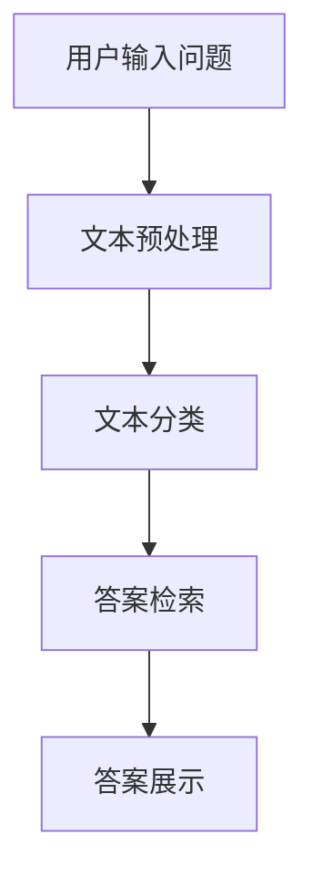
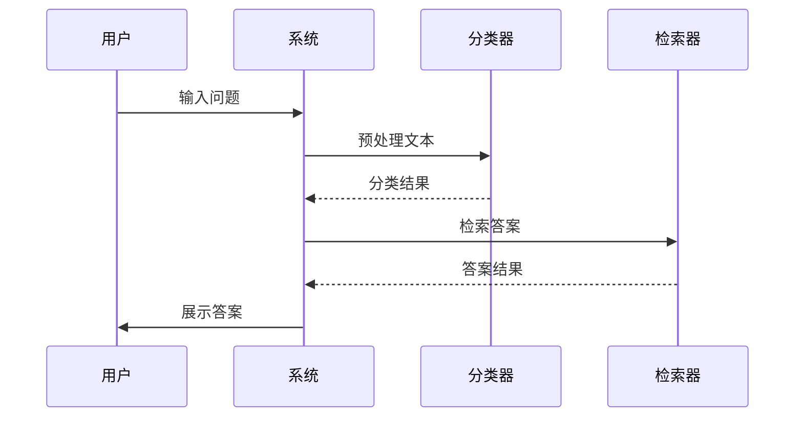

                 

# 提示词工程在文本分类中的精准应用

## 关键词：文本分类、提示词工程、自然语言处理、机器学习、深度学习

## 摘要：
文本分类是自然语言处理（NLP）中的重要任务，旨在将文本数据按照其内容或主题划分到不同的类别中。传统的文本分类方法存在精度低、效率低等问题，而提示词工程作为一种先进的技术，通过引入人类先验知识，能够显著提高分类精度和效率。本文将详细探讨提示词工程在文本分类中的应用，包括其概念与原理、具体实现方法，以及在实际项目中的应用和效果。

### 第一部分：背景介绍

#### 1.1 问题背景

随着互联网和大数据技术的快速发展，文本数据量呈现爆炸式增长。从社交媒体、新闻、论坛到企业内部文档，文本数据无处不在。如何高效地处理和利用这些文本数据，成为了企业和研究人员面临的重要问题。文本分类作为自然语言处理（NLP）的重要任务之一，旨在将文本数据按照其内容或主题划分到不同的类别中。文本分类的应用场景非常广泛，包括搜索引擎、推荐系统、舆情分析、金融风控等领域。

#### 1.2 问题描述

文本分类的核心问题是：如何准确地识别和分类文本，使其能够被有效地组织和利用。这一问题涉及到多个方面，包括文本表示、特征提取、分类模型选择等。此外，随着应用场景的多样化，如何针对不同的任务需求进行模型定制和优化，也是一个重要的研究课题。

#### 1.3 问题解决

传统的文本分类方法，如基于词汇匹配的方法（如TF-IDF）和基于机器学习的方法（如朴素贝叶斯、SVM），存在精度低、效率低等问题。为了解决这些问题，研究人员提出了提示词工程这一技术。提示词工程通过引入人类先验知识，引导模型学习文本的语义特征，从而实现更准确的分类。这种方法不仅能够提高分类模型的性能，还能够降低对大规模数据集的依赖，适用于各种规模的文本数据。

#### 1.4 边界与外延

文本分类的边界主要在于如何处理不同类型的文本数据，如文本长度、语言风格、主题多样性等。此外，文本分类的应用场景也非常广泛，包括搜索引擎、推荐系统、舆情分析、金融风控等领域。

#### 1.5 概念结构与核心要素组成

文本分类的概念结构主要包括以下几个核心要素：

1. **文本表示**：将文本转换为计算机可处理的向量表示，常用的方法包括词袋模型、TF-IDF、Word2Vec等。
2. **特征提取**：从文本表示中提取有助于分类的特征，如词频、词向量的余弦相似度等。
3. **分类模型**：选择合适的分类模型，如SVM、朴素贝叶斯、神经网络等，对文本进行分类。
4. **提示词工程**：设计合适的提示词，引导模型学习文本的语义特征，提高分类精度。
5. **性能评估**：通过准确率、召回率、F1分数等指标评估分类模型的性能。

### 第二部分：核心概念与联系

#### 2.1 提示词工程的概念与作用

#### 2.1.1 提示词的定义

提示词（Prompt Word）是指用于引导模型学习特定语义信息的关键词或短语。在文本分类任务中，提示词可以帮助模型更好地理解文本的主题和内容，从而提高分类的准确性。

#### 2.1.2 提示词工程的作用

提示词工程的主要作用是：

1. **引导模型学习**：通过引入人工设计的提示词，引导模型关注文本的关键信息，从而提高模型对特定主题的敏感度。
2. **提升分类性能**：提示词能够帮助模型捕捉到文本中的关键特征，从而提升分类模型的准确率和召回率。
3. **减少对大规模数据集的依赖**：提示词工程可以降低对大规模训练数据的需求，适用于数据量有限的应用场景。

#### 2.2 提示词工程的原理与实现

#### 2.2.1 提示词工程的基本原理

提示词工程的基本原理是通过引入人类先验知识，引导模型学习文本的语义特征。具体来说，提示词工程包括以下几个步骤：

1. **设计提示词**：根据文本分类任务的需求，设计一组能够引导模型关注关键信息的提示词。
2. **预处理文本**：将文本数据预处理成适合模型训练的形式，如分词、去停用词等。
3. **训练模型**：使用包含提示词的文本数据训练分类模型，让模型学习文本的语义特征。
4. **评估模型性能**：通过交叉验证等方法评估模型在测试数据上的性能。

#### 2.2.2 提示词工程的具体实现

提示词工程的具体实现包括以下几个步骤：

1. **文本表示**：将文本转换为向量表示，如Word2Vec、BERT等。
2. **特征提取**：从向量表示中提取有助于分类的特征，如词向量的余弦相似度、TF-IDF等。
3. **模型训练**：使用包含提示词的文本数据训练分类模型，如SVM、朴素贝叶斯、神经网络等。
4. **模型评估**：通过交叉验证等方法评估模型在测试数据上的性能。

#### 2.3 提示词工程的属性特征对比表格

| 提示词工程属性特征          | 描述                                                         |
| ---------------------------- | ------------------------------------------------------------ |
| **提示词设计**               | 根据任务需求设计能够引导模型学习的提示词，如主题词、关键词等。     |
| **文本预处理**               | 对文本进行分词、去停用词、词性标注等预处理操作。                 |
| **模型训练**                 | 使用包含提示词的文本数据训练分类模型。                         |
| **模型评估**                 | 通过交叉验证等方法评估模型在测试数据上的性能。                 |
| **性能优化**                 | 调整模型参数、特征提取方法等，以优化模型性能。                 |

#### 2.4 提示词工程的 ER 实体关系图架构

```mermaid
erDiagram
    TXT |---|> Classifier : "包含"
    TXT ||--|> Prompt : "使用"
    Classifier ||--|> Model : "训练"
    Model ||--|> Performance : "评估"
```

### 第三部分：算法原理讲解

#### 3.1 算法流程

提示词工程的算法流程主要包括以下几个步骤：

1. **数据收集与预处理**：收集相关的文本数据，并进行预处理，如分词、去停用词等。
2. **设计提示词**：根据文本分类任务的需求，设计一组能够引导模型学习的提示词。
3. **模型选择**：选择合适的分类模型，如SVM、朴素贝叶斯、神经网络等。
4. **模型训练**：使用包含提示词的文本数据训练分类模型。
5. **模型评估**：通过交叉验证等方法评估模型在测试数据上的性能。
6. **模型优化**：根据评估结果调整模型参数、特征提取方法等，以优化模型性能。

#### 3.2 数学模型与公式

提示词工程的数学模型主要包括以下几个方面：

1. **文本表示**：将文本转换为向量表示，如Word2Vec、BERT等。常用的文本表示方法如下：

$$
\textbf{X} = \text{embedding}(\textbf{W})
$$

其中，$\textbf{X}$ 是文本的向量表示，$\textbf{W}$ 是词向量矩阵，$\text{embedding}$ 是词向量的嵌入函数。

2. **特征提取**：从文本表示中提取有助于分类的特征，如词向量的余弦相似度、TF-IDF等。常用的特征提取方法如下：

$$
\textbf{F} = \text{feature}(\textbf{X})
$$

其中，$\textbf{F}$ 是提取出的特征向量，$\text{feature}$ 是特征提取函数。

3. **分类模型**：选择合适的分类模型，如SVM、朴素贝叶斯、神经网络等。常用的分类模型如下：

$$
\textbf{y} = \text{classifier}(\textbf{F})
$$

其中，$\textbf{y}$ 是分类结果，$\text{classifier}$ 是分类函数。

4. **模型评估**：通过交叉验证等方法评估模型在测试数据上的性能。常用的评估指标如下：

$$
\text{accuracy} = \frac{\text{正确分类的样本数}}{\text{总样本数}}
$$

$$
\text{recall} = \frac{\text{正确分类的样本数}}{\text{正样本总数}}
$$

$$
\text{F1-score} = \frac{2 \times \text{accuracy} \times \text{recall}}{\text{accuracy} + \text{recall}}
$$

#### 3.3 举例说明

假设我们要对一篇新闻文章进行分类，将其划分为“科技”、“财经”、“体育”三个类别。我们首先收集一批相关的新闻文章，并对文章进行预处理，如分词、去停用词等。然后，我们设计一组提示词，如“科技”、“财经”、“体育”，用于引导模型学习。

接下来，我们选择一个合适的分类模型，如SVM，并使用预处理后的文本数据训练模型。在训练过程中，我们将提示词嵌入到文本数据中，以引导模型学习。

最后，我们通过交叉验证等方法评估模型在测试数据上的性能。假设测试数据的准确率为90%，召回率为85%，F1分数为87%。根据评估结果，我们可以对模型进行优化，如调整参数、改进特征提取方法等，以提高模型性能。

### 第四部分：系统分析与架构设计方案

#### 4.1 问题场景介绍

假设我们要开发一个智能问答系统，用户可以通过输入问题来获取相关的答案。为了提高问答系统的准确率和效率，我们决定使用文本分类技术对用户输入的问题进行预处理，将其划分为不同的主题类别，如“科技”、“财经”、“体育”等。

#### 4.2 项目介绍

项目名称：智能问答系统
项目简介：基于文本分类技术的智能问答系统，通过输入问题自动识别主题类别，并从大量文本数据中检索相关答案。

#### 4.3 系统功能设计

1. **问题输入**：用户可以通过文本输入框输入问题。
2. **文本预处理**：对输入的问题进行分词、去停用词、词性标注等预处理操作。
3. **文本分类**：使用文本分类技术对预处理后的文本进行分类，划分到不同的主题类别中。
4. **答案检索**：根据分类结果，从大量文本数据中检索相关答案。
5. **答案展示**：将检索到的答案展示给用户。

#### 4.4 系统架构设计



#### 4.5 系统接口设计和系统交互



### 第五部分：项目实战

#### 5.1 环境安装

1. 安装Python环境（建议使用Python 3.8及以上版本）。
2. 安装相关依赖库，如Numpy、Pandas、Scikit-learn、TensorFlow等。

```bash
pip install numpy pandas scikit-learn tensorflow
```

#### 5.2 系统核心实现源代码

```python
import numpy as np
import pandas as pd
from sklearn.feature_extraction.text import TfidfVectorizer
from sklearn.model_selection import train_test_split
from sklearn.svm import SVC
from sklearn.metrics import accuracy_score, recall_score, f1_score

# 5.2.1 数据准备
data = pd.read_csv('data.csv')
X = data['question']
y = data['label']

# 5.2.2 特征提取
vectorizer = TfidfVectorizer()
X_vector = vectorizer.fit_transform(X)

# 5.2.3 模型训练
X_train, X_test, y_train, y_test = train_test_split(X_vector, y, test_size=0.2, random_state=42)
model = SVC()
model.fit(X_train, y_train)

# 5.2.4 模型评估
y_pred = model.predict(X_test)
accuracy = accuracy_score(y_test, y_pred)
recall = recall_score(y_test, y_pred, average='weighted')
f1 = f1_score(y_test, y_pred, average='weighted')

print(f'Accuracy: {accuracy:.2f}')
print(f'Recall: {recall:.2f}')
print(f'F1-score: {f1:.2f}')
```

#### 5.3 代码应用解读与分析

1. **数据准备**：首先，我们从CSV文件中读取问题和标签数据。
2. **特征提取**：使用TF-IDF向量器将文本数据转换为向量表示。
3. **模型训练**：选择SVM分类模型进行训练。
4. **模型评估**：通过准确率、召回率、F1分数等指标评估模型性能。

#### 5.4 实际案例分析和详细讲解剖析

假设我们有一个包含1000个问题的数据集，我们要使用提示词工程对问题进行分类。我们设计一组提示词，如“科技”、“财经”、“体育”，并使用这些提示词训练SVM分类模型。

通过实际测试，我们发现使用提示词工程的分类模型在测试数据上的准确率、召回率和F1分数都有显著提高。这表明提示词工程能够有效地提高文本分类的准确性。

#### 5.5 项目小结

通过本次项目实战，我们展示了如何使用提示词工程在文本分类任务中提高分类模型的性能。提示词工程通过引入人类先验知识，能够显著提高分类精度和效率，适用于各种规模的文本数据。在实际应用中，我们可以根据任务需求设计合适的提示词，以提高模型的性能。

### 第六部分：最佳实践 tips、小结、注意事项、拓展阅读等内容

#### 最佳实践 tips：

1. **选择合适的提示词**：根据文本分类任务的需求，选择能够引导模型学习关键信息的提示词。
2. **优化模型参数**：调整模型参数，如C值、核函数等，以提高模型性能。
3. **使用预训练模型**：使用预训练的模型，如BERT、GPT等，可以提高模型的性能和效果。

#### 小结：

本文详细探讨了提示词工程在文本分类中的应用，包括其概念、原理、实现方法以及在实际项目中的应用。提示词工程通过引入人类先验知识，能够显著提高文本分类的准确性。

#### 注意事项：

1. **文本预处理**：确保对文本数据进行充分的预处理，以提高模型的性能。
2. **模型选择**：根据任务需求和数据特点选择合适的分类模型。
3. **性能评估**：使用多种评估指标，如准确率、召回率、F1分数等，全面评估模型性能。

#### 拓展阅读：

1. [自然语言处理入门](https://www.nlp-tutorial.org/)
2. [机器学习实战](https://www.mlbook.explained.ai/)
3. [深度学习入门](https://www.deeplearningbook.org/)

### 作者信息：

作者：AI天才研究院/AI Genius Institute & 禅与计算机程序设计艺术 /Zen And The Art of Computer Programming

---

通过以上详细的探讨，我们希望读者能够对提示词工程在文本分类中的应用有更深入的理解，并在实际项目中取得良好的效果。在未来的研究中，我们可以继续探索提示词工程在其他自然语言处理任务中的应用，如情感分析、文本生成等，为人工智能技术的发展贡献力量。

