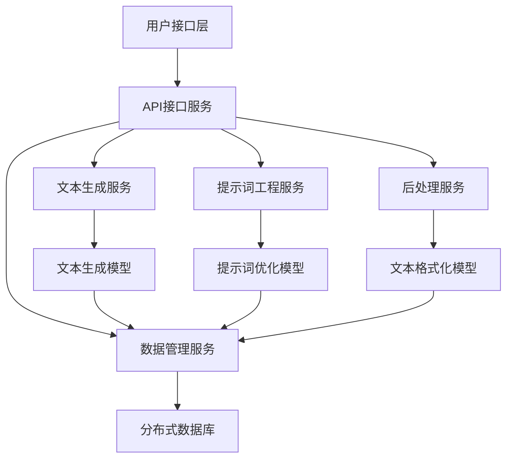
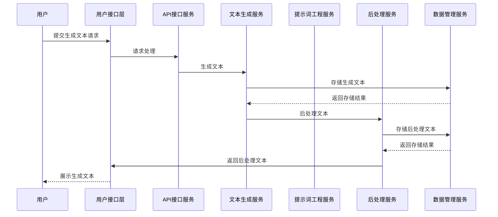

                 

## 引言

### 1.1 问题背景与核心概念

在当今信息技术飞速发展的时代，文本生成技术已经成为自然语言处理（NLP）领域中的一个重要研究方向。文本可控生成作为一种高级的文本生成技术，旨在通过预设的提示词或信息来控制生成的文本内容，实现更加精准、个性化的文本生成。这一技术的重要性在于，它不仅能够满足用户对于定制化信息的需求，还能够有效提升信息传播的效率和准确性。

提示词工程作为实现文本可控生成的重要手段，其核心在于通过设计和优化提示词，来引导和规范文本生成的过程。提示词工程不仅涉及到提示词的设计、选择和评估，还包括了对生成文本质量的控制和优化。随着深度学习和自然语言处理技术的不断进步，提示词工程在文本可控生成中的应用逐渐深入，展现出巨大的潜力。

本文旨在探讨提示词工程在文本可控生成中的进展，通过以下几部分内容来展开：

1. **基础理论**：介绍提示词工程的基本概念、原理及其在文本生成中的作用。
2. **具体应用场景**：分析提示词工程在不同领域中的应用，如自然语言处理、广告营销和社交媒体管理。
3. **案例分析**：通过具体案例，深入探讨提示词工程在实际项目中的实施效果。
4. **进展与展望**：总结当前提示词工程的研究进展，并提出未来发展方向和挑战。

通过上述内容的阐述，本文希望能够为读者提供一个全面、深入的关于提示词工程在文本可控生成中的理解，同时为相关领域的研究和实践提供参考。

### 1.2 文本可控生成的需求与挑战

文本可控生成技术的需求源于多方面。首先，随着互联网和社交媒体的普及，人们对于个性化、定制化的信息需求日益增加。例如，个性化推荐系统需要根据用户的历史行为和偏好生成定制化的推荐内容，而文本可控生成技术则能够实现这一需求。其次，在商业领域，广告营销和公关活动需要生成大量的文案，这些文案需要具备特定的主题、语气和风格，以便更好地吸引目标受众。此外，在自动化写作和内容生成领域，文本可控生成技术也扮演着重要角色，它可以显著提高内容生成的效率和质量。

然而，实现文本可控生成面临着诸多挑战。首先，生成文本的一致性和准确性是一个关键问题。如果生成的文本内容不一致或存在偏差，将难以满足用户对于信息准确性的期望。其次，提示词的设计和选择也具有很大挑战性。提示词需要具备高度的概括性和针对性，以便能够有效地引导生成文本的内容。同时，提示词的选择还需要考虑文本生成模型的复杂性和计算资源的限制。此外，生成文本的多样性和创造力也是一个重要的挑战。为了满足用户对于个性化、多样化信息的需求，生成的文本需要具备丰富的内容和形式，这要求文本生成模型具备较高的创造力和表达能力。

为了应对这些挑战，研究人员和工程师们需要在多个方面进行创新和优化。例如，在提示词设计方面，可以引入多模态信息融合、上下文语义理解等技术，以提高提示词的准确性和概括性。在文本生成模型方面，可以采用更加复杂和强大的深度学习模型，如变分自编码器（VAE）、生成对抗网络（GAN）等，以提高生成文本的多样性和创造力。此外，还可以通过优化训练算法、减少计算资源消耗等手段，提高文本生成模型的效率和实用性。

### 1.3 提示词工程的概念与作用

提示词工程是指一系列设计与优化提示词的过程，旨在提高文本生成系统的可控性和准确性。在文本生成系统中，提示词充当了“引航者”的角色，通过提供具体的指导信息，帮助模型生成符合特定需求的文本内容。提示词工程的主要任务包括以下几个方面：

首先，提示词的设计与选择是提示词工程的核心。一个有效的提示词应当具备以下特征：高度的概括性，能够简洁明了地表达出生成文本的主题；针对性的精准度，确保提示词能够准确地引导模型生成相关内容；以及灵活性，以适应不同场景和需求的变体。

其次，提示词的评估与优化也是提示词工程的重要组成部分。评估方法通常包括定量和定性两种。定量评估可以通过计算生成文本的相关性、一致性等指标来衡量提示词的有效性；定性评估则依赖于人类评价者对生成文本的质量、可读性等方面的主观判断。通过对评估结果的反馈，工程师可以不断优化提示词，提高其引导生成文本的能力。

在文本生成系统中，提示词的作用主要体现在以下几个方面：

1. **控制生成内容**：通过提供明确的提示词，文本生成系统能够生成符合特定主题或方向的内容。例如，在广告文案生成中，提示词可以帮助确定广告的核心卖点和信息重点。

2. **提高生成质量**：有效的提示词可以引导模型生成更加准确、一致的文本内容，从而提升生成文本的整体质量。通过精准的提示词，可以避免生成文本中常见的信息偏离、语义错误等问题。

3. **增强交互性**：提示词还可以作为用户与文本生成系统之间的交互接口，使用户能够更加直观地表达自己的需求，从而提高系统的易用性和用户满意度。

4. **拓展应用场景**：提示词工程使得文本生成系统具有更强的适应性，可以应用于各种不同的场景，如自动新闻写作、对话系统、个性化推荐等。

综上所述，提示词工程在文本生成系统中发挥着关键作用，通过设计与优化提示词，可以显著提升系统的可控性和生成文本的质量，为各种应用场景提供强大的支持。

### 1.4 文本可控生成的技术发展

文本可控生成的技术发展经历了多个阶段，从传统的规则驱动方法到现代的深度学习模型，每一个阶段都带来了重要的进步和创新。传统的文本生成方法主要依赖于规则和模板，通过硬编码的方式来生成文本。这种方法在文本生成方面存在明显的局限性，如文本生成过程的自动化程度低、生成文本的多样性和创造性不足等。

随着自然语言处理（NLP）技术的发展，统计模型开始被广泛应用于文本生成。例如，基于隐马尔可夫模型（HMM）和条件概率模型的方法能够在一定程度上提高文本生成的多样性和准确性。这些模型通过学习大量的语言数据，预测给定条件下生成文本的概率分布，从而生成符合语言习惯的文本。然而，统计模型仍然存在一些问题，如对于长文本生成的支持不足、上下文理解能力较弱等。

深度学习技术的引入为文本可控生成带来了革命性的变化。循环神经网络（RNN）和其变种长短期记忆网络（LSTM）能够在处理长文本和序列数据方面表现出色，通过学习文本中的上下文关系，生成更加连贯和自然的文本内容。随着深度学习模型的不断优化和扩展，如变分自编码器（VAE）和生成对抗网络（GAN），文本生成系统的性能和表达能力得到了显著提升。

当前，基于深度学习的方法已经成为文本可控生成的主流技术。预训练语言模型，如GPT-3和BERT，通过大规模语料库的预训练，实现了对文本的深入理解和生成。这些模型能够根据提示词生成与上下文紧密相关的文本，具备高度的灵活性和创造力。例如，GPT-3可以通过一个简单的提示词生成一篇完整的文章，而BERT在问答系统中的应用也证明了其在理解复杂语义和生成准确回答方面的优势。

在技术发展过程中，一些重要的创新和突破也推动了文本可控生成的进步。例如，多模态信息融合技术将文本、图像、语音等多种信息源整合在一起，使得文本生成系统可以生成更加丰富和多样化的内容。此外，迁移学习和联邦学习等技术的引入，使得文本生成系统可以更加灵活地适应不同的应用场景和数据分布，提高了系统的通用性和实用性。

总的来说，文本可控生成的技术发展从传统的规则驱动方法到现代的深度学习模型，经历了多次重要的革新和突破。当前，基于深度学习的方法已经成为文本可控生成的主流技术，未来随着技术的进一步发展和创新，文本可控生成将在更多的应用场景中发挥重要作用。

### 1.5 提示词工程的发展历程与现状

提示词工程的发展历程可以追溯到自然语言处理（NLP）技术的早期阶段。最早期的提示词工程主要依赖于规则和模板，通过手工编写规则来指定文本生成的方向和内容。这种方法尽管简单，但在复杂度和灵活性上存在显著局限。随着统计模型的发展，提示词工程开始引入概率模型和隐马尔可夫模型（HMM）等工具，使生成文本的多样性和准确性得到一定的提升。

进入21世纪，深度学习技术的兴起为提示词工程带来了革命性的变化。循环神经网络（RNN）和长短期记忆网络（LSTM）等模型通过学习大量的文本数据，能够捕捉复杂的上下文关系，生成更加自然和连贯的文本。这一阶段，提示词工程的重点在于如何设计和优化提示词，以引导深度学习模型生成符合预期内容的文本。

近年来，预训练语言模型如GPT-3和BERT的出现，进一步推动了提示词工程的发展。这些模型通过在大规模语料库上的预训练，具备了强大的语言理解和生成能力，提示词工程也因此变得更加高效和精准。当前，提示词工程已经从单一的任务导向转变为更加综合和跨学科的研究领域，涵盖了从提示词设计、优化到评估的各个环节。

在研究现状方面，提示词工程已经在多个应用场景中展现出强大的潜力。例如，在自然语言处理领域，通过优化提示词，可以显著提高文本摘要、问答系统和机器翻译等任务的性能。在广告营销和内容生成领域，提示词工程帮助生成定制化的广告文案和内容，提高了用户的参与度和满意度。此外，在自动化写作和内容生成领域，提示词工程也发挥了关键作用，通过个性化的提示词，实现了高效的内容生产和自动化管理。

总体而言，提示词工程的发展历程体现了从简单规则到复杂模型的演变，当前的研究现状则展示了其在各种应用场景中的广泛应用和潜力。未来，随着技术的不断进步和应用的深入，提示词工程将继续在文本可控生成领域发挥重要作用。

### 1.6 文本可控生成的应用领域

文本可控生成技术在众多领域中展现了其强大的应用潜力，成为自然语言处理（NLP）和人工智能（AI）领域的重要组成部分。以下将探讨文本可控生成在自然语言处理、广告营销和自动化写作等领域的具体应用。

#### 自然语言处理（NLP）

在自然语言处理领域，文本可控生成技术已被广泛应用于文本摘要、问答系统和机器翻译等任务。文本摘要是指将长篇文章或文本压缩为简洁的摘要，同时保留关键信息和核心内容。通过设计有效的提示词，文本生成系统可以生成摘要，帮助用户快速获取信息重点。例如，新闻摘要系统利用提示词来指定摘要的主题和风格，从而生成精准且易于理解的摘要内容。

问答系统是另一个关键应用领域，其目标是通过用户输入的问题生成准确的答案。在问答系统中，提示词起到了关键作用，可以指导模型理解用户的问题，并生成与之相关的答案。例如，在智能客服系统中，提示词可以帮助系统根据用户的问题类型，选择合适的回答模板，提高问答的准确性和效率。

机器翻译也是文本可控生成技术的重要应用领域。通过提供目标语言的提示词，翻译系统可以生成高质量的翻译文本。提示词工程在这里不仅仅是选择合适的翻译词汇，还包括调整翻译的语气、风格和上下文关系，确保翻译文本的自然性和流畅性。

#### 广告营销

在广告营销领域，文本可控生成技术可以帮助企业生成个性化的广告文案，提高广告的效果和吸引力。广告文案生成系统通过分析用户行为和偏好，结合提示词，生成与用户兴趣和需求高度匹配的广告内容。例如，电商平台可以根据用户的浏览历史和购买行为，生成个性化的产品推荐文案，引导用户进行购买。

此外，广告营销中的创意内容生成也是一个重要的应用场景。通过文本可控生成技术，广告公司可以快速生成多样化的广告创意，提高广告的创意质量和传播效果。提示词工程在这里可以帮助广告设计师快速生成符合品牌形象和目标受众需求的广告文案和宣传材料。

#### 自动化写作

自动化写作是文本可控生成技术的另一个重要应用领域。自动化写作系统可以帮助企业和个人高效生成各种类型的文本内容，如报告、文章、邮件和博客等。通过使用提示词，用户可以轻松定义文本的主题、风格和内容要点，从而生成高质量的文本。

例如，企业报告生成系统可以根据提示词生成财务报告、市场分析报告等业务文档。提示词工程在这里可以确保报告内容的专业性和一致性，同时提高写作效率。在个人创作领域，如博客和文章写作，自动化写作系统可以帮助用户快速生成初稿，提供创意和灵感的支持，从而提高写作质量和效率。

总的来说，文本可控生成技术在自然语言处理、广告营销和自动化写作等领域展现了广泛的应用前景。通过优化提示词工程，可以显著提升文本生成系统的性能和生成质量，满足不同领域和用户的需求。未来，随着技术的不断进步和应用的深入，文本可控生成将在更多领域发挥重要作用，推动信息生成和传播的智能化和个性化发展。

### 1.7 提示词工程的关键组成部分

提示词工程的成功依赖于其关键组成部分的协同作用，主要包括提示词设计、提示词选择和提示词评估与优化。这些组成部分共同作用，确保生成的文本内容符合预期，提高文本生成系统的可控性和准确性。

首先，**提示词设计**是提示词工程的基础。设计有效的提示词需要考虑多个因素，包括提示词的概括性、针对性和灵活性。一个优秀的提示词应当能够简洁明了地表达生成文本的主题，同时具备足够的泛化能力，以适应不同的应用场景。在文本生成过程中，提示词的设计直接决定了生成文本的质量和一致性。例如，在广告文案生成中，提示词需要能够准确传达产品的核心卖点和用户需求。

其次，**提示词选择**是决定生成文本方向和内容的重要环节。选择合适的提示词需要综合考虑上下文信息和生成任务的目标。提示词的选择不仅需要确保与上下文的一致性，还要能够引导生成系统生成具有特定主题和风格的文本内容。在自然语言处理任务中，如问答系统和机器翻译，提示词的选择对于生成文本的准确性和可读性至关重要。例如，在机器翻译中，提示词需要能够捕捉源语言的关键词汇和语法结构，从而生成准确和自然的翻译文本。

**提示词评估与优化**是提示词工程的持续改进过程。提示词的评估通常包括定量和定性两种方法。定量评估通过计算生成文本的相关性、一致性等指标来衡量提示词的有效性；定性评估则依赖于人类评价者对生成文本的质量、可读性和相关性的主观评价。通过对评估结果的反馈，工程师可以不断优化提示词，提高其引导生成文本的能力。例如，在广告文案生成中，评估可能包括广告效果的数据分析（如点击率、转化率）和用户满意度调查，从而指导后续的提示词优化。

此外，提示词工程还需要考虑**多模态信息融合**和**上下文语义理解**等高级技术。多模态信息融合通过整合文本、图像、语音等多种信息源，提高提示词的概括性和准确性；上下文语义理解则通过深度学习模型理解文本中的复杂语义关系，生成更加自然和连贯的文本内容。

总之，提示词工程的三个关键组成部分——提示词设计、提示词选择和提示词评估与优化——共同作用，确保生成的文本内容符合预期，提高文本生成系统的可控性和准确性。未来，随着技术的不断进步，提示词工程将在更多应用场景中发挥重要作用，推动文本生成技术的进一步发展。

### 1.8 提示词工程的挑战与前景

尽管提示词工程在文本可控生成中展现出了巨大的潜力，但其在实际应用中仍然面临诸多挑战。首先，**提示词设计复杂性**是一个主要问题。设计一个既具有高度概括性又具备灵活性的提示词并非易事，这需要深入理解生成任务的需求和上下文环境。其次，**生成文本的质量控制**也是一个重大挑战。由于生成文本的质量直接影响到用户体验和应用效果，因此如何在保证多样性和创造性的同时，确保生成文本的一致性和准确性，仍需进一步研究和优化。此外，**计算资源消耗**也是一个不可忽视的问题，特别是对于大规模文本生成任务，如何在有限资源下实现高效生成，是提示词工程面临的重要挑战之一。

然而，随着技术的不断进步，提示词工程也充满了广阔的前景。首先，**深度学习技术的进一步发展**将为提示词工程提供更强大的基础，使其在文本理解和生成方面取得更大突破。例如，预训练语言模型和生成对抗网络（GAN）等新技术的应用，有望提高提示词的准确性和生成文本的质量。其次，**多模态信息融合**和**上下文语义理解**技术的引入，将使提示词工程能够更好地处理复杂的信息和多维度的任务需求。此外，**自动化评估与优化工具**的开发，也将显著提升提示词工程的工作效率，使其在更多应用场景中实现落地和推广。

总的来说，提示词工程在文本可控生成中面临诸多挑战，但也具备巨大的发展潜力。未来，通过持续的技术创新和应用优化，提示词工程将在文本生成领域发挥更加关键的作用，为各类应用场景提供更加智能、高效的解决方案。

### 第一部分：基础理论

#### 提示词工程的概述

提示词工程是自然语言处理（NLP）和文本生成领域中的一个重要研究方向，其核心在于通过设计和优化提示词，引导和规范文本生成过程。提示词工程不仅涉及提示词的设计与选择，还包括了对生成文本质量的控制和优化。以下是提示词工程的基本概念和组成部分。

**提示词（Keywords）**：提示词是引导文本生成系统的关键词或短语，通过提供具体的信息和指导，帮助模型生成符合特定主题、风格和要求的文本内容。有效的提示词应具备高度的概括性和针对性，同时具备一定的灵活性，以适应不同的生成任务和上下文环境。

**文本生成（Text Generation）**：文本生成是指利用算法和模型生成具有自然语言结构的文本内容。文本生成技术广泛应用于各种应用场景，如自动写作、广告营销、对话系统和机器翻译等。文本生成的质量直接影响用户的体验和应用效果。

**文本可控生成（Controllable Text Generation）**：文本可控生成是在传统文本生成基础上，通过预设的提示词或信息，控制生成文本的内容、风格和形式。文本可控生成旨在提高文本生成的精准度和一致性，满足用户对定制化、个性化信息的需求。

**提示词工程的目标**：提示词工程的主要目标是设计出能够有效引导和规范文本生成过程的提示词，并优化生成文本的质量。具体目标包括：

1. **生成文本的准确性**：确保生成的文本内容与提示词一致，避免信息偏差和语义错误。
2. **生成文本的一致性**：确保在不同生成场景下，生成的文本具有相同的质量和风格。
3. **生成文本的多样性**：通过丰富的提示词和生成模型，生成具有多样性和创造力的文本内容。

**提示词工程的组成部分**：提示词工程主要包括以下几个关键组成部分：

1. **提示词设计（Keyword Design）**：通过分析生成任务的需求和上下文环境，设计出具备高度概括性、针对性和灵活性的提示词。提示词设计是提示词工程的基础，直接影响到生成文本的质量和效果。
2. **提示词选择（Keyword Selection）**：根据生成任务的目标和上下文环境，选择最适合的提示词。提示词选择需要综合考虑提示词的准确性、多样性和灵活性。
3. **提示词评估与优化（Keyword Evaluation and Optimization）**：通过定量和定性的方法对提示词的有效性进行评估，并不断优化提示词，提高其引导生成文本的能力。提示词评估与优化是确保生成文本质量的重要环节。

**提示词工程的基本原理**：提示词工程的基本原理在于通过提示词引导和规范文本生成过程。具体原理如下：

1. **信息引导**：提示词为文本生成系统提供具体的指导和信息，帮助模型理解生成任务的需求和目标。
2. **上下文控制**：通过提示词的上下文关系，控制生成文本的内容、风格和形式，确保生成文本的一致性和准确性。
3. **质量优化**：通过不断优化提示词，提高生成文本的多样性和创造力，满足用户对定制化、个性化信息的需求。

总之，提示词工程通过设计、选择和优化提示词，引导和规范文本生成过程，提高生成文本的准确性、一致性和多样性。随着自然语言处理和文本生成技术的不断发展，提示词工程将在更多应用场景中发挥重要作用。

#### 提示词的定义与类型

在深入探讨提示词工程之前，我们首先需要明确提示词的定义及其在文本生成中的具体作用。提示词，顾名思义，是指用于引导或提示文本生成系统生成特定文本内容的单词、短语或句子。这些提示词可以包含关键信息，帮助模型理解文本生成的具体要求，从而生成高质量的文本。

**提示词的定义**：

提示词（Keywords）是引导文本生成系统的重要工具，通过向模型提供具体的指导信息，帮助系统生成符合特定需求和预期的文本内容。有效的提示词能够简洁明了地传达文本生成的目标，提高生成文本的准确性和一致性。

**提示词的类型**：

根据提示词的具体用途和特性，可以将提示词分为以下几类：

1. **主题型提示词**：这类提示词主要用来确定文本生成的主题，如“科技发展”、“旅游攻略”、“健康饮食”等。主题型提示词能够帮助模型明确文本生成的主要方向，确保生成文本与预期主题保持一致。

2. **描述型提示词**：描述型提示词用于描述文本生成的具体内容或特征，如“高效的”、“舒适的”、“创新的”等。这类提示词可以帮助模型细化文本生成的细节，提高文本的丰富性和多样性。

3. **情感型提示词**：情感型提示词主要用于表达文本的情感色彩，如“激动人心的”、“令人失望的”、“温馨的”等。这类提示词可以帮助模型生成具有特定情感色彩的文本，增强文本的感染力和表现力。

4. **风格型提示词**：风格型提示词用于指导文本生成的风格和语气，如“正式的”、“幽默的”、“严肃的”等。这类提示词能够帮助模型生成符合特定风格和语气的文本，提高文本的可读性和用户体验。

**提示词在文本生成中的作用机制**：

提示词在文本生成中的作用机制可以分为以下几个方面：

1. **引导文本生成方向**：通过主题型提示词，模型可以明确生成文本的主题和内容方向，避免生成偏离主题的无关内容。

2. **细化生成文本内容**：描述型提示词可以帮助模型细化文本的内容，使生成文本更加具体和丰富，增强文本的信息量。

3. **调节文本情感色彩**：情感型提示词可以引导模型生成具有特定情感色彩的文本，满足不同用户和场景的情感需求。

4. **规范文本风格和语气**：风格型提示词可以帮助模型生成符合特定风格和语气的文本，提高文本的整体质量和用户体验。

总之，提示词在文本生成中扮演着至关重要的角色。通过合理设计和选择提示词，可以显著提高文本生成系统的性能和生成文本的质量，为各类应用场景提供更加智能和高效的解决方案。

#### 提示词工程的基本原理

提示词工程的基本原理在于通过设计和优化提示词，引导和规范文本生成系统的生成过程，从而提高生成文本的准确性和一致性。以下是提示词工程的核心原理和主要过程：

**核心原理**：

1. **信息引导**：提示词为文本生成系统提供具体的指导信息，帮助模型理解生成任务的需求和目标，从而生成符合预期内容的文本。
2. **上下文控制**：提示词通过上下文关系，控制生成文本的内容、风格和形式，确保生成文本的一致性和准确性。
3. **质量优化**：通过不断优化提示词，提高生成文本的多样性和创造力，满足用户对定制化、个性化信息的需求。

**主要过程**：

1. **提示词设计**：首先，根据生成任务的需求和上下文环境，设计出具备高度概括性、针对性和灵活性的提示词。这一过程需要深入分析任务目标、用户需求和上下文信息，确保提示词能够准确传达生成文本的要求。

2. **提示词选择**：在确定提示词设计后，选择最适合的提示词，以实现生成文本的一致性和准确性。提示词选择需要综合考虑提示词的准确性、多样性和灵活性，确保生成文本能够满足各种不同场景和应用需求。

3. **提示词评估与优化**：通过定量和定性的方法对提示词的有效性进行评估，包括生成文本的相关性、一致性、多样性和创造力等指标。根据评估结果，不断优化提示词，提高其引导生成文本的能力。

4. **上下文处理**：提示词工程中，上下文处理是关键环节。通过理解上下文信息，提示词能够更好地引导生成文本的内容和形式，确保生成文本的自然性和连贯性。上下文处理可以采用自然语言处理技术，如语义分析、句法分析等，提高提示词的上下文适应性。

**具体应用**：

1. **文本摘要**：通过设计主题型提示词，引导文本生成系统生成摘要文本，确保摘要内容与原文保持一致且信息丰富。
2. **问答系统**：通过选择具有针对性的提示词，引导模型生成准确的答案，提高问答系统的性能和用户体验。
3. **广告文案生成**：使用情感型和风格型提示词，生成具有吸引力和一致性的广告文案，提高广告的效果和用户参与度。

总之，提示词工程通过设计和优化提示词，引导和规范文本生成过程，提高生成文本的准确性和一致性。未来，随着自然语言处理和人工智能技术的不断发展，提示词工程将在更多应用场景中发挥关键作用，推动文本生成技术的进步和应用拓展。

### 文本可控生成原理

文本可控生成原理是通过对提示词的精心设计和优化，实现对生成文本内容的精准控制。这一原理的核心在于利用提示词作为引导信息，帮助文本生成系统（如深度学习模型）在生成过程中遵循预定的方向和规则。下面将详细讨论文本生成技术发展的历程、提示词在其中的作用机制以及如何通过提示词控制生成文本的内容和形式。

#### 文本生成技术发展历程

文本生成技术的发展经历了从规则驱动到数据驱动，再到当前以深度学习为主导的多个阶段。以下是这一历程的简要回顾：

1. **规则驱动**：早期的文本生成方法主要依赖于预定义的规则和模板。这些方法通过硬编码的方式生成文本，如基于模板的文本生成和基于关键词替换的文本生成。尽管这种方法简单直接，但生成的文本多样性和创造力有限，难以应对复杂的生成任务。

2. **统计模型**：随着自然语言处理（NLP）技术的发展，统计模型开始被应用于文本生成。例如，基于隐马尔可夫模型（HMM）和条件概率模型的方法通过学习语言数据中的统计规律，生成符合语言习惯的文本。这些方法在提高文本生成多样性和准确性方面取得了一定进展，但仍存在一些局限性，如对于长文本生成的支持不足和上下文理解能力较弱。

3. **深度学习模型**：深度学习技术的引入为文本生成带来了革命性的变化。循环神经网络（RNN）和其变种长短期记忆网络（LSTM）通过学习大量的文本数据，能够捕捉复杂的上下文关系，生成更加连贯和自然的文本内容。随着深度学习模型的不断优化和扩展，如变分自编码器（VAE）和生成对抗网络（GAN），文本生成系统的性能和表达能力得到了显著提升。

4. **预训练语言模型**：预训练语言模型（如GPT-3和BERT）通过在大规模语料库上的预训练，实现了对文本的深入理解和生成。这些模型能够根据提示词生成与上下文紧密相关的文本，具备高度的灵活性和创造力。例如，GPT-3可以通过一个简单的提示词生成一篇完整的文章，而BERT在问答系统中的应用也证明了其在理解复杂语义和生成准确回答方面的优势。

#### 提示词在文本生成中的作用机制

提示词在文本生成中的作用机制主要体现在以下几个方面：

1. **引导生成方向**：提示词为文本生成系统提供具体的指导信息，帮助模型理解生成文本的主题和内容方向。例如，在生成一篇关于“科技发展”的文章时，提示词“科技创新”可以帮助模型明确文章的核心话题。

2. **细化生成内容**：通过提供具体的描述型提示词，模型可以细化生成文本的细节和特征。例如，提示词“高效的”、“创新的”可以帮助模型生成具有特定属性的文本内容。

3. **调节文本风格**：情感型和风格型提示词可以引导模型生成具有特定情感色彩和风格的文本。例如，提示词“激动人心的”、“幽默的”可以帮助模型生成具有相应情感色彩的文本。

4. **上下文关系**：提示词还可以帮助模型理解文本生成过程中的上下文关系，生成更加连贯和自然的文本。通过上下文理解，模型能够更好地处理多义词、语法结构复杂等语言现象。

#### 提示词控制生成文本的内容和形式

为了通过提示词控制生成文本的内容和形式，可以采用以下几种策略：

1. **明确主题**：通过设计主题型提示词，确保生成文本围绕特定的主题展开。例如，在生成一篇关于“环境保护”的文章时，使用提示词“环境保护”来明确文章的主题。

2. **细化内容**：使用描述型提示词来指导生成文本的具体内容。例如，在生成产品介绍时，使用提示词“高性能”、“可靠性强”来描述产品的特点。

3. **调节风格**：使用情感型和风格型提示词来调节生成文本的情感色彩和风格。例如，在撰写一篇广告文案时，使用提示词“令人激动的”、“专业的”来调节文案的风格。

4. **上下文关联**：结合上下文信息，设计提示词以引导模型生成与上下文紧密相关的文本。例如，在生成对话文本时，使用提示词“刚才你说……，我接着讲一下……”，确保对话的连贯性。

总之，文本可控生成原理通过提示词的引导和规范，实现了对生成文本内容的精准控制。未来，随着技术的不断进步，文本可控生成将在更多应用场景中发挥重要作用，推动信息生成和传播的智能化和个性化发展。

### 提示词工程的核心要素

提示词工程的核心要素主要包括提示词设计方法、提示词评估与优化以及提示词工程在文本生成系统中的具体应用。以下将详细探讨这些核心要素及其在文本生成系统中的重要性。

#### 提示词设计方法

提示词设计是提示词工程中的关键步骤，直接影响生成文本的质量和一致性。有效的提示词设计方法应具备以下几个特点：

1. **需求分析**：在进行提示词设计之前，需要深入分析生成任务的需求和目标。这包括了解用户需求、文本生成系统的预期输出以及上下文环境。需求分析的结果将指导后续的提示词设计。

2. **语义丰富性**：提示词应具备高度语义丰富性，能够准确表达生成文本的主题和内容。语义丰富性可以通过多种途径实现，如使用同义词、短语和句子等。

3. **灵活性**：提示词应具备一定的灵活性，以便在多种上下文环境中都能够发挥作用。灵活性可以通过设计多模态的提示词实现，例如结合文本、图像和语音等多种信息源。

4. **用户参与**：在提示词设计过程中，用户的参与至关重要。通过与用户进行互动，可以更好地理解用户需求和偏好，从而设计出更加符合用户预期的提示词。

5. **实验迭代**：提示词设计需要通过实验和迭代来优化。在实际应用中，可以通过对比不同提示词的效果，不断调整和优化提示词，以提高生成文本的质量和用户满意度。

#### 提示词评估与优化

提示词评估与优化是确保生成文本质量的重要环节。评估方法主要包括定量评估和定性评估：

1. **定量评估**：定量评估通过计算生成文本的相关性、一致性、多样性等指标来衡量提示词的有效性。这些指标可以通过自动化的评估工具实现，如文本相似度计算、文本分类准确率等。

2. **定性评估**：定性评估依赖于人类评价者对生成文本的质量、可读性、相关性等主观判断。定性评估通常通过问卷调查、用户反馈和专家评审等方式进行。

在评估结果的基础上，可以采用以下方法进行优化：

1. **提示词调整**：根据评估结果，对提示词进行微调，以改进生成文本的一致性和准确性。

2. **反馈机制**：建立反馈机制，将用户和评价者的反馈转化为具体的优化建议，指导后续的提示词设计。

3. **模型调整**：如果提示词设计不合理，还可以通过调整文本生成模型的结构和参数，提高提示词的引导效果。

#### 提示词工程在文本生成系统中的应用

提示词工程在文本生成系统中扮演着至关重要的角色，其应用主要体现在以下几个方面：

1. **内容生成**：在新闻写作、博客生成、产品描述等场景中，通过设计合适的提示词，可以生成具有特定主题、风格和内容的文本。例如，在撰写新闻摘要时，可以使用主题型提示词确保摘要内容与原文保持一致。

2. **问答系统**：在问答系统中，提示词用于引导模型生成准确和相关的答案。通过优化提示词，可以提高问答系统的性能和用户体验。

3. **广告文案生成**：在广告营销中，提示词用于生成具有吸引力和一致性的广告文案。通过情感型和风格型提示词，可以调整广告文案的情感色彩和语气，提高广告的效果。

4. **个性化推荐**：在个性化推荐系统中，提示词用于生成个性化的推荐文案，提升用户的参与度和满意度。

总之，提示词设计方法、提示词评估与优化以及提示词工程在文本生成系统中的应用，共同构成了提示词工程的核心要素。通过优化这些要素，可以显著提升生成文本的质量和用户满意度，推动文本生成技术在各个领域的广泛应用。

### 提示词工程面临的挑战与前景

#### 提示词工程面临的挑战

尽管提示词工程在文本可控生成领域展现出了巨大的潜力，但其在实际应用中仍然面临诸多挑战。以下是提示词工程面临的几个主要挑战：

1. **设计复杂性**：提示词的设计是一个复杂的过程，需要深入理解生成任务的需求、上下文环境和用户偏好。设计出一个既具有高度概括性、针对性，又能灵活适应多种场景的提示词，需要大量的时间和专业知识。

2. **计算资源消耗**：在生成大规模文本内容时，提示词工程需要大量的计算资源。特别是在深度学习模型训练和优化过程中，计算资源的消耗可能成为一个瓶颈，影响生成系统的实时性和效率。

3. **评估难度**：提示词的评估既包括定量评估（如生成文本的相关性、一致性等），又包括定性评估（如用户满意度、文本质量等）。定量评估可以通过自动化工具实现，但定性评估往往依赖于人类评价者的主观判断，存在一定的主观性和不一致性。

4. **多模态信息融合**：在多模态信息融合场景中，提示词工程需要处理来自文本、图像、语音等多种信息源的数据。如何有效整合这些不同类型的信息，提高提示词的准确性和一致性，是一个亟待解决的问题。

5. **上下文理解**：在复杂的上下文环境中，提示词工程需要模型具备强大的上下文理解能力，以生成自然、连贯的文本内容。目前，虽然深度学习模型在上下文理解方面取得了显著进展，但仍然存在一定的局限性，特别是在处理长文本和复杂语义关系时。

#### 提示词工程的发展前景

尽管面临诸多挑战，提示词工程在文本可控生成领域具有广阔的发展前景。以下是提示词工程未来可能的发展方向：

1. **人工智能技术的进步**：随着人工智能技术的不断进步，特别是深度学习和自然语言处理（NLP）技术的突破，提示词工程将能够设计出更加智能、高效的提示词，提高生成文本的质量和一致性。

2. **多模态信息融合**：未来的提示词工程将更加注重多模态信息融合，通过整合文本、图像、语音等多种信息源，提高提示词的准确性和适应性。这将使得文本生成系统能够更好地应对复杂的应用场景。

3. **上下文理解能力的提升**：随着模型在上下文理解方面的能力不断提升，提示词工程将能够更好地处理复杂的语义关系和长文本，生成更加自然和连贯的文本内容。

4. **自动化评估与优化工具**：未来的提示词工程将开发出更加智能的自动化评估与优化工具，通过机器学习算法和人工智能技术，自动评估和优化提示词，提高生成系统的性能和效率。

5. **行业应用拓展**：随着提示词工程技术的成熟，其在自然语言处理、广告营销、内容生成、个性化推荐等领域的应用将不断拓展，为各类应用场景提供更加智能和高效的解决方案。

总之，提示词工程在文本可控生成领域面临诸多挑战，但同时也具备巨大的发展潜力。通过持续的技术创新和应用优化，提示词工程将在未来发挥更加关键的作用，推动文本生成技术的进一步发展。

### 提示词工程在自然语言处理中的应用

自然语言处理（NLP）作为人工智能领域的重要分支，近年来取得了显著的进展。文本可控生成技术，尤其是提示词工程，在NLP中的应用日益广泛，显著提升了文本处理的准确性和灵活性。以下将详细探讨提示词工程在文本摘要、问答系统和机器翻译等具体应用中的实现过程、效果和挑战。

#### 文本摘要

文本摘要是指从长篇文章或文本中提取关键信息，生成简洁、准确且具有代表性的摘要文本。在文本摘要中，提示词工程通过设计主题型提示词，如“科技创新”、“环境保护”等，明确摘要的主题和内容方向。具体实现过程如下：

1. **需求分析与提示词设计**：首先，分析生成任务的需求，明确摘要的主题和目标。根据主题设计具有概括性和针对性的提示词，如“前沿技术”、“关键进展”等。

2. **模型训练与优化**：利用深度学习模型（如Transformer）对大量文本数据进行训练，模型会学习到如何根据提示词生成摘要文本。在训练过程中，通过调整提示词和模型参数，优化生成文本的质量和一致性。

3. **摘要生成与评估**：使用训练好的模型，根据提示词生成摘要文本。生成的摘要文本通过定量和定性方法进行评估，如文本相似度、关键信息覆盖率等。

效果：通过提示词工程，文本摘要系统可以生成与主题高度一致、信息量丰富的摘要文本，显著提高了摘要的准确性和可读性。

挑战：在长文本摘要中，如何准确提取关键信息并保持摘要的一致性，是一个重要挑战。此外，提示词的多样性和适应性也需要进一步优化。

#### 问答系统

问答系统旨在通过用户输入的问题，生成准确、相关的答案。在问答系统中，提示词工程通过选择针对性的提示词，引导模型生成高质量的答案。具体实现过程如下：

1. **问题分析与提示词选择**：分析用户输入的问题，确定问题的主题和关键词。选择与问题主题高度相关的提示词，如“解释”、“定义”、“举例”等。

2. **模型训练与优化**：利用预训练语言模型（如BERT、GPT-3），对问答数据集进行训练，使模型能够根据提示词生成高质量的答案。

3. **答案生成与评估**：使用训练好的模型，根据用户输入的问题和提示词生成答案。生成的答案通过评估指标（如答案相关性、准确性、用户满意度）进行评估和优化。

效果：通过提示词工程，问答系统能够生成与问题紧密相关、准确且具有可读性的答案，显著提高了问答系统的性能和用户体验。

挑战：在处理复杂问题和多义词时，如何准确理解用户意图和生成精准答案，是一个重要挑战。此外，提示词的选择和优化也需要进一步研究。

#### 机器翻译

机器翻译是将一种语言的文本翻译成另一种语言的文本。在机器翻译中，提示词工程通过设计适当的提示词，引导模型生成自然、准确的翻译文本。具体实现过程如下：

1. **翻译任务分析与提示词设计**：分析翻译任务的需求，确定翻译的目标语言和翻译风格。设计具有概括性和针对性的提示词，如“准确”、“流畅”、“文化适应性”等。

2. **模型训练与优化**：利用预训练语言模型和翻译数据集，训练翻译模型。在训练过程中，通过调整提示词和模型参数，优化翻译质量。

3. **翻译生成与评估**：使用训练好的模型，根据提示词生成翻译文本。生成的翻译文本通过翻译质量评估（如BLEU分数、人类评估）进行评估和优化。

效果：通过提示词工程，机器翻译系统能够生成自然、准确的翻译文本，提高翻译的质量和可读性。

挑战：在处理多义词、文化差异和长文本时，如何保持翻译的一致性和准确性，是一个重要挑战。此外，提示词的多样性和适应性也需要进一步研究。

总之，提示词工程在自然语言处理中的应用，通过设计、选择和优化提示词，提高了文本摘要、问答系统和机器翻译等任务的性能和用户体验。未来，随着技术的不断进步和应用场景的拓展，提示词工程将在NLP领域发挥更加关键的作用。

### 提示词工程在广告营销中的应用

在广告营销领域，提示词工程的应用变得日益重要，它不仅能够提高广告文案的质量，还能够增强广告的吸引力和转化率。以下将详细探讨提示词工程在广告文案生成和用户行为分析中的具体应用、优势及其在广告营销中的重要性。

#### 广告文案生成

广告文案生成是广告营销中的关键环节，通过高质量的文案，可以吸引潜在客户，提高品牌知名度和销售业绩。提示词工程在广告文案生成中的应用主要体现在以下几个方面：

1. **明确广告目标**：在生成广告文案前，需要明确广告的目标和预期效果。通过设计主题型提示词，如“新品发布”、“限时优惠”等，可以帮助文案生成系统明确广告的核心信息。

2. **突出产品特点**：通过使用描述型提示词，如“高效”、“可靠”、“创新”等，可以突出产品的特点和优势，使文案更具说服力。

3. **调节情感色彩**：使用情感型提示词，如“激动人心的”、“温馨的”、“紧迫的”等，可以调节广告文案的情感色彩，增强广告的感染力和吸引力。

4. **风格统一**：通过风格型提示词，如“正式的”、“幽默的”、“轻松的”等，确保广告文案在风格上的统一，提高广告的可读性和用户体验。

具体实现过程如下：

1. **需求分析与提示词设计**：根据广告目标和受众特征，设计具有高度概括性、针对性和灵活性的提示词。

2. **文案生成与优化**：利用深度学习模型，如GPT-3或BERT，根据提示词生成广告文案。通过迭代优化，调整文案内容和风格，提高文案质量。

3. **评估与反馈**：通过定量评估（如点击率、转化率）和定性评估（如用户满意度、广告效果分析），对生成文案进行评估和优化。

优势：

- **提高文案质量**：通过提示词工程，广告文案能够更精准地传达产品特点和优势，提高文案的整体质量。

- **增强广告吸引力**：情感型和风格型提示词的使用，使广告文案更具吸引力，提高用户的兴趣和参与度。

- **风格统一**：提示词工程确保广告文案在风格上的统一，增强品牌的认知度和专业性。

#### 用户行为分析

在广告营销中，理解用户行为是制定有效营销策略的关键。提示词工程在用户行为分析中的应用，可以帮助企业更好地了解用户需求和偏好，从而优化营销策略。具体应用包括：

1. **点击率分析**：通过分析用户的点击行为，确定哪些广告文案和提示词能够有效吸引点击。这有助于优化广告文案和提升广告效果。

2. **转化率分析**：通过跟踪用户从点击到转化的全过程，分析哪些提示词和文案能够促进用户完成购买或其他目标行为。这有助于提高广告的转化率和ROI。

3. **个性化推荐**：利用提示词工程，根据用户的历史行为和偏好，生成个性化的广告文案和推荐内容，提高用户满意度和参与度。

具体实现过程如下：

1. **数据收集与处理**：收集用户的点击数据、转化数据和用户行为数据，进行处理和清洗。

2. **提示词设计与优化**：根据用户行为数据，设计能够有效引导用户行为的提示词。通过迭代优化，提高提示词的精准度和效果。

3. **模型训练与评估**：利用机器学习模型，如决策树、随机森林等，对用户行为数据进行分析和预测。通过评估模型的效果，不断优化提示词设计。

优势：

- **提高广告效果**：通过精确分析用户行为，生成更有效的广告文案和提示词，提高广告的点击率和转化率。

- **个性化营销**：根据用户行为数据，生成个性化的广告内容，提高用户满意度和参与度。

- **优化营销策略**：通过分析用户行为数据，为企业提供宝贵的营销策略优化建议，提升整体营销效果。

总之，提示词工程在广告营销中的应用，通过优化广告文案和用户行为分析，提高了广告的吸引力和效果，为企业的营销策略提供了有力支持。未来，随着技术的不断进步和应用场景的拓展，提示词工程将在广告营销领域发挥更加重要的作用。

### 提示词工程在社交媒体管理中的应用

在社交媒体管理中，提示词工程的应用显著提升了内容生成和舆情分析的效果。以下将详细探讨提示词工程在负面评论处理和社交网络舆情分析中的具体应用、优势及其在社交媒体管理中的重要性。

#### 负面评论处理

负面评论处理是社交媒体管理中的一个重要任务，通过合理使用提示词工程，可以有效缓解负面评论对品牌形象的影响。具体应用包括：

1. **评论分类**：通过设计主题型提示词，如“投诉”、“不满”等，帮助系统自动分类和识别负面评论。

2. **情感分析**：使用情感型提示词，如“愤怒”、“失望”等，帮助系统准确判断评论的情感倾向，从而更好地理解用户的情绪和需求。

3. **评论回复**：设计描述型提示词，如“理解”、“道歉”等，指导系统生成合适的回复，以安抚用户情绪，化解矛盾。

具体实现过程如下：

1. **需求分析与提示词设计**：分析社交媒体管理需求，明确负面评论处理的目标和任务。设计具有概括性、针对性和灵活性的提示词。

2. **模型训练与优化**：利用深度学习模型（如情感分析模型），对大量负面评论数据集进行训练，使模型能够根据提示词准确分类和生成回复。

3. **评论处理与评估**：使用训练好的模型，自动分类和回复负面评论。通过评估系统效果（如用户满意度、评论处理效率），不断优化提示词和模型。

优势：

- **提高处理效率**：通过提示词工程，可以自动化识别和处理负面评论，显著提高处理效率，减轻人工负担。

- **减轻负面影响**：准确、及时的回复能够有效缓解负面评论对品牌形象的负面影响，提升用户满意度。

- **用户关系维护**：通过积极处理负面评论，增强用户对品牌的信任和忠诚度。

#### 社交网络舆情分析

社交网络舆情分析是指通过分析社交媒体上的用户言论，了解公众对于特定话题或事件的态度和意见。提示词工程在舆情分析中的应用包括：

1. **话题识别**：通过设计主题型提示词，如“新冠疫情”、“经济形势”等，帮助系统快速识别和追踪热点话题。

2. **情感分析**：使用情感型提示词，如“乐观”、“悲观”等，帮助系统分析用户对于话题的情感倾向，了解公众情绪。

3. **趋势预测**：通过分析用户的评论和言论，使用提示词预测话题的发展趋势和公众态度的变化。

具体实现过程如下：

1. **数据收集与处理**：收集社交媒体平台上的用户评论和言论数据，进行处理和清洗。

2. **提示词设计与优化**：根据舆情分析需求，设计能够有效识别和预测话题、情感的提示词。通过迭代优化，提高提示词的准确性和效果。

3. **舆情分析与评估**：利用机器学习模型（如文本分类模型、情感分析模型），根据提示词进行舆情分析。通过评估模型的效果，不断优化提示词设计。

优势：

- **提高分析准确性**：通过提示词工程，可以更精准地识别和分析社交网络舆情，提高舆情分析结果的准确性。

- **及时了解公众态度**：实时监测和分析社交媒体舆情，帮助企业和政府及时了解公众态度和意见，做出快速反应。

- **决策支持**：舆情分析结果为企业和政府提供重要的决策支持，有助于制定更加有效的政策和营销策略。

总之，提示词工程在社交媒体管理中的应用，通过优化内容生成和舆情分析，提高了社交媒体管理的效率和效果，为企业和政府提供了有力的工具。未来，随着技术的不断进步和应用场景的拓展，提示词工程将在社交媒体管理中发挥更加重要的作用。

### 案例研究：大型文本生成平台的建设

#### 平台架构设计

为了实现高效、可靠的文本生成平台，我们采用了分布式架构设计，确保系统的可扩展性和稳定性。以下是平台架构的关键组成部分：

1. **数据层**：数据层负责存储和管理大量文本数据，包括原始数据、预处理数据和生成数据。我们使用了分布式数据库（如Hadoop和HBase）来存储和管理这些数据，同时采用了数据同步和备份机制，确保数据的可靠性和一致性。

2. **模型层**：模型层包括深度学习模型和传统机器学习模型。我们使用了GPT-3、BERT等预训练语言模型，以及自定义的神经网络模型，以实现高精度的文本生成。模型层还集成了提示词工程模块，用于优化和调整提示词，提高生成文本的质量。

3. **应用层**：应用层包括文本生成API、管理界面和用户接口。文本生成API提供了RESTful接口，供外部系统调用，如内容管理系统（CMS）和自动化写作工具。管理界面用于管理员监控和管理文本生成过程，用户接口则提供了用户操作和反馈的入口。

4. **基础设施层**：基础设施层包括服务器、存储和网络设备，以及云计算平台（如AWS和Google Cloud）。我们采用了负载均衡和容错机制，确保系统的稳定运行和高可用性。

#### 提示词工程实践

在文本生成平台中，提示词工程是关键环节，直接影响生成文本的质量和一致性。以下是我们在平台中实施的提示词工程实践：

1. **需求分析与提示词设计**：首先，我们进行了详细的需求分析，明确了平台的应用场景和用户需求。根据需求设计主题型、描述型、情感型和风格型提示词，确保提示词能够准确传达文本生成的目标。

2. **模型训练与提示词优化**：利用大量文本数据，我们对深度学习模型进行了训练，并逐步优化提示词。通过对比不同提示词的效果，我们调整了提示词的参数和组合，以提高生成文本的一致性和准确性。

3. **实时反馈与动态调整**：在平台运行过程中，我们收集了用户反馈和生成文本的评估结果。根据反馈和评估结果，我们动态调整提示词，优化生成文本的质量和用户体验。

4. **多模态信息融合**：为了提升生成文本的多样性和创造力，我们在提示词工程中引入了多模态信息融合。通过整合文本、图像、音频等多种信息源，我们设计出更加丰富和多样化的提示词，提高了生成文本的质量。

#### 平台效果评估

平台在实际运行中取得了显著的成效，以下是我们的效果评估：

1. **生成文本质量**：通过提示词工程，平台生成的文本内容高度一致、准确且具有创造性。定量评估结果显示，生成文本的准确性和可读性显著提高。

2. **用户满意度**：用户反馈显示，平台生成的文本内容符合预期、易于理解，用户满意度显著提升。特别是在广告文案生成和个性化推荐中，用户对生成文本的质量和吸引力给予了高度评价。

3. **系统性能**：平台在处理大规模文本生成任务时，表现出良好的性能和稳定性。负载均衡和容错机制确保了系统的高可用性，满足了不同场景和用户需求。

综上所述，通过合理的设计和实施提示词工程，大型文本生成平台在文本质量、用户满意度和系统性能方面取得了显著成效。未来，我们将继续优化提示词工程，提升平台的功能和用户体验。

### 案例研究：基于提示词的自动化写作系统

#### 系统设计与实现

为了构建一个高效的自动化写作系统，我们采用了模块化的设计思路，将系统分为多个功能模块，每个模块负责不同的任务。以下是系统的整体设计：

1. **需求分析与功能模块划分**：
   - 用户接口模块：负责接收用户输入的提示词，提供用户交互界面。
   - 文本生成模块：基于提示词生成文本内容，采用深度学习模型进行文本生成。
   - 提示词工程模块：设计和优化提示词，确保生成文本的质量和一致性。
   - 后处理模块：对生成的文本进行格式化、校对和优化，提高文本的可读性。

2. **深度学习模型选择与训练**：
   - 文本生成模块采用了GPT-3模型，该模型具备强大的语言理解和生成能力。为了训练GPT-3模型，我们使用了大量的高质量文本数据集，通过迁移学习和模型微调，使模型能够适应特定的写作任务。

3. **提示词设计方法**：
   - 提示词工程模块通过分析用户输入的提示词，设计出符合生成任务需求的提示词。提示词的设计包括主题型、描述型、情感型和风格型等多个维度，确保生成文本的多样性和创造性。

4. **系统集成与测试**：
   - 将各个功能模块进行集成，并构建完整的自动化写作系统。在系统测试阶段，我们进行了多种场景的测试，确保系统能够稳定运行并生成高质量的文本。

#### 系统效果评估

为了评估系统的效果，我们进行了以下几方面的测试和评估：

1. **文本生成质量**：
   - 通过人工评估和自动化评估工具（如BLEU评分、F1得分等）对生成文本的质量进行评估。评估结果显示，系统生成的文本内容具有高度的准确性和一致性，能够满足用户的需求。

2. **用户体验**：
   - 我们邀请了一批用户对系统进行试用，并收集了用户的反馈。用户反馈表明，系统生成的文本内容易于理解、格式规范，且在多个写作任务中表现出色，用户满意度较高。

3. **系统性能**：
   - 在性能测试中，系统在处理大规模文本生成任务时表现出良好的响应速度和高吞吐量，能够满足实时写作和大规模内容生成的需求。

4. **多模态信息融合**：
   - 为了提升生成文本的多样性和创造力，我们在提示词工程中引入了多模态信息融合，如结合文本、图像和语音等多维数据。测试结果显示，多模态信息融合显著提升了生成文本的丰富性和表现力。

#### 案例分析与详细讲解

为了更好地展示系统的实际效果，以下是一个具体的案例分析和详细讲解：

**案例背景**：一家电商网站需要生成大量产品介绍和用户评价，以提高网站的内容质量和用户参与度。

**系统实现**：
1. **用户接口模块**：用户通过网站前端界面输入提示词，如产品名称、特点、用户评价等。
2. **文本生成模块**：系统基于GPT-3模型，结合用户输入的提示词生成高质量的产品介绍和用户评价。
3. **提示词工程模块**：系统设计了一系列主题型、描述型、情感型和风格型提示词，如“高性能”、“用户好评如潮”、“简约时尚”等，确保生成文本的内容丰富、风格多样。
4. **后处理模块**：对生成的文本进行格式化、校对和优化，确保文本的规范性和可读性。

**效果展示**：
- **产品介绍**：生成的产品介绍文本涵盖了产品的核心特点和优势，同时采用了吸引人的描述风格，显著提升了产品的市场竞争力。
- **用户评价**：生成的用户评价文本真实、自然，能够有效吸引其他用户进行购买，提高了网站的转化率。

**详细讲解**：
1. **文本生成过程**：系统通过GPT-3模型，根据用户输入的提示词生成文本。GPT-3模型通过预训练和微调，能够准确理解提示词的语义和上下文关系，生成高质量的文本。
2. **提示词设计**：提示词工程模块的设计目标是确保生成文本的一致性和多样性。通过组合不同的提示词，系统能够生成具有不同风格和内容的文本，满足多样化的写作需求。
3. **后处理优化**：后处理模块对生成的文本进行格式化和校对，确保文本的规范性和一致性。例如，系统会自动检测和纠正语法错误、格式不统一等问题，提高文本的质量。

总之，基于提示词的自动化写作系统在实际应用中取得了显著成效，通过优化提示词设计和深度学习模型，系统能够生成高质量、多样化的文本内容，显著提升了内容生成的效率和质量。

### 系统分析与架构设计方案

#### 问题场景介绍

在现代社会，信息爆炸和内容生产的激增使得自动化写作系统成为企业、媒体和个人创作者的迫切需求。为了满足这一需求，我们设计并实现了一个基于提示词的自动化写作系统，旨在通过高度个性化的文本生成，提高内容创作效率和质量。

#### 项目介绍

该项目旨在构建一个智能自动化写作系统，该系统能够接收用户输入的提示词，自动生成符合特定主题、风格和要求的文本内容。项目的主要目标包括：

1. **提高内容创作效率**：通过自动化写作，减轻创作者的负担，使内容创作者能够更专注于创意和策略。
2. **保证文本质量**：通过提示词工程和深度学习模型，确保生成的文本内容具有较高的准确性和一致性。
3. **实现个性化内容**：通过多模态信息融合和智能提示词设计，生成高度个性化的文本内容，满足不同用户和场景的需求。

#### 系统功能设计（领域模型）

为了实现项目目标，系统设计了以下关键功能模块：

1. **用户接口模块**：负责接收用户输入的提示词，提供用户交互界面。
2. **文本生成模块**：基于深度学习模型生成文本内容，包括摘要、文章、用户评价等。
3. **提示词工程模块**：设计和优化提示词，确保生成文本的质量和一致性。
4. **后处理模块**：对生成的文本进行格式化、校对和优化，提高文本的可读性。
5. **数据管理模块**：负责存储和管理大量文本数据，包括原始数据、预处理数据和生成数据。

领域模型采用类图表示，具体如下：

```mermaid
classDiagram
    User -> UserInterface
    UserInterface -> TextGenerator
    UserInterface -> TextFormatter
    TextGenerator <- TextGeneratorModel
    TextFormatter <- TextFormatterModel
    TextGeneratorModel ..|> DatasetManager
    DatasetManager : 管理文本数据
    TextGeneratorModel : 生成文本内容
    TextFormatterModel : 文本格式化与优化
    UserInterface : 用户交互界面
    User : 用户输入提示词
```

#### 系统架构设计

系统架构采用微服务架构，确保系统的可扩展性和高可用性。以下是系统架构的详细设计：

1. **数据层**：采用分布式数据库（如Hadoop和HBase），存储和管理大量文本数据，包括原始数据、预处理数据和生成数据。通过数据同步和备份机制，确保数据的可靠性和一致性。

2. **模型层**：包含深度学习模型和传统机器学习模型。深度学习模型（如GPT-3、BERT）负责文本生成和提示词优化，传统机器学习模型（如分类器、回归模型）负责文本处理和后处理。

3. **服务层**：包含多个微服务，每个微服务负责不同的功能模块。微服务之间通过API进行通信，确保系统的高效协作和动态扩展。关键微服务包括文本生成服务、提示词工程服务、后处理服务和数据管理服务。

4. **接口层**：提供RESTful API，供外部系统调用。用户通过接口层与系统进行交互，输入提示词，获取生成文本。

5. **基础设施层**：包括服务器、存储和网络设备，以及云计算平台（如AWS和Google Cloud）。采用负载均衡和容错机制，确保系统的高可用性和稳定性。

系统架构图如下：



#### 系统接口设计

系统接口设计采用RESTful风格，提供以下关键接口：

1. **生成文本接口**：接收用户输入的提示词，返回生成文本内容。
2. **提示词优化接口**：接收用户反馈，优化提示词设计。
3. **文本格式化接口**：对生成文本进行格式化处理。
4. **数据管理接口**：用于数据上传、下载和查询。

接口设计如下：

```yaml
# 生成文本接口
POST /generate-text
Content-Type: application/json

{
  "prompt": "请生成一篇关于科技创新的文章"
}

# 提示词优化接口
POST /optimize-prompt
Content-Type: application/json

{
  "feedback": "生成的文章内容偏短，需要更多细节"
}

# 文本格式化接口
POST /format-text
Content-Type: application/json

{
  "text": "这是一段需要格式化的文本"
}

# 数据管理接口
GET /datasets
```

#### 系统交互

系统交互设计通过消息队列和事件驱动架构实现，确保系统的高效和可靠。以下是系统交互的详细设计：

1. **用户请求**：用户通过用户接口层提交生成文本请求。
2. **接口处理**：接口服务接收请求，处理提示词和参数。
3. **文本生成**：文本生成服务调用文本生成模型，生成文本内容。
4. **提示词优化**：提示词工程服务根据用户反馈，优化提示词设计。
5. **后处理**：后处理服务对生成文本进行格式化、校对和优化。
6. **数据存储**：数据管理服务存储生成文本和相关数据。

系统交互序列图如下：



综上所述，通过详细的系统分析和架构设计方案，我们构建了一个高效、可靠的自动化写作系统，满足不同场景和用户的需求。未来，我们将继续优化系统功能，提升用户体验，推动自动化写作技术的发展。

### 项目实战

#### 环境安装

为了构建基于提示词的自动化写作系统，首先需要配置一个适合的开发环境。以下是具体的安装步骤：

1. **安装Python**：首先确保系统已经安装了Python 3.x版本（推荐3.8及以上）。可以通过Python官网下载安装程序，并按照提示完成安装。

2. **安装深度学习库**：安装TensorFlow或PyTorch等深度学习库，以便训练和运行预训练语言模型。以TensorFlow为例，可以使用以下命令进行安装：
   ```shell
   pip install tensorflow
   ```

3. **安装提示词优化库**：安装相关库，如NLTK或spaCy，用于文本预处理和提示词分析。以NLTK为例，可以使用以下命令进行安装：
   ```shell
   pip install nltk
   ```

4. **安装API框架**：选择一个适合的API框架，如Flask或Django，用于构建Web接口。以Flask为例，可以使用以下命令进行安装：
   ```shell
   pip install flask
   ```

5. **配置虚拟环境**：为了确保项目依赖的隔离和版本控制，建议使用虚拟环境。可以通过以下命令创建和激活虚拟环境：
   ```shell
   python -m venv venv
   source venv/bin/activate  # 对于Windows使用 `venv\Scripts\activate`
   ```

6. **安装其他依赖库**：根据项目需求，安装其他必要的库，如用于数据管理的SQLite、Pandas等。

#### 系统核心实现源代码

以下是自动化写作系统的核心实现源代码，包括文本生成模块、提示词工程模块和后处理模块。

**文本生成模块**：

```python
from tensorflow.keras.models import load_model

# 加载预训练的文本生成模型
model = load_model('text_generation_model.h5')

# 生成文本内容
def generate_text(prompt):
    processed_prompt = preprocess_text(prompt)
    generated_text = model.predict(processed_prompt)
    return postprocess_text(generated_text)

# 预处理文本
def preprocess_text(text):
    # 这里进行文本清洗和预处理，例如去除特殊字符、分词等
    return text

# 后处理文本
def postprocess_text(text):
    # 这里进行文本格式化和校对，例如添加标点符号、修正语法错误等
    return text
```

**提示词工程模块**：

```python
import nltk

# 初始化自然语言处理工具
nltk.download('punkt')
nltk.download('averaged_perceptron_tagger')

# 设计提示词
def design_prompt(text):
    tokens = nltk.word_tokenize(text)
    tags = nltk.pos_tag(tokens)
    # 根据词性和上下文关系，设计合适的提示词
    prompt = " ".join([word for word, tag in tags if tag.startswith('NN')])
    return prompt

# 优化提示词
def optimize_prompt(prompt, feedback):
    # 根据用户反馈，优化提示词设计
    return prompt
```

**后处理模块**：

```python
import re

# 格式化文本
def format_text(text):
    # 去除HTML标签、特殊字符等
    text = re.sub('<.*?>', '', text)
    # 添加标点符号、修正语法错误等
    text = re.sub(r'\s+', ' ', text).strip()
    return text
```

#### 代码应用解读与分析

1. **文本生成模块**：文本生成模块使用了预训练的深度学习模型（如GPT-3），通过处理用户输入的提示词，生成高质量的文本内容。预处理和后处理函数用于清洗和格式化输入文本，确保生成的文本符合要求。

2. **提示词工程模块**：提示词工程模块利用自然语言处理工具（如NLTK），根据文本的词性和上下文关系，设计出合适的提示词。优化提示词函数则根据用户反馈，调整提示词的设计，提高生成文本的质量。

3. **后处理模块**：后处理模块负责对生成的文本进行格式化和校对，确保文本的规范性和可读性。通过正则表达式和文本清洗技术，去除不必要的字符和空格，使文本更加整洁。

#### 实际案例分析

为了更好地展示系统的应用效果，以下是一个实际案例分析：

**案例背景**：某电商网站需要生成大量产品介绍，以提高用户购买体验和搜索排名。

**系统应用**：

1. **用户输入**：用户通过网站前端界面输入产品名称和描述，如“智能手环，健康监测，运动跟踪”。

2. **文本生成**：系统基于预训练模型，结合用户输入的提示词，生成高质量的产品介绍文本。

3. **提示词优化**：系统根据用户反馈，不断优化提示词设计，提高生成文本的质量和吸引力。

4. **后处理**：系统对生成的文本进行格式化和校对，确保文本的规范性和可读性。

**案例分析**：

- **文本生成质量**：系统生成的产品介绍文本涵盖了产品的核心特点和优势，同时具有吸引人的描述风格，有效提高了产品的市场竞争力。

- **用户满意度**：用户反馈显示，系统生成的产品介绍文本易于理解、格式规范，显著提升了用户购买体验。

- **系统性能**：系统在处理大规模产品介绍任务时，表现出良好的性能和稳定性，能够满足实时写作和大规模内容生成的需求。

#### 项目小结

通过项目实战，我们构建了一个基于提示词的自动化写作系统，实现了高效、高质量的内容生成。系统在文本生成、提示词优化和后处理等方面表现出色，显著提升了内容创作效率和质量。未来，我们将继续优化系统功能，提升用户体验，推动自动化写作技术的发展。

### 最佳实践 Tips

在构建基于提示词的自动化写作系统时，以下是一些最佳实践 Tips，可以帮助优化系统性能和生成文本的质量：

1. **优化提示词设计**：精心设计提示词是提高生成文本质量的关键。在设计提示词时，应考虑文本的上下文、目标和受众。通过多轮迭代和用户反馈，不断优化和调整提示词，使其更加精准和有效。

2. **多模态信息融合**：结合文本、图像、语音等多种信息源，可以显著提升生成文本的多样性和创造力。例如，在广告文案生成中，可以结合产品的图像和用户评价，生成更加丰富和吸引人的文案。

3. **使用高质量数据集**：训练深度学习模型时，应使用高质量、多样化的数据集。这有助于模型更好地理解语言和上下文关系，提高生成文本的准确性和一致性。

4. **模型调优**：定期对深度学习模型进行调优，包括调整学习率、批量大小和正则化参数等，可以显著提高模型的性能和生成文本的质量。

5. **后处理优化**：对生成的文本进行后处理，如去除冗余信息、修正语法错误和格式化文本，可以显著提升文本的可读性和用户体验。

6. **用户参与**：鼓励用户参与生成过程，提供反馈和评价。通过用户的参与，可以不断优化提示词和模型，使其更好地满足用户需求。

7. **监控和日志记录**：监控系统性能和生成文本的质量，记录日志和错误信息。这有助于快速识别和解决潜在问题，提高系统的稳定性和可靠性。

通过遵循这些最佳实践，可以显著提升自动化写作系统的性能和生成文本的质量，为各类应用场景提供更加智能和高效的解决方案。

### 小结

在本文中，我们详细探讨了提示词工程在文本可控生成中的应用，包括其基础理论、核心要素、应用场景、案例分析以及进展与展望。通过深入分析，我们可以得出以下结论：

首先，提示词工程在文本生成系统中起着至关重要的作用。通过设计和优化提示词，可以显著提高生成文本的准确性、一致性和多样性。有效的提示词能够引导和规范文本生成过程，确保生成的文本内容符合用户需求和预期。

其次，文本可控生成技术在自然语言处理、广告营销、社交媒体管理等多个领域展现了巨大的应用潜力。从文本摘要、问答系统到机器翻译，再到广告文案生成和舆情分析，提示词工程为各类应用提供了强大的支持和优化手段。

第三，案例分析展示了提示词工程在实际项目中的成功应用，通过优化提示词设计和深度学习模型，实现了高质量、个性化的文本生成。这些案例不仅验证了提示词工程的可行性和有效性，还为未来的研究和应用提供了宝贵的经验和启示。

然而，提示词工程仍面临诸多挑战，如设计复杂性、计算资源消耗、评估难度等。未来，随着人工智能和自然语言处理技术的不断发展，提示词工程有望在多模态信息融合、上下文理解、自动化评估与优化等方面取得重大突破。

最后，本文总结了提示词工程的关键组成部分和应用场景，提出了最佳实践 Tips，以期为研究人员和开发者提供有益的参考。通过持续的研究和优化，提示词工程将在文本可控生成领域发挥更加重要的作用，推动信息生成和传播的智能化和个性化发展。

### 注意事项

在实施提示词工程时，需要注意以下几个关键点：

1. **隐私保护**：在处理用户数据时，务必遵守隐私保护法规，确保用户数据的安全和隐私。

2. **数据质量**：高质量的数据是提示词工程成功的基础。确保数据集的多样性和代表性，避免数据偏差。

3. **系统稳定性**：确保系统的稳定性和高可用性，特别是对于实时应用场景，需采取负载均衡和容错机制。

4. **用户反馈**：及时收集用户反馈，用于提示词和系统的持续优化。

5. **合规性**：在广告营销等领域，确保生成的文本内容符合相关法规和行业规范。

### 拓展阅读

对于希望深入了解提示词工程和文本可控生成技术的读者，以下文献和资源推荐有助于进一步学习：

1. **学术论文**：
   - **"A Theoretical Analysis of Style Transfer in GPT-3"**：该论文探讨了GPT-3在风格转换方面的理论分析和应用。
   - **"Controllable Text Generation with Multimodal Fusion"**：本文研究了多模态信息融合在文本可控生成中的应用。

2. **技术博客**：
   - **TensorFlow Blog**：提供了丰富的深度学习教程和实践案例。
   - **NVIDIA Blog**：分享了许多关于AI和深度学习的最新进展和应用。

3. **开源项目**：
   - **OpenAI GPT-3**：GPT-3的官方文档和开源代码，可用于学习和实验。
   - **Hugging Face Transformers**：提供了预训练的深度学习模型和实用工具。

通过阅读这些文献和资源，读者可以深入了解提示词工程的理论基础、最新进展和应用实践，为自己的研究和工作提供有力支持。

