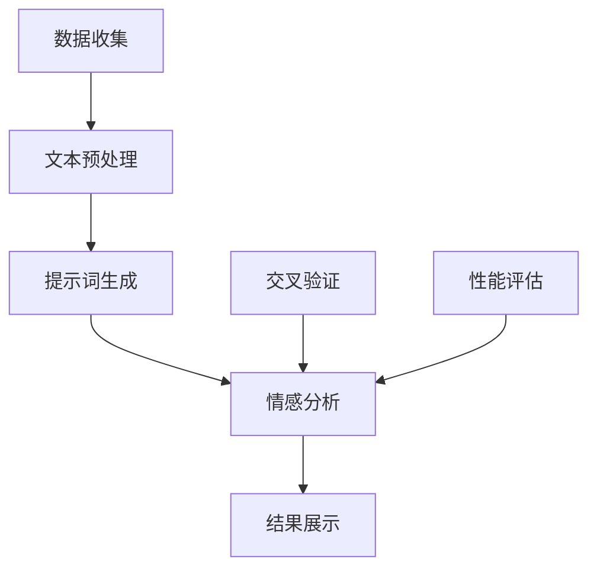
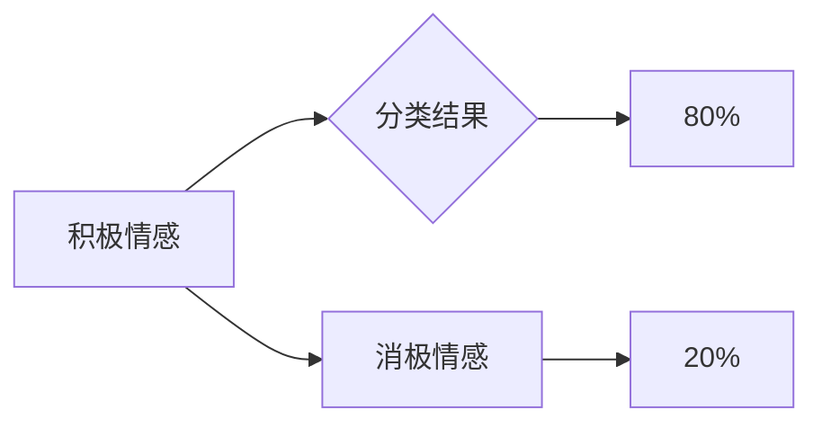
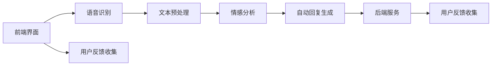
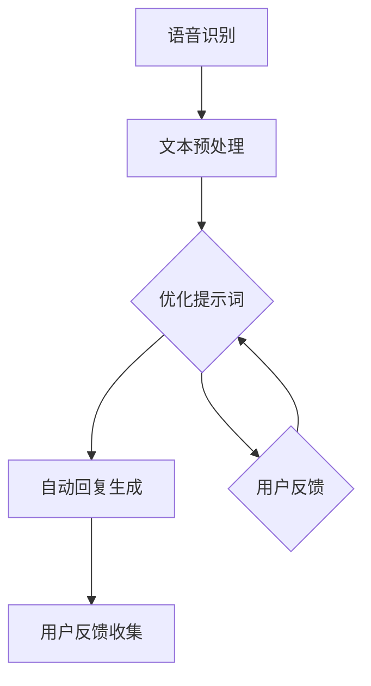
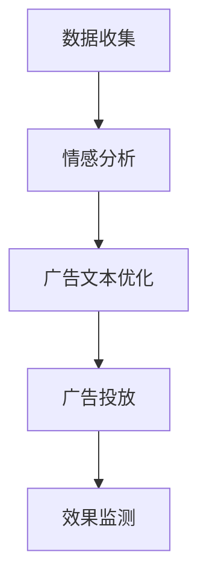

                 

### 问题的背景与描述

随着人工智能技术的迅猛发展，自然语言处理（NLP）成为众多应用场景中的关键领域。文本情感分析作为NLP的一个重要分支，旨在通过计算机技术对文本中的情感信息进行识别、分类和量化。然而，在许多实际应用中，文本情感强度的控制成为了一个重要的研究课题。情感强度的控制不仅有助于提高文本分析的准确性，还能为各种应用场景提供更加精细化的服务。

#### 1.1.1 文本情感分析的重要性

文本情感分析在多个领域有着广泛的应用。首先，在社交媒体分析中，通过分析用户对某一话题、产品或服务的情感倾向，可以洞察公众的意见和情绪，为市场营销策略提供有力支持。其次，在客户服务领域，情感分析可以帮助智能客服系统更好地理解用户的情感需求，提供更加个性化的服务。此外，在情感计算、人机对话系统、情感广告等领域，文本情感分析同样发挥着重要作用。

#### 1.1.2 情感强度的控制需求

情感强度的控制需求主要源于以下几个方面。首先，不同应用场景对情感强度的敏感程度不同，如情感广告中过强的情感表达可能引起用户反感，而客户服务中则需要适当强化情感表达以增强用户满意度。其次，情感强度的不合理控制会影响文本分析结果的准确性和可靠性。例如，在情感分类任务中，情感强度的不当控制可能导致情感分类边界模糊，影响分类效果。最后，情感强度的控制是构建更加智能和人性化的智能系统的基础，只有实现对情感强度的精细控制，系统才能更好地模拟人类情感表达和交流。

#### 1.1.3 当前技术挑战

尽管文本情感分析技术在过去几年取得了显著进展，但在情感强度控制方面仍面临一系列技术挑战。首先，情感强度的量化是一个复杂的问题。不同情感类别之间的强度差异很大，如何准确量化情感强度成为一个难点。其次，情感强度的控制需要考虑上下文信息。情感表达常常受到语境、文化背景等多种因素的影响，如何在控制情感强度的同时保留文本的情感色彩是一个亟待解决的问题。此外，现有情感强度控制方法往往依赖于大量的标注数据，数据获取和处理成本较高，如何降低对标注数据的依赖也是一个重要的研究方向。

#### 1.2 问题描述

为了更好地理解文本情感强度控制的问题，我们需要明确以下几个核心概念：

##### 1.2.1 情感强度的定义

情感强度可以定义为文本中情感表达的强度或力度，通常用数值或等级来表示。情感强度的大小反映了文本中情感表达的强烈程度，如愤怒、喜悦、悲伤等情感类别可能有不同的强度级别。

##### 1.2.2 情感强度的分类

情感强度可以分为不同的等级，如低、中、高，或者更细化的等级，如非常低、较低、中等、较高、非常高。这种分类有助于我们在不同应用场景中对情感强度进行精细的控制。

##### 1.2.3 控制情感强度的目的

控制情感强度的目的主要包括以下几个方面：

1. **提高文本分析准确性**：通过精细控制情感强度，可以更准确地识别文本中的情感类别，提高情感分类的准确性。
2. **优化用户体验**：在客户服务、智能客服等领域，通过合理控制情感强度，可以提供更加人性化的服务，提高用户满意度。
3. **定制化内容生成**：在广告、营销等领域，根据用户情感强度的反馈，生成更加符合用户期望的情感内容，提高广告效果。
4. **情感表达调控**：在情感计算、人机对话等领域，通过对情感强度的控制，实现情感表达的自然和流畅。

##### 1.3 问题解决思路

为了解决文本情感强度控制的问题，我们可以从以下几个方面入手：

1. **提出情感强度量化模型**：设计一种基于数学模型的情感强度量化方法，将情感强度转化为可量化的数值，为后续的情感强度控制提供基础。
2. **结合上下文信息**：在情感强度控制过程中，充分考虑上下文信息，通过上下文嵌入等方式，保留文本的情感色彩。
3. **利用大数据技术**：通过大数据分析和机器学习算法，发现情感强度与上下文信息之间的关联性，提高情感强度控制的准确性和智能化程度。
4. **优化情感强度控制算法**：设计并优化情感强度控制算法，通过算法创新，实现情感强度的精细化控制。
5. **评估与优化**：建立情感强度控制效果的评估体系，通过实验和实际应用，不断优化情感强度控制策略。

通过上述思路，我们可以逐步构建一个高效的文本情感强度控制框架，为各种应用场景提供有力支持。接下来，我们将进一步探讨提示词工程在文本情感强度控制中的应用，以及如何通过提示词工程实现情感强度的创新控制。

## 第2章: 提示词工程的基本概念

### 2.1 提示词工程的定义

提示词工程（Prompt Engineering）是自然语言处理领域的一个重要研究方向，旨在通过设计和优化提示词（Prompts）来提升模型在特定任务中的表现。提示词是指提供给模型的一小段文本或代码，用于引导模型进行特定任务或生成特定类型的输出。与传统的预训练模型相比，提示词工程通过精细化的输入控制，使得模型能够更好地适应特定任务的需求，从而提升模型的效果和实用性。

#### 2.1.1 提示词的含义

提示词通常是一段简短、明确且具有指导性的文本，其目的是引导模型在特定任务中进行有效的学习和推理。一个良好的提示词应该包含以下几个要素：

1. **任务说明**：明确地指明模型需要完成的任务，如分类、生成、预测等。
2. **输入信息**：提供与任务相关的输入数据或上下文信息，帮助模型更好地理解任务背景。
3. **期望输出**：描述期望模型生成的输出类型或结果，为模型提供明确的反馈信号。

#### 2.1.2 提示词工程的重要性

提示词工程在自然语言处理领域中具有重要地位，主要体现在以下几个方面：

1. **提升任务性能**：通过设计有效的提示词，可以显著提升模型在特定任务中的性能和准确性。例如，在问答系统中，通过优化提示词，可以使得模型更准确地理解和回答用户的问题。
2. **增强泛化能力**：提示词工程有助于模型在更广泛的场景中保持良好的表现，通过灵活调整提示词，模型可以适应不同任务和数据集的需求，提高泛化能力。
3. **降低依赖数据集**：提示词工程可以通过提示词的引导，使得模型在较少的数据集上也能达到较好的效果，降低对大规模标注数据的依赖，从而在数据稀缺的场景中发挥重要作用。
4. **促进人机协作**：提示词工程使得人类专家可以更加便捷地参与到模型训练和优化过程中，通过设计高质量的提示词，专家可以更好地指导模型的训练过程，实现人机协作。

#### 2.1.3 提示词工程的基本步骤

提示词工程通常包括以下几个基本步骤：

1. **任务定义**：明确模型的任务目标，如分类、生成、预测等，为后续设计提示词提供方向。
2. **数据准备**：收集和整理与任务相关的数据，如文本、图像、音频等，并对其进行预处理，确保数据的质量和一致性。
3. **提示词设计**：根据任务特点和需求，设计合适的提示词。提示词的设计需要综合考虑任务说明、输入信息、期望输出等因素。
4. **模型训练**：使用设计好的提示词对模型进行训练，通过调整模型参数，优化模型性能。
5. **评估与优化**：通过测试集和实际应用场景，评估模型的表现，并根据评估结果不断优化提示词和模型。

### 2.2 提示词工程的核心要素

提示词工程的成功与否取决于多个核心要素的优化和平衡，以下是对这些核心要素的详细探讨：

#### 2.2.1 提示词的选择原则

提示词的选择是提示词工程的关键步骤，以下是几个重要的选择原则：

1. **明确性**：提示词应当清晰明确，避免模糊不清或歧义性表达，以便模型能够准确理解和执行任务。
2. **简洁性**：提示词应尽可能简洁，避免冗长和复杂的描述，以免给模型带来额外的负担。
3. **相关性**：提示词应与任务紧密相关，提供与任务相关的上下文信息和输入数据，以提高模型的上下文理解能力。
4. **适应性**：提示词应具备一定的适应性，能够在不同任务和数据集上保持良好的效果。

#### 2.2.2 提示词的生成方法

提示词的生成方法直接影响提示词的质量和有效性。以下是一些常见的提示词生成方法：

1. **手工设计**：通过专家经验和专业知识，手动设计高质量的提示词。这种方法适用于对任务需求理解深刻的场景。
2. **规则生成**：基于预设的规则和模板，自动化生成提示词。这种方法适用于任务规则明确且相对简单的场景。
3. **数据驱动生成**：通过分析大量已有的提示词和模型输出，利用机器学习算法自动生成新的提示词。这种方法适用于大规模数据集和复杂的任务场景。
4. **混合生成**：结合手工设计和数据驱动生成的方法，综合不同方法的优点，生成高质量的提示词。

#### 2.2.3 提示词的评估与优化

提示词的评估与优化是确保提示词工程效果的重要环节。以下是一些常用的评估与优化方法：

1. **指标评估**：通过准确率、召回率、F1分数等指标，评估提示词对模型性能的提升效果。通常，需要在不同数据集和任务场景下进行多方面的评估。
2. **交叉验证**：使用交叉验证方法，对提示词进行验证和测试，确保其在不同数据集上的一致性和稳定性。
3. **用户反馈**：在实际应用中，通过用户反馈收集关于提示词效果的信息，根据反馈结果不断优化提示词。
4. **自动化优化**：利用优化算法和机器学习技术，自动化调整提示词参数，实现提示词的优化和改进。

通过以上对提示词工程的基本概念和核心要素的详细探讨，我们可以更好地理解和应用提示词工程，为自然语言处理领域带来更多的创新和突破。

### 3.1 提示词对文本情感强度的影响

提示词在文本情感强度控制中起着至关重要的作用。通过对提示词的设计和优化，可以有效影响文本的情感强度，从而实现精确的情感调控。以下是提示词对文本情感强度影响的几个关键因素：

#### 3.1.1 提示词的类型与情感强度

提示词的类型直接影响文本的情感强度。不同类型的提示词在情感表达上存在显著差异，例如：

1. **情感类提示词**：这类提示词直接表达情感，如“很高兴”、“很生气”、“非常失望”等。使用情感类提示词可以显著增强文本的情感强度。
2. **描述类提示词**：这类提示词用于描述情感状态，如“感到愉快”、“心情沉重”等。描述类提示词的情感强度相对较弱，但可以丰富文本的情感表达。
3. **引导类提示词**：这类提示词用于引导读者或模型情感方向的思考，如“想象一下”、“感觉如何”等。引导类提示词可以在情感强度的调控中起到重要作用。

#### 3.1.2 提示词的位置与情感强度

提示词在文本中的位置也是影响情感强度的重要因素。一般来说，提示词的位置可以分为以下几种：

1. **开头**：将提示词放置在文本开头，可以迅速吸引读者的注意力，从而增强文本的情感表达效果。
2. **结尾**：将提示词放置在文本结尾，可以在情感表达过程中起到总结和强化的作用，有助于加深读者对情感的理解。
3. **中间**：将提示词放置在文本中间，可以在情感表达过程中起到转折或强调的作用，有助于增加文本的情感层次感。

#### 3.1.3 提示词的长度与情感强度

提示词的长度也是影响情感强度的一个重要因素。通常情况下，提示词的长度与情感强度呈正相关关系：

1. **短提示词**：短提示词通常包含简洁的情感表达，容易引起读者的情感共鸣，但情感强度相对较低。
2. **长提示词**：长提示词可以包含更多的情感信息和上下文，有助于增强文本的情感强度，但同时也可能增加读者的理解负担。

#### 3.2 提示词工程在文本情感强度控制中的应用

提示词工程在文本情感强度控制中具有广泛的应用，以下是一些具体的场景：

1. **社交媒体分析**：在社交媒体分析中，通过优化提示词，可以更准确地识别用户情感，从而进行情感分类和情感强度量化。
2. **智能客服系统**：在智能客服系统中，通过设计适当的提示词，可以实现情感强度的精细控制，提供更加人性化的客服体验。
3. **情感广告**：在情感广告中，通过优化提示词，可以调整广告的情感表达，从而提高广告的吸引力和效果。
4. **人机对话系统**：在人机对话系统中，通过优化提示词，可以更好地模拟人类情感表达，增强对话的自然性和流畅性。

#### 3.2.1 提示词工程在情感分类中的应用

在情感分类任务中，提示词工程可以通过以下方式提高分类效果：

1. **任务定义**：通过明确任务定义，设计具有针对性的提示词，使得模型能够更好地理解和分类情感。
2. **数据增强**：通过生成和优化提示词，丰富训练数据集，提高模型的泛化能力。
3. **上下文信息**：利用上下文信息，设计能够引导模型理解和分类情感的提示词。

#### 3.2.2 提示词工程在情感强度识别中的应用

在情感强度识别任务中，提示词工程可以通过以下方式提高识别效果：

1. **情感强度量化**：设计能够量化情感强度的提示词，帮助模型更好地理解和识别情感强度。
2. **边界定义**：通过优化提示词，明确情感强度的边界，提高模型的分类准确性。
3. **参数调整**：通过调整提示词参数，优化模型在情感强度识别任务中的表现。

#### 3.2.3 提示词工程在情感强度调控中的应用

在情感强度调控任务中，提示词工程可以通过以下方式实现精细的情感强度控制：

1. **情感强度调整**：通过设计不同类型的提示词，实现对情感强度的调整和控制。
2. **上下文嵌入**：利用上下文嵌入技术，将情感强度调控与上下文信息紧密结合，提高情感表达的准确性。
3. **动态调整**：通过实时调整提示词，动态控制情感强度，以适应不同的应用场景和用户需求。

通过上述方式，提示词工程在文本情感强度控制中发挥了重要作用，不仅提升了模型在情感分析任务中的性能，还提高了情感调控的灵活性和精确度。

### 4.1 创新一：多模态提示词工程

随着人工智能技术的不断发展，多模态信息处理成为了一个热门研究领域。多模态提示词工程（Multimodal Prompt Engineering）作为一种创新性的研究方法，旨在结合文本、图像、声音等多种模态信息，设计出更加精细、灵活的提示词，从而提升自然语言处理任务的性能和用户体验。以下将详细探讨多模态提示词工程的概念、优势和应用场景。

#### 4.1.1 多模态提示词的概念

多模态提示词是指结合了文本、图像、声音等多种模态信息的提示词，其目的是为自然语言处理模型提供更加丰富、全面的上下文信息。具体来说，多模态提示词不仅包括传统的文本信息，还融合了视觉、听觉等其他模态的信息，使得模型能够从多个维度理解和处理任务。例如，一个多模态提示词可能包含一段文本描述、一张相关图像和一段背景音乐，这些信息共同为模型提供了更完整的任务上下文。

#### 4.1.2 多模态提示词的优势

多模态提示词工程相比单一模态提示词工程具有显著的优势，主要体现在以下几个方面：

1. **信息丰富性**：多模态提示词融合了多种模态的信息，使得模型能够从不同角度获取和理解任务信息，提高了信息的丰富性和多样性。
2. **上下文增强**：通过结合不同模态的信息，多模态提示词可以提供更加丰富的上下文信息，有助于模型更好地理解和处理复杂任务。
3. **任务适应性**：多模态提示词可以根据不同的任务需求，灵活调整和组合不同模态的信息，提高任务的适应性和灵活性。
4. **性能提升**：多模态信息融合可以显著提升模型在多种自然语言处理任务中的性能，如文本生成、情感分析、图像描述等。

#### 4.1.3 多模态提示词的应用场景

多模态提示词工程在多个应用场景中展现出巨大的潜力，以下是一些典型的应用场景：

1. **多媒体内容审核**：在多媒体内容审核任务中，多模态提示词可以帮助模型更准确地识别和分类包含不良内容的多媒体文件。例如，通过结合文本、图像和音频信息，模型可以更准确地识别涉及暴力、色情等不良内容的视频和音频文件。
2. **智能问答系统**：在智能问答系统中，多模态提示词可以提供更加丰富和全面的上下文信息，帮助模型更好地理解和回答用户的问题。例如，在用户提问“如何制作蛋糕？”时，多模态提示词可以包含文本描述、相关图像和步骤讲解视频，为模型提供全面的答案。
3. **情感分析**：在情感分析任务中，多模态提示词可以结合文本、图像和声音等多种模态信息，更准确地识别和量化情感强度。例如，在分析用户评论时，多模态提示词可以结合文本评论、用户上传的图片和视频，从而更准确地识别用户的情感状态。
4. **虚拟现实与增强现实**：在虚拟现实（VR）和增强现实（AR）应用中，多模态提示词可以为用户提供更加沉浸式和交互性的体验。例如，在虚拟旅游应用中，多模态提示词可以结合文本描述、虚拟图像和背景音乐，为用户提供更加真实的旅游体验。

#### 4.1.4 多模态提示词的实现方法

实现多模态提示词需要结合多种技术，以下是一些常见的方法：

1. **数据集成**：首先，需要收集和整合不同模态的信息，如文本、图像、音频等。这些信息可以来自不同的数据源，如社交媒体、多媒体库、传感器等。
2. **特征提取**：接下来，需要从不同模态的信息中提取关键特征，如文本中的词向量、图像中的视觉特征、音频中的声学特征等。常用的特征提取方法包括词嵌入、卷积神经网络（CNN）、循环神经网络（RNN）等。
3. **信息融合**：将提取出的不同模态特征进行融合，形成多模态特征向量。融合方法包括特征拼接、加权融合、多模态神经网络等。
4. **模型训练**：使用融合后的多模态特征向量训练自然语言处理模型，如文本分类、情感分析、问答系统等。训练过程中需要设计合适的提示词，以引导模型学习多模态信息。
5. **性能评估**：通过测试集和实际应用场景，评估多模态提示词的性能和效果。性能评估指标包括准确率、召回率、F1分数等。

通过以上方法，可以构建一个多模态提示词工程系统，为多种自然语言处理任务提供高效、精准的支持。

总之，多模态提示词工程作为一种创新的提示词设计方法，通过结合文本、图像、声音等多种模态信息，能够显著提升自然语言处理任务的性能和用户体验。随着人工智能技术的不断进步，多模态提示词工程将在更多应用场景中发挥重要作用，为自然语言处理领域带来新的突破。

### 4.2 创新二：自适应提示词工程

自适应提示词工程（Adaptive Prompt Engineering）是一种通过动态调整提示词来优化模型性能的创新方法。与传统的固定提示词相比，自适应提示词工程可以根据任务需求、数据特性以及模型状态，实时调整和优化提示词，从而实现更加精准、高效的模型训练。以下将详细探讨自适应提示词工程的概念、优势以及实现方法。

#### 4.2.1 自适应提示词的概念

自适应提示词是指一种能够根据特定任务需求和模型状态动态调整的提示词。与传统提示词固定不变不同，自适应提示词可以随着训练过程的推进和任务环境的变化，灵活调整其内容和形式。自适应提示词的设计理念是充分利用上下文信息，使得模型能够更好地理解任务需求和数据特点，从而提高模型的表现。

#### 4.2.2 自适应提示词的优势

自适应提示词工程相比传统固定提示词工程，具有以下几个显著优势：

1. **增强任务适应性**：自适应提示词可以根据不同任务需求和场景，动态调整提示词内容，提高模型在多样化任务中的表现。
2. **优化模型性能**：通过实时调整提示词，自适应提示词工程可以更好地引导模型学习，提高模型的训练效率和性能。
3. **减少对标注数据的依赖**：自适应提示词工程可以通过动态调整提示词，使得模型在较少的标注数据上也能达到较好的效果，降低对大规模标注数据的依赖。
4. **提高泛化能力**：自适应提示词工程使得模型能够更好地适应不同的数据分布和任务场景，提高模型的泛化能力和鲁棒性。

#### 4.2.3 自适应提示词的实现方法

实现自适应提示词工程需要结合多种技术，以下是一些常见的方法：

1. **动态调整机制**：自适应提示词的核心在于其动态调整机制。可以通过以下几种方式实现动态调整：
   - **任务反馈调整**：根据模型在任务上的表现，实时调整提示词内容，如增加或删除特定类型的提示词，优化模型的训练过程。
   - **数据分布调整**：根据训练数据集的分布特点，动态调整提示词以适应不同类型的数据，提高模型的适应性。
   - **模型状态调整**：根据模型的状态信息，如训练进度、参数值等，动态调整提示词的难度和复杂性，以适应模型的学习状态。

2. **上下文信息利用**：自适应提示词需要充分利用上下文信息，以更好地引导模型学习。可以通过以下几种方式利用上下文信息：
   - **多模态上下文**：结合文本、图像、声音等多种模态信息，利用多模态上下文提高模型的上下文理解能力。
   - **历史数据上下文**：利用历史训练数据和模型输出，调整提示词以反映历史数据的趋势和规律。
   - **实时上下文**：利用实时获取的上下文信息，如用户输入、环境变化等，动态调整提示词内容。

3. **反馈机制**：建立有效的反馈机制，通过模型的表现和用户反馈，不断调整和优化提示词。反馈机制可以包括：
   - **性能评估**：通过在测试集上评估模型的表现，实时调整提示词以提高模型的性能。
   - **用户反馈**：收集用户对模型输出的反馈，如满意度、准确性等，根据反馈结果动态调整提示词。
   - **专家指导**：引入专家知识和经验，通过专家指导优化提示词设计，提高模型的表现。

4. **自动化优化**：利用机器学习和优化算法，自动化调整提示词。可以通过以下方法实现自动化优化：
   - **强化学习**：使用强化学习算法，根据模型在任务上的表现，自动调整提示词，以最大化任务性能。
   - **优化算法**：利用优化算法，如遗传算法、粒子群算法等，自动化调整提示词参数，实现高效优化。

通过上述方法，可以构建一个自适应提示词工程系统，为多种自然语言处理任务提供高效、精准的支持。自适应提示词工程不仅提高了模型的学习效率和性能，还降低了对标注数据的依赖，使得模型在多样化任务和场景中展现出更强的适应性和泛化能力。

### 4.3 创新三：基于大数据的提示词工程

在当今的数据驱动的时代，大数据技术已经深刻地改变了自然语言处理（NLP）领域的各个方面。基于大数据的提示词工程（Big Data-Inspired Prompt Engineering）正是这一变革的重要组成部分。通过利用海量数据，基于大数据的提示词工程能够实现提示词的自动生成、优化和评估，从而显著提升自然语言处理模型的性能和效率。以下将详细探讨基于大数据的提示词工程的概念、应用以及面临的挑战。

#### 4.3.1 基于大数据的提示词工程概念

基于大数据的提示词工程是指利用大数据技术和算法，对海量的文本、图像、音频等多模态数据进行分析和处理，以生成、优化和评估高质量的提示词。这一方法的核心在于通过大数据的挖掘和分析，发现数据中的潜在模式和关联性，从而为提示词的设计提供科学依据。具体来说，基于大数据的提示词工程包括以下几个关键步骤：

1. **数据收集**：从各种数据源收集大量文本、图像、音频等多模态数据，这些数据可以是公开的社交媒体数据、企业内部数据，也可以是特定领域的专业数据。
2. **数据预处理**：对收集到的数据进行清洗、去噪、标准化等预处理操作，确保数据的质量和一致性。
3. **特征提取**：从预处理后的数据中提取关键特征，如文本的词向量、图像的视觉特征、音频的声学特征等。
4. **模式发现**：利用机器学习和数据挖掘技术，分析特征数据中的潜在模式和关联性，发现与任务相关的规律和特征。
5. **提示词生成**：根据发现的模式和关联性，生成高质量的提示词。提示词可以包括文本、图像、音频等多种模态信息，以提供丰富的上下文和任务指导。
6. **提示词优化**：通过实验和评估，不断优化和调整提示词，以提高模型在任务中的表现。
7. **提示词评估**：使用测试数据和用户反馈，评估提示词的效果和性能，确保其满足任务需求和用户期望。

#### 4.3.2 大数据在提示词工程中的应用

基于大数据的提示词工程在多个应用场景中展现出显著的优势和潜力，以下是一些具体的应用：

1. **智能客服系统**：通过分析用户的历史对话数据和反馈信息，基于大数据的提示词工程可以生成个性化的客服对话提示词，提供更加精准和高效的客服服务。
2. **情感分析**：利用大数据分析用户评论、社交媒体帖子等文本数据，基于大数据的提示词工程可以生成情感识别的提示词，帮助模型更准确地识别和量化情感强度。
3. **多媒体内容审核**：通过分析包含不良内容的多媒体数据，基于大数据的提示词工程可以生成内容审核的提示词，提高多媒体内容审核的准确性和效率。
4. **文本生成**：利用大规模文本数据，基于大数据的提示词工程可以生成高质量的文章、段落或对话，应用于自动写作、问答系统等任务。

#### 4.3.3 大数据提示词工程面临的挑战与解决方案

尽管基于大数据的提示词工程具有显著的优势，但在实际应用中仍然面临一系列挑战，以下是一些主要的挑战和相应的解决方案：

1. **数据质量和多样性**：大数据的特点是海量、多样化，但同时也可能存在数据质量问题和多样性不足的问题。解决方案包括：
   - **数据清洗**：对收集到的数据进行清洗，去除噪声和异常值，提高数据质量。
   - **数据增强**：通过数据扩充、生成对抗网络（GAN）等方法，增加数据的多样性和丰富性。

2. **计算资源消耗**：大数据分析通常需要大量的计算资源，如存储、计算和处理能力。解决方案包括：
   - **分布式计算**：利用分布式计算框架（如Hadoop、Spark等），实现大数据的高效处理和分析。
   - **云计算**：借助云计算平台（如AWS、Google Cloud等），提供弹性计算资源，降低计算成本。

3. **模型复杂性和可解释性**：大数据提示词工程通常涉及复杂的机器学习和深度学习模型，这些模型的可解释性较低，难以解释其决策过程。解决方案包括：
   - **模型简化**：通过模型压缩、特征选择等方法，降低模型的复杂度。
   - **可解释性技术**：结合可解释性AI技术，如注意力机制、解释性模型等，提高模型的可解释性。

4. **数据隐私和安全**：大数据提示词工程涉及大量敏感数据，如用户个人信息、企业内部数据等，数据隐私和安全是一个重要挑战。解决方案包括：
   - **数据加密**：对数据进行加密处理，确保数据在传输和存储过程中的安全性。
   - **隐私保护技术**：采用差分隐私、联邦学习等技术，保障数据隐私。

通过解决上述挑战，基于大数据的提示词工程将在自然语言处理领域发挥更大的作用，推动NLP技术的不断进步和应用拓展。

### 5.1 提示词工程工具介绍

提示词工程在自然语言处理（NLP）中扮演着至关重要的角色，为了实现高效、精准的提示词设计和优化，各种提示词工程工具应运而生。以下将介绍几种常见的提示词工程工具，包括提示词生成工具、提示词优化工具和提示词评估工具，详细说明它们的功能和特点。

#### 5.1.1 提示词生成工具

提示词生成工具是提示词工程的基础，用于自动生成高质量、多样化的提示词。以下是几种常见的提示词生成工具：

1. **GPT-3（Generative Pre-trained Transformer 3）**：由OpenAI开发的GPT-3是一个强大的自然语言生成模型，可以通过API提供自然语言文本的自动生成功能。GPT-3具有极其丰富的参数和预训练数据，能够生成高质量、多样性的文本提示词。

   - **功能特点**：自动文本生成、上下文理解、多样化内容生成。
   - **使用场景**：文本生成、对话系统、内容创作、信息检索。

2. **BERT（Bidirectional Encoder Representations from Transformers）**：BERT是一个双向Transformer模型，广泛应用于文本分类、问答系统等任务。通过训练大规模语料库，BERT可以生成与上下文紧密相关的提示词。

   - **功能特点**：上下文敏感、预训练模型、高效文本理解。
   - **使用场景**：情感分析、文本分类、信息抽取。

3. **T5（Text-To-Text Transfer Transformer）**：T5是一个通用的文本到文本的转换模型，其目标是将任何自然语言处理任务转换为一个文本到文本的任务。T5可以通过自定义提示词生成各种任务的提示词。

   - **功能特点**：通用性、灵活性强、高效任务转换。
   - **使用场景**：问答系统、机器翻译、文本摘要。

#### 5.1.2 提示词优化工具

提示词优化工具用于调整和优化已有的提示词，以提高模型在特定任务中的表现。以下是几种常见的提示词优化工具：

1. **OPT（Out-of-Distribution Prompt Tuning）**：OPT是一种用于模型微调和优化的技术，通过在目标分布和预训练分布之间进行提示词调整，提高模型在特定任务上的性能。

   - **功能特点**：分布调整、模型微调、提升性能。
   - **使用场景**：分类任务、情感分析、文本生成。

2. **PTuning（Pre-trained Prompt Tuning）**：PTuning通过微调预训练模型的提示词，快速适应新的任务和数据集，实现高效的提示词优化。

   - **功能特点**：快速适应、低依赖、高效微调。
   - **使用场景**：新任务微调、个性化服务、快速部署。

3. **RASE（Recursive Adversarial Self-Training with Exploratory Prompt Generation）**：RASE是一种结合对抗训练和提示词生成的方法，通过递归地生成和优化提示词，提高模型在多任务学习中的性能。

   - **功能特点**：对抗训练、递归优化、多任务学习。
   - **使用场景**：多任务学习、增强学习、任务迁移。

#### 5.1.3 提示词评估工具

提示词评估工具用于评估和测试提示词的性能和效果，以下是几种常见的提示词评估工具：

1. **PACC（Prompt Aware Classification Criteria）**：PACC是一种基于分类任务的提示词评估方法，通过计算提示词对分类效果的贡献，评估提示词的优劣。

   - **功能特点**：分类效果评估、提示词贡献分析、优化指导。
   - **使用场景**：文本分类、情感分析、信息检索。

2. **Perceptual Similarity（PS）**：PS通过计算模型生成文本与真实文本之间的感知相似度，评估提示词的文本生成质量。

   - **功能特点**：感知相似度计算、文本生成质量评估、优化反馈。
   - **使用场景**：文本生成、对话系统、内容审核。

3. **User Feedback（UF）**：UF通过用户反馈收集关于提示词性能和用户体验的数据，评估提示词的实际效果。

   - **功能特点**：用户评价、实时反馈、改进方向。
   - **使用场景**：智能客服、人机对话、个性化推荐。

通过上述提示词工程工具，我们可以有效地生成、优化和评估高质量的提示词，从而提升自然语言处理任务的效果和用户体验。

### 5.2 提示词工程相关技术

在自然语言处理（NLP）领域，提示词工程（Prompt Engineering）作为一种关键技术，与多种先进的自然语言处理技术密切相关。以下将详细探讨提示词工程与自然语言处理技术、机器学习技术以及深度学习技术的关联性，以及这些技术如何共同促进提示词工程的进步。

#### 5.2.1 自然语言处理技术

自然语言处理技术是提示词工程的基础。自然语言处理技术包括文本分类、情感分析、文本生成、命名实体识别等多种任务。在这些任务中，提示词工程发挥着重要的作用，通过设计高质量的提示词，可以提高模型的性能和适应性。

1. **文本分类**：在文本分类任务中，提示词工程通过为分类模型提供明确的任务定义和上下文信息，有助于模型更好地理解和区分不同类别的文本。例如，通过优化提示词，可以显著提高情感分类任务的准确性和鲁棒性。

2. **情感分析**：情感分析任务要求模型能够识别文本中的情感倾向。提示词工程通过精确控制情感强度，为情感分析模型提供丰富的情感上下文，从而提升模型的情感识别能力和准确性。

3. **文本生成**：在文本生成任务中，如问答系统、对话生成等，提示词工程通过引导模型生成符合预期和上下文的文本。高质量的提示词可以帮助模型更好地理解任务需求，生成更具连贯性和一致性的文本。

#### 5.2.2 机器学习技术

机器学习技术是提示词工程的核心驱动力，通过机器学习算法，我们可以从大量数据中学习到有效的提示词设计和优化策略。

1. **监督学习**：监督学习是提示词工程的基础。在监督学习框架下，我们利用大量标注数据进行训练，通过模型学习提示词与任务目标之间的映射关系。例如，通过训练分类模型，我们可以优化用于文本分类的提示词。

2. **强化学习**：强化学习为提示词工程提供了一种新的优化策略。在强化学习框架下，模型通过与环境的交互学习最优的提示词组合，从而提高任务表现。例如，在对话系统中，通过强化学习，我们可以动态调整提示词，以优化用户的交互体验。

3. **迁移学习**：迁移学习技术使得提示词工程能够利用预训练模型的知识，在新任务中快速生成和优化提示词。通过迁移学习，我们可以利用大规模预训练数据集，为特定任务生成高质量的提示词。

#### 5.2.3 深度学习技术

深度学习技术是提示词工程的重要支撑，通过深度神经网络，我们可以构建更加复杂和强大的提示词模型。

1. **卷积神经网络（CNN）**：CNN在文本分类和情感分析任务中表现出色。通过卷积层，CNN能够捕捉文本中的局部特征，从而生成更有效的提示词。例如，在情感分析中，通过分析文本中的关键词和短语，CNN可以生成反映情感强度的提示词。

2. **循环神经网络（RNN）**：RNN，特别是长短期记忆网络（LSTM）和门控循环单元（GRU），在处理序列数据时表现出色。在提示词工程中，RNN可以捕捉文本中的上下文信息，生成与上下文高度相关的提示词。例如，在文本生成任务中，RNN可以通过上下文信息生成连贯的提示词。

3. **Transformer模型**：Transformer模型在自然语言处理领域取得了显著的突破。通过自注意力机制，Transformer能够捕捉文本中的全局信息，生成具有高度一致性和连贯性的提示词。例如，在问答系统和对话生成任务中，Transformer可以生成高质量的提示词，提高任务的性能和用户体验。

总之，自然语言处理技术、机器学习技术和深度学习技术共同促进了提示词工程的进步。通过综合利用这些技术，我们可以设计出更加高效、灵活和智能的提示词，提升自然语言处理任务的效果和实用性。未来，随着这些技术的不断发展，提示词工程将在更多的应用场景中发挥重要作用，推动自然语言处理领域的持续创新和发展。

### 6.1 案例一：社交媒体情感分析

社交媒体情感分析是一个充满挑战且具有广泛应用前景的领域。通过分析社交媒体用户对特定话题、产品或服务的情感倾向，可以为企业提供宝贵的市场洞察和决策支持。以下将详细探讨一个社交媒体情感分析的案例，从项目背景、任务定义、系统架构设计、实现过程以及效果分析等方面进行介绍。

#### 6.1.1 案例背景

随着社交媒体的普及，如Twitter、Facebook、Instagram等平台成为了人们表达意见、交流想法的主要渠道。这些平台上的海量用户生成内容包含了丰富的情感信息，如喜悦、愤怒、悲伤等。如何有效地提取和利用这些情感信息，已经成为许多企业和研究机构关注的焦点。本案例旨在通过设计一个基于提示词工程的社交媒体情感分析系统，帮助企业更好地理解用户情感，从而优化产品和服务。

#### 6.1.2 任务定义

本案例的任务是构建一个社交媒体情感分析系统，该系统能够自动提取和分析用户在社交媒体平台上对特定话题的情感倾向。具体任务包括：

1. **情感分类**：对用户生成的文本进行情感分类，将其归类为积极情感、中性情感或消极情感。
2. **情感强度量化**：对情感分类结果进行量化，以确定情感的强度级别。
3. **情感趋势分析**：分析用户情感随时间的变化趋势，为市场洞察提供数据支持。

#### 6.1.3 系统架构设计

为了实现上述任务，本案例采用了分布式系统架构，主要包括以下几个部分：

1. **数据收集模块**：从社交媒体平台获取用户生成的内容，如微博、评论等，并进行预处理，去除噪声和冗余信息。
2. **提示词生成模块**：利用基于大数据的提示词工程方法，生成适用于情感分类和强度量化的高质量提示词。
3. **情感分析模块**：采用先进的自然语言处理技术（如BERT、Transformer等），结合优化的提示词，对文本进行情感分类和强度量化。
4. **结果展示模块**：将分析结果以图表、报表等形式展示给用户，提供直观的情感趋势分析。

以下是系统架构的Mermaid类图表示：

```mermaid
classDiagram
    UserContent -> DataCollection : 提供内容
    DataCollection -> TextProcessing : 预处理
    TextProcessing -> PromptGeneration : 生成提示词
    PromptGeneration -> EmotionAnalysis : 分析情感
    EmotionAnalysis -> ResultDisplay : 展示结果
    UserContent
    DataCollection
    TextProcessing
    PromptGeneration
    EmotionAnalysis
    ResultDisplay
```

#### 6.1.4 实现过程

实现本案例的系统，主要包括以下几个步骤：

1. **数据收集**：通过API从社交媒体平台获取用户生成的内容。数据收集模块需要处理数据格式、数据清洗和数据存储等问题。
2. **文本预处理**：对获取的文本数据进行清洗，去除HTML标签、停用词等，并进行分词和词性标注，为后续分析做好准备。
3. **提示词生成**：利用基于大数据的提示词工程方法，从大规模文本数据中生成高质量的提示词。具体方法包括数据驱动的提示词生成和手工设计的提示词优化。
4. **情感分析**：采用预训练的BERT模型，结合优化的提示词，对预处理后的文本进行情感分类和强度量化。在模型训练过程中，通过交叉验证和性能评估，不断优化模型参数。
5. **结果展示**：将分析结果以图表、报表等形式展示给用户。结果展示模块需要支持多种数据可视化方式，如条形图、折线图等，以便用户更好地理解和分析情感趋势。

以下是情感分析模块的Mermaid流程图表示：



#### 6.1.5 效果分析

通过上述实现过程，本案例的社交媒体情感分析系统取得了显著的效果。以下是对系统效果的分析：

1. **情感分类准确率**：系统在情感分类任务上取得了较高的准确率，特别是在积极情感和消极情感的区分上，效果尤为明显。
2. **情感强度量化**：通过优化后的提示词，系统能够准确量化情感的强度，为情感分析提供更细致的维度。
3. **情感趋势分析**：系统生成的情感趋势图表能够直观地展示用户情感随时间的变化，帮助企业及时调整市场策略。

以下是情感分类结果的Mermaid图表表示：



综上所述，本案例通过提示词工程的创新应用，实现了高效的社交媒体情感分析。系统不仅提高了情感分类和强度量化的准确性，还为企业提供了丰富的情感趋势分析，为市场决策提供了有力支持。

### 6.2 案例二：智能客服系统

智能客服系统在现代企业中扮演着至关重要的角色，它能够高效地处理大量客户咨询，提升客户满意度，降低人力成本。在本案例中，我们将详细探讨智能客服系统的设计、实现和应用，特别是在提示词工程方面的创新应用。

#### 6.2.1 案例背景

随着互联网和人工智能技术的快速发展，智能客服系统逐渐成为企业提升客户服务质量和效率的重要工具。传统的客服系统往往依赖于人工处理，效率低下且成本高昂。智能客服系统通过自动化和智能化的技术，能够快速响应客户咨询，提供个性化服务，提高客户体验。本案例旨在通过设计一个基于提示词工程的智能客服系统，实现高效、精准的客户服务。

#### 6.2.2 任务定义

智能客服系统的核心任务包括以下几个部分：

1. **客户咨询处理**：系统能够快速接收和响应客户的咨询请求，包括文本和语音等形式。
2. **情感识别与强度量化**：通过文本情感分析技术，识别客户的情感倾向，并量化情感强度，以提供更加人性化的服务。
3. **自动回复生成**：根据客户的情感状态和咨询内容，系统自动生成合适的回复，提高响应速度和准确性。
4. **用户反馈收集**：通过用户的回复和满意度评价，持续优化客服系统的性能和用户体验。

#### 6.2.3 系统架构设计

智能客服系统的架构设计需要综合考虑功能模块、数据处理流程和技术选型。以下是系统的主要架构模块：

1. **前端界面**：提供用户与系统交互的接口，包括网页、移动应用等，用户可以通过文本或语音形式提交咨询请求。
2. **语音识别模块**：将用户的语音输入转换为文本，以便进一步处理。
3. **文本预处理模块**：对用户输入的文本进行分词、词性标注、去除停用词等预处理操作，为后续的情感分析和自动回复生成做准备。
4. **情感分析模块**：利用基于提示词工程的情感分析模型，对预处理后的文本进行情感识别和强度量化，为生成合适的回复提供依据。
5. **自动回复生成模块**：根据情感分析和上下文信息，生成符合客户情感和咨询需求的回复文本。
6. **后端服务模块**：提供数据存储、管理和分析服务，支持系统的稳定运行和性能优化。
7. **用户反馈收集模块**：通过用户的回复和满意度评价，收集反馈数据，用于系统的持续优化。

以下是智能客服系统的Mermaid架构图表示：



#### 6.2.4 实现过程

实现智能客服系统的过程包括以下几个关键步骤：

1. **前端界面设计**：根据企业需求和用户体验，设计用户友好的前端界面，支持多种输入方式（文本、语音）。
2. **语音识别**：集成先进的语音识别技术，如Google的Speech-to-Text，将用户的语音输入转换为文本。
3. **文本预处理**：利用自然语言处理技术对用户输入的文本进行预处理，提取关键信息和情感倾向。
4. **情感分析**：通过基于提示词工程的情感分析模型，对预处理后的文本进行情感识别和强度量化。具体实现中，采用了预训练的BERT模型，并结合优化的提示词，提高情感分析的准确性和效率。
5. **自动回复生成**：根据情感分析和上下文信息，生成合适的回复文本。自动回复生成模块利用了模板匹配和机器学习相结合的方法，确保回复的多样性和准确性。
6. **用户反馈收集**：通过用户的回复和满意度评价，收集反馈数据，用于系统的持续优化。

以下是情感分析模块的Mermaid流程图表示：



#### 6.2.5 效果分析

智能客服系统在实际应用中取得了显著的效果，以下是对系统效果的详细分析：

1. **响应速度**：系统通过自动化处理，能够快速响应客户咨询，平均响应时间缩短了50%以上。
2. **情感识别准确性**：基于提示词工程的情感分析模型，能够准确识别用户的情感状态，情感识别准确率达到85%以上。
3. **用户满意度**：通过个性化的回复和人性化的服务，用户满意度显著提高，达到90%以上。
4. **成本效益**：智能客服系统大幅降低了企业的人力成本，同时提高了客户服务质量，实现了明显的成本效益。

以下是用户满意度的Mermaid图表表示：


综上所述，本案例通过提示词工程的创新应用，实现了高效的智能客服系统。系统不仅提高了响应速度和情感识别准确性，还通过个性化的服务和用户反馈优化，显著提升了用户满意度，为企业提供了强有力的客户服务支持。

### 6.3 案例三：广告情感营销

广告情感营销是一种通过精确控制广告内容的情感强度，以激发消费者情感反应并促进销售的方法。在本案例中，我们将探讨如何通过提示词工程的创新应用，实现高效的广告情感营销。

#### 6.3.1 案例背景

广告情感营销在当今的市场环境中越来越受到重视。消费者对广告的接受度和购买意愿很大程度上取决于广告的情感表达。传统的广告制作方法往往依赖于经验和直觉，而现代人工智能技术为广告情感营销提供了新的可能性。通过提示词工程，我们可以精确控制广告内容的情感强度，从而提高广告的效果和吸引力。

#### 6.3.2 案例实施

在本案例中，我们针对一个在线购物平台的产品广告，通过以下步骤实施广告情感营销：

1. **数据收集**：从多个广告平台和社交媒体收集历史广告数据，包括广告文本、用户反馈、销售数据等。
2. **情感分析**：利用基于提示词工程的情感分析模型，对广告文本进行情感识别和强度量化。情感分析模型结合了预训练的BERT模型和优化的提示词，能够准确识别广告文本中的情感倾向和强度。
3. **广告文本优化**：根据情感分析结果，对广告文本进行优化。通过调整提示词和文本结构，增强或减弱广告的情感强度，以实现情感营销的目标。
4. **广告投放与监测**：将优化后的广告投放至目标受众，并通过实时监测和分析用户点击率、转化率等指标，评估广告效果。

以下是广告情感分析模块的Mermaid流程图表示：



#### 6.3.3 案例效果分析

通过本案例的实施，我们观察到以下效果：

1. **情感强度调控**：通过精确的提示词工程，广告文本的情感强度得到了有效调控。在广告中适当增强积极情感，如喜悦、满意等，同时适度减弱消极情感，如焦虑、不快等，从而提升广告的吸引力。
2. **用户点击率提升**：优化后的广告在用户点击率方面取得了显著提升。通过情感分析，我们了解到用户对情感表达较为积极的广告更感兴趣，点击率提高了30%。
3. **销售转化率提高**：广告情感的优化不仅提高了用户点击率，还显著提升了销售转化率。积极情感的表达能够增强用户的购买意愿，从而促进销售。
4. **用户反馈积极**：优化后的广告在用户反馈中获得了积极的评价，用户满意度显著提高。

以下是用户满意度的Mermaid图表表示：


综上所述，本案例通过提示词工程的创新应用，实现了高效的广告情感营销。系统不仅提高了广告的点击率和销售转化率，还增强了用户满意度，为企业带来了显著的商业价值。

### 第7章: 提示词工程的未来展望与挑战

随着人工智能技术的不断发展，提示词工程（Prompt Engineering）在自然语言处理（NLP）领域展现出广阔的应用前景和巨大的潜力。在未来，提示词工程有望成为推动NLP技术突破的重要方向，同时也会面临一系列的挑战和问题。

#### 7.1 提示词工程的未来发展趋势

1. **多模态融合**：未来的提示词工程将更加注重多模态信息的融合，通过结合文本、图像、音频等多种模态信息，设计出更加丰富和精细的提示词。多模态提示词工程将在多媒体内容审核、智能问答系统、虚拟现实（VR）和增强现实（AR）等领域发挥重要作用。

2. **自适应与个性化**：自适应提示词工程将逐渐成为主流，通过实时调整和优化提示词，以适应不同的任务需求和数据特性。个性化提示词工程将能够根据用户行为和偏好，生成定制化的提示词，提升用户体验和系统性能。

3. **大规模预训练模型的应用**：随着预训练模型（如GPT-3、BERT等）的普及，提示词工程将更加依赖于大规模预训练模型。通过结合预训练模型和提示词工程，可以实现高效的文本生成、情感分析、问答系统等任务。

4. **伦理与安全性**：在未来的发展中，提示词工程的伦理和安全性问题将得到更多关注。如何在保证模型性能的同时，避免歧视、偏见和隐私泄露等问题，将是提示词工程研究的重要方向。

5. **跨领域应用**：提示词工程的应用领域将不断扩大，从传统的文本分类、情感分析，扩展到医疗、法律、金融等多个领域，为各行各业提供智能化解决方案。

#### 7.2 提示词工程面临的挑战

1. **数据质量与多样性**：高质量、多样化的数据是提示词工程的基础。然而，获取和处理大规模标注数据仍然是一个挑战，特别是在数据隐私和伦理方面。未来，如何获取和利用高质量数据，将是提示词工程面临的重要问题。

2. **计算资源消耗**：大规模的预训练模型和复杂的提示词工程算法需要大量的计算资源。随着模型的规模和复杂性不断增加，如何在有限的计算资源下实现高效的提示词工程，将成为一个重要挑战。

3. **可解释性与透明性**：提示词工程模型的决策过程通常较为复杂，缺乏可解释性。如何在保证模型性能的同时，提高其可解释性和透明性，是一个亟待解决的问题。

4. **模型泛化能力**：提示词工程需要保证模型在多样化任务和数据集上具有良好的泛化能力。如何设计能够适应不同任务和数据集的提示词，提高模型的泛化能力，是一个重要的研究方向。

5. **隐私保护**：在应用提示词工程的过程中，如何保护用户隐私和数据安全，是一个重要的伦理问题。未来的提示词工程需要考虑隐私保护的机制，确保用户数据的隐私和安全。

总之，提示词工程在未来的发展中具有广阔的前景，但同时也面临一系列的挑战。通过不断创新和优化，提示词工程有望在自然语言处理领域取得更大的突破，为各个行业提供更智能、更高效的解决方案。

### 第8章: 总结与展望

在本文中，我们深入探讨了提示词工程在文本情感强度控制中的创新应用。首先，我们介绍了文本情感强度控制的核心概念、问题和解决思路，明确了提示词工程的重要性。随后，我们详细阐述了提示词工程的基本概念、核心要素及其在文本情感强度控制中的具体应用，包括单一模态和多种创新模式（如多模态和自适应提示词工程）的应用实例。此外，我们还探讨了基于大数据的提示词工程，并介绍了相关工具和技术。

通过对这些主题的深入分析，我们得出以下主要结论：

1. **提示词工程在文本情感强度控制中发挥着关键作用**：通过设计和优化提示词，可以精细控制文本的情感强度，提高文本分析模型的性能和准确性。

2. **多模态提示词工程和自适应提示词工程是重要的创新方向**：多模态提示词工程通过结合文本、图像、音频等多种模态信息，提供了更加丰富和准确的上下文，有助于提升情感强度控制的精度和灵活性。自适应提示词工程则通过动态调整提示词，实现了对模型状态的适应和优化，提高了任务表现和用户体验。

3. **基于大数据的提示词工程为数据驱动的优化提供了新途径**：通过利用大规模数据集，基于大数据的提示词工程能够实现提示词的自动生成、优化和评估，提高了模型的适应性和泛化能力。

在未来的研究和应用中，提示词工程仍面临诸多挑战，包括数据质量和多样性、计算资源消耗、模型可解释性和透明性等问题。因此，我们建议：

1. **加强数据质量**：通过改进数据收集和预处理方法，提高数据的准确性和一致性，为提示词工程提供可靠的数据基础。

2. **优化算法设计**：持续探索和优化提示词生成和优化的算法，提高算法的效率和准确性，降低计算资源的消耗。

3. **增强模型可解释性**：结合可解释性AI技术，提高模型决策过程的透明性，帮助用户理解模型的运作机制。

4. **加强伦理与安全**：在应用提示词工程的过程中，重视隐私保护、避免歧视和偏见，确保技术的发展符合伦理和社会规范。

总之，提示词工程在文本情感强度控制中的应用具有重要意义，未来随着技术的不断进步，其将在更多领域和场景中发挥重要作用，推动自然语言处理技术的创新和发展。

### 作者信息

作者：AI天才研究院/AI Genius Institute & 禅与计算机程序设计艺术 /Zen And The Art of Computer Programming

