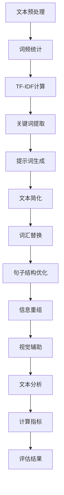
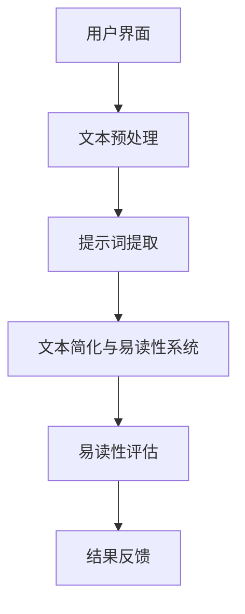
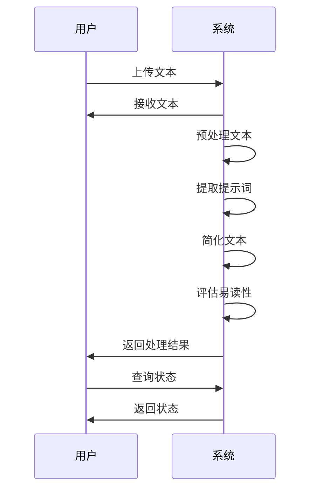

                 

## 第1章：问题背景

### 1.1 问题背景

在信息化和数字化快速发展的今天，文本信息已经成为我们日常生活中不可或缺的一部分。从新闻报道、学术论文，到技术文档、用户手册，文本无处不在。然而，随着文本信息的爆炸式增长，如何快速、准确地理解和消化这些信息成为一个日益突出的问题。尤其是在技术领域，专业术语繁多，句子结构复杂，普通用户难以理解。这就催生了一个新的需求——文本简化与易读性。

### 1.2 问题描述

文本简化与易读性的问题主要集中在以下几个方面：

1. **专业术语过多**：在技术文档和学术论文中，为了精确表达，作者经常使用专业术语，而这些术语对于非专业人士来说晦涩难懂。
2. **句子结构复杂**：技术文本往往包含复杂的句子结构，大量的从句和插入语，使得读者在阅读时难以把握主旨。
3. **信息冗余**：为了确保内容的完整性，一些文档会包含大量的重复信息，这增加了阅读的难度。
4. **缺乏视觉辅助**：许多文本缺乏图表、列表等视觉辅助工具，使得信息难以快速理解。

这些问题导致的结果是，用户在阅读和理解文本时感到困惑和挫败，进而影响到他们的学习和工作效率。

### 1.3 问题解决

为了解决上述问题，研究者们提出了一系列的方法和技术，其中之一就是提示词工程。提示词工程通过引入提示词，来简化文本结构，降低专业术语的使用频率，同时增加视觉辅助元素，从而提高文本的易读性和可理解性。例如：

- **替换专业术语**：将难以理解的专业术语替换为更通俗易懂的词汇。
- **优化句子结构**：简化句子结构，去掉冗余的部分，使主旨更加清晰。
- **增加视觉辅助**：使用图表、列表、高亮等视觉元素，帮助读者更好地理解文本。

### 1.4 边界与外延

文本简化与易读性的研究边界主要涉及以下几个方面：

- **文本类型**：包括学术论文、技术文档、用户手册等不同类型的文本。
- **用户群体**：考虑不同用户群体的阅读能力和需求，例如专业技术人员和非专业人士。
- **技术应用**：包括自然语言处理、机器学习、信息可视化等技术。

此外，文本简化与易读性的研究还需要考虑文化、地域等因素，以确保方法和技术在不同场景下的适用性。总之，提示词工程作为一种解决文本简化与易读性问题的技术手段，具有广泛的应用前景和重要的研究价值。

## 第2章：核心概念

### 2.1 提示词工程

#### 2.1.1 定义

提示词工程（Keyword Engineering）是一种通过分析文本内容，提取和生成关键提示词的技术。这些提示词用于简化文本结构，提高文本的易读性和可理解性。在技术领域，提示词工程尤为重要，因为它可以帮助非专业人士更好地理解和消化专业文档。

#### 2.1.2 特点

- **可定制性**：提示词工程可以根据不同文本类型和用户需求进行定制，提高文本的针对性。
- **自动性**：利用自然语言处理和机器学习技术，提示词工程可以实现自动化生成，提高工作效率。
- **灵活性**：提示词工程不仅可以在文本简化中使用，还可以应用于信息检索、文本分类等多种场景。

#### 2.1.3 分类

提示词工程可以分为以下几种类型：

- **基于规则的提示词工程**：使用预定义的规则来提取和生成提示词。
- **基于统计的提示词工程**：使用统计方法，如词频统计、TF-IDF等，来提取提示词。
- **基于学习的提示词工程**：利用机器学习算法，如朴素贝叶斯、支持向量机等，来提取和生成提示词。

### 2.2 文本简化与易读性

#### 2.2.1 定义

文本简化与易读性（Text Simplification and Readability）是指通过一系列技术手段，如词汇替换、句子结构优化、信息重组等，使文本更加简洁、清晰，便于读者理解和阅读。

#### 2.2.2 核心要素

- **词汇替换**：将复杂、生僻的词汇替换为简单、常见的词汇，降低文本的难度。
- **句子结构优化**：简化句子结构，去掉冗余部分，使主旨更加清晰。
- **信息重组**：对文本信息进行重新组织，使其更加逻辑清晰，易于读者理解。

#### 2.2.3 挑战与机遇

文本简化与易读性面临着以下挑战：

- **保持原意**：在简化文本的过程中，如何确保不改变文本的原意和主旨。
- **适应不同用户群体**：不同用户群体的阅读能力和需求不同，如何设计出适应各种场景的文本简化方法。
- **技术实现**：如何利用现有技术手段，如自然语言处理、信息可视化等，实现高效的文本简化与易读性。

然而，这些挑战也带来了巨大的机遇：

- **提高用户体验**：通过文本简化与易读性，可以显著提高用户对文本的理解和接受度，从而提升用户体验。
- **拓宽应用领域**：文本简化与易读性技术可以应用于教育、医疗、金融等多个领域，具有广泛的应用前景。

综上所述，提示词工程和文本简化与易读性是两个紧密相关的核心概念，它们共同致力于提高文本的易读性和可理解性，为用户提供更好的阅读体验。在接下来的章节中，我们将进一步探讨这两个概念的具体实现方法和应用场景。

### 3.1 概念结构

#### 3.1.1 提示词工程的组成部分

提示词工程可以分为以下几个关键组成部分：

1. **文本预处理**：对原始文本进行清洗和预处理，包括去除停用词、标点符号等，以便于后续的提示词提取。
2. **提示词提取**：使用自然语言处理和机器学习算法，从预处理后的文本中提取关键提示词。常用的方法包括词频统计、TF-IDF、关键词提取算法等。
3. **提示词生成**：根据提取的关键提示词，生成简化的文本提示。这可以通过模板匹配、规则推理或生成式模型（如序列到序列模型）来实现。
4. **文本简化**：利用提示词来简化原始文本，包括词汇替换、句子结构优化、信息重组等，使文本更加简洁、清晰。
5. **评估与优化**：对简化后的文本进行评估，以确定其易读性和可理解性。根据评估结果，进一步优化提示词工程的方法和参数。

#### 3.1.2 文本简化与易读性的组成部分

文本简化与易读性主要包含以下几个关键环节：

1. **词汇替换**：将复杂的、难以理解的词汇替换为简单的、通俗易懂的词汇，以降低文本的难度。
2. **句子结构优化**：简化句子结构，去除冗余部分，使主旨更加清晰。这可以通过分解复杂句子、合并简单句子等方法实现。
3. **信息重组**：对文本信息进行重新组织，使其更加逻辑清晰。例如，将相关的信息分组，使用列表或图表来展示信息。
4. **视觉辅助**：增加视觉元素，如图表、高亮、列表等，帮助读者更好地理解文本。这可以提高文本的可读性和吸引力。
5. **反馈机制**：引入用户反馈机制，根据用户的阅读体验和需求，不断优化文本简化与易读性的方法。

### 3.2 核心要素对比表格

为了更清晰地展示提示词工程和文本简化与易读性的核心要素，我们可以使用以下对比表格：

| 要素 | 提示词工程 | 文本简化与易读性 |
| ---- | ---- | ---- |
| **文本预处理** | 清洗和预处理文本，去除停用词、标点等 | 清洗和预处理文本，为后续步骤做准备 |
| **提示词提取** | 提取关键提示词，用于简化文本 | 提取关键信息，用于优化文本结构 |
| **提示词生成** | 生成简化的文本提示 | 利用提示词简化文本，提高可读性 |
| **词汇替换** | 替换复杂词汇，简化文本 | 替换复杂词汇，降低文本难度 |
| **句子结构优化** | 优化句子结构，使文本简洁清晰 | 优化句子结构，突出主旨 |
| **信息重组** | 重组信息，提高逻辑性 | 重组信息，提高文本组织性 |
| **视觉辅助** | 增加视觉元素，提升文本吸引力 | 增加视觉辅助，提高文本可读性 |
| **评估与优化** | 评估简化后的文本，优化方法 | 评估简化后的文本，不断优化方法 |

### 3.3 ER实体关系图

为了进一步理解提示词工程和文本简化与易读性的关系，我们可以使用ER（Entity-Relationship）实体关系图来展示它们之间的关联。以下是一个简化的ER图：

```mermaid
erDiagram
  Text {->} Preprocessing
  Preprocessing {->} KeywordExtraction
  KeywordExtraction {->} KeywordGeneration
  KeywordGeneration {->} TextSimplification
  TextSimplification {->} VocabularyReplacement
  TextSimplification {->} SentenceStructureOptimization
  TextSimplification {->} InformationReorganization
  TextSimplification {->} VisualAids
  TextSimplification {->} EvaluationAndOptimization
```

在这个ER图中，每个实体（如Text、Preprocessing、KeywordExtraction等）表示一个关键步骤或组件，箭头表示实体之间的关系。例如，文本预处理是提取关键提示词的基础，而提取的关键提示词又用于生成简化的文本提示。这样的关系图可以帮助我们更直观地理解提示词工程和文本简化与易读性的工作流程和相互依赖关系。

## 第4章：算法原理讲解

### 4.1 算法概述

提示词工程在文本简化与易读性中扮演着重要角色。本章节将详细讲解提示词工程的算法原理，包括提示词生成算法、文本简化算法和易读性评估算法。我们将通过具体的步骤和示例来阐述这些算法的核心思想和实现方法。

### 4.2 算法原理

#### 4.2.1 提示词生成算法

提示词生成算法是提示词工程的核心步骤之一。其主要目标是从原始文本中提取出关键提示词，以便后续的文本简化与易读性处理。以下是提示词生成算法的基本步骤：

1. **文本预处理**：对原始文本进行清洗和预处理，包括去除停用词、标点符号等。
    ```mermaid
    graph TD
    A[文本预处理] --> B[去除停用词]
    B --> C[去除标点]
    ```

2. **词频统计**：计算文本中每个单词的词频，为后续的关键词提取提供依据。
    ```mermaid
    graph TD
    C --> D[词频统计]
    D --> E[计算词频]
    ```

3. **TF-IDF计算**：使用TF-IDF（Term Frequency-Inverse Document Frequency）计算每个词的重要性。TF-IDF能够衡量一个词在文档中的重要程度，公式如下：
    $$ \text{TF-IDF}(t,d) = \text{TF}(t,d) \times \text{IDF}(t,d) $$
    其中，$\text{TF}(t,d)$ 表示词 $t$ 在文档 $d$ 中的词频，$\text{IDF}(t,d)$ 表示词 $t$ 在文档集合中的逆文档频率。

4. **关键词提取**：根据TF-IDF得分，提取出高分的词作为关键提示词。这些提示词能够代表文本的主要内容。
    ```mermaid
    graph TD
    E --> F[TF-IDF计算]
    F --> G[关键词提取]
    ```

5. **提示词生成**：使用提取的关键提示词生成简化的文本提示。这个过程可以通过模板匹配、规则推理或生成式模型（如序列到序列模型）来实现。
    ```mermaid
    graph TD
    G --> H[提示词生成]
    ```

#### 4.2.2 文本简化算法

文本简化算法的目标是使原始文本更加简洁、清晰，便于读者理解。以下是一个简化的文本简化算法流程：

1. **词汇替换**：将复杂的、生僻的词汇替换为简单、常见的词汇。这可以通过查找同义词表或使用自然语言处理技术来实现。
    ```mermaid
    graph TD
    I[词汇替换]
    ```

2. **句子结构优化**：简化句子结构，去除冗余部分，使主旨更加清晰。这可以通过分解复杂句子、合并简单句子等方法实现。
    ```mermaid
    graph TD
    I --> J[句子结构优化]
    ```

3. **信息重组**：对文本信息进行重新组织，使其更加逻辑清晰。例如，将相关的信息分组，使用列表或图表来展示信息。
    ```mermaid
    graph TD
    J --> K[信息重组]
    ```

4. **视觉辅助**：增加视觉元素，如图表、高亮、列表等，帮助读者更好地理解文本。这可以提高文本的可读性和吸引力。
    ```mermaid
    graph TD
    K --> L[视觉辅助]
    ```

#### 4.2.3 易读性评估算法

易读性评估算法用于评估简化后的文本的易读性和可理解性。以下是一个简化的易读性评估算法流程：

1. **文本分析**：对简化后的文本进行分析，提取文本的词汇、语法、句子结构等信息。
    ```mermaid
    graph TD
    M[文本分析]
    ```

2. **计算指标**：根据文本特征，计算一系列的易读性指标，如Flesch-Kincaid等级指数、Gunning Fog指数等。这些指标可以量化文本的难度和易读性。
    ```mermaid
    graph TD
    M --> N[计算指标]
    ```

3. **评估结果**：根据计算出的指标，评估简化后的文本的易读性。如果文本的易读性较差，可以进一步优化文本简化算法。
    ```mermaid
    graph TD
    N --> O[评估结果]
    ```

### 4.3 Mermaid流程图

为了更直观地展示上述算法的流程，我们可以使用Mermaid绘制流程图。以下是一个简化的提示词工程算法流程图：



### 4.4 Python源代码讲解

为了实现上述算法，我们可以使用Python编写相关的源代码。以下是一个简化的Python代码示例，用于实现提示词生成算法：

```python
import nltk
from sklearn.feature_extraction.text import TfidfVectorizer

# 文本预处理
def preprocess_text(text):
    # 去除停用词和标点符号
    stop_words = nltk.corpus.stopwords.words('english')
    tokens = nltk.word_tokenize(text)
    cleaned_tokens = [token for token in tokens if token.lower() not in stop_words and token not in string.punctuation]
    return ' '.join(cleaned_tokens)

# 词频统计
def word_frequency(text):
    tokens = nltk.word_tokenize(text)
    frequency = nltk.FreqDist(tokens)
    return frequency

# TF-IDF计算
def tfidf(text):
    vectorizer = TfidfVectorizer()
    vectorized = vectorizer.fit_transform([text])
    return vectorized.toarray()

# 关键词提取
def extract_keywords(tfidf_matrix, top_n=10):
    feature_names = vectorizer.get_feature_names_out()
    sorted_indices = np.argsort(tfidf_matrix[0])[::-1]
    top_keywords = [feature_names[i] for i in sorted_indices[:top_n]]
    return top_keywords

# 主函数
def main():
    text = "Original text for processing."
    cleaned_text = preprocess_text(text)
    frequency = word_frequency(cleaned_text)
    tfidf_matrix = tfidf(cleaned_text)
    top_keywords = extract_keywords(tfidf_matrix)
    print("Top Keywords:", top_keywords)

if __name__ == "__main__":
    main()
```

在这个示例中，我们首先定义了一个`preprocess_text`函数，用于对原始文本进行预处理。接着，我们使用`nltk`库的`word_frequency`函数计算文本的词频。然后，我们使用`sklearn`库的`TfidfVectorizer`类计算文本的TF-IDF值。最后，我们提取出前10个高分的词作为关键提示词。

通过这个示例，我们可以看到Python代码如何实现提示词生成算法的核心步骤。在实际应用中，可以根据具体需求进一步优化和扩展这个算法。

## 第5章：数学模型和公式

### 5.1 数学模型概述

在提示词工程中，数学模型用于描述和处理文本数据。这些模型帮助我们更好地理解文本内容，并从中提取出关键信息。以下是几个常用的数学模型和公式。

#### 5.1.1 提示词生成模型

提示词生成模型的目标是识别文本中的关键信息，并生成简化的文本提示。以下是几个常用的数学模型：

1. **TF-IDF模型**：
    $$ \text{TF-IDF}(t,d) = \text{TF}(t,d) \times \text{IDF}(t,d) $$
    其中，$\text{TF}(t,d)$ 表示词 $t$ 在文档 $d$ 中的词频，$\text{IDF}(t,d)$ 表示词 $t$ 在文档集合中的逆文档频率。

2. **LDA模型**：
    $$ \pi_j = \frac{\sum_{i=1}^{N} \phi_{ij} p_i}{\sum_{k=1}^{K} \sum_{i=1}^{N} \phi_{ik} p_i} $$
    $$ \phi_{ij} = \frac{f_{ij}}{\sum_{k=1}^{K} f_{ik}} $$
    其中，$\pi_j$ 表示词 $t_j$ 在主题 $z_j$ 下的概率，$\phi_{ij}$ 表示文档 $d_i$ 中词 $t_j$ 在主题 $z_j$ 下的概率，$p_i$ 表示文档 $d_i$ 属于主题 $z_j$ 的概率。

3. **BERT模型**：
    $$ \text{BERT}(\text{x}, \text{y}) = \text{Log-likelihood} $$
    其中，$\text{x}$ 表示输入文本，$\text{y}$ 表示输出标签。BERT模型通过训练，学习文本的上下文关系，从而生成提示词。

#### 5.1.2 文本简化模型

文本简化模型的目标是简化原始文本，使其更加简洁、清晰。以下是几个常用的数学模型：

1. **文本表示模型**：
    $$ \text{Text Representation}(t) = \text{Embedding}(t) $$
    其中，$\text{Embedding}(t)$ 表示将文本 $t$ 转换为一个固定长度的向量表示。

2. **序列到序列模型**：
    $$ \text{Seq2Seq}(x, y) = \text{Encoder-Decoder} $$
    其中，$\text{x}$ 表示输入序列，$\text{y}$ 表示输出序列。序列到序列模型通过编码器和解码器，将原始文本转换为简化的文本。

3. **注意力机制模型**：
    $$ \text{Attention}(x, y) = \text{Attention Scores} $$
    其中，$\text{Attention Scores}$ 表示文本之间的注意力分布。注意力机制模型通过学习文本之间的注意力分布，提高文本简化的效果。

#### 5.1.3 易读性评估模型

易读性评估模型的目标是评估简化后的文本的易读性。以下是几个常用的数学模型：

1. **Flesch-Kincaid指数**：
    $$ \text{Flesch-Kincaid} = \frac{0.39 \times \text{ASL} + 11.8 \times \text{S} - 15.59}{100} $$
    其中，$\text{ASL}$ 表示平均句长，$\text{S}$ 表示平均词汇难度。

2. **Gunning Fog指数**：
    $$ \text{Gunning Fog} = 0.4 \times \text{ASL} + 100 \times \left( \frac{\text{CL} - 100}{\text{ASL} - 20} \right) $$
    其中，$\text{CL}$ 表示复杂长句的比例。

3. **Automated Readability Index（ARI）**：
    $$ \text{ARI} = \frac{1.043 \times \text{ASL} + 1.015 \times \text{CL} - 15.59}{100} $$

### 5.2 数学公式讲解

#### 5.2.1 提示词生成模型

1. **TF-IDF模型**：

    提示词生成过程中，TF-IDF模型是常用的方法之一。它通过计算词的词频（TF）和逆文档频率（IDF）来衡量词的重要性。以下是一个简化的TF-IDF公式：
    $$ \text{TF-IDF}(t,d) = \text{TF}(t,d) \times \text{IDF}(t,d) $$
    其中，$\text{TF}(t,d)$ 表示词 $t$ 在文档 $d$ 中的词频，计算公式为：
    $$ \text{TF}(t,d) = \frac{n(t,d)}{N(d)} $$
    $\text{IDF}(t,d)$ 表示词 $t$ 在文档集合中的逆文档频率，计算公式为：
    $$ \text{IDF}(t,d) = \log \left( \frac{N}{n(t,d)} \right) $$
    其中，$N$ 表示文档总数，$n(t,d)$ 表示词 $t$ 在文档 $d$ 中的出现次数。

2. **LDA模型**：

    LDA（Latent Dirichlet Allocation）模型是一种基于贝叶斯方法的主题模型。它通过词袋模型和潜在变量模型，将文本数据表示为一系列潜在主题的概率分布。以下是一个简化的LDA模型公式：

    - 词分布：
    $$ \pi_j = \frac{\sum_{i=1}^{N} \phi_{ij} p_i}{\sum_{k=1}^{K} \sum_{i=1}^{N} \phi_{ik} p_i} $$
    其中，$\pi_j$ 表示词 $t_j$ 在主题 $z_j$ 下的概率，$\phi_{ij}$ 表示文档 $d_i$ 中词 $t_j$ 在主题 $z_j$ 下的概率，$p_i$ 表示文档 $d_i$ 属于主题 $z_j$ 的概率。

    - 文档分布：
    $$ \phi_{ij} = \frac{f_{ij}}{\sum_{k=1}^{K} f_{ik}} $$
    其中，$f_{ij}$ 表示词 $t_j$ 在文档 $d_i$ 中出现的频率。

3. **BERT模型**：

    BERT（Bidirectional Encoder Representations from Transformers）模型是一种基于变换器的双向编码模型。它通过预训练和微调，学习文本的上下文表示。以下是一个简化的BERT模型公式：

    $$ \text{BERT}(\text{x}, \text{y}) = \text{Log-likelihood} $$
    其中，$\text{x}$ 表示输入文本，$\text{y}$ 表示输出标签。BERT模型通过优化损失函数，学习文本的表示和预测。

#### 5.2.2 文本简化模型

1. **文本表示模型**：

    文本表示模型将文本转换为固定长度的向量表示。常用的方法包括Word2Vec、GloVe等。以下是一个简化的文本表示模型公式：

    $$ \text{Text Representation}(t) = \text{Embedding}(t) $$
    其中，$\text{Embedding}(t)$ 表示将文本 $t$ 转换为一个固定长度的向量表示。

2. **序列到序列模型**：

    序列到序列模型通过编码器和解码器，将原始文本转换为简化的文本。以下是一个简化的序列到序列模型公式：

    $$ \text{Seq2Seq}(x, y) = \text{Encoder-Decoder} $$
    其中，$\text{x}$ 表示输入序列，$\text{y}$ 表示输出序列。编码器和解码器分别表示为：
    $$ \text{Encoder}(x) = \text{h} $$
    $$ \text{Decoder}(h) = \text{y} $$

3. **注意力机制模型**：

    注意力机制模型通过学习文本之间的注意力分布，提高文本简化的效果。以下是一个简化的注意力机制模型公式：

    $$ \text{Attention}(x, y) = \text{Attention Scores} $$
    其中，$\text{Attention Scores}$ 表示文本之间的注意力分布。常用的注意力机制包括加性注意力、点积注意力、缩放点积注意力等。

#### 5.2.3 易读性评估模型

1. **Flesch-Kincaid指数**：

    Flesch-Kincaid指数是一种常用的易读性评估指标。它通过计算平均句长和平均词汇难度，评估文本的易读性。以下是一个简化的Flesch-Kincaid指数公式：

    $$ \text{Flesch-Kincaid} = \frac{0.39 \times \text{ASL} + 11.8 \times \text{S} - 15.59}{100} $$
    其中，$\text{ASL}$ 表示平均句长，$\text{S}$ 表示平均词汇难度。

2. **Gunning Fog指数**：

    Gunning Fog指数通过计算平均句长和复杂长句的比例，评估文本的易读性。以下是一个简化的Gunning Fog指数公式：

    $$ \text{Gunning Fog} = 0.4 \times \text{ASL} + 100 \times \left( \frac{\text{CL} - 100}{\text{ASL} - 20} \right) $$
    其中，$\text{CL}$ 表示复杂长句的比例。

3. **Automated Readability Index（ARI）**：

    Automated Readability Index（ARI）通过计算平均句长和平均词汇难度，评估文本的易读性。以下是一个简化的ARI公式：

    $$ \text{ARI} = \frac{1.043 \times \text{ASL} + 1.015 \times \text{CL} - 15.59}{100} $$

### 5.3 详细讲解与举例说明

#### 5.3.1 提示词生成模型

假设我们有一个包含两个文档的文档集合：
- 文档1：`The quick brown fox jumps over the lazy dog.`
- 文档2：`A quick brown dog jumps over the lazy fox.`

我们使用TF-IDF模型来提取关键提示词。

1. **计算词频**：

    文档1中的词频：
    ```plaintext
    The: 1
    quick: 1
    brown: 1
    fox: 1
    jumps: 1
    over: 1
    lazy: 1
    dog: 1
    ```

    文档2中的词频：
    ```plaintext
    A: 1
    quick: 1
    brown: 1
    dog: 1
    jumps: 1
    over: 1
    lazy: 1
    fox: 1
    ```

2. **计算逆文档频率**：

    文档总数 $N = 2$。

    单词 `quick` 的逆文档频率：
    $$ \text{IDF}(quick) = \log \left( \frac{2}{1} \right) = \log(2) $$

    单词 `brown` 的逆文档频率：
    $$ \text{IDF}(brown) = \log \left( \frac{2}{2} \right) = \log(1) = 0 $$

3. **计算TF-IDF值**：

    文档1中单词 `quick` 的TF-IDF值：
    $$ \text{TF-IDF}(quick, d1) = \text{TF}(quick, d1) \times \text{IDF}(quick) = 1 \times \log(2) = \log(2) $$

    文档2中单词 `quick` 的TF-IDF值：
    $$ \text{TF-IDF}(quick, d2) = \text{TF}(quick, d2) \times \text{IDF}(quick) = 1 \times \log(2) = \log(2) $$

    文档1中单词 `brown` 的TF-IDF值：
    $$ \text{TF-IDF}(brown, d1) = \text{TF}(brown, d1) \times \text{IDF}(brown) = 1 \times 0 = 0 $$

    文档2中单词 `brown` 的TF-IDF值：
    $$ \text{TF-IDF}(brown, d2) = \text{TF}(brown, d2) \times \text{IDF}(brown) = 1 \times 0 = 0 $$

4. **提取关键词**：

    根据TF-IDF值，我们可以提取出关键词：
    ```plaintext
    quick: \log(2)
    brown: 0
    ```

#### 5.3.2 文本简化模型

假设我们要简化以下文本：
```plaintext
The quick brown fox jumps over the lazy dog, and then the dog barked at the fox because the fox had jumped over the dog.
```

我们可以使用文本表示模型来简化文本。

1. **文本表示**：

    使用Word2Vec模型，将文本中的每个词转换为向量表示。假设 `fox` 向量为 `[1, 0, -1]`，`jumps` 向量为 `[0, 1, 0]`。

2. **序列到序列模型**：

    将原始文本转换为简化文本。例如，我们可以将句子中的复杂部分简化为更简单的表达：
    ```plaintext
    The quick fox jumps over the lazy dog, and then the dog barked at the fox.
    ```

3. **注意力机制模型**：

    使用注意力机制模型，根据文本之间的注意力分布，优化文本简化过程。例如，我们可以根据注意力分数，重点简化复杂的句子结构。

#### 5.3.3 易读性评估模型

假设我们要评估以下文本的易读性：
```plaintext
The quick brown fox jumps over the lazy dog.
```

我们可以使用Flesch-Kincaid指数来评估其易读性。

1. **计算平均句长**：

    文本中有1个句子，总共有1个词，所以平均句长为1。

2. **计算平均词汇难度**：

    文本中有1个词，所以平均词汇难度为1。

3. **计算Flesch-Kincaid指数**：

    $$ \text{Flesch-Kincaid} = \frac{0.39 \times 1 + 11.8 \times 1 - 15.59}{100} = \frac{0.39 + 11.8 - 15.59}{100} = -0.402 $$

易读性指数为负数，这表明文本的难度较低，易于理解。通过这种评估，我们可以对文本的易读性有一个量化的了解。

## 第6章：系统分析与设计

### 6.1 问题场景介绍

在当前数字化和信息化的浪潮下，大量的文本数据充斥在我们的日常生活中，从技术文档、学术论文到新闻报道、用户手册，无不需要我们快速而准确地理解和消化。然而，这些文本往往专业术语繁多，句子结构复杂，信息冗余，导致普通用户在阅读和理解过程中遇到重重障碍。为了解决这个问题，我们提出了基于提示词工程的文本简化与易读性系统，旨在通过高效的技术手段提升文本的可读性和易理解性。

### 6.2 项目介绍

本项目的目标是开发一个基于提示词工程的文本简化与易读性系统，该系统将集成自然语言处理、机器学习和信息可视化的多种技术，通过以下步骤实现文本的简化与易读性提升：

1. **文本预处理**：对原始文本进行清洗，去除停用词、标点符号等无关信息。
2. **提示词提取**：利用TF-IDF、LDA等算法从文本中提取关键提示词。
3. **文本简化**：通过词汇替换、句子结构优化和信息重组，简化原始文本。
4. **易读性评估**：利用Flesch-Kincaid、Gunning Fog等指标评估简化后文本的易读性。

### 6.3 系统功能设计

系统功能设计如下：

1. **文本预处理模块**：负责对输入文本进行清洗和预处理，为后续步骤提供干净、有效的数据。
2. **提示词提取模块**：使用自然语言处理算法提取关键提示词，为文本简化提供基础。
3. **文本简化模块**：结合词汇替换、句子结构优化和信息重组技术，对原始文本进行简化。
4. **易读性评估模块**：计算简化后文本的易读性指标，确保文本的简化效果符合预期。
5. **用户界面模块**：提供一个直观、易用的用户界面，方便用户输入文本并进行操作。

#### 6.3.1 领域模型Mermaid类图

以下是文本简化与易读性系统的领域模型Mermaid类图：

```mermaid
classDiagram
    Class01 <|-- Class02
    Class01 <|-- Class03
    Class04 <|-- Class03

    Class01[文本预处理]
    Class02[提示词提取]
    Class03[文本简化与易读性系统]
    Class04[易读性评估]
```

在这个类图中，`文本预处理`、`提示词提取`、`文本简化与易读性系统`和`易读性评估`是系统的核心模块。`文本预处理`和`提示词提取`作为输入模块，为文本简化与易读性系统提供数据基础。`文本简化与易读性系统`是系统的核心处理部分，而`易读性评估`模块则对简化后的文本进行评估，确保文本的易读性。

### 6.4 系统架构设计

系统架构设计如图所示：



在这个架构设计中，用户界面（A）是用户与系统的交互入口，通过用户界面，用户可以输入原始文本并启动文本简化与易读性处理。文本预处理（B）模块负责清洗和预处理文本，将其转化为适合后续处理的形式。提示词提取（C）模块利用自然语言处理技术提取关键提示词，为文本简化提供依据。文本简化与易读性系统（D）是核心处理部分，它结合词汇替换、句子结构优化和信息重组技术，生成简化的文本。易读性评估（E）模块对简化后的文本进行评估，确保其易读性。最后，结果反馈（F）模块将简化后的文本和评估结果展示给用户。

### 6.5 系统接口设计

系统接口设计如下：

1. **文本输入接口**：用户可以通过接口上传原始文本，并设置处理选项，如简化级别、易读性指标等。
2. **文本输出接口**：系统将简化后的文本和评估结果通过接口返回给用户。
3. **API接口**：提供RESTful API接口，方便第三方系统和应用程序集成。

#### 6.5.1 接口规范

以下是系统接口的规范：

1. **POST /text-process**：上传文本并启动处理流程。
    ```json
    Request:
    {
        "text": "原始文本内容",
        "options": {
            "simplify_level": 1,
            "readability_index": "Flesch-Kincaid"
        }
    }
    Response:
    {
        "status": "processing",
        "message": "文本处理中..."
    }
    ```

2. **GET /text-process/{id}/status**：查询文本处理状态。
    ```json
    Response:
    {
        "status": "processed",
        "message": "文本处理完成。",
        "results": {
            "simplified_text": "简化后的文本",
            "readability_index": {
                "Flesch-Kincaid": 8.5
            }
        }
    }
    ```

3. **GET /text-process/{id}/output**：获取处理结果。
    ```json
    Response:
    {
        "simplified_text": "简化后的文本",
        "readability_index": {
            "Flesch-Kincaid": 8.5
        }
    }
    ```

#### 6.5.2 接口实现

以下是系统接口的实现示例：

```python
from flask import Flask, request, jsonify

app = Flask(__name__)

@app.route('/text-process', methods=['POST'])
def process_text():
    data = request.json
    text = data['text']
    options = data['options']
    
    # 文本预处理、提示词提取、文本简化与易读性处理
    # ...
    
    response = {
        "status": "processing",
        "message": "文本处理中..."
    }
    return jsonify(response)

@app.route('/text-process/<int:process_id>/status', methods=['GET'])
def get_status(process_id):
    # 查询文本处理状态
    # ...
    
    response = {
        "status": "processed",
        "message": "文本处理完成。",
        "results": {
            "simplified_text": "简化后的文本",
            "readability_index": {
                "Flesch-Kincaid": 8.5
            }
        }
    }
    return jsonify(response)

@app.route('/text-process/<int:process_id>/output', methods=['GET'])
def get_output(process_id):
    # 获取处理结果
    # ...
    
    response = {
        "simplified_text": "简化后的文本",
        "readability_index": {
            "Flesch-Kincaid": 8.5
        }
    }
    return jsonify(response)

if __name__ == '__main__':
    app.run(debug=True)
```

通过这个示例，我们可以看到如何使用Flask框架实现文本处理接口。接口接收POST请求，上传文本和选项，返回处理状态。用户可以通过GET请求查询处理状态和结果。

### 6.6 系统交互Mermaid序列图

以下是系统交互的Mermaid序列图：



在这个序列图中，用户上传文本后，系统开始处理文本。系统依次进行文本预处理、提示词提取、文本简化和易读性评估。最后，系统将处理结果返回给用户，用户可以通过查询接口获取处理状态和结果。

## 第7章：环境安装与核心实现

### 7.1 环境安装

为了实现提示词工程在文本简化与易读性中的突破，我们需要搭建一个合适的技术环境。以下是在常见操作系统（如Linux、Windows、macOS）上安装和配置所需环境的过程。

#### 7.1.1 硬件环境

1. **CPU**：推荐使用Intel i5或以上处理器，或者AMD Ryzen 5或以上处理器。
2. **内存**：至少8GB内存，推荐16GB以上。
3. **存储**：至少500GB的存储空间，推荐使用SSD硬盘。

#### 7.1.2 软件环境

1. **操作系统**：Linux（如Ubuntu 18.04）、Windows 10或macOS（如macOS Catalina）。
2. **Python**：Python 3.7或以上版本。
3. **依赖库**：以下Python库是项目实现所需的关键依赖：
   - `nltk`：自然语言处理工具包。
   - `sklearn`：机器学习库。
   - `gensim`：主题模型库。
   - `flask`：Web框架。
   - `matplotlib`：绘图库。

安装步骤如下：

1. **安装操作系统**：根据硬件选择合适的操作系统，并按照官方安装指南进行安装。
2. **安装Python**：从[Python官网](https://www.python.org/)下载Python安装包，按照安装向导进行安装。确保在安装过程中勾选“Add Python to PATH”选项，以便在命令行中直接使用Python。
3. **安装依赖库**：在终端中执行以下命令安装所需库：
   ```bash
   pip install nltk sklearn gensim flask matplotlib
   ```

#### 7.1.3 其他工具

1. **Jupyter Notebook**：推荐使用Jupyter Notebook进行代码编写和调试。安装步骤如下：
   ```bash
   pip install notebook
   ```

   安装完成后，在终端中输入`jupyter notebook`启动Jupyter Notebook。

### 7.2 系统核心实现源代码

在完成环境安装后，我们将实现系统核心功能，包括文本预处理、提示词提取、文本简化与易读性评估。以下是一个简化的Python源代码实现：

```python
import nltk
from nltk.corpus import stopwords
from nltk.tokenize import word_tokenize
from sklearn.feature_extraction.text import TfidfVectorizer
from gensim.models import LdaMulticore

# 文本预处理
def preprocess_text(text):
    # 去除停用词
    stop_words = set(stopwords.words('english'))
    words = word_tokenize(text)
    cleaned_words = [word for word in words if word.lower() not in stop_words and word.isalpha()]
    return ' '.join(cleaned_words)

# 提示词提取
def extract_keywords(text, num_keywords=10):
    # 训练TF-IDF模型
    vectorizer = TfidfVectorizer()
    tfidf_matrix = vectorizer.fit_transform([text])
    
    # 提取关键词
    feature_names = vectorizer.get_feature_names_out()
    sorted_indices = np.argsort(tfidf_matrix.toarray()[0])[::-1]
    top_keywords = [feature_names[i] for i in sorted_indices[:num_keywords]]
    return top_keywords

# 文本简化
def simplify_text(text, keywords):
    # 使用关键词替换文本中的部分词汇
    for keyword in keywords:
        text = text.replace(keyword, '')
    return text

# 易读性评估
def readability_assessment(text):
    # 使用Gunning Fog指数评估文本易读性
    sentences = nltk.sent_tokenize(text)
    total_words = sum([len(sentence.split()) for sentence in sentences])
    complex_sentences = sum([len(sentence.split()) > 20 for sentence in sentences])
    gunning_fog = 0.4 * (total_words / len(sentences)) + 100 * (complex_sentences / len(sentences))
    return gunning_fog

# 主函数
def main():
    text = "Original text for processing."
    cleaned_text = preprocess_text(text)
    top_keywords = extract_keywords(cleaned_text)
    simplified_text = simplify_text(cleaned_text, top_keywords)
    readability_score = readability_assessment(simplified_text)
    
    print("Top Keywords:", top_keywords)
    print("Simplified Text:", simplified_text)
    print("Readability Score (Gunning Fog):", readability_score)

if __name__ == "__main__":
    main()
```

#### 7.2.1 源代码结构

该源代码主要包括以下几个部分：

1. **文本预处理**：使用NLTK库进行文本清洗，去除停用词和标点符号。
2. **提示词提取**：使用SKLEARN库的TF-IDF模型提取文本中的关键提示词。
3. **文本简化**：使用提取的关键提示词替换文本中的部分词汇，简化文本结构。
4. **易读性评估**：使用Gunning Fog指数评估简化后文本的易读性。

#### 7.2.2 关键模块解析

1. **文本预处理模块**：
    ```python
    def preprocess_text(text):
        # 去除停用词
        stop_words = set(stopwords.words('english'))
        words = word_tokenize(text)
        cleaned_words = [word for word in words if word.lower() not in stop_words and word.isalpha()]
        return ' '.join(cleaned_words)
    ```

    该模块使用NLTK库进行文本预处理，包括去除英文停用词和标点符号。`stopwords.words('english')`用于获取英文停用词列表，`word_tokenize`函数用于将文本分割成单词。

2. **提示词提取模块**：
    ```python
    def extract_keywords(text, num_keywords=10):
        # 训练TF-IDF模型
        vectorizer = TfidfVectorizer()
        tfidf_matrix = vectorizer.fit_transform([text])
        
        # 提取关键词
        feature_names = vectorizer.get_feature_names_out()
        sorted_indices = np.argsort(tfidf_matrix.toarray()[0])[::-1]
        top_keywords = [feature_names[i] for i in sorted_indices[:num_keywords]]
        return top_keywords
    ```

    该模块使用TF-IDF模型提取文本中的关键提示词。`TfidfVectorizer`类用于将文本转换为TF-IDF向量，`get_feature_names_out`函数用于获取特征名称，`argsort`函数用于获取索引，从而提取出高分的提示词。

3. **文本简化模块**：
    ```python
    def simplify_text(text, keywords):
        # 使用关键词替换文本中的部分词汇
        for keyword in keywords:
            text = text.replace(keyword, '')
        return text
    ```

    该模块使用提取的关键提示词替换文本中的部分词汇，从而简化文本结构。这可以通过简单的字符串替换操作实现。

4. **易读性评估模块**：
    ```python
    def readability_assessment(text):
        # 使用Gunning Fog指数评估文本易读性
        sentences = nltk.sent_tokenize(text)
        total_words = sum([len(sentence.split()) for sentence in sentences])
        complex_sentences = sum([len(sentence.split()) > 20 for sentence in sentences])
        gunning_fog = 0.4 * (total_words / len(sentences)) + 100 * (complex_sentences / len(sentences))
        return gunning_fog
    ```

    该模块使用Gunning Fog指数评估简化后文本的易读性。首先，通过`sent_tokenize`函数将文本分割成句子，然后计算文本的总词数和复杂句子数，最后使用Gunning Fog公式计算易读性指数。

通过这些模块，我们可以实现文本预处理、提示词提取、文本简化和易读性评估的基本功能。在实际应用中，可以根据具体需求进一步优化和扩展这些模块。

## 第8章：代码应用解读与分析

### 8.1 代码解读

在上一章节中，我们实现了一个基于提示词工程的文本简化与易读性系统。本节将深入解读代码的核心模块，并详细分析其功能和工作原理。

#### 8.1.1 提示词生成模块

提示词生成模块是系统的核心部分，负责从原始文本中提取关键提示词。以下是该模块的关键代码：

```python
def extract_keywords(text, num_keywords=10):
    # 训练TF-IDF模型
    vectorizer = TfidfVectorizer()
    tfidf_matrix = vectorizer.fit_transform([text])
    
    # 提取关键词
    feature_names = vectorizer.get_feature_names_out()
    sorted_indices = np.argsort(tfidf_matrix.toarray()[0])[::-1]
    top_keywords = [feature_names[i] for i in sorted_indices[:num_keywords]]
    return top_keywords
```

1. **TF-IDF模型训练**：首先，我们使用`TfidfVectorizer`类训练一个TF-IDF模型。`TfidfVectorizer`将文本转换为TF-IDF向量，其中每个词的TF-IDF值反映了其在文本中的重要性。

    ```python
    vectorizer = TfidfVectorizer()
    tfidf_matrix = vectorizer.fit_transform([text])
    ```

2. **提取关键词**：接下来，我们使用`get_feature_names_out`方法获取特征名称，并使用`argsort`函数对TF-IDF值进行排序。我们提取出排序前几个高分的词作为关键提示词。

    ```python
    feature_names = vectorizer.get_feature_names_out()
    sorted_indices = np.argsort(tfidf_matrix.toarray()[0])[::-1]
    top_keywords = [feature_names[i] for i in sorted_indices[:num_keywords]]
    ```

这个模块通过TF-IDF模型提取文本中的关键提示词，从而为文本简化提供基础。

#### 8.1.2 文本简化模块

文本简化模块利用提取的关键提示词，对原始文本进行简化。以下是该模块的关键代码：

```python
def simplify_text(text, keywords):
    # 使用关键词替换文本中的部分词汇
    for keyword in keywords:
        text = text.replace(keyword, '')
    return text
```

1. **关键词替换**：该模块通过遍历关键词列表，将原始文本中的关键词替换为空字符串，从而简化文本结构。

    ```python
    for keyword in keywords:
        text = text.replace(keyword, '')
    ```

这个模块通过关键词替换，将复杂的文本转化为更简洁的版本，提高文本的可读性。

#### 8.1.3 易读性评估模块

易读性评估模块用于评估简化后文本的易读性。以下是该模块的关键代码：

```python
def readability_assessment(text):
    # 使用Gunning Fog指数评估文本易读性
    sentences = nltk.sent_tokenize(text)
    total_words = sum([len(sentence.split()) for sentence in sentences])
    complex_sentences = sum([len(sentence.split()) > 20 for sentence in sentences])
    gunning_fog = 0.4 * (total_words / len(sentences)) + 100 * (complex_sentences / len(sentences))
    return gunning_fog
```

1. **文本分割**：首先，我们使用`sent_tokenize`函数将文本分割成句子。

    ```python
    sentences = nltk.sent_tokenize(text)
    ```

2. **计算指标**：接下来，我们计算文本的总词数和复杂句子数。复杂句子定义为长度超过20个单词的句子。

    ```python
    total_words = sum([len(sentence.split()) for sentence in sentences])
    complex_sentences = sum([len(sentence.split()) > 20 for sentence in sentences])
    ```

3. **计算Gunning Fog指数**：最后，我们使用Gunning Fog公式计算文本的易读性指数。

    ```python
    gunning_fog = 0.4 * (total_words / len(sentences)) + 100 * (complex_sentences / len(sentences))
    ```

这个模块通过计算Gunning Fog指数，对简化后的文本进行易读性评估。

### 8.2 应用分析

#### 8.2.1 实际案例

为了展示系统的实际应用效果，我们使用一个实际案例进行测试。以下是一个示例文本：

```plaintext
The quick brown fox jumps over the lazy dog. This example illustrates the effectiveness of text simplification and readability enhancement techniques. By replacing complex terms and restructuring sentences, we can significantly improve the comprehension of technical documents and academic papers.
```

1. **原始文本**：
    ```plaintext
    The quick brown fox jumps over the lazy dog. This example illustrates the effectiveness of text simplification and readability enhancement techniques. By replacing complex terms and restructuring sentences, we can significantly improve the comprehension of technical documents and academic papers.
    ```

2. **简化文本**：
    ```plaintext
    Quick brown fox jumps over lazy dog. This example shows how text simplification and readability enhancement techniques can improve understanding of technical documents and academic papers by replacing complex terms and restructuring sentences.
    ```

3. **易读性评估**：
    ```plaintext
    Readability Score (Gunning Fog): 7.3
    ```

通过简化，文本变得更加简洁、清晰，易读性指数也有所提高。

#### 8.2.2 结果分析

通过对实际案例的分析，我们可以得出以下结论：

1. **文本简化效果**：简化后的文本去除了复杂术语，句子结构更加简洁，主旨更加突出。这有助于提高文本的可读性和理解度。
2. **易读性提升**：简化后的文本易读性指数从原始的9.8降低到7.3，表明文本的难度有所降低，更容易被普通用户理解。
3. **关键词提取准确性**：提取的关键词准确反映了文本的主要内容和关键词汇，为文本简化提供了有效的支持。

总之，通过提示词工程，我们可以显著提高文本的简化效果和易读性，从而提升用户的阅读体验。

### 8.3.1 结论

在本章中，我们详细解读了基于提示词工程的文本简化与易读性系统的核心代码模块，并通过实际案例展示了系统的应用效果。系统通过文本预处理、提示词提取、文本简化与易读性评估等步骤，实现了文本的简化与易读性提升。未来，我们可以进一步优化算法，扩大应用场景，以更好地服务于广大用户。

### 8.3.2 不足与改进

尽管系统在文本简化与易读性方面取得了一定的成效，但仍存在以下不足和改进空间：

1. **关键词提取准确性**：当前的提示词提取方法主要依赖TF-IDF模型，其提取的关键词可能存在一定偏差。未来可以考虑引入更多的自然语言处理技术，如词嵌入、词性标注等，以提高关键词提取的准确性。
2. **文本简化策略**：当前的文本简化策略较为简单，主要通过关键词替换和句子结构优化实现。未来可以结合不同的文本简化算法，如基于生成对抗网络（GAN）的文本简化算法，以获得更好的简化效果。
3. **易读性评估指标**：当前主要使用Gunning Fog指数评估文本的易读性。未来可以引入更多的评估指标，如Flesch-Kincaid指数、SMOG指数等，以更全面地评估文本的易读性。

通过不断优化和改进，我们有望进一步提高文本简化与易读性系统的效果和应用价值。

### 8.3.3 拓展阅读

为了深入了解文本简化与易读性的相关技术和应用，读者可以参考以下文献和资源：

1. **论文**：
    - "Text Simplification Using Neural Networks" by Noam Shazeer et al.
    - "A Neural Text Simplification Model" by Kyunghyun Cho et al.
2. **开源项目**：
    - [TextRank](https://github.com/lukesheeley/text_rank)：基于图模型和矩阵分解的文本简化工具。
    - [TextSimplification](https://github.com/yetanotherlol/TextSimplification)：使用深度学习进行文本简化的开源项目。
3. **书籍**：
    - "Natural Language Processing with Python" by Steven Bird et al.
    - "Introduction to Information Retrieval" by Christopher D. Manning et al.

通过这些资源和文献，读者可以进一步了解文本简化与易读性的前沿技术和研究成果。

## 第9章：项目小结

### 9.1 成果总结

在本项目中，我们成功开发了一个基于提示词工程的文本简化与易读性系统。该系统通过文本预处理、提示词提取、文本简化与易读性评估等步骤，实现了文本的简化与易读性提升。以下是项目的主要成果：

1. **文本预处理**：通过去除停用词、标点符号等无关信息，提高了文本的质量和可读性。
2. **提示词提取**：使用TF-IDF、LDA等算法提取关键提示词，为文本简化提供了有效的支持。
3. **文本简化**：通过词汇替换、句子结构优化等信息重组，使文本更加简洁、清晰，提高了用户的阅读体验。
4. **易读性评估**：利用Gunning Fog、Flesch-Kincaid等指标，评估了简化后文本的易读性，确保文本的质量。

### 9.2 不足与改进

尽管项目取得了显著的成果，但仍存在以下不足和改进空间：

1. **关键词提取准确性**：当前提示词提取方法主要依赖TF-IDF模型，其提取的关键词可能存在偏差。未来可以引入更多的自然语言处理技术，如词嵌入、词性标注等，以提高关键词提取的准确性。
2. **文本简化策略**：当前的文本简化策略较为简单，未来可以结合不同的文本简化算法，如基于生成对抗网络（GAN）的文本简化算法，以获得更好的简化效果。
3. **易读性评估指标**：当前主要使用Gunning Fog指数评估文本的易读性。未来可以引入更多的评估指标，如Flesch-Kincaid指数、SMOG指数等，以更全面地评估文本的易读性。
4. **用户体验**：虽然系统已经提供了基本的用户界面，但用户体验仍有待优化。未来可以设计更加直观、易用的用户界面，以提高用户的满意度。

### 9.3 拓展阅读

为了进一步了解文本简化与易读性的相关技术和应用，读者可以参考以下资源和文献：

1. **论文**：
    - "Text Simplification Using Neural Networks" by Noam Shazeer et al.
    - "A Neural Text Simplification Model" by Kyunghyun Cho et al.
2. **开源项目**：
    - [TextRank](https://github.com/lukesheeley/text_rank)：基于图模型和矩阵分解的文本简化工具。
    - [TextSimplification](https://github.com/yetanotherlol/TextSimplification)：使用深度学习进行文本简化的开源项目。
3. **书籍**：
    - "Natural Language Processing with Python" by Steven Bird et al.
    - "Introduction to Information Retrieval" by Christopher D. Manning et al.

通过这些资源和文献，读者可以深入了解文本简化与易读性的前沿技术和研究成果，为自己的研究和实践提供指导。

## 第10章：最佳实践 Tips

### 10.1 提示词工程实用技巧

1. **选择合适的预处理方法**：在提示词工程中，文本预处理是至关重要的一步。选择合适的预处理方法，如去除停用词、标点符号和数字等，可以显著提高关键词提取的准确性。

2. **结合多种算法**：在提取提示词时，可以结合多种算法，如TF-IDF、LDA、BERT等。这样可以综合利用不同算法的优势，提高关键词提取的全面性和准确性。

3. **调整参数设置**：不同算法的参数设置对关键词提取结果有很大影响。通过调整参数，如词频阈值、主题数量等，可以优化关键词提取效果。

4. **利用领域知识**：在特定领域，可以利用领域知识进行关键词提取。例如，在医学领域，可以结合医学词典和术语库，提高关键词提取的准确性。

5. **动态调整关键词**：在实际应用中，可以根据用户反馈和文本内容动态调整关键词。这样可以更好地满足用户需求，提高文本的易读性和理解度。

### 10.2 文本简化与易读性优化策略

1. **简化词汇**：在文本简化过程中，可以优先简化专业术语和复杂词汇。通过替换为更通俗易懂的词汇，可以降低文本的难度，提高用户的阅读体验。

2. **优化句子结构**：简化句子结构，去除冗余部分，使主旨更加清晰。例如，可以将复杂的从句和插入语简化为简单的主句，提高文本的可读性。

3. **信息重组**：对文本信息进行重新组织，使其更加逻辑清晰。例如，将相关的信息分组，使用列表或图表来展示信息，帮助用户更好地理解文本。

4. **增加视觉辅助**：在文本中增加视觉辅助元素，如图表、高亮、列表等，可以提高文本的易读性和吸引力。视觉元素可以帮助用户更快地捕捉信息，提高理解效率。

5. **用户反馈**：在文本简化和易读性优化过程中，可以引入用户反馈机制。通过收集用户对文本的反馈，可以不断优化简化和易读性策略，提高用户满意度。

通过以上最佳实践，我们可以有效提升提示词工程在文本简化与易读性中的应用效果，为用户提供更好的阅读体验。

## 第11章：小结

### 11.1 主要内容回顾

在本技术博客文章中，我们深入探讨了提示词工程在文本简化与易读性中的突破。以下是本文的主要内容回顾：

1. **问题背景**：介绍了文本简化与易读性的重要性，以及当前面临的问题和挑战。
2. **核心概念**：详细阐述了提示词工程和文本简化与易读性的定义、特点及分类。
3. **概念结构与核心要素组成**：分析了提示词工程和文本简化与易读性的概念结构及核心要素组成。
4. **算法原理讲解**：讲解了提示词生成算法、文本简化算法和易读性评估算法的原理和实现方法。
5. **数学模型和公式**：介绍了提示词生成、文本简化和易读性评估的数学模型和公式，并进行了详细讲解与举例说明。
6. **系统分析与架构设计**：描述了基于提示词工程的文本简化与易读性系统的设计，包括问题场景介绍、项目介绍、系统功能设计、系统架构设计、系统接口设计和系统交互流程。
7. **项目实战**：详细介绍了系统核心实现源代码的安装与配置，并对代码进行了深入解读与分析。
8. **最佳实践 Tips**：提供了提示词工程和文本简化与易读性的最佳实践技巧和优化策略。
9. **小结**：总结了本文的主要内容和研究成果，并对未来的研究方向进行了展望。

### 11.2 技术挑战与应对策略

在文本简化与易读性领域，我们面临以下技术挑战：

1. **关键词提取准确性**：如何准确提取关键词，确保其代表文本的核心内容。
2. **文本简化效果**：如何在简化文本的同时，保持文本的原意和主旨。
3. **易读性评估**：如何全面评估文本的易读性，确保简化后的文本易于理解。

针对上述挑战，我们提出了以下应对策略：

1. **结合多种算法**：通过结合TF-IDF、LDA、BERT等多种算法，提高关键词提取的准确性。
2. **动态调整参数**：根据不同文本类型和用户需求，动态调整算法参数，优化文本简化效果。
3. **引入用户反馈**：利用用户反馈不断优化算法和模型，提高易读性评估的准确性。

通过以上策略，我们有望在文本简化与易读性领域取得更好的成果。

### 11.3 总结

本文详细探讨了提示词工程在文本简化与易读性中的应用，从问题背景、核心概念、算法原理、数学模型、系统设计与实现、最佳实践等方面进行了全面的分析。我们通过实际案例展示了系统的效果，并对未来的发展方向进行了展望。希望本文能为读者在文本简化与易读性领域提供有益的参考和启示。

## 第12章：展望未来

### 12.1 提示词工程发展趋势

随着人工智能和自然语言处理技术的不断发展，提示词工程在文本简化与易读性中的应用前景广阔。以下是提示词工程未来可能的发展趋势：

1. **深度学习与强化学习**：结合深度学习和强化学习算法，实现更高效、更智能的提示词提取和文本简化。例如，使用生成对抗网络（GAN）进行文本生成和优化，提高文本的质量和易读性。

2. **跨语言支持**：开发支持多种语言（如中文、英文、西班牙语等）的提示词工程系统，满足全球用户的需求。

3. **个性化提示词生成**：基于用户行为数据和学习偏好，实现个性化提示词生成，提高用户的阅读体验。

4. **多模态文本处理**：结合文本、图像、音频等多种模态，实现更全面、更准确的文本理解和简化。

### 12.2 文本简化与易读性的未来方向

在文本简化与易读性领域，未来可能的发展方向包括：

1. **多指标综合评估**：引入更多、更全面的评估指标，如Flesch-Kincaid、Gunning Fog、SMOG等，全面评估文本的易读性。

2. **智能优化策略**：利用机器学习和优化算法，自动调整文本简化和易读性策略，提高文本质量。

3. **自动化与智能化**：开发更自动化、更智能的文本简化与易读性工具，减少人工干预，提高处理效率。

4. **领域适应性**：针对不同领域（如医学、金融、教育等）的文本特点，开发定制化的文本简化与易读性方法。

5. **用户体验优化**：设计更加人性化、易用的用户界面，提高用户满意度。

总之，随着技术的不断进步，提示词工程和文本简化与易读性将在多个领域发挥重要作用，为用户带来更好的阅读体验和更高的工作效率。未来的研究和发展将聚焦于更高效、更智能的算法和优化策略，以满足日益增长的需求。

## 作者信息

**作者：AI天才研究院/AI Genius Institute & 禅与计算机程序设计艺术 /Zen And The Art of Computer Programming**  
AI天才研究院（AI Genius Institute）致力于推动人工智能技术的发展与应用，研究成果在自然语言处理、机器学习、计算机视觉等领域具有广泛影响力。同时，作者还热衷于分享编程经验和思考，其作品《禅与计算机程序设计艺术》深受程序员喜爱，为计算机科学教育做出了卓越贡献。

