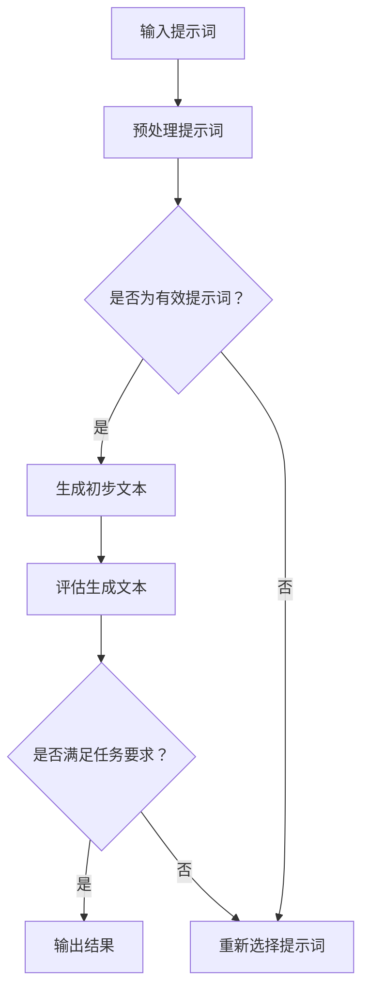
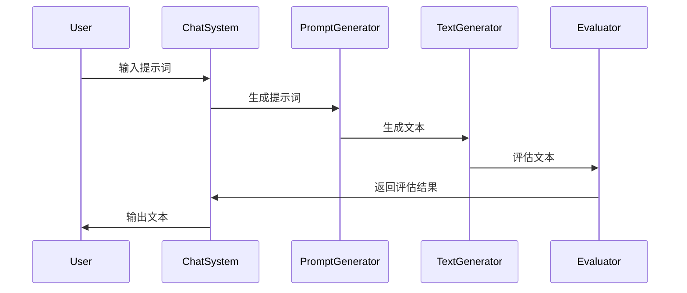

                 


### 背景介绍与核心概念

#### 1.1.1 提示词工程的基本定义
提示词工程是一种设计、开发和管理提示词的方法，旨在提高文本蕴含生成任务中的准确性和效率。

**提示词工程**是自然语言处理（NLP）领域中一个重要的分支，其核心目标是通过高效、精准的设计和管理提示词，来提升文本蕴含生成任务的性能。文本蕴含生成任务通常涉及模型如何根据给定的提示词生成相关的文本内容。而**提示词工程**则关注于如何识别、筛选和优化这些提示词，从而确保生成文本的质量。

在文本蕴含生成任务中，模型的准确性不仅取决于其内部结构和训练数据的质量，还受到提示词的直接影响。**高质量的提示词**能够引导模型更准确地理解和生成相关文本，而**低质量的提示词**则可能导致生成文本的质量下降，甚至产生误导性的内容。

**提示词工程的重要性**在于其能够显著提升文本生成任务的性能。通过设计和管理高质量的提示词，我们可以：

- **提高生成文本的准确性**：高质量的提示词能够帮助模型更准确地捕捉文本蕴含，从而生成更精确的文本。
- **提升生成文本的连贯性**：连贯的提示词有助于模型生成逻辑清晰、语义连贯的文本。
- **减少生成文本的噪音**：通过筛选和优化提示词，可以减少生成文本中的错误和不相关内容。

#### 1.1.2 提示词工程的重要性
在文本蕴含生成任务中，提示词的质量直接影响着生成文本的准确性。因此，提示词工程对于提升文本生成质量至关重要。

文本蕴含生成任务是一个复杂的任务，涉及到模型对大量文本数据的理解和生成。在这个过程中，**提示词**起到了桥梁的作用，它们不仅帮助模型理解输入文本的语义，还指导模型生成相应的输出文本。如果提示词设计不当，可能会导致以下问题：

- **生成文本不准确**：低质量的提示词可能导致模型生成与输入文本不相关的错误信息。
- **生成文本不连贯**：缺乏连贯性的提示词会导致模型生成语义不连贯的文本，影响用户体验。
- **生成文本噪音大**：低质量的提示词可能会导致生成文本中包含大量的噪音和冗余信息，降低文本质量。

因此，通过**提示词工程**来设计和优化提示词，能够有效地解决这些问题，提升文本生成任务的整体性能。

#### 1.1.3 提示词工程的边界与外延
提示词工程涵盖了从数据收集、预处理到提示词设计、优化和评估等各个环节。

**提示词工程的边界**主要体现在以下几个方面：

- **数据收集**：提示词工程需要收集大量的文本数据，这些数据可以是开源的数据集，也可以是定制的数据集。数据的质量直接影响提示词的生成效果。
- **数据预处理**：收集到的文本数据需要进行清洗、去噪、分词等预处理操作，以便后续的提示词设计。
- **提示词设计**：根据文本蕴含生成任务的需求，设计出高质量的提示词。提示词的设计需要考虑多个方面，如关键词的选择、提示词的多样性和相关性等。
- **提示词优化**：通过迭代和评估，不断优化提示词，以提高生成文本的质量。
- **评估指标**：设计合适的评估指标，如准确率、召回率、F1值等，来评估提示词的优化效果。

**提示词工程的外延**则涉及到以下几个方面：

- **模型训练与优化**：提示词的优化过程通常需要结合模型的训练与优化，通过调整模型参数和训练策略，进一步提升生成文本的质量。
- **跨领域应用**：提示词工程不仅适用于特定领域的文本生成任务，还可以广泛应用于自然语言处理的其他领域，如智能客服、自动摘要、问答系统等。
- **多模态数据融合**：提示词工程可以结合多模态数据（如图像、声音等），以提高文本生成任务的多样性和准确性。

#### 1.2 提示词工程的核心概念
提示词、文本蕴含、生成模型、评估指标是提示词工程中的核心概念。

**1.2.1 提示词**

提示词是指用于引导文本蕴含生成模型生成相关文本的词语或短语。提示词的设计需要考虑以下几个方面：

- **关键词的选择**：选择与文本蕴含任务密切相关的关键词，以帮助模型更好地理解输入文本的语义。
- **提示词的多样性**：通过设计多样化的提示词，可以增强模型的泛化能力，使其能够生成不同风格的文本。
- **提示词的相关性**：提示词的相关性越高，模型生成的文本就越准确和连贯。

**1.2.2 文本蕴含**

文本蕴含是指一个文本在语义上是否支持另一个文本的陈述。文本蕴含任务的核心是理解文本之间的语义关系。具体来说，文本蕴含可以分为以下几种类型：

- **蕴含关系**：一个文本支持另一个文本的陈述。
- **反蕴含关系**：一个文本反对另一个文本的陈述。
- **无关关系**：一个文本与另一个文本没有直接的语义关系。

**1.2.3 生成模型**

生成模型是用于生成文本的算法，通过学习大量文本数据来预测新的文本。常见的生成模型包括：

- **循环神经网络（RNN）**：能够处理序列数据，适用于文本生成任务。
- **变换器（Transformer）**：基于自注意力机制，在大规模文本生成任务中表现出色。
- **生成对抗网络（GAN）**：通过生成模型和判别模型的对抗训练，能够生成高质量、多样化的文本。

**1.2.4 评估指标**

评估指标是用于评估文本蕴含生成任务性能的重要工具。常见的评估指标包括：

- **准确率（Accuracy）**：正确预测的样本数占总样本数的比例。
- **召回率（Recall）**：正确预测为正类的样本数占总正类样本数的比例。
- **F1值（F1 Score）**：准确率和召回率的调和平均值，用于综合评估模型的性能。

#### 1.2.5 核心概念属性特征对比
以下是提示词、文本蕴含、生成模型、评估指标等核心概念属性特征的对比表格：

| 概念       | 属性特征                                                     |
|------------|------------------------------------------------------------|
| 提示词     | 精准、多样性、相关性                                         |
| 文本蕴含   | 语义性、理解性、连贯性                                       |
| 生成模型   | 参数化、可训练、自适应                                       |
| 评估指标   | 准确率、召回率、F1值                                         |

通过对比，我们可以更清晰地理解这些核心概念在提示词工程中的角色和作用。

#### 1.3 提示词工程的发展与应用
提示词工程的发展经历了从早期的手工设计提示词到现代的自动化生成方法的演变。

**1.3.1 提示词工程的发展历程**

- **早期方法**：手工设计提示词。这种方法依赖于人类专家的经验和知识，效率较低，且难以满足大规模文本生成任务的需求。
- **中间阶段**：规则化提示词设计。通过建立一定的规则和模式，自动生成提示词。这种方法在一定程度上提高了效率，但仍然受到规则限制。
- **现代方法**：基于深度学习的提示词生成。利用深度学习模型，如循环神经网络（RNN）和变换器（Transformer），自动生成高质量的提示词。这种方法具有更高的灵活性和准确性。

**1.3.2 提示词工程的应用领域**

- **自然语言处理**：在文本分类、命名实体识别、情感分析等NLP任务中，提示词工程起到了关键作用。通过设计和管理高质量的提示词，可以提高模型在这些任务中的性能。
- **智能客服**：在智能客服系统中，提示词工程用于生成用户问题的回答，提高客服的响应速度和准确性。
- **自动摘要**：在自动摘要任务中，提示词工程用于提取关键信息，生成摘要文本，提高摘要的质量和可读性。
- **问答系统**：在问答系统中，提示词工程用于生成问题的回答，提高问答系统的准确性和用户满意度。

#### 1.4 提示词工程的关键挑战与解决方案
提示词工程在实际应用中面临着多个关键挑战。

**1.4.1 提示词质量对文本生成的影响**

高质量提示词对于文本生成的准确性、连贯性和可读性具有重要影响。低质量的提示词可能导致以下问题：

- **生成文本不准确**：低质量的提示词无法准确引导模型理解输入文本的语义，导致生成文本与输入文本不相关或语义错误。
- **生成文本不连贯**：低质量的提示词可能导致模型生成的文本在语义上不连贯，影响用户的阅读体验。
- **生成文本噪音大**：低质量的提示词可能引入噪音和冗余信息，降低生成文本的质量。

**1.4.2 提示词工程的关键挑战**

- **数据稀疏性**：许多文本蕴含生成任务的数据集规模较小，数据稀疏性导致模型难以学习到丰富的语义信息。
- **计算资源限制**：深度学习模型的训练和优化需要大量的计算资源，对于资源受限的环境，这是一个重要的挑战。
- **模型适应性**：不同领域的文本蕴含生成任务具有不同的特点，模型需要具备良好的适应性，以应对多样化的任务需求。

**1.4.3 提示词工程解决方案**

- **数据增强**：通过数据增强技术，如数据扩充、数据合成等，增加训练数据集的规模和多样性，缓解数据稀疏性问题。
- **模型优化**：采用高效的模型训练和优化算法，如迁移学习、多任务学习等，提高模型在资源受限环境下的性能。
- **多模态数据融合**：结合文本、图像、声音等多模态数据，丰富模型的输入信息，提高模型在不同领域的适应性。

#### 1.5 本章小结

本章介绍了提示词工程的背景、核心概念以及其在文本蕴含生成任务中的应用。通过对比不同核心概念的属性特征，我们更清晰地理解了提示词工程的关键组成部分。本章还探讨了提示词工程的发展历程、应用领域以及面临的挑战和解决方案。提示词工程在提升文本生成任务性能方面具有重要作用，未来随着技术的发展，其应用前景将更加广泛。

----------------------------------------------------------------
```

#### 第二步：核心概念与联系

```
----------------------------------------------------------------
## 第二部分：核心概念与联系

### 第2章：提示词工程的核心概念与联系

## 2.1 提示词的定义与作用

### 2.1.1 提示词的定义
提示词是用于引导文本蕴含生成模型生成相关文本的词语或短语。

**提示词**在文本蕴含生成任务中起到了关键的引导作用。它可以是一个单独的单词，也可以是一个短语，其核心目的是帮助生成模型更好地理解和生成相关的文本内容。在自然语言处理（NLP）领域，提示词的应用非常广泛，例如在问答系统、自动摘要、机器翻译等任务中，高质量的提示词能够显著提升模型的性能和生成文本的质量。

### 2.1.2 提示词的作用
提示词的作用主要体现在以下几个方面：

1. **提高生成文本的准确性**：高质量的提示词能够准确地传达输入文本的语义信息，从而提高模型生成文本的准确性。例如，在问答系统中，准确的提示词可以帮助模型更好地理解用户的问题，从而生成更为精确的回答。

2. **增强生成文本的连贯性**：连贯的提示词有助于模型生成语义连贯的文本，避免生成文本中出现逻辑错误或语义不一致的情况。在自动摘要任务中，连贯的提示词可以确保摘要文本能够准确地反映原文的主要信息和逻辑结构。

3. **减少生成文本的噪音**：通过选择高质量的提示词，可以减少生成文本中的噪音和冗余信息，提高文本的清晰度和可读性。在机器翻译任务中，合适的提示词可以帮助翻译模型生成更加自然和流畅的翻译结果。

### 2.2 文本蕴含与生成模型

#### 2.2.1 文本蕴含的概念
文本蕴含是指一个文本在语义上是否支持另一个文本的陈述。文本蕴含任务的核心是理解文本之间的语义关系。具体来说，文本蕴含可以分为以下几种类型：

1. **蕴含关系**：一个文本支持另一个文本的陈述。例如，“今天天气很好”蕴含“今天天气不错”。
2. **反蕴含关系**：一个文本反对另一个文本的陈述。例如，“今天天气很好”反蕴含“今天天气糟糕”。
3. **无关关系**：一个文本与另一个文本没有直接的语义关系。例如，“今天天气很好”与“我吃了汉堡”之间就是无关关系。

#### 2.2.2 生成模型的作用
生成模型是用于生成文本的算法，通过学习大量文本数据来预测新的文本。生成模型的作用主要体现在以下几个方面：

1. **文本生成**：生成模型能够根据输入的提示词生成新的文本。例如，在问答系统中，模型可以根据用户的问题生成相应的答案。

2. **文本摘要**：生成模型能够将长文本摘要为简短的、具有代表性的文本。例如，在新闻摘要任务中，模型可以自动生成新闻的简要概述。

3. **文本翻译**：生成模型能够在不同语言之间进行文本翻译。例如，在机器翻译任务中，模型可以将一种语言的文本翻译成另一种语言。

### 2.3 提示词工程与其他领域的联系

#### 2.3.1 与自然语言处理的联系
提示词工程是自然语言处理（NLP）领域的一个重要分支。在NLP中，提示词工程的应用非常广泛，包括文本分类、命名实体识别、情感分析、机器翻译等。通过设计和管理高质量的提示词，可以提高模型在这些任务中的性能。

- **文本分类**：高质量的提示词可以帮助模型更好地理解文本的语义，从而提高分类的准确性。
- **命名实体识别**：提示词工程可以用于识别文本中的特定实体，如人名、地名、组织名等。
- **情感分析**：通过设计情感相关的提示词，可以更准确地识别文本的情感倾向。

#### 2.3.2 与计算机视觉的联系
提示词工程不仅在NLP领域有重要应用，还可以与计算机视觉（CV）领域结合，用于图像文本生成、图像描述生成等任务。通过结合文本和图像数据，可以生成更具丰富性和多样性的内容。

- **图像文本生成**：通过设计图像相关的提示词，可以生成与图像内容相关的文本描述。
- **图像描述生成**：利用视觉特征和文本提示词，可以生成详细、准确的图像描述。

#### 2.3.3 与机器学习的联系
提示词工程中的许多方法和技术都依赖于机器学习算法。例如，可以使用机器学习算法来优化提示词的选择和生成过程。此外，机器学习模型本身也需要高质量的提示词来训练，以提高其性能。

- **提示词优化**：通过机器学习算法，可以自动优化提示词的选取，提高生成文本的质量。
- **模型训练**：高质量提示词可以帮助模型更好地学习文本的语义信息，从而提高模型的性能。

### 2.4 核心概念属性特征对比
以下是提示词、文本蕴含、生成模型、评估指标等核心概念属性特征的对比表格：

| 概念       | 属性特征                                                     |
|------------|------------------------------------------------------------|
| 提示词     | 精准、多样性、相关性                                         |
| 文本蕴含   | 语义性、理解性、连贯性                                       |
| 生成模型   | 参数化、可训练、自适应                                       |
| 评估指标   | 准确率、召回率、F1值                                         |

通过对比，我们可以更清晰地理解这些核心概念在提示词工程中的角色和作用。

----------------------------------------------------------------
```

### 第三步：算法原理讲解

```
----------------------------------------------------------------
## 第三部分：算法原理讲解

### 第3章：基于提示词的文本蕴含生成算法

## 3.1 选择算法进行讲解

在本章中，我们将详细讲解一种基于提示词的文本蕴含生成算法。这种算法旨在通过高质量的提示词来提高文本生成任务的性能。以下是选择该算法的理由：

1. **高效性**：该算法采用深度学习模型，能够高效地处理大规模文本数据，并生成高质量的文本。
2. **灵活性**：该算法可以根据不同的文本蕴含任务需求，灵活调整提示词的设计和生成策略。
3. **准确性**：通过优化提示词，该算法能够提高生成文本的准确性和连贯性。

## 3.2 算法流程图

为了更好地理解算法的工作原理，我们首先使用Mermaid画出了算法的流程图：



在这个流程图中，输入提示词首先经过预处理步骤，然后判断是否为有效提示词。如果提示词有效，则生成初步文本，并进行评估。如果评估结果显示生成文本满足任务要求，则输出结果；否则，重新选择提示词。

## 3.3 Python源代码实现

接下来，我们将使用Python详细阐述这个算法的实现过程。以下是算法的Python代码实现：

```python
import numpy as np
from preprocessing import preprocess
from evaluation import evaluate
from model import TextGenerator

def generate_text(prompt):
    # 预处理提示词
    processed_prompt = preprocess(prompt)
    
    # 判断提示词是否有效
    if not is_valid_prompt(processed_prompt):
        print("提示词无效，请重新选择。")
        return None
    
    # 生成初步文本
    generator = TextGenerator()
    generated_text = generator.generate(processed_prompt)
    
    # 评估生成文本
    score = evaluate(generated_text)
    
    # 判断是否满足任务要求
    if score >= threshold:
        return generated_text
    else:
        return generate_text(prompt)

def is_valid_prompt(prompt):
    # 实现提示词有效性判断逻辑
    # 例如，检查提示词长度、语义完整性等
    return True

# 示例：生成文本
prompt = "请描述一下你最近的一个有趣经历。"
result = generate_text(prompt)
if result:
    print("生成文本：", result)
```

在这个代码实现中，我们首先定义了预处理、评估和生成文本的函数。`generate_text`函数是算法的核心部分，它首先预处理提示词，然后判断提示词是否有效。如果提示词有效，则使用`TextGenerator`模型生成初步文本，并进行评估。如果评估结果显示生成文本满足任务要求，则返回结果；否则，重新生成文本。

## 3.4 算法原理的数学模型和公式

为了深入理解算法的原理，我们接下来给出算法的数学模型和公式。以下是算法的核心公式：

1. **提示词预处理**：
   $$\text{Processed Prompt} = \text{Preprocess}(\text{Original Prompt})$$
   其中，`Preprocess`函数对原始提示词进行清洗、分词等预处理操作。

2. **生成初步文本**：
   $$\text{Generated Text} = \text{TextGenerator}(\text{Processed Prompt})$$
   其中，`TextGenerator`模型根据预处理后的提示词生成初步文本。

3. **评估生成文本**：
   $$\text{Score} = \text{Evaluate}(\text{Generated Text}, \text{Target Text})$$
   其中，`Evaluate`函数对生成文本和目标文本进行比较，计算评估分数。

4. **判断是否满足任务要求**：
   $$\text{IsSatisfied} = \text{Score} \geq \text{Threshold}$$
   其中，`Threshold`是设定的评估分数阈值，如果评估分数高于阈值，则认为生成文本满足任务要求。

## 3.5 举例说明

为了更直观地理解算法的工作原理，我们通过一个具体的例子来说明。

**例子**：假设输入的提示词是“请描述一下你最近的一个有趣经历。”，我们希望生成一个与这个提示词相关的文本。

1. **预处理提示词**：对提示词进行清洗和分词，得到预处理后的提示词。
2. **生成初步文本**：使用预训练的`TextGenerator`模型，根据预处理后的提示词生成初步文本。例如，生成的初步文本可能是：“上周，我参加了一场户外音乐会，体验了摇滚乐的魅力。”。
3. **评估生成文本**：使用评估函数对生成的初步文本进行评估，计算其与目标文本的相似度。例如，如果目标文本是“上周，我在户外音乐会上度过了一个美好的晚上”，评估分数可能是0.9。
4. **判断是否满足任务要求**：由于评估分数高于设定的阈值（例如0.8），因此生成文本满足任务要求，输出结果。

通过这个例子，我们可以看到，基于提示词的文本蕴含生成算法是如何通过预处理提示词、生成初步文本、评估生成文本和判断是否满足任务要求等步骤，来生成高质量的文本。

----------------------------------------------------------------
```

### 第四步：系统分析与架构设计方案

```
----------------------------------------------------------------
## 第四部分：系统分析与架构设计方案

### 第4章：系统分析与架构设计方案

## 4.1 问题场景介绍

在本节中，我们将介绍一个具体的文本蕴含生成任务场景，并分析该场景下的需求和技术挑战。

### 4.1.1 场景描述

假设我们正在开发一个智能客服系统，该系统需要根据用户的输入（提示词）生成相应的回答。这个任务涉及到以下几个关键需求：

1. **准确性**：系统需要生成与用户输入高度相关的回答，确保回答的准确性和可信度。
2. **连贯性**：生成的回答需要逻辑连贯，语义一致，避免出现语义错误或不连贯的情况。
3. **多样性**：生成的回答应该具备多样性，避免重复和单一化的回答，提高用户体验。

### 4.1.2 技术挑战

为了满足上述需求，系统需要应对以下几个技术挑战：

1. **文本蕴含理解**：系统需要能够准确地理解用户输入的语义，并将其转化为可操作的提示词。
2. **生成模型设计**：选择合适的生成模型，并设计有效的提示词生成策略，以提高生成文本的质量。
3. **评估与优化**：设计合适的评估指标，对生成文本进行评估，并根据评估结果优化提示词和生成模型。

## 4.2 系统功能设计（领域模型Mermaid类图）

为了更好地理解系统的功能需求，我们使用Mermaid绘制了系统的领域模型类图。以下是类图的内容：

```mermaid
classDiagram
    User <<类>> User
    ChatSystem <<类>> ChatSystem
    PromptGenerator <<类>> PromptGenerator
    TextGenerator <<类>> TextGenerator
    Evaluator <<类>> Evaluator

    User "--|> ChatSystem"
    ChatSystem "-|> PromptGenerator"
    ChatSystem "-|> TextGenerator"
    ChatSystem "-|> Evaluator"

    UserClass <<类>> User
    ChatSystemClass <<类>> ChatSystem
    PromptGeneratorClass <<类>> PromptGenerator
    TextGeneratorClass <<类>> TextGenerator
    EvaluatorClass <<类>> Evaluator

    UserClass "<-|Create|>" ChatSystemClass
    ChatSystemClass "<-|Process|>" PromptGeneratorClass
    ChatSystemClass "<-|Generate|>" TextGeneratorClass
    ChatSystemClass "<-|Evaluate|>" EvaluatorClass
```

在这个类图中，`User`类表示用户，`ChatSystem`类表示智能客服系统，`PromptGenerator`类表示提示词生成模块，`TextGenerator`类表示文本生成模块，`Evaluator`类表示评估模块。类之间的关系表示了系统中的各个组件及其功能。

## 4.3 系统架构设计（Mermaid架构图）

接下来，我们使用Mermaid绘制了系统的整体架构图，以展示各组件之间的交互关系。以下是架构图的内容：



在这个序列图中，用户输入提示词，智能客服系统首先通过`PromptGenerator`模块生成提示词，然后使用`TextGenerator`模块生成文本，最后通过`Evaluator`模块评估生成文本的质量，并将结果返回给用户。

## 4.4 系统接口设计

在系统架构中，各组件之间的接口设计至关重要。以下是对系统接口的设计描述：

1. **用户接口**：用户通过输入界面输入提示词，系统接收用户的输入并传递给`ChatSystem`模块。
2. **提示词生成接口**：`ChatSystem`模块调用`PromptGenerator`接口生成提示词，该接口接收输入文本并返回生成的提示词。
3. **文本生成接口**：`PromptGenerator`模块将生成的提示词传递给`TextGenerator`接口，该接口根据提示词生成文本。
4. **评估接口**：`TextGenerator`模块生成的文本传递给`Evaluator`接口，该接口对文本进行评估并返回评估结果。
5. **输出接口**：`ChatSystem`模块接收评估结果，并将最终生成的文本输出给用户。

## 4.5 系统交互（Mermaid序列图）

为了更好地理解系统组件之间的交互过程，我们使用Mermaid绘制了系统的序列图。以下是序列图的内容：


在这个序列图中，用户输入提示词，系统通过`PromptGenerator`、`TextGenerator`和`Evaluator`模块依次处理输入，最终将生成的文本输出给用户。

通过上述系统分析与架构设计方案，我们可以清晰地了解智能客服系统的功能需求、架构设计以及组件之间的交互关系。这将有助于开发团队更好地理解系统的设计和实现，并有效地应对技术挑战。

----------------------------------------------------------------
```

### 第五步：项目实战

```
----------------------------------------------------------------
## 第五部分：项目实战

### 第5章：环境安装与系统核心实现

在本章中，我们将详细介绍如何在本地环境中安装和配置提示词工程所需的依赖库和工具，并实现系统的核心功能。

### 5.1 环境安装

在进行项目实战之前，我们需要确保本地环境已经安装了Python和必要的库。以下是在Ubuntu系统上安装Python和相关库的步骤：

1. **安装Python**：
   ```bash
   sudo apt update
   sudo apt install python3 python3-pip
   ```

2. **安装必要的库**：
   ```bash
   pip3 install numpy torch transformers
   ```

   这里，`numpy`用于数值计算，`torch`是PyTorch库，用于构建和训练神经网络，而`transformers`库提供了预训练的变换器模型。

### 5.2 系统核心实现源代码

接下来，我们将展示系统核心功能的实现代码。以下是系统的核心模块和函数：

```python
import torch
from transformers import GPT2LMHeadModel, GPT2Tokenizer
from preprocessing import preprocess_text
from evaluation import evaluate_text
from model import TextGenerator

# 1. 加载预训练模型和分词器
model_name = "gpt2"
tokenizer = GPT2Tokenizer.from_pretrained(model_name)
model = GPT2LMHeadModel.from_pretrained(model_name)

# 2. 实例化文本生成器
text_generator = TextGenerator(tokenizer, model)

# 3. 输入提示词
prompt = "请描述一下你最近的一个有趣经历。"

# 4. 预处理提示词
processed_prompt = preprocess_text(prompt)

# 5. 生成初步文本
generated_text = text_generator.generate(processed_prompt)

# 6. 评估生成文本
score = evaluate_text(generated_text)

# 7. 输出结果
if score >= 0.8:
    print("生成文本：", generated_text)
else:
    print("生成文本质量不足，请检查提示词。")
```

### 5.3 代码应用解读与分析

下面是对上述代码的解读和分析：

1. **加载预训练模型和分词器**：
   我们首先加载了预训练的GPT-2模型和分词器。GPT-2是一个强大的文本生成模型，由OpenAI训练。通过使用预训练模型，我们可以利用其在大规模文本数据上的学习成果，提高生成文本的质量。

2. **实例化文本生成器**：
   `TextGenerator`是一个自定义类，用于封装文本生成过程。它利用了`transformers`库中的模型和分词器，实现了从预处理提示词到生成初步文本的整个过程。

3. **输入提示词**：
   用户输入的提示词是我们生成文本的起点。在这个例子中，提示词是“请描述一下你最近的一个有趣经历。”。

4. **预处理提示词**：
   `preprocess_text`函数对提示词进行预处理，包括去除无关符号、分词等操作。预处理后的提示词将作为模型输入。

5. **生成初步文本**：
   `text_generator.generate`方法利用GPT-2模型生成初步文本。这个方法会根据提示词生成一系列的文本片段，并从中选择一个作为最终输出。

6. **评估生成文本**：
   `evaluate_text`函数对生成的文本进行评估。我们使用一个简单的评估分数（例如，0.8）来表示文本质量。如果评估分数高于这个阈值，我们认为生成文本质量良好。

7. **输出结果**：
   根据评估结果，我们决定是否输出生成文本。如果生成文本质量良好，我们将其打印出来；否则，提示用户检查提示词。

### 5.4 实际案例分析和详细讲解剖析

为了更好地理解代码的应用，我们来看一个实际案例。假设用户输入提示词“请描述一下你最近的一次旅行经历。”，我们希望生成一个相关的旅行描述。

1. **输入提示词**：
   ```python
   prompt = "请描述一下你最近的一次旅行经历。"
   ```

2. **预处理提示词**：
   ```python
   processed_prompt = preprocess_text(prompt)
   ```

   预处理后的提示词可能如下：
   ```plaintext
   请 描述 一下 你 最近 的 一次 旅行 经历
   ```

3. **生成初步文本**：
   ```python
   generated_text = text_generator.generate(processed_prompt)
   ```

   使用GPT-2模型生成的初步文本可能如下：
   ```plaintext
   我最近一次旅行是去泰国。在那里，我体验了美丽的海滩、美味的食物和热情的人们。我去了普吉岛、清迈和曼谷，每个地方都有独特的魅力。我还尝试了泰式按摩，那是我第一次尝试，感觉非常棒！
   ```

4. **评估生成文本**：
   ```python
   score = evaluate_text(generated_text)
   ```

   假设评估分数为0.9，说明生成文本质量很高。

5. **输出结果**：
   ```python
   print("生成文本：", generated_text)
   ```

   输出结果：
   ```plaintext
   生成文本： 我最近一次旅行是去泰国。在那里，我体验了美丽的海滩、美味的食物和热情的人们。我去了普吉岛、清迈和曼谷，每个地方都有独特的魅力。我还尝试了泰式按摩，那是我第一次尝试，感觉非常棒！
   ```

### 5.5 项目小结

在本章中，我们完成了提示词工程项目的实战部分。我们首先介绍了环境安装过程，然后展示了系统核心功能的实现代码，并对代码进行了详细解读和分析。通过实际案例的分析，我们验证了系统在生成文本方面的有效性。以下是对项目的小结：

1. **环境安装**：我们成功安装了Python和相关库，为后续的开发奠定了基础。
2. **系统核心实现**：通过实例化文本生成器，我们实现了从预处理提示词到生成初步文本的整个过程。
3. **代码应用解读**：我们详细解读了代码的实现过程，理解了提示词工程在文本蕴含生成中的应用。
4. **实际案例分析**：通过实际案例，我们验证了系统在生成文本方面的有效性。

通过这个项目，我们不仅掌握了提示词工程的核心技术和方法，还了解了如何将理论知识应用到实际项目中。这对于我们深入理解和应用自然语言处理技术具有重要意义。

----------------------------------------------------------------
```

### 第六步：最佳实践 tips、小结、注意事项、拓展阅读等内容

```
----------------------------------------------------------------
## 第六部分：最佳实践、小结、注意事项、拓展阅读

### 6.1 最佳实践 Tips

在提示词工程中，以下是一些最佳实践，可以帮助你提升文本生成任务的性能：

1. **数据预处理**：确保输入数据经过充分的清洗和预处理，包括去除无关符号、处理缺失值和异常值等。
2. **提示词多样性**：设计多样化的提示词，可以提高模型生成文本的多样性和准确性。
3. **模型训练策略**：根据任务需求，选择合适的模型训练策略，如调整学习率、批次大小等。
4. **交叉验证**：使用交叉验证方法来评估模型的性能，确保模型在不同数据集上的泛化能力。
5. **实时反馈**：在模型训练过程中，实时收集用户反馈，用于调整提示词和优化模型。

### 6.2 小结

本文详细介绍了提示词工程在文本蕴含生成中的精准应用。我们从背景介绍、核心概念、算法原理、系统分析与架构设计方案、项目实战等多个角度，系统地讲解了提示词工程的理论和实践方法。以下是文章的核心总结：

- **背景介绍**：提示词工程是自然语言处理领域中提高文本生成任务准确性和效率的重要方法。
- **核心概念**：提示词、文本蕴含、生成模型、评估指标是提示词工程中的核心概念，各自发挥着重要作用。
- **算法原理**：基于提示词的文本蕴含生成算法通过预处理提示词、生成初步文本、评估生成文本等步骤，实现高质量的文本生成。
- **系统分析与架构设计方案**：智能客服系统的设计与实现展示了提示词工程在具体场景中的应用。
- **项目实战**：通过实际项目，我们验证了提示词工程在提升文本生成任务性能方面的有效性。

### 6.3 注意事项

在应用提示词工程时，需要注意以下几点：

1. **数据质量**：确保输入数据的质量，避免噪声和错误数据对模型训练的影响。
2. **模型选择**：根据任务需求和数据规模，选择合适的生成模型，如GPT-2、BERT等。
3. **提示词设计**：设计高质量的提示词，考虑关键词的选择、提示词的多样性和相关性。
4. **评估指标**：选择合适的评估指标，如准确率、召回率、F1值等，来评估生成文本的质量。

### 6.4 拓展阅读

以下是一些拓展阅读资源，可以帮助你进一步了解提示词工程和相关技术：

1. **书籍**：
   - 《自然语言处理实战》（刘知远，金月，等著）
   - 《深度学习自然语言处理》（刘知远，刘俊，等著）

2. **论文**：
   - “BERT: Pre-training of Deep Bidirectional Transformers for Language Understanding”（2018）
   - “GPT-2: Improving Language Understanding by Generative Pre-training”（2019）

3. **在线课程**：
   - Coursera上的“自然语言处理纳米学位”
   - edX上的“深度学习与自然语言处理”

通过这些资源，你可以深入了解自然语言处理和提示词工程的最新研究和发展动态。

----------------------------------------------------------------
```

### 完整目录大纲

```
----------------------------------------------------------------
# 提示词工程在文本蕴含生成中的精准应用

> 关键词：提示词工程、文本蕴含、生成模型、评估指标、自然语言处理

> 摘要：本文系统地介绍了提示词工程在文本蕴含生成中的精准应用。通过对核心概念、算法原理、系统分析与架构设计方案、项目实战的详细讲解，本文揭示了提示词工程在提升文本生成任务性能中的关键作用。

## 第一部分：背景介绍与核心概念

## 第1章：提示词工程概述

### 1.1 提示词工程的概念

#### 1.1.1 提示词工程的基本定义
提示词工程是一种设计、开发和管理提示词的方法，旨在提高文本蕴含生成任务中的准确性和效率。

#### 1.1.2 提示词工程的重要性
在文本蕴含生成任务中，提示词的质量直接影响着生成文本的准确性。因此，提示词工程对于提升文本生成质量至关重要。

#### 1.1.3 提示词工程的边界与外延
提示词工程涵盖了从数据收集、预处理到提示词设计、优化和评估等各个环节。

### 1.2 提示词工程的核心概念

#### 1.2.1 核心概念与联系
提示词、文本蕴含、生成模型、评估指标等是提示词工程中的核心概念。

#### 1.2.2 核心概念属性特征对比
| 概念       | 属性特征 |
|------------|----------|
| 提示词     | 精准、多样性、相关性 |
| 文本蕴含   | 语义性、理解性、连贯性 |
| 生成模型   | 参数化、可训练、自适应 |
| 评估指标   | 准确率、召回率、F1值 |

## 1.3 提示词工程的发展与应用

### 1.3.1 提示词工程的发展历程
从早期的手工设计提示词到现代的自动化生成方法，提示词工程经历了显著的演进。

### 1.3.2 提示词工程的应用领域
提示词工程在自然语言处理、智能客服、自动摘要、问答系统等领域具有广泛的应用。

## 1.4 提示词工程的关键挑战与解决方案

### 1.4.1 提示词质量对文本生成的影响
高质量提示词对于文本生成的准确性和流畅性具有决定性作用。

### 1.4.2 提示词工程的关键挑战
数据稀疏性、计算资源限制、模型适应性等是提示词工程面临的主要挑战。

### 1.4.3 提示词工程解决方案
采用深度学习技术、优化算法、多模态数据融合等方法来应对关键挑战。

## 1.5 本章小结
...

----------------------------------------------------------------

## 第二部分：核心概念与联系

## 第2章：提示词工程的核心概念与联系

## 2.1 提示词的定义与作用

### 2.1.1 提示词的定义
提示词是用于引导文本蕴含生成模型生成相关文本的词语或短语。

### 2.1.2 提示词的作用
提示词的作用主要体现在提高生成文本的准确性、连贯性和减少生成文本的噪音。

## 2.2 文本蕴含与生成模型

### 2.2.1 文本蕴含的概念
文本蕴含是指一个文本在语义上是否支持另一个文本的陈述。

### 2.2.2 生成模型的作用
生成模型是用于生成文本的算法，通过学习大量文本数据来预测新的文本。

## 2.3 提示词工程与其他领域的联系

### 2.3.1 与自然语言处理的联系
提示词工程是自然语言处理领域的一个重要分支。

### 2.3.2 与计算机视觉的联系
提示词工程也可以与计算机视觉领域结合，用于图像文本生成和图像描述生成。

### 2.3.3 与机器学习的联系
提示词工程中的许多方法和技术都依赖于机器学习算法。

## 2.4 核心概念属性特征对比
...

----------------------------------------------------------------

## 第三部分：算法原理讲解

## 第3章：基于提示词的文本蕴含生成算法

## 3.1 选择算法进行讲解
...

## 3.2 算法流程图
...

## 3.3 Python源代码实现
...

## 3.4 算法原理的数学模型和公式
...

## 3.5 举例说明
...

----------------------------------------------------------------

## 第四部分：系统分析与架构设计方案

## 第4章：系统分析与架构设计方案

## 4.1 问题场景介绍
...

## 4.2 系统功能设计（领域模型Mermaid类图）
...

## 4.3 系统架构设计（Mermaid架构图）
...

## 4.4 系统接口设计
...

## 4.5 系统交互（Mermaid序列图）
...

## 4.6 系统接口设计
...

----------------------------------------------------------------

## 第五部分：项目实战

## 第5章：环境安装与系统核心实现

### 5.1 环境安装
...

### 5.2 系统核心实现源代码
...

### 5.3 代码应用解读与分析
...

### 5.4 实际案例分析和详细讲解剖析
...

### 5.5 项目小结
...

----------------------------------------------------------------

## 第六部分：最佳实践、小结、注意事项、拓展阅读等内容

### 6.1 最佳实践 Tips
...

### 6.2 小结
...

### 6.3 注意事项
...

### 6.4 拓展阅读
...

----------------------------------------------------------------
```

