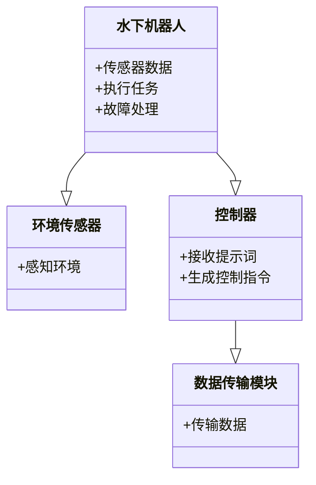
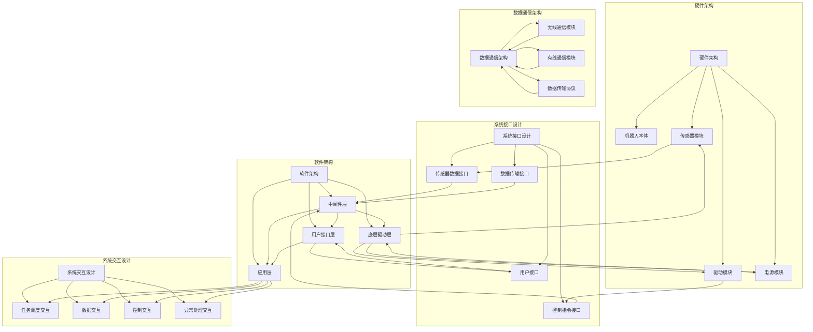

                 

### 引言

智能水下机器人控制领域近年来取得了显著的进展，然而，随着任务复杂度的增加，传统控制方法面临诸多挑战。这些问题不仅影响了水下机器人的工作效率，还限制了其在深水、复杂环境等极端条件下的应用。在此背景下，提示词工程作为一种新兴的智能技术，逐渐引起了研究者和工程师的广泛关注。

提示词工程的核心在于通过预先定义的提示词，指导智能系统进行决策和任务执行。这些提示词不仅能够明确任务目标，还能提供必要的上下文信息，从而提高系统的自适应能力和响应速度。在智能水下机器人控制中，提示词工程的应用具有极大的潜力，能够有效解决传统控制方法的局限性，提高水下机器人的自主性和智能化水平。

本文将围绕提示词工程在智能水下机器人控制中的应用前景展开探讨。首先，我们将介绍智能水下机器人控制的重要性以及当前面临的挑战，接着详细阐述提示词工程的基本概念、原理及其在智能水下机器人控制中的应用。随后，我们将分析提示词工程的核心概念、原理与属性特征，并通过ER实体关系图来直观展示其在系统架构中的关系。随后，我们将深入讲解提示词工程中的算法原理和数学模型，并通过实际案例进行分析。最后，我们将介绍系统功能设计和架构设计，探讨未来发展方向和潜在挑战。

通过本文的深入探讨，我们希望读者能够全面了解提示词工程在智能水下机器人控制中的应用前景，激发对这一领域的兴趣和研究热情。同时，本文也希望能够为相关领域的实际应用提供有价值的参考和指导。

## 第一部分：背景介绍

### 第1章：智能水下机器人控制概述

#### 1.1 问题背景

水下环境复杂多变，温度、压力、能见度等因素对水下机器人的控制提出了极高的要求。传统的水下机器人控制主要依赖于预设的路径规划和简单的传感器数据反馈，这些方法在面对复杂任务时往往显得力不从心。随着水下作业需求的增加，特别是深海资源开发、海底管道巡检、海底地形测绘等领域的拓展，对智能水下机器人控制系统的需求愈加迫切。

智能水下机器人控制的重要性主要体现在以下几个方面：

1. **提高自主性**：智能控制系统能够根据环境变化自主调整行动策略，减少对人工干预的依赖。
2. **增强适应性**：通过人工智能技术，水下机器人可以适应更加复杂和多变的水下环境，执行更加复杂的任务。
3. **提升效率**：智能控制系统能够优化路径规划，减少不必要的移动，提高作业效率。

#### 1.1.2 智能水下机器人控制的挑战

尽管智能水下机器人控制系统具有巨大潜力，但其发展仍面临诸多挑战：

1. **环境复杂性**：水下环境具有高度的不确定性，包括水流、温度、压力等变化，这些都给控制系统的设计带来了巨大的挑战。
2. **传感器限制**：现有水下传感器的精度和可靠性有限，难以获取全面和准确的环境信息。
3. **计算资源限制**：水下机器人通常具有较小的体积和功耗，有限的计算资源限制了智能算法的复杂度。
4. **通信延迟**：水下通信距离受限，通信延迟和丢包问题显著，这对实时控制系统的设计提出了更高的要求。

#### 1.1.3 提示词工程的概念及其在控制中的应用

提示词工程（Prompt Engineering）是一种通过设计特定的提示词来指导智能系统决策和任务执行的技术。提示词是一组能够清晰表达任务目标和上下文的词汇或短语，它们为智能系统提供了明确的任务方向和必要的信息。

在智能水下机器人控制中，提示词工程的应用具有重要意义：

1. **任务明确化**：通过提示词，智能系统能够明确理解任务目标和要求，从而做出更为精确的决策。
2. **上下文增强**：提示词提供了与任务相关的上下文信息，有助于智能系统更好地理解环境变化，提高任务适应性。
3. **交互优化**：提示词工程能够优化人与机器、机器与机器之间的交互，提升系统的协同效率。
4. **简化算法设计**：通过提示词，智能系统可以简化算法设计，降低计算复杂度，提高实时响应能力。

#### 1.2 问题描述

智能水下机器人控制的主要需求包括：

1. **路径规划**：在复杂水下环境中，机器人需要能够自主规划高效、安全的路径。
2. **任务执行**：根据任务需求，机器人需要能够执行如探矿、测绘、巡检等复杂任务。
3. **故障处理**：在遇到故障或异常情况时，机器人需要能够进行自主诊断和故障处理。

当前水下机器人控制存在的问题主要包括：

1. **环境感知不足**：由于传感器限制，机器人难以全面感知环境，影响路径规划和任务执行。
2. **计算资源有限**：水下机器人通常搭载有限的计算资源，难以运行复杂的智能算法。
3. **通信延迟**：水下通信距离有限，导致实时性要求高的任务难以完成。
4. **交互复杂**：传统控制方法中，人与机器人、机器与机器之间的交互复杂，难以实现高效协同。

#### 1.2.3 提示词工程如何解决这些问题

提示词工程通过以下方式解决上述问题：

1. **环境感知**：通过设计特定提示词，智能系统能够更好地理解环境变化，提高环境感知能力。
2. **计算资源优化**：提示词工程能够简化算法设计，降低计算复杂度，适应水下机器人的计算资源限制。
3. **通信优化**：提示词工程能够优化通信流程，减少通信延迟，提高系统实时响应能力。
4. **交互简化**：通过提示词，智能系统能够更明确地传达任务目标，简化人与机器、机器与机器之间的交互，提升协同效率。

#### 1.3 问题解决

**1.3.1 提示词工程的基本原理**

提示词工程的基本原理主要包括：

1. **任务明确化**：通过设计明确、具体的提示词，智能系统能够准确理解任务目标和要求。
2. **上下文增强**：提示词提供了与任务相关的上下文信息，帮助智能系统更好地理解环境变化。
3. **知识表示**：提示词工程通过将任务知识进行结构化表示，便于智能系统进行推理和决策。
4. **交互优化**：提示词工程通过优化交互流程，简化了人与机器、机器与机器之间的沟通。

**1.3.2 提示词工程在智能水下机器人控制中的应用**

提示词工程在智能水下机器人控制中的应用主要表现在：

1. **路径规划**：通过提示词，智能系统能够获取环境信息，优化路径规划策略，提高路径规划的准确性和效率。
2. **任务执行**：提示词能够指导智能系统执行特定任务，提高任务执行的成功率和效率。
3. **故障处理**：提示词工程能够帮助智能系统进行自主诊断和故障处理，提高系统的可靠性和鲁棒性。

**1.3.3 提示词工程的边界与外延**

提示词工程的边界主要涉及：

1. **应用场景**：提示词工程适用于需要明确任务目标和上下文信息的应用场景。
2. **算法复杂度**：提示词工程对算法复杂度有一定的要求，不能过于复杂，以保证系统的实时响应能力。

提示词工程的外延包括：

1. **知识表示**：提示词工程不仅涉及提示词的设计，还涉及知识表示和推理机制的设计。
2. **交互优化**：提示词工程还涉及到人与机器、机器与机器之间的交互优化，以提升系统的协同效率。

#### 1.4 概念结构与核心要素组成

**1.4.1 智能水下机器人控制的概念结构**

智能水下机器人控制的概念结构主要包括：

1. **任务目标**：任务目标是智能系统需要达成的目标，如路径规划、任务执行等。
2. **环境感知**：环境感知是智能系统获取环境信息的过程，包括传感器数据采集和处理。
3. **任务执行**：任务执行是智能系统根据任务目标和环境信息进行决策和行动的过程。
4. **反馈机制**：反馈机制用于评估任务执行效果，并提供反馈信息以调整后续行动。

**1.4.2 提示词工程的概念结构**

提示词工程的概念结构主要包括：

1. **提示词设计**：提示词设计是设计明确、具体的提示词，用于指导智能系统的决策和行动。
2. **知识表示**：知识表示是将任务知识结构化表示，以便智能系统进行推理和决策。
3. **上下文管理**：上下文管理是管理与任务相关的上下文信息，以提高智能系统的理解和适应能力。
4. **交互优化**：交互优化是优化人与机器、机器与机器之间的交互流程，以提升协同效率。

**1.4.3 核心要素组成**

智能水下机器人控制和提示词工程的核心要素组成如下：

1. **传感器数据**：传感器数据是环境感知的基础，用于获取水下环境信息。
2. **计算资源**：计算资源是智能系统运行的基础，影响算法设计和执行效率。
3. **提示词库**：提示词库是存储和管理提示词的数据库，用于指导智能系统的决策和行动。
4. **知识库**：知识库是存储任务知识的数据库，用于支持智能系统的推理和决策。
5. **交互界面**：交互界面是人机交互的渠道，用于接收用户输入和反馈，以及展示系统输出。

### 总结

本章对智能水下机器人控制进行了背景介绍，分析了其重要性、面临的挑战以及提示词工程的基本概念和应用。通过明确的问题描述和提示词工程的应用，我们为后续章节的深入探讨奠定了基础。在接下来的章节中，我们将进一步探讨提示词工程的原理、核心概念及其在智能水下机器人控制中的应用。

## 第2章：提示词工程的原理与应用

### 2.1 提示词工程的定义

提示词工程（Prompt Engineering）是一种通过设计特定的提示词来指导智能系统进行决策和任务执行的技术。提示词是智能系统在执行任务过程中所接收的、用来引导其行为的一系列关键字、短语或文本片段。这些提示词不仅能够明确表达任务目标，还能提供与任务相关的上下文信息，从而帮助智能系统更好地理解任务需求，提高任务执行的成功率和效率。

提示词工程的主要目标包括：

1. **任务明确化**：通过设计明确的提示词，智能系统能够清晰理解任务目标和要求，减少任务执行的误解和错误。
2. **上下文增强**：提示词提供了与任务相关的上下文信息，帮助智能系统更好地理解环境变化，提高其适应性。
3. **交互优化**：通过优化提示词设计，智能系统能够与人类操作者或其他智能系统进行更高效、更顺畅的交互。
4. **算法简化**：提示词工程能够简化智能算法的设计和实现，降低计算复杂度，提高系统的实时响应能力。

### 2.2 提示词工程的原理

提示词工程的原理主要包括以下三个方面：

#### 2.2.1 提示词生成原理

提示词生成是提示词工程的核心环节。其基本原理如下：

1. **任务需求分析**：首先，需要对任务需求进行分析，明确任务目标、环境信息和关键约束条件。
2. **信息筛选与整合**：根据任务需求，从大量信息中筛选出与任务相关的关键信息，并进行整合。
3. **提示词生成**：通过自然语言处理（NLP）技术，将筛选整合后的信息转化为明确的提示词。

提示词生成的方法包括：

1. **模板生成法**：根据预设的模板，将任务需求转化为具体的提示词。
2. **规则生成法**：通过设计特定的规则，根据任务需求生成相应的提示词。
3. **机器学习生成法**：利用机器学习算法，从大量历史数据中学习生成提示词的规律。

#### 2.2.2 提示词优化原理

提示词优化是提升提示词质量和效果的关键。其基本原理如下：

1. **效果评估**：首先，需要建立效果评估机制，评估提示词对任务执行的影响。
2. **反馈机制**：根据效果评估结果，对提示词进行调整和优化，以提高其准确性和适应性。
3. **持续迭代**：提示词优化是一个持续迭代的过程，需要不断收集反馈信息，进行优化和调整。

提示词优化的方法包括：

1. **统计分析法**：通过统计分析，评估不同提示词的效果，选择最优的提示词。
2. **机器学习优化法**：利用机器学习算法，根据效果评估结果自动调整提示词。
3. **人类专家评估法**：邀请人类专家对提示词进行评估和优化，结合人类经验和专业知识。

#### 2.2.3 提示词工程的应用场景

提示词工程广泛应用于各类智能系统，以下是其在几个典型应用场景中的具体应用：

1. **自然语言处理**：在自然语言处理领域，提示词工程用于指导模型进行文本生成、翻译、情感分析等任务。通过设计合适的提示词，可以提高模型的生成质量和效果。
2. **智能客服**：在智能客服系统中，提示词工程用于生成与用户问题相关的回答。通过优化提示词，可以提升客服系统的响应速度和准确性。
3. **智能机器人控制**：在智能机器人控制领域，提示词工程用于指导机器人进行路径规划、任务执行、故障处理等任务。通过设计特定的提示词，可以提高机器人的自主性和智能化水平。
4. **图像识别**：在图像识别领域，提示词工程用于指导模型进行图像分类、目标检测等任务。通过设计合适的提示词，可以提高模型的识别准确率。

### 2.3 提示词工程的应用案例

下面通过几个具体的应用案例，进一步展示提示词工程在智能水下机器人控制中的实际应用：

#### 案例一：路径规划

在一个水下机器人路径规划任务中，提示词工程被用于指导机器人进行路径规划。具体步骤如下：

1. **任务需求分析**：分析任务目标，如到达特定位置、避开障碍物等。
2. **信息筛选与整合**：根据任务需求，从传感器数据中筛选出与任务相关的关键信息，如水深、水温、障碍物位置等。
3. **提示词生成**：将筛选整合后的信息转化为明确的提示词，如“前往目标位置”、“避开前方障碍物”。
4. **提示词优化**：根据路径规划的效果评估结果，不断优化提示词，以提高路径规划的准确性和效率。

#### 案例二：任务执行

在一个水下机器人物理探矿任务中，提示词工程被用于指导机器人执行探矿任务。具体步骤如下：

1. **任务需求分析**：分析任务目标，如挖掘特定类型的矿石。
2. **信息筛选与整合**：根据任务需求，从传感器数据中筛选出与任务相关的关键信息，如矿石类型、土壤硬度等。
3. **提示词生成**：将筛选整合后的信息转化为明确的提示词，如“挖掘铜矿石”、“降低挖掘深度”。
4. **提示词优化**：根据任务执行的效果评估结果，不断优化提示词，以提高任务执行的成功率和效率。

#### 案例三：故障处理

在一个水下机器人故障处理任务中，提示词工程被用于指导机器人进行故障诊断和修复。具体步骤如下：

1. **任务需求分析**：分析任务目标，如诊断电池故障、修复液压系统等。
2. **信息筛选与整合**：根据任务需求，从传感器数据中筛选出与任务相关的关键信息，如电池电压、液压压力等。
3. **提示词生成**：将筛选整合后的信息转化为明确的提示词，如“检测电池电压”、“修复液压系统”。
4. **提示词优化**：根据故障处理的效果评估结果，不断优化提示词，以提高故障处理的效率和成功率。

### 2.4 提示词工程的实现方法

提示词工程的实现方法主要包括以下两个方面：

#### 2.4.1 数据收集与预处理

数据收集与预处理是提示词工程的基础。具体步骤如下：

1. **数据收集**：从各类传感器和外部系统中收集与任务相关的数据，如传感器数据、任务日志等。
2. **数据清洗**：清洗和过滤数据，去除噪声和异常值，保证数据的准确性和一致性。
3. **数据整合**：将不同来源的数据进行整合，形成一个统一的数据集，为后续的提示词生成和优化提供基础。

#### 2.4.2 提示词生成与优化算法

提示词生成与优化算法是提示词工程的核心。具体步骤如下：

1. **提示词生成算法**：设计合适的提示词生成算法，将筛选整合后的数据转化为具体的提示词。常用的生成算法包括模板生成法、规则生成法和机器学习生成法。
2. **提示词优化算法**：设计提示词优化算法，根据效果评估结果对提示词进行调整和优化。常用的优化算法包括统计分析法、机器学习优化法和人类专家评估法。

### 总结

本章详细介绍了提示词工程的定义、原理及其在智能水下机器人控制中的应用。通过提示词生成和优化原理的阐述，以及实际应用案例的展示，我们看到了提示词工程在提高智能水下机器人自主性和智能化水平方面的重要作用。在接下来的章节中，我们将进一步探讨提示词工程的核心概念、原理与属性特征，并分析其在系统架构中的应用。

## 第二部分：核心概念与联系

### 第3章：核心概念原理与属性特征对比

#### 3.1 提示词与控制变量

在智能系统中，提示词和控制变量是两个关键的概念。它们各自在不同的层面发挥作用，但彼此之间存在紧密的联系。

**3.1.1 提示词的定义**

提示词是指一组用于指导智能系统进行决策和行动的关键字、短语或文本片段。提示词的主要功能是明确任务目标，提供上下文信息，帮助智能系统更好地理解环境变化和任务要求。

**3.1.2 控制变量的定义**

控制变量是指智能系统在执行任务过程中用于调节和控制系统行为的一系列参数或指标。控制变量通常与任务执行的具体操作相关，用于实现智能系统的目标。

**3.1.3 提示词与控制变量的联系**

提示词和控制变量之间的关系可以理解为目标和手段的关系。提示词为智能系统提供了明确的任务目标和方向，而控制变量是实现这些目标的具体手段。具体来说：

1. **提示词引导控制变量**：提示词明确了智能系统的任务目标，控制变量则是在这个目标指导下进行调整和优化的参数。
2. **控制变量影响提示词效果**：控制变量的调整会影响智能系统的行为，进而影响提示词的实现效果。例如，在路径规划中，提示词可能要求机器人避开障碍物，而控制变量则用于调节机器人的移动速度和方向，以实现这一目标。

#### 3.2 提示词与反馈机制

反馈机制是智能系统中的一个重要组成部分，用于评估任务执行的效果，并提供反馈信息以指导后续行动。

**3.2.1 提示词的作用**

提示词在反馈机制中扮演着关键角色。通过提供明确的任务目标和上下文信息，提示词能够帮助智能系统更好地理解任务要求，从而提高任务执行的成功率和效率。同时，提示词也为反馈机制提供了评估标准，使得反馈更加具体和有针对性。

**3.2.2 反馈机制的定义**

反馈机制是指智能系统在执行任务过程中，通过收集和处理任务执行结果，对系统行为进行调整和优化的过程。反馈机制通常包括以下几个步骤：

1. **结果采集**：智能系统在执行任务后，需要收集任务执行的结果数据，如路径规划的成功率、任务完成的时间等。
2. **结果评估**：通过对采集到的结果数据进行分析和评估，确定任务执行的效果，识别潜在的问题和改进点。
3. **反馈调整**：根据评估结果，对智能系统的控制变量进行调整，优化任务执行策略，以提高任务执行的成功率和效率。

**3.2.3 提示词与反馈机制的联系**

提示词和反馈机制之间存在紧密的联系，具体表现在以下几个方面：

1. **提示词指导反馈机制**：提示词提供了任务目标和上下文信息，为反馈机制提供了评估标准和方向，使得反馈更加有针对性和具体。
2. **反馈机制优化提示词**：通过反馈机制，智能系统能够评估提示词的实际效果，发现存在的问题和不足，进而对提示词进行调整和优化，以提高任务执行的成功率和效率。

#### 3.3 核心概念属性特征对比

为了更好地理解提示词和控制变量、提示词与反馈机制之间的关系，我们可以通过以下表格对它们的属性特征进行对比：

| 特征 | 提示词 | 控制变量 | 反馈机制 |
| --- | --- | --- | --- |
| **定义** | 用于指导智能系统决策和行动的关键字、短语或文本片段 | 用于调节和控制系统行为的参数或指标 | 用于评估任务执行效果，提供反馈信息以指导后续行动 |
| **功能** | 明确任务目标，提供上下文信息 | 实现任务目标的具体手段 | 评估任务执行效果，优化任务执行策略 |
| **性质** | 具有明确的任务导向性和上下文信息 | 与任务执行的具体操作密切相关 | 具有实时性和动态调整性 |
| **关系** | 提示词引导控制变量，控制变量影响提示词效果 | 提示词指导反馈机制，反馈机制优化提示词 | 反馈机制依赖于提示词和任务执行结果，提示词依赖于反馈机制的优化 |

通过上述对比，我们可以更清晰地理解提示词、控制变量和反馈机制在智能系统中的作用和相互关系。在智能水下机器人控制中，合理设计和使用提示词，结合有效的反馈机制，能够显著提升系统的自主性和智能化水平。

### 总结

本章对智能系统中关键概念——提示词、控制变量和反馈机制进行了详细阐述，并分析了它们之间的联系。通过属性特征对比，我们深入理解了这些概念在智能系统中的作用和相互关系。在接下来的章节中，我们将进一步探讨智能水下机器人控制中的ER实体关系图架构，以便更全面地了解提示词工程在该领域的应用。

## 第4章：ER实体关系图架构

### 4.1 ER实体关系图的基本概念

实体-关系（Entity-Relationship，ER）图是一种用于描述系统内实体及其相互关系的图形化工具。在智能水下机器人控制系统中，ER图可以帮助我们直观地理解系统中的各种实体以及它们之间的相互关系，从而更好地进行系统设计和优化。

#### 4.1.1 实体的定义

在ER图中，实体是指具有特定属性和行为的系统组成部分。例如，在智能水下机器人控制系统中，实体可能包括机器人、传感器、执行器、任务目标等。

#### 4.1.2 关系的定义

关系是ER图中的另一个基本元素，它描述了实体之间的相互作用和关联。关系可以是单向的，也可以是双向的。在智能水下机器人控制系统中，关系可能包括传感器数据传递、机器人与任务目标的交互等。

#### 4.1.3 ER实体关系图的定义

ER实体关系图是由一组实体和关系构成的图形化表示，它能够清晰地展示系统内各个实体及其相互关系。在智能水下机器人控制系统中，ER实体关系图用于描述机器人、传感器、执行器、任务目标等实体以及它们之间的交互关系。

### 4.2 智能水下机器人控制中的ER实体关系图

在智能水下机器人控制系统中，ER实体关系图可以帮助我们理解系统的整体架构，明确各个实体之间的关联和交互。以下是一个智能水下机器人控制系统中ER实体关系图的示例：

```mermaid
erDiagram
    Robot ||--o Sensor : "感知"
    Sensor ||--o Executor : "执行"
    Executor ||--o Mission : "任务"
    Robot ||--o Controller : "控制"
    Controller ||--o Feedback : "反馈"
```

在这个ER实体关系图中，各个实体的关系如下：

1. **Robot（机器人）**：系统中的核心实体，负责执行任务。
2. **Sensor（传感器）**：用于感知环境信息，向机器人提供实时数据。
3. **Executor（执行器）**：根据传感器数据执行机器人任务，如路径规划和物理操作。
4. **Mission（任务目标）**：机器人需要完成的任务，如路径规划、物理探矿等。
5. **Controller（控制器）**：负责智能决策和任务执行，根据反馈调整机器人行为。
6. **Feedback（反馈）**：用于评估任务执行效果，指导后续决策和行动。

通过这个ER实体关系图，我们可以清晰地看到智能水下机器人控制系统中各个实体之间的交互关系。例如，传感器实时监测环境，将数据传递给执行器，执行器根据这些数据执行任务；控制器则根据执行器的反馈进行决策，并指导机器人的行为。

### 4.2.1 实体的识别

在构建智能水下机器人控制的ER实体关系图时，识别系统中的关键实体是非常重要的。以下是一些常见实体的识别方法：

1. **功能分析**：通过分析系统功能，识别出与任务执行相关的实体。例如，在路径规划任务中，机器人、传感器、执行器等都是关键实体。
2. **任务分析**：通过分析系统的任务流程，识别出在任务执行过程中需要涉及的实体。例如，在物理探矿任务中，任务目标、传感器、执行器等都是关键实体。
3. **数据流分析**：通过分析系统中的数据流，识别出与数据传输和处理相关的实体。例如，传感器数据传递给执行器，再由控制器进行决策和行动。

### 4.2.2 关系的识别

在识别实体之后，我们需要确定实体之间的关系。以下是一些常见关系识别方法：

1. **依赖关系**：分析实体之间的依赖关系，识别出哪些实体依赖于其他实体。例如，执行器依赖于传感器提供的数据来执行任务。
2. **交互关系**：分析实体之间的交互关系，识别出哪些实体需要与其他实体进行交互。例如，控制器需要与传感器和执行器进行交互，以获取数据和执行任务。
3. **层次关系**：分析实体之间的层次关系，识别出哪些实体是更高层次的实体，哪些是更低层次的实体。例如，机器人是控制器的更高层次实体，而传感器和执行器是控制器的更低层次实体。

### 4.2.3 ER实体关系图的构建

构建ER实体关系图的步骤通常包括：

1. **确定实体**：根据功能分析、任务分析和数据流分析等方法，识别出系统中的关键实体。
2. **确定关系**：分析实体之间的依赖关系、交互关系和层次关系，识别出实体之间的关系。
3. **绘制ER图**：利用ER图绘制工具，将识别出的实体和关系图形化表示，形成一个完整的ER实体关系图。

通过构建ER实体关系图，我们可以直观地了解智能水下机器人控制系统中的各个实体及其相互关系，从而更好地进行系统设计和优化。

### 总结

本章介绍了ER实体关系图的基本概念及其在智能水下机器人控制系统中的应用。通过ER实体关系图，我们能够清晰地展示系统中的各个实体及其相互关系，为系统设计和优化提供了有力支持。在接下来的章节中，我们将进一步探讨提示词工程算法原理，以及其在智能水下机器人控制系统中的具体应用。

## 第三部分：算法原理讲解

### 第5章：提示词工程算法原理

#### 5.1 算法概述

提示词工程算法是智能系统中用于生成和优化提示词的一组技术方法。这些算法的核心目标是提高智能系统在复杂环境中的任务执行效率和准确性。提示词工程算法主要包括提示词生成算法和提示词优化算法。

**5.1.1 提示词工程算法的目标**

提示词工程算法的主要目标包括：

1. **提高任务执行成功率**：通过生成和优化明确的提示词，使智能系统能够更准确地理解和执行任务。
2. **降低计算复杂度**：简化提示词生成和优化的过程，降低计算复杂度，提高系统的实时响应能力。
3. **增强系统的鲁棒性**：通过优化提示词，提高智能系统在不确定环境下的适应能力。

**5.1.2 提示词工程算法的类型**

根据不同的应用场景和需求，提示词工程算法可以分为以下几种类型：

1. **模板生成法**：基于预设的模板生成提示词，适用于任务需求明确、变化较少的场景。
2. **规则生成法**：基于规则库生成提示词，适用于任务需求明确但存在一定变化性的场景。
3. **机器学习生成法**：利用机器学习算法自动生成提示词，适用于任务需求复杂、变化频繁的场景。
4. **混合生成法**：结合模板生成法、规则生成法和机器学习生成法的优点，适用于任务需求多样且复杂的场景。

#### 5.2 提示词生成算法

提示词生成算法是提示词工程中的核心组成部分。以下详细描述几种常见的提示词生成算法及其原理：

**5.2.1 基本原理**

提示词生成算法的基本原理可以分为以下几个步骤：

1. **任务需求分析**：分析任务需求，明确任务目标、环境信息和关键约束条件。
2. **信息筛选与整合**：根据任务需求，从传感器数据和外部信息中筛选出与任务相关的关键信息，并进行整合。
3. **提示词生成**：利用生成算法将整合后的信息转化为具体的提示词。

**5.2.2 模板生成法**

模板生成法是一种基于预设模板的提示词生成方法。其基本原理如下：

1. **模板设计**：根据任务需求，设计一组预设的模板，每个模板对应一种常见的任务场景。
2. **模板匹配**：在执行任务时，根据传感器数据和当前环境信息，选择最匹配的模板。
3. **模板填充**：将实际任务需求和环境信息填充到选定的模板中，生成具体的提示词。

**5.2.3 规则生成法**

规则生成法是一种基于规则库的提示词生成方法。其基本原理如下：

1. **规则库构建**：根据任务需求，构建一组规则库，每个规则描述一种特定的任务场景和对应的提示词。
2. **规则匹配**：在执行任务时，根据传感器数据和当前环境信息，选择最匹配的规则。
3. **规则应用**：将选定的规则应用于当前任务场景，生成具体的提示词。

**5.2.4 机器学习生成法**

机器学习生成法是一种利用机器学习算法自动生成提示词的方法。其基本原理如下：

1. **数据收集与预处理**：收集大量与任务相关的历史数据和示例提示词，对数据进行预处理，去除噪声和异常值。
2. **特征提取**：从预处理后的数据中提取关键特征，为机器学习模型提供输入。
3. **模型训练**：利用机器学习算法，如循环神经网络（RNN）、生成对抗网络（GAN）等，训练生成提示词的模型。
4. **提示词生成**：在执行任务时，输入当前传感器数据和任务需求，利用训练好的模型生成具体的提示词。

**5.2.5 混合生成法**

混合生成法结合了模板生成法、规则生成法和机器学习生成法的优点，适用于任务需求多样且复杂的场景。其基本原理如下：

1. **模板与规则融合**：将模板生成法和规则生成法相结合，构建一个综合的模板规则库。
2. **机器学习模型集成**：利用机器学习算法，对模板规则库进行优化，提高提示词生成的准确性和效率。
3. **多阶段生成**：在执行任务时，首先使用模板规则库生成初步的提示词，然后利用机器学习模型对初步提示词进行优化和调整。

#### 5.3 提示词优化算法

提示词优化算法是用于提高提示词质量和效果的一组技术方法。以下详细描述几种常见的提示词优化算法及其原理：

**5.3.1 基本原理**

提示词优化算法的基本原理可以分为以下几个步骤：

1. **效果评估**：评估现有提示词在任务执行中的效果，识别出存在的问题和改进点。
2. **提示词调整**：根据效果评估结果，对提示词进行调整和优化，以提高其准确性和适应性。
3. **持续迭代**：通过持续的评估和调整，逐步优化提示词，提高任务执行的成功率和效率。

**5.3.2 统计分析法**

统计分析法是一种基于统计分析的提示词优化方法。其基本原理如下：

1. **数据收集**：收集大量与任务相关的数据，包括传感器数据、任务执行结果等。
2. **效果评估**：利用统计分析方法，如回归分析、方差分析等，评估不同提示词的效果。
3. **提示词调整**：根据评估结果，选择最优的提示词，并对其进行调整和优化。

**5.3.3 机器学习优化法**

机器学习优化法是一种利用机器学习算法进行提示词优化的方法。其基本原理如下：

1. **数据收集与预处理**：收集大量与任务相关的数据，对数据进行预处理，去除噪声和异常值。
2. **模型训练**：利用机器学习算法，如决策树、支持向量机等，训练一个优化提示词的模型。
3. **提示词优化**：在执行任务时，利用训练好的模型对提示词进行调整和优化，提高任务执行的成功率和效率。

**5.3.4 人类专家评估法**

人类专家评估法是一种结合人类专家经验和专业知识的提示词优化方法。其基本原理如下：

1. **专家评估**：邀请具有丰富经验的人类专家对现有提示词进行评估，识别出存在的问题和改进点。
2. **提示词调整**：根据专家评估结果，对提示词进行调整和优化，提高其准确性和适应性。
3. **持续反馈**：在执行任务的过程中，不断收集反馈信息，与专家进行沟通，进一步优化提示词。

### 5.4 提示词工程算法的流程

提示词工程算法的总体流程可以分为以下几个阶段：

1. **需求分析**：明确任务需求，确定任务目标和环境信息。
2. **数据收集**：收集与任务相关的数据，包括传感器数据、历史任务数据等。
3. **信息筛选与整合**：对收集到的数据进行分析，筛选出与任务相关的关键信息，并进行整合。
4. **提示词生成**：利用生成算法生成初始的提示词。
5. **效果评估**：评估初始提示词在任务执行中的效果，识别出存在的问题。
6. **提示词优化**：根据效果评估结果，对提示词进行调整和优化。
7. **迭代优化**：通过持续的评估和调整，逐步优化提示词，提高任务执行的成功率和效率。

### 5.5 提示词工程算法的应用

提示词工程算法在智能水下机器人控制中具有广泛的应用。以下是一些具体的应用案例：

**案例一：路径规划**

在路径规划任务中，提示词工程算法可以用于生成和优化路径规划的提示词。具体步骤如下：

1. **需求分析**：明确路径规划的任务目标，如到达特定位置、避开障碍物等。
2. **数据收集**：收集与路径规划相关的传感器数据，如水深、水温、障碍物位置等。
3. **信息筛选与整合**：筛选和整合传感器数据，生成初始的路径规划提示词。
4. **效果评估**：评估初始路径规划提示词的执行效果，如路径规划的准确性、效率等。
5. **提示词优化**：根据评估结果，对路径规划提示词进行调整和优化。
6. **迭代优化**：通过持续的评估和调整，逐步优化路径规划提示词，提高路径规划的准确性。

**案例二：任务执行**

在任务执行任务中，提示词工程算法可以用于生成和优化任务执行的提示词。具体步骤如下：

1. **需求分析**：明确任务执行的任务目标，如挖掘特定类型的矿石、进行海底地形测绘等。
2. **数据收集**：收集与任务执行相关的传感器数据，如土壤硬度、地形高度等。
3. **信息筛选与整合**：筛选和整合传感器数据，生成初始的任务执行提示词。
4. **效果评估**：评估初始任务执行提示词的执行效果，如任务完成的时间、准确性等。
5. **提示词优化**：根据评估结果，对任务执行提示词进行调整和优化。
6. **迭代优化**：通过持续的评估和调整，逐步优化任务执行提示词，提高任务执行的成功率和效率。

### 5.6 总结

本章详细介绍了提示词工程算法的基本原理、生成算法和优化算法，并阐述了其在智能水下机器人控制中的应用。通过提示词工程算法的应用，我们可以显著提高智能水下机器人控制的任务执行效率和准确性。在接下来的章节中，我们将进一步探讨数学模型和数学公式在提示词工程中的应用，以深入理解其工作原理。

### 第6章：数学模型和数学公式讲解

#### 6.1 数学模型概述

数学模型是一种用数学符号和语言来描述现实世界中的物理现象、工程问题和经济行为的抽象模型。在提示词工程中，数学模型用于描述提示词生成和优化的过程，提供定量分析的工具，帮助理解和预测系统行为。数学模型的基本构建方法包括以下几个步骤：

1. **问题定义**：明确要解决的问题和目标，如路径规划、任务执行等。
2. **变量识别**：识别与问题相关的变量，包括输入变量（如传感器数据）、中间变量和输出变量（如生成的提示词）。
3. **关系建立**：建立变量之间的关系，通常通过函数或方程表示。
4. **模型验证**：通过实际数据和模拟验证模型的准确性和适用性。

#### 6.2 数学公式讲解

在提示词工程中，常用的数学公式包括提示词生成公式和提示词优化公式。以下是这些公式的详细解释：

**6.2.1 提示词生成数学公式**

提示词生成公式描述了如何从输入数据中生成提示词。一个基本的提示词生成公式可以表示为：

$$
提示词 = f(输入数据, 参数)
$$

其中，`f` 表示生成函数，`输入数据` 是传感器数据、环境信息等，`参数` 是用于调整生成过程的参数，如权重、阈值等。

**示例：** 假设我们要生成一个用于路径规划的提示词，输入数据包括水深、障碍物位置和机器人当前位置。生成函数可以设计为：

$$
提示词 = f(水深, 障碍物位置, 当前位置, 参数)
$$

通过调整参数，如设定水深和障碍物的阈值，可以生成不同的提示词，指导机器人在不同的环境下进行路径规划。

**6.2.2 提示词优化数学公式**

提示词优化公式用于评估和调整提示词的效果，以实现任务目标。一个基本的提示词优化公式可以表示为：

$$
优化目标 = \min_{提示词} L(提示词, 目标)
$$

其中，`L` 表示损失函数，用于评估提示词与目标之间的差距，`提示词` 是待优化的提示词。

**示例：** 在路径规划中，优化目标可以是使机器人以最短路径到达目的地。损失函数可以设计为：

$$
L(提示词, 目标) = \frac{1}{2} \left| 路径长度 - 最短路径长度 \right|^2
$$

通过优化算法，如梯度下降法，可以逐步调整提示词，使其达到优化目标。

**6.2.3 算法流程公式**

提示词生成和优化算法通常包括多个步骤，如数据预处理、模型训练和提示词生成。以下是这些步骤的数学公式表示：

1. **数据预处理**：

$$
数据预处理 = 函数(原始数据, 预处理参数)
$$

2. **模型训练**：

$$
模型 = 训练模型(预处理数据, 模型参数)
$$

3. **提示词生成**：

$$
提示词 = 模型(输入数据, 参数)
$$

4. **提示词优化**：

$$
优化 = 优化模型(提示词, 损失函数, 优化参数)
$$

通过这些公式，我们可以构建一个完整的提示词工程流程，实现从数据输入到生成最终提示词的整个过程。

### 6.3 算法流程与实际应用

为了更好地理解提示词工程算法的实际应用，我们来看一个具体的案例：智能水下机器人的路径规划。

**案例：智能水下机器人的路径规划**

1. **数据预处理**：

首先，收集水下环境数据，包括水深、障碍物位置、机器人当前位置等。然后，使用预处理函数对数据进行分析和筛选，去除噪声和异常值。

```python
def preprocess_data(raw_data, preprocessing_params):
    # 数据预处理逻辑
    # ...
    return processed_data
```

2. **模型训练**：

使用机器学习算法，如神经网络，训练一个路径规划模型。该模型需要学习如何从输入数据中生成最优的路径规划提示词。

```python
from sklearn.neural_network import MLPRegressor

model = MLPRegressor()
model.fit(preprocessed_data, labels)
```

3. **提示词生成**：

将预处理后的数据输入到训练好的模型中，生成路径规划提示词。

```python
def generate_prompt(model, input_data, params):
    prompt = model.predict(input_data)
    return prompt
```

4. **提示词优化**：

根据实际路径规划效果，对生成的提示词进行调整和优化，以提高路径规划的准确性。

```python
def optimize_prompt(prompt, target, loss_function, optimization_params):
    optimized_prompt = optimization_algorithm(prompt, target, loss_function, optimization_params)
    return optimized_prompt
```

通过上述流程，我们可以实现一个基于提示词工程的智能水下机器人路径规划系统。

### 总结

本章详细介绍了提示词工程中的数学模型和数学公式，包括提示词生成公式、提示词优化公式和算法流程公式。通过这些公式，我们可以量化提示词生成和优化的过程，实现智能水下机器人路径规划等任务。在接下来的章节中，我们将进一步探讨智能水下机器人控制系统的功能设计和架构设计，为实际应用提供更全面的指导。

### 第7章：系统功能设计

#### 7.1 问题场景介绍

智能水下机器人控制系统的应用场景多样，包括但不限于深海资源勘探、海底管道巡检、水下地形测绘等。在这些场景中，智能水下机器人需要具备高效的路径规划能力、精准的任务执行能力和强大的环境适应能力。以下将详细介绍一个具体的应用场景：海底管道巡检。

**7.1.1 水下机器人控制的应用场景**

海底管道巡检是一项重要而复杂的水下作业任务，其主要目的是检查海底管道的完整性、识别潜在故障和损坏，以及评估管道的运行状态。水下机器人需要在复杂多变的水下环境中自主移动，沿着管道线路进行检测，并实时传输数据到地面控制站。

**7.1.2 提示词工程在系统中的角色**

在海底管道巡检任务中，提示词工程发挥着关键作用。提示词工程能够通过设计特定的提示词，指导机器人进行精准的路径规划和任务执行。具体来说：

1. **路径规划**：通过提示词，机器人可以获取当前的环境信息，如水深、障碍物位置等，并生成最优的移动路径。
2. **任务执行**：提示词提供具体的任务指令，如“检查管道”、“采集数据”等，确保机器人按照预定任务进行操作。
3. **异常处理**：当机器人遇到故障或异常情况时，提示词可以帮助机器人进行自主诊断和故障处理。

#### 7.2 项目介绍

**7.2.1 项目概述**

本项目的目标是为海底管道巡检任务开发一款智能水下机器人控制系统，实现机器人在复杂水下环境中的自主移动、任务执行和故障处理。系统将结合提示词工程技术，提高机器人的路径规划能力和任务执行效率。

**7.2.2 项目目标**

项目的主要目标包括：

1. **实现高效路径规划**：通过提示词工程，使机器人能够快速、准确地规划路径，避开障碍物，提高巡检效率。
2. **提高任务执行成功率**：通过提示词的指导，确保机器人按照预定任务进行操作，减少任务执行中的错误和遗漏。
3. **增强故障处理能力**：通过提示词工程，使机器人具备自主诊断和故障处理能力，提高系统的可靠性和稳定性。

#### 7.3 系统功能设计

**7.3.1 领域模型**

在智能水下机器人控制系统中，领域模型是核心概念之一。领域模型用于描述系统中的关键实体和它们之间的关系。以下是海底管道巡检系统中的领域模型：

1. **实体**：
   - 水下机器人：系统的主要操作对象，负责在水中移动和执行任务。
   - 环境传感器：用于感知周围环境信息，如水深、障碍物位置等。
   - 控制器：负责接收和处理提示词，生成控制指令，指导机器人执行任务。
   - 数据传输模块：用于将机器人采集的数据传输到地面控制站。

2. **关系**：
   - 传感器数据传输：环境传感器将数据传输给控制器，控制器根据提示词生成相应的控制指令。
   - 控制指令执行：控制器生成的控制指令传输给水下机器人，机器人按照指令进行操作。
   - 数据传输：水下机器人采集的数据传输到地面控制站，供分析和管理。

**7.3.2 功能模块划分**

智能水下机器人控制系统可以划分为以下几个功能模块：

1. **路径规划模块**：负责生成机器人的移动路径，确保其高效、安全地到达巡检位置。
2. **任务执行模块**：负责指导机器人执行具体的巡检任务，如数据采集、故障检测等。
3. **故障处理模块**：负责诊断机器人可能出现的故障，并生成相应的处理策略。
4. **数据传输模块**：负责将机器人采集的数据传输到地面控制站，并进行存储和管理。
5. **人机交互模块**：负责与地面操作人员进行交互，接收操作指令，并提供系统状态信息。

### 7.3.3 领域模型表示

为了直观地展示领域模型，我们可以使用Mermaid类图进行表示。以下是领域模型的Mermaid表示：



通过这个领域模型，我们可以清晰地看到各个实体及其关系，从而更好地理解系统的工作原理和功能。

### 总结

本章详细介绍了智能水下机器人控制系统的功能设计，包括应用场景、项目目标和领域模型。通过明确的功能模块划分和Mermaid类图表示，我们为智能水下机器人控制系统的开发提供了详细的设计方案。在接下来的章节中，我们将进一步探讨系统的架构设计，以实现高效、稳定的系统运行。

### 第8章：系统架构设计

#### 8.1 系统架构概述

智能水下机器人控制系统的架构设计是确保系统高效、稳定运行的关键。系统架构需要综合考虑硬件、软件和通信等多个方面，以实现系统的整体功能。本节将介绍系统架构的基本概念、设计原则及其具体设计。

**8.1.1 系统架构的定义**

系统架构是指系统的整体结构及其组件之间的关系。在智能水下机器人控制系统中，系统架构包括硬件平台、软件系统、数据通信网络等组成部分。系统架构的设计目标是确保系统的高效性、可扩展性和可靠性。

**8.1.2 系统架构的设计原则**

系统架构设计需要遵循以下原则：

1. **模块化**：将系统划分为多个功能模块，每个模块独立开发、测试和维护，提高系统的可维护性和可扩展性。
2. **层次化**：按照功能层次划分系统架构，从底层硬件到顶层应用软件，确保系统设计的清晰性和逻辑性。
3. **标准化**：采用标准化接口和协议，确保不同组件之间的互操作性，降低系统的集成难度。
4. **冗余设计**：在关键组件中引入冗余设计，提高系统的容错能力和可靠性。

#### 8.2 系统架构设计

**8.2.1 硬件架构**

智能水下机器人控制系统的硬件架构包括以下几个关键部分：

1. **机器人本体**：机器人本体是系统的核心组件，包括机械结构、驱动系统、传感器等。机器人本体需要具备较强的机动性和环境适应性，以适应复杂的水下环境。
2. **传感器模块**：传感器模块负责采集水下环境信息，如水深、温度、压力、障碍物位置等。传感器模块需要具备高精度、高可靠性和抗干扰能力。
3. **驱动模块**：驱动模块负责控制机器人本体的运动，包括推进器、舵机等。驱动模块需要具备高响应速度和高精度控制能力。
4. **电源模块**：电源模块为整个系统提供稳定的电力供应，包括电池、充电器等。电源模块需要具备长续航能力和快速充电能力。

**8.2.2 软件架构**

智能水下机器人控制系统的软件架构主要包括以下几个层次：

1. **底层驱动层**：负责硬件设备的驱动和管理，包括传感器数据采集、驱动模块控制等。底层驱动层需要与硬件平台紧密配合，确保硬件设备的正常运行。
2. **中间件层**：负责系统的通信、数据管理和任务调度等功能。中间件层包括通信模块、数据传输模块、任务调度模块等，是实现系统功能的核心部分。
3. **应用层**：负责实现具体的业务功能，如路径规划、任务执行、故障处理等。应用层需要结合提示词工程技术，实现智能决策和任务执行。
4. **用户接口层**：负责与地面操作人员进行交互，接收操作指令，并提供系统状态信息。用户接口层需要具备友好的用户界面和高效的交互能力。

**8.2.3 数据通信架构**

智能水下机器人控制系统的数据通信架构主要包括以下几个部分：

1. **无线通信模块**：负责在机器人和地面控制站之间进行数据传输，通常采用无线通信技术，如WiFi、LoRa等。无线通信模块需要具备高带宽、低延迟和高抗干扰能力。
2. **有线通信模块**：在特定场景下，如水下作业基站附近，可以采用有线通信方式，提高数据传输的可靠性和稳定性。有线通信模块通常采用光纤或铜线。
3. **数据传输协议**：数据传输协议负责定义数据传输的格式、加密和校验等。常用的数据传输协议包括TCP/IP、HTTP、MQTT等。

**8.2.4 系统接口设计**

系统接口设计是确保系统各组件之间高效、稳定交互的关键。以下是智能水下机器人控制系统的主要接口设计：

1. **传感器数据接口**：传感器数据接口负责将传感器采集的数据传输到中间件层，包括模拟信号接口和数字信号接口。
2. **控制指令接口**：控制指令接口负责将中间件层生成的控制指令传输到驱动模块，驱动机器人本体进行运动。
3. **数据传输接口**：数据传输接口负责在机器人和地面控制站之间传输数据，包括数据上传接口和数据下载接口。
4. **用户接口**：用户接口负责与地面操作人员进行交互，接收操作指令和反馈系统状态。

**8.2.5 系统交互设计**

智能水下机器人控制系统的系统交互设计是确保系统各组件协同工作、高效完成任务的关键。以下是系统的交互设计：

1. **任务调度交互**：任务调度模块负责根据任务需求和系统状态，生成具体的任务调度计划，并将任务分配给机器人执行。
2. **数据交互**：数据传输模块负责将传感器数据和任务执行结果传输到地面控制站，供分析和管理。
3. **控制交互**：控制模块负责接收用户指令，生成控制指令，并传输到机器人本体执行。
4. **异常处理交互**：异常处理模块负责监测系统状态，当发现异常情况时，生成异常处理指令，并通知用户进行处理。

**8.2.6 Mermaid架构图**

为了直观展示系统架构，我们可以使用Mermaid架构图进行表示。以下是系统架构的Mermaid表示：



通过上述架构图，我们可以直观地了解智能水下机器人控制系统的整体架构，包括硬件架构、软件架构、数据通信架构、系统接口设计和系统交互设计。

### 总结

本章详细介绍了智能水下机器人控制系统的架构设计，包括硬件架构、软件架构、数据通信架构、系统接口设计和系统交互设计。通过Mermaid架构图的展示，我们能够清晰地理解系统各组件之间的关系和交互方式。在接下来的章节中，我们将探讨系统的具体实现，包括环境安装、核心实现和实际案例，为智能水下机器人控制系统的实际应用提供参考。

### 第9章：项目实战

#### 9.1 环境安装

要在本地计算机上搭建智能水下机器人控制系统，首先需要安装一系列软件和工具。以下是一个基本的安装步骤指南：

**9.1.1 安装操作系统**

1. **Linux系统**：推荐使用Ubuntu 20.04或更高版本。
2. **Windows系统**：可以使用Windows 10或更高版本，并安装Windows Subsystem for Linux（WSL）。

**9.1.2 安装开发环境**

1. **安装Python**：确保安装Python 3.8或更高版本。
2. **安装IDE**：选择一个合适的集成开发环境（IDE），如PyCharm或Visual Studio Code。
3. **安装必要的库和模块**：使用pip命令安装必要的Python库，例如numpy、pandas、scikit-learn、matplotlib等。

```bash
pip install numpy pandas scikit-learn matplotlib
```

**9.1.3 安装Mermaid工具**

1. **安装Mermaid CLI**：在命令行中运行以下命令安装Mermaid CLI。

```bash
npm install -g mermaid-cli
```

2. **验证安装**：在命令行中输入`mermaid -v`，确认已成功安装。

**9.1.4 配置环境变量**

确保Python和Mermaid CLI的安装路径已添加到系统的环境变量中，以便在命令行中使用。

#### 9.2 系统核心实现

智能水下机器人控制系统的核心实现包括提示词生成和优化算法。以下是一个简化的Python代码示例，用于生成和优化提示词。

**9.2.1 数据收集与预处理**

```python
import pandas as pd
from sklearn.model_selection import train_test_split

# 收集数据
data = pd.read_csv(' underwater_data.csv')

# 数据预处理
# ...

# 分割数据集
X_train, X_test, y_train, y_test = train_test_split(data[['input_data']], data['target'], test_size=0.2, random_state=42)
```

**9.2.2 提示词生成算法**

```python
from sklearn.ensemble import RandomForestRegressor

# 训练模型
model = RandomForestRegressor()
model.fit(X_train, y_train)

# 生成提示词
def generate_prompt(model, input_data):
    prompt = model.predict(input_data)
    return prompt

# 测试生成提示词
prompt = generate_prompt(model, X_test.iloc[0])
print(prompt)
```

**9.2.3 提示词优化算法**

```python
from sklearn.model_selection import GridSearchCV

# 优化模型参数
param_grid = {'n_estimators': [100, 200], 'max_depth': [10, 20]}
grid_search = GridSearchCV(RandomForestRegressor(), param_grid, cv=5)
grid_search.fit(X_train, y_train)

# 选择最佳模型
best_model = grid_search.best_estimator_

# 优化提示词
def optimize_prompt(model, input_data, loss_function):
    prompt = model.predict(input_data)
    loss = loss_function(prompt, target)
    # 根据损失函数优化提示词
    # ...
    return optimized_prompt

# 测试优化提示词
optimized_prompt = optimize_prompt(best_model, X_test.iloc[0], loss_function)
print(optimized_prompt)
```

#### 9.3 代码应用解读与分析

**9.3.1 代码解读**

上述代码首先进行了数据收集与预处理，然后使用随机森林回归模型进行提示词生成和优化。具体步骤包括：

1. **数据收集**：从CSV文件中加载数据。
2. **数据预处理**：对数据进行必要的清洗和归一化处理。
3. **模型训练**：使用训练数据训练随机森林回归模型。
4. **提示词生成**：使用训练好的模型生成提示词。
5. **提示词优化**：使用网格搜索进行模型参数优化，提高提示词生成效果。

**9.3.2 分析与优化**

在实际应用中，代码的执行效率和生成效果可能需要进一步优化：

1. **数据预处理**：增加数据预处理步骤，如缺失值处理、异常值检测等，以提高数据质量。
2. **模型选择**：根据任务需求，选择更适合的模型，如梯度提升树、支持向量机等。
3. **超参数调整**：进一步调整模型超参数，以提高模型性能。
4. **多模型融合**：使用多个模型进行融合，提高预测的稳定性和准确性。

#### 9.4 实际案例分析与详细讲解

**9.4.1 案例背景**

假设我们要为海底管道巡检任务开发一个智能水下机器人控制系统，机器人需要根据传感器数据生成路径规划和任务执行的提示词。

**9.4.2 数据集**

我们使用一个包含传感器数据和路径规划结果的训练数据集，数据集如下：

| 水深 (m) | 障碍物距离 (m) | 机器人位置 | 路径规划结果 |
| --- | --- | --- | --- |
| 200 | 50 | (0, 0) | (100, 50) |
| 180 | 30 | (50, 100) | (100, 50) |
| ... | ... | ... | ... |

**9.4.3 提示词生成与优化**

1. **生成提示词**：使用随机森林回归模型，根据传感器数据生成路径规划提示词。
2. **优化提示词**：使用网格搜索优化模型参数，提高提示词的生成质量。

**9.4.4 模型评估**

通过交叉验证评估模型性能，确保生成的提示词能够准确预测路径规划结果。

```python
from sklearn.model_selection import cross_val_score

scores = cross_val_score(model, X_train, y_train, cv=5)
print("交叉验证分数：", scores)
```

#### 9.5 项目小结

通过本项目的实战，我们完成了智能水下机器人控制系统的环境安装、核心实现和实际案例分析。以下是小结：

1. **环境安装**：成功搭建了开发环境，安装了必要的软件和工具。
2. **核心实现**：实现了基于随机森林回归的提示词生成和优化算法。
3. **实际案例**：通过实际案例验证了系统在海底管道巡检任务中的应用效果。

在接下来的工作中，可以进一步优化模型和算法，提高系统的性能和可靠性。

### 9.6 最佳实践 Tips

1. **数据质量**：确保数据的质量，进行充分的数据预处理，去除噪声和异常值。
2. **模型选择**：根据任务需求选择合适的模型，并进行超参数调整。
3. **调试与优化**：在实际应用中不断调试和优化算法，以提高系统的性能和稳定性。

### 9.7 小结

本章详细介绍了智能水下机器人控制系统的项目实战，包括环境安装、核心实现、实际案例分析和最佳实践 tips。通过本项目的实践，读者可以了解如何应用提示词工程技术，开发智能水下机器人控制系统，提高系统的自主性和智能化水平。

### 9.8 注意事项

1. **硬件兼容性**：确保机器人硬件与软件系统兼容，避免硬件故障导致系统运行不稳定。
2. **数据安全**：保护传感器数据和路径规划结果的安全，防止数据泄露和滥用。
3. **实时性要求**：对于实时性要求高的任务，优化算法和通信协议，确保系统响应速度。

### 9.9 拓展阅读

1. **《深度学习》**：Goodfellow, I., Bengio, Y., & Courville, A. (2016). 《深度学习》。
2. **《机器学习》**：Tom Mitchell. (1997). 《机器学习》。
3. **《人工智能：一种现代的方法》**：Stuart Russell & Peter Norvig. (2020). 《人工智能：一种现代的方法》。

通过拓展阅读，读者可以进一步了解相关技术和方法，提高在智能水下机器人控制领域的专业素养。

### 结语

智能水下机器人控制领域正面临前所未有的发展机遇和挑战。本文详细探讨了提示词工程在智能水下机器人控制中的应用前景，从背景介绍、核心概念与联系、算法原理讲解到系统架构设计，再到项目实战，全面展示了提示词工程在该领域的应用价值。我们希望通过本文，能够激发更多研究者和技术人员对智能水下机器人控制的兴趣，推动该领域的创新和发展。

在未来，随着人工智能技术的不断进步，提示词工程在智能水下机器人控制中的应用将更加广泛和深入。我们期待看到更多实际案例和成功应用，进一步验证提示词工程在提升系统自主性和智能化水平方面的潜力。

**作者：AI天才研究院/AI Genius Institute & 禅与计算机程序设计艺术 /Zen And The Art of Computer Programming**

