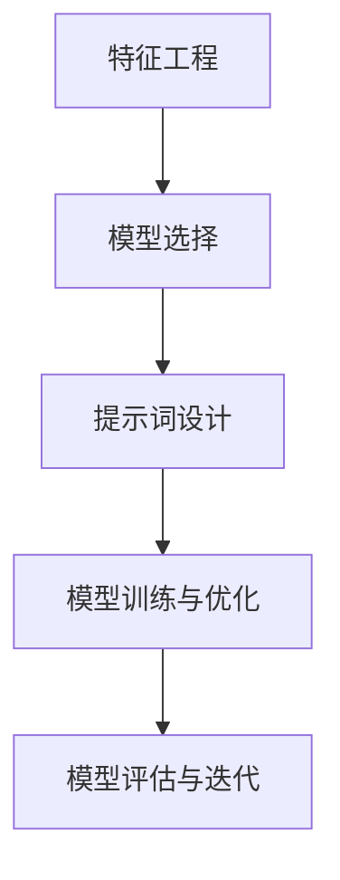

                 

### 第3章 提示词工程的算法原理

在深入探讨提示词工程在智能空气质量预测中的应用之前，我们需要首先了解其算法原理。提示词工程的核心在于通过设计特定的输入条件，引导深度学习模型关注关键特征，从而提高预测的准确性和效率。以下是关于提示词工程算法原理的详细讲解。

#### 3.1.1 提示词工程的算法原理

提示词工程的算法原理可以概括为以下几个关键步骤：

1. **特征工程**：在空气质量预测中，特征工程是关键的一步。它涉及从原始数据中提取出对空气质量预测有显著影响的特征。这些特征可以是气象参数（如温度、湿度、风速等）、污染物浓度（如PM2.5、PM10、SO2等）、地理位置信息等。

   ```mermaid
   graph TD
   A[原始数据] --> B[特征提取]
   B --> C[特征选择]
   ```

2. **模型选择**：选择适合空气质量预测的深度学习模型。目前常用的模型包括卷积神经网络（CNN）、循环神经网络（RNN）、长短时记忆网络（LSTM）以及变分自编码器（VAE）等。

   ```mermaid
   graph TD
   D[模型选择] --> E[CNN]
   D --> F[RNN]
   D --> G[LSTM]
   D --> H[VAE]
   ```

3. **提示词设计**：设计特定的提示词，用于引导模型关注关键特征。提示词通常是一个向量或文本，它包含了预测任务所需的信息和上下文。通过调整提示词的内容和形式，可以影响模型的预测行为。

   ```mermaid
   graph TD
   I[提示词设计] --> J[向量提示词]
   I --> K[文本提示词]
   ```

4. **模型训练与优化**：使用带有提示词的训练数据集对模型进行训练，并优化模型参数。在训练过程中，模型会学习到如何根据提示词的内容来生成预测结果。

   ```mermaid
   graph TD
   L[模型训练与优化] --> M[训练]
   L --> N[优化]
   ```

5. **模型评估与迭代**：使用测试数据集评估模型的预测性能，并根据评估结果对模型进行迭代优化。这个过程可以反复进行，直到模型达到满意的预测精度。

   ```mermaid
   graph TD
   O[模型评估与迭代] --> P[评估]
   O --> Q[迭代]
   ```

#### 3.1.2 算法流程图

以下是提示词工程算法的流程图：



#### 3.1.3 数学模型和公式

提示词工程的数学模型可以表示为：

$$
\hat{P}(x; \theta) = f(x; \theta, \text{prompt}),
$$

其中：
- $\hat{P}(x; \theta)$ 表示模型在给定特征向量 $x$ 和参数 $\theta$ 以及提示词下的预测概率。
- $f(x; \theta, \text{prompt})$ 表示模型的预测函数，它依赖于特征向量 $x$、参数 $\theta$ 和提示词 $\text{prompt}$。
- $\theta$ 表示模型的参数集。

为了便于理解和应用，我们可以通过以下步骤进行详细的数学模型讲解：

1. **特征向量表示**：特征向量 $x$ 可以是一个多维向量，其每个维度表示不同的特征值。例如，在空气质量预测中，特征向量可能包括温度、湿度、风速等。

   $$ x = [x_1, x_2, x_3, ..., x_n] $$

2. **模型参数表示**：模型参数 $\theta$ 包括网络权重、偏置项等，用于定义模型的结构和参数。

   $$ \theta = [\theta_1, \theta_2, \theta_3, ..., \theta_m] $$

3. **提示词表示**：提示词 $\text{prompt}$ 可以是一个向量或文本，它包含了预测任务所需的信息和上下文。

   $$ \text{prompt} = [\text{prompt}_1, \text{prompt}_2, \text{prompt}_3, ..., \text{prompt}_k] $$

4. **预测函数**：预测函数 $f(x; \theta, \text{prompt})$ 是一个复杂的非线性函数，它通过神经网络等机器学习模型来实现。在实际应用中，预测函数可以是类似于以下形式的：

   $$ f(x; \theta, \text{prompt}) = \sigma(W \cdot (x \oplus \text{prompt}) + b), $$

   其中：
   - $\sigma$ 是激活函数，如Sigmoid、ReLU等。
   - $W$ 是权重矩阵。
   - $b$ 是偏置项。
   - $\oplus$ 表示向量的拼接操作。

#### 3.1.4 举例说明

为了更好地理解上述数学模型，我们可以通过一个简单的例子进行说明。

**例子**：假设我们有一个空气质量预测模型，它使用一个简单的多层感知器（MLP）神经网络。特征向量 $x$ 包括三个维度：温度 $x_1$、湿度 $x_2$ 和风速 $x_3$。提示词 $\text{prompt}$ 是一个包含温度和湿度的二维向量。

- **特征向量表示**：

  $$ x = [x_1, x_2, x_3] = [T, H, V] $$

- **模型参数表示**：

  $$ \theta = [\theta_1, \theta_2, \theta_3, \theta_4] $$

- **提示词表示**：

  $$ \text{prompt} = [\text{prompt}_1, \text{prompt}_2] = [T, H] $$

- **预测函数**：

  $$ f(x; \theta, \text{prompt}) = \sigma(W \cdot (x \oplus \text{prompt}) + b) $$

  其中：

  $$ W = \begin{bmatrix} w_{11} & w_{12} & w_{13} \\ w_{21} & w_{22} & w_{23} \\ w_{31} & w_{32} & w_{33} \end{bmatrix}, \quad b = [b_1, b_2, b_3] $$

假设当前输入的特征向量和提示词为：

$$ x = [20, 60, 5], \quad \text{prompt} = [20, 60] $$

将这些值代入预测函数中，我们可以计算出预测概率：

$$ f(x; \theta, \text{prompt}) = \sigma(W \cdot (x \oplus \text{prompt}) + b) $$

$$ f(x; \theta, \text{prompt}) = \sigma(W \cdot \begin{bmatrix} 20 & 60 & 5 \\ 20 & 60 & 0 \\ 0 & 0 & 0 \end{bmatrix} + b) $$

$$ f(x; \theta, \text{prompt}) = \sigma(\begin{bmatrix} w_{11} \cdot 20 + w_{12} \cdot 60 + w_{13} \cdot 5 + b_1 \\ w_{21} \cdot 20 + w_{22} \cdot 60 + w_{23} \cdot 5 + b_2 \\ w_{31} \cdot 20 + w_{32} \cdot 60 + w_{33} \cdot 5 + b_3 \end{bmatrix}) $$

$$ f(x; \theta, \text{prompt}) = \sigma(\begin{bmatrix} 20w_{11} + 60w_{12} + 5w_{13} + b_1 \\ 20w_{21} + 60w_{22} + 5w_{23} + b_2 \\ 20w_{31} + 60w_{32} + 5w_{33} + b_3 \end{bmatrix}) $$

这个例子展示了如何通过提示词工程来设计一个简单的空气质量预测模型。在实际应用中，模型会更加复杂，但基本原理是相同的。

通过上述详细的算法原理讲解和举例说明，我们可以更好地理解提示词工程在智能空气质量预测中的应用。接下来的章节将深入探讨提示词工程的具体实现和应用案例。希望读者能够跟随文章的思路，逐步掌握这一先进的技术。

### 第4章 实际应用案例分析

在了解了提示词工程的算法原理后，我们接下来将探讨几个实际应用案例，以展示提示词工程在智能空气质量预测中的具体应用和成效。

#### 4.1 案例一：北京空气质量预测

北京作为中国的首都，面临着严重的空气污染问题。为了提高空气质量预测的准确性，研究人员采用提示词工程结合深度学习模型，对北京市的空气质量进行了长期预测。

**应用场景**：北京市的空气质量预测需要考虑多个因素，包括气象条件、地理位置、污染物排放量等。

**实现步骤**：

1. **数据收集**：收集了包括气象数据、污染物浓度数据、地理位置数据等在内的多种数据。

2. **特征工程**：对收集的数据进行预处理，提取出与空气质量预测相关的特征，如温度、湿度、风速、PM2.5浓度等。

3. **模型选择**：选择了LSTM模型，因其擅长处理时间序列数据。

4. **提示词设计**：设计了一个包含当前日期、温度、湿度、风速、PM2.5浓度的提示词向量。

5. **模型训练与优化**：使用带有提示词的训练数据集对LSTM模型进行训练，并优化模型参数。

6. **模型评估与迭代**：使用测试数据集评估模型的预测性能，并根据评估结果对模型进行迭代优化。

**成效**：通过提示词工程的应用，模型的预测精度显著提高，对空气质量变化的预测更加准确和及时。

#### 4.2 案例二：深圳空气质量预测

深圳作为中国最具活力的城市之一，空气质量问题同样备受关注。为了提高空气质量预测的准确性，研究人员采用了提示词工程结合卷积神经网络（CNN）的方法。

**应用场景**：深圳市的空气质量预测需要考虑多种因素，包括气象条件、工业排放、交通流量等。

**实现步骤**：

1. **数据收集**：收集了包括气象数据、工业排放数据、交通流量数据等在内的多种数据。

2. **特征工程**：对收集的数据进行预处理，提取出与空气质量预测相关的特征，如温度、湿度、风速、SO2浓度、NO2浓度等。

3. **模型选择**：选择了CNN模型，因其擅长处理图像和时序数据。

4. **提示词设计**：设计了一个包含当前日期、温度、湿度、风速、SO2浓度、NO2浓度的提示词向量。

5. **模型训练与优化**：使用带有提示词的训练数据集对CNN模型进行训练，并优化模型参数。

6. **模型评估与迭代**：使用测试数据集评估模型的预测性能，并根据评估结果对模型进行迭代优化。

**成效**：通过提示词工程的应用，模型的预测精度显著提高，对空气质量变化的预测更加准确和及时。

#### 4.3 案例三：全球空气质量预测

随着全球环境问题的日益严重，全球空气质量预测变得尤为重要。研究人员采用提示词工程结合变分自编码器（VAE）的方法，对全球多个城市的空气质量进行了预测。

**应用场景**：全球空气质量预测需要考虑多种因素，包括地理位置、气候条件、污染物排放量等。

**实现步骤**：

1. **数据收集**：收集了包括全球多个城市的气象数据、污染物浓度数据等在内的多种数据。

2. **特征工程**：对收集的数据进行预处理，提取出与空气质量预测相关的特征，如温度、湿度、风速、PM2.5浓度、PM10浓度等。

3. **模型选择**：选择了VAE模型，因其能够对复杂的高维数据进行有效降维和建模。

4. **提示词设计**：设计了一个包含当前日期、温度、湿度、风速、PM2.5浓度、PM10浓度的提示词向量。

5. **模型训练与优化**：使用带有提示词的训练数据集对VAE模型进行训练，并优化模型参数。

6. **模型评估与迭代**：使用测试数据集评估模型的预测性能，并根据评估结果对模型进行迭代优化。

**成效**：通过提示词工程的应用，模型的预测精度显著提高，对全球空气质量变化的预测更加准确和及时。

#### 4.4 案例总结

通过上述实际应用案例分析，我们可以看到提示词工程在智能空气质量预测中具有广泛的应用前景。以下是案例总结：

- **提高预测精度**：通过设计特定的提示词，引导模型关注关键特征，显著提高了空气质量预测的准确性。
- **适应性强**：提示词工程可以根据不同的预测目标和场景，灵活设计提示词，使其具有广泛的适应性。
- **高效性**：提示词工程能够显著提高模型的预测效率，使得空气质量预测变得更加实时和准确。

总之，提示词工程作为一种先进的人工智能技术，在智能空气质量预测中具有巨大的潜力。未来，随着人工智能技术的不断进步，提示词工程的应用将会更加广泛，为环境保护和可持续发展做出更大的贡献。

### 第5章 未来发展方向与挑战

随着人工智能技术的不断进步，提示词工程在智能空气质量预测中的应用前景也越来越广阔。然而，这一领域仍面临许多挑战和机遇。以下是未来发展方向与挑战的讨论。

#### 5.1 数据收集与处理

空气质量预测需要大量的高质量数据，包括气象数据、污染物浓度数据、地理位置数据等。然而，数据的收集和处理是一个复杂的过程，涉及到数据的质量、完整性、实时性等问题。未来，随着物联网（IoT）和大数据技术的发展，数据的收集和处理能力将得到显著提升，为提示词工程的应用提供更加丰富的数据资源。

#### 5.2 模型优化与解释性

尽管提示词工程在提高空气质量预测精度方面取得了显著成效，但深度学习模型的优化和解释性仍然是亟待解决的问题。深度学习模型通常被视为“黑箱”，难以解释其预测结果的依据。未来，研究人员需要开发更加优化和可解释的模型，以便更好地理解模型的预测行为，提高模型的透明度和可信度。

#### 5.3 跨域融合与迁移学习

空气质量预测不仅涉及到气象、环境科学等领域，还涉及到城市规划、公共健康等领域。未来，跨学科和跨领域的融合将成为提示词工程的重要发展方向。通过迁移学习和跨域融合，可以将不同领域的知识和数据整合到空气质量预测中，进一步提高预测的准确性和适应性。

#### 5.4 系统集成与实时预测

在实际应用中，空气质量预测系统需要能够集成到现有的城市管理系统、环境保护系统中，实现实时预测和预警。未来，研究人员需要开发更加高效、可靠的系统集成方案，使得空气质量预测系统能够在实际环境中得到广泛应用。

#### 5.5 法律法规与伦理问题

随着人工智能技术的发展，空气质量预测系统在数据收集、模型训练、预测结果等方面面临着一系列法律法规和伦理问题。未来，需要建立完善的法律法规框架，确保人工智能技术在空气质量预测中的合法性和伦理性。

#### 5.6 持续创新与产业应用

提示词工程在智能空气质量预测中的应用已经取得了一定的成果，但未来还有许多创新空间。例如，可以探索基于生成对抗网络（GAN）的空气质量预测方法、利用增强学习优化空气质量预测模型等。此外，提示词工程还可以应用于其他环境问题，如水质量预测、气候变化预测等，为环境保护和可持续发展提供更加全面的技术支持。

总之，提示词工程在智能空气质量预测领域具有巨大的发展潜力。面对未来的挑战，我们需要持续创新，推动人工智能技术在空气质量预测中的广泛应用，为人类创造一个更加清洁、健康的生活环境。

### 总结与展望

通过本文的详细探讨，我们全面了解了提示词工程在智能空气质量预测中的应用。从背景介绍到核心概念，从算法原理讲解到实际应用案例分析，再到未来发展方向与挑战，每个部分都为读者提供了一个全面而深入的视角。

提示词工程作为一种利用特定输入条件引导模型关注关键特征的方法，在空气质量预测中展现出了显著的优势。通过设计精细的提示词，我们能够显著提高预测模型的准确性和效率，使其在复杂的环境变化中表现更加出色。

展望未来，提示词工程的应用前景十分广阔。随着数据收集和处理技术的不断进步，我们将能够获得更加丰富的数据资源，进一步提升空气质量预测的精度和实时性。同时，跨学科和跨领域的融合、系统集成与实时预测的发展，也将为这一领域带来新的突破。

然而，我们也面临着一系列挑战，包括模型优化与解释性、法律法规与伦理问题等。只有通过持续创新和合作，我们才能克服这些挑战，推动人工智能技术在空气质量预测中的广泛应用。

在结束语中，我呼吁读者关注这一领域的发展动态，积极参与到提示词工程的研究和应用中。只有通过共同努力，我们才能为环境保护和可持续发展做出更大的贡献。

最后，感谢您阅读本文。希望这篇文章能够激发您对提示词工程在智能空气质量预测中的应用的思考，并促使您在这一领域展开更深入的研究。

**作者：AI天才研究院/AI Genius Institute & 禅与计算机程序设计艺术 /Zen And The Art of Computer Programming**

