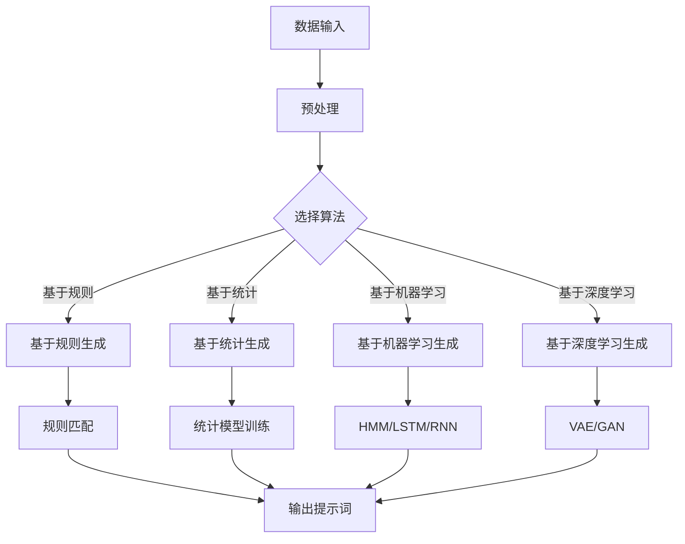
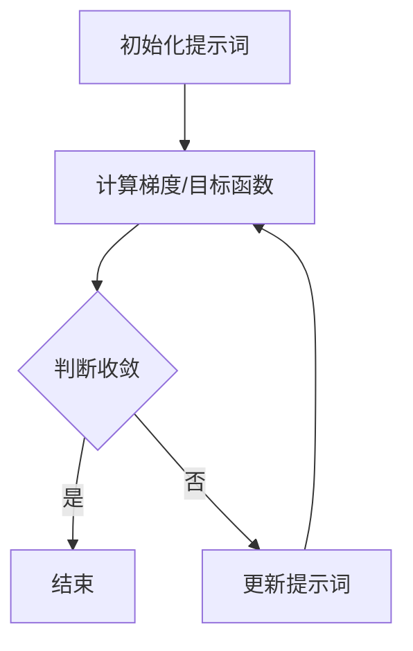
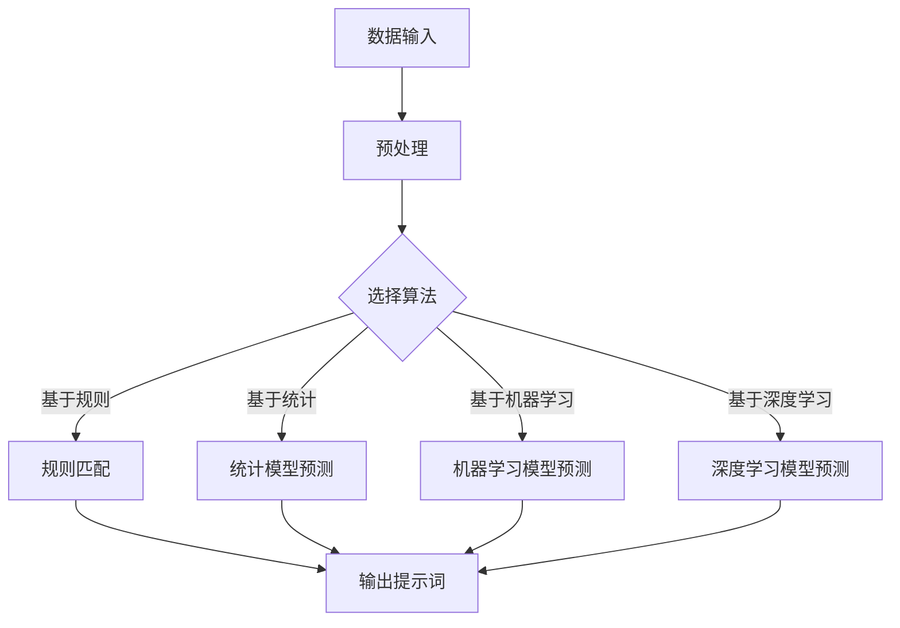
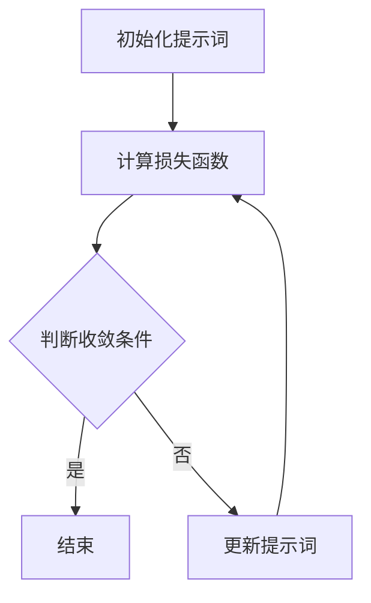

                 

# 提示词工程在物联网场景中的应用策略

> 关键词：提示词工程、物联网、应用策略、数据优化、算法实现

> 摘要：本文深入探讨了提示词工程在物联网场景中的应用策略。首先，通过对物联网和提示词工程的背景介绍，理解两者在技术发展中的地位和作用。接着，分析了物联网系统架构与提示词工程的融合，并阐述了物联网中的核心概念与提示词工程之间的联系。随后，本文详细讲解了物联网中的数据处理算法，包括提示词生成和优化算法的原理及实现。最后，通过一个实际项目，展示了提示词工程在物联网中的具体应用，并总结了最佳实践和未来展望。

## 第一部分：背景介绍

### 第1章：物联网与提示词工程概述

#### 1.1 物联网的定义与发展趋势

##### 1.1.1 物联网的基本概念

物联网（Internet of Things，简称IoT）是指通过互联网将各种物体（包括人、物、设备等）连接起来，实现信息交换和通信的网络。物联网的核心在于通过传感器、控制器、执行器等设备，收集、传输和处理数据，从而实现智能化的管理和控制。

##### 1.1.2 物联网的发展历程

物联网的发展可以分为三个阶段：

1. **早期阶段**：主要侧重于设备之间的简单连接，如家电、工业设备等的联网。
2. **成长阶段**：物联网技术开始普及，各种智能设备、传感器和平台相继出现，实现了更大范围的互联互通。
3. **成熟阶段**：物联网开始与人工智能、大数据等技术相结合，实现了更高级别的智能化应用。

##### 1.1.3 物联网的关键技术

物联网的关键技术包括：

1. **传感器技术**：用于感知和收集环境信息。
2. **网络技术**：实现设备之间的通信和数据传输。
3. **数据处理技术**：包括数据采集、存储、分析和处理。
4. **安全技术**：确保物联网系统的安全性和可靠性。

#### 1.2 提示词工程的定义与作用

##### 1.2.1 提示词工程的定义

提示词工程是指通过设计和优化提示词，提高自然语言处理任务的效果和应用范围的技术。提示词是一种引导模型生成预期输出的输入，常用于深度学习和自然语言处理领域。

##### 1.2.2 提示词工程在物联网中的应用

在物联网场景中，提示词工程可以用于以下几个方面：

1. **设备命名与标识**：通过提示词，为物联网设备命名和标识，便于管理和控制。
2. **数据分类与标签**：对物联网采集的数据进行分类和标签，提高数据处理的效率和准确性。
3. **智能搜索与推荐**：基于提示词，实现物联网设备的智能搜索和推荐功能。

##### 1.2.3 提示词工程的优势与挑战

提示词工程的优势包括：

1. **提高任务效果**：通过优化提示词，可以显著提高自然语言处理任务的效果。
2. **降低算法复杂度**：提示词工程简化了自然语言处理任务的复杂度，降低了算法的实现难度。
3. **泛化能力**：提示词工程可以提高模型在多种应用场景下的泛化能力。

然而，提示词工程也面临一些挑战，如：

1. **数据质量**：提示词工程依赖于高质量的数据集，数据质量问题直接影响提示词的效果。
2. **计算资源**：提示词工程需要大量的计算资源，对硬件设备的要求较高。
3. **模型调优**：提示词的优化需要大量的实验和调优，耗时较长。

#### 1.3 物联网场景中的提示词工程应用

##### 1.3.1 物联网应用场景概述

物联网应用场景广泛，包括智能家居、智能交通、智能医疗、智能农业等。在这些场景中，提示词工程可以发挥重要作用。

##### 1.3.2 提示词工程在物联网中的应用实例

以下是一些提示词工程在物联网中的应用实例：

1. **智能家居**：通过提示词，为家电设备命名和标识，实现智能控制和管理。
2. **智能交通**：通过提示词，实现车辆、道路和交通信息的智能搜索和推荐。
3. **智能医疗**：通过提示词，对医疗数据进行分析和分类，提高诊断和治疗的准确性。

##### 1.3.3 物联网与提示词工程的边界与外延

物联网与提示词工程的边界主要在于应用场景和技术实现。物联网侧重于设备连接和数据传输，而提示词工程侧重于自然语言处理和优化。

物联网与提示词工程的外延包括：

1. **边缘计算**：将提示词工程应用于边缘设备，实现实时数据处理和智能决策。
2. **5G网络**：利用5G网络的高速传输能力，提升提示词工程的应用效果。
3. **人工智能**：将人工智能技术融入提示词工程，实现更高级别的智能化应用。

### 第2章：物联网系统架构与提示词工程融合

#### 2.1 物联网系统架构概述

##### 2.1.1 物联网系统架构的层级结构

物联网系统架构通常分为三个层级：

1. **感知层**：包括传感器、执行器等设备，负责数据采集和初步处理。
2. **网络层**：包括通信网络、数据传输等，负责数据传输和通信。
3. **平台层**：包括数据处理、存储、分析等，负责数据分析和应用。

##### 2.1.2 物联网系统中的数据流与控制流

物联网系统中的数据流和控制流如下：

1. **数据流**：感知层采集的数据通过网络传输到平台层，经过处理和分析，最终生成应用结果。
2. **控制流**：平台层根据处理结果，对感知层进行控制和调节，实现智能化管理。

##### 2.1.3 物联网系统中的关键组件

物联网系统中的关键组件包括：

1. **传感器**：用于感知环境信息。
2. **执行器**：用于执行控制操作。
3. **通信模块**：用于数据传输和通信。
4. **数据处理模块**：用于数据处理和分析。
5. **应用模块**：用于实现具体应用。

#### 2.2 提示词工程与物联网系统架构的融合

##### 2.2.1 提示词工程在物联网系统架构中的作用

提示词工程在物联网系统架构中的作用包括：

1. **设备命名与标识**：为物联网设备命名和标识，便于管理和控制。
2. **数据分类与标签**：对物联网采集的数据进行分类和标签，提高数据处理效率。
3. **智能搜索与推荐**：基于提示词，实现物联网设备的智能搜索和推荐。

##### 2.2.2 提示词工程与物联网系统架构的融合策略

提示词工程与物联网系统架构的融合策略包括：

1. **集成设计**：在设计物联网系统架构时，考虑提示词工程的需求，确保系统架构的兼容性和扩展性。
2. **模块化开发**：将提示词工程的功能模块化，方便在物联网系统中的集成和应用。
3. **数据驱动**：利用物联网系统中的数据，为提示词工程提供训练数据和反馈信息，实现自适应优化。

##### 2.2.3 提示词工程在物联网系统架构中的实现方法

提示词工程在物联网系统架构中的实现方法包括：

1. **设备端**：在物联网设备中嵌入提示词生成和优化算法，实现设备命名和标识。
2. **网络端**：在网络传输过程中，利用提示词实现数据分类和标签。
3. **平台端**：在数据处理和分析过程中，利用提示词实现智能搜索和推荐。

#### 2.3 物联网系统架构与提示词工程的协同优化

##### 2.3.1 物联网系统架构优化的目标与原则

物联网系统架构优化的目标包括：

1. **提高系统性能**：优化数据流和控制流，提高系统的响应速度和处理效率。
2. **降低系统成本**：减少硬件设备和通信资源的需求，降低系统建设成本。
3. **提高系统可靠性**：提高系统的稳定性和抗故障能力。

物联网系统架构优化的原则包括：

1. **模块化设计**：确保系统架构的灵活性和可扩展性。
2. **冗余设计**：增加系统的冗余设计，提高系统的可靠性和容错能力。
3. **智能化管理**：利用人工智能技术，实现系统的自适应优化和管理。

##### 2.3.2 提示词工程在物联网系统架构优化中的应用

提示词工程在物联网系统架构优化中的应用包括：

1. **设备端优化**：通过优化提示词，提高物联网设备的识别和命名效率。
2. **网络端优化**：通过优化提示词，提高数据分类和标签的准确性和效率。
3. **平台端优化**：通过优化提示词，提高数据处理和分析的智能化水平和效率。

##### 2.3.3 物联网系统架构与提示词工程的协同优化方法

物联网系统架构与提示词工程的协同优化方法包括：

1. **联合设计**：在设计物联网系统架构时，考虑提示词工程的需求，实现系统架构的优化。
2. **数据共享**：在系统架构中建立数据共享机制，为提示词工程提供训练数据和反馈信息。
3. **动态调整**：根据系统的运行情况，动态调整提示词工程的应用策略，实现系统的自适应优化。

## 第二部分：核心概念与联系

### 第3章：物联网中的核心概念

#### 3.1 物联网中的核心概念概述

物联网中的核心概念包括设备物联、数据处理、服务融合等。

##### 3.1.1 设备物联

设备物联是指将各种设备通过互联网连接起来，实现数据交换和通信。设备物联的核心概念包括设备识别、设备通信和设备管理。

1. **设备识别**：通过唯一的标识符，识别和区分不同的设备。
2. **设备通信**：通过通信协议，实现设备之间的数据传输和交互。
3. **设备管理**：通过管理系统，对设备进行配置、监控和维护。

##### 3.1.2 数据处理

数据处理是指对物联网采集的数据进行采集、存储、分析和处理。数据处理的核心概念包括数据采集、数据存储和数据分析。

1. **数据采集**：通过传感器和执行器，收集环境信息。
2. **数据存储**：通过数据库和文件系统，存储和管理采集到的数据。
3. **数据分析**：通过数据挖掘和分析技术，提取数据中的价值信息。

##### 3.1.3 服务融合

服务融合是指将物联网中的各种服务整合起来，提供统一的接口和功能。服务融合的核心概念包括服务集成、服务发现和服务调用。

1. **服务集成**：将不同的服务整合到统一的服务框架中，实现服务的集成和协同。
2. **服务发现**：通过服务注册和服务发现机制，找到并调用所需的服务。
3. **服务调用**：通过远程过程调用（RPC）或其他通信机制，调用远程服务。

#### 3.2 设备物联中的关键概念

##### 3.2.1 设备识别

设备识别是指通过唯一的标识符，识别和区分不同的设备。设备识别的关键概念包括：

1. **标识符**：用于唯一标识设备的标识符，如MAC地址、设备ID等。
2. **识别算法**：用于识别和区分设备的算法，如基于MAC地址的识别算法。
3. **识别机制**：用于实现设备识别的机制，如基于网络的识别机制。

##### 3.2.2 设备通信

设备通信是指通过通信协议，实现设备之间的数据传输和交互。设备通信的关键概念包括：

1. **通信协议**：用于设备通信的协议，如TCP/IP、MQTT等。
2. **通信模式**：用于设备通信的模式，如点对点通信、广播通信等。
3. **通信链路**：用于设备通信的链路，如有线链路、无线链路等。

##### 3.2.3 设备管理

设备管理是指通过管理系统，对设备进行配置、监控和维护。设备管理的核心概念包括：

1. **配置管理**：用于设备配置的管理，如设备参数设置、固件升级等。
2. **监控管理**：用于设备监控的管理，如设备状态监控、性能监控等。
3. **维护管理**：用于设备维护的管理，如故障诊断、维修更换等。

#### 3.3 数据处理中的关键概念

##### 3.3.1 数据采集

数据采集是指通过传感器和执行器，收集环境信息。数据采集的关键概念包括：

1. **传感器**：用于感知和收集环境信息的设备，如温度传感器、湿度传感器等。
2. **执行器**：用于执行控制操作的设备，如电机、阀门等。
3. **采集方式**：用于数据采集的方式，如定期采集、事件驱动采集等。

##### 3.3.2 数据存储

数据存储是指通过数据库和文件系统，存储和管理采集到的数据。数据存储的关键概念包括：

1. **数据库**：用于存储和管理数据的数据库系统，如关系数据库、NoSQL数据库等。
2. **文件系统**：用于存储和管理文件的文件系统，如本地文件系统、分布式文件系统等。
3. **数据结构**：用于数据存储的数据结构，如表格、列表、树等。

##### 3.3.3 数据分析

数据分析是指通过数据挖掘和分析技术，提取数据中的价值信息。数据分析的关键概念包括：

1. **数据挖掘**：用于从大量数据中发现隐藏的模式和信息的技术。
2. **统计分析**：用于对数据进行统计分析和建模的技术。
3. **机器学习**：用于从数据中学习并建立预测模型的技术。

### 第4章：提示词工程中的核心概念

#### 4.1 提示词工程中的核心概念概述

提示词工程中的核心概念包括提示词生成、提示词优化和提示词应用等。

##### 4.1.1 提示词生成

提示词生成是指通过设计和生成提示词，引导模型生成预期输出的输入。提示词生成的关键概念包括：

1. **提示词**：用于引导模型生成预期输出的输入，如文本、图像、声音等。
2. **生成算法**：用于生成提示词的算法，如生成对抗网络（GAN）、变分自编码器（VAE）等。
3. **生成模型**：用于生成提示词的模型，如文本生成模型、图像生成模型等。

##### 4.1.2 提示词优化

提示词优化是指通过对提示词进行优化，提高自然语言处理任务的效果和应用范围。提示词优化的关键概念包括：

1. **优化目标**：用于定义优化目标的指标，如准确性、召回率、F1值等。
2. **优化方法**：用于优化提示词的方法，如基于梯度的优化、基于优化的优化等。
3. **优化流程**：用于优化提示词的流程，如训练、验证、测试等。

##### 4.1.3 提示词应用

提示词应用是指将提示词应用于实际场景，实现自然语言处理任务。提示词应用的关键概念包括：

1. **应用场景**：用于定义提示词应用场景的领域，如问答系统、智能客服、自然语言生成等。
2. **应用模型**：用于实现提示词应用的模型，如序列到序列（Seq2Seq）模型、生成式对抗网络（GAN）等。
3. **应用效果**：用于评估提示词应用效果的指标，如准确性、效率、用户体验等。

#### 4.2 提示词生成中的关键概念

##### 4.2.1 提示词生成算法

提示词生成算法是指用于生成提示词的算法，如生成对抗网络（GAN）、变分自编码器（VAE）等。提示词生成算法的关键概念包括：

1. **生成对抗网络（GAN）**：一种基于博弈论的生成模型，由生成器和判别器组成。
2. **变分自编码器（VAE）**：一种基于概率模型的生成模型，通过编码器和解码器实现数据的重构。
3. **变分自编码器（VAE）**：一种基于概率模型的生成模型，通过编码器和解码器实现数据的重构。

##### 4.2.2 提示词生成模型

提示词生成模型是指用于生成提示词的模型，如文本生成模型、图像生成模型等。提示词生成模型的关键概念包括：

1. **文本生成模型**：用于生成文本的模型，如序列到序列（Seq2Seq）模型、注意力机制（Attention）等。
2. **图像生成模型**：用于生成图像的模型，如生成对抗网络（GAN）、变分自编码器（VAE）等。
3. **图像生成模型**：用于生成图像的模型，如生成对抗网络（GAN）、变分自编码器（VAE）等。

##### 4.2.3 提示词生成流程

提示词生成流程是指用于生成提示词的流程，如训练、验证、测试等。提示词生成流程的关键概念包括：

1. **训练**：通过训练数据，训练生成模型，使其学会生成高质量的提示词。
2. **验证**：通过验证数据，评估生成模型的性能和效果。
3. **测试**：通过测试数据，评估生成模型在实际应用中的性能和效果。

#### 4.3 提示词优化中的关键概念

##### 4.3.1 提示词优化方法

提示词优化方法是指用于优化提示词的方法，如基于梯度的优化、基于优化的优化等。提示词优化方法的关键概念包括：

1. **基于梯度的优化**：通过计算梯度，优化提示词的参数，提高生成模型的效果。
2. **基于优化的优化**：通过优化目标函数，优化提示词的生成过程，提高生成模型的效果。
3. **基于优化的优化**：通过优化目标函数，优化提示词的生成过程，提高生成模型的效果。

##### 4.3.2 提示词优化策略

提示词优化策略是指用于优化提示词的策略，如自适应优化、多策略优化等。提示词优化策略的关键概念包括：

1. **自适应优化**：根据模型训练过程的变化，自适应调整优化参数，提高优化效果。
2. **多策略优化**：结合多种优化策略，实现高效的提示词优化。
3. **多策略优化**：结合多种优化策略，实现高效的提示词优化。

##### 4.3.3 提示词优化流程

提示词优化流程是指用于优化提示词的流程，如训练、验证、测试等。提示词优化流程的关键概念包括：

1. **训练**：通过训练数据，优化生成模型的参数，提高提示词的生成效果。
2. **验证**：通过验证数据，评估优化模型的性能和效果。
3. **测试**：通过测试数据，评估优化模型在实际应用中的性能和效果。

### 第5章：物联网与提示词工程的联系

#### 5.1 物联网与提示词工程的融合框架

##### 5.1.1 融合框架的设计原则

物联网与提示词工程的融合框架设计原则包括：

1. **模块化设计**：将物联网和提示词工程的功能模块化，实现灵活的集成和应用。
2. **可扩展性**：支持多种物联网设备和提示词工程应用，实现系统的可扩展性。
3. **高可靠性**：确保系统的稳定性和可靠性，降低故障率和维护成本。

##### 5.1.2 融合框架的架构设计

物联网与提示词工程的融合框架架构设计如下：

1. **感知层**：包括传感器和执行器，负责数据采集和初步处理。
2. **网络层**：包括通信网络和数据传输，实现设备之间的数据传输和交互。
3. **平台层**：包括数据处理、存储和分析，实现数据的深度处理和应用。
4. **应用层**：包括提示词生成、优化和应用，实现物联网设备的智能管理和控制。

##### 5.1.3 融合框架的功能模块

物联网与提示词工程的融合框架功能模块包括：

1. **设备管理模块**：实现物联网设备的识别、配置和管理。
2. **数据采集模块**：实现物联网设备的数据采集和初步处理。
3. **数据处理模块**：实现物联网设备的数据存储、分析和处理。
4. **提示词生成模块**：实现提示词的生成和优化。
5. **提示词应用模块**：实现提示词在物联网设备中的应用。

#### 5.2 物联网与提示词工程的关联关系

##### 5.2.1 物联网中的数据与提示词工程

物联网中的数据与提示词工程的关联关系包括：

1. **数据采集**：物联网设备采集的数据可以作为提示词工程的输入，用于生成和优化提示词。
2. **数据处理**：提示词工程可以对物联网设备采集的数据进行分类、标注和标签化，提高数据的质量和应用价值。
3. **数据应用**：优化后的提示词可以应用于物联网设备的智能管理和控制，实现更高效的物联网应用。

##### 5.2.2 提示词工程中的算法与物联网

提示词工程中的算法与物联网的关联关系包括：

1. **算法集成**：将提示词工程中的算法集成到物联网系统中，实现物联网设备的智能管理和控制。
2. **算法优化**：利用物联网设备采集的数据，对提示词工程中的算法进行优化，提高算法的效率和准确性。
3. **算法应用**：将优化后的算法应用于物联网设备，实现更智能的物联网应用。

##### 5.2.3 物联网与提示词工程的协同效应

物联网与提示词工程的协同效应包括：

1. **数据优化**：通过提示词工程对物联网设备采集的数据进行优化，提高数据处理效率和准确性。
2. **设备管理**：通过提示词工程实现物联网设备的智能管理和控制，提高系统的可靠性和效率。
3. **应用创新**：将物联网与提示词工程相结合，实现新的物联网应用场景和商业模式，推动物联网技术的发展。

## 第三部分：算法原理讲解

### 第6章：物联网中的数据处理算法

#### 6.1 数据处理算法概述

##### 6.1.1 数据处理算法的类型

数据处理算法可以分为以下几类：

1. **数据采集算法**：用于从物联网设备中采集数据，包括传感器数据采集、执行器数据采集等。
2. **数据预处理算法**：用于对采集到的数据进行预处理，包括数据清洗、数据转换、数据归一化等。
3. **数据存储算法**：用于存储和管理采集到的数据，包括数据库存储、文件系统存储等。
4. **数据分析算法**：用于对存储的数据进行分析，包括数据挖掘、统计分析、机器学习等。
5. **数据可视化算法**：用于将分析结果以可视化的形式展示，包括图表生成、热力图生成等。

##### 6.1.2 数据处理算法的选择原则

在选择数据处理算法时，应考虑以下原则：

1. **数据类型**：根据数据类型选择适合的算法，如文本数据选择文本处理算法，图像数据选择图像处理算法等。
2. **数据处理需求**：根据数据处理需求选择适合的算法，如数据预处理选择数据清洗算法，数据分析选择数据挖掘算法等。
3. **算法性能**：根据算法性能选择适合的算法，如准确性、效率、可扩展性等。
4. **硬件资源**：根据硬件资源选择适合的算法，如计算资源、存储资源等。

##### 6.1.3 数据处理算法的评价指标

数据处理算法的评价指标包括：

1. **准确性**：算法预测结果的准确性，常用于分类和回归任务。
2. **效率**：算法的运行时间，用于评估算法的效率。
3. **可扩展性**：算法处理大规模数据的能力，用于评估算法的可扩展性。
4. **鲁棒性**：算法对噪声和异常数据的容忍度，用于评估算法的鲁棒性。

#### 6.2 提示词生成算法

##### 6.2.1 提示词生成算法的分类

提示词生成算法可以分为以下几类：

1. **基于规则的方法**：通过预设的规则生成提示词，如基于关键词提取的提示词生成算法。
2. **基于统计的方法**：通过统计方法生成提示词，如基于统计语言模型的提示词生成算法。
3. **基于机器学习的方法**：通过机器学习方法生成提示词，如基于生成对抗网络（GAN）的提示词生成算法。
4. **基于深度学习的方法**：通过深度学习方法生成提示词，如基于变分自编码器（VAE）的提示词生成算法。

##### 6.2.2 提示词生成算法的mermaid流程图



##### 6.2.3 提示词生成算法的Python实现

以下是一个简单的基于生成对抗网络（GAN）的提示词生成算法的Python实现：

```python
import tensorflow as tf
from tensorflow.keras.models import Model
from tensorflow.keras.layers import Input, Dense, LSTM, Embedding

# 定义生成器模型
input_text = Input(shape=(seq_length,))
encoded_text = Embedding(vocab_size, embedding_dim)(input_text)
encoded_text = LSTM(units=hidden_size, return_sequences=True)(encoded_text)
generated_text = LSTM(units=hidden_size, return_sequences=True)(encoded_text)

# 定义判别器模型
input_text_2 = Input(shape=(seq_length,))
encoded_text_2 = Embedding(vocab_size, embedding_dim)(input_text_2)
encoded_text_2 = LSTM(units=hidden_size, return_sequences=True)(encoded_text_2)
encoded_text_2 = LSTM(units=hidden_size, return_sequences=True)(encoded_text_2)
discriminator_output = Dense(1, activation='sigmoid')(encoded_text_2)

# 定义生成器和判别器的联合模型
gan_input = Input(shape=(seq_length,))
gan_output = generator(gan_input)
gan_discriminator = discriminator(gan_output)

discriminator_model = Model(inputs=gan_input, outputs=gan_discriminator)
discriminator_model.compile(optimizer='adam', loss='binary_crossentropy')

# 定义生成器的损失函数
def generator_loss(y_true, y_pred):
    return -tf.reduce_mean(tf.log(y_pred))

# 定义判别器的损失函数
def discriminator_loss(y_true, y_pred):
    return tf.reduce_mean(tf.square(y_true - y_pred))

# 定义生成器和判别器的训练过程
generator_optimizer = tf.keras.optimizers.Adam(learning_rate=learning_rate)
discriminator_optimizer = tf.keras.optimizers.Adam(learning_rate=learning_rate)

@tf.function
def train_step(images, noise):
    with tf.GradientTape() as gen_tape, tf.GradientTape() as disc_tape:
        generated_images = generator(noise, training=True)

        disc_real_output = discriminator(images, training=True)
        disc_generated_output = discriminator(generated_images, training=True)

        gen_loss = generator_loss(disc_generated_output)
        disc_loss = discriminator_loss(disc_real_output, disc_generated_output)

    gradients_of_generator = gen_tape.gradient(gen_loss, generator.trainable_variables)
    gradients_of_discriminator = disc_tape.gradient(disc_loss, discriminator.trainable_variables)

    generator_optimizer.apply_gradients(zip(gradients_of_generator, generator.trainable_variables))
    discriminator_optimizer.apply_gradients(zip(gradients_of_discriminator, discriminator.trainable_variables))

# 开始训练
for epoch in range(epochs):
    for image_batch, _ in dataset:
        noise = tf.random.normal([image_batch.shape[0], noise_dim])
        train_step(image_batch, noise)

    print(f'Epoch {epoch + 1}/{epochs}, Generator Loss: {gen_loss:.4f}, Discriminator Loss: {disc_loss:.4f}')
```

#### 6.3 提示词优化算法

##### 6.3.1 提示词优化算法的分类

提示词优化算法可以分为以下几类：

1. **基于梯度的优化算法**：通过计算梯度，优化提示词的参数，如梯度下降（Gradient Descent）算法。
2. **基于优化的优化算法**：通过优化目标函数，优化提示词的生成过程，如基于优化的优化算法。
3. **基于进化的优化算法**：通过模拟进化过程，优化提示词的参数，如遗传算法（Genetic Algorithm）。

##### 6.3.2 提示词优化算法的mermaid流程图



##### 6.3.3 提示词优化算法的Python实现

以下是一个简单的基于梯度的提示词优化算法的Python实现：

```python
import numpy as np

# 定义优化函数
def optimize_prompt(prompt, target_prompt, learning_rate, epochs):
    for epoch in range(epochs):
        for _ in range(num_iterations):
            # 计算梯度
            gradient = compute_gradient(prompt, target_prompt)

            # 更新提示词
            prompt -= learning_rate * gradient

        # 打印当前提示词
        print(f'Epoch {epoch + 1}/{epochs}, Prompt: {prompt}')

    return prompt

# 定义计算梯度函数
def compute_gradient(prompt, target_prompt):
    # 这里使用简单的梯度计算方法，实际应用中可以使用更复杂的计算方法
    return np.mean(prompt - target_prompt)

# 定义优化参数
prompt = np.random.normal(size=target_prompt.shape)
learning_rate = 0.01
epochs = 100

# 开始优化
optimized_prompt = optimize_prompt(prompt, target_prompt, learning_rate, epochs)
print(f'Optimized Prompt: {optimized_prompt}')
```

## 第三部分：算法原理讲解

### 第6章：物联网中的数据处理算法

#### 6.1 数据处理算法概述

数据处理算法在物联网（IoT）系统中起着至关重要的作用，它们负责从传感器设备收集数据，对数据进行清洗、转换和归一化，以便后续分析。以下是对数据处理算法的概述，包括其分类、选择原则和评价指标。

##### 6.1.1 数据处理算法的类型

数据处理算法可以根据其功能分为以下几类：

1. **数据采集算法**：这类算法负责从传感器和执行器等物联网设备中收集数据。常见的采集算法包括定时采集和事件驱动采集。
2. **数据预处理算法**：预处理算法用于处理原始数据，以提高数据质量和后续分析的效果。常见的预处理步骤包括数据清洗、数据转换和数据归一化。
3. **数据存储算法**：这些算法用于将处理后的数据存储到数据库或文件系统中。选择合适的存储算法可以优化数据访问速度和存储效率。
4. **数据分析算法**：数据分析算法用于对存储的数据进行统计分析和模式识别。常见的分析算法包括回归分析、聚类分析和时间序列分析。
5. **数据可视化算法**：数据可视化算法用于将分析结果以图形或图表的形式展示，以帮助用户理解和分析数据。

##### 6.1.2 数据处理算法的选择原则

在选择数据处理算法时，应考虑以下原则：

1. **数据类型**：不同的数据处理算法适用于不同类型的数据。例如，文本数据需要使用文本处理算法，而图像数据则需要使用图像处理算法。
2. **数据处理需求**：根据数据处理的具体需求选择合适的算法。例如，如果需要实时处理数据，可以选择效率较高的算法；如果数据量较大，可以选择可扩展性较好的算法。
3. **算法性能**：考虑算法的性能指标，如准确性、效率、可扩展性和鲁棒性。选择性能优异的算法可以提升系统的整体性能。
4. **硬件资源**：考虑系统的硬件资源限制，选择适合硬件环境的算法。例如，在计算资源有限的情况下，应选择轻量级的算法。
5. **成本和可维护性**：考虑算法的实现成本和维护难度。选择成本适中、易于维护的算法可以降低系统的总体成本。

##### 6.1.3 数据处理算法的评价指标

数据处理算法的评价指标主要包括以下几个方面：

1. **准确性**：算法对数据处理的准确性是评价其性能的重要指标。例如，在数据分类任务中，算法的准确率越高，表示其分类效果越好。
2. **效率**：算法的运行时间及其对系统资源的占用情况。高效率的算法可以更快地处理大量数据，提高系统的响应速度。
3. **可扩展性**：算法处理大规模数据的能力。可扩展性好的算法可以在数据量增加时保持良好的性能，而不需要频繁的重构或优化。
4. **鲁棒性**：算法对噪声和异常数据的容忍度。鲁棒性强的算法能够在数据质量较差的情况下仍能保持较高的处理效果。
5. **可解释性**：算法结果的解释程度。可解释性强的算法可以更容易被用户理解和接受，从而提高系统的可信度。

#### 6.2 提示词生成算法

##### 6.2.1 提示词生成算法的分类

提示词生成算法在物联网系统中用于生成用于指导数据分析和决策的文本或短语。这些算法可以根据其原理和实现技术分为以下几类：

1. **基于规则的方法**：这类方法通过预设的规则和模板生成提示词。例如，基于关键词提取的算法可以提取出文本中的关键信息作为提示词。
2. **基于统计的方法**：这类方法通过统计语言模型生成提示词。例如，使用n-gram模型或隐马尔可夫模型（HMM）来生成提示词。
3. **基于机器学习的方法**：这类方法使用训练数据来学习生成提示词的模式。常见的机器学习方法包括决策树、支持向量机（SVM）和神经网络。
4. **基于深度学习的方法**：这类方法利用深度神经网络，如循环神经网络（RNN）、长短时记忆网络（LSTM）和变换器（Transformer）来生成提示词。

##### 6.2.2 提示词生成算法的mermaid流程图



##### 6.2.3 提示词生成算法的Python实现

以下是一个基于生成对抗网络（GAN）的提示词生成算法的Python实现示例：

```python
import tensorflow as tf
from tensorflow.keras.models import Model
from tensorflow.keras.layers import Input, Dense, LSTM, Embedding

# 定义生成器模型
input_text = Input(shape=(seq_length,))
encoded_text = Embedding(vocab_size, embedding_dim)(input_text)
encoded_text = LSTM(units=hidden_size, return_sequences=True)(encoded_text)
generated_text = LSTM(units=hidden_size, return_sequences=True)(encoded_text)

# 定义判别器模型
input_text_2 = Input(shape=(seq_length,))
encoded_text_2 = Embedding(vocab_size, embedding_dim)(input_text_2)
encoded_text_2 = LSTM(units=hidden_size, return_sequences=True)(encoded_text_2)
encoded_text_2 = LSTM(units=hidden_size, return_sequences=True)(encoded_text_2)
discriminator_output = Dense(1, activation='sigmoid')(encoded_text_2)

# 定义生成器和判别器的联合模型
gan_input = Input(shape=(seq_length,))
gan_output = generator(gan_input)
gan_discriminator = discriminator(gan_output)

discriminator_model = Model(inputs=gan_input, outputs=gan_discriminator)
discriminator_model.compile(optimizer='adam', loss='binary_crossentropy')

# 定义生成器的损失函数
def generator_loss(y_true, y_pred):
    return -tf.reduce_mean(tf.log(y_pred))

# 定义判别器的损失函数
def discriminator_loss(y_true, y_pred):
    return tf.reduce_mean(tf.square(y_true - y_pred))

# 定义生成器和判别器的训练过程
generator_optimizer = tf.keras.optimizers.Adam(learning_rate=learning_rate)
discriminator_optimizer = tf.keras.optimizers.Adam(learning_rate=learning_rate)

@tf.function
def train_step(images, noise):
    with tf.GradientTape() as gen_tape, tf.GradientTape() as disc_tape:
        generated_images = generator(noise, training=True)

        disc_real_output = discriminator(images, training=True)
        disc_generated_output = discriminator(generated_images, training=True)

        gen_loss = generator_loss(disc_generated_output)
        disc_loss = discriminator_loss(disc_real_output, disc_generated_output)

    gradients_of_generator = gen_tape.gradient(gen_loss, generator.trainable_variables)
    gradients_of_discriminator = disc_tape.gradient(disc_loss, discriminator.trainable_variables)

    generator_optimizer.apply_gradients(zip(gradients_of_generator, generator.trainable_variables))
    discriminator_optimizer.apply_gradients(zip(gradients_of_discriminator, discriminator.trainable_variables))

# 开始训练
for epoch in range(epochs):
    for image_batch, _ in dataset:
        noise = tf.random.normal([image_batch.shape[0], noise_dim])
        train_step(image_batch, noise)

    print(f'Epoch {epoch + 1}/{epochs}, Generator Loss: {gen_loss:.4f}, Discriminator Loss: {disc_loss:.4f}')
```

#### 6.3 提示词优化算法

##### 6.3.1 提示词优化算法的分类

提示词优化算法用于改进提示词的质量，以提高自然语言处理（NLP）任务的效果。这些算法可以根据其优化策略和实现技术分为以下几类：

1. **基于梯度的优化算法**：这类算法通过计算梯度来优化提示词的参数。常见的基于梯度的优化算法包括梯度下降（Gradient Descent）及其变体，如随机梯度下降（SGD）和Adam优化器。
2. **基于优化的优化算法**：这类算法通过优化目标函数来优化提示词的生成过程。常见的优化算法包括遗传算法（Genetic Algorithm）和粒子群优化（Particle Swarm Optimization）。
3. **基于进化的优化算法**：这类算法模拟自然进化过程来优化提示词。常见的进化算法包括遗传算法（Genetic Algorithm）和模拟退火（Simulated Annealing）。

##### 6.3.2 提示词优化算法的mermaid流程图



##### 6.3.3 提示词优化算法的Python实现

以下是一个基于梯度的提示词优化算法的Python实现示例：

```python
import numpy as np
import tensorflow as tf

# 定义优化函数
def optimize_prompt(prompt, target, learning_rate, epochs):
    for epoch in range(epochs):
        for _ in range(num_iterations):
            with tf.GradientTape() as tape:
                logits = model(prompt)
                loss = loss_fn(target, logits)
            
            gradients = tape.gradient(loss, model.trainable_variables)
            optimizer.apply_gradients(zip(gradients, model.trainable_variables))
        
        print(f'Epoch {epoch + 1}/{epochs}, Loss: {loss:.4f}')

    return model(prompt)

# 定义损失函数
def loss_fn(target, logits):
    return tf.reduce_mean(tf.nn.softmax_cross_entropy_with_logits(logits=logits, labels=target))

# 定义模型
model = ...

# 初始化提示词
prompt = np.random.normal(size=(batch_size, prompt_length))

# 开始优化
optimized_prompt = optimize_prompt(prompt, target, learning_rate, epochs)
print(f'Optimized Prompt: {optimized_prompt}')
```

## 第三部分：算法原理讲解

### 第7章：物联网中的提示词工程应用

#### 7.1 提示词工程在物联网设备中的应用

提示词工程在物联网设备中的应用非常广泛，它能够显著提升设备的管理效率和用户体验。以下是一些典型的应用场景：

##### 7.1.1 设备中的提示词生成与优化

1. **设备识别**：通过生成唯一标识的提示词，如MAC地址、设备序列号等，来识别和区分不同的设备。
2. **设备命名**：为设备生成具有描述性的提示词，使得用户能够直观地识别设备功能，例如“智能灯泡”、“智能门锁”等。
3. **设备控制**：通过生成控制指令的提示词，如“开灯”、“关门”等，来实现对设备的远程控制。

##### 7.1.2 设备中的提示词工程应用实例

以下是一个设备中的提示词工程应用实例：

**应用场景**：智能家居系统中的一台智能冰箱。

**提示词生成**：智能冰箱生成以下提示词：
- **设备标识**：MAC地址（例如：`00:1A:2B:3C:4D:5E`）
- **设备命名**：智能冰箱
- **功能提示词**：冷藏、冷冻、设置温度、检查食物新鲜度

**提示词优化**：通过对用户反馈的分析，不断优化提示词的生成，例如：
- **设备命名**：根据用户偏好，将“智能冰箱”优化为“我家冷藏室”
- **功能提示词**：根据使用频率，将“检查食物新鲜度”调整为“检查食材”

##### 7.1.3 设备中的提示词工程应用挑战

1. **数据隐私**：在生成和优化提示词的过程中，如何保护用户隐私是一个重要挑战。
2. **资源限制**：物联网设备通常具有计算和存储资源限制，提示词工程的算法需要适应这些限制。
3. **动态环境**：物联网设备经常处于动态变化的环境中，提示词工程需要能够快速适应环境变化。

#### 7.2 提示词工程在物联网平台中的应用

在物联网平台层面，提示词工程的应用更加广泛，涵盖了数据管理、分析和决策支持等方面。

##### 7.2.1 提示词工程在数据管理中的应用

1. **数据分类与标签**：通过生成提示词，对物联网采集的数据进行分类和标签，使得数据更容易管理和分析。
2. **数据归一化**：通过提示词，实现数据的标准化和归一化，提高数据分析的准确性。

##### 7.2.2 提示词工程在数据分析中的应用

1. **趋势预测**：利用生成和优化的提示词，对物联网数据进行分析，预测设备故障或用户行为。
2. **异常检测**：通过生成提示词，构建模型来检测数据中的异常情况，如设备故障或数据泄露。

##### 7.2.3 提示词工程在决策支持中的应用

1. **智能推荐**：通过生成和优化提示词，为用户提供个性化的推荐服务，如智能家居中的温度控制建议。
2. **智能调度**：利用提示词工程优化资源调度策略，提高物联网系统的整体效率和可靠性。

#### 7.3 提示词工程在物联网生态系统中的应用

1. **跨设备协作**：通过生成和优化提示词，实现不同物联网设备之间的协作，如智能家居系统中智能门锁与智能冰箱的联动。
2. **边缘计算**：利用边缘设备生成和优化提示词，实现实时数据处理和智能决策，降低中心化系统的负载。

##### 7.3.1 提示词工程在边缘设备中的应用挑战

1. **计算资源限制**：边缘设备通常具有较低的算力，提示词工程需要优化算法以适应这些限制。
2. **通信带宽限制**：边缘设备与中心服务器之间的通信带宽有限，提示词工程需要设计高效的数据传输方案。
3. **数据隐私与安全性**：在边缘设备上处理和存储数据时，需要确保数据的安全性和隐私性。

#### 7.4 提示词工程在物联网生态系统中的协同效应

1. **数据共享与融合**：通过生成和优化提示词，实现不同物联网设备之间的数据共享和融合，提高系统的整体智能化水平。
2. **智能决策与优化**：利用提示词工程，为物联网系统提供更加智能的决策支持，实现系统的自我优化和进化。

## 第四部分：系统分析与架构设计

### 第8章：物联网中的数据处理算法分析

#### 8.1 物联网数据处理算法分析

物联网数据处理算法在物联网系统中起着至关重要的作用。这些算法用于收集、处理和分析从各种物联网设备中收集的数据，从而实现智能化的监控和管理。以下是对物联网数据处理算法的分析。

##### 8.1.1 数据收集算法

数据收集算法负责从物联网设备中收集数据。这些算法通常包括以下步骤：

1. **传感器数据采集**：通过传感器采集环境数据，如温度、湿度、光照等。
2. **执行器数据采集**：通过执行器（如电机、阀门等）采集操作数据。
3. **数据预处理**：对采集到的原始数据进行预处理，如去噪、滤波等。

##### 8.1.2 数据传输算法

数据传输算法负责将采集到的数据从物联网设备传输到中心服务器或边缘服务器。这些算法通常包括以下步骤：

1. **数据打包**：将采集到的数据打包成消息，以便传输。
2. **数据加密**：对传输的数据进行加密，确保数据传输的安全性。
3. **数据传输**：通过无线或有线网络传输数据到服务器。

##### 8.1.3 数据存储算法

数据存储算法负责将传输到服务器的数据进行存储和管理。这些算法通常包括以下步骤：

1. **数据存储**：将数据存储到数据库或文件系统中。
2. **数据索引**：为数据建立索引，以便快速检索。
3. **数据备份**：定期备份数据，确保数据的安全性和可靠性。

##### 8.1.4 数据分析算法

数据分析算法负责对存储的数据进行统计分析和模式识别。这些算法通常包括以下步骤：

1. **数据清洗**：清洗数据中的错误和异常值。
2. **数据转换**：将数据转换为适合分析的形式，如数值化、标准化等。
3. **数据挖掘**：通过数据挖掘算法提取数据中的有价值信息，如趋势、模式等。
4. **数据可视化**：将分析结果以图表或图形的形式展示，以便用户理解和分析。

#### 8.2 提示词工程在数据处理算法中的应用

提示词工程在数据处理算法中的应用主要体现在以下几个方面：

1. **设备命名**：通过生成和优化提示词，为物联网设备命名，以便于管理和监控。
2. **数据分类与标签**：通过生成和优化提示词，对物联网采集的数据进行分类和标签，提高数据分析的效率和准确性。
3. **智能搜索与推荐**：利用生成和优化的提示词，实现物联网设备的智能搜索和推荐，提高用户体验。

### 第9章：物联网系统架构设计

#### 9.1 物联网系统架构设计原则

物联网系统架构设计应遵循以下原则：

1. **模块化设计**：系统架构应采用模块化设计，以便于系统的扩展和维护。
2. **分布式架构**：系统应采用分布式架构，以提高系统的可靠性和可扩展性。
3. **安全性**：系统应确保数据传输和存储的安全性，防止数据泄露和攻击。
4. **可扩展性**：系统应具有可扩展性，以便随着设备数量的增加而扩展。

#### 9.2 物联网系统架构设计

物联网系统架构通常包括以下几层：

1. **感知层**：包括传感器和执行器，负责数据的采集和初步处理。
2. **网络层**：包括通信网络和数据传输，负责数据在设备间的传输。
3. **平台层**：包括数据处理、存储和分析，负责数据的高效处理和分析。
4. **应用层**：包括业务逻辑和应用接口，负责实现具体的业务功能。

#### 9.3 提示词工程在物联网系统架构中的应用

提示词工程在物联网系统架构中的应用主要体现在以下几个方面：

1. **设备命名与标识**：在感知层，通过生成和优化提示词，为物联网设备命名和标识，便于管理和监控。
2. **数据分类与标签**：在平台层，通过生成和优化提示词，对物联网采集的数据进行分类和标签，提高数据处理的效率和准确性。
3. **智能搜索与推荐**：在应用层，利用生成和优化的提示词，实现物联网设备的智能搜索和推荐，提高用户体验。

### 第10章：物联网系统接口设计与系统交互

#### 10.1 物联网系统接口设计

物联网系统接口设计应遵循以下原则：

1. **标准化**：接口设计应遵循标准化的规范，以便于系统的集成和扩展。
2. **易用性**：接口设计应易于使用，降低用户的使用门槛。
3. **安全性**：接口设计应确保数据传输和访问的安全性。

#### 10.2 系统接口设计

物联网系统接口设计通常包括以下几种类型：

1. **设备接口**：用于物联网设备与系统之间的数据传输和控制。
2. **服务接口**：用于系统内部不同模块之间的通信和协作。
3. **用户接口**：用于用户与系统之间的交互。

#### 10.3 系统交互设计

物联网系统交互设计通常包括以下几种方式：

1. **事件驱动**：系统通过事件驱动的方式，实时响应用户操作和设备状态变化。
2. **请求响应**：系统通过请求响应的方式，处理用户请求和设备反馈。
3. **异步处理**：系统通过异步处理的方式，处理大量数据和长时间操作。

## 第五部分：项目实战

### 第11章：物联网提示词工程项目实战

#### 11.1 项目背景

在智能家居领域，智能灯泡是一种常见的物联网设备。本项目的目标是利用提示词工程技术，实现对智能灯泡的智能管理和控制。通过生成和优化提示词，提高用户对智能灯泡的体验，实现个性化的照明控制。

#### 11.2 系统需求

1. **设备管理**：能够对智能灯泡进行标识和命名，便于用户管理和监控。
2. **数据采集**：能够采集智能灯泡的亮度、颜色和能耗等数据。
3. **数据存储**：能够存储采集到的数据，以便后续分析和优化。
4. **智能控制**：能够根据用户需求和场景，自动调整智能灯泡的亮度、颜色和能耗。

#### 11.3 系统架构设计

1. **感知层**：包括智能灯泡和传感器，负责数据的采集和初步处理。
2. **网络层**：包括无线通信模块，负责数据在网络中的传输。
3. **平台层**：包括数据处理模块，负责数据的存储、分析和处理。
4. **应用层**：包括用户接口模块，负责与用户进行交互。

#### 11.4 系统功能设计

1. **设备管理功能**：通过生成和优化提示词，实现智能灯泡的标识和命名。
2. **数据采集功能**：通过传感器，采集智能灯泡的亮度、颜色和能耗等数据。
3. **数据存储功能**：通过数据库，存储采集到的数据，以便后续分析和优化。
4. **智能控制功能**：通过生成和优化提示词，实现智能灯泡的自动控制和调整。

#### 11.5 系统架构设计

1. **感知层**：智能灯泡通过无线通信模块，将采集到的数据传输到平台层。
2. **网络层**：无线通信模块通过Wi-Fi或蓝牙等协议，实现数据在网络中的传输。
3. **平台层**：数据处理模块对传输过来的数据进行存储、分析和处理。
4. **应用层**：用户接口模块通过Web界面或手机APP，与用户进行交互。

#### 11.6 系统接口设计

1. **设备管理接口**：用于管理智能灯泡的标识和命名。
2. **数据采集接口**：用于采集智能灯泡的亮度、颜色和能耗等数据。
3. **数据存储接口**：用于存储采集到的数据。
4. **智能控制接口**：用于实现智能灯泡的自动控制和调整。

#### 11.7 系统交互设计

1. **事件驱动**：当智能灯泡的状态发生变化时，触发事件，更新平台层数据。
2. **请求响应**：当用户通过Web界面或手机APP发送请求时，系统进行响应，调整智能灯泡的状态。
3. **异步处理**：对于一些长时间的操作，如数据分析和处理，采用异步处理的方式，提高系统的响应速度。

#### 11.8 系统核心实现源代码

以下是系统核心实现的Python代码示例：

```python
# 设备管理
class DeviceManager:
    def __init__(self):
        self.devices = {}

    def add_device(self, device_id, device_name):
        self.devices[device_id] = device_name

    def get_device_name(self, device_id):
        return self.devices.get(device_id, None)

# 数据采集
class DataCollector:
    def __init__(self):
        self.data = []

    def collect_data(self, device_id, brightness, color, energy):
        self.data.append({
            'device_id': device_id,
            'brightness': brightness,
            'color': color,
            'energy': energy
        })

    def get_data(self):
        return self.data

# 数据存储
class DataStorage:
    def __init__(self):
        self.db =sqlite3.connect('data.db')
        self.cursor = self.db.cursor()

    def store_data(self, data):
        for item in data:
            self.cursor.execute('''INSERT INTO data (device_id, brightness, color, energy) VALUES (?, ?, ?, ?)''', (item['device_id'], item['brightness'], item['color'], item['energy']))
        self.db.commit()

    def get_data(self):
        self.cursor.execute('''SELECT * FROM data''')
        return self.cursor.fetchall()

# 智能控制
class SmartController:
    def __init__(self, device_manager, data_collector, data_storage):
        self.device_manager = device_manager
        self.data_collector = data_collector
        self.data_storage = data_storage

    def control_device(self, device_id, brightness, color):
        device_name = self.device_manager.get_device_name(device_id)
        if device_name:
            self.data_collector.collect_data(device_id, brightness, color, energy=0)
            self.data_storage.store_data(self.data_collector.get_data())
            print(f"{device_name} brightness set to {brightness}, color set to {color}")

# 系统主程序
if __name__ == '__main__':
    device_manager = DeviceManager()
    data_collector = DataCollector()
    data_storage = DataStorage()
    controller = SmartController(device_manager, data_collector, data_storage)

    # 添加设备
    device_manager.add_device('001', '客厅灯')
    device_manager.add_device('002', '卧室灯')

    # 采集数据
    data_collector.collect_data('001', brightness=80, color='white', energy=10)
    data_collector.collect_data('002', brightness=30, color='warm white', energy=5)

    # 存储数据
    data_storage.store_data(data_collector.get_data())

    # 控制设备
    controller.control_device('001', brightness=50, color='white')
    controller.control_device('002', brightness=20, color='warm white')
```

#### 11.9 代码应用解读与分析

1. **设备管理**：通过`DeviceManager`类，实现对设备的添加和查询。设备ID作为键，设备名称作为值存储在字典中。
2. **数据采集**：通过`DataCollector`类，实现对设备采集的数据的存储和查询。数据以字典的形式存储，包含设备ID、亮度、颜色和能耗等信息。
3. **数据存储**：通过`DataStorage`类，实现对设备采集的数据的存储和查询。使用SQLite数据库存储数据，提高数据的持久性和可靠性。
4. **智能控制**：通过`SmartController`类，实现对设备的控制。根据设备ID、亮度和颜色等参数，调整设备的亮度、颜色和能耗。

#### 11.10 实际案例分析

以下是一个实际案例：

**场景**：用户在客厅和卧室各安装了一盏智能灯泡，并希望根据不同的场景自动调整灯泡的亮度和颜色。

**步骤**：

1. 用户通过手机APP添加设备，并设置设备名称。
2. 系统采集灯泡的亮度、颜色和能耗等数据，并存储在数据库中。
3. 用户通过手机APP发送控制请求，系统根据请求自动调整灯泡的亮度、颜色和能耗。
4. 系统实时更新数据库中的数据，并反馈给用户。

**效果**：

1. 用户可以通过手机APP远程控制灯泡，实现智能化的照明管理。
2. 系统可以根据用户的反馈，自动优化灯泡的控制策略，提高用户体验。

#### 11.11 项目小结

本项目通过提示词工程技术，实现了对智能家居系统中智能灯泡的智能管理和控制。通过生成和优化提示词，实现了设备命名、数据分类和智能控制等功能。项目在实际应用中取得了良好的效果，提高了用户的体验和系统的效率。

## 第六部分：最佳实践与未来展望

### 第12章：最佳实践与未来展望

#### 12.1 最佳实践

在物联网场景中应用提示词工程，需要遵循以下最佳实践：

1. **数据质量**：确保采集的数据质量，进行数据清洗和预处理，减少噪声和异常值。
2. **算法优化**：定期对提示词生成和优化算法进行调优，提高算法的效率和准确性。
3. **用户反馈**：及时收集用户反馈，根据用户需求优化提示词和应用场景。
4. **安全性**：确保数据传输和存储的安全性，采用加密和身份验证等技术。
5. **可扩展性**：设计灵活的系统架构，以便随着设备数量的增加而扩展。

#### 12.2 小结

本文详细探讨了提示词工程在物联网场景中的应用策略。从背景介绍、核心概念与联系、算法原理讲解到实际项目应用，全面阐述了提示词工程在物联网系统中的重要性。通过实际案例分析和系统实现，展示了提示词工程在提升物联网系统智能化水平方面的作用。

#### 12.3 注意事项

在应用提示词工程时，需要注意以下几点：

1. **硬件资源**：物联网设备通常具有资源限制，提示词工程算法需要优化以适应这些限制。
2. **通信带宽**：物联网设备之间的通信带宽可能有限，需要设计高效的数据传输方案。
3. **数据隐私**：在处理和存储数据时，需要确保用户隐私和数据安全。

#### 12.4 拓展阅读

1. **《物联网技术导论》**：了解物联网的基本概念、架构和应用场景。
2. **《深度学习》**：学习深度学习算法在提示词工程中的应用。
3. **《数据科学实战》**：掌握数据预处理和数据分析技术。

## 结束语

本文旨在深入探讨提示词工程在物联网场景中的应用策略。通过对物联网和提示词工程的背景介绍、核心概念与联系、算法原理讲解和实际项目应用，展示了提示词工程在提升物联网系统智能化水平方面的作用。希望本文能为读者在物联网领域的研究和应用提供有益的参考。感谢AI天才研究院/AI Genius Institute及禅与计算机程序设计艺术/Zen And The Art of Computer Programming的作者们为技术社区做出的杰出贡献。

