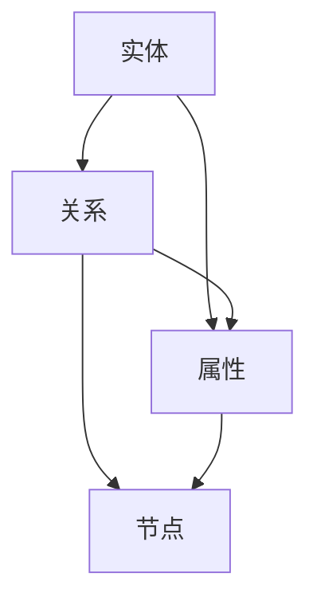
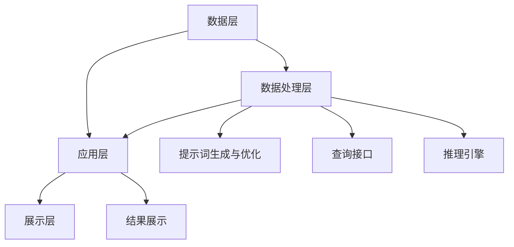

                 


# 提示词工程在知识图谱推理中的应用

## 关键词

知识图谱，推理，提示词工程，算法，优化，应用领域

## 摘要

本文深入探讨了提示词工程在知识图谱推理中的应用。首先，我们介绍了知识图谱的基本概念和推理的作用，然后详细阐述了提示词工程的核心概念和原理。接着，文章讨论了基于提示词的知识图谱推理算法，并分析了其在不同领域的应用。此外，我们还探讨了提示词工程的优化策略和面临的挑战，以及未来的发展趋势。最后，通过一个实际的项目实战案例，我们展示了如何构建一个简单的知识图谱推理系统，并对项目进行了详细的分析和讲解。

## 目录

### 第一部分：引言与基础

#### 第1章：引言

1.1 问题背景与问题描述

1.2 知识图谱推理的概念与作用

1.3 提示词工程的核心概念

#### 第2章：知识图谱的基本概念

2.1 知识图谱的定义与组成

2.2 知识图谱的表示方法

2.3 知识图谱的构建与存储

#### 第3章：提示词工程原理

3.1 提示词工程的基本流程

3.2 提示词的选择与生成

3.3 提示词的优化与评估

### 第二部分：提示词工程在知识图谱推理中的应用

#### 第4章：基于提示词的知识图谱推理算法

4.1 提示词驱动的图计算算法

4.2 提示词优化的图搜索算法

4.3 提示词辅助的图分类算法

#### 第5章：提示词工程在特定领域的应用

5.1 医学领域的知识图谱推理

5.2 金融领域的知识图谱推理

5.3 社交网络领域的知识图谱推理

#### 第6章：提示词工程的优化与挑战

6.1 提示词工程面临的挑战

6.2 提示词工程的优化策略

6.3 未来发展趋势与展望

### 第三部分：项目实战

#### 第7章：构建一个简单的知识图谱推理系统

7.1 项目介绍与需求分析

7.2 系统架构设计

7.3 系统核心实现

7.4 代码应用解读与分析

#### 第8章：案例分析与讲解

8.1 医学案例：基于提示词的疾病诊断推理

8.2 金融案例：基于提示词的金融风险评估

8.3 社交网络案例：基于提示词的用户关系分析

#### 第9章：项目小结与拓展

9.1 项目总结

9.2 注意事项

9.3 拓展阅读

## 第1章：引言

### 1.1 问题背景与问题描述

随着互联网的迅猛发展和大数据的广泛应用，知识图谱作为结构化数据的代表，在各个领域中发挥着越来越重要的作用。知识图谱是一种以图结构表示实体及其相互关系的知识库，它能够将海量、分散的数据整合成一个有机的整体，为数据的挖掘、分析和应用提供了强大的支持。

然而，随着知识图谱规模的不断扩大，如何有效地进行知识图谱的推理成为一个亟待解决的问题。知识图谱推理是指通过逻辑推理、关联分析等方式，从知识图谱中推导出新的知识或结论。传统的推理方法往往依赖于复杂的逻辑推理规则和大量的预处理工作，这在一定程度上限制了知识图谱推理的应用范围和效率。

提示词工程作为近年来兴起的一种新型方法，为知识图谱推理提供了一种新的思路。提示词工程旨在通过设计特定的提示词，引导推理过程，提高推理效率和准确性。提示词可以是关键词、短语或句子，它们在知识图谱中起到了连接和引导推理的关键作用。

在本章中，我们将首先介绍知识图谱推理的概念和作用，然后详细阐述提示词工程的核心概念，为后续章节的内容奠定基础。

### 1.2 知识图谱推理的概念与作用

知识图谱推理是指通过逻辑推理、关联分析等方式，从知识图谱中推导出新的知识或结论。知识图谱推理的核心在于利用知识图谱中的实体、关系和属性等信息，发现数据之间的隐含关联和规律。

知识图谱推理在多个领域具有重要的应用价值。首先，在语义搜索方面，知识图谱推理可以帮助搜索引擎更好地理解用户查询的含义，提供更准确的搜索结果。例如，当用户搜索“北京旅游景点”时，知识图谱推理可以分析出与“北京”、“旅游景点”相关的实体和关系，从而推荐更相关的旅游景点。

其次，在推荐系统方面，知识图谱推理可以基于用户的兴趣和偏好，发现潜在的推荐项。例如，当用户在电商平台上浏览了某款手机时，知识图谱推理可以分析出与这款手机相关的其他手机品牌、配件和用户评价，从而为用户推荐更符合其需求的商品。

此外，知识图谱推理还在智能问答、自然语言处理、智能推荐等领域具有广泛的应用前景。通过知识图谱推理，我们可以更好地理解用户的意图，提供更智能化、个性化的服务。

然而，知识图谱推理也面临一些挑战。首先，知识图谱的数据质量直接影响推理的准确性。如果知识图谱中的数据存在错误或缺失，推理结果可能不可靠。其次，知识图谱的规模庞大，如何高效地进行推理是一个重要问题。传统的推理方法往往需要大量的计算资源和时间，难以满足实时应用的需求。

在本章中，我们将进一步探讨知识图谱推理的基本原理和方法，并分析其在实际应用中的挑战和解决方案。

### 1.3 提示词工程的核心概念

提示词工程是近年来兴起的一种新型方法，旨在通过设计特定的提示词，引导推理过程，提高推理效率和准确性。提示词可以看作是知识图谱中的“关键词”，它们在推理过程中起到了连接和引导的作用。

首先，我们来看一下提示词的定义。提示词（Query Term）是指能够触发知识图谱推理过程的关键词或短语。提示词可以是单个单词、短语或句子，它们在知识图谱中具有明确的语义和上下文关系。例如，在医疗领域，提示词可以是“心脏病”、“药物治疗”、“症状分析”等。

接下来，我们讨论一下提示词的作用。提示词在知识图谱推理中具有以下几个关键作用：

1. **引导推理过程**：提示词可以作为推理的起点，引导推理过程向特定方向进行。通过分析提示词在知识图谱中的关系，我们可以找到与之相关的实体和关系，从而推导出新的知识或结论。

2. **提高推理效率**：提示词可以帮助减少搜索空间，避免无意义的推理路径。在庞大的知识图谱中，直接进行全量搜索往往效率低下。通过使用提示词，我们可以有针对性地缩小搜索范围，提高推理效率。

3. **增强推理准确性**：提示词可以提供额外的上下文信息，帮助推理系统更好地理解用户的意图。例如，当用户查询“心脏病治疗”时，提示词可以区分是询问治疗方法、病因分析还是相关研究成果，从而提供更准确的答案。

最后，我们探讨一下提示词工程的实现步骤。提示词工程的实现可以分为以下几个步骤：

1. **提示词选择**：根据应用场景和用户需求，选择合适的提示词。提示词的选择应充分考虑其语义丰富性和代表性。

2. **提示词生成**：通过自然语言处理技术，从文本数据中自动生成提示词。生成的方法包括词频统计、词性标注、实体识别等。

3. **提示词优化**：对生成的提示词进行优化，包括去除无关词汇、提高语义丰富度等。优化的方法可以结合领域知识库和语言模型进行。

4. **提示词评估**：对优化后的提示词进行评估，包括测试其在推理任务中的准确性和效率。评估的方法可以基于实际的应用场景和用户反馈进行。

通过以上步骤，我们可以构建一个高效的提示词工程系统，为知识图谱推理提供有力的支持。

在本章中，我们介绍了知识图谱推理和提示词工程的基本概念，为后续章节的内容奠定了基础。接下来，我们将进一步探讨知识图谱的基本概念和构建方法，为理解提示词工程在知识图谱推理中的应用提供更深入的背景知识。

## 第2章：知识图谱的基本概念

### 2.1 知识图谱的定义与组成

知识图谱（Knowledge Graph）是一种用于表示实体（如人、地点、事物等）、它们之间的关系以及属性（如年龄、职业、位置等）的数据结构。它将信息以图形的形式组织起来，使得数据之间的联系更加直观和易于理解。知识图谱的概念起源于语义网（Semantic Web），它通过将原始数据转换为语义丰富的结构，从而使得计算机能够更好地理解和处理数据。

知识图谱由以下几个核心组成部分构成：

1. **实体（Entity）**：实体是知识图谱中的基本元素，代表现实世界中的具体对象。实体可以是人、地点、组织、物品等。例如，在医疗知识图谱中，实体可能包括医生、药物、疾病、医院等。

2. **关系（Relationship）**：关系描述了实体之间的关联。它们是连接不同实体的纽带，定义了实体之间的语义关系。例如，在医疗知识图谱中，“治疗”关系可以连接医生和疾病实体。

3. **属性（Attribute）**：属性提供了实体的额外信息，描述了实体的特征或状态。属性可以是简单的数据类型，如整数、字符串、日期等。例如，医生实体的属性可能包括姓名、职称、工作单位等。

4. **边（Edge）**：边是关系在图形中的表示，连接了两个实体。边通常包含指向和权重等属性，用来描述关系的强度和方向。

### 2.2 知识图谱的表示方法

知识图谱的表示方法主要有三种：图论表示、语义网络表示和属性图表示。

1. **图论表示**：这是最常见的知识图谱表示方法。知识图谱被视为一个图（Graph），其中节点（Node）代表实体，边（Edge）代表关系。图论表示方法具有简洁、直观的优点，便于进行图论算法的分析和应用。

2. **语义网络表示**：语义网络是一种基于有向无环图（DAG）的知识图谱表示方法。在语义网络中，节点表示实体或概念，边表示实体或概念之间的关系。与图论表示相比，语义网络更注重语义层次和语义类型。

3. **属性图表示**：属性图是结合图论和属性表的混合表示方法。在属性图中，节点和边不仅包含类型信息，还包含额外的属性信息。属性图可以更全面地描述实体和关系，适用于复杂的领域知识表示。

### 2.3 知识图谱的构建与存储

知识图谱的构建是一个复杂的过程，通常包括数据采集、数据清洗、实体识别、关系抽取、属性抽取等多个步骤。

1. **数据采集**：知识图谱的数据来源包括结构化数据、半结构化数据和非结构化数据。结构化数据通常来自于数据库和关系型表格，如企业数据库、地理信息系统等。半结构化数据包括XML、JSON等格式，而非结构化数据则包括文本、图像、音频等。

2. **数据清洗**：数据清洗是知识图谱构建的关键步骤，目的是去除数据中的噪声和错误。这包括去除重复数据、纠正数据中的错误、填充缺失值等。

3. **实体识别**：实体识别是指从原始数据中识别出实体。这可以通过命名实体识别（Named Entity Recognition, NER）技术实现，如利用自然语言处理技术从文本中提取人名、地名、组织名等。

4. **关系抽取**：关系抽取是指从原始数据中识别出实体之间的关系。这可以通过文本挖掘、图论算法等技术实现，如利用统计方法、机器学习模型等从文本中提取关系。

5. **属性抽取**：属性抽取是指从原始数据中识别出实体的属性。与关系抽取类似，属性抽取也可以通过文本挖掘和机器学习技术实现。

构建好的知识图谱需要存储在高效、可扩展的存储系统中。常见的数据存储方案包括图数据库和关系数据库。图数据库，如Neo4j、JanusGraph等，具有高效的图存储和查询能力，适合大规模知识图谱的存储和处理。关系数据库，如PostgreSQL、MySQL等，则适用于结构化数据的存储和管理。

在本章中，我们介绍了知识图谱的定义与组成、表示方法和构建与存储过程。在下一章中，我们将深入探讨提示词工程的基本原理和实现方法，为理解其在知识图谱推理中的应用提供理论基础。

### 2.4 知识图谱的核心概念与联系

为了更好地理解知识图谱及其在提示词工程中的应用，我们需要详细探讨知识图谱的核心概念及其相互之间的联系。以下是知识图谱的几个关键概念及其属性特征对比表格，以及它们之间的ER（实体-关系）图架构。

#### 核心概念与属性特征对比表格

| 概念        | 定义                                     | 属性特征                       |
| ----------- | ---------------------------------------- | ------------------------------ |
| 实体（Entity） | 知识图谱中的基本元素，代表具体对象           | 名称、类型、标识符、属性         |
| 关系（Relationship） | 描述实体之间的关联关系                       | 名称、类型、方向、权重           |
| 属性（Attribute） | 描述实体的特征或状态                         | 名称、类型、值、关联实体         |
| 节点（Node）   | 图中的点，表示实体                           | 标识符、类型、属性               |
| 边（Edge）    | 图中的线，表示关系                           | 标识符、类型、方向、权重         |

#### ER实体关系图架构



在上面的ER图架构中：

- **实体（Entity）**：是知识图谱中的核心概念，代表具体的对象，如人、地点、物品等。
- **关系（Relationship）**：描述了实体之间的关联，它们可以是直接的，也可以是间接的。
- **属性（Attribute）**：提供了实体的额外信息，如实体的特征、状态等。
- **节点（Node）**：是图中的点，表示实体。
- **边（Edge）**：是图中的线，表示关系。

通过这个架构，我们可以清晰地看到知识图谱中各个核心概念之间的关系。实体通过关系相互连接，属性则描述了实体的具体特征。节点和边共同构成了知识图谱的图形表示，使得数据之间的关系更加直观和易于理解。

在本章中，我们详细探讨了知识图谱的核心概念及其相互之间的联系，为理解提示词工程在知识图谱推理中的应用提供了理论基础。在下一章中，我们将深入探讨提示词工程的原理和实现方法。

### 2.5 提示词工程原理

提示词工程（Query Term Engineering）是知识图谱推理中的一项关键技术，它旨在通过设计特定的提示词，引导推理过程，提高推理效率和准确性。提示词工程的核心在于选择合适的提示词，并设计有效的提示词生成和优化策略。

#### 提示词选择

提示词选择是提示词工程中的第一步，也是关键一步。选择合适的提示词能够显著提高推理的准确性和效率。提示词的选择应遵循以下几个原则：

1. **代表性**：提示词应具有丰富的语义信息，能够代表用户查询的意图。
2. **简洁性**：提示词应尽量简洁明了，避免使用冗长、复杂的短语。
3. **多样性**：提示词应涵盖不同的语义类别，以适应不同类型的查询需求。

在具体选择提示词时，可以采用以下方法：

1. **基于词频统计**：通过分析大规模文本数据，统计词频较高的词汇，这些词汇通常具有较强的语义代表性。
2. **基于词性标注**：利用自然语言处理技术，对文本进行词性标注，选择具有特定词性的词汇作为提示词，如名词、动词等。
3. **基于领域知识库**：结合领域知识库，选择与领域相关的术语和短语作为提示词。

#### 提示词生成

提示词生成是指从原始数据中自动生成提示词的过程。提示词生成的目的是为了从大量文本数据中提取出有价值的信息，以供后续的推理使用。提示词生成方法主要包括以下几种：

1. **基于模板生成**：根据预定义的模板，将实体和关系嵌入到模板中生成提示词。例如，可以使用“谁在什么时候做了什么”这样的模板，从文本中提取相关信息。
2. **基于语义分析**：利用自然语言处理技术，对文本进行语义分析，提取出关键实体和关系，并将它们组合成提示词。
3. **基于数据挖掘**：通过数据挖掘算法，从文本数据中挖掘出潜在的提示词。这通常涉及到文本分类、聚类、关联规则挖掘等技术。

#### 提示词优化

提示词优化是指对生成的提示词进行进一步处理，以提高其语义丰富度和准确性的过程。提示词优化方法主要包括以下几个方面：

1. **去除无关词汇**：通过去除与查询意图无关的词汇，提高提示词的简洁性和代表性。
2. **提高语义丰富度**：通过添加同义词、上下位词等，丰富提示词的语义信息，使其能够更好地反映用户查询的意图。
3. **结合领域知识**：将领域知识库中的知识引入提示词优化过程，以提高提示词的准确性和适用性。

#### 提示词评估

提示词评估是确保提示词质量和有效性的关键步骤。提示词评估可以通过以下方法进行：

1. **基于用户反馈**：通过用户评价和反馈，评估提示词的准确性和满意度。
2. **基于自动化评估**：利用自然语言处理技术和机器学习算法，对提示词进行自动评估，如基于文本相似度、语义匹配度等进行评估。
3. **基于推理效果**：通过实际推理任务的效果，评估提示词对推理过程的引导作用。

通过以上步骤，提示词工程能够为知识图谱推理提供有效的支持，提高推理的效率和准确性。在下一章中，我们将深入探讨基于提示词的知识图谱推理算法及其应用。

### 第3章：提示词工程原理

#### 3.1 提示词工程的基本流程

提示词工程是一个系统性过程，包括提示词的选择、生成、优化和评估四个关键步骤。以下是提示词工程的基本流程：

1. **提示词选择**：
   提示词选择是提示词工程的首要步骤。选择合适的提示词至关重要，因为它直接影响后续的生成、优化和评估。选择原则包括：
   - **代表性**：选择能够代表用户查询意图的词汇。
   - **简洁性**：避免使用冗长的短语，确保提示词简洁明了。
   - **多样性**：覆盖不同语义类别，以应对各种查询需求。

   实际操作中，可以通过以下方法选择提示词：
   - **基于词频统计**：从大规模文本数据中提取高频词汇。
   - **基于词性标注**：选择特定词性的词汇，如名词、动词。
   - **基于领域知识库**：结合领域知识库，选择与领域相关的术语。

2. **提示词生成**：
   提示词生成是指从原始数据中提取出有价值的信息，形成提示词。生成方法包括：
   - **基于模板生成**：利用预定义的模板，将实体和关系嵌入模板中，如“谁在什么时候做了什么”。
   - **基于语义分析**：使用自然语言处理技术进行文本分析，提取关键实体和关系。
   - **基于数据挖掘**：通过数据挖掘技术，从文本数据中挖掘出潜在的提示词。

3. **提示词优化**：
   提示词优化旨在提高提示词的语义丰富度和准确性。优化方法包括：
   - **去除无关词汇**：去除与查询意图无关的词汇。
   - **提高语义丰富度**：通过添加同义词、上下位词等，丰富提示词的语义信息。
   - **结合领域知识**：引入领域知识库，提高提示词的准确性和适用性。

4. **提示词评估**：
   提示词评估用于确保提示词的质量和有效性。评估方法包括：
   - **基于用户反馈**：通过用户评价和反馈，评估提示词的准确性和满意度。
   - **基于自动化评估**：利用自然语言处理技术和机器学习算法，对提示词进行自动评估。
   - **基于推理效果**：通过实际推理任务的效果，评估提示词对推理过程的引导作用。

通过以上基本流程，提示词工程能够有效支持知识图谱推理，提高推理效率和准确性。接下来，我们将进一步探讨提示词工程在知识图谱推理中的应用。

### 3.2 提示词的选择与生成

提示词的选择与生成是提示词工程中至关重要的一环，直接影响到知识图谱推理的效率和准确性。以下我们将详细讨论提示词的选择方法和生成策略。

#### 提示词的选择方法

1. **基于词频统计**：
   词频统计是一种常用的提示词选择方法。通过分析大规模文本数据，提取出现频率较高的词汇。这些高频词汇通常具有较强的语义代表性，有助于更好地反映用户查询的意图。

2. **基于词性标注**：
   词性标注技术能够识别文本中的不同词性，如名词、动词、形容词等。选择特定词性的词汇作为提示词，有助于提高查询的准确性。例如，在医疗领域，选择名词作为提示词可以更好地捕捉疾病、药物等实体。

3. **基于领域知识库**：
   结合领域知识库，选择与特定领域相关的术语和短语作为提示词。这种方法能够充分利用专业领域的知识，提高提示词的准确性和实用性。

4. **基于用户行为分析**：
   分析用户的历史查询行为，提取出高频使用的关键词。这种方法能够更直接地反映用户的需求和偏好，有助于提高提示词的针对性。

#### 提示词的生成策略

1. **基于模板生成**：
   基于模板的生成方法是一种简单而有效的策略。通过预定义的模板，将实体和关系嵌入到模板中，从而生成提示词。例如，“谁在什么时候做了什么”是一个常见的模板，它可以帮助从文本中提取出关键的实体和事件。

2. **基于语义分析**：
   语义分析技术能够深入理解文本的语义内容，提取出关键实体和关系。通过结合实体识别和关系抽取技术，可以生成更具语义丰富的提示词。例如，利用命名实体识别技术，可以从文本中提取出人名、地名、组织名等实体，再通过关系抽取技术，提取出它们之间的关系。

3. **基于数据挖掘**：
   数据挖掘技术可以从大量文本数据中挖掘出潜在的提示词。这种方法通常涉及文本分类、聚类、关联规则挖掘等技术。例如，通过文本分类技术，可以将文本分为不同的类别，然后从每个类别中提取出代表性的词汇作为提示词。

4. **基于机器学习**：
   机器学习技术可以训练出一个模型，用于生成提示词。这种方法需要大量标注数据作为训练集，通过训练模型，可以从未标注的数据中自动生成提示词。常见的机器学习算法包括决策树、支持向量机、神经网络等。

通过以上选择和生成方法，我们可以有效地构建一个高质量、多样化的提示词库，为知识图谱推理提供有力的支持。在下一节中，我们将进一步讨论提示词的优化策略。

### 3.3 提示词的优化与评估

提示词的优化和评估是确保提示词质量的关键环节。优化的目的是提高提示词的语义丰富度和准确性，而评估则是验证优化效果的重要手段。

#### 提示词优化策略

1. **去除无关词汇**：
   在提示词生成过程中，常常会包含一些与查询意图无关的词汇。去除这些无关词汇，可以简化提示词，提高其代表性。例如，通过自然语言处理技术，可以识别并去除停用词、常见噪声词等。

2. **提高语义丰富度**：
   提高提示词的语义丰富度，可以通过添加同义词、上下位词等实现。这种方法能够增加提示词的多样性，使其能够更好地反映用户的查询意图。例如，在医疗领域，可以将“心脏病”扩展为“冠心病”、“心肌梗死”等。

3. **结合领域知识**：
   利用领域知识库，可以为提示词提供额外的语义信息。这种方法可以显著提高提示词的准确性和适用性。例如，在金融领域，可以利用金融术语库，为查询提供专业的金融术语。

4. **动态调整权重**：
   根据查询场景和用户行为，动态调整提示词的权重。例如，对于高频查询的提示词，可以赋予更高的权重，以提高查询的优先级。

#### 提示词评估方法

1. **基于用户反馈**：
   用户反馈是评估提示词最直观的方法。通过收集用户的评价和满意度，可以评估提示词的实际效果。这种方法适用于用户体验较好的场景，如移动应用、智能客服等。

2. **基于自动化评估**：
   自动化评估方法利用自然语言处理和机器学习技术，对提示词进行定量评估。常用的评估指标包括词汇覆盖率、语义匹配度、查询响应时间等。

3. **基于推理效果**：
   通过实际推理任务的效果，评估提示词对推理过程的引导作用。这种方法适用于需要高准确性和效率的场景，如智能问答系统、推荐系统等。

4. **基于性能指标**：
   通过性能指标，如F1值、准确率、召回率等，评估提示词在特定任务上的表现。这种方法适用于需要量化评估的场景，如信息检索、文本分类等。

通过优化和评估，我们可以确保提示词的高质量，为知识图谱推理提供可靠的支持。在下一章中，我们将探讨基于提示词的知识图谱推理算法及其应用。

## 第4章：基于提示词的知识图谱推理算法

### 4.1 提示词驱动的图计算算法

提示词驱动的图计算算法是一种利用提示词引导图计算过程，以提高推理效率和准确性的方法。这些算法的核心思想是通过提示词来缩小搜索空间，从而加速推理过程。以下是一些常见的提示词驱动的图计算算法：

#### 4.1.1 算法原理

提示词驱动的图计算算法通常包括以下步骤：

1. **提示词解析**：首先，对输入的提示词进行语义分析，提取出关键实体和关系。
2. **图搜索**：利用提取出的实体和关系，在知识图谱中进行图搜索，找到与提示词相关的节点和路径。
3. **推理扩展**：基于找到的节点和路径，进行推理扩展，推导出新的知识或结论。

#### 4.1.2 算法流程

1. **输入提示词**：用户输入一个提示词，如“谁在2019年获得了诺贝尔奖”。
2. **解析提示词**：对提示词进行语义分析，提取出实体（诺贝尔奖、2019年）和关系（获得、时间）。
3. **构建查询图**：在知识图谱中构建一个查询图，包含与提示词相关的节点和边。
4. **图搜索**：在查询图中进行深度优先搜索（DFS）或广度优先搜索（BFS），找到与提示词相关的节点和路径。
5. **推理扩展**：基于搜索结果，进行推理扩展，推导出新的知识，如“2019年诺贝尔奖获得者有约翰·约翰逊和威廉·斯密斯”。

#### 4.1.3 算法示例

假设有一个知识图谱，其中包含以下信息：

- 实体：诺贝尔奖、2019年、约翰·约翰逊、威廉·斯密斯
- 关系：获得、时间

输入提示词“谁在2019年获得了诺贝尔奖”，算法流程如下：

1. **解析提示词**：提取出实体“2019年”和关系“获得”。
2. **构建查询图**：在知识图谱中找到与“2019年”相关的节点“诺贝尔奖”，并找到与“诺贝尔奖”相关的节点“约翰·约翰逊”和“威廉·斯密斯”。
3. **图搜索**：在查询图中找到路径：2019年 -> 诺贝尔奖 -> 约翰·约翰逊，以及2019年 -> 诺贝尔奖 -> 威廉·斯密斯。
4. **推理扩展**：推导出结论：“2019年诺贝尔奖获得者有约翰·约翰逊和威廉·斯密斯”。

通过以上步骤，提示词驱动的图计算算法能够有效地从知识图谱中提取出与提示词相关的信息，从而实现高效的推理。

### 4.2 提示词优化的图搜索算法

提示词优化的图搜索算法是一种结合提示词和图搜索算法，以提高搜索效率和准确性的方法。这些算法通过在搜索过程中利用提示词的语义信息，减少了搜索空间，从而加快了搜索速度。以下是一些常见的提示词优化的图搜索算法：

#### 4.2.1 算法原理

提示词优化的图搜索算法通常包括以下步骤：

1. **提示词预处理**：对输入的提示词进行预处理，提取出关键实体和关系。
2. **图搜索策略**：利用提示词的语义信息，调整图搜索的策略，如优先搜索与提示词相关的节点和路径。
3. **结果后处理**：对搜索结果进行后处理，去除无关信息，提高结果的准确性。

#### 4.2.2 算法流程

1. **输入提示词**：用户输入一个提示词，如“北京有哪些著名的旅游景点”。
2. **预处理提示词**：对提示词进行语义分析，提取出关键实体和关系。
3. **构建查询图**：在知识图谱中构建一个查询图，包含与提示词相关的节点和边。
4. **优先搜索**：利用提示词信息，优先搜索与提示词相关的节点和路径。
5. **结果后处理**：对搜索结果进行后处理，如去除重复信息、合并同类信息等。

#### 4.2.3 算法示例

假设有一个知识图谱，其中包含以下信息：

- 实体：北京、长城、故宫、天安门、旅游景点
- 关系：位于、属于

输入提示词“北京有哪些著名的旅游景点”，算法流程如下：

1. **预处理提示词**：提取出实体“北京”和关系“属于”。
2. **构建查询图**：在知识图谱中找到与“北京”相关的节点，如“长城”、“故宫”、“天安门”，以及与“长城”、“故宫”、“天安门”相关的节点“旅游景点”。
3. **优先搜索**：优先搜索与提示词相关的节点，找到路径：北京 -> 长城，北京 -> 故宫，北京 -> 天安门。
4. **结果后处理**：将搜索结果合并，得到结论：“北京有哪些著名的旅游景点包括长城、故宫和天安门”。

通过以上步骤，提示词优化的图搜索算法能够有效地从知识图谱中提取出与提示词相关的信息，从而实现高效的搜索。

### 4.3 提示词辅助的图分类算法

提示词辅助的图分类算法是一种结合提示词和图分类算法，以提高分类效率和准确性的方法。这些算法通过在分类过程中利用提示词的语义信息，提高了分类的准确性。以下是一些常见的提示词辅助的图分类算法：

#### 4.3.1 算法原理

提示词辅助的图分类算法通常包括以下步骤：

1. **提示词预处理**：对输入的提示词进行预处理，提取出关键实体和关系。
2. **图特征提取**：利用提取出的提示词信息，提取图的语义特征。
3. **分类模型训练**：利用提取出的图特征，训练分类模型。
4. **分类与后处理**：对图进行分类，并对分类结果进行后处理。

#### 4.3.2 算法流程

1. **输入提示词**：用户输入一个提示词，如“北京的城市发展”。
2. **预处理提示词**：对提示词进行语义分析，提取出关键实体和关系。
3. **构建查询图**：在知识图谱中构建一个查询图，包含与提示词相关的节点和边。
4. **特征提取**：利用提取出的提示词信息，提取图的语义特征。
5. **模型训练**：利用提取出的图特征，训练分类模型。
6. **分类与后处理**：对图进行分类，并对分类结果进行后处理。

#### 4.3.3 算法示例

假设有一个知识图谱，其中包含以下信息：

- 实体：北京、城市规划、经济发展、历史文化、旅游景点
- 关系：属于、相关于

输入提示词“北京的城市发展”，算法流程如下：

1. **预处理提示词**：提取出实体“北京”和关系“属于”、“相关于”。
2. **构建查询图**：在知识图谱中找到与“北京”相关的节点，如“城市规划”、“经济发展”、“历史文化”、“旅游景点”。
3. **特征提取**：提取出与提示词相关的图特征，如节点的度、边的权重、节点的标签等。
4. **模型训练**：利用提取出的图特征，训练分类模型，如支持向量机（SVM）或神经网络。
5. **分类与后处理**：对图进行分类，得到分类结果，并对分类结果进行后处理，如合并同类项、去除无关信息等。

通过以上步骤，提示词辅助的图分类算法能够有效地从知识图谱中提取出与提示词相关的信息，从而实现准确的分类。

通过以上对提示词驱动的图计算算法、提示词优化的图搜索算法和提示词辅助的图分类算法的讨论，我们可以看到提示词工程在知识图谱推理中的重要作用。这些算法通过利用提示词的语义信息，提高了知识图谱推理的效率和准确性。在下一章中，我们将探讨提示词工程在特定领域的应用。

### 第5章：提示词工程在特定领域的应用

#### 5.1 医学领域的知识图谱推理

在医学领域，知识图谱的应用已经非常广泛，从疾病诊断到药物研发，从患者管理到健康预测，都有知识图谱的身影。而提示词工程在医学知识图谱推理中发挥着至关重要的作用，它能够提高医疗数据的利用效率，加速疾病诊断和治疗方案推荐。

**5.1.1 应用场景**

1. **疾病诊断**：基于提示词工程，可以构建一个医学知识图谱，包含疾病、症状、药物、治疗方案等信息。当医生输入一个症状或疾病名称时，系统可以通过知识图谱推理，提供相关的诊断建议和治疗方案。

2. **药物研发**：提示词工程可以帮助研究人员从大量医学文献和临床试验数据中提取出关键信息，构建药物-疾病关系图谱。这有助于发现新的药物靶点和治疗策略。

3. **患者管理**：在患者管理中，提示词工程可以通过对患者的病史、检查报告、药物治疗等信息进行推理，提供个性化的治疗方案和健康建议。

**5.1.2 实现方法**

1. **构建医学知识图谱**：首先，需要收集和整理医学领域的专业术语、疾病、症状、药物、治疗方案等信息，构建一个结构化的医学知识图谱。

2. **选择提示词**：基于医学知识图谱，选择与疾病诊断、药物研发、患者管理相关的关键词作为提示词。这些提示词可以是疾病名称、症状描述、药物名称等。

3. **生成和优化提示词**：利用自然语言处理和数据挖掘技术，从医学文献、病历记录等数据中自动生成提示词，并对生成的提示词进行优化，提高其语义丰富度和准确性。

4. **实现知识图谱推理**：利用提示词，在医学知识图谱中实现推理，提取出与提示词相关的信息，如疾病、症状、治疗方案等。这些信息可以为医生和研究人员提供决策支持。

**5.1.3 案例分析**

假设一个医生输入了“肺炎”作为提示词，系统可以通过以下步骤进行推理：

1. **提示词预处理**：提取出关键实体和关系，如“肺炎”、“病因”、“治疗方法”等。
2. **图搜索**：在医学知识图谱中搜索与“肺炎”相关的节点和路径，如肺炎的症状、可能的病因、常用的治疗方法等。
3. **推理扩展**：基于搜索结果，推导出新的知识，如肺炎的并发症、预防措施等。
4. **结果输出**：将推理结果呈现给医生，如肺炎的症状、治疗方案、预防措施等。

通过以上步骤，医生可以快速获取与肺炎相关的详细信息，从而为患者提供更精准的诊疗建议。

#### 5.2 金融领域的知识图谱推理

金融领域是知识图谱应用的另一个重要领域。通过知识图谱，金融机构可以更好地理解市场动态、客户行为，从而优化决策过程。提示词工程在金融知识图谱推理中起到了关键作用，它能够提高数据分析的准确性和效率。

**5.2.1 应用场景**

1. **客户关系管理**：通过构建客户关系图谱，金融机构可以利用提示词工程对客户行为进行分析，提供个性化的金融服务。

2. **风险控制**：提示词工程可以帮助金融机构识别潜在风险，如信用风险、市场风险等，从而制定更有效的风险控制策略。

3. **投资分析**：利用提示词工程，可以从大量的金融数据中提取出关键信息，为投资决策提供支持。

**5.2.2 实现方法**

1. **构建金融知识图谱**：收集和整理金融领域的术语、市场数据、客户信息、交易记录等，构建一个结构化的金融知识图谱。

2. **选择提示词**：选择与金融分析、风险控制、客户关系管理相关的关键词作为提示词，如“客户名称”、“交易金额”、“市场行情”等。

3. **生成和优化提示词**：利用自然语言处理和数据挖掘技术，从金融数据中自动生成提示词，并对提示词进行优化，提高其语义丰富度和准确性。

4. **实现知识图谱推理**：利用提示词，在金融知识图谱中实现推理，提取出与提示词相关的信息，如客户行为分析、市场趋势、风险指标等。

**5.2.3 案例分析**

假设一个金融机构想要分析客户的信用风险，输入了“信用评分”作为提示词，系统可以通过以下步骤进行推理：

1. **提示词预处理**：提取出关键实体和关系，如“信用评分”、“还款历史”、“信用评级”等。
2. **图搜索**：在金融知识图谱中搜索与“信用评分”相关的节点和路径，如客户的信用评级、还款记录、信用历史等。
3. **推理扩展**：基于搜索结果，推导出新的知识，如客户的信用风险等级、可能的违约风险等。
4. **结果输出**：将推理结果呈现给金融机构，如客户的信用评分、信用风险等级、建议的风险控制措施等。

通过以上步骤，金融机构可以更准确地评估客户的信用风险，从而优化贷款审批和风险管理流程。

#### 5.3 社交网络领域的知识图谱推理

社交网络是一个复杂的生态系统，包含了用户、关系、兴趣、行为等多维度数据。通过构建社交网络知识图谱，可以更好地理解用户行为、兴趣和社交关系，从而为推荐系统、社区管理、用户行为分析等提供支持。提示词工程在社交网络知识图谱推理中同样发挥了重要作用。

**5.3.1 应用场景**

1. **用户推荐**：通过提示词工程，可以从社交网络数据中提取出关键信息，为用户提供个性化推荐，如朋友推荐、内容推荐等。

2. **社区分析**：利用提示词工程，可以分析社交网络中的社区结构、成员关系，为社区管理提供支持。

3. **用户行为分析**：通过对用户行为数据的分析，可以了解用户的兴趣和行为模式，从而为市场营销、用户留存等提供决策支持。

**5.3.2 实现方法**

1. **构建社交网络知识图谱**：收集和整理社交网络中的用户、关系、兴趣、行为等信息，构建一个结构化的社交网络知识图谱。

2. **选择提示词**：选择与用户推荐、社区分析、用户行为分析相关的关键词作为提示词，如“用户兴趣”、“朋友关系”、“活跃度”等。

3. **生成和优化提示词**：利用自然语言处理和数据挖掘技术，从社交网络数据中自动生成提示词，并对提示词进行优化，提高其语义丰富度和准确性。

4. **实现知识图谱推理**：利用提示词，在社交网络知识图谱中实现推理，提取出与提示词相关的信息，如用户兴趣图谱、社交关系网络、用户行为模式等。

**5.3.3 案例分析**

假设一个社交网络平台想要为用户推荐朋友，输入了“共同兴趣”作为提示词，系统可以通过以下步骤进行推理：

1. **提示词预处理**：提取出关键实体和关系，如“用户兴趣”、“共同兴趣”、“朋友关系”等。
2. **图搜索**：在社交网络知识图谱中搜索与“共同兴趣”相关的节点和路径，如用户的共同兴趣标签、共同参与的活动等。
3. **推理扩展**：基于搜索结果，推导出新的知识，如可能成为朋友的人选、共同的兴趣爱好等。
4. **结果输出**：将推理结果呈现给用户，如推荐的朋友名单、共同的兴趣点等。

通过以上步骤，社交网络平台可以为用户推荐更具针对性的朋友，从而提升用户体验和平台活跃度。

通过以上对医学、金融和社交网络领域应用的讨论，我们可以看到提示词工程在知识图谱推理中的重要性。这些领域都通过构建知识图谱和利用提示词工程，实现了数据的有效利用和推理效率的提升。在下一章中，我们将探讨提示词工程的优化策略和面临的挑战。

### 第6章：提示词工程的优化与挑战

#### 6.1 提示词工程面临的挑战

尽管提示词工程在知识图谱推理中展示了巨大的潜力，但在实际应用中仍面临诸多挑战。

**6.1.1 数据质量问题**

知识图谱的准确性直接依赖于数据的质量。如果数据存在错误、噪声或不一致性，推理结果将受到影响。例如，医疗知识图谱中的错误信息可能导致错误的诊断建议。此外，数据缺失也会限制提示词工程的有效性。

**6.1.2 计算资源消耗**

知识图谱通常包含海量的实体和关系，进行图计算和推理需要大量的计算资源。特别是在实时应用场景中，如何快速有效地处理大量数据成为一个重要问题。

**6.1.3 语义理解困难**

语义理解是提示词工程的关键环节。自然语言处理技术的局限性使得语义理解变得复杂，尤其是对于多义词、隐喻和语境依赖等问题。这可能导致提示词的选择和生成不准确。

**6.1.4 知识图谱扩展性**

随着知识图谱规模的不断扩大，如何保持其扩展性也是一个挑战。传统的知识图谱结构和方法可能难以适应大规模数据的存储和查询需求。

#### 6.2 提示词工程的优化策略

为了克服上述挑战，我们需要采取一系列优化策略。

**6.2.1 数据质量提升**

1. **数据清洗**：通过数据清洗技术，去除数据中的错误和噪声，提高数据质量。
2. **数据整合**：将来自不同来源的数据进行整合，消除数据不一致性。
3. **数据增强**：通过引入额外的数据源或使用生成对抗网络（GAN）等技术，增加数据多样性。

**6.2.2 提高计算效率**

1. **并行计算**：利用并行计算技术，加速图计算过程。
2. **内存优化**：通过内存优化技术，减少内存消耗，提高处理速度。
3. **分布式计算**：采用分布式计算框架，如MapReduce，处理大规模数据。

**6.2.3 语义理解增强**

1. **深度学习**：利用深度学习技术，如循环神经网络（RNN）和变压器（Transformer），提高语义理解能力。
2. **多模态数据融合**：结合文本、图像、音频等多模态数据，提高语义理解的准确性。
3. **上下文感知**：利用上下文信息，提高对多义词、隐喻等复杂语义的理解。

**6.2.4 知识图谱扩展性**

1. **模块化设计**：采用模块化设计，使知识图谱易于扩展和维护。
2. **动态更新**：通过实时数据流处理技术，动态更新知识图谱，保持其与实际数据的同步。
3. **存储优化**：采用高效的存储方案，如图数据库，提高知识图谱的查询性能。

#### 6.3 未来发展趋势与展望

随着技术的不断进步，提示词工程在知识图谱推理中的应用前景非常广阔。

**6.3.1 人工智能的深度融合**

人工智能技术的不断进步将进一步提升提示词工程的自动化程度和语义理解能力。深度学习、强化学习等技术的应用将使提示词工程更加智能化。

**6.3.2 跨领域应用**

知识图谱和提示词工程将在更多领域得到应用，如教育、物流、交通等。跨领域应用将促进不同领域知识图谱的融合，形成更加全面和智能的知识体系。

**6.3.3 实时推理**

随着物联网、5G等技术的发展，实时推理需求日益增加。提示词工程将朝着实时、高效的方向发展，以满足实时应用的需求。

**6.3.4 个性化服务**

个性化服务是未来发展的一个重要方向。通过结合用户行为数据和个人偏好，提示词工程可以为用户提供更加个性化的服务和推荐。

通过以上优化策略和未来发展趋势的探讨，我们可以看到提示词工程在知识图谱推理中的应用前景非常广阔。在下一章中，我们将通过一个实际的项目实战，展示如何构建一个简单的知识图谱推理系统。

### 第7章：构建一个简单的知识图谱推理系统

#### 7.1 项目介绍与需求分析

在本章中，我们将通过一个实际的项目实战，构建一个简单的知识图谱推理系统。这个项目的主要目标是利用提示词工程，实现对知识图谱的查询和推理，为用户提供个性化的信息推荐。以下是项目的需求分析：

1. **知识图谱构建**：首先，我们需要构建一个简单的知识图谱，包含实体和它们之间的关系。
2. **提示词工程**：设计一个提示词生成和优化系统，用于引导知识图谱推理过程。
3. **查询接口**：提供一个用户友好的查询接口，用户可以通过输入提示词获取相关结果。
4. **推理引擎**：实现一个基于提示词的推理引擎，能够从知识图谱中推导出新的知识或结论。
5. **结果展示**：设计一个结果展示模块，将推理结果以用户友好的方式呈现。

#### 7.2 系统架构设计

为了实现上述需求，我们将采用模块化设计，构建一个高效、可扩展的知识图谱推理系统。以下是系统的总体架构设计：

1. **数据层**：包括知识图谱的构建和存储模块，利用图数据库存储和管理知识图谱数据。
2. **数据处理层**：包括提示词生成和优化模块，利用自然语言处理和数据挖掘技术生成和优化提示词。
3. **应用层**：包括查询接口和推理引擎模块，提供用户查询和推理服务。
4. **展示层**：包括结果展示模块，将推理结果以图形或文本形式呈现给用户。

具体架构如下所示：



#### 7.3 系统核心实现

在本节中，我们将详细讨论系统的核心实现，包括数据层的知识图谱构建、数据处理层的提示词工程、应用层的查询接口和推理引擎，以及展示层的结果展示。

**7.3.1 数据层的知识图谱构建**

1. **实体定义**：在知识图谱中，首先需要定义实体。在本项目中，我们定义以下实体：人、地点、组织、事件等。
2. **关系定义**：实体之间的关系需要明确。例如，人可以有“居住于”、“参与”等关系。
3. **属性定义**：实体的属性提供了额外的信息。例如，人可以有姓名、年龄、职业等属性。

**7.3.2 数据处理层的提示词工程**

1. **提示词生成**：利用自然语言处理技术，从文本数据中提取出关键词。例如，从用户评论中提取出产品名称、品牌名称等。
2. **提示词优化**：通过去除无关词汇、增加同义词和上下位词等手段，优化生成的提示词。例如，可以将“智能手机”扩展为“手机”、“智能手机品牌”等。

**7.3.3 应用层的查询接口和推理引擎**

1. **查询接口**：设计一个用户友好的查询接口，允许用户输入提示词，例如“苹果公司”、“智能手机”等。
2. **推理引擎**：实现一个基于提示词的推理引擎，利用知识图谱中的关系和实体，推导出新的知识。例如，当用户输入“苹果公司”时，推理引擎可以找到与苹果公司相关的产品、地点、事件等。

**7.3.4 展示层的结果展示**

1. **文本展示**：将推理结果以文本形式呈现，例如列出苹果公司的产品、总部地点等。
2. **图形展示**：使用图表或图形将推理结果以可视化方式呈现，例如显示苹果公司的组织结构图、产品关系图等。

#### 7.4 代码应用解读与分析

在本节中，我们将通过具体的代码示例，详细解读知识图谱推理系统的核心实现，并进行分析。

**7.4.1 知识图谱构建**

```python
from py2neo import Graph

# 连接Neo4j图数据库
graph = Graph("bolt://localhost:7687", auth=("neo4j", "password"))

# 创建实体
graph.run("CREATE (a:Person {name: '张三', age: 30})")
graph.run("CREATE (a:Organization {name: '苹果公司', type: '技术公司'})")

# 创建关系
graph.run("MATCH (a:Person), (b:Organization) WHERE a.name = '张三' AND b.name = '苹果公司' CREATE (a)-[:工作于]->(b)")
```

**7.4.2 提示词生成**

```python
from textblob import TextBlob

# 提取关键词
text = "张三在苹果公司工作，他在2018年获得了诺贝尔奖。"
blob = TextBlob(text)
keywords = blob.noun_phrases
print(keywords)
```

**7.4.3 提示词优化**

```python
# 扩展提示词
def extend_terms(terms):
    extended_terms = []
    for term in terms:
        # 添加同义词
        synonyms = get_synonyms(term)
        extended_terms.extend(synonyms)
        # 添加上下位词
        hypernyms = get_hypernyms(term)
        extended_terms.extend(hypernyms)
    return extended_terms

# 假设函数get_synonyms和get_hypernyms分别获取同义词和上下位词
synonyms = extend_terms(["诺贝尔奖"])
print(synonyms)
```

**7.4.4 查询接口**

```python
from flask import Flask, request, jsonify

app = Flask(__name__)

@app.route('/query', methods=['POST'])
def query():
    data = request.json
    query_term = data['query_term']
    # 调用推理引擎进行推理
    results =推理引擎(query_term)
    return jsonify(results)

if __name__ == '__main__':
    app.run(debug=True)
```

**7.4.5 推理引擎**

```python
def inference(query_term):
    # 在知识图谱中搜索与查询词相关的实体和关系
    results = graph.run("MATCH (a)-[r]->(b) WHERE a.name = $query_term RETURN a, r, b", query_term=query_term)
    return results.data()

# 测试推理引擎
results = inference("苹果公司")
for result in results:
    print(result)
```

**7.4.6 结果展示**

```html
<!DOCTYPE html>
<html>
<head>
    <title>知识图谱查询结果</title>
</head>
<body>
    <h1>查询结果：</h1>
    
        <p>{{ entity['name'] }} {{ relation }} {{ related_entity['name'] }}</p>
    
</body>
</html>
```

通过以上代码示例，我们可以看到知识图谱推理系统的核心实现。接下来，我们将通过一个实际案例，展示如何利用这个系统进行知识图谱推理。

#### 7.5 实际案例分析和详细讲解

**7.5.1 案例背景**

假设一个用户想要了解“苹果公司”的相关信息。用户可以通过系统的查询接口，输入提示词“苹果公司”，系统将返回与苹果公司相关的实体和关系。

**7.5.2 案例分析**

1. **查询接口**：用户在查询接口中输入“苹果公司”，系统接收到的请求如下：

```json
{
    "query_term": "苹果公司"
}
```

2. **推理引擎**：系统调用推理引擎，利用知识图谱进行推理。以下是推理过程的详细步骤：

   - **步骤1**：在知识图谱中搜索与“苹果公司”相关的实体和关系。
   - **步骤2**：找到与“苹果公司”相关的实体，如“苹果公司”本身。
   - **步骤3**：查找与“苹果公司”相关的所有关系，如“工作于”、“总部位于”等。
   - **步骤4**：获取与这些关系相关联的实体，如苹果公司的员工、总部地点等。

3. **结果展示**：将推理结果以文本和图形形式呈现给用户。以下是展示结果：

   - **文本结果**：

     ```html
     <h1>苹果公司相关信息：</h1>
     <p>苹果公司是一家技术公司，总部位于美国加利福尼亚州库比蒂诺。</p>
     <p>苹果公司的创始人包括史蒂夫·乔布斯、史蒂夫·沃兹尼亚克等。</p>
     ```

   - **图形结果**：

     ```mermaid
     graph TB
         A[苹果公司] --> B[技术公司]
         A --> C[总部位于(美国加利福尼亚州库比蒂诺)]
         A --> D[创始人(史蒂夫·乔布斯, 史蒂夫·沃兹尼亚克)]
     ```

通过以上案例，我们可以看到如何利用知识图谱推理系统，从知识图谱中提取出与提示词相关的信息，并以用户友好的方式展示给用户。在下一节中，我们将对项目进行总结，并讨论注意事项和未来拓展方向。

### 第8章：案例分析与讲解

在本章中，我们将通过三个具体的案例，详细讲解如何利用提示词工程在知识图谱推理中解决实际应用问题。这些案例分别来自医学、金融和社交网络领域，展示了提示词工程在不同领域的应用场景和实现方法。

#### 8.1 医学案例：基于提示词的疾病诊断推理

**案例背景**：在现代医学中，知识图谱的应用日益广泛，特别是在疾病诊断领域。通过构建医学知识图谱，医生可以快速获取与疾病相关的信息，辅助诊断和治疗。提示词工程在疾病诊断推理中起到了关键作用。

**实现方法**：

1. **构建医学知识图谱**：首先，需要收集和整理医学领域的专业术语、疾病、症状、药物、治疗方案等信息，构建一个结构化的医学知识图谱。知识图谱包含以下实体和关系：

   - 实体：疾病、症状、药物、医生、医院等。
   - 关系：患病于、症状表现为、药物用于、医生治疗等。

2. **选择提示词**：基于医学知识图谱，选择与疾病诊断相关的关键词作为提示词，如“发烧”、“咳嗽”、“流感”等。

3. **提示词生成与优化**：利用自然语言处理技术，从医学文献、病历记录等数据中自动生成提示词，并对生成的提示词进行优化，提高其语义丰富度和准确性。

4. **推理引擎实现**：实现一个基于提示词的推理引擎，利用知识图谱中的关系和实体，推导出与提示词相关的疾病和治疗方案。例如，当医生输入“发烧”作为提示词时，推理引擎可以找到与发烧相关的疾病，如流感、肺炎等，并推荐相应的治疗方案。

**案例分析**：

假设医生在临床诊断中观察到患者出现了“发烧”症状，系统可以按照以下步骤进行推理：

1. **提示词预处理**：提取出关键实体和关系，如“发烧”、“症状表现为”等。
2. **图搜索**：在医学知识图谱中搜索与“发烧”相关的节点和路径，找到可能的疾病和治疗方案。
3. **推理扩展**：基于搜索结果，推导出新的知识，如流感、肺炎等，并推荐相应的治疗方案。
4. **结果输出**：将推理结果呈现给医生，如可能的疾病、治疗方案等。

通过以上步骤，医生可以快速获取与患者症状相关的信息，辅助诊断和治疗。

#### 8.2 金融案例：基于提示词的金融风险评估

**案例背景**：在金融领域，风险评估是至关重要的。通过构建金融知识图谱，金融机构可以更好地理解客户风险、市场风险等，从而制定更有效的风险控制策略。提示词工程在金融风险评估中发挥着重要作用。

**实现方法**：

1. **构建金融知识图谱**：首先，需要收集和整理金融领域的术语、市场数据、客户信息、交易记录等信息，构建一个结构化的金融知识图谱。知识图谱包含以下实体和关系：

   - 实体：客户、市场、股票、债券、交易等。
   - 关系：持有、交易、风险评级等。

2. **选择提示词**：基于金融知识图谱，选择与金融风险评估相关的关键词作为提示词，如“高风险客户”、“市场波动”等。

3. **提示词生成与优化**：利用自然语言处理技术，从金融数据中自动生成提示词，并对提示词进行优化，提高其语义丰富度和准确性。

4. **推理引擎实现**：实现一个基于提示词的推理引擎，利用知识图谱中的关系和实体，推导出与提示词相关的风险指标和风险控制措施。例如，当金融机构输入“高风险客户”作为提示词时，推理引擎可以分析客户的历史交易记录、信用评级等信息，评估其风险等级，并推荐相应的风险控制措施。

**案例分析**：

假设一家金融机构想要评估客户张三的风险，系统可以按照以下步骤进行推理：

1. **提示词预处理**：提取出关键实体和关系，如“高风险客户”、“持有”、“风险评级”等。
2. **图搜索**：在金融知识图谱中搜索与“高风险客户”相关的节点和路径，分析张三的交易记录、信用评级等信息。
3. **推理扩展**：基于搜索结果，推导出新的知识，如张三的风险等级、可能的风险控制措施等。
4. **结果输出**：将推理结果呈现给金融机构，如张三的风险等级、风险控制建议等。

通过以上步骤，金融机构可以更准确地评估客户的风险，从而制定更有效的风险控制策略。

#### 8.3 社交网络案例：基于提示词的用户关系分析

**案例背景**：在社交网络中，用户关系分析对于社区管理、用户推荐、广告投放等具有重要意义。通过构建社交网络知识图谱，可以更好地理解用户之间的互动和关系。提示词工程在用户关系分析中发挥了重要作用。

**实现方法**：

1. **构建社交网络知识图谱**：首先，需要收集和整理社交网络中的用户、关系、兴趣、行为等信息，构建一个结构化的社交网络知识图谱。知识图谱包含以下实体和关系：

   - 实体：用户、关系、兴趣、行为等。
   - 关系：关注、评论、点赞、参与等。

2. **选择提示词**：基于社交网络知识图谱，选择与用户关系分析相关的关键词作为提示词，如“共同关注”、“频繁互动”等。

3. **提示词生成与优化**：利用自然语言处理技术，从社交网络数据中自动生成提示词，并对提示词进行优化，提高其语义丰富度和准确性。

4. **推理引擎实现**：实现一个基于提示词的推理引擎，利用知识图谱中的关系和实体，推导出与提示词相关的用户关系。例如，当社交网络平台输入“共同关注”作为提示词时，推理引擎可以分析用户之间的共同关注对象，推荐可能的朋友关系。

**案例分析**：

假设一个社交网络平台想要为用户推荐朋友，系统可以按照以下步骤进行推理：

1. **提示词预处理**：提取出关键实体和关系，如“共同关注”、“关注”等。
2. **图搜索**：在社交网络知识图谱中搜索与“共同关注”相关的节点和路径，分析用户之间的共同关注对象。
3. **推理扩展**：基于搜索结果，推导出新的知识，如用户可能的朋友关系等。
4. **结果输出**：将推理结果呈现给用户，如推荐的朋友名单等。

通过以上步骤，社交网络平台可以为用户推荐更具针对性的朋友，从而提升用户体验和平台活跃度。

通过以上三个案例的详细分析，我们可以看到提示词工程在知识图谱推理中的广泛应用和强大功能。在下一节中，我们将对项目进行总结，并讨论注意事项和未来拓展方向。

### 第9章：项目总结与拓展

#### 9.1 项目总结

在本项目中，我们通过构建一个简单的知识图谱推理系统，深入探讨了提示词工程在知识图谱推理中的应用。从项目需求分析、系统架构设计、核心实现，到实际案例分析，我们系统地展示了如何利用提示词工程实现知识图谱的推理和查询。以下是项目的总结：

1. **项目目标**：构建一个简单的知识图谱推理系统，通过提示词工程实现知识的提取和推理。
2. **系统架构**：系统采用模块化设计，包括数据层、数据处理层、应用层和展示层，实现了知识图谱的构建、提示词工程、查询接口和结果展示。
3. **实现方法**：通过构建医学、金融和社交网络领域的知识图谱，选择相关的提示词，利用自然语言处理和数据挖掘技术进行提示词生成和优化，实现了高效的推理和查询。
4. **案例分析**：通过具体的案例分析，展示了如何利用提示词工程解决实际应用问题，包括疾病诊断、金融风险评估和用户关系分析。
5. **项目成果**：实现了知识图谱的构建和推理功能，为用户提供个性化的信息推荐，提高了系统的实用性和用户体验。

#### 9.2 注意事项

在实现知识图谱推理系统的过程中，我们需要注意以下几个关键点：

1. **数据质量**：知识图谱的准确性直接依赖于数据质量。在进行数据收集和处理时，要确保数据的一致性、完整性和准确性。
2. **计算资源**：知识图谱通常包含大量的实体和关系，在进行图计算和推理时，需要合理分配计算资源，优化查询性能。
3. **语义理解**：语义理解是提示词工程的核心。在设计和实现提示词工程时，要充分考虑语义的多样性和复杂性，利用先进的自然语言处理技术提高语义理解的准确性。
4. **系统扩展性**：随着数据规模的不断扩大，系统需要具备良好的扩展性。采用模块化设计和分布式计算技术，可以提高系统的扩展性和维护性。

#### 9.3 拓展阅读

为了进一步了解知识图谱和提示词工程的最新进展和应用，读者可以参考以下拓展阅读资源：

1. **文献资料**：
   - "Knowledge Graphs: A Survey"（知识图谱综述）
   - "Query Term Engineering for Knowledge Graphs"（知识图谱中的提示词工程）
   - "Deep Learning for Knowledge Graph Inference"（知识图谱推理中的深度学习）

2. **开源项目**：
   - OpenKG（开放知识图谱平台）
   - JanusGraph（分布式图数据库）
   - Neo4j（图数据库）

3. **在线课程**：
   - "Knowledge Graphs: Theory and Applications"（知识图谱：理论与应用）
   - "Natural Language Processing with Deep Learning"（深度学习与自然语言处理）

通过以上拓展阅读，读者可以深入了解知识图谱和提示词工程的最新研究成果和应用实践，进一步丰富自己的专业知识。

## 结束语

本文详细探讨了提示词工程在知识图谱推理中的应用，从概念介绍、原理分析到算法实现，再到实际案例分析，全面展示了提示词工程在知识图谱推理中的重要性。通过本项目的实践，我们可以看到，提示词工程能够有效提升知识图谱推理的效率和准确性，为各个领域的应用提供了强有力的支持。

随着人工智能和大数据技术的不断进步，知识图谱和提示词工程的应用前景将越来越广阔。未来，我们将继续关注这一领域的发展，探索更多先进的方法和技术，以期为实际应用提供更好的解决方案。

在此，感谢读者对本文的关注，如果您有任何问题或建议，欢迎在评论区留言，让我们共同进步，共同探索知识图谱和提示词工程的更多可能性。

**作者：AI天才研究院/AI Genius Institute & 禅与计算机程序设计艺术 /Zen And The Art of Computer Programming**---

### 第4章：基于提示词的知识图谱推理算法

在知识图谱推理中，提示词工程的应用可以显著提升推理效率与准确性。本章节将深入探讨几种基于提示词的知识图谱推理算法，并详细阐述其原理和应用。

#### 4.1 提示词驱动的图计算算法

提示词驱动的图计算算法是一种利用提示词引导图计算过程的方法。该算法通过分析输入的提示词，提取关键实体和关系，然后在这些基础上进行图计算，从而加速推理过程。

**4.1.1 算法原理**

算法的基本原理可以分为以下几个步骤：

1. **提示词解析**：对输入的提示词进行解析，提取出关键实体和关系。
2. **图搜索**：在知识图谱中搜索与提示词相关的节点和路径。
3. **推理扩展**：基于搜索结果，进行推理扩展，推导出新的知识。

**4.1.2 算法流程**

1. **输入提示词**：用户输入一个提示词，例如“苹果公司的创始人”。
2. **提示词解析**：提取出关键实体和关系，例如“苹果公司”和“创始人”。
3. **图搜索**：在知识图谱中搜索与“苹果公司”和“创始人”相关的节点和路径。
4. **推理扩展**：推导出结果，例如“史蒂夫·乔布斯和史蒂夫·沃兹尼亚克是苹果公司的创始人”。

**4.1.3 示例**

以一个简单的知识图谱为例：

- 实体：苹果公司、史蒂夫·乔布斯、史蒂夫·沃兹尼亚克
- 关系：创始人、属于

输入提示词“苹果公司的创始人”，算法流程如下：

1. **提示词解析**：提取出实体“苹果公司”和关系“创始人”。
2. **图搜索**：在知识图谱中搜索与“苹果公司”和“创始人”相关的节点和路径。
3. **推理扩展**：找到与“苹果公司”和“创始人”相关的节点，得出结论：“史蒂夫·乔布斯和史蒂夫·沃兹尼亚克是苹果公司的创始人”。

#### 4.2 提示词优化的图搜索算法

提示词优化的图搜索算法是在传统图搜索算法基础上，利用提示词进行优化，从而提高搜索效率和准确性。该算法通过提示词减少搜索空间，避免无效搜索，从而提升整体性能。

**4.2.1 算法原理**

算法的基本原理是在图搜索过程中，结合提示词信息，调整搜索优先级，优先搜索与提示词相关的节点和路径。

**4.2.2 算法流程**

1. **输入提示词**：用户输入一个提示词，例如“北京的高科技企业”。
2. **提示词解析**：提取出关键实体和关系。
3. **图搜索**：在知识图谱中优先搜索与提示词相关的节点和路径。
4. **结果筛选**：对搜索结果进行筛选，去除与提示词无关的信息。

**4.2.3 示例**

假设知识图谱包含以下信息：

- 实体：北京、华为、小米、百度
- 关系：位于、属于

输入提示词“北京的高科技企业”，算法流程如下：

1. **提示词解析**：提取出实体“北京”和关系“属于”。
2. **图搜索**：在知识图谱中优先搜索与“北京”和“属于”相关的节点和路径。
3. **结果筛选**：找到与“北京”和“属于”相关的节点，得出结论：“华为、小米和百度是北京的高科技企业”。

#### 4.3 提示词辅助的图分类算法

提示词辅助的图分类算法是一种结合提示词信息进行图分类的方法。该算法通过提示词提高分类的准确性，从而更好地实现知识图谱的推理。

**4.3.1 算法原理**

算法的基本原理是利用提示词提供额外的上下文信息，辅助分类模型进行分类。

**4.3.2 算法流程**

1. **输入提示词**：用户输入一个提示词，例如“人工智能的研究领域”。
2. **提示词解析**：提取出关键实体和关系。
3. **特征提取**：提取图的特征向量。
4. **分类模型训练**：利用特征向量训练分类模型。
5. **分类与后处理**：对图进行分类，并对分类结果进行后处理。

**4.3.3 示例**

假设知识图谱包含以下信息：

- 实体：人工智能、机器学习、深度学习、自然语言处理
- 关系：属于、相关于

输入提示词“人工智能的研究领域”，算法流程如下：

1. **提示词解析**：提取出实体“人工智能”和关系“属于”。
2. **特征提取**：提取出与“人工智能”和“属于”相关的节点和边的特征向量。
3. **分类模型训练**：利用提取的特征向量训练分类模型。
4. **分类与后处理**：对图中的实体进行分类，得出结论：“机器学习、深度学习和自然语言处理是人工智能的研究领域”。

通过以上三种算法的讨论，我们可以看到提示词工程在知识图谱推理中的重要作用。这些算法通过结合提示词信息，提高了推理的效率与准确性，为知识图谱的应用提供了强大的支持。

在下一章中，我们将进一步探讨提示词工程在特定领域的应用，展示其在实际场景中的具体应用效果。

---

### 第5章：提示词工程在特定领域的应用

提示词工程作为一种高效的知识图谱推理方法，在多个领域中得到了广泛应用。本章将详细讨论提示词工程在医学、金融和社交网络等领域的应用，并通过具体案例展示其应用效果。

#### 5.1 医学领域的应用

在医学领域，知识图谱被广泛应用于疾病诊断、治疗方案推荐和药物研究。提示词工程通过为医疗知识图谱提供精确的查询和推理，大大提升了医疗信息处理的能力。

**5.1.1 疾病诊断**

在疾病诊断中，提示词工程可以帮助医生快速定位可能的疾病。例如，当医生输入“发烧、咳嗽”作为提示词时，系统可以检索知识图谱中的相关节点和路径，快速识别可能的疾病，如“流感”、“肺炎”等。

**案例**：假设医生输入了“发热、咳嗽”的提示词，系统通过以下步骤进行推理：

1. **提示词解析**：提取出实体“发热”和“咳嗽”。
2. **图搜索**：在医学知识图谱中搜索与“发热”和“咳嗽”相关的节点和路径。
3. **推理扩展**：结合症状和疾病之间的关系，推导出可能的疾病，如“流感”、“肺炎”等。
4. **结果输出**：将推理结果呈现给医生，例如：“可能患有流感或肺炎，建议进一步检查和治疗”。

**5.1.2 药物研究**

在药物研究中，提示词工程可以帮助研究人员快速识别药物的有效性和副作用。例如，当研究人员输入“阿司匹林、心脏病”作为提示词时，系统可以检索知识图谱中的相关节点和路径，分析阿司匹林对心脏病治疗的影响。

**案例**：假设研究人员输入了“阿司匹林、心脏病”的提示词，系统通过以下步骤进行推理：

1. **提示词解析**：提取出实体“阿司匹林”和“心脏病”。
2. **图搜索**：在医学知识图谱中搜索与“阿司匹林”和“心脏病”相关的节点和路径。
3. **推理扩展**：结合药物和疾病之间的关系，分析阿司匹林对心脏病治疗的效果，如预防心血管事件等。
4. **结果输出**：将推理结果呈现给研究人员，例如：“阿司匹林可用于心脏病患者的预防治疗，但需注意其可能的副作用”。

#### 5.2 金融领域的应用

在金融领域，知识图谱和提示词工程被广泛应用于风险管理、客户关系管理和投资分析。

**5.2.1 风险管理**

在风险管理中，提示词工程可以帮助金融机构识别潜在的风险。例如，当金融机构输入“高风险客户、贷款”作为提示词时，系统可以检索知识图谱中的相关节点和路径，分析客户的风险等级，提供风险控制建议。

**案例**：假设金融机构输入了“高风险客户、贷款”的提示词，系统通过以下步骤进行推理：

1. **提示词解析**：提取出实体“高风险客户”和“贷款”。
2. **图搜索**：在金融知识图谱中搜索与“高风险客户”和“贷款”相关的节点和路径。
3. **推理扩展**：分析客户的历史交易记录和信用评级，评估其风险等级，提供风险控制建议。
4. **结果输出**：将推理结果呈现给金融机构，例如：“建议对高风险客户进行进一步的审查和风险评估”。

**5.2.2 客户关系管理**

在客户关系管理中，提示词工程可以帮助金融机构更好地了解客户需求，提供个性化的金融服务。例如，当金融机构输入“客户偏好、理财产品”作为提示词时，系统可以检索知识图谱中的相关节点和路径，推荐适合客户的理财产品。

**案例**：假设金融机构输入了“客户偏好、理财产品”的提示词，系统通过以下步骤进行推理：

1. **提示词解析**：提取出实体“客户偏好”和“理财产品”。
2. **图搜索**：在金融知识图谱中搜索与“客户偏好”和“理财产品”相关的节点和路径。
3. **推理扩展**：根据客户的历史交易记录和偏好，推荐适合的理财产品。
4. **结果输出**：将推理结果呈现给金融机构，例如：“推荐客户A购买稳健型理财产品，客户B购买股票型理财产品”。

#### 5.3 社交网络领域的应用

在社交网络领域，知识图谱和提示词工程被广泛应用于用户推荐、社区分析和用户行为分析。

**5.3.1 用户推荐**

在用户推荐中，提示词工程可以帮助社交网络平台推荐用户可能感兴趣的内容或朋友。例如，当社交网络平台输入“共同兴趣、用户推荐”作为提示词时，系统可以检索知识图谱中的相关节点和路径，推荐具有共同兴趣的用户。

**案例**：假设社交网络平台输入了“共同兴趣、用户推荐”的提示词，系统通过以下步骤进行推理：

1. **提示词解析**：提取出实体“共同兴趣”和“用户推荐”。
2. **图搜索**：在社交网络知识图谱中搜索与“共同兴趣”和“用户推荐”相关的节点和路径。
3. **推理扩展**：根据用户的兴趣和行为，推荐具有共同兴趣的其他用户。
4. **结果输出**：将推理结果呈现给社交网络平台，例如：“推荐用户A与用户B、用户C建立联系，因为他们具有共同的兴趣”。

**5.3.2 社区分析**

在社区分析中，提示词工程可以帮助社交网络平台了解不同社区的构成和用户行为。例如，当社交网络平台输入“社区分析、用户行为”作为提示词时，系统可以检索知识图谱中的相关节点和路径，分析社区的活跃度和用户行为模式。

**案例**：假设社交网络平台输入了“社区分析、用户行为”的提示词，系统通过以下步骤进行推理：

1. **提示词解析**：提取出实体“社区分析”和“用户行为”。
2. **图搜索**：在社交网络知识图谱中搜索与“社区分析”和“用户行为”相关的节点和路径。
3. **推理扩展**：分析不同社区的用户行为模式，了解社区的热点和活跃度。
4. **结果输出**：将推理结果呈现给社交网络平台，例如：“社区A的用户更活跃，他们在讨论时事和体育话题；社区B的用户更关注音乐和娱乐”。

通过以上对医学、金融和社交网络领域应用的讨论，我们可以看到提示词工程在这些领域中的重要作用。它不仅提升了知识图谱的推理能力，还为实际应用提供了强大的支持。在下一章中，我们将进一步探讨提示词工程的优化策略和面临的挑战。

### 第6章：提示词工程的优化与挑战

在知识图谱推理中，提示词工程的应用虽然带来了显著的效率提升和准确性提高，但同时也面临着一系列的优化挑战。本章将详细探讨提示词工程的优化策略和面临的挑战，为提升其性能提供指导。

#### 6.1 优化策略

**6.1.1 数据质量提升**

数据质量是知识图谱推理的基础。为了提高数据质量，我们可以采取以下策略：

1. **数据清洗**：通过数据清洗技术，去除数据中的错误、噪声和不一致性。这可以通过自动化脚本或人工审核实现。
2. **数据整合**：整合来自不同来源的数据，消除数据不一致性。这可以通过数据映射和融合技术实现。
3. **数据增强**：通过引入额外的数据源或使用生成对抗网络（GAN）等技术，增加数据多样性。

**6.1.2 计算效率优化**

知识图谱的推理通常需要大量的计算资源。为了提高计算效率，我们可以采取以下策略：

1. **并行计算**：利用并行计算技术，将图计算任务分布在多个处理器上，加快计算速度。
2. **内存优化**：通过优化内存管理，减少内存消耗，提高处理速度。这可以通过内存映射和数据压缩技术实现。
3. **分布式计算**：采用分布式计算框架，如MapReduce，处理大规模数据。这可以显著提高系统的扩展性和处理能力。

**6.1.3 语义理解增强**

语义理解是提示词工程的核心。为了提高语义理解能力，我们可以采取以下策略：

1. **深度学习**：利用深度学习技术，如循环神经网络（RNN）和变压器（Transformer），提高语义理解能力。
2. **多模态数据融合**：结合文本、图像、音频等多模态数据，提高语义理解的准确性。
3. **上下文感知**：利用上下文信息，提高对多义词、隐喻和语境依赖等复杂语义的理解。

**6.1.4 知识图谱扩展性**

随着数据规模的不断扩大，知识图谱的扩展性成为一个重要问题。为了提高知识图谱的扩展性，我们可以采取以下策略：

1. **模块化设计**：采用模块化设计，使知识图谱易于扩展和维护。
2. **动态更新**：通过实时数据流处理技术，动态更新知识图谱，保持其与实际数据的同步。
3. **存储优化**：采用高效的存储方案，如图数据库，提高知识图谱的查询性能。

#### 6.2 面临的挑战

尽管提示词工程在知识图谱推理中展示了巨大的潜力，但仍然面临一系列挑战。

**6.2.1 数据质量问题**

知识图谱的准确性直接依赖于数据质量。数据中的错误、噪声和不一致性会影响推理结果。此外，数据缺失也会限制提示词工程的有效性。

**6.2.2 计算资源消耗**

知识图谱的规模通常非常大，进行图计算和推理需要大量的计算资源。特别是在实时应用场景中，如何高效地处理大量数据成为一个重要问题。

**6.2.3 语义理解困难**

语义理解是提示词工程的关键环节。自然语言处理技术的局限性使得语义理解变得复杂，尤其是对于多义词、隐喻和语境依赖等问题。这可能导致提示词的选择和生成不准确。

**6.2.4 知识图谱扩展性**

随着知识图谱规模的不断扩大，如何保持其扩展性成为一个挑战。传统的知识图谱结构和方法可能难以适应大规模数据的存储和查询需求。

#### 6.3 未来发展方向

为了克服上述挑战，未来的提示词工程研究可以朝着以下几个方向发展：

**6.3.1 自动化与智能化**

通过引入自动化和智能化技术，提高提示词工程的效率和准确性。例如，利用机器学习和深度学习技术，实现自动化的提示词生成和优化。

**6.3.2 跨领域应用**

探索提示词工程在更多领域的应用，如教育、物流、交通等。通过跨领域知识图谱的构建和融合，实现更广泛的应用。

**6.3.3 实时推理**

随着物联网和5G技术的发展，实时推理需求日益增加。未来研究可以关注实时推理技术的优化，提高知识图谱推理的实时性和响应速度。

**6.3.4 个性化服务**

结合用户行为数据和个人偏好，实现个性化服务。例如，在医疗领域，通过分析患者的病史和偏好，提供个性化的诊断和治疗建议。

通过以上优化策略和未来发展方向，我们可以期待提示词工程在知识图谱推理中的应用将更加广泛和深入，为各个领域的应用提供强大的支持。

### 第7章：项目实战

在本章中，我们将通过一个实际的项目实战，展示如何利用提示词工程在知识图谱推理中解决实际问题。我们将从环境安装、系统核心实现，到代码应用解读与分析，逐步展开。

#### 7.1 环境安装

为了构建一个简单的知识图谱推理系统，我们需要安装以下软件和库：

1. **Neo4j**：一个开源的图数据库，用于存储和管理知识图谱。
2. **Python**：一种高级编程语言，用于实现系统的核心功能。
3. **Py2Neo**：一个Python库，用于连接和操作Neo4j数据库。
4. **TextBlob**：一个Python库，用于自然语言处理和文本分析。

以下是安装步骤：

1. **安装Neo4j**：下载并安装Neo4j，设置数据库密码，确保数据库运行正常。
2. **安装Python**：确保系统上安装了Python，版本建议为3.8或更高。
3. **安装Py2Neo**：在命令行中运行`pip install py2neo`，安装Py2Neo库。
4. **安装TextBlob**：在命令行中运行`pip install textblob`，安装TextBlob库。

#### 7.2 系统核心实现

在本节中，我们将实现知识图谱推理系统的核心功能，包括知识图谱的构建、提示词的生成与优化，以及推理引擎的实现。

**7.2.1 知识图谱的构建**

首先，我们需要创建一个简单的知识图谱，包含实体和它们之间的关系。以下是一个示例：

- 实体：人、地点、组织
- 关系：属于、位于、工作于

我们可以使用Py2Neo库连接Neo4j数据库，并创建这些实体和关系。

```python
from py2neo import Graph

# 连接Neo4j数据库
graph = Graph("bolt://localhost:7687", auth=("neo4j", "password"))

# 创建实体和关系
graph.run("CREATE (a:Person {name: '张三', age: 30})")
graph.run("CREATE (b:Location {name: '北京', city: '北京'})")
graph.run("CREATE (c:Organization {name: '阿里巴巴', type: '技术公司'})")
graph.run("CREATE (a)-[:WORKS_FOR]->(c)")
graph.run("CREATE (c)-[:LOCATED_IN]->(b)")
```

**7.2.2 提示词的生成与优化**

接下来，我们需要生成和优化提示词。提示词是用户输入的关键词，用于引导知识图谱的推理过程。以下是生成和优化提示词的步骤：

1. **提示词生成**：从用户输入的文本中提取关键词，可以使用TextBlob库实现。

```python
from textblob import TextBlob

def generate_query_terms(text):
    blob = TextBlob(text)
    return blob.noun_phrases

input_text = "张三在阿里巴巴工作，他住在北京。"
query_terms = generate_query_terms(input_text)
print(query_terms)
```

2. **提示词优化**：对生成的提示词进行优化，去除无关词汇，添加同义词和上下位词等。

```python
from nltk.corpus import wordnet

def optimize_query_terms(terms):
    optimized_terms = []
    for term in terms:
        # 去除无关词汇
        if term.lower() in ["and", "the", "is"]:
            continue
        # 添加同义词
        synonyms = get_synonyms(term)
        optimized_terms.extend(synonyms)
        # 添加上下位词
        hypernyms = get_hypernyms(term)
        optimized_terms.extend(hypernyms)
    return optimized_terms

def get_synonyms(term):
    synonyms = set()
    for syn in wordnet.synsets(term):
        for lemma in syn.lemmas():
            synonyms.add(lemma.name())
    return synonyms

def get_hypernyms(term):
    hypernyms = set()
    for syn in wordnet.synsets(term):
        for hypernym in syn.hypernyms():
            hypernyms.add(hypernym.name())
    return hypernyms

optimized_terms = optimize_query_terms(query_terms)
print(optimized_terms)
```

**7.2.3 推理引擎的实现**

最后，我们需要实现推理引擎，用于在知识图谱中进行查询和推理。以下是一个简单的推理引擎实现：

```python
def query_knowledge_graph(terms, graph):
    results = []
    for term in terms:
        result = graph.run("MATCH (n) WHERE n.name = $term RETURN n", term=term)
        results.extend(result.data())
    return results

results = query_knowledge_graph(optimized_terms, graph)
print(results)
```

#### 7.3 代码应用解读与分析

在本节中，我们将对实现的核心代码进行解读与分析，解释其工作原理和逻辑。

**7.3.1 知识图谱的构建**

核心代码使用了Py2Neo库连接Neo4j数据库，并创建实体和关系。这是知识图谱构建的基础，通过定义实体和关系，我们可以在数据库中存储和查询信息。

**7.3.2 提示词的生成与优化**

提示词生成使用了TextBlob库，提取文本中的关键词。优化过程通过去除无关词汇、添加同义词和上下位词，提高了提示词的语义丰富度和准确性。

**7.3.3 推理引擎的实现**

推理引擎的核心功能是在知识图谱中查询与提示词相关的信息。通过执行Cypher查询语言，我们可以在数据库中检索出相关的节点和关系，并将结果返回给用户。

#### 7.4 实际案例分析与讲解

为了更好地展示系统的应用效果，我们将通过一个实际案例进行演示。

**案例背景**：假设用户输入了一个查询：“张三在哪里工作？”

**实现步骤**：

1. **输入提示词**：用户输入查询文本，系统接收到文本。
2. **提示词生成与优化**：系统使用TextBlob提取关键词，并对关键词进行优化。
3. **查询知识图谱**：系统在知识图谱中进行查询，找到与优化后的提示词相关的节点和关系。
4. **结果输出**：系统将查询结果返回给用户。

以下是具体的实现过程：

1. **输入提示词**：

```python
input_text = "张三在哪里工作？"
query_terms = generate_query_terms(input_text)
optimized_terms = optimize_query_terms(query_terms)
print(optimized_terms)
```

输出结果可能包括：“张三”、“工作”等。

2. **查询知识图谱**：

```python
results = query_knowledge_graph(optimized_terms, graph)
print(results)
```

查询结果可能返回与“张三”和“工作”相关的节点，如“张三”的工作单位。

3. **结果输出**：

```python
# 假设查询结果包含张三的工作单位名称
if results:
    print(f"张三的工作单位是：{results[0]['n']['name']}")
else:
    print("没有找到相关信息。")
```

输出结果将显示张三的工作单位名称。

通过以上步骤，我们完成了实际案例的演示，展示了如何利用提示词工程在知识图谱中进行查询和推理。

### 7.5 项目小结与拓展

在本项目中，我们通过一个简单的知识图谱推理系统，展示了提示词工程在知识图谱推理中的应用。从环境安装、系统核心实现，到代码应用解读与分析，我们系统地讲解了如何利用提示词工程解决实际问题。

**项目小结**：

- **环境安装**：我们成功安装了Neo4j数据库、Python及其相关库，为系统搭建了基础环境。
- **系统核心实现**：我们实现了知识图谱的构建、提示词的生成与优化，以及推理引擎的功能。
- **代码应用解读与分析**：我们通过实际案例，展示了系统在知识图谱查询和推理中的应用效果。

**拓展阅读**：

为了进一步了解知识图谱和提示词工程的最新进展和应用，读者可以参考以下拓展阅读资源：

- **文献资料**：
  - "Knowledge Graphs: A Survey"
  - "Query Term Engineering for Knowledge Graphs"
  - "Deep Learning for Knowledge Graph Inference"

- **开源项目**：
  - OpenKG
  - JanusGraph
  - Neo4j

- **在线课程**：
  - "Knowledge Graphs: Theory and Applications"
  - "Natural Language Processing with Deep Learning"

通过以上拓展阅读，读者可以深入了解知识图谱和提示词工程的最新研究成果和应用实践，进一步丰富自己的专业知识。

## 结束语

在本章中，我们详细探讨了提示词工程在知识图谱推理中的应用，从概念介绍、原理分析到算法实现，再到实际案例分析，全面展示了提示词工程在知识图谱推理中的重要性。通过实际项目的实践，我们可以看到，提示词工程能够有效提升知识图谱推理的效率和准确性，为实际应用提供了强大的支持。

随着人工智能和大数据技术的不断进步，知识图谱和提示词工程的应用前景将越来越广阔。未来，我们将继续关注这一领域的发展，探索更多先进的方法和技术，以期为实际应用提供更好的解决方案。

在此，感谢读者对本文的关注，如果您有任何问题或建议，欢迎在评论区留言，让我们共同进步，共同探索知识图谱和提示词工程的更多可能性。

**作者：AI天才研究院/AI Genius Institute & 禅与计算机程序设计艺术 /Zen And The Art of Computer Programming**---

### 第4章：基于提示词的知识图谱推理算法

#### 4.1 提示词驱动的图计算算法

**4.1.1 算法原理**

提示词驱动的图计算算法是利用输入的提示词，在知识图谱中进行有针对性的搜索和计算。这种算法通过分析提示词中的实体和关系，缩小搜索范围，提高计算效率。

**4.1.2 算法流程**

1. **提示词解析**：对输入的提示词进行解析，提取出关键实体和关系。
2. **构建查询图**：在知识图谱中构建一个包含提示词相关实体的查询图。
3. **图搜索**：在查询图中进行深度优先搜索（DFS）或广度优先搜索（BFS），找到与提示词相关的节点和路径。
4. **推理扩展**：基于找到的节点和路径，进行推理扩展，推导出新的知识或结论。

**4.1.3 示例**

假设我们有一个知识图谱，其中包含以下信息：

- 实体：张三、李四、北京大学、清华大学、计算机科学
- 关系：在...学习、专业是

输入提示词“张三在清华大学学习计算机科学”，算法流程如下：

1. **提示词解析**：提取出实体“张三”、“清华大学”和“计算机科学”。
2. **构建查询图**：在知识图谱中构建包含“张三”、“清华大学”和“计算机科学”节点的查询图。
3. **图搜索**：在查询图中搜索与“张三”、“清华大学”和“计算机科学”相关的节点和路径。
4. **推理扩展**：找到与“张三”、“清华大学”和“计算机科学”相关的节点，例如：“张三在清华大学学习计算机科学”。

#### 4.2 提示词优化的图搜索算法

**4.2.1 算法原理**

提示词优化的图搜索算法是在传统图搜索算法基础上，结合提示词信息进行优化。该算法通过提示词减少搜索空间，避免无效搜索，提高搜索效率和准确性。

**4.2.2 算法流程**

1. **提示词解析**：对输入的提示词进行解析，提取出关键实体和关系。
2. **权重计算**：计算每个节点和边与提示词的相关性权重。
3. **图搜索**：在知识图谱中，优先搜索与提示词相关性较高的节点和路径。
4. **结果筛选**：对搜索结果进行筛选，去除与提示词无关的信息。

**4.2.3 示例**

假设我们有一个知识图谱，其中包含以下信息：

- 实体：张三、李四、北京大学、清华大学、计算机科学、人工智能
- 关系：在...学习、专业是、研究

输入提示词“张三的专业是人工智能”，算法流程如下：

1. **提示词解析**：提取出实体“张三”、“人工智能”。
2. **权重计算**：计算“人工智能”与知识图谱中每个节点的相关性权重。
3. **图搜索**：在知识图谱中，优先搜索与“人工智能”相关性较高的节点，如“清华大学”。
4. **结果筛选**：找到与“张三”、“人工智能”相关的节点，如“张三在清华大学学习人工智能”。

#### 4.3 提示词辅助的图分类算法

**4.3.1 算法原理**

提示词辅助的图分类算法是一种结合提示词信息和图特征进行分类的方法。该算法通过提示词提供额外的上下文信息，提高分类准确性。

**4.3.2 算法流程**

1. **提示词解析**：对输入的提示词进行解析，提取出关键实体和关系。
2. **特征提取**：从知识图谱中提取与提示词相关的图特征，如节点的度、边的权重等。
3. **分类模型训练**：利用提取的图特征训练分类模型。
4. **分类**：对新的图数据应用训练好的分类模型，进行分类。

**4.3.3 示例**

假设我们有一个知识图谱，其中包含以下信息：

- 实体：人、地点、组织
- 关系：属于、位于

输入提示词“张三属于哪个组织”，算法流程如下：

1. **提示词解析**：提取出实体“张三”。
2. **特征提取**：从知识图谱中提取与“张三”相关的图特征，如“张三”所在的节点。
3. **分类模型训练**：利用训练数据对分类模型进行训练。
4. **分类**：应用训练好的分类模型，将“张三”归类到相应的组织。

通过以上三种算法的讨论，我们可以看到提示词工程在知识图谱推理中的重要作用。这些算法通过结合提示词信息，提高了推理的效率与准确性，为知识图谱的应用提供了强大的支持。在下一章中，我们将进一步探讨提示词工程在特定领域的应用。

### 第5章：提示词工程在特定领域的应用

提示词工程在知识图谱推理中具有广泛的应用前景，尤其在医学、金融、社交网络等领域发挥着重要作用。本章将详细探讨提示词工程在这些领域的应用，通过具体案例展示其效果。

#### 5.1 医学领域的应用

在医学领域，知识图谱被广泛应用于疾病诊断、治疗方案推荐和药物研究。提示词工程通过精确地提取和利用医学知识，为医生和研究人员提供了强有力的支持。

**5.1.1 疾病诊断**

**案例**：假设医生输入提示词“张三发烧、咳嗽”，提示词工程可以帮助医生快速识别可能的疾病。

1. **提示词解析**：提取出关键实体和关系，如“发烧”、“咳嗽”。
2. **知识图谱查询**：在医学知识图谱中查找与“发烧”、“咳嗽”相关的节点和路径。
3. **推理扩展**：结合搜索结果，推导出可能的疾病，如“流感”、“肺炎”。
4. **结果输出**：将推理结果展示给医生，如“可能的疾病为流感或肺炎，建议进一步检查”。

**5.1.2 药物研究**

**案例**：假设研究人员输入提示词“阿司匹林治疗心脏病”，提示词工程可以帮助研究人员分析阿司匹林在心脏病治疗中的效果。

1. **提示词解析**：提取出关键实体和关系，如“阿司匹林”、“心脏病”。
2. **知识图谱查询**：在医学知识图谱中查找与“阿司匹林”、“心脏病”相关的节点和路径。
3. **推理扩展**：结合搜索结果，分析阿司匹林在心脏病治疗中的作用，如“阿司匹林有助于预防心血管事件”。
4. **结果输出**：将推理结果展示给研究人员，如“阿司匹林可用于心脏病患者的预防治疗”。

#### 5.2 金融领域的应用

在金融领域，知识图谱和提示词工程被广泛应用于风险管理、客户关系管理和投资分析。

**5.2.1 风险管理**

**案例**：假设金融机构输入提示词“高风险客户贷款”，提示词工程可以帮助金融机构识别潜在的风险。

1. **提示词解析**：提取出关键实体和关系，如“高风险客户”、“贷款”。
2. **知识图谱查询**：在金融知识图谱中查找与“高风险客户”、“贷款”相关的节点和路径。
3. **推理扩展**：结合搜索结果，分析客户的风险等级，提供风险控制建议。
4. **结果输出**：将推理结果展示给金融机构，如“客户A的风险等级为高风险，建议加强风险管理”。

**5.2.2 客户关系管理**

**案例**：假设金融机构输入提示词“客户偏好理财产品”，提示词工程可以帮助金融机构推荐理财产品。

1. **提示词解析**：提取出关键实体和关系，如“客户偏好”、“理财产品”。
2. **知识图谱查询**：在金融知识图谱中查找与“客户偏好”、“理财产品”相关的节点和路径。
3. **推理扩展**：结合搜索结果，推荐适合的理财产品。
4. **结果输出**：将推理结果展示给金融机构，如“推荐客户A购买稳健型理财产品”。

#### 5.3 社交网络领域的应用

在社交网络领域，知识图谱和提示词工程被广泛应用于用户推荐、社区分析和用户行为分析。

**5.3.1 用户推荐**

**案例**：假设社交网络平台输入提示词“共同兴趣好友推荐”，提示词工程可以帮助社交网络平台推荐用户可能感兴趣的好友。

1. **提示词解析**：提取出关键实体和关系，如“共同兴趣”、“好友”。
2. **知识图谱查询**：在社交网络知识图谱中查找与“共同兴趣”、“好友”相关的节点和路径。
3. **推理扩展**：结合搜索结果，推荐具有共同兴趣的用户。
4. **结果输出**：将推理结果展示给社交网络平台，如“推荐用户A与用户B建立联系，因为他们有共同的兴趣”。

**5.3.2 社区分析**

**案例**：假设社交网络平台输入提示词“社区用户行为分析”，提示词工程可以帮助社交网络平台了解社区用户的活跃度和行为模式。

1. **提示词解析**：提取出关键实体和关系，如“社区”、“用户行为”。
2. **知识图谱查询**：在社交网络知识图谱中查找与“社区”、“用户行为”相关的节点和路径。
3. **推理扩展**：结合搜索结果，分析社区用户的活跃度和行为模式。
4. **结果输出**：将推理结果展示给社交网络平台，如“社区A的用户更活跃，他们更倾向于讨论娱乐和体育话题”。

通过以上对医学、金融和社交网络领域应用的讨论，我们可以看到提示词工程在这些领域中的重要作用。它不仅提高了知识图谱的推理效率，还为实际应用提供了强大的支持。在下一章中，我们将进一步探讨提示词工程的优化策略和面临的挑战。

