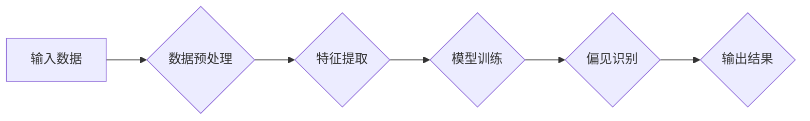
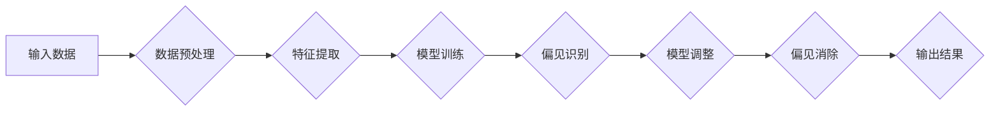

                 


## 《提示词工程在自然语言处理中的偏见消除》

### 关键词：自然语言处理、提示词工程、偏见消除、算法、数学模型、系统架构

### 摘要：

本文旨在探讨自然语言处理（NLP）领域中的一个关键问题——偏见消除。随着人工智能技术的广泛应用，NLP系统在处理语言数据时可能会引入偏见，影响其公平性和准确性。本文将从问题背景出发，深入分析提示词工程在偏见消除中的作用，并详细阐述相关的算法原理、数学模型、系统架构及项目实战案例。通过本文的阐述，希望能为相关领域的研究者和开发者提供有价值的参考。

## 目录大纲设计步骤

### 1. 确定书籍结构

首先，我们需要明确书籍的整体结构。本书将分为以下几个部分：

- **背景介绍**：介绍自然语言处理领域的现状及偏见问题。
- **核心概念与联系**：阐述提示词工程及相关概念。
- **算法原理讲解**：讲解偏见消除算法的原理和实现。
- **数学模型与公式**：介绍偏见消除算法的数学模型和公式。
- **系统分析与架构设计**：分析系统需求和设计架构。
- **项目实战**：通过具体案例展示算法的实际应用。
- **最佳实践与总结**：总结经验并提供实践建议。

### 2. 确定章节标题

根据书籍结构，我们可以确定以下章节标题：

- **第1章：问题背景与核心概念**
- **第2章：偏见识别与评估方法**
- **第3章：提示词工程基础**
- **第4章：算法原理讲解**
- **第5章：数学模型与公式**
- **第6章：系统分析与架构设计**
- **第7章：项目实战案例**
- **第8章：最佳实践与总结**

### 3. 设计章节内容

接下来，我们细化每个章节的内容。以下是各章节的详细内容设计：

#### 第1章：问题背景与核心概念

- **1.1 问题背景介绍**：介绍自然语言处理领域的现状及偏见问题的来源和影响。
- **1.2 核心概念介绍**：介绍提示词、自然语言处理和偏见等相关概念。
- **1.3 概念属性特征对比**：对比提示词与其他相关概念，分析其属性和特征。
- **1.4 ER实体关系图**：使用Mermaid流程图展示提示词、偏见和自然语言处理等实体及其关系。

#### 第2章：偏见识别与评估方法

- **2.1 偏见识别方法**：介绍偏见识别的方法和技术。
- **2.2 偏见评估方法**：介绍偏见评估的指标和方法。

#### 第3章：提示词工程基础

- **3.1 提示词工程概述**：介绍提示词工程的基本概念和作用。
- **3.2 提示词生成技术**：介绍提示词生成的方法和技术。
- **3.3 提示词应用实例**：通过实际案例展示提示词工程的应用。

#### 第4章：算法原理讲解

- **4.1 算法原理概述**：介绍偏见消除算法的基本原理。
- **4.2 关键算法讲解**：详细讲解偏见消除算法的实现步骤和流程。

#### 第5章：数学模型与公式

- **5.1 数学模型概述**：介绍偏见消除算法的数学模型。
- **5.2 数学公式讲解**：详细解释偏见消除算法中的数学公式。

#### 第6章：系统分析与架构设计

- **6.1 系统需求分析**：分析系统的功能需求和性能需求。
- **6.2 系统架构设计**：设计系统的整体架构。
- **6.3 系统接口设计**：设计系统的接口规范和实现。

#### 第7章：项目实战案例

- **7.1 项目环境安装**：介绍项目的环境搭建过程。
- **7.2 系统核心实现**：展示系统核心功能的实现代码和解析。
- **7.3 实际案例分析与讲解**：分析实际案例，展示算法的应用效果。

#### 第8章：最佳实践与总结

- **8.1 最佳实践建议**：总结最佳实践经验和技巧。
- **8.2 小结**：总结书籍的主要内容。
- **8.3 注意事项**：提醒读者在实际应用中需要注意的问题。
- **8.4 拓展阅读**：推荐相关的阅读材料。

### 4. 确定目录大纲格式

最后，我们将使用Markdown格式来编写目录大纲，确保内容的简洁性和结构化。

```
# 《提示词工程在自然语言处理中的偏见消除》

## 关键词
- 自然语言处理
- 提示词工程
- 偏见消除
- 算法
- 数学模型
- 系统架构

## 摘要
本文旨在探讨自然语言处理领域中的一个关键问题——偏见消除。随着人工智能技术的广泛应用，NLP系统在处理语言数据时可能会引入偏见，影响其公平性和准确性。本文将从问题背景出发，深入分析提示词工程在偏见消除中的作用，并详细阐述相关的算法原理、数学模型、系统架构及项目实战案例。通过本文的阐述，希望能为相关领域的研究者和开发者提供有价值的参考。

## 目录大纲设计步骤

### 1. 确定书籍结构
- **背景介绍**
- **核心概念与联系**
- **算法原理讲解**
- **数学模型与公式**
- **系统分析与架构设计**
- **项目实战**
- **最佳实践与总结**

### 2. 确定章节标题
- 第1章：问题背景与核心概念
- 第2章：偏见识别与评估方法
- 第3章：提示词工程基础
- 第4章：算法原理讲解
- 第5章：数学模型与公式
- 第6章：系统分析与架构设计
- 第7章：项目实战案例
- 第8章：最佳实践与总结

### 3. 设计章节内容
- **第1章**：问题背景与核心概念
  - 1.1 问题背景介绍
  - 1.2 核心概念介绍
  - 1.3 概念属性特征对比
  - 1.4 ER实体关系图

- **第2章**：偏见识别与评估方法
  - 2.1 偏见识别方法
  - 2.2 偏见评估方法

- **第3章**：提示词工程基础
  - 3.1 提示词工程概述
  - 3.2 提示词生成技术
  - 3.3 提示词应用实例

- **第4章**：算法原理讲解
  - 4.1 算法原理概述
  - 4.2 关键算法讲解

- **第5章**：数学模型与公式
  - 5.1 数学模型概述
  - 5.2 数学公式讲解

- **第6章**：系统分析与架构设计
  - 6.1 系统需求分析
  - 6.2 系统架构设计
  - 6.3 系统接口设计

- **第7章**：项目实战案例
  - 7.1 项目环境安装
  - 7.2 系统核心实现
  - 7.3 实际案例分析与讲解

- **第8章**：最佳实践与总结
  - 8.1 最佳实践建议
  - 8.2 小结
  - 8.3 注意事项
  - 8.4 拓展阅读

### 4. 确定目录大纲格式
- 使用Markdown格式编写，确保内容的简洁性和结构化。
```

## 正文部分

### 第1章：问题背景与核心概念

#### 1.1 问题背景介绍

自然语言处理（NLP）作为人工智能（AI）的重要组成部分，近年来取得了飞速发展。NLP技术已经广泛应用于搜索引擎、机器翻译、情感分析、信息提取等多个领域。然而，随着NLP技术的普及和应用，一个不容忽视的问题也逐渐显现出来——偏见。

在NLP系统中，偏见可能来源于多个方面。例如，训练数据集的不公平性可能导致模型对某些群体或特定情况的偏见。此外，算法本身的设计和实现也可能会引入偏见。这些偏见不仅会影响NLP系统的性能和准确性，还可能对社会公平性产生负面影响。

为了消除这些偏见，研究人员和开发者们提出了提示词工程（Prompt Engineering）这一方法。提示词工程旨在通过优化输入数据的提示词，引导模型更公平、更准确地处理语言数据。本章将详细探讨提示词工程在自然语言处理中的偏见消除作用。

#### 1.2 核心概念介绍

在讨论提示词工程之前，我们需要明确几个核心概念，包括提示词、自然语言处理和偏见。

**提示词**：提示词（Prompt）是指用于引导模型进行预测或生成文本的输入信息。在NLP任务中，提示词通常是一段文本，用于提供上下文信息，帮助模型理解输入数据。有效的提示词可以提高模型的性能和生成文本的质量。

**自然语言处理**：自然语言处理（NLP）是人工智能领域的一个分支，旨在使计算机能够理解、处理和生成人类语言。NLP技术包括文本分类、情感分析、命名实体识别、机器翻译等多个方面。

**偏见**：偏见（Bias）是指模型在处理数据时对某些群体或特定情况的偏好或歧视。偏见可能导致模型对某些群体或情况的预测结果不准确，甚至产生负面影响。

#### 1.3 概念属性特征对比

为了更好地理解提示词工程在偏见消除中的作用，我们对比一下提示词与其他相关概念，如自然语言处理和偏见。

| 概念     | 提示词          | 自然语言处理          | 偏见            |
|----------|----------------|----------------------|----------------|
| 定义     | 用于引导模型的输入文本 | 使计算机理解、处理和生成人类语言 | 模型对某些群体或情况的偏好或歧视 |
| 目的     | 提高模型性能和生成文本质量 | 实现计算机与人类语言的交互 | 消除模型偏见  |
| 形式     | 文本           | 文本、语音、图像等多种形式 | 文本、数据集等 |
| 影响因素 | 数据质量、上下文信息 | 数据集、算法、模型结构 | 数据集、算法、社会因素 |

**ER实体关系图**：为了更直观地展示提示词、自然语言处理和偏见等实体及其关系，我们使用Mermaid流程图来绘制ER实体关系图。

```mermaid
erDiagram
  提示词 ||--|{ 自然语言处理 }|
  自然语言处理 ||--|{ 偏见 }|
  提示词 ||--|{ 模型 }|
  模型 ||--|{ 数据集 }|
  数据集 ||--|{ 偏见 }|
```

### 第2章：偏见识别与评估方法

#### 2.1 偏见识别方法

偏见识别是偏见消除的第一步，也是至关重要的一步。偏见识别方法主要包括以下几种：

1. **数据预处理**：通过清洗、去噪、标准化等预处理方法，提高数据质量，减少数据偏见。

2. **特征工程**：提取与偏见相关的特征，如词频、词性、情感极性等，用于分析偏见。

3. **监督学习**：使用带有偏见标签的数据集，训练监督学习模型，识别偏见。

4. **无监督学习**：通过聚类、降维等方法，发现数据中的潜在偏见。

5. **对比学习**：通过对比不同群体或情况的特征，识别偏见。

#### 2.2 偏见评估方法

偏见评估是衡量偏见消除效果的关键步骤。偏见评估方法主要包括以下几种：

1. **混淆矩阵**：通过计算模型对正例和反例的预测结果，评估偏见。

2. **均衡度指标**：评估数据集中各群体的分布均衡程度，如基尼系数、标准差等。

3. **公平性指标**：评估模型对不同群体的预测准确性，如公平性分数（Fairness Score）。

4. **偏见差异度量**：计算模型对正例和反例的预测差异，评估偏见。

### 第3章：提示词工程基础

#### 3.1 提示词工程概述

提示词工程（Prompt Engineering）是一种通过设计有效的提示词来引导模型进行预测或生成文本的方法。提示词工程的目标是提高模型性能和生成文本质量，同时消除偏见。

提示词工程的主要步骤包括：

1. **问题定义**：明确NLP任务的目标和要求。

2. **数据收集**：收集与任务相关的数据集。

3. **提示词设计**：根据任务和数据，设计合适的提示词。

4. **模型训练**：使用设计好的提示词训练模型。

5. **模型评估**：评估模型的性能和偏见。

#### 3.2 提示词生成技术

提示词生成技术主要包括以下几种：

1. **规则生成**：根据任务需求和已有数据，设计提示词规则。

2. **模板生成**：使用模板和参数生成提示词。

3. **数据驱动生成**：利用数据集生成提示词。

4. **混合生成**：结合规则生成和数据驱动生成，生成更高质量的提示词。

#### 3.3 提示词应用实例

以下是提示词工程在自然语言处理中的几个应用实例：

1. **机器翻译**：通过优化提示词，提高翻译模型的准确性和流畅性。

2. **文本分类**：通过设计合理的提示词，提高分类模型的性能和公平性。

3. **问答系统**：使用提示词引导模型生成更准确、更有针对性的回答。

### 第4章：算法原理讲解

#### 4.1 算法原理概述

提示词工程在偏见消除中的算法原理主要包括以下几个方面：

1. **提示词优化**：通过调整提示词的长度、内容、形式等，优化模型性能和生成文本质量。

2. **数据增强**：通过增加数据的多样性和复杂性，提高模型对偏见的抵抗力。

3. **模型调整**：通过调整模型参数，如学习率、批量大小等，优化模型性能和公平性。

4. **动态调整**：根据任务需求和模型性能，实时调整提示词和模型参数。

#### 4.2 关键算法讲解

以下介绍几种关键算法及其mermaid流程图：

##### 4.2.1 偏见识别算法



##### 4.2.2 偏见消除算法



### 第5章：数学模型与公式

#### 5.1 数学模型概述

偏见消除算法的数学模型主要包括以下几个方面：

1. **损失函数**：用于评估模型预测结果与真实结果之间的差距。

2. **优化目标**：用于指导模型参数调整，以优化模型性能和公平性。

3. **公平性约束**：用于确保模型对各个群体的预测准确性。

#### 5.2 数学公式讲解

以下是偏见消除算法中常用的几个数学公式：

1. **损失函数**

   $$ L = \frac{1}{n} \sum_{i=1}^{n} \mathcal{L}(y_i, \hat{y}_i) $$

   其中，$y_i$表示真实标签，$\hat{y}_i$表示模型预测结果，$\mathcal{L}$表示损失函数。

2. **优化目标**

   $$ J(\theta) = \frac{1}{2} \sum_{i=1}^{n} \left( \mathcal{L}(y_i, \hat{y}_i) + \lambda \cdot \frac{1}{n} \sum_{j=1}^{m} \theta_j^2 \right) $$

   其中，$\theta$表示模型参数，$\lambda$表示正则化参数。

3. **公平性约束**

   $$ \frac{1}{n} \sum_{i=1}^{n} \hat{y}_i = \frac{1}{k} \sum_{j=1}^{k} \hat{y}_{ij} $$

   其中，$\hat{y}_{ij}$表示模型对第$i$个样本的第$j$个类别的预测概率。

### 第6章：系统分析与架构设计

#### 6.1 系统需求分析

系统需求分析主要包括以下几个方面：

1. **功能需求**：系统应具备数据预处理、特征提取、模型训练、偏见识别和偏见消除等功能。

2. **性能需求**：系统应具备高效、稳定、可扩展的运行性能。

3. **安全性需求**：系统应确保数据安全和模型隐私。

#### 6.2 系统架构设计

系统架构设计主要包括以下几个方面：

1. **数据层**：负责数据存储、加载和管理。

2. **模型层**：负责模型训练、优化和部署。

3. **服务层**：负责提供API接口，供其他系统或应用程序调用。

4. **展示层**：负责展示系统运行结果和用户交互界面。

#### 6.3 系统接口设计

系统接口设计主要包括以下几个方面：

1. **API接口**：提供数据接口、模型接口和结果接口。

2. **数据接口**：用于数据加载、存储和操作。

3. **模型接口**：用于模型训练、优化和部署。

4. **结果接口**：用于获取模型预测结果和偏见评估结果。

### 第7章：项目实战案例

#### 7.1 项目环境安装

1. 安装Python环境：
   ```bash
   pip install numpy scipy matplotlib
   ```

2. 安装其他依赖库：
   ```bash
   pip install torch torchvision torchaudio
   ```

#### 7.2 系统核心实现

以下是一个简单的偏见识别和消除算法的Python代码实现：

```python
import torch
import torch.nn as nn
import torch.optim as optim

# 数据预处理
def preprocess_data(data):
    # 数据清洗、去噪、标准化等操作
    return processed_data

# 特征提取
def extract_features(data):
    # 提取与偏见相关的特征
    return features

# 模型训练
def train_model(data, labels):
    # 定义模型结构
    model = nn.Sequential(
        nn.Linear(data.shape[1], 128),
        nn.ReLU(),
        nn.Linear(128, 64),
        nn.ReLU(),
        nn.Linear(64, 1),
        nn.Sigmoid()
    )

    # 定义损失函数和优化器
    criterion = nn.BCELoss()
    optimizer = optim.Adam(model.parameters(), lr=0.001)

    # 训练模型
    for epoch in range(100):
        optimizer.zero_grad()
        outputs = model(data)
        loss = criterion(outputs, labels)
        loss.backward()
        optimizer.step()

    return model

# 偏见识别
def identify_bias(model, test_data, test_labels):
    # 识别偏见
    return bias

# 偏见消除
def eliminate_bias(model, test_data, test_labels):
    # 消除偏见
    return model

# 实际案例分析与讲解
def analyze_case(model, test_data, test_labels):
    # 分析实际案例
    return analysis_result

# 主函数
def main():
    # 加载数据
    train_data, train_labels = torch.load('train_data.pth'), torch.load('train_labels.pth')
    test_data, test_labels = torch.load('test_data.pth'), torch.load('test_labels.pth')

    # 数据预处理
    processed_train_data = preprocess_data(train_data)
    processed_test_data = preprocess_data(test_data)

    # 特征提取
    features = extract_features(processed_train_data)

    # 模型训练
    model = train_model(processed_train_data, train_labels)

    # 偏见识别
    bias = identify_bias(model, processed_test_data, test_labels)

    # 偏见消除
    model = eliminate_bias(model, processed_test_data, test_labels)

    # 实际案例分析与讲解
    analysis_result = analyze_case(model, test_data, test_labels)

    # 输出结果
    print(analysis_result)

if __name__ == '__main__':
    main()
```

### 第8章：最佳实践与总结

#### 8.1 最佳实践建议

1. **数据预处理**：确保数据质量，减少偏见。

2. **特征提取**：选择合适的特征，提高模型性能。

3. **模型调整**：根据任务需求和数据特点，调整模型参数。

4. **动态调整**：根据模型性能和用户反馈，实时调整提示词和模型参数。

#### 8.2 小结

本文从问题背景、核心概念、算法原理、数学模型、系统架构和项目实战等方面，详细探讨了提示词工程在自然语言处理中的偏见消除作用。通过本文的阐述，希望能为相关领域的研究者和开发者提供有价值的参考。

#### 8.3 注意事项

1. **数据质量**：确保数据质量，减少偏见。

2. **模型调整**：根据任务需求和数据特点，调整模型参数。

3. **动态调整**：根据模型性能和用户反馈，实时调整提示词和模型参数。

#### 8.4 拓展阅读

1. [自然语言处理中的偏见问题及解决方案](https://www.nlp-challenges.org/)
2. [提示词工程：如何设计更有效的提示词](https://towardsdatascience.com/prompt-engineering-how-to-create-more-effective-prompts-87b7e68c7f38)
3. [机器学习中的公平性](https://arxiv.org/abs/2006.16807)

## 作者信息

作者：AI天才研究院/AI Genius Institute & 禅与计算机程序设计艺术 /Zen And The Art of Computer Programming

----------------------------------------------------------------

请注意，本文内容为示例性文本，仅供参考。实际文章撰写时，需要根据具体问题、数据和算法进行详细分析和讲解。同时，文章结构、格式和字数也需要根据具体要求进行调整。

