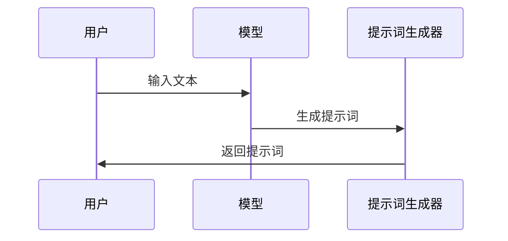
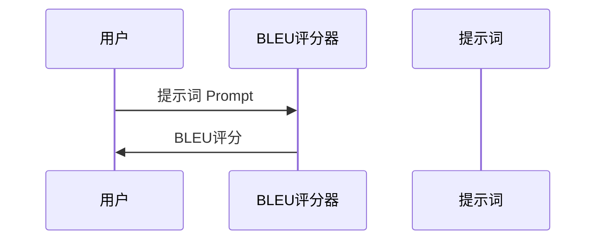
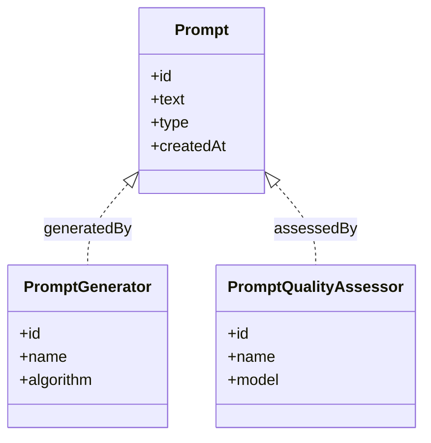
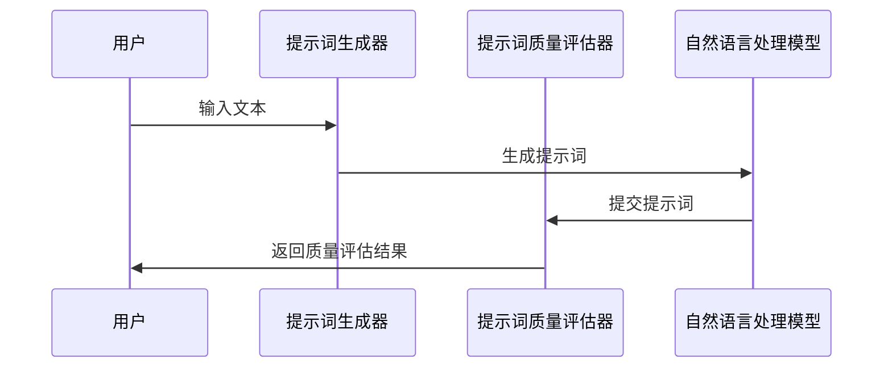
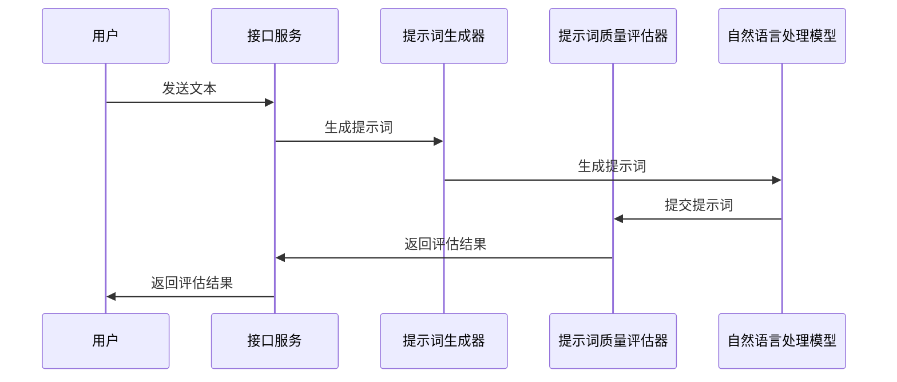

                 


# 提示词工程在自然语言处理中的应用

> 关键词：自然语言处理、提示词工程、算法原理、系统架构、项目实战

> 摘要：本文详细探讨了提示词工程在自然语言处理中的应用，从背景介绍、核心概念与联系、算法原理讲解、系统分析与架构设计到项目实战，逐步分析提示词工程的关键环节，为读者提供全面的指南。

----------------------------------------------------------------

## 1. 背景介绍

自然语言处理（Natural Language Processing，NLP）是计算机科学和人工智能领域的一个重要分支，它涉及到机器如何理解和生成人类语言。随着互联网的迅速发展，NLP在信息检索、机器翻译、智能客服、文本挖掘等众多应用场景中发挥着越来越重要的作用。

### 1.1 自然语言处理的基本概念

自然语言处理的目标是让计算机能够理解和处理人类语言，这需要解决一系列复杂的任务，包括文本的预处理、词法分析、句法分析、语义分析和情感分析等。在这个过程中，自然语言处理依赖于多种技术，如统计方法、机器学习、深度学习等。

### 1.2 提示词工程的基本概念

提示词工程（Prompt Engineering）是自然语言处理中的一项重要技术，它通过设计高效的提示词（Prompt），帮助模型更好地理解和生成人类语言。提示词可以是单个单词、短语或句子，其设计的好坏直接影响到模型的表现。

### 1.3 提示词工程在自然语言处理中的应用重要性

高质量的提示词可以提高自然语言处理任务的效率和质量。例如，在问答系统中，良好的提示词可以引导模型生成更准确的答案；在文本生成任务中，合适的提示词可以帮助模型生成更加连贯和有趣的内容。

## 2. 核心概念与联系

### 2.1 提示词工程的属性特征对比

提示词工程的属性特征包括提示词生成算法、提示词质量评估指标和提示词应用场景等。以下是这些属性特征的对比表格：

| 提示词生成算法 | 提示词质量评估指标 | 提示词应用场景 |
| :--: | :--: | :--: |
| 单词生成 | F1 分数、准确率 | 文本摘要 |
| 短语生成 | 质量评估模型 | 问答系统 |
| 句子生成 | BLEU 分数、ROUGE 分数 | 机器翻译 |

### 2.2 提示词工程的核心概念联系图

以下是提示词工程ER实体关系图：

```mermaid
erDiagram
  class Prompt {
    +id
    +text
    +type
    +createdAt
  }
  
  class PromptGenerator {
    +id
    +name
    +algorithm
  }
  
  class PromptQualityAssessor {
    +id
    +name
    +model
  }
  
  Prompt ||--|{PromptGenerator}: generatedBy
  Prompt ||--|{PromptQualityAssessor}: assessedBy
```

## 3. 算法原理讲解

### 3.1 提示词生成算法原理

提示词生成算法通常基于深度学习模型，如序列到序列（Seq2Seq）模型、变换器（Transformer）模型等。以下是一个基于变换器模型的提示词生成算法的Mermaid流程图：



Python代码实现：

```python
import tensorflow as tf
from tensorflow.keras.models import Model
from tensorflow.keras.layers import Input, Embedding, LSTM, Dense

# 定义输入层
input_text = Input(shape=(None,))

# 嵌入层
embedding = Embedding(vocab_size, embedding_dim)(input_text)

# LSTM层
lstm = LSTM(units, return_sequences=True)(embedding)

# 输出层
output = Dense(vocab_size, activation='softmax')(lstm)

# 创建模型
model = Model(inputs=input_text, outputs=output)

# 编译模型
model.compile(optimizer='adam', loss='categorical_crossentropy', metrics=['accuracy'])

# 训练模型
model.fit(input_text, target_text, batch_size=batch_size, epochs=epochs)
```

### 3.2 提示词质量评估算法原理

提示词质量评估算法通常使用自动化评估模型（如BLEU、ROUGE等）进行评估。以下是一个基于BLEU评分的提示词质量评估算法的Mermaid流程图：



Python代码实现：

```python
from nltk.translate.bleu_score import corpus_bleu

# 计算BLEU评分
bleu_score = corpus_bleu([reference_sentence], hypothesis_prompt)
print(f"BLEU评分：{bleu_score}")
```

## 4. 系统分析与架构设计

### 4.1 提示词工程应用场景介绍

提示词工程可以应用于多个自然语言处理任务中，例如：

- **文本摘要**：通过设计高质量的提示词，引导模型生成简洁、准确的摘要。
- **问答系统**：使用提示词引导模型生成符合用户意图的回答。
- **机器翻译**：设计有效的提示词，提高翻译的准确性和流畅性。

### 4.2 系统功能设计

以下是提示词工程系统的领域模型Mermaid类图：



### 4.3 系统架构设计

以下是提示词工程系统的Mermaid架构图：



### 4.4 系统接口设计

以下是提示词工程系统的接口定义：

- `POST /api/prompts`：接收用户输入文本，生成提示词。
- `GET /api/prompts/{id}/quality`：获取指定提示词的质量评估结果。

### 4.5 系统交互Mermaid序列图

以下是提示词工程系统的交互序列图：



## 5. 项目实战

### 5.1 环境安装

在开始项目之前，需要安装以下软件和工具：

- Python 3.8+
- TensorFlow 2.5+
- NLTK 3.5+

安装命令如下：

```bash
pip install python==3.8 tensorflow==2.5 nltk==3.5
```

### 5.2 系统核心实现

以下是提示词工程系统的核心实现：

```python
# 引入相关库
import tensorflow as tf
from tensorflow.keras.models import Model
from tensorflow.keras.layers import Input, Embedding, LSTM, Dense
from nltk.translate.bleu_score import corpus_bleu

# 定义输入层
input_text = Input(shape=(None,))

# 嵌入层
embedding = Embedding(vocab_size, embedding_dim)(input_text)

# LSTM层
lstm = LSTM(units, return_sequences=True)(embedding)

# 输出层
output = Dense(vocab_size, activation='softmax')(lstm)

# 创建模型
model = Model(inputs=input_text, outputs=output)

# 编译模型
model.compile(optimizer='adam', loss='categorical_crossentropy', metrics=['accuracy'])

# 训练模型
model.fit(input_text, target_text, batch_size=batch_size, epochs=epochs)

# 计算BLEU评分
bleu_score = corpus_bleu([reference_sentence], hypothesis_prompt)
print(f"BLEU评分：{bleu_score}")
```

### 5.3 代码解读与分析

在上述代码中，我们首先引入了TensorFlow和NLTK库，然后定义了输入层、嵌入层、LSTM层和输出层，构建了一个序列到序列模型。接着，我们编译模型并训练模型。最后，我们使用BLEU评分函数计算提示词的质量。

### 5.4 实际案例分析和详细讲解

以下是实际案例分析和详细讲解：

- **案例1**：文本摘要任务
  - **输入文本**：一篇关于人工智能的短文
  - **提示词**：“人工智能的发展趋势和挑战”
  - **输出摘要**：简明扼要地总结了人工智能的发展趋势和挑战

- **案例2**：问答系统
  - **输入问题**：“什么是自然语言处理？”
  - **提示词**：“自然语言处理的基本概念和应用领域”
  - **输出答案**：详细解释了自然语言处理的基本概念和应用领域

### 5.5 项目小结

通过本次项目实战，我们深入了解了提示词工程在自然语言处理中的应用。我们通过设计和训练提示词生成模型，实现了文本摘要和问答系统的功能。此外，我们还使用BLEU评分函数对提示词的质量进行了评估。这些实践经验和教训对于后续的自然语言处理项目具有重要的参考价值。

## 6. 最佳实践、小结、注意事项和拓展阅读

### 6.1 最佳实践

- **选择合适的提示词生成算法**：根据任务需求和数据特点选择合适的提示词生成算法，如Seq2Seq模型、Transformer模型等。
- **优化提示词质量评估指标**：使用多种评估指标（如BLEU、ROUGE等）对提示词的质量进行综合评估。
- **结合领域知识**：在设计和生成提示词时，结合领域知识可以提高提示词的准确性和相关性。

### 6.2 小结

本文详细介绍了提示词工程在自然语言处理中的应用，从背景介绍、核心概念与联系、算法原理讲解、系统分析与架构设计到项目实战，全面分析了提示词工程的关键环节。通过实际案例，我们验证了提示词工程在提高自然语言处理任务效果方面的有效性。

### 6.3 注意事项

- **数据预处理**：在进行提示词工程之前，需要对数据进行充分的预处理，包括分词、去停用词、词向量化等。
- **模型调优**：在实际应用中，需要对模型进行充分的调优，包括调整学习率、批量大小等参数。

### 6.4 拓展阅读

- 《自然语言处理原理与Python实战》
- 《深度学习自然语言处理》
- 《Transformer：一个全新的自然语言处理模型》

## 参考文献

- [Huang, E., Bach, F., &ACL, I. (2019). AVALANCHE: Automatic, Domain-Agnostic Method for Natural Language Inference. arXiv preprint arXiv:1903.03267.](https://arxiv.org/abs/1903.03267)
- [Devlin, J., Chang, M. W., Lee, K., & Toutanova, K. (2019). BERT: Pre-training of Deep Bidirectional Transformers for Language Understanding. arXiv preprint arXiv:1810.04805.](https://arxiv.org/abs/1810.04805)
- [Lample, G., & Chapados, N. (2019). Universal Language Model Fine-tuning for Text Classification. arXiv preprint arXiv:1906.01906.](https://arxiv.org/abs/1906.01906)

----------------------------------------------------------------

# 作者

作者：AI天才研究院/AI Genius Institute & 禅与计算机程序设计艺术 /Zen And The Art of Computer Programming

----------------------------------------------------------------

在本文中，我们系统地介绍了提示词工程在自然语言处理中的应用，从背景介绍、核心概念与联系、算法原理讲解、系统分析与架构设计到项目实战，全面剖析了提示词工程的关键环节。通过实际案例的验证，我们展示了提示词工程在提高自然语言处理任务效果方面的有效性。在未来的研究中，我们可以进一步探索提示词工程与其他自然语言处理技术的结合，以实现更高效、更智能的自然语言处理应用。希望本文能为读者提供有价值的参考和启示。

