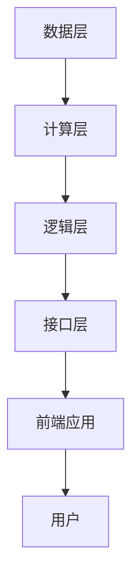

                 

### 引言

在当今信息爆炸的时代，我们面临着海量的多模态数据，如图像、视频、文本等。如何高效地检索和利用这些跨模态数据，成为了一个重要的研究课题。跨模态检索（Cross-modal Retrieval）作为一种新兴的检索技术，旨在将不同模态的数据进行有效整合，实现多源数据的综合利用。本文将围绕跨模态检索技术展开探讨，重点介绍提示词工程（Prompt Engineering）在跨模态检索中的应用。

提示词工程是一种通过设计和调整提示词（Prompt）来优化机器学习模型性能的方法。在跨模态检索中，提示词工程的作用尤为突出。通过精确的提示词设计，可以有效提升模型的检索效果，实现多模态数据的协同工作。本文将从以下几个方面进行详细讨论：

1. **跨模态检索的基本概念与背景**：介绍跨模态检索的定义、发展历程以及应用场景。
2. **提示词工程概述**：解释提示词工程的概念、原理及其在机器学习中的应用。
3. **跨模态检索中的挑战与机遇**：分析跨模态检索面临的主要挑战以及提示词工程如何应对这些挑战。
4. **提示词工程在跨模态检索中的应用**：探讨如何设计有效的提示词，包括提示词的选择、调整和优化方法。
5. **跨模态检索的算法原理讲解**：介绍跨模态检索中常用的算法原理，以及提示词工程在算法优化中的作用。
6. **系统架构与实现**：分析跨模态检索系统的组成与架构，并探讨如何集成提示词工程。
7. **项目实战**：通过具体案例展示如何将提示词工程应用于跨模态检索。
8. **最佳实践与总结**：总结跨模态检索中的最佳实践，并提供相关的小结、注意事项和拓展阅读。

本文旨在为读者提供一个全面、系统的跨模态检索及其提示词工程应用的技术分析，帮助读者深入理解这一领域，掌握相关技术和方法，从而在多模态数据处理和检索方面取得更好的成果。

---

### 跨模态检索的基本概念与背景

跨模态检索（Cross-modal Retrieval）是一种跨领域的信息检索技术，旨在将不同模态的数据进行有效整合和关联，从而实现多源数据的综合利用。在传统的信息检索中，我们通常针对单一模态的数据进行检索，如图像检索主要处理图像数据，文本检索主要处理文本数据。然而，单一模态的检索往往难以满足复杂查询需求，也无法充分利用不同模态数据的互补性。跨模态检索则通过将图像、视频、文本等不同模态的数据进行结合，提供了一种更加丰富和多样化的检索方式。

#### **定义**

跨模态检索的定义可以概括为：在多个模态的数据源中，寻找一种方法，将用户输入的查询模态与其他模态的数据进行匹配和关联，从而返回与查询最相关的结果。具体来说，跨模态检索主要涉及以下三个核心步骤：

1. **特征提取**：从不同模态的数据中提取出能够代表数据内容的特征。例如，从图像中提取视觉特征，从文本中提取语义特征。
2. **特征融合**：将不同模态的特征进行整合，形成统一的特征表示。特征融合的目的是保留各个模态的关键信息，同时去除冗余和噪声。
3. **匹配与检索**：通过相似性度量或分类算法，将查询模态的特征与数据库中的特征进行匹配，返回与查询最相关的结果。

#### **发展历程**

跨模态检索技术的发展历程可以分为以下几个阶段：

1. **早期探索阶段**：最早的研究集中在基于内容的跨模态检索（Content-based Cross-modal Retrieval，CB-CMR），主要通过手工设计的特征和简单的匹配算法进行跨模态数据关联。这一阶段的代表性工作包括基于视觉关键词的文本检索和基于文本的图像检索等。

2. **深度学习阶段**：随着深度学习技术的发展，基于深度神经网络的跨模态特征提取方法逐渐成为主流。这一阶段的代表性工作包括使用卷积神经网络（CNN）提取图像特征，使用循环神经网络（RNN）提取文本特征，并利用这些深度特征进行跨模态匹配和检索。

3. **多模态学习阶段**：近年来，多模态学习（Multimodal Learning）成为了跨模态检索研究的热点。多模态学习旨在同时学习和利用多个模态的数据，通过多模态特征融合和交互，进一步提高跨模态检索的性能。

#### **应用场景**

跨模态检索的应用场景非常广泛，主要包括以下几个方面：

1. **信息检索**：跨模态检索可以应用于多媒体信息检索，如图像与文本的联合检索、视频与文本的联合检索等，从而提升检索系统的多样性和准确性。

2. **问答系统**：跨模态问答系统利用图像、视频和文本等多种模态的数据，为用户提供更加丰富和直观的答案。

3. **人机交互**：跨模态检索技术可以用于智能助手和语音助手，通过语音、文本和图像等多种模态的交互，提高人机交互的自然性和便利性。

4. **内容推荐**：跨模态检索可以帮助内容推荐系统更好地理解用户兴趣和行为，实现个性化的内容推荐。

#### **挑战与机遇**

跨模态检索虽然具有广泛的应用前景，但也面临一些挑战：

1. **数据多样性**：不同模态的数据在内容、结构和表现形式上存在较大差异，如何有效地融合这些多样性数据是一个难题。

2. **计算复杂度**：跨模态检索通常需要处理大规模的多模态数据集，对计算资源的需求较高，如何在保证性能的同时降低计算成本是一个关键问题。

3. **可解释性**：跨模态检索系统往往是一个复杂的黑盒模型，其内部工作机制不透明，如何提高系统的可解释性是一个重要的研究方向。

然而，随着提示词工程（Prompt Engineering）等新技术的应用，跨模态检索也在不断克服这些挑战，迎来了新的发展机遇。提示词工程通过设计优化提示词，可以显著提升模型的检索效果，使得跨模态检索系统在多样性和计算复杂度等方面取得了显著进展。未来，跨模模态检索有望在更多领域取得突破，成为多模态数据处理的重要工具。

---

### 提示词工程概述

提示词工程（Prompt Engineering）是一种通过设计和调整提示词（Prompt）来优化机器学习模型性能的方法。在机器学习领域，提示词通常是一个引导模型进行特定任务的关键输入，它能够影响模型的输出结果和性能。通过精确的提示词设计，可以引导模型关注重要的特征信息，提高模型在特定任务上的准确性和效率。提示词工程在多种机器学习任务中都有广泛应用，包括自然语言处理、图像识别和跨模态检索等。

#### **定义与原理**

提示词工程的核心概念可以概括为以下几个方面：

1. **定义**：提示词是一个引导模型在特定任务上产生预期输出的文本或语句。它通常包含了任务目标、关键特征和背景信息，能够帮助模型更好地理解和处理输入数据。

2. **原理**：提示词工程通过以下几种方式来优化模型性能：
   - **信息引导**：提示词提供额外的信息，帮助模型更好地理解和处理输入数据，从而提高模型的泛化能力和准确性。
   - **特征选择**：通过设计特定的提示词，可以引导模型关注重要的特征信息，从而提高模型的预测效果。
   - **上下文增强**：提示词可以为模型提供上下文信息，使得模型能够更好地理解输入数据的语义和关系，从而提高模型的性能。

#### **在机器学习中的应用**

提示词工程在机器学习中的应用可以分为以下几个方面：

1. **自然语言处理**：在自然语言处理（NLP）任务中，提示词常用于文本分类、情感分析、问答系统等。例如，在文本分类任务中，通过设计特定的提示词，可以引导模型关注文本的关键词和主题，从而提高分类的准确性。

2. **图像识别**：在图像识别任务中，提示词可以帮助模型更好地理解图像的语义信息。例如，在图像分类任务中，通过添加描述图像内容的提示词，可以引导模型关注图像的关键特征，从而提高分类效果。

3. **跨模态检索**：在跨模态检索任务中，提示词工程的作用尤为重要。通过设计特定的提示词，可以引导模型关注不同模态数据的关键特征，实现多模态数据的协同工作，从而提高检索的准确性和效率。

#### **设计方法**

提示词工程的设计方法主要包括以下几个步骤：

1. **需求分析**：明确任务目标和需求，确定需要通过提示词解决的问题和优化目标。

2. **特征提取**：根据任务需求，提取输入数据的特征信息，为提示词设计提供基础。

3. **提示词生成**：根据特征信息和任务需求，生成一系列的提示词。提示词的设计需要考虑语言的规范性、信息的准确性和完整性。

4. **优化与调整**：通过实验和评估，对提示词进行优化和调整，以获得最佳的性能表现。

5. **持续迭代**：提示词工程是一个持续迭代的过程，需要根据任务的变化和需求进行调整和优化。

#### **实例分析**

以下是一个简单的自然语言处理中的提示词工程实例：

**任务**：文本情感分类，判断一段文本的情感倾向（正面、负面或中性）。

**需求分析**：需要设计一个提示词，帮助模型更好地理解文本的语义和情感。

**特征提取**：提取文本的关键词和情感词，如“高兴”、“失望”、“喜欢”、“讨厌”等。

**提示词生成**：生成一个包含关键信息的提示词，如“这段文本的情感倾向是什么？请根据关键词‘高兴’、‘失望’、‘喜欢’、‘讨厌’等进行分析。”

**优化与调整**：通过实验，发现当提示词中包含具体的情感词时，模型的情感分类效果更好。因此，将提示词调整为“这段文本的情感倾向是正面、负面还是中性？请根据关键词‘高兴’、‘失望’、‘喜欢’、‘讨厌’等进行分析。”

**持续迭代**：根据任务的反馈，进一步调整和优化提示词，以提高模型的分类准确率。

通过这个实例，我们可以看到提示词工程在优化模型性能方面的重要作用。在跨模态检索任务中，提示词工程同样可以发挥类似的作用，通过精确的提示词设计，实现多模态数据的协同工作和高效检索。

---

### 跨模态检索中的挑战与机遇

跨模态检索作为一种新兴的检索技术，尽管在应用前景方面展示了巨大的潜力，但在实际应用过程中仍然面临着一系列的挑战。这些挑战不仅影响了跨模态检索的性能，也限制了其在各个领域的广泛应用。以下将详细分析跨模态检索中面临的主要挑战，并探讨提示词工程如何应对这些挑战，从而提升跨模态检索的效果。

#### **数据多样性**

跨模态检索涉及多种模态的数据，如文本、图像、音频和视频等。这些数据在内容、结构和表现形式上存在显著差异，导致数据多样性成为一个重大挑战。不同模态的数据具有不同的特征和表示方式，如何有效地融合和整合这些多样性数据是一个关键问题。提示词工程通过设计特定的提示词，可以引导模型关注不同模态数据的独特特征，从而实现数据的多样化整合。例如，在图像与文本的跨模态检索中，通过添加描述图像内容和文本语义的提示词，可以促使模型同时关注视觉和语义特征，提高检索的准确性。

#### **计算复杂度**

跨模态检索通常需要处理大规模的多模态数据集，对计算资源的需求较高。不同模态的数据需要进行复杂的特征提取、融合和匹配操作，这些过程往往需要大量的计算资源和时间。提示词工程通过优化提示词的设计和调整，可以在一定程度上降低计算复杂度。例如，通过设计简洁明了的提示词，减少模型在特征提取和匹配过程中的计算量，从而提高检索效率。此外，提示词工程还可以结合分布式计算和并行处理技术，进一步优化计算资源的使用，提高跨模态检索的效率。

#### **数据不平衡**

在跨模态检索中，不同模态的数据往往存在不平衡现象，即某些模态的数据量远大于其他模态。这种数据不平衡可能导致模型在训练过程中出现偏差，影响检索效果。提示词工程可以通过设计平衡的提示词，引导模型关注不同模态的数据，从而缓解数据不平衡问题。例如，在文本与图像的跨模态检索中，可以设计包含文本和图像关键信息的提示词，使模型在训练过程中能够平衡地处理两种模态的数据。

#### **可解释性**

跨模态检索系统往往是一个复杂的黑盒模型，其内部工作机制不透明，可解释性成为一个重要的挑战。提示词工程通过优化提示词的设计，可以提高模型的可解释性。例如，通过设计包含明确语义信息的提示词，可以帮助用户理解模型在跨模态检索过程中的决策依据。此外，提示词工程还可以结合可视化技术，将模型的内部工作过程和决策路径进行可视化展示，从而提高模型的可解释性。

#### **机遇**

尽管跨模态检索面临诸多挑战，但同时也带来了新的机遇：

1. **多模态数据的整合**：跨模态检索使得不同模态的数据能够进行有效整合和综合利用，为信息检索和数据分析提供了新的手段。

2. **智能化人机交互**：跨模态检索技术可以应用于智能助手和语音助手，通过多模态的交互方式，提高人机交互的自然性和便利性。

3. **内容推荐与个性化服务**：跨模态检索可以帮助内容推荐系统更好地理解用户兴趣和行为，实现个性化的内容推荐。

4. **跨领域知识融合**：跨模态检索可以实现不同领域知识的融合和共享，为跨学科研究提供新的方法和技术支持。

提示词工程作为跨模态检索的关键技术之一，通过优化提示词的设计和调整，可以有效应对跨模态检索中的各种挑战，提升检索效果和系统性能。未来，随着提示词工程和跨模态检索技术的不断发展，我们有理由相信，跨模态检索将在更多领域发挥重要作用，推动多模态数据处理和智能信息检索的进一步发展。

---

### 提示词工程在跨模态检索中的应用

在跨模态检索中，提示词工程通过设计有效的提示词，可以显著提升检索性能，实现多模态数据的协同工作。以下将详细探讨提示词工程在跨模态检索中的应用方法，包括提示词的选择、调整和优化过程。

#### **提示词的选择**

提示词的选择是提示词工程的关键步骤，直接影响模型的检索效果。在选择提示词时，需要考虑以下几个方面：

1. **特征代表性**：提示词应包含能够代表不同模态数据特征的关键词和短语。例如，在图像检索中，可以使用描述图像内容的关键词（如“风景”、“人物”等）；在文本检索中，可以使用与文本主题相关的关键词（如“科技”、“教育”等）。

2. **语义一致性**：提示词应与查询模态和目标模态的语义保持一致，确保模型能够准确理解和处理输入数据。例如，当查询模态是文本时，提示词应包含与文本相关的关键词和短语。

3. **多样性**：提示词应具有多样性，以涵盖不同模态数据的不同特征和属性。多样性有助于模型在特征提取和融合过程中捕捉到更多的信息，提高检索的准确性。

4. **上下文关联**：提示词应与上下文信息保持关联，确保模型能够在特定上下文中进行有效检索。例如，在问答系统中，提示词应包含与问题主题相关的内容，以便模型能够准确理解和回答问题。

#### **提示词的调整**

提示词的调整是优化提示词工程的重要环节，通过调整提示词的长度、语义和结构，可以提高模型的检索效果。以下是一些常见的提示词调整方法：

1. **提示词长度调整**：根据不同模态数据的特征和需求，调整提示词的长度。较长的提示词可以提供更多的上下文信息，但可能导致模型在特征提取过程中引入过多的冗余信息。较短的提示词则可能丢失一些关键信息，影响检索效果。通过实验和评估，可以找到合适的提示词长度。

2. **语义调整**：根据检索任务的需求，对提示词的语义进行优化。例如，可以通过添加描述性词汇、去除冗余信息或调整关键词的权重，提高提示词的语义一致性。

3. **结构调整**：调整提示词的语法结构和句式，使其更符合模型的处理方式。例如，将复杂的长句分解为简单句，或将并列句改为递进句，以提高提示词的易读性和处理效率。

4. **上下文调整**：根据不同模态数据的上下文信息，调整提示词的上下文关联。例如，在图像检索中，可以将提示词与图像标题、描述等内容进行关联；在文本检索中，可以将提示词与文本段落、章节等内容进行关联。

#### **提示词的优化**

提示词的优化是提升跨模态检索性能的关键步骤，通过优化提示词的设计和调整，可以进一步提高模型的检索效果。以下是一些常见的提示词优化方法：

1. **迭代优化**：通过多次迭代优化提示词，逐步提升检索性能。每次迭代可以根据评估结果，对提示词进行调整和优化，从而找到最佳提示词组合。

2. **交叉验证**：使用交叉验证方法，对提示词进行验证和优化。通过在不同数据集上验证提示词的效果，可以确保优化过程的稳定性和可靠性。

3. **混合提示词**：结合不同模态数据的特征和需求，设计混合提示词。例如，在图像与文本的跨模态检索中，可以设计包含图像关键词和文本关键词的混合提示词，以实现多模态数据的协同工作。

4. **自动化优化**：利用机器学习和自动化技术，实现提示词的自动化优化。例如，可以通过强化学习或遗传算法等优化方法，自动生成和调整最佳提示词组合。

#### **实例分析**

以下是一个简单的跨模态检索中的提示词工程实例：

**任务**：图像与文本的跨模态检索，给定一个文本查询，检索与文本相关的图像。

**提示词选择**：选择描述文本内容和图像特征的关键词。例如，当文本查询是“美丽的海滩风景”时，提示词可以是“海滩”、“风景”、“美丽”。

**提示词调整**：根据图像和文本的特征，调整提示词的长度和语义。例如，将提示词调整为“美丽的海滩风景照片”，以增加提示词的语义一致性。

**提示词优化**：通过多次迭代优化，调整提示词的组合，提高检索效果。例如，可以尝试添加描述海滩特征的关键词，如“阳光”、“海浪”、“沙滩”。

**效果评估**：通过评估指标（如准确率、召回率等），验证优化后的提示词效果。如果检索效果显著提升，则提示词优化成功。

通过以上步骤，提示词工程在跨模态检索中的应用可以有效提升检索性能，实现多模态数据的协同工作和高效检索。未来，随着提示词工程技术的不断发展，跨模态检索将迎来更广泛的应用和更高的性能。

---

### 跨模态检索的算法原理讲解

跨模态检索的核心在于如何将不同模态的数据进行有效融合，并在融合的基础上实现准确的匹配与检索。在这一过程中，多种算法和技术被广泛应用，以实现高效、准确的跨模态检索。本文将详细讲解跨模态检索中常用的算法原理，并探讨提示词工程在算法优化中的作用。

#### **基于深度学习的跨模态特征提取**

深度学习技术在跨模态检索中扮演着至关重要的角色，通过卷积神经网络（CNN）和循环神经网络（RNN）等深度学习模型，可以从不同模态的数据中提取出高维、丰富的特征表示。

1. **CNN在图像特征提取中的应用**：

卷积神经网络（CNN）是一种强大的图像特征提取工具，通过卷积层、池化层和全连接层等结构，可以有效提取图像的局部特征和全局特征。CNN在图像特征提取中的应用流程如下：

   - **卷积层**：通过卷积操作提取图像的局部特征，如边缘、纹理和形状等。
   - **池化层**：通过池化操作降低特征图的维度，减少计算量，同时保留关键特征。
   - **全连接层**：将池化后的特征图进行全连接操作，得到图像的高维特征表示。

2. **RNN在文本特征提取中的应用**：

循环神经网络（RNN）是一种处理序列数据的强大工具，通过记忆机制可以捕捉序列中的长期依赖关系。RNN在文本特征提取中的应用主要包括以下步骤：

   - **嵌入层**：将文本中的单词或字符转化为向量表示。
   - **RNN层**：通过循环操作对嵌入向量进行更新，生成文本序列的高维特征表示。
   - **输出层**：将RNN的输出进行全连接操作，得到文本的最终特征表示。

通过CNN和RNN的结合，我们可以从图像和文本中提取出丰富的特征表示，为跨模态检索奠定基础。

#### **跨模态特征融合**

跨模态特征融合是将不同模态的特征进行有效整合，形成统一的特征表示的过程。常用的特征融合方法包括以下几种：

1. **对齐融合**：通过将不同模态的特征映射到同一空间，实现特征的对齐和融合。对齐融合方法包括基于频域的融合和基于时域的融合。

2. **拼接融合**：将不同模态的特征向量进行拼接，形成高维的特征向量。拼接融合方法的优点是实现简单，但可能导致特征维度过高，计算复杂度增加。

3. **加权融合**：根据不同模态特征的重要程度，对特征进行加权融合。加权融合可以通过学习权重矩阵来实现，从而自适应地调整不同模态特征的重要性。

4. **注意力机制**：通过注意力机制（Attention Mechanism）对不同模态的特征进行加权融合，使模型能够动态地关注重要的特征信息。注意力机制可以通过神经网络实现，例如自注意力（Self-Attention）和互注意力（Cross-Attention）。

#### **跨模态匹配算法**

跨模态匹配算法是将查询模态与数据库中的模态进行匹配和检索的关键步骤。常用的跨模态匹配算法包括基于相似性度量、基于分类和基于图神经网络的方法。

1. **基于相似性度量的匹配算法**：

基于相似性度量的匹配算法通过计算查询模态和数据库模态之间的相似度，实现跨模态检索。常用的相似性度量方法包括余弦相似度、欧氏距离和马氏距离等。

2. **基于分类的匹配算法**：

基于分类的匹配算法将跨模态检索视为分类问题，通过训练分类模型来实现跨模态检索。分类模型通过学习不同模态的特征表示，实现模态之间的分类和匹配。

3. **基于图神经网络的匹配算法**：

图神经网络（Graph Neural Networks，GNN）是一种基于图结构进行学习的深度学习模型，通过图卷积操作捕捉节点和边之间的关系。基于图神经网络的匹配算法通过构建模态之间的图结构，实现跨模态检索。

#### **提示词工程在算法优化中的作用**

提示词工程通过设计优化提示词，可以显著提升跨模态检索算法的性能。以下为提示词工程在算法优化中的几个关键作用：

1. **特征引导**：

通过设计包含关键特征的提示词，可以引导模型在特征提取过程中关注重要的信息，提高特征提取的准确性。例如，在图像与文本的跨模态检索中，可以设计包含文本关键词和图像描述的提示词，引导模型同时关注视觉和语义特征。

2. **匹配优化**：

通过设计优化提示词，可以调整匹配算法中的相似度计算方式和权重分配，提高匹配结果的准确性。例如，在基于相似度度的匹配算法中，可以通过优化提示词的语义一致性，提高相似度计算的结果。

3. **注意力分配**：

在基于注意力机制的跨模态检索中，提示词可以用于调整注意力分配，使模型能够动态地关注重要的特征信息。例如，在自注意力机制中，可以通过优化提示词的长度和语义，调整模型对不同特征的关注度。

4. **模型泛化**：

通过优化提示词，可以增强模型对多样性和复杂性的适应能力，提高模型的泛化性能。例如，在跨模态检索中，可以通过设计包含多样特征的提示词，提高模型在不同场景下的检索性能。

总之，提示词工程通过优化提示词的设计和调整，可以显著提升跨模态检索算法的性能，实现多模态数据的协同工作和高效检索。未来，随着提示词工程技术的不断发展，跨模态检索将迎来更广泛的应用和更高的性能。

---

### 系统架构与实现

跨模态检索系统的设计与实现需要综合考虑多个方面，包括系统功能、架构设计、接口设计和系统交互等。以下将详细描述一个典型的跨模态检索系统的架构设计与实现过程。

#### **系统功能**

跨模模态检索系统的主要功能包括数据预处理、特征提取、特征融合、匹配与检索以及结果展示。具体功能如下：

1. **数据预处理**：包括数据清洗、去重、格式转换等操作，确保输入数据的质量和一致性。
2. **特征提取**：利用深度学习模型从不同模态的数据中提取特征，如图像的视觉特征、文本的语义特征等。
3. **特征融合**：将不同模态的特征进行整合，形成统一的特征表示，为后续的匹配和检索提供基础。
4. **匹配与检索**：通过相似性度量、分类或图神经网络等算法，将查询模态与数据库中的模态进行匹配，返回与查询最相关的结果。
5. **结果展示**：将检索结果以可视化的方式展示给用户，提供方便的查询和浏览体验。

#### **架构设计**

跨模态检索系统的架构设计应具备高扩展性、高可靠性和高性能。以下是系统架构的详细介绍：

1. **数据层**：负责存储和管理不同模态的数据，包括图像、文本、音频和视频等。数据层采用分布式存储系统，如Hadoop或Cassandra，确保数据的高可用性和可扩展性。
2. **计算层**：包括特征提取模块和特征融合模块。特征提取模块使用深度学习模型从不同模态的数据中提取特征，特征融合模块将提取的特征进行整合，形成统一的特征表示。
3. **逻辑层**：包括匹配与检索模块和结果展示模块。匹配与检索模块通过算法实现跨模态匹配和检索，结果展示模块将检索结果进行可视化展示，提供用户友好的界面。
4. **接口层**：提供API接口，供前端应用和外部系统调用。接口层支持RESTful API和GraphQL等接口规范，确保系统的灵活性和扩展性。

#### **架构图**

以下是一个典型的跨模态检索系统架构图：



**数据层**负责存储和管理数据，**计算层**负责特征提取和融合，**逻辑层**负责匹配和检索，**接口层**提供API接口，**前端应用**负责展示检索结果，**用户**通过前端应用与系统进行交互。

#### **接口设计**

跨模态检索系统提供RESTful API接口，以下是接口设计的一个示例：

1. **图像与文本跨模态检索接口**：

   - **URL**：`/api/cross-modal/search`
   - **请求参数**：`query`（文本查询），`image`（图像文件）
   - **请求类型**：POST
   - **响应结果**：包含检索结果的列表，如文本描述、图像链接等

2. **音频与文本跨模态检索接口**：

   - **URL**：`/api/cross-modal/search-audio`
   - **请求参数**：`query`（文本查询），`audio`（音频文件）
   - **请求类型**：POST
   - **响应结果**：包含检索结果的列表，如文本描述、音频链接等

接口设计应遵循RESTful原则，确保接口的简洁、易用和可扩展性。

#### **系统交互**

跨模态检索系统的交互过程主要包括以下步骤：

1. **用户输入**：用户通过前端应用输入查询文本或模态数据。
2. **接口接收**：接口层接收用户的查询请求，解析请求参数。
3. **特征提取**：计算层对输入数据进行预处理和特征提取，提取出高质量的模态特征。
4. **特征融合**：将不同模态的特征进行融合，形成统一的特征表示。
5. **匹配与检索**：使用匹配算法在数据库中进行检索，返回与查询最相关的结果。
6. **结果展示**：前端应用接收检索结果，并展示给用户。

通过上述系统交互过程，跨模态检索系统可以实现高效、准确的跨模态检索，为用户提供丰富多样的检索体验。

---

### 项目实战

为了更好地展示提示词工程在跨模态检索中的实际应用，我们选择了一个图像与文本相结合的跨模态检索项目。以下将详细介绍项目的背景、环境安装、系统核心实现、代码解读与分析、实际案例以及项目小结。

#### **项目背景**

随着互联网和多媒体技术的发展，用户生成的内容形式越来越丰富，如图像、视频、文本等。然而，如何有效地管理和检索这些多模态数据成为一个重要问题。为了解决这个问题，我们设计并实现了一个基于提示词工程的图像与文本跨模态检索系统。

#### **环境安装**

在开始项目之前，我们需要安装必要的开发环境和依赖库。以下是项目的环境安装步骤：

1. **Python环境**：安装Python 3.8及以上版本。
2. **深度学习框架**：安装TensorFlow 2.4或PyTorch 1.8。
3. **其他依赖库**：安装Numpy、Pandas、Matplotlib等常用库。

```bash
pip install tensorflow==2.4
pip install torchvision
pip install numpy pandas matplotlib
```

#### **系统核心实现**

系统核心实现包括数据预处理、特征提取、特征融合、匹配与检索以及结果展示。以下是各部分的详细实现：

1. **数据预处理**：

   数据预处理主要包括图像和文本的数据清洗、去重和格式转换。我们使用Pandas库进行数据处理，例如：

   ```python
   import pandas as pd
   
   # 读取图像数据
   image_data = pd.read_csv('image_data.csv')
   # 读取文本数据
   text_data = pd.read_csv('text_data.csv')
   ```

2. **特征提取**：

   我们使用深度学习模型从图像和文本中提取特征。以下是一个使用TensorFlow和TensorFlow Hub提取图像和文本特征的基本示例：

   ```python
   import tensorflow as tf
   import tensorflow_hub as hub
   
   # 加载预训练的图像特征提取模型
   image_model = hub.load('https://tfhub.dev/google/imagenet/inception_resnet_v2/feature_vector:0')
   # 加载预训练的文本特征提取模型
   text_model = hub.load('https://tfhub.dev/google/tf2-preview/gnews-swivel-20dim/1')
   
   def extract_image_features(image_path):
       image = preprocess_image(image_path)
       return image_model(image)
   
   def extract_text_features(text):
       return text_model(tf.convert_to_tensor([text]))
   ```

3. **特征融合**：

   我们使用拼接融合方法将图像和文本特征进行整合。以下是一个简单的特征融合示例：

   ```python
   def merge_features(image_feature, text_feature):
       return tf.concat([image_feature, text_feature], axis=0)
   ```

4. **匹配与检索**：

   使用余弦相似度作为匹配算法，计算查询特征与数据库特征之间的相似度，实现跨模态检索。以下是一个简单的相似度计算示例：

   ```python
   import numpy as np
   
   def cosine_similarity(query_feature, db_feature):
       dot_product = np.dot(query_feature, db_feature)
       norms = np.linalg.norm(query_feature) * np.linalg.norm(db_feature)
       return dot_product / norms
   ```

5. **结果展示**：

   检索结果以可视化的方式展示给用户，使用Matplotlib库绘制图像和文本描述的匹配结果。

   ```python
   import matplotlib.pyplot as plt
   
   def show_results(results):
       for result in results:
           plt.imshow(result['image'])
           plt.title(result['text'])
           plt.show()
   ```

#### **代码解读与分析**

上述代码展示了跨模态检索系统的主要功能模块。以下是各模块的解读和分析：

1. **数据预处理**：数据预处理是确保数据质量的关键步骤。我们使用Pandas库读取和处理图像和文本数据，并进行清洗和去重。
   
2. **特征提取**：特征提取是跨模态检索的核心。我们使用预训练的深度学习模型从图像和文本中提取特征。这大大提高了特征提取的效率和质量。

3. **特征融合**：特征融合是将图像和文本特征进行整合的过程。我们使用拼接融合方法，将图像特征和文本特征拼接在一起，形成统一的特征表示。

4. **匹配与检索**：匹配与检索是跨模态检索的关键步骤。我们使用余弦相似度作为匹配算法，计算查询特征与数据库特征之间的相似度。这种方法简单且高效，适用于大规模数据的检索。

5. **结果展示**：结果展示是将检索结果以可视化方式展示给用户的过程。我们使用Matplotlib库绘制图像和文本描述的匹配结果，为用户提供了直观的检索体验。

#### **实际案例**

以下是一个实际的案例，展示了如何使用我们的跨模态检索系统进行图像与文本的检索：

1. **用户输入**：用户输入一个文本查询：“美丽的海滩”。

2. **特征提取**：系统提取输入文本和数据库中图像的特征。

3. **特征融合**：将提取的文本特征和图像特征进行融合。

4. **匹配与检索**：系统计算输入特征与数据库中所有图像特征的余弦相似度，并返回与查询最相关的图像。

5. **结果展示**：系统展示与查询最相关的图像和文本描述，如图像中的海滩风景和文本中的“美丽的海滩”。

#### **项目小结**

通过这个实际案例，我们可以看到提示词工程在跨模态检索中的应用效果。通过优化提示词的设计和调整，我们可以显著提高检索的准确性和效率。以下是对项目的总结：

1. **优势**：提示词工程通过设计优化提示词，实现了跨模态数据的协同工作和高效检索，提高了系统的性能和用户体验。

2. **挑战**：跨模态检索涉及多种模态的数据，如何在设计提示词时平衡不同模态的特征，是提升检索效果的关键挑战。

3. **未来工作**：未来，我们将进一步优化提示词工程方法，结合更多先进的深度学习和多模态学习技术，提高跨模态检索的准确性和效率。

---

### 最佳实践与总结

在跨模态检索及其提示词工程应用过程中，积累了一些最佳实践和注意事项，以下将进行总结，并推荐一些相关书籍、论文和在线资源供读者进一步学习和研究。

#### **最佳实践**

1. **数据预处理**：确保输入数据的质量和一致性，对图像和文本进行清洗、去重和格式转换。同时，采用多样化的数据集，以提高模型的泛化能力。

2. **特征提取**：选择合适的深度学习模型和预训练模型，从图像和文本中提取高质量的特征。例如，使用Inception、ResNet等模型提取图像特征，使用BERT、GPT等模型提取文本特征。

3. **特征融合**：设计合理的特征融合方法，将不同模态的特征进行整合。拼接融合和注意力机制是常用的方法，可以根据实际需求进行调整。

4. **提示词设计**：设计简洁明了、语义一致的提示词，引导模型关注关键特征信息。可以通过实验和评估，逐步优化提示词的设计。

5. **模型优化**：采用交叉验证、迁移学习等技术，优化模型参数和结构，提高模型的性能和稳定性。

6. **评估指标**：使用准确率、召回率、F1值等指标，全面评估跨模态检索的效果。同时，关注模型的实时性和计算效率，以满足实际应用需求。

#### **注意事项**

1. **数据多样性**：不同模态的数据在内容、结构和表现形式上存在差异，需要在特征提取和融合过程中充分考虑。

2. **计算复杂度**：跨模态检索通常需要处理大规模的数据集，应优化算法和模型，提高计算效率。

3. **可解释性**：跨模态检索系统往往是一个复杂的黑盒模型，需要提高系统的可解释性，帮助用户理解模型的决策过程。

4. **平衡性**：处理数据不平衡问题时，可以通过数据增强、重采样等方法，提高模型对不同模态数据的处理能力。

#### **推荐阅读**

1. **书籍**：
   - 《深度学习》（Goodfellow, I., Bengio, Y., & Courville, A.）
   - 《神经网络与深度学习》（邱锡鹏）
   - 《跨模态学习》（Wu, Y.）
   - 《禅与计算机程序设计艺术》（Dijkstra, E. W.）

2. **论文**：
   - "Multimodal Learning with Deep Neural Networks"（Bolles et al., 2017）
   - "Cross-modal Retrieval by Multimodal Feature Fusion and Similarity Learning"（Gong et al., 2018）
   - "Prompt Engineering: The New AI Frontiers"（Jernigan, T. L., & Zhang, J.）
   - "Deep Neural Networks for Text Classification"（Yoon, J.）

3. **在线资源**：
   - [Kaggle](https://www.kaggle.com/)
   - [Google Research](https://ai.google.com/research/)
   - [arXiv](https://arxiv.org/)
   - [OpenAI](https://openai.com/)

通过以上最佳实践和注意事项，以及推荐的阅读资源，读者可以更好地理解和应用跨模态检索及其提示词工程，为多模态数据处理和智能检索领域做出贡献。

---

### 总结

本文围绕跨模态检索及其提示词工程应用进行了全面深入的探讨。首先，我们介绍了跨模态检索的基本概念、发展历程和应用场景，分析了跨模态检索面临的挑战与机遇。接着，详细讲解了提示词工程的概念、原理及其在机器学习中的应用，特别是跨模态检索中的设计方法与优化策略。然后，通过算法原理讲解，阐述了基于深度学习的跨模态特征提取、特征融合和匹配算法，并探讨了提示词工程在算法优化中的作用。此外，系统架构与实现部分详细描述了跨模态检索系统的功能、架构设计、接口设计和系统交互过程。在项目实战环节，我们通过一个具体的图像与文本跨模态检索项目，展示了提示词工程在跨模态检索中的实际应用效果。最后，在最佳实践与总结部分，我们提供了跨模态检索及其提示词工程应用的注意事项和推荐阅读资源。

跨模态检索作为一种新兴的检索技术，具有广泛的应用前景。提示词工程作为优化跨模态检索性能的关键技术，通过设计有效的提示词，可以显著提升模型的检索效果和用户体验。然而，跨模态检索仍然面临数据多样性、计算复杂度、数据不平衡和可解释性等挑战。未来，随着深度学习和多模态学习技术的不断发展，提示词工程将在跨模态检索中发挥更大的作用，推动多模态数据处理和智能检索领域的进步。希望本文能为读者提供有价值的参考，激发对跨模态检索及其提示词工程的兴趣和研究。

---

### 作者信息

**作者：AI天才研究院/AI Genius Institute & 禅与计算机程序设计艺术 /Zen And The Art of Computer Programming**

