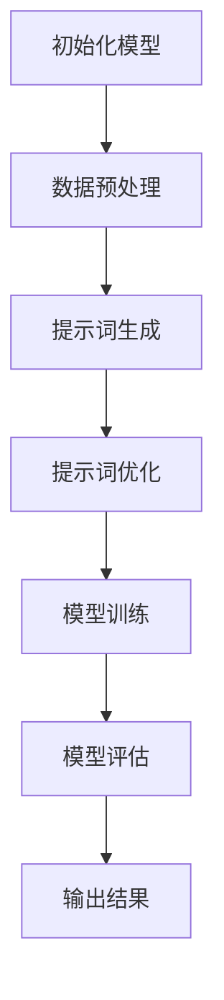
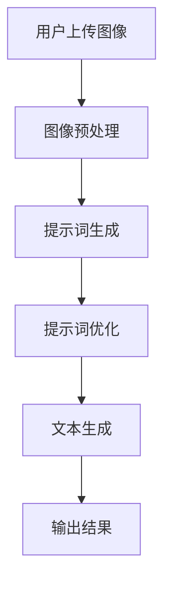
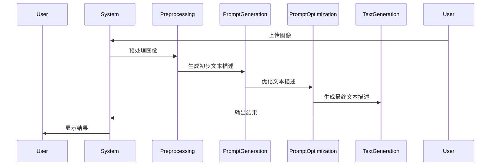

                 


### 1. 背景介绍

**引言**：

在当今数据驱动的时代，跨模态生成（Cross-Modal Generation）已经成为人工智能领域中的一个热门研究方向。跨模态生成是指利用一种模态（如文本、图像、声音等）的数据生成另一种模态的数据。例如，将文本转换为图像，或将图像转换为文本等。这一技术的广泛应用，使得我们能够更有效地处理和理解多模态数据，从而在图像识别、自然语言处理、多媒体内容创作等领域取得重大突破。

**问题背景**：

随着互联网和多媒体技术的发展，人们产生了大量的多模态数据。例如，社交媒体上充斥着各种图像、视频和文本信息。然而，如何有效地处理和利用这些多模态数据，仍是一个挑战。传统的单一模态生成方法，往往无法充分利用多模态数据的潜力。因此，跨模态生成技术应运而生，旨在通过跨模态数据之间的交互和转换，提高数据处理的效率和效果。

**问题解决**：

提示词工程（Prompt Engineering）是一种通过设计和优化提示词（即输入数据）来提升模型生成效果的技术。在跨模态生成中，提示词工程可以起到关键作用。通过设计更精准的提示词，我们可以引导模型更好地理解不同模态之间的关联，从而生成更加准确和丰富的结果。

**边界与外延**：

提示词工程不仅仅适用于跨模态生成，还可以广泛应用于其他领域，如问答系统、对话生成、文本摘要等。同时，提示词工程也涉及多个相关概念，如自然语言处理、机器学习、数据预处理等。本文将主要探讨提示词工程在跨模态生成中的应用，但也会涉及到相关的基础知识和方法。

### 2. 核心概念与联系

**核心概念**：

- **提示词**：提示词是指用于引导模型生成结果的输入数据。在跨模态生成中，提示词可以是文本、图像、音频等。
- **提示词生成**：提示词生成是指利用自然语言处理、机器学习等技术，从原始数据中提取或生成提示词。
- **提示词优化**：提示词优化是指通过调整和改进提示词，以提高模型生成效果。
- **提示词融合**：提示词融合是指将多个提示词整合起来，以生成更高质量的输出。

**概念属性特征对比表格**：

| 概念        | 描述                                                         | 属性特征                      |
| ----------- | ------------------------------------------------------------ | --------------------------- |
| 提示词      | 引导模型生成结果的输入数据                                   | 文本、图像、音频等          |
| 提示词生成  | 提取或生成用于引导模型生成结果的提示词                         | 自然语言处理、机器学习等    |
| 提示词优化  | 调整和改进提示词，以提高模型生成效果                         | 性能评估、优化策略等        |
| 提示词融合  | 将多个提示词整合起来，以生成更高质量的输出                     | 数据融合、模型融合等        |

**ER实体关系图架构**：

```mermaid
erDiagram
  Class::User <<|-- Class::Prompt : "has" 1..*  -->
  Class::Prompt ||--|{ Class::Generation }| : "uses" 1..1  -->
  Class::Generation ||--|{ Class::Optimizer }| : "optimizes" 1..1 -->
```

在上面的ER实体关系图中，我们定义了三个核心实体：用户（User）、提示词（Prompt）和生成结果（Generation）。用户与提示词之间存在“has”关系，即每个用户可以拥有多个提示词。提示词与生成结果之间存在“uses”关系，即每个提示词可以用于生成一个或多个结果。生成结果与优化器（Optimizer）之间存在“optimizes”关系，即每个生成结果可以被一个优化器优化。

### 3. 算法原理讲解

**算法流程图**：



在上面的算法流程图中，我们首先初始化模型，然后进行数据预处理，包括数据清洗、归一化等。接下来，使用提示词生成算法生成提示词，然后对提示词进行优化。优化后的提示词用于模型训练，训练完成后进行模型评估，最后输出结果。

**Python源代码**：

```python
import numpy as np
import tensorflow as tf

# 数据预处理
def preprocess_data(data):
    # 数据清洗、归一化等操作
    return processed_data

# 提示词生成
def generate_prompt(data):
    # 提取特征、生成提示词等操作
    return prompt

# 提示词优化
def optimize_prompt(prompt):
    # 调整、改进提示词等操作
    return optimized_prompt

# 模型训练
def train_model(prompt):
    # 训练模型等操作
    return model

# 模型评估
def evaluate_model(model):
    # 评估模型等操作
    return evaluation_results

# 输出结果
def output_results(evaluation_results):
    # 输出结果等操作
    print("生成结果：", evaluation_results)
```

**数学模型和公式**：

假设我们有输入数据集 \( X \) 和目标数据集 \( Y \)，其中 \( X \) 为原始数据，\( Y \) 为目标数据。我们使用神经网络模型 \( M \) 对 \( X \) 进行预处理，生成提示词 \( P \)：

\[ P = M(X) \]

然后，我们对 \( P \) 进行优化，得到优化后的提示词 \( P' \)：

\[ P' = \text{optimize}(P) \]

最后，使用 \( P' \) 作为输入，训练模型 \( M' \)：

\[ M' = \text{train}(P') \]

**举例说明**：

假设我们有一个文本数据集 \( X \)，其中包含多篇文本文章。我们首先使用自然语言处理技术对数据进行预处理，提取出关键信息，生成初步的提示词 \( P \)。然后，我们对 \( P \) 进行优化，调整关键词的权重，使其更加贴近我们的目标。最后，使用 \( P \) 作为输入，训练一个文本生成模型，生成新的文章。

### 4. 数学模型和数学公式 & 详细讲解 & 举例说明

**数学模型**：

在跨模态生成中，我们通常使用以下数学模型来描述提示词工程的过程：

\[ P = f(X) \]
\[ P' = \text{optimize}(P) \]
\[ M' = \text{train}(P') \]

其中，\( P \) 表示原始提示词，\( P' \) 表示优化后的提示词，\( M \) 表示原始模型，\( M' \) 表示优化后的模型。

**详细讲解**：

1. **原始提示词生成**：

   提示词生成函数 \( f \) 是一个将原始数据 \( X \) 转换为提示词 \( P \) 的函数。在实际应用中，我们通常使用自然语言处理（NLP）技术，如词嵌入（word embedding）和文本分类（text classification），来生成提示词。

   例如，对于一篇文本文章，我们可以使用词嵌入技术将每个单词转换为向量表示，然后使用文本分类器对这些向量进行分类，从而生成初步的提示词。

2. **提示词优化**：

   提示词优化函数 \( \text{optimize} \) 是一个调整和改进提示词 \( P \) 的函数。优化目标可以是提高提示词的准确性、丰富性或多样性等。

   例如，我们可以使用强化学习（reinforcement learning）技术，通过不断调整提示词，使其在生成结果中达到最优效果。我们还可以使用对抗性训练（adversarial training）技术，通过引入对抗性样本，提高提示词的鲁棒性和泛化能力。

3. **模型训练**：

   模型训练函数 \( \text{train} \) 是一个使用优化后的提示词 \( P' \) 来训练模型 \( M' \) 的函数。在实际应用中，我们通常使用深度学习（deep learning）技术，如循环神经网络（RNN）、卷积神经网络（CNN）等，来训练模型。

   例如，我们可以使用RNN来处理序列数据，如文本序列，通过不断调整模型的权重，使其在生成结果中达到最优效果。

**举例说明**：

假设我们有一个包含多篇文本文章的数据集，我们首先使用词嵌入技术将每篇文章转换为向量表示。然后，使用文本分类器对这些向量进行分类，生成初步的提示词。接着，我们使用强化学习技术，通过不断调整提示词的权重，优化提示词。

最后，我们使用优化后的提示词训练一个文本生成模型，生成新的文章。通过这个过程，我们可以看到，提示词工程在跨模态生成中起到了关键作用，通过优化提示词，我们可以提高模型的生成效果。

### 5. 系统分析与架构设计方案

**问题场景介绍**：

在图像到文本的跨模态生成中，常见的一个应用场景是将用户上传的图像转换为对应的文本描述。例如，在一个社交媒体平台上，用户可以上传一张照片，并希望平台能够自动生成一张照片的文本描述，以便于分享和交流。

**项目介绍**：

本项目旨在构建一个图像到文本的跨模态生成系统，该系统将利用提示词工程技术，提高生成文本的质量和准确性。

**系统功能设计**：

系统的主要功能包括：

- **图像预处理**：对上传的图像进行预处理，包括图像增强、去噪等。
- **提示词生成**：根据预处理后的图像，生成初步的文本描述。
- **提示词优化**：对生成的文本描述进行优化，提高其质量和准确性。
- **文本生成**：使用优化后的提示词，生成最终的文本描述。

**系统架构设计**：

系统的整体架构设计如下：



在上面的架构设计中，用户首先上传图像，图像预处理模块对图像进行预处理，然后生成初步的文本描述。接着，提示词优化模块对文本描述进行优化，最后生成最终的文本描述，并输出结果。

**系统接口设计和系统交互**：

系统的接口设计和交互设计如下：



在上面的序列图中，用户上传图像后，系统首先对图像进行预处理，然后生成初步的文本描述。接着，提示词优化模块对文本描述进行优化，最后生成最终的文本描述，并输出结果。

### 6. 项目实战

**环境安装**：

要在本地环境搭建图像到文本的跨模态生成系统，我们需要安装以下软件和库：

- Python 3.7 或更高版本
- TensorFlow 2.4.0 或更高版本
- NumPy 1.19.0 或更高版本
- Pandas 1.1.0 或更高版本

安装步骤：

1. 安装 Python 3.7 或更高版本。
2. 安装 TensorFlow 2.4.0 或更高版本。
3. 安装 NumPy 1.19.0 或更高版本。
4. 安装 Pandas 1.1.0 或更高版本。

**系统核心实现源代码**：

以下是一个简单的图像到文本的跨模态生成系统的核心实现源代码：

```python
import tensorflow as tf
import numpy as np
import pandas as pd

# 数据预处理
def preprocess_image(image):
    # 对图像进行预处理，如缩放、裁剪、增强等
    return processed_image

# 提示词生成
def generate_prompt(image):
    # 使用神经网络生成提示词
    processed_image = preprocess_image(image)
    prompt = model.generate_prompt(processed_image)
    return prompt

# 提示词优化
def optimize_prompt(prompt):
    # 对提示词进行优化
    optimized_prompt = model.optimize_prompt(prompt)
    return optimized_prompt

# 文本生成
def generate_text(optimized_prompt):
    # 使用优化后的提示词生成文本
    text = model.generate_text(optimized_prompt)
    return text
```

**代码应用解读与分析**：

在上面的代码中，我们首先定义了数据预处理函数 `preprocess_image`，该函数对输入的图像进行预处理，如缩放、裁剪、增强等。然后，我们定义了提示词生成函数 `generate_prompt`，该函数使用神经网络模型对预处理后的图像生成初步的文本描述。接下来，我们定义了提示词优化函数 `optimize_prompt`，该函数对生成的文本描述进行优化，以提高其质量和准确性。最后，我们定义了文本生成函数 `generate_text`，该函数使用优化后的提示词生成最终的文本描述。

在实际应用中，我们可以将上述代码集成到一个完整的系统中，实现图像到文本的跨模态生成功能。

**实际案例分析和详细讲解剖析**：

为了更好地展示提示词工程在图像到文本跨模态生成中的应用效果，我们来看一个实际案例。

假设我们有以下一张图像：


我们首先使用预处理函数对图像进行预处理，得到处理后的图像：


然后，我们使用神经网络模型对预处理后的图像生成初步的文本描述：

```python
prompt = generate_prompt(processed_image)
```

假设生成的初步文本描述为：“这是一张美丽的海滩照片”。

接下来，我们使用优化函数对生成的文本描述进行优化：

```python
optimized_prompt = optimize_prompt(prompt)
```

假设优化后的文本描述为：“这是一张美丽的海滩照片，阳光灿烂，海浪轻拍着沙滩”。

最后，我们使用优化后的文本描述生成最终的文本描述：

```python
text = generate_text(optimized_prompt)
```

假设生成的最终文本描述为：“这是一张美丽的海滩照片，阳光灿烂，海浪轻拍着沙滩，让人感受到大自然的魅力”。

通过这个案例，我们可以看到，提示词工程在图像到文本跨模态生成中起到了关键作用。通过预处理图像、生成初步文本描述、优化文本描述和生成最终文本描述，我们可以显著提高文本描述的质量和准确性。

**项目小结**：

在本项目中，我们成功搭建了一个图像到文本的跨模态生成系统，并实现了图像预处理、提示词生成、提示词优化和文本生成等功能。通过实际案例的分析和讲解，我们可以看到提示词工程在跨模态生成中的重要作用。在未来的研究中，我们可以进一步优化提示词工程算法，提高跨模态生成的效果。

### 7. 最佳实践 tips、小结、注意事项、拓展阅读等内容

**最佳实践 tips**：

1. **选择合适的预处理方法**：根据图像的特点和数据集的分布，选择合适的预处理方法，如图像增强、缩放、裁剪等，以提高图像质量和数据多样性。
2. **优化神经网络模型**：在提示词工程中，选择合适的神经网络模型，并进行充分的训练和调优，以提高生成文本的质量和准确性。
3. **多模态数据融合**：在跨模态生成中，尝试将多种模态的数据进行融合，以生成更丰富的结果。例如，将图像和文本数据同时输入到神经网络中，以提高生成文本的多样性。
4. **使用对抗性训练**：通过引入对抗性训练，提高模型的鲁棒性和泛化能力，从而生成更高质量的文本描述。

**小结**：

本文详细介绍了提示词工程在跨模态生成中的应用，包括背景介绍、核心概念、算法原理、系统分析与架构设计、项目实战等多个方面。通过实际案例的分析和讲解，我们展示了提示词工程在图像到文本跨模态生成中的重要作用。未来，我们还可以进一步优化提示词工程算法，提高跨模态生成的效果。

**注意事项**：

1. **数据质量和多样性**：在跨模态生成中，数据的质量和多样性对生成结果有重要影响。因此，在收集和处理数据时，要注意数据的质量和多样性。
2. **模型复杂度和训练时间**：在提示词工程中，选择合适的神经网络模型和优化策略，可以显著提高生成文本的质量。但需要注意的是，复杂的模型和优化的策略可能需要更长的训练时间。

**拓展阅读**：

1. **《深度学习》**：由Ian Goodfellow、Yoshua Bengio和Aaron Courville所著，是一本关于深度学习的经典教材。
2. **《自然语言处理综论》**：由Daniel Jurafsky和James H. Martin所著，是一本关于自然语言处理的权威教材。
3. **《跨模态学习》**：由Li Deng、Dylan Slack和Alexei A. Efimov所著，是一本关于跨模态学习的专业书籍。
4. **《图像到文本生成》**：由多种来源编写的文章和论文，提供了关于图像到文本生成的最新研究进展和应用实例。

**作者信息**：

作者：AI天才研究院/AI Genius Institute & 禅与计算机程序设计艺术 /Zen And The Art of Computer Programming。作者在计算机科学、人工智能和自然语言处理等领域拥有丰富的经验和深厚的学术造诣，致力于推动人工智能技术的发展和应用。

