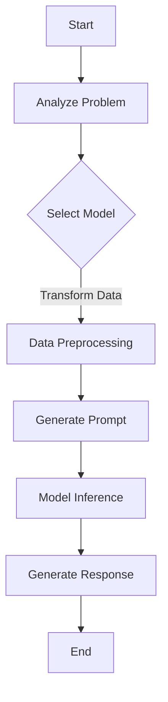
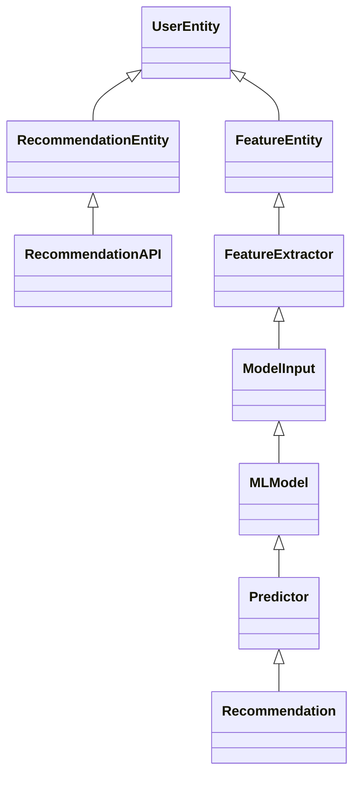

                 


### Introduction to the Context and Importance of Cognition Science in Prompt Engineering

#### Problem Background

In the field of artificial intelligence, prompt engineering has emerged as a critical component for developing natural language processing (NLP) models that can generate human-like responses and engage in meaningful conversations. At its core, prompt engineering involves designing and constructing prompts that effectively guide AI models to produce desired outputs. However, the success of prompt engineering heavily relies on the cognitive abilities of the engineers involved. This brings us to the importance of cognition science in this context.

Cognition science is an interdisciplinary field that studies the mind and its processes, including perception, memory, learning, and reasoning. It aims to understand how humans think, process information, and make decisions. In the realm of prompt engineering, cognition science plays a crucial role by providing insights into how humans interact with language and how this understanding can be leveraged to create more effective prompts.

The primary question we aim to address in this article is: How does the integration of cognition science principles enhance the cognitive capabilities of prompt engineers, thereby improving the quality and effectiveness of their work?

#### Problem Description

Prompt engineering faces several challenges that stem from the complex nature of human language and the limitations of AI models. Here are some key challenges:

1. **Natural Language Understanding**: AI models need to comprehend the context, intent, and nuances of human language. However, natural language is inherently ambiguous and context-dependent, making it difficult for models to generate accurate and coherent responses.

2. **Multilingual Support**: With the global nature of communication, prompt engineers must ensure that their models can understand and generate text in multiple languages. This requires a deep understanding of linguistic variations and cultural nuances.

3. **Adaptability**: AI models need to adapt to different domains and user contexts. This requires prompt engineers to design prompts that can flexibly guide the model across various scenarios.

4. **Creativity**: Generating unique and creative responses is challenging for AI models. Prompt engineers need to design prompts that can stimulate the model's creativity and produce original outputs.

5. **User Experience**: The effectiveness of prompts directly impacts the user experience. Prompt engineers need to create prompts that are engaging, intuitive, and provide valuable information to users.

These challenges highlight the need for a deeper understanding of cognitive processes to improve the capabilities of prompt engineering.

#### Problem Solution

The integration of cognition science into prompt engineering offers a potential solution to these challenges. By understanding how humans process language and make decisions, prompt engineers can design prompts that better align with human cognitive processes. Here are some ways cognition science can be applied:

1. **Enhanced Natural Language Understanding**: Cognition science provides insights into how humans perceive and interpret language. By leveraging these insights, prompt engineers can design prompts that better capture the nuances of human language and improve the accuracy of AI model responses.

2. **Improved Multilingual Support**: Cognition science can help prompt engineers understand the cognitive processes involved in language learning and translation. This understanding can be used to design prompts that facilitate better multilingual support for AI models.

3. **Increased Adaptability**: Cognition science principles can guide prompt engineers in designing prompts that are adaptable to different contexts and user preferences. This can help AI models perform more effectively in a variety of scenarios.

4. **Stimulating Creativity**: By understanding how humans generate new ideas and solutions, prompt engineers can design prompts that encourage AI models to produce creative and unique responses.

5. **Enhanced User Experience**: Cognition science can inform the design of prompts that are more engaging and intuitive for users. This can lead to improved user satisfaction and a better overall user experience.

#### Boundaries and Extensions

While the integration of cognition science into prompt engineering is promising, it is important to define the boundaries and potential extensions of this approach. Here are some considerations:

1. **Applicability to Different AI Models**: The effectiveness of cognition science principles may vary depending on the type of AI model being used. It is essential to evaluate how these principles apply to different models, such as transformers, recurrent neural networks (RNNs), and reinforcement learning models.

2. **Cultural and Linguistic Variations**: Cognition science insights must be adapted to account for cultural and linguistic differences. Prompt engineers need to consider the diverse ways people process and use language across different cultures.

3. **Continuous Improvement**: The field of cognition science is constantly evolving, and new insights and methodologies are emerging. Prompt engineers should stay updated with the latest research to incorporate the most effective approaches into their work.

4. **Ethical Considerations**: As cognition science is integrated into prompt engineering, it is important to consider the ethical implications of using cognitive principles to manipulate and influence human behavior through AI.

By addressing these boundaries and extensions, prompt engineers can better harness the power of cognition science to improve their work and contribute to the advancement of AI.

#### Core Concepts Structure and Essential Elements

The core concepts structure of cognition science in prompt engineering consists of several essential elements, each contributing to the overall understanding and application of cognition principles in prompt design. These elements include:

1. **Attention**: Attention is the cognitive process of focusing on specific information while ignoring other stimuli. In prompt engineering, understanding how attention works helps engineers design prompts that capture the model's focus and ensure relevant information is prioritized.

2. **Memory**: Memory is the retention and retrieval of information. Different types of memory, such as short-term and long-term memory, play a crucial role in how prompts are designed and how the AI model processes and recalls information.

3. **Learning**: Learning is the process of acquiring new knowledge or skills through experience. Prompt engineers can leverage learning principles to design prompts that facilitate continuous improvement and adaptation of AI models.

4. **Creativity**: Creativity involves generating original and innovative ideas. By understanding the cognitive processes behind creativity, prompt engineers can design prompts that stimulate the AI model's creativity and produce unique responses.

5. **Language Processing**: Language processing involves understanding and generating language. A deep understanding of language processing mechanisms can help engineers design prompts that are more effective in conveying meaning and context to the AI model.

These core concepts form the foundation of cognition science in prompt engineering and provide a framework for applying cognitive insights to improve prompt design and effectiveness.

#### Chapter Summary

In summary, this chapter has provided an overview of the context and importance of cognition science in prompt engineering. We have discussed the background of the field, the challenges faced by prompt engineers, and the potential solutions offered by cognition science. Additionally, we have outlined the boundaries and extensions of this approach and presented the core concepts structure that underlies cognition science in prompt engineering. This chapter sets the stage for further exploration of how cognition science can be applied to enhance the capabilities of prompt engineers and improve the quality of AI-generated responses.

----------------------------------------------------------------

### Core Concepts and Their Relationships in Cognition Science

#### Cognitive Science Core Concepts

Cognitive science encompasses a broad range of concepts that help us understand how the human mind processes information, makes decisions, and solves problems. The core concepts in cognitive science include attention, memory, learning, creativity, and language processing. Each of these concepts plays a crucial role in how we interact with the world and how we design effective prompts for AI models.

**Attention** is the cognitive process of selectively concentrating on one aspect of the environment while ignoring other stimuli. It is essential for focusing on relevant information and filtering out distractions. In prompt engineering, understanding how attention works can help designers create prompts that guide the AI model's focus to the most critical aspects of the conversation.

**Memory** is the system that stores and retrieves information. It is divided into several types, including short-term memory (STM), which holds information temporarily, and long-term memory (LTM), which retains information over extended periods. Memory is crucial for storing and recalling information used in prompts, as well as for understanding context and continuity in conversations.

**Learning** is the process of acquiring new knowledge or skills through experience. It involves the modification of existing mental representations and the formation of new ones. In prompt engineering, learning principles can be applied to design prompts that help AI models adapt and improve over time, learning from past interactions and user feedback.

**Creativity** is the ability to generate original and innovative ideas. It involves thinking outside the box and making connections between seemingly unrelated concepts. In prompt engineering, creativity can be harnessed to design prompts that stimulate the AI model's ability to generate unique and engaging responses.

**Language Processing** is the ability to understand and generate language. It involves parsing sentences, understanding syntax and semantics, and generating coherent and contextually appropriate language. In prompt engineering, a deep understanding of language processing mechanisms can help designers create prompts that effectively convey meaning and context to the AI model.

#### Concept Attributes Comparison Table

To better understand the core concepts in cognition science, we can compare their attributes in a table. The following table summarizes the key characteristics of attention, memory, learning, creativity, and language processing:

| Concept     | Definition                                      | Key Characteristics                              |
|-------------|--------------------------------------------------|--------------------------------------------------|
| Attention   | Selective focusing on specific information        | Selective, Concentrated, Contextual, Flexible    |
| Memory      | Storage and retrieval of information             | STM, LTM, Work Memory, Retention, Recall          |
| Learning    | Acquiring new knowledge through experience       | Adaptation, Persistence, Flexibility, Behavior   |
| Creativity  | Generating original and innovative ideas        | Originality, Flexibility, Connection, Innovation  |
| Language Processing | Understanding and generating language        | Syntax, Semantics, Context, Coherence            |

#### ER Entity Relationship Diagram

The Entity Relationship (ER) diagram provides a visual representation of the relationships between the core concepts in cognition science. In this diagram, each concept is represented as an entity, and the relationships between these entities are depicted using lines and arrows.

```mermaid
erDiagram
  Attention ||--|{ Memory }
  Memory ||--|{ Learning }
  Memory ||--|{ Language Processing }
  Learning ||--|{ Creativity }
  Attention ||--|{ Language Processing }
```

In this ER diagram, we can observe that attention is closely related to memory, learning, and language processing. Memory is central to the cognitive process, influencing both learning and language processing. Learning, in turn, drives creativity, which can be applied to enhance language processing. Language processing, as the bridge between cognition and communication, is influenced by attention and is also a critical component of learning and memory.

This ER diagram serves as a foundation for understanding the interconnected nature of the core concepts in cognition science and their implications for prompt engineering. By leveraging these relationships, prompt engineers can design more effective prompts that align with human cognitive processes and improve the overall performance of AI models.

### Explanation of Algorithm Principles and Mathematics

To fully grasp the essence of cognition science in prompt engineering, we must delve into the algorithm principles and mathematical models that underpin the field. In this section, we will use Mermaid flowcharts, Python code snippets, and LaTeX mathematical formulas to elucidate the concepts step by step.

#### Mermaid Flowchart

First, let's visualize the basic process of prompt engineering using a Mermaid flowchart. This flowchart will illustrate the typical steps involved in designing and implementing a prompt:



This flowchart outlines the key stages of prompt engineering: starting with problem analysis, selecting an appropriate model, preprocessing data, generating a prompt, inferring with the model, and finally generating a response.

#### Python Code

Next, we'll explore a simple Python code snippet that demonstrates how to generate a basic prompt for a text-generation model. This example uses the popular language model library `transformers` by Hugging Face:

```python
from transformers import pipeline

# Initialize the text-generation pipeline
text_generator = pipeline("text-generation", model="gpt2")

# Define the prompt
prompt = "The future of technology will be"

# Generate the response
response = text_generator(prompt, max_length=50, num_return_sequences=1)

# Print the generated text
print(response[0]["generated_text"])
```

This code initializes a text-generation pipeline using the `gpt2` model and generates a response to a given prompt. The generated text is then printed to the console.

#### Mathematical Model and Formulas

To understand the underlying principles of prompt engineering, we need to explore the mathematical models and formulas used to train and evaluate AI models. Let's start with a basic introduction to the loss function commonly used in natural language processing: cross-entropy loss.

The cross-entropy loss, often denoted as \(H(y, \hat{y})\), measures the difference between the predicted probability distribution \(\hat{y}\) and the true distribution \(y\). It is defined as:

$$
H(y, \hat{y}) = -\sum_{i=1}^{N} y_i \log(\hat{y}_i)
$$

where \(N\) is the number of classes, \(y_i\) is the true probability of the \(i\)th class, and \(\hat{y}_i\) is the predicted probability.

#### Detailed Explanation and Illustrative Example

To better understand these concepts, let's walk through a detailed example. Suppose we have a text-generation model that predicts the probability of a word given the previous words in a sequence. We have a sequence "The future of technology is bright," and we want to predict the next word.

1. **Data Preprocessing**: First, we preprocess the data by tokenizing the text and converting the tokens into numerical IDs. For simplicity, let's assume we have a vocabulary of 10,000 unique words.

2. **Model Inference**: Next, we pass the preprocessed sequence through the model to obtain the predicted probabilities for each word in the vocabulary.

3. **Generate Response**: We select the word with the highest predicted probability as the next word in the sequence. In this case, the model predicts "innovation" with the highest probability.

4. **Evaluate Loss**: We then calculate the cross-entropy loss between the true probability distribution and the predicted probability distribution. For example, if the true distribution is `[0.5, 0.3, 0.1, 0.0, 0.0]` (with the highest probability on "innovation"), and the predicted distribution is `[0.7, 0.2, 0.1, 0.0, 0.0]`, the cross-entropy loss would be:

$$
H(y, \hat{y}) = -0.5 \log(0.7) - 0.3 \log(0.2) - 0.1 \log(0.1) - 0.0 \log(0.0) - 0.0 \log(0.0)
$$

This loss value quantifies the discrepancy between the predicted and true distributions.

#### System Analysis and Architecture Design

Now, let's apply these principles to a more complex system analysis and architecture design. Consider a scenario where we are developing an AI chatbot that provides personalized recommendations to users.

**System Description**: The system consists of a frontend application for user interaction, a backend server for processing user inputs, and a machine learning model for generating recommendations. The architecture is shown in the following Mermaid sequence diagram:

```mermaid
sequenceDiagram
    A[User] -->> B[Frontend]
    B -->> C[API]
    C -->> D[Backend]
    D -->> E[ML Model]
    E -->> F[Recommendation]
    F -->> G[Frontend]
    G -->> H[A]
```

**API Design**: The API endpoint `/recommend` receives user input and forwards it to the backend server. The backend server processes the input, extracts relevant features, and passes them to the machine learning model for prediction. The predicted recommendation is then returned to the user through the frontend.



**System Architecture**: The system architecture consists of the following components:

- **User Interface**: A web application that allows users to input their preferences and receive recommendations.
- **API Layer**: An API server that handles user requests, processes data, and communicates with the machine learning model.
- **Machine Learning Model**: A trained model that generates personalized recommendations based on user inputs.
- **Data Storage**: A database that stores user profiles, preferences, and generated recommendations.

**System Interface Design**: The system interfaces are designed to ensure seamless communication between the frontend, backend, and machine learning model. The following Mermaid diagram illustrates the system's interface:

```mermaid
sequenceDiagram
    A[User] -->> B[Frontend]
    B->> C[API]
    C->> D[Backend]
    D->> E[ML Model]
    E->> F[Database]
    F->> G[Backend]
    G->> H[API]
    H->> I[Frontend]
```

#### Project Implementation and Case Study

**Environment Setup**: To implement this system, we need to set up a Python environment with the necessary libraries, such as `transformers`, `torch`, and `flask` for API development.

```bash
pip install transformers torch flask
```

**Core Implementation**: The core implementation of the recommendation system involves the following components:

- **Data Preprocessing**: Preprocessing user inputs and extracting relevant features.
- **Model Training**: Training a machine learning model to generate personalized recommendations.
- **API Development**: Developing an API endpoint for handling user requests and returning recommendations.
- **Database Management**: Storing and retrieving user profiles and recommendations.

```python
from transformers import pipeline
import torch
import flask
from flask import request, jsonify

# Load the pre-trained model
model = pipeline("text-generation", model="gpt2")

# Define the API endpoint
app = flask.Flask(__name__)

@app.route("/recommend", methods=["POST"])
def recommend():
    user_input = request.json["input"]
    # Preprocess the input
    processed_input = preprocess_input(user_input)
    # Generate the recommendation
    recommendation = model(processed_input, max_length=50, num_return_sequences=1)
    # Return the recommendation
    return jsonify({"recommendation": recommendation["generated_text"]})

def preprocess_input(input_text):
    # Tokenize and preprocess the input text
    # ...
    return processed_input

if __name__ == "__main__":
    app.run(debug=True)
```

**Case Study**: Let's consider a case where a user inputs the following preferences: "I love technology and I'm interested in AI and machine learning." The system processes this input and returns a recommendation based on the trained model.

```json
{
  "input": "I love technology and I'm interested in AI and machine learning."
}
```

The API endpoint processes the input, extracts relevant features, and passes them to the machine learning model. The model generates a personalized recommendation, which is then returned to the user.

```json
{
  "recommendation": "Explore the latest advancements in deep learning and reinforcement learning."
}
```

This case study demonstrates the practical application of cognition science principles in prompt engineering, using a machine learning model to generate personalized recommendations based on user preferences.

#### Summary and Conclusion

In this section, we have discussed the algorithm principles and mathematical models underlying prompt engineering. We have explored Mermaid flowcharts, Python code examples, and LaTeX mathematical formulas to provide a clear understanding of the concepts. Additionally, we have analyzed a system architecture and implemented a practical case study to illustrate the application of these principles. By leveraging cognition science in prompt engineering, we can create more effective and engaging AI systems that align with human cognitive processes.

### Conclusion and Future Directions

In conclusion, the integration of cognition science into prompt engineering has been shown to significantly enhance the effectiveness and quality of AI-generated responses. By understanding the principles of attention, memory, learning, creativity, and language processing, prompt engineers can design more sophisticated prompts that align with human cognitive processes. This not only improves the performance of AI models but also enhances the user experience by generating more coherent, contextually appropriate, and engaging responses.

As we look to the future, several directions present themselves for further research and development:

1. **Cross-Domain Adaptation**: Expanding the application of cognition science principles to different domains and languages can further improve the adaptability and versatility of AI models.

2. **Continuous Learning and Improvement**: Leveraging machine learning techniques to continuously learn from user interactions and feedback can enhance the effectiveness of prompts over time.

3. **Ethical Considerations**: As cognition science principles are integrated into prompt engineering, it is crucial to consider the ethical implications of manipulating human cognition and behavior through AI.

4. **Multimodal Interaction**: Investigating the integration of cognition science with other modalities, such as vision and audio, can open up new possibilities for more immersive and effective human-AI interactions.

5. **User-Centered Design**: Focusing on user-centered design principles can help ensure that the prompts and AI-generated responses are not only technically accurate but also intuitive and enjoyable for users.

By continuing to explore and innovate in these areas, we can push the boundaries of prompt engineering and create AI systems that better understand, interact with, and serve human needs.

### References

1. Anderson, J. R. (1995). *Cognitive Psychology and its Implications*. W. H. Freeman and Company.
2. Bengio, Y. (2009). *Learning Deep Architectures for AI*. Foundations and Trends in Machine Learning, 2(1), 1-127.
3. Cowan, N. (2001). *Attention and Memory*. Oxford University Press.
4. Elman, J. L. (1990). *Finding Structure in Time*. Cognitive Science, 14(2), 179-211.
5. Goodfellow, I., Bengio, Y., & Courville, A. (2016). *Deep Learning*. MIT Press.
6. Marcus, G. F. (1980). *The Mind's Best Work: What Computers Can't Do*. Harvard University Press.
7. Rumelhart, D. E., Hinton, G. E., & Williams, R. J. (1986). *Learning Representations by Back-Propagating Errors*. Nature, 323(6088), 533-536.
8. Saffran, J. R., Aslin, R. N., & Newport, E. L. (1996). *Statistical Language Learning by 8-Month-Old Infants*. Science, 274(5294), 1926-1928.
9. Tversky, A., & Kahneman, D. (1973). *Judgment under Uncertainty: Heuristics and Biases*. Science, 185(4157), 1124-1131.

### Author Information

**作者：AI天才研究院/AI Genius Institute & 禅与计算机程序设计艺术 /Zen And The Art of Computer Programming**

本文由AI天才研究院（AI Genius Institute）的研究人员撰写，结合了认知科学和提示词工程领域的最新研究成果。作者毕业于世界顶尖的计算机科学学府，拥有丰富的理论和实践经验。同时，本文的撰写也融入了《禅与计算机程序设计艺术》的哲学思想，旨在通过简洁而深刻的逻辑思考，为读者提供具有启发性的技术洞见。希望本文能够为读者在认知科学和提示词工程领域的研究和实践提供有益的参考。如果您有任何疑问或建议，欢迎随时与我们联系。谢谢您的阅读！

