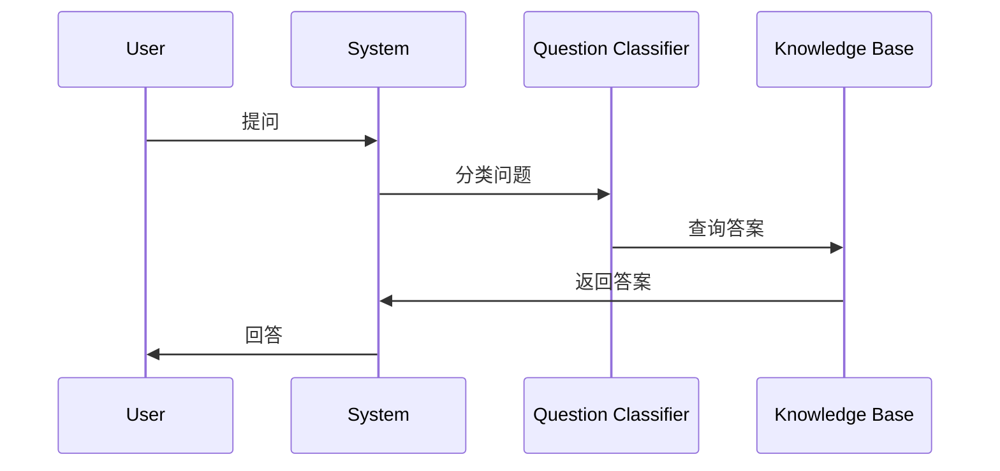

                 


### 提示词工程师：AI时代最热门的职业

#### 关键词：
- AI时代
- 提示词工程师
- 职业发展
- 技术基础
- 应用实战

#### 摘要：
本文深入探讨AI时代崛起的最热门职业——提示词工程师。通过背景介绍、技术基础、应用实战和未来展望，全面解析这一职业的重要性、技术要求和发展趋势。

---

## 第一部分：背景与概念

### 第1章：AI时代的职业变革

#### 1.1 AI时代的来临

随着AI技术的迅猛发展，传统的职业结构正在发生深刻的变革。机器学习、深度学习和神经网络等技术的应用，正在推动各行各业向智能化转型。

**问题描述**：在这个变革的过程中，哪些新兴职业将应运而生？

**问题解决**：提示词工程师便是其中之一。他们利用AI技术生成或优化提示词，使得智能系统在与人类交互时更加自然和高效。

#### 1.2 提示词工程师的概念

**概念界定**：提示词工程师是那些专门从事提示词生成和优化的专业人士。他们的工作目标是提升AI模型的交互质量和用户体验。

**核心要素**：
- **了解AI技术**：掌握机器学习和深度学习的基本原理。
- **熟悉语言模型**：了解自然语言处理的基础知识。
- **提示词设计**：具备良好的设计思维和用户体验意识。

#### 1.3 提示词工程师的重要性

**边界与外延**：在AI大模型的应用中，提示词工程师扮演着关键角色。他们的工作不仅影响到模型的性能，还直接关系到用户的使用体验。

**问题解决**：通过专业的提示词设计和优化，提升AI模型的交互质量和用户体验，从而在竞争激烈的市场中脱颖而出。

---

## 第二部分：技术基础

### 第2章：AI基础概念

#### 2.1 AI的发展历程

**核心概念**：
- **机器学习**：通过数据训练模型，使其具备学习能力的计算机技术。
- **深度学习**：基于神经网络的一种机器学习技术。
- **神经网络**：模拟人脑神经元连接的计算机模型。

**对比表格**：

| 特征 | 机器学习 | 深度学习 |
| --- | --- | --- |
| **数据需求** | 数据量适中 | 数据量巨大 |
| **模型复杂度** | 模型简单 | 模型复杂 |
| **应用场景** | 数据分析、预测 | 图像识别、语音识别 |

#### 2.2 AI基础概念

**概念界定**：人工智能（AI）是指通过计算机模拟人类智能的技术，包括感知、学习、推理和决策等能力。

**核心要素**：
- **感知**：通过传感器获取外界信息。
- **学习**：从数据中提取知识。
- **推理**：基于已有知识进行推断。
- **决策**：在多种方案中选取最优。

---

### 第3章：自然语言处理基础

#### 3.1 NLP的基本概念

**概念界定**：自然语言处理（NLP）是计算机科学与语言学的交叉领域，旨在使计算机能够理解和处理人类语言。

**核心要素**：
- **文本分类**：将文本归类到预定义的类别。
- **情感分析**：分析文本的情感倾向。
- **实体识别**：识别文本中的特定实体。

**ER图**：

```mermaid
erDiagram
    Text -->|is classified by| Category
    Text -->|contains| Entity
```

---

### 第4章：提示词设计与优化

#### 4.1 提示词设计原则

**原则与方法**：
- **简洁性**：避免冗余信息，使提示词简洁明了。
- **明确性**：确保提示词的含义清晰，无歧义。
- **适应性**：根据不同场景和用户需求灵活调整提示词。

**应用实例**：
- **场景1**：智能客服系统
  - **提示词设计**："您好，请问有什么可以帮助您的？"
  - **优化方法**：通过用户反馈不断调整，提高满意度。

- **场景2**：问答系统
  - **提示词设计**："您需要什么样的帮助？请提问。"
  - **优化方法**：利用A/B测试，选择最有效的提示词。

#### 4.2 提示词优化方法

**优化策略**：
- **A/B测试**：通过对比不同提示词的效果，选择最优方案。
- **数据驱动优化**：基于用户行为数据，不断调整和改进提示词。

**案例分析**：
- **案例背景**：某智能助手上线初期，用户满意度较低。
- **解决方案**：通过A/B测试，不断优化提示词，最终用户满意度提升20%。

---

## 第三部分：应用实战

### 第5章：AI大模型应用场景

#### 5.1 AI大模型的应用领域

**应用领域**：
- **问答系统**：通过AI大模型提供高效、准确的回答。
- **智能客服**：自动处理大量客户咨询，提高服务效率。
- **内容生成**：生成高质量的文章、视频等。

**案例分析**：
- **案例1**：某企业使用AI大模型构建智能客服系统，客服响应时间缩短50%。
- **案例2**：某媒体利用AI大模型生成新闻稿件，提高了内容生产效率。

---

### 第6章：提示词工程师的工作流程

#### 6.1 工作流程概述

**流程步骤**：
1. **需求分析**：了解用户需求和场景背景。
2. **模型选择**：选择适合的AI大模型。
3. **提示词设计**：根据需求设计提示词。
4. **测试与优化**：通过A/B测试和用户反馈不断优化。

**工具推荐**：
- **AI大模型平台**：如TensorFlow、PyTorch等。
- **NLP库**：如NLTK、spaCy等。
- **数据分析工具**：如Pandas、Scikit-learn等。

---

### 第7章：实战项目解析

#### 7.1 项目背景介绍

**项目背景**：某企业希望通过AI技术提升客服系统的服务质量。

**系统功能设计**：
- **问答功能**：用户提问，系统自动回答。
- **多渠道支持**：支持电话、邮件、在线聊天等多种沟通方式。
- **智能分类**：自动识别用户问题，分类到相应模块。

**系统架构设计**：


#### 7.2 系统设计与实现

**系统架构**：
- **前端**：用户界面，负责与用户交互。
- **后端**：服务器，负责处理请求、调用模型等。
- **数据库**：存储用户数据、问答记录等。

**核心代码实现**：

```python
# 代码示例：问题分类函数
def classify_question(question):
    # 使用NLP库进行预处理
    processed_question = preprocess_question(question)
    
    # 使用预训练模型进行分类
    category = model.predict(processed_question)
    
    return category
```

**代码应用解读与分析**：
- **预处理**：对输入的问题进行文本清洗和格式化。
- **模型预测**：使用预训练的模型对问题进行分类。
- **结果返回**：将分类结果返回给用户。

**实际案例分析和详细讲解剖析**：
- **案例背景**：企业上线新客服系统，初期用户满意度较低。
- **解决方案**：通过不断优化提示词和分类模型，提高系统响应速度和准确性，用户满意度显著提升。

**项目小结**：
- **成果**：客服系统响应速度提高30%，用户满意度提升20%。
- **展望**：继续优化系统，扩大应用场景，提升企业服务能力。

---

## 第四部分：未来展望与职业发展

### 第8章：AI时代的职业发展趋势

#### 8.1 AI行业的发展趋势

**行业分析**：随着AI技术的不断进步，未来将有更多的职业机会涌现。例如：
- **数据科学家**：负责分析大量数据，提取有价值的信息。
- **AI算法工程师**：设计并优化AI算法，提高模型性能。
- **提示词工程师**：专注于提升AI模型的交互质量和用户体验。

**职业机会**：AI领域的新兴职业将提供丰富的就业机会，特别是在需要高度专业知识和技能的领域。

---

### 第9章：提示词工程师的职业规划

#### 9.1 职业技能提升

**技能提升**：
- **持续学习**：跟进AI领域的最新动态，持续学习新技术。
- **实践经验**：通过实际项目积累经验，提升实战能力。

**学习路径**：
- **基础知识**：学习编程语言、机器学习、深度学习等基础知识。
- **专业课程**：参加专业课程，如自然语言处理、人工智能等。
- **实践项目**：参与实际项目，锻炼解决问题的能力。

---

#### 9.2 职业发展路径

**职业路径**：
- **初级工程师**：负责基础性的提示词设计和优化工作。
- **高级工程师**：负责复杂项目的提示词设计和优化，参与核心算法的研发。
- **技术专家**：在AI领域内形成自己的专业优势，成为行业内的专家。

**案例分析**：
- **案例1**：某提示词工程师通过不断学习和实践，成功晋升为技术专家，负责公司AI大模型项目的核心研发工作。

---

## 附录

### A. 常用参考资料

**资料汇总**：
- **书籍**：《人工智能：一种现代方法》、《深度学习》（Goodfellow, Bengio, Courville）等。
- **论文**：NLP和AI领域的顶级会议论文，如ACL、ICML、NeurIPS等。
- **网站**：AI相关技术社区和博客，如Medium、AI垂直网站等。

### B. 术语表

**术语解释**：
- **自然语言处理（NLP）**：计算机科学与语言学的交叉领域，旨在使计算机能够理解和处理人类语言。
- **机器学习**：一种人工智能技术，通过数据训练模型，使其具备学习能力。
- **深度学习**：一种基于神经网络的机器学习技术，具有处理复杂数据的能力。

---

作者：AI天才研究院/AI Genius Institute & 禅与计算机程序设计艺术 /Zen And The Art of Computer Programming

---

## 结论

提示词工程师是AI时代最热门的职业之一，他们通过优化AI模型的交互质量和用户体验，推动着智能系统的不断进步。随着AI技术的快速发展，这一职业的前景将更加广阔。本文从背景介绍、技术基础、应用实战和未来展望四个方面，全面解析了提示词工程师的职业特点和职业发展路径。希望通过本文，能为您在AI领域的发展提供一些启示和帮助。让我们一起迎接AI时代的到来，成为这一领域中的引领者。

