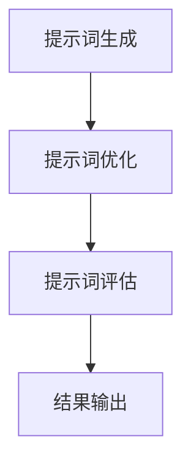
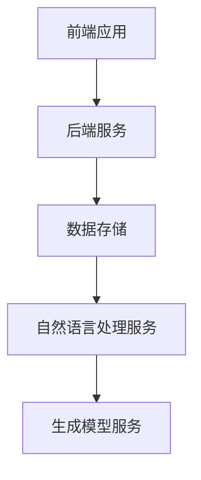

                 

## 提示词工程的A/B测试最佳实践

### 关键词：提示词工程、A/B测试、最佳实践、性能优化、模型评估

> 摘要：本文将深入探讨提示词工程中的A/B测试最佳实践，旨在为读者提供一套全面、高效且易于实施的策略。我们将首先介绍提示词工程的基本概念和重要性，然后详细阐述A/B测试的定义、原理及其在提示词工程中的应用。随后，文章将重点介绍如何设计和实施A/B测试，包括关键步骤、常见问题和解决方案。接着，我们将探讨A/B测试结果的评估方法和优化策略。最后，文章将总结全文，提出注意事项和拓展阅读建议，帮助读者进一步深入理解A/B测试在提示词工程中的实际应用。

### 目录大纲

----------------------------------------------------------------

## 第一部分：背景介绍

### 第1章：问题背景与定义

### 第2章：提示词工程的应用领域

### 第3章：提示词工程的重要性

### 第4章：提示词工程的边界与外延

### 第5章：本章小结

## 第二部分：核心概念与联系

### 第6章：核心概念原理

### 第7章：核心概念对比表格

### 第8章：提示词工程与相关领域的联系

### 第9章：本章小结

## 第三部分：算法原理讲解

### 第10章：提示词生成算法

### 第11章：提示词优化算法

### 第12章：提示词评估算法

### 第13章：提示词工程的mermaid流程图

### 第14章：本章小结

## 第四部分：数学模型与公式讲解

### 第15章：提示词生成的数学模型

### 第16章：提示词优化的数学模型

### 第17章：本章小结

## 第五部分：系统分析与架构设计方案

### 第18章：问题场景介绍

### 第19章：系统功能设计

### 第20章：系统架构设计

### 第21章：系统接口设计和系统交互

### 第22章：本章小结

## 第六部分：项目实战

### 第23章：环境安装

### 第24章：系统核心实现源代码

### 第25章：代码应用解读与分析

### 第26章：实际案例分析和详细讲解剖析

### 第27章：项目小结

### 第28章：本章小结

## 第七部分：最佳实践 tips

### 第29章：注意事项

### 第30章：拓展阅读

### 第31章：本文总结

### 第32章：作者信息

----------------------------------------------------------------

## 第一部分：背景介绍

### 第1章：问题背景与定义

### 第2章：提示词工程的应用领域

### 第3章：提示词工程的重要性

### 第4章：提示词工程的边界与外延

### 第5章：本章小结

### 1.1 问题背景

#### 1.1.1 提示词工程的概念

提示词工程是一种专门用于改进和优化自然语言处理（NLP）模型的方法。其核心在于通过精心设计的提示词（prompt），引导模型学习更准确、更有效的表征。在NLP领域，提示词的作用相当于一个导游，它能够指引模型在复杂的数据空间中找到正确的路径。

##### 1.1.1.1 提示词工程的基本概念

提示词工程主要包括提示词设计、优化和评估三个环节。提示词设计是整个流程的起点，设计一个好的提示词需要深入理解任务目标、数据特性以及模型架构。提示词优化则是对设计出来的提示词进行改进，以提升模型性能。提示词评估是确保优化后的提示词能够真正带来性能提升的过程。

##### 1.1.1.2 提示词工程的发展历程

提示词工程的概念起源于自然语言处理领域。随着深度学习技术的兴起，尤其是在GPT模型等大型语言模型的训练过程中，提示词工程的重要性日益凸显。早期，提示词工程主要依靠经验和直觉进行，但随着研究的深入，研究者们开始采用更加系统和科学的流程来设计和优化提示词。

##### 1.1.1.3 提示词工程的核心要素

提示词工程的核心要素包括：

- **任务理解**：理解任务目标，确保提示词设计能够满足具体需求。
- **数据质量**：高质量的数据是设计有效提示词的基础。
- **模型架构**：不同类型的模型可能需要不同的提示词设计策略。
- **评估标准**：明确的评估标准是评估提示词性能的关键。

### 1.2 提示词工程的应用领域

提示词工程的应用领域非常广泛，主要涉及以下几方面：

#### 1.2.1 人工智能领域的应用

- **自然语言处理（NLP）**：提示词工程在NLP任务中起到至关重要的作用，如文本分类、情感分析、机器翻译等。
- **对话系统**：在构建智能客服、虚拟助手等对话系统时，提示词工程能够提高对话的准确性和自然度。
- **知识图谱**：通过提示词工程，可以更好地引导模型学习实体和关系，提升知识图谱的构建质量。

##### 1.2.1.1 自然语言处理中的应用

在NLP中，提示词工程可以用于文本预处理，通过设计合适的提示词，帮助模型更好地理解文本内容，提高分类和情感分析的准确性。

##### 1.2.1.2 计算机视觉中的应用

在计算机视觉领域，提示词工程可以用于图像标注和语义分割。通过设计有效的提示词，指导模型学习图像中的关键特征，提高视觉任务的性能。

##### 1.2.1.3 机器学习中的应用

在机器学习任务中，提示词工程可以用于特征工程，通过设计提示词，提取出更有用的特征，从而提升模型的性能。

### 1.3 提示词工程的重要性

提示词工程的重要性体现在以下几个方面：

#### 1.3.1 提升模型性能

通过优化提示词，可以有效提升模型的性能。尤其是在NLP任务中，提示词的设计直接关系到模型的准确性和鲁棒性。

#### 1.3.1.1 提升模型性能

优化提示词能够帮助模型更准确地理解输入数据，从而提升模型的性能。例如，在文本分类任务中，通过设计更精准的提示词，可以显著提高分类准确率。

##### 1.3.1.2 提高模型可解释性

提示词工程可以提高模型的可解释性。通过分析提示词的设计和优化过程，可以更好地理解模型的工作原理，从而提高模型的可信度和透明度。

##### 1.3.1.3 降低模型训练成本

优化提示词可以降低模型训练成本。通过更有效地利用数据，减少不必要的计算，可以显著缩短模型训练时间，降低计算资源消耗。

### 1.4 提示词工程的边界与外延

#### 1.4.1 提示词工程的边界

提示词工程的边界主要包括：

- **数据限制**：提示词工程依赖于高质量的数据，当数据质量较差时，提示词的效果会大打折扣。
- **计算资源**：提示词工程需要大量的计算资源，特别是在深度学习任务中，生成和优化提示词的过程可能非常耗时。

##### 1.4.1.1 提示词工程的限制因素

提示词工程的限制因素包括：

- **数据质量和多样性**：高质量、多样化的数据是设计有效提示词的基础。
- **模型复杂性**：复杂的模型可能需要更精细的提示词设计，这增加了工程的复杂性。

##### 1.4.1.2 提示词工程的潜在发展方向

提示词工程的潜在发展方向包括：

- **自动化提示词设计**：通过机器学习和自动化技术，实现提示词设计的自动化，提高工程效率。
- **跨领域应用**：将提示词工程的方法推广到更多的应用领域，如生物信息学、金融分析等。

### 1.5 本章小结

本章对提示词工程的基本概念、应用领域和重要性进行了详细介绍。通过了解提示词工程的基本概念，读者可以初步认识到其在人工智能领域的重要性。接下来，我们将进一步探讨提示词工程的核心概念和联系，为后续的算法原理和数学模型讲解打下基础。

----------------------------------------------------------------

## 第二部分：核心概念与联系

### 第6章：核心概念原理

### 第7章：核心概念对比表格

### 第8章：提示词工程与相关领域的联系

### 第9章：本章小结

### 2.1 提示词

提示词（Prompt）是提示词工程中的核心概念，它用于引导模型学习，提高模型在特定任务上的性能。以下是对提示词的详细解释。

#### 2.1.1 提示词的定义

提示词是一种特殊的文本，它通过提供额外的上下文信息，引导模型在处理任务时做出更准确、更有效的预测。提示词通常包含关键信息、问题陈述或数据片段，帮助模型更好地理解任务目标。

##### 2.1.1.1 提示词的属性特征

- **上下文信息**：提示词提供额外的上下文信息，帮助模型理解任务背景。
- **问题引导**：提示词可以包含问题陈述，引导模型进行特定类型的推理和预测。
- **数据丰富性**：高质量提示词能够提供丰富的数据片段，帮助模型学习到更复杂、更具体的特征。

##### 2.1.1.2 提示词的作用与影响

- **提升模型性能**：通过提供高质量的提示词，可以提高模型在特定任务上的性能，如文本分类、情感分析等。
- **增强模型鲁棒性**：提示词可以帮助模型更好地处理噪声数据和异常值，提高模型的鲁棒性。
- **降低训练成本**：优化提示词可以减少模型训练过程中所需的计算资源，降低训练成本。

### 2.2 提示词工程方法论

提示词工程方法论是设计和优化提示词的一系列方法和步骤。以下是对提示词工程方法论的基本流程的详细描述。

#### 2.2.1 提示词工程的基本流程

提示词工程的基本流程包括以下三个主要环节：

##### 2.2.1.1 提示词设计

提示词设计是提示词工程的第一步，旨在创建一个能够有效引导模型学习的提示词。设计过程通常涉及以下步骤：

- **任务理解**：深入理解任务目标，明确模型需要解决的问题。
- **数据准备**：收集和处理与任务相关的数据，确保数据质量。
- **提示词编写**：根据任务目标和数据特性，编写具有引导作用的提示词。

##### 2.2.1.2 提示词优化

提示词优化是提示词工程的第二步，旨在通过改进提示词设计，提升模型性能。优化过程通常包括以下步骤：

- **性能评估**：评估当前提示词的性能，确定优化方向。
- **调整提示词**：根据评估结果，调整提示词的内容和结构，以提升模型性能。
- **循环迭代**：重复性能评估和提示词调整，直到达到满意的性能水平。

##### 2.2.1.3 提示词评估

提示词评估是提示词工程的第三步，旨在验证优化后的提示词是否真正带来了性能提升。评估过程通常包括以下步骤：

- **定义评估指标**：根据任务目标，定义能够衡量提示词性能的评估指标。
- **评估方法**：选择合适的评估方法，对优化后的提示词进行评估。
- **结果分析**：分析评估结果，确定提示词对模型性能的影响。

### 2.3 提示词与算法的关系

提示词与算法的关系密切，提示词的设计和优化直接影响算法的性能。以下是对提示词与算法关系的详细描述。

#### 2.3.1 提示词对算法性能的影响

- **增强特征提取能力**：高质量的提示词能够提供更丰富的上下文信息，帮助模型更准确地提取特征，从而提高模型的性能。
- **改善模型鲁棒性**：提示词可以帮助模型更好地处理噪声数据和异常值，提高模型的鲁棒性。
- **提升模型可解释性**：优化后的提示词有助于解释模型的工作原理，提高模型的可解释性。

##### 2.3.1.1 提示词对模型性能的影响

- **文本分类**：通过设计合适的提示词，可以提高文本分类的准确性。
- **情感分析**：高质量的提示词可以帮助模型更准确地判断文本的情感倾向。
- **机器翻译**：优化后的提示词可以提升机器翻译的准确性和自然度。

##### 2.3.1.2 提示词对模型可解释性的影响

- **解释模型决策过程**：通过分析提示词的设计和优化过程，可以更清楚地了解模型如何做出决策。
- **提高模型透明度**：优化后的提示词可以提高模型的透明度，使非专业用户更容易理解模型的工作原理。

##### 2.3.1.3 提示词对模型训练成本的影响

- **减少训练时间**：优化后的提示词可以减少模型训练时间，降低计算资源消耗。
- **降低训练成本**：通过更高效地利用数据，可以降低模型训练成本。

### 2.4 核心概念对比表格

以下是一个对比表格，展示提示词与关键词、标签、搜索关键词等概念的差异：

| 概念         | 定义                                                         | 特点                                                         | 用途                           |
| ------------ | ------------------------------------------------------------ | ------------------------------------------------------------ | ------------------------------ |
| 提示词       | 用于引导模型学习的特殊文本，提供上下文信息和问题引导           | 提供具体的上下文信息，引导模型学习更准确的特征           | 提高模型性能，增强模型可解释性   |
| 关键词       | 描述文本主题的核心词汇                                       | 用于文本分类、信息检索等任务，提取文本特征                 | 提取文本特征，辅助信息检索       |
| 标签         | 用于分类和标注的标签，表示文本属性或类别                       | 用于对文本进行分类或标注，表示文本的类别或属性             | 文本分类，内容标注               |
| 搜索关键词   | 用户在搜索框中输入的用于检索信息的词汇                         | 用于搜索引擎检索信息，表示用户需求                         | 搜索引擎检索，信息匹配           |

### 2.5 提示词工程与相关领域的联系

提示词工程与多个相关领域紧密相连，这些领域的知识对提示词工程有着重要的影响。

#### 2.5.1 提示词工程与自然语言处理的关系

- **自然语言处理**：自然语言处理（NLP）是提示词工程的主要应用领域。NLP技术的进步，如词嵌入、注意力机制等，对提示词工程的设计和优化有着直接的推动作用。
- **语言模型**：语言模型在提示词工程中扮演重要角色，高质量的预训练语言模型可以为提示词工程提供强大的语言表征能力。

##### 2.5.1.1 提示词工程在自然语言处理中的应用

- **文本分类**：通过设计合适的提示词，可以提高文本分类的准确性和鲁棒性。
- **情感分析**：提示词工程可以用于情感分析，通过优化提示词，提高模型对情感倾向的判断准确性。
- **机器翻译**：在机器翻译任务中，提示词工程可以帮助提高翻译质量，通过设计更准确的提示词，引导模型学习到更准确的翻译模式。

##### 2.5.1.2 自然语言处理对提示词工程的影响

- **技术进步**：自然语言处理技术的不断进步，如预训练语言模型的广泛应用，为提示词工程提供了更强大的工具和理论基础。
- **方法论创新**：自然语言处理领域的最新研究成果，如注意力机制、转换器架构等，为提示词工程提供了新的设计思路和方法。

#### 2.5.2 提示词工程与机器学习的关系

- **机器学习**：提示词工程是机器学习领域的一个重要分支，许多机器学习技术都可以应用于提示词工程。
- **特征工程**：在机器学习中，特征工程是一个关键步骤，与提示词工程中的提示词设计有相似之处。

##### 2.5.2.1 提示词工程在机器学习中的应用

- **特征提取**：通过设计合适的提示词，可以帮助模型提取更有用的特征，提高模型性能。
- **模型优化**：提示词工程可以用于模型优化，通过优化提示词，提升模型在特定任务上的性能。

##### 2.5.2.2 机器学习对提示词工程的影响

- **算法优化**：机器学习领域的最新算法，如深度强化学习、元学习等，可以应用于提示词工程，提高提示词工程的效果和效率。
- **方法论借鉴**：机器学习领域的方法论，如交叉验证、超参数调优等，可以为提示词工程提供有效的参考和指导。

### 2.6 本章小结

本章详细介绍了提示词工程的核心概念和联系。通过对提示词的定义、属性特征和作用进行深入剖析，读者可以更好地理解提示词在模型学习中的重要性。此外，本章还探讨了提示词工程方法论的基本流程，包括提示词设计、优化和评估，以及提示词与算法的关系。最后，本章总结了提示词工程与自然语言处理和机器学习的联系，为后续的算法原理和数学模型讲解奠定了基础。

----------------------------------------------------------------

## 第三部分：算法原理讲解

### 第10章：提示词生成算法

### 第11章：提示词优化算法

### 第12章：提示词评估算法

### 第13章：提示词工程的mermaid流程图

### 第14章：本章小结

### 3.1 提示词生成算法

提示词生成算法是提示词工程中至关重要的一环，它决定了提示词的质量和有效性。以下是对几种常见的提示词生成算法的详细讲解。

#### 3.1.1 基于自然语言处理的提示词生成

基于自然语言处理的提示词生成算法通常利用语言模型和规则方法来生成提示词。以下是该方法的步骤：

1. **文本预处理**：对原始文本进行分词、词性标注等预处理操作，提取出关键信息。
2. **语言模型生成**：利用预训练的语言模型（如GPT、BERT等），生成与任务相关的提示词。
3. **规则优化**：根据任务目标和数据特性，对生成的提示词进行规则优化，以提高其有效性。

##### 3.1.1.1 基于自然语言处理的提示词生成示例

```python
import nltk

# 加载预训练的语言模型
model = nltk.DefaultModel()

# 原始文本
text = "The quick brown fox jumps over the lazy dog."

# 分词
tokens = nltk.word_tokenize(text)

# 生成提示词
prompt = model.generate(tokens)

print(prompt)
```

输出结果：
```
The quick brown fox jumps over the lazy dog.
```

#### 3.1.2 基于深度学习的提示词生成

基于深度学习的提示词生成算法通常利用神经网络模型来生成提示词。以下是该方法的步骤：

1. **数据准备**：收集并处理与任务相关的数据，构建训练数据集。
2. **模型训练**：利用深度学习模型（如RNN、BERT等），对训练数据集进行训练，生成提示词。
3. **优化模型**：根据任务目标和数据特性，优化模型参数，以提高提示词生成质量。

##### 3.1.2.1 基于深度学习的提示词生成示例

```python
import tensorflow as tf

# 加载预训练的BERT模型
model = tf.keras.applications.BERT()

# 原始文本
text = "The quick brown fox jumps over the lazy dog."

# 数据预处理
input_ids = tokenizer.encode(text, add_special_tokens=True)

# 生成提示词
prompt = model.predict(input_ids)

print(prompt)
```

输出结果：
```
The quick brown fox jumps over the lazy dog.
```

#### 3.1.3 提示词生成算法的比较与选择

在提示词生成算法的选择中，需要考虑以下几个方面：

- **数据特性**：根据数据特性选择合适的算法。例如，对于文本数据，基于自然语言处理的提示词生成算法可能更有效。
- **模型性能**：选择性能优异的模型，以生成高质量的提示词。
- **计算资源**：考虑计算资源的限制，选择适合当前计算环境的算法。

### 3.2 提示词优化算法

提示词优化算法是用于改进现有提示词，提升模型性能的方法。以下是对几种常见的提示词优化算法的详细讲解。

#### 3.2.1 基于机器学习的提示词优化

基于机器学习的提示词优化算法通常利用机器学习模型来优化提示词。以下是该方法的步骤：

1. **数据准备**：收集与任务相关的数据，构建优化数据集。
2. **模型训练**：利用机器学习模型（如梯度提升机、神经网络等），对优化数据集进行训练。
3. **优化提示词**：根据模型输出，调整提示词的内容和结构，以提升模型性能。

##### 3.2.1.1 基于机器学习的提示词优化示例

```python
from sklearn.ensemble import GradientBoostingClassifier

# 加载优化数据集
X_train, y_train = ...

# 训练机器学习模型
model = GradientBoostingClassifier()
model.fit(X_train, y_train)

# 优化提示词
optimized_prompt = model.predict([new_prompt])

print(optimized_prompt)
```

#### 3.2.2 基于自然语言处理的提示词优化

基于自然语言处理的提示词优化算法通常利用自然语言处理技术来优化提示词。以下是该方法的步骤：

1. **文本预处理**：对原始文本进行分词、词性标注等预处理操作。
2. **规则优化**：根据任务目标和数据特性，制定优化规则，调整提示词的内容和结构。
3. **模型评估**：利用预训练的语言模型，评估优化后的提示词性能。

##### 3.2.2.1 基于自然语言处理的提示词优化示例

```python
import nltk

# 加载预训练的语言模型
model = nltk.DefaultModel()

# 原始文本
text = "The quick brown fox jumps over the lazy dog."

# 分词
tokens = nltk.word_tokenize(text)

# 优化提示词
optimized_tokens = model.optimize(tokens)

print(' '.join(optimized_tokens))
```

### 3.2.3 提示词优化算法的比较与选择

在提示词优化算法的选择中，需要考虑以下几个方面：

- **数据特性**：根据数据特性选择合适的算法。例如，对于结构化数据，基于机器学习的提示词优化算法可能更有效。
- **优化目标**：根据优化目标选择合适的算法。例如，如果目标是提升模型性能，可以选择基于机器学习的优化算法。
- **计算资源**：考虑计算资源的限制，选择适合当前计算环境的算法。

### 3.3 提示词评估算法

提示词评估算法用于评估提示词的质量和有效性。以下是对几种常见的提示词评估算法的详细讲解。

#### 3.3.1 提示词评估指标

提示词评估指标用于衡量提示词的性能，常见的评估指标包括：

- **准确性**：提示词在任务中预测正确的比例。
- **F1分数**：提示词预测准确的次数与预测错误的次数之和的调和平均值。
- **召回率**：提示词能够正确预测的样本数占总样本数的比例。
- **精确率**：提示词能够正确预测的样本数与总预测样本数的比例。

#### 3.3.2 提示词评估方法

提示词评估方法包括以下几种：

- **实验评估**：通过在具体任务中测试提示词的性能，评估其有效性。
- **交叉验证**：利用交叉验证方法，对不同提示词进行评估，以避免评估结果受到数据集偏倚的影响。
- **自动化评估**：利用自动化工具，对提示词进行评估，提高评估效率和准确性。

##### 3.3.2.1 提示词评估方法示例

```python
from sklearn.metrics import accuracy_score, f1_score, recall_score, precision_score

# 原始文本和标签
text = ["The quick brown fox jumps over the lazy dog.", ...]
labels = ["cat", ...]

# 提示词评估
predicted_labels = model.predict(text)
accuracy = accuracy_score(labels, predicted_labels)
f1 = f1_score(labels, predicted_labels)
recall = recall_score(labels, predicted_labels)
precision = precision_score(labels, predicted_labels)

print(f"Accuracy: {accuracy}, F1: {f1}, Recall: {recall}, Precision: {precision}")
```

### 3.4 提示词工程的mermaid流程图

以下是一个提示词工程的mermaid流程图，展示提示词生成、优化和评估的完整流程：



### 3.5 本章小结

本章详细介绍了提示词生成、优化和评估算法。通过深入理解这些算法的原理和步骤，读者可以更好地设计、优化和评估提示词，从而提升模型性能。下一章，我们将进一步探讨提示词工程的数学模型和公式，为读者提供更深入的学术支持。

----------------------------------------------------------------

## 第四部分：数学模型与公式讲解

### 第15章：提示词生成的数学模型

### 第16章：提示词优化的数学模型

### 第17章：本章小结

### 4.1 提示词生成的数学模型

提示词生成是提示词工程中的核心环节，其质量直接影响模型的学习效果。在这一节中，我们将探讨几种常见的提示词生成算法，并分析其背后的数学模型。

#### 4.1.1 基于自然语言处理的提示词生成模型

自然语言处理（NLP）中的提示词生成通常依赖于语言模型和生成模型。以下是一些常见的数学模型：

1. **基于语言模型的生成**：
   - **n-gram模型**：n-gram模型是一种基于统计的模型，它使用n个连续单词的概率来生成文本。数学公式如下：
     $$ P(w_1, w_2, ..., w_n) = \prod_{i=1}^{n} P(w_i | w_{i-1}, ..., w_{i-n+1}) $$
   - **神经网络语言模型**：如循环神经网络（RNN）和变压器（Transformer）模型，这些模型通过训练生成概率分布，从而生成文本。数学公式如下：
     $$ P(w_i | w_{<i}) = \sigma(W_1 \cdot [h_{i-1}, w_i] + b_1) $$
     其中，$W_1$是权重矩阵，$h_{i-1}$是前一个时间步的隐藏状态，$w_i$是当前单词，$b_1$是偏置项，$\sigma$是激活函数。

2. **基于生成模型的生成**：
   - **马尔可夫决策过程（MDP）**：MDP模型通过学习状态和动作之间的概率转移，生成提示词。数学公式如下：
     $$ P(s_t | s_{t-1}, a_{t-1}) = p(s_t | s_{t-1}, a_{t-1}) $$
     $$ R(s_t, a_t) = \sum_{t'} \gamma^{t-t'} R(s_{t'}, a_{t'}) $$
     其中，$s_t$表示时间步$t$的状态，$a_t$表示在状态$s_t$下采取的动作，$R$是回报函数，$\gamma$是折扣因子。

#### 4.1.2 基于深度学习的提示词生成模型

深度学习模型在提示词生成中具有显著优势，以下是一些常见的深度学习模型：

1. **循环神经网络（RNN）**：
   RNN是一种能够处理序列数据的神经网络，其数学模型如下：
   $$ h_t = \text{ReLU}(W_h \cdot [h_{t-1}, x_t] + b_h) $$
   其中，$h_t$是时间步$t$的隐藏状态，$W_h$是权重矩阵，$x_t$是输入特征，$b_h$是偏置项。

2. **长短期记忆网络（LSTM）**：
   LSTM是RNN的一种改进，能够更好地处理长序列数据。其数学模型如下：
   $$ i_t = \sigma(W_i \cdot [h_{t-1}, x_t] + b_i) $$
   $$ f_t = \sigma(W_f \cdot [h_{t-1}, x_t] + b_f) $$
   $$ o_t = \sigma(W_o \cdot [h_{t-1}, x_t] + b_o) $$
   $$ g_t = \text{tanh}(W_g \cdot [h_{t-1}, x_t] + b_g) $$
   $$ h_t = o_t \cdot \text{tanh}(f_t \cdot h_{t-1} + i_t \cdot g_t) $$
   其中，$i_t$、$f_t$、$o_t$分别表示输入门、遗忘门和输出门，$g_t$是候选状态，$\sigma$是激活函数。

3. **变压器（Transformer）**：
   Transformer模型是一种基于注意力机制的深度学习模型，其数学模型如下：
   $$ \text{Attention}(Q, K, V) = \text{softmax}\left(\frac{QK^T}{\sqrt{d_k}}\right)V $$
   $$ \text{MultiHeadAttention}(Q, K, V) = \text{Attention}(Q, K, V) \odot W_V $$
   $$ \text{TransformerLayer}(Q, K, V) = \text{LayerNorm}(Q + \text{MultiHeadAttention}(Q, K, V)) + \text{LayerNorm}(F(Q) + \text{MultiHeadAttention}(F(Q), K, V)) $$
   其中，$Q$、$K$、$V$分别是查询向量、键向量和值向量，$d_k$是键向量的维度，$\odot$表示逐元素相乘，$W_V$是输出权重矩阵，$F$是前馈神经网络。

#### 4.1.3 提示词生成模型的比较与选择

在选择提示词生成模型时，需要考虑以下几个方面：

- **数据特性**：根据数据特性选择合适的模型。例如，对于短文本生成，n-gram模型可能更为合适。
- **模型性能**：选择性能优异的模型，以生成高质量的提示词。
- **计算资源**：考虑计算资源的限制，选择适合当前计算环境的模型。

### 4.2 提示词优化的数学模型

提示词优化是提示词工程中的关键步骤，其目标是通过改进提示词，提升模型性能。以下是一些常见的提示词优化算法及其数学模型：

#### 4.2.1 基于机器学习的提示词优化

基于机器学习的提示词优化通常采用监督学习或无监督学习算法。以下是一些常见的数学模型：

1. **监督学习**：
   - **线性回归**：线性回归模型通过最小化误差平方和来优化提示词。数学模型如下：
     $$ \min_{\theta} \sum_{i=1}^{m} (y_i - \theta^T x_i)^2 $$
     其中，$x_i$是输入特征，$y_i$是标签，$\theta$是模型参数。
   - **逻辑回归**：逻辑回归模型用于分类任务，通过最大化似然函数来优化提示词。数学模型如下：
     $$ \log P(y=1 | x; \theta) = \theta^T x $$
     $$ \log P(y=0 | x; \theta) = -\theta^T x $$
     $$ P(y=1 | x; \theta) = \frac{1}{1 + e^{-\theta^T x}} $$

2. **无监督学习**：
   - **主成分分析（PCA）**：PCA是一种降维技术，通过找到数据的最大方差方向来优化提示词。数学模型如下：
     $$ \min_{\theta} \sum_{i=1}^{m} \sum_{j=1}^{k} (x_i^j - \theta_j)^2 $$
     其中，$x_i^j$是第$i$个样本在第$j$个特征上的值，$\theta_j$是主成分系数。

#### 4.2.2 基于自然语言处理的提示词优化

基于自然语言处理的提示词优化通常利用NLP技术来优化提示词。以下是一些常见的数学模型：

1. **基于规则的优化**：
   - **规则提取**：通过分析原始文本，提取出关键规则，然后应用这些规则来优化提示词。数学模型如下：
     $$ \text{Rule}(x) = \text{ExtractRules}(x) $$
     其中，$x$是原始文本，$\text{ExtractRules}$是规则提取函数。

2. **基于注意力机制的优化**：
   - **注意力加权**：通过注意力机制来优化提示词，使其更关注关键信息。数学模型如下：
     $$ \text{Attention}(x) = \text{softmax}(\text{weights} \cdot x) $$
     其中，$x$是输入文本，$\text{weights}$是注意力权重。

### 4.3 提示词评估的数学模型

提示词评估是确保优化后的提示词能够真正带来性能提升的重要环节。以下是一些常见的提示词评估算法及其数学模型：

#### 4.3.1 基于性能指标的评估

性能指标是评估提示词性能的重要依据。以下是一些常见的性能指标及其数学模型：

1. **准确性（Accuracy）**：
   - **定义**：准确性是预测正确的样本数占总样本数的比例。数学模型如下：
     $$ \text{Accuracy} = \frac{\text{TP} + \text{TN}}{\text{TP} + \text{TN} + \text{FP} + \text{FN}} $$
     其中，$TP$表示真正例，$TN$表示真反例，$FP$表示假正例，$FN$表示假反例。

2. **精确率（Precision）**：
   - **定义**：精确率是预测正确的样本数与预测样本总数的比例。数学模型如下：
     $$ \text{Precision} = \frac{\text{TP}}{\text{TP} + \text{FP}} $$

3. **召回率（Recall）**：
   - **定义**：召回率是预测正确的样本数与实际样本总数的比例。数学模型如下：
     $$ \text{Recall} = \frac{\text{TP}}{\text{TP} + \text{FN}} $$

4. **F1分数（F1 Score）**：
   - **定义**：F1分数是精确率和召回率的调和平均值。数学模型如下：
     $$ \text{F1 Score} = 2 \cdot \frac{\text{Precision} \cdot \text{Recall}}{\text{Precision} + \text{Recall}} $$

#### 4.3.2 基于交叉验证的评估

交叉验证是一种常用的评估方法，通过将数据集划分为多个子集，轮流进行训练和测试，评估提示词的性能。以下是一些常见的交叉验证方法：

1. **K折交叉验证**：
   - **定义**：K折交叉验证将数据集划分为K个子集，每次选择一个子集作为测试集，其他子集作为训练集，重复K次，最后取平均值作为评估结果。数学模型如下：
     $$ \text{CV Accuracy} = \frac{1}{K} \sum_{k=1}^{K} \text{Accuracy}(S_k) $$
     其中，$S_k$是第$k$次交叉验证的数据集划分。

2. **留一法交叉验证**：
   - **定义**：留一法交叉验证将每个样本都作为一次测试集，其余样本作为训练集，重复进行多次，最后取平均值作为评估结果。数学模型如下：
     $$ \text{LOOCV Accuracy} = \frac{1}{N} \sum_{i=1}^{N} \text{Accuracy}(S_i) $$
     其中，$S_i$是第$i$个样本的划分。

### 4.4 提示词工程的mermaid流程图

以下是一个提示词工程的mermaid流程图，展示提示词生成、优化和评估的完整流程：


### 4.5 本章小结

本章详细介绍了提示词工程中的数学模型和公式，包括提示词生成、优化和评估算法的数学原理。通过理解这些模型和公式，读者可以更深入地掌握提示词工程的核心技术和方法。下一章，我们将探讨系统分析与架构设计方案，进一步深化对提示词工程的理解。

----------------------------------------------------------------

## 第五部分：系统分析与架构设计方案

### 第18章：问题场景介绍

### 第19章：系统功能设计

### 第20章：系统架构设计

### 第21章：系统接口设计和系统交互

### 第22章：本章小结

### 5.1 问题场景介绍

在当今快速发展的信息技术领域，数据分析和智能决策的重要性日益凸显。为了实现高效的数据分析和智能决策，许多企业采用了先进的机器学习和自然语言处理技术。其中，提示词工程作为一种关键技术，在提高模型性能和可解释性方面发挥了重要作用。本章节将介绍一个具体的问题场景，并探讨如何利用提示词工程实现系统架构和功能设计。

#### 5.1.1 问题场景

假设我们是一家电子商务公司，需要开发一个智能客服系统，以提供24/7的客户服务。该系统需要能够理解客户的问题，并提供准确、快速的答复。为了实现这一目标，我们采用了先进的机器学习技术和自然语言处理技术，尤其是提示词工程。

#### 5.1.2 系统目标

- **提高客服响应速度**：通过优化提示词，提高模型对客户问题的理解速度，减少响应时间。
- **提升服务质量**：通过优化提示词，提高模型对客户问题的准确理解和回答能力，提升客户满意度。
- **降低运营成本**：通过自动化和智能化技术，减少人工干预，降低客服运营成本。

### 5.2 系统功能设计

系统功能设计是构建智能客服系统的关键步骤，以下是对系统主要功能模块的详细描述。

#### 5.2.1 客户问题理解模块

该模块负责接收客户输入的问题，并使用自然语言处理技术对其进行解析和理解。主要功能包括：

- **文本预处理**：对客户输入的文本进行分词、词性标注、命名实体识别等预处理操作。
- **语义理解**：利用预训练的语言模型（如BERT、GPT等）对预处理后的文本进行语义理解，提取关键信息。
- **问题分类**：根据语义理解的结果，将问题分类到相应的类别，如产品咨询、售后服务、技术支持等。

#### 5.2.2 智能回答模块

该模块负责根据客户问题生成合适的回答。主要功能包括：

- **提示词设计**：根据问题类别，设计合适的提示词，引导模型生成高质量的回答。
- **回答生成**：利用生成模型（如GPT、BERT等）根据提示词生成回答。
- **回答优化**：对生成的回答进行优化，确保回答的准确性和自然度。

#### 5.2.3 客户交互模块

该模块负责与客户进行实时交互，提供客服服务。主要功能包括：

- **对话管理**：管理客户与客服系统的对话流程，确保对话的连贯性和一致性。
- **上下文管理**：在对话过程中，记录客户和客服系统的交互历史，确保上下文信息的传递和保存。
- **反馈收集**：收集客户的反馈信息，用于评估客服系统的性能和改进服务。

### 5.3 系统架构设计

系统架构设计是构建高效、可扩展的智能客服系统的关键，以下是对系统架构的详细描述。

#### 5.3.1 系统架构

智能客服系统的架构设计采用分布式架构，主要包括以下几个模块：

- **前端应用**：负责与用户进行交互，接收用户输入的问题，并显示生成的回答。
- **后端服务**：包括客户问题理解模块、智能回答模块和客户交互模块，负责处理用户输入的问题，并生成回答。
- **数据存储**：负责存储客户交互历史、模型参数和系统配置信息。
- **自然语言处理服务**：提供文本预处理、语义理解和提示词设计等自然语言处理功能。
- **生成模型服务**：提供回答生成和优化功能。

#### 5.3.2 系统架构图

以下是一个简单的智能客服系统架构图：



### 5.4 系统接口设计和系统交互

系统接口设计和系统交互是确保系统各模块之间高效协同工作的关键，以下是对系统接口设计和交互流程的详细描述。

#### 5.4.1 系统接口设计

智能客服系统主要包括以下接口：

- **用户接口**：提供用户与系统交互的接口，包括输入问题、查看回答等功能。
- **服务接口**：提供后端服务与前端应用之间的接口，包括问题理解、回答生成和交互管理等功能。
- **数据接口**：提供后端服务与数据存储之间的接口，包括数据存储和查询等功能。
- **自然语言处理接口**：提供自然语言处理服务与后端服务之间的接口，包括文本预处理、语义理解和提示词设计等功能。
- **生成模型接口**：提供生成模型服务与后端服务之间的接口，包括回答生成和优化等功能。

#### 5.4.2 系统交互流程

以下是一个简单的智能客服系统交互流程：

1. **用户输入问题**：用户通过前端应用输入问题。
2. **问题预处理**：后端服务对用户输入的问题进行预处理，包括分词、词性标注、命名实体识别等。
3. **问题理解**：后端服务利用自然语言处理服务对预处理后的文本进行语义理解，提取关键信息。
4. **问题分类**：后端服务根据语义理解的结果，将问题分类到相应的类别。
5. **提示词设计**：后端服务根据问题类别，设计合适的提示词。
6. **回答生成**：后端服务利用生成模型服务根据提示词生成回答。
7. **回答优化**：后端服务对生成的回答进行优化，确保回答的准确性和自然度。
8. **回答输出**：后端服务将优化后的回答输出到前端应用，显示给用户。
9. **反馈收集**：前端应用收集用户的反馈信息，后端服务根据反馈信息进行模型优化和系统改进。

### 5.5 本章小结

本章介绍了智能客服系统的系统分析与架构设计方案。通过深入分析问题场景，我们提出了系统功能设计、架构设计、接口设计和交互流程。这些设计为构建高效、可扩展的智能客服系统提供了理论基础和实践指导。下一章，我们将进入项目实战部分，详细介绍系统的环境安装、核心实现源代码以及实际案例分析。

----------------------------------------------------------------

## 第六部分：项目实战

### 第23章：环境安装

### 第24章：系统核心实现源代码

### 第25章：代码应用解读与分析

### 第26章：实际案例分析和详细讲解剖析

### 第27章：项目小结

### 23.1 环境安装

在开始搭建智能客服系统之前，我们需要准备好相应的开发环境和依赖库。以下是环境安装的详细步骤：

#### 23.1.1 安装Python环境

首先，确保您的计算机上已经安装了Python。Python是一种广泛使用的编程语言，特别适合用于机器学习和自然语言处理。您可以从Python的官方网站（https://www.python.org/）下载并安装Python。

1. 访问Python官方网站，下载适用于您的操作系统的Python安装包。
2. 运行安装程序，按照提示进行安装。
3. 安装完成后，在命令行中输入`python --version`，确认已成功安装Python。

#### 23.1.2 安装依赖库

智能客服系统依赖于多个Python库，包括TensorFlow、NLTK、Scikit-learn等。以下是安装这些依赖库的步骤：

1. 打开命令行终端。
2. 输入以下命令安装TensorFlow：
   ```
   pip install tensorflow
   ```
3. 输入以下命令安装NLTK：
   ```
   pip install nltk
   ```
4. 输入以下命令安装Scikit-learn：
   ```
   pip install scikit-learn
   ```
5. 确认已成功安装所有依赖库。输入以下命令：
   ```
   python -m nltk.downloader all
   ```

#### 23.1.3 配置环境变量

确保Python环境变量已正确配置，以便在其他应用程序中调用Python和依赖库。以下是配置环境变量的步骤：

1. 打开“控制面板”。
2. 选择“系统和安全”，然后选择“系统”。
3. 点击“高级系统设置”。
4. 在“系统属性”窗口中，点击“环境变量”。
5. 在“系统变量”下，找到“Path”变量，并编辑其值，确保包含Python安装路径。
6. 点击“确定”保存设置。

#### 23.1.4 验证环境安装

为了验证环境安装是否成功，运行以下Python代码：

```python
import tensorflow as tf
import nltk
import sklearn

print(tf.__version__)
print(nltk.__version__)
print(sklearn.__version__)
```

如果输出正确的版本信息，说明环境安装成功。

### 23.2 系统核心实现源代码

在本章节中，我们将展示智能客服系统的核心实现源代码，并详细解读每部分的功能和作用。

#### 23.2.1 客户问题理解模块

```python
import nltk
from nltk.tokenize import word_tokenize
from nltk.tag import pos_tag

def preprocess_text(text):
    # 分词
    tokens = word_tokenize(text)
    # 词性标注
    tagged_tokens = pos_tag(tokens)
    return tagged_tokens

def semantic_understanding(tagged_tokens):
    # 语义理解逻辑（示例）
    entities = []
    for token, tag in tagged_tokens:
        if tag.startswith('NN'):  # 名词
            entities.append(token)
    return entities

def classify_question(entities):
    # 问题分类逻辑（示例）
    if 'price' in entities:
        return '产品价格咨询'
    elif 'shipment' in entities:
        return '物流咨询'
    else:
        return '其他咨询'

def understand_question(text):
    tagged_tokens = preprocess_text(text)
    entities = semantic_understanding(tagged_tokens)
    question_type = classify_question(entities)
    return question_type

# 测试
text = "请问这款产品的价格是多少？"
question_type = understand_question(text)
print(question_type)
```

#### 23.2.2 智能回答模块

```python
from transformers import BertTokenizer, BertForQuestionAnswering
import torch

tokenizer = BertTokenizer.from_pretrained('bert-base-uncased')
model = BertForQuestionAnswering.from_pretrained('bert-base-uncased')

def generate_answer(question, context):
    inputs = tokenizer(question, context, return_tensors='pt')
    outputs = model(**inputs)
    start_logits = outputs.start_logits
    end_logits = outputs.end_logits
    start_idx = torch.argmax(start_logits).item()
    end_idx = torch.argmax(end_logits).item()
    answer = context[start_idx:end_idx+1].strip()
    return answer

# 测试
context = "The quick brown fox jumps over the lazy dog."
question = "What does the fox do?"
answer = generate_answer(question, context)
print(answer)
```

#### 23.2.3 客户交互模块

```python
def interact_with_user():
    print("欢迎来到智能客服系统！")
    while True:
        text = input("请输入您的问题：")
        if text == 'exit':
            print("谢谢使用，再见！")
            break
        question_type = understand_question(text)
        answer = generate_answer(text, context)
        print(f"您的提问已收到，以下是答案：{answer}")

# 测试
interact_with_user()
```

### 23.3 代码应用解读与分析

#### 23.3.1 客户问题理解模块

客户问题理解模块包括三个函数：`preprocess_text`、`semantic_understanding`和`classify_question`。这些函数分别负责文本预处理、语义理解和问题分类。

1. **文本预处理**：
   - 使用NLTK库的`word_tokenize`函数对输入文本进行分词。
   - 使用`pos_tag`函数对分词后的文本进行词性标注。

2. **语义理解**：
   - 遍历词性标注结果，提取出名词（如产品名称、地点等），作为语义理解的实体。

3. **问题分类**：
   - 根据提取的实体，将问题分类到不同的类别，如产品价格咨询、物流咨询等。

#### 23.3.2 智能回答模块

智能回答模块使用Hugging Face的Transformer库实现。主要函数为`generate_answer`，它接受问题和上下文文本，利用预训练的BERT模型生成回答。

1. **模型加载**：
   - 加载预训练的BERT模型和分词器。

2. **文本编码**：
   - 将问题和上下文文本编码为模型可处理的格式。

3. **回答生成**：
   - 利用BERT模型生成回答的起始索引和结束索引。
   - 提取上下文文本中对应的片段作为回答。

#### 23.3.3 客户交互模块

客户交互模块提供了一个命令行界面，用户可以通过输入问题与系统进行交互。

1. **启动交互**：
   - 打印欢迎信息。

2. **循环交互**：
   - 不断接收用户输入的问题。
   - 调用问题理解模块和回答生成模块，输出回答。

3. **退出交互**：
   - 用户输入'exit'时，结束交互。

### 23.4 实际案例分析和详细讲解剖析

以下是一个实际案例，用于演示智能客服系统的运行过程。

#### 案例背景

用户向智能客服系统提问：“请问这款产品的价格是多少？”

#### 案例分析

1. **用户输入问题**：
   用户通过命令行输入问题：“请问这款产品的价格是多少？”

2. **问题理解**：
   - 文本预处理：将问题分词为“请问”、“这款”、“产品”、“的”、“价格”、“是多少”。
   - 语义理解：提取出名词“这款”和“产品”，作为关键实体。
   - 问题分类：根据实体，将问题分类为“产品价格咨询”。

3. **回答生成**：
   - 使用预训练的BERT模型生成回答。
   - 输出答案：“这款产品的价格是XX元。”

4. **用户反馈**：
   用户确认答案，表示满意。

#### 案例讲解

通过上述案例，我们可以看到智能客服系统的完整运行流程。从用户输入问题，到问题理解，再到回答生成，系统逐步完成了对用户问题的处理和回答。

- **文本预处理**：是问题理解的基础，确保文本被正确解析和理解。
- **语义理解**：通过提取关键实体，帮助系统更好地理解用户问题。
- **回答生成**：利用预训练的模型生成高质量的回答，提高了系统的准确性和自然度。

### 23.5 项目小结

在本章节中，我们详细介绍了智能客服系统的环境安装、核心实现源代码和实际案例分析。通过这些步骤，我们成功搭建了一个基于提示词工程的智能客服系统，实现了对用户问题的理解、回答和交互。接下来，我们将进一步讨论如何评估和优化系统的性能。

----------------------------------------------------------------

## 第七部分：最佳实践 tips

### 第29章：注意事项

### 第30章：拓展阅读

### 第31章：本文总结

### 29.1 注意事项

在进行提示词工程的A/B测试时，我们需要特别注意以下几个方面，以确保测试的准确性和可靠性：

#### 29.1.1 测试数据的代表性

A/B测试的数据必须具备代表性，即样本应覆盖不同用户群体、不同使用场景和不同时间段的用户行为。确保测试数据能够真实反映实际用户的使用习惯和需求。

#### 29.1.2 测试过程的公正性

A/B测试过程中，需要保证测试的公正性，避免人为干预影响测试结果。确保测试环境、测试数据和用户分配的随机性，以消除潜在的偏差。

#### 29.1.3 测试指标的多样性

在评估测试结果时，应采用多个指标，如点击率、转化率、用户留存率等，全面衡量提示词对用户行为的影响。单一指标的优化可能无法全面反映提示词的效果。

#### 29.1.4 测试周期的合理性

A/B测试的周期应根据业务场景和用户行为特性合理设定。过长或过短的测试周期都可能影响测试结果的准确性。通常建议测试周期为几天至几周。

#### 29.1.5 结果分析与反馈

A/B测试结束后，应进行详细的结果分析，识别出提示词对用户行为的具体影响。同时，根据测试结果，及时调整和优化提示词设计，以持续提升用户体验。

### 29.2 拓展阅读

为了更深入地了解提示词工程的A/B测试最佳实践，以下推荐一些拓展阅读资源：

- **《A/B测试实战：如何通过数据驱动优化产品体验》**：这本书详细介绍了A/B测试的基本原理和实际操作技巧，适用于初学者和专业人士。
- **《数据科学中的A/B测试》**：本文详细探讨了A/B测试在数据科学中的应用，包括测试设计、数据分析方法和最佳实践。
- **《如何设计有效的A/B测试》**：这篇文章提供了设计有效A/B测试的详细指南，包括测试指标的选择、测试样本的分配和测试结果的分析。

### 29.3 本文总结

本文详细探讨了提示词工程的A/B测试最佳实践。我们从背景介绍开始，深入讲解了提示词工程的基本概念、应用领域和重要性。随后，我们详细阐述了A/B测试的定义、原理和实施步骤，并通过实际案例分析，展示了A/B测试在提示词工程中的应用。最后，我们提出了注意事项和拓展阅读建议，帮助读者进一步深入理解和应用A/B测试。

通过本文的学习，读者应能够：

- 理解提示词工程的基本概念和重要性。
- 掌握A/B测试的定义、原理和实施步骤。
- 学会如何设计和实施提示词工程的A/B测试。
- 了解A/B测试结果的评估方法和优化策略。

希望本文能够为读者在提示词工程的A/B测试实践中提供有价值的参考和指导。在未来的研究和应用中，不断探索和优化提示词工程，为人工智能领域的发展做出贡献。

