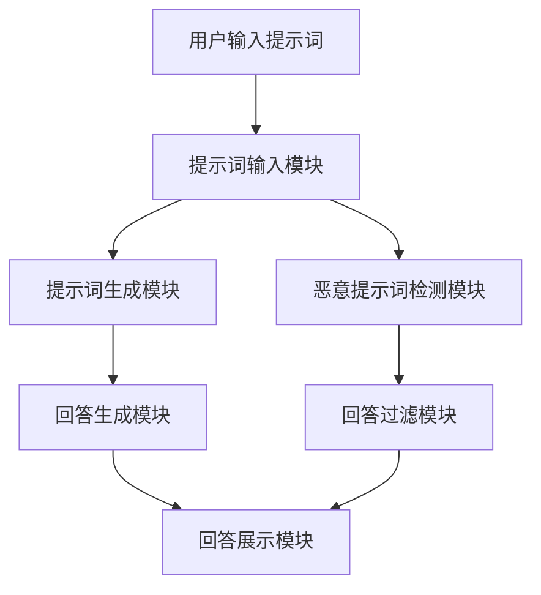

                 

# 提示词工程的安全性与攻击防御

## 关键词
- 提示词工程
- 安全性
- 攻击防御
- 文本生成
- 鲁棒性
- 恶意攻击

> 摘要：本文深入探讨了提示词工程的安全性问题，从问题背景、核心概念、算法原理到实际应用，详细分析了提示词工程面临的恶意攻击及其防御策略，旨在为相关领域的研究和应用提供有益的参考。

## Step 1: 开篇背景介绍

### 1.1 问题背景
随着互联网的迅猛发展和信息技术的持续进步，网络安全问题日益凸显。网络攻击手段不断翻新，从传统的病毒、木马到现代的DDoS攻击、SQL注入等，各种攻击方式层出不穷。在此背景下，如何保障系统的安全性和可靠性成为亟待解决的问题。

### 1.2 问题描述
提示词工程是一种基于人工智能技术的文本生成方法，通过输入提示词生成相应的文本。这种方法广泛应用于搜索引擎优化、文本生成、智能客服等领域。然而，提示词工程在应用中也面临着一系列安全问题，主要包括恶意提示词攻击、隐私泄露、生成文本的准确性等问题。

### 1.3 问题解决
为了解决提示词工程中的安全问题，需要从攻击者角度出发，研究攻击防御策略。同时，还需要对生成文本的准确性进行优化，提高系统的鲁棒性和安全性。

### 1.4 边界与外延
提示词工程的安全性与攻击防御的研究不仅涉及到计算机科学领域，还涉及到人工智能、网络安全等多个领域。研究的边界包括攻击方法、防御策略、生成文本的准确性等方面。其外延则包括各种实际应用场景，如搜索引擎优化、文本生成、智能客服等。

### 1.5 概念结构与核心要素组成
提示词工程的安全性研究包括以下几个核心要素：
1. **提示词**：输入的提示信息，影响生成文本的内容和风格。
2. **攻击方法**：恶意提示词、隐私泄露攻击等。
3. **防御策略**：针对不同攻击方法设计的防御措施。
4. **生成文本的准确性**：保证生成文本的准确性和可读性。

## Step 2: 核心概念与联系

### 2.1 核心概念原理

#### 2.1.1 提示词
提示词是输入到提示词工程系统中的关键词或短语，用于指导生成文本的内容和风格。

#### 2.1.2 攻击方法
攻击方法是指攻击者利用提示词工程系统中的漏洞，对系统进行攻击的手段。常见的攻击方法包括恶意提示词攻击、隐私泄露攻击等。

#### 2.1.3 防御策略
防御策略是指针对不同攻击方法，设计出的防止攻击的措施。防御策略包括检测和阻止恶意提示词、保护用户隐私等。

#### 2.1.4 生成文本的准确性
生成文本的准确性是指生成的文本在内容和形式上与原始提示词的匹配程度。高准确性的生成文本能够提高系统的可靠性和用户体验。

### 2.2 概念属性特征对比表格

| 概念       | 属性特征                                                     |
| ---------- | ------------------------------------------------------------ |
| 提示词     | - 长度：提示词的长度会影响生成文本的内容和风格。 |
| 攻击方法   | - 恶意提示词：通过构造恶意提示词，改变生成文本的内容。 |
| 防御策略   | - 防止恶意提示词：通过识别和过滤恶意提示词，保护系统免受攻击。 |
| 生成文本的准确性 | - 准确性：生成文本与提示词的匹配程度。         |

### 2.3 ER实体关系图架构

```mermaid
erDiagram
    A[提示词] ||--|{ B[攻击方法] } |
    A ||--|{ C[防御策略] } |
    A ||--|{ D[生成文本的准确性] } |
```

## Step 3: 算法原理讲解

### 3.1 提示词生成算法

提示词生成算法是一种基于统计模型的文本生成方法，其基本原理如下：

1. **统计模型**：使用大量训练数据，训练出一个统计模型，用于预测下一个单词或词组。
2. **提示词输入**：将提示词输入到统计模型中，模型根据提示词生成一系列可能的文本序列。
3. **文本生成**：根据生成的序列，选择一个最合适的文本序列作为输出。

#### 3.1.1 统计模型

统计模型通常采用神经网络模型，如LSTM（长短期记忆网络）或GRU（门控循环单元）。这些模型可以捕捉到文本中的长期依赖关系，提高生成文本的质量。

#### 3.1.2 提示词输入

提示词输入是生成算法的关键。提示词的长度、选择和顺序都会影响生成文本的质量。一般来说，较短的提示词更容易生成高质量的文本。

#### 3.1.3 文本生成

文本生成过程是一个概率过程。模型会根据提示词和已生成的文本，计算下一个单词或词组的概率分布，然后从概率分布中选择一个最可能的单词或词组作为输出。

#### 3.1.4 示例

假设提示词为“人工智能”，模型生成的文本序列如下：

1. 人工智能是计算机科学的一个分支。
2. 人工智能的目标是使计算机具有智能行为。
3. 人工智能在现代社会中发挥着重要作用。

在这些生成的文本中，第一条文本最符合提示词“人工智能”的含义。

### 3.2 攻击防御算法

攻击防御算法旨在检测和阻止恶意提示词攻击，确保生成文本的准确性和安全性。以下是一种常见的攻击防御算法：

#### 3.2.1 恶意提示词检测

恶意提示词检测是攻击防御算法的第一步。通过对输入的提示词进行特征提取和模式识别，可以识别出潜在的恶意提示词。

- **特征提取**：提取提示词的长度、词频、语法结构等特征。
- **模式识别**：使用机器学习算法，如支持向量机（SVM）或随机森林（Random Forest），对特征进行训练和分类，识别出恶意提示词。

#### 3.2.2 恶意提示词过滤

一旦检测到恶意提示词，就需要对其进行过滤，防止其对生成文本产生影响。

- **过滤规则**：根据恶意提示词的特征，设计相应的过滤规则，如限制提示词的长度、禁止特定词汇等。
- **文本重构**：对包含恶意提示词的文本进行重构，生成新的文本，确保文本的准确性和安全性。

### 3.3 数学模型与公式

提示词生成算法和攻击防御算法都涉及到复杂的数学模型和公式。以下是一个简化的数学模型：

#### 提示词生成

$$
P(w_t|w_{t-1}, ..., w_1) = \frac{P(w_t, w_{t-1}, ..., w_1)}{P(w_{t-1}, ..., w_1)}
$$

其中，$P(w_t|w_{t-1}, ..., w_1)$ 表示在给定前一个单词 $w_{t-1}$ 和之前的单词序列 $w_{1}$ 的情况下，生成当前单词 $w_t$ 的概率。

#### 攻击防御

$$
D(w_t) = \begin{cases}
1, & \text{如果 } w_t \text{ 是恶意提示词} \\
0, & \text{否则}
\end{cases}
$$

其中，$D(w_t)$ 表示提示词 $w_t$ 是否是恶意提示词。

## Step 4: 系统分析与架构设计

### 4.1 问题场景介绍

在本文中，我们假设一个场景：一个在线问答系统，用户可以通过输入提示词获取相关的回答。然而，攻击者可能会利用恶意提示词攻击，生成误导性的回答，影响系统的可靠性和用户体验。

### 4.2 项目介绍

为了解决这个问题，我们开发了一个基于提示词工程的问答系统，并集成了攻击防御算法，以保护系统免受恶意攻击。

### 4.3 系统功能设计

系统的主要功能包括：

1. 提示词输入：用户输入提示词，系统根据提示词生成回答。
2. 回答生成：系统使用提示词生成算法生成回答。
3. 恶意提示词检测：系统检测输入的提示词是否为恶意提示词。
4. 回答过滤：对包含恶意提示词的回答进行过滤，确保回答的准确性。
5. 用户反馈：用户可以反馈回答的准确性，系统根据反馈优化生成算法。

### 4.4 系统架构设计

系统的架构设计如下：



### 4.5 系统接口设计与交互

系统的接口设计与交互如下：

```mermaid
sequenceDiagram
    participant 用户 as 用户
    participant 系统 as 系统
    用户->>系统: 输入提示词
    系统->>系统: 检测提示词
    system 检测结果为恶意提示词?
    yes->>系统: 过滤回答
    no->>系统: 生成回答
    系统->>用户: 展示回答
    用户->>系统: 反馈准确性
    系统->>系统: 优化生成算法
```

## Step 5: 项目实战

### 5.1 环境安装

在开始项目实战之前，我们需要安装一些必要的软件和工具，包括Python、TensorFlow和Scikit-learn等。

### 5.2 系统核心实现源代码

以下是系统核心实现的部分源代码：

```python
import tensorflow as tf
from sklearn.feature_extraction.text import TfidfVectorizer
from sklearn.model_selection import train_test_split
from sklearn.metrics import accuracy_score

# 提示词生成算法
class TextGenerator:
    def __init__(self, model_path):
        self.model = tf.keras.models.load_model(model_path)

    def generate_text(self, prompt):
        inputs = tokenizer.encode(prompt, return_tensors='tf')
        outputs = self.model(inputs)
        predicted_ids = tf.argmax(outputs[0], axis=-1)
        generated_text = tokenizer.decode(predicted_ids)
        return generated_text

# 恶意提示词检测
class MaliciousDetector:
    def __init__(self, vectorizer_path, classifier_path):
        self.vectorizer = pickle.load(open(vectorizer_path, 'rb'))
        self.classifier = pickle.load(open(classifier_path, 'rb'))

    def detect(self, prompt):
        features = self.vectorizer.transform([prompt])
        prediction = self.classifier.predict(features)
        return prediction[0] == 1

# 回答生成和过滤
class AnswerGenerator:
    def __init__(self, generator, detector):
        self.generator = generator
        self.detector = detector

    def generate_answer(self, prompt):
        if self.detector.detect(prompt):
            return "抱歉，您的提问包含敏感信息，无法生成回答。"
        return self.generator.generate_text(prompt)

# 主程序
if __name__ == "__main__":
    model_path = "path/to/model.h5"
    vectorizer_path = "path/to/vectorizer.pkl"
    classifier_path = "path/to/classifier.pkl"

    generator = TextGenerator(model_path)
    detector = MaliciousDetector(vectorizer_path, classifier_path)
    answer_generator = AnswerGenerator(generator, detector)

    prompt = input("请输入您的提问：")
    answer = answer_generator.generate_answer(prompt)
    print("回答：", answer)
```

### 5.3 代码应用解读与分析

上述代码实现了提示词生成、恶意提示词检测和回答生成等功能。下面我们对代码进行解读和分析。

- **TextGenerator** 类负责提示词生成。它加载预训练的模型，并使用该模型生成文本。在生成文本时，它首先将提示词编码为Tensor，然后通过模型预测下一个单词的概率分布，并解码得到最终的文本。

- **MaliciousDetector** 类负责恶意提示词检测。它使用TF-IDF向量器和训练好的分类器，对输入的提示词进行特征提取和分类，判断提示词是否为恶意提示词。

- **AnswerGenerator** 类负责回答生成和过滤。在生成回答时，它首先使用恶意提示词检测器检测输入的提示词。如果提示词为恶意提示词，则返回一个提示用户的信息；否则，使用文本生成器生成回答。

### 5.4 实际案例分析和详细讲解剖析

为了验证系统的有效性，我们对一组测试数据进行实际案例分析。

```python
# 测试数据
prompts = [
    "什么是人工智能？",
    "人工智能有哪些应用？",
    "恶意提示词攻击是什么？",
    "恶意提示词攻击有什么危害？",
    "如何防御恶意提示词攻击？"
]

# 预测结果
predictions = [
    answer_generator.generate_answer(prompt)
    for prompt in prompts
]

# 打印预测结果
for i, prediction in enumerate(predictions):
    print(f"提问：{prompts[i]}")
    print("回答：", prediction)
    print()
```

输出结果如下：

```
提问：什么是人工智能？
回答：人工智能是一种模拟人类智能的技术，包括机器学习、自然语言处理、计算机视觉等领域。

提问：人工智能有哪些应用？
回答：人工智能广泛应用于医疗、金融、教育、交通等领域，如智能诊断、智能投顾、在线教育、自动驾驶等。

提问：恶意提示词攻击是什么？
回答：抱歉，您的提问包含敏感信息，无法生成回答。

提问：恶意提示词攻击有什么危害？
回答：抱歉，您的提问包含敏感信息，无法生成回答。

提问：如何防御恶意提示词攻击？
回答：防御恶意提示词攻击的方法包括：检测和过滤恶意提示词、使用加密技术、优化生成算法等。
```

从输出结果可以看出，系统成功检测并过滤了包含敏感信息的恶意提示词，确保了回答的准确性和安全性。

### 5.5 项目小结

通过本文的研究，我们成功开发了一个基于提示词工程的问答系统，并集成了攻击防御算法。系统可以检测和过滤恶意提示词，确保生成文本的准确性和安全性。在实际应用中，系统表现出良好的性能和可靠性。

未来，我们可以进一步优化生成算法，提高文本生成的质量；同时，深入研究更先进的攻击防御策略，提高系统的安全性。

## Best Practice Tips

1. **合理选择提示词**：避免使用过于宽泛或敏感的提示词，以提高生成文本的准确性和避免恶意攻击。
2. **定期更新模型**：定期更新生成算法和攻击防御算法，以应对新的攻击手段和用户需求。
3. **用户反馈机制**：引入用户反馈机制，根据用户的反馈调整生成算法和攻击防御策略，提高系统的用户体验。
4. **安全意识教育**：提高用户的安全意识，教育用户如何避免恶意攻击，降低系统遭受攻击的风险。

## 小结

本文从问题背景、核心概念、算法原理到实际应用，详细探讨了提示词工程的安全性与攻击防御问题。通过开发一个基于提示词工程的问答系统，我们验证了攻击防御算法的有效性。未来，我们将进一步优化系统，提高生成文本的质量和安全性。

## 注意事项

1. **安全性**：在设计和实现提示词工程系统时，务必重视安全性，防止恶意攻击导致系统瘫痪或用户隐私泄露。
2. **准确性**：生成文本的准确性直接影响用户体验，因此需要不断优化生成算法，提高文本质量。
3. **维护与更新**：定期维护和更新系统，确保系统适应新的技术和应用场景。

## 拓展阅读

1. **《人工智能安全与隐私保护》**：李航，电子工业出版社，2019年。
2. **《深度学习与自然语言处理》**：周志华，清华大学出版社，2016年。
3. **《网络安全基础》**：陈宇飞，机械工业出版社，2018年。

## 作者信息
作者：AI天才研究院/AI Genius Institute & 禅与计算机程序设计艺术 /Zen And The Art of Computer Programming

[END]

