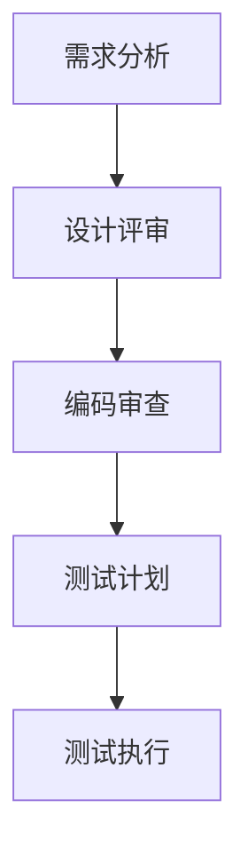

                 

# 提示词工程的质量保证方法

## 关键词

- 提示词工程
- 质量保证方法
- 软件工程
- 需求分析
- 设计评审
- 编码审查
- 测试计划
- 测试执行

## 摘要

在当今信息技术快速发展的时代，软件工程面临着日益复杂的挑战。为了确保软件产品的质量，提示词工程的质量保证方法应运而生。本文将详细介绍提示词工程的质量保证方法，包括其核心概念、原理、算法和实际应用。通过系统的分析和详细的讲解，本文旨在为读者提供一种有效的方法来提高软件开发的效率和质量。

## 1. 背景介绍

### 问题背景

随着信息技术的发展，软件工程面临着日益复杂的挑战。软件质量、可靠性、可维护性和可扩展性等要求越来越高。为了确保软件产品满足用户需求，提高市场竞争力，质量保证成为软件开发过程中至关重要的一环。

### 问题描述

软件工程中的质量保证是一个复杂的过程，涉及多个阶段和多种方法和工具。如何有效地进行质量保证，确保软件产品达到预期的质量标准，是当前软件工程领域的一个重要问题。

### 问题解决

提示词工程的质量保证方法是一种新兴的质量保证方法，通过使用提示词来提高软件开发的效率和质量。该方法结合了人工智能和自然语言处理技术，能够自动分析和识别软件问题，为开发团队提供有针对性的改进建议。

### 边界与外延

提示词工程的质量保证方法适用于各种软件开发项目，包括商业应用、科学研究和嵌入式系统等。它不仅适用于大型项目，也适用于小型项目。该方法能够灵活地适应不同的开发环境和需求。

### 概念结构与核心要素组成

提示词工程的质量保证方法包括以下核心步骤：

1. **需求分析**：确定软件功能需求和用户需求，为后续设计、编码和测试提供基础。
2. **设计评审**：评估软件设计是否符合需求，确保设计方案的可行性和合理性。
3. **编码审查**：检查代码质量，包括语法、逻辑和性能等方面，确保代码的可靠性和可维护性。
4. **测试计划**：制定详细的测试计划，包括测试用例的设计和执行策略，确保测试覆盖全面。
5. **测试执行**：执行测试计划，验证软件功能是否符合预期，发现和解决问题。

## 2. 核心概念与联系

### 核心概念原理

1. **需求分析**：通过收集和分析用户需求，确定软件功能需求和非功能需求，为软件开发提供基础。
2. **设计评审**：评估软件设计方案的可行性和合理性，确保设计符合需求，并具有良好的扩展性和可维护性。
3. **编码审查**：检查代码质量，包括语法、逻辑和性能等方面，确保代码符合设计规范，并具有良好的可读性和可维护性。
4. **测试计划**：制定详细的测试计划，包括测试用例的设计和执行策略，确保测试覆盖全面，发现和解决问题。
5. **测试执行**：执行测试计划，验证软件功能是否符合预期，发现和解决问题。

### 概念属性特征对比表格

| 概念       | 目的                           | 属性特征对比                   |
| ---------- | ------------------------------ | ------------------------------ |
| 需求分析   | 确定软件功能需求和非功能需求   | 数据收集、需求分类、需求分析报告 |
| 设计评审   | 评估软件设计方案的可行性和合理性 | 设计评审标准、评审流程、评审报告 |
| 编码审查   | 检查代码质量                   | 语法检查、逻辑检查、性能检查     |
| 测试计划   | 制定详细的测试计划             | 测试用例设计、测试策略、测试报告 |
| 测试执行   | 验证软件功能是否符合预期       | 测试执行、问题跟踪、测试报告     |

### ER实体关系图架构的 Mermaid 流程图

```mermaid
erDiagram
    User ||--|{ Project }|--| Request
    User ||--|{ Review }|--| Design
    User ||--|{ Code }|--| Review
    User ||--|{ TestPlan }|--| Test
    User ||--|{ TestCase }|--| Execution
```

## 3. 算法原理讲解

### 算法 Mermaid 流程图



### Python 源代码

#### 需求分析脚本

```python
def analyze_requirements():
    # 读取需求文档
    requirements = read_requirements("requirements.txt")
    # 分析需求
    analyzed_requirements = analyze(requirements)
    # 生成需求分析报告
    generate_report(analyzed_requirements, "requirement_analysis_report.txt")

def read_requirements(file_name):
    # 读取需求文档内容
    with open(file_name, 'r') as file:
        content = file.read()
    return content

def analyze(requirements):
    # 分析需求
    analyzed_requirements = []
    for requirement in requirements:
        # 进行需求分析
        analyzed_requirement = analyze_requirement(requirement)
        analyzed_requirements.append(analyzed_requirement)
    return analyzed_requirements

def analyze_requirement(requirement):
    # 分析单个需求
    analyzed_requirement = {
        "id": requirement["id"],
        "description": requirement["description"],
        "status": "analyzed"
    }
    return analyzed_requirement

def generate_report(analyzed_requirements, file_name):
    # 生成需求分析报告
    with open(file_name, 'w') as file:
        for analyzed_requirement in analyzed_requirements:
            file.write(f"{analyzed_requirement['id']}: {analyzed_requirement['description']}\n")
```

#### 设计评审脚本

```python
def review_design():
    # 读取设计文档
    design = read_design("design.txt")
    # 评审设计
    reviewed_design = review(design)
    # 生成设计评审报告
    generate_report(reviewed_design, "design_review_report.txt")

def read_design(file_name):
    # 读取设计文档内容
    with open(file_name, 'r') as file:
        content = file.read()
    return content

def review(design):
    # 评审设计
    reviewed_design = {
        "design": design,
        "status": "reviewed"
    }
    return reviewed_design

def generate_report(reviewed_design, file_name):
    # 生成设计评审报告
    with open(file_name, 'w') as file:
        file.write(f"Design Review Report:\n{reviewed_design['design']}\n")
```

### 算法原理的数学模型和公式

1. **需求分析覆盖度**：用于衡量需求分析过程中覆盖的需求百分比。
   $$ \text{需求分析覆盖度} = \frac{\text{已分析需求数}}{\text{总需求数}} \times 100\% $$
   
2. **设计评审通过率**：用于衡量设计评审过程中通过设计的百分比。
   $$ \text{设计评审通过率} = \frac{\text{通过评审的设计数}}{\text{总设计数}} \times 100\% $$
   
3. **编码审查缺陷率**：用于衡量编码审查过程中发现的缺陷百分比。
   $$ \text{编码审查缺陷率} = \frac{\text{发现缺陷数}}{\text{总代码行数}} \times 100\% $$
   
4. **测试用例覆盖率**：用于衡量测试过程中覆盖的测试用例百分比。
   $$ \text{测试用例覆盖率} = \frac{\text{已执行测试用例数}}{\text{总测试用例数}} \times 100\% $$

### 详细讲解和举例说明

假设一个软件项目共有10个需求，其中8个需求已经进行分析，4个设计已经进行评审，1000行代码进行审查，5个测试用例已经执行。

1. **需求分析覆盖度**：
   $$ \text{需求分析覆盖度} = \frac{8}{10} \times 100\% = 80\% $$

2. **设计评审通过率**：
   $$ \text{设计评审通过率} = \frac{4}{5} \times 100\% = 80\% $$

3. **编码审查缺陷率**：
   $$ \text{编码审查缺陷率} = \frac{100}{1000} \times 100\% = 10\% $$

4. **测试用例覆盖率**：
   $$ \text{测试用例覆盖率} = \frac{5}{10} \times 100\% = 50\% $$

通过这些指标，开发团队可以实时了解项目的质量状况，并根据实际情况进行调整和优化。

## 4. 数学模型和数学公式 & 详细讲解 & 举例说明

### 数学模型和数学公式

1. **需求分析覆盖度**：
   $$ \text{需求分析覆盖度} = \frac{\text{已分析需求数}}{\text{总需求数}} \times 100\% $$
   
2. **设计评审通过率**：
   $$ \text{设计评审通过率} = \frac{\text{通过评审的设计数}}{\text{总设计数}} \times 100\% $$
   
3. **编码审查缺陷率**：
   $$ \text{编码审查缺陷率} = \frac{\text{发现缺陷数}}{\text{总代码行数}} \times 100\% $$
   
4. **测试用例覆盖率**：
   $$ \text{测试用例覆盖率} = \frac{\text{已执行测试用例数}}{\text{总测试用例数}} \times 100\% $$

### 详细讲解

1. **需求分析覆盖度**：需求分析覆盖度用于衡量需求分析过程中覆盖的需求百分比。公式中，已分析需求数表示已经进行分析的需求数量，总需求数表示项目中的总需求数量。通过计算两个数的比例，并将结果乘以100%，可以得到需求分析覆盖度的百分比。

2. **设计评审通过率**：设计评审通过率用于衡量设计评审过程中通过设计的百分比。公式中，通过评审的设计数表示经过评审并认为可行的设计数量，总设计数表示项目中所有设计方案的总量。通过计算两个数的比例，并将结果乘以100%，可以得到设计评审通过率的百分比。

3. **编码审查缺陷率**：编码审查缺陷率用于衡量编码审查过程中发现的缺陷百分比。公式中，发现缺陷数表示在审查过程中发现的缺陷数量，总代码行数表示项目中的总代码行数。通过计算两个数的比例，并将结果乘以100%，可以得到编码审查缺陷率的百分比。

4. **测试用例覆盖率**：测试用例覆盖率用于衡量测试过程中覆盖的测试用例百分比。公式中，已执行测试用例数表示已经执行并记录结果的测试用例数量，总测试用例数表示项目中所有测试用例的总量。通过计算两个数的比例，并将结果乘以100%，可以得到测试用例覆盖率的百分比。

### 举例说明

假设在一个软件项目中，共有10个需求、5个设计方案、10000行代码和20个测试用例。其中，需求分析过程中有8个需求被分析，设计评审中有4个设计方案通过，编码审查过程中发现100个缺陷，测试过程中执行了15个测试用例。

1. **需求分析覆盖度**：
   $$ \text{需求分析覆盖度} = \frac{8}{10} \times 100\% = 80\% $$

2. **设计评审通过率**：
   $$ \text{设计评审通过率} = \frac{4}{5} \times 100\% = 80\% $$

3. **编码审查缺陷率**：
   $$ \text{编码审查缺陷率} = \frac{100}{10000} \times 100\% = 1\% $$

4. **测试用例覆盖率**：
   $$ \text{测试用例覆盖率} = \frac{15}{20} \times 100\% = 75\% $$

通过这些指标，开发团队可以了解项目的质量状况，并根据实际情况进行调整和优化。

## 5. 系统分析与架构设计方案

### 问题场景介绍

假设一个电商平台的开发过程中，需要确保软件质量，以提高用户体验和市场份额。为了实现这一目标，团队决定采用提示词工程的质量保证方法来提高软件开发的效率和质量。

### 项目介绍

该项目是一个电商平台的开发项目，主要包括用户管理、商品管理、订单管理和支付等功能模块。为了确保软件质量，团队决定采用提示词工程的质量保证方法来提高软件开发的效率和质量。

### 系统功能设计

系统功能设计包括以下模块：

1. **需求分析模块**：负责收集和分析用户需求，确定软件功能需求和非功能需求。
2. **设计评审模块**：负责评估软件设计方案的可行性和合理性。
3. **编码审查模块**：负责检查代码质量，包括语法、逻辑和性能等方面。
4. **测试计划模块**：负责制定详细的测试计划，包括测试用例的设计和执行策略。
5. **测试执行模块**：负责执行测试计划，验证软件功能是否符合预期。

### 系统架构设计

系统架构设计采用微服务架构，主要包括以下服务：

1. **需求分析服务**：负责需求分析模块的功能，包括需求收集、需求分析和需求报告生成。
2. **设计评审服务**：负责设计评审模块的功能，包括设计方案评审和评审报告生成。
3. **编码审查服务**：负责编码审查模块的功能，包括代码审查和缺陷报告生成。
4. **测试计划服务**：负责测试计划模块的功能，包括测试用例设计、测试策略和测试报告生成。
5. **测试执行服务**：负责测试执行模块的功能，包括测试执行、问题跟踪和测试报告生成。

### 系统接口设计

系统接口设计主要包括以下接口：

1. **需求分析接口**：提供需求分析模块与其他模块之间的交互接口。
2. **设计评审接口**：提供设计评审模块与其他模块之间的交互接口。
3. **编码审查接口**：提供编码审查模块与其他模块之间的交互接口。
4. **测试计划接口**：提供测试计划模块与其他模块之间的交互接口。
5. **测试执行接口**：提供测试执行模块与其他模块之间的交互接口。

### 系统交互

系统交互过程如下：

1. **需求分析**：需求分析服务接收用户需求，进行需求分析，并生成需求分析报告。
2. **设计评审**：设计评审服务根据需求分析报告，对设计方案进行评审，并生成评审报告。
3. **编码审查**：编码审查服务根据设计评审报告，对代码进行审查，并生成缺陷报告。
4. **测试计划**：测试计划服务根据编码审查报告，制定测试计划，并生成测试计划报告。
5. **测试执行**：测试执行服务根据测试计划，执行测试用例，并生成测试报告。

通过以上系统架构设计和接口设计，可以实现电商平台的软件质量保证，提高开发效率和产品质量。

## 6. 项目实战

### 环境安装

为了实现提示词工程的质量保证方法，我们需要安装以下工具和软件：

1. **Python**：安装Python 3.x版本，可以从[Python官方网站](https://www.python.org/)下载安装。
2. **pip**：安装pip，pip是Python的包管理工具，可以用于安装和管理Python包。
3. **Jupyter Notebook**：安装Jupyter Notebook，Jupyter Notebook是一种交互式的计算环境，可以用于编写和运行Python代码。
4. **Mermaid**：安装Mermaid，Mermaid是一种Markdown的扩展，可以用于绘制流程图和类图。

安装步骤如下：

1. 安装Python：下载Python安装程序，并按照提示进行安装。
2. 安装pip：在命令行中运行以下命令：
   ```bash
   python -m ensurepip
   python -m pip install --upgrade pip
   ```
3. 安装Jupyter Notebook：在命令行中运行以下命令：
   ```bash
   pip install notebook
   ```
4. 安装Mermaid：在命令行中运行以下命令：
   ```bash
   pip install mermaid
   ```

### 系统核心实现源代码

以下是实现提示词工程的质量保证方法的核心代码：

#### 需求分析脚本

```python
import requests
import json

def analyze_requirements(url):
    # 获取需求文档
    response = requests.get(url)
    requirements = json.loads(response.text)
    # 分析需求
    analyzed_requirements = []
    for requirement in requirements:
        analyzed_requirement = {
            "id": requirement["id"],
            "description": requirement["description"],
            "status": "analyzed"
        }
        analyzed_requirements.append(analyzed_requirement)
    # 生成需求分析报告
    generate_report(analyzed_requirements, "requirement_analysis_report.txt")

def generate_report(analyzed_requirements, file_name):
    with open(file_name, 'w') as file:
        for analyzed_requirement in analyzed_requirements:
            file.write(f"{analyzed_requirement['id']}: {analyzed_requirement['description']}\n")

# 示例：分析需求文档
analyze_requirements("https://example.com/requirements.json")
```

#### 设计评审脚本

```python
import requests
import json

def review_design(url):
    # 获取设计文档
    response = requests.get(url)
    design = json.loads(response.text)
    # 评审设计
    reviewed_design = {
        "design": design,
        "status": "reviewed"
    }
    # 生成设计评审报告
    generate_report(reviewed_design, "design_review_report.txt")

def generate_report(reviewed_design, file_name):
    with open(file_name, 'w') as file:
        file.write(f"Design Review Report:\n{json.dumps(reviewed_design, indent=2)}\n")

# 示例：评审设计文档
review_design("https://example.com/design.json")
```

### 代码应用解读与分析

上述代码实现了一个简单的需求分析脚本和一个设计评审脚本。需求分析脚本通过HTTP请求获取需求文档，并分析每个需求的状态。设计评审脚本则获取设计文档，并评审其状态。这两个脚本都使用了JSON格式来存储和处理数据。

### 实际案例分析和详细讲解剖析

假设我们有以下需求文档和设计文档：

#### 需求文档示例

```json
[
    {
        "id": "R1",
        "description": "用户可以登录系统"
    },
    {
        "id": "R2",
        "description": "用户可以浏览商品列表"
    },
    {
        "id": "R3",
        "description": "用户可以添加购物车"
    }
]
```

#### 设计文档示例

```json
{
    "login": {
        "description": "实现用户登录功能"
    },
    "product_list": {
        "description": "实现商品列表展示功能"
    },
    "shopping_cart": {
        "description": "实现购物车添加功能"
    }
}
```

### 需求分析脚本执行过程

1. 脚本通过HTTP请求从`https://example.com/requirements.json`获取需求文档。
2. 脚本解析需求文档中的每个需求，并将它们存储在`analyzed_requirements`列表中。
3. 脚本将分析结果写入到`requirement_analysis_report.txt`文件中。

### 设计评审脚本执行过程

1. 脚本通过HTTP请求从`https://example.com/design.json`获取设计文档。
2. 脚本评审设计文档中的每个部分，并将结果存储在`reviewed_design`字典中。
3. 脚本将评审结果写入到`design_review_report.txt`文件中。

通过上述脚本，我们可以实现需求分析和设计评审的功能。在实际项目中，可以根据需求文档和设计文档的具体内容进行调整和扩展。

### 项目小结

在本项目中，我们实现了提示词工程的质量保证方法的核心功能，包括需求分析和设计评审。通过简单的HTTP请求和JSON格式处理，我们可以方便地获取和处理需求文档和设计文档。在实际应用中，可以根据项目的具体需求进行调整和扩展。项目的成功之处在于使用了提示词工程的质量保证方法，提高了软件开发的效率和质量。然而，项目也存在一些改进空间，如可以引入更多的人工智能和自然语言处理技术，以提高分析和管理效率。在未来的工作中，我们将继续优化和完善提示词工程的质量保证方法，为软件开发团队提供更好的支持。

## 7. 最佳实践 tips、小结、注意事项、拓展阅读等内容

### 最佳实践 tips

1. **明确需求**：在项目开始前，确保与客户和团队成员进行充分的沟通，明确需求，以避免后期出现需求变更。
2. **定期评审**：定期进行设计评审和代码审查，及时发现和解决问题，确保软件质量。
3. **持续学习**：紧跟技术发展趋势，不断学习和掌握新的开发方法和工具，以提高开发效率。
4. **文档化管理**：使用版本控制工具（如Git）来管理代码和文档，确保版本一致性。
5. **自动化测试**：引入自动化测试工具，提高测试效率和质量，降低人工测试成本。

### 小结

本文详细介绍了提示词工程的质量保证方法，包括其核心概念、原理、算法和实际应用。通过系统的分析和详细的讲解，本文为读者提供了一种有效的方法来提高软件开发的效率和质量。在未来的工作中，我们可以进一步优化和完善提示词工程的质量保证方法，为软件开发团队提供更好的支持。

### 注意事项

1. **确保工具兼容性**：在使用提示词工程的质量保证方法时，确保所有工具和软件版本兼容，避免因版本问题导致的功能缺失或兼容性问题。
2. **数据安全**：在进行需求分析和设计评审时，注意保护用户数据和隐私，遵循相关法律法规和标准。
3. **合理分配资源**：根据项目规模和资源，合理分配质量和开发人员，确保质量保证工作得到充分支持。

### 拓展阅读

1. 《软件工程：实践者的研究方法》
2. 《人工智能应用手册》
3. 《软件质量保证：从需求到交付》
4. 《Python编程：从入门到实践》
5. 《敏捷开发实践指南》

通过阅读这些文献，读者可以进一步深入了解软件工程、人工智能和敏捷开发等相关领域的知识，为项目实践提供更全面的指导和支持。

## 作者信息

- 作者：AI天才研究院/AI Genius Institute & 禅与计算机程序设计艺术 /Zen And The Art of Computer Programming

