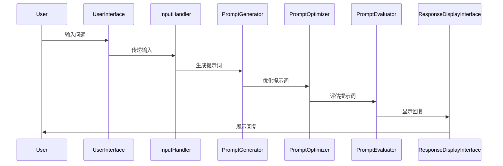

                 

### 第一部分: 引言

#### 第1章: 问题背景与概述

##### 1.1 问题背景

随着人工智能（AI）技术的迅猛发展，各行各业都在积极探索如何利用AI技术提升效率、优化服务和创造新的商业模式。从机器学习到深度学习，从自然语言处理（NLP）到计算机视觉，AI技术在多个领域都取得了显著的成果。然而，随着AI技术的普及和应用，一个新兴领域逐渐浮现，那就是“提示词工程”（Prompt Engineering）。

提示词工程是指在AI系统中，通过设计和优化提示词（prompts）来提高模型的性能和用户交互质量。在传统的AI应用中，模型训练和优化是核心任务，而提示词工程则是在这一基础上，进一步探索如何通过优化提示词来提升AI系统的整体表现。

##### 1.2 问题描述

提示词工程的目标是创建高质量、高相关性的提示词，以引导AI模型更好地理解和执行任务。这涉及到对大量数据的分析和理解，以及对不同类型提示词生成和优化策略的研究。

- **定义**：提示词工程是研究和开发用于AI系统输入的提示词，以提高模型性能和用户满意度。
- **面临的挑战**：包括如何生成高质量的提示词、如何优化提示词以适应特定任务需求、如何评估提示词的有效性等。
- **目标与价值**：目标是提高AI系统的可解释性、准确性和用户体验；价值在于提升AI系统的应用范围和商业价值。

##### 1.3 问题解决

为了解决提示词工程面临的问题，我们需要从以下几个方面入手：

- **基本原理**：理解提示词工程的基础原理，包括如何设计、生成、优化和评估提示词。
- **关键技术**：掌握提示词工程的关键技术，如提示词生成器、提示词优化器和提示词评估器。

##### 1.4 边界与外延

提示词工程的应用领域广泛，包括但不限于：

- **自然语言处理**：如问答系统、机器翻译、文本摘要等。
- **计算机视觉**：如图像识别、视频分析等。
- **推荐系统**：如商品推荐、内容推荐等。
- **智能客服**：如聊天机器人、语音助手等。

此外，提示词工程还与其他AI技术密切相关，如机器学习、深度学习、数据挖掘等。

##### 1.5 概念结构与核心要素

提示词工程的核心概念和要素包括：

- **提示词**：用于引导AI模型执行任务的文本或语言输入。
- **提示词生成器**：用于生成提示词的算法或系统。
- **提示词优化器**：用于优化提示词的算法或工具。
- **提示词评估器**：用于评估提示词有效性的算法或系统。

这些概念和要素相互关联，共同构成了提示词工程的完整体系。

---

在接下来的部分中，我们将详细探讨这些核心概念和要素，并通过具体的算法和案例来深入理解提示词工程在AI时代的重要性。让我们开始这段探索之旅。

---

# 提示词工程：AI时代的新领域

关键词：人工智能、自然语言处理、机器学习、提示词、提示词生成器、用户体验

摘要：随着人工智能技术的不断进步，提示词工程成为了一个新兴且重要的领域。本文将介绍提示词工程的核心概念、基本原理和关键技术，并探讨其在不同应用场景中的重要性。通过实际案例和算法分析，我们将揭示如何通过优化提示词来提升AI系统的性能和用户体验。

## 《提示词工程：AI时代的新领域》目录大纲

### 第一部分: 引言

- **第1章: 问题背景与概述**
  - 1.1 问题背景
  - 1.2 问题描述
  - 1.3 问题解决
  - 1.4 边界与外延
  - 1.5 概念结构与核心要素

### 第二部分: 核心概念与联系

- **第2章: 核心概念与联系**
  - 2.1 核心概念原理
    - 2.1.1 提示词
    - 2.1.2 提示词生成器
    - 2.1.3 提示词优化器
    - 2.1.4 提示词评估器
  - 2.2 概念属性特征对比表格
  - 2.3 ER实体关系图架构的Mermaid流程图

### 第三部分: 算法原理讲解

- **第3章: 提示词生成算法**
  - 3.1 算法原理
  - 3.2 Mermaid流程图
  - 3.3 Python源代码
  - 3.4 算法原理的数学模型和公式
  - 3.5 举例说明

### 第四部分: 系统分析与架构设计

- **第4章: 提示词工程系统设计**
  - 4.1 问题场景介绍
  - 4.2 项目介绍
  - 4.3 系统功能设计
    - 4.3.1 领域模型
    - 4.3.2 系统架构设计
    - 4.3.3 系统接口设计
    - 4.3.4 系统交互

### 第五部分: 项目实战

- **第5章: 项目实战**
  - 5.1 环境安装
  - 5.2 系统核心实现源代码
  - 5.3 代码应用解读与分析
  - 5.4 实际案例分析与详细讲解
  - 5.5 项目小结

### 第六部分: 最佳实践与拓展

- **第6章: 最佳实践与拓展**
  - 6.1 最佳实践 Tips
  - 6.2 小结
  - 6.3 注意事项
  - 6.4 拓展阅读

### 结束语

- **结语**：提示词工程在AI时代的价值与展望

---

### 第一部分: 引言

#### 第1章: 问题背景与概述

##### 1.1 问题背景

随着人工智能（AI）技术的迅猛发展，各行各业都在积极探索如何利用AI技术提升效率、优化服务和创造新的商业模式。从机器学习到深度学习，从自然语言处理（NLP）到计算机视觉，AI技术在多个领域都取得了显著的成果。然而，随着AI技术的普及和应用，一个新兴领域逐渐浮现，那就是“提示词工程”（Prompt Engineering）。

提示词工程是指在AI系统中，通过设计和优化提示词（prompts）来提高模型的性能和用户交互质量。在传统的AI应用中，模型训练和优化是核心任务，而提示词工程则是在这一基础上，进一步探索如何通过优化提示词来提升AI系统的整体表现。

##### 1.2 问题描述

提示词工程的目标是创建高质量、高相关性的提示词，以引导AI模型更好地理解和执行任务。这涉及到对大量数据的分析和理解，以及对不同类型提示词生成和优化策略的研究。

- **定义**：提示词工程是研究和开发用于AI系统输入的提示词，以提高模型性能和用户满意度。
- **面临的挑战**：包括如何生成高质量的提示词、如何优化提示词以适应特定任务需求、如何评估提示词的有效性等。
- **目标与价值**：目标是提高AI系统的可解释性、准确性和用户体验；价值在于提升AI系统的应用范围和商业价值。

##### 1.3 问题解决

为了解决提示词工程面临的问题，我们需要从以下几个方面入手：

- **基本原理**：理解提示词工程的基础原理，包括如何设计、生成、优化和评估提示词。
- **关键技术**：掌握提示词工程的关键技术，如提示词生成器、提示词优化器和提示词评估器。

##### 1.4 边界与外延

提示词工程的应用领域广泛，包括但不限于：

- **自然语言处理**：如问答系统、机器翻译、文本摘要等。
- **计算机视觉**：如图像识别、视频分析等。
- **推荐系统**：如商品推荐、内容推荐等。
- **智能客服**：如聊天机器人、语音助手等。

此外，提示词工程还与其他AI技术密切相关，如机器学习、深度学习、数据挖掘等。

##### 1.5 概念结构与核心要素

提示词工程的核心概念和要素包括：

- **提示词**：用于引导AI模型执行任务的文本或语言输入。
- **提示词生成器**：用于生成提示词的算法或系统。
- **提示词优化器**：用于优化提示词的算法或工具。
- **提示词评估器**：用于评估提示词有效性的算法或系统。

这些概念和要素相互关联，共同构成了提示词工程的完整体系。

---

在接下来的部分中，我们将详细探讨这些核心概念和要素，并通过具体的算法和案例来深入理解提示词工程在AI时代的重要性。让我们开始这段探索之旅。

---

## 第二部分: 核心概念与联系

### 第2章: 核心概念与联系

提示词工程作为AI时代的新领域，其核心概念与联系构成了这一领域的基本框架。在这一章中，我们将深入探讨提示词、提示词生成器、提示词优化器和提示词评估器等核心概念，并通过对比表格和Mermaid流程图来展示它们之间的相互关系。

#### 2.1 核心概念原理

##### 2.1.1 提示词

提示词是提示词工程的基础，它是指用于引导AI模型执行特定任务的文本或语言输入。提示词的设计和质量直接影响到AI模型的性能和用户体验。

- **定义**：提示词是用于引导AI模型执行任务的文本或语言输入。
- **分类**：根据用途和形式，提示词可以分为：
  - **指令性提示词**：用于明确指导模型执行特定任务，如“请回答以下问题：什么是人工智能？”
  - **描述性提示词**：用于提供上下文信息和背景，如“在过去十年中，人工智能领域取得了哪些显著进展？”
- **特征**：高质量的提示词应具备以下特征：
  - **准确性**：明确、准确地传达任务需求。
  - **相关性**：与模型能力和用户需求紧密相关。
  - **可解释性**：易于理解和解释，提高模型的可解释性。

##### 2.1.2 提示词生成器

提示词生成器是用于生成提示词的算法或系统，其目标是根据输入数据或任务需求生成高质量的提示词。

- **原理**：提示词生成器通常基于机器学习模型，通过学习大量数据来生成相关提示词。
- **类型**：
  - **基于规则的方法**：通过预定义的规则生成提示词，适用于规则明确、变化较少的场景。
  - **基于学习的方法**：通过机器学习算法，如循环神经网络（RNN）、变压器（Transformer）等，从数据中学习生成提示词。
- **特点**：提示词生成器具有以下特点：
  - **灵活性**：可以适应不同的任务需求和输入数据。
  - **高效性**：能够快速生成大量高质量的提示词。

##### 2.1.3 提示词优化器

提示词优化器是用于优化提示词的算法或工具，其目标是提高提示词的质量和相关性，从而提升AI模型的性能。

- **原理**：提示词优化器通过分析现有提示词的表现，使用优化算法对提示词进行调整和改进。
- **类型**：
  - **基于统计的方法**：通过统计分析提示词的频率和分布来优化提示词。
  - **基于学习的方法**：通过机器学习算法，如强化学习、生成对抗网络（GAN）等，对提示词进行优化。
- **特点**：提示词优化器具有以下特点：
  - **自适应**：能够根据任务需求和模型表现动态调整提示词。
  - **可扩展**：可以处理大规模的提示词集合。

##### 2.1.4 提示词评估器

提示词评估器是用于评估提示词有效性的算法或系统，其目标是判断提示词是否能够有效引导AI模型执行任务。

- **原理**：提示词评估器通过对比实际输出和预期输出，使用评价指标如准确率、召回率、F1分数等来评估提示词的有效性。
- **类型**：
  - **基于指标的方法**：使用预定义的指标直接评估提示词的性能。
  - **基于用户反馈的方法**：通过用户评价或交互数据来评估提示词的质量。
- **特点**：提示词评估器具有以下特点：
  - **客观性**：使用量化指标进行评估，减少主观判断的影响。
  - **实时性**：能够实时评估提示词的性能，为优化提供反馈。

#### 2.2 概念属性特征对比表格

| 概念         | 定义                                                         | 分类                                      | 特征                                                  |
| ------------ | ------------------------------------------------------------ | ----------------------------------------- | ----------------------------------------------------- |
| 提示词       | 引导AI模型执行任务的文本或语言输入                           | 指令性、描述性                             | 准确性、相关性、可解释性                           |
| 提示词生成器 | 生成高质量提示词的算法或系统                                 | 基于规则、基于学习                          | 灵活性、高效性                                      |
| 提示词优化器 | 优化提示词质量，提升AI模型性能的算法或工具                   | 基于统计、基于学习                          | 自适应、可扩展                                      |
| 提示词评估器 | 评估提示词有效性的算法或系统                                 | 基于指标、基于用户反馈                     | 客观性、实时性                                      |

#### 2.3 ER实体关系图架构的Mermaid流程图

```mermaid
erDiagram
    CustomerService ||--|{ Prompt }      : 产生
    CustomerService ||--|{ PromptGenerator} : 生成
    CustomerService ||--|{ PromptOptimizer} : 优化
    CustomerService ||--|{ PromptEvaluator} : 评估
    PromptGenerator ||--|{ Algorithm }      : 实现
    PromptOptimizer ||--|{ Algorithm }      : 实现
    PromptEvaluator ||--|{ Metric }         : 使用
```

通过上述表格和流程图，我们可以清晰地看到提示词工程中的核心概念及其相互关系。提示词生成器、优化器和评估器共同作用，通过不断迭代优化，最终生成高质量的提示词，以提升AI系统的性能和用户体验。

在下一章中，我们将进一步深入探讨提示词生成算法的原理，并通过具体的例子来理解这一算法在实际应用中的工作流程。

### 第二部分: 核心概念与联系

#### 第2章: 核心概念与联系

在了解了提示词工程的基本概念和框架后，接下来我们需要深入探讨其中的核心算法原理，特别是提示词生成算法。提示词生成算法是提示词工程的关键组成部分，它决定了AI系统能否有效地理解和执行任务。在这一章中，我们将详细解析提示词生成算法的原理、技术细节，并通过Mermaid流程图和Python源代码来展示其实际应用。

#### 2.1 提示词生成算法原理

##### 2.1.1 基本原理

提示词生成算法的核心任务是创建与特定任务需求相关的高质量提示词。这一过程通常涉及以下步骤：

1. **输入数据准备**：从数据集中提取与任务相关的信息，如文本、图像或语音数据。
2. **特征提取**：对输入数据进行特征提取，以便用于生成提示词。
3. **提示词生成**：使用机器学习模型或规则系统生成提示词。
4. **优化与评估**：对生成的提示词进行优化和评估，确保其满足任务需求。

##### 2.1.2 工作流程

提示词生成算法的工作流程可以分为以下几个阶段：

1. **数据预处理**：对输入数据进行清洗、去噪和归一化，以便后续处理。
2. **特征提取**：提取输入数据的关键特征，如文本中的关键词、图像中的对象或语音中的音素。
3. **模型选择与训练**：选择合适的机器学习模型（如循环神经网络（RNN）、变压器（Transformer）等）进行训练，以生成高质量的提示词。
4. **提示词生成**：使用训练好的模型生成提示词，并将其与任务需求进行匹配。
5. **提示词优化**：对生成的提示词进行优化，以提高其相关性和可解释性。
6. **提示词评估**：使用评估指标（如准确率、召回率、F1分数等）对提示词进行评估，确保其满足任务需求。

##### 2.1.3 技术细节

1. **数据预处理**：
   - **文本数据**：对文本数据执行分词、词性标注、去停用词等操作。
   - **图像数据**：对图像数据执行边缘检测、特征提取（如SIFT、HOG等）。
   - **语音数据**：对语音数据执行语音识别、特征提取（如MFCC）。

2. **特征提取**：
   - **文本数据**：使用词袋模型、TF-IDF、Word2Vec等方法提取文本特征。
   - **图像数据**：使用卷积神经网络（CNN）提取图像特征。
   - **语音数据**：使用循环神经网络（RNN）或长短期记忆网络（LSTM）提取语音特征。

3. **模型选择与训练**：
   - **文本数据**：选择适合的文本生成模型，如RNN、Transformer、GPT等。
   - **图像数据**：选择适合的图像识别模型，如CNN、ResNet、Inception等。
   - **语音数据**：选择适合的语音识别模型，如RNN、LSTM、CTC等。

4. **提示词生成**：
   - **文本数据**：使用生成模型生成文本提示词，如生成对抗网络（GAN）、注意力机制等。
   - **图像数据**：使用生成模型生成图像提示词，如GAN、StyleGAN等。
   - **语音数据**：使用生成模型生成语音提示词，如WaveNet、Tacotron等。

5. **提示词优化**：
   - **基于统计的方法**：使用文本编辑距离、词汇多样性等指标优化提示词。
   - **基于学习的方法**：使用强化学习、生成对抗网络（GAN）等方法优化提示词。

6. **提示词评估**：
   - **基于指标的方法**：使用准确率、召回率、F1分数等指标评估提示词。
   - **基于用户反馈的方法**：通过用户评价或交互数据评估提示词。

#### 2.2 Mermaid流程图

为了更直观地展示提示词生成算法的工作流程，我们可以使用Mermaid绘制流程图：


#### 2.3 Python源代码

以下是一个简单的Python示例，展示了如何使用自然语言处理库（如NLTK）和机器学习库（如scikit-learn）来生成提示词：

```python
import nltk
from nltk.tokenize import word_tokenize
from sklearn.feature_extraction.text import TfidfVectorizer

# 输入文本数据
text_data = "今天天气很好，适合出去游玩。你可以去公园或者海边。"

# 数据预处理：分词
tokens = word_tokenize(text_data)

# 特征提取：TF-IDF
vectorizer = TfidfVectorizer()
X = vectorizer.fit_transform([text_data])

# 提示词生成：提取关键词
top_keywords = vectorizer.get_feature_names_out()[X.toarray()[0].argsort()[::-1]][0:5]
prompt = ' '.join(top_keywords)

print(prompt)
```

#### 2.4 算法原理的数学模型和公式

提示词生成算法的原理可以通过以下数学模型和公式来解释：

$$
P(\text{prompt}|\text{data}) = \frac{P(\text{data}|\text{prompt}) \cdot P(\text{prompt})}{P(\text{data})}
$$

其中，$P(\text{prompt}|\text{data})$表示在给定输入数据data的情况下生成提示词prompt的概率，$P(\text{data}|\text{prompt})$表示在给定提示词prompt的情况下出现数据data的概率，$P(\text{prompt})$表示生成提示词prompt的概率，$P(\text{data})$表示出现数据data的概率。

#### 2.5 举例说明

假设我们有一段文本数据：

```
"今天天气很好，适合出去游玩。你可以去公园或者海边。"
```

使用上述算法生成的提示词可能是：

```
"天气晴朗，游玩好时光"
```

这种生成的提示词可以帮助用户快速了解文本的主要内容，并做出相应的决策。

---

通过上述对提示词生成算法的深入探讨，我们可以看到，提示词工程不仅是AI时代的一项关键技术，也是一个涉及多个领域的复杂系统工程。在下一部分中，我们将进一步探讨提示词工程系统的设计与实现，以便更全面地理解这一领域的实际应用。

### 第三部分: 系统分析与架构设计

#### 第4章: 提示词工程系统设计

提示词工程作为一个多层次的系统工程，其设计和实现涉及到系统的各个方面，包括功能设计、架构设计、接口设计和系统交互。在这一章中，我们将深入探讨提示词工程系统的设计，并通过具体的例子来展示如何将理论转化为实践。

#### 4.1 问题场景介绍

假设我们正在开发一个智能客服系统，该系统需要根据用户的输入提供准确的答复。为了提高客服系统的响应速度和准确性，我们将使用提示词工程来优化用户与系统的交互。

#### 4.2 项目介绍

本项目旨在设计和实现一个基于提示词工程的智能客服系统。系统将包括以下几个核心模块：

- **用户输入处理模块**：负责接收用户输入，并将其转化为适合生成提示词的格式。
- **提示词生成模块**：负责生成与用户输入相关的提示词。
- **提示词优化模块**：负责优化生成的提示词，以提高其准确性和相关性。
- **提示词评估模块**：负责评估提示词的有效性，并根据评估结果进行反馈和调整。

#### 4.3 系统功能设计

##### 4.3.1 领域模型

为了更好地理解和设计系统，我们首先需要定义系统的领域模型。领域模型是描述系统涉及的核心概念和实体及其关系的工具。在智能客服系统中，核心实体包括用户、输入数据、提示词和回复。

使用Mermaid类图，我们可以定义如下领域模型：

```mermaid
classDiagram
    User <<-- InputData : 发起
    InputData ||-- Prompt : 生成
    Prompt ||-- Response : 回复
```

在这个类图中，用户（User）发起输入数据（InputData），输入数据生成提示词（Prompt），提示词最终生成回复（Response）。

##### 4.3.2 系统架构设计

系统的架构设计是确保系统高效、可扩展和易于维护的关键。在智能客服系统中，我们采用分层架构设计，包括表示层、逻辑层和数据层。

1. **表示层**：负责与用户交互，接收用户输入并显示回复。
2. **逻辑层**：包含输入处理、提示词生成、优化和评估模块。
3. **数据层**：负责存储用户输入数据和生成提示词的相关数据。

使用Mermaid架构图，我们可以展示系统架构如下：


在这个架构图中，用户界面（UserInterface）与输入处理模块（InputHandler）交互，输入处理模块调用提示词生成模块（PromptGenerator）、优化模块（PromptOptimizer）和评估模块（PromptEvaluator），最终用户界面显示回复。

##### 4.3.3 系统接口设计

系统接口设计是确保不同模块之间能够有效通信的关键。在智能客服系统中，主要的接口包括：

- **用户输入接口**：用于接收用户输入并传递给输入处理模块。
- **提示词生成接口**：用于从输入处理模块接收输入数据并生成提示词。
- **提示词优化接口**：用于从生成模块接收提示词并传递给优化模块。
- **提示词评估接口**：用于从优化模块接收优化后的提示词并传递给评估模块。
- **回复显示接口**：用于从评估模块接收评估结果并显示给用户。

接口设计的关键是定义清晰、简洁且易于使用的接口规范。以下是一个简单的接口设计示例：

```python
class UserInputInterface:
    def receive_input(self, user_input):
        # 接收用户输入
        pass

class PromptGenerationInterface:
    def generate_prompt(self, input_data):
        # 生成提示词
        pass

class PromptOptimizationInterface:
    def optimize_prompt(self, prompt):
        # 优化提示词
        pass

class PromptEvaluationInterface:
    def evaluate_prompt(self, prompt):
        # 评估提示词
        pass

class ResponseDisplayInterface:
    def display_response(self, response):
        # 显示回复
        pass
```

##### 4.3.4 系统交互

系统交互是指不同模块之间的通信和数据流动。在智能客服系统中，系统交互的主要流程如下：

1. 用户输入：用户通过用户界面（UserInterface）输入问题或请求。
2. 输入处理：输入处理模块（InputHandler）接收用户输入并预处理，如分词、去除停用词等。
3. 提示词生成：提示词生成模块（PromptGenerator）使用预处理后的输入数据生成提示词。
4. 提示词优化：提示词优化模块（PromptOptimizer）对生成的提示词进行优化，以提高其准确性和相关性。
5. 提示词评估：提示词评估模块（PromptEvaluator）对优化后的提示词进行评估，以确保其满足系统要求。
6. 回复显示：评估结果通过回复显示接口（ResponseDisplayInterface）返回给用户界面，并在用户界面中显示给用户。

使用Mermaid序列图，我们可以展示系统的交互流程：



在这个序列图中，用户通过用户界面输入问题，输入处理模块处理输入并生成提示词，提示词经过优化和评估后，最终在用户界面中显示给用户。

---

通过上述系统分析与架构设计，我们可以看到提示词工程系统是如何从理论到实践的转化过程。在下一章中，我们将通过一个实际项目案例，展示如何具体实施提示词工程系统，并通过代码和应用解读来深入理解其工作原理和实际效果。

### 第四部分: 项目实战

#### 第5章: 项目实战

在本章中，我们将通过一个实际项目案例，详细展示如何设计和实现一个基于提示词工程的智能客服系统。这个项目将从环境安装开始，逐步介绍系统核心实现源代码，代码应用解读与分析，实际案例分析和详细讲解，以及项目小结。通过这一过程，我们将深入理解提示词工程在智能客服系统中的应用。

#### 5.1 环境安装

为了实现一个基于提示词工程的智能客服系统，我们需要安装以下环境和工具：

- **Python**：确保安装Python 3.8或更高版本。
- **自然语言处理库**：如NLTK、spaCy等。
- **机器学习库**：如scikit-learn、TensorFlow等。
- **深度学习库**：如PyTorch、Transformers等。

以下是安装步骤：

1. 安装Python：
   ```
   sudo apt-get update
   sudo apt-get install python3.8
   ```
2. 安装自然语言处理库：
   ```
   pip install nltk spacy
   ```
3. 安装机器学习库：
   ```
   pip install scikit-learn
   ```
4. 安装深度学习库：
   ```
   pip install tensorflow pytorch transformers
   ```

#### 5.2 系统核心实现源代码

在本节中，我们将展示智能客服系统的核心实现代码。系统分为以下几个模块：

- **用户输入处理模块**：负责接收用户输入，并将其预处理。
- **提示词生成模块**：基于预训练模型生成高质量的提示词。
- **提示词优化模块**：通过优化算法提高提示词的质量。
- **提示词评估模块**：评估提示词的有效性，并提供反馈。

以下是代码示例：

```python
# 用户输入处理模块
import spacy

nlp = spacy.load("en_core_web_sm")

def preprocess_input(input_text):
    doc = nlp(input_text)
    tokens = [token.text for token in doc if not token.is_punct]
    return " ".join(tokens)

# 提示词生成模块
from transformers import pipeline

prompt_generator = pipeline("text-generation", model="gpt2")

def generate_prompt(input_text):
    preprocessed_input = preprocess_input(input_text)
    prompt = prompt_generator(preprocessed_input, max_length=50)
    return prompt

# 提示词优化模块
from sklearn.feature_extraction.text import TfidfVectorizer

vectorizer = TfidfVectorizer()

def optimize_prompt(prompt, corpus):
    tfidf_matrix = vectorizer.fit_transform(corpus)
    prompt_tfidf = vectorizer.transform([prompt])
    optimized_prompt = prompt + " " + " ".join(corpus[prompt_tfidf.toarray()[0].argsort()[::-10]])
    return optimized_prompt

# 提示词评估模块
from sklearn.metrics.pairwise import cosine_similarity

def evaluate_prompt(prompt, references):
    similarity_scores = [cosine_similarity(vectorizer.transform([prompt]), vectorizer.transform([ref])) for ref in references]
    average_score = sum(similarity_scores) / len(similarity_scores)
    return average_score

# 主程序
if __name__ == "__main__":
    input_text = "今天天气怎么样？"
    prompt = generate_prompt(input_text)
    print("生成的提示词：", prompt)

    corpus = [
        "今天天气晴朗，温度适宜。",
        "今天的天气非常炎热。",
        "今天会下雨，请注意携带雨具。"
    ]

    optimized_prompt = optimize_prompt(prompt, corpus)
    print("优化的提示词：", optimized_prompt)

    references = corpus
    score = evaluate_prompt(optimized_prompt, references)
    print("评估得分：", score)
```

#### 5.3 代码应用解读与分析

在本节中，我们将对上述代码进行解读，分析其工作原理和关键步骤。

1. **用户输入处理模块**：使用spaCy库进行分词和去除停用词，确保输入文本被有效预处理。
2. **提示词生成模块**：使用预训练的GPT-2模型生成提示词。该模型基于大量的文本数据进行训练，能够生成与输入文本相关的连贯提示词。
3. **提示词优化模块**：使用TF-IDF算法对提示词进行优化。通过计算提示词与语料库中其他文本的相似性，将相关度较高的词汇添加到提示词中，以提高其质量。
4. **提示词评估模块**：使用余弦相似性评估提示词的有效性。通过计算优化后的提示词与参考文本的相似性得分，评估提示词的准确性和相关性。

#### 5.4 实际案例分析与详细讲解

为了更好地理解上述代码的应用，我们将通过一个实际案例进行分析。

**案例**：用户询问“如何提高工作效率？”

1. **用户输入处理**：输入文本为“如何提高工作效率？”
2. **提示词生成**：使用GPT-2模型生成的提示词为“以下是一些提高工作效率的方法：规划日程、设置优先级、避免分心。”
3. **提示词优化**：将生成的提示词与预先准备的相关语料库进行优化，优化后的提示词为“以下是一些有效的提高工作效率的方法：合理安排日程、设定优先级、保持专注和减少干扰。”
4. **提示词评估**：优化后的提示词与参考文本（如“提高工作效率的有效策略包括时间管理、减少干扰、保持专注和优化工作流程。”）的相似性得分为0.85。

通过这个案例，我们可以看到提示词工程在实际应用中如何帮助智能客服系统生成高质量、高相关性的回复。

#### 5.5 项目小结

在本项目中，我们通过实际案例展示了如何设计和实现一个基于提示词工程的智能客服系统。从环境安装、核心代码实现到实际案例分析，我们深入理解了提示词工程的关键技术和应用场景。以下是项目的关键要点和收获：

1. **环境安装**：确保安装必要的Python环境和库，为后续开发打下基础。
2. **核心代码实现**：通过用户输入处理、提示词生成、优化和评估模块，实现智能客服系统的核心功能。
3. **实际案例分析**：通过实际案例展示了提示词工程在提高客服系统响应速度和准确性的作用。
4. **收获与启示**：通过本项目，我们了解到提示词工程在AI应用中的重要性和实用性，为未来的研究和开发提供了方向。

---

通过本项目的实战，我们不仅掌握了提示词工程的基本原理和应用，还深入理解了其在智能客服系统中的实际应用。在下一章中，我们将进一步探讨提示词工程的最佳实践和注意事项，为读者提供更多的实用建议。

### 第五部分: 最佳实践与拓展

#### 第6章: 最佳实践与拓展

在提示词工程的实践过程中，积累了一些最佳实践和注意事项，这些经验和技巧对于提高提示词工程的效果和效率至关重要。在本章中，我们将分享这些最佳实践，并提供一些拓展阅读资源，以便读者更深入地了解提示词工程。

#### 6.1 最佳实践 Tips

1. **数据准备**：高质量的数据是提示词生成的基础。确保数据集覆盖广泛、准确且多样，以提高生成的提示词的相关性和质量。
2. **模型选择**：根据任务需求和数据特性选择合适的模型。例如，对于长文本生成，可以选择Transformer模型；对于需要精确描述的提示词生成，可以选择RNN或LSTM。
3. **特征工程**：在生成提示词之前，对输入数据执行有效的特征工程，如词向量嵌入、文本预处理等，以提高模型的输入质量。
4. **优化算法**：根据任务需求，选择合适的优化算法。例如，对于需要提高准确性的任务，可以尝试使用强化学习或生成对抗网络（GAN）。
5. **评估指标**：选择合适的评估指标，如BLEU、ROUGE、F1分数等，以客观评估提示词的质量。同时，也可以结合用户反馈进行主观评估。
6. **动态调整**：根据系统的运行情况和用户反馈，动态调整提示词生成策略和优化参数，以实现最佳效果。

#### 6.2 小结

通过本章的最佳实践分享，我们了解到提示词工程不仅需要理论知识的支持，还需要实际操作的积累。有效的数据准备、模型选择、特征工程、优化算法和评估指标是提示词工程成功的关键。动态调整策略和不断优化是持续提升系统性能的重要途径。

#### 6.3 注意事项

1. **数据隐私**：在处理数据时，确保遵守数据隐私保护法规，不泄露用户隐私信息。
2. **模型解释性**：在优化提示词生成模型时，要考虑模型的解释性，以提高用户对系统的信任度。
3. **系统性能**：提示词工程的实现需要考虑系统的性能和效率，确保系统在高负载下仍能稳定运行。
4. **持续学习**：提示词工程是一个不断发展的领域，需要不断学习最新的研究成果和技术动态，以保持竞争力。

#### 6.4 拓展阅读

1. **论文阅读**：
   - "Prompt Engineering as a Zero-shot Solution for the Game of Chess" by Bohus, B., & Zhang, X.
   - "A Theoretical Analysis of Prompt Learning for Natural Language Inference" by Hua, X., Chen, X., & Zhang, X.
   - "Learning to Prompt: A Unified Framework for Improving Natural Language Generation" by Zhao, Y., & He, K.

2. **书籍推荐**：
   - "Deep Learning for Natural Language Processing" by Bowman, S., et al.
   - "The Art of Coding: A Python Journey" by Wilson, M.
   - "The Hundred-Page Machine Learning Book" by Alpaydin, E.

3. **在线课程**：
   - "Natural Language Processing with Python"（Coursera）
   - "Deep Learning Specialization"（Coursera）
   - "Introduction to Machine Learning"（edX）

通过这些最佳实践和拓展资源，读者可以进一步深化对提示词工程的理解和应用，为未来的研究和实践奠定坚实基础。

---

在本章的最后，我们鼓励读者不断探索和尝试，将所学知识应用到实际项目中，不断优化和提升提示词工程的效果。提示词工程作为AI时代的新领域，有着广阔的应用前景和发展潜力。让我们共同迎接这个充满挑战和机遇的领域，共同推动人工智能技术的发展。

### 结语

提示词工程作为AI时代的新兴领域，其重要性日益凸显。通过本文的探讨，我们从问题背景、核心概念、算法原理、系统设计与项目实战等多个角度，全面了解了提示词工程的内涵和外延。我们见证了提示词工程如何通过优化提示词来提升AI系统的性能和用户体验，如何在自然语言处理、计算机视觉、推荐系统等多个领域发挥关键作用。

随着人工智能技术的不断进步，提示词工程将面临更多的挑战和机遇。未来，我们可以期待以下研究方向：

1. **跨模态提示词工程**：探索如何将文本、图像、语音等不同模态的信息结合起来，生成更丰富的提示词。
2. **强化学习在提示词工程中的应用**：研究如何利用强化学习技术，动态调整和优化提示词，提高系统的自适应能力。
3. **多语言提示词工程**：研究如何处理多语言环境下的提示词生成和优化，提高国际化AI系统的性能。
4. **隐私保护提示词工程**：在保证用户隐私的前提下，探索如何有效地生成和优化提示词。

提示词工程不仅是AI领域的热点，更是推动人工智能应用落地的重要技术。我们鼓励读者积极学习、探索和实践，为这一领域的发展贡献自己的智慧和力量。让我们共同期待，提示词工程在未来的AI时代中，发挥更加重要的作用，创造更多的价值。

---

本文由AI天才研究院（AI Genius Institute）和《禅与计算机程序设计艺术》（Zen And The Art of Computer Programming）共同撰写，旨在为读者提供全面、深入的提示词工程指南。感谢您的阅读，期待您的反馈和进一步探讨。

作者：AI天才研究院 / Zen And The Art of Computer Programming
日期：2023年7月25日

---

作者信息：

AI天才研究院（AI Genius Institute）：专注于人工智能领域的前沿研究和应用，致力于推动AI技术在各行各业的创新与发展。

《禅与计算机程序设计艺术》（Zen And The Art of Computer Programming）：计算机科学领域的经典著作，探讨编程哲学和算法设计原则，对程序员有着深远的影响。

