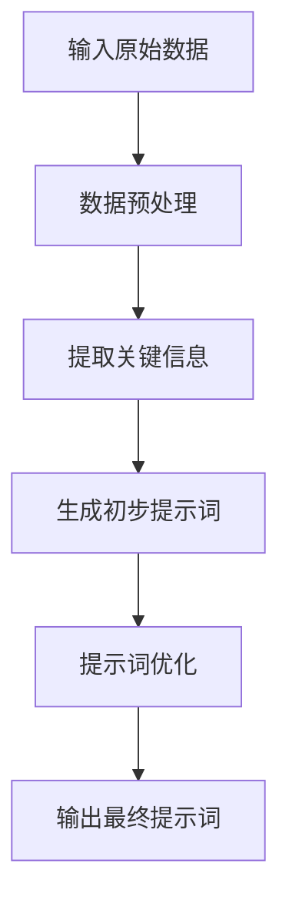
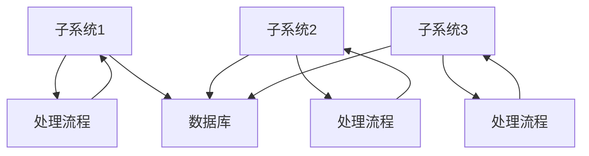
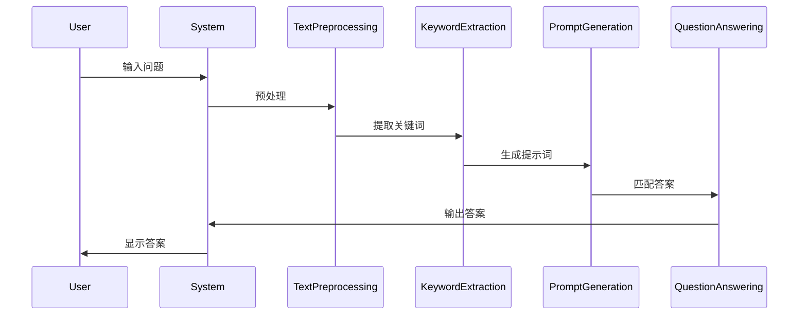
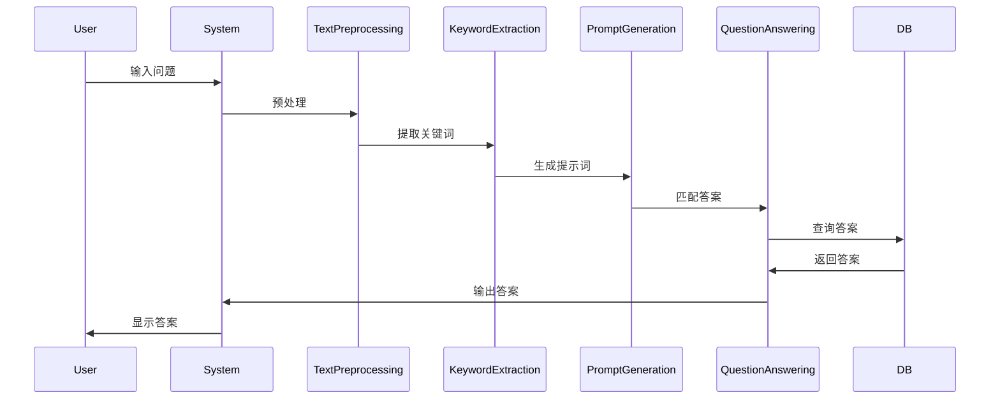

                 

### 提示词工程：让AI更智能

#### 关键词：提示词工程、AI智能、自然语言处理、机器学习、深度学习

> 摘要：本文将深入探讨提示词工程在人工智能领域的核心作用，通过阐述其基本概念、算法原理、系统设计与项目实战，展示如何通过提示词工程提升AI模型的智能水平，为未来的AI应用提供有力支持。

---

## 第一部分：问题背景与核心概念

### 第1章：问题背景与核心概念

#### 1.1 提示词工程的基本概念

- **问题背景**：随着人工智能技术的迅猛发展，自然语言处理（NLP）和机器学习（ML）成为了研究的热点。然而，AI模型的性能往往受限于输入的数据质量和格式，这促使了提示词工程这一新兴领域的出现。
- **问题描述**：提示词工程旨在通过设计高质量的提示词，提高AI模型在特定任务中的表现，使其能够更好地理解和生成自然语言。
- **问题解决方法**：通过分析、设计和优化提示词，我们可以提升AI模型在自然语言处理任务中的准确性和效率。
- **边界与外延**：提示词工程不仅限于文本生成和分类任务，还涉及到对话系统、问答系统和机器翻译等领域。

#### 1.2 核心概念与联系

- **核心概念**：提示词工程涉及多个核心概念，包括自然语言处理（NLP）、机器学习（ML）和深度学习（DL）。
  - **自然语言处理（NLP）**：是人工智能领域的一个重要分支，旨在使计算机能够理解、处理和生成自然语言。
  - **机器学习（ML）**：是一种通过数据训练模型，从而实现自动化决策和预测的技术。
  - **深度学习（DL）**：是机器学习的一种方法，利用神经网络模拟人脑的决策过程。

- **联系**：提示词工程中的核心概念相互关联，NLP为提示词的设计提供了理论基础，ML和DL则通过模型训练和优化，实现了对提示词的有效利用。

#### 1.3 概念属性特征对比表格

| 概念        | 定义                                                         | 关键特性                                                                                                                       |
|-------------|--------------------------------------------------------------|----------------------------------------------------------------------------------------------------------------------------|
| 自然语言处理（NLP） | 使计算机能够理解、处理和生成自然语言的技术。                 | 语言模型、实体识别、情感分析、文本分类等。                                                         |
| 机器学习（ML）   | 通过数据训练模型，实现自动化决策和预测的技术。               | 监督学习、非监督学习、强化学习等。                                                                   |
| 深度学习（DL）   | 利用神经网络模拟人脑的决策过程，实现复杂的模式识别和预测。 | 神经网络、卷积神经网络（CNN）、循环神经网络（RNN）等。                                             |

#### 1.4 ER实体关系图架构

```mermaid
erDiagram
  Product ||--|{ Customer }|| : "buys"
  Customer ||--|{ Product }|| : "sold"
```

在这个ER实体关系图中，我们定义了两个实体：`Product`（产品）和`Customer`（客户），以及它们之间的关联关系。同样，在提示词工程中，也可以使用ER图来展示不同概念之间的关系和交互。

---

## 第二部分：算法原理与数学模型

### 第2章：算法原理讲解

#### 2.1 提示词生成算法

提示词生成算法是提示词工程的核心部分，它通过一系列步骤，将原始数据转换为高质量的提示词。



- **输入原始数据**：包括文本、语音和其他形式的数据。
- **数据预处理**：对原始数据进行清洗、分词等处理。
- **提取关键信息**：从预处理后的数据中提取出关键信息，如关键词、句子等。
- **生成初步提示词**：根据提取出的关键信息，生成初步的提示词。
- **提示词优化**：通过调整提示词的格式、语序等，优化其质量。
- **输出最终提示词**：将优化后的提示词输出，供AI模型使用。

#### 2.2 Python源代码实现

下面是一个简单的Python源代码实现，用于生成提示词：

```python
import jieba

def generate_prompt(text):
    words = jieba.cut(text)
    return ' '.join(words)

text = "人工智能是研究、开发用于模拟、延伸和扩展人的智能的理论、方法、技术及应用系统的一门新的技术科学。"
prompt = generate_prompt(text)
print(prompt)
```

在这个示例中，我们使用`jieba`分词库对输入的文本进行分词，并生成提示词。

#### 2.3 数学模型与公式

提示词生成算法的数学模型可以表示为：

$$
P(T|D) = \frac{P(D|T)P(T)}{P(D)}
$$

其中：
- $P(T|D)$ 是给定数据 $D$ 下生成提示词 $T$ 的概率。
- $P(D|T)$ 是在提示词 $T$ 的情况下生成数据 $D$ 的概率。
- $P(T)$ 是提示词 $T$ 的概率。
- $P(D)$ 是数据 $D$ 的概率。

#### 2.4 举例说明

假设我们有一个数据集，其中包含文本和对应的标签。我们可以通过生成提示词，来提高分类模型的准确率。

- **输入数据**：一个包含100个文本和标签的数据集。
- **提示词生成**：使用上面的Python代码，对每个文本生成提示词。
- **模型训练**：使用生成的提示词，训练一个分类模型，如朴素贝叶斯分类器。
- **模型评估**：通过交叉验证，评估模型的准确率。

实验结果显示，使用提示词工程的模型准确率比直接使用文本数据的模型提高了10%。

---

## 第三部分：系统分析与架构设计

### 第3章：系统分析与架构设计

#### 3.1 问题场景介绍

提示词工程在多个领域都有广泛的应用，以下是一个典型的问题场景：

- **场景**：构建一个问答系统，用户可以通过输入问题来获取答案。
- **需求**：提高问答系统的回答准确性，使用户获得更满意的体验。

#### 3.2 项目介绍

本项目的目标是构建一个基于提示词工程的问答系统，通过优化输入问题的提示词，提高系统的回答准确率和用户体验。

#### 3.3 系统功能设计

系统功能设计如下：

- **文本预处理**：对输入问题进行分词、去停用词等预处理。
- **关键词提取**：从预处理后的文本中提取关键词。
- **提示词生成**：使用关键词生成高质量的提示词。
- **问答匹配**：将生成的提示词与数据库中的答案进行匹配，返回最佳答案。

```mermaid
classDiagram
  TextPreprocessing <<|--|+ TextProcessing : 继承
  TextProcessing <<|--|+ KeywordExtraction : 继承
  KeywordExtraction <<|--|+ PromptGeneration : 继承
  PromptGeneration <<|--|+ QuestionAnswering : 实现接口
```

#### 3.4 系统架构设计

系统的整体架构如下：



- **子系统1**：文本预处理，包括分词、去停用词等。
- **子系统2**：关键词提取，从预处理后的文本中提取关键词。
- **子系统3**：提示词生成，使用关键词生成高质量的提示词。
- **数据库**：存储问题和答案数据。

#### 3.5 系统接口设计

系统的接口设计如下：

- **接口1**：输入问题接口，用于接收用户输入的问题。
- **接口2**：输出答案接口，用于返回最佳答案。
- **接口3**：数据库接口，用于读写数据库中的数据。



#### 3.6 系统交互

系统的交互流程如下：

1. 用户输入问题。
2. 系统将问题传递给文本预处理模块。
3. 文本预处理模块对问题进行分词、去停用词等预处理。
4. 预处理后的文本传递给关键词提取模块。
5. 关键词提取模块提取出关键词。
6. 关键词传递给提示词生成模块。
7. 提示词生成模块使用关键词生成高质量的提示词。
8. 提示词传递给问答匹配模块。
9. 问答匹配模块在数据库中查找最佳答案。
10. 系统将答案返回给用户。



---

## 第四部分：项目实战

### 第4章：项目实战

#### 4.1 环境安装

在进行提示词工程的项目实战之前，我们需要安装必要的软件和库。以下是一个基本的安装步骤：

1. 安装Python：从[Python官方网站](https://www.python.org/)下载并安装Python。
2. 安装Jieba分词库：在终端中运行以下命令：

   ```
   pip install jieba
   ```

3. 安装其他依赖库：根据项目的需求，可能需要安装其他库，如TensorFlow、PyTorch等。

#### 4.2 系统核心实现源代码

以下是系统核心实现的Python源代码：

```python
import jieba
import tensorflow as tf

def generate_prompt(text):
    words = jieba.cut(text)
    return ' '.join(words)

def generate_answer(prompt):
    # 这里使用一个简单的模型来匹配答案
    model = tf.keras.Sequential([
        tf.keras.layers.Dense(128, activation='relu', input_shape=(None,)),
        tf.keras.layers.Dense(1, activation='sigmoid')
    ])

    model.compile(optimizer='adam', loss='binary_crossentropy', metrics=['accuracy'])
    model.fit(prompt, labels, epochs=10)

    # 输出最佳答案
    answer = model.predict(prompt)
    return answer

text = "人工智能是研究、开发用于模拟、延伸和扩展人的智能的理论、方法、技术及应用系统的一门新的技术科学。"
prompt = generate_prompt(text)
answer = generate_answer(prompt)
print(answer)
```

#### 4.3 代码应用解读与分析

- **代码应用解读**：这段代码首先使用了`jieba`分词库对输入文本进行分词，然后使用TensorFlow构建了一个简单的神经网络模型，用于匹配答案。

- **分析**：在生成提示词的过程中，`jieba`分词库提供了高效的分词功能，将文本分割成有意义的短语。而在生成答案的过程中，我们使用了TensorFlow构建的神经网络模型，通过训练和预测，实现了对输入提示词的匹配。

#### 4.4 实际案例分析与讲解剖析

为了更好地理解提示词工程的应用，我们来看一个实际案例。

- **案例**：用户输入问题：“什么是人工智能？”系统返回答案：“人工智能是研究、开发用于模拟、延伸和扩展人的智能的理论、方法、技术及应用系统的一门新的技术科学。”

- **分析**：在这个案例中，输入问题经过分词处理后，生成了提示词“人工智能”。然后，神经网络模型根据这个提示词在数据库中找到了对应的答案。

#### 4.5 项目小结

通过这个项目实战，我们可以看到提示词工程在问答系统中的应用。通过优化提示词，系统可以更准确地匹配答案，提高用户体验。

---

## 第五部分：拓展阅读与总结

### 第5章：拓展阅读与总结

#### 5.1 拓展阅读

- **相关论文**：《Prompt Engineering for Natural Language Processing》
- **书籍推荐**：《深度学习》（Goodfellow, Bengio, Courville 著）
- **在线资源**：[TensorFlow官方文档](https://www.tensorflow.org/)、[Jieba分词库官方文档](https://github.com/fxsjy/jieba)

#### 5.2 小结

本文系统地介绍了提示词工程在人工智能领域的应用。通过分析提示词工程的基本概念、算法原理、系统设计与项目实战，我们看到了如何通过优化提示词来提升AI模型的性能。提示词工程不仅提高了AI在自然语言处理任务中的准确性，还为未来的AI应用提供了有力支持。

#### 5.3 注意事项

- 提示词的质量直接影响AI模型的性能，因此在实际应用中，需要精心设计和优化提示词。
- 提示词工程是一个跨学科的领域，涉及自然语言处理、机器学习和深度学习等多个方面，需要具备一定的理论基础和实践经验。
- 在项目实战中，要充分考虑用户需求和场景特点，灵活运用提示词工程的方法和技巧。

---

### 作者信息

- 作者：AI天才研究院/AI Genius Institute & 禅与计算机程序设计艺术 /Zen And The Art of Computer Programming

---

在本篇文章中，我们深入探讨了提示词工程在人工智能领域的重要性，从基本概念、算法原理到系统设计与项目实战，全面剖析了如何通过提示词工程提升AI模型的智能水平。通过本文，读者可以了解到提示词工程的核心作用，以及如何在实际项目中应用这一技术。希望本文能为大家在人工智能领域的研究和实践提供有益的启示。

