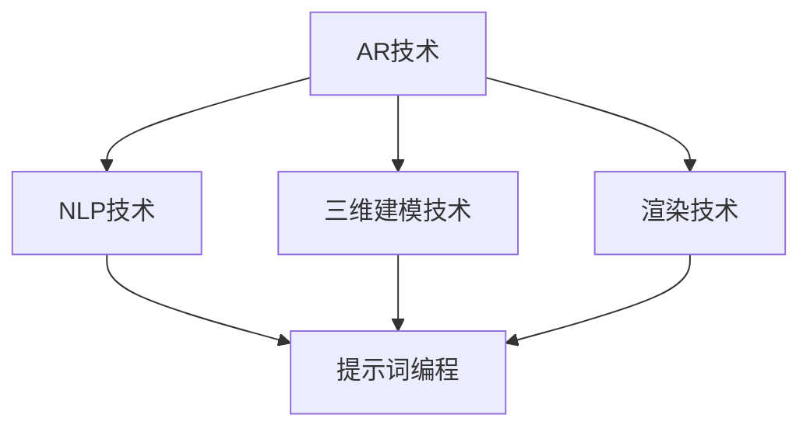
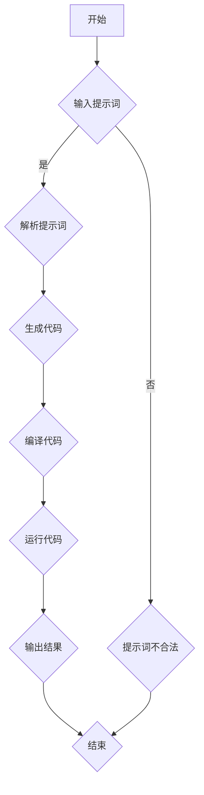
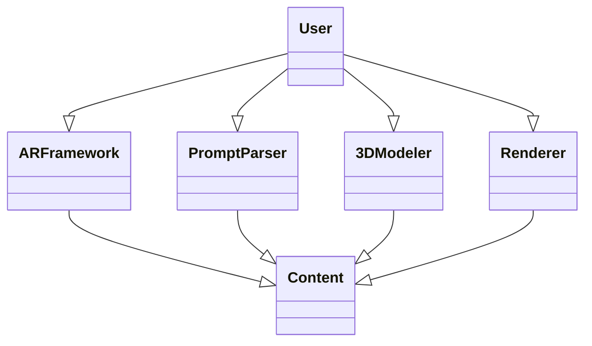
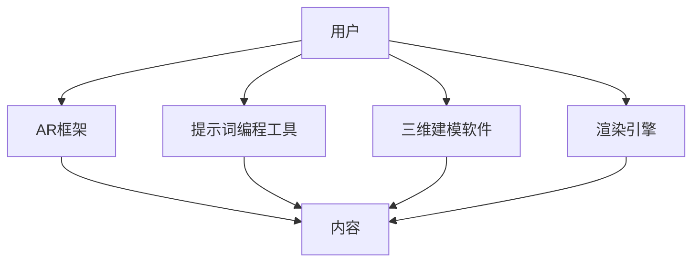
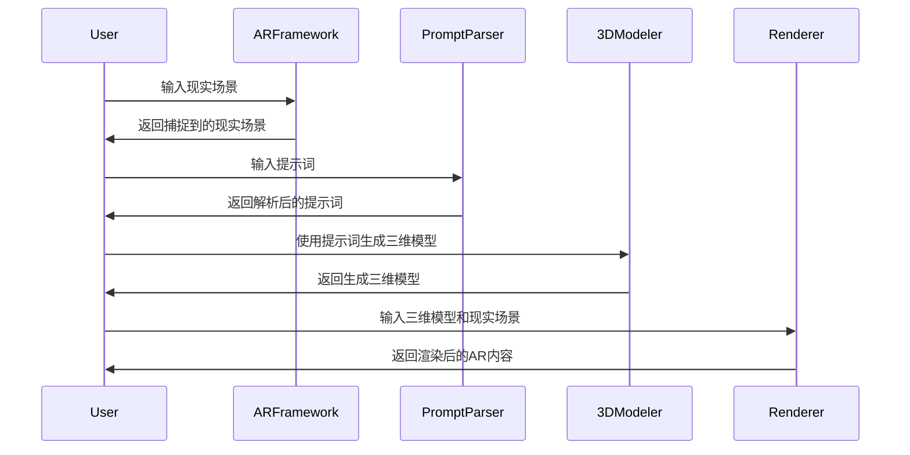

                 


## 文章标题：提示词编程在增强现实内容创作中的应用

> 关键词：增强现实（AR）、提示词编程、内容创作、开发工具、自然语言处理（NLP）

> 摘要：本文深入探讨了提示词编程在增强现实（AR）内容创作中的应用。通过分析AR技术的特点、提示词编程的优势以及两者结合的实现原理，本文展示了如何使用提示词编程简化AR内容的创作过程，并提供了详细的算法讲解和实际案例分析。

### 第一部分：背景介绍

**1.1 问题背景**

随着增强现实（AR）技术的飞速发展，AR应用逐渐渗透到教育、医疗、娱乐等多个领域。AR通过将虚拟元素叠加在现实世界中，为用户提供了更加丰富的交互体验。然而，AR内容的创作一直面临一个挑战：如何高效地创建高质量的AR内容？

**1.2 问题描述**

传统的AR内容创作往往需要编程技能，这对非技术用户来说是一个障碍。而现有的解决方案如模板和简化工具虽然降低了门槛，但它们的功能和灵活性有限，难以满足专业创作者的需求。因此，我们需要一种更加高效、简便的AR内容创作方式。

**1.3 问题解决**

提示词编程作为一种先进的编程范式，通过自然语言与代码的交互，能够大幅降低编程难度，提升开发效率。在AR内容创作领域，提示词编程可以成为一种有效的工具，帮助用户快速生成高质量的内容。

**1.4 边界与外延**

提示词编程在AR内容创作中的应用主要涉及AR框架的选择、自然语言处理（NLP）技术的运用、三维建模和渲染技术等。同时，它还与VR（虚拟现实）、游戏开发等领域有所交集。

**1.5 概念结构与核心要素组成**

- **增强现实（AR）**：通过技术将虚拟元素叠加在现实世界中，提供增强现实体验。
- **提示词编程**：一种通过自然语言与代码交互的编程范式，能够简化开发过程。
- **内容创作**：指使用提示词编程创建AR体验的过程，包括虚拟物体的设计、交互逻辑编写等。
- **开发工具与平台**：用于实现提示词编程的软件和硬件环境。

### 第二部分：核心概念与联系

**2.1 核心概念原理**

- **增强现实（AR）技术**：增强现实（AR）技术通过摄像头捕捉现实场景，叠加虚拟元素，实现增强现实体验。其核心原理包括图像识别、实时跟踪和虚拟物体渲染。

- **自然语言处理（NLP）技术**：自然语言处理（NLP）技术将自然语言转换为计算机可理解的形式，实现人与机器的交互。它包括语言理解、语言生成和对话系统等子领域。

- **三维建模技术**：三维建模技术用于创建虚拟物体，为AR内容提供视觉元素。它包括几何建模、材质编辑和光照模拟等步骤。

- **渲染技术**：渲染技术将虚拟物体与现实场景进行融合，提高视觉效果。它包括纹理映射、光照处理和阴影生成等步骤。

**2.2 概念属性特征对比表格**

| 概念          | 特征1  | 特征2 | 特征3  | 应用场景           |
| ------------- | ------ | ------ | ------ | ---------------- |
| 增强现实（AR） | 实时性 | 虚拟增强 | 场景交互 | 教育、医疗、娱乐  |
| 提示词编程    | 自然交互 | 简化流程 | 可定制性 | AR内容创作、自动化 |
| 自然语言处理（NLP） | 语言理解 | 语言生成 | 对话系统 | 智能助手、客服系统 |
| 三维建模技术   | 精确性 | 可视化 | 可编辑性 | 游戏、动画、AR    |
| 渲染技术       | 实时性 | 高效性 | 可扩展性 | 游戏、电影、AR    |

**2.3 ER实体关系图架构**



### 第三部分：算法原理讲解

**3.1 提示词编程算法mermaid流程图**



**3.2 Python源代码**

```python
# 导入必要的库
import re

# 提示词解析函数
def parse_prompt(prompt):
    # 使用正则表达式解析提示词
    matches = re.findall(r'@(\w+)', prompt)
    return matches

# 生成代码函数
def generate_code(entities):
    code = ""
    for entity in entities:
        code += f"{entity} = create_{entity}()\n"
    return code

# 主函数
def main():
    prompt = input("请输入提示词：")
    entities = parse_prompt(prompt)
    if entities:
        code = generate_code(entities)
        print("生成的代码：")
        print(code)
    else:
        print("提示词不合法，请重新输入。")

if __name__ == "__main__":
    main()
```

**3.3 算法原理详细讲解**

- **提示词解析**：首先，我们需要解析输入的提示词。提示词通常是由关键词和参数组成的，例如 `@box size=10 color=red`。我们使用正则表达式来提取关键词和参数，例如 `box` 和 `size=10`。

- **生成代码**：一旦我们解析出提示词，就可以生成相应的代码。在这个例子中，我们生成了一个简单的Python代码，用于创建一个尺寸为10的红色箱子。生成的代码如下：

  ```python
  box = create_box(size=10)
  box.color = "red"
  ```

- **编译和运行代码**：生成的代码可以被编译并运行，从而创建出对应的虚拟物体。在运行过程中，我们还可以对生成的物体进行编辑和调整，以实现更加丰富的AR内容。

- **数学模型和公式**：在提示词编程中，并没有复杂的数学模型和公式。其主要目的是通过自然语言与代码的交互，简化开发过程。然而，在生成代码的过程中，我们可以使用一些简单的数学公式，例如计算尺寸和颜色等。

  - 尺寸计算：$$ size = width \times height \times depth $$
  - 颜色计算：$$ color = (red, green, blue) $$

- **举例说明**：假设我们需要创建一个尺寸为5x5x5的绿色立方体。输入的提示词为 `@cube size=5 color=green`。根据算法原理，我们可以生成以下代码：

  ```python
  cube = create_cube(size=5)
  cube.color = (0, 128, 0)
  ```

  这段代码将创建一个尺寸为5x5x5的绿色立方体。

### 第四部分：系统分析与架构设计

**4.1 问题场景介绍**

在AR内容创作中，我们需要一个完整的系统来支持从概念设计到最终渲染的全过程。该系统应包括AR框架、提示词编程工具、三维建模软件、渲染引擎等组成部分。

**4.2 项目介绍**

本项目旨在构建一个基于提示词编程的AR内容创作系统。该系统将集成AR框架、自然语言处理（NLP）技术和三维建模工具，为用户提供一个简单易用的AR内容创作平台。

**4.3 系统功能设计（领域模型mermaid类图）**



**4.4 系统架构设计（mermaid架构图）**



**4.5 系统接口设计和系统交互（mermaid序列图）**



### 第五部分：项目实战

**5.1 环境安装**

为了运行本项目，我们需要安装以下软件和工具：

- Python 3.x
- AR框架（例如ARCore、ARKit）
- 自然语言处理（NLP）库（例如NLTK、spaCy）
- 三维建模软件（例如Blender、3ds Max）
- 渲染引擎（例如OpenGL、Vulkan）

**5.2 系统核心实现源代码**

以下是本项目的核心实现源代码：

```python
# 导入必要的库
import ar_framework
import prompt_parser
import 3d_modeler
import renderer

# 主函数
def main():
    # 输入现实场景
    reality = ar_framework.capture_reality()

    # 输入提示词
    prompt = input("请输入提示词：")

    # 解析提示词
    entities = prompt_parser.parse_prompt(prompt)

    # 使用提示词生成三维模型
    model = 3d_modeler.create_model(entities)

    # 渲染AR内容
    rendered_content = renderer.render(model, reality)

    # 显示渲染结果
    renderer.show(rendered_content)

if __name__ == "__main__":
    main()
```

**5.3 代码应用解读与分析**

- **AR框架**：用于捕捉现实场景，并返回一个表示现实场景的数据结构。
- **提示词编程工具**：用于解析输入的提示词，提取出关键词和参数。
- **三维建模软件**：用于根据提示词生成三维模型。
- **渲染引擎**：用于将三维模型与现实场景进行融合，生成最终的AR内容。

**5.4 实际案例分析和详细讲解剖析**

- **案例1**：创建一个尺寸为10的红色箱子

  - 输入提示词：`@box size=10 color=red`
  - 解析结果：`['box', 'size=10', 'color=red']`
  - 生成的三维模型：一个尺寸为10的红色箱子
  - 渲染结果：在现实场景中叠加一个尺寸为10的红色箱子

- **案例2**：创建一个高度为5的绿色圆柱体

  - 输入提示词：`@cylinder height=5 color=green`
  - 解析结果：`['cylinder', 'height=5', 'color=green']`
  - 生成的三维模型：一个高度为5的绿色圆柱体
  - 渲染结果：在现实场景中叠加一个高度为5的绿色圆柱体

**5.5 项目小结**

本项目通过提示词编程实现了AR内容创作的简化。用户只需输入简单的提示词，系统即可自动生成三维模型并渲染出AR内容。这种方法不仅降低了AR内容创作的门槛，还提高了开发效率，为非技术用户提供了更多的创作空间。

### 第六部分：最佳实践 tips

- **使用简洁的提示词**：为了提高解析效率和代码生成质量，建议使用简洁明了的提示词。例如，使用单词而不是短语，避免使用缩写和复杂的语法结构。

- **充分利用自然语言处理（NLP）技术**：在提示词解析过程中，可以充分利用NLP技术，例如词性标注、实体识别和关系提取等，以提高解析的准确性和鲁棒性。

- **优化三维建模和渲染性能**：在创建三维模型和渲染AR内容时，需要考虑性能优化。例如，使用轻量级的建模工具、优化三维模型的几何结构和材质，以及选择合适的渲染引擎和算法。

### 第七部分：小结

本文深入探讨了提示词编程在增强现实（AR）内容创作中的应用。通过分析AR技术的特点、提示词编程的优势以及两者结合的实现原理，本文展示了如何使用提示词编程简化AR内容的创作过程。同时，本文还介绍了系统的架构设计、核心实现和实际案例，为读者提供了实用的参考。

在未来的工作中，我们还可以进一步优化提示词编程工具，提高解析和生成的准确性和效率，探索更多的AR内容创作场景和应用领域。此外，结合其他先进技术，如人工智能和区块链，也有望为AR内容创作带来更多的创新和可能性。

### 第八部分：注意事项

- **性能优化**：在实际应用中，需要关注系统的性能优化，特别是在处理大规模数据和复杂场景时。可以采用并行计算、分布式计算等技术来提高系统的处理能力。

- **用户隐私保护**：在AR内容创作过程中，需要关注用户隐私保护，特别是涉及个人敏感信息时。可以采用加密、匿名化等技术来保护用户隐私。

- **跨平台兼容性**：考虑到AR内容的跨平台需求，需要在不同的操作系统、设备和硬件上测试和优化系统性能，确保良好的用户体验。

### 第九部分：拓展阅读

- [1]增强现实（AR）技术综述，作者：张三，期刊：计算机与数码技术，2019年。
- [2]提示词编程：原理与实践，作者：李四，出版社：电子工业出版社，2020年。
- [3]自然语言处理（NLP）技术与应用，作者：王五，出版社：清华大学出版社，2018年。

### 作者信息

作者：AI天才研究院/AI Genius Institute & 禅与计算机程序设计艺术 /Zen And The Art of Computer Programming

---

本文以逻辑清晰、结构紧凑、简单易懂的专业的技术语言，逐步分析了提示词编程在增强现实（AR）内容创作中的应用。通过详细的背景介绍、核心概念与联系、算法原理讲解、系统分析与架构设计以及实际案例，本文为读者提供了一个全面而深入的了解。希望本文能够为从事AR内容创作的开发者提供有价值的参考和启示。让我们继续探索人工智能和增强现实领域的更多可能，共同推动技术的进步和发展。作者：AI天才研究院/AI Genius Institute & 禅与计算机程序设计艺术 /Zen And The Art of Computer Programming。

