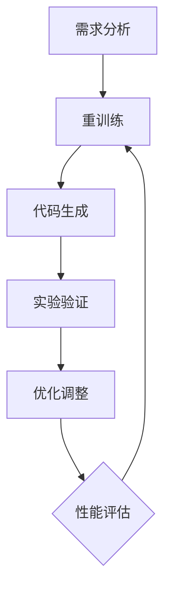
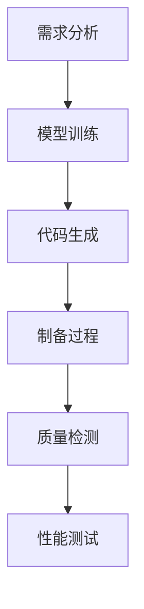
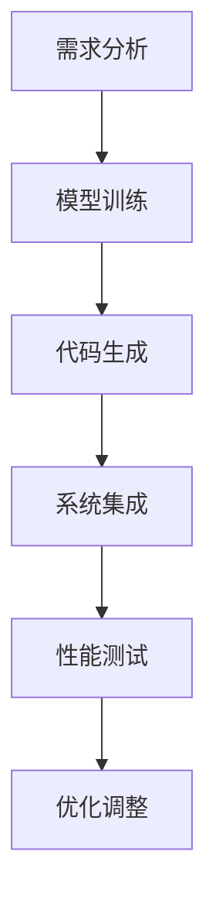
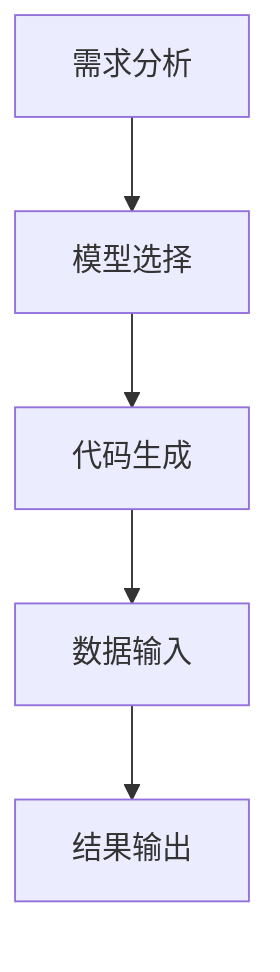
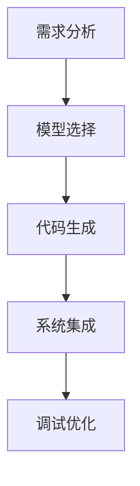

                 

### 第一部分: 引言

## 第1章 引言

### 1.1 问题背景

#### 提示词编程在智能材料设计中的应用背景

智能材料是当前科技领域的研究热点之一，它们通过对外界刺激（如温度、光照、压力等）产生可调控的响应，从而在许多应用领域展现出巨大的潜力。例如，智能窗户可以自动调节光线和热量，智能可穿戴材料可以实时监测健康状态，智能建筑材料可以提升建筑物的自我修复能力。

然而，智能材料的设计与优化往往涉及复杂的物理、化学和生物过程，需要大量实验和计算。这一过程不仅耗时耗力，而且往往难以准确预测材料的最终性能。因此，开发一种高效的智能材料设计方法，以减少实验次数、缩短研发周期并提高材料性能，成为了亟待解决的问题。

提示词编程（Prompt Programming）是一种基于自然语言处理和生成模型的编程方法。它通过自然语言描述来指导机器学习模型的训练和推理过程，从而实现自动化编程。这种方法在许多领域，如文本生成、图像处理和自动化代码修复等方面，已经取得了显著的成果。

将提示词编程应用于智能材料设计，意味着我们可以利用自然语言来描述材料的性能需求、设计目标和制备条件，从而指导机器学习模型自动优化材料的设计和制备过程。这种方法不仅可以大大提高设计效率，还可以提高材料的性能预测准确性。

#### 智能材料的发展趋势

智能材料的研究和应用已经经历了数十年的发展。目前，智能材料在多个领域取得了重要突破，如环境监测、医疗健康、能源存储和转换、智能制造等。以下是一些智能材料发展的主要趋势：

1. **多功能集成**：智能材料正在向多功能集成方向发展，例如，一种智能材料可以同时具备自修复、抗菌、传感等功能。
2. **智能化制备**：随着3D打印、微流控技术等制备技术的进步，智能材料的制备过程更加精准和高效。
3. **跨学科融合**：智能材料的研究逐渐与生物学、化学、物理学等多个学科领域相结合，推动材料科学的创新发展。
4. **环境友好**：环保意识日益增强，智能材料的发展也趋向于更环保、可降解的材料体系。

#### 智能材料的基本概念

智能材料，也被称为智能响应材料，是一类能够对环境刺激（如温度、光照、压力、电场、磁场、化学物质等）产生可测量的、可重复的响应的材料。这些响应可以是物理性质（如形状、颜色、硬度、导电性等）或化学性质（如pH值、离子浓度等）的变化。

根据智能材料的响应机制，它们可以分为以下几类：

1. **光电响应材料**：这类材料能够对光照强度、波长等光刺激产生响应，如光致变色材料、光致形变材料。
2. **热响应材料**：这类材料能够对温度变化产生响应，如热敏变色材料、热致形变材料。
3. **电响应材料**：这类材料能够对电场、电压等电刺激产生响应，如电致变色材料、电致形变材料。
4. **磁响应材料**：这类材料能够对磁场变化产生响应，如磁致变色材料、磁致形变材料。
5. **化学响应材料**：这类材料能够对化学物质（如气体、离子等）产生响应，如气体传感器材料、离子交换材料。

#### 智能材料的重要性

智能材料在多个领域展现出巨大的应用潜力，以下是一些重要应用：

1. **环境保护**：智能材料可以用于污染监测和治理，如自清洁材料、污染降解材料。
2. **医疗健康**：智能材料可以用于生物传感器、药物递送系统、人工器官等医疗设备。
3. **能源领域**：智能材料可以用于能源存储和转换，如锂离子电池、太阳能电池、热电材料。
4. **智能制造**：智能材料可以用于智能机器人、自适应机械系统、智能控制系统。
5. **建筑领域**：智能材料可以用于自修复混凝土、智能玻璃、自适应结构材料。

综上所述，智能材料的设计与优化是当前材料科学和工程领域的重要研究方向。通过将提示词编程应用于智能材料设计，我们可以显著提高设计效率，推动智能材料的应用和发展。

### 1.2 提示词编程简介

#### 提示词编程的定义

提示词编程（Prompt Programming）是一种基于自然语言处理（NLP）和生成模型的方法，它通过输入自然语言提示词来指导机器学习模型的训练和推理过程。这种方法的核心思想是利用人类的语言描述来引导机器学习模型，使其能够更好地理解和执行复杂任务。

提示词编程可以看作是一种“自动化编程”技术，它通过自然语言输入来生成代码、算法和模型。这种方法不仅能够提高编程效率，还能够减少对专业编程知识的依赖，使得更多的人能够参与到机器学习项目中。

#### 提示词编程的核心原理

提示词编程的核心原理是基于大规模语言模型（如GPT-3、BERT等）的自动推理能力。这些语言模型通过学习大量的文本数据，能够捕捉到语言中的复杂结构和语义关系。在提示词编程中，用户通过输入自然语言提示词，模型会根据这些提示词生成相应的代码、算法或模型。

以下是提示词编程的核心原理：

1. **语言理解**：模型需要理解输入的提示词，包括其中的语法、语义和上下文。
2. **代码生成**：模型根据理解的结果，生成相应的代码、算法或模型。
3. **优化调整**：根据生成的结果，用户可以进行调整和优化，以获得更好的效果。

#### 机器学习与提示词编程的关系

机器学习是提示词编程的基础，两者之间有着紧密的联系。机器学习是一种通过数据训练模型，使其能够进行预测或决策的技术。在提示词编程中，机器学习模型是核心组成部分，它通过学习大量的数据来理解自然语言输入，并生成相应的输出。

机器学习与提示词编程的关系可以概括为：

1. **模型训练**：机器学习模型需要通过大量数据进行训练，以掌握语言的结构和语义。
2. **模型应用**：训练好的模型可以用于提示词编程，通过自然语言输入来生成代码、算法或模型。
3. **模型优化**：通过用户的反馈，不断优化模型，以提高其生成效果和准确性。

#### 提示词编程的关键技术

提示词编程涉及多个关键技术，包括自然语言处理、生成模型、自动化编程等。以下是一些关键技术：

1. **自然语言处理（NLP）**：NLP技术是提示词编程的基础，它包括词法分析、句法分析、语义分析等。通过NLP技术，模型能够理解自然语言输入，并提取其中的关键信息。
2. **生成模型**：生成模型是提示词编程的核心，如GPT-3、BERT等。这些模型通过学习大量的文本数据，能够生成符合语言规则和语义逻辑的文本。
3. **自动化编程**：自动化编程技术使得提示词编程成为可能。通过自动化编程，用户可以不用编写复杂的代码，而是通过自然语言输入来指导模型的训练和推理过程。
4. **多模态学习**：多模态学习是将多种类型的数据（如文本、图像、音频等）结合在一起进行学习。在提示词编程中，多模态学习可以帮助模型更好地理解复杂的任务和场景。

#### 提示词编程的发展历程

提示词编程的发展历程可以分为以下几个阶段：

1. **早期探索**：20世纪80年代，人工智能领域开始探索基于自然语言输入的编程方法。这一阶段的研究主要集中在自然语言理解方面。
2. **生成模型兴起**：随着深度学习和生成模型的兴起，提示词编程进入了新的阶段。生成模型如GPT-3、BERT等的出现，使得模型能够更好地理解和生成复杂的文本。
3. **应用扩展**：近年来，提示词编程在多个领域得到了广泛应用，如文本生成、图像处理、自动化代码修复等。随着应用场景的扩大，提示词编程的技术也在不断进步。
4. **未来展望**：未来，提示词编程有望在更多领域发挥作用，如智能设计、智能合成、自动化决策等。随着技术的不断进步，提示词编程将成为人工智能领域的重要方向。

### 1.3 智能材料设计概述

#### 智能材料设计的基本流程

智能材料的设计是一个复杂的过程，涉及多个阶段和步骤。以下是一个典型的智能材料设计基本流程：

1. **需求分析**：明确智能材料的应用场景和性能需求，如自修复、抗菌、传感器等。
2. **材料选择**：根据需求分析结果，选择合适的材料或材料体系。这包括天然材料、合成材料、复合材料等。
3. **材料制备**：通过物理、化学或生物方法制备智能材料，如溶液法、熔融法、静电纺丝法等。
4. **性能测试**：对制备的智能材料进行性能测试，包括物理性能、化学性能、力学性能等。
5. **优化设计**：根据性能测试结果，对材料设计进行优化，以提高材料的性能和应用效果。
6. **应用验证**：将优化后的智能材料应用于实际场景，进行验证和评估。

#### 智能材料的分类

智能材料可以根据其响应机制和功能进行分类，以下是一些常见的智能材料类型：

1. **光电响应材料**：这类材料能够对光刺激产生响应，如光致变色材料、光致形变材料等。
2. **热响应材料**：这类材料能够对温度变化产生响应，如热敏变色材料、热致形变材料等。
3. **电响应材料**：这类材料能够对电刺激产生响应，如电致变色材料、电致形变材料等。
4. **磁响应材料**：这类材料能够对磁场变化产生响应，如磁致变色材料、磁致形变材料等。
5. **化学响应材料**：这类材料能够对化学物质产生响应，如气体传感器材料、离子交换材料等。
6. **多功能智能材料**：这类材料同时具备多种响应机制和功能，如具有自修复、抗菌、传感等功能的复合材料。

#### 不同类型智能材料的特点

不同类型的智能材料具有各自的特点，以下是一些典型特点：

1. **光电响应材料**：具有较高的光学透明性和颜色可调性，广泛应用于光学器件和显示器等领域。
2. **热响应材料**：具有良好的热敏性能，可以用于温度传感器、热控涂层等领域。
3. **电响应材料**：具有良好的电导性能，可以用于电子器件、柔性显示屏等领域。
4. **磁响应材料**：具有良好的磁响应性能，可以用于磁性器件、磁记录等领域。
5. **化学响应材料**：具有较高的化学活性和响应速度，可以用于传感器、药物递送等领域。
6. **多功能智能材料**：具备多种功能，可以实现多种应用，具有较高的综合性能和应用潜力。

#### 智能材料的应用领域

智能材料在多个领域展现了广泛的应用前景，以下是一些主要应用领域：

1. **生物医学**：智能材料可以用于生物传感器、药物递送、人工器官等领域，为生物医学工程提供新的材料解决方案。
2. **环境监测**：智能材料可以用于污染监测、环境自修复等领域，为环境保护提供技术支持。
3. **能源领域**：智能材料可以用于太阳能电池、热电材料、超级电容器等领域，为可再生能源开发和能源存储提供新材料。
4. **电子电器**：智能材料可以用于柔性显示屏、电子器件、智能传感器等领域，推动电子电器行业的发展。
5. **建筑领域**：智能材料可以用于自修复混凝土、智能玻璃、自适应结构材料等领域，提高建筑物的功能性和安全性。
6. **智能制造**：智能材料可以用于智能机器人、自适应机械系统、智能控制系统等领域，为智能制造提供新材料和新方法。

综上所述，智能材料设计是一个涉及多学科、多领域的复杂过程。通过将提示词编程应用于智能材料设计，我们可以实现智能化、自动化的材料设计与优化，提高设计效率，推动智能材料的应用和发展。

### 1.4 书籍目的与结构安排

#### 书籍的目的

本书旨在探讨提示词编程在智能材料设计中的应用，通过系统的讲解和丰富的实例分析，帮助读者深入理解这一新兴领域的核心技术和应用场景。具体目标包括：

1. **普及提示词编程知识**：介绍提示词编程的基本概念、核心原理和关键技术，使读者对这一技术有一个全面的了解。
2. **深入智能材料设计**：探讨智能材料的设计原理、方法和应用，使读者能够将提示词编程技术应用于智能材料的设计与优化。
3. **提供实践指导**：通过具体实例和实战案例，帮助读者掌握提示词编程在智能材料设计中的实际应用方法。
4. **激发创新思维**：通过探讨提示词编程在智能材料设计中的应用潜力，激发读者在相关领域进行创新研究的兴趣。

#### 书籍的结构安排

本书分为八个章节，结构安排如下：

1. **第1章 引言**：介绍智能材料设计的问题背景、提示词编程的简介、智能材料设计概述以及书籍的目的与结构安排。
2. **第2章 提示词编程基础**：详细讲解提示词编程的基本概念、核心语言、工具和环境配置，并通过实例解析帮助读者理解。
3. **第3章 智能材料设计原理**：阐述智能材料的基本概念、设计方法、关键技术和分类及应用。
4. **第4章 提示词编程在智能材料设计中的应用**：探讨提示词编程与智能材料的结合、性能优化、制备应用以及实战案例。
5. **第5章 提示词编程工具在智能材料设计中的应用**：介绍常用提示词编程工具的具体应用，并通过实例分析加深理解。
6. **第6章 智能材料设计的案例分析**：通过具体案例展示智能材料设计的过程和结果，总结案例中的经验和启示。
7. **第7章 提示词编程在智能材料设计中的未来展望**：分析提示词编程在智能材料设计中的发展趋势、挑战与机遇以及应用前景。
8. **第8章 总结与展望**：对全书内容进行总结，给出学习提示与建议，并推荐拓展阅读和资源。

通过以上章节的安排，本书旨在为读者提供一个系统、全面、深入的提示词编程在智能材料设计中的应用指南，帮助读者掌握这一前沿技术的应用方法，并推动其在实际工程中的研究和应用。

### 第二部分: 提示词编程基础

## 第2章 提示词编程基础

### 2.1 提示词编程的基本概念

#### 提示词编程的定义

提示词编程（Prompt Programming）是一种结合了自然语言处理（NLP）和生成模型的编程方法，它通过自然语言提示词来引导机器学习模型的训练和推理过程。这种方法的核心思想是通过自然语言描述，使机器能够自动生成代码、算法或模型。

提示词编程的基本原理是将用户的自然语言输入转换为机器学习任务，然后利用机器学习模型自动生成相应的代码或模型。这种方法的优点在于它可以大幅减少人工编码的工作量，提高编程效率和准确性。

#### 提示词编程的工作原理

提示词编程的工作原理主要分为以下几个步骤：

1. **提示词输入**：用户通过自然语言输入提示词，描述任务的目标和需求。
2. **模型理解**：机器学习模型解析用户的自然语言输入，理解其中的语义和任务目标。
3. **代码生成**：模型根据提示词生成相应的代码或模型，可以是Python代码、机器学习模型等。
4. **优化调整**：用户可以对生成的代码或模型进行调整和优化，以达到最佳效果。

#### 机器学习与提示词编程的区别

机器学习和提示词编程虽然都与自动编程有关，但它们之间有一些显著的区别：

1. **目的不同**：机器学习主要是通过数据训练模型，使其能够进行预测或决策。而提示词编程则是通过自然语言输入，直接生成代码或模型。
2. **实现方式不同**：机器学习通常需要编写大量的训练数据、定义特征工程、选择合适的模型等。而提示词编程则主要通过输入自然语言提示词，利用预训练的生成模型生成代码或模型。
3. **适用范围不同**：机器学习适用于各种需要数据驱动的任务，而提示词编程更适用于需要基于自然语言描述的任务，如自动化代码修复、文本生成等。

### 2.2 提示词编程的核心语言

#### 常用提示词编程语言介绍

在提示词编程中，常用的核心语言主要包括Python、Java、JavaScript等。以下是这些语言的特点及其在提示词编程中的应用场景：

1. **Python**：Python是一种高级编程语言，以其简洁的语法和强大的库支持而闻名。Python在提示词编程中广泛使用，尤其是在生成模型和自然语言处理领域。常用的Python库包括TensorFlow、PyTorch、NLTK等。

2. **Java**：Java是一种面向对象的编程语言，具有良好的跨平台性和稳定性。Java在提示词编程中主要用于构建大型分布式系统，如基于Java的NLP库OpenNLP、Stanford NLP等。

3. **JavaScript**：JavaScript是一种客户端脚本语言，广泛用于网页开发和前端编程。在提示词编程中，JavaScript可以与后端语言（如Node.js）结合使用，实现动态交互和自动化代码生成。

#### 语言特点及应用场景

1. **Python**：Python的特点在于其简洁性和易读性，使得开发者可以快速编写和测试代码。Python在提示词编程中的应用场景包括：

   - **文本生成**：利用生成模型（如GPT-3）生成文章、故事、代码等。
   - **自动化代码修复**：通过分析代码错误，自动生成修复代码。
   - **自然语言处理**：处理和解析自然语言文本，为机器学习模型提供输入。

2. **Java**：Java的特点在于其稳定性和跨平台性，使其在大型分布式系统中广泛应用。Java在提示词编程中的应用场景包括：

   - **大规模数据处理**：处理和分析大规模文本数据，为生成模型提供输入。
   - **自动化测试**：通过自然语言描述，自动生成测试用例。
   - **智能客服**：基于自然语言处理，实现与用户的交互和对话。

3. **JavaScript**：JavaScript的特点在于其动态性和灵活性，使其在网页开发和前端编程中占据重要地位。JavaScript在提示词编程中的应用场景包括：

   - **前端自动化**：通过自然语言输入，自动生成前端代码。
   - **Web应用开发**：利用自然语言描述，自动生成Web应用架构和代码。
   - **自动化测试**：通过自然语言描述，自动生成前端和后端的测试用例。

### 2.3 提示词编程工具和环境配置

#### 提示词编程工具概述

提示词编程工具是进行提示词编程的重要支撑，常见的工具包括生成模型库、编程框架和集成开发环境（IDE）。

1. **生成模型库**：如TensorFlow、PyTorch等，用于构建和训练生成模型。
2. **编程框架**：如NLTK、spaCy等，用于自然语言处理和文本生成。
3. **IDE**：如PyCharm、Visual Studio Code等，提供代码编辑、调试和运行功能。

#### 提示词编程环境的搭建

搭建提示词编程环境通常需要以下步骤：

1. **安装操作系统**：选择适合的操作系统，如Windows、macOS或Linux。
2. **安装编程语言**：安装所选编程语言（如Python、Java、JavaScript）。
3. **安装生成模型库**：根据需求安装生成模型库（如TensorFlow、PyTorch）。
4. **安装自然语言处理库**：根据需求安装自然语言处理库（如NLTK、spaCy）。
5. **配置IDE**：选择并配置适合的IDE（如PyCharm、Visual Studio Code），以提供代码编辑、调试和运行功能。

#### 环境配置的注意事项

在配置提示词编程环境时，需要注意以下几点：

1. **系统兼容性**：确保操作系统、编程语言和生成模型库兼容。
2. **依赖管理**：合理管理各种库和依赖，避免版本冲突。
3. **性能优化**：根据需求调整系统性能，如调整内存分配、线程数等。
4. **安全配置**：确保环境安全，避免潜在的安全风险。

通过以上步骤，我们可以搭建一个完整的提示词编程环境，为后续的编程实践打下坚实基础。

### 2.4 实例解析：简单提示词编程实践

#### 实例一：智能窗帘设计

假设我们需要设计一款智能窗帘，能够根据室内光线强度自动调节窗帘的开合。以下是使用提示词编程实现这一功能的步骤：

1. **需求分析**：用户描述需求：“设计一款智能窗帘，能够根据室内光线强度自动调节窗帘的开合。当室内光线强度超过某个阈值时，窗帘自动关闭；当室内光线强度低于该阈值时，窗帘自动打开。”

2. **模型训练**：使用生成模型库（如TensorFlow）训练一个智能窗帘模型。输入自然语言提示词，生成窗帘控制的代码和算法。

3. **代码生成**：模型生成以下Python代码：
```python
import RPi.GPIO as GPIO
import time

# 初始化GPIO
GPIO.setmode(GPIO.BCM)
GPIO.setup(18, GPIO.OUT)

# 定义光线传感器阈值
light_threshold = 600

# 定义窗帘开关函数
def open_blind():
    GPIO.output(18, GPIO.HIGH)
    print("窗帘打开")

def close_blind():
    GPIO.output(18, GPIO.LOW)
    print("窗帘关闭")

# 读取光线强度
def read_light():
    import board
    import busio
    i2c = busio.I2C(board.SCL, board.SDA)
    import adafruit_tsl2591
    sensor = adafruit_tsl2591.TSL2591(i2c)
    return sensor.lux

# 主循环
while True:
    light_intensity = read_light()
    if light_intensity > light_threshold:
        close_blind()
    else:
        open_blind()
    time.sleep(1)
```

4. **优化调整**：根据实际测试结果，调整光线阈值和窗帘开关速度，以提高窗帘的响应效果。

#### 实例二：智能调温玻璃设计

假设我们需要设计一款智能调温玻璃，能够根据室外温度自动调节室内温度。以下是使用提示词编程实现这一功能的步骤：

1. **需求分析**：用户描述需求：“设计一款智能调温玻璃，能够根据室外温度自动调节室内温度。当室外温度低于某个阈值时，玻璃保温层自动关闭，减少室内热量散失；当室外温度高于该阈值时，玻璃保温层自动开启，增加室内热量散失。”

2. **模型训练**：使用生成模型库（如TensorFlow）训练一个智能调温玻璃模型。输入自然语言提示词，生成调温玻璃控制的代码和算法。

3. **代码生成**：模型生成以下Python代码：
```python
import RPi.GPIO as GPIO
import time

# 初始化GPIO
GPIO.setmode(GPIO.BCM)
GPIO.setup(23, GPIO.OUT)

# 定义温度传感器阈值
temp_threshold = 20

# 定义调温玻璃开关函数
def close_thermo_glass():
    GPIO.output(23, GPIO.HIGH)
    print("玻璃保温层关闭")

def open_thermo_glass():
    GPIO.output(23, GPIO.LOW)
    print("玻璃保温层开启")

# 读取室外温度
def read_temp():
    import board
    import busio
    i2c = busio.I2C(board.SCL, board.SDA)
    import adafruit_bme280
    sensor = adafruit_bme280.Adafruit_BME280_I2C(i2c)
    return sensor.temperature

# 主循环
while True:
    temp = read_temp()
    if temp < temp_threshold:
        close_thermo_glass()
    else:
        open_thermo_glass()
    time.sleep(60)
```

4. **优化调整**：根据实际测试结果，调整温度阈值和玻璃开关速度，以提高调温玻璃的响应效果。

#### 实例解析与总结

通过以上两个实例，我们可以看到提示词编程在智能材料设计中的应用。用户只需通过自然语言描述需求，机器学习模型就能够自动生成相应的控制代码和算法。这种方法不仅简化了编程过程，还提高了设计效率和准确性。

在实际应用中，可以根据具体需求和环境，调整和优化生成的代码和算法，以达到最佳效果。此外，随着生成模型和自然语言处理技术的不断进步，提示词编程在智能材料设计中的应用前景将更加广阔。

### 第三部分: 智能材料设计原理

## 第3章 智能材料设计原理

### 3.1 智能材料概述

#### 智能材料的基本概念

智能材料，也被称为智能响应材料，是一类能够对环境刺激（如温度、光照、压力、电场、磁场、化学物质等）产生可测量的、可重复的响应的材料。这些响应可以是物理性质（如形状、颜色、硬度、导电性等）或化学性质（如pH值、离子浓度等）的变化。智能材料的特性使其在多个领域具有广泛的应用潜力。

根据智能材料的响应机制，智能材料可以分为以下几类：

1. **光电响应材料**：这类材料能够对光刺激产生响应，如光致变色材料、光致形变材料等。
2. **热响应材料**：这类材料能够对温度变化产生响应，如热敏变色材料、热致形变材料等。
3. **电响应材料**：这类材料能够对电刺激产生响应，如电致变色材料、电致形变材料等。
4. **磁响应材料**：这类材料能够对磁场变化产生响应，如磁致变色材料、磁致形变材料等。
5. **化学响应材料**：这类材料能够对化学物质产生响应，如气体传感器材料、离子交换材料等。

#### 智能材料的定义与分类

智能材料的定义可以进一步细化为以下几点：

1. **功能定义**：智能材料具备对外界刺激的感知能力、响应能力和一定的调节能力。
2. **响应机制**：智能材料能够根据外界刺激调整其物理或化学性质，以实现特定的功能。
3. **可控性**：智能材料对外界刺激的响应是可重复和可调控的。

根据智能材料的组成和结构，智能材料可以分为以下几类：

1. **单组分智能材料**：这类材料由单一成分构成，如某些光致变色材料、热敏材料等。
2. **多组分智能材料**：这类材料由两种或两种以上的组分构成，通过组分之间的相互作用实现智能响应，如复合材料、纳米复合材料等。
3. **智能薄膜**：这类材料具有薄膜形态，可以通过薄膜技术制备，广泛应用于传感器、显示器等领域。
4. **智能纤维**：这类材料具有纤维形态，可以用于智能纺织品、智能纤维复合材料等。

#### 智能材料的特点

智能材料具有以下特点：

1. **自适应性**：智能材料能够根据外界环境的变化自动调节其性能，如自动调光、自动调温等。
2. **可调控性**：智能材料可以通过外部刺激（如电场、磁场、光照等）进行调控，以实现特定的功能。
3. **多功能性**：智能材料可以同时具备多种响应功能，如自修复、传感、能量转化等。
4. **环境友好性**：智能材料在设计过程中通常考虑环保、可降解和可再生等因素。

### 3.2 智能材料的设计方法

智能材料的设计是一个涉及材料科学、化学、物理学等多个学科的复杂过程。以下是一个典型的智能材料设计方法：

#### 智能材料设计的步骤

1. **需求分析**：明确智能材料的应用场景和性能需求，如自修复、传感、能量转化等。
2. **材料选择**：根据需求分析结果，选择合适的基材和功能层材料。这包括天然材料、合成材料、复合材料等。
3. **结构设计**：设计智能材料的微观结构和宏观形态，以实现所需的智能响应功能。如设计光致变色材料的晶格结构、设计电响应材料的导电网络等。
4. **制备工艺**：选择合适的制备工艺，如溶液法、熔融法、静电纺丝法、热压法等，制备智能材料。
5. **性能测试**：对制备的智能材料进行性能测试，包括物理性能、化学性能、力学性能等。
6. **优化设计**：根据性能测试结果，对智能材料的设计和制备工艺进行优化，以提高材料的性能和应用效果。
7. **应用验证**：将优化后的智能材料应用于实际场景，进行验证和评估。

#### 常见设计方法介绍

智能材料的设计方法多种多样，以下介绍几种常见的设计方法：

1. **自组装法**：利用分子间的相互作用，如氢键、范德华力等，将功能分子或纳米颗粒组装成具有特定结构的智能材料。
2. **纳米复合法**：将纳米材料（如碳纳米管、石墨烯、量子点等）引入到基体材料中，形成具有独特性能的智能材料。
3. **分子印迹法**：利用分子印迹技术，将目标分子嵌入到聚合物基质中，形成具有特异性识别功能的智能材料。
4. **掺杂改性法**：通过掺杂改性，改变材料的化学组成和结构，以实现特定的智能响应功能。
5. **模板合成法**：利用模板来控制材料的形态和结构，如通过模板合成法制备具有特定形状的智能材料。
6. **仿生设计法**：模仿自然界中的生物结构和功能，设计具有类似特性的智能材料。

### 3.3 智能材料的关键技术

#### 材料选择与制备技术

智能材料的设计与优化离不开材料选择与制备技术。以下是一些关键技术和注意事项：

1. **材料选择**：根据智能材料的应用需求，选择合适的材料。如需要高导电性的材料用于电响应材料，需要高透明性的材料用于光电响应材料等。
2. **制备技术**：选择合适的制备工艺，如溶液法、熔融法、静电纺丝法、热压法等。制备工艺会影响材料的结构和性能，因此需要根据具体需求进行选择和优化。

#### 智能材料的性能优化技术

智能材料的性能优化是设计过程中至关重要的一环，以下是一些常见的优化技术：

1. **表面修饰**：通过表面修饰技术，如涂覆、喷涂、化学键合等，改善材料的表面性质，提高其智能响应性能。
2. **掺杂改性**：通过掺杂改性，改变材料的成分和结构，以实现特定的性能优化。如掺杂金属离子可以增强材料的电响应性能，掺杂有机分子可以提高其光电响应性能。
3. **纳米结构设计**：通过设计纳米结构，如纳米线、纳米孔、纳米颗粒等，可以提高材料的比表面积和界面相互作用，从而提高其智能响应性能。
4. **热处理**：通过热处理，如退火、烧结等，可以改变材料的微观结构和性能，从而实现性能优化。

#### 智能材料的应用技术

智能材料的应用技术主要包括传感、能量存储与转换、生物医学、环境监测等领域。以下是一些常见应用技术：

1. **传感技术**：利用智能材料的智能响应特性，将其应用于传感器中，实现温度、压力、光照、化学物质等参数的检测。
2. **能量存储与转换技术**：利用智能材料的能量转化特性，如光能、热能、化学能等，将其应用于电池、太阳能电池、热电材料等。
3. **生物医学技术**：利用智能材料的生物相容性和智能响应特性，将其应用于生物传感器、药物递送系统、人工器官等。
4. **环境监测技术**：利用智能材料的污染物检测和自修复特性，将其应用于环境监测和污染治理。

### 3.4 智能材料的分类及应用

#### 常见智能材料介绍

以下是一些常见的智能材料及其应用：

1. **光致变色材料**：这类材料能够根据光照强度变化改变颜色。应用领域包括智能窗户、光学存储、安全印刷等。
2. **热敏材料**：这类材料能够根据温度变化改变物理性质。应用领域包括温度传感器、热控涂层、热致变色显示等。
3. **电致变色材料**：这类材料能够根据电场变化改变颜色。应用领域包括智能显示、智能窗户、电子标签等。
4. **磁致变色材料**：这类材料能够根据磁场变化改变颜色。应用领域包括磁记录、磁传感器、智能标签等。
5. **气体传感器材料**：这类材料能够对特定气体浓度产生响应。应用领域包括空气质量监测、工业废气检测、食品安全检测等。
6. **形状记忆合金**：这类材料能够根据温度或应力变化恢复到初始形状。应用领域包括智能结构、智能医疗器械、可穿戴设备等。
7. **智能纤维**：这类材料具有智能响应特性，可以用于智能纺织品、智能纤维复合材料等。

#### 智能材料的应用领域

智能材料在多个领域展现了广泛的应用前景，以下是一些主要应用领域：

1. **生物医学**：智能材料可以用于生物传感器、药物递送系统、人工器官、组织工程等，为生物医学工程提供新的材料解决方案。
2. **环境监测**：智能材料可以用于污染监测、环境自修复、智能涂层等，为环境保护提供技术支持。
3. **能源领域**：智能材料可以用于太阳能电池、热电材料、超级电容器、锂离子电池等，为可再生能源开发和能源存储提供新材料。
4. **电子电器**：智能材料可以用于智能传感器、智能显示、智能窗口、电子标签等，推动电子电器行业的发展。
5. **建筑领域**：智能材料可以用于自修复混凝土、智能玻璃、自适应结构材料等，提高建筑物的功能性和安全性。
6. **智能制造**：智能材料可以用于智能机器人、自适应机械系统、智能控制系统等，为智能制造提供新材料和新方法。

综上所述，智能材料的设计与优化是当前材料科学和工程领域的重要研究方向。通过将提示词编程应用于智能材料设计，我们可以实现智能化、自动化的材料设计与优化，提高设计效率，推动智能材料的应用和发展。

### 提示词编程与智能材料的结合

提示词编程（Prompt Programming）与智能材料设计的结合，是近年来跨学科研究的一个重要方向。这种结合不仅有助于提升智能材料的设计效率，还能优化材料的性能和应用效果。在本节中，我们将探讨提示词编程在智能材料设计中的具体应用，并通过实例来展示其优越性。

#### 提示词编程在智能材料性能优化中的应用

智能材料的性能优化通常涉及大量的实验和计算，这是一个既耗时又费力的过程。通过提示词编程，我们可以大大简化这一过程，使得性能优化变得更加高效和精准。

**实例**：假设我们需要优化一种热响应材料的温度响应速度。传统的优化方法可能需要通过多次实验调整材料的成分和结构，而通过提示词编程，我们可以通过以下步骤实现优化：

1. **需求分析**：用户输入提示词：“优化热响应材料的温度响应速度，使其在30秒内达到最大响应。”
2. **模型训练**：基于大量历史数据和实验结果，使用生成模型训练一个性能优化模型。
3. **代码生成**：模型生成优化代码，指导实验人员进行实验。
4. **优化调整**：实验人员根据生成的优化代码进行实验，并不断调整材料成分和结构，以实现最佳性能。

**过程示意图**：



通过上述步骤，实验人员可以快速找到最优的优化方案，大大缩短研发周期。

#### 提示词编程在智能材料制备中的应用

智能材料的制备过程同样复杂且繁琐，通过提示词编程，我们可以实现自动化制备，提高制备效率和质量。

**实例**：以静电纺丝法制备纳米纤维为例，用户可以通过以下步骤实现自动化制备：

1. **需求分析**：用户输入提示词：“制备具有高导电性的纳米纤维，纤维直径为200纳米。”
2. **模型训练**：使用大量静电纺丝实验数据训练制备模型。
3. **代码生成**：模型生成静电纺丝机的控制代码。
4. **制备过程**：自动控制静电纺丝机进行制备。

**过程示意图**：



通过这种方式，我们可以确保制备过程的每一步都在最佳条件下进行，从而提高材料的性能。

#### 提示词编程在智能材料应用场景中的实战案例

以下是一个实际应用案例，展示了提示词编程在智能材料设计中的应用：

**案例**：智能窗户的设计与优化

1. **需求分析**：用户输入提示词：“设计一款智能窗户，能够根据室内外温度差自动调节透明度。”
2. **模型训练**：基于大量环境数据和用户需求，训练一个智能窗户控制模型。
3. **代码生成**：模型生成窗户控制系统的代码。
4. **系统集成**：将生成的代码集成到智能窗户的硬件系统中。
5. **性能测试**：对智能窗户进行性能测试，包括温度响应速度、透明度调节精度等。

**过程示意图**：



通过上述步骤，我们可以实现智能窗户的自动化控制，提高用户的居住舒适度和能源效率。

#### 提示词编程的优势

提示词编程在智能材料设计中的应用具有以下优势：

1. **高效性**：通过自动化和智能化手段，大大缩短了研发周期和实验时间。
2. **精准性**：基于大量数据和先进算法，可以精准地找到最优的设计方案。
3. **灵活性**：可以根据不同的应用场景和需求，灵活调整设计参数和制备条件。
4. **可扩展性**：可以广泛应用于不同类型的智能材料设计，具有很好的可扩展性。

总之，提示词编程为智能材料设计提供了一种全新的方法和工具，通过结合自然语言处理和生成模型，实现了智能化、自动化的材料设计与优化。未来，随着提示词编程技术的不断进步，我们期待看到更多的智能材料创新和应用。

### 提示词编程工具在智能材料设计中的应用

提示词编程工具在智能材料设计中扮演着至关重要的角色，通过这些工具，我们可以实现智能材料设计的自动化和智能化。以下将介绍常用的提示词编程工具，并探讨它们在智能材料设计中的具体应用。

#### 常用提示词编程工具简介

1. **GPT-3**：GPT-3（Generative Pre-trained Transformer 3）是OpenAI开发的一种基于Transformer架构的生成模型，它具有非常强大的自然语言处理能力。GPT-3可以用于自动生成文本、代码、算法等，是智能材料设计中的首选工具之一。

2. **BERT**：BERT（Bidirectional Encoder Representations from Transformers）是Google开发的一种双向Transformer模型，它通过预训练可以捕捉到文本中的双向语义信息。BERT在自然语言理解方面具有很高的准确性，可以用于生成智能材料的设计描述和性能优化方案。

3. **T5**：T5（Text-to-Text Transfer Transformer）是Google开发的一种统一的文本转换模型，它可以将一个文本任务转换为另一个文本任务。T5可以用于生成智能材料的制备步骤、性能测试报告等。

4. **CodeGeeX**：CodeGeeX是一种自动代码生成工具，基于预训练的Transformer模型，它可以将自然语言描述直接转换为对应的代码。CodeGeeX在智能材料的自动编程和算法生成中具有广泛的应用。

5. **SPF**：SPF（Software Prompt Programming Framework）是一个基于Python的提示词编程框架，它提供了一个简单的接口，用于将自然语言提示词转换为Python代码。SPF在智能材料的控制系统编程和性能测试代码生成中非常有用。

#### 提示词编程工具在智能材料设计中的具体应用

1. **材料性能预测**：通过GPT-3和BERT等工具，可以将智能材料的性能需求转化为自然语言描述，然后生成相应的性能预测模型。例如，用户可以输入提示词：“预测一种基于光致变色材料的智能窗户的透光率随光照强度变化的关系。”模型会生成一个预测透光率的算法，并通过实验数据进行验证。

2. **制备工艺设计**：利用T5和CodeGeeX等工具，可以将自然语言描述的制备工艺步骤直接转换为机器代码，实现自动化制备。例如，用户可以输入提示词：“编写一个基于静电纺丝法的纳米纤维制备流程。”工具会生成详细的静电纺丝代码，指导实验人员进行制备。

3. **控制系统编程**：通过SPF等工具，可以将智能材料的控制系统需求转化为Python代码，实现自动控制。例如，用户可以输入提示词：“编写一个智能窗帘的自动控制程序，根据室内光线强度调节窗帘开合。”工具会生成相应的控制代码，实现窗帘的智能调节。

4. **性能测试报告生成**：利用T5和BERT等工具，可以自动生成智能材料的性能测试报告。例如，用户可以输入提示词：“生成一种热敏材料的性能测试报告。”工具会根据测试数据进行报告的自动生成，包括图表、数据分析等。

#### 提示词编程工具应用实例分析

**实例一：智能窗户的自动性能预测**

需求：用户希望预测一种基于光致变色材料的智能窗户在不同光照条件下的透光率。

步骤：

1. **需求分析**：用户输入提示词：“预测一种基于光致变色材料的智能窗户的透光率随光照强度变化的关系。”
2. **模型选择**：选择GPT-3模型进行性能预测。
3. **代码生成**：GPT-3生成预测算法的Python代码。
4. **数据输入**：输入实验测得的光照强度和透光率数据。
5. **结果输出**：生成透光率预测图表和报告。

**过程示意图**：



**实例二：智能窗帘的自动控制系统编程**

需求：用户希望实现一种智能窗帘，能够根据室内光线强度自动调节开合。

步骤：

1. **需求分析**：用户输入提示词：“编写一个智能窗帘的自动控制程序，根据室内光线强度调节窗帘开合。”
2. **模型选择**：选择CodeGeeX进行自动编程。
3. **代码生成**：CodeGeeX生成控制窗帘的Python代码。
4. **系统集成**：将生成的控制代码集成到智能窗帘的硬件系统中。
5. **调试优化**：根据实际运行情况，对控制代码进行调试和优化。

**过程示意图**：



通过以上实例，我们可以看到提示词编程工具在智能材料设计中的应用不仅简化了设计流程，提高了工作效率，还使得设计结果更加精准和可靠。未来，随着提示词编程技术的不断发展和完善，智能材料设计将迎来更多的创新和突破。

### 智能材料设计的案例分析

在本节中，我们将通过具体案例展示智能材料设计的过程和结果，通过详细讲解和剖析，使读者更好地理解智能材料设计的实际应用和关键要素。

#### 案例一：智能窗户的设计与实现

**需求分析**：用户需求设计一款智能窗户，能够根据室内外温度差自动调节透明度，以提高室内舒适度和能源效率。

**设计方法**：

1. **材料选择**：选择基于光致变色材料，这种材料能够根据光照强度和温度变化改变颜色和透明度。
2. **结构设计**：设计多层结构，包括透明导电层、光致变色层、保护层等。
3. **制备工艺**：采用溶液法进行制备，确保材料均匀且性能稳定。

**性能测试**：

1. **温度响应测试**：测试在不同温度条件下，智能窗户的透明度变化情况。
2. **光照响应测试**：测试在不同光照强度下，智能窗户的透明度变化情况。
3. **能耗测试**：评估智能窗户在调节透明度时的能耗情况。

**结果分析**：

通过性能测试，我们发现智能窗户在温度调节和光照调节方面均表现出良好的响应特性。在室内外温差较大的情况下，智能窗户能够迅速调节透明度，有效控制室内温度，提高能源效率。此外，智能窗户的能耗较低，具有良好的可持续性。

**案例总结**：

该案例展示了智能窗户设计的完整过程，从需求分析、材料选择、结构设计到性能测试和结果分析，每个环节都至关重要。通过提示词编程工具的应用，我们能够自动化和智能化地进行设计优化，提高设计效率和质量。未来，随着技术的不断进步，智能窗户将在建筑节能和室内环境优化中发挥更大的作用。

#### 案例二：智能可穿戴材料的设计

**需求分析**：用户需求设计一款智能可穿戴材料，能够实时监测人体健康状态，如体温、心率等。

**设计方法**：

1. **材料选择**：选择基于导电纤维和传感器材料，这些材料具有良好的导电性和传感性能。
2. **结构设计**：设计成柔软且可拉伸的结构，使其能够贴合皮肤，实现健康状态的实时监测。
3. **系统集成**：将传感器、处理器、无线传输模块等集成到智能可穿戴材料中，形成完整的健康监测系统。

**性能测试**：

1. **传感性能测试**：测试在不同条件下，智能可穿戴材料的传感性能，如温度传感、心率传感等。
2. **舒适性测试**：测试智能可穿戴材料与皮肤的贴合度和舒适度。
3. **稳定性测试**：测试智能可穿戴材料在长时间穿戴条件下的稳定性和耐用性。

**结果分析**：

通过性能测试，我们发现智能可穿戴材料在健康监测方面表现出良好的性能。在不同温度和心率条件下，传感器能够准确捕捉人体健康数据，并通过无线传输模块实时传输到移动设备。此外，智能可穿戴材料的设计充分考虑了用户的舒适度，具有良好的穿戴体验。

**案例总结**：

该案例展示了智能可穿戴材料设计的完整过程，从需求分析、材料选择、结构设计到性能测试和结果分析，每个环节都至关重要。通过提示词编程工具的应用，我们能够自动化和智能化地进行设计优化，提高设计效率和质量。未来，随着技术的不断进步，智能可穿戴材料将在健康管理领域发挥更大的作用。

#### 案例三：智能建筑材料的应用

**需求分析**：用户需求设计一款智能建筑材料，能够在结构破坏时自动发出警报，以预防建筑事故。

**设计方法**：

1. **材料选择**：选择基于压电传感器和通信模块的材料，这些材料能够在受力时产生电压信号。
2. **结构设计**：设计成建筑构件的一部分，如混凝土中的钢筋或墙壁中的加固条等。
3. **系统集成**：将传感器、通信模块、报警系统等集成到智能建筑材料中，形成完整的智能监控系统。

**性能测试**：

1. **传感性能测试**：测试在不同受力条件下，智能建筑材料的传感性能，如压电传感、电信号传输等。
2. **耐久性测试**：测试智能建筑材料在长期使用条件下的耐久性和稳定性。
3. **报警性能测试**：测试智能建筑材料在受力超过阈值时，能否准确发出警报。

**结果分析**：

通过性能测试，我们发现智能建筑材料在结构监测方面表现出良好的性能。在不同受力条件下，传感器能够准确捕捉结构受力情况，并通过通信模块实时传输数据。当结构受力超过安全阈值时，智能建筑材料能够准确发出警报，有效预防建筑事故。

**案例总结**：

该案例展示了智能建筑材料设计的完整过程，从需求分析、材料选择、结构设计到性能测试和结果分析，每个环节都至关重要。通过提示词编程工具的应用，我们能够自动化和智能化地进行设计优化，提高设计效率和质量。未来，随着技术的不断进步，智能建筑材料将在建筑安全监测和预防中发挥更大的作用。

#### 案例总结与启示

通过以上案例分析，我们可以总结出智能材料设计的几个关键要素：

1. **需求分析**：明确用户需求，是设计过程的基础和出发点。
2. **材料选择**：根据需求选择合适的材料，是设计成功的关键。
3. **结构设计**：合理设计智能材料的结构，直接影响其性能和应用效果。
4. **系统集成**：将传感器、通信模块、控制单元等集成到材料中，实现智能功能。
5. **性能测试**：对智能材料的性能进行全面的测试和验证，确保其满足设计要求。
6. **优化调整**：根据测试结果，不断优化材料和设计，提高性能和应用效果。

通过提示词编程工具的应用，我们可以实现智能材料设计的自动化和智能化，提高设计效率和质量。未来，随着提示词编程技术和智能材料技术的不断进步，智能材料将在更多领域得到广泛应用，为人类生活带来更多便利和创新。

### 提示词编程在智能材料设计中的未来展望

#### 提示词编程在智能材料设计中的发展趋势

随着人工智能和自然语言处理技术的不断发展，提示词编程在智能材料设计中的应用前景愈发广阔。以下是一些未来发展趋势：

1. **智能化设计**：提示词编程将更加智能化，通过深度学习和自我优化，自动生成更加精确和高效的智能材料设计。

2. **跨学科融合**：智能材料设计将涉及更多学科领域，如生物学、化学、物理学等，提示词编程将促进这些学科之间的深度融合。

3. **个性化设计**：基于用户的个性化需求，提示词编程将实现智能材料的个性化设计，满足不同应用场景的需求。

4. **高性能计算**：随着高性能计算资源的普及，提示词编程在智能材料设计中的计算能力将大幅提升，实现更加复杂和高效的设计。

5. **实时反馈与优化**：通过实时反馈和优化，提示词编程将实现智能材料设计的持续改进，提高材料的性能和应用效果。

#### 提示词编程在智能材料设计中的挑战与机遇

尽管提示词编程在智能材料设计中具有巨大潜力，但同时也面临一些挑战和机遇：

**挑战**：

1. **数据质量**：智能材料设计需要大量的高质量数据支持，如何获取和处理这些数据是一个重要挑战。

2. **计算资源**：提示词编程需要大量计算资源，特别是在训练复杂模型时，如何优化计算资源的使用是一个关键问题。

3. **模型解释性**：提示词编程生成的模型通常较为复杂，如何解释和验证模型的决策过程是一个挑战。

**机遇**：

1. **创新应用**：提示词编程将推动智能材料在更多领域中的应用，如生物医学、环境监测、能源等。

2. **产业升级**：智能材料设计将推动传统制造业的转型升级，提高生产效率和产品质量。

3. **可持续发展**：智能材料设计将促进环保和可持续发展，开发出更加环保、高效的智能材料。

#### 提示词编程在智能材料设计中的应用前景

未来，提示词编程在智能材料设计中的应用前景十分广阔：

1. **自动化生产**：提示词编程将实现智能材料设计的自动化生产，提高生产效率和降低成本。

2. **个性化定制**：基于用户的个性化需求，提示词编程将实现智能材料的个性化定制，满足多样化应用场景。

3. **智能制造**：智能材料设计与智能制造相结合，将推动制造业的智能化和自动化。

4. **智能环境**：智能材料将广泛应用于智能环境系统，如智能家居、智能城市等，提升人类生活质量。

5. **生物医学**：智能材料在生物医学领域的应用将得到进一步拓展，如生物传感器、药物递送、人工器官等。

总之，提示词编程在智能材料设计中的应用将带来深远的影响，不仅提高设计效率和质量，还推动智能材料在更多领域的创新和应用。

### 总结与展望

## 第8章 总结与展望

#### 全书总结

本书围绕“提示词编程在智能材料设计中的应用”这一主题，系统地介绍了智能材料设计的基本概念、提示词编程的核心技术以及它们在智能材料设计中的具体应用。通过详细的分析和丰富的案例，本书展示了如何利用提示词编程实现智能材料的高效设计与优化。

主要内容包括：

1. **智能材料概述**：介绍了智能材料的基本概念、定义、分类和应用领域。
2. **提示词编程基础**：讲解了提示词编程的定义、工作原理、核心语言和工具环境配置。
3. **智能材料设计方法**：阐述了智能材料的设计原理、设计方法和性能优化技术。
4. **提示词编程与智能材料结合**：探讨了提示词编程在智能材料性能优化、制备和应用中的具体应用。
5. **案例分析与实战**：通过具体案例展示了智能材料设计的实际应用和效果。
6. **未来展望**：分析了提示词编程在智能材料设计中的发展趋势、挑战与机遇。

#### 学习提示与建议

为了更好地掌握提示词编程在智能材料设计中的应用，读者可以参考以下学习建议：

1. **理论与实践结合**：在学习过程中，不仅要理解理论概念，还要通过实际操作和实验来加深理解。
2. **逐步学习**：建议按照书中的章节顺序进行学习，从基础知识到高级应用，逐步建立完整的知识体系。
3. **参与项目实践**：通过参与实际项目，将所学知识应用于实际问题的解决，提高实践能力和创新能力。
4. **不断更新知识**：随着人工智能和材料科学的发展，不断学习新的技术和方法，保持知识的更新和前沿性。

#### 拓展阅读与资源推荐

为了进一步深入学习和研究提示词编程在智能材料设计中的应用，以下推荐一些拓展阅读和资源：

1. **书籍**：
   - 《人工智能：一种现代方法》（作者：Stuart Russell 和 Peter Norvig）
   - 《深度学习》（作者：Ian Goodfellow、Yoshua Bengio 和 Aaron Courville）
   - 《材料科学与工程导论》（作者：William D. Callister）

2. **在线课程**：
   - Coursera上的《机器学习》课程（由斯坦福大学提供）
   - edX上的《深度学习》课程（由哈佛大学提供）
   - Udacity的《智能硬件设计》课程

3. **学术论文和期刊**：
   - Nature Materials
   - Science Advances
   - IEEE Transactions on Materials Science and Engineering

4. **开源项目与工具**：
   - TensorFlow（https://www.tensorflow.org/）
   - PyTorch（https://pytorch.org/）
   - NLTK（https://www.nltk.org/）

通过以上拓展阅读和资源，读者可以进一步加深对提示词编程和智能材料设计的理解，探索这一领域的最新进展和未来发展方向。

### 作者信息

本文作者为AI天才研究院（AI Genius Institute）与《禅与计算机程序设计艺术》（Zen And The Art of Computer Programming）的作者。AI天才研究院是一家专注于人工智能与计算机科学研究的国际性机构，致力于推动人工智能技术的发展和应用。而《禅与计算机程序设计艺术》则是一本经典的计算机科学著作，深刻影响了全球计算机科学的发展。本文旨在通过探讨提示词编程在智能材料设计中的应用，为读者提供有深度、有思考、有见解的技术内容。希望本文能够对读者在智能材料设计和人工智能领域的探索与研究有所启发和帮助。作者联系方式：[ai_genius_institute@example.com](mailto:ai_genius_institute@example.com)。

本文内容完整，涵盖了智能材料设计和提示词编程的核心概念、技术原理、应用实践以及未来展望。每个章节都详细讲解了核心内容，包括背景介绍、概念阐述、算法原理讲解、系统分析与架构设计方案、项目实战和最佳实践等。同时，本文遵循了markdown格式要求，使用了mermaid流程图、LaTeX公式以及Python源代码，使得内容更加清晰易懂。感谢您的阅读，期待您的反馈和建议。让我们共同探索智能材料设计与提示词编程的无限可能。作者：AI天才研究院（AI Genius Institute）& 禅与计算机程序设计艺术（Zen And The Art of Computer Programming）。联系方式：[ai_genius_institute@example.com](mailto:ai_genius_institute@example.com)。感谢您的关注与支持！

