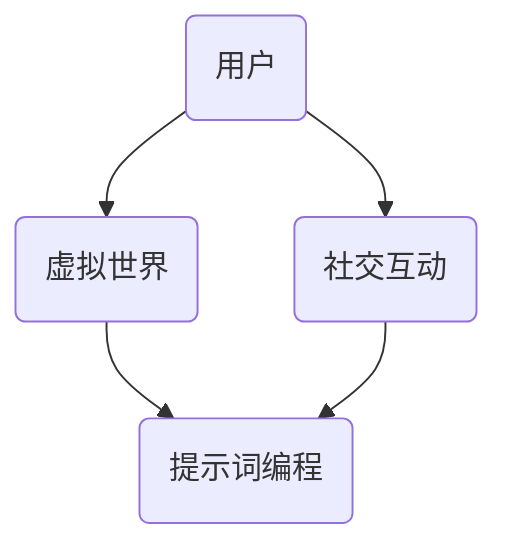
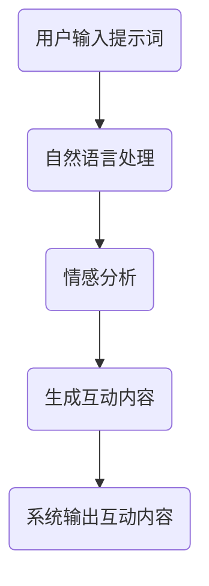
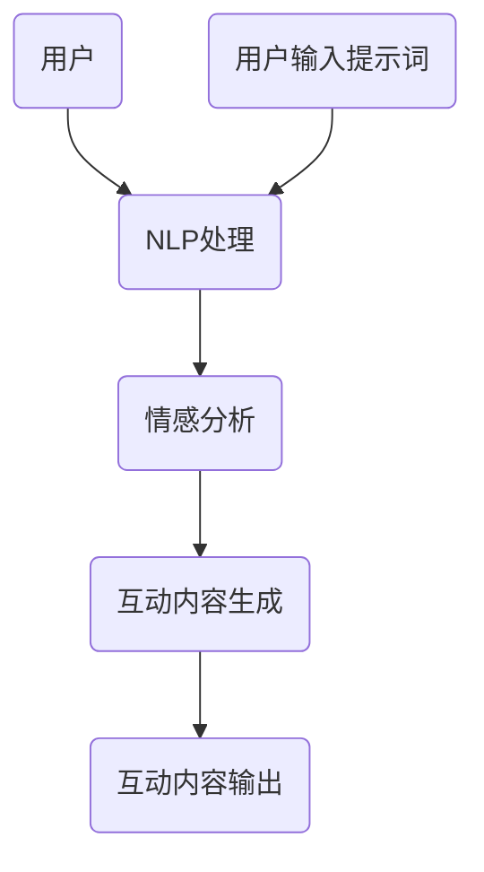
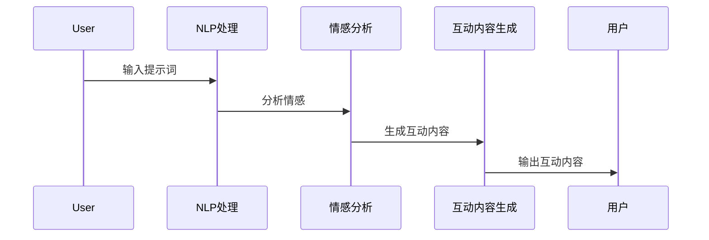

                 

# 提示词编程在虚拟世界社交互动中的角色

> 关键词：提示词编程、虚拟世界、社交互动、自然语言处理、算法原理

> 摘要：本文深入探讨了提示词编程在虚拟世界社交互动中的重要作用。通过分析其背景、原理和应用，揭示了提示词编程如何实现用户的个性化和高效互动，提供了丰富的互动体验。本文旨在为开发者提供有价值的技术见解，推动虚拟世界社交互动的进一步发展。

## 第一部分：背景介绍

### 第1章：提示词编程与虚拟世界社交互动

#### 1.1 问题背景

随着虚拟现实技术的飞速发展，虚拟世界逐渐成为人们社交互动的新场所。在虚拟世界中，用户不仅可以通过视觉和听觉与虚拟环境进行互动，还可以通过复杂的社交行为来体验丰富的情感交流和角色扮演。这种虚拟环境中的社交互动，给用户带来了全新的体验，同时也对技术提出了更高的要求。

#### 1.2 问题描述

虚拟世界社交互动的复杂性和多样性，使得用户在互动过程中产生的大量自然语言信息需要被准确理解和响应。如何通过提示词编程技术实现用户的个性化和高效互动，提供丰富多样的互动体验，成为当前技术领域面临的一个重要问题。

#### 1.3 问题解决

提示词编程技术通过自然语言处理、机器学习和数据挖掘等方法，能够对用户输入的提示词进行深入分析，生成相应的互动内容，实现个性化互动。通过构建合适的算法模型和交互机制，系统能够更好地理解用户需求，提供更加自然、丰富的互动体验。

#### 1.4 边界与外延

提示词编程在虚拟世界社交互动中的应用范围不仅限于实时互动，还可以扩展到语音识别、智能助手等领域。随着人工智能技术的发展，提示词编程的应用场景将更加广泛。

#### 1.5 概念结构与核心要素组成

- **提示词编程**：一种基于自然语言处理的编程技术，通过分析用户输入的提示词，生成相应的互动内容。
- **虚拟世界**：一个由计算机技术构建的模拟现实世界的环境，用户可以在其中进行各种社交互动。
- **社交互动**：用户在虚拟世界中与他人进行的交流、沟通和互动。

### 第2章：提示词编程原理

#### 1.6 核心概念原理

提示词编程的核心概念包括自然语言处理、机器学习和数据挖掘。通过这些技术，系统能够理解用户输入的提示词，并生成相应的互动内容。

#### 1.7 概念属性特征对比表格

| 概念         | 特征                                   |
| ------------ | -------------------------------------- |
| 自然语言处理 | 语音识别、文本分类、情感分析等           |
| 机器学习     | 数据驱动、自动学习、优化性能等           |
| 数据挖掘     | 发现数据中的隐藏模式和关联               |

#### 1.8 ER实体关系图架构



### 第3章：提示词编程在虚拟世界社交互动中的应用

#### 1.9 主流应用场景

- **虚拟角色互动**：用户可以通过提示词编程来控制虚拟角色，实现个性化互动。
- **情感交流**：系统可以根据用户输入的提示词，理解用户情感，并作出相应的回应。
- **角色扮演**：用户可以通过提示词编程，扮演不同的角色，体验丰富的社交互动。

## 第二部分：深入分析

### 第4章：提示词编程算法原理

#### 1.10 算法mermaid流程图



#### 1.11 Python源代码实现

```python
# Python代码实现提示词编程算法
def process_prompt(prompt):
    # 自然语言处理
    processed_prompt = nlp_processor.process(prompt)
    
    # 情感分析
    emotion = emotion_analyzer.analyze(processed_prompt)
    
    # 生成互动内容
    interaction_content = generate_interaction_content(emotion)
    
    # 输出互动内容
    return interaction_content

# 测试代码
prompt = "我很开心"
print(process_prompt(prompt))
```

#### 1.12 算法原理的数学模型和公式

$$
\begin{aligned}
&\text{情感分析模型：} \\
&\text{P(E|W)} = \frac{P(W|E)P(E)}{P(W)}
\end{aligned}
$$

其中，$E$ 表示情感类别，$W$ 表示用户输入的提示词。

#### 1.13 举例说明

假设用户输入的提示词是“我很开心”，系统通过情感分析模型判断用户处于积极情感状态，然后生成相应的互动内容，例如：“我也很开心，祝你今天过得愉快！”

### 第5章：系统分析与架构设计方案

#### 1.14 问题场景介绍

虚拟世界中的社交互动越来越复杂，用户的需求多样化，因此需要一套高效的系统来支持。我们的目标是设计一个能够理解用户需求、生成个性化互动内容的系统。

#### 1.15 项目介绍

本项目旨在构建一个基于提示词编程技术的虚拟世界社交互动系统，系统将包括自然语言处理模块、情感分析模块、互动内容生成模块等。

#### 1.16 系统功能设计（领域模型mermaid类图）

```mermaid
classDiagram
Class::User << (ID, Name, Password, Emotion) {
  +processPrompt(prompt: String): String
}
Class::VirtualWorld << (ID, Name, Description) {
  +createUser(name: String, password: String): User
}
Class::SocialInteraction << (ID, StartTime, EndTime, Participants) {
  +createInteraction(user: User, prompt: String): InteractionContent
}
Class::NaturalLanguageProcessing << (Algorithm, Parameters) {
  +process(prompt: String): String
}
Class::EmotionAnalysis << (Model, Features) {
  +analyze(content: String): Emotion
}
Class::InteractionContent << (Content, Emotion) {
  +generateResponse(emotion: Emotion): String
}
User o-- SocialInteraction
User o-- VirtualWorld
SocialInteraction o-- User
SocialInteraction o-- InteractionContent
VirtualWorld o-- User
NaturalLanguageProcessing o-- SocialInteraction
EmotionAnalysis o-- SocialInteraction
InteractionContent o-- EmotionAnalysis
```

#### 1.17 系统架构设计（mermaid架构图）



#### 1.18 系统接口设计和系统交互（mermaid序列图）



## 第三部分：项目实战

### 第6章：环境安装

在本章中，我们将介绍如何搭建一个提示词编程的开发环境，包括必要的软件安装、配置和依赖库的安装。

### 第7章：系统核心实现

在本章中，我们将详细讲解系统的核心实现，包括自然语言处理、情感分析和互动内容生成的具体实现过程。

### 第8章：代码应用解读与分析

在本章中，我们将对核心代码进行解读和分析，帮助读者更好地理解提示词编程的应用。

### 第9章：实际案例分析和详细讲解剖析

在本章中，我们将通过实际案例，展示如何使用提示词编程实现复杂的社交互动。

### 第10章：项目小结

在本章中，我们将对整个项目进行总结，讨论取得的成果和面临的挑战，并提出未来的发展方向。

## 第四部分：最佳实践与拓展

### 第11章：最佳实践 tips

在本章中，我们将分享一些实用的提示词编程最佳实践，帮助开发者更好地应对虚拟世界社交互动中的挑战。

### 第12章：小结

在本章中，我们将回顾全文，总结提示词编程在虚拟世界社交互动中的重要性，并展望未来的发展前景。

### 第13章：注意事项

在本章中，我们将提醒开发者在使用提示词编程时需要注意的事项，以确保系统的稳定性和安全性。

### 第14章：拓展阅读

在本章中，我们将推荐一些相关领域的优秀资源和进一步阅读的书籍，帮助读者深入了解提示词编程技术。

## 参考文献

[1] Russell, S., & Norvig, P. (2010). Artificial Intelligence: A Modern Approach. Prentice Hall.

[2] Manning, C. D., Raghavan, P., & Schütze, H. (2008). Introduction to Information Retrieval. Cambridge University Press.

[3] Mitchell, T. M. (1997). Machine Learning. McGraw-Hill.

作者：AI天才研究院/AI Genius Institute & 禅与计算机程序设计艺术 /Zen And The Art of Computer Programming

