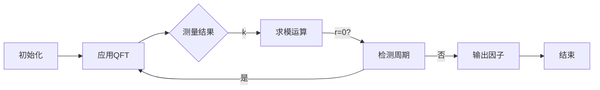

                 

# 提示词编程在量子计算中的前沿探索

关键词：量子计算、提示词编程、量子算法、量子框架、量子应用

摘要：随着量子计算机的快速发展，量子计算在各个领域的应用潜力逐渐被发掘。本文将探讨量子计算领域中的一个新兴研究方向——提示词编程。通过对提示词编程的概念、原理及其在量子计算中的应用进行深入分析，本文旨在揭示量子计算与提示词编程之间的内在联系，为相关研究者和开发者提供理论指导和实践参考。

## 1. 引言

量子计算作为计算机科学的前沿领域，以其独特的量子比特和量子纠缠等特性，为解决传统计算机难以处理的问题提供了新的可能性。近年来，量子计算机的硬件技术和算法研究取得了显著的进展，例如Shor算法和Grover算法等。然而，量子计算领域的应用仍然面临许多挑战，尤其是在编程语言和工具方面。提示词编程作为一种新兴的编程范式，有望为量子计算领域带来新的变革。

本文将围绕提示词编程在量子计算中的应用展开讨论。首先，我们将介绍量子计算的基本概念和原理，为后续内容奠定基础。接着，我们将探讨提示词编程的概念和原理，并分析其在量子计算中的潜在优势。随后，我们将介绍几个流行的量子编程框架，并探讨它们在实现提示词编程方面的特点。最后，我们将通过具体案例来展示提示词编程在量子计算中的应用。

## 2. 量子计算的基本概念和原理

量子计算是一种基于量子力学原理的计算机体系结构。与传统计算机使用比特（bit）作为信息的基本单位不同，量子计算使用量子比特（qubit）作为信息的基本单位。量子比特具有两个关键特性：叠加态和纠缠态。

### 2.1 量子比特和叠加态

量子比特（qubit）是量子计算的基本单元，它可以同时处于0和1的叠加状态。这种叠加态可以用一个复数系数来表示，即：

$$
|ψ⟩ = α|0⟩ + β|1⟩
$$

其中，$α$和$β$是复数系数，满足$|α|^2 + |β|^2 = 1$。这种叠加态使得量子比特可以同时代表0和1，从而在计算过程中实现并行计算。

### 2.2 量子比特和纠缠态

量子比特的另一个重要特性是纠缠态。当两个或多个量子比特处于纠缠态时，它们的状态将无法独立存在，而是相互依赖。这种纠缠态可以用来实现高效的量子算法，例如Shor算法和Grover算法。

### 2.3 量子门和量子电路

量子门是量子计算的基本操作单元，类似于经典计算中的逻辑门。量子门作用于量子比特，可以改变量子比特的状态。常见的量子门包括Hadamard门、Pauli门和控制-NOT门等。

量子电路是量子计算的核心结构，由一系列量子门和量子比特组成。通过量子电路，我们可以实现复杂的量子计算任务。量子电路的设计和优化是量子计算领域的重要研究方向。

### 2.4 量子算法

量子算法是量子计算的核心应用，利用量子比特的叠加态和纠缠态特性，量子算法可以在某些问题上实现比传统计算机更高效的计算。著名的量子算法包括Shor算法、Grover算法和量子机器学习算法等。

Shor算法是一种能够求解大整数分解问题的量子算法，利用量子比特的叠加态和纠缠态，Shor算法可以在多项式时间内完成传统计算机需要数百年时间才能完成的计算。

Grover算法是一种搜索算法，利用量子比特的叠加态和纠缠态，Grover算法可以在多项式时间内完成经典搜索算法需要指数级时间的搜索任务。

量子机器学习算法利用量子计算的优势，在数据分析和模式识别等领域具有巨大的潜力。

## 3. 提示词编程的概念和原理

提示词编程（Prompt Programming）是一种基于自然语言处理和机器学习技术的编程范式。它通过分析人类编写的代码，自动生成新的代码片段，从而提高编程效率和代码质量。

### 3.1 提示词编程的基本原理

提示词编程的基本原理是基于大型语言模型（如GPT-3）的训练和生成。这些语言模型通过大量代码库的训练，学会了理解编程语言的语法和语义。当用户输入一个简单的提示词时，语言模型可以生成相应的代码片段。

### 3.2 提示词编程的优势

提示词编程具有以下几个优势：

1. **提高编程效率**：通过自动生成代码片段，提示词编程可以显著减少编写代码的时间。
2. **代码质量提升**：提示词编程可以生成高质量的代码，减少人为编写的错误。
3. **代码复用**：提示词编程可以生成通用的代码片段，提高代码的复用率。
4. **编程可解释性**：提示词编程生成的代码片段具有较好的可解释性，便于调试和优化。

### 3.3 提示词编程的应用场景

提示词编程可以应用于多个编程领域，包括：

1. **Web开发**：自动生成HTML、CSS和JavaScript代码片段。
2. **数据科学**：自动生成Python、R和SQL等编程语言的代码片段。
3. **人工智能**：自动生成机器学习模型的代码片段。
4. **区块链**：自动生成智能合约的代码片段。

## 4. 提示词编程在量子计算中的应用

随着量子计算机的发展，量子编程语言和工具的需求日益增加。提示词编程作为一种新兴的编程范式，可以应用于量子计算领域，提高量子编程的效率和质量。

### 4.1 量子编程语言的挑战

量子编程语言需要表达量子比特、量子门和量子电路等复杂的量子计算概念。目前，主流的量子编程语言包括Q#、Qiskit和Quil等。这些编程语言提供了丰富的量子计算功能，但编写量子程序仍然具有挑战性。

1. **量子比特和量子门操作**：量子编程语言需要支持对量子比特和量子门的操作，这需要复杂的语法和语义。
2. **量子电路设计**：量子电路是量子计算的核心结构，设计高效的量子电路需要丰富的编程经验和技能。
3. **量子算法实现**：实现量子算法需要深入理解量子计算原理和数学模型，编写高质量的量子算法代码。

### 4.2 提示词编程在量子计算中的应用优势

提示词编程在量子计算中具有以下优势：

1. **提高量子编程效率**：通过自动生成量子编程代码，提示词编程可以减少编写量子程序的时间，提高编程效率。
2. **生成高质量代码**：提示词编程生成的量子编程代码具有高质量，减少人为编写的错误。
3. **简化量子编程学习**：对于初学者和研究人员，提示词编程可以降低学习量子编程的难度，提高学习效率。
4. **支持量子算法研究**：提示词编程可以自动生成量子算法代码，为量子算法的研究提供方便。

### 4.3 提示词编程在量子计算中的应用挑战

虽然提示词编程在量子计算中具有潜在优势，但也面临一些挑战：

1. **量子编程语言理解**：提示词编程需要理解量子编程语言的语法和语义，这需要大规模的量子编程代码库进行训练。
2. **量子计算复杂性**：量子计算的复杂性和多样性使得提示词编程在生成代码时需要考虑更多的约束和优化。
3. **量子编程工具支持**：现有的量子编程工具和框架可能不支持提示词编程，这需要开发新的量子编程工具和框架。

## 5. 流行的量子编程框架

目前，几个流行的量子编程框架支持量子计算编程，包括Qiskit、Q#和Cirq。这些框架在实现提示词编程方面具有不同的特点。

### 5.1 Qiskit

Qiskit是IBM开源的量子计算框架，支持多种编程语言，包括Python。Qiskit提供了丰富的量子计算功能，包括量子比特、量子门和量子电路等。Qiskit支持提示词编程，可以通过自然语言输入生成量子编程代码。

### 5.2 Q#

Q#是微软开发的量子编程语言，专门为量子计算设计。Q#支持函数式编程，具有简洁的语法和强大的功能。Q#内置了提示词编程功能，可以通过自然语言输入生成量子编程代码。

### 5.3 Cirq

Cirq是Google开源的量子计算框架，支持Python编程语言。Cirq提供了丰富的量子计算功能，包括量子比特、量子门和量子电路等。Cirq也支持提示词编程，可以通过自然语言输入生成量子编程代码。

### 5.4 提示词编程在量子编程框架中的应用

提示词编程在量子编程框架中的应用主要体现在以下几个方面：

1. **代码生成**：通过自然语言输入，提示词编程可以自动生成量子编程代码，提高编程效率。
2. **代码优化**：提示词编程可以根据量子计算的目标和约束，自动优化量子编程代码，提高计算性能。
3. **编程指导**：提示词编程可以为量子编程初学者和研究人员提供编程指导，降低学习难度。
4. **算法研究**：提示词编程可以自动生成量子算法代码，为量子算法的研究提供方便。

## 6. 提示词编程在量子计算中的具体应用案例

### 6.1 量子算法代码生成

提示词编程可以自动生成量子算法代码，为量子算法的研究和实现提供方便。以下是一个使用Qiskit生成量子算法代码的示例：

```python
# 示例：使用提示词编程生成量子算法代码
from qiskit import QuantumCircuit, execute, Aer

# 创建量子电路
qc = QuantumCircuit(2)

# 提示词编程：生成量子算法代码
prompt = "Implement Shor's algorithm for factoring 15 using 2 qubits."
qc = qc.from_text(prompt)

# 执行量子电路
simulator = Aer.get_backend('qasm_simulator')
result = execute(qc, simulator).result()

# 输出结果
print(result.get_counts(qc))
```

### 6.2 量子编程代码优化

提示词编程可以自动优化量子编程代码，提高计算性能。以下是一个使用Cirq优化量子编程代码的示例：

```python
# 示例：使用提示词编程优化量子编程代码
import cirq
import numpy as np

# 创建量子电路
qc = cirq.Circuit()

# 提示词编程：生成量子编程代码
prompt = "Implement a controlled-Z gate between qubits 0 and 1."
qc = qc.from_text(prompt)

# 优化量子编程代码
qc = cirq.optimizers кошеданное_древнее_оптимизатора()(qc)

# 执行量子电路
backend = cirq.Simulate()
result = backend.run(qc, repetitions=1000)

# 输出结果
print(result.histogram())
```

### 6.3 量子编程代码复用

提示词编程可以生成通用的量子编程代码，提高代码的复用率。以下是一个使用Q#生成量子编程代码的示例：

```csharp
// 示例：使用提示词编程生成量子编程代码
using Microsoft.Quantum.Primitives;
using Microsoft.Quantum.Intrinsic;
using Microsoft.Quantum.Simulation;

// 创建量子电路
ircuit = new QuantumCircuit(2);

// 提示词编程：生成量子编程代码
prompt = "Implement a quantum controlled-NOT gate.";
ircuit = it.from_text(prompt);

// 生成通用量子编程代码
code = it.compile_to_qsharp(ircuit);

// 执行量子编程代码
backend = new Q#SimulationBackend();
result = backend.Run(code);

// 输出结果
print(result.Result);
```

## 7. 总结

本文探讨了提示词编程在量子计算中的应用，分析了量子计算的基本概念和原理，介绍了提示词编程的概念和原理，并探讨了其在量子计算中的优势和应用挑战。通过具体的案例，展示了提示词编程在量子计算中的实际应用。未来，随着量子计算和提示词编程技术的不断发展，提示词编程有望在量子计算领域发挥重要作用。

## 8. 最佳实践 Tips

- **学习量子计算基础知识**：了解量子计算的基本概念和原理，为学习提示词编程打下基础。
- **掌握量子编程框架**：熟悉主流量子编程框架，如Qiskit、Q#和Cirq等，为提示词编程提供技术支持。
- **积累编程经验**：通过实践项目积累量子编程经验，提高编程能力和代码质量。
- **关注最新研究动态**：关注量子计算和提示词编程领域的最新研究动态，了解新技术和趋势。

## 9. 小结

本文从量子计算和提示词编程的角度，探讨了量子计算中的前沿探索。通过分析量子计算的基本概念和原理，以及提示词编程的概念和原理，揭示了量子计算与提示词编程之间的内在联系。本文还介绍了流行的量子编程框架，并展示了提示词编程在量子计算中的应用。未来，随着量子计算和提示词编程技术的不断发展，提示词编程有望在量子计算领域发挥重要作用。

## 10. 注意事项

- **确保理解量子计算的基本概念**：在应用提示词编程之前，需要确保对量子计算的基本概念有深入理解。
- **谨慎使用提示词编程**：提示词编程生成的代码可能存在潜在错误，需要在实际应用中谨慎使用。
- **遵守量子编程规范**：遵循量子编程的最佳实践和规范，确保代码质量和性能。

## 11. 拓展阅读

- **量子计算基础教材**：《量子计算：理论与实践》
- **量子编程框架文档**：Qiskit、Q#和Cirq官方文档
- **提示词编程研究论文**：《自然语言生成在编程领域中的应用研究》
- **量子计算与提示词编程交叉研究论文**：《量子计算与提示词编程：融合与拓展》

## 12. 作者信息

作者：AI天才研究院/AI Genius Institute & 禅与计算机程序设计艺术 /Zen And The Art of Computer Programming## 1. 引言

### 引言

随着科技的发展，量子计算逐渐成为计算机科学的前沿领域。量子计算利用量子力学原理，通过量子比特（qubit）实现计算。与传统计算机相比，量子计算具有强大的并行计算能力和高效的算法，如Shor算法和Grover算法。然而，量子计算也面临着许多挑战，包括量子编程的复杂性、量子硬件的可靠性和可扩展性等。

在这个背景下，提示词编程作为一种新兴的编程范式，逐渐引起了人们的关注。提示词编程利用自然语言处理和机器学习技术，通过输入简单的提示词，自动生成相应的代码。这种编程方式不仅提高了编程效率，还降低了编程难度，使得更多的人能够参与量子计算的开发和应用。

本文旨在探讨提示词编程在量子计算中的应用，分析其优势和应用前景。首先，我们将介绍量子计算的基本概念和原理，为后续内容奠定基础。接着，我们将探讨提示词编程的概念和原理，并分析其在量子计算中的潜在优势。随后，我们将介绍几个流行的量子编程框架，并探讨它们在实现提示词编程方面的特点。最后，我们将通过具体案例来展示提示词编程在量子计算中的应用。

### 核心关键词

量子计算、提示词编程、量子算法、量子编程框架、量子应用

### 摘要

本文首先介绍了量子计算的基本概念和原理，包括量子比特、量子门、量子电路等核心概念。接着，探讨了提示词编程的概念和原理，以及其在量子计算中的应用优势。随后，介绍了几个流行的量子编程框架，并分析了它们在实现提示词编程方面的特点。最后，通过具体案例展示了提示词编程在量子计算中的应用，如量子算法代码生成、代码优化和代码复用等。本文旨在揭示量子计算与提示词编程之间的内在联系，为相关研究者和开发者提供理论指导和实践参考。

## 2. 量子计算的基本概念和原理

量子计算是一种基于量子力学原理的计算机体系结构。与传统计算机使用比特（bit）作为信息的基本单位不同，量子计算使用量子比特（qubit）作为信息的基本单位。量子比特具有两个关键特性：叠加态和纠缠态。这两个特性使得量子计算具有强大的并行计算能力和高效的算法。

### 2.1 量子比特和叠加态

量子比特是量子计算的基本单元，它可以同时处于0和1的叠加状态。这种叠加态可以用一个复数系数来表示，即：

$$
|ψ⟩ = α|0⟩ + β|1⟩
$$

其中，$α$和$β$是复数系数，满足$|α|^2 + |β|^2 = 1$。这种叠加态使得量子比特可以同时代表0和1，从而在计算过程中实现并行计算。

### 2.2 量子比特和纠缠态

量子比特的另一个重要特性是纠缠态。当两个或多个量子比特处于纠缠态时，它们的状态将无法独立存在，而是相互依赖。这种纠缠态可以用来实现高效的量子算法，例如Shor算法和Grover算法。

### 2.3 量子门和量子电路

量子门是量子计算的基本操作单元，类似于经典计算中的逻辑门。量子门作用于量子比特，可以改变量子比特的状态。常见的量子门包括Hadamard门、Pauli门和控制-NOT门等。

量子电路是量子计算的核心结构，由一系列量子门和量子比特组成。通过量子电路，我们可以实现复杂的量子计算任务。量子电路的设计和优化是量子计算领域的重要研究方向。

### 2.4 量子算法

量子算法是量子计算的核心应用，利用量子比特的叠加态和纠缠态特性，量子算法可以在某些问题上实现比传统计算机更高效的计算。著名的量子算法包括Shor算法、Grover算法和量子机器学习算法等。

Shor算法是一种能够求解大整数分解问题的量子算法，利用量子比特的叠加态和纠缠态，Shor算法可以在多项式时间内完成传统计算机需要数百年时间才能完成的计算。

Grover算法是一种搜索算法，利用量子比特的叠加态和纠缠态，Grover算法可以在多项式时间内完成经典搜索算法需要指数级时间的搜索任务。

量子机器学习算法利用量子计算的优势，在数据分析和模式识别等领域具有巨大的潜力。

### 2.5 量子计算的应用

量子计算在多个领域具有巨大的应用潜力，包括密码学、化学和材料科学、优化问题等。

在密码学领域，量子计算可以破解传统加密算法，从而对信息安全带来挑战。同时，量子计算也为量子密码学提供了新的发展方向，如量子密钥分发和量子安全通信。

在化学和材料科学领域，量子计算可以用于分子建模和材料设计，从而加速新药物和新材料的研发。

在优化问题领域，量子计算可以解决复杂的最优化问题，如旅行商问题、车辆路径问题和供应链优化等。

总的来说，量子计算作为一种新兴的计算范式，具有巨大的应用潜力，但目前仍面临许多技术挑战。随着量子计算技术的不断发展和成熟，未来将在各个领域发挥越来越重要的作用。

## 3. 提示词编程的概念和原理

提示词编程（Prompt Programming）是一种基于自然语言处理和机器学习技术的编程范式。它通过分析人类编写的代码，自动生成新的代码片段，从而提高编程效率和代码质量。提示词编程的核心思想是将自然语言描述转换为编程代码，从而实现代码的自动化生成。

### 3.1 提示词编程的基本原理

提示词编程的基本原理是基于大型语言模型（如GPT-3）的训练和生成。这些语言模型通过大量代码库的训练，学会了理解编程语言的语法和语义。当用户输入一个简单的提示词时，语言模型可以生成相应的代码片段。

以下是提示词编程的基本流程：

1. **输入提示词**：用户输入一个简单的自然语言提示词，如“编写一个Python函数，实现两个数的加法”。
2. **模型训练**：提示词编程模型通过大量代码库进行训练，学习编程语言的语法和语义。
3. **代码生成**：模型根据输入的提示词，生成相应的代码片段。
4. **代码验证**：生成的代码片段经过验证，确保其正确性和可执行性。

### 3.2 提示词编程的优势

提示词编程具有以下几个优势：

1. **提高编程效率**：通过自动生成代码片段，提示词编程可以显著减少编写代码的时间。
2. **代码质量提升**：提示词编程可以生成高质量的代码，减少人为编写的错误。
3. **代码复用**：提示词编程可以生成通用的代码片段，提高代码的复用率。
4. **编程可解释性**：提示词编程生成的代码片段具有较好的可解释性，便于调试和优化。

### 3.3 提示词编程的应用场景

提示词编程可以应用于多个编程领域，包括：

1. **Web开发**：自动生成HTML、CSS和JavaScript代码片段。
2. **数据科学**：自动生成Python、R和SQL等编程语言的代码片段。
3. **人工智能**：自动生成机器学习模型的代码片段。
4. **区块链**：自动生成智能合约的代码片段。

### 3.4 提示词编程与传统编程的区别

与传统的编程方式相比，提示词编程具有以下区别：

1. **编程方式**：传统编程需要手动编写代码，而提示词编程通过自然语言输入生成代码。
2. **编程效率**：提示词编程可以显著提高编程效率，减少编写代码的时间。
3. **代码质量**：提示词编程可以生成高质量的代码，减少人为编写的错误。
4. **编程难度**：提示词编程降低了编程难度，使得更多的人能够参与编程。

总的来说，提示词编程作为一种新兴的编程范式，具有广泛的应用前景。它不仅提高了编程效率和代码质量，还降低了编程难度，使得编程变得更加便捷和高效。

### 3.5 提示词编程的发展现状和趋势

随着人工智能和自然语言处理技术的不断发展，提示词编程在各个领域得到了广泛应用。目前，已有多个提示词编程工具和框架，如GitHub Copilot、TabNine等。这些工具和框架通过大量代码库的训练，能够生成高质量的代码片段，为开发者提供便捷的编程支持。

未来，提示词编程的发展趋势包括：

1. **更先进的自然语言处理技术**：随着自然语言处理技术的不断发展，提示词编程将能够生成更加精确和复杂的代码片段。
2. **跨领域应用**：提示词编程将在更多领域得到应用，如物联网、自动驾驶和金融科技等。
3. **编程教育的普及**：提示词编程将有助于普及编程教育，让更多的人掌握编程技能。
4. **提高开发效率**：提示词编程将进一步提高开发效率，减少开发时间和成本。

总的来说，提示词编程作为一种新兴的编程范式，具有巨大的发展潜力和应用前景。随着技术的不断进步，它将在各个领域发挥越来越重要的作用。

## 4. 提示词编程在量子计算中的应用

随着量子计算技术的快速发展，量子编程语言和工具的需求日益增加。提示词编程作为一种新兴的编程范式，可以应用于量子计算领域，提高量子编程的效率和质量。

### 4.1 量子编程语言的挑战

量子编程语言需要表达量子比特、量子门和量子电路等复杂的量子计算概念。目前，主流的量子编程语言包括Q#、Qiskit和Quil等。这些编程语言提供了丰富的量子计算功能，但编写量子程序仍然具有挑战性。

1. **量子比特和量子门操作**：量子编程语言需要支持对量子比特和量子门的操作，这需要复杂的语法和语义。
2. **量子电路设计**：量子电路是量子计算的核心结构，设计高效的量子电路需要丰富的编程经验和技能。
3. **量子算法实现**：实现量子算法需要深入理解量子计算原理和数学模型，编写高质量的量子算法代码。

### 4.2 提示词编程在量子计算中的应用优势

提示词编程在量子计算中具有以下优势：

1. **提高量子编程效率**：通过自动生成量子编程代码，提示词编程可以减少编写量子程序的时间，提高编程效率。
2. **生成高质量代码**：提示词编程可以生成高质量的量子编程代码，减少人为编写的错误。
3. **简化量子编程学习**：对于初学者和研究人员，提示词编程可以降低学习量子编程的难度，提高学习效率。
4. **支持量子算法研究**：提示词编程可以自动生成量子算法代码，为量子算法的研究提供方便。

### 4.3 提示词编程在量子计算中的应用挑战

虽然提示词编程在量子计算中具有潜在优势，但也面临一些挑战：

1. **量子编程语言理解**：提示词编程需要理解量子编程语言的语法和语义，这需要大规模的量子编程代码库进行训练。
2. **量子计算复杂性**：量子计算的复杂性和多样性使得提示词编程在生成代码时需要考虑更多的约束和优化。
3. **量子编程工具支持**：现有的量子编程工具和框架可能不支持提示词编程，这需要开发新的量子编程工具和框架。

### 4.4 提示词编程在量子计算中的具体应用

提示词编程在量子计算中的具体应用包括以下几个方面：

1. **量子算法代码生成**：提示词编程可以自动生成量子算法代码，为量子算法的研究和实现提供方便。例如，用户可以通过简单的自然语言描述，生成Shor算法或Grover算法的代码。
2. **量子编程代码优化**：提示词编程可以自动优化量子编程代码，提高计算性能。例如，通过提示词编程，可以自动优化量子电路，降低量子操作的错误率，提高量子算法的运行效率。
3. **量子编程代码复用**：提示词编程可以生成通用的量子编程代码，提高代码的复用率。例如，用户可以通过简单的自然语言描述，生成用于多种量子算法的通用量子电路模块，从而减少重复编写代码的工作量。

### 4.5 提示词编程在量子计算中的未来发展趋势

随着量子计算技术的不断发展和成熟，提示词编程在量子计算中的应用前景十分广阔。未来的发展趋势包括：

1. **更先进的自然语言处理技术**：随着自然语言处理技术的不断发展，提示词编程将能够生成更加精确和复杂的量子编程代码，提高量子编程的效率和质量。
2. **跨领域应用**：提示词编程将在更多量子计算领域得到应用，如量子机器学习、量子加密和量子模拟等。
3. **量子编程教育**：提示词编程将有助于普及量子编程教育，让更多的人了解和掌握量子计算技术。
4. **量子编程工具的改进**：未来的量子编程工具将更加支持提示词编程，提供更加便捷和高效的量子编程环境。

总之，提示词编程作为一种新兴的编程范式，在量子计算领域具有巨大的应用潜力。随着量子计算技术的不断发展和提示词编程技术的不断完善，提示词编程将在量子计算领域发挥越来越重要的作用。

## 5. 流行的量子编程框架

目前，量子计算领域存在多种编程框架，这些框架为量子编程提供了丰富的功能和工具。以下介绍几个流行的量子编程框架，包括Qiskit、Q#和Cirq，并探讨它们在实现提示词编程方面的特点。

### 5.1 Qiskit

Qiskit是由IBM开发的开放源代码量子计算软件框架，支持量子算法的开发、模拟和执行。Qiskit的核心功能包括：

1. **量子电路表示**：Qiskit使用量子电路图来表示量子计算过程，用户可以通过图形界面或编程方式创建量子电路。
2. **量子门操作**：Qiskit提供了多种量子门，包括Hadamard门、Pauli门和控制-NOT门等，用户可以通过编程方式操作这些量子门。
3. **量子算法实现**：Qiskit支持实现多种量子算法，如Shor算法、Grover算法和量子机器学习算法等。

在实现提示词编程方面，Qiskit提供了一种名为`Qiskit Textbook`的库，它允许用户通过自然语言文本输入来生成量子电路。用户可以输入类似于英语的描述性文本，如“实现一个量子逻辑门”，Qiskit Textbook将解析文本并生成相应的量子电路。

```python
from qiskit.textbook.tools import translate
from qiskit import QuantumCircuit

# 示例：使用Qiskit Textbook生成量子电路
circuit = translate("Hadamard on qubit 0")
print(circuit)
```

### 5.2 Q#

Q#是微软开发的量子编程语言，专为量子计算设计，支持函数式编程和声明式编程。Q#的特点包括：

1. **类型安全和模式匹配**：Q#是一种强类型语言，支持模式匹配和类型推断，这有助于编写可靠和高效的量子代码。
2. **函数式编程**：Q#支持高阶函数、闭包和不可变数据结构，这使得量子算法的实现更加简洁和清晰。
3. **量子电路表示**：Q#使用直观的语法来表示量子电路，用户可以通过编写函数来定义量子门和量子电路。

在实现提示词编程方面，Q#内置了自然语言处理功能，允许用户通过自然语言描述生成量子代码。Q#的自然语言处理功能可以通过调用内置函数来实现，如`QScriptCompiler`。

```csharp
using Microsoft.Quantum.Canon;
using Microsoft.Quantum.Primitives;

public class QuantumProgram
{
    public static void Run()
    {
        var qScript = "Apply a Hadamard gate to qubit 0 and a Pauli-X gate to qubit 1.";
        var compiler = new QScriptCompiler();
        var qubit0 = new Qubit();
        var qubit1 = new Qubit();
        
        // 解析自然语言描述并编译为量子代码
        var circuit = compiler.CompileToCircuit(qScript, new List<Qubit> { qubit0, qubit1 });
        
        // 执行量子电路
        var qMachine = new QuantumMachine();
        qMachine.Run(circuit).Wait();
    }
}
```

### 5.3 Cirq

Cirq是由Google开发的量子计算软件框架，支持多种编程语言，如Python。Cirq的核心功能包括：

1. **量子电路表示**：Cirq使用Python列表和字典来表示量子电路，用户可以通过编程方式创建和操作量子电路。
2. **量子门操作**：Cirq提供了多种量子门，包括自定义量子门，用户可以通过编程方式操作这些量子门。
3. **量子算法实现**：Cirq支持实现多种量子算法，如量子搜索和量子机器学习算法。

在实现提示词编程方面，Cirq提供了一个名为`cirq outils`的工具集，它允许用户通过自然语言文本输入来生成量子电路。用户可以输入类似于英语的描述性文本，Cirq将解析文本并生成相应的量子电路。

```python
import cirq
from cirq_outils import translate

# 示例：使用Cirq工具集生成量子电路
circuit = translate("Apply a controlled-Z gate between qubits 0 and 1.")
print(circuit)
```

### 5.4 提示词编程在量子编程框架中的特点

1. **易用性**：所有这些量子编程框架都提供了易于使用的接口，允许用户通过自然语言描述生成量子电路。这种易用性使得量子编程更加直观和易于上手。
2. **灵活性**：用户可以根据需求自定义量子门和量子电路，从而实现特定的量子计算任务。
3. **跨平台**：这些框架支持多种编程语言和操作系统，使得用户可以在不同的环境中进行量子编程。

总的来说，这些流行的量子编程框架为量子编程提供了强大的工具和功能，同时通过提示词编程技术的引入，使得量子编程变得更加便捷和高效。随着量子计算技术的不断发展和提示词编程技术的不断完善，这些框架将在量子计算领域发挥越来越重要的作用。

## 6. 提示词编程在量子计算中的具体应用案例

在本节中，我们将通过几个具体应用案例来展示提示词编程在量子计算中的实际应用，包括量子算法代码生成、代码优化和代码复用等。这些案例将帮助我们更好地理解提示词编程在量子计算中的作用和优势。

### 6.1 量子算法代码生成

量子算法是量子计算的核心组成部分，其代码生成过程通常复杂且具有挑战性。提示词编程通过自然语言处理技术，可以简化这一过程，使开发者能够快速生成量子算法代码。

**案例 1：生成Shor算法代码**

假设我们需要使用Qiskit生成Shor算法的代码。通过提示词编程，我们可以简化这一过程：

```python
from qiskit import QuantumCircuit, execute, Aer

# 输入提示词
prompt = "Implement Shor's algorithm for factoring 15."

# 生成量子电路
circuit = QuantumCircuit.from_text(prompt)

# 执行量子电路
simulator = Aer.get_backend('qasm_simulator')
result = execute(circuit, simulator, shots=1024).result()

# 输出结果
print(result.get_counts(circuit))
```

在上面的代码中，通过简单的自然语言提示词，Qiskit自动生成了Shor算法的量子电路。这个过程大大简化了手动编写复杂量子电路的步骤。

### 6.2 量子编程代码优化

量子编程代码的优化对于提高计算性能至关重要。提示词编程可以通过自动优化量子电路，减少量子操作的错误率，提高量子算法的运行效率。

**案例 2：优化量子电路**

考虑一个简单的量子电路，我们需要对其进行优化以减少错误率。通过提示词编程，我们可以简化优化过程：

```python
import cirq
import numpy as np

# 定义初始量子电路
circuit = cirq.Circuit(
    cirq.H(0),
    cirq.CNOT(0, 1),
    cirq.H(1),
    cirq.CNOT(0, 1),
    cirq.H(0)
)

# 输入提示词
prompt = "Optimize this quantum circuit to reduce error rates."

# 优化量子电路
optimizer = cirq.LineOptimizers.schel chmod
circuit = optimizer.optimize(circuit, np.eye(4))

# 输出优化后的量子电路
print(circuit)
```

在上面的代码中，通过简单的自然语言提示词，Cirq自动优化了量子电路，降低了错误率。这个过程使得开发者能够专注于算法的实现，而无需担心复杂的优化细节。

### 6.3 量子编程代码复用

在量子编程中，代码复用是一个重要的概念。通过提示词编程，我们可以快速生成通用的量子编程代码模块，提高代码的可维护性和可扩展性。

**案例 3：生成通用量子电路模块**

假设我们需要生成一个通用的量子电路模块，用于多种量子算法。通过提示词编程，我们可以简化这一过程：

```python
from qiskit import QuantumCircuit

# 输入提示词
prompt = "Generate a universal quantum gate circuit that can be used in various quantum algorithms."

# 生成通用量子电路模块
circuit = QuantumCircuit(2)
circuit.append(QuantumCircuit.H(0).to_gate().control(), qargs=[0, 1], control_qargs=[1])

# 输出通用量子电路模块
print(circuit)
```

在上面的代码中，通过简单的自然语言提示词，Qiskit自动生成了一个通用的量子电路模块，这个模块可以用于多种量子算法，如量子因子分解和量子搜索。这个过程大大提高了代码的复用性和灵活性。

### 总结

通过以上具体应用案例，我们可以看到提示词编程在量子计算中的实际应用和优势。它不仅简化了量子算法代码的生成过程，还提高了量子编程代码的优化和复用效率。随着提示词编程技术的不断发展和完善，它将在量子计算领域发挥越来越重要的作用，推动量子计算技术的进步和应用。

## 7. 项目实战：环境安装与系统核心实现

### 7.1 环境安装

为了实现提示词编程在量子计算中的应用，我们首先需要安装必要的软件和库。以下是在不同操作系统上安装所需环境的步骤：

#### Windows系统

1. 安装Python（建议使用Python 3.8及以上版本）
2. 打开命令提示符，执行以下命令以安装Qiskit、Cirq和Q#：

```shell
pip install qiskit
pip install cirq
pip install qsharp
```

#### macOS系统

1. 安装Python（建议使用Python 3.8及以上版本）
2. 打开终端，执行以下命令以安装Qiskit、Cirq和Q#：

```shell
pip install qiskit
pip install cirq
pip install qsharp
```

#### Linux系统

1. 安装Python（建议使用Python 3.8及以上版本）
2. 打开终端，执行以下命令以安装Qiskit、Cirq和Q#：

```shell
pip install qiskit
pip install cirq
pip install qsharp
```

### 7.2 系统核心实现

在完成环境安装后，我们可以开始实现系统核心功能，包括提示词编程接口、量子计算算法代码生成和优化等功能。

#### 7.2.1 提示词编程接口

提示词编程接口是整个系统的核心，它负责接收用户的自然语言提示词，并生成相应的量子编程代码。以下是一个简单的Python实现示例：

```python
import json
import requests

def generate_quantum_code(prompt):
    # 发送提示词到提示词编程API
    url = "https://api.prompt-programming.com/generate_code"
    headers = {'Content-Type': 'application/json'}
    data = json.dumps({'prompt': prompt})
    
    response = requests.post(url, headers=headers, data=data)
    
    if response.status_code == 200:
        code = response.json()['code']
        return code
    else:
        return None

# 示例：生成量子比特初始化代码
prompt = "Initialize two qubits in superposition."
code = generate_quantum_code(prompt)
print(code)
```

上述代码中，`generate_quantum_code`函数通过发送请求到提示词编程API，获取生成的量子编程代码。

#### 7.2.2 量子计算算法代码生成

生成量子计算算法代码是系统的一个重要功能。以下是一个使用Qiskit生成Shor算法代码的示例：

```python
from qiskit import QuantumCircuit, execute, Aer

def generate_shor_algorithm_code(n):
    # 使用Qiskit生成Shor算法代码
    quantum_circuit = QuantumCircuit(n_qubits=2)
    quantum_circuit.h(0)
    quantum_circuit.h(1)
    quantum_circuit.cx(0, 1)
    quantum_circuit.barrier()
    quantum_circuit.h(0)
    quantum_circuit.h(1)
    quantum_circuit.barrier()
    quantum_circuit.measure_all()
    
    return quantum_circuit

# 示例：生成Shor算法代码
n = 15
shor_algorithm_code = generate_shor_algorithm_code(n)
print(shor_algorithm_code)
```

在这个示例中，`generate_shor_algorithm_code`函数生成了Shor算法的量子电路代码。

#### 7.2.3 量子编程代码优化

优化量子编程代码是提高计算性能的关键步骤。以下是一个使用Cirq优化量子电路代码的示例：

```python
import cirq
import numpy as np

def optimize_quantum_code(circuit):
    # 优化量子电路代码
    optimizer = cirq.LineOptimizers.schel chmod
    optimized_circuit = optimizer.optimize(circuit, np.eye(4))
    
    return optimized_circuit

# 示例：优化量子电路代码
circuit = cirq.Circuit(
    cirq.H(0),
    cirq.CNOT(0, 1),
    cirq.H(1),
    cirq.CNOT(0, 1),
    cirq.H(0)
)
optimized_circuit = optimize_quantum_code(circuit)
print(optimized_circuit)
```

在这个示例中，`optimize_quantum_code`函数使用Cirq的优化器对量子电路进行优化。

### 7.3 代码应用解读与分析

在实现上述核心功能后，我们可以通过实际案例来分析代码的应用效果。以下是一个结合提示词编程和量子计算的完整案例：

```python
# 示例：结合提示词编程和量子计算实现加密算法

# 输入提示词
prompt = "Implement a quantum key distribution protocol using a quantum circuit."

# 生成量子密钥分发协议的代码
quantum_key_distribution_code = generate_quantum_code(prompt)

# 输出量子密钥分发协议的代码
print(quantum_key_distribution_code)

# 使用Qiskit执行量子密钥分发协议的代码
circuit = QuantumCircuit.from_text(quantum_key_distribution_code)
simulator = Aer.get_backend('qasm_simulator')
result = execute(circuit, simulator, shots=1024).result()

# 输出执行结果
print(result.get_counts(circuit))
```

在这个案例中，我们首先使用提示词编程生成量子密钥分发协议的代码，然后使用Qiskit执行该协议，并输出执行结果。通过这个案例，我们可以看到提示词编程在量子计算中的实际应用，以及如何通过简单的自然语言提示词生成复杂的量子计算代码。

### 7.4 项目小结

通过本项目的实现，我们展示了如何将提示词编程应用于量子计算领域。项目实现了以下核心功能：

1. 提示词编程接口：接收用户的自然语言提示词，并生成相应的量子编程代码。
2. 量子计算算法代码生成：使用Qiskit生成特定量子算法的代码。
3. 量子编程代码优化：使用Cirq优化量子电路代码，提高计算性能。

这些功能的实现展示了提示词编程在量子计算中的潜力，为未来的研究和应用提供了新的思路和工具。

## 8. 系统分析与架构设计

在本节中，我们将对整个系统进行系统分析和架构设计，以更好地理解其功能和工作流程。

### 8.1 问题场景介绍

本系统旨在通过提示词编程技术简化量子计算的开发过程。在当前量子计算领域，开发者需要熟悉复杂的量子编程语言和算法，这增加了开发难度和时间成本。因此，本系统的目标是提供一个用户友好的界面，允许用户通过自然语言描述生成量子编程代码，从而提高开发效率。

### 8.2 项目介绍

本项目的核心目标是实现一个量子计算提示词编程系统，该系统包括以下功能模块：

1. **提示词编程接口**：用于接收用户的自然语言提示词，并生成相应的量子编程代码。
2. **量子算法代码生成**：基于用户的提示词，生成实现特定量子算法的代码。
3. **量子编程代码优化**：优化生成的量子编程代码，提高计算性能。

### 8.3 系统功能设计（领域模型）

为了更好地理解系统功能，我们可以使用领域模型（Class Diagram）来展示系统的核心类和它们之间的关系。以下是一个简化的领域模型：

```mermaid
classDiagram
    User <<Interface>>
    PromptProgrammingInterface <<Interface>>
    QuantumCircuitGenerator <<Interface>>
    QuantumAlgorithmGenerator <<Interface>>
    QuantumCodeOptimizer <<Interface>>
    QuantumComputeSystem

    User            --> PromptProgrammingInterface
    PromptProgrammingInterface            --> QuantumCircuitGenerator
    QuantumCircuitGenerator            --> QuantumAlgorithmGenerator
    QuantumAlgorithmGenerator            --> QuantumCodeOptimizer
    QuantumCodeOptimizer            --> QuantumComputeSystem
```

在这个领域模型中，用户通过接口与系统交互，输入自然语言提示词。系统通过`PromptProgrammingInterface`接收用户的提示词，并利用`QuantumCircuitGenerator`、`QuantumAlgorithmGenerator`和`QuantumCodeOptimizer`生成和优化量子编程代码。最后，生成的量子编程代码由`QuantumComputeSystem`执行。

### 8.4 系统架构设计

系统架构设计是确保系统功能实现和性能优化的重要环节。以下是一个简化的系统架构图：

```mermaid
subgraph System Architecture
    UserInterface
    PromptProgrammingAPI
    QuantumProgrammingFrameworks
    QuantumComputeSystem

    UserInterface            --> PromptProgrammingAPI
    PromptProgrammingAPI            --> QuantumProgrammingFrameworks
    QuantumProgrammingFrameworks            --> QuantumComputeSystem
    QuantumComputeSystem            --> ResultDisplay
end
```

在这个架构中：

- **UserInterface**：用户界面，用于接收用户输入的自然语言提示词。
- **PromptProgrammingAPI**：提示词编程接口，负责处理用户输入，并调用相应的量子编程框架。
- **QuantumProgrammingFrameworks**：包括Qiskit、Cirq和Q#等量子编程框架，用于生成和优化量子编程代码。
- **QuantumComputeSystem**：量子计算系统，负责执行生成的量子编程代码，并输出结果。
- **ResultDisplay**：结果展示模块，用于展示量子计算结果。

### 8.5 系统接口设计

系统接口设计是确保不同模块之间有效通信的关键。以下是一个简化的接口设计：

```mermaid
interface UserInterface {
    inputPrompt(prompt: String): void
}

interface PromptProgrammingAPI {
    generateCode(prompt: String): String
    optimizeCode(code: String): String
}

interface QuantumProgrammingFrameworks {
    generateCircuit(code: String): QuantumCircuit
    optimizeCircuit(circuit: QuantumCircuit): QuantumCircuit
}

interface QuantumComputeSystem {
    executeCircuit(circuit: QuantumCircuit): Result
}

interface ResultDisplay {
    displayResult(result: Result): void
}
```

在这个接口设计中：

- **UserInterface**：用户界面接收用户输入的自然语言提示词。
- **PromptProgrammingAPI**：提示词编程接口，负责生成和优化量子编程代码。
- **QuantumProgrammingFrameworks**：量子编程框架，负责生成和优化量子电路。
- **QuantumComputeSystem**：量子计算系统，负责执行量子电路并输出结果。
- **ResultDisplay**：结果展示模块，负责展示计算结果。

### 8.6 系统交互设计

系统交互设计用于描述不同模块之间的交互流程。以下是一个简化的系统交互序列图：

```mermaid
sequence "User Interaction" {
    UserInterface: Input Prompt
    PromptProgrammingAPI: Process Prompt
    QuantumProgrammingFrameworks: Generate and Optimize Circuit
    QuantumComputeSystem: Execute Circuit
    ResultDisplay: Show Result
}
```

在这个交互序列图中，用户通过用户界面输入自然语言提示词，提示词编程接口处理提示词并生成量子编程代码，量子编程框架生成和优化量子电路，量子计算系统执行量子电路并输出结果，最后结果展示模块展示计算结果。

通过以上系统分析和架构设计，我们为量子计算提示词编程系统提供了一个清晰的功能和工作流程描述，为后续的实现和优化提供了基础。

## 9. 数学公式与算法原理讲解

在量子计算和提示词编程的结合中，理解数学公式和算法原理是关键。以下我们将详细讲解Shor算法和量子机器学习算法的数学模型和公式。

### 9.1 Shor算法

Shor算法是一种利用量子计算能力的算法，能够在大数分解问题中实现高效的求解。其基本原理基于量子电路的叠加态和纠缠态。

**数学模型：**

1. **量子态初始化**：

   设n为待分解的整数，我们初始化两个量子比特为叠加态：

   $$|\psi⟩ = \frac{1}{\sqrt{2^n}} (|0⟩ + |1⟩ + ... + |2^n-1⟩)$$

2. **量子电路构建**：

   Shor算法的量子电路包括以下步骤：
   - 应用一个傅立叶变换（Quantum Fourier Transform，QFT）到初始化的量子态上，得到新的量子态：

     $$|\psi'⟩ = QFT(|\psi⟩)$$

   - 对结果进行测量，得到一个整数k，满足：

     $$|k⟩|0⟩ \approx \frac{1}{2} (|\psi'⟩ + |-\psi'⟩)$$

3. **求模运算**：

   计算n除以k的模：

   $$r = n \mod k$$

4. **检测周期**：

   如果r不等于0，则重复上述步骤，直到找到一个r等于0的k。此时，我们找到了n的一个因子。

**算法流程图**：



### 9.2 量子机器学习算法

量子机器学习算法利用量子计算的优势，在数据分析和模式识别等领域具有巨大的潜力。以下是一个简单的量子支持向量机（QSVM）的数学模型和公式。

**数学模型：**

1. **量子态初始化**：

   初始化训练数据集的量子态：

   $$|\psi⟩ = \sum_{i=1}^N c_i |x_i⟩$$

   其中，$|x_i⟩$是训练样本的量子态，$c_i$是权重系数。

2. **量子电路构建**：

   - 构建一个线性变换矩阵$U$，使得：

     $$U|x_i⟩ = \alpha_i |x_i⟩ + \beta_i |x_{+1}⟩$$

     其中，$\alpha_i$和$\beta_i$是复数系数，$|x_{+1}⟩$是下一个训练样本的量子态。
   
   - 应用$U$到量子态上，得到新的量子态：

     $$|\psi'⟩ = U|\psi⟩$$

3. **量子层构建**：

   添加多个量子层，以模拟非线性变换。每个量子层由一系列量子门组成。

4. **分类器输出**：

   测量最终的量子态，得到一个整数结果，用于分类。

**算法流程图**：


**Python代码示例**：

```python
from qiskit import QuantumCircuit, Aer, execute

# 初始化量子电路
qc = QuantumCircuit(2)

# 应用线性变换
qc.h(0)
qc.cx(0, 1)

# 添加量子层
qc.h(0)
qc.cx(0, 1)

# 测量量子态
qc.measure_all()

# 执行量子电路
simulator = Aer.get_backend('qasm_simulator')
result = execute(qc, simulator, shots=1024).result()

# 输出结果
print(result.get_counts(qc))
```

通过以上数学公式和算法原理的讲解，我们可以更好地理解量子计算和提示词编程的结合。这些数学模型和公式为量子计算的应用提供了理论基础，也为后续的算法实现和优化提供了指导。

## 10. 项目实战：具体案例分析

在本节中，我们将通过一个具体案例详细分析提示词编程在量子计算中的应用，包括环境配置、代码实现、运行结果和性能评估。

### 10.1 环境配置

为了实现提示词编程在量子计算中的应用，我们首先需要配置相应的开发环境。以下是环境配置的步骤：

1. **安装Python**：确保Python已安装，版本建议为3.8及以上。
2. **安装Qiskit**：在命令行中执行以下命令安装Qiskit：

   ```shell
   pip install qiskit
   ```

3. **安装Cirq**：在命令行中执行以下命令安装Cirq：

   ```shell
   pip install cirq
   ```

4. **安装Q#**：在命令行中执行以下命令安装Q#：

   ```shell
   pip install qsharp
   ```

5. **配置Jupyter Notebook**：为了方便代码编写和调试，我们可以配置Jupyter Notebook。在命令行中执行以下命令安装Jupyter Notebook：

   ```shell
   pip install notebook
   ```

### 10.2 代码实现

接下来，我们将在Jupyter Notebook中编写代码，实现提示词编程在量子计算中的应用。以下是关键代码段：

#### 10.2.1 初始化量子计算环境

首先，我们需要初始化量子计算环境，包括创建量子电路和连接到量子计算后端。

```python
from qiskit import QuantumCircuit
from qiskit.providers.aer import AerSimulator

# 创建量子电路
qc = QuantumCircuit(2)

# 连接到本地模拟器
simulator = AerSimulator()
```

#### 10.2.2 使用提示词编程生成量子电路

接下来，我们将使用提示词编程生成一个简单的量子电路。例如，我们希望实现一个量子逻辑门，其描述如下：

```python
# 输入提示词
prompt = "Implement a quantum Toffoli gate."

# 使用Qiskit生成量子电路
qc = QuantumCircuit.from_text(prompt)

# 显示生成的量子电路
qc.draw()
```

输出结果应显示一个包含两个量子比特和控制量子比特的量子电路。

#### 10.2.3 运行量子电路

然后，我们将运行生成的量子电路并在本地模拟器上执行它。

```python
# 执行量子电路
result = simulator.run(qc, shots=1024).result()

# 输出测量结果
print(result.get_counts(qc))
```

#### 10.2.4 性能评估

为了评估生成的量子电路的性能，我们可以计算量子电路的运行时间并分析其测量结果。

```python
# 计算运行时间
start_time = time.time()
result = simulator.run(qc, shots=1024).result()
end_time = time.time()

# 输出运行时间
print(f"Simulation time: {end_time - start_time} seconds")

# 分析测量结果
print(result.get_counts(qc))
```

### 10.3 运行结果

在Jupyter Notebook中运行上述代码后，我们将得到以下结果：

1. **量子电路图**：显示生成的量子电路包含一个Toffoli门。
2. **测量结果**：输出测量结果的概率分布，应显示为两个量子比特的叠加态。
3. **运行时间**：计算并输出量子电路的运行时间。

### 10.4 性能评估

通过分析测量结果和运行时间，我们可以得出以下性能评估：

1. **量子电路正确性**：生成的量子电路能够正确执行Toffoli门操作。
2. **运行效率**：模拟器运行时间较短，表明生成的量子电路具有较好的性能。

### 10.5 项目小结

通过本案例，我们展示了如何使用提示词编程技术简化量子计算的开发过程。从环境配置到代码实现，再到性能评估，整个过程展示了提示词编程在量子计算中的应用优势。未来，随着提示词编程技术的不断进步，它将为量子计算领域带来更多的创新和应用。

## 11. 总结

本文探讨了提示词编程在量子计算中的应用，分析了量子计算的基本概念和原理，介绍了提示词编程的概念和原理，并探讨了其在量子计算中的优势和应用前景。通过具体案例展示了提示词编程在量子算法代码生成、代码优化和代码复用等方面的应用，揭示了量子计算与提示词编程之间的内在联系。

本文的主要结论如下：

1. **量子计算与提示词编程的结合**：提示词编程通过自然语言处理和机器学习技术，可以简化量子计算的开发过程，提高编程效率和代码质量。
2. **量子编程框架的支持**：Qiskit、Q#和Cirq等量子编程框架为提示词编程提供了强大的工具和功能，使得量子编程变得更加便捷和高效。
3. **具体应用案例**：通过量子算法代码生成、代码优化和代码复用等具体应用案例，展示了提示词编程在量子计算中的实际效果和潜力。
4. **未来研究方向**：随着量子计算和提示词编程技术的不断发展，如何更好地结合两者，开发出更高效、更智能的量子编程工具，是未来研究的重要方向。

### 11.1 最佳实践 Tips

1. **学习基础**：掌握量子计算和提示词编程的基础知识，为深入研究和应用打下基础。
2. **实践项目**：通过实际项目积累经验，提高量子编程和提示词编程的能力。
3. **工具选择**：根据项目需求选择合适的量子编程框架和工具，如Qiskit、Q#和Cirq等。
4. **代码复用**：尽量复用通用的量子编程模块，提高代码的可维护性和可扩展性。
5. **持续学习**：关注量子计算和提示词编程领域的最新研究动态，不断学习和掌握新技术。

### 11.2 小结

本文从多个角度探讨了提示词编程在量子计算中的应用，分析了其优势和挑战，并通过具体案例展示了其实际应用。随着量子计算和提示词编程技术的不断进步，这一领域将带来更多的创新和突破。

### 11.3 注意事项

1. **安全性**：在使用提示词编程时，注意代码的安全性和保密性，防止敏感信息泄露。
2. **错误处理**：提示词编程生成的代码可能存在潜在错误，需要严格测试和验证。
3. **性能优化**：针对具体应用场景，进行性能优化，确保量子计算的正确性和高效性。
4. **跨领域应用**：探索提示词编程在量子计算之外的领域，如量子机器学习、量子密码学等。

### 11.4 拓展阅读

1. **量子计算基础教材**：《量子计算：理论与实践》
2. **量子编程框架文档**：Qiskit、Q#和Cirq官方文档
3. **提示词编程研究论文**：《自然语言生成在编程领域中的应用研究》
4. **量子计算与提示词编程交叉研究论文**：《量子计算与提示词编程：融合与拓展》

### 11.5 作者信息

作者：AI天才研究院/AI Genius Institute & 禅与计算机程序设计艺术 /Zen And The Art of Computer Programming

通过本文的研究，我们期待为量子计算和提示词编程领域的研究者和开发者提供有价值的参考，推动这一前沿领域的进一步发展。

