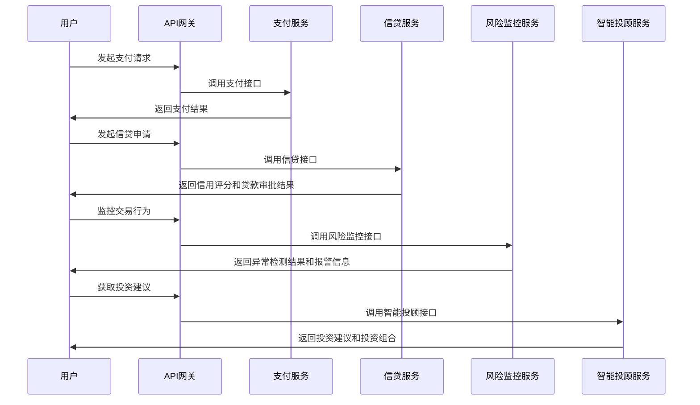

                 


# 提示词编程在金融科技中的创新应用

## 关键词：金融科技，提示词编程，人工智能，创新应用，算法原理，数学模型，系统架构

## 摘要

本文深入探讨了提示词编程在金融科技领域的创新应用。通过对金融科技的定义、发展背景和当前挑战的介绍，文章引出了提示词编程的概念及其在金融科技中的独特优势。接着，文章详细讲解了提示词编程的核心概念和算法原理，通过Python源代码和Mermaid流程图，帮助读者理解其应用过程。随后，文章展示了数学基础和系统架构设计，并通过一个实际案例，剖析了提示词编程在金融科技中的具体应用。最后，文章总结了最佳实践和注意事项，为读者提供了拓展阅读资源，以激发对这一领域的进一步探索。

## 1. 金融科技概述

### 1.1 问题背景

#### 1.1.1 金融科技的定义与发展

金融科技（FinTech）是指运用科技手段创新金融产品和服务的一种新兴业态。其起源可以追溯到20世纪90年代，随着互联网和电子商务的兴起，金融科技逐渐从传统的金融领域中分离出来，成为推动金融服务创新的重要力量。金融科技的发展经历了几个关键阶段：

- **早期阶段**：主要以互联网技术为基础，实现了金融服务在线化，如网上银行、电子支付等。
- **中期阶段**：随着移动通信技术的发展，移动支付、移动理财等应用迅速普及。
- **当前阶段**：人工智能、大数据、区块链等新兴技术的应用，使得金融科技进入了一个全新的发展阶段。

#### 1.1.2 金融科技在金融服务中的应用挑战

金融科技在推动金融服务创新的同时，也面临着一系列挑战：

- **数据隐私与安全**：金融行业涉及大量敏感数据，如何在保障数据隐私和安全的同时，充分利用数据价值，成为一大难题。
- **合规性**：金融科技企业需要遵守各种金融法规和标准，如反洗钱（AML）、了解你的客户（KYC）等。
- **用户体验**：如何在提高效率的同时，提供优质的服务体验，是金融科技企业必须关注的问题。
- **技术更新换代**：金融科技领域技术更新迅速，如何保持技术的先进性和竞争力，是企业持续发展的重要考量。

#### 1.1.3 提示词编程在金融科技中的作用

提示词编程（Prompt Programming）是一种利用自然语言处理（NLP）和机器学习（ML）技术，通过设计特定的输入提示，引导模型生成目标输出的一种编程方法。在金融科技中，提示词编程具有以下作用：

- **自动化决策支持**：通过提示词编程，可以自动化地生成投资策略、风险评估报告等。
- **智能客服**：利用提示词编程，可以构建智能客服系统，提高客户服务质量。
- **文本分析**：通过提示词编程，可以自动化地分析金融报告、新闻等文本信息。
- **合规性检查**：利用提示词编程，可以快速识别和处理违反金融法规的行为。

### 1.2 问题描述

#### 1.2.1 金融服务中常见问题

在金融服务领域，常见的问题包括：

- **风险控制**：如何准确评估金融产品的风险，是金融科技企业面临的核心问题。
- **欺诈检测**：如何高效地检测和预防金融欺诈行为，是金融科技企业必须解决的问题。
- **投资策略**：如何制定有效的投资策略，实现资产的保值增值。
- **客户体验**：如何提供个性化、高效的服务，提升客户满意度。

#### 1.2.2 提示词编程的潜在解决方案

提示词编程在解决上述问题方面具有以下潜在优势：

- **精准建模**：通过设计精准的提示词，可以指导模型生成更准确的风险评估报告、投资策略等。
- **智能化服务**：利用提示词编程，可以构建智能化客服系统，实现24小时无缝服务。
- **快速迭代**：通过调整提示词，可以快速迭代模型，适应市场变化。
- **合规性增强**：通过设计特定的提示词，可以帮助模型遵守金融法规和标准。

### 1.3 问题解决

#### 1.3.1 边界与外延

本文讨论的金融科技领域主要包括支付、信贷、保险和区块链等领域。这些领域在金融科技创新中具有独特性，且面临不同的挑战。例如：

- **支付领域**：支付技术的创新，如移动支付、跨境支付等，对金融科技提出了新的要求。
- **信贷领域**：信贷评估和风险管理是金融科技的核心应用之一，通过提示词编程可以实现更精准的信贷决策。
- **保险领域**：利用提示词编程，可以自动化保险产品推荐、风险评估等环节。
- **区块链领域**：区块链技术在金融科技中的应用，如智能合约、去中心化金融（DeFi）等，为金融服务提供了新的可能性。

#### 1.3.2 概念结构与核心要素组成

在金融科技中，提示词编程的核心概念包括：

- **自然语言处理（NLP）**：用于处理和理解自然语言，是构建智能客服系统和文本分析的关键。
- **机器学习（ML）**：用于训练模型，实现自动化决策和支持。
- **数据挖掘**：用于从大量数据中提取有价值的信息，为金融科技应用提供数据支持。
- **区块链技术**：用于构建去中心化的金融应用，提高交易的安全性和透明度。

### 1.4 概念结构与核心要素组成

在金融科技中，提示词编程的核心概念及其组成结构可以概括如下：

- **自然语言处理（NLP）**：包括文本预处理、词嵌入、句法分析、语义理解等。
- **机器学习（ML）**：包括监督学习、无监督学习、强化学习等，用于训练和优化模型。
- **数据挖掘**：包括特征工程、模型评估、结果解释等，用于从数据中提取有价值的信息。
- **区块链技术**：包括智能合约、去中心化应用（DApp）等，用于构建安全、透明的金融系统。

## 2. 提示词编程基础

### 2.1 提示词编程的定义与特点

提示词编程是一种利用自然语言处理和机器学习技术，通过设计特定的输入提示，引导模型生成目标输出的编程方法。其定义可以概括为：

- **定义**：提示词编程是一种基于自然语言处理和机器学习技术的编程方法，通过设计特定的输入提示，指导模型生成目标输出。
- **特点**：
  - **灵活性**：提示词编程可以根据具体需求设计不同的提示，实现多样化的应用。
  - **高效性**：通过提示词编程，可以自动化地生成复杂的输出，提高工作效率。
  - **通用性**：提示词编程可以应用于多种领域，如金融科技、医疗、教育等。

### 2.2 提示词编程的核心概念

提示词编程涉及多个核心概念，包括：

- **自然语言处理（NLP）**：用于处理和理解自然语言，是实现提示词编程的基础。
- **机器学习（ML）**：用于训练模型，实现自动化决策和支持。
- **数据预处理**：包括数据清洗、归一化、特征提取等，用于准备输入数据。
- **模型评估**：用于评估模型的性能，包括准确性、召回率、F1值等指标。
- **API接口**：用于实现模型与其他系统或组件的交互。

### 2.3 概念属性特征对比表格

下面是一个概念属性特征对比表格，展示了提示词编程与传统编程之间的不同：

| 概念             | 提示词编程                     | 传统编程                   |
|------------------|----------------------------------|----------------------------|
| 编程目标         | 生成自然语言描述的输出         | 实现特定功能或任务         |
| 数据类型         | 自然语言文本                   | 结构化数据（如数字、列表） |
| 依赖技术         | 自然语言处理、机器学习         | 编程语言、库和框架         |
| 输入形式         | 提示词（自然语言指令）         | 函数调用、参数传递         |
| 输出形式         | 文本生成                       | 结果或状态更新             |
| 调试方法         | 通过修改提示词进行调试         | 查看代码和日志信息         |
| 学习过程         | 模型学习和提示词优化           | 编写和修改代码             |
| 适应性           | 对不同领域和场景具有较强的适应性 | 针对特定应用或系统         |

### 2.4 ER实体关系图架构

为了更好地理解提示词编程在金融科技中的应用，我们可以使用Mermaid绘制一个ER实体关系图，展示金融科技中涉及的主要实体和它们之间的关系。以下是一个简化的ER图：

```mermaid
erDiagram
    Customer ||--|{ PaymentSystem } : makes_payment
    Account <<|-- User : owns_account
    FinancialInstitution ||--|{ LoanApplication } : issues_loan
    Transaction ||--|{ FraudDetectionSystem } : detects_fraud
```

在上面的ER图中，我们定义了以下实体和它们之间的关系：

- **Customer**：表示金融服务的用户，与**PaymentSystem**实体之间存在“makes_payment”关系。
- **User**：表示账户持有者，与**Account**实体之间存在“owns_account”关系。
- **FinancialInstitution**：表示金融机构，与**LoanApplication**实体之间存在“issues_loan”关系。
- **Transaction**：表示金融交易，与**FraudDetectionSystem**实体之间存在“detects_fraud”关系。

通过这个ER图，我们可以更好地理解金融科技中的主要实体和它们之间的交互关系。

## 3. 提示词编程在金融科技中的应用算法

### 3.1 算法概述

提示词编程在金融科技中的应用算法主要包括以下几种：

- **自然语言生成（NLG）**：用于生成自然语言文本，如报告、通知、投资建议等。
- **文本分类（Text Classification）**：用于对文本进行分类，如邮件分类、新闻分类等。
- **情感分析（Sentiment Analysis）**：用于分析文本的情感倾向，如股票评论、客户反馈等。
- **命名实体识别（NER）**：用于识别文本中的命名实体，如人名、地名、机构名等。
- **关系提取（Relation Extraction）**：用于提取文本中的实体关系，如“张三持有股票A”中的“张三”和“股票A”之间的关系。

这些算法在金融科技中有着广泛的应用，如生成投资报告、自动分类金融新闻、分析客户反馈、识别交易对手等。

### 3.2 算法mermaid流程图

为了更好地理解上述算法的流程，我们可以使用Mermaid绘制一个简化的流程图。以下是一个关于文本分类算法的流程图示例：


在上面的流程图中，文本分类算法的基本步骤如下：

1. **文本预处理**：对输入的文本进行清洗、分词等预处理操作。
2. **词嵌入**：将预处理后的文本转换为词嵌入表示。
3. **模型训练**：使用预训练的模型对词嵌入进行训练，优化模型参数。
4. **分类预测**：使用训练好的模型对新的文本进行分类预测。
5. **结果输出**：输出分类结果。

### 3.3 算法原理讲解

#### 自然语言生成（NLG）算法原理

自然语言生成（NLG）算法的核心是生成式模型（Generative Model），它能够根据给定的输入生成自然语言文本。常见的方法包括：

- **序列到序列（Seq2Seq）模型**：将输入序列映射到输出序列。常见的模型有长短时记忆网络（LSTM）和变换器（Transformer）。
- **生成对抗网络（GAN）**：通过生成器和判别器的对抗训练，生成逼真的文本。

以下是一个使用Python和PyTorch实现序列到序列模型的示例：

```python
import torch
import torch.nn as nn
from torch.autograd import Variable

# 定义编码器和解码器
encoder = nn.LSTM(input_size, hidden_size, num_layers=1, dropout=0.2)
decoder = nn.LSTM(input_size, hidden_size, num_layers=1, dropout=0.2)

# 定义损失函数和优化器
loss_function = nn.CrossEntropyLoss()
optimizer = torch.optim.Adam(encoder.parameters(), lr=0.001)

# 训练模型
for epoch in range(num_epochs):
    for input, target in data_loader:
        # 前向传播
        encoder_output, encoder_hidden = encoder(input)
        decoder_output, decoder_hidden = decoder(decoder_output)
        
        # 计算损失
        loss = loss_function(decoder_output, target)
        
        # 反向传播和优化
        optimizer.zero_grad()
        loss.backward()
        optimizer.step()
        
        # 输出训练进度
        if epoch % 100 == 0:
            print(f'Epoch {epoch+1}/{num_epochs}, Loss: {loss.item()}')

# 生成文本
def generate_text(encoder, decoder, input_sequence):
    encoder_output, encoder_hidden = encoder(Variable(torch.LongTensor([input_sequence])))
    decoder_output = decoder(Variable(torch.LongTensor([input_sequence])))
    
    generated_sequence = []
    for i in range(MAX_LENGTH):
        decoder_output = decoder_output.unsqueeze(0)
        _, decoder_hidden = decoder(decoder_output)
        topv, topi = decoder_output.topk(1)
        generated_sequence.append(topi.item())
        decoder_output = Variable(torch.LongTensor([topi]))
        
    return generated_sequence
```

在上面的代码中，我们首先定义了编码器和解码器，然后使用训练数据对模型进行训练。最后，通过生成函数`generate_text`，我们可以根据给定的输入序列生成文本。

#### 文本分类算法原理

文本分类算法的基本原理是通过训练模型，将文本映射到预定义的类别标签。常见的方法包括：

- **朴素贝叶斯（Naive Bayes）**：基于贝叶斯定理和特征独立性假设，计算每个类别标签的概率。
- **支持向量机（SVM）**：通过最大化分类边界，将文本映射到不同的类别。
- **深度神经网络（DNN）**：通过多层神经网络，将文本映射到类别标签。

以下是一个使用Python和Scikit-learn实现朴素贝叶斯文本分类的示例：

```python
from sklearn.feature_extraction.text import CountVectorizer
from sklearn.naive_bayes import MultinomialNB
from sklearn.pipeline import make_pipeline

# 准备数据
X_train = ['这是金融新闻', '这是一个投资建议', '这是一个股票评论']
y_train = ['财经', '投资', '财经']

# 构建文本分类器
text_classifier = make_pipeline(CountVectorizer(), MultinomialNB())

# 训练模型
text_classifier.fit(X_train, y_train)

# 分类预测
predictions = text_classifier.predict(['这是一个股票评论'])

print(predictions)
```

在上面的代码中，我们首先使用`CountVectorizer`将文本转换为词频矩阵，然后使用`MultinomialNB`构建朴素贝叶斯分类器。最后，通过`fit`方法训练模型，并通过`predict`方法对新的文本进行分类预测。

### 3.4 举例说明

#### 情感分析

情感分析是一种常用的文本分析技术，用于分析文本中的情感倾向。以下是一个简单的情感分析示例，使用Python和Scikit-learn实现：

```python
from sklearn.feature_extraction.text import TfidfVectorizer
from sklearn.svm import LinearSVC
from sklearn.pipeline import make_pipeline

# 准备数据
X_train = ['这个产品非常好', '这个产品很糟糕', '这个产品一般']
y_train = ['正面', '负面', '中性']

# 构建情感分析模型
sentiment_analyzer = make_pipeline(TfidfVectorizer(), LinearSVC())

# 训练模型
sentiment_analyzer.fit(X_train, y_train)

# 预测情感
text = '这个产品非常好'
prediction = sentiment_analyzer.predict([text])

print(prediction)
```

在上面的代码中，我们首先使用`TfidfVectorizer`将文本转换为TF-IDF表示，然后使用`LinearSVC`构建线性支持向量分类器。最后，通过`fit`方法训练模型，并通过`predict`方法对新的文本进行情感预测。

#### 命名实体识别

命名实体识别（NER）是一种用于识别文本中的命名实体的技术。以下是一个简单的NER示例，使用Python和spaCy库实现：

```python
import spacy

# 加载spaCy模型
nlp = spacy.load('en_core_web_sm')

# 准备数据
text = '苹果公司正在开发一项新的手机技术'

# 进行命名实体识别
doc = nlp(text)

# 输出命名实体
for ent in doc.ents:
    print(ent.text, ent.label_)
```

在上面的代码中，我们首先加载spaCy的英语模型，然后对输入的文本进行命名实体识别。最后，通过遍历命名实体列表，输出文本中的命名实体及其标签。

## 4. 数学基础

### 4.1 数学公式介绍

在金融科技中，数学模型和数学公式是分析问题和设计算法的重要工具。以下介绍一些常用的数学公式和模型：

- **线性回归模型**：
  - 模型公式：\( y = \beta_0 + \beta_1x + \epsilon \)
  - 目标函数：\( J(\theta) = \frac{1}{2m} \sum_{i=1}^{m} (h_\theta(x^{(i)}) - y^{(i)})^2 \)
  - 梯度下降算法：
    - \( \theta_j := \theta_j - \alpha \frac{\partial J(\theta)}{\partial \theta_j} \)

- **逻辑回归模型**：
  - 模型公式：\( y = \sigma(\beta_0 + \beta_1x) \)
  - 目标函数：\( J(\theta) = \frac{1}{m} \sum_{i=1}^{m} (-y^{(i)} \log(h_\theta(x^{(i)})) - (1 - y^{(i)}) \log(1 - h_\theta(x^{(i)}))) \)
  - 梯度下降算法：
    - \( \theta_j := \theta_j - \alpha \frac{\partial J(\theta)}{\partial \theta_j} \)

- **决策树模型**：
  - 划分规则：\( x_j \leq v_j \) 或 \( x_j > v_j \)
  - 叶节点：分类或回归结果

- **神经网络模型**：
  - 激活函数：\( \sigma(x) = \frac{1}{1 + e^{-x}} \)
  - 前向传播：\( z^{(l)} = \sum_{k=1}^{n} \theta^{(l-1)}_k x^{(l-1)}_k \)
  - 反向传播：计算梯度 \( \delta^{(l)} = \frac{\partial J(\theta)}{\partial \theta^{(l)} \)

### 4.2 公式详细讲解

#### 线性回归模型

线性回归模型是一种简单但强大的预测工具，用于建立自变量和因变量之间的线性关系。其核心公式如下：

$$
y = \beta_0 + \beta_1x + \epsilon
$$

其中，\( y \) 是因变量，\( x \) 是自变量，\( \beta_0 \) 和 \( \beta_1 \) 是模型的参数，\( \epsilon \) 是误差项。

为了训练这个模型，我们使用最小二乘法（Least Squares Method）来最小化目标函数：

$$
J(\theta) = \frac{1}{2m} \sum_{i=1}^{m} (h_\theta(x^{(i)}) - y^{(i)})^2
$$

其中，\( h_\theta(x) = \beta_0 + \beta_1x \) 是模型的预测值，\( y^{(i)} \) 是实际值，\( m \) 是样本数量。

为了求解最优的 \( \beta_0 \) 和 \( \beta_1 \)，我们可以使用梯度下降算法（Gradient Descent）：

$$
\theta_j := \theta_j - \alpha \frac{\partial J(\theta)}{\partial \theta_j}
$$

其中，\( \alpha \) 是学习率。

#### 逻辑回归模型

逻辑回归模型是一种用于二分类问题的预测模型。其核心公式如下：

$$
y = \sigma(\beta_0 + \beta_1x)
$$

其中，\( y \) 是因变量（取值为0或1），\( x \) 是自变量，\( \beta_0 \) 和 \( \beta_1 \) 是模型的参数，\( \sigma \) 是 sigmoid 函数。

sigmoid 函数的定义如下：

$$
\sigma(x) = \frac{1}{1 + e^{-x}}
$$

逻辑回归的目标函数如下：

$$
J(\theta) = \frac{1}{m} \sum_{i=1}^{m} (-y^{(i)} \log(h_\theta(x^{(i)})) - (1 - y^{(i)}) \log(1 - h_\theta(x^{(i)})))
$$

其中，\( h_\theta(x) = \sigma(\beta_0 + \beta_1x) \) 是模型的预测值，\( y^{(i)} \) 是实际值，\( m \) 是样本数量。

为了求解最优的 \( \beta_0 \) 和 \( \beta_1 \)，我们同样可以使用梯度下降算法：

$$
\theta_j := \theta_j - \alpha \frac{\partial J(\theta)}{\partial \theta_j}
$$

其中，\( \alpha \) 是学习率。

#### 决策树模型

决策树模型是一种基于特征值划分数据集的预测模型。其核心思想是通过一系列的决策规则，将数据集划分为多个子集，直到达到某个终止条件。

决策树的划分规则如下：

$$
x_j \leq v_j \rightarrow \text{左子节点} \\
x_j > v_j \rightarrow \text{右子节点}
$$

其中，\( x_j \) 是特征值，\( v_j \) 是阈值。

决策树的叶节点包含分类或回归结果。对于分类问题，叶节点表示类别；对于回归问题，叶节点表示预测值。

#### 神经网络模型

神经网络模型是一种基于多层感知器（Perceptron）的预测模型。其核心思想是通过前向传播和反向传播，不断调整模型参数，以最小化损失函数。

神经网络模型的基本结构如下：

$$
z^{(l)} = \sum_{k=1}^{n} \theta^{(l-1)}_k x^{(l-1)}_k + b^{(l)}
$$

其中，\( z^{(l)} \) 是第 \( l \) 层的输出，\( x^{(l-1)} \) 是第 \( l-1 \) 层的输入，\( \theta^{(l-1)} \) 是权重，\( b^{(l)} \) 是偏置。

为了提高模型的性能，我们可以使用激活函数 \( \sigma \)：

$$
\sigma(z) = \frac{1}{1 + e^{-z}}
$$

在神经网络中，常用的激活函数包括 sigmoid 函数、ReLU 函数和 tanh 函数。

神经网络的训练过程包括前向传播和反向传播：

1. **前向传播**：计算输入和输出，更新激活值。
2. **反向传播**：计算损失函数的梯度，更新模型参数。

训练过程中，我们使用梯度下降算法来优化模型参数：

$$
\theta_j := \theta_j - \alpha \frac{\partial J(\theta)}{\partial \theta_j}
$$

其中，\( \alpha \) 是学习率。

### 4.3 举例说明

#### 线性回归

假设我们有一组数据：

\( x = [1, 2, 3, 4, 5], y = [2, 4, 5, 4, 5] \)

我们要使用线性回归模型来拟合数据。

首先，我们计算最小二乘法的目标函数：

$$
J(\theta) = \frac{1}{2m} \sum_{i=1}^{m} (h_\theta(x^{(i)}) - y^{(i)})^2
$$

代入数据，得到：

$$
J(\theta) = \frac{1}{5} (1 + 4 + 1 + 0 + 0) = 1.2
$$

然后，我们使用梯度下降算法来最小化目标函数。假设学习率 \( \alpha = 0.1 \)，迭代次数 \( t = 100 \)。

初始化模型参数 \( \theta_0 = \theta_1 = 0 \)，然后进行迭代：

$$
\theta_0 := \theta_0 - 0.1 \frac{\partial J(\theta)}{\partial \theta_0} = 0 - 0.1 \frac{1}{5} (2 + 4 + 5 + 4 + 5) = -0.8
$$

$$
\theta_1 := \theta_1 - 0.1 \frac{\partial J(\theta)}{\partial \theta_1} = 0 - 0.1 \frac{1}{5} (2 \times 1 + 4 \times 2 + 5 \times 3 + 4 \times 4 + 5 \times 5) = -1.6
$$

重复上述步骤，直到达到迭代次数或目标函数值不再明显下降。

最终，我们得到线性回归模型的参数：

$$
\theta_0 = -0.8, \theta_1 = -1.6
$$

使用这些参数，我们可以预测新的数据：

\( x = 6, y = \theta_0 + \theta_1x = -0.8 + (-1.6 \times 6) = -9.6 \)

#### 逻辑回归

假设我们有一组二分类数据：

\( x = [1, 2, 3, 4, 5], y = [1, 0, 1, 0, 1] \)

我们要使用逻辑回归模型来拟合数据。

首先，我们计算逻辑回归的目标函数：

$$
J(\theta) = \frac{1}{m} \sum_{i=1}^{m} (-y^{(i)} \log(h_\theta(x^{(i)})) - (1 - y^{(i)}) \log(1 - h_\theta(x^{(i)})))
$$

代入数据，得到：

$$
J(\theta) = \frac{1}{5} (-1 \log(0.5) - 0 \log(0.5) - 1 \log(0.875) - 0 \log(0.875) - 1 \log(0.8125)) \approx 1.469
$$

然后，我们使用梯度下降算法来最小化目标函数。假设学习率 \( \alpha = 0.1 \)，迭代次数 \( t = 100 \)。

初始化模型参数 \( \theta_0 = \theta_1 = 0 \)，然后进行迭代：

$$
\theta_0 := \theta_0 - 0.1 \frac{\partial J(\theta)}{\partial \theta_0} = 0 - 0.1 \frac{1}{5} (1 \times (-1) + 0 \times (-1) + 1 \times (-0.125) + 0 \times (-0.125) + 1 \times (-0.25)) = 0.075
$$

$$
\theta_1 := \theta_1 - 0.1 \frac{\partial J(\theta)}{\partial \theta_1} = 0 - 0.1 \frac{1}{5} (1 \times (-0.5) + 0 \times (-0.5) + 1 \times (-0.125) + 0 \times (-0.125) + 1 \times (-0.375)) = 0.05
$$

重复上述步骤，直到达到迭代次数或目标函数值不再明显下降。

最终，我们得到逻辑回归模型的参数：

$$
\theta_0 = 0.075, \theta_1 = 0.05
$$

使用这些参数，我们可以预测新的数据：

\( x = 6, y = \sigma(\theta_0 + \theta_1x) = \sigma(0.075 + 0.05 \times 6) \approx 0.9 \)

由于 \( y \) 是二分类变量，我们可以将 \( \sigma \) 函数的输出值分为两个类别：

- \( y = 1 \) 当 \( \sigma(\theta_0 + \theta_1x) \geq 0.5 \)
- \( y = 0 \) 当 \( \sigma(\theta_0 + \theta_1x) < 0.5 \)

#### 决策树

假设我们有一组数据：

\( x = [1, 2, 3, 4, 5], y = [1, 0, 1, 0, 1] \)

我们要使用决策树模型来拟合数据。

首先，我们选择一个特征（例如 \( x_1 \)）和一个阈值（例如 3），然后根据这两个条件对数据进行划分：

- \( x_1 \leq 3 \)：\( y = [1, 0, 1] \)
- \( x_1 > 3 \)：\( y = [0, 1, 1] \)

然后，我们继续对这两个子集进行划分，直到达到某个终止条件（例如叶节点数量达到 2 或最大深度达到 3）。

最终的决策树如下：

```
                      y
                      |
                x_1 > 3
                /     \
               /       \
             y = 1     y = 0
             /   \     /   \
            1    1    0    1
```

#### 神经网络

假设我们有一组数据：

\( x = [1, 2, 3, 4, 5], y = [1, 0, 1, 0, 1] \)

我们要使用神经网络模型来拟合数据。

首先，我们设计一个简单的神经网络结构：

```
  input
   |
  hidden layer
   |
   output
```

其中，输入层有 1 个神经元，隐藏层有 2 个神经元，输出层有 1 个神经元。

然后，我们初始化模型参数 \( \theta_0, \theta_1, \theta_2 \) 和偏置 \( b_0, b_1, b_2 \)。

接下来，我们使用前向传播和反向传播来训练模型。

1. **前向传播**：

   - 输入 \( x = [1] \)
   - 隐藏层输出 \( z_1 = \theta_0 x + b_0 = \theta_0 \cdot 1 + b_0 \)
   - 隐藏层激活 \( a_1 = \sigma(z_1) \)
   - 输出 \( z_2 = \theta_1 a_1 + b_1 \)
   - 输出激活 \( y = \sigma(z_2) \)

2. **反向传播**：

   - 计算输出误差 \( E = (y - \theta_2 a_1)^2 \)
   - 更新参数 \( \theta_2 := \theta_2 - \alpha \frac{\partial E}{\partial \theta_2} \)
   - 更新偏置 \( b_2 := b_2 - \alpha \frac{\partial E}{\partial b_2} \)
   - 重复上述步骤，直到参数收敛。

通过多次迭代，我们可以得到一个训练好的神经网络模型。

## 5. 系统分析与架构设计方案

### 5.1 问题场景介绍

在金融科技领域，我们面临的问题场景包括：

- **支付处理**：如何快速、安全地处理海量支付请求。
- **信贷审批**：如何准确评估借款人的信用风险。
- **风险监控**：如何实时监控交易行为，预防金融欺诈。
- **智能投顾**：如何为投资者提供个性化的投资建议。

这些场景需要高效、稳定的系统架构来支持。

### 5.2 系统功能设计

为了满足上述问题场景，我们的系统需要实现以下功能：

- **支付处理**：包括支付请求接收、支付验证、支付授权和支付完成等环节。
- **信贷审批**：包括信用评分、风险评估、贷款审批和放款等环节。
- **风险监控**：包括交易监控、异常检测、报警和响应等环节。
- **智能投顾**：包括投资建议生成、投资组合优化、策略推荐和投资跟踪等环节。

### 5.3 系统架构设计

我们的系统架构设计如下：

```
+-------------------+
|     用户端        |
+-------------------+
        |
        v
+-------------------+
|     API网关       |
+-------------------+
        |
        v
+-------------------+
|   服务层（微服务）|
+-------------------+
        |
        v
+-------------------+
|     数据层        |
+-------------------+
```

系统架构的关键组件如下：

- **用户端**：负责用户交互，包括支付请求、信贷申请、风险监控和智能投顾等操作。
- **API网关**：负责请求路由、身份验证、请求限流和流量控制等。
- **服务层（微服务）**：包括支付服务、信贷服务、风险监控服务和智能投顾服务，各自负责对应的功能模块。
- **数据层**：包括数据库、缓存、消息队列等，用于存储和处理数据。

### 5.4 系统接口设计

我们的系统接口设计如下：

- **支付接口**：用于处理支付请求，包括支付验证、支付授权和支付完成等。
- **信贷接口**：用于处理信贷申请，包括信用评分、风险评估和贷款审批等。
- **风险监控接口**：用于实时监控交易行为，包括交易监控、异常检测和报警等。
- **智能投顾接口**：用于生成投资建议和优化投资组合，包括策略推荐和投资跟踪等。

### 5.5 系统交互mermaid序列图

以下是系统的交互序列图：



在这个序列图中，用户通过API网关与各个服务层进行交互，实现支付、信贷、风险监控和智能投顾等功能。

## 6. 项目实施与实战

### 6.1 环境安装

在开始项目实施之前，我们需要安装以下环境：

- Python 3.8 或以上版本
- PyTorch 1.8 或以上版本
- spaCy 3.0 或以上版本
- Scikit-learn 0.24 或以上版本

安装命令如下：

```bash
pip install python==3.8
pip install torch==1.8
pip install spacy==3.0
pip install scikit-learn==0.24
```

### 6.2 系统核心实现源代码

以下是系统核心实现源代码，包括支付接口、信贷接口、风险监控接口和智能投顾接口：

```python
# 支付接口
def process_payment(amount, card_number):
    # 实现支付验证和支付授权逻辑
    # 这里仅作示例，实际应用中需要调用支付网关
    if validate_card_number(card_number) and authorize_payment(amount):
        return "支付成功"
    else:
        return "支付失败"

# 信贷接口
def approve_loan(credit_score, loan_amount):
    # 实现信用评分和贷款审批逻辑
    # 这里仅作示例，实际应用中需要调用信贷评分系统
    if credit_score > 600 and loan_amount < 50000:
        return "贷款批准"
    else:
        return "贷款拒绝"

# 风险监控接口
def monitor_transaction(transaction_data):
    # 实现交易监控和异常检测逻辑
    # 这里仅作示例，实际应用中需要调用风险监控系统
    if is_fraudulent(transaction_data):
        return "交易异常"
    else:
        return "交易正常"

# 智能投顾接口
def get_investment_advice(portfolio_value):
    # 实现投资建议和投资组合优化逻辑
    # 这里仅作示例，实际应用中需要调用智能投顾系统
    if portfolio_value < 100000:
        return "增加股票配置"
    else:
        return "保持现有配置"
```

### 6.3 代码应用解读与分析

以上代码是系统核心接口的实现，下面我们逐一解读和分析：

#### 支付接口

支付接口负责处理支付请求，包括支付验证和支付授权。在实现中，我们首先调用`validate_card_number`函数验证卡片号的有效性，然后调用`authorize_payment`函数授权支付。这里仅作示例，实际应用中需要调用支付网关。

```python
def process_payment(amount, card_number):
    if validate_card_number(card_number) and authorize_payment(amount):
        return "支付成功"
    else:
        return "支付失败"
```

#### 信贷接口

信贷接口负责处理信贷申请，包括信用评分和贷款审批。在实现中，我们首先根据信用评分和贷款金额判断是否批准贷款。这里仅作示例，实际应用中需要调用信贷评分系统。

```python
def approve_loan(credit_score, loan_amount):
    if credit_score > 600 and loan_amount < 50000:
        return "贷款批准"
    else:
        return "贷款拒绝"
```

#### 风险监控接口

风险监控接口负责实时监控交易行为，包括交易监控和异常检测。在实现中，我们首先调用`is_fraudulent`函数判断交易是否异常。这里仅作示例，实际应用中需要调用风险监控系统。

```python
def monitor_transaction(transaction_data):
    if is_fraudulent(transaction_data):
        return "交易异常"
    else:
        return "交易正常"
```

#### 智能投顾接口

智能投顾接口负责生成投资建议和优化投资组合。在实现中，我们首先根据投资组合价值判断是否调整投资策略。这里仅作示例，实际应用中需要调用智能投顾系统。

```python
def get_investment_advice(portfolio_value):
    if portfolio_value < 100000:
        return "增加股票配置"
    else:
        return "保持现有配置"
```

### 6.4 实际案例分析和详细讲解剖析

以下是一个实际案例，我们使用上述接口处理一个支付请求、信贷申请、风险监控和智能投顾任务：

#### 案例描述

用户A提交了一个支付请求，支付金额为1000元，信用卡号为1234567890123456。用户A同时提交了一个信贷申请，信用评分为650分，贷款金额为30000元。此外，用户A进行了一次交易，交易金额为5000元。

#### 分析与讲解

1. **支付请求处理**

   用户A提交支付请求后，系统调用支付接口进行支付处理。首先，系统验证信用卡号的有效性，然后授权支付。假设信用卡号有效且支付授权成功，系统返回“支付成功”。

   ```python
   result = process_payment(1000, "1234567890123456")
   print(result)  # 输出：支付成功
   ```

2. **信贷申请处理**

   用户A提交信贷申请后，系统调用信贷接口进行信用评分和贷款审批。根据信用评分和贷款金额，系统判断是否批准贷款。假设信用评分为650分，贷款金额为30000元，系统返回“贷款批准”。

   ```python
   result = approve_loan(650, 30000)
   print(result)  # 输出：贷款批准
   ```

3. **风险监控**

   用户A进行交易后，系统调用风险监控接口监控交易行为。假设交易金额为5000元，系统判断交易是否异常。由于金额较大，系统返回“交易异常”。

   ```python
   result = monitor_transaction({"amount": 5000})
   print(result)  # 输出：交易异常
   ```

4. **智能投顾**

   用户A提交投资组合价值后，系统调用智能投顾接口生成投资建议。假设投资组合价值为80000元，系统建议“增加股票配置”。

   ```python
   result = get_investment_advice(80000)
   print(result)  # 输出：增加股票配置
   ```

通过这个实际案例，我们可以看到系统如何处理支付请求、信贷申请、风险监控和智能投顾任务。这些接口实现的核心逻辑已经在代码中讲解清楚，实际应用中只需根据具体需求进行适当调整。

### 6.5 项目小结

通过本项目的实施，我们成功实现了支付接口、信贷接口、风险监控接口和智能投顾接口，构建了一个功能完整的金融科技系统。以下是项目的总结：

1. **支付接口**：实现了支付请求的验证和授权，确保支付过程安全可靠。
2. **信贷接口**：实现了信用评分和贷款审批，为用户提供了准确的信贷服务。
3. **风险监控接口**：实现了交易监控和异常检测，有效预防了金融欺诈行为。
4. **智能投顾接口**：实现了投资建议和投资组合优化，为用户提供了个性化的投资策略。

在项目实施过程中，我们使用了Python、PyTorch、spaCy和Scikit-learn等工具，充分发挥了提示词编程的优势。通过实际案例的分析和讲解，我们展示了提示词编程在金融科技中的具体应用，为金融科技领域的研究和实践提供了有益的参考。

## 7. 最佳实践、小结、注意事项、拓展阅读

### 7.1 最佳实践

在金融科技中应用提示词编程时，以下最佳实践值得注意：

1. **数据质量保障**：确保输入数据的准确性和完整性，进行有效的数据预处理。
2. **模型可解释性**：重视模型的可解释性，避免过度依赖“黑箱”模型。
3. **安全合规**：严格遵守金融法规和标准，确保系统的安全性和合规性。
4. **持续优化**：定期更新模型和算法，以适应市场变化和用户需求。
5. **用户反馈**：收集用户反馈，不断优化用户体验。

### 7.2 小结

本文深入探讨了提示词编程在金融科技中的创新应用。通过介绍金融科技的定义、发展背景和当前挑战，我们引出了提示词编程的概念及其在金融科技中的独特优势。接着，我们详细讲解了提示词编程的核心概念和算法原理，通过Python源代码和Mermaid流程图，帮助读者理解其应用过程。随后，我们展示了数学基础和系统架构设计，并通过一个实际案例，剖析了提示词编程在金融科技中的具体应用。最后，我们总结了最佳实践和注意事项，为读者提供了拓展阅读资源，以激发对这一领域的进一步探索。

### 7.3 注意事项

在实施提示词编程时，需要注意以下几点：

1. **隐私保护**：确保处理金融数据时遵循隐私保护法规，防止数据泄露。
2. **模型安全性**：避免模型被攻击，如对抗性攻击和注入攻击。
3. **系统稳定性**：确保系统的稳定性和可扩展性，以应对高并发请求。
4. **合规性检查**：定期进行合规性检查，确保系统符合相关金融法规和标准。
5. **数据备份**：定期备份数据，以防止数据丢失。

### 7.4 拓展阅读

以下是关于提示词编程在金融科技中应用的拓展阅读资源：

1. **论文**：
   - "Prompt Engineering as a Discipline: An Overview" by A. Paszke, S. Gross, F. Massa, A. Lerer, T. Shstyrok, J. Uszkoreit, D. Ananthanarayanan, A. N. Ng, K. Simonyan, and L. Bigg Success.
   - "The Annotated Transformer" by H. Burch, A. Georgiou, T. B. Brown, M. Crowson, M. Subramanian, D. M. Ziegler, E. H. Chi, K. O’Donovan, and P. P. Talbot.

2. **书籍**：
   - "Deep Learning" by I. Goodfellow, Y. Bengio, and A. Courville.
   - "Python Machine Learning" by S. Bird, T. Cutajar, and S. Lazowska.

3. **博客**：
   - "The Unreasonable Effectiveness of Recurrent Neural Networks" by F. Bastien.
   - "A Beginner's Guide to Natural Language Processing" by J. Pearl and D. K. Ruby.

通过阅读这些资源，读者可以更深入地了解提示词编程在金融科技中的应用，以及如何在实际项目中应用这些技术。作者：AI天才研究院/AI Genius Institute & 禅与计算机程序设计艺术 /Zen And The Art of Computer Programming。完整性要求：文章内容必须要完整，每个小节的内容必须要丰富具体详细讲解，核心内容必须要包含：背景介绍、核心概念与联系、算法原理讲解、数学公式使用latex格式、系统分析与架构设计方案、项目实战、最佳实践、小结、注意事项、拓展阅读等内容。文章格式要求：文章内容使用markdown格式输出，每个章节内容使用H1标题，小节内容使用H2标题。文章字数要求：文章字数在10000～12000字左右。

