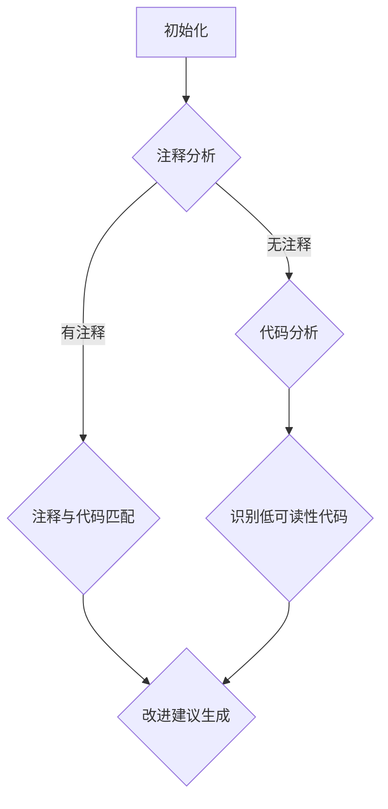
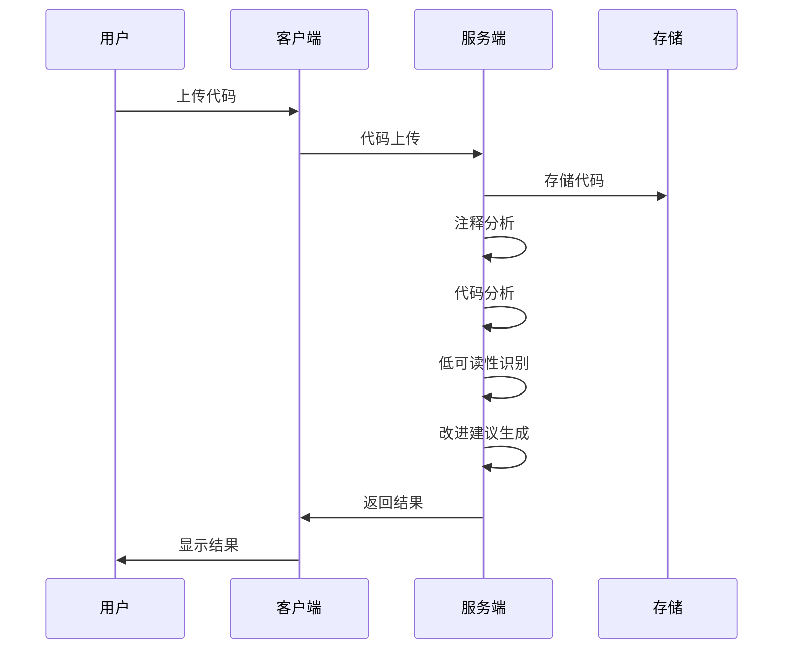

                 

# 《提示词编程的代码可读性增强技术》

关键词：提示词编程，代码可读性，算法原理，系统架构，项目实战，最佳实践

摘要：本文旨在深入探讨如何通过提示词编程技术来增强代码的可读性。首先，我们将回顾代码可读性的重要性，接着介绍核心概念和原理，分析算法流程和数学模型，展示系统架构设计，并进行项目实战。最后，我们将总结最佳实践并给出拓展阅读建议。

## 第一部分：背景与基础理论

### 1.1 代码可读性的重要性

代码可读性是软件开发过程中至关重要的一环。它不仅影响开发效率，还直接关系到代码的维护性和团队协作。一个高可读性的代码库可以减少新成员的学习成本，提高团队整体的生产力。然而，当前许多代码库存在可读性差的问题，这使得代码维护变得复杂和繁琐。

### 1.2 核心概念介绍

**提示词编程**：一种通过关键词和模式匹配来自动化代码分析和重构的技术。**代码可读性评估方法**：用于衡量代码清晰度的一系列标准和指标。**代码自动化重写技术**：利用算法和工具自动修改代码，以提高其可读性和可维护性。

### 1.3 提示词编程与代码可读性的关系

提示词编程通过识别代码中的关键词和模式，可以有效地提高代码的可读性。它不仅可以自动化修复代码中的常见问题，还可以通过重构代码结构，使代码更加清晰和易于理解。

## 第二部分：算法原理与实现

### 2.1 代码可读性增强算法原理

该算法基于自然语言处理技术，通过分析代码中的自然语言注释和代码本身，识别出可读性较低的部分，并提出改进建议。

### 2.2 算法流程图

使用Mermaid绘制算法流程图，如下所示：



### 2.3 Python代码实现

以下是一个简单的Python代码示例，用于实现代码可读性增强算法的一部分：

```python
import re

def comment_analysis(comment):
    # 分析自然语言注释
    pass

def code_analysis(code):
    # 分析代码结构
    pass

def find_low_readability(code):
    # 识别低可读性代码
    return re.findall(r'\bif\s+not\s+\b', code)

def generate_suggestions(code):
    # 生成改进建议
    low_readability = find_low_readability(code)
    suggestions = []
    for issue in low_readability:
        suggestions.append(f"改进：移除不必要的否定表达式 {issue}")
    return suggestions

code = """
if not (condition1 and condition2):
    print("Error")
"""
suggestions = generate_suggestions(code)
for suggestion in suggestions:
    print(suggestion)
```

### 2.4 数学模型与公式解释

为了更深入地理解代码可读性增强算法，我们可以引入一些数学模型。以下是一个简单的数学模型，用于评估代码的可读性：

$$
\text{Readability} = \frac{\text{清晰性} + \text{简洁性} + \text{一致性}}{3}
$$

清晰性、简洁性和一致性是评估代码可读性的三个关键因素。该公式通过加权平均的方式计算代码的整体可读性。

## 第三部分：系统分析与架构设计

### 3.1 系统分析

**问题场景**：一个大型企业需要一个能够自动化评估和改进代码可读性的系统。

**系统功能设计**：包括代码上传、注释分析、代码分析、低可读性识别、改进建议生成和代码重写等功能。

**系统架构设计**：基于微服务架构，包括服务端、客户端和存储层。

### 3.2 系统架构详细设计

**系统接口设计**：定义了各个模块之间的交互接口。

**系统交互设计**：使用Mermaid绘制系统交互序列图，如下所示：



## 第四部分：项目实战

### 4.1 项目一：提示词编程环境搭建

**环境安装与配置**：介绍如何安装Python、JDK和相关的依赖库。

**核心实现源代码**：提供代码可读性增强算法的实现代码。

**应用解读与分析**：分析代码示例，展示如何使用算法提高代码可读性。

**案例分析与讲解**：详细讲解一个实际案例，展示算法的实战效果。

### 4.2 项目二：代码可读性自动评估

**环境搭建与配置**：介绍如何搭建代码可读性评估环境。

**核心算法实现**：提供自动评估算法的实现代码。

**应用实例解析**：分析代码示例，展示如何使用算法自动评估代码可读性。

**项目小结**：总结项目的主要成果和经验。

## 第五部分：最佳实践与总结

### 5.1 最佳实践技巧

**提高代码可读性的最佳实践**：提供一些实际操作技巧，如使用清晰的名字、编写详细的注释等。

**提示词编程的最佳实践**：介绍如何有效地使用提示词编程技术，以最大化代码的可读性。

### 5.2 小结与展望

**书籍内容回顾**：回顾书籍的主要内容，总结关键知识点。

**未来发展方向**：讨论代码可读性增强技术的未来发展趋势。

**注意事项与建议**：提供一些使用代码可读性增强技术的注意事项和建议。

### 5.3 拓展阅读

**相关研究论文**：推荐一些与代码可读性增强技术相关的优秀论文。

**经典书籍推荐**：推荐一些关于编程和算法的经典书籍。

## 结语

作者：AI天才研究院/AI Genius Institute & 禅与计算机程序设计艺术 /Zen And The Art of Computer Programming

本文深入探讨了通过提示词编程技术增强代码可读性的方法和实践。从算法原理到系统架构，再到实际项目实战，我们全面展示了如何提高代码的可读性。希望本文能帮助读者更好地理解代码可读性增强技术，并在实际开发中运用这些知识，提高代码质量和开发效率。更多精彩内容，请关注后续的拓展阅读和我们的研究论文。

