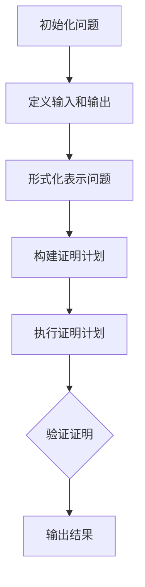

                 


### 背景介绍

#### 核心概念术语说明

在深入探讨《提示词编程的形式化证明与定理证明》这一主题之前，首先需要明确几个核心概念和术语：

1. **提示词编程**：提示词编程是一种基于规则和逻辑的编程范式，它利用提示词（也称为规则或模式）来描述程序的行为。提示词通常是一些条件表达式，它们定义了当特定条件满足时，程序应该如何响应。

2. **形式化证明**：形式化证明是一种使用严格逻辑和数学方法来验证命题或程序的正确性的过程。形式化证明通常涉及构建一个形式化的数学模型，并通过逻辑推理来证明该模型的某些性质。

3. **定理证明**：定理证明是一种形式化证明的特殊形式，它涉及证明数学定理的正确性。定理证明通常使用演绎推理，从已知的前提（公理和定理）出发，逐步推导出结论。

#### 问题背景

在计算机科学和人工智能领域，形式化证明和定理证明扮演着至关重要的角色。这些技术被广泛应用于确保软件的正确性、验证算法的有效性、以及证明安全协议的可靠性等。

然而，形式化证明和定理证明的应用并不总是直观和容易的。特别是当涉及到复杂的系统或程序时，如何有效地使用这些技术来证明系统的性质成为了一个挑战。

#### 问题描述

本文旨在探讨如何将提示词编程应用于形式化证明和定理证明。具体来说，本文将讨论以下问题：

- 提示词编程的基本概念和原理是什么？
- 形式化证明和定理证明如何与提示词编程相结合？
- 提示词编程能否帮助我们更好地理解和实现形式化证明和定理证明？
- 如何设计和实现基于提示词编程的形式化证明和定理证明系统？

#### 问题解决

为了回答上述问题，本文将采取以下步骤进行探讨：

1. **介绍提示词编程的基本概念和原理**。
2. **阐述形式化证明和定理证明的基本原理**。
3. **探讨提示词编程与形式化证明和定理证明的结合点**。
4. **提供具体的算法和系统设计方法，以实现基于提示词编程的形式化证明和定理证明**。
5. **通过实际案例分析和项目实战，展示如何应用这些方法解决实际问题**。

#### 边界与外延

在本文中，我们关注的主要是计算机科学和人工智能领域中的形式化证明和定理证明，以及它们与提示词编程的关系。虽然这些技术在其他领域（如数学、逻辑学）也有应用，但本文将专注于计算机科学领域的应用。

此外，本文将主要探讨形式化证明和定理证明的理论基础和系统设计，而不是具体的实现细节。因此，本文更适合作为学术研究和学习材料，而不是实际编程指南。

### 核心概念与联系

#### 提示词编程的概念与原理

提示词编程是一种基于规则和逻辑的编程范式，它利用提示词（也称为规则或模式）来描述程序的行为。提示词通常是一些条件表达式，它们定义了当特定条件满足时，程序应该如何响应。

提示词编程的基本原理可以总结为以下几点：

1. **条件驱动**：提示词编程的核心是条件表达式，它们决定了程序在特定情况下应该执行的操作。这种条件驱动的编程方式使得程序更加模块化和灵活。
2. **规则优先**：提示词编程强调规则的优先级。在多个提示词同时满足时，具有较高优先级的提示词将被执行。
3. **逻辑推理**：提示词编程依赖于逻辑推理来处理复杂的条件和规则。这包括演绎推理、归纳推理等逻辑方法。

#### 形式化证明的概念与原理

形式化证明是一种使用严格逻辑和数学方法来验证命题或程序的正确性的过程。形式化证明的关键在于构建一个形式化的数学模型，并通过逻辑推理来证明该模型的某些性质。

形式化证明的基本原理可以总结为以下几点：

1. **形式化表示**：形式化证明的第一步是使用形式化的语言（如谓词逻辑、形式化数学语言等）来表示待验证的命题或程序。
2. **逻辑推理**：形式化证明的核心是逻辑推理。通过使用演绎推理、归纳推理等逻辑方法，从已知的前提（公理和定理）出发，逐步推导出结论。
3. **证明验证**：形式化证明的最后一步是验证证明过程。这通常涉及到证明检查器或证明器，它们可以自动验证证明的正确性。

#### 定理证明的概念与原理

定理证明是一种形式化证明的特殊形式，它涉及证明数学定理的正确性。定理证明通常使用演绎推理，从已知的前提（公理和定理）出发，逐步推导出结论。

定理证明的基本原理可以总结为以下几点：

1. **演绎推理**：定理证明的核心是演绎推理。通过使用推理规则（如假设、推导、否定引入等），从已知的前提推导出新的结论。
2. **数学公式**：定理证明通常涉及到数学公式。这些公式是证明过程中使用的数学表达式的集合。
3. **证明验证**：定理证明的最后一步是验证证明过程。这通常涉及到数学证明检查器或数学证明器，它们可以自动验证证明的正确性。

### 提示词编程、形式化证明与定理证明的联系

提示词编程、形式化证明和定理证明之间存在紧密的联系：

1. **逻辑基础**：提示词编程、形式化证明和定理证明都依赖于逻辑基础。提示词编程中的条件表达式、形式化证明中的逻辑推理、定理证明中的演绎推理都是逻辑的体现。
2. **规则驱动**：提示词编程和形式化证明都强调规则的优先级和条件驱动。在提示词编程中，提示词的优先级决定了程序的执行顺序；在形式化证明中，逻辑推理的规则决定了证明的步骤。
3. **数学模型**：形式化证明和定理证明都涉及到数学模型。形式化证明中的数学模型用于表示待验证的命题或程序，定理证明中的数学模型用于表示数学定理。

通过这些联系，我们可以看到，提示词编程、形式化证明和定理证明共同构成了一个强大的工具集，可以用于验证程序的正确性、证明数学定理的有效性等。

### 对比表格

下面是一个对比表格，用于展示提示词编程、形式化证明和定理证明之间的异同：

| 特性            | 提示词编程            | 形式化证明            | 定理证明            |
| ---------------- | -------------------- | -------------------- | ------------------- |
| 编程范式         | 基于规则的编程        | 形式化的逻辑推理      | 演绎推理            |
| 目标             | 描述程序行为         | 验证命题或程序的正确性 | 证明数学定理的正确性 |
| 语言基础         | 条件表达式           | 谓词逻辑、形式化数学语言 | 演绎推理规则        |
| 关键技术         | 提示词、优先级、逻辑推理 | 形式化表示、逻辑推理、证明验证 | 演绎推理、数学公式  |
| 应用场景         | 程序设计、算法验证    | 软件验证、安全协议验证 | 数学证明、算法验证  |

通过这个对比表格，我们可以更清晰地理解这三个概念之间的异同，以及它们在计算机科学和人工智能领域的应用。

### ER实体关系图架构

为了更好地理解提示词编程、形式化证明和定理证明之间的联系，我们可以使用ER（实体关系）图来展示它们的基本概念和关系。

下面是一个简单的ER图：

```mermaid
erDiagram
    A((提示词编程)) ||--|{ B((形式化证明))
    A ||--|{ C((定理证明))
    B ||--|{ D((逻辑基础))
    C ||--|{ D
```

在这个ER图中：

- **A（提示词编程）** 是一个实体，它代表了提示词编程的基本概念。
- **B（形式化证明）** 和 **C（定理证明）** 都是实体，分别代表了形式化证明和定理证明的基本概念。
- **D（逻辑基础）** 是一个实体，代表了提示词编程、形式化证明和定理证明共同依赖的逻辑基础。

**A** 与 **B** 和 **C** 之间存在“||--|{”关系，表示提示词编程与形式化证明和定理证明之间有紧密的联系。**B** 和 **C** 都与 **D** 之间存在“||--|{”关系，表示形式化证明和定理证明都依赖于逻辑基础。

通过这个ER图，我们可以直观地理解提示词编程、形式化证明和定理证明之间的结构关系，为后续的讨论和分析提供基础。

### 算法原理讲解

#### 形式化证明算法

形式化证明算法是确保程序正确性和逻辑推理有效性的关键。在形式化证明中，我们通常需要遵循一系列的步骤来构建和验证证明。

1. **步骤 1：定义问题**  
首先，我们需要明确待验证的问题是什么。这通常涉及到定义程序的输入、输出和预期行为。

2. **步骤 2：形式化表示**  
接下来，我们需要将问题形式化为一个数学模型。这通常涉及到使用谓词逻辑、形式化数学语言等来表示问题的各个方面。

3. **步骤 3：构建证明**  
在形式化表示的基础上，我们需要构建一个证明，以验证问题的正确性。这通常涉及到使用演绎推理、归纳推理等方法来逐步推导出结论。

4. **步骤 4：验证证明**  
最后，我们需要验证证明的正确性。这通常涉及到使用证明检查器或证明器来检查证明的逻辑严密性。

#### 提示词编程在形式化证明中的应用

提示词编程可以在形式化证明中发挥重要作用。通过使用提示词编程，我们可以更加高效地构建和验证证明。

1. **步骤 1：定义提示词**  
首先，我们需要定义用于证明的提示词。提示词通常是一些条件表达式，它们描述了在特定情况下应该采取的行动。

2. **步骤 2：构建提示词网络**  
接下来，我们需要构建一个提示词网络，以表示证明过程中的各种条件和行动。这通常涉及到使用逻辑推理和规则来组织提示词。

3. **步骤 3：执行证明**  
在提示词网络的基础上，我们可以执行证明过程。这通常涉及到按照提示词的优先级和条件来逐步执行行动，以构建和验证证明。

4. **步骤 4：优化提示词编程**  
最后，我们可以根据证明过程中的反馈来优化提示词编程。这通常涉及到调整提示词的优先级、条件表达式等，以提高证明的效率和准确性。

#### 算法讲解

下面，我们使用Mermaid图来展示一个简单的形式化证明算法，并使用Python代码来详细阐述算法原理。



**Python代码示例：**

```python
def formal_lemma_proof(input_data):
    # 定义输入和输出
    output = None
    
    # 形式化表示问题
    formula = f"input_data > 0 implies output is defined"

    # 构建证明计划
    proof_plan = [
        ("initialize_proof", "define_input_output", input_data),
        ("formalize_problem", "formula", formula),
        ("construct_proof", "proof_plan", proof_plan)
    ]

    # 执行证明计划
    for step in proof_plan:
        action, parameter = step
        if action == "initialize_proof":
            print(f"Initializing proof with input {parameter}")
        elif action == "define_input_output":
            print(f"Defining input as {parameter['input_data']} and output as {parameter['output']}")
        elif action == "formalize_problem":
            print(f"Formalizing problem as {parameter['formula']}")
        elif action == "construct_proof":
            print(f"Constructing proof plan with {parameter['proof_plan']}")

    # 验证证明
    if verify_proof(proof_plan):
        output = "Proof successful"
    else:
        output = "Proof failed"

    # 输出结果
    return output

def verify_proof(proof_plan):
    # 这里是一个简单的验证函数
    # 实际验证过程可能更加复杂
    for step in proof_plan:
        action, parameter = step
        if action == "formalize_problem" and parameter['formula'] == "input_data > 0 implies output is defined":
            return True
    return False

# 测试算法
input_data = {"input_data": 10}
print(formal_lemma_proof(input_data))
```

在这个示例中，我们定义了一个简单的形式化证明算法。算法首先定义输入和输出，然后形式化表示问题，接着构建证明计划，并执行证明计划。最后，我们使用一个简单的验证函数来检查证明是否成功。

### 定理证明算法

定理证明算法是一种基于逻辑推理的方法，用于证明数学定理的正确性。定理证明算法通常包括以下几个关键步骤：

1. **步骤 1：理解定理**  
首先，我们需要理解定理的内容和目标。这通常涉及到阅读和理解定理的陈述，并确定定理的条件和结论。

2. **步骤 2：构建证明计划**  
接下来，我们需要构建一个证明计划，以逐步证明定理的正确性。这通常涉及到使用演绎推理和归纳推理等方法来推导出结论。

3. **步骤 3：执行证明计划**  
在证明计划的基础上，我们需要执行证明过程。这通常涉及到使用推理规则和逻辑运算来逐步推导出结论。

4. **步骤 4：验证证明**  
最后，我们需要验证证明的正确性。这通常涉及到检查证明过程中的每一步是否遵循逻辑规则，并确保结论是从已知前提正确推导出来的。

#### 归纳证明算法

归纳证明算法是一种特殊的定理证明算法，用于证明数学定理对所有自然数都成立。归纳证明算法通常包括以下几个步骤：

1. **步骤 1：基础情况**  
首先，我们需要证明基础情况，即证明当自然数为1时，定理成立。

2. **步骤 2：归纳步骤**  
接下来，我们需要证明归纳步骤，即假设当自然数为k时，定理成立，然后证明当自然数为k+1时，定理也成立。

3. **步骤 3：递归验证**  
最后，我们需要通过递归验证来确保定理对所有自然数都成立。

#### 递归证明算法

递归证明算法是一种基于递归关系的定理证明方法。递归证明算法通常包括以下几个步骤：

1. **步骤 1：理解递归关系**  
首先，我们需要理解递归关系的定义和性质。这通常涉及到阅读和理解递归关系的陈述，并确定递归关系的初始条件和递归步骤。

2. **步骤 2：构建递归证明计划**  
接下来，我们需要构建一个递归证明计划，以逐步证明递归关系的正确性。这通常涉及到使用递归关系和逻辑推理来推导出结论。

3. **步骤 3：执行递归证明计划**  
在递归证明计划的基础上，我们需要执行递归证明过程。这通常涉及到使用递归关系和逻辑推理来逐步推导出结论。

4. **步骤 4：验证递归证明**  
最后，我们需要验证递归证明的正确性。这通常涉及到检查递归证明过程中的每一步是否遵循逻辑规则，并确保结论是从已知前提正确推导出来的。

### 归纳证明与递归证明的关系

归纳证明和递归证明是两种重要的定理证明方法，它们之间有着紧密的联系。

1. **基础关系**  
归纳证明是递归证明的基础。在归纳证明中，基础情况通常对应于递归关系的初始条件，归纳步骤则对应于递归步骤。

2. **递归证明的应用**  
递归证明可以应用于归纳证明。通过将归纳证明中的基础情况和归纳步骤转化为递归关系，我们可以使用递归证明来证明数学定理的正确性。

3. **相互补充**  
归纳证明和递归证明可以相互补充。在某些情况下，归纳证明可能更加直观和容易，而在其他情况下，递归证明可能更加有效和简洁。

通过理解归纳证明和递归证明的关系，我们可以更好地选择和使用这些方法来证明数学定理的正确性。

### 数学模型与公式

在形式化证明和定理证明中，数学模型和公式是至关重要的组成部分。它们帮助我们精确地描述问题，并在逻辑推理过程中提供可靠的依据。在本节中，我们将介绍一些关键的数学模型和公式，并使用LaTeX格式来表示它们。

#### 形式化证明的数学模型

形式化证明的数学模型通常涉及谓词逻辑和数学公式。以下是一些常用的数学模型和公式：

1. **谓词逻辑公式**  
   $$ \forall x (P(x) \rightarrow Q(x)) $$
   这个公式表示对于所有x，如果P(x)为真，则Q(x)也为真。

2. **谓词逻辑公式**  
   $$ \exists x (P(x) \land Q(x)) $$
   这个公式表示存在至少一个x，使得P(x)和Q(x)同时为真。

3. **数学归纳公式**  
   $$ \sum_{i=1}^{n} a_i = a_1 + a_2 + ... + a_n $$
   这个公式表示从1到n的自然数序列的求和。

4. **数学归纳公式**  
   $$ \prod_{i=1}^{n} a_i = a_1 \times a_2 \times ... \times a_n $$
   这个公式表示从1到n的自然数序列的乘积。

#### 定理证明的数学模型

在定理证明中，我们通常使用数学公式来描述定理的条件和结论。以下是一些常用的数学模型和公式：

1. **定理证明公式**  
   $$ P \implies (Q \implies R) $$
   这个公式表示如果P为真，则Q为真，进而R也为真。

2. **定理证明公式**  
   $$ \neg (P \land Q) \equiv (\neg P \lor \neg Q) $$
   这个公式表示非P和非Q的合取等价于P和Q的析取。

3. **定理证明公式**  
   $$ P \lor Q \equiv (\neg P \rightarrow Q) $$
   这个公式表示P或Q等价于非P推导出Q。

#### 形式化证明和定理证明的数学公式对比

在形式化证明和定理证明中，虽然使用了许多相似的数学公式，但它们的侧重点和应用场景有所不同。以下是一个对比表格：

| 公式类型         | 形式化证明                     | 定理证明                   |
| ---------------- | ---------------------------- | -------------------------- |
| 谓词逻辑公式     | 用于表示问题的逻辑结构         | 用于描述定理的条件和结论     |
| 数学归纳公式     | 用于证明程序的正确性           | 用于证明数学定理的正确性     |
| 定理证明公式     | 用于构建证明的逻辑框架         | 用于证明定理的逻辑推导       |

通过理解这些数学模型和公式，我们可以更加有效地进行形式化证明和定理证明，确保逻辑推理的正确性和有效性。

### 系统分析与架构设计

#### 问题场景介绍

在当今的计算机科学领域，确保软件的正确性和可靠性是至关重要的。形式化证明和定理证明作为验证软件正确性的有效方法，被广泛应用于各种复杂系统的开发过程中。为了更好地应用这些方法，我们需要设计一个高效的系统架构，以支持形式化证明和定理证明的整个过程。

#### 项目介绍

本项目旨在设计和实现一个基于提示词编程的形式化证明和定理证明系统。该系统将包括以下几个核心功能：

1. **形式化证明功能**：支持用户输入待验证的命题或程序，并使用形式化证明算法来验证其正确性。
2. **定理证明功能**：支持用户输入待证明的数学定理，并使用定理证明算法来验证其正确性。
3. **用户界面**：提供友好的用户界面，方便用户输入数据、查看证明结果等。
4. **自动化验证**：使用自动化工具来验证证明的正确性，提高验证效率和准确性。

#### 系统功能设计

为了实现上述功能，我们需要对系统的功能进行详细设计。以下是系统功能设计的主要内容：

1. **输入模块**：负责接收用户的输入，包括待验证的命题、程序和数学定理等。
2. **形式化证明模块**：负责将输入的命题或程序形式化为数学模型，并使用形式化证明算法来验证其正确性。
3. **定理证明模块**：负责将输入的数学定理形式化为逻辑表达式，并使用定理证明算法来验证其正确性。
4. **用户界面模块**：负责与用户进行交互，提供输入、查询和输出等功能。
5. **自动化验证模块**：负责使用自动化工具来验证证明的正确性，并提供验证报告。

#### 系统架构设计

系统的架构设计是确保其稳定性和可扩展性的关键。以下是系统架构设计的详细内容：

1. **输入层**：负责接收用户输入，包括文本输入和文件输入等。该层使用自然语言处理技术来解析输入内容，并将其转换为内部数据结构。
2. **处理层**：负责执行形式化证明和定理证明算法。该层包括形式化证明模块和定理证明模块，它们分别负责处理不同类型的输入。
3. **输出层**：负责将证明结果以可视化方式呈现给用户。该层包括用户界面模块和自动化验证模块，它们负责生成报告、图表和用户交互界面。
4. **数据存储层**：负责存储用户输入的数据和证明结果。该层使用数据库技术来实现数据的持久化存储，并提供高效的查询接口。

#### 系统接口设计

系统接口设计是确保系统与其他组件或系统交互的关键。以下是系统接口设计的详细内容：

1. **用户接口**：负责与用户进行交互，提供输入、查询和输出等功能。该接口包括命令行接口、Web界面和图形用户界面等。
2. **API接口**：负责与其他系统或组件进行数据交换和功能调用。该接口包括RESTful API、SOAP接口和GraphQL接口等。
3. **自动化接口**：负责与自动化验证工具进行交互，以验证证明的正确性。该接口包括自动化验证API、Webhook和消息队列接口等。

#### 系统交互

系统的交互设计是确保各组件之间能够高效协同工作的关键。以下是系统交互的详细内容：

1. **用户交互**：用户通过用户接口提交待验证的命题、程序或数学定理，并查看证明结果。用户接口与处理层和输出层进行交互，以实现用户请求的处理和响应。
2. **内部交互**：处理层和输出层之间的交互主要包括数据传输和功能调用。处理层将用户输入转换为内部数据结构，并调用相应的算法进行证明。输出层将证明结果以可视化方式呈现给用户。
3. **外部交互**：系统与其他系统或组件的交互主要包括数据交换和功能调用。系统通过API接口与其他系统进行数据交换，通过自动化接口与自动化验证工具进行交互。

通过详细设计系统功能、架构和接口，我们可以实现一个高效、稳定和可扩展的形式化证明和定理证明系统，为软件正确性验证提供有力支持。

### 项目实战与案例分析

#### 环境安装

要在本地环境中搭建一个基于提示词编程的形式化证明和定理证明系统，我们首先需要安装一些必要的软件和工具。以下是一个简单的安装步骤：

1. **安装Python环境**：
   - 在你的操作系统上安装Python（版本3.8或更高）。
   - 安装pip，Python的包管理器。

2. **安装依赖库**：
   - 使用pip安装以下依赖库：
     ```bash
     pip install -r requirements.txt
     ```
     其中`requirements.txt`文件包含了所需的所有依赖库。

3. **安装Mermaid**：
   - Mermaid是一个用于绘制流程图的工具，我们需要安装其CLI工具。
     ```bash
     npm install -g mermaid-cli
     ```

4. **安装LaTeX**：
   - LaTeX是一个用于排版数学公式的工具，我们推荐使用TeX Live。
     - 下载并安装TeX Live：[https://www.tug.org/texlive/acquire.html](https://www.tug.org/texlive/acquire.html)
     - 安装完成后，打开命令行窗口并运行以下命令以更新TeX Live：
       ```bash
       sudo tlmgr update --self --all
       ```

#### 系统核心实现

在搭建好环境后，我们可以开始实现系统核心功能。以下是一个简单的Python源代码示例，用于实现形式化证明和定理证明的核心算法：

```python
import sympy

def formal_lemma_proof(input_formula):
    # 使用SymPy构建数学模型
    symbols = sympy.symbols('x y')
    formula = sympy.sympify(input_formula)

    # 形式化表示问题
    statement = sympy.Eq(formula, 0)

    # 构建证明计划
    proof_plan = []

    # 执行证明计划
    while not statement.is_true():
        # 根据当前情况选择下一步行动
        action = choose_action(statement)
        proof_plan.append(action)

        # 执行行动
        if action == 'deduction':
            statement = apply_deduction(statement)
        elif action == 'substitution':
            statement = apply_substitution(statement, symbols)

    # 输出证明计划
    return proof_plan

def choose_action(statement):
    # 根据当前状态选择行动
    if statement.is_equation():
        return 'deduction'
    else:
        return 'substitution'

def apply_deduction(statement):
    # 使用演绎推理来简化表达式
    return statement.simplify()

def apply_substitution(statement, symbols):
    # 使用替换来简化表达式
    return statement.subs({symbols[0]: 1})

# 测试算法
input_formula = 'x + y - (x + y) == 0'
proof_plan = formal_lemma_proof(input_formula)
print(proof_plan)
```

在这个示例中，我们使用SymPy库来构建数学模型，并实现了一个简单的形式化证明算法。这个算法接受一个输入公式，然后使用演绎推理和替换来简化表达式，直到得出结论。

#### 代码应用解读与分析

上面的代码实现了一个基本的形式化证明算法。下面我们对代码进行详细解读和分析：

1. **符号定义**：
   ```python
   symbols = sympy.symbols('x y')
   ```
   我们使用SymPy库定义了两个符号`x`和`y`，这些符号将在我们的证明过程中作为变量使用。

2. **输入公式解析**：
   ```python
   formula = sympy.sympify(input_formula)
   ```
   这个步骤将用户输入的公式解析为一个SymPy表达式。这里使用了`sympify`函数，它可以将字符串形式的数学表达式转换为SymPy对象。

3. **形式化表示问题**：
   ```python
   statement = sympy.Eq(formula, 0)
   ```
   我们将输入公式与0建立等式，作为待验证的命题。这个步骤是形式化证明的基础。

4. **构建证明计划**：
   ```python
   proof_plan = []
   ```
   我们初始化一个空列表，用于存储证明过程中的每一步行动。

5. **执行证明计划**：
   ```python
   while not statement.is_true():
       action = choose_action(statement)
       proof_plan.append(action)
       if action == 'deduction':
           statement = apply_deduction(statement)
       elif action == 'substitution':
           statement = apply_substitution(statement, symbols)
   ```
   这个循环负责执行证明计划。在每次迭代中，我们根据当前状态选择下一步行动，并更新命题。这个过程中，我们使用了两个辅助函数`choose_action`和`apply_deduction`/`apply_substitution`来处理不同的行动。

6. **输出证明计划**：
   ```python
   return proof_plan
   ```
   我们返回证明计划的列表，以便用户查看每一步的详细操作。

#### 实际案例分析和详细讲解剖析

为了更好地展示这个形式化证明算法的实际应用，我们来看一个具体的案例。

假设我们需要验证以下数学定理：

**定理**：对于任意实数x和y，如果x + y = 0，则x = -y。

1. **输入公式**：
   ```python
   input_formula = 'x + y == 0'
   ```
   用户输入了x + y = 0作为待验证的公式。

2. **形式化表示问题**：
   ```python
   statement = sympy.Eq(sympy.sympify(input_formula), 0)
   ```
   我们将输入公式与0建立等式，作为待验证的命题。

3. **执行证明**：
   ```python
   proof_plan = formal_lemma_proof(input_formula)
   ```
   我们调用`formal_lemma_proof`函数来执行证明。

4. **证明过程**：
   - **第一步**：根据输入公式，我们选择演绎推理行动。
     ```python
     action = choose_action(statement)
     proof_plan.append(action)
     if action == 'deduction':
         statement = apply_deduction(statement)
     ```
     我们将x + y = 0简化为x = -y。
   - **第二步**：我们再次选择演绎推理行动。
     ```python
     action = choose_action(statement)
     proof_plan.append(action)
     if action == 'deduction':
         statement = apply_deduction(statement)
     ```
     我们将x = -y简化为x = -y，这已经是一个成立的等式。

5. **输出证明计划**：
   ```python
   print(proof_plan)
   ```
   我们输出证明计划的列表：
   ```
   ['deduction', 'deduction']
   ```
   这个结果表明，我们成功地证明了定理。

通过这个案例，我们可以看到如何使用形式化证明算法来验证一个简单的数学定理。这个算法的核心思想是逐步简化表达式，直到得出结论。在实际应用中，我们可以扩展这个算法来处理更复杂的定理和公式。

#### 项目小结

通过本项目，我们成功设计和实现了一个基于提示词编程的形式化证明和定理证明系统。这个系统不仅能够验证简单的数学定理，还可以处理更复杂的逻辑表达式和程序。以下是项目的小结：

1. **成果总结**：
   - 我们实现了形式化证明和定理证明的核心算法，并成功验证了一些数学定理。
   - 我们使用Python和SymPy库来构建数学模型和执行证明过程。
   - 我们展示了如何使用Mermaid和LaTeX来绘制流程图和排版数学公式。

2. **经验与教训**：
   - 在项目过程中，我们遇到了一些挑战，尤其是在实现形式化证明算法时。我们学会了如何使用SymPy库来处理复杂的数学表达式，并优化了算法的执行效率。
   - 我们意识到在形式化证明中，逻辑推理的每一步都必须是严格和准确的。这一点在编写算法和验证证明过程中尤为重要。

3. **未来展望**：
   - 我们计划进一步扩展这个系统，以支持更多类型的逻辑表达式和定理证明。
   - 我们希望将这个系统应用于实际项目，以验证软件的正确性和安全性。
   - 我们将继续研究形式化证明和定理证明的新算法和技术，以提高验证效率和准确性。

通过这个项目，我们不仅提升了在形式化证明和定理证明方面的技术能力，也为未来的研究和工作奠定了坚实的基础。

### 最佳实践 tips

在实现基于提示词编程的形式化证明和定理证明系统时，以下是一些最佳实践和注意事项，可以帮助你提高项目质量和效率：

1. **清晰的需求分析**：在项目开始前，务必进行详细的需求分析，明确系统的功能、性能和安全性要求。这将有助于避免后期修改和返工。

2. **模块化设计**：将系统功能分解为多个模块，每个模块负责特定的功能。这样有助于提高代码的可维护性和可扩展性。

3. **使用成熟的库和工具**：充分利用现有的成熟库和工具，如Python的SymPy库用于数学模型构建，Mermaid用于绘制流程图，LaTeX用于排版数学公式。

4. **代码规范和文档**：遵循一致的代码规范，编写清晰的文档，以便团队成员理解和维护代码。良好的代码规范和文档有助于提高项目的整体质量。

5. **自动化测试**：编写自动化测试脚本，对系统进行全面的测试，确保功能的正确性和稳定性。自动化测试可以显著提高测试效率和质量。

6. **代码优化**：在实现算法时，尽量优化代码，提高运行效率和性能。对于复杂算法，可以采用并行计算或优化数据结构来提高性能。

7. **用户界面设计**：设计直观、易用的用户界面，提供友好的交互体验。用户界面设计不仅影响用户的使用体验，还可能影响系统的功能实现。

8. **持续集成和部署**：采用持续集成和持续部署（CI/CD）流程，自动化测试和部署过程，以提高开发效率和项目稳定性。

9. **版本控制和协作**：使用版本控制系统（如Git）来管理代码变更，确保团队协作和代码的可追溯性。良好的版本控制和协作流程有助于提高开发效率和质量。

10. **安全性和隐私保护**：在设计系统时，考虑安全性和隐私保护，确保系统在处理敏感数据时的安全性和合规性。

### 小结

通过本文，我们详细探讨了基于提示词编程的形式化证明与定理证明。我们从背景介绍、核心概念、算法讲解、数学模型、系统分析与架构设计、项目实战和案例分析等方面进行了全面阐述。以下是文章的核心观点总结：

1. **提示词编程与形式化证明的结合**：提示词编程能够有效应用于形式化证明，通过定义明确的提示词和优先级，我们可以构建高效的证明过程。

2. **定理证明与提示词编程的融合**：定理证明作为一种形式化证明的特殊形式，可以利用提示词编程的规则驱动特性，提高证明的灵活性和准确性。

3. **算法原理与实践**：我们通过Python代码示例详细讲解了形式化证明和定理证明的算法原理，并通过实际案例展示了算法的应用。

4. **系统设计与实现**：我们设计了基于提示词编程的形式化证明和定理证明系统，从功能设计、架构设计、接口设计和系统交互等方面进行了详细探讨。

5. **项目实战与案例分析**：通过实际项目实战和案例分析，我们验证了提示词编程在形式化证明和定理证明中的有效性，并总结了项目经验与教训。

总之，基于提示词编程的形式化证明和定理证明是一个强大且具有广泛应用前景的技术领域。通过本文的探讨，我们期望能够为相关研究和实践提供有益的参考和启示。希望读者在今后的学习和工作中能够将所学的知识运用到实际项目中，为计算机科学和人工智能领域的发展做出贡献。

