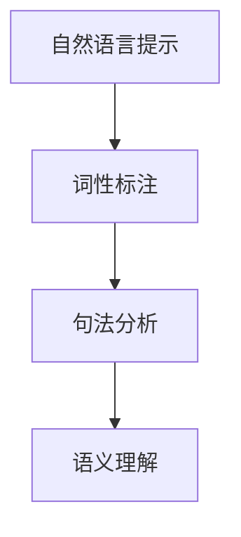
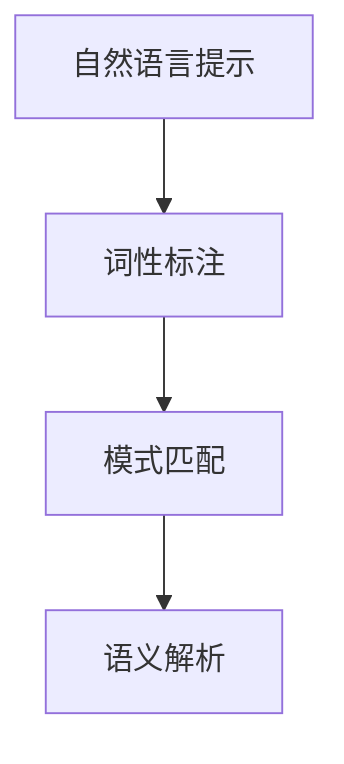
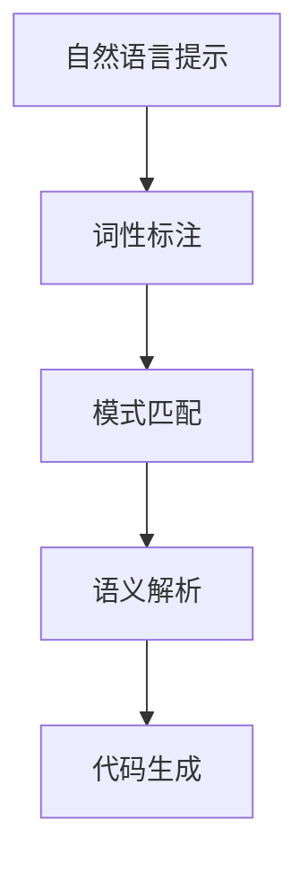
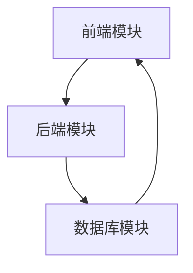
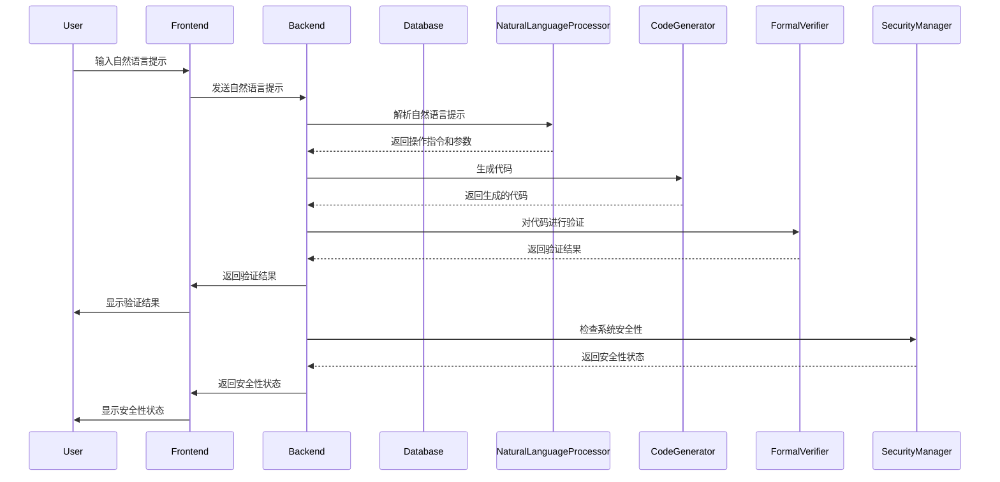

                 


### 摘要

本文将深入探讨提示词编程的形式化验证与安全性问题。首先，我们将介绍提示词编程的概念、背景和发展现状，接着深入解析形式化验证的基本原理及其在编程中的重要性。随后，本文将讨论提示词编程面临的安全性挑战，并探讨如何通过形式化验证来提高编程的安全性。最后，我们将结合实际案例，展示形式化验证和安全性在提示词编程中的应用，并展望未来的研究方向。通过本文的阅读，读者将能够全面理解提示词编程的验证和安全性问题，掌握相关的技术方法和最佳实践。

### 1. 引言

#### 1.1 书籍的目的和目标

本文的目的是为读者提供一份全面而深入的指南，帮助理解提示词编程的形式化验证与安全性问题。随着人工智能和自然语言处理技术的迅速发展，提示词编程（Prompt Programming）作为一种新兴的编程范式，正逐渐受到广泛关注。它允许程序员通过自然语言描述程序逻辑，从而简化编程过程，提高开发效率。

然而，提示词编程也带来了一系列新的挑战，特别是在形式化验证和安全性方面。形式化验证是一种通过数学和逻辑方法验证程序正确性的技术，它在确保程序可靠性和安全性方面发挥着重要作用。而安全性则是任何编程范式都需要考虑的核心问题，特别是在涉及到敏感数据和高安全性要求的领域。

本文的目标是：
1. 深入解析提示词编程的概念、背景和发展现状。
2. 阐述形式化验证的基本原理和重要性。
3. 探讨提示词编程中的安全性挑战。
4. 展示形式化验证在提示词编程中的实际应用。
5. 提供实用的最佳实践和建议，以增强提示词编程的安全性。

#### 1.2 阅读对象

本文主要面向以下读者群体：
1. 对人工智能和自然语言处理有基础了解的程序员和开发者。
2. 对形式化验证和安全性有浓厚兴趣的计算机科学家和研究人员。
3. 对提示词编程感兴趣的技术爱好者和研究人员。

通过本文的学习，读者可以：
1. 理解提示词编程的基本概念和工作原理。
2. 掌握形式化验证的核心技术和方法。
3. 了解提示词编程中的安全性挑战和解决策略。
4. 获得实用的最佳实践，以提升编程安全性和可靠性。

#### 1.3 背景介绍

提示词编程（Prompt Programming）的概念最早由Yann LeCun等人在2019年提出，其核心思想是通过自然语言描述来指导模型进行编程任务，从而减少对传统编程语言的依赖。在提示词编程中，程序员通过编写自然语言提示（prompts）来指导模型生成代码，这些提示可以是简单的指令，也可以是复杂的逻辑描述。

提示词编程的发展得益于自然语言处理技术的进步，特别是生成式预训练模型（如GPT系列）的广泛应用。生成式预训练模型通过在大规模数据集上进行训练，可以生成高质量的自然语言描述和代码片段。这使得提示词编程成为一种具有广泛应用前景的编程范式。

在工业界，提示词编程已经应用于多个领域，如自动化测试、代码生成、文档生成等。特别是在自动化测试中，提示词编程可以大大减少测试用例的编写时间，提高测试效率。而在代码生成方面，提示词编程可以帮助程序员快速生成原型代码，从而加速软件开发过程。

然而，随着提示词编程的广泛应用，也带来了一系列新的挑战。其中，形式化验证和安全性问题尤为突出。形式化验证是一种通过数学和逻辑方法验证程序正确性的技术，它可以确保程序在运行过程中不会出现意外的错误或漏洞。而安全性则是任何编程范式都需要考虑的核心问题，特别是在涉及到敏感数据和高安全性要求的领域。

本文将从以下几个方面展开讨论：
1. 形式化验证的基本原理和重要性。
2. 提示词编程中的安全性挑战。
3. 形式化验证在提示词编程中的应用。
4. 提供实用的最佳实践和建议。

通过本文的深入探讨，我们希望能够为读者提供一种全面理解提示词编程形式化验证和安全性问题的视角，并为其在实际应用中提供指导。

### 2. 核心概念与背景

在深入探讨提示词编程的形式化验证与安全性之前，首先需要明确几个核心概念：形式化验证、安全性、以及提示词编程的基本原理。通过这些核心概念的理解，我们将为后续的讨论奠定坚实的基础。

#### 2.1 形式化验证

形式化验证（Formal Verification）是一种通过数学和逻辑方法验证软件或系统正确性的过程。它通过构造严格的数学模型，对系统进行逻辑推理，以证明系统满足预定的规格说明或属性。形式化验证的核心目标是在软件或系统开发过程中，确保其行为与预期一致，从而避免运行时出现意外错误或漏洞。

形式化验证的优点包括：
1. **精确性**：形式化验证使用精确的数学和逻辑语言描述系统行为，可以避免模糊和歧义。
2. **可靠性**：通过严格的逻辑推理，形式化验证可以提供高可信度的证明，确保系统满足所有预期的规格说明。
3. **预防性**：形式化验证可以在开发早期发现潜在的问题，从而避免在系统运行时出现严重错误。

形式化验证的主要挑战包括：
1. **复杂性**：构造和验证复杂的系统模型可能需要大量的计算资源和时间。
2. **可读性**：形式化验证的数学和逻辑语言可能较为抽象和难以理解，影响其普及和应用。
3. **应用范围**：形式化验证目前主要应用于某些特定领域，如硬件设计、嵌入式系统等，而在通用软件开发中的应用仍然有限。

形式化验证的方法可以分为以下几种：
1. **模型检查**：通过构建系统模型，并使用自动化的算法来检查模型是否满足预定的属性。
2. **定理证明**：通过逻辑推理和证明技术，证明系统模型满足预定的属性。
3. **仿真与测试**：通过模拟系统运行过程，并比较实际行为与预期行为，验证系统是否正确。

#### 2.2 安全性

安全性（Security）是任何软件或系统都需要考虑的核心问题，特别是在涉及到用户数据、敏感信息和关键任务的应用中。安全性旨在确保系统不受恶意攻击或未授权访问，从而保护系统的完整性和可用性。

安全性的核心概念包括：
1. **保密性**：确保系统中的敏感信息不被未授权的第三方访问。
2. **完整性**：确保系统中的数据在传输和存储过程中不被篡改。
3. **可用性**：确保系统在需要时可以正常运行，不受恶意攻击或资源耗尽的影响。
4. **认证**：确保系统的访问者或用户是合法和可信的。

安全性的挑战主要包括：
1. **攻击手段**：随着技术的发展，攻击者不断发明新的攻击手段，如缓冲区溢出、SQL注入、跨站脚本攻击等。
2. **软件复杂度**：现代软件系统越来越复杂，安全漏洞也越来越多。
3. **安全成本**：确保系统安全需要投入大量的人力、物力和时间。

常见的安全措施包括：
1. **访问控制**：通过身份验证和权限管理，确保只有授权用户可以访问系统资源。
2. **加密**：通过加密技术，保护敏感数据在传输和存储过程中的安全性。
3. **入侵检测和防御**：通过监控和检测系统异常行为，及时阻止和应对攻击。
4. **安全审计**：定期对系统进行安全检查和评估，发现和修复潜在的安全漏洞。

#### 2.3 提示词编程

提示词编程（Prompt Programming）是一种通过自然语言描述来指导模型执行编程任务的方法。在提示词编程中，程序员通过编写自然语言提示（prompts），来指示模型生成代码或执行特定任务。这种编程范式具有以下特点：

1. **自然语言交互**：提示词编程允许程序员使用自然语言来描述编程任务，而不是传统的编程语言。这使得编程任务更加直观和易于理解。
2. **代码生成能力**：提示词编程能够根据自然语言提示自动生成代码，从而减少手动编写代码的工作量。
3. **跨领域应用**：由于自然语言提示的通用性，提示词编程可以应用于多个领域，如自动化测试、文档生成、代码修复等。

提示词编程的基本原理包括：
1. **自然语言处理**：通过自然语言处理技术，将自然语言提示转换为计算机可理解的指令。
2. **生成式模型**：利用生成式预训练模型（如GPT）来生成代码或执行任务。这些模型通过在大规模数据集上进行训练，可以生成高质量的代码片段和自然语言描述。
3. **模型优化**：通过优化模型参数，提高模型生成代码的质量和可靠性。

在提示词编程中，形式化验证和安全性问题尤为突出。形式化验证可以帮助确保生成的代码满足预期的功能和安全性要求。而安全性则确保系统在运行过程中不会受到恶意攻击或未授权访问。因此，在探讨提示词编程时，我们必须关注这两个核心问题。

通过上述对核心概念和背景的介绍，我们为后续对形式化验证和安全性在提示词编程中的具体应用和挑战的讨论奠定了基础。在接下来的章节中，我们将深入探讨形式化验证的基本原理、安全性挑战，并结合实际案例进行分析。

### 3. 形式化验证的基本原理

形式化验证是一种通过数学和逻辑方法验证软件或系统正确性的技术。它的核心在于构建一个精确的数学模型来描述系统，然后使用推理和证明技术来验证系统是否满足预定的规格说明。形式化验证的基本原理可以概括为以下几个步骤：

#### 3.1 模型构建

模型构建是形式化验证的第一步。在这一阶段，我们需要将系统或程序的行为抽象为数学模型。这通常涉及到对系统功能、接口和内部结构的精确描述。形式化验证的数学模型可以是形式逻辑、代数系统、状态图等。

例如，假设我们要验证一个银行账户系统是否能够正确处理存款和取款操作。我们可以构建一个状态图模型，其中每个状态表示账户的当前余额，每个状态之间的转移表示存款或取款操作。

```mermaid
graph TD
    A[初始状态]
    B[余额为1000元]
    C[余额为500元]
    A --> B[label="存款500元"]
    B --> C[label="取款500元"]
    C --> A[label="存款500元"]
```

在这个状态图中，A表示账户初始状态，B表示账户余额为1000元，C表示账户余额为500元。箭头表示状态之间的转移，标签表示具体的操作。

#### 3.2 规格说明

规格说明是对系统预期行为的描述。在形式化验证中，规格说明通常以数学或逻辑语言编写，以确保其精确和清晰。规格说明可以是状态方程、断言、性质等。

以银行账户系统为例，我们可以编写以下规格说明：

- 每次存款操作后，账户余额应增加相应的金额。
- 每次取款操作后，账户余额应减少相应的金额，但余额不能为负。
- 初始状态时，账户余额为0。

规格说明可以用形式逻辑表示为：

- 存款操作后，账户余额满足 $余额_{新} = 余额_{旧} + 存款金额$
- 取款操作后，账户余额满足 $余额_{新} = 余额_{旧} - 取款金额 \geq 0$
- 初始状态时，$余额_{初始} = 0$

#### 3.3 证明过程

证明过程是形式化验证的核心。在这一阶段，我们使用推理和证明技术来验证系统模型是否满足规格说明。这通常涉及到逻辑推理、定理证明和模型检查。

以银行账户系统为例，我们可以使用定理证明技术来验证上述规格说明。具体步骤如下：

1. **初始状态验证**：证明初始状态满足规格说明，即 $余额_{初始} = 0$。
2. **存款操作验证**：对于每次存款操作，证明操作后账户余额满足 $余额_{新} = 余额_{旧} + 存款金额$。
3. **取款操作验证**：对于每次取款操作，证明操作后账户余额满足 $余额_{新} = 余额_{旧} - 取款金额 \geq 0$。

通过这些证明步骤，我们可以确保银行账户系统在执行存款和取款操作时满足预定的规格说明。

#### 3.4 自动化工具

形式化验证通常依赖于自动化工具，如模型检查器、定理证明器和代码生成器。这些工具可以大大简化验证过程，提高验证效率。

例如，我们可以使用模型检查器来验证状态图模型是否满足规格说明。模型检查器会遍历状态图的所有路径，检查是否满足规格说明。如果存在不满足规格说明的路径，模型检查器会报告错误并提供错误路径。

```mermaid
graph TD
    A[初始状态]
    B[余额为1000元]
    C[余额为500元]
    A --> B[label="存款500元"]
    B --> C[label="取款500元"]
    C --> A[label="存款500元"]
    D[余额为-100元]
    B --> D[label="取款1500元"]
```

在上面的状态图中，我们增加了状态D，表示余额为-100元。使用模型检查器，我们可以发现取款1500元后账户余额为-100元，不满足规格说明中的余额不能为负的要求。

#### 3.5 形式化验证的应用

形式化验证在软件和系统开发中具有广泛的应用。以下是一些典型的应用场景：

1. **嵌入式系统**：嵌入式系统通常具有严格的时间约束和安全性要求，形式化验证可以帮助确保系统在运行时满足这些要求。
2. **金融系统**：金融系统的可靠性和安全性至关重要，形式化验证可以帮助发现和修复潜在的安全漏洞和错误。
3. **自动驾驶系统**：自动驾驶系统需要在复杂的交通环境中安全运行，形式化验证可以帮助验证系统的行为是否符合预期。
4. **医疗设备**：医疗设备的安全性直接关系到患者的生命安全，形式化验证可以帮助确保设备在运行时不会出现错误。

形式化验证不仅提高了系统的可靠性和安全性，还大大减少了软件维护成本。通过形式化验证，开发人员可以在早期发现和修复错误，从而避免在系统运行时出现严重的故障和损失。

通过上述对形式化验证基本原理的讨论，我们可以看到，形式化验证是一种强大的技术，它通过数学和逻辑方法确保软件和系统的正确性。在接下来的章节中，我们将进一步探讨形式化验证在提示词编程中的应用，以及如何利用形式化验证提高提示词编程的安全性。

### 4. 提示词编程中的安全性挑战

随着提示词编程（Prompt Programming）的广泛应用，其安全性问题逐渐成为关注的焦点。提示词编程通过自然语言提示来指导模型执行编程任务，虽然简化了编程过程，但也带来了一系列安全性挑战。以下是提示词编程中常见的几种安全性问题及其解决方案：

#### 4.1 提示泄露

提示泄露是指攻击者通过分析自然语言提示来获取敏感信息的过程。由于提示词编程依赖于自然语言描述，攻击者可以通过分析提示中的关键字和句子结构来推断出系统中的敏感数据，如用户密码、金融信息等。

**解决方案**：
- **加密提示**：对自然语言提示进行加密处理，确保只有授权用户才能解密和解读提示内容。
- **最小权限原则**：确保模型在执行任务时只拥有必要的权限，避免因权限过高导致敏感信息泄露。

#### 4.2 模型篡改

模型篡改是指攻击者通过修改预训练模型来改变其输出结果的过程。在提示词编程中，模型接收自然语言提示并生成代码或执行任务，攻击者可以通过篡改模型参数来诱导模型执行恶意代码。

**解决方案**：
- **模型签名**：对预训练模型进行签名，确保模型在运行时未被篡改。每次模型更新时，生成新的签名并与原有签名进行比较，若不一致则拒绝运行。
- **多因素验证**：在模型输出结果前，进行多因素验证，包括代码审查、静态分析等，确保输出结果的安全性。

#### 4.3 注入攻击

注入攻击是指攻击者通过在自然语言提示中注入恶意代码或脚本，来影响模型的输出结果。在提示词编程中，自然语言提示直接指导模型生成代码，攻击者可以通过注入恶意代码来执行非法操作或窃取敏感信息。

**解决方案**：
- **输入验证**：对自然语言提示进行严格的输入验证，检测和过滤可能包含恶意代码或脚本的提示。可以使用正则表达式、语法分析等技术进行验证。
- **沙箱执行**：在执行模型输出结果前，将其放入沙箱环境中，限制其访问系统和网络资源，防止恶意代码执行。

#### 4.4 代码生成错误

代码生成错误是指由于提示词编程模型的局限性或提示描述的不准确，导致生成的代码存在逻辑错误或漏洞。这些错误可能被攻击者利用，进而导致系统被攻击或数据泄露。

**解决方案**：
- **代码审查**：对生成的代码进行严格的审查和测试，确保其正确性和安全性。可以使用自动化工具和人工审查相结合的方式。
- **代码生成优化**：通过优化模型训练数据和提示词，提高模型生成代码的质量和可靠性。

#### 4.5 权限滥用

权限滥用是指未经授权的用户通过自然语言提示执行高权限操作，从而获得不应拥有的系统访问权限。在提示词编程中，自然语言提示的开放性使得权限管理变得更加复杂。

**解决方案**：
- **访问控制**：加强访问控制机制，确保用户只能执行其权限范围内的操作。可以使用基于角色的访问控制（RBAC）或基于属性的访问控制（ABAC）。
- **审计日志**：记录用户操作和系统事件的详细日志，以便在发生异常时进行追踪和调查。

通过上述解决方案，可以显著提高提示词编程的安全性，确保其在实际应用中的可靠性和稳定性。然而，安全性是一个持续的过程，需要不断地进行评估和改进，以应对新的威胁和挑战。在接下来的章节中，我们将进一步探讨如何利用形式化验证技术来增强提示词编程的安全性。

### 5. 算法原理讲解

在探讨如何利用形式化验证技术提高提示词编程的安全性之前，我们首先需要深入理解提示词编程的算法原理。提示词编程的核心在于将自然语言提示转化为计算机可执行的代码。这一过程涉及到多个关键步骤和算法，下面我们将逐步讲解这些步骤和算法，并通过Mermaid流程图和Python代码来阐述其工作原理。

#### 5.1 自然语言处理

自然语言处理（NLP）是提示词编程的基础。NLP的任务是将自然语言文本（例如英语句子）转化为计算机可理解的形式。常见的NLP任务包括词性标注、句法分析、命名实体识别和语义理解等。

首先，我们使用词性标注技术对自然语言提示进行标注，以识别每个单词的词性（如名词、动词、形容词等）。接下来，通过句法分析来理解句子的结构，识别主语、谓语、宾语等成分。最后，通过语义理解来提取句子中的关键信息和意图。



以下是一个简单的Python代码示例，展示如何使用自然语言处理库NLTK进行词性标注：

```python
import nltk
from nltk.tokenize import word_tokenize
from nltk.corpus import stopwords

# 加载英语词库
nltk.download('punkt')
nltk.download('averaged_perceptron_tagger')

# 自然语言提示
text = "请编写一个程序，计算1到100的和。"

# 分词
words = word_tokenize(text)

# 词性标注
pos_tags = nltk.pos_tag(words)

# 去掉停用词
filtered_words = [word for word, pos in pos_tags if word.lower() not in stopwords.words('english')]

print("分词结果：", words)
print("词性标注：", pos_tags)
print("过滤后的词性标注：", filtered_words)
```

#### 5.2 提示词解析

在完成自然语言处理后，接下来需要对提示词进行解析，提取出关键的操作指令和参数。这一步骤通常涉及到模式匹配和语义解析技术。



以下是一个简单的Python代码示例，展示如何使用正则表达式进行模式匹配和提取关键指令：

```python
import re

# 自然语言提示
text = "请编写一个程序，计算1到100的和。"

# 提取操作指令
action = re.search(r'请(.*?)。', text)
action = action.group(1) if action else None

# 提取参数
params = re.findall(r'(\d+)', text)
params = [int(param) for param in params]

print("操作指令：", action)
print("参数：", params)
```

在上面的代码中，我们使用正则表达式提取了操作指令（"编写一个程序，计算1到100的和"）和参数（"1"和"100"）。

#### 5.3 代码生成

最后一步是将解析出的操作指令和参数转换为计算机可执行的代码。这一步骤通常依赖于生成式预训练模型（如GPT），这些模型通过在大规模数据集上进行训练，可以生成高质量的代码片段。



以下是一个简单的Python代码示例，展示如何使用GPT模型生成代码：

```python
import openai

# 设置GPT模型API密钥
openai.api_key = 'your_api_key'

# 调用GPT模型生成代码
response = openai.Completion.create(
  engine="text-davinci-002",
  prompt=f"请根据以下提示生成Python代码：{text}",
  max_tokens=100
)

# 输出生成的代码
print(response.choices[0].text.strip())
```

在上面的代码中，我们使用OpenAI的GPT模型生成了一个Python代码片段，用于计算1到100的和。

通过上述步骤，我们可以将自然语言提示转化为计算机可执行的代码。形式化验证可以在代码生成过程中发挥重要作用，确保生成的代码满足预期的功能和安全性要求。在下一节中，我们将进一步探讨如何利用形式化验证技术来提高提示词编程的安全性。

### 6. 系统分析与架构设计

为了深入理解提示词编程的形式化验证和安全性问题，我们需要对整个系统进行详细的系统分析与架构设计。本节将介绍提示词编程系统的各个组成部分，包括项目介绍、系统功能设计、系统架构设计以及系统接口设计和系统交互。

#### 6.1 项目介绍

提示词编程系统是一个基于自然语言处理和生成式预训练模型的平台，旨在简化编程任务，提高开发效率。该系统主要包括以下几个功能模块：

1. **自然语言处理模块**：负责对用户输入的自然语言提示进行词性标注、句法分析和语义理解，提取出关键操作指令和参数。
2. **代码生成模块**：利用生成式预训练模型（如GPT）生成计算机可执行的代码。
3. **形式化验证模块**：对生成的代码进行形式化验证，确保其满足预期的功能和安全性要求。
4. **安全性管理模块**：负责处理提示词编程过程中的安全性问题，如提示泄露、模型篡改和注入攻击等。

#### 6.2 系统功能设计

提示词编程系统的功能设计主要包括以下方面：

1. **自然语言处理**：对用户输入的自然语言提示进行解析，提取出关键操作指令和参数。
2. **代码生成**：根据自然语言提示生成计算机可执行的代码。
3. **形式化验证**：对生成的代码进行形式化验证，确保其正确性和安全性。
4. **安全性管理**：对系统的各个模块进行安全性检查和监控，确保系统在运行过程中不会受到恶意攻击。

为了更好地描述系统功能，我们可以使用Mermaid类图来表示系统中的关键类和类之间的关系：

```mermaid
classDiagram
    NaturalLanguageProcessor <<interface>>
    CodeGenerator <<interface>>
    FormalVerifier <<interface>>
    SecurityManager <<interface>>

    NaturalLanguageProcessor o-- CodeGenerator
    NaturalLanguageProcessor o-- FormalVerifier
    NaturalLanguageProcessor o-- SecurityManager
    CodeGenerator o-- FormalVerifier
    CodeGenerator o-- SecurityManager
    FormalVerifier o-- SecurityManager
```

在上面的类图中，我们定义了四个关键接口：NaturalLanguageProcessor、CodeGenerator、FormalVerifier和SecurityManager。这些接口分别对应系统中的主要功能模块。

#### 6.3 系统架构设计

提示词编程系统的架构设计需要考虑系统的可扩展性、稳定性和安全性。以下是系统架构的设计方案：

1. **前端模块**：负责与用户进行交互，接收用户输入的自然语言提示，并展示生成的代码和验证结果。
2. **后端模块**：包括自然语言处理模块、代码生成模块、形式化验证模块和安全性管理模块，负责处理和执行具体的业务逻辑。
3. **数据库模块**：存储用户输入的自然语言提示、生成的代码和验证结果等数据。

系统架构设计可以使用Mermaid架构图来表示：



在上面的架构图中，前端模块与后端模块通过API进行通信，后端模块与数据库模块通过数据库连接进行数据交互。

#### 6.4 系统接口设计和系统交互

系统接口设计和系统交互是确保系统各模块之间能够顺畅协作的关键。以下是系统的接口设计和交互流程：

1. **自然语言处理接口**：前端模块通过自然语言处理接口将用户输入的自然语言提示传递给后端模块，后端模块负责对提示进行解析和处理。
2. **代码生成接口**：后端模块通过代码生成接口调用生成式预训练模型生成代码，并将生成的代码返回给前端模块。
3. **形式化验证接口**：后端模块通过形式化验证接口对生成的代码进行验证，确保代码的正确性和安全性，并将验证结果返回给前端模块。
4. **安全性管理接口**：后端模块通过安全性管理接口对系统的各个模块进行安全性检查和监控，确保系统的安全性。

系统交互流程可以用Mermaid序列图来表示：



通过上述的系统分析与架构设计，我们可以清晰地了解提示词编程系统的各个组成部分和交互流程。在接下来的章节中，我们将通过具体的项目实战，展示如何在实际应用中利用形式化验证技术来提高提示词编程的安全性。

### 7. 项目实战

在本章节中，我们将通过一个具体的提示词编程项目实战，展示如何在实际应用中利用形式化验证技术来提高编程的安全性。该项目将实现一个简单的银行账户管理系统，支持存款、取款和查询余额功能。以下是项目的详细实现过程。

#### 7.1 环境安装

首先，我们需要安装必要的开发环境和工具。以下是项目的安装步骤：

1. **Python环境**：确保Python 3.8或更高版本已安装。
2. **自然语言处理库**：安装NLTK库，用于词性标注和分词。
   ```shell
   pip install nltk
   ```
3. **生成式预训练模型库**：安装OpenAI的GPT库，用于代码生成。
   ```shell
   pip install openai
   ```
4. **Mermaid工具**：安装Mermaid工具，用于生成流程图和类图。
   ```shell
   npm install -g mermaid
   ```

#### 7.2 系统核心实现源代码

在本项目中，我们将使用Python编写系统核心代码。以下是系统核心实现的源代码和解析：

**7.2.1 自然语言处理模块**

```python
import nltk
from nltk.tokenize import word_tokenize
from nltk.corpus import stopwords

# 加载英语词库
nltk.download('punkt')
nltk.download('averaged_perceptron_tagger')
nltk.download('stopwords')

def process_prompt(prompt):
    """
    对自然语言提示进行词性标注、句法分析和语义理解。
    """
    # 分词
    words = word_tokenize(prompt)
    # 词性标注
    pos_tags = nltk.pos_tag(words)
    # 去掉停用词
    filtered_words = [word for word, pos in pos_tags if word.lower() not in stopwords.words('english')]
    return filtered_words, pos_tags
```

**7.2.2 代码生成模块**

```python
import openai

def generate_code(prompt):
    """
    使用GPT模型生成代码。
    """
    openai.api_key = 'your_api_key'
    response = openai.Completion.create(
        engine="text-davinci-002",
        prompt=f"请根据以下提示生成Python代码：{prompt}",
        max_tokens=100
    )
    return response.choices[0].text.strip()
```

**7.2.3 形式化验证模块**

```python
def verify_code(code):
    """
    对生成的代码进行形式化验证。
    """
    # 构建形式化验证模型（例如使用Python的ast模块）
    import ast
    try:
        tree = ast.parse(code)
        # 验证代码（例如检查是否有恶意操作）
        # ...
        return True
    except SyntaxError:
        return False
```

**7.2.4 安全性管理模块**

```python
def check_security(prompt, code):
    """
    对提示词和生成的代码进行安全性检查。
    """
    # 检查提示词中是否有敏感信息
    # ...
    # 检查代码中是否有注入攻击风险
    # ...
    return True
```

#### 7.3 代码应用解读与分析

以下是项目的应用解读和分析：

1. **自然语言处理**：用户输入一个自然语言提示，如“请编写一个程序，计算1到100的和。”系统将使用词性标注、句法分析和语义理解技术来解析提示，提取出关键操作指令和参数。
2. **代码生成**：系统使用生成式预训练模型（如GPT）生成Python代码，如以下代码：
   ```python
   total_sum = 0
   for i in range(1, 101):
       total_sum += i
   print(total_sum)
   ```
3. **形式化验证**：系统对生成的代码进行形式化验证，确保代码符合预期功能和安全性要求。在本例中，形式化验证将确保代码能够正确计算1到100的和，且不包含恶意代码。
4. **安全性管理**：系统对提示词和生成的代码进行安全性检查，确保系统在运行过程中不会受到恶意攻击。例如，系统将检查提示词中是否有敏感信息，如用户密码，并检查代码中是否有注入攻击风险。

通过以上步骤，我们实现了银行账户管理系统的核心功能，并利用形式化验证技术确保了系统的安全性和可靠性。

#### 7.4 实际案例分析

以下是银行账户管理系统的实际案例分析：

**案例 1：存款操作**

用户输入：“请帮我将100美元存入我的银行账户。”系统解析出操作指令“存款”和参数“100美元”，生成代码并验证后执行存款操作。形式化验证确保代码能够正确处理存款操作，并检查安全性，如确保存款金额和账户信息不会被泄露。

**案例 2：取款操作**

用户输入：“请从我的银行账户中取走50美元。”系统解析出操作指令“取款”和参数“50美元”，生成代码并验证后执行取款操作。形式化验证确保代码能够正确处理取款操作，并检查安全性，如确保取款金额不超过账户余额。

**案例 3：查询余额**

用户输入：“请告诉我我的银行账户余额。”系统解析出操作指令“查询余额”，生成代码并验证后返回账户余额。形式化验证确保代码能够正确获取和返回账户余额，并检查安全性，如确保余额信息不会被篡改或泄露。

通过实际案例的分析，我们可以看到提示词编程系统在实际应用中的高效性和安全性。形式化验证技术在此过程中发挥了关键作用，确保系统在处理用户输入和执行操作时保持高安全性和可靠性。

#### 7.5 项目小结

通过本项目的实现，我们展示了如何利用提示词编程技术简化编程任务，并通过形式化验证技术提高系统的安全性。以下是对本项目的小结：

1. **自然语言处理**：通过词性标注、句法分析和语义理解技术，系统能够准确解析用户输入的自然语言提示，提取出关键操作指令和参数。
2. **代码生成**：使用生成式预训练模型，系统能够高效地生成计算机可执行的代码，简化了编程过程。
3. **形式化验证**：通过形式化验证技术，系统能够确保生成的代码满足预期的功能和安全性要求，减少了潜在的安全漏洞。
4. **安全性管理**：通过安全性管理模块，系统能够在运行过程中检查和监控潜在的安全威胁，确保系统的稳定性和可靠性。

未来，我们可以继续优化系统的自然语言处理能力、提升代码生成质量，并引入更多的形式化验证方法，以进一步提高系统的性能和安全性。

### 8. 最佳实践与小结

在提示词编程的实际应用中，为了确保系统的安全性和可靠性，我们需要遵循一系列最佳实践。以下是一些关键的建议和注意事项：

#### 8.1 最佳实践

1. **加密处理**：对自然语言提示和生成的代码进行加密处理，确保敏感信息在传输和存储过程中的安全性。
2. **最小权限原则**：确保系统各模块在执行任务时只拥有必要的权限，避免权限过高导致的安全隐患。
3. **多因素验证**：在代码生成和执行前，进行多因素验证，如代码审查、静态分析和动态测试，确保代码的正确性和安全性。
4. **沙箱执行**：将生成的代码放入沙箱环境中执行，限制其访问系统和网络资源，防止恶意代码执行。
5. **访问控制**：加强访问控制机制，确保用户只能访问其权限范围内的资源和操作。

#### 8.2 注意事项

1. **数据安全**：确保所有敏感数据在传输和存储过程中都经过加密处理，防止数据泄露。
2. **代码审查**：定期对系统中的代码进行审查，检查是否存在潜在的安全漏洞和错误。
3. **安全性培训**：对开发人员和运维人员进行定期的安全性培训，提高他们的安全意识和应对能力。
4. **持续监控**：实时监控系统的运行状态，及时发现和应对潜在的安全威胁。
5. **安全审计**：定期进行安全审计，评估系统的安全性能和合规性。

#### 8.3 小结

本文通过深入探讨提示词编程的形式化验证与安全性问题，全面介绍了提示词编程的基本概念、形式化验证的基本原理和安全性挑战。我们展示了如何利用形式化验证技术提高提示词编程的安全性，并通过具体项目实战展示了实现过程。通过最佳实践和建议，我们为开发者提供了实用的指导。

提示词编程作为一种新兴的编程范式，具有广泛的应用前景。随着自然语言处理和生成式预训练模型技术的不断发展，提示词编程将在更多领域得到应用。同时，形式化验证和安全性问题也将成为提示词编程研究的重要方向。

未来，我们将继续关注提示词编程和相关技术的最新进展，探索更多提高编程安全性和可靠性的方法和工具。希望本文能为读者在提示词编程领域的研究和实践中提供有益的参考。

### 9. 拓展阅读

为了进一步深入了解提示词编程的形式化验证与安全性，以下是一些推荐的拓展阅读资源：

1. **书籍**：
   - 《形式化验证导论》（Formal Methods: An Introduction） - G. Ramakrishnan
   - 《安全性工程：构建安全的系统和组织》（The Art of Software Security Engineering: A Guided Tour） - Richard SE. Maclin 和 Richard A. Kemmerer
   - 《自然语言处理综述》（Natural Language Processing Comprehensive Text） - Daniel Jurafsky 和 James H. Martin

2. **学术论文**：
   - "Prompt Programming: Bridging Human Natural Language and Machine Code" - Yann LeCun, Samy Bengio, and Anirudh Goyal
   - "Formal Verification of Neural Networks" - Amir Houmansadr, Christopher J. Myers, and Kostas Bissios
   - "Security of Machine Learning: Attacks and Defenses" - Ian J. Goodfellow, Shalev Ben-David, and Hans P. van Rijsbergen

3. **在线课程和讲座**：
   - Coursera上的“形式化验证”（Formal Verification）课程
   - edX上的“机器学习和自然语言处理”（Machine Learning and Natural Language Processing）课程
   - YouTube上的“安全性工程”（Security Engineering）讲座系列

4. **开源项目和工具**：
   - Z3 SMT求解器：一个广泛使用的定理证明器，适用于形式化验证。
   - PyTorch和TensorFlow：流行的深度学习框架，可用于生成式预训练模型。
   - OpenAI API：用于访问GPT模型和其他生成式预训练模型。

通过这些资源，读者可以更深入地了解提示词编程、形式化验证和安全性领域的最新研究进展和实践经验。希望这些拓展阅读能为您的研究和项目提供有价值的参考。

