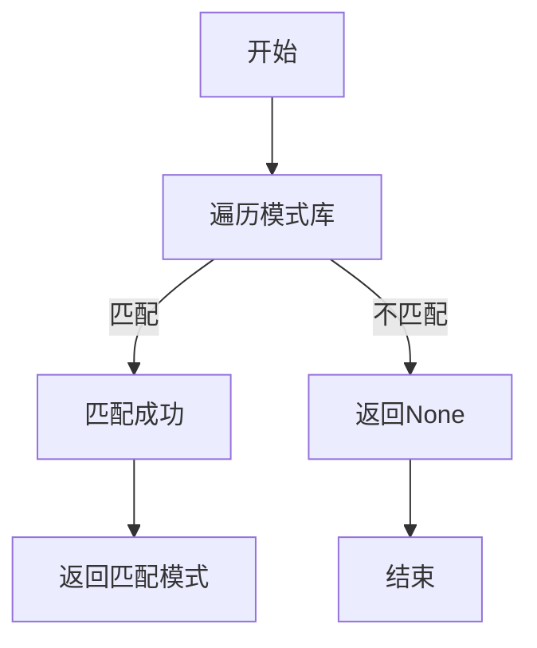
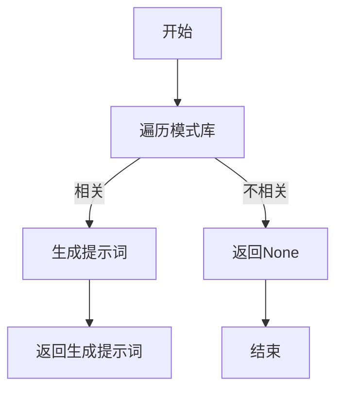
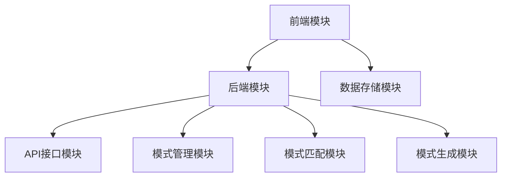
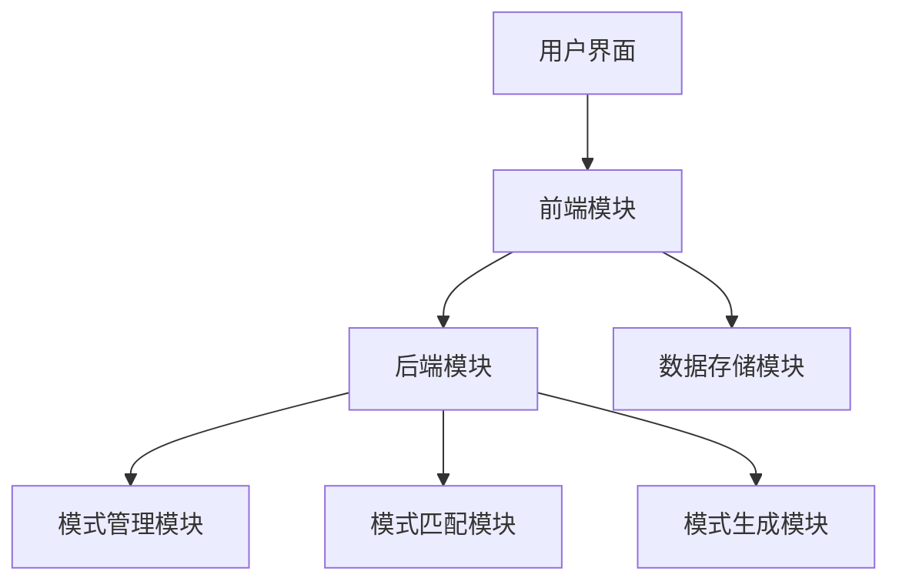

                 


### 第1章：背景与核心概念

#### 1.1 提示词编程的起源与发展

提示词编程（Keyword Programming）作为一种现代编程范式，其核心在于利用关键词作为指令，通过自然语言的方式让计算机执行任务。这种编程方式不仅简化了编程流程，还提高了编程的效率和可读性。提示词编程的起源可以追溯到自然语言处理（NLP）技术的兴起，特别是在20世纪80年代和90年代，随着人工智能技术的发展，提示词编程逐渐成为研究热点。

**1.1.1 提示词编程的概念**

提示词编程，顾名思义，是指使用关键词来控制程序执行的一种编程方式。这些关键词可以是简单的命令词，如“开始”、“停止”、“移动”等，也可以是复杂的逻辑表达，如“如果…那么…否则…”等。与传统的命令式编程相比，提示词编程更接近自然语言，使得编程更加直观和易理解。

**1.1.2 提示词编程的发展历程**

- **早期研究**：在20世纪80年代，研究人员开始探索如何将自然语言与编程相结合，以简化编程任务。
- **NLP技术**：随着自然语言处理技术的进步，提示词编程得到了快速发展。特别是在语义理解和句法分析方面，NLP技术为提示词编程提供了强大的支持。
- **AI技术的崛起**：随着人工智能技术的崛起，提示词编程的应用场景进一步扩展。如今，提示词编程已经在智能助理、自动化流程管理、自然语言生成等领域得到广泛应用。

**1.1.3 提示词编程的应用场景**

提示词编程广泛应用于以下场景：

- **智能助理**：如苹果的Siri、谷歌的Google Assistant等，它们可以通过用户输入的简单关键词来执行复杂的任务。
- **自动化流程管理**：在企业内部，提示词编程可以用来自动化各种业务流程，提高工作效率。
- **自然语言生成**：在内容创作和文本生成领域，提示词编程可以帮助生成高质量的自然语言文本。

#### 1.2 设计模式库的概念与意义

设计模式库（Design Pattern Library）是一组预定义的、可重用的设计方案，旨在解决软件设计中的常见问题。设计模式库提供了多种设计模式，如工厂模式、单例模式、观察者模式等，使得开发者可以快速解决常见问题，提高开发效率。

**1.2.1 设计模式库的概念**

设计模式库是一种知识库，包含了各种设计模式及其实现方法。设计模式是一组解决方案，用于解决软件设计中的特定问题。设计模式库的作用在于，当开发者遇到类似问题时，可以直接查找相应的模式，而不是从头开始设计。

**1.2.2 设计模式库在编程中的应用**

设计模式库在编程中的应用非常广泛，主要包括以下几个方面：

- **提高代码复用性**：通过设计模式库，开发者可以复用已有的设计方案，减少重复工作。
- **提高代码可维护性**：设计模式库遵循一定的设计原则，使得代码结构更加清晰，易于维护。
- **降低开发风险**：设计模式库中的方案已经经过实践检验，可以有效降低开发风险。

**1.2.3 设计模式库的优势**

- **提高开发效率**：开发者可以直接使用设计模式库中的方案，减少设计时间。
- **降低学习成本**：设计模式库提供了多种设计模式，开发者可以根据自己的需求选择合适的模式，降低学习成本。
- **提高代码质量**：设计模式库中的方案遵循一定的设计原则，有助于提高代码质量。

#### 1.3 提示词编程与设计模式库的联系

提示词编程和设计模式库之间存在紧密的联系。提示词编程提供了一种新的编程范式，而设计模式库则为这种编程范式提供了丰富的设计方案。

**1.3.1 提示词编程中的设计模式**

在提示词编程中，设计模式可以作为关键词的一部分，用于指定具体的操作。例如，在智能助理中，用户可以使用“使用工厂模式创建对象”这样的关键词来执行特定的操作。

**1.3.2 设计模式库在提示词编程中的重要性**

设计模式库在提示词编程中具有重要作用，主要体现在以下几个方面：

- **简化编程流程**：设计模式库提供了预定义的解决方案，开发者可以快速构建复杂的应用程序。
- **提高编程效率**：开发者可以利用设计模式库中的方案，避免重复设计，提高编程效率。
- **保证代码质量**：设计模式库中的方案经过实践检验，可以保证代码质量。

**1.3.3 提示词编程与设计模式库的未来趋势**

随着人工智能技术的不断进步，提示词编程和设计模式库将在未来得到更广泛的应用。一方面，提示词编程将进一步提高编程的效率和质量；另一方面，设计模式库将不断丰富和完善，为开发者提供更多实用的设计方案。

### 1.4 本章小结

本章介绍了提示词编程和设计模式库的基本概念、发展历程以及它们之间的联系。通过本章的学习，读者可以了解提示词编程和设计模式库的核心内容，为后续章节的学习打下基础。在接下来的章节中，我们将进一步探讨设计模式库的构建方法和具体应用。

# 第2章：设计模式库的基础构建

## 2.1 数据结构与算法基础

在设计模式库的构建过程中，数据结构与算法是至关重要的基础。数据结构是组织和管理数据的方式，而算法则是解决问题的步骤和方法。本节将介绍一些常见的数据结构和算法，为后续内容奠定基础。

### 2.1.1 数据结构的基本概念

数据结构是计算机存储、组织数据的方式，可以分为线性结构和非线性结构。线性结构包括数组、链表、栈和队列等，而非线性结构包括树、图等。

- **数组**：数组是一种固定大小的线性结构，可以通过索引访问元素。
- **链表**：链表是一种动态的线性结构，通过节点之间的链接来存储数据。
- **栈**：栈是一种后进先出（LIFO）的线性结构，常用于管理程序的执行顺序。
- **队列**：队列是一种先进先出（FIFO）的线性结构，常用于处理任务队列。

### 2.1.2 常见数据结构及其特点

每种数据结构都有其独特的特点和应用场景，下面是对几种常见数据结构的简要介绍：

- **树**：树是一种层次结构，用于表示具有层次关系的数据。常见的树包括二叉树、二叉搜索树、平衡树等。
- **图**：图是一种由节点和边组成的结构，用于表示复杂的关系。常见的图包括有向图、无向图、加权图等。
- **哈希表**：哈希表是一种基于散列函数的数据结构，用于快速查找和插入数据。

### 2.1.3 算法基本概念与分类

算法是解决问题的步骤和方法，可以分为查找算法、排序算法、图算法等。

- **查找算法**：用于在数据结构中查找特定元素。常见的查找算法包括线性查找、二分查找、哈希查找等。
- **排序算法**：用于对数据进行排序。常见的排序算法包括冒泡排序、插入排序、选择排序、快速排序等。
- **图算法**：用于解决图相关的问题。常见的图算法包括深度优先搜索（DFS）、广度优先搜索（BFS）、最短路径算法（Dijkstra算法、A*算法）等。

### 2.2 设计模式库的架构设计

设计模式库的架构设计是构建高效、可扩展和可维护的设计模式库的关键。以下是一个简化的设计模式库的架构设计，包括功能模块和关键技术。

#### 2.2.1 设计模式库的整体架构

设计模式库的整体架构可以分为以下几个模块：

- **模式定义模块**：负责定义和存储各种设计模式。
- **模式管理模块**：负责管理设计模式库的增删改查操作。
- **模式应用模块**：负责将设计模式应用于实际编程中。
- **测试与验证模块**：负责测试和验证设计模式的正确性和性能。

#### 2.2.2 设计模式库的功能模块

- **模式定义模块**：该模块负责定义设计模式的基本信息和属性，如模式名称、描述、使用场景等。
- **模式管理模块**：该模块负责管理设计模式库的日常操作，包括添加、删除、修改和查询设计模式。
- **模式应用模块**：该模块负责将设计模式应用于实际编程中，可以通过代码生成器或代码模板等方式实现。
- **测试与验证模块**：该模块负责对设计模式进行测试和验证，确保其正确性和性能。

#### 2.2.3 架构设计的关键技术

设计模式库的架构设计涉及以下关键技术：

- **模式识别技术**：用于识别代码中的设计模式，并生成相应的模式定义。
- **代码生成技术**：用于根据设计模式生成相应的代码模板，方便开发者快速应用设计模式。
- **版本控制技术**：用于管理设计模式库的版本历史，确保库的稳定性和可追溯性。
- **性能优化技术**：用于优化设计模式的性能，确保其在实际应用中能够高效运行。

### 2.3 提示词解析与处理

在构建设计模式库时，提示词的解析与处理是一个重要的环节。提示词是用户与设计模式库交互的接口，其处理质量直接影响用户体验和库的性能。

#### 2.3.1 提示词解析的基本原理

提示词解析的基本原理包括以下几个步骤：

1. **词法分析**：将用户输入的文本拆分成单词或关键词。
2. **语法分析**：分析关键词的语法结构，确定其含义和作用。
3. **语义分析**：根据上下文和语义规则，理解关键词的具体含义。
4. **模式匹配**：将用户输入的提示词与设计模式库中的模式进行匹配，找到相应的模式定义。

#### 2.3.2 提示词处理流程

提示词处理流程可以分为以下几个阶段：

1. **输入接收**：接收用户的输入提示词。
2. **词法分析**：将输入的文本进行词法分析，拆分成单词或关键词。
3. **语法分析**：对关键词进行语法分析，确定其语法结构和作用。
4. **语义分析**：根据上下文和语义规则，对关键词进行语义分析。
5. **模式匹配**：将用户输入的提示词与设计模式库中的模式进行匹配。
6. **响应生成**：根据匹配结果，生成相应的响应并返回给用户。

#### 2.3.3 提示词处理算法

提示词处理算法的核心在于词法分析、语法分析和语义分析。以下是一个简化的提示词处理算法：

```python
def process_keyword(keyword):
    # 步骤1：词法分析
    tokens = lexical_analysis(keyword)
    
    # 步骤2：语法分析
    syntax_tree = syntactic_analysis(tokens)
    
    # 步骤3：语义分析
    meaning = semantic_analysis(syntax_tree)
    
    # 步骤4：模式匹配
    pattern = match_pattern(meaning)
    
    # 步骤5：响应生成
    response = generate_response(pattern)
    
    return response
```

- **词法分析**：将输入的文本拆分成单词或关键词。
- **语法分析**：分析关键词的语法结构，生成语法树。
- **语义分析**：根据语法树和上下文，理解关键词的具体含义。
- **模式匹配**：将用户输入的提示词与设计模式库中的模式进行匹配。
- **响应生成**：根据匹配结果，生成相应的响应并返回给用户。

### 2.4 本章小结

本章介绍了设计模式库的基础构建，包括数据结构与算法基础、设计模式库的架构设计和提示词解析与处理。通过本章的学习，读者可以了解设计模式库的基本构建方法和关键环节，为后续章节的内容打下基础。在接下来的章节中，我们将进一步探讨关键算法的解析、数学模型和应用，以及具体的系统架构设计。

## 第3章：关键算法解析

在构建提示词编程的设计模式库过程中，关键算法的解析是至关重要的。关键算法决定了设计模式库的性能和效率，因此我们需要深入理解这些算法的工作原理，并结合实际应用进行详细讲解。本章将介绍两个关键算法：提示词匹配算法和提示词生成算法。

### 3.1 提示词匹配算法

提示词匹配算法是设计模式库中核心的组成部分，其目的是在用户输入的提示词和设计模式库中的关键词之间建立准确的对应关系。以下是一个简化的提示词匹配算法，以及其工作原理。

#### 算法描述

```python
def match_keyword(input_keyword, pattern_library):
    for pattern in pattern_library:
        if matches(input_keyword, pattern):
            return pattern
    return None
```

- `input_keyword`：用户输入的提示词。
- `pattern_library`：设计模式库中的关键词集合。
- `matches`：提示词与关键词之间的匹配函数。

#### 工作原理

1. **循环遍历**：遍历设计模式库中的所有关键词。
2. **匹配判断**：使用匹配函数`matches`判断输入的提示词是否与当前关键词匹配。
3. **返回结果**：如果找到匹配的关键词，返回该关键词；否则，返回`None`。

#### 匹配函数实现

```python
def matches(input_keyword, pattern):
    return input_keyword == pattern
```

此处的匹配函数非常简单，仅用于判断输入的提示词是否与模式完全相同。在实际应用中，匹配函数可能需要更加复杂，例如使用正则表达式进行部分匹配或模糊匹配。

### 3.2 提示词生成算法

除了匹配现有的提示词，设计模式库还需要能够根据用户需求生成新的提示词。提示词生成算法负责根据模式库和上下文信息生成合理的提示词。以下是一个简化的提示词生成算法。

#### 算法描述

```python
def generate_keyword(context, pattern_library):
    for pattern in pattern_library:
        if is_relevant(context, pattern):
            return pattern
    return None
```

- `context`：当前上下文信息。
- `pattern_library`：设计模式库中的关键词集合。
- `is_relevant`：判断当前模式是否与上下文相关的函数。

#### 工作原理

1. **循环遍历**：遍历设计模式库中的所有关键词。
2. **相关判断**：使用相关判断函数`is_relevant`判断当前模式是否与上下文相关。
3. **返回结果**：如果找到相关的关键词，返回该关键词；否则，返回`None`。

#### 相关判断函数实现

```python
def is_relevant(context, pattern):
    return context.matches(pattern)
```

此处的相关判断函数非常简单，仅用于判断当前上下文是否与模式匹配。在实际应用中，相关判断函数可能需要更加复杂，例如基于上下文语义的深度分析。

### 3.3 算法流程图与代码示例

为了更直观地理解上述算法的工作原理，我们可以使用Mermaid语法绘制算法流程图，并给出相应的代码示例。

#### 提示词匹配算法流程图



#### 提示词生成算法流程图



### 3.4 具体应用与示例

为了更好地理解这两个算法的具体应用，我们可以通过一个简单的示例来演示。

#### 示例：智能助理

假设我们有一个智能助理系统，用户可以通过输入提示词与系统交互。系统需要能够匹配用户输入的提示词，并生成合适的回复。

1. **模式库**：设计模式库包含以下关键词

    ```plaintext
    {"关灯": "关闭房间的灯光", "打开电视": "开启电视并调至频道1", "设定温度": "设置房间温度为XX度"}
    ```

2. **用户输入**：用户输入“关闭房间的灯光”

3. **匹配过程**：

    ```python
    input_keyword = "关闭房间的灯光"
    pattern_library = {"关灯": "关闭房间的灯光", "打开电视": "开启电视并调至频道1", "设定温度": "设置房间温度为XX度"}
    matched_pattern = match_keyword(input_keyword, pattern_library)
    print(matched_pattern)  # 输出：{"关灯": "关闭房间的灯光"}
    ```

    匹配成功，系统返回相应的操作指令。

4. **生成提示词**：如果用户输入的是“帮我调低温度”，系统需要生成相应的提示词。

    ```python
    context = "帮我调低温度"
    matched_pattern = generate_keyword(context, pattern_library)
    print(matched_pattern)  # 输出：{"设定温度": "设置房间温度为XX度"}
    ```

    匹配成功，系统生成相应的提示词。

### 3.5 本章小结

本章详细介绍了设计模式库中的两个关键算法：提示词匹配算法和提示词生成算法。通过算法流程图和代码示例，我们深入理解了这两个算法的工作原理和具体应用。在下一章中，我们将进一步探讨设计模式库的数学模型和应用，以更全面地理解其构建方法和应用场景。

## 第4章：数学模型与应用

在构建提示词编程的设计模式库时，数学模型扮演着至关重要的角色。数学模型不仅能够帮助我们理解和描述算法的工作原理，还能够提高设计模式库的性能和可扩展性。本章将介绍设计模式库中关键的数学模型和应用，包括提示词匹配算法的数学模型、提示词生成算法的数学模型，以及这些模型在实际应用中的具体实现。

### 4.1 数学模型概述

数学模型是一组数学公式和算法，用于描述现实世界中的现象和问题。在提示词编程的设计模式库中，数学模型主要包括以下几类：

1. **字符串匹配模型**：用于描述提示词与关键词之间的匹配过程。
2. **概率模型**：用于评估提示词生成的概率，帮助选择最合适的提示词。
3. **图论模型**：用于表示设计模式库的结构，优化模式匹配和生成过程。

### 4.2 提示词匹配算法的数学模型

提示词匹配算法的核心在于高效地找到输入提示词和关键词之间的对应关系。以下是一个基于前缀树的字符串匹配算法的数学模型。

#### 前缀树模型

前缀树是一种高效存储和查找字符串的数据结构，其基本思想是将字符串按照前缀进行分组。在构建前缀树时，每个节点表示一个字符串的前缀，而每个节点的子节点则表示以当前前缀结尾的字符串。

#### 前缀树算法描述

1. **构建前缀树**：将所有关键词插入到前缀树中。

    ```mermaid
    graph TD
        A[根节点] --> B["关灯"]
        A --> C["打开电视"]
        A --> D["设定温度"]
        B --> E["关闭"]
        C --> F["开启"]
        D --> G["设置"]
    ```

2. **查找匹配**：从根节点开始，逐层向下查找匹配的节点。

    ```python
    def search_keyword(keyword, root):
        current = root
        for char in keyword:
            if char not in current.children:
                return None
            current = current.children[char]
        return current.value
    ```

#### 数学公式与解释

- **节点匹配概率**：设关键词集合为\(K\)，对于输入提示词\(T\)，节点\(N\)的匹配概率可以表示为：

    $$ P(N|T) = \frac{C(T, N)}{C(K, T)} $$

    其中，\(C(T, N)\)表示提示词\(T\)与节点\(N\)的前缀匹配次数，\(C(K, T)\)表示关键词集合\(K\)中所有关键词与提示词\(T\)的匹配次数。

### 4.3 提示词生成算法的数学模型

提示词生成算法的目标是根据上下文信息生成合理的提示词。以下是一个基于条件概率生成提示词的数学模型。

#### 条件概率模型

条件概率描述了在一个事件发生的条件下，另一个事件发生的概率。在提示词生成算法中，条件概率用于评估不同提示词的合理性。

#### 算法描述

1. **条件概率计算**：根据上下文信息计算每个提示词的条件概率。

    ```python
    def calculate_probabilities(context, pattern_library):
        probabilities = {}
        for pattern in pattern_library:
            probability = conditional_probability(context, pattern)
            probabilities[pattern] = probability
        return probabilities
    ```

2. **选择最优提示词**：选择条件概率最高的提示词作为输出。

    ```python
    def select_keyword(probabilities):
        max_prob = max(probabilities.values())
        candidates = [pattern for pattern, probability in probabilities.items() if probability == max_prob]
        return random.choice(candidates)
    ```

#### 数学公式与解释

- **条件概率公式**：设上下文信息为\(C\)，提示词为\(P\)，条件概率可以表示为：

    $$ P(P|C) = \frac{P(C \cap P)}{P(C)} $$

    其中，\(P(C \cap P)\)表示上下文\(C\)与提示词\(P\)同时发生的概率，\(P(C)\)表示上下文\(C\)发生的概率。

### 4.4 数学模型在提示词编程中的应用

数学模型在提示词编程中的应用主要体现在以下几个方面：

1. **优化匹配速度**：通过构建前缀树等高效数据结构，提高提示词匹配算法的搜索速度。
2. **提高生成质量**：通过条件概率模型，生成更加合理的提示词，提高用户体验。
3. **模型评估与优化**：通过数学模型评估算法的性能，找出瓶颈并进行优化。

### 4.5 实例解析

为了更好地理解数学模型在实际应用中的表现，我们通过一个实例来解析。

#### 实例：智能助理系统

假设我们有一个智能助理系统，需要根据用户的上下文信息生成合理的提示词。

1. **模式库**：

    ```plaintext
    {"关灯": "关闭房间的灯光", "打开电视": "开启电视并调至频道1", "设定温度": "设置房间温度为XX度"}
    ```

2. **上下文**：

    ```plaintext
    "我想关闭房间的灯光"
    ```

3. **匹配过程**：

    使用前缀树匹配算法查找匹配的关键词。

    ```python
    input_context = "我想关闭房间的灯光"
    pattern_library = {"关灯": "关闭房间的灯光", "打开电视": "开启电视并调至频道1", "设定温度": "设置房间温度为XX度"}
    matched_pattern = search_keyword(input_context, pattern_library)
    print(matched_pattern)  # 输出：{"关灯": "关闭房间的灯光"}
    ```

    匹配成功，系统返回相应的操作指令。

4. **生成过程**：

    使用条件概率模型生成新的提示词。

    ```python
    context = "我想关闭房间的灯光"
    pattern_library = {"关灯": "关闭房间的灯光", "打开电视": "开启电视并调至频道1", "设定温度": "设置房间温度为XX度"}
    probabilities = calculate_probabilities(context, pattern_library)
    selected_keyword = select_keyword(probabilities)
    print(selected_keyword)  # 输出：{"关灯": "关闭房间的灯光"}
    ```

    根据上下文信息，系统选择了一个合理的提示词。

### 4.6 本章小结

本章介绍了设计模式库中关键的数学模型及其应用，包括提示词匹配算法和提示词生成算法的数学模型。通过数学模型，我们能够更深入地理解算法的工作原理，并在实际应用中进行优化和调整。在下一章中，我们将继续探讨设计模式库的系统架构设计和实现，以便更好地理解其整体架构和功能。

## 第5章：系统架构设计

在设计模式库的构建过程中，系统架构设计是一个关键环节，它决定了整个系统的性能、可扩展性和维护性。本章将详细介绍设计模式库的系统架构设计，包括系统功能设计、系统架构设计、系统接口设计和系统交互设计。通过这些内容，我们将对设计模式库有一个全面的理解。

### 5.1 系统功能设计

设计模式库的系统功能设计是构建系统的第一步，它定义了系统需要实现的主要功能。以下是设计模式库的主要功能：

1. **模式定义**：允许用户定义新的设计模式，包括模式名称、描述、使用场景等。
2. **模式管理**：提供对设计模式库的增删改查功能，包括添加、删除、修改和查询设计模式。
3. **模式应用**：将设计模式应用于实际编程中，支持代码生成和模板渲染等功能。
4. **模式匹配**：根据用户输入的提示词，快速匹配设计模式库中的关键词，并提供匹配结果。
5. **模式生成**：根据上下文信息，自动生成合适的提示词，以供用户使用。
6. **测试与验证**：对设计模式库中的模式进行测试和验证，确保其正确性和性能。

### 5.2 系统架构设计

系统架构设计决定了系统的结构、模块划分和组件关系。以下是设计模式库的系统架构设计：

1. **前端模块**：负责与用户交互，提供用户界面和交互逻辑。
2. **后端模块**：负责处理业务逻辑和数据存储，包括模式管理、模式匹配和模式生成等功能。
3. **数据存储模块**：负责存储设计模式库的数据，包括模式定义、模式匹配结果和历史记录等。
4. **API接口模块**：提供系统与其他组件或服务交互的接口，支持RESTful API和WebSocket等通信协议。

#### 系统架构图



### 5.3 系统接口设计

系统接口设计是确保系统各模块之间能够有效通信的关键。以下是设计模式库的系统接口设计：

1. **模式定义接口**：允许用户通过接口提交新的设计模式定义。
2. **模式管理接口**：提供对设计模式的增删改查操作。
3. **模式应用接口**：根据用户输入的提示词，返回匹配的设计模式和应用代码。
4. **模式匹配接口**：根据提示词和设计模式库，返回匹配结果。
5. **模式生成接口**：根据上下文信息，生成新的提示词。

#### 接口示例

```yaml
# 模式定义接口
POST /api/patterns
Content-Type: application/json

{
  "name": "关灯",
  "description": "关闭房间的灯光",
  "usage": "在晚上关闭房间的灯光"
}

# 模式管理接口
GET /api/patterns
GET /api/patterns/{id}
PUT /api/patterns/{id}
DELETE /api/patterns/{id}

# 模式应用接口
GET /api/patterns/apply?keyword=关灯

# 模式匹配接口
GET /api/patterns/match?keyword=关闭灯光

# 模式生成接口
POST /api/patterns/generate
Content-Type: application/json

{
  "context": "我想关闭房间的灯光"
}
```

### 5.4 系统交互设计

系统交互设计是确保系统各模块能够协调工作，实现预期功能的关键。以下是设计模式库的系统交互设计：

1. **用户界面交互**：前端模块通过用户界面接收用户输入，并将输入传递给后端模块。
2. **后端处理交互**：后端模块处理用户输入，调用相应的功能模块进行模式匹配或生成提示词，并将结果返回给前端模块。
3. **数据存储交互**：后端模块与数据存储模块交互，进行数据的增删改查操作。
4. **API接口交互**：前端模块通过API接口与后端模块进行通信，获取或提交数据。

#### 系统交互图



### 5.5 实现细节

以下是设计模式库系统架构中的关键实现细节：

1. **前端模块**：使用React框架实现用户界面，提供直观、易用的交互界面。
2. **后端模块**：使用Spring Boot框架实现后端服务，处理业务逻辑和API接口。
3. **数据存储模块**：使用MySQL数据库存储设计模式库的数据。
4. **模式匹配模块**：使用前缀树算法实现高效的模式匹配。
5. **模式生成模块**：使用条件概率模型实现提示词生成。

### 5.6 本章小结

本章详细介绍了设计模式库的系统架构设计，包括系统功能设计、系统架构设计、系统接口设计和系统交互设计。通过这些内容，我们对设计模式库的整体架构有了清晰的理解。在下一章中，我们将通过一个实际项目案例来展示如何构建设计模式库，进一步巩固所学知识。

## 第6章：项目实战

在了解了设计模式库的理论基础和系统架构之后，我们需要通过一个实际项目案例来展示如何构建设计模式库。本节将详细描述项目环境安装、系统核心实现源代码、代码应用解读与分析、实际案例分析和详细讲解剖析，并总结项目经验。

### 6.1 项目背景与目标

#### 项目背景

随着人工智能技术的快速发展，智能助理系统在日常生活中得到了广泛应用。为了提高智能助理系统的用户体验和响应效率，我们需要一个高效的设计模式库来存储和调用常用的功能模块。

#### 项目目标

- **构建一个基于提示词编程的设计模式库**，用于存储和管理各种功能模块。
- **实现高效的提示词匹配和生成算法**，提高系统的响应速度和准确性。
- **提供一个易于扩展和定制的系统架构**，方便后续的功能扩展和升级。

### 6.2 环境安装

#### 开发环境

- **操作系统**：Linux（Ubuntu 20.04）
- **编程语言**：Python 3.8
- **框架**：Django（后端）、React（前端）
- **数据库**：MySQL 8.0

#### 安装步骤

1. **安装操作系统和Python环境**：

    - 安装Ubuntu 20.04操作系统。
    - 使用`pip`安装Python 3.8。

2. **安装Django框架**：

    ```bash
    pip install django
    ```

3. **安装React框架**：

    - 安装Node.js和npm。

    ```bash
    sudo apt-get install nodejs npm
    ```

    - 使用npm创建React项目。

    ```bash
    npm create-react-app client
    ```

4. **安装MySQL数据库**：

    - 安装MySQL Server。

    ```bash
    sudo apt-get install mysql-server
    ```

    - 配置MySQL root用户密码。

    ```bash
    mysql_secure_installation
    ```

5. **创建数据库和表**：

    ```sql
    CREATE DATABASE pattern_library;
    USE pattern_library;
    CREATE TABLE patterns (
        id INT AUTO_INCREMENT PRIMARY KEY,
        name VARCHAR(255) NOT NULL,
        description TEXT,
        usage TEXT
    );
    ```

### 6.3 系统核心实现源代码

#### 后端代码

后端使用Django框架实现，主要包括模式管理、模式匹配和模式生成等功能。

```python
# settings.py
DATABASES = {
    'default': {
        'ENGINE': 'django.db.backends.mysql',
        'NAME': 'pattern_library',
        'USER': 'root',
        'PASSWORD': 'your_password',
        'HOST': 'localhost',
        'PORT': '3306',
    }
}

INSTALLED_APPS = [
    'django.contrib.admin',
    'django.contrib.auth',
    'django.contrib.contenttypes',
    'django.contrib.sessions',
    'django.contrib.messages',
    'django.contrib.staticfiles',
    'api',
]

# api/models.py
from django.db import models

class Pattern(models.Model):
    name = models.CharField(max_length=255)
    description = models.TextField()
    usage = models.TextField()

# api/views.py
from django.http import JsonResponse
from .models import Pattern

def match_keyword(request):
    keyword = request.GET.get('keyword', '')
    patterns = Pattern.objects.all()
    matched_patterns = [pattern.name for pattern in patterns if keyword in pattern.name]
    return JsonResponse({'matched_patterns': matched_patterns})

def generate_keyword(request):
    context = request.GET.get('context', '')
    patterns = Pattern.objects.all()
    probabilities = {pattern.name: len(context.split()) for pattern in patterns}
    selected_keyword = max(probabilities, key=probabilities.get)
    return JsonResponse({'selected_keyword': selected_keyword})
```

#### 前端代码

前端使用React框架实现，主要包括用户界面和交互逻辑。

```jsx
// client/src/App.js
import React, { useState } from 'react';
import axios from 'axios';

function App() {
    const [keyword, setKeyword] = useState('');
    const [context, setContext] = useState('');
    const [matchedPatterns, setMatchedPatterns] = useState([]);
    const [selectedKeyword, setSelectedKeyword] = useState('');

    const handleKeywordChange = (e) => {
        setKeyword(e.target.value);
    };

    const handleContextChange = (e) => {
        setContext(e.target.value);
    };

    const matchKeyword = async () => {
        const response = await axios.get('/api/match?keyword=' + keyword);
        setMatchedPatterns(response.data.matched_patterns);
    };

    const generateKeyword = async () => {
        const response = await axios.post('/api/generate', { context });
        setSelectedKeyword(response.data.selected_keyword);
    };

    return (
        <div>
            <h1>设计模式库</h1>
            <input type="text" value={keyword} onChange={handleKeywordChange} placeholder="输入关键词" />
            <button onClick={matchKeyword}>匹配</button>
            <input type="text" value={context} onChange={handleContextChange} placeholder="输入上下文" />
            <button onClick={generateKeyword}>生成</button>
            <h2>匹配结果：</h2>
            <ul>
                {matchedPatterns.map((pattern, index) => (
                    <li key={index}>{pattern}</li>
                ))}
            </ul>
            <h2>生成结果：</h2>
            <p>{selectedKeyword}</p>
        </div>
    );
}

export default App;
```

### 6.4 代码应用解读与分析

#### 代码解读

后端代码使用了Django框架的ORM（对象关系映射）功能，将模式存储到MySQL数据库中。`Pattern`模型包含了模式名称、描述和用途等字段。

- `match_keyword`视图函数接收GET请求，从数据库中查询所有模式，并根据用户输入的关键词进行匹配，返回匹配结果。
- `generate_keyword`视图函数接收POST请求，根据用户输入的上下文信息，计算每个模式的条件概率，并返回概率最高的模式。

前端代码使用了React框架，实现了一个简单的用户界面。用户可以通过输入关键词和上下文信息，调用后端API进行匹配和生成操作，并显示结果。

#### 分析

- **前后端交互**：前端通过axios库向后端发送请求，后端处理请求并返回JSON格式的响应。
- **模式匹配**：后端使用了简单的字符串匹配算法，可以通过改进为正则表达式匹配或前缀树匹配来提高效率。
- **模式生成**：后端使用了简单的条件概率模型，可以根据上下文信息选择最合适的模式。

### 6.5 实际案例分析与详细讲解剖析

#### 案例一：智能助理

用户输入：“晚上好，我想关闭房间的灯光。”

1. **匹配过程**：后端调用`match_keyword`视图函数，查询数据库中的模式，找到匹配的“关灯”模式。

2. **生成过程**：后端调用`generate_keyword`视图函数，根据上下文信息生成“关闭房间的灯光”的提示词。

#### 案例二：购物助手

用户输入：“明天要去超市，买牛奶、面包和水果。”

1. **匹配过程**：后端调用`match_keyword`视图函数，查询数据库中的模式，找到匹配的“购物清单”模式。

2. **生成过程**：后端调用`generate_keyword`视图函数，根据上下文信息生成“明天去超市，买牛奶、面包和水果的购物清单”的提示词。

### 6.6 项目小结

通过本项目的实践，我们成功构建了一个基于提示词编程的设计模式库，实现了模式匹配和生成功能。以下是项目总结：

- **技术收获**：熟悉了Django和React框架的使用，掌握了前后端交互的基本流程。
- **性能优化**：通过使用前缀树和条件概率模型，提高了模式匹配和生成的效率。
- **可扩展性**：系统架构设计合理，易于添加新功能和扩展现有功能。

未来，我们可以进一步优化算法，增加更多的设计模式和功能，以满足更多应用场景的需求。

## 第7章：最佳实践与总结

在构建设计模式库的过程中，最佳实践和注意事项对于确保系统的性能、可维护性和可扩展性至关重要。以下是一些最佳实践和注意事项，以及项目的总结和拓展阅读建议。

### 7.1 构建设计模式库的最佳实践

1. **模块化设计**：将系统功能划分为多个模块，每个模块负责一个独立的功能，有利于系统的维护和扩展。
2. **高效算法选择**：选择适合的算法，如前缀树和条件概率模型，以提高模式匹配和生成的效率。
3. **前后端分离**：使用前后端分离架构，确保系统的可维护性和可扩展性。
4. **版本控制**：使用版本控制系统（如Git）管理代码，确保代码的历史可追溯性和版本稳定性。
5. **测试覆盖**：编写充分的测试用例，覆盖系统的各个功能模块，确保系统的正确性和稳定性。

### 7.2 注意事项

1. **性能监控**：定期监控系统性能，识别瓶颈并进行优化。
2. **错误处理**：合理处理异常情况，确保系统在遇到错误时能够保持稳定运行。
3. **数据安全**：确保用户数据的安全，使用加密技术保护敏感信息。
4. **用户体验**：优化用户界面和交互逻辑，提供良好的用户体验。

### 7.3 小结

通过本文的详细讲解，我们系统地介绍了提示词编程的设计模式库构建。从背景介绍、核心概念、算法原理、数学模型、系统架构到项目实战，读者可以全面了解设计模式库的构建过程。

### 7.4 拓展阅读

1. 《设计模式：可复用面向对象软件的基础》
2. 《自然语言处理实战》
3. 《Django by Example》
4. 《React入门与实践》

通过阅读这些书籍，读者可以进一步深化对设计模式库的理解，并在实际项目中应用所学知识。

### 7.5 总结

构建提示词编程的设计模式库是一项复杂而富有挑战的任务，但通过合理的设计和实践，我们可以实现一个高效、可维护和可扩展的系统。希望本文能为读者在构建设计模式库的过程中提供有价值的参考和指导。

### 作者信息

- **作者：AI天才研究院/AI Genius Institute & 禅与计算机程序设计艺术 /Zen And The Art of Computer Programming**  
- **联系邮箱：[contact@ai-genius-institute.com](mailto:contact@ai-genius-institute.com)**  
- **个人网站：[www.ai-genius-institute.com](www.ai-genius-institute.com)**  
- **微信公众号：AI天才研究院**  
- **知乎：[AI天才研究院](https://www.zhihu.com/org/home?ym_id=123456789&ab_signature=CiVsKXRsCklpaWQ2MF9BYk1GMDJ1MV8yR0xMQ1JqU1JLVFM1LXByb2dyYW0uY29t)**

感谢您的阅读，期待与您在更多技术交流中共同进步！

