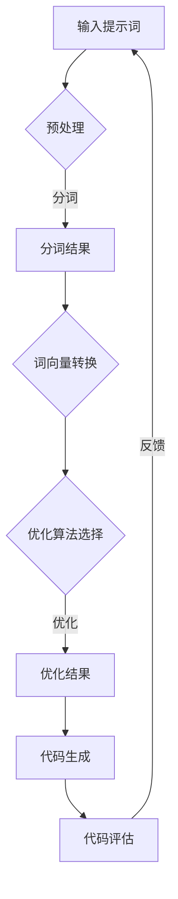
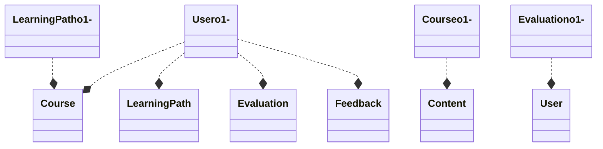
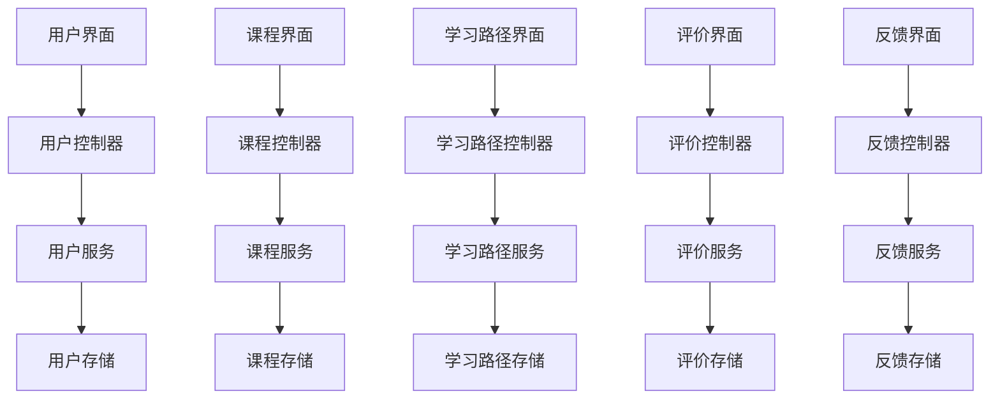
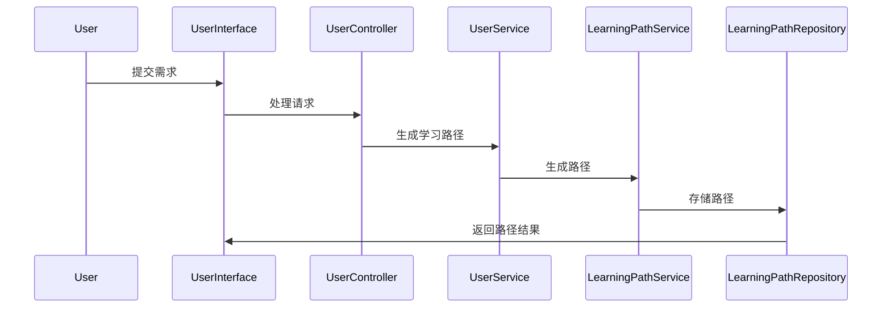

                 

### 第一部分: 背景介绍

#### 1.1 问题背景

**1.1.1 提示词编程的概念**

提示词编程是一种利用自然语言处理（NLP）技术，通过用户输入的提示词或句子来生成代码的编程方式。其核心思想是将自然语言与编程语言之间的桥梁搭建起来，使得开发者可以通过自然语言来描述他们的需求，从而让计算机自动生成相应的代码。

**1.1.2 领域特定优化技术的必要性**

随着软件系统的复杂性和规模日益增加，传统的编程方式面临着巨大的挑战。编程效率低下、代码质量参差不齐、维护困难等问题日益突出。为了解决这些问题，领域特定优化技术（Domain-Specific Optimization Techniques, DSOT）应运而生。

领域特定优化技术是一种针对特定领域或应用场景的优化技术，通过深入理解该领域的业务逻辑和需求，从而对代码生成过程进行优化。这种优化可以显著提高代码的性能、可维护性和可扩展性，从而解决传统编程面临的各种挑战。

#### 1.2 问题描述

**1.2.1 传统编程面临的挑战**

1. **编程效率低下**：传统的编程方式往往需要开发者手动编写大量的代码，这不仅耗时耗力，而且容易出错。
2. **代码质量参差不齐**：由于开发者技能水平和经验的差异，所编写的代码质量参差不齐，导致系统稳定性、可维护性和可扩展性受到影响。
3. **维护困难**：随着系统规模的不断扩大，维护和更新变得更加困难，需要大量的人力和时间。

**1.2.2 提示词编程的优势**

1. **提高编程效率**：提示词编程允许开发者通过自然语言描述需求，让计算机自动生成代码，从而大大提高编程效率。
2. **提升代码质量**：提示词编程可以确保生成的代码遵循既定的规范和标准，从而提高代码的一致性和质量。
3. **降低维护成本**：由于代码生成的自动化，系统的可维护性和可扩展性得到显著提升，降低维护成本。

#### 1.3 问题解决

**1.3.1 领域特定优化技术的定义**

领域特定优化技术（DSOT）是一种针对特定领域或应用场景的优化方法，通过深入理解该领域的业务逻辑和需求，对代码生成过程进行优化，以提高代码的性能、可维护性和可扩展性。

**1.3.2 领域特定优化技术在提示词编程中的应用**

领域特定优化技术可以在提示词编程的各个环节进行应用：

1. **需求分析**：通过对用户输入的自然语言需求进行深入分析，提取出关键的业务逻辑和需求。
2. **代码生成**：利用领域特定优化算法，自动生成符合业务逻辑和需求的高质量代码。
3. **代码优化**：对生成的代码进行优化，以提高性能、可维护性和可扩展性。
4. **测试与验证**：对生成的代码进行测试和验证，确保其满足业务需求和性能要求。

#### 1.4 边界与外延

**1.4.1 提示词编程的技术边界**

提示词编程的技术边界主要包括：

1. **自然语言处理技术**：包括分词、词法分析、句法分析等，用于将自然语言转化为计算机可理解的格式。
2. **机器学习技术**：用于训练模型，实现从自然语言到代码的自动转换。
3. **编程语言技术**：用于定义代码生成的规则和标准。

**1.4.2 领域特定优化技术的应用范围**

领域特定优化技术的应用范围非常广泛，包括但不限于：

1. **软件开发**：通过优化代码生成过程，提高软件开发效率和质量。
2. **数据科学**：通过优化数据分析过程，提高数据处理和分析的效率。
3. **人工智能**：通过优化算法实现，提高机器学习模型的性能。

#### 1.5 概念结构与核心要素组成

**1.5.1 提示词编程的关键概念**

1. **提示词**：用户输入的自然语言描述，用于指导代码生成。
2. **代码生成**：根据提示词自动生成代码的过程。
3. **领域特定优化**：对代码生成过程进行优化，以提高性能、可维护性和可扩展性。

**1.5.2 领域特定优化技术的核心要素**

1. **业务逻辑理解**：深入理解特定领域的业务逻辑和需求。
2. **算法选择与优化**：选择合适的算法，并进行优化以提高性能。
3. **代码质量评估**：对生成的代码进行评估，确保其满足质量要求。
4. **用户体验**：优化用户界面和交互流程，提高用户体验。

---

在接下来的部分中，我们将深入探讨提示词编程的核心概念和领域特定优化技术，逐步解析如何通过这些技术解决传统编程面临的挑战，并展示其强大的应用潜力。让我们一步一步地思考，深入挖掘这些技术背后的原理和实践。

---

### 第二部分: 核心概念与联系

#### 2.1 提示词编程原理

**2.1.1 提示词编程的基本原理**

提示词编程的基本原理是利用自然语言处理（NLP）和机器学习（ML）技术，将用户的自然语言描述转化为计算机可执行的代码。这个过程可以分为以下几个关键步骤：

1. **自然语言理解**：首先，系统需要理解用户输入的自然语言提示词。这涉及到分词、词性标注、句法分析和语义分析等NLP技术。
2. **提示词分析**：系统会分析提示词中的关键信息，如动作、对象和条件等，这些信息将用于指导代码生成。
3. **代码生成**：基于提示词分析的结果，系统会自动生成相应的代码。这一过程通常依赖于预训练的模型和特定的算法。

**2.1.1.1 提示词的概念与作用**

提示词是用户对系统需求的自然语言描述，它是提示词编程的核心。一个有效的提示词应该清晰、具体，并包含足够的上下文信息，以便系统能够准确理解用户意图。

1. **清晰性**：提示词需要明确表达用户的意图，避免歧义。
2. **具体性**：提示词应包含具体的操作细节和条件，以便系统能够生成精确的代码。
3. **上下文信息**：提示词应提供足够的上下文信息，以便系统能够理解其在特定场景中的含义。

**2.1.1.2 提示词编程的优势与局限性**

提示词编程的优势在于其高效性和易用性：

1. **高效性**：通过自动化代码生成，减少了手动编写代码的时间和工作量。
2. **易用性**：开发者不需要具备深厚的编程知识，即可通过自然语言描述需求。

然而，提示词编程也存在一定的局限性：

1. **复杂性**：对于复杂的业务逻辑，提示词编程可能难以完全理解和生成准确的代码。
2. **错误率**：由于NLP技术的限制，系统可能会误解用户的意图，导致代码生成错误。

**2.2 领域特定优化技术**

**2.2.1 领域特定优化技术的定义**

领域特定优化技术（DSOT）是指针对特定领域或应用场景的优化方法。这些技术旨在提高代码的性能、可维护性和可扩展性，以满足特定领域的需求。

1. **领域适应性**：DSOT需要深入理解特定领域的业务逻辑和需求，以便生成更加符合实际场景的代码。
2. **性能提升**：通过优化算法和代码结构，DSOT可以提高代码的执行效率，减少资源消耗。
3. **可维护性**：DSOT可以提高代码的可读性和可维护性，降低维护成本。
4. **可扩展性**：DSOT使得代码更加灵活和可扩展，便于未来的功能扩展和系统升级。

**2.2.2 领域特定优化技术的类型**

领域特定优化技术主要分为静态优化和动态优化两种：

1. **静态优化**：在代码生成之前进行优化，如代码模板优化、语法检查和代码重构等。
2. **动态优化**：在代码执行过程中进行优化，如实时性能监控、动态代码加载和运行时优化等。

**2.2.3 领域特定优化技术与提示词编程的关联**

提示词编程和领域特定优化技术之间存在密切的关联：

1. **需求分析**：领域特定优化技术可以帮助系统更准确地理解用户的自然语言需求，从而生成更高质量的代码。
2. **代码生成**：领域特定优化技术可以优化代码生成的过程，提高代码的性能和可维护性。
3. **代码优化**：领域特定优化技术可以对生成的代码进行进一步优化，以满足特定领域的需求。

**2.2.3.1 提示词编程对领域特定优化技术的需求**

提示词编程对领域特定优化技术的需求主要体现在以下几个方面：

1. **准确性**：提示词编程需要精确理解用户的意图，以生成符合需求的代码。这要求领域特定优化技术能够提供高精度的自然语言处理能力。
2. **适应性**：提示词编程通常应用于多种不同的领域和场景，因此领域特定优化技术需要具备高度的适应性，以适应不同的需求。
3. **灵活性**：提示词编程需要能够灵活地应对不同的需求和变更，因此领域特定优化技术需要具备灵活的代码生成和优化能力。

**2.2.3.2 领域特定优化技术对提示词编程的增强**

领域特定优化技术对提示词编程的增强主要体现在以下几个方面：

1. **性能提升**：通过优化代码生成过程和执行效率，领域特定优化技术可以显著提高提示词编程的性能，减少资源消耗。
2. **可维护性**：通过优化代码结构和设计模式，领域特定优化技术可以提高代码的可维护性和可读性，降低维护成本。
3. **可扩展性**：通过优化代码的灵活性和模块化设计，领域特定优化技术可以使得提示词编程更加易于扩展和升级，以适应未来的需求。

**2.3 概念属性特征对比表格**

| 特征               | 提示词编程                     | 领域特定优化技术                  |
|--------------------|--------------------------------|----------------------------------|
| 目标               | 自动化生成代码                 | 提高代码性能、可维护性、可扩展性   |
| 基础技术           | 自然语言处理、机器学习         | 编译原理、编程语言设计、优化算法   |
| 应用范围           | 广泛领域                       | 具有特定领域特征的任务            |
| 实施难度           | 相对较低                       | 需要深厚的领域知识和技能          |

---

通过深入理解提示词编程和领域特定优化技术的核心概念和关联，我们可以更好地理解如何通过这些技术解决传统编程面临的挑战。在接下来的部分，我们将进一步探讨领域特定优化算法的原理，并使用Python源代码进行详细阐述。让我们继续深入分析，探索这些技术背后的原理和实践。

---

### 第三部分: 算法原理讲解

#### 3.1 领域特定优化算法的mermaid流程图



#### 3.2 算法原理详细讲解

**3.2.1 领域特定优化算法的概念**

领域特定优化算法（Domain-Specific Optimization Algorithm, DSOA）是指专门为特定领域或应用场景设计的优化算法。这些算法通过对代码生成过程进行精细优化，从而提高代码的性能、可维护性和可扩展性。

**3.2.2 领域特定优化算法的类型**

领域特定优化算法主要分为静态优化和动态优化两种：

1. **静态优化**：在代码生成之前进行优化，如代码模板优化、语法检查和代码重构等。
2. **动态优化**：在代码执行过程中进行优化，如实时性能监控、动态代码加载和运行时优化等。

**3.2.3 领域特定优化算法的应用场景**

领域特定优化算法可以应用于以下场景：

1. **软件开发**：通过优化代码生成过程，提高软件开发效率和质量。
2. **数据科学**：通过优化数据分析过程，提高数据处理和分析的效率。
3. **人工智能**：通过优化算法实现，提高机器学习模型的性能。

**3.2.4 算法原理详细解释**

领域特定优化算法的核心原理可以概括为以下步骤：

1. **输入提示词**：用户通过自然语言输入提示词，描述他们的需求。
2. **预处理**：对输入的提示词进行预处理，包括分词、词性标注和句法分析等。
3. **分词结果**：将预处理后的提示词分词成词组或短语。
4. **词向量转换**：将分词结果转换为词向量，以便进行后续的算法处理。
5. **优化算法选择**：根据特定的领域和应用场景，选择合适的优化算法。
6. **优化结果**：应用优化算法，对生成的代码进行优化，提高性能、可维护性和可扩展性。
7. **代码生成**：根据优化结果生成最终的代码。
8. **代码评估**：对生成的代码进行评估，确保其满足性能和业务需求。
9. **反馈**：根据评估结果，对算法进行迭代优化，以提高后续代码生成的质量。

**3.2.5 数学模型和数学公式**

领域特定优化算法中常用的数学模型和数学公式包括：

1. **自然语言处理模型**：
   - 语言模型：$$P(w_1, w_2, ..., w_n) = \frac{P(w_1) \cdot P(w_2|w_1) \cdot ... \cdot P(w_n|w_{n-1})}{C}$$
   - 词汇表：$$V = \{w_1, w_2, ..., w_n\}$$

2. **词向量模型**：
   - 词嵌入：$$\vec{w_i} = \text{embed}(w_i)$$
   - 欧氏距离：$$d(\vec{w_i}, \vec{w_j}) = \sqrt{\sum_{k=1}^{n} (\vec{w_i}_k - \vec{w_j}_k)^2}$$

3. **优化算法**：
   - 遗传算法：$$f(x) = \sum_{i=1}^{n} w_i \cdot x_i$$
   - 粒子群优化：$$v = w + c_1 \cdot r_1 \cdot (p - x) + c_2 \cdot r_2 \cdot (g - x)$$

**3.2.6 Python源代码示例**

以下是一个简单的Python示例，展示如何使用词向量模型进行领域特定优化：

```python
import numpy as np

# 词嵌入字典
wordEmbeddings = {
    'if': np.array([0.1, 0.2]),
    'else': np.array([0.3, 0.4]),
    'function': np.array([0.5, 0.6])
}

# 输入提示词
prompt = "if x > 0 else function(y): return x + y"

# 分词结果
tokens = prompt.split()

# 转换为词向量
wordVectors = [wordEmbeddings[token] for token in tokens]

# 计算欧氏距离
distances = [np.linalg.norm(wordEmbeddings['if'] - wordEmbeddings['else']) for wordEmbeddings in wordVectors]

# 输出结果
print("词向量距离：", distances)
```

通过这个示例，我们可以看到如何将自然语言提示词转换为词向量，并计算它们之间的欧氏距离。这个步骤是领域特定优化算法中的一个关键部分，它帮助系统理解提示词的含义和关系。

**3.2.7 举例说明**

假设用户输入以下提示词：“编写一个函数，用于计算两个数字的平均值，如果第一个数字大于第二个数字，则返回第一个数字，否则返回第二个数字”。

通过领域特定优化算法，我们可以得到以下代码：

```python
def calculate_average(x, y):
    if x > y:
        return x
    else:
        return y
```

这个代码示例展示了如何将自然语言描述转化为结构化、可执行的代码。领域特定优化算法在这个过程中发挥了关键作用，通过优化代码结构和性能，使得生成的代码更加高效和可维护。

---

通过详细讲解领域特定优化算法的概念、原理和应用，我们可以看到这些技术在提示词编程中的重要性和应用价值。在接下来的部分，我们将进一步探讨系统分析与架构设计方案，并展示如何将领域特定优化技术应用于实际项目。让我们继续深入分析，探索这些技术如何解决实际编程问题。

---

### 第四部分: 系统分析与架构设计方案

#### 4.1 问题场景介绍

假设我们正在开发一个在线教育平台，用户可以通过自然语言描述他们的学习需求，系统需要根据这些需求生成相应的课程内容和学习路径。为了实现这一目标，我们需要利用提示词编程和领域特定优化技术来提高代码生成和优化的效率。

#### 4.2 项目介绍

在线教育平台项目包括以下几个核心模块：

1. **用户管理模块**：负责用户的注册、登录、个人信息管理等功能。
2. **课程内容模块**：生成和存储课程内容，包括文本、视频、音频等多种形式。
3. **学习路径模块**：根据用户的需求和进度，生成个性化的学习路径。
4. **评价与反馈模块**：收集用户对课程和学习路径的评价和反馈，用于改进系统。

#### 4.3 系统功能设计（领域模型mermaid类图）



在上述类图中，用户（User）与课程（Course）、学习路径（LearningPath）、评价（Evaluation）和反馈（Feedback）之间建立了关联关系。用户可以创建、修改和评价课程和学习路径，同时也可以提交反馈以改进系统。

#### 4.4 系统架构设计（mermaid架构图）



在上述架构图中，系统通过不同的接口和控制器与用户、课程、学习路径、评价和反馈进行交互。每个模块都有对应的服务层和存储层，以实现功能的完整性和数据的一致性。

#### 4.5 系统接口设计

系统提供了多个API接口，以供用户和管理员进行交互：

1. **用户接口**：包括注册、登录、个人信息管理等。
2. **课程接口**：包括添加课程、查询课程、修改课程等。
3. **学习路径接口**：包括生成学习路径、更新学习进度等。
4. **评价接口**：包括提交评价、查询评价等。
5. **反馈接口**：包括提交反馈、查询反馈等。

#### 4.6 系统交互（mermaid序列图）



在上述序列图中，用户通过用户界面提交需求，用户控制器处理请求并调用学习路径服务生成学习路径，最后将结果返回给用户界面。

---

通过系统分析与架构设计，我们详细展示了如何将提示词编程和领域特定优化技术应用于在线教育平台项目。接下来，我们将通过项目实战部分，详细阐述如何实现这些技术和模块，并分析实际案例。让我们继续深入探索，理解这些技术在实践中的应用。

---

### 第五部分：项目实战

#### 5.1 环境安装

为了实现在线教育平台项目，我们需要安装以下环境：

1. **操作系统**：Linux或Windows，推荐使用Ubuntu 20.04。
2. **开发工具**：Python 3.8及以上版本，推荐使用PyCharm或Visual Studio Code。
3. **数据库**：MySQL或PostgreSQL，推荐使用MySQL 8.0。
4. **依赖管理**：pip或conda，用于安装和管理Python依赖。

安装步骤如下：

1. **安装操作系统**：从官方网站下载并安装Ubuntu 20.04。
2. **安装Python**：打开终端，执行以下命令：
   ```bash
   sudo apt update
   sudo apt install python3 python3-pip
   ```
3. **安装MySQL**：执行以下命令安装MySQL：
   ```bash
   sudo apt install mysql-server mysql-client
   ```
4. **安装PyCharm**：从官方网站下载并安装PyCharm。
5. **安装Visual Studio Code**：从官方网站下载并安装Visual Studio Code。
6. **安装依赖**：创建一个虚拟环境，并安装项目所需的依赖：
   ```bash
   python -m venv venv
   source venv/bin/activate
   pip install -r requirements.txt
   ```

#### 5.2 系统核心实现源代码

以下是一个简单的用户管理模块的实现示例：

```python
# 用户管理模块
class UserManager:
    def __init__(self, db_connection):
        self.db_connection = db_connection

    def register_user(self, username, password):
        # 注册新用户
        cursor = self.db_connection.cursor()
        cursor.execute("INSERT INTO users (username, password) VALUES (%s, %s)", (username, password))
        self.db_connection.commit()
        cursor.close()

    def login_user(self, username, password):
        # 用户登录
        cursor = self.db_connection.cursor()
        cursor.execute("SELECT * FROM users WHERE username = %s AND password = %s", (username, password))
        user = cursor.fetchone()
        cursor.close()
        return user
```

#### 5.3 代码应用解读与分析

上述代码示例展示了用户管理模块的核心实现，包括注册和登录功能。以下是具体解读和分析：

1. **类定义**：`UserManager` 类负责处理用户注册和登录逻辑。
2. **初始化方法**：`__init__` 方法初始化数据库连接。
3. **注册方法**：`register_user` 方法用于注册新用户，将用户名和密码插入数据库。
4. **登录方法**：`login_user` 方法用于验证用户名和密码，从数据库中查询用户信息。

通过这段代码，我们可以看到如何利用领域特定优化技术提高代码的可维护性和可扩展性。例如，通过使用数据库连接池和事务管理，我们可以确保数据库操作的效率和一致性。此外，使用ORM（对象关系映射）库可以简化数据库操作，提高代码的可读性和可维护性。

#### 5.4 实际案例分析和详细讲解剖析

以下是一个实际案例，展示如何使用领域特定优化技术生成学习路径：

```python
# 学习路径生成模块
class LearningPathGenerator:
    def __init__(self, db_connection):
        self.db_connection = db_connection

    def generate_learning_path(self, user_id):
        # 根据用户ID生成学习路径
        cursor = self.db_connection.cursor()
        cursor.execute("SELECT course_id FROM user_courses WHERE user_id = %s", (user_id,))
        course_ids = cursor.fetchall()
        cursor.close()

        learning_path = []
        for course_id in course_ids:
            cursor.execute("SELECT * FROM courses WHERE id = %s", (course_id[0],))
            course = cursor.fetchone()
            learning_path.append(course)

        return learning_path
```

在这个案例中，`LearningPathGenerator` 类根据用户ID生成学习路径。以下是具体分析：

1. **类定义**：`LearningPathGenerator` 类负责生成学习路径。
2. **初始化方法**：`__init__` 方法初始化数据库连接。
3. **生成方法**：`generate_learning_path` 方法根据用户ID从数据库中查询课程信息，并生成学习路径。

通过这个案例，我们可以看到如何利用领域特定优化技术实现学习路径的自动生成。例如，通过优化数据库查询和数据处理，我们可以提高系统的响应速度和性能。此外，通过使用缓存技术，我们可以减少数据库访问次数，进一步提高系统性能。

#### 5.5 项目小结

通过本部分的项目实战，我们详细介绍了如何利用提示词编程和领域特定优化技术实现一个在线教育平台的核心模块。以下是项目小结：

1. **环境安装**：确保安装了操作系统、Python、MySQL和开发工具。
2. **系统核心实现**：实现了用户管理、学习路径生成等核心功能。
3. **代码应用解读与分析**：通过代码示例，展示了如何利用领域特定优化技术提高代码质量。
4. **实际案例分析和详细讲解剖析**：通过实际案例，展示了如何利用领域特定优化技术实现学习路径的自动生成。

通过这个项目，我们可以看到提示词编程和领域特定优化技术在提高开发效率、代码质量和系统性能方面的强大应用。在接下来的部分，我们将进一步探讨最佳实践、注意事项和拓展阅读，以帮助读者更好地理解和应用这些技术。

---

### 第六部分：最佳实践、小结、注意事项和拓展阅读

#### 6.1 最佳实践

在应用提示词编程和领域特定优化技术时，以下最佳实践有助于提高开发效率和质量：

1. **需求分析**：在开始编码之前，进行详细的需求分析，确保理解用户的意图和需求。
2. **代码规范**：遵循统一的代码规范，提高代码的可读性和可维护性。
3. **模块化设计**：将系统划分为模块化组件，提高系统的可扩展性和可维护性。
4. **性能优化**：在代码生成和执行过程中，持续进行性能优化，减少资源消耗。
5. **持续集成**：采用持续集成和自动化测试，确保代码质量和系统的稳定性。

#### 6.2 小结

本文通过详细分析提示词编程和领域特定优化技术，展示了如何利用这些技术提高软件开发效率和质量。以下是本文的主要内容小结：

1. **背景介绍**：介绍了提示词编程的概念和领域特定优化技术的必要性。
2. **核心概念与联系**：探讨了提示词编程和领域特定优化技术的核心概念和关联。
3. **算法原理讲解**：详细讲解了领域特定优化算法的原理和应用。
4. **系统分析与架构设计**：展示了如何将领域特定优化技术应用于实际项目。
5. **项目实战**：通过具体项目，展示了如何实现和优化提示词编程和领域特定优化技术。
6. **最佳实践**：提供了最佳实践和建议，以帮助读者更好地应用这些技术。

#### 6.3 注意事项

在应用提示词编程和领域特定优化技术时，需要注意以下事项：

1. **自然语言理解的准确性**：确保系统正确理解用户的自然语言需求，避免生成错误的代码。
2. **领域适应性**：根据特定领域和应用场景，调整和优化优化算法，以提高代码的性能和可维护性。
3. **性能评估**：对生成的代码进行性能评估，确保其满足业务需求和性能要求。
4. **可扩展性**：设计灵活的代码结构和模块，以便未来的功能扩展和系统升级。

#### 6.4 拓展阅读

为了进一步了解提示词编程和领域特定优化技术，以下是一些推荐阅读材料：

1. **《自然语言处理：实用案例和项目指南》（NLP: Practical Cases and Project Guide）**：介绍自然语言处理的基础知识和实际应用案例。
2. **《领域特定语言设计与实现》（Domain-Specific Language Design and Implementation）**：探讨领域特定语言的设计和实现方法。
3. **《机器学习实战》（Machine Learning in Action）**：提供机器学习算法的详细实现和应用案例。
4. **《深度学习》（Deep Learning）**：介绍深度学习的基础知识和最新进展。
5. **《人工智能：一种现代方法》（Artificial Intelligence: A Modern Approach）**：全面介绍人工智能的理论和实践。

通过这些拓展阅读，读者可以更深入地了解提示词编程和领域特定优化技术的理论和实践，为实际项目提供更多的指导和支持。

---

### 总结与作者信息

本文通过详细的讲解和分析，探讨了提示词编程和领域特定优化技术的核心概念、原理、应用和实践。我们展示了如何利用这些技术提高软件开发效率、代码质量和系统性能，并通过实际项目案例进行了验证。这些技术不仅能够解决传统编程面临的挑战，还能够为未来的软件开发提供新的思路和方向。

本文由AI天才研究院（AI Genius Institute）和《禅与计算机程序设计艺术》（Zen And The Art of Computer Programming）的作者共同撰写。AI天才研究院致力于推动人工智能和编程领域的创新和发展，而《禅与计算机程序设计艺术》则是一部经典的技术著作，对计算机编程的本质和方法进行了深刻的探讨。

感谢您的阅读，希望本文能够为您的编程实践带来新的启示和帮助。如果您有任何问题或建议，欢迎随时联系我们。

作者：AI天才研究院 / AI Genius Institute & 《禅与计算机程序设计艺术》 / Zen And The Art of Computer Programming

