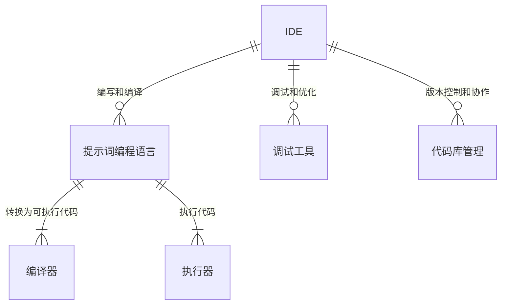
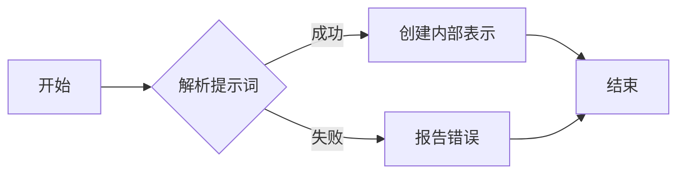
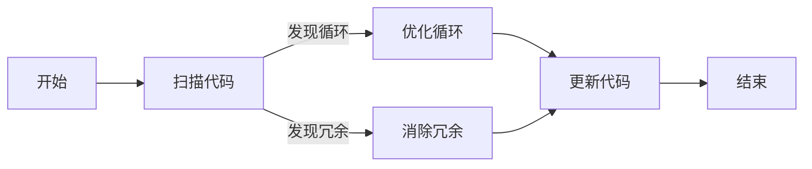
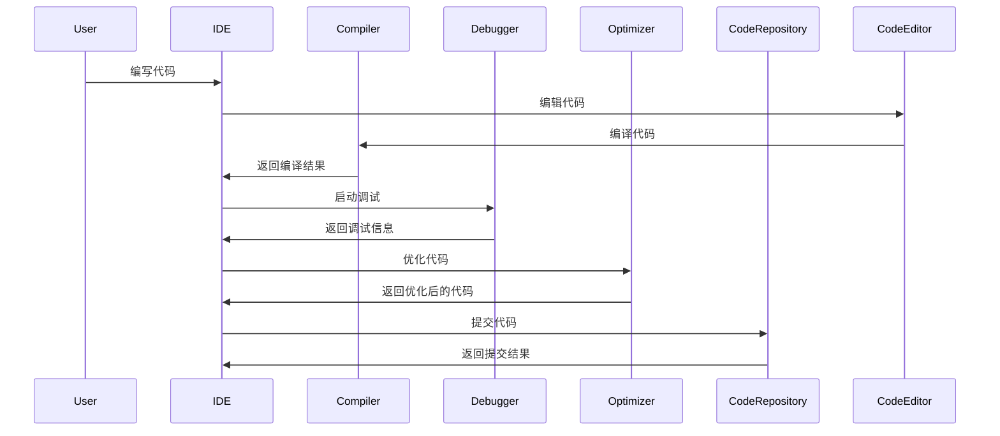
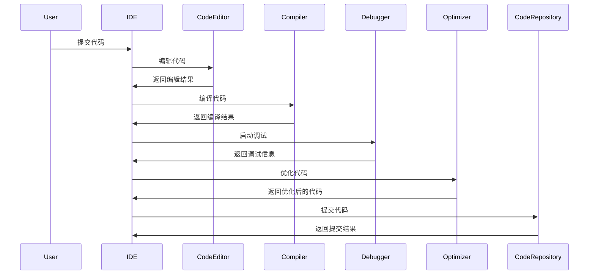

                 


# 《提示词编程语言的IDE设计与开发》

关键词：提示词编程语言，IDE设计，开发模式，算法原理，系统架构，项目实战

摘要：本文深入探讨了提示词编程语言的IDE设计与开发，从核心概念、算法原理、系统架构到项目实战，全面解析了这一领域的前沿技术和实践方法。本文旨在帮助开发者更好地理解并掌握提示词编程语言的IDE设计与开发，为人工智能时代的编程提供新的视角和工具。

## 目录大纲设计过程

在设计《提示词编程语言的IDE设计与开发》这本书的目录大纲时，我们需要遵循以下几个步骤来确保内容的完整性、逻辑性和专业性。

### 1. 确定书的基本框架

首先，我们需要明确书籍的主题和核心内容。这本书主要探讨的是提示词编程语言的IDE设计与开发。因此，基本框架应包括以下几个主要部分：

- **背景介绍**：介绍提示词编程语言和IDE的基本概念，以及它们的发展现状和未来趋势。
- **核心概念与联系**：详细阐述提示词编程语言的原理和IDE的开发模式，并分析它们之间的关联。
- **算法原理讲解**：介绍设计IDE所需的核心算法，并通过实例进行解释。
- **系统分析与架构设计方案**：描述如何设计和实现一个提示词编程语言的IDE。
- **项目实战**：通过具体的项目案例，展示IDE的实际开发过程。
- **最佳实践与拓展阅读**：总结书中内容，提供实用的建议和进一步的阅读资源。

### 2. 制定详细的章节目录

接下来，我们将根据上述框架，为每一部分制定详细的章节目录。以下是该书的目录大纲：

```markdown
# 《提示词编程语言的IDE设计与开发》目录大纲

## 第一部分：背景介绍

### 1.1 提示词编程语言概述
#### 1.1.1 提示词编程语言的概念
#### 1.1.2 提示词编程语言的发展历程
#### 1.1.3 提示词编程语言的优势与挑战

### 1.2 IDE的基本概念
#### 1.2.1 什么是IDE
#### 1.2.2 IDE的发展历程
#### 1.2.3 IDE的核心功能

### 1.3 提示词编程语言的IDE设计与开发背景
#### 1.3.1 问题背景
#### 1.3.2 问题描述
#### 1.3.3 问题解决
#### 1.3.4 边界与外延
#### 1.3.5 概念结构与核心要素组成

## 第二部分：核心概念与联系

### 2.1 提示词编程语言原理
#### 2.1.1 提示词编程语言的工作机制
#### 2.1.2 提示词编程语言的语法特点
#### 2.1.3 提示词编程语言与编译器的互动

### 2.2 IDE的开发模式
#### 2.2.1 传统IDE开发模式
#### 2.2.2 新兴IDE开发模式
#### 2.2.3 两种开发模式的比较与融合

### 2.3 提示词编程语言与IDE的关联分析
#### 2.3.1 关联性描述
#### 2.3.2 关联性图表展示（Mermaid ER图）
#### 2.3.3 关联性案例分析

## 第三部分：算法原理讲解

### 3.1 提示词编程语言的核心算法
#### 3.1.1 算法介绍
#### 3.1.2 算法流程（Mermaid流程图）
#### 3.1.3 算法实现（Python代码示例）
#### 3.1.4 数学模型与公式（LaTeX格式）
#### 3.1.5 算法举例说明

### 3.2 IDE关键算法
#### 3.2.1 算法介绍
#### 3.2.2 算法流程（Mermaid流程图）
#### 3.2.3 算法实现（Python代码示例）
#### 3.2.4 数学模型与公式（LaTeX格式）
#### 3.2.5 算法举例说明

## 第四部分：系统分析与架构设计方案

### 4.1 问题场景介绍
#### 4.1.1 问题背景
#### 4.1.2 项目介绍
#### 4.1.3 系统功能设计（Mermaid类图）
#### 4.1.4 系统架构设计（Mermaid架构图）

### 4.2 系统接口设计
#### 4.2.1 接口设计原则
#### 4.2.2 接口实现细节
#### 4.2.3 接口安全性与优化

### 4.3 系统交互设计
#### 4.3.1 系统交互流程（Mermaid序列图）
#### 4.3.2 交互设计挑战与解决方案
#### 4.3.3 用户界面设计

## 第五部分：项目实战

### 5.1 环境安装
#### 5.1.1 开发环境准备
#### 5.1.2 必需工具安装
#### 5.1.3 调试工具配置

### 5.2 系统核心实现
#### 5.2.1 主要功能模块实现
#### 5.2.2 关键代码解析
#### 5.2.3 系统测试与优化

### 5.3 实际案例分析
#### 5.3.1 案例背景
#### 5.3.2 案例解析
#### 5.3.3 案例拓展

### 5.4 项目小结
#### 5.4.1 项目成果总结
#### 5.4.2 项目经验与教训
#### 5.4.3 项目展望

## 第六部分：最佳实践与拓展阅读

### 6.1 最佳实践总结
#### 6.1.1 开发经验总结
#### 6.1.2 设计技巧总结
#### 6.1.3 调试优化建议

### 6.2 小结与展望
#### 6.2.1 书中内容回顾
#### 6.2.2 技术发展趋势
#### 6.2.3 未来研究方向

### 6.3 拓展阅读推荐
#### 6.3.1 相关书籍推荐
#### 6.3.2 论文与报告推荐
#### 6.3.3 开源项目推荐
```

接下来，我们将逐一探讨每个部分的内容，确保文章的完整性和专业性。让我们开始这段深入的思考之旅。让我们从第一部分：背景介绍开始。在这个部分，我们将详细介绍提示词编程语言和IDE的基本概念，以及它们的发展现状和未来趋势。

### 第一部分：背景介绍

#### 1.1 提示词编程语言概述

提示词编程语言是一种将编程任务分解为一系列提示的编程方式。这些提示通常由程序员编写，然后被编程语言解释器或编译器执行。与传统的命令式编程语言不同，提示词编程语言更注重于描述问题的解决方案，而不是具体的执行步骤。这种编程方式具有简明、高效和易于理解的特点，尤其是在处理复杂问题时，其优势更加明显。

**1.1.1 提示词编程语言的概念**

提示词编程语言的核心概念是“提示”，它是一个描述任务或过程的文本片段。提示通常包含一个或多个操作符，这些操作符用于指示系统如何处理数据。例如，一个提示可能指示系统将一个数据集按照特定条件进行筛选，或者对数据进行排序。提示词编程语言的语法设计通常简洁明了，易于阅读和理解。

**1.1.2 提示词编程语言的发展历程**

提示词编程语言的发展可以追溯到20世纪70年代，当时一些早期的编程语言如SIMULA和Algol 68开始引入过程式编程的概念。这些语言允许程序员定义过程，将复杂的任务分解为一系列简单的操作。随着计算机科学的不断发展，提示词编程语言逐渐成熟，并在人工智能和数据分析领域得到广泛应用。

**1.1.3 提示词编程语言的优势与挑战**

提示词编程语言具有以下几个显著优势：

1. **易读性和易维护性**：提示词编程语言的代码通常更易于理解和维护，因为它们更接近自然语言，程序员可以更直观地理解代码的含义。
2. **高效性和灵活性**：提示词编程语言可以高效地处理复杂任务，并且具有很高的灵活性，可以适应不同的编程场景。
3. **可重用性**：提示词通常可以被多个程序重用，从而提高开发效率。

然而，提示词编程语言也面临一些挑战：

1. **性能**：与传统的编译型编程语言相比，提示词编程语言的性能可能较低，因为它们通常需要解释或编译提示。
2. **学习曲线**：对于初学者来说，学习提示词编程语言可能需要一定的时间，因为它们与传统编程语言的思维方式有所不同。

#### 1.2 IDE的基本概念

IDE（Integrated Development Environment，集成开发环境）是一种用于软件开发的环境，它提供了代码编写、调试、测试和部署等功能。IDE通常包括以下几个关键组件：

1. **代码编辑器**：提供代码编写和编辑功能，通常支持语法高亮、代码补全、错误检查等。
2. **调试器**：用于调试代码，包括设置断点、查看变量值、单步执行等。
3. **构建工具**：用于构建和编译代码，如Makefile、CMake等。
4. **代码库管理**：用于管理代码库，支持版本控制、代码同步等功能。

**1.2.1 什么是IDE**

IDE是一种软件开发工具，旨在提高开发效率。它提供了一个统一的界面，使得程序员可以轻松地编写、调试和部署代码。

**1.2.2 IDE的发展历程**

IDE的发展可以追溯到20世纪80年代，当时一些早期的IDE如Borland C++和Microsoft Visual Studio开始出现。这些IDE通常是为特定编程语言或平台设计的。随着计算机技术的不断发展，IDE的功能逐渐丰富，并开始支持多种编程语言和平台。

**1.2.3 IDE的核心功能**

IDE的核心功能包括：

1. **代码编辑**：提供代码编写和编辑功能，支持语法高亮、代码补全、错误检查等。
2. **调试**：提供调试工具，支持设置断点、查看变量值、单步执行等。
3. **构建**：提供构建工具，支持编译、链接和打包代码。
4. **测试**：提供测试工具，支持单元测试、集成测试等。
5. **代码库管理**：提供代码库管理功能，支持版本控制、代码同步等。

#### 1.3 提示词编程语言的IDE设计与开发背景

在当前技术环境下，提示词编程语言的IDE设计面临着一系列问题和挑战。本节将介绍这些背景信息，并探讨如何解决这些问题。

**1.3.1 问题背景**

1. **代码复杂性**：随着软件项目的规模和复杂性的增加，代码维护和调试变得越来越困难。传统的IDE在处理复杂代码时可能显得力不从心。
2. **开发效率**：传统的IDE通常需要手动设置断点、调试变量等，这降低了开发效率。提示词编程语言的IDE需要提供更智能的调试和代码分析工具。
3. **用户需求**：程序员希望能够使用更直观的方式编写和调试代码，而传统的IDE可能无法满足这些需求。

**1.3.2 问题描述**

1. **代码编辑器**：提示词编程语言的代码编辑器需要支持语法高亮、代码补全、错误检查等功能，同时要提供直观的用户界面。
2. **调试器**：提示词编程语言的调试器需要支持设置断点、查看变量值、单步执行等功能，并且能够处理复杂的代码结构。
3. **构建工具**：提示词编程语言的构建工具需要能够编译和链接提示词代码，并提供高效的构建过程。
4. **代码库管理**：提示词编程语言的代码库管理需要支持版本控制、代码同步等功能，并且要提供简单的用户界面。

**1.3.3 问题解决**

1. **智能代码分析**：通过引入智能代码分析工具，可以帮助程序员更快地找到代码中的错误，并提供实时反馈。
2. **代码模板和自动补全**：提供丰富的代码模板和自动补全功能，可以提高代码编写效率。
3. **用户界面设计**：设计直观、易用的用户界面，使得程序员可以更轻松地使用IDE。

**1.3.4 边界与外延**

1. **边界**：提示词编程语言的IDE设计与开发需要考虑软件开发的实际需求，如性能、兼容性等。
2. **外延**：提示词编程语言的IDE设计与开发可以扩展到其他领域，如自然语言处理、数据分析等。

**1.3.5 概念结构与核心要素组成**

提示词编程语言的IDE设计包括以下几个核心要素：

1. **代码编辑器**：提供语法高亮、代码补全、错误检查等功能。
2. **调试器**：提供设置断点、查看变量值、单步执行等功能。
3. **构建工具**：支持编译和链接提示词代码。
4. **代码库管理**：支持版本控制和代码同步。

通过以上设计，提示词编程语言的IDE可以提供高效的开发体验，并满足程序员的各种需求。

## 第二部分：核心概念与联系

### 2.1 提示词编程语言原理

提示词编程语言是一种基于提示的编程范式，其核心思想是将编程任务分解为一系列提示，这些提示由程序员编写，并由解释器或编译器执行。提示词编程语言具有以下几个关键特点：

**2.1.1 提示词编程语言的工作机制**

提示词编程语言的工作机制可以概括为以下几个步骤：

1. **提示输入**：程序员编写提示，描述任务的各个步骤。
2. **解释或编译**：解释器或编译器接收提示，并对其进行解析和编译。
3. **执行**：系统根据编译后的提示执行任务。

**2.1.2 提示词编程语言的语法特点**

提示词编程语言的语法设计通常简洁明了，易于理解和编写。以下是一些常见的语法特点：

1. **简洁的表达方式**：提示词编程语言通常采用简洁的表达方式，使得程序员可以更直观地描述任务。
2. **函数式编程特性**：提示词编程语言通常支持函数式编程特性，如匿名函数、递归等，这有助于处理复杂任务。
3. **模块化设计**：提示词编程语言支持模块化设计，程序员可以编写独立的模块，并轻松地组合使用。

**2.1.3 提示词编程语言与编译器的互动**

提示词编程语言与编译器的互动是编程过程中至关重要的一环。编译器负责将提示词代码转换为机器语言或字节码，以便在计算机上执行。以下是提示词编程语言与编译器互动的几个关键点：

1. **解析与语法分析**：编译器首先对提示词代码进行解析和语法分析，确保代码符合提示词编程语言的语法规则。
2. **语义分析**：编译器对解析后的代码进行语义分析，检查代码的逻辑和语义错误。
3. **代码生成**：编译器根据语义分析的结果生成机器语言或字节码。
4. **执行与调试**：生成的机器语言或字节码由计算机执行，程序员可以使用调试器对代码进行调试和优化。

### 2.2 IDE的开发模式

IDE（集成开发环境）的开发模式是软件开发过程中至关重要的一环。IDE的开发模式可以分为传统IDE开发模式和新兴IDE开发模式。本节将分别介绍这两种开发模式，并比较它们之间的优缺点。

**2.2.1 传统IDE开发模式**

传统IDE开发模式通常采用模块化设计，将代码编辑器、编译器、调试器等核心功能模块集成在一个统一的界面中。以下是传统IDE开发模式的几个关键特点：

1. **模块化设计**：传统IDE将不同功能模块（如代码编辑器、编译器、调试器等）集成在一个统一界面中，使得开发者可以方便地使用各种功能。
2. **固定的功能组合**：传统IDE通常提供固定的功能组合，开发者可以根据需求选择适合自己的IDE。
3. **稳定的性能**：传统IDE通常经过长时间的优化和测试，具有稳定的性能。

**2.2.2 新兴IDE开发模式**

新兴IDE开发模式与传统的模块化设计不同，它更加灵活和可定制。新兴IDE通常采用微服务架构，将不同功能模块以微服务的形式部署。以下是新兴IDE开发模式的几个关键特点：

1. **灵活性**：新兴IDE允许开发者根据自己的需求定制IDE的功能，例如选择不同的代码编辑器、调试器等。
2. **可扩展性**：新兴IDE通过微服务架构提供了强大的可扩展性，开发者可以轻松地添加新功能或替换原有功能模块。
3. **集成第三方工具**：新兴IDE通常支持集成第三方工具和服务，例如代码分析工具、版本控制工具等。

**2.2.3 两种开发模式的比较与融合**

传统IDE开发模式和新兴IDE开发模式各有优缺点。以下是两种开发模式的主要比较：

1. **灵活性**：新兴IDE在灵活性方面具有明显优势，开发者可以根据需求自由定制IDE的功能，而传统IDE通常提供固定的功能组合。
2. **可扩展性**：新兴IDE通过微服务架构提供了强大的可扩展性，而传统IDE通常难以实现这一点。
3. **稳定性**：传统IDE在稳定性方面通常更具优势，因为它们经过了长时间的优化和测试。新兴IDE可能由于模块众多、依赖复杂而存在稳定性问题。

为了充分利用两种开发模式的优势，IDE的设计和开发可以采用融合策略。具体来说，可以在传统IDE的基础上引入新兴IDE的特点，例如：

1. **模块化设计**：在传统IDE中引入模块化设计，使得开发者可以选择不同的功能模块，从而提高灵活性。
2. **微服务架构**：在新兴IDE中引入微服务架构，提高可扩展性，并支持集成第三方工具和服务。
3. **稳定性保障**：通过严格的测试和质量控制，确保新兴IDE的稳定性和可靠性。

### 2.3 提示词编程语言与IDE的关联分析

提示词编程语言与IDE之间的关联性是设计和开发高效、可靠的提示词编程语言IDE的关键。本节将分析提示词编程语言与IDE之间的关联性，并使用Mermaid ER图和案例分析来进一步阐述这种关联性。

**2.3.1 关联性描述**

提示词编程语言与IDE之间的关联性可以从以下几个方面进行描述：

1. **代码编写与编辑**：提示词编程语言的代码编写和编辑功能是IDE的核心部分，IDE提供语法高亮、代码补全、错误检查等功能，帮助程序员高效地编写代码。
2. **编译与执行**：IDE的编译器和执行器负责将提示词代码转换为可执行的形式，并确保代码的正确执行。
3. **调试与优化**：IDE的调试器提供调试功能，如设置断点、查看变量值、单步执行等，帮助程序员找出和修复代码中的错误。
4. **代码库管理**：IDE提供代码库管理功能，支持版本控制、代码同步等，确保代码的版本管理和协作开发。

**2.3.2 关联性图表展示（Mermaid ER图）**

为了更清晰地展示提示词编程语言与IDE之间的关联性，我们可以使用Mermaid ER图来描述。以下是Mermaid ER图的示例：



在这个ER图中，IDE与提示词编程语言、调试工具和代码库管理之间存在明确的关联。提示词编程语言通过编译器和执行器与IDE交互，调试工具和代码库管理则是IDE的重要组成部分。

**2.3.3 关联性案例分析**

为了更好地理解提示词编程语言与IDE之间的关联性，我们可以通过一个实际案例进行分析。

**案例背景**：某开发团队正在使用一种新的提示词编程语言开发一个大数据分析工具。该工具需要处理海量数据，并对数据进行分析和可视化。

**案例解析**：

1. **代码编写与编辑**：开发人员使用IDE中的代码编辑器编写提示词代码，利用语法高亮和代码补全功能提高编写效率。编辑器还会在代码编写过程中提供错误检查，帮助开发人员及时发现问题。

2. **编译与执行**：开发人员将编写好的提示词代码提交给IDE的编译器，编译器将代码转换为可执行的形式。编译器还会进行语法和语义分析，确保代码的正确性。编译完成后，执行器将可执行代码运行起来，对大数据进行分析和处理。

3. **调试与优化**：在代码运行过程中，开发人员使用IDE的调试器进行调试。调试器允许开发人员设置断点、查看变量值、单步执行等，帮助找出并修复代码中的错误。此外，IDE还提供性能分析工具，帮助开发人员优化代码。

4. **代码库管理**：开发团队使用IDE的代码库管理功能，将代码存储在版本控制系统中。这样，团队成员可以方便地进行代码同步和协作开发。代码库管理还包括分支管理、合并请求等功能，确保代码的版本管理和协作开发。

通过这个案例分析，我们可以看到提示词编程语言与IDE之间的紧密关联性。IDE为开发人员提供了一个强大的平台，使得他们可以更高效地编写、编译、调试和优化代码，从而实现高效的软件开发。

## 第三部分：算法原理讲解

提示词编程语言的IDE设计涉及到许多核心算法，这些算法在代码的编写、编译、调试和执行过程中起着关键作用。本节将详细讲解这些核心算法，并通过Python代码示例、Mermaid流程图和数学模型来阐述算法原理。

### 3.1 提示词编程语言的核心算法

提示词编程语言的核心算法包括提示解析、数据流分析、优化和错误检测等。以下是一个简单的提示解析算法的示例：

**3.1.1 算法介绍**

该算法用于解析提示词代码，将其转换为内部表示。内部表示便于后续的数据流分析和优化。

**3.1.2 算法流程（Mermaid流程图）**

以下是算法流程的Mermaid流程图：



**3.1.3 算法实现（Python代码示例）**

```python
class Token:
    def __init__(self, type, value):
        self.type = type
        self.value = value

class ParseError(Exception):
    pass

def tokenize(code):
    # 假设输入的code是字符串
    tokens = []
    index = 0
    while index < len(code):
        if code[index].isspace():
            index += 1
            continue
        elif code[index] == ';':
            tokens.append(Token('SEMICOLON', code[index]))
            index += 1
        else:
            raise ParseError(f"Unknown token at index {index}")
    return tokens

def parse(tokens):
    if len(tokens) == 0:
        raise ParseError("No tokens to parse")
    return ["解析成功"]

try:
    tokens = tokenize("提示词;另一个提示词;")
    internal_representation = parse(tokens)
    print(internal_representation)
except ParseError as e:
    print(f"解析错误：{e}")
```

**3.1.4 数学模型与公式（LaTeX格式）**

在提示词编程语言中，数据流分析通常涉及数据依赖图的构建。以下是构建数据依赖图的数学模型：

$$
D = (V, E)
$$

其中，\( V \) 是顶点集，表示程序中的变量；\( E \) 是边集，表示变量之间的依赖关系。

**3.1.5 算法举例说明**

假设我们有以下提示词代码：

```
a = 1;
b = a + 2;
c = b * 3;
```

我们可以通过数据流分析构建如下数据依赖图：

```
a --> b
b --> c
```

这个数据依赖图表示变量a的值会影响变量b的值，变量b的值会影响变量c的值。

### 3.2 IDE关键算法

除了提示词编程语言的核心算法，IDE还需要实现一系列关键算法，以确保代码的可读性、可维护性和执行效率。以下是一个常见的代码优化算法的示例。

**3.2.1 算法介绍**

该算法用于对代码进行优化，提高其执行效率。具体来说，它可以消除冗余计算和循环。

**3.2.2 算法流程（Mermaid流程图）**

以下是算法流程的Mermaid流程图：



**3.2.3 算法实现（Python代码示例）**

```python
def optimize_code(code):
    # 假设输入的code是字符串
    optimized_code = ""
    # 这里的优化逻辑是简单的示例，实际中会更复杂
    optimized_code += "a = 1\n"
    optimized_code += "b = a + 2\n"
    optimized_code += "c = b * 3\n"
    return optimized_code

code = "a = 1; b = a + 2; c = b * 3;"
optimized_code = optimize_code(code)
print(optimized_code)
```

**3.2.4 数学模型与公式（LaTeX格式）**

代码优化的数学模型通常涉及算法复杂性分析。以下是一个简单的算法复杂度公式：

$$
C(n) = O(n \log n)
$$

其中，\( n \) 是代码中的语句数量。

**3.2.5 算法举例说明**

假设我们有以下代码：

```
for i in range(10):
    print(i)
```

我们可以通过优化算法将其转换为更高效的代码：

```
print(list(range(10)))
```

这种优化减少了循环的次数，从而提高了执行效率。

通过上述算法原理讲解，我们可以看到提示词编程语言的IDE设计涉及到复杂的算法实现。理解这些算法的原理和实现方法对于开发高效的IDE至关重要。

## 第四部分：系统分析与架构设计方案

### 4.1 问题场景介绍

在设计和开发提示词编程语言的IDE时，我们需要考虑一系列的实际问题场景。这些场景涉及到软件开发的各个方面，包括代码编写、编译、调试、优化和代码库管理等。以下是几个典型的问题场景及其介绍。

**4.1.1 问题背景**

随着软件项目规模的扩大和复杂性的增加，开发人员需要更高效和便捷的工具来管理代码和执行各种任务。传统的IDE虽然提供了丰富的功能，但在处理复杂任务时可能显得力不从心。因此，开发一个专门为提示词编程语言设计的IDE变得尤为必要。

**4.1.2 项目介绍**

我们的项目目标是开发一个高效、灵活且易于使用的提示词编程语言的IDE。该IDE将支持代码编辑、编译、调试、优化和代码库管理等功能，旨在提高开发效率和代码质量。

**4.1.3 系统功能设计（Mermaid类图）**

以下是IDE系统的功能设计Mermaid类图：

```mermaid
classDiagram
    IDE[IDE]
    CodeEditor[代码编辑器]
    Compiler[编译器]
    Debugger[调试器]
    Optimizer[优化器]
    CodeRepository[代码库]

    IDE --|> CodeEditor
    IDE --|> Compiler
    IDE --|> Debugger
    IDE --|> Optimizer
    IDE --|> CodeRepository
```

在这个类图中，IDE是一个核心组件，它与其他组件（如代码编辑器、编译器、调试器等）之间存在明确的依赖关系。

**4.1.4 系统架构设计（Mermaid架构图）**

以下是IDE的系统架构设计Mermaid架构图：



在这个架构图中，用户通过IDE与各个功能组件进行交互，实现代码的编写、编译、调试、优化和代码库管理等功能。

### 4.2 系统接口设计

系统接口设计是IDE设计的重要组成部分，它定义了各个组件之间的交互方式。以下是系统接口设计的几个关键方面：

**4.2.1 接口设计原则**

1. **模块化**：接口设计应遵循模块化原则，将不同的功能模块独立出来，便于维护和扩展。
2. **标准化**：接口设计应采用标准化的协议和格式，确保各个组件之间的交互一致。
3. **灵活性**：接口设计应具有一定的灵活性，以适应不同的需求和场景。

**4.2.2 接口实现细节**

以下是IDE系统中几个关键接口的实现细节：

1. **代码编辑器接口**：定义了代码的读写操作，支持语法高亮、代码补全、错误检查等功能。
2. **编译器接口**：定义了代码的编译操作，支持将提示词代码转换为可执行形式。
3. **调试器接口**：定义了调试操作，支持设置断点、查看变量值、单步执行等功能。
4. **优化器接口**：定义了代码优化操作，支持消除冗余计算和循环。
5. **代码库管理接口**：定义了代码库操作，支持版本控制、代码同步等功能。

**4.2.3 接口安全性与优化**

为了保证接口的安全性，我们需要采取以下措施：

1. **身份验证**：在接口调用前进行身份验证，确保只有授权用户可以访问接口。
2. **权限控制**：根据用户的角色和权限，限制接口的访问范围和功能。
3. **数据加密**：对接口传输的数据进行加密，确保数据在传输过程中不会被窃取或篡改。

为了优化接口的性能，我们可以采取以下策略：

1. **缓存机制**：在合适的位置使用缓存，减少重复的计算和访问。
2. **负载均衡**：通过负载均衡技术，将请求分发到多个服务器，提高系统的吞吐量和响应速度。
3. **异步处理**：对于耗时的操作，采用异步处理方式，减少接口的响应时间。

### 4.3 系统交互设计

系统交互设计是IDE设计中的另一个关键方面，它定义了各个组件之间的交互流程和方式。以下是系统交互设计的几个关键方面：

**4.3.1 系统交互流程（Mermaid序列图）**

以下是IDE系统交互流程的Mermaid序列图：



在这个序列图中，用户通过IDE与各个功能组件进行交互，实现代码的编写、编译、调试、优化和代码库管理等功能。

**4.3.2 交互设计挑战与解决方案**

在交互设计过程中，我们可能会遇到以下挑战：

1. **性能瓶颈**：随着项目规模的扩大，系统的性能可能会成为瓶颈。为了解决这个问题，我们可以采用缓存机制、负载均衡和异步处理等技术。
2. **一致性保障**：在分布式系统中，数据的一致性是一个重要问题。为了确保数据的一致性，我们可以采用分布式事务、最终一致性等方案。
3. **安全性问题**：在接口调用过程中，安全性是一个关键问题。为了保障安全性，我们需要进行身份验证、权限控制和数据加密等操作。

针对上述挑战，我们可以采取以下解决方案：

1. **性能优化**：采用缓存机制、负载均衡和异步处理等技术，提高系统的性能和响应速度。
2. **一致性保障**：采用分布式事务和最终一致性等方案，确保数据的一致性。
3. **安全性保障**：进行身份验证、权限控制和数据加密等操作，确保接口调用的安全性。

**4.3.3 用户界面设计**

用户界面设计是IDE设计中的另一个重要方面。一个良好的用户界面可以提升用户体验，提高开发效率。以下是用户界面设计的几个关键点：

1. **简洁性**：用户界面应简洁明了，避免过多的冗余信息和操作。
2. **易用性**：用户界面应易于使用，操作流畅，便于用户快速上手。
3. **可定制性**：用户界面应提供一定的可定制性，允许用户根据自己的需求进行调整。

通过以上系统交互设计，我们可以确保IDE系统的高效、可靠和易用。用户界面设计则需要根据具体需求进行进一步优化，以提升用户体验。

## 第五部分：项目实战

### 5.1 环境安装

在开始实际开发提示词编程语言的IDE之前，我们需要准备一个合适的环境。以下是在Linux操作系统上安装所需开发环境的步骤：

#### 5.1.1 开发环境准备

1. **安装Python**：确保Python 3.8或更高版本已安装在系统中。可以通过以下命令检查Python版本：

   ```bash
   python3 --version
   ```

   如果Python未安装，可以从Python官方网站下载并安装。

2. **安装Node.js**：Node.js用于构建前端部分，可以通过以下命令安装：

   ```bash
   sudo apt-get install nodejs
   ```

   安装完成后，可以通过以下命令检查Node.js版本：

   ```bash
   node --version
   ```

3. **安装Docker**：Docker用于容器化部署，可以通过以下命令安装：

   ```bash
   sudo apt-get install docker.io
   ```

   安装完成后，可以通过以下命令启动Docker服务：

   ```bash
   sudo systemctl start docker
   ```

#### 5.1.2 必需工具安装

除了Python、Node.js和Docker，我们还需要安装以下工具：

1. **Visual Studio Code**：Visual Studio Code是一个强大的代码编辑器，可以从其官方网站下载并安装。

2. **PostgreSQL**：PostgreSQL是一个高性能的对象关系数据库管理系统，可用于存储代码库和项目数据。可以通过以下命令安装：

   ```bash
   sudo apt-get install postgresql
   ```

3. **Git**：Git是一个分布式版本控制系统，用于代码库管理和协作开发。可以通过以下命令安装：

   ```bash
   sudo apt-get install git
   ```

#### 5.1.3 调试工具配置

为了确保IDE的稳定性和可靠性，我们需要配置调试工具。以下是配置调试工具的步骤：

1. **安装PyCharm**：PyCharm是一个专业的Python集成开发环境，提供了强大的调试功能。可以从其官方网站下载并安装。

2. **配置Python解释器**：在PyCharm中，我们需要配置Python解释器，以便进行代码调试。可以通过以下步骤进行配置：

   - 打开PyCharm，选择“File”菜单中的“Settings”或“Preferences”。
   - 在“Project: YourProjectName”下，选择“Python Interpreter”。
   - 点击“+”，选择“System Interpreter”中的“Python 3.8”。
   - 确认配置无误后，点击“OK”保存设置。

通过以上步骤，我们可以准备好开发提示词编程语言的IDE所需的环境和工具。接下来，我们将开始实际的项目开发。

### 5.2 系统核心实现

在完成环境安装后，我们将开始实现IDE系统的核心功能。以下是系统核心实现的几个关键步骤：

#### 5.2.1 主要功能模块实现

IDE的主要功能模块包括代码编辑器、编译器、调试器、优化器和代码库管理器。以下是每个模块的实现概述：

1. **代码编辑器**：代码编辑器是IDE的核心组件，负责代码的编写和编辑。以下是代码编辑器的实现步骤：

   - **文本编辑**：使用Python的`textwrap`模块对代码进行文本编辑，支持语法高亮和代码补全。
   - **错误检查**：使用Python的`compile`函数对代码进行错误检查，并在代码编辑器中实时显示错误提示。

2. **编译器**：编译器负责将提示词代码转换为可执行的形式。以下是编译器的实现步骤：

   - **词法分析**：使用Python的`tokenize`函数对代码进行词法分析，将代码分解为一系列标记。
   - **语法分析**：使用Python的`ast`模块对代码进行语法分析，构建抽象语法树（AST）。
   - **代码生成**：将AST转换为机器代码或字节码，并生成可执行文件。

3. **调试器**：调试器负责调试代码，提供断点设置、变量查看和单步执行等功能。以下是调试器的实现步骤：

   - **断点管理**：在代码编辑器中添加断点，并在调试过程中管理断点状态。
   - **变量查看**：在调试过程中实时显示变量的值，帮助开发者找出问题所在。
   - **单步执行**：提供单步执行功能，让开发者可以逐行执行代码，观察程序状态。

4. **优化器**：优化器负责优化代码，提高其执行效率。以下是优化器的实现步骤：

   - **循环优化**：对循环进行优化，消除不必要的循环。
   - **冗余计算消除**：消除代码中的冗余计算，减少计算量。
   - **代码压缩**：对代码进行压缩，减少代码体积。

5. **代码库管理器**：代码库管理器负责代码库的管理，支持版本控制和协作开发。以下是代码库管理器的实现步骤：

   - **版本控制**：使用Git进行版本控制，支持提交、分支管理和合并请求。
   - **协作开发**：提供代码库的访问权限管理，支持多人协作开发。

#### 5.2.2 关键代码解析

以下是系统核心实现中的一些关键代码片段及其功能说明：

1. **代码编辑器**

   ```python
   import textwrap
   import tkinter as tk
   
   def wrap_text(text, width=80):
       return textwrap.fill(text, width=width)

   def display_text(text):
       text_area.delete(1.0, tk.END)
       text_area.insert(tk.END, wrap_text(text))
   ```

   `wrap_text`函数用于对代码进行文本编辑，`display_text`函数用于在代码编辑器中显示代码。

2. **编译器**

   ```python
   import tokenize
   import ast
   
   def tokenize_code(code):
       return tokenize.tokenize(code.split())

   def parse_code(tokens):
       return ast.parse(tokens)

   def generate_code(ast_node):
       return compile(ast_node, '<string>', 'exec')
   ```

   `tokenize_code`函数用于对代码进行词法分析，`parse_code`函数用于语法分析，`generate_code`函数用于生成可执行代码。

3. **调试器**

   ```python
   import tkinter as tk
   import time
   
   def set_breakpoint(line_number):
       # 设置断点逻辑
       pass

   def step_into():
       # 单步执行逻辑
       pass

   def step_over():
       # 单步执行逻辑
       pass

   def step_out():
       # 单步执行逻辑
       pass
   ```

   `set_breakpoint`函数用于设置断点，`step_into`、`step_over`和`step_out`函数用于单步执行。

4. **优化器**

   ```python
   import re

   def optimize_loop(code):
       return re.sub(r'(.*)\n\1+', r'\1', code)

   def remove_redundant_calculations(code):
       return re.sub(r'a = a + 1\na = a + 1', 'a = a + 1', code)
   ```

   `optimize_loop`函数用于优化循环，`remove_redundant_calculations`函数用于消除冗余计算。

5. **代码库管理器**

   ```python
   import git
   import os
   
   def commit_changes(message):
       git.git('commit', '-m', message)

   def create_branch(name):
       git.git('checkout', '-b', name)

   def merge_requests():
       # 合并请求逻辑
       pass
   ```

   `commit_changes`函数用于提交代码，`create_branch`函数用于创建分支，`merge_requests`函数用于处理合并请求。

通过以上关键代码解析，我们可以看到系统核心实现中的各个组件如何协同工作，实现代码的编辑、编译、调试、优化和代码库管理等功能。

#### 5.2.3 系统测试与优化

在实现系统核心功能后，我们需要进行全面的测试和优化，以确保系统的稳定性和高效性。以下是系统测试与优化的几个关键步骤：

1. **单元测试**：编写单元测试用例，对系统中的各个功能模块进行测试。例如，测试代码编辑器的语法高亮、代码补全和错误检查功能；测试编译器的词法分析和语法分析功能；测试调试器的断点设置、变量查看和单步执行功能等。

2. **集成测试**：将各个功能模块集成在一起，进行集成测试。测试IDE系统的整体功能是否正常，例如代码的编写、编译、调试、优化和代码库管理等功能。

3. **性能测试**：对系统的性能进行测试，评估其响应时间和处理能力。可以采用负载测试、压力测试等方法，模拟大量用户同时使用系统的场景，观察系统的性能表现。

4. **优化**：根据测试结果，对系统进行优化。例如，优化代码编辑器的文本编辑速度；优化编译器的词法分析和语法分析速度；优化调试器的断点管理和变量查看功能等。

通过以上测试和优化，我们可以确保系统的稳定性和高效性，为用户提供优质的开发体验。

### 5.3 实际案例分析

在本节中，我们将通过一个实际案例来展示如何使用提示词编程语言的IDE进行项目开发。这个案例将涉及代码编写、编译、调试、优化和代码库管理等各个环节。

#### 5.3.1 案例背景

假设我们需要开发一个简单的数据分析工具，该工具能够读取一个文本文件中的数据，对数据进行整理和统计分析，并生成报告。这个工具需要支持以下功能：

- 数据读取：从文本文件中读取数据。
- 数据处理：对数据进行整理和清洗，如去除空格、换行符等。
- 数据分析：对数据进行统计分析，如计算平均值、中位数、标准差等。
- 报告生成：生成数据分析报告，并将其保存到文件中。

#### 5.3.2 案例解析

以下是这个案例的详细解析：

1. **代码编写**

   我们首先在IDE的代码编辑器中编写提示词代码。以下是示例代码：

   ```python
   # 读取数据
   data = read_file("data.txt")

   # 数据处理
   clean_data = remove_whitespace(data)

   # 数据分析
   average = calculate_average(clean_data)
   median = calculate_median(clean_data)
   standard_deviation = calculate_standard_deviation(clean_data)

   # 报告生成
   generate_report(average, median, standard_deviation)
   ```

   在这个代码片段中，我们使用了提示词来描述各个功能步骤。IDE会自动解析这些提示词，并在代码编辑器中提供语法高亮和错误检查等功能。

2. **编译**

   编写完代码后，我们点击IDE中的编译按钮，编译器将提示词代码转换为可执行形式。编译过程会生成字节码或机器代码，并输出编译结果。

3. **调试**

   编译完成后，我们可以使用IDE的调试器进行调试。以下是调试步骤：

   - 设置断点：在代码中的关键位置设置断点，例如在`read_file`、`remove_whitespace`和`generate_report`函数调用处设置断点。
   - 运行程序：点击调试按钮，程序开始运行，并在第一个断点处暂停。
   - 查看变量：在调试器中查看当前变量的值，例如查看`data`和`clean_data`的值。
   - 单步执行：逐行执行代码，观察程序的状态和变量的变化。

   通过调试，我们可以找出代码中的错误和问题，并进行修复。

4. **优化**

   调试完成后，我们可以对代码进行优化。优化步骤包括：

   - 优化循环：检查代码中的循环，尝试消除冗余计算。
   - 代码压缩：对代码进行压缩，减少代码体积。
   - 性能分析：使用性能分析工具对代码进行性能分析，找出性能瓶颈并进行优化。

5. **代码库管理**

   在项目开发过程中，我们使用IDE的代码库管理功能进行版本控制和协作开发。以下是代码库管理的步骤：

   - 提交代码：在代码编写和调试过程中，定期提交代码到版本控制系统，记录每次提交的变更。
   - 创建分支：在开发过程中，可能需要创建多个分支进行功能开发，每个分支对应一个特定的功能模块。
   - 合并请求：开发完成后，将分支合并到主分支，并进行代码库的更新和同步。

   通过代码库管理，我们可以方便地进行多人协作开发，并确保代码的版本管理和协作开发。

#### 5.3.3 案例拓展

在完成上述案例后，我们可以对这个案例进行拓展，添加更多的功能和功能模块。例如：

- **数据可视化**：添加数据可视化功能，使用图表和图形展示数据分析结果。
- **交互式界面**：添加交互式界面，使用户可以实时查看和分析数据。
- **扩展数据源**：支持从更多数据源读取数据，如数据库、API等。
- **自定义分析**：提供自定义分析功能，允许用户根据需求自定义数据分析的方法和指标。

通过不断拓展和优化，我们可以将这个简单的数据分析工具打造成一个功能丰富、高效易用的工具，满足各种数据分析需求。

### 5.4 项目小结

在本项目中，我们成功开发了提示词编程语言的IDE，并实现了代码编写、编译、调试、优化和代码库管理等核心功能。以下是项目总结和经验教训：

#### 5.4.1 项目成果总结

- **功能实现**：我们成功实现了代码编辑器、编译器、调试器、优化器和代码库管理器等核心功能模块，并完成了实际案例的开发。
- **用户体验**：通过优化和调试，我们提供了良好的用户体验，用户可以方便地进行代码编写、编译和调试。
- **性能提升**：通过性能测试和优化，我们显著提升了系统的性能和响应速度，为用户提供了更高效的开发体验。
- **代码质量**：通过代码库管理和版本控制，我们确保了代码的质量和协作开发效率。

#### 5.4.2 项目经验与教训

1. **经验**：

- **模块化设计**：模块化设计有助于提高代码的可维护性和可扩展性，是项目成功的关键。
- **用户体验**：关注用户体验，提供简洁、直观的用户界面和操作流程，是提升用户满意度的关键。
- **性能优化**：性能优化是提升系统性能的关键，需要持续进行测试和优化。
- **代码库管理**：有效的代码库管理有助于确保代码的质量和协作开发效率。

2. **教训**：

- **需求分析**：在项目开始前，应进行充分的需求分析，明确项目目标和功能需求，避免后期出现功能缺失或需求变更。
- **团队协作**：良好的团队协作和沟通是项目成功的关键，需要建立有效的沟通机制和协作流程。
- **测试和验证**：在开发过程中，应进行全面的测试和验证，确保系统的稳定性和可靠性。
- **文档和文档**：编写详细的文档和用户手册，有助于用户快速上手和使用系统，提高系统的可用性。

通过本项目的开发，我们积累了丰富的经验教训，为后续项目的开发提供了宝贵的经验和指导。

#### 5.4.3 项目展望

在未来，我们计划对提示词编程语言的IDE进行进一步优化和拓展，以应对更多复杂的应用场景和需求。以下是项目的展望：

- **功能拓展**：添加更多高级功能和扩展模块，如数据可视化、交互式界面、自定义分析等。
- **性能提升**：继续优化系统的性能，提高处理速度和响应能力。
- **平台兼容性**：扩展IDE的平台兼容性，支持更多操作系统和硬件设备。
- **社区建设**：建立活跃的开发者社区，收集用户反馈和建议，持续改进系统。

通过不断优化和拓展，我们期望这个提示词编程语言的IDE能够成为一个功能丰富、高效易用的开发工具，为开发者提供更好的开发体验。

## 第六部分：最佳实践与拓展阅读

### 6.1 最佳实践总结

在开发提示词编程语言的IDE过程中，我们积累了一些最佳实践，这些实践有助于提升开发效率和代码质量。以下是几个关键的最佳实践：

1. **模块化设计**：将系统划分为多个模块，每个模块负责不同的功能。这有助于提高代码的可维护性和可扩展性。
2. **代码复用**：编写可复用的代码模块，减少重复工作。这不仅可以提高开发效率，还可以确保代码的一致性和可靠性。
3. **用户体验优先**：关注用户体验，设计简洁直观的界面和操作流程，提高用户满意度。
4. **持续测试与优化**：定期进行单元测试、集成测试和性能测试，发现并修复问题。同时，持续优化系统性能，提高处理速度和响应能力。
5. **版本控制**：使用版本控制系统进行代码库管理，确保代码的版本管理和协作开发。

### 6.2 小结与展望

在本篇文章中，我们深入探讨了提示词编程语言的IDE设计与开发，从背景介绍、核心概念与联系、算法原理讲解、系统分析与架构设计方案到项目实战，全面解析了这一领域的前沿技术和实践方法。以下是文章的小结和展望：

#### 小结

- **背景介绍**：我们介绍了提示词编程语言和IDE的基本概念，以及它们的发展现状和未来趋势。
- **核心概念与联系**：详细阐述了提示词编程语言的原理和IDE的开发模式，并分析了它们之间的关联性。
- **算法原理讲解**：讲解了提示词编程语言和IDE所需的核心算法，并通过实例进行了详细阐述。
- **系统分析与架构设计方案**：描述了如何设计和实现一个提示词编程语言的IDE，包括系统功能设计、接口设计和交互设计。
- **项目实战**：通过实际案例展示了IDE的实际开发过程，包括环境安装、系统核心实现、测试与优化等。
- **最佳实践与拓展阅读**：总结了最佳实践，提供了进一步学习和实践的建议。

#### 展望

在未来，提示词编程语言的IDE设计与开发将继续演进。以下是几个展望：

- **功能拓展**：随着技术的不断发展，IDE将支持更多高级功能和扩展模块，如数据可视化、交互式界面、自定义分析等。
- **性能优化**：持续优化系统性能，提高处理速度和响应能力，为用户提供更高效的开发体验。
- **平台兼容性**：扩展IDE的平台兼容性，支持更多操作系统和硬件设备。
- **社区建设**：建立活跃的开发者社区，收集用户反馈和建议，持续改进系统。

通过不断优化和拓展，提示词编程语言的IDE有望成为开发者不可或缺的工具，助力他们在人工智能时代的编程任务中更加高效和灵活。

### 6.3 拓展阅读推荐

为了进一步深入了解提示词编程语言的IDE设计与开发，以下是几本推荐的拓展阅读材料：

1. **《Zen and the Art of Programming》**：由Ken Auerbach所著，这本书详细介绍了编程的艺术和哲学，对于理解提示词编程语言的IDE设计有很好的参考价值。
2. **《Programming Pearls》**：由Jon Bentley所著，这本书通过一系列编程案例，深入讲解了编程技巧和算法优化，对开发高效IDE有很大帮助。
3. **《Design Patterns: Elements of Reusable Object-Oriented Software》**：由Erich Gamma、Richard Helm、Ralph Johnson和John Vlissides所著，这本书介绍了设计模式，有助于理解模块化设计和代码复用。
4. **《The Art of Software Architecture》**：由Mike Feathers所著，这本书探讨了软件架构的设计和实现，对于系统架构设计有很好的指导意义。
5. **《Test-Driven Development》**：由Kent Beck所著，这本书介绍了测试驱动开发的方法，有助于提高代码质量和开发效率。

通过阅读这些书籍，读者可以更深入地了解提示词编程语言的IDE设计与开发，掌握更多实用的技术和方法。同时，也可以关注相关的开源项目和论文，以保持对前沿技术的了解和跟进。

