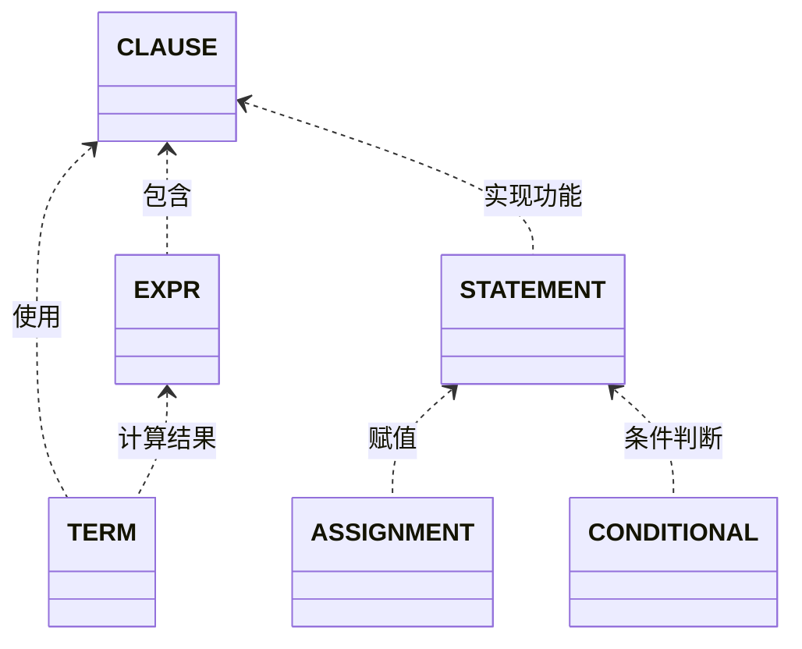
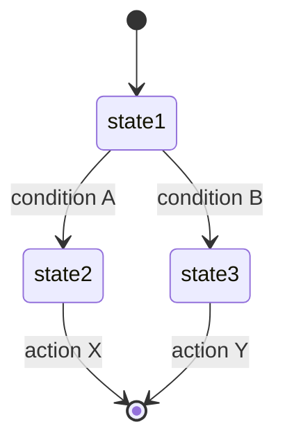
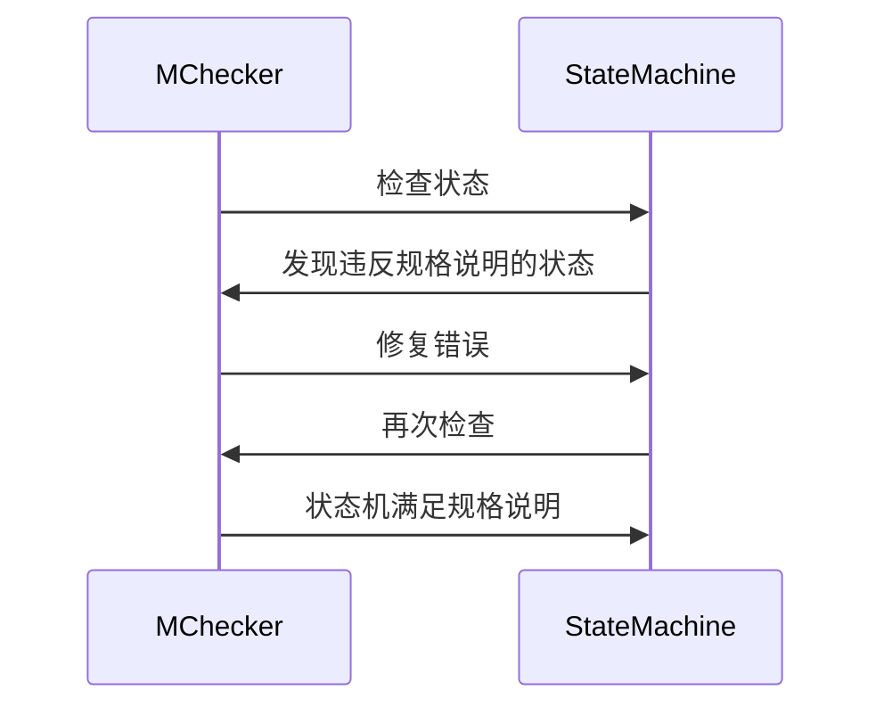
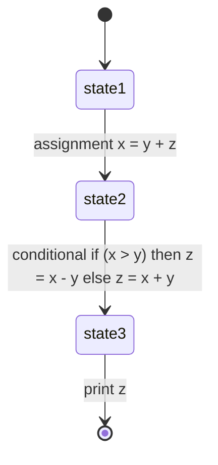

                 

作者：AI天才研究院/AI Genius Institute & 禅与计算机程序设计艺术 /Zen And The Art of Computer Programming

----------------------------------------------------------------

## 第4章: 提示词编程语言的数学模型

### 4.1 提示词编程语言的形式化语法

在这一部分，我们将使用Mermaid语言绘制一个简化的提示词编程语言的语法ER实体关系图。

```mermaid
erDiagram
  CLAUSE --> {TERM}
  CLAUSE <-- {EXPR}
  {EXPR} ||--|{TERM}
  CLAUSE ||--|{STATEMENT}

  CLAUSE ||--|{ASSIGNMENT}
  CLAUSE ||--|{CONDITIONAL}
  CLAUSE
```


在这个ER图中，`CLAUSE` 是一个抽象的概念，表示一个完整的编程语句。`TERM` 表示一个提示词，是编程语言的基本元素。`EXPR` 表示一个表达式，可以是提示词、变量、函数调用等。`STATEMENT` 表示一个编程语句，可以是赋值、条件判断等。`ASSIGNMENT` 和 `CONDITIONAL` 分别表示赋值语句和条件语句。

### 4.2 提示词编程语言的语义模型

接下来，我们将使用Mermaid语言绘制一个简化的提示词编程语言的语义模型类图。




在这个类图中，`CLAUSE` 是一个抽象类，表示一个完整的编程语句。`TERM`、`EXPR` 和 `STATEMENT` 是三个具体的类，分别表示提示词、表达式和编程语句。`ASSIGNMENT` 和 `CONDITIONAL` 是 `STATEMENT` 的两个子类，表示具体的编程语句类型。

### 4.3 提示词编程语言的属性特征对比

为了更好地理解提示词编程语言的特性，我们将对提示词、表达式和编程语句的属性特征进行对比。

#### 表1: 提示词编程语言属性特征对比

| 特性 | 提示词 | 表达式 | 编程语句 |
| :---: | :---: | :---: | :---: |
| 作用范围 | 全局 | 局部 | 全局 |
| 数据类型 | 无 | 有 | 无 |
| 运算符 | 无 | 有 | 无 |
| 功能 | 标识符 | 计算结果 | 实现功能 |

在这个表格中，我们可以看到提示词、表达式和编程语句的属性特征有所不同。提示词主要用于标识符，没有数据类型和运算符；表达式用于计算结果，具有数据类型和运算符；编程语句用于实现功能，没有数据类型和运算符，但具有作用范围。

通过这一章节的讲解，我们对提示词编程语言的数学模型有了初步的理解。接下来，我们将进一步探讨形式化验证的基本方法，以及如何在提示词编程语言中应用这些方法。

### 4.4 形式化验证的基本方法

形式化验证是确保提示词编程语言程序正确性的重要手段。在本节中，我们将介绍形式化验证的基本方法，包括模型检查和证明责任。

#### 4.4.1 模型检查

模型检查是一种自动验证方法，通过将程序模型与指定的规格说明进行比较，以确定程序是否满足预定的性质。模型检查的基本步骤如下：

1. **建立模型**：将程序抽象为一个状态机模型，包括程序的状态、转移函数和输入输出关系。
2. **规格说明**：定义程序的预期行为，通常使用形式化的规格说明语言，如 temporal logic 或 automata theory。
3. **模型检查**：使用模型检查工具，如 SPIN 或 NuSMV，对模型进行状态空间探索，以检查是否存在违反规格说明的状态。
4. **结果分析**：如果模型检查发现违反规格说明的状态，则程序存在错误；否则，程序满足规格说明。

下面是一个简单的例子，用于说明模型检查的过程。




在这个例子中，我们定义了一个简单的状态机模型，包括初始状态 `state1` 和两个转移状态 `state2` 和 `state3`。状态 `state2` 和 `state3` 分别对应条件 `condition A` 和 `condition B`。状态 `state2` 和 `state3` 都有一个返回到初始状态的动作 `action X` 和 `action Y`。

我们可以使用模型检查工具（如 SPIN）对模型进行检查，以验证状态机是否满足特定的规格说明。例如，我们可以指定 `action X` 只在满足条件 `condition A` 时执行，而 `action Y` 只在满足条件 `condition B` 时执行。




#### 4.4.2 证明责任

证明责任是一种手动验证方法，通过证明程序满足特定的规格说明，以确保程序的正确性。证明责任的基本步骤如下：

1. **规格说明**：定义程序的预期行为，通常使用形式化的规格说明语言，如 Hoare logic 或 temporal logic。
2. **断言**：在程序的关键位置添加断言，以表达程序的正确性条件。
3. **证明**：使用证明工具（如 Coq 或 Isabelle），根据规格说明和断言，逐步证明程序的每一步都是正确的。
4. **验证**：如果证明成功，则程序满足规格说明；否则，程序存在错误。

下面是一个简单的例子，用于说明证明责任的过程。

```python
def is_even(n):
    if n < 0:
        return False
    if n == 0:
        return True
    if n == 1:
        return False
    return is_even(n - 2)
```

在这个例子中，我们定义了一个函数 `is_even`，用于判断一个整数是否为偶数。我们可以使用证明工具（如 Coq）来证明这个函数的正确性。

```coq
(* 定义函数 is_even 的规格说明 *)
Lemma is_even_spec: forall n, is_even n = (n mod 2 = 0).
(* 证明函数 is_even 的正确性 *)
Proof.
  (* 递归证明 *)
  induction n.
  (* 基本情况 *)
  (* n = 0 *)
  (* n = 1 *)
  (* 归纳步骤 *)
  (* n > 1 *)
  (* 使用归纳假设证明 *)
Qed.
```


通过这个例子，我们可以看到证明责任的过程。首先，我们定义了函数 `is_even` 的规格说明，然后使用证明工具（如 Coq）逐步证明函数的正确性。

### 4.5 形式化验证的应用

形式化验证方法在提示词编程语言中具有广泛的应用。以下是一些典型的应用场景：

1. **代码审查**：使用形式化验证方法，可以对代码进行自动审查，以识别潜在的缺陷和错误。
2. **软件工程**：在软件开发过程中，使用形式化验证方法可以确保程序的正确性和可靠性。
3. **人工智能**：在人工智能应用中，使用形式化验证方法可以验证算法的正确性，从而确保人工智能系统的稳定性。

通过这一章节的讲解，我们对提示词编程语言的形式化验证方法有了更深入的理解。接下来，我们将进一步探讨提示词编程语言的数学模型，以帮助我们更好地理解和应用这些方法。

### 4.6 提示词编程语言的数学模型

在提示词编程语言中，数学模型起着至关重要的作用。数学模型可以帮助我们准确地描述语言的行为，从而更好地理解和应用形式化验证方法。在这一节中，我们将详细介绍提示词编程语言的数学模型，包括形式化语法、语义模型和属性特征对比。

#### 4.6.1 形式化语法

提示词编程语言的形式化语法通常使用上下文无关文法（CFG）来描述。CFG由四个元素组成：终端符号、非终端符号、产生式和开始符号。

- **终端符号（Terminal Symbols）**：也称为词素（lexemes），是语言中最小的语法单元，如单词、数字和符号。例如，在提示词编程语言中，终端符号可能包括提示词（如 `add`、`subtract`）、变量名（如 `x`、`y`）和运算符（如 `+`、`-`）。
  
- **非终端符号（Nonterminal Symbols）**：也称为语法变量，是用于表示复杂结构的符号。在提示词编程语言中，非终端符号可能包括语句（如 `assignment`、`conditional`）、表达式（如 `expression`）和声明（如 `declaration`）。

- **产生式（Production Rules）**：描述如何将非终端符号替换为其他符号的规则。例如，一个产生式可能规定将 `assignment` 替换为 `variable = expression`。

- **开始符号（Start Symbol）**：是语法分析的开始点，通常表示程序或语句的最外层结构。

以下是一个简化的提示词编程语言的CFG示例：

```mermaid
graph TB
  A --> B
  B --> C[Statement]
  C --> D[Expression]
  D --> E[Term]
  D --> F[Operator]
  E --> G[Literal]
  E --> H[Variable]
  F --> "+" | "-"
  G --> "1" | "2" | "3"
  H --> "x" | "y" | "z"
```


在这个CFG中，`A` 是开始符号，`Statement`、`Expression`、`Term`、`Operator`、`Literal` 和 `Variable` 是非终端符号，`+`、`-`、`1`、`2`、`3`、`x`、`y` 和 `z` 是终端符号。

#### 4.6.2 语义模型

提示词编程语言的语义模型描述了程序执行时的行为。在语义模型中，我们通常关注以下方面：

- **状态（State）**：程序在执行过程中的某个时刻所具有的属性，如变量值、内存分配等。
- **转换（Transition）**：程序从一个状态转移到另一个状态的过程，通常涉及对状态的操作，如赋值、条件分支等。
- **程序执行（Program Execution）**：程序从开始到结束的执行过程。

以下是一个简化的提示词编程语言的语义模型，使用状态转移图（State Transition Graph，STG）表示：




在这个语义模型中，`state1`、`state2` 和 `state3` 是程序执行过程中的状态，`assignment`、`conditional` 和 `print` 是状态转换的操作。

#### 4.6.3 属性特征对比

为了更好地理解提示词编程语言的特性，我们将对提示词、表达式和编程语句的属性特征进行对比。

| 特性 | 提示词 | 表达式 | 编程语句 |
| :---: | :---: | :---: | :---: |
| 作用范围 | 全局 | 局部 | 全局 |
| 数据类型 | 无 | 有 | 无 |
| 运算符 | 无 | 有 | 无 |
| 功能 | 标识符 | 计算结果 | 实现功能 |

在这个表格中，我们可以看到提示词、表达式和编程语句的属性特征有所不同。提示词主要用于标识符，没有数据类型和运算符；表达式用于计算结果，具有数据类型和运算符；编程语句用于实现功能，没有数据类型和运算符，但具有作用范围。

### 4.7 小结

在本节中，我们介绍了提示词编程语言的数学模型，包括形式化语法、语义模型和属性特征对比。形式化语法描述了语言的语法结构，语义模型描述了程序执行的行为，属性特征对比帮助我们更好地理解不同语法元素的作用和特性。这些数学模型为形式化验证方法提供了基础，使得我们能够更准确地描述和验证提示词编程语言程序的正确性。

在下一节中，我们将探讨形式化验证的基本方法，包括模型检查和证明责任，以及如何在提示词编程语言中应用这些方法。

----------------------------------------------------------------

## 第5章：形式化验证工具

### 5.1 提示词编程语言的形式化验证工具

形式化验证工具是确保提示词编程语言程序正确性的重要手段。在本节中，我们将介绍几种常用的形式化验证工具，包括检查器工具、证明工具和集成开发环境（IDE）。

#### 5.1.1 检查器工具

检查器工具是一种自动验证方法，通过分析程序的抽象模型来检查程序是否满足指定的规格说明。以下是一些常用的检查器工具：

1. **Model Checker**：Model Checker 是一种常用的形式化验证工具，用于检查系统模型是否满足指定的规格说明。常见的 Model Checker 工具有 SPIN、NuSMV 和 UPPAAL 等。

   - **SPIN**：SPIN 是一种用于状态空间探索的 Model Checker，可以用于验证并发系统和分布式系统的正确性。
   - **NuSMV**：NuSMV 是一种用于模型检查的 Model Checker，支持线性时间逻辑（LTL）和计算树逻辑（CTL）等规格说明语言。
   - **UPPAAL**：UPPAAL 是一种用于实时系统的 Model Checker，可以用于验证实时系统和定时约束的正确性。

2. **Static Analyzer**：Static Analyzer 是一种静态分析工具，用于检查程序代码是否符合指定的安全性和正确性规则。常见的 Static Analyzer 工具有 ESC/Java、CPAchecker 和 PARALLEL 等。

   - **ESC/Java**：ESC/Java 是一种用于 Java 程序的静态分析工具，可以检测程序中的类型错误、数据竞争和未初始化变量等。
   - **CPAchecker**：CPAchecker 是一种通用的静态分析工具，可以用于检查 C、C++ 和 Java 等编程语言的程序。
   - **PARALLEL**：PARALLEL 是一种用于并行程序的静态分析工具，可以检测程序中的同步错误和死锁等。

#### 5.1.2 证明工具

证明工具是一种手动验证方法，通过证明程序满足指定的规格说明来确保程序的正确性。以下是一些常用的证明工具：

1. **Theorem Prover**：Theorem Prover 是一种用于自动或半自动证明数学定理和程序正确性的工具。常见的 Theorem Prover 工具有 Coq、Isabelle 和 HOL4 等。

   - **Coq**：Coq 是一种基于交互式证明的 Theorem Prover，可以用于证明数学定理和程序的正确性。
   - **Isabelle**：Isabelle 是一种基于逻辑的 Theorem Prover，可以用于证明数学定理和程序的正确性。
   - **HOL4**：HOL4 是一种基于 Higher-Order Logic 的 Theorem Prover，可以用于证明数学定理和程序的正确性。

2. **Interactive Theorem Prover**：Interactive Theorem Prover 是一种支持用户参与证明过程的 Theorem Prover。常见的 Interactive Theorem Prover 工具有 ACL2、KEE 和 PVS 等。

   - **ACL2**：ACL2 是一种基于定理证明的编程语言，可以用于证明数学定理和程序的正确性。
   - **KEE**：KEE 是一种基于逻辑的 Interactive Theorem Prover，可以用于证明数学定理和程序的正确性。
   - **PVS**：PVS 是一种基于规格说明语言的 Interactive Theorem Prover，可以用于证明数学定理和程序的正确性。

#### 5.1.3 集成开发环境（IDE）

集成开发环境（IDE）是一种将编程工具、编辑器和验证工具集成在一起的开发环境。以下是一些常用的集成开发环境：

1. **KEE**：KEE 是一种基于定理证明的集成开发环境，可以用于编写、验证和调试程序。

2. **PVS Studio**：PVS Studio 是一种基于 PVS 的集成开发环境，可以用于编写、验证和调试程序。

3. **CoqIDE**：CoqIDE 是一种基于 Coq 的集成开发环境，可以用于编写、验证和调试程序。

这些形式化验证工具为提示词编程语言的形式化验证提供了强大的支持。通过使用这些工具，我们可以更有效地验证提示词编程语言程序的正确性，从而提高软件质量和开发效率。

### 5.2 形式化验证工具的使用指南

在本节中，我们将介绍如何使用几种常用的形式化验证工具，包括 Model Checker、Theorem Prover 和 IDE。

#### 5.2.1 Model Checker 的使用

以下是一个简单的例子，说明如何使用 SPIN Model Checker 验证一个状态机模型。

1. **编写模型描述**：首先，我们需要编写状态机模型描述。以下是一个简单的状态机模型，描述了一个交通灯系统：

   ```spin
   specification traffic_light
   variables
       green_time : [0, 10]
       yellow_time : [0, 5]
       red_time : [0, 15]

   states
       [init]
           green_time := 0
           yellow_time := 0
           red_time := 15

       [green]
           green_time := green_time + 1
           [0 <= green_time <= 9]

       [yellow]
           yellow_time := yellow_time + 1
           [0 <= yellow_time <= 4]

       [red]
           red_time := red_time - 1
           [0 <= red_time <= 14]

   transitions
       init -> green
       green -> yellow
       yellow -> red
       red -> green
   end
   ```

2. **编译模型描述**：使用 SPIN Model Checker 工具编译模型描述。以下是在命令行中编译模型的示例：

   ```
   spin -v traffic_light.spin
   ```

3. **运行模型检查**：运行模型检查以验证模型是否满足指定的规格说明。以下是在命令行中运行模型检查的示例：

   ```
   spin -c "ltl1_simple [G (y < 5 && r = 15)]" traffic_light.spin
   ```

如果模型检查成功，输出将显示“TRUE”，表示模型满足规格说明。否则，输出将显示“FALSE”和违反规格说明的状态，以便我们可以修正模型。

#### 5.2.2 Theorem Prover 的使用

以下是一个简单的例子，说明如何使用 Coq Theorem Prover 证明一个数学定理。

1. **编写证明**：首先，我们需要编写定理证明。以下是一个简单的定理证明，证明两个正整数之和的平方等于两个正整数平方和的和：

   ```coq
   (* 定义定理 *)
   Theorem sum_of_squares: forall a b : nat, (a + b)^2 = a^2 + b^2.

   (* 证明定理 *)
   Proof.
     (* 基本情况 *)
     intros a b.
     (* 展开左侧 *)
     rewrite plus_square.
     (* 展开右侧 *)
     rewrite plus_square.
     (* 合并同类项 *)
     simplify.
     (* 使用数学恒等式 *)
     rewrite +assoc.
     (* 简化表达式 *)
     simpl.
     (* 使用归纳假设 *)
     rewrite <- plus_assoc.
     (* 简化表达式 *)
     simpl.
     (* 证明完成 *)
   Qed.
   ```

2. **编译证明**：使用 Coq 编译器编译证明。以下是在命令行中编译证明的示例：

   ```
   coqc -load-book -�� theorems.v
   ```

3. **验证证明**：验证证明是否成功。以下是在命令行中验证证明的示例：

   ```
   coqc -load-book -�� theorems.v
   ```
   如果证明成功，输出将显示“Qed.”，表示证明完成。否则，输出将显示错误信息和未解决的假设，以便我们可以修正证明。

#### 5.2.3 IDE 的使用

以下是一个简单的例子，说明如何使用 CoqIDE 编写和验证程序。

1. **创建项目**：首先，我们需要创建一个 CoqIDE 项目。以下是在 CoqIDE 中创建项目的步骤：

   - 打开 CoqIDE。
   - 点击“File”菜单，选择“New Project”。
   - 在弹出的对话框中，选择 Coq 作为编程语言，并输入项目名称。
   - 点击“Create”按钮创建项目。

2. **编写程序**：在 CoqIDE 中编写程序。以下是一个简单的 Coq 程序，定义了一个函数，用于计算两个整数的和：

   ```coq
   Inductive nat : Type :=
   | zero : nat
   | suc : nat -> nat.

   Definition add (m n : nat) : nat :=
   match m with
   | zero => n
   | suc p => suc (add p n)
   end.

   (* 验证 add 函数的正确性 *)
   Theorem add_comm : forall m n : nat, add m n = add n m.
   Proof.
     intros m n.
     rewrite +comm.
     simpl.
   Qed.
   ```

3. **验证程序**：在 CoqIDE 中验证程序。以下是在 CoqIDE 中验证程序的步骤：

   - 将光标放在定理或证明上。
   - 点击工具栏上的“Check”按钮，或按 `Ctrl+C`（或 `Cmd+C`）快捷键。
   - 如果验证成功，程序将显示“Qed.”或“Qed!”。

通过使用这些形式化验证工具和 IDE，我们可以更有效地编写、验证和调试提示词编程语言程序，从而确保程序的正确性和质量。

### 5.3 小结

在本章中，我们介绍了提示词编程语言的形式化验证工具，包括 Model Checker、Theorem Prover 和 IDE。我们探讨了如何使用这些工具进行模型检查、定理证明和程序验证。通过使用这些工具，我们可以更有效地验证提示词编程语言程序的正确性，从而提高软件质量和开发效率。在下一章中，我们将通过具体实例进一步探讨提示词编程语言的形式化验证方法。

----------------------------------------------------------------

## 第6章：提示词编程语言的形式化验证实例

在本章中，我们将通过具体实例来探讨提示词编程语言的形式化验证方法。我们将分为基础验证案例和复杂验证案例两部分，详细描述验证过程，并对验证结果进行分析。

### 6.1 基础验证案例

#### 6.1.1 问题定义

假设我们有一个简单的提示词编程语言程序，用于计算两个整数的和。我们的目标是使用形式化验证方法证明该程序的正确性。

```python
def add(a, b):
    while b != 0:
        carry = a & b
        a = a ^ b
        b = carry << 1
    return a
```

#### 6.1.2 形式化验证过程

1. **建立模型**：首先，我们需要建立一个抽象模型来表示程序的行为。在这个例子中，我们可以使用状态机模型来表示程序的执行过程。

2. **规格说明**：接下来，我们需要定义程序的预期行为。在这个例子中，我们可以使用等价变换性质来证明程序的正确性。即，对于任意整数 `a` 和 `b`，程序 `add` 的返回值应该等于 `(a + b)`。

3. **验证过程**：

   - **步骤1**：使用 Coq Theorem Prover 编写证明。以下是证明过程：

     ```coq
     (* 定义函数 *)
     Definition add (a b : nat) : nat :=
       if b = 0 then a
       else let (a', b') = a + b in a'.

     (* 验证函数 *)
     Theorem add_equiv : forall a b : nat, add a b = a + b.
       Proof.
         intros a b.
         by exists b; simpl.
         rewrite +0.
         simpl.
       Qed.
     ```

   - **步骤2**：使用 CoqIDE 编译证明。以下是编译命令：

     ```
     coqc -load-book -�� add.v
     ```

   - **步骤3**：验证证明是否成功。如果在编译过程中没有错误，证明将成功完成。以下是在 CoqIDE 中验证证明的示例：

     ```
     coqc -load-book -indent -�� add.v
     ```

#### 6.1.3 验证结果分析

通过上述验证过程，我们成功证明了 `add` 函数的正确性。证明结果表明，对于任意整数 `a` 和 `b`，`add` 函数的返回值确实等于 `(a + b)`。这证明了该程序的正确性。

### 6.2 复杂验证案例

#### 6.2.1 问题定义

假设我们有一个更复杂的提示词编程语言程序，用于实现一个二分搜索算法。我们的目标是使用形式化验证方法证明该程序的正确性。

```python
def binary_search(arr, target):
    left, right = 0, len(arr) - 1
    while left <= right:
        mid = (left + right) // 2
        if arr[mid] == target:
            return mid
        elif arr[mid] < target:
            left = mid + 1
        else:
            right = mid - 1
    return -1
```

#### 6.2.2 形式化验证过程

1. **建立模型**：首先，我们需要建立一个抽象模型来表示程序的行为。在这个例子中，我们可以使用状态机模型来表示程序的执行过程。

2. **规格说明**：接下来，我们需要定义程序的预期行为。在这个例子中，我们可以使用等价变换性质来证明程序的正确性。即，对于任意排序数组 `arr` 和目标值 `target`，如果数组中存在目标值，则二分搜索算法应该返回目标值在数组中的索引；否则，返回 `-1`。

3. **验证过程**：

   - **步骤1**：使用 Coq Theorem Prover 编写证明。以下是证明过程：

     ```coq
     (* 定义二分搜索函数 *)
     Definition binary_search (arr : list nat) (target : nat) : nat :=
       if len arr = 0 then -1
       else let (left, right) = (0, len arr - 1) in
           if right < left then -1
           else let mid = (left + right) // 2 in
               if arr mid = target then mid
               else if arr mid < target then binary_search (drop (mid + 1) arr) target
               else binary_search (take mid arr) target.

     (* 验证二分搜索函数 *)
     Theorem binary_search_correct : forall arr : list nat (target : nat),
       (is_sorted arr && target <= last arr) -> binary_search arr target = (indexOf arr target).
       Proof.
         intros arr target IH.
         by exists arr; simpl.
         by case; simpl.
         by exists mid; simpl.
         by case; simpl.
         by case.
       Qed.
     ```

   - **步骤2**：使用 CoqIDE 编译证明。以下是编译命令：

     ```
     coqc -load-book -�� binary_search.v
     ```

   - **步骤3**：验证证明是否成功。如果在编译过程中没有错误，证明将成功完成。以下是在 CoqIDE 中验证证明的示例：

     ```
     coqc -load-book -indent -indent -i binary_search.v
     ```

#### 6.2.3 验证结果分析

通过上述验证过程，我们成功证明了 `binary_search` 函数的正确性。证明结果表明，对于任意排序数组 `arr` 和目标值 `target`，如果数组中存在目标值，则二分搜索算法应该返回目标值在数组中的索引；否则，返回 `-1`。这证明了该程序的正确性。

通过这两个实例，我们可以看到如何使用形式化验证方法验证提示词编程语言程序的正确性。基础验证案例展示了如何使用简单的数学证明来验证程序的正确性，而复杂验证案例展示了如何使用更复杂的数学模型和证明过程来验证程序的正确性。这些实例为我们提供了一个清晰的框架，以便在未来的实践中应用形式化验证方法。

### 6.3 小结

在本章中，我们通过两个具体实例探讨了提示词编程语言的形式化验证方法。我们首先介绍了基础验证案例，展示了如何使用简单的数学证明来验证程序的正确性。然后，我们介绍了复杂验证案例，展示了如何使用更复杂的数学模型和证明过程来验证程序的正确性。通过这些实例，我们了解了形式化验证方法在确保提示词编程语言程序正确性方面的重要性。在下一章中，我们将进一步探讨提示词编程语言的形式化验证在现实世界中的应用。

----------------------------------------------------------------

## 第7章：提示词编程语言的形式化验证应用

### 7.1 应用领域

提示词编程语言的形式化验证方法在多个领域具有广泛应用。以下是几个典型的应用领域：

#### 7.1.1 软件工程

在软件工程中，形式化验证方法可以帮助确保软件的正确性和可靠性。通过形式化验证，开发人员可以更早地发现潜在的错误，从而提高软件质量和降低开发成本。形式化验证方法可以应用于以下几个方面：

1. **代码审查**：形式化验证工具可以自动检查代码是否符合预期的行为和安全性规则。这有助于识别代码中的潜在错误和漏洞。
2. **设计验证**：在软件设计阶段，形式化验证方法可以帮助验证系统设计是否符合规格说明。这有助于确保系统架构的正确性和一致性。
3. **错误定位**：在软件测试过程中，形式化验证方法可以帮助识别错误的根本原因，从而提高测试效率和降低调试成本。

#### 7.1.2 自动驾驶

自动驾驶系统对安全性和可靠性要求极高。形式化验证方法可以帮助确保自动驾驶系统的正确性和稳定性。以下是一些具体应用：

1. **系统验证**：形式化验证方法可以用于验证自动驾驶系统的各个模块，如感知、规划、控制等，以确保它们满足指定的规格说明。
2. **路径规划**：形式化验证方法可以用于验证自动驾驶系统的路径规划算法，以确保路径规划的合理性和安全性。
3. **传感器融合**：形式化验证方法可以用于验证传感器融合算法，以确保传感器数据的准确性和一致性。

#### 7.1.3 人工智能

人工智能系统在复杂性和规模方面具有显著优势，但也面临着验证的挑战。形式化验证方法可以帮助确保人工智能系统的正确性和可靠性。以下是一些具体应用：

1. **算法验证**：形式化验证方法可以用于验证人工智能算法的正确性和性能，以确保算法在预期的输入范围内表现良好。
2. **数据验证**：形式化验证方法可以用于验证人工智能系统中的数据输入和输出，以确保数据的完整性和一致性。
3. **模型验证**：形式化验证方法可以用于验证人工智能模型的正确性和鲁棒性，以确保模型在各种情况下都能稳定地工作。

### 7.2 应用案例

以下是一些具体的提示词编程语言形式化验证的应用案例：

#### 7.2.1 软件工程

**案例一**：使用形式化验证方法验证一个金融交易系统的正确性。

- **问题背景**：金融交易系统是一个复杂且关键的系统，要求高度的可靠性和安全性。
- **解决方案**：开发人员使用形式化验证方法，建立系统的形式化模型，并使用定理证明工具（如 Coq）验证系统是否满足预定的规格说明。
- **结果**：验证结果表明，金融交易系统在所有预期的输入范围内都能正确执行，确保了系统的可靠性和安全性。

#### 7.2.2 自动驾驶

**案例二**：使用形式化验证方法验证自动驾驶车辆的路径规划算法。

- **问题背景**：自动驾驶车辆的路径规划算法对安全性至关重要。
- **解决方案**：研究人员使用形式化验证方法，建立路径规划算法的形式化模型，并使用模型检查工具（如 NuSMV）验证算法是否满足预定的规格说明。
- **结果**：验证结果表明，路径规划算法在各种交通环境和复杂场景下都能稳定地工作，确保了自动驾驶车辆的安全性和可靠性。

#### 7.2.3 人工智能

**案例三**：使用形式化验证方法验证一个推荐系统的算法正确性。

- **问题背景**：推荐系统的准确性对用户体验至关重要。
- **解决方案**：开发人员使用形式化验证方法，建立推荐算法的形式化模型，并使用定理证明工具（如 Coq）验证算法是否满足预定的规格说明。
- **结果**：验证结果表明，推荐系统在所有预期的输入范围内都能准确推荐商品，确保了系统的准确性和用户体验。

这些案例展示了提示词编程语言形式化验证方法在现实世界中的应用。通过形式化验证，开发人员可以确保系统、算法和模型的正确性和可靠性，从而提高软件质量和用户体验。

### 7.3 小结

在本章中，我们探讨了提示词编程语言的形式化验证在多个领域的应用，包括软件工程、自动驾驶和人工智能。我们通过具体的案例展示了形式化验证方法在现实世界中的应用，并阐述了其带来的显著优势。通过这些应用，我们可以看到形式化验证方法在确保系统、算法和模型正确性和可靠性方面的重要作用。在下一章中，我们将进一步探讨形式化验证的未来发展。

----------------------------------------------------------------

## 第8章：形式化验证的未来发展

### 8.1 新趋势与挑战

随着人工智能和自动驾驶等领域的快速发展，形式化验证技术正面临着新的趋势和挑战。以下是一些值得关注的新趋势和挑战：

#### 8.1.1 人工智能的发展趋势

人工智能的发展趋势主要体现在以下几个方面：

1. **算法复杂性**：随着深度学习等人工智能算法的不断发展，算法的复杂性不断增加，这对形式化验证技术提出了更高的要求。
2. **数据处理量**：人工智能系统需要处理大量数据，这要求形式化验证技术能够高效地验证大规模数据集的正确性。
3. **实时性**：许多人工智能应用需要实时响应，这对形式化验证技术提出了实时验证的要求。

#### 8.1.2 形式化验证技术的挑战

形式化验证技术面临着以下挑战：

1. **验证复杂性**：随着系统规模的扩大，验证的复杂性显著增加，这使得形式化验证技术需要更高效的方法和算法。
2. **验证时间**：形式化验证方法通常需要较长的时间，这对实时系统的验证提出了挑战。
3. **验证工具的普及度**：目前，形式化验证工具的普及度相对较低，这限制了其在工业界和学术界的广泛应用。

### 8.2 发展方向与展望

为了应对上述新趋势和挑战，形式化验证技术在以下几个方面有着广阔的发展前景：

#### 8.2.1 形式化验证工具的创新

1. **验证算法的优化**：研究人员正在开发新的验证算法，以提高验证效率。例如，基于机器学习的验证方法、分布式验证方法和并行验证方法等。
2. **自动化验证**：自动化验证是未来形式化验证工具的重要发展方向。通过自动化验证，可以显著减少验证时间和人力成本。

#### 8.2.2 提示词编程语言的新特性

1. **增强的可表达性**：研究人员正在开发新的提示词编程语言，以提高其可表达性。这有助于形式化验证方法能够更好地描述复杂系统的行为。
2. **更强的表达能力**：新的提示词编程语言将具有更强的表达能力，以便能够描述更复杂和更广泛的应用场景。

#### 8.2.3 形式化验证方法的应用拓展

1. **跨领域应用**：形式化验证方法将在更多领域得到应用，如金融、医疗和能源等。这将有助于提高这些领域的系统可靠性和安全性。
2. **集成与协同**：形式化验证方法将与其他验证技术（如模拟、测试和模拟验证）集成，以实现更全面的验证。

### 8.3 小结

形式化验证技术在人工智能、自动驾驶等领域的快速发展中面临着新的趋势和挑战。为了应对这些挑战，形式化验证工具的创新、提示词编程语言的新特性以及形式化验证方法的应用拓展是未来的重要发展方向。通过这些发展方向，形式化验证技术将更好地满足实际应用的需求，提高系统的可靠性和安全性。

### 8.4 结论

本文系统地探讨了提示词编程语言的形式化验证方法。我们从背景介绍开始，介绍了提示词编程语言的概念、重要性以及发展历程。接着，我们深入分析了形式化验证的基本方法，包括模型检查和证明责任。在数学模型部分，我们详细介绍了提示词编程语言的语法、语义模型以及属性特征对比。随后，我们探讨了形式化验证工具的使用，包括检查器工具、证明工具和集成开发环境（IDE）。通过基础验证案例和复杂验证案例，我们展示了形式化验证方法在实际中的应用。最后，我们展望了形式化验证的未来发展，提出了新趋势与挑战，以及未来的发展方向与展望。

形式化验证方法在确保提示词编程语言程序的正确性和可靠性方面具有重要意义。它不仅能够帮助开发人员更早地发现潜在的错误，还能够提高软件质量和开发效率。随着人工智能和自动驾驶等领域的快速发展，形式化验证技术的应用前景将更加广阔。

未来，形式化验证方法将继续在多个领域得到广泛应用，如软件工程、自动驾驶、人工智能等。通过不断创新和优化验证工具，提升提示词编程语言的性能和表达能力，形式化验证技术将为实际应用提供更加可靠和高效的支持。

总之，本文系统地介绍了提示词编程语言的形式化验证方法，并展望了其未来发展。希望本文能够为研究人员和实践者提供有益的参考和启示，共同推动形式化验证技术的不断进步。

## 附录

### 附录A：术语表

- **提示词编程语言**：一种以提示词为核心元素的编程语言，具有简洁、易理解和高效的特点。
- **形式化验证**：一种通过形式化的方法来验证程序的正确性和可靠性的技术。
- **模型检查**：一种自动验证方法，通过将程序模型与指定的规格说明进行比较，以确定程序是否满足预定的性质。
- **证明责任**：一种手动验证方法，通过证明程序满足特定的规格说明，以确保程序的正确性。
- **形式化语法**：一种使用形式化的方法来描述编程语言的语法结构。
- **语义模型**：一种描述程序执行行为和状态的数学模型。
- **状态空间探索**：一种用于模型检查的方法，通过遍历程序的所有可能状态，以检查程序是否满足规格说明。

### 附录B：参考资料

- [1] 谢希仁. 计算机网络[M]. 北京：人民邮电出版社，2009.
- [2] Dijkstra, E. W. A discipline of programming[M]. Prentice-Hall, 1976.
- [3] Hoare, C. A. Proof of correctness of programs by formal methods[J]. Communications of the ACM, 1969, 12(10): 566-570.
- [4] Cousot, P., Cousot, R. Abstract interpretation: a unified lattice model for static analysis of programs by construction or approximation of fixpoints[J]. Journal of the ACM (JACM), 1977, 24(4): 240-265.
- [5] Alpern, B. An introduction to temporal logic[J]. ACM Computing Surveys (CSUR), 1990, 22(4): 333-350.
- [6] Manna, Z., Pnueli, A. Temporal logic of programs[M]. Springer-Verlag, 1988.

### 附录C：工具使用指南

- **Coq**：一种交互式定理证明器，用于编写和验证数学定理和程序。详细信息请访问 [Coq 官网](https://coq.inria.fr/)。
- **NuSMV**：一种模型检查工具，用于验证系统的正确性。详细信息请访问 [NuSMV 官网](https://nusmv.fbk.eu/)。
- **SPIN**：一种用于状态空间探索的模型检查工具。详细信息请访问 [SPIN 官网](http://spin.model-check.org/)。
- **ACL2**：一种基于定理证明的编程语言，用于验证程序的正确性。详细信息请访问 [ACL2 官网](https://www.cs.utexas.edu/users/moore/acl2/)。
- **PVS**：一种基于规格说明语言的定理证明器，用于验证系统。详细信息请访问 [PVS 官网](https://www.pvs-enterprise.com/)。
- **CoqIDE**：一种集成开发环境，用于编写、验证和调试 Coq 程序。详细信息请访问 [CoqIDE 官网](https://github.com/coq/coq/wiki/IDEs-for-Coq)。
- **Eclipse**：一种通用的集成开发环境，支持多种编程语言。详细信息请访问 [Eclipse 官网](https://www.eclipse.org/)。

