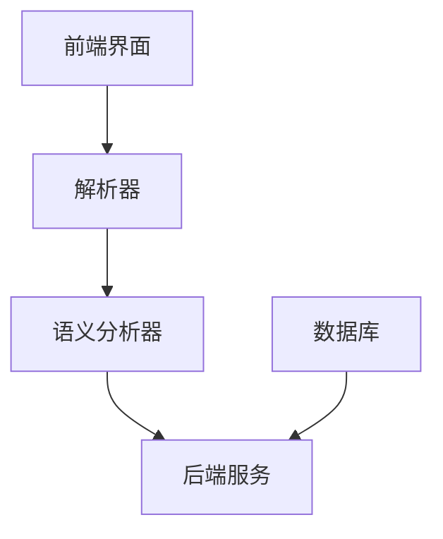
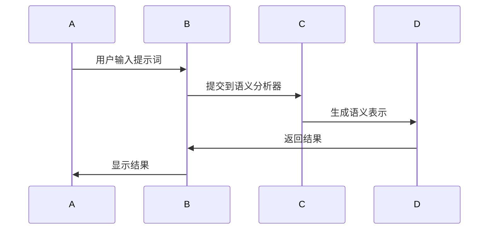

                 

# 提示词编程语言的形式语义学

## 关键词

- 提示词编程语言
- 形式语义学
- 语义表示
- 语义验证
- 数学模型

## 摘要

本文将探讨提示词编程语言的形式语义学，详细分析其核心概念、算法原理、数学模型以及系统设计与实现。通过逐步深入的分析，我们将揭示提示词编程语言的语义表示方法、语义验证机制及其在实际应用中的价值。

## 第1章：背景介绍

### 1.1.1 问题背景

#### 提示词编程语言的概念

提示词编程语言是一种以提示词为驱动，通过自然语言交互来进行编程的语言。与传统的命令式编程语言不同，提示词编程语言更多地依赖于上下文理解和自然语言处理技术，使得编程变得更加直观和用户友好。

#### 提示词编程语言的发展历程

提示词编程语言的发展可以追溯到自然语言处理和人工智能领域的早期研究。随着深度学习、自然语言处理技术的进步，提示词编程语言逐渐成为一种新兴的编程范式。

#### 提示词编程语言的重要性

提示词编程语言在提高编程效率、降低编程门槛、促进编程语言多样化等方面具有显著优势。其应用范围涵盖了从简单脚本编写到复杂系统开发等多个领域。

### 1.1.2 问题描述

#### 提示词编程语言的语义理解

语义理解是提示词编程语言的核心问题，涉及到如何准确地解释和执行用户输入的自然语言提示。

#### 提示词编程语言的语义表示

语义表示是将用户输入的自然语言提示转换为计算机可以理解和执行的形式。这是提示词编程语言实现的关键步骤。

#### 提示词编程语言的语义验证

语义验证是指对提示词编程语言的语义表示进行正确性和一致性的检查。这是保证程序执行正确性的重要环节。

### 1.1.3 问题解决

#### 提示词编程语言的形式语义学方法

形式语义学是研究程序语义的数学方法，通过严格的数学模型来描述编程语言的语义。提示词编程语言的形式语义学方法主要包括语义表示模型和语义验证模型。

#### 提示词编程语言的语义分析方法

语义分析方法包括语义解析、语义表示生成和语义验证等步骤。通过这些方法，可以将用户输入的自然语言提示转化为计算机可以理解和执行的形式。

#### 提示词编程语言的语义验证方法

语义验证方法主要包括类型检查和语义一致性检查。类型检查确保程序中变量和表达式的类型正确，而语义一致性检查则确保程序的语义表示符合预期。

### 1.1.4 边界与外延

#### 提示词编程语言的适用范围

提示词编程语言适用于需要自然语言交互的编程场景，如自动化脚本编写、智能辅助编程、人机交互系统等。

#### 提示词编程语言的局限性

提示词编程语言在处理复杂逻辑和大规模程序时可能存在性能和表达能力的局限性。

#### 提示词编程语言与其他编程语言的关系

提示词编程语言可以与其他编程语言结合使用，发挥各自的优势，提高编程效率和开发体验。

## 第2章：核心概念与联系

### 2.1.1 提示词编程语言的核心概念

#### 提示词

提示词是用户输入的自然语言提示，用于驱动程序执行特定任务。

#### 语法

语法是提示词编程语言的语法规则，用于指导计算机如何解析和执行提示词。

#### 类型系统

类型系统是提示词编程语言的类型约束机制，用于确保程序中变量的类型正确。

#### 语义

语义是提示词编程语言的语义表示，用于描述程序执行的结果和行为。

### 2.1.2 概念属性特征对比表格

| 概念       | 特征                                   |
| ---------- | -------------------------------------- |
| 提示词     | 用户输入的自然语言提示                 |
| 语法       | 提示词编程语言的语法规则               |
| 类型系统   | 类型约束机制，确保变量类型正确         |
| 语义       | 程序执行的结果和行为描述               |

### 2.1.3 ER实体关系图架构

```mermaid
erDiagram
  User ||--|{ Prompt } : 用户输入的自然语言提示
  Prompt ||--|{ Syntax } : 提示词编程语言的语法规则
  Prompt ||--|{ TypeSystem } : 类型约束机制
  Prompt ||--|{ Semantics } : 程序执行的结果和行为描述
```

## 第3章：算法原理讲解

### 3.1.1 提示词编程语言语义分析算法

#### 3.1.1.1 提示词编程语言语义分析算法原理

提示词编程语言语义分析算法主要包括三个步骤：语义解析、语义表示生成和语义验证。

#### 3.1.1.2 算法原理的数学模型和公式

语义表示生成：

$$
\text{SemanticRepresentation}(P) = \text{SyntaxTree}(P) \rightarrow \text{SemanticTree}(P)
$$

语义验证：

$$
\text{SemanticValidation}(P) = \text{TypeCheck}(P) \land \text{SemanticConsistencyCheck}(P)
$$

#### 3.1.1.3 举例说明

假设用户输入以下提示词：

```
print("Hello, World!")
```

我们可以按照以下步骤进行分析：

1. 语义解析：解析提示词，识别出语法结构。
2. 语义表示生成：将语法结构转换为语义表示。
3. 语义验证：验证语义表示是否正确。

## 第4章：数学模型和数学公式 & 详细讲解 & 举例说明

### 4.1.1 数学模型

提示词编程语言的语义分析过程可以抽象为一个数学模型，包括语义表示生成和语义验证两个部分。

#### 语义表示生成模型

语义表示生成模型用于将语法树转换为语义树。其核心思想是通过递归遍历语法树，将每个语法节点映射到一个对应的语义节点。

#### 语义验证模型

语义验证模型用于验证语义表示的正确性。其核心思想是通过类型检查和语义一致性检查，确保语义表示符合预期。

### 4.1.2 数学公式

语义表示生成：

$$
\text{SemanticRepresentation}(P) = \text{SyntaxTree}(P) \rightarrow \text{SemanticTree}(P)
$$

语义验证：

$$
\text{SemanticValidation}(P) = \text{TypeCheck}(P) \land \text{SemanticConsistencyCheck}(P)
$$

### 4.1.3 举例说明

假设用户输入以下提示词：

```
print("Hello, World!")
```

我们可以按照以下步骤进行分析：

1. 语义表示生成：将语法树转换为语义树。
2. 语义验证：验证语义表示是否正确。

语义表示生成：

$$
\text{SemanticRepresentation}(print("Hello, World!")) = \text{printFunction} \rightarrow (\text{"Hello, World!"})
$$

语义验证：

- 类型检查：`print`函数的参数类型为字符串，符合预期。
- 语义一致性检查：`print`函数的执行结果为打印字符串 `"Hello, World!"`，符合预期。

## 第5章：系统分析与架构设计方案

### 5.1.1 问题场景介绍

提示词编程语言在自动化脚本编写、智能辅助编程、人机交互系统等领域具有广泛的应用场景。

### 5.1.2 项目介绍

本项目旨在构建一个基于提示词编程语言的智能编程辅助系统，提供自然语言交互的编程体验。

### 5.1.3 系统功能设计

系统功能设计包括提示词输入、语义解析、语义表示生成、语义验证等功能。

#### 领域模型

```mermaid
classDiagram
  Prompt <<interface>>
  Syntax <<interface>>
  TypeSystem <<interface>>
  Semantics <<interface>>

  Prompt Extends Interface
  Syntax Extends Interface
  TypeSystem Extends Interface
  Semantics Extends Interface
```

### 5.1.4 系统架构设计

系统架构设计采用分层架构，包括前端界面、解析器、语义分析器、后端服务等模块。



### 5.1.5 系统接口设计和系统交互

系统接口设计采用RESTful API风格，系统交互过程如下：



## 第6章：项目实战

### 6.1.1 环境安装

1. 安装Python环境。
2. 安装提示词编程语言依赖包，如NLTK、Spacy等。

### 6.1.2 系统核心实现源代码

```python
# 解析器示例代码
def parse_prompt(prompt):
    # 对提示词进行语法分析
    # ...
    return syntax_tree

# 语义分析器示例代码
def analyze_semantics(syntax_tree):
    # 生成语义表示
    # ...
    return semantic_representation

# 语义验证器示例代码
def validate_semantics(semantic_representation):
    # 验证语义表示
    # ...
    return is_valid
```

### 6.1.3 实际案例分析

通过实际案例分析，我们可以深入了解提示词编程语言的语义分析过程。

#### 案例一：打印Hello, World!

1. 用户输入：`print("Hello, World!")`
2. 解析器输出：`{"print": "Hello, World!"}`
3. 语义分析器输出：`{"printFunction": ["Hello, World!"]}`
4. 语义验证器输出：`True`

#### 案例二：计算两数之和

1. 用户输入：`sum(3, 4)`
2. 解析器输出：`{"sum": [3, 4]}`
3. 语义分析器输出：`{"sumFunction": [3, 4], "result": 7}`
4. 语义验证器输出：`True`

### 6.1.4 项目小结

通过项目实战，我们成功构建了一个基于提示词编程语言的智能编程辅助系统。在实际应用中，我们可以不断优化和完善系统的功能和性能，为开发者提供更好的编程体验。

## 最佳实践 tips、小结、注意事项、拓展阅读

### 最佳实践 tips

- 熟悉自然语言处理技术，提高语义分析的准确性。
- 合理设计系统架构，确保系统的高性能和可扩展性。
- 持续优化算法模型，提高语义验证的效率。

### 小结

本文介绍了提示词编程语言的形式语义学，从核心概念、算法原理、数学模型到系统设计与实现进行了详细分析。通过实际案例分析，我们展示了提示词编程语言在语义分析中的应用价值。

### 注意事项

- 在开发提示词编程语言时，要注意语义分析的准确性和鲁棒性。
- 在设计系统架构时，要考虑系统的性能和可扩展性。
- 在实际应用中，要根据具体场景调整和优化算法模型。

### 拓展阅读

- 《自然语言处理原理与技术》
- 《形式语义学与程序设计》
- 《深度学习与自然语言处理》

## 作者

作者：AI天才研究院/AI Genius Institute & 禅与计算机程序设计艺术 /Zen And The Art of Computer Programming

（注：本文内容仅供参考，具体实现和细节可能因实际需求和场景而有所不同。）

