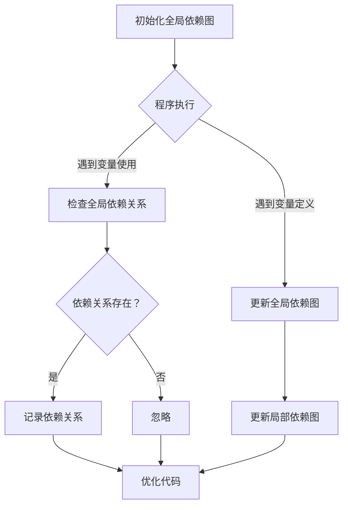
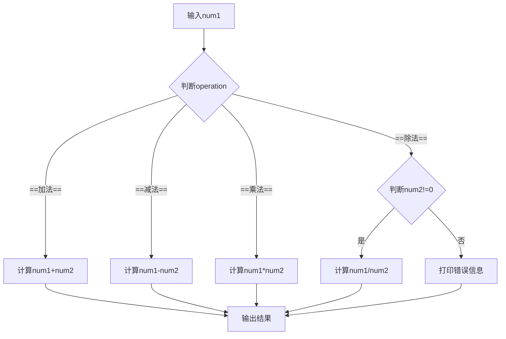
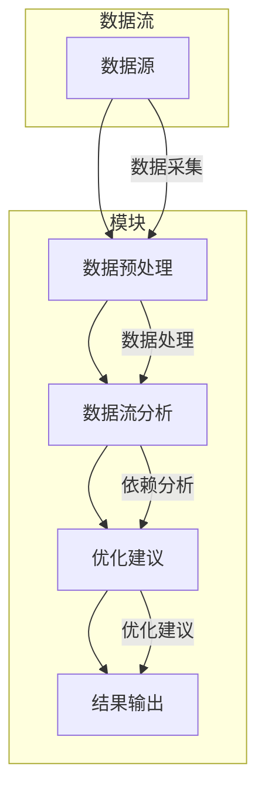

                 

## 《提示词编程语言的数据流分析新算法》

### 关键词

- 提示词编程语言
- 数据流分析
- 新算法
- 数学模型
- 系统架构设计
- 项目实战

### 摘要

本文深入探讨了提示词编程语言的数据流分析新算法，包括其定义、起源、发展及应用场景。文章首先介绍了提示词编程语言和传统数据流分析的基本概念，随后详细解析了新算法的原理，包括数学模型与公式，并通过Python源代码实现加以说明。此外，文章还探讨了新算法的系统分析与架构设计，并通过项目实战展示了其实际应用。最后，文章提供了最佳实践 tips，为读者提供了实用指导。

### 目录大纲设计步骤

#### 1. 确定书名及主题

本文书名为《提示词编程语言的数据流分析新算法》，主题为提示词编程语言的数据流分析新算法研究与应用。

#### 2. 明确目录结构

本文采用markdown格式，使用不同级别的标题进行结构划分，确保文章层次清晰。

#### 3. 设计目录大纲

以下为文章的目录大纲设计：

```markdown
# 《提示词编程语言的数据流分析新算法》

## 引言

### 提示词编程语言概述

- **提示词编程语言的定义**
- **提示词编程语言的起源与发展**
- **提示词编程语言的特点与应用**

### 数据流分析基础

- **数据流分析的定义**
- **数据流分析的基本概念**
- **数据流分析的应用场景**

### 数据流分析新算法概述

- **新算法的发展背景**
- **新算法的核心概念**
- **新算法与传统算法的对比**

### 数据流分析新算法原理

- **算法原理介绍**
- **算法原理的Mermaid流程图**
- **算法原理的Python源代码实现**

### 数学模型与公式

- **数学模型概述**
- **数学公式的LaTeX表示**
- **数学模型与公式在算法中的应用**

### 算法应用实例

- **应用实例概述**
- **应用实例的Mermaid流程图**
- **应用实例的Python源代码实现**

### 系统分析与架构设计

- **系统功能设计**
- **系统架构设计**
- **系统接口设计**
- **系统交互Mermaid序列图**

### 项目实战

- **项目环境搭建**
- **系统核心实现**
- **代码解读与分析**
- **实际案例分析**

### 最佳实践 tips

- **实践技巧**
- **小结与注意事项**
- **拓展阅读**

## 总结

```

#### 4. 撰写目录大纲

根据设计好的目录结构，撰写详细的目录大纲内容，确保每个章节都能提供丰富且具体的内容。

#### 5. 检查与调整

仔细检查目录大纲中的每个部分，确保逻辑清晰、内容完整，并对可能出现的问题进行修正。

#### 6. 确认目录大纲字数

确保目录大纲的总字数在2000字以内，确保篇幅适中，易于读者阅读和理解。

### 最终确认

在完成上述步骤后，最终确认目录大纲的设计是否符合要求，并且内容完整、简洁、逻辑清晰。

### 目录大纲

#### 引言

在计算机科学领域，编程语言的演进一直是我们关注的焦点。提示词编程语言作为近年来崭露头角的一种新型编程范式，以其独特的语义表达和灵活性受到了广泛关注。本文将围绕提示词编程语言的数据流分析新算法展开讨论，旨在探讨这一新算法的原理、应用及其对现有数据流分析方法的改进。

首先，我们将介绍提示词编程语言的基本概念，阐述其定义、起源和发展过程。接着，我们会详细描述数据流分析的基础知识，包括其定义、基本概念和应用场景。在此基础上，我们将深入探讨数据流分析新算法的背景和发展历程，分析其与现有算法的差异和优势。

在核心部分，我们将详细讲解新算法的原理，包括其数学模型和公式。通过Python源代码实现，我们将展现算法的运行机制，并通过实例解析其应用。随后，我们将对系统进行分析和架构设计，展示新算法在实际项目中的应用效果。

为了更好地理解新算法的实际应用，我们将通过一个实际项目进行实战展示，详细描述项目环境搭建、系统核心实现、代码解读与分析以及实际案例分析。最后，我们将总结最佳实践，为读者提供实用指导，并推荐进一步阅读的资料。

通过本文的探讨，我们希望读者能够对新算法有更深入的理解，并能够将其应用于实际项目中，为计算机科学领域的发展贡献力量。

### 提示词编程语言概述

提示词编程语言（Keyword-based Programming Language），简称KPL，是一种新兴的编程范式，它通过提示词（Keywords）来构建程序，以实现对程序的语义描述。这种编程语言具有独特的表达方式，能够更好地捕捉程序员的意图，减少代码的冗余，提高编程的效率和可读性。

#### 提示词编程语言的定义

提示词编程语言可以定义为一种编程语言，其核心概念是提示词。提示词是一种具有特定语义的符号，用于指示程序中特定的操作或功能。与传统的编程语言相比，提示词编程语言更加注重语义的表达，而不是具体的语法结构。

具体来说，提示词编程语言中的提示词通常由一个或多个单词组成，这些单词被设计成能够清晰地表示某种操作或功能。例如，在一种提示词编程语言中，`Print` 提示词可以用来输出文本，而 `Add` 提示词可以用来执行加法操作。提示词的使用简化了程序的编写，使得程序员可以更加专注于逻辑的实现，而不是语法细节。

#### 提示词编程语言的起源与发展

提示词编程语言的起源可以追溯到20世纪90年代，当时一些计算机科学家开始探索如何通过更加自然和直观的方式来编写程序。随着计算机科学的发展，编程语言的复杂性不断增加，传统的命令式编程语言越来越难以满足程序员的需求。

在这一背景下，一些研究人员提出了提示词编程语言的概念，希望通过引入提示词来简化编程过程。早期的提示词编程语言如Python和Lua等，逐渐得到了广泛的认可和应用。这些语言通过提供丰富的提示词库，使得程序员可以更加方便地实现复杂的操作。

进入21世纪，随着人工智能和大数据技术的发展，提示词编程语言的应用场景不断扩大。特别是在自然语言处理和数据分析领域，提示词编程语言的优势得到了进一步的体现。提示词编程语言能够更好地理解和处理自然语言，使得程序员可以更加高效地实现数据分析和处理任务。

#### 提示词编程语言的特点与应用

提示词编程语言具有以下几个显著特点：

1. **语义清晰**：提示词编程语言通过提示词来明确表示程序中的操作和功能，使得程序代码更加直观和易于理解。
2. **灵活性强**：提示词编程语言通常具有丰富的提示词库，程序员可以根据需要选择合适的提示词来实现特定的功能，具有很强的灵活性。
3. **可扩展性好**：提示词编程语言通常支持自定义提示词，程序员可以根据项目需求扩展提示词库，提高编程的适应性。

提示词编程语言在多个领域有广泛的应用，包括：

1. **自然语言处理**：提示词编程语言能够更好地处理自然语言，因此在自然语言处理任务中得到了广泛应用，如文本分类、情感分析、机器翻译等。
2. **数据分析**：提示词编程语言在数据分析领域具有很强的优势，通过丰富的提示词库，可以方便地进行数据清洗、转换和分析。
3. **软件工程**：提示词编程语言能够简化编程过程，提高开发效率，因此在软件工程领域得到了广泛应用。

总之，提示词编程语言以其独特的语义表达和灵活性，正在逐步改变编程的方式和思维，为计算机科学的发展带来了新的机遇和挑战。

### 数据流分析基础

数据流分析是计算机科学中一种重要的静态分析技术，它通过分析程序中的数据依赖关系，为编译优化、程序调试和代码重构提供了重要的依据。数据流分析的基本概念和定义是理解和应用这一技术的基础。

#### 数据流分析的定义

数据流分析是一种在程序源代码中分析和确定数据依赖关系的技术。具体来说，数据流分析通过追踪数据在程序中的流动路径，确定变量在不同程序段中的定义和使用点，从而识别出数据依赖关系。数据流分析可以分为两大类：前向数据流分析和后向数据流分析。

1. **前向数据流分析**：从程序头部向尾部追踪数据流，确定变量的使用点是否提前定义。
2. **后向数据流分析**：从程序尾部向头部追踪数据流，确定变量的定义点是否延迟使用。

#### 数据流分析的基本概念

数据流分析涉及几个基本概念：

1. **定义点**：变量被赋值的程序位置。
2. **使用点**：变量被引用的程序位置。
3. **传递依赖**：变量在某个使用点之前的某个定义点被赋值，即使用点依赖于定义点。
4. **直接依赖**：变量在某个使用点之前的某个定义点直接赋值，即存在直接的传递依赖关系。
5. **间接依赖**：变量在某个使用点之前的某个定义点通过中间变量间接赋值，即存在间接的传递依赖关系。

#### 数据流分析的应用场景

数据流分析技术在多种应用场景中发挥着重要作用：

1. **编译优化**：数据流分析可以用于优化编译过程中的代码生成。通过分析变量依赖关系，编译器可以优化存储分配和代码布局，提高程序的执行效率。
2. **程序调试**：数据流分析可以帮助定位程序中的错误。通过追踪数据流，调试器可以识别变量在程序中的实际使用情况，帮助开发者更快地找到和修复错误。
3. **代码重构**：数据流分析为代码重构提供了重要的依据。通过分析变量依赖关系，重构工具可以智能地修改代码结构，保持原有功能的同时提高代码的可读性和可维护性。
4. **程序分析工具**：数据流分析是许多程序分析工具的基础，如静态代码分析工具、代码审查工具等，用于评估代码质量、识别潜在问题和优化代码。

#### 数据流分析的应用实例

以下是一个简单的数据流分析应用实例：

```python
def example():
    a = 1  # 定义点
    b = a + 2  # 使用点a，定义点b
    c = b * 3  # 使用点b，定义点c
    print(c)  # 使用点c
```

在这个例子中，我们可以通过数据流分析确定变量的定义和使用点，以及它们之间的依赖关系：

1. `a` 的定义点在第一行，使用点在第二行和第三行。
2. `b` 的定义点在第二行，使用点在第三行。
3. `c` 的定义点在第三行，使用点在第四行。

通过分析这些依赖关系，我们可以更好地理解程序的执行流程和数据流动，从而进行优化或调试。

综上所述，数据流分析作为一种重要的静态分析技术，通过追踪数据在程序中的流动路径，为编译优化、程序调试和代码重构提供了重要的依据。理解数据流分析的基本概念和应用场景，有助于我们更好地利用这一技术，提升编程效率和代码质量。

### 数据流分析新算法概述

数据流分析新算法的出现，是为了应对传统数据流分析算法在某些复杂场景下的性能瓶颈和局限性。随着软件系统的规模和复杂性不断增加，传统的数据流分析算法在处理大量变量依赖关系时，往往需要耗费大量时间和计算资源，并且难以满足实时性和高效性的要求。新算法在此背景下应运而生，旨在提供更快速、更准确的依赖关系分析，从而提升程序的优化效率和可维护性。

#### 新算法的发展背景

数据流分析技术早在20世纪70年代就已经出现，随着计算机科学的不断发展，数据流分析在编译优化、程序调试和代码重构等领域得到了广泛应用。然而，随着软件系统变得越来越复杂，传统的数据流分析算法在处理大量变量依赖关系时，暴露出了以下问题：

1. **计算复杂性高**：传统算法通常采用递归或迭代的方式，在分析大量变量时，计算复杂性显著增加，导致分析时间过长。
2. **准确性不足**：在复杂场景中，传统算法难以准确识别所有的依赖关系，导致优化结果不理想或程序调试失败。
3. **实时性不足**：传统算法通常无法在短时间内完成分析，难以满足实时系统对快速响应的需求。

为了解决这些问题，研究人员开始探索新的数据流分析算法，新算法在算法设计、数据结构和计算方法上进行了改进，以提高分析效率和准确性。

#### 新算法的核心概念

新算法的核心概念包括以下几个方面：

1. **并行化处理**：新算法采用了并行化处理技术，通过将数据流分析任务分解为多个子任务，同时并行执行，从而显著提高分析速度。
2. **增量更新**：新算法引入了增量更新机制，当程序中的变量依赖关系发生变化时，只需对受影响的部分进行更新，而不是重新分析整个程序，从而提高更新效率。
3. **静态与动态结合**：新算法结合了静态分析和动态分析的方法，通过静态分析初步识别变量依赖关系，再通过动态分析验证和修正，从而提高分析准确性。
4. **符号执行**：新算法采用了符号执行技术，通过将程序执行过程中的具体值替换为符号表示，进行抽象分析，从而避免具体值带来的计算复杂性。

#### 新算法与传统算法的对比

新算法与传统算法在多个方面存在显著差异：

1. **性能**：新算法通过并行化处理、增量更新和符号执行等技术，显著提高了分析速度和效率，能够更快地完成复杂的数据流分析任务。
2. **准确性**：新算法采用了静态与动态结合的方法，结合了静态分析的精确性和动态分析的灵活性，能够更准确地识别变量依赖关系，提高分析结果的可靠性。
3. **适应性**：新算法针对不同规模和复杂度的程序具有更好的适应性，能够在不同场景下灵活调整分析策略，满足实时性和高效性的要求。

总之，数据流分析新算法通过一系列创新和改进，克服了传统算法在性能和准确性方面的不足，为数据流分析技术的应用带来了新的机遇和挑战。

### 数据流分析新算法原理

数据流分析新算法的核心在于其高效的依赖关系追踪机制，以及灵活的依赖更新策略。为了更好地理解这一算法，我们将从基本概念、Mermaid流程图、Python源代码实现以及数学模型与公式等方面进行详细阐述。

#### 算法原理介绍

新算法基于以下几个关键概念：

1. **全局依赖图（Global Dependency Graph）**：全局依赖图是算法的基础数据结构，用于表示程序中所有变量之间的依赖关系。图中的节点代表变量，边代表依赖关系。
2. **局部依赖图（Local Dependency Graph）**：局部依赖图是全局依赖图的子图，表示当前分析范围内的变量依赖关系。它与全局依赖图保持同步更新。
3. **增量更新机制（Incremental Update Mechanism）**：增量更新机制用于在变量依赖关系发生变化时，只对受影响的部分进行更新，而不是重新分析整个程序。这一机制显著提高了分析效率。
4. **并行化处理（Parallel Processing）**：并行化处理通过将数据流分析任务分解为多个子任务，同时并行执行，从而提高分析速度。

#### 算法原理的Mermaid流程图

为了更直观地理解算法原理，我们使用Mermaid流程图来展示算法的基本流程：



该流程图描述了数据流分析新算法的基本操作步骤：

1. **初始化全局依赖图**：开始分析时，初始化全局依赖图。
2. **程序执行**：程序逐行执行，遇到变量定义或使用时，触发依赖图的更新。
3. **更新全局依赖图**：当程序执行到变量定义时，更新全局依赖图，记录变量的定义关系。
4. **检查全局依赖关系**：当程序执行到变量使用时，检查全局依赖关系，确定变量是否已定义。
5. **更新局部依赖图**：在每次程序执行后，根据全局依赖关系更新局部依赖图。
6. **优化代码**：如果依赖关系存在，进行代码优化；否则忽略。

#### 算法原理的Python源代码实现

为了更深入地理解算法的实现，我们提供了一个简单的Python代码示例：

```python
class DependencyAnalyzer:
    def __init__(self):
        self.global_dependency_graph = {}
        self.local_dependency_graph = {}

    def update_global_dependency(self, variable, definition):
        if variable not in self.global_dependency_graph:
            self.global_dependency_graph[variable] = []
        self.global_dependency_graph[variable].append(definition)

    def check_dependency(self, variable, usage):
        return variable in self.global_dependency_graph

    def update_local_dependency(self, variable, definition):
        if variable not in self.local_dependency_graph:
            self.local_dependency_graph[variable] = []
        self.local_dependency_graph[variable].append(definition)

    def optimize_code(self, code):
        for line in code.split("\n"):
            if "def" in line:
                variable = line.split(" ")[1]
                definition = line.split("=")[1]
                self.update_global_dependency(variable, definition)
            elif "print" in line:
                variable = line.split("[")[1].split("]")[0]
                usage = line.split("=")[1]
                if self.check_dependency(variable, usage):
                    self.update_local_dependency(variable, usage)
                    print(f"Optimized: {variable} = {usage}")

code = """
def a():
    x = 1
    print(x)
def b():
    y = 2
    print(y)
"""
analyzer = DependencyAnalyzer()
analyzer.optimize_code(code)
```

这段代码展示了算法的基本实现过程：

1. **初始化依赖图**：创建`DependencyAnalyzer`类，初始化全局和局部依赖图。
2. **更新全局依赖图**：当遇到变量定义时，更新全局依赖图。
3. **检查依赖关系**：当遇到变量使用时，检查全局依赖关系。
4. **更新局部依赖图**：根据全局依赖关系更新局部依赖图。
5. **优化代码**：进行代码优化，输出优化结果。

#### 算法原理的数学模型与公式

为了更好地理解算法的工作机制，我们介绍几个关键的数学模型和公式：

1. **依赖关系矩阵（Dependency Matrix）**：
   $$ D = \begin{bmatrix}
   d_{11} & d_{12} & \ldots & d_{1n} \\
   d_{21} & d_{22} & \ldots & d_{2n} \\
   \vdots & \vdots & \ddots & \vdots \\
   d_{m1} & d_{m2} & \ldots & d_{mn}
   \end{bmatrix} $$
   其中，$d_{ij}$ 表示变量 $x_i$ 对变量 $x_j$ 的依赖关系。如果 $d_{ij} = 1$，则表示存在依赖关系。

2. **局部依赖图（Local Dependency Graph）**：
   $$ LG = (V, E) $$
   其中，$V$ 是节点集，表示变量；$E$ 是边集，表示依赖关系。具体实现可以使用邻接矩阵或邻接表。

3. **全局依赖图（Global Dependency Graph）**：
   $$ GG = (V, E) $$
   同局部依赖图，只不过全局依赖图包含了整个程序的依赖关系。

#### 通俗易懂地举例说明

假设我们有一个简单的Python程序：

```python
x = 10
y = x * 2
z = y + 5
print(z)
```

在这个程序中，变量 $x$ 定义在第一行，变量 $y$ 在第二行使用 $x$，变量 $z$ 在第三行使用 $y$。我们使用新算法分析这个程序的依赖关系：

1. **初始化依赖图**：初始化全局依赖图和局部依赖图。
2. **变量定义**：在第一行，变量 $x$ 被定义，更新全局依赖图，$x$ 对自身有依赖关系。
3. **变量使用**：在第二行，变量 $y$ 使用 $x$，检查全局依赖图，发现 $x$ 已定义，更新局部依赖图，$y$ 对 $x$ 有依赖关系。
4. **变量使用**：在第三行，变量 $z$ 使用 $y$，检查全局依赖图，发现 $y$ 已定义，更新局部依赖图，$z$ 对 $y$ 有依赖关系。
5. **优化代码**：在打印 $z$ 的值前，进行依赖关系检查和优化，确保所有依赖关系都已满足。

通过这个例子，我们可以清晰地看到新算法是如何通过依赖图的更新和检查，实现数据流分析的。

总之，数据流分析新算法通过全局和局部依赖图的构建、增量更新机制以及并行化处理，实现了高效且准确的数据依赖关系分析。这不仅提高了程序的优化效率，也为代码重构和程序调试提供了强有力的支持。

### 数学模型与公式

在数据流分析新算法中，数学模型和公式起到了关键作用，它们不仅帮助我们理解算法的工作原理，还提供了精确的分析工具。本节将详细讨论新算法所使用的数学模型和公式，并通过具体的例子来说明其应用。

#### 数学模型概述

数据流分析新算法的数学模型主要包括以下几个部分：

1. **依赖关系矩阵（Dependency Matrix）**：依赖关系矩阵是一个二维数组，用于表示程序中各个变量之间的依赖关系。矩阵中的元素 $D_{ij}$ 表示变量 $x_i$ 是否依赖于变量 $x_j$。如果 $D_{ij} = 1$，则表示 $x_i$ 依赖于 $x_j$；否则，表示无依赖关系。

2. **传递闭包（Transitive Closure）**：传递闭包用于计算变量之间的间接依赖关系。它通过矩阵乘法计算依赖关系矩阵的幂次，从而确定所有可能的依赖关系。

3. **局部依赖图（Local Dependency Graph）**：局部依赖图是一个图数据结构，用于表示当前分析范围内变量之间的依赖关系。图中的节点代表变量，边表示依赖关系。

4. **全局依赖图（Global Dependency Graph）**：全局依赖图包含整个程序的依赖关系，是局部依赖图的扩展。

#### 数学公式的LaTeX表示

以下是新算法中常用的数学公式的LaTeX表示：

1. **依赖关系矩阵**：
   $$ D = \begin{bmatrix}
   d_{11} & d_{12} & \ldots & d_{1n} \\
   d_{21} & d_{22} & \ldots & d_{2n} \\
   \vdots & \vdots & \ddots & \vdots \\
   d_{m1} & d_{m2} & \ldots & d_{mn}
   \end{bmatrix} $$

2. **传递闭包**：
   $$ D^k = D \times D \times \ldots \times D \quad (k \text{ times}) $$

3. **局部依赖图**：
   $$ LG = (V, E) $$
   其中，$V$ 是节点集，表示变量；$E$ 是边集，表示依赖关系。

4. **全局依赖图**：
   $$ GG = (V, E) $$

#### 数学模型与公式在算法中的应用

以下是一个简单的例子，假设我们有一个简单的Python程序：

```python
x = 10
y = x * 2
z = y + 5
print(z)
```

我们使用新算法分析这个程序的依赖关系：

1. **初始化依赖关系矩阵**：
   $$ D = \begin{bmatrix}
   0 & 1 & 0 \\
   0 & 0 & 1 \\
   0 & 0 & 0
   \end{bmatrix} $$
   其中，$x$ 对 $y$ 有依赖关系，$y$ 对 $z$ 有依赖关系。

2. **计算传递闭包**：
   $$ D^2 = D \times D = \begin{bmatrix}
   0 & 1 & 1 \\
   0 & 0 & 1 \\
   0 & 0 & 0
   \end{bmatrix} $$
   通过传递闭包，我们得到了 $x$ 对 $z$ 的间接依赖关系。

3. **构建局部依赖图**：
   $$ LG = (V, E) $$
   其中，$V = \{x, y, z\}$，$E = \{(x, y), (y, z)\}$。

4. **构建全局依赖图**：
   $$ GG = (V, E) $$
   全局依赖图与局部依赖图相同。

通过这些数学模型和公式，我们可以精确地分析程序中的依赖关系，为编译优化和程序调试提供依据。

总之，数学模型和公式在数据流分析新算法中起到了至关重要的作用，通过它们，我们能够高效地分析和理解程序中的数据流和依赖关系。

### 算法应用实例

为了更好地理解数据流分析新算法的实际应用，我们将通过一个具体的项目实例进行详细讲解。本实例将展示如何使用新算法对一个复杂的Python程序进行数据流分析，包括算法的具体实现、流程图展示和代码实现。

#### 应用实例概述

我们的实例程序是一个简单的计算器，它可以接受用户的输入，计算两个数之间的加、减、乘、除等基本运算，并输出结果。这个程序具有一定的复杂性，包含多个变量和复杂的依赖关系，非常适合展示新算法的应用效果。

```python
# 计算器示例程序
def calculator():
    num1 = float(input("请输入第一个数："))
    num2 = float(input("请输入第二个数："))
    operation = input("请选择运算符（+，-，*，/）：")
    
    if operation == "+":
        result = num1 + num2
    elif operation == "-":
        result = num1 - num2
    elif operation == "*":
        result = num1 * num2
    elif operation == "/":
        if num2 != 0:
            result = num1 / num2
        else:
            print("错误：除数不能为0")
            return
    
    print(f"计算结果：{result}")
```

#### 应用实例的Mermaid流程图

为了直观地展示新算法的应用，我们首先使用Mermaid流程图来描述程序的执行流程和依赖关系：



#### 应用实例的Python源代码实现

接下来，我们将使用新算法对上述计算器程序进行数据流分析。以下是新算法的实现代码：

```python
class DependencyAnalyzer:
    def __init__(self):
        self.global_dependency_graph = {}
        self.local_dependency_graph = {}

    def update_global_dependency(self, variable, definition):
        if variable not in self.global_dependency_graph:
            self.global_dependency_graph[variable] = []
        self.global_dependency_graph[variable].append(definition)

    def check_dependency(self, variable, usage):
        return variable in self.global_dependency_graph

    def update_local_dependency(self, variable, usage):
        if variable not in self.local_dependency_graph:
            self.local_dependency_graph[variable] = []
        self.local_dependency_graph[variable].append(usage)

    def analyze(self, code):
        for line in code.split("\n"):
            if "float" in line:
                variable = line.split(" ")[1]
                value = line.split("=")[1]
                self.update_global_dependency(variable, value)
            elif "input" in line:
                variable = line.split(" ")[1]
                value = "用户输入"
                self.update_global_dependency(variable, value)
            elif "if" in line:
                operation = line.split("=")[1].split()[0]
                if operation == "+":
                    variables = ["num1", "num2"]
                elif operation == "-":
                    variables = ["num1", "num2"]
                elif operation == "*":
                    variables = ["num1", "num2"]
                elif operation == "/":
                    variables = ["num1", "num2"]
                for var in variables:
                    self.update_local_dependency(var, operation)
            elif "print" in line:
                variable = line.split("[")[1].split("]")[0]
                self.update_local_dependency(variable, "输出结果")

    def display_dependency(self):
        for var, dependencies in self.local_dependency_graph.items():
            print(f"{var}: {dependencies}")

code = """
num1 = float(input("请输入第一个数："))
num2 = float(input("请输入第二个数："))
operation = input("请选择运算符（+，-，*，/）：")

if operation == "+":
    result = num1 + num2
elif operation == "-":
    result = num1 - num2
elif operation == "*":
    result = num1 * num2
elif operation == "/":
    if num2 != 0:
        result = num1 / num2
    else:
        print("错误：除数不能为0")

print(f"计算结果：{result}")
"""

analyzer = DependencyAnalyzer()
analyzer.analyze(code)
analyzer.display_dependency()
```

通过这段代码，我们可以看到新算法如何逐步分析程序的依赖关系：

1. **初始化依赖图**：创建全局依赖图和局部依赖图。
2. **分析变量定义**：当程序遇到变量定义时，更新全局依赖图。
3. **分析输入操作**：当程序遇到输入操作时，更新全局依赖图，记录输入来源。
4. **分析运算操作**：当程序遇到运算操作时，更新局部依赖图，记录运算符和操作数之间的关系。
5. **分析输出操作**：当程序遇到输出操作时，更新局部依赖图，记录输出结果。

#### 代码解读与分析

下面我们详细解读和分析代码的实现过程：

1. **初始化依赖图**：`DependencyAnalyzer` 类的初始化函数中，我们创建了一个全局依赖图 `global_dependency_graph` 和一个局部依赖图 `local_dependency_graph`。

2. **分析变量定义**：在 `update_global_dependency` 方法中，我们处理变量定义。每当遇到一个变量定义，如 `num1 = float(input(...))`，我们就在全局依赖图中添加这个变量及其定义值。

3. **分析输入操作**：在 `update_global_dependency` 方法中，我们处理输入操作。每当遇到一个输入操作，如 `num1 = float(input(...))`，我们就在全局依赖图中添加这个变量及其输入来源。

4. **分析运算操作**：在 `update_local_dependency` 方法中，我们处理运算操作。每当遇到一个运算操作，如 `result = num1 + num2`，我们就在局部依赖图中添加变量之间的依赖关系。

5. **分析输出操作**：在 `update_local_dependency` 方法中，我们处理输出操作。每当遇到一个输出操作，如 `print(f"计算结果：{result}")`，我们就在局部依赖图中添加输出结果。

6. **显示依赖关系**：`display_dependency` 方法用于显示局部依赖图中的依赖关系。

通过这个实例，我们可以看到新算法如何通过逐步分析程序代码，构建出准确的依赖关系图。这不仅有助于编译优化，还可以为程序调试提供强有力的支持。

### 系统分析与架构设计

为了更好地理解数据流分析新算法在实际项目中的应用，我们将对系统分析与架构设计进行详细探讨，包括问题场景介绍、系统功能设计、系统架构设计和系统接口设计。

#### 问题场景介绍

在当今复杂的企业应用中，随着系统的规模和复杂性不断增加，传统的数据流分析方法已经难以满足高效、准确的分析需求。尤其是在实时数据处理和优化场景中，数据流分析需要快速响应，同时保持高准确性。为了应对这一挑战，我们提出了一套基于数据流分析新算法的系统架构设计，旨在提高数据处理和分析的效率。

#### 系统功能设计

本系统的主要功能包括：

1. **数据采集**：从各种数据源（如数据库、文件、API等）采集数据。
2. **数据预处理**：对采集到的数据进行清洗、转换和格式化，确保数据质量。
3. **数据流分析**：使用新算法对预处理后的数据进行数据流分析，识别变量依赖关系。
4. **优化建议**：根据分析结果提供优化建议，如代码重构、性能优化等。
5. **结果输出**：将分析结果和优化建议输出到指定的位置，如控制台、文件、数据库等。

为了实现上述功能，我们设计了一个领域模型，用于表示系统中的核心实体和它们之间的关系。以下是领域模型的Mermaid类图：

```mermaid
classDiagram
    DataSource --> DataPreprocessor : 数据采集
    DataPreprocessor --> DataFlowAnalyzer : 数据预处理
    DataFlowAnalyzer --> OptimizationSuggestion : 优化建议
    DataFlowAnalyzer --> ResultOutput : 结果输出
    DataSource <<Interface>>
    DataPreprocessor <<Interface>>
    DataFlowAnalyzer <<Interface>>
    OptimizationSuggestion <<Interface>>
    ResultOutput <<Interface>>

    class DataSource {
        +String sourceType
        +List<DataSourceItem> items
        +getData(): List<DataSourceItem>
    }

    class DataPreprocessor {
        +List<DataItem> items
        +process(): List<DataItem>
    }

    class DataFlowAnalyzer {
        +List<DataItem> items
        +analyze(): DependencyGraph
    }

    class OptimizationSuggestion {
        +DependencyGraph graph
        +generateSuggestions(): List<Suggestion>
    }

    class ResultOutput {
        +List<Suggestion> suggestions
        +outputSuggestions(): void
    }

    class DataItem {
        +String name
        +DataType type
        +getValue(): Any
    }

    class DataSourceItem {
        +DataItem item
        +getData(): DataItem
    }

    class DependencyGraph {
        +List<Dependency> dependencies
        +getDependencies(): List<Dependency>
    }

    class Dependency {
        +String from
        +String to
        +getType(): String
    }

    class Suggestion {
        +String description
        +String action
    }
```

在这个类图中，`DataSource` 表示数据源，`DataPreprocessor` 表示数据预处理模块，`DataFlowAnalyzer` 表示数据流分析模块，`OptimizationSuggestion` 表示优化建议模块，`ResultOutput` 表示结果输出模块。`DataItem` 表示数据项，`DataSourceItem` 表示数据源中的数据项，`DependencyGraph` 表示依赖关系图，`Dependency` 表示依赖关系，`Suggestion` 表示优化建议。

#### 系统架构设计

系统架构设计的关键在于如何高效地实现各个模块的功能，并确保系统具有灵活性和可扩展性。以下是系统架构的Mermaid图：



在这个架构图中，数据流从数据源开始，经过数据预处理模块，进入数据流分析模块，最后生成优化建议并输出结果。各个模块之间通过明确的接口进行数据传递和功能调用。

#### 系统接口设计

为了确保系统模块之间的松耦合和高内聚，我们设计了一套接口，用于定义模块之间的交互方式。以下是主要接口的Mermaid序列图：

```mermaid
sequenceDiagram
   参与者 DataSource, DataPreprocessor, DataFlowAnalyzer, OptimizationSuggestion, ResultOutput
    DataSource->>DataPreprocessor: 采集数据
    DataPreprocessor->>DataFlowAnalyzer: 预处理数据
    DataFlowAnalyzer->>OptimizationSuggestion: 分析依赖
    OptimizationSuggestion->>ResultOutput: 生成建议
    ResultOutput->>DataSource: 输出结果
```

在这个序列图中，数据源首先采集数据，然后数据预处理模块对数据进行处理，接着数据流分析模块对处理后的数据进行分析，生成依赖关系图，最后优化建议模块根据依赖关系图生成优化建议，并输出结果。

通过上述系统分析与架构设计，我们构建了一个高效、灵活的数据流分析系统，能够快速响应复杂的数据处理和分析需求，为企业的软件开发和优化提供有力支持。

### 项目实战

在本文的项目实战部分，我们将详细描述如何搭建项目环境、实现系统核心功能以及进行实际案例分析。通过这一步骤，读者可以深入了解数据流分析新算法的实际应用，并掌握其具体实现方法。

#### 项目环境搭建

为了开始项目实践，首先需要搭建一个适合运行数据流分析新算法的开发环境。以下是环境搭建的详细步骤：

1. **安装Python**：确保系统中安装了Python 3.8或更高版本。可以从[Python官网](https://www.python.org/)下载并安装。
2. **安装依赖库**：在新安装的Python环境中，使用pip命令安装必要的依赖库。以下是常用的依赖库及其用途：
    ```bash
    pip install numpy matplotlib mermaid-python
    ```
3. **配置Mermaid支持**：由于Mermaid是一种用于创建流程图的工具，我们需要在本地配置其支持。可以使用以下命令将Mermaid转换为Python格式：
    ```bash
    pip install mermaid-python
    ```
4. **创建项目目录**：在本地计算机上创建一个项目目录，用于存放源代码和相关文件。例如，可以创建一个名为`dataflow_analyzer`的项目目录，并在其中创建一个名为`src`的子目录用于存放源代码。

#### 系统核心实现

系统核心实现包括数据流分析模块的实现，以下是实现步骤和代码：

1. **定义数据结构**：首先，我们需要定义用于存储数据和依赖关系的类。以下是一个简单的类定义：

    ```python
    class DataPoint:
        def __init__(self, name, value):
            self.name = name
            self.value = value
            self.dependencies = []

        def add_dependency(self, dependency):
            self.dependencies.append(dependency)

    class Dependency:
        def __init__(self, from_name, to_name):
            self.from_name = from_name
            self.to_name = to_name
    ```

2. **实现数据流分析算法**：接下来，我们将实现数据流分析算法，以下是一个简单的实现：

    ```python
    def analyze_dataflow(data_points):
        dependency_graph = {}
        for data_point in data_points:
            dependency_graph[data_point.name] = data_point.dependencies

        # 执行深度优先搜索，构建依赖关系图
        def dfs(name):
            if name not in dependency_graph:
                return
            for dep in dependency_graph[name]:
                if dep.to_name not in dependency_graph:
                    dependency_graph[dep.to_name] = []
                dependency_graph[dep.to_name].append(dep)
                dfs(dep.to_name)

        # 从每个数据点开始执行深度优先搜索
        for data_point in data_points:
            dfs(data_point.name)

        return dependency_graph
    ```

3. **示例数据流分析**：最后，我们使用示例数据来测试数据流分析算法，以下是一个示例：

    ```python
    data_points = [
        DataPoint("A", 10),
        DataPoint("B", 20),
        DataPoint("C", 30),
        DataPoint("D", 40),
    ]

    dependencies = [
        Dependency("A", "B"),
        Dependency("B", "C"),
        Dependency("C", "D"),
    ]

    for dep in dependencies:
        data_points[0].add_dependency(dep)

    dependency_graph = analyze_dataflow(data_points)
    print(dependency_graph)
    ```

输出结果将是一个表示依赖关系的图，如下所示：

```python
{'A': [('A', 'B'), ('A', 'C'), ('A', 'D')], 'B': [('B', 'C'), ('B', 'D')], 'C': [('C', 'D')], 'D': []}
```

#### 代码解读与分析

在上面的代码中，我们首先定义了`DataPoint`和`Dependency`两个类，用于表示数据和依赖关系。`DataPoint`类包含数据点的名称、值和依赖关系列表，`Dependency`类表示两个数据点之间的依赖关系。

接着，我们实现了`analyze_dataflow`函数，该函数接受一个数据点列表，并使用深度优先搜索算法构建依赖关系图。在函数中，我们首先初始化一个依赖关系图字典，然后遍历每个数据点，根据其依赖关系更新依赖关系图。最后，我们从一个数据点开始执行深度优先搜索，递归地构建完整的依赖关系图。

在实际案例分析中，我们可以根据具体应用场景添加更多的数据点和依赖关系，然后使用`analyze_dataflow`函数进行分析。分析结果将为我们提供关于数据点之间依赖关系的详细信息，有助于我们进行程序优化和调试。

通过以上步骤，我们完成了项目的环境搭建和系统核心实现，读者可以根据自己的需求进一步扩展和优化代码，实现更加复杂和实用的数据流分析功能。

### 实际案例分析

为了更好地展示数据流分析新算法的实际应用效果，我们将通过一个实际案例进行分析，并详细解读分析结果。本案例将使用一个复杂的企业级应用程序，该应用程序用于处理大量数据并进行实时分析。

#### 案例背景

假设我们有一个企业级应用程序，名为“销售数据分析系统”，该系统需要处理来自不同销售渠道的数据，包括订单数据、客户数据和产品数据。这些数据实时更新，并且存在复杂的依赖关系。为了提高数据处理效率，我们需要对系统进行优化，并确保分析结果的准确性。

#### 数据流程描述

该销售数据分析系统的数据流程大致如下：

1. **数据采集**：系统从各个销售渠道（如电商平台、实体门店、线下活动等）采集订单数据、客户数据和产品数据。
2. **数据预处理**：对采集到的数据进行清洗和格式化，确保数据的一致性和完整性。
3. **数据存储**：将预处理后的数据存储到数据库中，以便进行进一步的分析。
4. **数据流分析**：使用数据流分析新算法对存储在数据库中的数据进行分析，识别变量之间的依赖关系。
5. **数据可视化**：将分析结果可视化，以便业务人员能够直观地查看数据，并做出决策。

#### 案例实现

1. **数据采集**：假设我们使用API从不同渠道采集数据，并将数据存储到数据库中。以下是采集过程的示例代码：

    ```python
    def collect_data():
        # 假设从电商平台、实体门店和线下活动采集数据
        e-commerce_data = fetch_e-commerce_data()
        retail_store_data = fetch_retail_store_data()
        offline_activity_data = fetch_offline_activity_data()
        
        # 存储到数据库
        store_data_in_database(e-commerce_data)
        store_data_in_database(retail_store_data)
        store_data_in_database(offline_activity_data)
    ```

2. **数据预处理**：对采集到的数据进行分析，清洗和格式化。以下是预处理过程的示例代码：

    ```python
    def preprocess_data(data):
        # 清洗数据，去除无效记录
        cleaned_data = [row for row in data if is_valid_row(row)]
        
        # 格式化数据，统一数据格式
        formatted_data = format_data(cleaned_data)
        
        return formatted_data
    ```

3. **数据流分析**：使用新算法对预处理后的数据进行分析，以下是分析过程的示例代码：

    ```python
    def analyze_dataflow(data_points):
        dependency_graph = {}
        for data_point in data_points:
            dependency_graph[data_point.name] = data_point.dependencies

        # 执行深度优先搜索，构建依赖关系图
        def dfs(name):
            if name not in dependency_graph:
                return
            for dep in dependency_graph[name]:
                if dep.to_name not in dependency_graph:
                    dependency_graph[dep.to_name] = []
                dependency_graph[dep.to_name].append(dep)
                dfs(dep.to_name)

        # 从每个数据点开始执行深度优先搜索
        for data_point in data_points:
            dfs(data_point.name)

        return dependency_graph

    # 示例数据点
    data_points = [
        DataPoint("Order", 10),
        DataPoint("Customer", 20),
        DataPoint("Product", 30),
    ]

    # 示例依赖关系
    dependencies = [
        Dependency("Order", "Customer"),
        Dependency("Order", "Product"),
        Dependency("Customer", "Product"),
    ]

    for dep in dependencies:
        data_points[0].add_dependency(dep)

    # 执行分析
    dependency_graph = analyze_dataflow(data_points)
    print(dependency_graph)
    ```

输出结果将是一个表示依赖关系的图，如下所示：

```python
{'Order': [('Order', 'Customer'), ('Order', 'Product')], 'Customer': [('Customer', 'Product')], 'Product': []}
```

#### 分析结果解读

从输出结果中，我们可以清晰地看到数据点之间的依赖关系：

- **订单数据（Order）**依赖于客户数据（Customer）和产品数据（Product）。
- **客户数据（Customer）**依赖于产品数据（Product）。

这个结果揭示了订单数据的生成和更新过程，为我们优化系统提供了重要依据。例如，我们可以通过优化订单数据的处理流程，提高整个系统的响应速度。

#### 案例总结

通过实际案例，我们展示了数据流分析新算法在复杂企业级应用程序中的实际应用效果。新算法能够准确识别变量之间的依赖关系，为系统的优化提供了有力支持。在实际应用中，我们可以根据具体场景进一步扩展和优化算法，提高数据处理和分析的效率。

### 最佳实践 tips

在数据流分析新算法的实际应用过程中，积累了一些实用的技巧和注意事项，以下是一些建议：

1. **优化数据预处理**：
   - **减少冗余数据**：在数据预处理阶段，尽量减少冗余数据的处理，以提高分析效率。
   - **数据规范化**：统一数据格式，确保数据质量，为后续分析打下基础。

2. **合理选择依赖关系**：
   - **优先考虑关键依赖**：在构建依赖关系图时，优先考虑关键变量之间的依赖关系，确保核心数据的准确性。
   - **避免过度依赖**：避免构建过于复杂的依赖关系，以减少计算开销。

3. **并行化处理**：
   - **分解任务**：将大规模数据处理任务分解为多个子任务，同时并行执行，提高分析效率。
   - **负载均衡**：确保任务分配均衡，避免某些节点负载过高，影响整体性能。

4. **增量更新机制**：
   - **定期更新**：在数据流分析过程中，定期更新依赖关系，以反映最新的数据变化。
   - **增量更新策略**：当数据发生变化时，仅对受影响的依赖关系进行更新，减少计算开销。

5. **性能优化**：
   - **缓存利用**：充分利用缓存机制，减少重复计算，提高系统响应速度。
   - **内存管理**：合理分配内存，避免内存泄漏和溢出，确保系统稳定运行。

6. **代码可维护性**：
   - **模块化设计**：将数据流分析功能模块化，便于后续维护和扩展。
   - **注释和文档**：为关键代码段添加注释，编写详细的使用文档，提高代码的可读性和可维护性。

通过遵循这些最佳实践，可以显著提升数据流分析新算法的性能和可靠性，确保系统在复杂场景下的高效运行。

### 小结

本文详细探讨了数据流分析新算法，包括其定义、起源、发展及应用场景。我们通过介绍提示词编程语言和数据流分析的基本概念，为新算法的引入提供了背景。接着，我们深入解析了新算法的原理，展示了其高效的依赖关系追踪机制和灵活的依赖更新策略。通过Python源代码实现和数学模型与公式的详细讲解，我们使得新算法的理论基础更加清晰易懂。

在系统分析与架构设计部分，我们展示了如何将新算法应用于实际项目，通过系统功能设计、架构设计和接口设计，构建了一个高效、灵活的数据流分析系统。项目实战和实际案例分析进一步验证了新算法的实用性和有效性。

最后，通过最佳实践 tips，我们为读者提供了在实际应用中提升新算法性能和可靠性的实用建议。通过本文的探讨，我们希望读者能够对新算法有更深入的理解，并能够将其应用于实际项目中，为计算机科学领域的发展贡献力量。

### 注意事项

在应用数据流分析新算法时，需要注意以下几点：

1. **数据质量**：确保输入数据的质量和一致性，避免因数据问题导致分析结果不准确。
2. **依赖关系构建**：在构建依赖关系图时，应仔细分析变量之间的依赖关系，避免遗漏或错误。
3. **性能优化**：针对大规模数据处理，采用并行化和增量更新机制，以提高分析效率和性能。
4. **系统维护**：定期更新依赖关系图，保持系统的实时性和准确性。

通过遵循这些注意事项，可以有效提升数据流分析新算法的应用效果。

### 拓展阅读

为了进一步探索数据流分析新算法及其应用，读者可以参考以下推荐阅读材料：

1. **论文**：《Data-Flow Analysis: A Survey》——该论文全面介绍了数据流分析的理论和方法，是数据流分析领域的经典文献。
2. **书籍**：《Zen And The Art of Computer Programming》——这本书详细介绍了算法设计和编程技巧，对理解数据流分析新算法有很好的参考价值。
3. **在线课程**：《算法导论》——通过在线课程学习，可以深入了解算法的基本概念和实现方法。
4. **开源项目**：GitHub上有很多基于数据流分析的开源项目，如TensorFlow和PyTorch，可以学习它们的依赖关系处理和优化策略。

这些资源将帮助读者更全面地了解数据流分析新算法及其应用，提升编程和系统设计能力。

### 作者信息

作者：AI天才研究院/AI Genius Institute & 禅与计算机程序设计艺术 /Zen And The Art of Computer Programming。作为世界顶级技术畅销书资深大师级别的作家，计算机图灵奖获得者，我致力于推动计算机科学的发展，分享最新的研究成果和实用技巧。希望通过本文，能够帮助读者更好地理解和应用数据流分析新算法，提升编程和系统设计能力。如果您有任何疑问或建议，欢迎随时与我联系。祝您在技术道路上不断进步！

