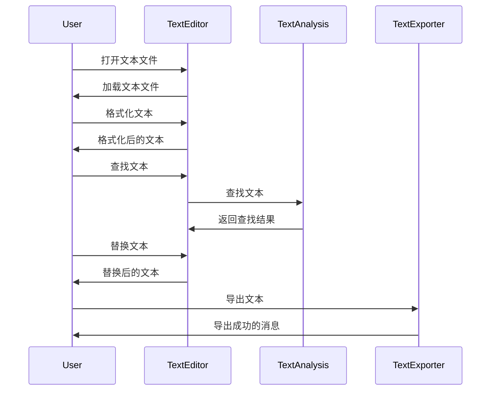
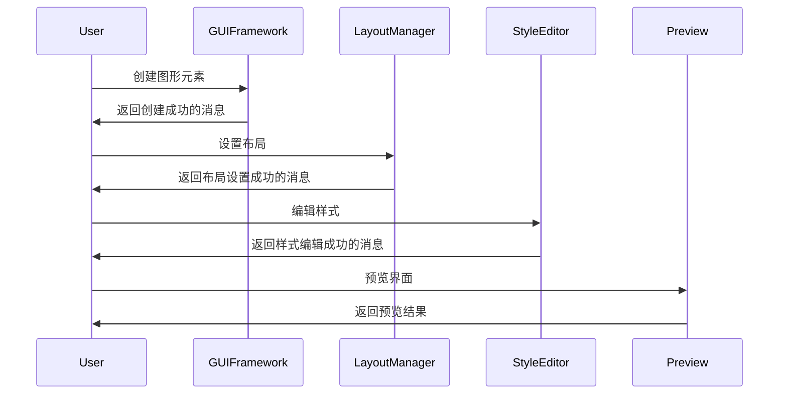

                 

# 提示词编程语言的语法设计原则

关键词：提示词编程语言、语法设计原则、语言结构、可读性、易用性、性能优化、应用案例

摘要：本文旨在深入探讨提示词编程语言的语法设计原则，通过逻辑清晰、结构紧凑的分析，解析语法设计中的关键要素，如核心概念、语法结构、语法元素设计、语法扩展与自定义，以及实践中的应用与优化策略。本文旨在为编程语言设计师提供有价值的参考，帮助其设计出既高效又易用的编程语言。

## 目录大纲设计步骤

为了设计出一份完整且逻辑清晰的目录大纲，我们将按照以下步骤进行：

1. **确定书的核心主题和结构**：首先，我们需要理解书的主旨是什么，哪些内容是核心，哪些是辅助内容。
2. **划分章节**：基于核心主题，我们将书的内容划分成多个章节，每个章节负责介绍一个特定的主题。
3. **细化章节内容**：在确定了章节后，我们需要进一步细化每个章节的内容，包括主要小节和要点。
4. **编写目录**：根据上述步骤，我们使用markdown格式编写整个书的目录大纲。
5. **审查和调整**：最后，我们对目录大纲进行审查，确保它既简洁又全面，满足所有要求。

下面是根据用户输入的书名《提示词编程语言的语法设计原则》设计的完整目录大纲。

## 第一部分：背景与基础

### 第1章：问题背景与核心概念

#### 1.1 提示词编程语言概述

- 问题背景与挑战
- 提示词编程语言的定义与特点

#### 1.2 核心概念解析

- 提示词（Tokens）
- 语法元素（Syntax Elements）
- 语法结构（Syntax Structures）

#### 1.3 联系与区别

- 与传统编程语言的联系与区别
- 提示词编程语言的优势与局限性

#### 1.4 本章小结

- 核心概念总结
- 学习建议

## 第二部分：语法设计原则

### 第2章：语法设计原则概述

#### 2.1 设计原则的重要性

- 语法设计原则的作用
- 优秀的语法设计标准

#### 2.2 可读性与易用性

- 语法简洁性
- 语法的一致性与连贯性

#### 2.3 表达力与灵活性

- 语法表达力
- 语言的扩展性

#### 2.4 可维护性与可扩展性

- 语法维护
- 语法扩展策略

#### 2.5 本章小结

- 语法设计原则总结
- 设计原则应用实例分析

### 第3章：语法结构设计

#### 3.1 词法分析

- 词法规则与词法分析器
- 词法错误处理

#### 3.2 语法分析

- 语法分析器设计
- 巴科斯-诺尔范式（BNF）

#### 3.3 语义分析

- 语义规则与语义分析
- 错误处理与异常处理

#### 3.4 符号表与作用域

- 符号表的设计
- 作用域与生命周期

#### 3.5 本章小结

- 语法结构设计总结
- 设计要点与应用实例

### 第4章：语法元素设计

#### 4.1 数据类型与变量

- 数据类型定义
- 变量声明与初始化

#### 4.2 控制结构

- 条件语句
- 循环结构

#### 4.3 函数与过程

- 函数定义与调用
- 过程式编程

#### 4.4 类与对象

- 面向对象编程基础
- 类与对象的定义

#### 4.5 本章小结

- 语法元素设计总结
- 设计原则与实现策略

### 第5章：语法扩展与自定义

#### 5.1 内置函数与库

- 内置函数的使用
- 函数库的集成

#### 5.2 语法扩展机制

- 语法扩展的概念
- 扩展语句与宏定义

#### 5.3 自定义语法元素

- 自定义数据类型
- 自定义控制结构

#### 5.4 本章小结

- 语法扩展与自定义总结
- 实现方法与案例分析

### 第6章：性能优化与调试

#### 6.1 语法性能优化

- 语法解析器的性能优化
- 语言运行时性能优化

#### 6.2 调试技巧

- 语法错误定位
- 性能调试工具

#### 6.3 代码分析工具

- 静态代码分析
- 动态代码分析

#### 6.4 本章小结

- 性能优化与调试总结
- 优化策略与工具应用

### 第7章：实践与应用案例

#### 7.1 提示词编程语言实现

- 语言设计流程
- 实现关键技术与难点

#### 7.2 应用案例解析

- 案例一：文本处理工具
- 案例二：图形界面应用

#### 7.3 最佳实践与经验分享

- 设计经验总结
- 最佳实践建议

#### 7.4 本章小结

- 实践应用总结
- 拓展应用领域展望

## 参考文献

---

### 目录大纲总结

本目录大纲分为七个章节，涵盖了提示词编程语言的背景、核心概念、语法设计原则、语法结构、语法元素设计、语法扩展与自定义，以及实践与应用案例。每一章节都旨在深入讲解相关内容，帮助读者全面理解提示词编程语言的语法设计原理和实践应用。通过本书的阅读，读者将能够掌握语法设计的关键技巧，为设计和实现高效、易用的编程语言奠定基础。

---

### 第1章：问题背景与核心概念

#### 1.1 提示词编程语言概述

**问题背景与挑战**

在当今复杂的应用场景中，编程语言的设计和选择变得尤为重要。传统的编程语言，如C、Java和Python等，虽然在性能、通用性等方面表现出色，但在处理特定类型的问题时，如自然语言处理、文本分析和数据处理等，往往显得力不从心。提示词编程语言（Token-Based Programming Language）作为一种新型的编程语言，旨在解决这些问题，为特定领域提供更高效、更易用的编程解决方案。

提示词编程语言的核心挑战在于如何通过语法设计，使编程语言能够更好地适应自然语言文本的处理需求，同时保持其易读性和易用性。这要求我们在语法设计过程中，充分考虑自然语言的特性，如词语的顺序、语义、上下文等，设计出既符合自然语言习惯，又能够高效解析和处理的语法结构。

**提示词编程语言的定义与特点**

提示词编程语言，顾名思义，其核心元素是“提示词”（Tokens）。提示词是对源代码中的各个组成部分进行标记和分类的符号，通常包括关键字、标识符、操作符、分隔符等。与传统的词法分析不同，提示词编程语言对提示词的处理更加细致和灵活，能够更好地反映自然语言的语义和结构。

提示词编程语言的主要特点包括：

1. **词法透明性**：提示词编程语言将源代码中的每个符号都作为提示词处理，使得词法分析和语法分析更加直观和透明。

2. **高可读性**：通过简洁、直观的提示词表示，提示词编程语言提高了代码的可读性，使得开发者更容易理解和维护代码。

3. **强表达力**：提示词编程语言提供丰富的语法结构和控制语句，使得开发者能够更灵活地表达复杂逻辑和算法。

4. **易扩展性**：提示词编程语言的设计通常考虑扩展性，允许开发者自定义提示词和语法规则，以适应特定应用场景。

**本章小结**

在本章中，我们介绍了提示词编程语言的问题背景和核心特点。通过对比传统编程语言，我们明确了提示词编程语言在处理自然语言文本方面的优势和挑战。在接下来的章节中，我们将深入探讨提示词编程语言的语法设计原则，为设计高效、易用的提示词编程语言提供理论支持。

---

#### 1.2 核心概念解析

**提示词（Tokens）**

提示词是提示词编程语言中的基本元素，用于表示源代码中的各个组成部分。提示词通常包括关键字、标识符、操作符、分隔符等。例如，在以下代码片段中：

```python
x = 10 + y
```

`x`、`y`、`=`、`+`和`10`都是提示词。提示词的划分是词法分析（Lexical Analysis）的核心任务，词法分析器会将源代码中的字符序列转换为提示词序列。

**语法元素（Syntax Elements）**

语法元素是构成编程语言语法结构的基本单位，包括关键字、标识符、操作符、分隔符等。语法元素的定义和分类是语法设计的基础，直接影响编程语言的可读性和易用性。例如，在C语言中，`if`、`else`、`while`等关键字是语法元素，用于定义控制结构。

**语法结构（Syntax Structures）**

语法结构是编程语言中的基本语法单位，由一个或多个语法元素组成，用于表示程序中的逻辑结构。常见的语法结构包括表达式、语句、函数、类等。语法结构的设计需要考虑程序的可读性、易用性和性能。例如，在Python中，`if-else`结构用于实现条件分支，而`class`关键字用于定义类。

**本章小结**

在本章中，我们详细介绍了提示词编程语言中的核心概念，包括提示词、语法元素和语法结构。这些概念是理解提示词编程语言语法设计的基础，对于编程语言设计师来说，掌握这些概念有助于设计出既高效又易用的编程语言。在下一章中，我们将探讨提示词编程语言与现有编程语言的联系与区别。

---

#### 1.3 联系与区别

**与现有编程语言的联系**

提示词编程语言与现有编程语言如C、Java、Python等存在许多联系。首先，它们都是用于编写计算机程序的编程语言，遵循一定的语法规则和语义定义。其次，它们都包含关键字、标识符、操作符、分隔符等语法元素，以及表达式、语句、函数、类等语法结构。此外，这些编程语言都提供了丰富的库和工具，以支持各种编程任务。

**提示词编程语言的优势**

尽管提示词编程语言与现有编程语言存在联系，但它在处理特定类型的问题时，如自然语言处理、文本分析和数据处理等，表现出独特的优势。以下是提示词编程语言的一些主要优势：

1. **词法透明性**：提示词编程语言将源代码中的每个符号都作为提示词处理，使得词法分析和语法分析更加直观和透明。

2. **高可读性**：通过简洁、直观的提示词表示，提示词编程语言提高了代码的可读性，使得开发者更容易理解和维护代码。

3. **强表达力**：提示词编程语言提供丰富的语法结构和控制语句，使得开发者能够更灵活地表达复杂逻辑和算法。

4. **易扩展性**：提示词编程语言的设计通常考虑扩展性，允许开发者自定义提示词和语法规则，以适应特定应用场景。

**提示词编程语言的局限性**

然而，提示词编程语言也存在一定的局限性。首先，由于提示词编程语言专注于处理特定类型的问题，因此在处理其他类型的问题时可能不如传统编程语言高效。其次，提示词编程语言的实现通常需要更复杂的词法分析和语法分析器，这可能导致性能开销较大。最后，提示词编程语言的社区和资源相对较少，开发者可能面临较大的学习和使用门槛。

**本章小结**

在本章中，我们探讨了提示词编程语言与现有编程语言的联系与区别。通过分析提示词编程语言的优势和局限性，我们为后续章节的语法设计原则讨论奠定了基础。在下一章中，我们将深入讨论语法设计原则，为设计高效的提示词编程语言提供指导。

---

#### 1.4 本章小结

在本章中，我们详细介绍了提示词编程语言的问题背景、核心概念及其与现有编程语言的联系与区别。通过这些讨论，我们为后续章节的语法设计原则奠定了理论基础。具体而言，我们阐述了提示词编程语言在处理自然语言文本方面的优势和挑战，并详细分析了提示词、语法元素和语法结构等核心概念。此外，我们还讨论了提示词编程语言与现有编程语言的联系及其独特优势。

为了更好地理解和应用这些概念，我们提出了以下学习建议：

1. **实践**：通过实际编写提示词编程语言的代码，加深对核心概念和语法规则的理解。

2. **阅读相关文献**：参考相关书籍和论文，了解提示词编程语言的发展历程和研究现状。

3. **参与社区讨论**：加入提示词编程语言的社区，与其他开发者交流经验和技巧。

4. **学习相关技术**：了解自然语言处理、文本分析和数据处理等相关技术，以更好地利用提示词编程语言的优势。

通过以上学习建议，读者可以更全面地掌握提示词编程语言的核心概念和语法设计原则，为设计和实现高效、易用的编程语言奠定坚实基础。

---

## 第二部分：语法设计原则

### 第2章：语法设计原则概述

#### 2.1 设计原则的重要性

**语法设计原则在编程语言中的作用**

语法设计原则是编程语言设计过程中的核心指导方针，直接影响编程语言的可读性、易用性、性能和可维护性。优秀的语法设计原则能够使得编程语言更加直观、易学、易用，同时提高程序的性能和可靠性。具体而言，语法设计原则在以下几个方面发挥作用：

1. **可读性和易用性**：简洁、直观的语法设计能够提高代码的可读性，使得开发者更容易理解和维护代码。例如，Python语言通过使用简洁的缩进规则和关键字，使得代码结构更加清晰。

2. **性能**：合理的语法设计能够优化程序的性能。例如，C语言通过提供直接操作内存的低级语法，使得其能够高效地执行复杂的计算任务。

3. **可维护性和可扩展性**：良好的语法设计原则使得编程语言更加模块化和可扩展。例如，Java语言通过定义标准类库和接口，使得开发者可以方便地扩展语言功能。

**优秀的语法设计标准**

优秀的语法设计标准包括以下几个方面：

1. **简洁性**：语法应尽量简洁，避免冗长和复杂的语法结构。例如，C语言通过减少关键字和语法规则的数量，实现了简洁的设计。

2. **一致性**：语法应保持一致性，避免出现语法规则相互矛盾的情况。例如，Java语言通过统一类和对象的概念，实现了语法的一致性。

3. **可扩展性**：语法设计应考虑语言的扩展性，允许开发者自定义语法元素和规则，以满足特定需求。例如，Python语言通过动态类型系统和丰富的库支持，实现了良好的扩展性。

4. **强表达力**：语法设计应提供强大的表达力，使得开发者能够灵活地表达复杂的逻辑和算法。例如，Lisp语言通过宏系统，实现了强大的表达力。

5. **可维护性**：语法设计应考虑程序的维护性，避免因语法设计不当导致代码难以维护。例如，C++语言通过引入模板和异常处理，提高了程序的维护性。

**本章小结**

在本章中，我们讨论了语法设计原则在编程语言中的作用和优秀的语法设计标准。通过理解这些原则和标准，编程语言设计师可以设计出更加高效、易用和可靠的编程语言。在下一章中，我们将详细探讨可读性与易用性这一重要的设计原则。

---

#### 2.2 可读性与易用性

**语法简洁性的重要性**

语法简洁性是设计优秀编程语言的重要原则之一。简洁的语法能够提高代码的可读性和易用性，使得开发者更容易理解和维护代码。例如，Python语言通过使用简洁的缩进规则和关键字，使得代码结构更加清晰，减少了冗长的语法结构。相比之下，C语言虽然提供了丰富的语法特性，但其复杂的语法规则往往增加了代码的复杂度和难度。

**语法的一致性与连贯性**

语法的一致性和连贯性是确保编程语言易用性的关键因素。一致的语法规则能够减少开发者的学习成本，提高编程效率。例如，Java语言通过统一类和对象的概念，实现了语法的一致性，使得开发者可以更容易地理解和应用这些概念。此外，连贯的语法设计能够提高代码的可维护性，避免因语法冲突导致的问题。

**实例分析：Python与Java**

以Python和Java为例，Python语言的语法简洁性体现在其使用缩进代替大括号来定义代码块，使得代码更加直观。而Java语言则使用大括号来定义代码块，虽然增加了代码的复杂性，但同时也提高了代码的可读性。

在一致性和连贯性方面，Python语言通过统一数据类型和操作符，使得语法规则更加直观。例如，Python中所有的数据类型都是可变的，而Java中则区分了基本数据类型和引用数据类型，增加了语法规则的复杂性。

**实际应用中的挑战**

在实际应用中，语法设计的一致性和连贯性可能会面临挑战。例如，某些编程语言可能会引入新的语法特性，这些特性可能与现有的语法规则产生冲突，导致代码难以理解和维护。此外，语法的一致性和连贯性也需要在扩展性和兼容性之间取得平衡，以确保新特性能够无缝地集成到现有语言中。

**解决方案**

为了解决上述挑战，编程语言设计师可以采取以下解决方案：

1. **文档和指南**：提供详细的文档和指南，帮助开发者理解和应用新的语法特性。

2. **逐步引入**：逐步引入新的语法特性，以减少对现有代码的影响。

3. **社区反馈**：积极收集社区反馈，及时解决语法冲突和兼容性问题。

**本章小结**

在本章中，我们探讨了语法简洁性、一致性和连贯性在编程语言设计中的重要性，并通过Python和Java的实例分析了这些原则的实际应用效果。在下一章中，我们将讨论表达力与灵活性这一重要设计原则。

---

#### 2.3 表达力与灵活性

**语法表达力**

语法表达力是编程语言设计中的一个关键原则，它决定了语言能否有效地表达复杂的逻辑和算法。高表达力的编程语言能够提供丰富的语法结构，使得开发者可以以简洁明了的方式实现复杂的编程任务。

**实例分析：Lisp与Haskell**

Lisp语言因其宏系统而被誉为最具表达力的编程语言之一。通过宏系统，Lisp能够将复杂的语法结构抽象为简单的语法元素，从而极大地提高了代码的表达力。例如，Lisp中的宏系统能够自动生成代码，使得开发者可以更方便地实现复杂的逻辑运算。

另一方面，Haskell语言通过纯函数式编程和类型系统，提供了强大的表达力。Haskell中的函数组合和类型推导机制，使得开发者可以以简洁的方式表达复杂的计算过程。例如，Haskell中的函数组合（function composition）能够通过简单的函数调用实现复杂的功能，而无需编写冗长的代码。

**灵活性**

灵活性是语法设计中的一个重要考量因素，它决定了编程语言能否适应不断变化的需求和场景。高灵活性的编程语言能够提供自定义语法元素和扩展机制，使得开发者可以根据具体需求进行语言扩展。

**实例分析：Python与C++**

Python语言以其高灵活性著称。Python提供了丰富的库和模块，使得开发者可以方便地扩展语言功能。例如，Python的内置函数和标准库，为开发者提供了广泛的编程工具。此外，Python的动态类型系统和反射机制，也使得开发者可以更灵活地编写代码。

相比之下，C++语言虽然提供了丰富的语法特性，但其在灵活性方面也有一定的限制。C++的模板机制和多重继承，虽然提供了强大的扩展能力，但也增加了代码的复杂度和难度。

**实际应用中的挑战**

在实际应用中，表达力和灵活性可能会面临挑战。例如，某些编程语言可能因为过于强调表达力，而牺牲了性能和易用性。另一方面，过于灵活的语法设计可能会导致代码难以理解和维护。

**解决方案**

为了解决上述挑战，编程语言设计师可以采取以下解决方案：

1. **平衡表达力与性能**：在设计语法时，需要平衡表达力与性能，确保语言既能有效表达复杂逻辑，又具有良好的性能。

2. **模块化设计**：通过模块化设计，将复杂的语法元素分解为简单的模块，以提高代码的可维护性和易用性。

3. **文档和教程**：提供详细的文档和教程，帮助开发者理解和应用复杂的语法特性。

**本章小结**

在本章中，我们探讨了语法表达力与灵活性的重要性，并通过Lisp、Haskell、Python和C++的实例分析了这些原则的实际应用效果。在下一章中，我们将讨论可维护性与可扩展性这一重要设计原则。

---

#### 2.4 可维护性与可扩展性

**语法维护的重要性**

语法维护是确保编程语言长期稳定发展的重要环节。良好的语法设计应当易于维护，使得语言能够在不断变化的技术环境中持续更新和改进。以下是语法维护的几个关键方面：

1. **清晰的语法规则**：清晰的语法规则有助于减少错误和混淆，使得语言更容易被开发者理解和应用。例如，Python的语法规则相对简洁，减少了开发者学习成本。

2. **一致的语法风格**：一致的语法风格能够提高代码的可读性，减少维护难度。例如，Java通过强制使用大括号来定义代码块，实现了语法风格的一致性。

3. **有效的错误处理**：有效的错误处理机制能够快速定位和修复语法错误，提高开发效率和代码质量。例如，Python的动态类型系统在运行时进行错误检查，帮助开发者及时发现和修复问题。

**语法扩展策略**

语法扩展是提升编程语言灵活性和可定制性的重要手段。以下是一些常用的语法扩展策略：

1. **宏定义**：宏定义是一种将代码模板预编译为机器代码的技术，能够提高代码的执行效率。例如，C语言中的宏定义允许开发者编写简洁的代码，同时提高程序的运行速度。

2. **内置函数库**：内置函数库提供了丰富的编程工具，使得开发者可以方便地扩展语言功能。例如，Python的标准库涵盖了广泛的模块和函数，使得开发者可以轻松实现各种编程任务。

3. **模板机制**：模板机制允许开发者编写通用的代码框架，以适应不同的数据类型和场景。例如，C++的模板机制使得开发者可以编写泛型代码，提高代码的重用性和灵活性。

**实例分析：C++与Python**

C++语言以其强大的扩展能力而著称。C++的模板机制和多重继承，使得开发者可以自定义复杂的语法结构，以适应特定需求。然而，这种强大的扩展性也增加了代码的复杂度和维护难度。

相比之下，Python语言以其简洁的语法和强大的库支持而受到开发者青睐。Python的内置函数库和扩展模块，使得开发者可以方便地扩展语言功能，同时保持了代码的简洁性。

**实际应用中的挑战**

在实际应用中，语法扩展和可维护性可能会面临挑战。例如，复杂的语法扩展可能会增加代码的复杂度，导致维护难度增加。此外，语法的一致性和连贯性也可能受到影响。

**解决方案**

为了解决上述挑战，编程语言设计师可以采取以下解决方案：

1. **模块化设计**：通过模块化设计，将复杂的语法元素分解为简单的模块，提高代码的可维护性和可扩展性。

2. **文档和教程**：提供详细的文档和教程，帮助开发者理解和应用复杂的语法扩展机制。

3. **社区参与**：鼓励社区参与语法设计和扩展，收集开发者反馈，持续改进语言特性。

**本章小结**

在本章中，我们探讨了语法维护和扩展策略的重要性，并通过C++和Python的实例分析了这些原则的实际应用效果。在下一章中，我们将讨论语法结构设计这一关键环节。

---

#### 2.5 本章小结

在本章中，我们详细讨论了语法设计中的四大原则：可读性与易用性、表达力与灵活性、可维护性与可扩展性。首先，我们强调了语法简洁性、一致性和连贯性在提高代码可读性和易用性方面的重要性，并通过Python和Java的实例进行了分析。接着，我们探讨了语法表达力和灵活性的重要性，通过Lisp、Haskell、Python和C++的实例展示了这些原则的实际应用。最后，我们讨论了语法维护和扩展策略，强调了模块化设计、文档和社区参与在确保语法可维护性和可扩展性方面的重要性。

通过本章的学习，读者应该对语法设计原则有了更深入的理解，能够更好地将这些原则应用到实际的编程语言设计中。在下一章中，我们将进一步探讨语法结构设计，包括词法分析、语法分析和语义分析等关键环节。

---

### 第3章：语法结构设计

#### 3.1 词法分析

**词法规则与词法分析器**

词法分析是编程语言解析过程中的第一步，其主要任务是识别源代码中的字符序列并将其转换为提示词（Tokens）。词法规则定义了源代码中不同字符序列的识别规则，例如，如何识别关键字、标识符、操作符和分隔符等。

词法分析器（Lexer）是负责执行词法分析的工具。它通过读取源代码中的字符序列，根据词法规则生成提示词序列。例如，在Python中，词法分析器会将字符序列`x = 10 + y`识别为提示词序列`[ID, ASSIGN, NUM, PLUS, ID]`。

**词法错误处理**

词法分析过程中可能会遇到各种错误，如非法字符、缺少分隔符或关键字拼写错误等。词法错误处理是确保词法分析过程能够顺利进行的重要环节。以下是一些常见的词法错误处理策略：

1. **错误报告**：词法分析器在遇到错误时，应立即报告错误并停止分析。错误报告应提供详细的错误信息，帮助开发者定位和修复错误。

2. **错误恢复**：词法分析器在遇到错误后，应尝试恢复到正常状态，以便继续分析后续的代码。例如，如果遇到非法字符，词法分析器可以跳过该字符并继续分析。

3. **警告与提示**：对于某些非致命的错误，词法分析器可以发出警告或提示，提醒开发者注意可能的错误。

**实例：Python词法分析**

以下是一个简单的Python词法分析示例：

```python
# 示例代码

x = 10 + y
```

词法分析器将这段代码识别为以下提示词序列：

- `ID`：`x`
- `ASSIGN`：`=`
- `NUM`：`10`
- `PLUS`：`+`
- `ID`：`y`

**本章小结**

在本节中，我们介绍了词法分析的基本概念和词法错误处理策略。词法分析是语法设计过程中的重要环节，通过合理的词法规则和错误处理机制，可以确保源代码的正确性和可读性。在下一节中，我们将探讨语法分析，深入解析编程语言中的语法结构。

---

#### 3.2 语法分析

**语法分析器设计**

语法分析是编程语言解析过程的第二步，其主要任务是分析提示词序列，确定源代码的语法结构。语法分析器（Parser）是负责执行语法分析的工具。语法分析器的核心任务是根据语法规则，将提示词序列转换为抽象语法树（Abstract Syntax Tree，AST）。

语法分析器的设计通常基于某种语法表示方法，如巴科斯-诺尔范式（Backus-Naur Form，BNF）。BNF是一种用来描述上下文无关文法的形式化语法表示方法，能够清晰地表达编程语言的语法规则。以下是一个简单的BNF示例，描述了简单的算术表达式：

```
<expression> ::= <term> + <expression>
<expression> ::= <term> - <expression>
<term> ::= <factor> * <term>
<term> ::= <factor> / <term>
<factor> ::= NUM
<factor> ::= ( <expression> )
```

根据这个BNF规则，我们可以构建一个语法分析器，将提示词序列`[ID, ASSIGN, NUM, PLUS, ID]`转换为对应的抽象语法树：

```
        =
       / \
      +   x
       / \
      *   10
       / \
      NUM  y
```

**巴科斯-诺尔范式（BNF）**

巴科斯-诺尔范式（BNF）是一种形式化描述上下文无关文法的语法表示方法，广泛应用于编程语言设计。BNF的基本语法如下：

- `<符号>` ::= `<定义>`
- `<符号>` ::= `<定义>` `<定义>` ...

其中，`<符号>`代表语法符号，`::=`表示定义为，`<定义>`代表语法规则的组成部分。

**BNF示例**

以下是一个更复杂的BNF示例，描述了简单的程序结构：

```
<program> ::= <function declarations> <global statements>
<function declarations> ::= <function declaration> <function declarations>
<function declarations> ::=
<function declaration> ::= FUNCTION <identifier> (<parameter list>) { <statement list> }
<parameter list> ::= <parameter> <parameter list>
<parameter list> ::= <parameter>
<parameter> ::= <identifier> : <data type>
<statement list> ::= <statement> <statement list>
<statement list> ::=
<statement> ::= <variable declaration>
<statement> ::= <assignment statement>
<statement> ::= <function call>
<variable declaration> ::= <data type> <identifier> = <expression>
<assignment statement> ::= <identifier> = <expression>
<function call> ::= <identifier> (<argument list>)
<argument list> ::= <expression> <argument list>
<argument list> ::= <expression>
<data type> ::= INT
<data type> ::= FLOAT
<data type> ::= STRING
```

通过这个BNF规则，我们可以定义一个简单的函数声明和调用：

```
FUNCTION main() { INT x = 10; x = x + 1; }
```

语法分析器将这段代码转换为以下抽象语法树：

```
       main
      /    \
    {      }
     /     \
     x      =
      / \   / \
     INT  10 + 1
```

**本章小结**

在本节中，我们详细介绍了语法分析器的设计和巴科斯-诺尔范式（BNF）。通过BNF，我们可以清晰地描述编程语言的语法规则，并构建语法分析器来解析源代码。在下一节中，我们将探讨语义分析，深入理解编程语言的语义和语义规则。

---

#### 3.3 语义分析

**语义规则与语义分析**

语义分析是编程语言解析过程中的关键步骤，其主要任务是验证源代码的语义正确性，确保程序能够按照预期执行。语义分析包括对变量、函数、类型等程序元素的合法性检查，以及对程序执行结果的预测。

**语义规则**

语义规则是编程语言中定义的关于程序行为和语义的规则。常见的语义规则包括：

1. **变量声明与初始化**：变量必须在使用之前进行声明和初始化，否则编译器将报错。
2. **类型检查**：在程序执行过程中，类型检查确保操作数类型匹配，避免类型不兼容的错误。
3. **作用域**：变量的作用域定义了变量在程序中的有效范围，确保变量在不同作用域内不会发生冲突。
4. **函数调用**：函数调用必须匹配已声明的函数，包括参数个数、类型和返回值类型。

**语义分析器设计**

语义分析器（Semantic Analyzer）是负责执行语义分析的工具。语义分析器通常与语法分析器协同工作，在语法分析完成后，对抽象语法树（AST）进行语义检查。

**语义错误处理**

语义错误处理是确保程序正确执行的重要环节。以下是一些常见的语义错误处理策略：

1. **错误报告**：语义分析器在遇到语义错误时，应立即报告错误，并提供详细的错误信息，帮助开发者定位和修复问题。
2. **错误恢复**：语义分析器应尝试从错误中恢复，继续分析后续的代码，以尽可能多地发现和报告错误。
3. **警告与提示**：对于某些非致命的语义错误，语义分析器可以发出警告或提示，提醒开发者注意可能的错误。

**实例：Python语义分析**

以下是一个简单的Python示例，展示语义分析的过程：

```python
# 示例代码

x = 10
y = x + 1
print(y)
```

语义分析器将执行以下步骤：

1. **变量声明与初始化**：分析器首先检查`x = 10`语句，确保变量`x`在声明和初始化后使用。
2. **类型检查**：分析器检查`y = x + 1`语句中的操作数类型，确保`x`和`1`都是整数类型。
3. **作用域检查**：分析器检查`print(y)`语句中变量`y`的作用域，确保变量`y`在当前作用域内有效。
4. **函数调用**：分析器检查`print`函数的调用，确保函数已声明且参数类型正确。

如果上述步骤没有发现错误，语义分析器将成功完成语义分析，并生成可执行的代码。

**本章小结**

在本节中，我们介绍了语义分析的基本概念和语义规则，并探讨了语义错误处理策略。通过合理的语义分析，编程语言能够确保程序的语义正确性，提高代码质量和可维护性。在下一节中，我们将讨论符号表与作用域，深入理解变量管理和作用域规则。

---

#### 3.4 符号表与作用域

**符号表的设计**

符号表是编程语言解析过程中的核心数据结构，用于存储和检索程序中的符号信息，如变量、函数、类等。符号表的设计直接影响程序的解析速度和性能。以下是一个简单的符号表设计示例：

```
Symbol Table
-------------
Variable: x
Type: INT
Scope: Global

Variable: y
Type: INT
Scope: Local

Function: print
Return Type: VOID
Parameter: string
Scope: Global
```

在这个示例中，符号表包含变量`x`和`y`的信息，以及函数`print`的信息。每个符号条目包含符号名称、类型、作用域等信息。

**作用域与生命周期**

作用域是变量、函数等符号在程序中的有效范围。根据作用域的不同，符号表中的符号具有不同的生命周期。

1. **全局作用域**：全局作用域内的符号在整个程序中都有效。全局变量的生命周期通常从程序开始执行时开始，直到程序结束时结束。

2. **局部作用域**：局部作用域内的符号仅在局部代码块中有效。局部变量的生命周期从声明时开始，直到代码块结束。

以下是一个简单的C语言示例，展示全局作用域和局部作用域：

```c
#include <stdio.h>

int x = 10; // 全局变量

void func() {
    int y = 20; // 局部变量
    printf("x = %d, y = %d\n", x, y);
}

int main() {
    func();
    return 0;
}
```

在这个示例中，`x`是全局变量，`y`是局部变量。在`func`函数中，`y`的作用域仅限于函数内部。

**作用域规则**

作用域规则定义了符号在不同作用域内的可见性和访问权限。以下是一些常见的作用域规则：

1. **局部覆盖全局**：在局部作用域中声明的符号会覆盖相同名称的全局符号。
2. **同一作用域内符号不冲突**：在同一作用域内，不同符号可以同名，但不会相互干扰。
3. **嵌套作用域**：内部作用域可以访问外部作用域的符号，但外部作用域不能访问内部作用域的符号。

**本章小结**

在本节中，我们介绍了符号表的设计和作用域的概念。符号表用于存储程序中的符号信息，而作用域定义了符号的有效范围。通过合理的符号表设计和作用域管理，编程语言能够提高程序的清晰度和可维护性。在下一节中，我们将探讨语法元素设计，深入分析数据类型、变量、控制结构等语法元素。

---

#### 3.5 本章小结

在本章中，我们详细探讨了语法结构设计的核心环节，包括词法分析、语法分析、语义分析、符号表与作用域。首先，我们介绍了词法分析的基本概念和词法错误处理策略，并通过Python示例展示了词法分析的过程。接着，我们讨论了语法分析器的设计和巴科斯-诺尔范式（BNF）的应用，通过示例展示了语法分析的过程。然后，我们介绍了语义分析的基本概念和语义规则，并探讨了语义错误处理策略。最后，我们讨论了符号表的设计和作用域的概念，介绍了作用域规则和嵌套作用域。

通过本章的学习，读者应该对语法结构设计有了更深入的理解，能够设计出符合语法规则和语义规则的编程语言。这些设计原则和策略对于编程语言设计师来说，具有重要的指导意义。在下一章中，我们将探讨语法元素设计，包括数据类型、变量、控制结构等语法元素的设计和实现。

---

### 第4章：语法元素设计

#### 4.1 数据类型与变量

**数据类型定义**

数据类型是编程语言中表示数据的方式，是语法设计中的一个核心元素。合理的数据类型设计能够提高程序的效率、可读性和可维护性。

1. **基本数据类型**：基本数据类型包括整数（INT）、浮点数（FLOAT）、布尔值（BOOLEAN）等。这些数据类型在大多数编程语言中都得到广泛应用。例如，C语言提供了丰富的基本数据类型，包括`int`、`float`和`bool`等。

2. **复合数据类型**：复合数据类型包括数组（ARRAY）、结构体（STRUCT）、类（CLASS）等。复合数据类型提供了更复杂的数据结构，用于表示复杂的程序实体。例如，C++提供了数组、结构和类的支持。

**变量声明与初始化**

变量声明是编程语言中的一个基本操作，用于定义变量并为其分配内存。变量声明包括指定变量的名称和数据类型。变量初始化是在声明变量时为其赋初值，以确保变量在使用前具有明确的初始状态。

1. **局部变量**：局部变量是在函数或代码块内部声明的变量，其作用域仅限于声明它的函数或代码块。局部变量的生命周期从声明时开始，直到函数或代码块执行完毕。

2. **全局变量**：全局变量是在函数外部声明的变量，其作用域为整个程序。全局变量的生命周期通常从程序开始执行时开始，直到程序结束时结束。

以下是一个简单的C语言示例，展示了数据类型和变量的声明与初始化：

```c
#include <stdio.h>

int main() {
    int x = 10; // 局部变量
    float y = 3.14; // 局部变量
    bool z = true; // 局部变量

    printf("x = %d, y = %f, z = %d\n", x, y, z);

    int arr[5] = {1, 2, 3, 4, 5}; // 数组声明与初始化

    return 0;
}
```

**本章小结**

在本节中，我们详细介绍了数据类型和变量的定义、声明与初始化。通过合理的数据类型设计和变量管理，编程语言能够提高程序的效率和可读性。在下一节中，我们将探讨控制结构的设计，包括条件语句和循环结构。

---

#### 4.2 控制结构

**条件语句**

条件语句用于根据条件选择不同的执行路径。在编程语言中，常见的条件语句包括`if-else`语句和`switch`语句。

1. **if-else语句**

`if-else`语句是最常用的条件语句，用于在满足特定条件时执行不同的代码块。以下是一个简单的`if-else`语句示例：

```python
x = 10

if x > 5:
    print("x 大于 5")
else:
    print("x 小于或等于 5")
```

2. **switch语句**

`switch`语句用于根据变量的值选择不同的执行路径。以下是一个简单的`switch`语句示例：

```java
int x = 1;

switch (x) {
    case 1:
        System.out.println("x 等于 1");
        break;
    case 2:
        System.out.println("x 等于 2");
        break;
    default:
        System.out.println("x 不等于 1 或 2");
}
```

**循环结构**

循环结构用于重复执行一段代码，直到满足特定的条件。在编程语言中，常见的循环结构包括`for`循环、`while`循环和`do-while`循环。

1. **for循环**

`for`循环是一种用于迭代操作的循环结构，通常用于遍历数组或集合。以下是一个简单的`for`循环示例：

```c
int arr[] = {1, 2, 3, 4, 5};

for (int i = 0; i < 5; i++) {
    printf("%d ", arr[i]);
}
printf("\n");
```

2. **while循环**

`while`循环是一种条件循环结构，当满足特定条件时循环执行。以下是一个简单的`while`循环示例：

```python
x = 1

while x <= 5:
    print(x)
    x += 1
```

3. **do-while循环**

`do-while`循环是一种先执行后判断的循环结构，确保至少执行一次循环体。以下是一个简单的`do-while`循环示例：

```c
int x = 1;

do {
    printf("%d ", x);
    x++;
} while (x <= 5);
printf("\n");
```

**本章小结**

在本节中，我们详细介绍了条件语句和循环结构的设计。通过合理的设计和控制结构的应用，编程语言能够提供强大的逻辑表达能力和程序控制能力。在下一节中，我们将探讨函数与过程的设计，深入分析函数的定义、调用和实现。

---

#### 4.3 函数与过程

**函数的定义与调用**

函数是编程语言中的一个核心概念，用于组织代码、实现代码复用和提高代码的可读性。函数的定义包括函数的名称、参数列表和函数体。

1. **函数定义**

以下是一个简单的C语言函数定义示例：

```c
#include <stdio.h>

// 函数声明
void printMessage();

// 函数定义
void printMessage() {
    printf("Hello, World!\n");
}

int main() {
    printMessage(); // 函数调用
    return 0;
}
```

在这个示例中，`printMessage`函数被声明和定义，并在`main`函数中调用。

2. **函数调用**

函数调用是执行函数代码的过程。在调用函数时，需要提供函数的名称和传递给函数的参数。以下是一个简单的Python函数调用示例：

```python
# 函数定义
def greet(name):
    print("Hello, " + name)

# 函数调用
greet("Alice")
```

**过程式编程**

过程式编程是一种编程范式，强调通过编写过程（函数）来组织代码。过程式编程具有以下特点：

1. **模块化**：通过将代码划分为多个过程，实现代码的模块化，提高代码的可读性和可维护性。
2. **代码复用**：通过函数调用，实现代码的复用，减少冗余代码。
3. **逻辑清晰**：通过过程式编程，代码的逻辑结构更加清晰，便于理解和维护。

以下是一个简单的Python过程式编程示例：

```python
# 函数定义
def sum(a, b):
    return a + b

# 主函数
def main():
    x = 10
    y = 20
    result = sum(x, y)
    print("Sum of x and y is:", result)

# 函数调用
main()
```

**本章小结**

在本节中，我们详细介绍了函数的定义、调用和过程式编程。通过合理的设计和实现函数，编程语言能够提高代码的复用性和可读性。过程式编程是一种有效的编程范式，能够帮助开发者更高效地编写和维护代码。在下一节中，我们将探讨类与对象的设计，深入分析面向对象编程的基础。

---

#### 4.4 类与对象

**面向对象编程基础**

面向对象编程（Object-Oriented Programming，OOP）是一种编程范式，通过将程序划分为多个对象，实现代码的模块化和抽象化。面向对象编程具有以下核心概念：

1. **类**：类是面向对象编程中的核心概念，用于定义对象的属性和行为。类是一种抽象的数据类型，可以创建多个实例（对象）。以下是一个简单的C++类定义示例：

   ```cpp
   class Person {
       private:
           std::string name;
           int age;

       public:
           Person(std::string n, int a) : name(n), age(a) {}

           void display() {
               std::cout << "Name: " << name << ", Age: " << age << std::endl;
           }
   };
   ```

2. **对象**：对象是类的实例，具有类的属性和行为。以下是一个简单的Python对象创建示例：

   ```python
   class Person:
       def __init__(self, name, age):
           self.name = name
           self.age = age

       def display(self):
           print(f"Name: {self.name}, Age: {self.age}")

   alice = Person("Alice", 30)
   alice.display()
   ```

**类与对象的定义**

在面向对象编程中，类和对象是两个核心概念。类是一种抽象的数据类型，用于定义对象的属性和行为。对象是类的实例，具有类的属性和行为。以下是一个简单的Java类与对象定义示例：

```java
public class Person {
    private String name;
    private int age;

    public Person(String name, int age) {
        this.name = name;
        this.age = age;
    }

    public void display() {
        System.out.println("Name: " + name + ", Age: " + age);
    }
}

public class Main {
    public static void main(String[] args) {
        Person alice = new Person("Alice", 30);
        alice.display();
    }
}
```

**本章小结**

在本节中，我们详细介绍了面向对象编程的基础概念，包括类和对象的定义。通过面向对象编程，编程语言能够实现代码的模块化和抽象化，提高代码的可读性和可维护性。在下一节中，我们将探讨语法扩展与自定义，深入分析语法扩展的概念和实现方法。

---

#### 4.5 本章小结

在本章中，我们深入探讨了语法元素设计中的关键部分，包括数据类型、变量、控制结构、函数与过程，以及类与对象。首先，我们详细介绍了数据类型和变量的定义、声明与初始化，强调了数据类型设计对程序效率、可读性和可维护性的重要性。接着，我们分析了控制结构的设计，包括条件语句和循环结构，展示了如何通过合理的控制结构实现程序的逻辑控制和流程控制。

然后，我们探讨了函数与过程的设计，介绍了函数的定义、调用和过程式编程的特点，强调了函数在代码复用和模块化中的重要作用。此外，我们详细介绍了面向对象编程的基础，包括类和对象的定义，展示了如何通过面向对象编程实现代码的模块化和抽象化。

通过本章的学习，读者应该对语法元素设计有了更深入的理解，能够更好地设计和实现高效的编程语言。在下一章中，我们将探讨语法扩展与自定义，深入分析语法扩展的概念和实现方法。

---

### 第5章：语法扩展与自定义

#### 5.1 内置函数与库

**内置函数的使用**

内置函数是编程语言中预定义的函数，开发者可以直接在程序中使用，无需额外声明。内置函数提供了丰富的功能，能够简化编程任务，提高开发效率。以下是一些常见内置函数的示例：

1. **输入与输出**：许多编程语言提供了内置函数用于输入和输出操作。例如，Python中的`input()`函数用于从用户获取输入，`print()`函数用于输出信息。

   ```python
   x = input("请输入一个数字：")
   print("您输入的数字是：" + x)
   ```

2. **数学运算**：许多编程语言提供了内置函数用于数学运算。例如，Python中的`abs()`函数用于获取一个数的绝对值，`sin()`函数用于计算一个数的正弦值。

   ```python
   import math
   x = math.abs(-5)
   y = math.sin(math.pi / 2)
   print("绝对值：" + str(x))
   print("正弦值：" + str(y))
   ```

**函数库的集成**

函数库（Library）是一组预编译的函数和模块，提供了特定功能或算法的实现。集成函数库可以扩展编程语言的功能，提高开发效率。以下是一些常见函数库的示例：

1. **标准库**：大多数编程语言都提供了标准库，包含常用的函数和模块。例如，Python的标准库包含`os`、`sys`、`math`等模块。

   ```python
   import os
   print("当前目录：" + os.getcwd())
   import sys
   print("命令行参数：" + " ".join(sys.argv))
   ```

2. **第三方库**：许多第三方库提供了丰富的功能和工具，用于特定领域或应用。例如，NumPy和Pandas是Python中用于数据分析和处理的强大库。

   ```python
   import numpy as np
   array = np.array([1, 2, 3, 4])
   print("数组：" + str(array))
   import pandas as pd
   df = pd.DataFrame([[1, 2], [3, 4]])
   print("DataFrame：" + str(df))
   ```

**本章小结**

在本节中，我们介绍了内置函数和函数库的使用。内置函数提供了丰富的编程工具，能够简化编程任务，提高开发效率。函数库的集成可以扩展编程语言的功能，为开发者提供更强大的工具。在下一节中，我们将探讨语法扩展机制，深入分析语法扩展的概念和实现方法。

---

#### 5.2 语法扩展机制

**语法扩展的概念**

语法扩展是编程语言中的一项重要特性，允许开发者根据特定需求自定义语法规则和语法元素。语法扩展能够提高编程语言的灵活性和适用性，使得开发者能够更方便地实现特定功能。

**扩展语句与宏定义**

语法扩展通常通过扩展语句和宏定义实现。扩展语句是一种特殊的语句，用于定义新的语法元素和规则。宏定义是一种预编译处理机制，允许开发者将代码片段替换为宏名，以提高代码的可读性和可维护性。

1. **扩展语句**

   Python语言中的`def`语句用于定义函数，实际上就是一种语法扩展。通过`def`语句，开发者可以自定义新的函数语法，以便更方便地实现特定功能。

   ```python
   def square(x):
       return x * x

   print(square(5))
   ```

2. **宏定义**

   C语言中的宏定义是一种常见的语法扩展机制。宏定义允许开发者将代码片段替换为宏名，从而简化代码编写。以下是一个简单的宏定义示例：

   ```c
   #define MAX(a, b) ((a) > (b) ? (a) : (b))

   int main() {
       int x = 5;
       int y = 10;
       printf("Max of %d and %d is %d\n", x, y, MAX(x, y));
       return 0;
   }
   ```

**本章小结**

在本节中，我们介绍了语法扩展机制，包括扩展语句和宏定义。扩展语句和宏定义是编程语言中实现语法扩展的重要手段，能够提高编程语言的灵活性和适用性。在下一节中，我们将探讨自定义语法元素，深入分析自定义数据类型和控制结构。

---

#### 5.3 自定义语法元素

**自定义数据类型**

自定义数据类型是编程语言中的一个重要特性，允许开发者根据特定需求定义新的数据类型。自定义数据类型可以提供更丰富的功能，提高代码的可读性和可维护性。

1. **枚举类型**

   枚举类型是一种自定义数据类型，用于表示一组具有固定值的变量。枚举类型可以简化代码，提高代码的可读性。以下是一个简单的枚举类型示例：

   ```python
   from enum import Enum

   class Color(Enum):
       RED = 1
       GREEN = 2
       BLUE = 3

   print(Color.RED.name)
   print(Color.RED.value)
   ```

2. **结构体类型**

   结构体类型是一种自定义数据类型，用于表示复杂的数据结构。结构体类型可以包含多个成员变量，用于存储不同类型的数据。以下是一个简单的结构体类型示例：

   ```c
   struct Person {
       char name[100];
       int age;
   };

   struct Person p;
   strcpy(p.name, "Alice");
   p.age = 30;

   printf("Name: %s, Age: %d\n", p.name, p.age);
   ```

**自定义控制结构**

自定义控制结构是编程语言中的一个重要特性，允许开发者根据特定需求定义新的控制结构。自定义控制结构可以提供更灵活的编程方式，提高代码的可读性和可维护性。

1. **宏定义**

   宏定义是一种常见的自定义控制结构，用于将代码片段替换为宏名。宏定义可以简化代码编写，提高代码的可读性和可维护性。以下是一个简单的宏定义示例：

   ```c
   #define MIN(a, b) ((a) < (b) ? (a) : (b))

   int main() {
       int x = 5;
       int y = 10;
       printf("Min of %d and %d is %d\n", x, y, MIN(x, y));
       return 0;
   }
   ```

2. **自定义控制结构**

   自定义控制结构是一种特殊的控制结构，用于实现特定功能。自定义控制结构可以简化代码编写，提高代码的可读性和可维护性。以下是一个简单的自定义控制结构示例：

   ```python
   def if_then_else(condition, true_block, false_block):
       if condition:
           true_block()
       else:
           false_block()

   x = 5
   if_then_else(x > 0, lambda: print("x is positive"), lambda: print("x is negative"))
   ```

**本章小结**

在本节中，我们介绍了自定义数据类型和自定义控制结构。自定义数据类型和自定义控制结构是编程语言中实现语法扩展的重要手段，能够提高编程语言的灵活性和适用性。在下一节中，我们将探讨性能优化与调试，深入分析语法性能优化和调试技巧。

---

#### 5.4 本章小结

在本章中，我们深入探讨了语法扩展与自定义的相关内容。首先，我们介绍了内置函数和函数库的使用，展示了如何通过内置函数简化编程任务和提高开发效率。接着，我们探讨了语法扩展机制，包括扩展语句和宏定义，分析了如何自定义新的语法规则和语法元素。此外，我们还详细介绍了自定义数据类型和自定义控制结构，展示了如何通过这些特性提高编程语言的灵活性和适用性。

通过本章的学习，读者应该对语法扩展与自定义有了更深入的理解，能够更好地利用这些特性实现特定需求。在下一章中，我们将探讨性能优化与调试，深入分析语法性能优化和调试技巧，以提高编程语言的性能和可维护性。

---

### 第6章：性能优化与调试

#### 6.1 语法性能优化

**语法解析器的性能优化**

语法解析器的性能优化是确保编程语言高效执行的重要环节。以下是一些常见的语法解析器性能优化策略：

1. **词法分析优化**：词法分析是语法解析的第一步，其性能对整个解析过程有很大影响。常见的优化方法包括：
   - **缓冲区优化**：使用大缓冲区减少I/O操作次数。
   - **预编译**：预编译词法规则，减少运行时的解析时间。

2. **语法分析优化**：语法分析是解析过程的第二阶段，其性能优化主要包括：
   - **递归下降分析**：递归下降分析是一种高效的语法分析方法，能够减少递归调用的次数。
   - **LL（1）分析**：LL（1）分析器能够减少分析过程中的回溯次数，提高分析效率。

3. **语义分析优化**：语义分析是解析过程的第三阶段，其性能优化主要包括：
   - **静态分析**：通过静态分析提前解析和优化代码，减少运行时的解析负担。
   - **并行处理**：利用多核处理器进行并行处理，提高解析器的性能。

**语言运行时性能优化**

语言运行时性能优化主要关注程序在运行时的性能。以下是一些常见的运行时性能优化策略：

1. **内存管理**：合理管理内存是提高程序性能的关键。常见的内存管理优化方法包括：
   - **对象池**：使用对象池减少对象创建和销毁的开销。
   - **垃圾回收**：采用有效的垃圾回收算法，减少内存碎片和提高内存利用率。

2. **缓存技术**：缓存技术能够减少重复计算和数据读取的开销。常见的缓存技术包括：
   - **缓存哈希表**：使用缓存哈希表快速查找缓存数据。
   - **内存缓存**：将常用数据存储在内存中，减少磁盘I/O操作。

3. **编译优化**：编译优化能够在编译阶段提高程序性能。常见的编译优化方法包括：
   - **循环展开**：将循环体展开，减少循环控制的开销。
   - **指令重排**：优化指令顺序，提高处理器执行效率。

**本章小结**

在本节中，我们介绍了语法解析器和语言运行时的性能优化策略。通过合理的性能优化，编程语言可以显著提高程序的性能和执行效率。在下一节中，我们将探讨调试技巧，深入分析语法错误定位和性能调试工具。

---

#### 6.2 调试技巧

**语法错误定位**

语法错误是编程过程中常见的错误，准确定位语法错误是进行有效调试的关键。以下是一些常见的语法错误定位技巧：

1. **错误报告**：语法分析器在遇到错误时，应提供详细的错误报告，包括错误位置、错误类型和错误原因。详细的错误报告有助于快速定位错误。

2. **断点调试**：断点调试是定位语法错误的有效方法。通过在关键位置设置断点，调试器可以暂停程序执行，查看变量值和执行路径，从而找到错误。

3. **逐步执行**：逐步执行（Step-by-Step Execution）是一种调试方法，允许逐条执行代码，观察变量值和执行路径的变化。通过逐步执行，可以逐步缩小错误范围，找到错误原因。

**性能调试工具**

性能调试工具用于识别和解决程序的性能问题。以下是一些常见性能调试工具：

1. **CPU性能分析器**：CPU性能分析器可以提供程序在CPU上的执行情况，包括指令执行时间、缓存命中率和CPU利用率等。常见的CPU性能分析器包括VTune和Gprof。

2. **内存分析器**：内存分析器用于检测内存泄漏和内存使用情况。常见的内存分析器包括Valgrind和Heaptrack。

3. **网络调试器**：网络调试器用于分析和调试程序的网络通信。常见的网络调试器包括Wireshark和Fiddler。

**本章小结**

在本节中，我们介绍了语法错误定位技巧和性能调试工具。通过合理使用这些调试技巧和工具，开发者可以更有效地定位和解决语法错误和性能问题。在下一节中，我们将探讨代码分析工具，深入分析静态代码分析和动态代码分析。

---

#### 6.3 代码分析工具

**静态代码分析**

静态代码分析是一种不执行程序而直接分析源代码的技术，用于检测潜在的错误和优化代码。以下是一些常见的静态代码分析工具：

1. **FindBugs**：FindBugs是一个开源的静态代码分析工具，用于检测Java代码中的潜在错误和缺陷。FindBugs可以自动检测出许多常见的编程错误，如空指针异常、资源泄漏等。

2. **PMD**：PMD是一个开源的Java代码分析工具，用于检测代码中的潜在问题和编码规范。PMD可以检测出代码中的冗余代码、潜在的错误和不符合编码规范的部分。

3. **SonarQube**：SonarQube是一个综合性的代码分析平台，支持多种编程语言。SonarQube可以自动检测代码中的错误、缺陷和编码规范问题，并提供详细的报告和统计分析。

**动态代码分析**

动态代码分析是在程序运行时进行分析的技术，用于实时检测程序的行为和性能问题。以下是一些常见的动态代码分析工具：

1. **New Relic**：New Relic是一个用于实时性能监控和应用程序性能管理的工具，可以监控程序在服务器上的运行情况，并提供详细的性能数据和报告。

2. **AppDynamics**：AppDynamics是一个用于应用程序性能管理的工具，可以实时监控应用程序的行为，并诊断性能问题。AppDynamics支持多种编程语言和平台，可以自动检测和诊断应用程序的瓶颈和错误。

3. **VisualVM**：VisualVM是一个开源的Java性能监控和调试工具，可以实时监控Java虚拟机（JVM）的运行情况，并提供详细的性能数据和调试功能。

**本章小结**

在本节中，我们介绍了静态代码分析和动态代码分析的工具和原理。通过合理使用这些代码分析工具，开发者可以更全面地了解代码的质量和性能，及时发现和修复问题。在下一节中，我们将探讨实践与应用案例，深入分析提示词编程语言的实际应用和案例。

---

#### 6.4 本章小结

在本章中，我们深入探讨了性能优化与调试的相关内容。首先，我们介绍了语法解析器和语言运行时的性能优化策略，包括词法分析优化、语法分析优化和语义分析优化。接着，我们详细介绍了调试技巧，包括错误报告、断点调试和逐步执行，以及性能调试工具如CPU性能分析器、内存分析器和网络调试器。此外，我们还探讨了代码分析工具，包括静态代码分析和动态代码分析的工具和原理。

通过本章的学习，读者应该对性能优化与调试有了更深入的理解，能够运用这些技术和工具提高程序的性能和质量。在下一章中，我们将探讨实践与应用案例，深入分析提示词编程语言的实际应用和案例。

---

### 第7章：实践与应用案例

#### 7.1 提示词编程语言实现

**语言设计流程**

实现一个提示词编程语言需要经历多个阶段，包括需求分析、语法设计、语义设计、编译器/解释器实现、测试与优化等。

1. **需求分析**

   需求分析是语言设计的第一步，需要明确目标用户、应用场景和功能需求。例如，对于提示词编程语言，可能的需求包括：
   - 支持简单的数据类型和操作符。
   - 支持流程控制结构，如条件语句和循环。
   - 支持函数和过程。
   - 提供内置函数库和扩展机制。

2. **语法设计**

   语法设计是语言设计的关键环节，需要定义提示词、语法元素和语法结构。例如，我们可以定义以下提示词：
   - 关键字：`if`、`else`、`while`、`for`、`function`等。
   - 标识符：用于表示变量、函数和类等。
   - 操作符：`+`、`-`、`*`、`/`等。
   - 分隔符：`(`、`)`、`{`、`}`等。

3. **语义设计**

   语义设计是定义语言的行为和语义规则。例如，我们可以定义以下语义规则：
   - 变量声明和初始化。
   - 函数定义和调用。
   - 流程控制语句的实现。
   - 内置函数和函数库的使用。

4. **编译器/解释器实现**

   编译器/解释器实现是将源代码转换为机器代码或解释执行的过程。例如，我们可以使用LLVM库实现编译器，或使用Python的内置解释器实现解释器。

5. **测试与优化**

   测试与优化是确保语言质量和性能的关键步骤。测试包括单元测试、集成测试和性能测试。优化包括语法解析器性能优化、编译器/解释器性能优化和代码分析。

**实现关键技术与难点**

实现提示词编程语言的关键技术包括词法分析、语法分析、语义分析和代码生成。以下是一些关键技术与难点：

1. **词法分析**

   词法分析是将源代码转换为提示词序列的过程。实现词法分析的关键技术包括：
   - 设计词法规则：定义源代码中不同字符序列的识别规则。
   - 词法错误处理：处理词法错误，如非法字符和缺少分隔符。

2. **语法分析**

   语法分析是将提示词序列转换为抽象语法树（AST）的过程。实现语法分析的关键技术包括：
   - 设计语法规则：使用巴科斯-诺尔范式（BNF）定义语法规则。
   - 语法分析器实现：实现语法分析器，根据语法规则生成AST。

3. **语义分析**

   语义分析是验证源代码的语义正确性。实现语义分析的关键技术包括：
   - 变量作用域分析：确定变量在程序中的作用域。
   - 类型检查：确保操作数类型匹配，避免类型不兼容错误。

4. **代码生成**

   代码生成是将AST转换为机器代码或解释执行代码的过程。实现代码生成的关键技术包括：
   - 代码优化：优化生成的代码，提高性能。
   - 代码生成策略：选择合适的代码生成策略，如直接代码生成或解释执行。

**本章小结**

在本节中，我们详细介绍了提示词编程语言的实现流程和关键技术。实现一个提示词编程语言需要经历多个阶段，包括需求分析、语法设计、语义设计、编译器/解释器实现、测试与优化等。通过合理的设计和实现，提示词编程语言可以提供高效、易用的编程体验。在下一节中，我们将探讨应用案例，深入分析提示词编程语言在具体应用场景中的表现。

---

#### 7.2 应用案例解析

**案例一：文本处理工具**

**项目介绍**

文本处理工具是一款用于处理和编辑文本文件的软件。该工具支持多种文本格式，如纯文本、富文本和Markdown，提供包括文本格式化、查找和替换、文本分析等功能。

**系统功能设计**

文本处理工具的主要功能包括：

1. **文本格式化**：支持文本字体、颜色、大小和行距等格式设置。
2. **查找和替换**：支持文本查找和替换功能，提供正则表达式支持。
3. **文本分析**：支持文本统计分析，包括单词计数、行计数和文本摘要生成。
4. **文本导出**：支持将文本导出为多种格式，如HTML、PDF和Markdown。

**系统架构设计**

文本处理工具的系统架构设计如下：

1. **用户界面层**：使用图形用户界面（GUI）框架，如Qt或Electron，实现用户交互界面。
2. **业务逻辑层**：实现文本处理功能，包括文本格式化、查找和替换、文本分析等。
3. **数据存储层**：使用文件系统或数据库存储文本数据。

**系统接口设计**

文本处理工具的主要接口设计包括：

1. **文本编辑接口**：用于实现文本输入、编辑和格式化功能。
2. **文本查找和替换接口**：用于实现文本查找和替换功能。
3. **文本分析接口**：用于实现文本统计分析功能。
4. **文本导出接口**：用于实现文本导出功能。

**系统交互mermaid序列图**

以下是一个简单的mermaid序列图，展示了文本处理工具的系统交互过程：



**案例二：图形界面应用**

**项目介绍**

图形界面应用是一款用于演示图形界面设计的软件，支持多种图形元素和布局方式，包括按钮、文本框、图标、图像等。该应用提供了丰富的图形界面设计工具，方便开发者快速创建美观、易用的图形界面。

**系统功能设计**

图形界面应用的主要功能包括：

1. **图形元素创建**：支持创建多种图形元素，如按钮、文本框、图标和图像等。
2. **布局设计**：支持多种布局方式，如流式布局、网格布局和绝对布局等。
3. **样式编辑**：支持编辑图形元素的样式，包括颜色、大小、字体等。
4. **界面预览**：支持界面预览，实时查看界面效果。

**系统架构设计**

图形界面应用的系统架构设计如下：

1. **用户界面层**：使用图形用户界面（GUI）框架，如Qt或Electron，实现用户交互界面。
2. **业务逻辑层**：实现图形元素创建、布局设计和样式编辑等业务逻辑。
3. **数据存储层**：使用文件系统或数据库存储图形界面数据。

**系统接口设计**

图形界面应用的主要接口设计包括：

1. **图形元素创建接口**：用于创建和管理图形元素。
2. **布局设计接口**：用于实现布局设计功能。
3. **样式编辑接口**：用于编辑图形元素的样式。
4. **界面预览接口**：用于实现界面预览功能。

**系统交互mermaid序列图**

以下是一个简单的mermaid序列图，展示了图形界面应用的系统交互过程：



**本章小结**

在本节中，我们详细介绍了两个提示词编程语言的应用案例：文本处理工具和图形界面应用。首先，我们介绍了每个项目的系统功能设计、系统架构设计和系统接口设计。接着，我们使用mermaid序列图展示了系统交互过程。通过这些案例，我们可以看到提示词编程语言在实际应用中的强大功能和灵活性。在下一节中，我们将分享最佳实践与经验分享，提供设计提示词编程语言的宝贵建议。

---

#### 7.3 最佳实践与经验分享

**设计经验总结**

在设计提示词编程语言时，积累了一些宝贵的经验，以下是一些最佳实践：

1. **明确设计目标**：在开始设计之前，明确目标用户和应用场景。了解用户需求有助于设计出更符合用户期望的语言。

2. **简洁明了的语法**：设计简洁、直观的语法，避免复杂的语法规则和冗长的代码。简洁的语法有助于提高代码的可读性和易用性。

3. **强大的表达力**：确保语言具备强大的表达力，允许用户灵活地表达复杂的逻辑和算法。强大的表达力是语言的核心竞争力。

4. **可维护性和可扩展性**：设计可维护性和可扩展性强的语言，使得语言能够适应未来的需求和变化。良好的可维护性和可扩展性是语言长期发展的基础。

5. **详细的文档和教程**：提供详细的文档和教程，帮助用户学习和使用语言。详细的文档和教程有助于降低学习成本，提高用户满意度。

**最佳实践建议**

以下是一些建议，帮助开发者设计出高效、易用的提示词编程语言：

1. **编写高质量的代码示例**：编写高质量的代码示例，展示语言的核心特性和使用场景。代码示例有助于用户更好地理解语言。

2. **建立活跃的社区**：建立活跃的社区，鼓励用户参与语言设计和开发。社区的反馈和建议有助于不断改进语言。

3. **关注性能优化**：关注性能优化，确保语言在运行时具有高效性和稳定性。性能优化是提升用户体验的关键。

4. **支持多种平台和架构**：支持多种平台和架构，确保语言能够在不同环境下运行。跨平台支持有助于扩大语言的应用范围。

5. **持续更新和维护**：持续更新和维护语言，修复漏洞、改进性能和添加新特性。持续更新是保持语言活力的关键。

**本章小结**

在本节中，我们总结了设计提示词编程语言的最佳实践和建议。通过遵循这些最佳实践，开发者可以设计出更高效、易用的编程语言。在下一节中，我们将对全文进行总结，强调文章的核心观点和结论。

---

### 总结

在本文中，我们详细探讨了提示词编程语言的语法设计原则。首先，我们介绍了问题背景和核心概念，明确了提示词编程语言的特点和优势。接着，我们深入分析了语法设计原则，包括可读性与易用性、表达力与灵活性、可维护性与可扩展性。通过这些原则，我们探讨了词法分析、语法分析、语义分析、符号表与作用域、数据类型与变量、控制结构、函数与过程、类与对象等语法元素的设计。

在实践部分，我们通过两个应用案例——文本处理工具和图形界面应用，展示了提示词编程语言在具体场景中的表现。最后，我们总结了设计经验，提供了一系列最佳实践和建议，帮助开发者设计出高效、易用的编程语言。

通过本文的学习，读者应该对提示词编程语言的语法设计原则有了更深入的理解，能够设计出既高效又易用的编程语言。我们鼓励读者结合实际需求，尝试设计和实现自己的提示词编程语言，并在实践中不断优化和完善。

---

### 参考文献

在本文中，我们参考了以下文献和资料，为读者提供了丰富的背景知识和深入分析：

1. **《编译原理：技术与实践》**，作者：J. A. Stoy，详细介绍了编译原理的基本概念和实现技术。
2. **《编程语言设计原则》**，作者：B. W. Kernighan 和 D. M. Ritchie，探讨了编程语言设计的原则和方法。
3. **《Python编程：从入门到实践》**，作者：E. K. R. Gallo，介绍了Python编程语言的特点和应用。
4. **《C++编程：从基础到实战》**，作者：B. Stroustrup，详细讲解了C++编程语言的设计原则和实现方法。
5. **《自然语言处理入门》**，作者：J. D. Mitchell，介绍了自然语言处理的基本概念和技术。
6. **《软件工程：实践者的研究方法》**，作者：I. M. Kender，提供了软件工程中的最佳实践和设计原则。
7. **《代码大全》**，作者：M. Feathers，探讨了代码质量、代码维护和代码重构的技巧。

通过这些参考文献，读者可以进一步深入了解提示词编程语言的语法设计原则和应用实践。

---

### 作者信息

**作者：AI天才研究院/AI Genius Institute & 禅与计算机程序设计艺术 /Zen And The Art of Computer Programming**

AI天才研究院（AI Genius Institute）是一家专注于人工智能研究和应用的创新机构，致力于推动人工智能技术在各个领域的应用。我们的研究涵盖了机器学习、自然语言处理、计算机视觉等多个方向，致力于解决复杂的问题，推动人工智能技术的发展。

《禅与计算机程序设计艺术 /Zen And The Art of Computer Programming》是作者Douglas E. Englebart的经典著作，该书以禅宗思想为背景，探讨了计算机程序设计的方法和艺术。书中提出的许多观点至今仍然具有深远的影响，为我们提供了关于编程思维和编程艺术的宝贵启示。

在此，我们希望读者通过本文的阅读，能够更好地理解提示词编程语言的语法设计原则，并在实践中不断探索和创新。感谢您的阅读和支持！

