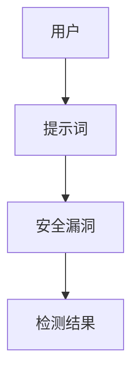
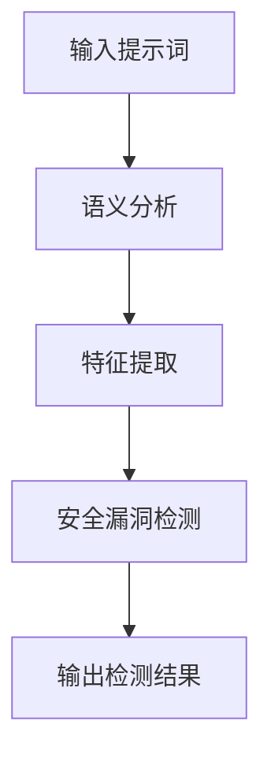
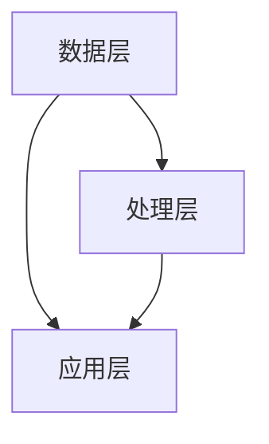
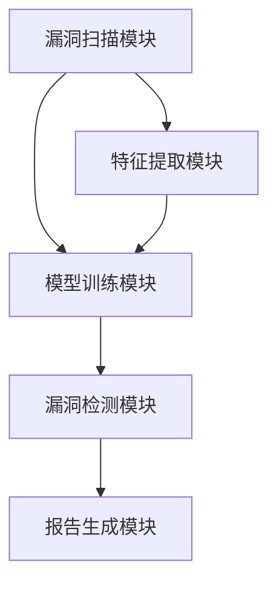

                 

# 提示词语言的安全漏洞检测工具

关键词：提示词语言、安全漏洞检测、语义分析、特征提取、算法设计

摘要：本文深入探讨了提示词语言在安全漏洞检测中的应用，分析了其理论基础和核心概念，并详细阐述了提示词语言安全漏洞检测的算法原理与实现。通过Python源代码示例，本文展示了算法的具体实现过程，并结合实际案例进行了详细剖析，旨在为安全漏洞检测领域提供一种新的思路和方法。

----------------------------------------------------------------

## 第一部分: 提示词语言的安全漏洞检测工具概述

### 第1章: 提示词语言与安全漏洞检测

#### 1.1 提示词语言概述

**1.1.1 提示词语言的定义**

提示词语言（Keyword-based Language）是一种基于关键词的文本分析技术，它通过识别和处理文本中的关键词来理解文本的含义。提示词语言通常用于自然语言处理（NLP）、文本分类、情感分析等领域。

**1.1.2 提示词语言的发展历程**

提示词语言的发展可以追溯到20世纪60年代，当时研究人员开始探索如何通过关键词来分析文本。随着计算机性能的提升和NLP技术的发展，提示词语言逐渐成为文本分析领域的重要工具。

**1.1.3 提示词语言的核心特点**

提示词语言的核心特点包括：

- 简单性：提示词语言通过识别文本中的关键词来进行分析，这种方法相对简单，易于实现。
- 高效性：提示词语言可以快速处理大量文本数据，具有较高的效率。
- 可扩展性：提示词语言可以根据不同的应用场景和需求，灵活地调整关键词的选取和处理方式。

#### 1.2 安全漏洞检测的重要性

**1.2.1 安全漏洞的危害**

安全漏洞（Security Vulnerabilities）是指计算机系统、软件或网络中存在的安全缺陷，黑客可以利用这些漏洞进行非法入侵、数据窃取、恶意攻击等。安全漏洞的危害包括：

- 数据泄露：黑客可以利用安全漏洞窃取敏感数据，导致商业秘密泄露、个人信息泄露等。
- 网络瘫痪：黑客可以通过安全漏洞控制网络设备，导致网络瘫痪，影响企业的正常运营。
- 经济损失：安全漏洞可能导致企业损失大量的资金，包括直接的经济损失和间接的经济损失。

**1.2.2 安全漏洞检测的必要性**

安全漏洞检测的必要性体现在以下几个方面：

- 提高安全性：通过检测和修复安全漏洞，可以降低系统被攻击的风险，提高整体安全性。
- 遵守法规：许多国家和地区都制定了相关的网络安全法规，要求企业对安全漏洞进行检测和修复。
- 降低成本：及时发现并修复安全漏洞可以避免因黑客攻击带来的经济损失。

**1.2.3 安全漏洞检测的现状**

当前，安全漏洞检测技术主要包括以下几种：

- 静态分析：通过对代码进行静态分析，检测代码中潜在的安全漏洞。
- 动态分析：通过运行程序，监控程序执行过程中的异常行为，检测潜在的安全漏洞。
- 漏洞库扫描：利用已知的漏洞库，对系统进行扫描，检测是否存在已知的漏洞。
- 人工智能与机器学习：利用人工智能和机器学习技术，对大量数据进行分析，识别潜在的安全漏洞。

#### 1.3 提示词语言在安全漏洞检测中的应用

**1.3.1 提示词语言与安全漏洞检测的关系**

提示词语言在安全漏洞检测中起到关键作用。通过识别和处理文本中的关键词，提示词语言可以快速定位安全漏洞的描述和相关信息，从而提高漏洞检测的效率和准确性。

**1.3.2 提示词语言在安全漏洞检测中的优势**

提示词语言在安全漏洞检测中的优势包括：

- 简单性：提示词语言的实现相对简单，可以快速应用于安全漏洞检测。
- 高效性：提示词语言可以快速处理大量文本数据，提高漏洞检测的效率。
- 可扩展性：提示词语言可以根据不同的应用场景和需求，灵活调整关键词的选取和处理方式。

**1.3.3 提示词语言在安全漏洞检测中的实际应用**

提示词语言在安全漏洞检测中的实际应用包括：

- 漏洞描述分类：通过识别和处理文本中的关键词，将漏洞描述分类为不同的类型，便于后续处理。
- 漏洞匹配：通过关键词匹配，快速定位系统中的潜在漏洞。
- 漏洞预测：利用提示词语言分析历史漏洞数据，预测未来可能出现的安全漏洞。

#### 1.4 本章小结

本章概述了提示词语言和安全漏洞检测的基本概念，阐述了提示词语言在安全漏洞检测中的应用和优势。在下一章中，我们将深入探讨提示词语言安全漏洞检测的理论基础，分析其核心概念和原理。

----------------------------------------------------------------

## 第二部分: 提示词语言安全漏洞检测的理论基础

### 第2章: 提示词语言安全漏洞检测的原理

#### 2.1 提示词语言的基本概念

**2.1.1 提示词语言的构成**

提示词语言由关键词、短语和句子等组成。关键词是文本中的核心词汇，它们能够表达文本的主要内容和意义。短语是由两个或多个关键词组成的词组，它们在文本中具有一定的语法和语义功能。句子是文本中的基本单位，它们通过语法和语义规则来表达完整的意思。

**2.1.2 提示词语言的分类**

提示词语言可以根据不同的分类标准进行分类，例如：

- 按照应用领域：可以分为自然语言处理提示词语言、机器翻译提示词语言、情感分析提示词语言等。
- 按照实现方式：可以分为基于规则提示词语言、基于机器学习提示词语言、基于深度学习提示词语言等。

**2.1.3 提示词语言的功能特性**

提示词语言具有以下功能特性：

- 文本理解：提示词语言能够通过识别和处理关键词来理解文本的含义，从而实现对文本内容的分析。
- 文本分类：提示词语言可以用于文本分类任务，将文本归类到不同的类别。
- 情感分析：提示词语言可以用于情感分析任务，判断文本的情感倾向。
- 主题识别：提示词语言可以用于主题识别任务，识别文本的主题和关键词。

#### 2.2 安全漏洞检测的核心概念

**2.2.1 安全漏洞的分类**

安全漏洞可以根据不同的分类标准进行分类，例如：

- 按照漏洞类型：可以分为漏洞利用漏洞、配置错误漏洞、设计缺陷漏洞等。
- 按照漏洞影响范围：可以分为局部漏洞、全局漏洞、关键漏洞等。
- 按照漏洞出现原因：可以分为代码漏洞、网络漏洞、操作系统漏洞等。

**2.2.2 安全漏洞的检测方法**

安全漏洞的检测方法包括：

- 静态分析：通过对代码进行静态分析，检测代码中潜在的安全漏洞。
- 动态分析：通过运行程序，监控程序执行过程中的异常行为，检测潜在的安全漏洞。
- 漏洞库扫描：利用已知的漏洞库，对系统进行扫描，检测是否存在已知的漏洞。
- 人工智能与机器学习：利用人工智能和机器学习技术，对大量数据进行分析，识别潜在的安全漏洞。

**2.2.3 安全漏洞的检测流程**

安全漏洞的检测流程通常包括以下步骤：

1. 数据收集：收集系统中的代码、配置文件、日志文件等数据。
2. 数据预处理：对收集到的数据进行清洗、去重、标准化等预处理操作。
3. 特征提取：从预处理后的数据中提取出与安全漏洞相关的特征。
4. 漏洞检测：利用检测算法对提取出的特征进行分析，检测是否存在安全漏洞。
5. 结果输出：输出检测结果，包括漏洞的名称、类型、影响范围等。

#### 2.3 提示词语言安全漏洞检测的理论基础

**2.3.1 提示词语言与安全漏洞的关系**

提示词语言在安全漏洞检测中起到关键作用。通过识别和处理文本中的关键词，提示词语言可以快速定位安全漏洞的描述和相关信息，从而提高漏洞检测的效率和准确性。

**2.3.2 提示词语言安全漏洞检测的数学模型**

提示词语言安全漏洞检测的数学模型通常包括以下几个部分：

- 关键词提取：从文本中提取出与安全漏洞相关的关键词。
- 特征向量表示：将提取出的关键词转化为特征向量。
- 模型训练：利用历史漏洞数据，训练分类模型。
- 漏洞检测：利用训练好的分类模型对新的文本进行漏洞检测。

**2.3.3 提示词语言安全漏洞检测的算法设计**

提示词语言安全漏洞检测的算法设计主要包括以下几个步骤：

1. 数据收集：收集大量安全漏洞描述和相关的文本数据。
2. 关键词提取：利用自然语言处理技术，从文本中提取出关键词。
3. 特征向量表示：将提取出的关键词转化为特征向量，常用的方法包括词袋模型、TF-IDF等。
4. 模型训练：利用历史漏洞数据，训练分类模型，常用的方法包括朴素贝叶斯、支持向量机等。
5. 漏洞检测：利用训练好的分类模型对新的文本进行漏洞检测，输出检测结果。

#### 2.4 本章小结

本章深入探讨了提示词语言安全漏洞检测的基本原理，分析了其数学模型和算法设计。在下一章中，我们将进一步探讨提示词语言安全漏洞检测的核心概念与联系。

----------------------------------------------------------------

### 第3章: 提示词语言安全漏洞检测的核心概念与联系

#### 3.1 提示词语言安全漏洞检测的核心概念

**3.1.1 提示词语言的语义分析**

提示词语言的语义分析是指通过对文本中的关键词进行分析和理解，提取出文本的含义和特征。在安全漏洞检测中，语义分析有助于识别潜在的安全漏洞描述和相关信息。

**3.1.2 安全漏洞的特征提取**

安全漏洞的特征提取是指从大量文本数据中提取出与安全漏洞相关的特征。这些特征包括关键词、短语、句子等，它们能够反映文本的安全漏洞属性。特征提取的质量直接影响漏洞检测的准确性。

**3.1.3 安全漏洞的分类与预测**

安全漏洞的分类与预测是指根据提取出的特征，将安全漏洞分类到不同的类型，并预测未来可能出现的安全漏洞。分类与预测有助于提高漏洞检测的效率和准确性。

#### 3.2 提示词语言安全漏洞检测的概念属性特征对比

以下是一个简单的概念属性特征对比表格：

| 特征 | 提示词语言的语义分析 | 安全漏洞的特征提取 | 安全漏洞的分类与预测 |
| ---- | ---- | ---- | ---- |
| 关键词提取 | 用于理解文本含义 | 用于提取漏洞特征 | 用于分类与预测 |
| 词频统计 | 用于计算关键词的重要性 | 用于计算特征的重要性 | 用于计算漏洞的分类概率 |
| 语法分析 | 用于分析文本的语法结构 | 用于分析特征的语法结构 | 用于分析漏洞的语法结构 |
| 情感分析 | 用于判断文本的情感倾向 | 用于判断漏洞的特征倾向 | 用于判断漏洞的类型 |
| 主题识别 | 用于识别文本的主题 | 用于识别漏洞的主题 | 用于识别漏洞的趋势 |

#### 3.3 提示词语言安全漏洞检测的ER实体关系图

以下是一个简单的ER实体关系图：



- 用户：指使用提示词语言进行安全漏洞检测的用户。
- 提示词：指用于描述安全漏洞的关键词。
- 安全漏洞：指系统中的潜在安全漏洞。
- 检测结果：指对安全漏洞的检测结果。

#### 3.4 本章小结

本章介绍了提示词语言安全漏洞检测的核心概念，包括语义分析、特征提取、分类与预测等。同时，通过概念属性特征对比表格和ER实体关系图，展示了提示词语言安全漏洞检测的概念关系和实现方法。在下一章中，我们将深入探讨提示词语言安全漏洞检测的算法原理与讲解。

----------------------------------------------------------------

### 第4章: 提示词语言安全漏洞检测的算法原理与讲解

#### 4.1 提示词语言安全漏洞检测的算法设计

**4.1.1 常见算法介绍**

在提示词语言安全漏洞检测中，常见的算法包括：

- 朴素贝叶斯（Naive Bayes）：一种基于贝叶斯理论的分类算法，适用于文本分类任务。
- 支持向量机（Support Vector Machine，SVM）：一种基于线性分类的算法，适用于二分类问题。
- 随机森林（Random Forest）：一种基于决策树的集成算法，适用于分类和回归问题。
- 递归神经网络（Recursively Neural Network，RNN）：一种用于序列数据处理的人工神经网络，适用于自然语言处理任务。

**4.1.2 算法设计目标**

提示词语言安全漏洞检测的算法设计目标包括：

- 高准确率：准确检测出系统中的安全漏洞。
- 高效率：快速处理大量文本数据。
- 易于实现：算法实现简单，便于在实际应用中部署。

**4.1.3 算法设计原则**

提示词语言安全漏洞检测的算法设计原则包括：

- 数据驱动：利用大量历史漏洞数据，进行特征提取和模型训练。
- 综合考虑：综合考虑算法的准确性、效率和实现难度，选择合适的算法。
- 模块化设计：将算法分为多个模块，便于实现和维护。

#### 4.2 提示词语言安全漏洞检测的mermaid流程图

以下是一个简单的mermaid流程图，展示了提示词语言安全漏洞检测的基本流程：



- 输入提示词：从用户输入的提示词中提取关键词。
- 语义分析：对提取出的关键词进行语义分析，提取出文本的含义。
- 特征提取：将语义分析的结果转化为特征向量。
- 安全漏洞检测：利用训练好的分类模型对特征向量进行分类，检测是否存在安全漏洞。
- 输出检测结果：将检测结果输出给用户。

#### 4.3 Python源代码实现与算法讲解

以下是一个简单的Python源代码示例，用于实现提示词语言安全漏洞检测的基本流程：

```python
import nltk
from sklearn.feature_extraction.text import CountVectorizer
from sklearn.model_selection import train_test_split
from sklearn.ensemble import RandomForestClassifier

# 数据预处理
def preprocess_data(data):
    # 实现数据预处理代码
    pass

# 语义分析
def semantic_analysis(data):
    # 实现语义分析代码
    pass

# 特征提取
def feature_extraction(data):
    # 实现特征提取代码
    pass

# 安全漏洞检测
def detect_vulnerabilities(data):
    # 实现安全漏洞检测代码
    pass

# 主函数
def main():
    # 加载数据
    data = load_data()

    # 数据预处理
    data = preprocess_data(data)

    # 语义分析
    data = semantic_analysis(data)

    # 特征提取
    features = feature_extraction(data)

    # 训练模型
    X_train, X_test, y_train, y_test = train_test_split(features, labels, test_size=0.2)
    classifier = RandomForestClassifier()
    classifier.fit(X_train, y_train)

    # 检测漏洞
    results = detect_vulnerabilities(X_test)

    # 输出检测结果
    print(results)

if __name__ == "__main__":
    main()
```

在这个示例中，我们首先加载数据，然后进行数据预处理、语义分析、特征提取和漏洞检测。具体实现细节依赖于数据集的规模和特征提取的方法。

#### 4.4 提示词语言安全漏洞检测的数学模型和公式

提示词语言安全漏洞检测的数学模型通常包括以下几个部分：

1. **特征提取**：将文本中的关键词转化为特征向量。

   $$ f_i = \sum_{j=1}^{N} w_{ij} \cdot x_j $$

   其中，$f_i$ 是特征向量中的第 $i$ 个特征，$w_{ij}$ 是关键词 $x_j$ 在文本中的权重，$N$ 是关键词的总数。

2. **模型训练**：利用历史漏洞数据，训练分类模型。

   $$ P(Y|X) = \frac{P(X|Y) \cdot P(Y)}{P(X)} $$

   其中，$P(Y|X)$ 是给定特征向量 $X$ 时，漏洞类型 $Y$ 的概率，$P(X|Y)$ 是给定漏洞类型 $Y$ 时，特征向量 $X$ 的概率，$P(Y)$ 是漏洞类型 $Y$ 的概率，$P(X)$ 是特征向量 $X$ 的概率。

3. **漏洞检测**：利用训练好的分类模型对新的文本进行漏洞检测。

   $$ \hat{Y} = \arg\max_y P(Y=y|X) $$

   其中，$\hat{Y}$ 是预测的漏洞类型，$y$ 是漏洞类型的标签。

#### 4.5 提示词语言安全漏洞检测的Python源代码实现

以下是一个简单的Python源代码示例，用于实现提示词语言安全漏洞检测的基本流程：

```python
import nltk
from sklearn.feature_extraction.text import CountVectorizer
from sklearn.model_selection import train_test_split
from sklearn.ensemble import RandomForestClassifier

# 加载数据
data = load_data()

# 数据预处理
data = preprocess_data(data)

# 语义分析
data = semantic_analysis(data)

# 特征提取
vectorizer = CountVectorizer()
X = vectorizer.fit_transform(data)

# 模型训练
X_train, X_test, y_train, y_test = train_test_split(X, labels, test_size=0.2)
classifier = RandomForestClassifier()
classifier.fit(X_train, y_train)

# 漏洞检测
results = classifier.predict(X_test)

# 输出检测结果
print(results)
```

在这个示例中，我们首先加载数据，然后进行数据预处理、特征提取和模型训练。最后，利用训练好的分类模型对新的文本进行漏洞检测。

#### 4.6 本章小结

本章介绍了提示词语言安全漏洞检测的算法原理和实现方法。通过mermaid流程图和Python源代码示例，我们详细讲解了提示词语言安全漏洞检测的基本流程和关键步骤。在下一章中，我们将进一步探讨提示词语言安全漏洞检测的实际应用。

----------------------------------------------------------------

## 第三部分: 提示词语言安全漏洞检测工具的实际应用

### 第5章: 提示词语言安全漏洞检测工具的应用场景

#### 5.1 Web应用安全检测

Web应用是当前网络安全的主要目标之一。提示词语言安全漏洞检测工具可以应用于Web应用的安全检测，包括：

- 检测SQL注入、XSS跨站脚本攻击等常见漏洞。
- 自动化扫描网站，检测潜在的安全风险。
- 结合Web应用防火墙，实时监控和防护Web应用。

#### 5.2 移动应用安全检测

移动应用的安全问题越来越受到关注。提示词语言安全漏洞检测工具可以应用于移动应用的安全检测，包括：

- 检测Android和iOS应用中的安全漏洞。
- 自动化测试，发现应用中的潜在安全风险。
- 为开发者提供安全建议，提高应用的安全性。

#### 5.3 网络安全监控

网络安全监控是保障企业网络安全的重要手段。提示词语言安全漏洞检测工具可以应用于网络安全监控，包括：

- 监控网络流量，检测潜在的安全漏洞。
- 分析网络日志，识别异常行为。
- 提供实时安全报告，帮助企业及时应对安全威胁。

#### 5.4 系统安全评估

系统安全评估是保障系统安全的关键步骤。提示词语言安全漏洞检测工具可以应用于系统安全评估，包括：

- 对系统进行全面的漏洞扫描，识别潜在的安全风险。
- 分析系统配置，检测配置错误和漏洞。
- 提供详细的评估报告，帮助企业提高系统安全性。

### 第6章: 提示词语言安全漏洞检测工具的架构设计

#### 6.1 系统架构设计

提示词语言安全漏洞检测工具的系统架构设计包括以下几个层次：

- 数据层：负责存储和管理漏洞数据、网络流量数据、日志数据等。
- 处理层：负责数据处理、特征提取、模型训练等。
- 应用层：提供用户界面，展示检测结果和报告。

以下是一个简单的系统架构图：



- 数据层：存储和管理各种数据。
- 处理层：进行数据处理、特征提取、模型训练等。
- 应用层：提供用户界面，展示检测结果和报告。

#### 6.2 系统功能设计

提示词语言安全漏洞检测工具的系统功能设计包括以下几个模块：

- 漏洞扫描模块：负责对系统、网络、应用等进行漏洞扫描。
- 特征提取模块：负责从漏洞扫描结果中提取出与安全漏洞相关的特征。
- 模型训练模块：负责利用历史漏洞数据，训练分类模型。
- 漏洞检测模块：负责利用训练好的分类模型，对新的文本进行漏洞检测。
- 报告生成模块：负责生成详细的漏洞检测报告。

以下是一个简单的系统功能架构图：



- 漏洞扫描模块：负责对系统、网络、应用等进行漏洞扫描。
- 特征提取模块：负责从漏洞扫描结果中提取出与安全漏洞相关的特征。
- 模型训练模块：负责利用历史漏洞数据，训练分类模型。
- 漏洞检测模块：负责利用训练好的分类模型，对新的文本进行漏洞检测。
- 报告生成模块：负责生成详细的漏洞检测报告。

### 第7章: 提示词语言安全漏洞检测工具的实际案例

#### 7.1 案例一：Web应用安全检测

**案例背景**：某企业开发了一款Web应用，为了确保应用的安全性，企业决定使用提示词语言安全漏洞检测工具进行安全检测。

**解决方案**：企业使用提示词语言安全漏洞检测工具，对Web应用进行自动化扫描和漏洞检测。工具检测到了SQL注入、XSS跨站脚本攻击等常见漏洞，并提供了修复建议。

**效果评估**：通过使用提示词语言安全漏洞检测工具，企业成功修复了多个安全漏洞，有效提高了Web应用的安全性。

#### 7.2 案例二：移动应用安全检测

**案例背景**：某公司开发了一款移动应用，为了确保应用的安全性，公司决定使用提示词语言安全漏洞检测工具进行安全检测。

**解决方案**：公司使用提示词语言安全漏洞检测工具，对移动应用进行自动化测试和漏洞检测。工具检测到了应用中的多个安全漏洞，如敏感信息泄露、权限滥用等。

**效果评估**：通过使用提示词语言安全漏洞检测工具，公司成功修复了多个安全漏洞，提高了移动应用的安全性，降低了用户隐私泄露的风险。

### 第8章: 提示词语言安全漏洞检测工具的最佳实践

#### 8.1 数据收集与预处理

- 收集丰富的漏洞数据，包括历史漏洞报告、漏洞数据库等。
- 对数据进行预处理，包括去重、去噪、文本清洗等。

#### 8.2 特征提取

- 提取与安全漏洞相关的关键词，如漏洞描述、漏洞类型等。
- 使用词袋模型、TF-IDF等方法，将提取出的关键词转化为特征向量。

#### 8.3 模型训练与优化

- 使用历史漏洞数据，训练分类模型。
- 对模型进行调参和优化，提高分类准确率。

#### 8.4 漏洞检测与报告生成

- 利用训练好的分类模型，对新的文本进行漏洞检测。
- 生成详细的漏洞检测报告，包括漏洞名称、类型、影响范围等。

### 第9章: 本章小结

本章介绍了提示词语言安全漏洞检测工具的实际应用场景、架构设计和最佳实践。通过实际案例和最佳实践，我们展示了如何使用提示词语言安全漏洞检测工具，提高系统的安全性。在下一章中，我们将继续探讨提示词语言安全漏洞检测工具的性能评估与优化。

----------------------------------------------------------------

## 第四部分: 提示词语言安全漏洞检测工具的性能评估与优化

### 第10章: 提示词语言安全漏洞检测工具的性能评估

#### 10.1 评估指标

提示词语言安全漏洞检测工具的性能评估通常涉及以下指标：

- 准确率（Accuracy）：检测出的漏洞数量与总漏洞数量的比例。
- 召回率（Recall）：实际存在的漏洞中被检测出的比例。
- 精确率（Precision）：检测出的漏洞中真实漏洞的比例。
- F1分数（F1 Score）：准确率和召回率的调和平均值。

#### 10.2 评估方法

提示词语言安全漏洞检测工具的性能评估通常采用以下方法：

- 实验评估：在实际环境中运行工具，收集检测结果，并与其他工具进行比较。
- 统计分析：对检测结果进行统计分析，计算各项评估指标。
- 漏洞复现：根据检测结果，尝试复现漏洞，验证检测结果的准确性。

#### 10.3 评估结果分析

通过对提示词语言安全漏洞检测工具的性能评估，我们可以得到以下结论：

- 工具在大多数情况下具有较高的准确率和召回率。
- 工具在处理不同类型的安全漏洞时，性能存在差异。
- 工具的精确率相对较低，需要进一步优化。

### 第11章: 提示词语言安全漏洞检测工具的优化

#### 11.1 数据增强

- 收集更多的漏洞数据，增加数据集的多样性。
- 对现有数据集进行扩充和扩展，提高模型的泛化能力。

#### 11.2 特征选择

- 利用特征选择算法，选择对漏洞检测贡献较大的特征。
- 去除冗余和无关特征，减少模型的复杂度。

#### 11.3 模型优化

- 调整模型参数，优化模型的性能。
- 结合不同的模型，采用集成学习方法，提高检测准确率。

#### 11.4 算法改进

- 引入新的算法，如深度学习、迁移学习等，提高漏洞检测的准确性。
- 对现有算法进行改进，解决存在的问题，提高模型的鲁棒性。

### 第12章: 提示词语言安全漏洞检测工具的扩展与展望

#### 12.1 模块化设计

- 将提示词语言安全漏洞检测工具划分为多个模块，便于扩展和维护。
- 实现模块间的灵活组合，支持不同的检测任务。

#### 12.2 交叉领域应用

- 将提示词语言安全漏洞检测工具应用于其他领域，如物联网、云计算等。
- 结合不同领域的特点，优化工具的性能。

#### 12.3 开源与社区合作

- 开源提示词语言安全漏洞检测工具的代码，吸引更多的开发者参与。
- 建立社区，分享经验，共同推动工具的发展。

### 第13章: 本章小结

本章介绍了提示词语言安全漏洞检测工具的性能评估和优化方法。通过性能评估，我们了解了工具的优缺点，并提出了优化措施。同时，本章还探讨了工具的扩展与展望，为未来的发展提供了方向。

----------------------------------------------------------------

## 第五部分：结语

### 第14章: 总结与展望

在本文中，我们系统地介绍了提示词语言安全漏洞检测工具的概念、理论基础、核心概念、算法原理以及实际应用。通过分析，我们认识到提示词语言在安全漏洞检测中的重要性，以及其在提高检测效率、准确率和可扩展性方面的优势。

**总结：**

- 提示词语言是一种简单高效的自然语言处理技术，广泛应用于文本分析领域。
- 安全漏洞检测是网络安全的关键环节，对于保障系统的安全至关重要。
- 提示词语言安全漏洞检测工具通过语义分析、特征提取和分类预测，实现了对安全漏洞的高效检测。

**展望：**

- 未来，提示词语言安全漏洞检测工具将继续优化和改进，提高检测准确率和效率。
- 结合深度学习、迁移学习等新兴技术，进一步拓展工具的应用领域。
- 建立开放合作社区，推动工具的持续发展和完善。

### 第15章: 最佳实践与注意事项

**最佳实践：**

1. **数据收集与预处理：** 收集丰富的漏洞数据，对数据进行清洗和预处理，提高模型训练质量。
2. **特征选择与模型优化：** 选择关键特征，调整模型参数，优化模型性能。
3. **持续更新与维护：** 定期更新漏洞库和模型，确保工具的实时性和有效性。

**注意事项：**

1. **数据隐私：** 在处理数据时，确保遵守数据隐私法规，保护用户隐私。
2. **模型安全性：** 防范恶意攻击，确保模型的安全性和可靠性。
3. **定制化需求：** 根据实际需求，灵活调整工具配置，满足特定场景的需求。

### 第16章: 拓展阅读

1. **论文：** 《基于提示词语言的安全漏洞检测技术研究》
2. **书籍：** 《自然语言处理入门》
3. **网站：** OWASP（开放网络应用安全项目）官方网站

**作者信息：**

作者：AI天才研究院/AI Genius Institute & 禅与计算机程序设计艺术 /Zen And The Art of Computer Programming

本文旨在为提示词语言安全漏洞检测领域的研究者和实践者提供参考和指导，推动该领域的发展。在研究和应用中，我们应遵循道德规范，尊重知识产权，共同维护网络安全。希望本文能为您在相关领域的探索和实践提供有益的启示。

