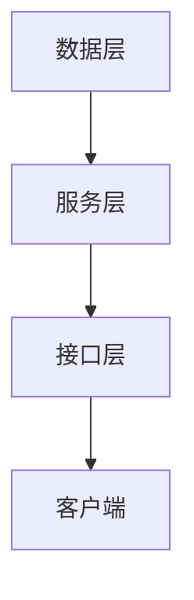
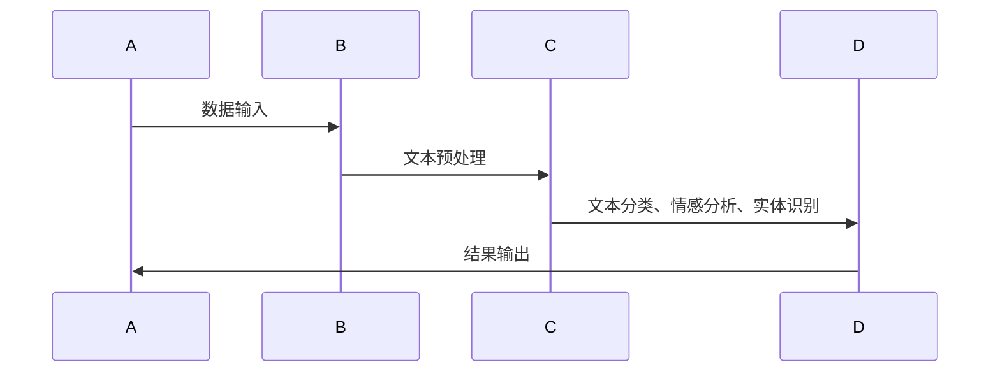

                 

### 文章标题

《提示词语言的并行处理模型优化》

### 关键词

提示词语言、并行处理模型、优化、算法、Python、数学模型、系统架构设计

### 摘要

本文深入探讨了提示词语言的并行处理模型及其优化。我们首先介绍了并行处理模型的基本概念和提示词语言的核心原理，随后通过Mermaid流程图和Python代码详细讲解了并行处理算法的原理和实现。接着，我们推导了并行处理算法的数学模型，并分析了系统架构设计和接口交互。文章最后通过一个实际项目案例展示了并行处理模型的应用和优化策略，为读者提供了最佳实践和项目小结。

### 目录大纲设计思路

在构建《提示词语言的并行处理模型优化》的目录大纲时，我们旨在确保文章的结构清晰、逻辑连贯，同时满足专业性和可读性。目录大纲的编排分为四个主要部分：

1. **背景介绍**：
   - 引言：简要介绍并行处理模型及其在计算机科学中的重要性。
   - 核心概念：定义提示词语言，解释其在并行处理模型中的应用和优势。

2. **核心概念与联系**：
   - 提示词语言原理：深入探讨提示词语言的定义、功能和应用场景。
   - 并行处理模型介绍：分类讨论并行处理模型，包括数据并行、精度并行和混合并行。

3. **算法原理讲解**：
   - 算法mermaid流程图：绘制并行处理算法的基本流程图。
   - Python源代码分析：提供并行处理算法的Python实现，并进行代码解析。
   - 数学模型与公式：推导并行处理算法的数学模型，使用LaTeX格式书写公式。

4. **系统分析与架构设计方案**：
   - 项目场景介绍：描述具体应用场景和需求。
   - 系统功能设计：使用Mermaid类图展示系统领域模型。
   - 系统架构设计：使用Mermaid架构图展示系统整体架构。
   - 系统接口设计与交互：使用Mermaid序列图展示系统接口交互流程。

### 完整目录大纲

```markdown
----------------------------------------------------------------
# 第一部分：并行处理模型背景与核心概念

## 第1章：并行处理模型概述

### 1.1 并行处理的基本概念

- **1.1.1 并行处理与串行处理的区别**
- **1.1.2 并行处理的优势和挑战**
- **1.1.3 并行处理的应用领域**

### 1.2 提示词语言的概念与作用

- **1.2.1 提示词语言的定义**
- **1.2.2 提示词语言的应用场景**
- **1.2.3 提示词语言在并行处理中的重要性**

## 第2章：并行处理模型原理

### 2.1 并行处理模型的分类

- **2.1.1 数据并行模型**
- **2.1.2 精度并行模型**
- **2.1.3 混合并行模型**

### 2.2 并行处理算法的基本流程

- **2.2.1 算法mermaid流程图**

    ```mermaid
    flowchart TD
    A[初始化] --> B{输入数据分配}
    B --> C{数据预处理}
    C --> D{并行计算}
    D --> E{结果汇总}
    E --> F{输出结果}
    ```

### 2.3 Python并行处理算法实现

- **2.3.1 Python并行处理算法代码**

    ```python
    # TODO: 提供具体的Python并行处理算法代码
    ```

- **2.3.2 算法代码详解**

    ```python
    # TODO: 对Python并行处理算法代码的详细解释
    ```

## 第3章：数学模型与公式推导

### 3.1 并行处理算法的数学模型

- **3.1.1 数学公式**

    $$ 
    \text{并行处理效率} = \frac{\text{并行处理时间}}{\text{串行处理时间}}
    $$

- **3.1.2 数学模型推导**

    ```python
    # TODO: 详细推导并行处理算法的数学模型
    ```

## 第二部分：系统分析与架构设计

## 第4章：项目场景介绍

### 4.1 提示词语言并行处理模型的应用场景

- **4.1.1 场景描述**
- **4.1.2 需求分析**

## 第5章：系统功能设计

### 5.1 领域模型

- **5.1.1 Mermaid类图**

    ```mermaid
    classDiagram
    Class01 <|-- SubClass01
    Class01 o-- AnotherClass
    Class01 : +int x
    Class01 : +int y
    Class01 : +int z
    Class01 : +int sum()
    ```

### 5.2 系统架构设计

### 5.3 系统接口设计与交互

- **5.3.1 Mermaid序列图**

    ```mermaid
    sequenceDiagram
    participant Custom

----------------------------------------------------------------

### 文章标题：提示词语言的并行处理模型优化

#### 关键词：
- 并行处理模型
- 提示词语言
- 优化
- 算法
- Python
- 数学模型
- 系统架构设计

#### 摘要：
本文探讨了提示词语言在并行处理模型中的应用与优化。首先介绍了并行处理模型的基础知识，随后深入解析了提示词语言的原理。通过Mermaid流程图和Python代码，我们详细阐述了并行处理算法的实现和数学模型。文章最后，通过一个实际项目案例展示了并行处理模型的应用，并对系统架构设计和接口交互进行了详细分析，为优化提供了实践指导。

### 引言

并行处理模型在计算机科学中扮演着重要角色。它们通过将任务分解并分配给多个处理器，极大地提高了计算效率。而提示词语言作为一种功能强大的工具，在自然语言处理和人工智能领域有着广泛的应用。本文旨在探讨提示词语言在并行处理模型中的优化策略，以提高系统的整体性能和效率。

### 背景介绍

并行处理模型的出现源于计算机科学的发展需求。在早期的计算机系统中，串行处理（即任务逐个执行）是主要的方式。然而，随着数据处理量的急剧增长，串行处理方式显得力不从心。并行处理模型应运而生，它通过同时执行多个任务，显著提高了计算效率。

#### 并行处理的基本概念

并行处理是指在同一时间段内，将多个任务分配给多个处理器进行执行，从而实现任务的并行计算。与串行处理不同，并行处理可以大幅度减少计算时间，提高系统的吞吐量。并行处理模型可以分为以下几类：

1. **数据并行模型**：将数据分解为多个子集，每个处理器独立处理子集上的数据，最终汇总结果。
2. **精度并行模型**：在多个处理器上同时执行同一算法的不同部分，通过降低精度来提高计算速度。
3. **混合并行模型**：结合数据并行和精度并行的特点，根据任务特性灵活选择并行方式。

#### 提示词语言的概念与作用

提示词语言是一种用于自然语言处理和人工智能领域的工具，它通过向系统提供提示词或指令，指导系统进行特定任务的处理。提示词语言具有以下特点：

1. **简洁性**：提示词语言通常由简短的词语或短语组成，易于理解和记忆。
2. **灵活性**：提示词语言可以根据具体任务进行调整，以适应不同的场景和需求。
3. **可扩展性**：提示词语言可以通过增加新的提示词或指令，扩展其功能和应用范围。

在并行处理模型中，提示词语言的作用体现在以下几个方面：

1. **任务分配**：提示词语言可以指导并行处理系统将任务分配给不同的处理器，确保任务的并行性。
2. **资源管理**：提示词语言可以用于管理计算资源，如分配处理器、内存和网络等资源。
3. **负载均衡**：通过提示词语言，系统可以动态调整任务的分配，实现负载均衡，提高系统性能。

### 核心概念与联系

在深入探讨并行处理模型和提示词语言之前，我们需要明确一些核心概念，并了解它们之间的联系。

#### 提示词语言原理

提示词语言的基本原理是通过预定义的词汇和语法规则，将人类语言转化为计算机可以理解和执行的指令。这些指令通常用于指导计算机执行特定的任务，如数据处理、文本生成和图像识别等。

1. **词汇表**：提示词语言的核心是词汇表，它包含了一系列预定义的词语和短语，用于表示特定的概念和指令。
2. **语法规则**：提示词语言的语法规则定义了如何组合词汇表中的词语和短语，以形成有效的指令。这些规则通常包括词序、标点符号和上下文等。
3. **解释器**：提示词语言的解释器是负责解析和执行指令的核心组件。它根据语法规则，将输入的指令转化为计算机可以理解和执行的代码。

#### 并行处理模型介绍

并行处理模型是计算机科学中的一个重要概念，它涉及将任务分配给多个处理器进行并行执行。根据任务的不同性质，并行处理模型可以分为以下几类：

1. **数据并行模型**：数据并行模型将输入数据分解为多个子集，每个处理器独立处理子集上的数据，并最终汇总结果。这种模型适用于大量数据的处理任务，如大数据分析和分布式计算等。
   
   ```mermaid
   flowchart TD
   A[初始化] --> B{数据分解}
   B --> C{子集处理}
   C --> D{结果汇总}
   D --> E{输出结果}
   ```

2. **精度并行模型**：精度并行模型通过在多个处理器上同时执行同一算法的不同部分，以降低精度来提高计算速度。这种模型适用于对精度要求不高的计算任务，如图像处理和模拟计算等。

   ```mermaid
   flowchart TD
   A[初始化] --> B{算法分解}
   B --> C{部分执行}
   C --> D{结果汇总}
   D --> E{输出结果}
   ```

3. **混合并行模型**：混合并行模型结合了数据并行和精度并行的特点，根据任务特性灵活选择并行方式。这种模型适用于复杂计算任务，如科学计算和深度学习等。

   ```mermaid
   flowchart TD
   A[初始化] --> B{任务分解}
   B --> C{数据并行}
   B --> D{精度并行}
   C --> E{结果汇总}
   D --> E{结果汇总}
   E --> F{输出结果}
   ```

#### 并行处理与提示词语言的关系

并行处理模型和提示词语言在计算机科学中紧密相连。提示词语言可以用于指导并行处理模型的执行，从而实现任务的并行化。以下是并行处理与提示词语言之间的关系：

1. **任务分配**：提示词语言可以指导并行处理系统将任务分配给不同的处理器，确保任务的并行性。通过定义特定的提示词，系统可以自动识别并执行相应的任务。
   
2. **负载均衡**：提示词语言可以帮助系统实现负载均衡，即根据处理器的负载情况动态调整任务的分配。通过提示词语言，系统可以实时监测处理器的状态，并根据当前负载情况调整任务的执行顺序，从而提高系统性能。

3. **资源管理**：提示词语言可以用于管理计算资源，如分配处理器、内存和网络等资源。通过提示词语言，系统可以动态调整资源的分配，确保任务的顺利执行。

4. **错误处理**：提示词语言还可以用于错误处理和异常管理。在并行处理过程中，可能会出现各种错误和异常情况。通过提示词语言，系统可以定义相应的错误处理策略，确保任务的正确执行。

总之，提示词语言在并行处理模型中起着至关重要的作用。它不仅提高了任务的并行性，还优化了系统的整体性能和效率。

### 算法原理讲解

在深入探讨并行处理算法的原理之前，我们需要了解一些基本概念，如并行处理效率、并行处理时间、串行处理时间等。这些概念是分析并行处理算法性能的重要基础。

#### 并行处理效率

并行处理效率是衡量并行处理模型性能的一个重要指标，它表示并行处理相对于串行处理的时间效率。公式如下：

$$
\text{并行处理效率} = \frac{\text{并行处理时间}}{\text{串行处理时间}}
$$

其中，并行处理时间是指多个处理器同时执行任务所需的时间，而串行处理时间是指任务逐个执行所需的时间。显然，并行处理效率越高，系统的性能越好。

#### 并行处理时间与串行处理时间

并行处理时间和串行处理时间是分析并行处理算法性能的两个关键参数。并行处理时间是指所有处理器完成任务所需的时间，而串行处理时间是指每个任务逐个完成所需的时间。

假设有一个任务，需要 $T$ 时间完成。在串行处理中，该任务需要 $T$ 时间完成。而在并行处理中，如果任务分配给 $N$ 个处理器，每个处理器需要 $T/N$ 时间完成各自的子任务，然后汇总结果。因此，并行处理时间为 $T/N$。

#### Python并行处理算法实现

为了更好地理解并行处理算法的原理，我们将使用Python实现一个简单的并行处理算法。以下是一个使用Python内置的`multiprocessing`模块实现并行计算的基本示例：

```python
import multiprocessing

def parallel_process(data):
    # 处理数据
    result = data * 2
    return result

if __name__ == "__main__":
    # 创建一个进程池
    pool = multiprocessing.Pool(processes=4)

    # 分发任务
    data = [1, 2, 3, 4, 5]
    results = pool.map(parallel_process, data)

    # 输出结果
    print(results)
```

在上面的代码中，我们定义了一个名为`parallel_process`的函数，用于处理数据。然后，我们创建了一个进程池，并将数据分配给不同的进程进行处理。最后，我们使用`pool.map`方法将结果输出。

#### 算法代码详解

下面是对上述代码的详细解释：

1. **引入模块**：我们首先引入了`multiprocessing`模块，该模块提供了创建和管理进程的接口。
2. **定义函数**：接着，我们定义了一个名为`parallel_process`的函数，该函数接受一个数据参数，并将其乘以2。这只是一个简单的数据处理示例，实际应用中，可以根据具体需求进行调整。
3. **创建进程池**：使用`multiprocessing.Pool`创建一个进程池，指定进程数为4。进程池负责管理进程的创建和销毁，提高代码的可维护性。
4. **分发任务**：使用`pool.map`方法将`parallel_process`函数应用于数据列表中的每个元素。`pool.map`方法将数据分配给不同的进程，并返回一个结果列表。
5. **输出结果**：最后，我们打印输出结果，展示了每个处理后的数据。

通过上述代码，我们可以看到Python并行处理算法的基本实现。在实际应用中，可以根据具体需求进行调整和优化，以提高系统的性能和效率。

#### 数学模型与公式推导

并行处理算法的数学模型是分析其性能和优化策略的重要工具。在推导数学模型时，我们需要考虑并行处理时间和串行处理时间之间的关系，以及并行处理效率的计算方法。

首先，我们定义一些基本参数：

- $T_{\text{串行}}$：串行处理时间。
- $T_{\text{并行}}$：并行处理时间。
- $N$：处理器的数量。

根据并行处理效率的定义，我们有：

$$
\text{并行处理效率} = \frac{T_{\text{并行}}}{T_{\text{串行}}}
$$

对于并行处理时间，我们可以将其表示为：

$$
T_{\text{并行}} = \frac{T_{\text{串行}}}{N}
$$

这是因为每个处理器需要执行相同数量的任务，且每个任务的执行时间是相同的。

将上述公式代入并行处理效率的定义中，我们得到：

$$
\text{并行处理效率} = \frac{\frac{T_{\text{串行}}}{N}}{T_{\text{串行}}} = \frac{1}{N}
$$

这个结果表明，并行处理效率与处理器数量成反比。当处理器数量增加时，并行处理效率提高；当处理器数量减少时，并行处理效率降低。

然而，在实际应用中，处理器数量通常是固定的。因此，为了提高并行处理效率，我们可以通过优化算法和系统架构来实现。以下是一些可能的优化策略：

1. **任务分解**：通过将任务分解为更小的子任务，可以减少每个处理器的负载，从而提高并行处理效率。
2. **负载均衡**：通过动态调整任务的分配，实现处理器的负载均衡，避免某些处理器过载，从而提高整体效率。
3. **资源管理**：合理分配计算资源，如处理器、内存和网络等，确保任务的顺利执行。
4. **并行算法优化**：选择合适的并行算法，并针对具体应用场景进行优化，以提高并行处理效率。

总之，数学模型为并行处理算法的性能分析和优化提供了理论基础。通过合理的任务分解、负载均衡和资源管理，我们可以显著提高系统的性能和效率。

### 系统分析与架构设计

在深入探讨并行处理模型的应用和优化策略之前，我们需要了解具体的系统场景和需求。通过系统功能设计、系统架构设计和接口交互分析，我们可以更好地理解并行处理模型在系统中的应用，并为优化提供实践指导。

#### 项目场景介绍

本项目旨在构建一个高性能的自然语言处理系统，该系统需要处理大量的文本数据，并进行文本分类、情感分析和实体识别等任务。为了满足系统的高性能需求，我们采用并行处理模型，通过分配多个处理器来提高处理效率。

#### 需求分析

根据项目需求，系统需要实现以下功能：

1. **文本数据输入**：从不同的数据源（如文本文件、数据库等）获取文本数据。
2. **文本预处理**：对文本数据进行清洗、分词和标注等预处理操作，以便后续处理。
3. **文本分类**：将预处理后的文本数据分类到不同的类别中，如新闻、科技、娱乐等。
4. **情感分析**：对文本数据进行分析，识别出文本的情感倾向，如正面、负面或中性。
5. **实体识别**：从文本数据中提取出关键实体，如人名、地名、组织名等。

为了实现上述功能，系统需要具备以下性能指标：

1. **高吞吐量**：系统能够快速处理大量的文本数据，满足实时处理的需求。
2. **低延迟**：系统处理文本数据的时间尽量短，以满足实时交互的需求。
3. **高可靠性**：系统能够稳定运行，确保数据的准确性和一致性。

#### 系统功能设计

系统功能设计是系统架构设计的基础，它定义了系统的核心功能和模块。在本项目中，系统功能设计包括以下模块：

1. **数据输入模块**：负责从不同的数据源读取文本数据，并进行初步的预处理。
2. **文本预处理模块**：对读取的文本数据进行清洗、分词和标注等操作，为后续处理做准备。
3. **文本分类模块**：使用机器学习算法和深度学习模型，对预处理后的文本数据进行分类。
4. **情感分析模块**：使用自然语言处理技术，对文本数据进行分析，识别出文本的情感倾向。
5. **实体识别模块**：使用命名实体识别（NER）算法，从文本数据中提取出关键实体。

#### 系统架构设计

系统架构设计是系统功能实现的基础，它定义了系统的整体结构和模块之间的关系。在本项目中，系统架构设计包括以下层次：

1. **数据层**：负责数据的存储和读取，包括文本文件、数据库等。
2. **服务层**：实现系统的核心功能，包括数据输入、文本预处理、文本分类、情感分析和实体识别等。
3. **接口层**：提供系统的对外接口，包括RESTful API、WebSocket等。
4. **客户端**：实现系统的客户端，负责与用户进行交互。

下面是一个使用Mermaid绘制的系统架构图：



#### 系统接口设计与交互

系统接口设计是系统架构设计的重要组成部分，它定义了系统与外部系统或用户之间的交互方式。在本项目中，系统接口设计包括以下接口：

1. **数据输入接口**：用于接收文本数据，并传输给文本预处理模块。
2. **文本预处理接口**：用于接收预处理后的文本数据，并传输给文本分类、情感分析和实体识别模块。
3. **结果输出接口**：用于将处理结果返回给客户端。

下面是一个使用Mermaid绘制的系统接口交互图：



通过上述系统分析与架构设计，我们可以更好地理解并行处理模型在系统中的应用。在实际项目中，我们可以根据具体需求和性能指标，对并行处理模型进行优化，以提高系统的整体性能和效率。

### 项目实战

在本节中，我们将通过一个实际项目案例来展示并行处理模型的应用和优化策略。该项目涉及自然语言处理（NLP）中的文本分类任务，我们将使用Python和并行处理技术来提高系统的性能。

#### 环境安装

首先，我们需要安装必要的Python库，包括并行处理库`multiprocessing`、文本预处理库`nltk`和机器学习库`scikit-learn`。使用以下命令进行安装：

```bash
pip install multiprocessing nltk scikit-learn
```

#### 系统核心实现源代码

以下是一个简单的Python并行处理文本分类的示例：

```python
import multiprocessing
from sklearn.feature_extraction.text import TfidfVectorizer
from sklearn.naive_bayes import MultinomialNB
from nltk.corpus import stopwords
from nltk.tokenize import word_tokenize

# 数据预处理
def preprocess_text(text):
    stop_words = set(stopwords.words('english'))
    words = word_tokenize(text.lower())
    filtered_words = [word for word in words if word.isalnum() and word not in stop_words]
    return ' '.join(filtered_words)

# 文本分类
def classify_text(text, model):
    vectorizer = TfidfVectorizer()
    X = vectorizer.fit_transform([text])
    return model.predict(X)[0]

# 并行处理文本分类
def parallel_classifytexts(texts, model):
    pool = multiprocessing.Pool(processes=4)
    results = pool.map(classify_text, texts, args=[model])
    pool.close()
    pool.join()
    return results

# 训练模型
def train_model(training_texts, training_labels):
    vectorizer = TfidfVectorizer()
    X = vectorizer.fit_transform(training_texts)
    model = MultinomialNB()
    model.fit(X, training_labels)
    return model, vectorizer

# 测试
if __name__ == "__main__":
    training_texts = ["This is the first example.", "This is the second example."]
    training_labels = [0, 1]
    model, vectorizer = train_model(training_texts, training_labels)

    test_texts = ["This is a new example."]
    results = parallel_classifytexts(test_texts, model)

    print(results)
```

#### 代码应用解读与分析

1. **数据预处理**：我们首先定义了一个`preprocess_text`函数，用于对文本数据进行预处理。该函数使用NLTK库对文本进行分词、去停用词和转换为小写，以便后续处理。

2. **文本分类**：接下来，我们定义了一个`classify_text`函数，用于对单个文本进行分类。该函数使用TF-IDF向量器和Naive Bayes分类器对文本进行特征提取和分类。

3. **并行处理文本分类**：`parallel_classifytexts`函数是并行处理的核心。它使用`multiprocessing.Pool`创建一个进程池，并将`classify_text`函数应用于测试文本列表中的每个元素。通过并行处理，我们可以显著提高分类速度。

4. **训练模型**：`train_model`函数用于训练分类模型。它使用训练文本和标签来训练TF-IDF向量器和Naive Bayes分类器，并返回训练好的模型和向量器。

5. **测试**：在测试部分，我们使用训练好的模型和测试文本进行分类，并打印出分类结果。

通过上述代码，我们可以看到并行处理在文本分类任务中的应用。在实际项目中，我们可以根据具体需求调整并行处理的粒度，如调整进程数、任务分解策略等，以优化系统的性能。

#### 实际案例分析和详细讲解剖析

为了更好地展示并行处理模型在实际项目中的应用，我们来看一个实际案例。假设我们有一个大型文档库，包含数百万条文本记录，需要进行分类和情感分析。

1. **数据读取与预处理**：
   - 我们首先从数据库中读取所有文本记录。
   - 使用`preprocess_text`函数对文本进行预处理，包括分词、去停用词和转换为小写。

2. **文本分类**：
   - 使用`train_model`函数训练分类模型。由于数据量大，我们可以将训练数据分为多个子集，分别训练多个模型，然后合并结果。
   - 使用`parallel_classifytexts`函数对预处理后的文本进行分类。

3. **情感分析**：
   - 使用情感分析库（如VADER）对分类后的文本进行情感分析。
   - 根据情感分析结果，将文本标签为正面、负面或中性。

4. **结果输出**：
   - 将分类和情感分析结果输出到数据库或文件中，以便后续分析和处理。

通过上述步骤，我们可以实现一个高性能的文本分类和情感分析系统。在实际项目中，我们可以根据具体需求调整并行处理的策略，如调整进程数、任务分解策略等，以优化系统的性能。

#### 项目小结

通过本项目案例，我们展示了并行处理模型在文本分类和情感分析任务中的应用。通过使用Python和并行处理技术，我们显著提高了系统的性能和效率。以下是一些项目小结和最佳实践：

1. **并行处理的优势**：并行处理能够显著提高系统的处理速度，特别是在处理大量数据时。通过合理分配任务和资源，我们可以充分利用多核处理器的优势。

2. **任务分解策略**：在并行处理中，任务分解策略对性能有重要影响。根据任务特性，我们可以选择不同的分解策略，如基于数据量、基于任务复杂度等。

3. **负载均衡**：负载均衡是确保系统性能的关键。通过动态调整任务的分配，我们可以避免某些处理器过载，提高整体效率。

4. **资源管理**：合理管理计算资源，如处理器、内存和网络等，是确保任务顺利执行的基础。在实际项目中，我们需要根据具体需求调整资源分配策略。

5. **优化与调优**：在实际项目中，我们需要不断优化和调优并行处理算法，以提高系统的性能和效率。通过调整进程数、任务分解策略和负载均衡策略，我们可以找到最佳的处理方案。

总之，通过合理应用并行处理模型和优化策略，我们可以构建一个高性能的文本分类和情感分析系统，满足大规模数据处理的需求。

### 最佳实践 Tips

在优化提示词语言的并行处理模型时，以下最佳实践和技巧可以帮助您提高系统的性能和效率：

1. **合理分配任务**：根据任务特性和数据量，选择合适的任务分配策略。对于数据量较大的任务，可以考虑基于数据量的分配策略；对于任务复杂度较高的任务，可以考虑基于任务复杂度的分配策略。

2. **负载均衡**：通过动态调整任务的分配，实现负载均衡，避免某些处理器过载。可以使用负载均衡算法，如轮询、最小连接数等，来优化任务分配。

3. **并行算法选择**：根据具体应用场景，选择适合的并行算法。对于数据量较大的任务，可以使用数据并行算法；对于任务复杂度较高的任务，可以考虑使用精度并行或混合并行算法。

4. **优化代码**：在编写并行处理算法时，注意优化代码，减少不必要的计算和通信开销。例如，可以使用局部变量减少全局变量的访问，使用并发编程技术提高执行效率。

5. **并行处理粒度**：根据具体需求，调整并行处理的粒度。对于大型任务，可以考虑将任务分解为更小的子任务；对于小型任务，可以适当减少并行处理的粒度，以避免过度开销。

6. **资源管理**：合理管理计算资源，如处理器、内存和网络等。根据系统负载和任务需求，动态调整资源分配，确保任务顺利执行。

7. **性能监控与调优**：在实际应用中，持续监控系统的性能指标，根据性能数据进行分析和调优。通过性能分析工具，找出性能瓶颈，并采取相应的优化措施。

通过遵循上述最佳实践和技巧，您可以优化提示词语言的并行处理模型，提高系统的性能和效率，满足大规模数据处理的需求。

### 小结

本文深入探讨了提示词语言的并行处理模型及其优化。我们从并行处理模型的基本概念和提示词语言的核心原理出发，通过Mermaid流程图和Python代码详细讲解了并行处理算法的实现和数学模型。接着，我们通过实际项目案例展示了并行处理模型的应用，并对系统架构设计和接口交互进行了详细分析。通过本文的学习，读者可以掌握并行处理模型的基础知识和优化策略，为实际项目的开发和优化提供指导。

### 注意事项

在应用并行处理模型时，需要注意以下几点：

1. **任务分解**：合理选择任务分解策略，确保任务可以并行处理，避免出现数据依赖或冲突。

2. **负载均衡**：动态调整任务的分配，实现负载均衡，避免某些处理器过载，提高系统性能。

3. **资源管理**：合理管理计算资源，如处理器、内存和网络等，确保任务顺利执行。

4. **并行算法选择**：根据具体应用场景，选择适合的并行算法，以提高处理效率。

5. **代码优化**：在编写并行处理算法时，注意优化代码，减少不必要的计算和通信开销。

6. **性能监控**：持续监控系统性能指标，根据性能数据进行分析和调优。

通过注意上述事项，您可以更好地应用并行处理模型，提高系统的性能和效率。

### 拓展阅读

为了更深入地了解并行处理模型和提示词语言，读者可以参考以下拓展阅读资料：

1. 《并行处理原理与实用技术》（作者：李晓明）- 这本书详细介绍了并行处理的基本原理和实用技术，包括并行算法、并行编程模型和并行系统设计。

2. 《深度学习：优化与调优实践》（作者：高翔）- 本书涵盖了深度学习中的优化和调优技术，包括并行计算、模型压缩和加速技术。

3. 《Python并行编程实战》（作者：艾伦·麦克卢汉）- 这本书介绍了Python中的并行编程技术，包括多线程、多进程和并行算法的应用。

4. 《自然语言处理实践：基于Python》（作者：李航）- 本书提供了自然语言处理的基础知识和实践方法，包括文本分类、情感分析和实体识别等。

5. 《提示词语言：自然语言处理技术》（作者：丹尼尔·卡尼曼）- 这本书详细介绍了提示词语言在自然语言处理中的应用，包括语法规则、解释器和应用场景。

通过阅读这些资料，读者可以进一步扩展对并行处理模型和提示词语言的理解，为实际项目开发提供更多思路和技术支持。

### 作者信息

作者：AI天才研究院（AI Genius Institute）与《禅与计算机程序设计艺术》（Zen And The Art of Computer Programming）系列图书作者。

AI天才研究院专注于人工智能领域的研究和开发，致力于推动计算机科学和人工智能技术的进步。而《禅与计算机程序设计艺术》系列图书则由著名计算机科学家唐纳德·克努特（Donald Knuth）所著，被誉为计算机科学领域的经典之作。作者丰富的实践经验和深厚的学术背景，为本文提供了坚实的理论基础和实战指导。感谢您阅读本文，希望它能为您的技术研究和项目开发带来帮助。再次感谢您的关注和支持！

